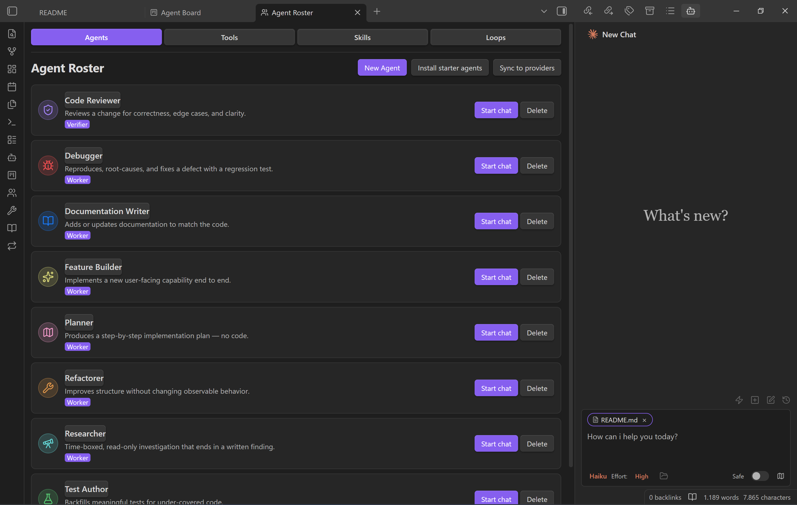

# Specorator

> Plan the work, run it, review what came back, keep the record. All in your vault.

You're already using AI for serious work. Drafting emails. Planning trips. Comparing options. Reading the long report you don't want to read yourself. The conversations help, but the moment you close the tab, the work is gone. Tomorrow you start again from scratch.

**Specorator** brings that work inside your Obsidian vault. The drafts, plans, summaries, and edits land in notes you keep. Conversations are saved too, so you can pick one up tomorrow instead of starting fresh. It runs real provider-native agents — Claude Code, Codex, Opencode, Cursor Agent — with your vault as their working directory: file read/write, search, bash, and multi-step workflows all work out of the box.

## What it solves

- Typing the same prompts every day. Save any prompt as a vault note and fire it from a one-tap picker.
- Being locked into one tool's UI for one provider. Use whichever providers you have access to, in one workspace.
- AI work scattering across thirty open tabs. A board tracks every handoff from inbox to done.
- The agent quietly changing your notes. Preview every edit before it lands, or flip on YOLO mode when you trust the run.

## What's inside

| Feature | What it is |
| --- | --- |
| [Co-Worker — Chat](docs/product/features/Co-Worker%20-%20Chat.md) | A workspace beside your notes that already knows what you're looking at and what you've highlighted. |
| [Multi Provider Support](docs/product/features/Multi%20Provider%20Support.md) | Different engines for different jobs. Pick the one that fits the moment. |
| [Quick Actions](docs/product/features/Quick%20Actions.md) | Your most-used prompts, one tap away. Stored as vault notes you own. |
| [Agent Kanban Board](docs/product/features/Agent%20Kanban%20Board.md) | A board for things you have handed off. Inbox to done, never lost in chat history. |

Start in chat for fast foreground work, then move durable handoffs to the board when they need priority, acceptance criteria, background-style running, or review.

Everyday surfaces:

- **Inline Edit** — Select text or start at the cursor + hotkey to edit directly in notes with word-level diff preview.
- **Slash Commands & Skills** — Type `/` or `$` for reusable prompt templates or Skills from user- and vault-level scopes.
- **`@mention`** — Type `@` to mention vault files, subagents, MCP servers, or files in external directories.
- **Plan Mode** — Toggle via `Shift+Tab`. The agent explores and designs before implementing, then presents a plan for approval.
- **Instruction Mode (`#`)** — Refined custom instructions added from the chat input.
- **MCP Servers** — Connect external tools via Model Context Protocol (stdio, SSE, HTTP).
- **Multi-Tab & Conversations** — Multiple chat tabs, conversation history, fork, resume, and compact.

## What this is not

- Not a code-only tool. The plugin is for anyone who works in notes — writers, planners, researchers, students, small-business owners, anyone keeping track of thinking in their vault.
- Not a hosted service. Your notes live on your computer. No account is required.
- Not a single-provider lock-in. Use whichever providers you have access to. If you only have one, that is fine.
- Not magic. You decide the level of oversight. Preview every change before you accept it, or flip on YOLO mode and let the agent run on its own.
- If you leave Specorator, your notes are still ordinary Markdown.

## Requirements

- **Claude provider**: [Claude Code CLI](https://code.claude.com/docs/en/overview) installed (native install recommended). Claude subscription/API or a compatible provider.
- **Optional providers**: [Codex CLI](https://github.com/openai/codex), [Opencode](https://opencode.ai/), [Cursor Agent CLI](https://docs.cursor.com/en/cli/overview).
- Obsidian v1.11.5+
- Desktop only (macOS, Linux, Windows)

## Install

Specorator is available in the official Obsidian community plugin directory:

1. In Obsidian, open **Settings → Community plugins → Browse**.
2. Search for **Specorator** and click **Install**.
3. Enable Specorator under **Settings → Community plugins**.

Or open it directly in the directory: [Specorator on obsidian.md/plugins](https://obsidian.md/plugins?id=specorator).

Prefer pre-release builds? The [Beta Reviewers Auto-update Tool (BRAT)](https://github.com/TfTHacker/obsidian42-brat) still works: **Add Beta Plugin** → `Luis85/specorator`. If you previously installed via BRAT, switching to the community-plugin install keeps your settings — they live in your vault, not in the plugin folder.

Already installed? Open **Settings → Specorator** to point it at the providers you have, then open the chat sidebar from the ribbon or the command palette.

## Privacy, network use, and data handling

Specorator is a local plugin with **no telemetry and no analytics** — it never
collects usage data or phones home. What leaves your machine is only what you
send to the AI provider you choose, and only when you send it.

- **Remote services.** When you run a turn, the prompt plus any context you
  attach (selected text, mentioned files, images) is sent to the provider that
  powers that conversation: **Anthropic** (Claude), **OpenAI** (Codex),
  **Cursor**, or **Opencode**. If you configure MCP servers, the data you route
  to them is sent to those endpoints too. Review each provider's own privacy
  policy and terms — your usage is governed by them. No provider is contacted
  until you trigger a turn against it.
- **No account with us.** Specorator has no backend and no Specorator account.
  Provider authentication is handled by each provider's own CLI/credentials.
- **Credentials.** Provider API keys, MCP auth headers, and MCP env vars are
  stored in your OS keychain via Obsidian `SecretStorage`, not in plain-text
  vault config files. (This is why `minAppVersion` is 1.11.5.)
- **Filesystem access beyond the vault.** Specorator reads provider transcript
  directories outside your vault — `~/.claude/`, `~/.codex/`, and `~/.cursor/` —
  to hydrate conversation history. The agents it runs use your vault as their
  working directory, but because they are real provider-native CLIs they can
  read, write, and execute anywhere your user account can. See **Security
  model** below.

## Security model

Specorator runs **real provider-native agent CLIs** as subprocesses, which means
the agent can edit files and run shell commands. Treat it with the same caution
you would the underlying CLI in a terminal.

- **Preview before apply (default).** File writes and edits surface a word-level
  diff you approve before anything lands in your notes.
- **YOLO mode is opt-in.** Turning it on lets a run apply edits and run tools
  without per-step approval. Only enable it for runs you trust.
- **Scoped subprocess environment.** Child processes receive an allowlisted
  environment, not your full shell environment, so host secrets are not leaked
  wholesale into spawned CLIs.
- **External binaries required.** Specorator does not bundle the agents; it
  drives the CLIs you install yourself (see Requirements). It contains no
  auto-update mechanism — updates come through Obsidian.

## Where it's heading

**Specorator v1.0.0** is today's feature set — Chat, Multi-Provider, Quick Actions, Agent Board — shipped as a standalone plugin. The post-1.0 roadmap layers an agent harness on top: terminal-free setup, one-click revert, a vault-aware assistant, and tap-to-configure workflows. The plan is the [Specorator Agent Harness PRD](docs/product/Specorator%20Agent%20Harness%20PRD.md).

## Origins

Specorator combines two project lines: an evolved provider-native agent plugin that began as a fork of the original Claudian Obsidian plugin by Yishen Tu, and earlier Specorator work around spec-driven Obsidian workflows. See [CREDITS.md](CREDITS.md) for the full provenance and acknowledgements.
