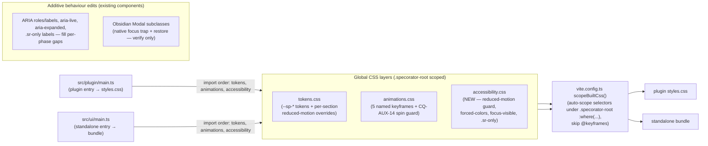

# Design — Accessibility (P12, final phase) — Parts A/B/C

> **Scope of this document.** P12 is a CSS-layer + behaviour-polish phase. There is **no new flow,
> no new screen, no new component, no new port, and no new ADR** (see Part C §C.6 for the explicit
> verdict). This is a deliberately **light** design: it inventories the `accessibility.css` rule
> groups, the per-surface behaviour fixes, and the additivity/coverage split that Stage 5 turns into
> implementation-ready SPEC items.

## CLAR resolution (design-stage confirmation)

**CLAR-AY-001 (reference file).** The actual claudian reference was read directly this stage at
`D:\Projects\claudian-main\src\style\accessibility.css`. It confirms the audit's characterisation
exactly: the file is **minimal — focus-visible outline rings only**, 41 lines, three selector
groups, no media queries. Verbatim shape:

- **Group 1 (`outline + offset + border-radius`):** tool/thinking/subagent/model headers + header
  buttons + `thinking-current` → `outline: 2px solid var(--interactive-accent); outline-offset: 2px;
  border-radius: 4px;`
- **Group 2 (`outline + offset only`):** action buttons, toggle switch, file/image chips + their
  remove buttons, the image-modal close, approved-remove, save-env, snippet restore/edit/delete,
  cancel/save, code-lang label → `outline: 2px solid var(--interactive-accent); outline-offset: 2px;`
- **Group 3 (`negative offset`):** `history-item-content` → `outline-offset: -2px; border-radius: 4px;`

There is **no** `prefers-reduced-motion`, **no** `forced-colors`, and **no** `.sr-only` in the
claudian layer. So the "meet" leg is the focus-visible ring (REQ-AY-007); everything else
(REQ-AY-003..006, 009, 010) is a genuine **beat**. Our layer must therefore reproduce the
focus-visible ring across the equivalent `--sp-*` surfaces (claudian's `.claudian-*` selectors map
to our `:focus-visible` ring on every interactive `--sp-*` control) **and add** the three rule
groups claudian lacks.

**CLAR-AY-002 (reduced-motion strategy).** Confirmed: `accessibility.css` **complements**, does not
replace, the existing token overrides. `tokens.css` already zeroes `--sp-duration-*` and the
per-section pulse/spin/dropdown duration tokens under `prefers-reduced-motion`; `animations.css`
already halts `spin` (CQ-AUX-14). `accessibility.css` adds a single **global safety-net guard**
scoped to `.specorator-root` that collapses any remaining animation/transition the per-section
overrides did not reach, and re-asserts the explicit `spin` halt. The existing token overrides stay
in place (no double-define conflict — the guard sets `none`/`0s`, which is idempotent with the token
collapse).

---

# Part A — UX (the accessibility experience)

P12 adds no flow. It guarantees the existing P0–P11 flows are operable and perceivable under five
assistive conditions. Each condition below is the user-felt outcome, not a mechanism.

| Condition | What the user experiences after P12 | Driving REQ |
|---|---|---|
| **Reduced motion** (`prefers-reduced-motion: reduce`) | The thinking pulse, streaming cursor blink, title/inline/instruction spinners, MCP + external-context glows, dropdown open transitions, toggle-knob slides, tab border-colour fades, and usage-meter fills all stop. Nothing loops or slides; state is conveyed by the static end-state instead. | REQ-AY-003, REQ-AY-004 |
| **Forced colors / Windows HCM** (`forced-colors: active`) | Every surface stays legible when the OS replaces the palette: text/background resolve to system colours (`CanvasText`/`Canvas`), focus + selected states resolve to `Highlight`, and every control that normally signals state with a background-fill-only cue (toggles, pills, chips, tabs, selected dropdown options) gains a visible border so it is distinguishable. No surface goes invisible. | REQ-AY-005, REQ-AY-006 |
| **Keyboard focus** (`:focus-visible`) | Every interactive control — buttons, toggles, tab badges, dropdown options, chips, the composer textarea, collapsible headers, modal controls — shows a clear focus ring when reached by keyboard, and **does not** show a stray ring on mouse click (`:focus-visible`, not `:focus`). Focus order is sensible; no surface is a keyboard trap. | REQ-AY-007, REQ-AY-008 |
| **Screen reader** | Icon-only controls carry an accessible name (visible label, `aria-label`, or `.sr-only`); streaming assistant output and non-blocking notices are announced via a polite live region without stealing focus (errors assertive); collapsible regions announce open/closed via `aria-expanded`. | REQ-AY-008, REQ-AY-009, REQ-AY-010, REQ-AY-011 |
| **Modal focus** | Opening any Specorator modal (ProviderConsent / DeleteConfirm / ForkTarget / InstructionConfirm / InlineEdit / ImagePreview / McpServer / McpTest) traps Tab/Shift+Tab within the modal; closing it (accept / reject / Esc / overlay) returns focus to the control that opened it. | REQ-AY-012, REQ-AY-013 |

**Mouse users and the existing look are unchanged (REQ-AY-014).** Every rule above is gated behind a
media query, a `:focus-visible` state, an `.sr-only` class, or an additive ARIA attribute. With no
a11y condition active and no `.sr-only` applied, the default render is byte-for-byte the `next`
baseline. This is the cardinal P12 constraint, restated as a UX promise: **the a11y layer only
adds.**

---

# Part B — UI (the rule-group inventory + the behaviour-fix list)

## B.1 — `src/ui/styles/accessibility.css` rule-group inventory

The stylesheet is the third global layer. Authoring rules (lightningcss-safe, ASCII-only comments,
no hex / no raw Obsidian var outside the documented `forced-colors` exception):

- Selectors are authored **prefixed with `.specorator-root`** (or rely on the build's `scopeBuiltCss()`
  auto-scoping — see Part C §C.2). `@keyframes` are never targeted (the build skips them); the guard
  targets the **consumers** (elements running animations/transitions), not the keyframe definitions.
- Comments use ASCII markers only (`/* section B.x - ... */`), no em-dash/non-ASCII, so the standalone
  lightningcss minifier accepts them (NFR-AY-005, the established §4.x convention in tokens.css).

| # | Rule group | Selector / at-rule shape | What it does | REQ |
|---|---|---|---|---|
| **B.1.1** | Reduced-motion global guard | `@media (prefers-reduced-motion: reduce) { .specorator-root *, .specorator-root *::before, .specorator-root *::after { animation-duration: 0.001ms !important; animation-iteration-count: 1 !important; transition-duration: 0.001ms !important; scroll-behavior: auto !important; } }` | Safety-net: collapses every animation/transition the per-section token overrides did not reach. Complements (does not replace) the tokens.css per-section collapse (CLAR-AY-002). | REQ-AY-003 |
| **B.1.2** | Reduced-motion spin halt | `@media (prefers-reduced-motion: reduce) { .specorator-root [data-animation="spin"], .specorator-root .sp-spin { animation: none !important; } }` | Re-asserts the CQ-AUX-14 explicit `spin` halt — an indeterminate loop is not stopped by a near-zero duration alone. Consolidated here so the guard owns the rule (animations.css keeps its copy; idempotent). | REQ-AY-004 |
| **B.1.3** | Forced-colors surface mapping | `@media (forced-colors: active) { .specorator-root { forced-color-adjust: auto; } ... }` | Maps surface text/background to system colours (`CanvasText` / `Canvas`), focus + selected states to `Highlight` / `HighlightText`, button affordances to `ButtonText` / `ButtonFace`. Keeps every surface legible when the palette is replaced. | REQ-AY-005 |
| **B.1.4** | Forced-colors border guarantee | `@media (forced-colors: active) { .specorator-root .sp-toggle-switch, ...[data-state], .sp-tab, .sp-chip, ...[aria-selected="true"] { border: 1px solid currentColor; } }` (the background-cue-only controls enumerated by the audit) | Guarantees a visible (non-transparent) border on every control whose normal affordance is a background fill/wash, so toggles/pills/chips/tabs/selected options stay distinguishable. The non-colour cue NFR (NFR-CP-008). | REQ-AY-006 |
| **B.1.5** | Focus-visible ring | `.specorator-root :where(button, [role="tab"], [role="option"], [role="switch"], a[href], textarea, input, select, [tabindex]):focus-visible { outline: 2px solid var(--sp-focus-ring); outline-offset: 2px; }` (+ the `box-shadow: var(--sp-shadow-focus-ring)` variant for clipped controls) | The keyboard focus ring across every interactive `--sp-*` control. Uses `:focus-visible` so mouse `:focus` shows no stray ring (the counter-metric). Meets + extends claudian's three focus-visible groups. | REQ-AY-007 |
| **B.1.6** | `.sr-only` utility | `.specorator-root .sr-only { position: absolute; inline-size: 1px; block-size: 1px; padding: 0; margin: -1px; overflow: hidden; clip: rect(0 0 0 0); clip-path: inset(50%); white-space: nowrap; border: 0; }` | Visually hides an element while keeping it in the accessibility tree (the standard clip technique — never `display:none`/`visibility:hidden`). For labelling icon-only controls + screen-reader-only context. | REQ-AY-009 |

**Token decision (load-bearing).** `--sp-focus-ring` already exists in `tokens.css` (§4.1, line 42,
defaulting to `var(--interactive-accent)`) and `--sp-shadow-focus-ring` already exists (§4.6, line
140, `0 0 0 2px var(--sp-focus-ring)`). **No new token is minted.** B.1.5 consumes the existing two;
the standard `outline`/`box-shadow` shorthands resolve them. The only colour keywords in the file are
CSS **system-color keywords inside the `forced-colors` block** (B.1.3/B.1.4) — the single documented
exception (NFR-AY-002). No hex, no raw Obsidian var anywhere in the file.

## B.2 — Per-surface behaviour-fix sweep (additive edits to existing components)

The behaviour sweep is an **audit-then-fill** pass: most WCAG affordances were built per-phase. The
table records the gap each fix closes and whether it is automatable (Part C §C.4). A fix is recorded
only where the audit found a genuine gap; surfaces already conformant are listed as **verify-only**
(the fix is a test that asserts the existing attribute, not a code edit).

| Surface / seam | File(s) | Existing state | Fix (additive) | REQ |
|---|---|---|---|---|
| Streaming busy region | `src/ui/chat/ChatSurface.vue` | Already `aria-live="polite"` + `role="status"` (lines 856-857) | **Verify-only** — assert the live region is present and announces. | REQ-AY-010 |
| Non-blocking notices | `src/application/shared/FeedbackService.ts` + `NotificationPort` impls | Obsidian `Notice` is announced by the host; the standalone uses `NotificationPort` | Confirm error notices route assertive, info/success polite; add an `aria-live` region in the standalone notice host if absent. | REQ-AY-010 |
| Tab strip | `src/ui/chat/TabBar.vue` | Already `role="tablist"`/`role="tab"`, `aria-selected`, roving tabindex, non-colour numeric cue, reduced-motion transition guard | **Verify-only** — assert ARIA + roving tabindex; the forced-colors border rides B.1.4 (`.sp-tab`). | REQ-AY-006, REQ-AY-008 |
| Collapsible regions (tool call / thinking / subagent / write-edit) | the rich-render collapsible headers under `src/ui/chat/rich/**` | Header is a focusable control; toggles open/closed | Add/verify `aria-expanded` reflecting open state + an accessible name on the header control (fill the per-phase gap). | REQ-AY-011 |
| Icon-only controls (tab close `×`, new-tab `+`, paperclip, chip remove, image remove) | `TabBar.vue`, `ChatComposer.vue`, attachment chips under `src/ui/chat/**` | Several already carry `aria-label` (TabBar close/new do); decorative glyphs `aria-hidden` | Audit every icon-only control; add `aria-label` or an `.sr-only` label where missing; keep decorative glyphs `aria-hidden="true"`. | REQ-AY-008, REQ-AY-009 |
| Toolbar widgets + toggle switch | `src/ui/chat/toolbar/**` (the strip + `SpToggleSwitch` + usage meter) | Keyboard-operable controls; the toggle is a switch affordance | Verify each widget exposes `role`/`aria-label`/`aria-pressed`/`aria-checked` as appropriate + is keyboard-operable; the toggle/usage-arc forced-colors border rides B.1.4. | REQ-AY-006, REQ-AY-008 |
| Settings shell | `src/plugin/settings.ts` + the settings module surfaces | Obsidian `Setting` rows are natively labelled + keyboard-operable | **Verify-only** for the native rows; audit any custom control for a label + focus ring. | REQ-AY-008 |
| Modals (8 seams) | `src/plugin/modals/**` (InlineEditModal, ImagePreviewModal, McpServerModal, McpTestModal, …) + the P5/P7/P9 confirm/consent/fork modals | All extend Obsidian `Modal`, which **natively traps focus + restores `document.activeElement` on close** | **Verify-only** — assert each launcher opens a `Modal` subclass and does not break the native trap/restore (do not hand-roll a trap). | REQ-AY-012, REQ-AY-013 |
| Dropdown options / mention/slash palettes | `src/ui/chat/composer/**`, `src/ui/chat/components/**` dropdown panels | Keyboard-navigable option lists | Verify `role="option"`/`aria-selected` + the focus-visible ring (B.1.5) on options; selected-option forced-colors border rides B.1.4. | REQ-AY-006, REQ-AY-007 |

> **Modal focus is the one place a "fix" could have been a new mechanism.** It is not: Obsidian's
> `Modal` base class already saves the active element on `open()` and restores it on `close()`, and
> traps Tab within `.modal`. Every Specorator modal extends `Modal` (confirmed: `InlineEditModal`
> extends `Modal`, `src/plugin/modals/InlineEditModal.ts:46`). REQ-AY-012/013 are therefore satisfied
> by **using the platform**, and the SPEC verifies that property rather than re-implementing it. This
> is why no new focus-trap utility/port is introduced.

---

# Part C — Architecture

## C.1 — System overview

## C.2 — Components and responsibilities

| Component | Responsibility | New? |
|---|---|---|
| `src/ui/styles/accessibility.css` | The 6 global a11y rule groups (B.1.1–B.1.6) scoped to `.specorator-root`. | **New file** |
| `src/plugin/main.ts` (import head) | Register `accessibility.css` as the 3rd CSS import (after tokens, animations). | Additive edit (1 line) |
| `src/ui/main.ts` (import head) | Register `accessibility.css` as the 3rd CSS import (after tokens, animations). | Additive edit (1 line) |
| `vite.config.ts` `scopeBuiltCss()` | Auto-scopes the new file's selectors under `.specorator-root :where(...)`; skips `@keyframes`. **Unchanged** — the new file is authored to be scope-safe (already prefixed, no keyframe targets). | Unchanged |
| The swept components (B.2) | Carry the additive ARIA/label/live-region attributes the audit found missing. | Additive edits |
| The 8 modal seams | Continue to extend Obsidian `Modal` (native trap/restore). | Unchanged (verify-only) |

**Build interaction note (load-bearing for authoring).** `scopeBuiltCss()` walks all rules and
rewrites selectors via `scopeSelector()`: a selector already starting with `.specorator-root` is left
as-is; otherwise it becomes `.specorator-root :where(<sel>)`. Rules **inside** `@media
(prefers-reduced-motion …)` / `@media (forced-colors …)` are still walked and scoped (only
`@keyframes` children are skipped). Authoring each selector with an explicit `.specorator-root`
prefix (as in B.1) keeps the output deterministic and avoids the `:where(*)` universal-selector
double-wrap. `!important` is required on the reduced-motion guard so the global safety-net wins over
any per-component `transition`/`animation` shorthand the per-section tokens did not collapse.

## C.3 — Data model / data flow

No data model. No runtime data flow. P12 is presentation + accessibility-tree only; it touches no
domain entity, no use case, no port, and no settings field. There is no migration impact
(NFR-AY-008: `manifest.json` byte-identical).

## C.4 — Coverage split (automatable vs human sign-off)

The phase has two test legs. The split is deliberate and recorded so the planner can chunk it.

**Automatable (TEST-AY-001..016 — ship under the verify gate):**

- **CSS-rule presence** — read `accessibility.css` and assert each rule group (B.1.1–B.1.6) is
  present with the expected selectors / at-rules / `--sp-focus-ring` consumption (no hex, no raw
  Obsidian var outside the `forced-colors` block).
- **Registration** — assert both `src/plugin/main.ts` and `src/ui/main.ts` import `accessibility.css`
  after tokens + animations.
- **Behaviour (PageObject mount)** — mount the swept components and assert: the live region exists,
  `.sr-only` is present on icon-only labels, `aria-expanded` toggles on collapsibles, ARIA roles/labels
  are non-empty, the modal launchers open a `Modal` subclass (the trap/restore is a PageObject
  Tab-cycle + focus-restore assertion where the JSDOM harness allows, else a structural assertion).
- **Additivity diff** — assert no swept component's default (no-media-query) render or locale output
  changed (snapshot/structural diff vs baseline).
- **Discipline scan** — no added `innerHTML`/`outerHTML`/`insertAdjacentHTML`/`v-html`; the
  token+lightningcss-safe-comment scan over `accessibility.css`.

**Human sign-off (TEST-AY-017 — the single final epic gate, NOT agent-claimed):**

- The **visual** forced-colors + reduced-motion rendering, and the full cross-surface parity
  screenshot set (all P1–P11 surfaces, light + dark, at 320/520/720 px) per REQ-AY-016. The
  agent **presents** this gate and the `next`→`develop` PR (opened, not merged); the human owns
  acceptance (constitution Art. VII).

## C.5 — Key decisions

| ID | Decision | Rationale | Alternative rejected |
|---|---|---|---|
| D-AY-1 | Ship a **single global reduced-motion safety-net guard** in `accessibility.css` that complements the existing per-section token overrides (does not replace them). | CLAR-AY-002: the token overrides cover the known motion sources; the global guard catches anything they missed, with no double-define conflict (both collapse to none/0s). | Replacing the token overrides — would re-introduce the very gaps P12 exists to close, and churn 4 token sections for no behaviour gain. |
| D-AY-2 | **Reuse the existing `--sp-focus-ring` / `--sp-shadow-focus-ring` tokens**; mint no new token. | Both already exist (tokens.css:42, :140). The PRD NG2 forbids new tokens; the focus ring is a token consumer, not a palette change. | Minting `--sp-focus-ring-width`/`-offset` — unjustified token surface for two literals that never vary. |
| D-AY-3 | **Use Obsidian `Modal`'s native focus trap + restore**; verify, do not re-implement. | Every Specorator modal already extends `Modal`, which manages focus save/restore + Tab trap. Re-implementing would duplicate the platform and risk a divergent trap. | A custom focus-trap composable/port — new surface, no benefit, contradicts "additive only". |
| D-AY-4 | **Author selectors `.specorator-root`-prefixed** so `scopeBuiltCss()` is honoured, not fought; `!important` only on the reduced-motion guard. | Keeps the built output deterministic (no `:where(*)` double-wrap) and guarantees the safety-net beats stray per-component shorthands. | Relying purely on auto-scoping — yields `:where(*)` universal wraps and weaker specificity for the guard. |
| D-AY-5 | **Document the `forced-colors` system-color keywords as the single colour exception**; everything else consumes `--sp-*`. | NFR-AY-002: system colours are mandatory inside a `forced-colors` block and cannot be expressed as tokens; confining them to that block keeps the token-discipline scan green. | Allowing raw colour elsewhere — breaks the token-discipline guard, the cardinal CSS constraint. |

## C.6 — ADR / port verdict

**No new port. No new ADR.** P12 is a CSS layer (a new stylesheet + two one-line import edits) plus
additive ARIA/label/live-region attributes on existing components, plus a verify-only confirmation
that modals use the platform's native focus management. None of these is an irreversible,
architecture-load-bearing choice that constrains future implementation in a way the existing ADRs do
not already cover:

- The CSS-layer pattern is already established by `tokens.css` + `animations.css` (ADR-AUX-002) and
  the `scopeBuiltCss()` build seam — `accessibility.css` is the third instance of an existing pattern.
- The modal-seam pattern (Obsidian `Modal` subclasses behind injected launchers) is already covered by
  the P3/P5/P8/P9 modal-seam ADRs; P12 adds no seam, only verifies the native trap.
- The token-discipline + forced-colors exception is already a documented rule (NFR-AY-002, the §4.x
  token-layer convention).

D-AY-1..D-AY-5 are design decisions recorded in §C.5; none rises to ADR weight. If implementation
surfaces a load-bearing decision (e.g. a focus-trap mechanism turns out to be genuinely needed
because a modal does **not** extend `Modal`), file **ADR-AY-001** the P5–P11 way (next free `NNNN`
under `docs/adr/`, copy `templates/adr-template.md`, index in `docs/adr/README.md`) and link it here.
**As designed, that does not arise.**

## C.7 — Rejected alternatives

- **A reduced-motion utility class toggled in JS** — rejected: `prefers-reduced-motion` is a
  declarative media query the platform already exposes; a JS toggle adds state + a port for no gain.
- **A separate forced-colors theme** — rejected (NG1): forced-colors is a system-driven fallback, not
  a new theme; we map to system colours, we do not restyle.
- **Re-instrumenting every component's ARIA from scratch** — rejected: most affordances exist
  per-phase; P12 audits and fills gaps (the sweep), it does not rebuild (NG4, additivity).

## C.8 — Requirements coverage (Part C / architecture slice)

| REQ | Covered by (design) |
|---|---|
| REQ-AY-001 | B.1 inventory; C.2 new file |
| REQ-AY-002 | C.2 import edits; C.1 overview |
| REQ-AY-003 | B.1.1; D-AY-1 |
| REQ-AY-004 | B.1.2; D-AY-1 |
| REQ-AY-005 | B.1.3; D-AY-5 |
| REQ-AY-006 | B.1.4; B.2 (tab/toggle/chip rows) |
| REQ-AY-007 | B.1.5; D-AY-2 |
| REQ-AY-008 | B.2 (icon-only, toolbar, settings, tabs) |
| REQ-AY-009 | B.1.6; B.2 (icon-only labels) |
| REQ-AY-010 | B.2 (busy region verify-only, notice host) |
| REQ-AY-011 | B.2 (collapsible `aria-expanded`) |
| REQ-AY-012 | B.2 + D-AY-3 (native modal trap) |
| REQ-AY-013 | B.2 + D-AY-3 (native modal restore) |
| REQ-AY-014 | A (additivity promise); C.4 additivity diff |
| REQ-AY-015 | B.1 authoring rules; C.4 discipline scan; D-AY-5 |
| REQ-AY-016 | C.4 human leg (screenshot set) |
| REQ-AY-017 | C.4 human leg (sign-off; agent presents, does not claim) |
