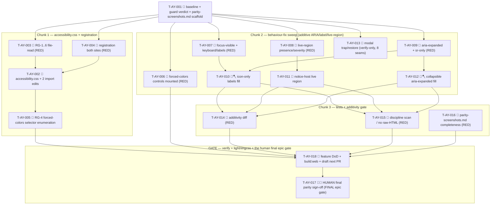

# Tasks — Accessibility (P12, the FINAL phase)

Each task is ≤ ~½ day, has a stable `T-AY-NNN` id, references ≥ 1 SPEC-AY / TEST-AY / REQ-AY / NFR-AY,
names an owner, lists explicit dependencies, and has a testable Definition of Done. This decomposes
**SPEC-AY-001..011** (11 spec items) on top of the merged P0–P11 surface on the `next` integration branch
(P11 i18n-locales #452 / d4733464): the existing `src/ui/styles/{tokens,animations}.css` (`--sp-focus-ring`
tokens.css:42, `--sp-shadow-focus-ring` tokens.css:140, the per-section reduced-motion overrides
§4.6/§4.9/§4.10/§4.11, the five named keyframes + the CQ-AUX-14 spin guard), the two CSS import sites
(`src/plugin/main.ts` after `animations.css` line 2; `src/ui/main.ts` after `animations.css` line 14), the
`vite.config.ts` `scopeBuiltCss()` auto-scoper, the P5/P7/P8/P10 Obsidian `Modal` subclasses (native
trap/restore), the `ChatSurface.vue` busy region (already `aria-live="polite"` + `role="status"` lines
856-857), the `TabBar.vue` ARIA + roving tabindex, and the rich-render collapsible headers under
`src/ui/chat/rich/**`.

> **P12 is ADDITIVE + presentation-only.** It adds **one new CSS file** (`src/ui/styles/accessibility.css`,
> the 6 rule groups RG-1..6), **two one-line import edits** (`src/plugin/main.ts` + `src/ui/main.ts`,
> registering it as the 3rd CSS layer after tokens + animations), and **targeted additive ARIA / `.sr-only`
> / live-region fills** on existing components (collapsible `aria-expanded`, icon-only labels, the RG-4
> forced-colors-border selector enumeration, the standalone notice-host live region if absent). Most of the
> behaviour sweep is **verify-only** (the busy region, TabBar, the 8 modals all already conform — the fix is
> a test that asserts the existing affordance, not a code edit). **No new port, no new InjectionKey, no new
> component, no new ADR, no signature change.** The P0–P11 default render stays **byte-identical** for mouse
> users (REQ-AY-014) — every a11y rule is gated behind `:focus-visible`, `prefers-reduced-motion`,
> `forced-colors`, `.sr-only`, or an additive ARIA attribute. `manifest.json` + en/de + all ten locales
> stay byte-identical (NFR-AY-004/008).

> **TDD / build-green ordering (the P5–P11 lesson):** where a test asserts a file/registration/behaviour, the
> **RED test lands before (or alongside) the impl that greens it.** Chunk 1's RED file-read + registration
> tests (T-AY-003/004) gate the `accessibility.css` + import edits (T-AY-002). Chunk 2's RED component /
> PageObject tests (T-AY-006..009 where automatable) gate the additive ARIA fills. RED test tasks are owned
> by `qa`; impl tasks (the CSS file, the import edits, the ARIA fills) by `dev`. **Every dev task's DoD
> carries whole-project `npm run lint` 0 + `npm run typecheck` 0 + `npm run test` green + an
> implementation-log entry.** This mirrors the P6–P11 task style the maintainer accepted (TASKS-CA-001 /
> TASKS-MC-001 / TASKS-PV-001 / TASKS-SS-001 / TASKS-IL-001).

> **The additivity invariant is the cardinal gate.** A swept surface is "done" only when its default
> (no-media-query, no-`.sr-only`) render and locale output are **unchanged from the `next` baseline**
> (TEST-AY-014). A stray ring on mouse `:focus` (using `:focus` instead of `:focus-visible`) is the
> secondary counter-metric — target 0. Because the RG-5 rule uses `:focus-visible` and every fill is gated,
> any default-state regression is a red build at the moment it is introduced.

> **Guard verdict (verified against SPEC-AY-001..011 + DESIGN-AY-001 §C.6 — NO guard-relax, NO new key/port,
> NO new ADR):**
> - **NO new InjectionKey / port / composable / component.** P12 touches **only** the UI-layer CSS
>   (`src/ui/styles/accessibility.css`), the two CSS import sites, and additive ARIA/label/live-region
>   attributes on already-live components. No domain entity, no use case, no port, no settings field
>   (DESIGN-AY-001 §C.3).
> - **NO deleted-symbol guard collision.** The new file lives under the already-live `src/ui/styles/**`
>   path (tokens.css/animations.css already there); `accessibility.css` is a plain CSS filename, not a banned
>   symbol. The additive ARIA edits add attributes/`.sr-only` classes to existing templates — no
>   `DELETED_SUBSYSTEM_BAN` / `DELETED_INJECTION_KEYS` glob matches the new CSS file, the two new import
>   lines, or the ARIA attribute edits.
> - **NO new ADR.** DESIGN-AY-001 §C.6 records the verdict: the CSS-layer pattern is the 3rd instance of the
>   established tokens.css/animations.css pattern (ADR-AUX-002 + the `scopeBuiltCss()` seam); the modal-seam
>   pattern is already covered by the P3/P5/P8/P9 modal-seam ADRs (P12 only verifies the native trap); the
>   token-discipline + forced-colors exception is already a documented rule (NFR-AY-002). D-AY-1..D-AY-5 are
>   design decisions, none of ADR weight. If implementation surfaces a modal that does **not** extend
>   `Modal` (so a hand-rolled trap is genuinely needed), that is a **defect-escalation** → file ADR-AY-001;
>   as designed it does not arise.
> - **NO `manifest.json` / en.ts / de.ts / locale change** (NFR-AY-004/008). T-AY-001 records this verdict;
>   T-AY-018 (the gate) re-confirms it.

> **lightningcss-safe CSS discipline (the §4.x convention + NFR-AY-005):** `accessibility.css` uses
> **ASCII-only comment markers** (`/* section B.x - ... */`, no em-dash / no non-ASCII glyph) so the
> standalone `build:web` lightningcss minifier accepts them (EC-AY-013). Selectors are authored
> **`.specorator-root`-prefixed** so `scopeBuiltCss()` is honoured, not fought (no `:where(*)` double-wrap);
> `@keyframes` are never targeted; `!important` is used **only** on the RG-1 reduced-motion guard.
> The **only** colour literals in the file are CSS **system-color keywords inside the `forced-colors`
> block** (RG-3/RG-4) — the single documented exception (NFR-AY-002, D-AY-5). No hex, no raw Obsidian var
> anywhere else; RG-5 consumes the **existing** `--sp-focus-ring` / `--sp-shadow-focus-ring` (NO new token).

> **Lint discipline (the P5–P11 lesson):** every dev task runs the **WHOLE-project** `npm run lint`
> (0 errors), not just the changed files — the project gate catches per-file misses
> (`vue/no-v-html`, `no-restricted-properties` innerHTML/outerHTML/insertAdjacentHTML, `no-restricted-imports`
> layer guards, `<script setup>`). The additive ARIA edits introduce **no** `innerHTML` / `v-html` / raw-HTML
> sink (REQ-AY-015, NFR-AY-003) — attributes are bound declaratively in templates; any `.sr-only` label is
> rendered as text, never injected. T-AY-018 re-confirms the discipline scan green.

> **The single FINAL epic gate is HUMAN-owned (TEST-AY-017, REQ-AY-017 — constitution Art. VII).** The
> automatable suite (TEST-AY-001..016) ships under the verify gate; the **final cross-surface parity
> screenshot sign-off (all P1–P11 surfaces, light + dark, 320/520/720 px, + the accumulated P5–P11
> manual-Obsidian legs)** is the human's. The agent **presents** it (and **opens, does NOT merge** the
> `next` → `develop` PR after the gate is green); it is **never agent-self-claimed** (T-AY-017 is `👤`).

## Legend

- 🧪 = test task (RED-first where a test asserts; owner `qa`)
- 🔨 = implementation task (owner `dev`)
- 📐 = design / scaffolding / baseline task
- 🚀 = release / ops / gate task
- 🪓 = may slice (touches multiple independent files/components; expect several commits)
- 👤 = human-owned (never agent-self-claimed)

---

## Task list

### T-AY-001 📐 — Baseline-capture + guard verification + scaffold `parity-screenshots.md`

- **Description:** Before any P12 implementation, capture the references into a
  `specs/accessibility/test-plan.md` skeleton and scaffold the human sign-off artifact: (1) the **token
  reference** — confirm `--sp-focus-ring` (tokens.css:42, → `var(--interactive-accent)`) +
  `--sp-shadow-focus-ring` (tokens.css:140, `0 0 0 2px var(--sp-focus-ring)`) exist as the RG-5 ring
  consumers (no new token, D-AY-2 / NG2); (2) the **import-site reference** — record the current 2-import CSS
  head at `src/plugin/main.ts:2` (after `animations.css`) + `src/ui/main.ts:14` (after `animations.css`) as
  the SPEC-AY-002/003 insertion points; (3) the **reduced-motion source inventory** — the five named
  keyframes (`thinking-pulse`, `streaming-cursor-blink`, `spin`, `mcp-glow`, `external-context-glow`) + the
  per-section token overrides RG-1 complements (CLAR-AY-002); (4) the **forced-colors background-cue-only
  control inventory** — enumerate the concrete selectors for RG-4 (the toolbar toggle switch, state pills,
  file/image chips, `.sp-tab` tab badges, the selected dropdown option) per SPEC-AY-006; (5) the **claudian
  reference** — note `D:\Projects\claudian-main\src\style\accessibility.css` is the minimal focus-visible-only
  layer (41 lines, 3 groups, no reduced-motion/forced-colors/sr-only — CLAR-AY-001 resolved at design),
  the *meet* leg = RG-5, the *beat* legs = RG-1..4 + RG-6. **Scaffold `specs/accessibility/parity-screenshots.md`**
  — the all-surfaces matrix (the human TEST-AY-017 final-sign-off artifact): a row per charter §3 surface ×
  {320, 520, 720 px} × {light, dark}, with a **baseline column from claudian** and a Specorator column
  (cells empty/placeholder until populated; this scaffold is the structure TEST-AY-016 checks for
  completeness). Confirm (one lint run) the **guard verdict**: the new `src/ui/styles/accessibility.css` +
  the two import-line edits + the additive ARIA edits are **not** caught by `DELETED_SUBSYSTEM_BAN` /
  `DELETED_INJECTION_KEYS`; that **NO new InjectionKey / port / composable / component / ADR** is needed
  (CSS layer + additive ARIA, DESIGN-AY-001 §C.6); that **`manifest.json` + en.ts/de.ts + all ten locales
  are untouched** (NFR-AY-004/008). Record the verdict: **no guard-relax task in P12.** No production code.
- **Satisfies:** SPEC-AY-001 (RG inventory), SPEC-AY-002/003 (import sites), SPEC-AY-006 (RG-4 selector
  enumeration), REQ-AY-016 (parity-screenshots.md scaffold), NFR-AY-002 (token reference), NFR-AY-004/008
  (additivity baseline)
- **Owner:** dev
- **Depends on:** —
- **Estimate:** S
- **Definition of done:**
  - [ ] `specs/accessibility/test-plan.md` exists with: the `--sp-focus-ring`/`--sp-shadow-focus-ring`
        token-reference note, the two import-site insertion points (`main.ts:2` + `ui/main.ts:14`), the
        five-keyframe reduced-motion source inventory, the enumerated RG-4 background-cue-only control
        selectors (toggle / pill / chip / `.sp-tab` / selected option), and the claudian
        minimal-focus-visible-only reference note (meet = RG-5; beat = RG-1..4 + RG-6).
  - [ ] `specs/accessibility/parity-screenshots.md` scaffolded — every charter §3 surface listed at
        320/520/720 px in light + dark, with a baseline (claudian) column and a Specorator column (the
        TEST-AY-016 completeness structure; cells placeholder until the screenshots are captured).
  - [ ] A one-line lint check confirms the deleted-symbol guard does **not** block the new
        `accessibility.css` / the two import lines / the ARIA edits; the verdict **NO guard-relax + NO new
        InjectionKey/port/component/ADR + manifest/locales untouched** is recorded in `test-plan.md`.
  - [ ] No file under `src/` changed.

---

## Chunk 1 — `accessibility.css` + pipeline registration (T-AY-002..005)

> The new CSS file + the two one-line import edits, with RED file-read + registration tests landing first.
> Self-contained; lands first. The RG-1..RG-6 file-read assertions (T-AY-003) + the registration assertion
> (T-AY-004) are RED until T-AY-002 lands the file + edits.

### T-AY-002 🔨 — `feat(ay):` create `src/ui/styles/accessibility.css` (RG-1..RG-6) + register at both CSS import sites

- **Description:** Implement per SPEC-AY-001/002/003. **(a) New file `src/ui/styles/accessibility.css`** with
  exactly the six rule groups, in order, each selector `.specorator-root`-prefixed, ASCII comments only,
  no hex / no raw Obsidian var outside the `forced-colors` block:
  **RG-1** reduced-motion global guard (`@media (prefers-reduced-motion: reduce)` collapsing
  `animation-duration`/`animation-iteration-count`/`transition-duration`/`scroll-behavior` on
  `.specorator-root *`/`::before`/`::after`, `!important` — the safety-net complementing the tokens.css
  per-section overrides, CLAR-AY-002 / D-AY-1);
  **RG-2** spin halt (`animation: none !important` on `.specorator-root [data-animation="spin"]`/`.sp-spin`
  under reduced-motion — re-asserts CQ-AUX-14; `none`, not a near-zero duration, EC-AY-001);
  **RG-3** forced-colors surface mapping (`@media (forced-colors: active)` — `forced-color-adjust: auto` +
  text→`CanvasText`, surfaces→`Canvas`, focus/selected→`Highlight`/`HighlightText`, button affordances→
  `ButtonText`/`ButtonFace`; colour mapping only, no layout shift);
  **RG-4** forced-colors border guarantee (`border: 1px solid currentColor` — or `outline` where the box
  model must not shift — on the enumerated background-cue-only controls from T-AY-001/SPEC-AY-006: toggle
  switch, state pills, chips, `.sp-tab` badges, selected dropdown option, EC-AY-003);
  **RG-5** focus-visible ring (`.specorator-root :where(button, [role="tab"], [role="option"],
  [role="switch"], a[href], textarea, input, select, [tabindex]):focus-visible { outline: 2px solid
  var(--sp-focus-ring); outline-offset: 2px; }` + the `box-shadow: var(--sp-shadow-focus-ring)` variant for
  controls whose outline is clipped by `overflow: hidden`; `:focus-visible` only — never bare `:focus`,
  EC-AY-005/006); **RG-6** `.sr-only` utility (the standard clip/size technique — `position: absolute`,
  1px box, `clip: rect(0 0 0 0)`, `clip-path: inset(50%)`, `white-space: nowrap`, `border: 0`; never
  `display:none`/`visibility:hidden`, EC-AY-007). **(b) Register at BOTH import sites:** add
  `import '@/ui/styles/accessibility.css';` to `src/plugin/main.ts` as the **3rd** CSS import, immediately
  after `import '@/ui/styles/animations.css';` (line 2); add `import './styles/accessibility.css';` to
  `src/ui/main.ts` as the **3rd** CSS import, immediately after `import './styles/animations.css';`
  (line 14). `vite.config.ts` `scopeBuiltCss()` is **unchanged** (the file is authored scope-safe). No JS,
  no DOM, no new token, no new port.
- **Satisfies:** SPEC-AY-001, SPEC-AY-002, SPEC-AY-003, REQ-AY-001, REQ-AY-002, REQ-AY-003, REQ-AY-004,
  REQ-AY-005, REQ-AY-006, REQ-AY-007, REQ-AY-009, REQ-AY-015, NFR-AY-002, NFR-AY-005, NFR-AY-006
- **Owner:** dev
- **Depends on:** T-AY-001, T-AY-003 (RED), T-AY-004 (RED)
- **Estimate:** M
- **Definition of done:**
  - [ ] `src/ui/styles/accessibility.css` exists with RG-1..RG-6 in order, every selector
        `.specorator-root`-prefixed, ASCII-only comments, `!important` only on RG-1, no hex / no raw
        Obsidian var outside the `forced-colors` block, RG-5 consuming the existing
        `--sp-focus-ring`/`--sp-shadow-focus-ring` (no new token), RG-5 using `:focus-visible` (not bare
        `:focus`), RG-2 setting `animation: none` (not a duration), RG-6 using the clip technique (not
        `display:none`).
  - [ ] `accessibility.css` is imported as the **3rd** CSS import (after tokens + animations) at both
        `src/plugin/main.ts` and `src/ui/main.ts`; `vite.config.ts` unchanged.
  - [ ] The RED file-read (T-AY-003) + registration (T-AY-004) tests now GREEN; whole-project
        `npm run lint` 0 + `npm run typecheck` 0 + `npm run test` green; implementation-log entry added.

### T-AY-003 🧪 — RED: `accessibility.css` rule-group presence (RG-1..RG-6, `.specorator-root`-scoped, discipline)

- **Description:** Author the failing file-read tests for SPEC-AY-001 in
  `tests/ui/styles/accessibility.test.ts` (mirrors `src/ui/styles/accessibility.css` per ADR-009), reading
  the CSS file as text: **TEST-AY-001** — the file exists and declares RG-1..RG-6, and **every selector is
  `.specorator-root`-scoped** (no rule targets outside the subtree); **TEST-AY-003** — RG-1 reduced-motion
  guard present (`prefers-reduced-motion: reduce` collapsing animation/transition duration); **TEST-AY-004**
  — RG-2 sets `animation: none` (not merely a near-zero duration) for `[data-animation="spin"]`/`.sp-spin`
  under reduced-motion (EC-AY-001); **TEST-AY-005** — RG-3 `@media (forced-colors: active)` present with
  `forced-color-adjust` + system-color keywords (`CanvasText`/`Canvas`/`Highlight`/`ButtonText`/`ButtonFace`);
  **TEST-AY-007** (file-read leg) — RG-5 uses `:focus-visible` (asserts no bare `:focus` ring rule) +
  consumes `var(--sp-focus-ring)`; **TEST-AY-009** (file-read leg) — RG-6 `.sr-only` uses the clip technique
  (`clip`/`clip-path`/`overflow: hidden`, NOT `display:none`/`visibility:hidden`); **TEST-AY-015** (CSS
  discipline leg) — `accessibility.css` carries no hex / no raw Obsidian var outside the single
  `forced-colors` block, and ASCII-only comment markers (no non-ASCII glyph). RED until T-AY-002 lands the
  file. Names TEST-AY-001/003/004/005/007(file)/009(file)/015(css).
- **Satisfies:** TEST-AY-001, TEST-AY-003, TEST-AY-004, TEST-AY-005, TEST-AY-007, TEST-AY-009, TEST-AY-015,
  SPEC-AY-001, SPEC-AY-011, REQ-AY-001, REQ-AY-003, REQ-AY-004, REQ-AY-005, REQ-AY-007, REQ-AY-009,
  REQ-AY-015, NFR-AY-002, EC-AY-001
- **Owner:** qa
- **Depends on:** T-AY-001
- **Estimate:** M
- **Definition of done:**
  - [ ] `tests/ui/styles/accessibility.test.ts` reads the CSS file as text and asserts: RG-1..RG-6 present
        + ordered, every selector `.specorator-root`-scoped, RG-1 reduced-motion collapse, RG-2
        `animation: none`, RG-3 forced-colors + system colours, RG-5 `:focus-visible` + `--sp-focus-ring`,
        RG-6 clip technique, and the discipline scan (no hex / no raw var outside `forced-colors`, ASCII
        comments).
  - [ ] Discriminating: a missing rule group, a bare-`:focus` ring, a `display:none` `.sr-only`, or a hex
        literal outside `forced-colors` fails the suite naming the offending group. RED until T-AY-002;
        GREEN once the file lands.

### T-AY-004 🧪 — RED: registration at both CSS import sites (3rd import, after tokens + animations)

- **Description:** Author the failing registration test for SPEC-AY-002/003 in
  `tests/ui/styles/accessibility-registration.test.ts` (or as a block in T-AY-003's file), reading the two
  entry files as text: **TEST-AY-002** — both `src/plugin/main.ts` and `src/ui/main.ts` import
  `accessibility.css`, positioned **after** the tokens + animations imports (the 3rd CSS import). Assert the
  import string is present in each and that its line index is greater than the `animations.css` import line
  index in the same file (the ordering contract, NFR-AY-006). RED until T-AY-002 adds the two import lines.
  Names TEST-AY-002.
- **Satisfies:** TEST-AY-002, SPEC-AY-002, SPEC-AY-003, REQ-AY-002, NFR-AY-006
- **Owner:** qa
- **Depends on:** T-AY-001
- **Estimate:** S
- **Definition of done:**
  - [ ] A registration test reads both `src/plugin/main.ts` + `src/ui/main.ts` and asserts each imports
        `accessibility.css` after the tokens + animations imports (3rd CSS import, line-order contract).
  - [ ] Discriminating: a missing import in either entry, or an import placed before animations, fails
        naming the offending entry. RED until T-AY-002; GREEN once both import lines land.

### T-AY-005 🔨 — `feat(ay):` enumerate the RG-4 forced-colors-border selector list (the swept background-cue-only controls)

- **Description:** Implement SPEC-AY-006 — refine RG-4 in `accessibility.css` so it **enumerates the
  concrete class/attribute selectors** of every control whose normal affordance is a background fill/wash
  only, per the audit in T-AY-001: the toolbar toggle switch (`.sp-toggle-switch`), the state pills
  (`[data-state]` pills), the file/image chips (`.sp-chip`), the tab badges (`.sp-tab`), and the selected
  dropdown option (`[aria-selected="true"]`/`[role="option"]` selected). Each listed control gains
  `border: 1px solid currentColor` (or `outline` where the box model must not shift) inside the existing
  `@media (forced-colors: active)` block, so each is perceivable under forced-colors (EC-AY-003). This is a
  refinement of the RG-4 group authored in T-AY-002 — it makes the selector list **concrete and complete**
  against the actual swept components rather than a placeholder. No default-render change (the rule is inert
  outside `forced-colors`). May land folded into T-AY-002 if the audit selectors are final at that point;
  kept as a distinct task because the concrete selectors come from the Chunk-2 component sweep.
- **Satisfies:** SPEC-AY-006, SPEC-AY-001 (RG-4), REQ-AY-006, NFR-AY-009, EC-AY-003
- **Owner:** dev
- **Depends on:** T-AY-002
- **Estimate:** S
- **Definition of done:**
  - [ ] RG-4 in `accessibility.css` enumerates the concrete selectors for the toggle switch, state pills,
        chips, `.sp-tab` badges, and the selected dropdown option, each given a `currentColor` border
        (or non-shifting outline) inside the `forced-colors` block.
  - [ ] The TEST-AY-006 file-read leg (RG-4 enumerates the background-cue-only controls) passes; default
        render unchanged outside `forced-colors`; whole-project `npm run lint` 0 + `npm run typecheck` 0 +
        `npm run test` green; implementation-log entry added.

---

## Chunk 2 — Behaviour-fix sweep (additive ARIA / label / live-region fills) (T-AY-006..013)

> Audit-then-fill across the swept components. Most items are **verify-only** (a RED test that asserts an
> existing affordance, then it passes against the current component — no code edit). The genuine fills are
> the collapsible `aria-expanded`, the icon-only `.sr-only`/`aria-label`, and the standalone notice-host
> live region if absent. Each fill is **additive** (an attribute / `.sr-only` label), no default-render /
> microcopy / locale change (REQ-AY-014). RED component / PageObject tests land before the fills where
> automatable. PageObjects query by `data-testid` only (ADR-009). Grouped into ≤6-task chunks.

### T-AY-006 🧪 — RED: forced-colors border controls exist in the mounted surfaces (TEST-AY-006 mount leg)

- **Description:** Author the failing mount leg for SPEC-AY-006 (the file-read leg rides T-AY-003/005):
  mount the toolbar + chat surfaces with co-located PageObjects (querying by `data-testid`) and assert the
  RG-4-listed background-cue-only controls exist in the rendered DOM — the toggle switch, a state pill, a
  file/image chip, a `.sp-tab` badge, and a selected dropdown option are present (so the RG-4 selectors
  target real controls, not dead selectors). The forced-colors *appearance* itself is the human TEST-AY-017
  leg; this asserts the controls the rule targets are mounted (NFR-AY-009 perceivability scaffold). Names
  TEST-AY-006 (mount leg).
- **Satisfies:** TEST-AY-006, SPEC-AY-006, REQ-AY-006, NFR-AY-009
- **Owner:** qa
- **Depends on:** T-AY-001
- **Estimate:** M
- **Definition of done:**
  - [ ] A mount test with co-located PageObject(s) (data-testid only) asserts the RG-4-listed controls
        (toggle / pill / chip / `.sp-tab` / selected option) are present in the mounted toolbar + chat
        surfaces.
  - [ ] Discriminating: a missing target control fails naming it. GREEN once the controls are confirmed
        present (verify-only — the controls already exist per the audit).

### T-AY-007 🧪 — RED: focus-visible ring reachability + no-stray-mouse-ring (TEST-AY-007 mount leg) + keyboard operability (TEST-AY-008)

- **Description:** Author the failing mount legs for SPEC-AY-007/008 (the RG-5 file-read leg rides
  T-AY-003): **TEST-AY-007 (mount)** — a PageObject Tab/keyboard-focuses a control and asserts the
  focus-visible state resolves (the control matches the RG-5 `:where(...)` selector — e.g. a custom
  `div[role]` control carries `tabindex` so it matches `[tabindex]`), and a mouse `:focus` shows no stray
  ring (the counter-metric, EC-AY-006 — asserted structurally where JSDOM limits `:focus-visible`
  computation); **TEST-AY-008** — every audited interactive control in the toolbar strip, the settings
  shell surfaces, and the chat surface (composer, message actions, dropdowns, tab close `×`, new-tab `+`,
  paperclip, chip remove, image remove) is focusable + exposes a **non-empty accessible name** (visible
  label, `aria-label`, or `.sr-only`). RED where a control is missing a name (drives the T-AY-010 fills).
  Names TEST-AY-007(mount)/008.
- **Satisfies:** TEST-AY-007, TEST-AY-008, SPEC-AY-007, SPEC-AY-008, REQ-AY-007, REQ-AY-008, NFR-AY-001,
  EC-AY-005, EC-AY-006
- **Owner:** qa
- **Depends on:** T-AY-001
- **Estimate:** M
- **Definition of done:**
  - [ ] A mount test (PageObject, data-testid) asserts a keyboard-focused control resolves the RG-5
        focus-visible target (custom `div[role]` controls carry `tabindex`) and mouse `:focus` shows no
        stray ring (structural where JSDOM limits `:focus-visible`); and every audited toolbar/settings/chat
        control is focusable with a non-empty accessible name.
  - [ ] Discriminating: a control with an empty accessible name fails naming it (drives T-AY-010). RED until
        the icon-only labels are filled; GREEN after T-AY-010.

### T-AY-008 🧪 — RED: live-region presence + severity (busy region + notice host, no focus theft) (TEST-AY-010)

- **Description:** Author the failing mount leg for SPEC-AY-004: **TEST-AY-010** — the streaming busy region
  in `ChatSurface.vue` carries `aria-live="polite"` + `role="status"` (verify-only — already at lines
  856-857); and the notice host announces error notices **assertive** + info/success **polite** via an
  `aria-live` region, **without stealing focus** (focus is unchanged after an announcement). Assert the
  standalone notice host has a live region (polite default, assertive for error) mirroring the notice text
  declaratively (no `innerHTML`/`v-html`, EC-AY-011/012). RED if the standalone notice host lacks a live
  region (drives the T-AY-011 fill). Names TEST-AY-010.
- **Satisfies:** TEST-AY-010, SPEC-AY-004, REQ-AY-010, NFR-AY-001, EC-AY-011, EC-AY-012
- **Owner:** qa
- **Depends on:** T-AY-001
- **Estimate:** M
- **Definition of done:**
  - [ ] A mount test asserts the busy region has `aria-live="polite"` + `role="status"` (verify-only) and
        the notice host announces error=assertive / info=polite via a live region without moving focus.
  - [ ] Discriminating: a missing live region in the standalone notice host fails (drives T-AY-011); a
        stolen focus on announcement fails. GREEN after T-AY-011 (or immediately if the host already
        conforms).

### T-AY-009 🧪 — RED: collapsible `aria-expanded` flips + accessible name (TEST-AY-011); `.sr-only` clip on icon-only controls (TEST-AY-009 mount leg)

- **Description:** Author the failing mount legs for SPEC-AY-005/007: **TEST-AY-011** — a collapsible header
  (tool call / thinking / subagent / write-edit, under `src/ui/chat/rich/**`) exposes `aria-expanded` bound
  to its open state that **flips** on Enter/Space/click, and exposes an accessible name (visible text or
  `aria-label`); **TEST-AY-009 (mount leg)** — icon-only controls carry an `.sr-only` label or `aria-label`
  in the accessibility tree with zero visible footprint (EC-AY-007 — the clip technique, not `display:none`).
  RED where a header lacks `aria-expanded` or an icon-only control lacks a name (drives T-AY-010/T-AY-012).
  Uses co-located PageObjects (data-testid). Names TEST-AY-011/009(mount).
- **Satisfies:** TEST-AY-011, TEST-AY-009, SPEC-AY-005, SPEC-AY-007, REQ-AY-009, REQ-AY-011, EC-AY-007
- **Owner:** qa
- **Depends on:** T-AY-001
- **Estimate:** M
- **Definition of done:**
  - [ ] A mount test asserts a collapsible header exposes `aria-expanded` that flips on Enter/Space/click +
        has an accessible name; and icon-only controls expose an `.sr-only`/`aria-label` name with zero
        visible footprint (clip technique).
  - [ ] Discriminating: a header missing `aria-expanded`, or an unlabelled icon-only control, fails naming
        it (drives T-AY-010/T-AY-012). RED until the fills land; GREEN after.

### T-AY-010 🔨🪓 — `feat(ay):` fill icon-only accessible names (`.sr-only` / `aria-label`) across toolbar / composer / chat

- **Description:** Implement SPEC-AY-007 — for every icon-only interactive control the T-AY-007/T-AY-009
  audit found unlabelled, add an accessible name **additively**: an `aria-label` or an associated `.sr-only`
  label (using the RG-6 utility), keeping decorative glyphs `aria-hidden="true"`. Targets per the design
  list: the composer paperclip, chip remove, image remove, message actions, dropdown controls (and any
  others the audit surfaces); the tab close `×` / new-tab `+` are **verify-only** (TabBar already labels
  them). No visible-text / microcopy / locale change — the `.sr-only` label is screen-reader-only; any
  user-visible label string already in the i18n catalogues is reused, not re-worded (REQ-AY-014, NFR-AY-004).
  Declarative template attributes only — no `innerHTML`/`v-html` (REQ-AY-015). `<script setup>` preserved.
- **Satisfies:** SPEC-AY-007, REQ-AY-008, REQ-AY-009, NFR-AY-004, NFR-AY-003
- **Owner:** dev
- **Depends on:** T-AY-007, T-AY-009
- **Estimate:** M
- **Definition of done:**
  - [ ] Every icon-only control flagged by the audit carries a non-empty accessible name (`aria-label` or
        `.sr-only`); decorative glyphs stay `aria-hidden="true"`; no visible-text / microcopy / locale
        change; no `innerHTML`/`v-html` added.
  - [ ] The TEST-AY-008 + TEST-AY-009 (mount) legs go GREEN; whole-project `npm run lint` 0 +
        `npm run typecheck` 0 + `npm run test` green; implementation-log entry added.

### T-AY-011 🔨 — `feat(ay):` notice-host live region (standalone) — error assertive / info polite, no focus theft

- **Description:** Implement SPEC-AY-004 — if the standalone notice host lacks a live region, add an
  `aria-live` region (polite default, assertive for error per the `NotificationPort` severity:
  error→assertive, info/success→polite) that mirrors the notice text **declaratively** (text binding, no
  `innerHTML`/`v-html`), without stealing focus. The busy region (`ChatSurface.vue` lines 856-857) is
  **verify-only** (already `aria-live="polite"` + `role="status"`). Routes through the existing
  `NotificationPort`/`FeedbackService` severity — **no new channel, no new port** (Observability note in
  spec). If the host already announces via Obsidian's native `Notice` (plugin leg) and the standalone host
  already has a live region, this task is **verify-only** and closes against T-AY-008. EC-AY-011/012.
- **Satisfies:** SPEC-AY-004, REQ-AY-010, NFR-AY-003, EC-AY-011, EC-AY-012
- **Owner:** dev
- **Depends on:** T-AY-008
- **Estimate:** S
- **Definition of done:**
  - [ ] The standalone notice host has an `aria-live` region (polite default, assertive for error) mirroring
        notice text declaratively, no focus theft, no `innerHTML`/`v-html`; routed through the existing
        `NotificationPort` severity (no new channel/port). Verify-only if it already conforms.
  - [ ] The TEST-AY-010 leg goes GREEN; whole-project `npm run lint` 0 + `npm run typecheck` 0 +
        `npm run test` green; implementation-log entry added.

### T-AY-012 🔨🪓 — `feat(ay):` collapsible `aria-expanded` + accessible name on the rich-render headers

- **Description:** Implement SPEC-AY-005 — for each collapsible header under `src/ui/chat/rich/**` (tool
  call / thinking / subagent / write-edit) that the T-AY-009 audit found lacking it, **additively** bind
  `aria-expanded` to the header's open state (flips on Enter/Space/click) and ensure an accessible name
  (visible header text or `aria-label`). Verify-only where a header already carries it. No default-render /
  microcopy / locale change — the attribute is the only addition (REQ-AY-014). Declarative binding only,
  `<script setup>` preserved, no `innerHTML`/`v-html`.
- **Satisfies:** SPEC-AY-005, REQ-AY-011, NFR-AY-004, NFR-AY-003
- **Owner:** dev
- **Depends on:** T-AY-009
- **Estimate:** S
- **Definition of done:**
  - [ ] Each rich-render collapsible header exposes `aria-expanded` bound to its open state (flips on
        toggle) + an accessible name; verify-only where already present; no default-render / microcopy /
        locale change; no `innerHTML`/`v-html` added.
  - [ ] The TEST-AY-011 leg goes GREEN; whole-project `npm run lint` 0 + `npm run typecheck` 0 +
        `npm run test` green; implementation-log entry added.

### T-AY-013 🧪 — RED: modal focus trap + restore (the 8 Specorator modal seams) (TEST-AY-012 / TEST-AY-013)

- **Description:** Author the failing mount/structural tests for SPEC-AY-009 across the eight modals
  (ProviderConsent, DeleteConfirm, ForkTarget, InstructionConfirm, InlineEdit, ImagePreview, McpServer,
  McpTest): **TEST-AY-012** — each launcher opens a `Modal` subclass (structural assertion the class
  extends Obsidian `Modal`, which natively traps Tab/Shift+Tab), with a PageObject Tab-cycle staying inside
  the modal where the JSDOM harness allows (else the structural `Modal`-subclass assertion, EC-AY-008);
  **TEST-AY-013** — closing a modal (accept/reject/Esc/overlay) returns focus to the recorded opener (or its
  nearest still-present sibling), **not** `document.body` (native restore, EC-AY-009). **Verify-only** — the
  modals already extend `Modal` (confirmed `InlineEditModal extends Modal`, `src/plugin/modals/InlineEditModal.ts:46`,
  D-AY-3); **do not hand-roll a trap**. If a modal is found NOT to extend `Modal`, that is a
  **defect-escalation** (file ADR-AY-001 the P5–P11 way + a hand-rolled-trap is then a new task) — flagged
  in the DoD, never a silent default. Co-located PageObjects (data-testid). Names TEST-AY-012/013.
- **Satisfies:** TEST-AY-012, TEST-AY-013, SPEC-AY-009, REQ-AY-012, REQ-AY-013, NFR-AY-001, EC-AY-008,
  EC-AY-009
- **Owner:** qa
- **Depends on:** T-AY-001
- **Estimate:** M
- **Definition of done:**
  - [ ] A test asserts each of the 8 launchers opens a `Modal` subclass (structural; Tab-cycle-stays-inside
        where JSDOM allows) and that closing by any path restores focus to the opener (not `document.body`).
  - [ ] A note records that a modal NOT extending `Modal` is a defect-escalation (file ADR-AY-001 + a new
        hand-rolled-trap task), never a silent default. GREEN against the current code (verify-only — all 8
        extend `Modal`).

---

## Chunk 3 — Tests + additivity gate (T-AY-014..016)

> The remaining automatable legs: the additivity diff, the discipline scan (the diff leg), and the
> parity-screenshots.md completeness check. The CSS-rule-presence + registration + focus / live-region /
> sr-only / aria-expanded / modal legs are owned by Chunk-1/2 RED tasks above.

### T-AY-014 🧪 — RED: additivity invariant — no swept surface's default render / locale output regresses (TEST-AY-014)

- **Description:** Author the additivity proof for SPEC-AY-010 (TEST-AY-014): mount each swept component and
  assert its **default** (no-media-query, no-`.sr-only`-applied) render and locale output are **unchanged**
  from the `next` baseline — a structural/snapshot diff that fails if a fill changed the base render, layout,
  microcopy, or locale string (EC-AY-010, the cardinal P12 counter-metric). The added ARIA attributes /
  `.sr-only` labels are in the tree but do **not** alter the visible default render (an `aria-label` /
  `aria-expanded` attribute + a clipped `.sr-only` span are not visible). Pair with a recorded
  `git diff next -- src/ui/i18n/locales` check (locale output byte-identical, NFR-AY-004). RED until the
  fills are confirmed additive; passes once the diff is clean. Names TEST-AY-014.
- **Satisfies:** TEST-AY-014, SPEC-AY-010, REQ-AY-014, NFR-AY-004, EC-AY-010
- **Owner:** qa
- **Depends on:** T-AY-010, T-AY-011, T-AY-012
- **Estimate:** M
- **Definition of done:**
  - [ ] A test asserts each swept component's default render + locale output is unchanged from baseline
        (structural/snapshot diff); a recorded `git diff next -- src/ui/i18n/locales` is empty.
  - [ ] Discriminating: a fill that altered the visible default render, microcopy, or a locale string fails
        naming the surface. RED until confirmed additive; GREEN once clean.

### T-AY-015 🧪 — RED: discipline scan (no added raw-HTML sink in the P12 diff) (TEST-AY-015 diff leg)

- **Description:** Author the discipline scan for SPEC-AY-011 (TEST-AY-015 — the diff leg; the CSS
  token/comment leg rides T-AY-003): assert the P12 diff adds **no**
  `innerHTML`/`outerHTML`/`insertAdjacentHTML` assignment and **no** `v-html` (a scan over the changed
  files, or a recorded confirmation that `npm run lint` `vue/no-v-html` + `no-restricted-properties` stay
  green with no new suppressions). This is the security leg (NFR-AY-003): the additive ARIA edits bind
  attributes declaratively and render `.sr-only` labels as text — never inject HTML. Names TEST-AY-015
  (diff leg).
- **Satisfies:** TEST-AY-015, SPEC-AY-011, REQ-AY-015, NFR-AY-003
- **Owner:** qa
- **Depends on:** T-AY-010, T-AY-011, T-AY-012
- **Estimate:** S
- **Definition of done:**
  - [ ] A scan / recorded lint confirmation asserts the P12 diff adds no
        `innerHTML`/`outerHTML`/`insertAdjacentHTML`/`v-html` and no new suppression of the raw-HTML guards.
  - [ ] Discriminating: a planted `v-html` / `innerHTML` in a changed file fails. GREEN against the actual
        diff (the fills are declarative).

### T-AY-016 🧪 — RED: `parity-screenshots.md` completeness (all surfaces × 320/520/720 × light/dark) (TEST-AY-016)

- **Description:** Author the artifact-completeness check for REQ-AY-016 (TEST-AY-016): assert
  `specs/accessibility/parity-screenshots.md` exists and lists **every charter §3 surface** at 320, 520, and
  720 px in both light and dark theme, each side by side with its claudian reference (the matrix scaffolded
  in T-AY-001). This is **artifact-completeness only** — it checks the matrix has every required row/cell
  slot, NOT the visual judgment (that is the human TEST-AY-017 leg). RED until the matrix is complete. Names
  TEST-AY-016.
- **Satisfies:** TEST-AY-016, REQ-AY-016
- **Owner:** qa
- **Depends on:** T-AY-001
- **Estimate:** S
- **Definition of done:**
  - [ ] A test asserts `specs/accessibility/parity-screenshots.md` lists every charter §3 surface at
        320/520/720 px in light + dark, each with a claudian-reference + Specorator cell (completeness
        structure only).
  - [ ] Discriminating: a missing surface / width / theme cell fails naming the gap. GREEN once the matrix
        is structurally complete; the visual sign-off is TEST-AY-017 (human).

---

## GATE — full verify + lightningcss check + parity self-review + the HUMAN final epic gate (T-AY-017..018)

### T-AY-017 🚀👤 — HUMAN: final cross-surface parity screenshot sign-off (all surfaces) — the single FINAL epic gate

- **Description:** The **single final epic acceptance gate** (REQ-AY-017, TEST-AY-017 — constitution
  Art. VII). A **human** reviewer approves the final cross-surface parity screenshot set in
  `specs/accessibility/parity-screenshots.md` — **all P1–P11 surfaces, light + dark, at 320/520/720 px** —
  plus the **accumulated P5–P11 manual-Obsidian legs** (the per-phase manual screenshot legs that converge
  here, charter §5.5 / workflow-state line 64). This includes the **visual** forced-colors + reduced-motion
  rendering judgment (which no automatable test replaces). The agent **PRESENTS** this gate and the
  populated screenshot set; it **opens (does NOT merge) the `next` → `develop` PR** after the automatable
  gate (T-AY-018) is green; the human owns acceptance. **NEVER agent-self-claimed** — the phase status
  records the human approval as the outstanding final gate; program-done (the whole P0–P12 reboot) is
  asserted only after the human's recorded approval.
- **Satisfies:** TEST-AY-017, REQ-AY-017, NFR-AY-001 (final cross-surface judgment)
- **Owner:** human
- **Depends on:** T-AY-018
- **Estimate:** S (agent presents; human reviews)
- **Definition of done:**
  - [ ] The agent has **presented** the complete `parity-screenshots.md` set (all surfaces, light + dark,
        320/520/720 px) + surfaced the accumulated P5–P11 manual-Obsidian legs, and has **opened (not
        merged)** the `next` → `develop` PR.
  - [ ] The phase status records the human approval as the **outstanding final gate** (owner: human); the
        sign-off is **never agent-self-claimed**.
  - [ ] **(Human action)** the maintainer's recorded acceptance of the parity set + the manual legs closes
        the epic; the `next` → `develop` merge is then the human's call.

### T-AY-018 🚀 — Feature DoD: full verify + lightningcss `build:web` check + all-auto suites green + parity self-review + draft `next` PR

- **Description:** The closing automatable gate for P12. Run the full pre-PR verify chain (`npm audit` +
  `npm run typecheck` + `npm run lint` + `npm run test` + `npm run build` + `npm run build:web` +
  `npm run docs:api`) and `npm run test:all`; confirm zero bypasses. **Specifically confirm the
  lightningcss `build:web` leg is green** — `accessibility.css`'s ASCII comments + standard at-rules
  (`@media (prefers-reduced-motion …)` / `@media (forced-colors …)`) are minifier-accepted, **no CSS minify
  error** (NFR-AY-005, EC-AY-013); the rule groups appear in **both** built outputs (plugin `styles.css` +
  the standalone bundle, NFR-AY-006). Confirm: the **automatable suite green** — CSS-rule presence
  (TEST-AY-001/003/004/005), registration (TEST-AY-002), focus-visible (TEST-AY-007), keyboard/labels
  (TEST-AY-008), sr-only (TEST-AY-009), live-region (TEST-AY-010), aria-expanded (TEST-AY-011), modal
  trap/restore (TEST-AY-012/013), additivity diff (TEST-AY-014), discipline scan (TEST-AY-015),
  forced-colors borders (TEST-AY-006), parity-screenshots completeness (TEST-AY-016); the **additivity**
  contract — no swept surface's default render / locale output regresses (TEST-AY-014, REQ-AY-014); the
  **guard verdict re-confirmed** — **NO new InjectionKey / port / composable / component / ADR**,
  **NO guard-relax** needed (DESIGN-AY-001 §C.6); the **no-`v-html`/`innerHTML`** discipline + the
  token-discipline scan green (no hex / no raw var outside `forced-colors`, no NEW token — NFR-AY-002/003);
  **`manifest.json` byte-identical** + en/de + all ten locales byte-identical (NFR-AY-004/008); the
  **coverage gate** 80/70/80/80 holds (NFR-AY-007); **NO new dependency, NO migration**. Write the **parity
  self-review note** (accessibility.css shipped + registered at both entry points + present in both built
  outputs; reduced-motion / forced-colors / focus-visible / sr-only / live-region / modal-focus behaviours
  verified; the additivity counter-metric = 0 default-state regressions, 0 stray mouse rings). Open a
  **draft PR into `next`** (the orchestrator merges after green CI + deploys to `D:/TestVault` per the
  autonomous-drive directive). **Then present the final review + open (DO NOT merge) the `next` → `develop`
  PR (T-AY-017) — the human's call at parity.**
- **Satisfies:** SPEC-AY-001..011 (gate), NFR-AY-005, NFR-AY-006, NFR-AY-007, NFR-AY-008, NFR-AY-010,
  REQ-AY-014, REQ-AY-015, EC-AY-013
- **Owner:** dev
- **Depends on:** T-AY-005, T-AY-006, T-AY-014, T-AY-015, T-AY-016
- **Estimate:** M
- **Definition of done:**
  - [ ] Full pre-PR verify chain + `npm run test:all` green, zero bypasses; the lightningcss `build:web`
        leg green (no CSS minify error — NFR-AY-005); the RG-1..RG-6 rules present in both the plugin
        `styles.css` and the standalone bundle (NFR-AY-006).
  - [ ] The automatable suite (TEST-AY-001..016) green; the additivity diff (TEST-AY-014) clean
        (0 default-state regressions, 0 stray mouse rings); the coverage gate 80/70/80/80 holds.
  - [ ] The guard verdict re-confirmed (**no new InjectionKey/port/composable/component/ADR, no
        guard-relax**); the no-`v-html`/`innerHTML` + token-discipline scans green (no new token, no hex /
        no raw var outside `forced-colors`); `manifest.json` + en/de + all ten locales byte-identical to the
        `next` baseline; no new dep, no migration.
  - [ ] The parity self-review note written (accessibility.css shipped + registered + in both outputs; the
        five a11y behaviours verified; counter-metric = 0); a **draft PR into `next`** opened; the **final
        review presented + the `next` → `develop` PR opened (NOT merged)** for the human gate (T-AY-017);
        implementation-log + `test-report.md` updated.

---

## Dependency graph + parallelisable batches

**Parallelisable batches (each runs after its upstream RED/impl lands):**

- **B0 (baseline):** T-AY-001 — alone, first (baseline + guard verdict + the parity-screenshots.md scaffold).
- **B1 (Chunk 1 RED tests):** T-AY-003 (RG file-read) + T-AY-004 (registration) run **in parallel** (each
  depends only on T-AY-001). These land the RED scaffold for the CSS file.
- **B2 (Chunk 1 impl):** T-AY-002 (the CSS file + the two import edits) greens T-AY-003/004 → then T-AY-005
  (RG-4 selector enumeration) refines RG-4.
- **B3 (Chunk 2 RED tests):** T-AY-006/007/008/009/013 run **in parallel** (each depends only on T-AY-001;
  they mount disjoint surfaces). T-AY-013 (modal) is verify-only against the current code.
- **B4 (Chunk 2 fills):** T-AY-010 (icon-only labels; after T-AY-007/009), T-AY-011 (notice-host live region;
  after T-AY-008), T-AY-012 (collapsible aria-expanded; after T-AY-009) — touch disjoint components, may run
  in parallel.
- **B5 (Chunk 3 gate tests):** T-AY-014 (additivity diff) + T-AY-015 (discipline scan) run after the fills
  (T-AY-010/011/012); T-AY-016 (screenshot completeness) depends only on T-AY-001 and may run any time after
  the matrix is populated.
- **B6 (gate):** T-AY-018 (feature DoD + lightningcss build:web + draft `next` PR) after B2/B3/B5 →
  **T-AY-017 (the HUMAN final epic gate)** after T-AY-018 opens the `next` → `develop` PR.

> **Suggested dispatch chunks for the implementer (the P8/P9 subagent-timeout lesson — keep each dispatch
> self-contained):**
> - **C1** = T-AY-001 + T-AY-003 + T-AY-004 + T-AY-002 + T-AY-005 (baseline + the CSS file + the two import
>   edits + the RG file-read/registration RED-then-green + RG-4 enumeration — the accessibility.css
>   dispatch; small, self-contained, lands first).
> - **C2** = T-AY-006..009 + T-AY-013 (the Chunk-2 RED test scaffold across the swept surfaces — mostly
>   verify-only mounts; modal trap/restore is verify-only).
> - **C3** = T-AY-010 + T-AY-011 + T-AY-012 (the three genuine additive fills — icon-only labels, notice-host
>   live region, collapsible aria-expanded; disjoint components, may parallelise).
> - **C4** = T-AY-014 + T-AY-015 + T-AY-016 (additivity diff + discipline scan + screenshot completeness).
> - **C5** = T-AY-018 (the automatable gate + lightningcss build:web + draft `next` PR), then **T-AY-017**
>   (the HUMAN final parity sign-off — presented, never self-claimed).
> C2's RED tests + C3's fills touch disjoint surfaces and may be dispatched in parallel; each fill turns its
> own RED leg green.

> **After P12 merges to `next` (the epic end-state — charter line 219 / workflow-state lines 69-71):** the
> whole P0–P12 reboot is on `next` with a green verify gate → the orchestrator **presents the final review +
> opens (DO NOT merge) the `next` → `develop` PR**. Per the charter, `next` → `develop` at parity is the
> **human's call** (NG6). T-AY-017 is that human gate; T-AY-018 opens (does not merge) the PR.

---

## Coverage sanity-check

- **Every SPEC-AY-001..011 has ≥ 1 task:** SPEC-AY-001 (T-AY-002/003/018), SPEC-AY-002 (T-AY-002/004/018),
  SPEC-AY-003 (T-AY-002/004/018), SPEC-AY-004 (T-AY-008/011), SPEC-AY-005 (T-AY-009/012), SPEC-AY-006
  (T-AY-005/006), SPEC-AY-007 (T-AY-007/009/010), SPEC-AY-008 (T-AY-007), SPEC-AY-009 (T-AY-013),
  SPEC-AY-010 (T-AY-014), SPEC-AY-011 (T-AY-003/015).
- **Every REQ-AY has ≥ 1 test task** (the qa 🧪 tasks name the TEST-AY ids 1:1 to the spec's REQ↔SPEC↔TEST
  table): REQ-AY-001→T-AY-003 (TEST-AY-001); REQ-AY-002→T-AY-004 (TEST-AY-002); REQ-AY-003→T-AY-003
  (TEST-AY-003); REQ-AY-004→T-AY-003 (TEST-AY-004); REQ-AY-005→T-AY-003 (TEST-AY-005); REQ-AY-006→T-AY-003/006
  (TEST-AY-006); REQ-AY-007→T-AY-003/007 (TEST-AY-007); REQ-AY-008→T-AY-007 (TEST-AY-008); REQ-AY-009→
  T-AY-003/009 (TEST-AY-009); REQ-AY-010→T-AY-008 (TEST-AY-010); REQ-AY-011→T-AY-009 (TEST-AY-011);
  REQ-AY-012→T-AY-013 (TEST-AY-012); REQ-AY-013→T-AY-013 (TEST-AY-013); REQ-AY-014→T-AY-014 (TEST-AY-014);
  REQ-AY-015→T-AY-003/015 (TEST-AY-015); REQ-AY-016→T-AY-016 (TEST-AY-016); REQ-AY-017→**T-AY-017** (the
  HUMAN TEST-AY-017 sign-off, owner: human, 👤).
- **Every TEST-AY-001..016 is owned (auto):** 001/003/004/005/007(file)/009(file)/015(css)→T-AY-003;
  002→T-AY-004; 006→T-AY-003(file)/T-AY-005(enum)/T-AY-006(mount); 007(mount)/008→T-AY-007;
  010→T-AY-008; 011/009(mount)→T-AY-009; 012/013→T-AY-013; 014→T-AY-014; 015(diff)→T-AY-015;
  016→T-AY-016. **TEST-AY-017 = HUMAN → T-AY-017 (👤, never agent-self-claimed).**
- **Every NFR-AY is gated:** NFR-AY-001 (T-AY-006/007/008/009/013 across surfaces + T-AY-017 human),
  NFR-AY-002 (T-AY-003 token/comment discipline + T-AY-018), NFR-AY-003 (T-AY-015 no raw-HTML),
  NFR-AY-004 (T-AY-014 additivity + T-AY-018 locale/manifest byte-identity), NFR-AY-005 (T-AY-018
  lightningcss build:web green, EC-AY-013), NFR-AY-006 (T-AY-004 registration + T-AY-018 both-outputs),
  NFR-AY-007 (T-AY-018 coverage 80/70/80/80), NFR-AY-008 (T-AY-014/018 manifest untouched), NFR-AY-009
  (T-AY-005/006 forced-colors borders + EC-AY-002/003), NFR-AY-010 (T-AY-018 verify + test:all green).
- **Every EC-AY-001..014 is caught:** EC-AY-001 (T-AY-003 RG-2 `animation: none`), EC-AY-002 (T-AY-003 RG-1
  safety-net), EC-AY-003 (T-AY-005/006 RG-4 border), EC-AY-004 (T-AY-003 RG-3 `Highlight` + RG-5 ring),
  EC-AY-005 (T-AY-007 focus-visible shows), EC-AY-006 (T-AY-007 no stray mouse ring), EC-AY-007 (T-AY-009
  `.sr-only` clip), EC-AY-008 (T-AY-013 trap wrap), EC-AY-009 (T-AY-013 restore not body), EC-AY-010
  (T-AY-014 additivity byte-identical), EC-AY-011 (T-AY-008/011 polite live region), EC-AY-012 (T-AY-008/011
  error assertive), EC-AY-013 (T-AY-018 lightningcss minify green), EC-AY-014 (T-AY-003 RG-5 consumes
  `--sp-focus-ring` → theme `--interactive-accent`, no hardcoded colour).
- **No orphan task:** every task lists ≥ 1 SPEC-AY / TEST-AY / REQ-AY / NFR-AY. No task is `L` (all S/M).
- **Additive-only (no port/interface/ADR break):** P12 adds **one new CSS file** + **two one-line import
  edits** + **targeted additive ARIA/`.sr-only`/live-region fills** on existing components; the 8 modal seams
  + the busy region + TabBar are **verify-only**. No new InjectionKey / port / composable / component / ADR;
  no new token (RG-5 reuses `--sp-focus-ring`/`--sp-shadow-focus-ring`); no signature change. The P0–P11
  default render stays **byte-identical for mouse users + the existing look** (every rule gated behind
  `:focus-visible` / `prefers-reduced-motion` / `forced-colors` / `.sr-only` / additive ARIA — REQ-AY-014);
  `manifest.json` + en/de + all ten locales byte-identical (NFR-AY-004/008). The additivity diff (T-AY-014)
  + the discipline scan (T-AY-015) are the cardinal gates.
- **TDD / build-green ordering:** Chunk-1 RED file-read/registration tests (T-AY-003/004) land before the
  CSS file + import edits (T-AY-002); Chunk-2 RED component/PageObject tests (T-AY-006..009/013) land before
  the additive fills (T-AY-010/011/012); the modal trap/restore (T-AY-013) is verify-only against the native
  Obsidian `Modal`. The **HUMAN final parity sign-off (T-AY-017, TEST-AY-017)** is the single final epic gate
  — the agent presents it + opens (does not merge) the `next` → `develop` PR; it is **never
  agent-self-claimed** (constitution Art. VII).
