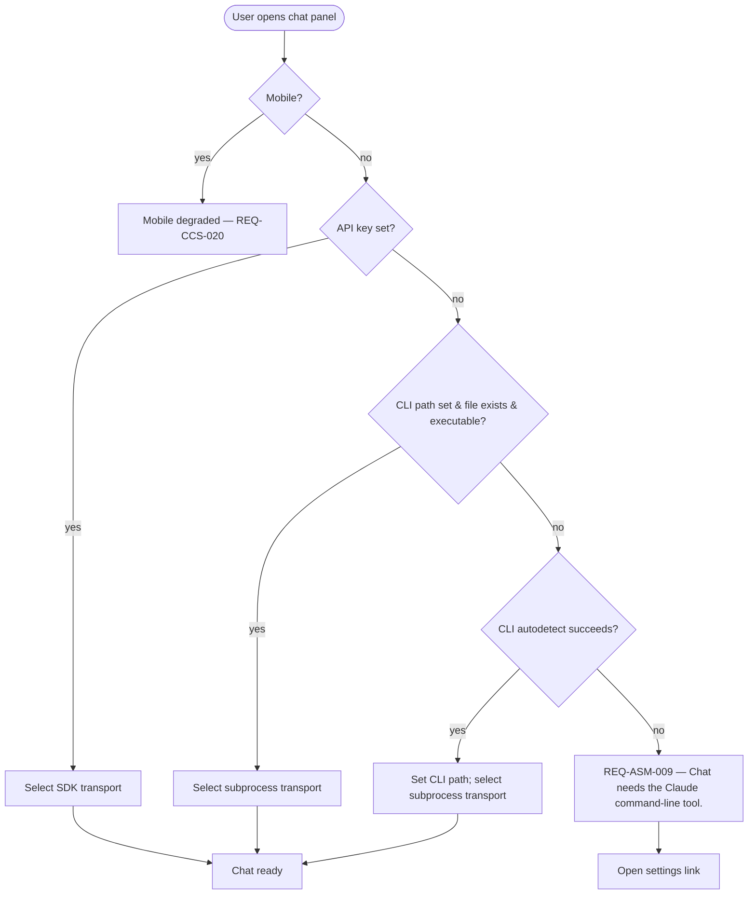
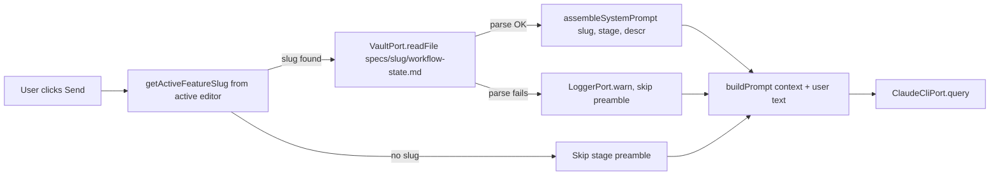
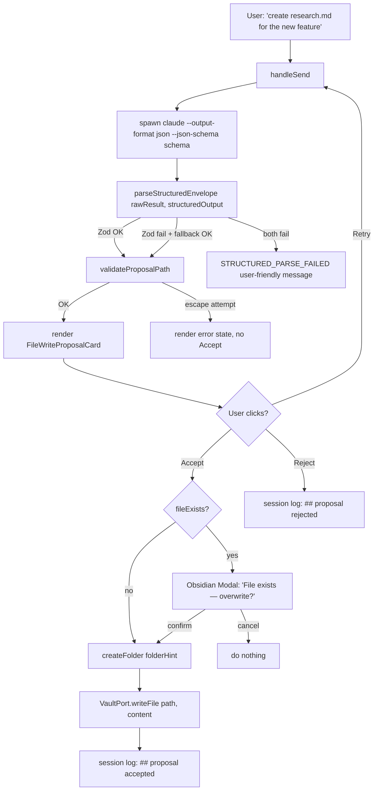
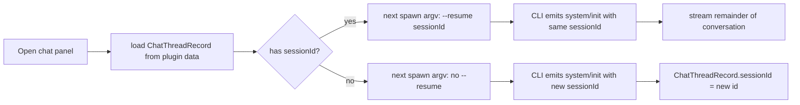

# Design — Agent Sidepanel MVP (Increment 1)

## Context

The `claude-cli-chat-sidebar` (CCS, PRD-CCS-001) ships a chat panel that reaches Claude
exclusively through the `@anthropic-ai/claude-agent-sdk` authenticated with
`ANTHROPIC_API_KEY`. Claude.ai subscription holders without an API key see only the
REQ-CCS-018 degraded state. The May-2026 Agent Sidepanel design brief targets this
gap in Increment 1 and bundles two related deliveries: subscription-mode chat through
a subprocess transport, and trust-first vault writes via a structured proposal
envelope. Both are gated by an explicit user gesture; neither permits the model to
write to the vault without inspection.

This design extends CCS along four axes (transport, system prompt, structured output,
session persistence) and adds two new UI surfaces (proposal card, CLI-path Settings
field). Everything CCS already ships is reused unchanged — port shape (REQ-CCS-021),
chat panel skeleton, error-mapping pattern, 50 000-token context cap, active-file
auto-context, file-menu add-to-context, mobile degradation. The architecture surface
in Part C calls out the extension points one by one.

## Goals (design-level)

- **D1** Subscription holders without an API key can chat by configuring a path to
  their locally installed `claude` binary; no credential is ever pasted into the
  plugin (IDEA-ASM-001 §Success criteria).
- **D2** Transport selection is deterministic, user-visible, and stable across a chat
  thread's lifetime — never silently switching mid-session (REQ-ASM-002, REQ-ASM-003).
- **D3** The chat prompt is enriched with a stage-aware preamble derived from the
  active feature's `workflow-state.md` and applied identically to both transports
  (REQ-ASM-013, REQ-ASM-018).
- **D4** Model-proposed vault writes are inspectable as Accept / Reject proposal
  cards; nothing reaches disk without explicit user action (REQ-ASM-043, NFR-ASM-011).
- **D5** Conversations survive Obsidian restart via `session_id` persistence and
  `--resume` resumption; the plugin never reads any file under `~/.claude/`
  (REQ-ASM-007, REQ-ASM-036, REQ-ASM-037).
- **D6** The CCS UI, port shape, error mapping, and prompt-truncation algorithm are
  reused unchanged; this design is additive (REQ-ASM-051…055).

## Non-goals

- **ND1** Autonomy-dial UI, vault-folder filter, streaming step log, redirect / stop
  controls (Increment 2).
- **ND2** Server-side tool execution (`Read`, `Edit`, `Write`, `Bash`, `Glob`, `Grep`,
  `WebFetch`, `WebSearch` are all disabled — REQ-ASM-028).
- **ND3** Edit / delete / move / non-markdown file proposals (Increment 2; Increment 1
  schema is `createFile` over `.md` only).
- **ND4** Vault-level `audit.md` separate from the per-thread session log (deferred).
- **ND5** Slash-command palette, PR lifecycle cards, stage tracker, lifecycle gate
  (Increments 4–5).
- **ND6** In-product Agent-SDK credit metering (R-ASM-006 onboarding note only).

---

## Part A — UX

### A1. User flows

#### Flow 1 — First-run transport detection

Pre-condition: the user opens the Specorator chat panel for the first time after
installing Increment 1 (or after a settings change to the API key or CLI path).



Selection is performed by `TransportSelector` (Part C, §C2) exactly once per chat
thread. The selection result is stored on the chat-thread DTO. REQ-ASM-003 forbids
mid-session switching: if the active transport later becomes unavailable, the panel
falls into REQ-ASM-009 and requires a thread reload.

User-visible result of each path:

- **SDK selected:** Chat panel renders the ready state. No transport label is shown
  (the user sees no AI/SDK jargon — NFR-CCS-012). If the user has previously used the
  subprocess transport on this thread, they see the prior thread's history rehydrated
  from the session log.
- **Subprocess selected (with auto-detected path):** Chat panel renders the ready
  state. The Settings → "Claude CLI path" field is populated with the discovered path.
  A non-modal status pill at panel-bottom reads "Using your installed Claude tool."
  This is the only place the word *Claude* appears in the chat panel UI.
- **Degraded:** REQ-ASM-009 framed notice; copy in §A3; clicking the link opens
  Settings.

#### Flow 2 — Stage-aware system prompt assembly

Pre-condition: panel is in the ready state; user is about to send.



Assembly happens at every send (REQ-ASM-019 — cache-safe). The active feature is
inferred from the active editor file's vault-relative path (REQ-ASM-011); if no file
is open or the file is not under `specs/<slug>/`, the preamble is omitted
(REQ-ASM-014). Malformed `workflow-state.md` causes a `LoggerPort.warn` and
preamble-skip without a user-visible message (REQ-ASM-015).

The assembled preamble is the slug, the stage display name, and a one-sentence stage
description sourced from `FEATURE_STEPS` (REQ-ASM-017). It never includes raw
`workflow-state.md` body content (REQ-ASM-016). The hard cap is 2 000 characters
(REQ-ASM-020).

Concatenation order at send (asserted by unit test):

1. Stage preamble (if available).
2. Structured-output system-prompt suffix (only on structured calls; REQ-ASM-026).
3. CCS context preamble (REQ-CCS-025, REQ-ASM-054).
4. User text.

#### Flow 3 — Structured JSON action call (file-creation proposal)

Pre-condition: ready state; subprocess transport; user types a message that prompts
the assistant to propose a new file.



Validation pipeline (ADR-0030):

1. Read `.structured_output` from the result envelope. Pass to Zod
   `createFileEnvelopeSchema` with `.strict()`.
2. On Zod failure, extract the first balanced `{…}` from `.result` using a brace-depth
   counter (REQ-ASM-024). Re-validate.
3. On dual failure, return `Result.error` with code `STRUCTURED_PARSE_FAILED`
   (REQ-ASM-025). UI shows "Assistant returned an unexpected response. Please try
   again." Raw model output is never quoted.
4. Path-escape check (REQ-ASM-048) runs after Zod and rejects `..`, leading `/`, and
   any resolution outside the vault root.

Write-side guarantees (ADR-0032):

- No `VaultPort` mutation method runs before the user clicks Accept (NFR-ASM-011).
- Overwrite protection: if `fileExists(path)`, an Obsidian `Modal` subclass surfaces
  a confirmation dialog before the write fires (REQ-ASM-044). Cancel = no-op.
- `folderHint` is created (idempotent) before the write (REQ-ASM-047) and is
  validated to be a non-absolute path and a prefix of `path`.
- A `## proposal` block is appended to the session log on either decision
  (REQ-ASM-046).

#### Flow 4 — Session continuity

Pre-condition: subprocess transport; user has sent at least one message in this
thread previously.



`session_id` is captured from the first `system/init` NDJSON event (REQ-ASM-031)
and stored on the chat-thread DTO. It is mirrored into the session log's frontmatter
(REQ-ASM-033). On Obsidian restart, the thread record is loaded from
`_storedData.specorator.chatThreads` (REQ-ASM-037); the next send carries `--resume
<session_id>` (REQ-ASM-035).

If the session log on disk is missing (user moved or deleted it out-of-band), the
next `system/init` event creates a fresh thread; the data blob is updated to point at
the new log path. Overwrite protection: if the resolved log path already exists with
a different `session_id` in frontmatter, the writer appends `-2`, `-3`, … to the file
stem (REQ-ASM-039).

#### Flow 5 — CLI path Settings field

Pre-condition: the user is in Settings.

1. User opens Specorator Settings tab.
2. Below the "Anthropic API key" field, the user sees "Claude CLI path" with three
   controls: a text input (read-only display of the current path, editable on focus),
   an "Autodetect" button, and a small "Test" button.
3. Static description below the field renders verbatim: "Specorator does not handle
   your Claude.ai credentials. The `claude` CLI you installed manages its own login."
   (REQ-ASM-008.)
4. Clicking "Autodetect":
   - On macOS / Linux: runs `sh -lc 'command -v claude'` (REQ-ASM-004).
   - On Windows: runs `where.exe claude` (REQ-ASM-004).
   - If the command emits multiple lines, the first non-empty line wins; the value
     is validated with `path.isAbsolute` before being stored (REQ-ASM-005).
   - On success, the input is populated; the field's "saved" state reflects the
     change.
   - On failure (binary not found): an inline status reads "Couldn't find the Claude
     command-line tool. Install it and try again, or enter the path manually." with a
     link to the install docs.
5. Clicking "Test":
   - Spawns the binary with `--version`, captures stdout / stderr / exit code.
   - Success: status reads "Found Claude tool version N.N.N." (the version string is
     repeated verbatim — it is the user's own tool, not a Claude.ai surface, so the
     NFR-CCS-012 no-jargon rule allows the literal "Claude tool" but forbids
     "subprocess", "OAuth", "session_id", etc.).
   - Failure: status reads "That doesn't look like a working Claude tool. Check the
     path." (no error stack to the user).
6. Manual edits are persisted on blur via `plugin.updateSettings({ claudeCliPath })`.

### A2. Information architecture

Increment 1 adds no new top-level routes. Everything lives inside the existing
Specorator panel and its `/chat` route. Additions:

| Surface | Where |
|---|---|
| `FileWriteProposalCard` | Rendered inline in `ChatResponse.vue` as a slot, after any assistant text |
| `SessionResumeIndicator` (badge) | Inline in `ChatSidebar.vue` header, only shown when an existing `sessionId` was resumed in this session |
| Subprocess "Using your installed Claude tool." status pill | Footer of `ChatSidebar.vue`, subscription mode only |
| `TransportSelector` (settings-tab field group) | Below the "Anthropic API key" field in `SpecoratorSettingTab` — see Flow 5 |
| Claude CLI path field | Inside the `TransportSelector` group |
| ToS disclosure copy | Inside the `TransportSelector` group |

No new top-nav entry, no new route. Vue Router config is unchanged.

The session log is a vault artifact (ADR-0031). It is *not* a UI surface in Increment
1 — users can open `specs/<feature>/sessions/<id>.md` like any other markdown file,
but the chat panel does not link to it (deferred to the Session tab, Increment 3).

### A3. Empty, loading, and error states copy

All copy is sourced from `src/ui/i18n/locales/en.ts` under the `chat.*` and new
`chat.proposal.*`, `chat.subscription.*`, `chat.settings.*` namespaces. CCS copy is
unchanged.

#### CLI-not-found degraded state (REQ-ASM-009)

- **Heading:** `Chat needs the Claude command-line tool.`
- **Body:** `Install the Claude tool, then set its path in Settings. Specorator does not handle your Claude.ai sign-in.`
- **Action link label:** `Open settings`

Heading receives programmatic focus on mount (`tabindex="-1"`, mirroring NFR-CCS-009).

#### Subprocess starting up (cold-spawn affordance, R-ASM-003)

- **Inline pill below the response area:** `Starting up the Claude tool…`
- Rendered for ≥ 200 ms before the first NDJSON event arrives. Removed silently on
  first `stream_event` or `system/init`.

#### Structured-parse failure (REQ-ASM-025)

- **Response area:** `Assistant returned an unexpected response. Please try again.`
- Rendered inside `role="alert"`. The user's input text is preserved. No raw model
  output appears anywhere.

#### Proposal card states

- **Heading:** `Proposed new file`
- **Path label prefix:** `File:`
- **Content preview heading:** `Content`
- **Rationale label:** `Why:`
- **Show more button:** `Show full content`
- **Show less button:** `Show preview`
- **Accept button:** `Accept`
- **Reject button:** `Reject`
- **Retry button:** `Try again`
- **Path validation failed (in-card error state, no Accept):** `That path isn't valid for this vault.`
- **Overwrite confirmation modal title:** `File already exists`
- **Overwrite confirmation modal body:** `'{path}' already exists in your vault. Overwrite it?`
- **Overwrite modal — confirm:** `Overwrite`
- **Overwrite modal — cancel:** `Keep existing`

After Accept commits, the card transitions to:

- **Accepted state body:** `Saved to '{path}'.` (verbatim, no embellishment)
- **Rejected state body:** `Discarded — no changes were made.`

#### Session-resume indicator (subscription mode only)

- **Badge text (`aria-label` only):** `Continuing prior conversation`
- Visible badge is the literal character "↻" (`aria-hidden="true"`) styled with the
  Obsidian accent colour.

#### Settings — "Claude CLI path" field

- **Field label:** `Claude CLI path`
- **Placeholder:** `/usr/local/bin/claude or C:\…\claude.exe`
- **Description (literal REQ-ASM-008):** `Specorator does not handle your Claude.ai credentials. The Claude command-line tool you installed manages its own login.`
- **Autodetect button:** `Autodetect`
- **Test button:** `Test`
- **Autodetect success:** `Found at {path}.`
- **Autodetect failure:** `Couldn't find the Claude command-line tool. Install it and try again, or enter the path manually.`
- **Test success:** `Found Claude tool version {version}.`
- **Test failure:** `That doesn't look like a working Claude tool. Check the path.`

NFR-ASM-009 forbidden terms verified absent from every value above: "subprocess",
"OAuth", "session_id", "stream-json", "schema", "Zod", "envelope". Allowed user-
visible terms: "Claude command-line tool" / "Claude tool" (the user's own tool —
unavoidable; not a Claude.ai surface).

### A4. Accessibility

#### Proposal card keyboard navigation (REQ-ASM-042, NFR-ASM-007)

Tab order inside a rendered proposal card (top to bottom, left to right):

1. Card heading (`<h3>`, `tabindex="-1"` for programmatic focus only).
2. Path display (read-only `<code>` element, not in tab order).
3. "Show full content" / "Show preview" toggle button.
4. Rationale display (if present, read-only, not in tab order).
5. Accept button (`aria-label="Accept proposed file {path}"`).
6. Reject button (`aria-label="Reject proposed file {path}"`).
7. Retry button (`aria-label="Generate another proposal for {path}"`).

Enter and Space both activate buttons (REQ-ASM-042 acceptance). When the card mounts,
focus moves programmatically to the card heading; assistive tech announces the
heading and the path label together.

#### ARIA live regions

- **Streaming response area:** `aria-live="polite"`, updates batched at ≤ 5 Hz so
  assistive tech is not flooded (NFR-ASM-008).
- **Proposal card on first render:** `role="region"` with `aria-label="File creation
  proposal"`. The card body is *not* a live region — once the proposal arrives, the
  user reads it at their own pace.
- **Overwrite confirmation modal:** native Obsidian `Modal` provides focus trap and
  `role="dialog"` automatically. Close-on-escape is the default.

#### Focus management after Accept / Reject

| Event | Focus destination |
|---|---|
| Accept clicked, write completes | Next interactive element after the card (the text input by default) |
| Accept clicked, overwrite modal opens | First button in the modal (Overwrite) |
| Overwrite confirmed | Text input |
| Overwrite cancelled | Accept button on the card (returns user to the decision) |
| Reject clicked | Text input |
| Retry clicked | (no UI change; new spawn fires; loading state) |

#### Subscription cold-start ARIA

The "Starting up the Claude tool…" pill carries `role="status"` `aria-live="polite"`.
It is announced once and not re-announced on disappearance.

### A5. Requirements coverage (Part A)

| REQ ID | Description | Where addressed in Part A |
|---|---|---|
| REQ-ASM-002 | Transport precedence at startup | Flow 1 diagram |
| REQ-ASM-003 | No mid-session switching | Flow 1 narrative; Flow 4 (rehydration only re-evaluates on reload) |
| REQ-ASM-004 | Claude CLI path Settings field | Flow 5 |
| REQ-ASM-005 | Autodetect first absolute path | Flow 5 step 4 |
| REQ-ASM-008 | Settings ToS disclosure copy | Flow 5 step 3; A3 Settings field |
| REQ-ASM-009 | CLI-not-found degraded state | Flow 1 (degraded branch); A3 CLI-not-found copy |
| REQ-ASM-011 | Active feature detection | Flow 2 (resolve step) |
| REQ-ASM-013 | System prompt assembly | Flow 2 (assemble step) |
| REQ-ASM-014 | Graceful fallback no active feature | Flow 2 (skip branch) |
| REQ-ASM-015 | Graceful fallback malformed workflow-state | Flow 2 (warn branch) |
| REQ-ASM-019 | System prompt cache-safe | Flow 2 narrative — assembly at every send |
| REQ-ASM-021 | Structured output flag pair | Flow 3 (spawn step) |
| REQ-ASM-023 | Zod revalidation | Flow 3 (parse step) |
| REQ-ASM-024 | Defensive parse fallback | Flow 3 (fallback branch) |
| REQ-ASM-025 | Parse failure surfaces to UI | Flow 3 (Err2 branch); A3 structured-parse failure copy |
| REQ-ASM-031 | Capture session_id | Flow 4 (NewInit branch) |
| REQ-ASM-035 | Resume on thread re-open | Flow 4 (Resume branch) |
| REQ-ASM-037 | Survive Obsidian restart | Flow 4 (Hydrate step) |
| REQ-ASM-041 | Proposal card renders validated envelope | Flow 3 (Card step); A3 proposal card states |
| REQ-ASM-042 | Accept / Reject controls | A4 keyboard navigation; A3 button labels |
| REQ-ASM-044 | Overwrite protection | Flow 3 (Confirm step); A3 overwrite modal copy |
| REQ-ASM-045 | Reject leaves vault unchanged | Flow 3 (Reject branch) |
| REQ-ASM-050 | Proposal can be retried | Flow 3 (Retry branch); A3 retry button copy |
| NFR-ASM-007 | Proposal card keyboard navigable | A4 tab order |
| NFR-ASM-008 | aria-live polite for streaming | A4 ARIA live regions |
| NFR-ASM-009 | No AI/SDK jargon | A3 forbidden-term verification |
| NFR-ASM-011 | Trust-first writes | Flow 3 (no mutation before Accept) |

CCS-reused requirements (REQ-ASM-051…055) inherit the CCS design's Part A coverage
unchanged.

---

## Part B — UI (visual design)

### B1. Component inventory

#### New components (Increment 1)

| File | Role |
|---|---|
| `src/ui/components/chat/FileWriteProposalCard.vue` | Renders a validated `CreateFileEnvelope` with Accept / Reject / Retry controls and an overwrite-confirmation modal trigger |
| `src/ui/components/chat/SessionResumeIndicator.vue` | A small badge shown in the chat panel header when the current thread was resumed from a stored `sessionId` |
| `src/ui/components/chat/TransportStatusPill.vue` | Footer pill that reads "Using your installed Claude tool." in subscription mode; absent in SDK mode |
| `src/ui/components/chat/SubprocessStartingPill.vue` | Inline "Starting up the Claude tool…" pill shown briefly during cold spawn (R-ASM-003) |
| `src/ui/components/settings/ClaudeCliPathField.vue` | The "Claude CLI path" settings field with Autodetect and Test buttons |

#### Extensions to existing CCS components

| File | Extension |
|---|---|
| `src/ui/components/chat/ChatSidebar.vue` | Holds the current `chatThreadId` and `sessionId` state; renders `SessionResumeIndicator` and `TransportStatusPill` when applicable |
| `src/ui/components/chat/ChatResponse.vue` | Adds a `proposalCard` slot rendered after the assistant text (or in place of it for pure proposal turns) |
| `src/ui/components/chat/ChatInput.vue` | Unchanged structurally; behaviour preserved |
| `src/plugin/settings.ts` (`SpecoratorSettingTab`) | Adds the `ClaudeCliPathField` group below the API key field |

#### Reused without change

`ContextFileList.vue`, `ContextFileChip.vue`, the Pinia store's existing
`contextFiles` / `userText` / `response` fields, the `degradedNoKey` / `degradedSdk`
/ `degradedMobile` branches (with a new fourth branch `degradedCli` reusing the same
template shape from `src/ui/components/chat/ChatDegradedState.vue` — copy that
component's template literally and swap the i18n keys for the `chat.degradedCli*`
namespace defined in §B3).

### B2. Design tokens

All new UI surfaces inherit Obsidian theme variables. The CCS token table (CSS
custom-property list) is reused unchanged. New tokens introduced by Increment 1:

| New variable / usage | Defined as | Where used |
|---|---|---|
| `--sp-proposal-accent` | `var(--interactive-accent)` | Proposal card left border (4 px), Accept button background |
| `--sp-proposal-warning` | `var(--text-warning, var(--text-muted))` | Path validation failure inline error |
| `--sp-audit-dim` | `var(--text-faint)` | Session log indicator text colour |
| `--sp-resume-badge-fg` | `var(--interactive-accent)` | Session-resume "↻" badge glyph colour |

No raw hex values are introduced — every new variable resolves to an Obsidian theme
token so the chat panel inherits any installed theme automatically.

Spacing follows the CCS pattern: `0.5rem` between card sections, `0.75rem` between
the card and surrounding chat content, 4 px left-border accent on the card.

### B3. Microcopy source

All user-visible strings live in `src/ui/i18n/locales/en.ts`. New keys added (verified
against the NFR-ASM-009 forbidden-term list):

| Key | Value |
|---|---|
| `chat.proposal.heading` | `Proposed new file` |
| `chat.proposal.pathLabel` | `File:` |
| `chat.proposal.contentLabel` | `Content` |
| `chat.proposal.rationaleLabel` | `Why:` |
| `chat.proposal.showMore` | `Show full content` |
| `chat.proposal.showLess` | `Show preview` |
| `chat.proposal.accept` | `Accept` |
| `chat.proposal.reject` | `Reject` |
| `chat.proposal.retry` | `Try again` |
| `chat.proposal.acceptAriaLabel` | `Accept proposed file {path}` |
| `chat.proposal.rejectAriaLabel` | `Reject proposed file {path}` |
| `chat.proposal.retryAriaLabel` | `Generate another proposal for {path}` |
| `chat.proposal.pathInvalid` | `That path isn't valid for this vault.` |
| `chat.proposal.acceptedBody` | `Saved to '{path}'.` |
| `chat.proposal.rejectedBody` | `Discarded — no changes were made.` |
| `chat.proposal.overwriteTitle` | `File already exists` |
| `chat.proposal.overwriteBody` | `'{path}' already exists in your vault. Overwrite it?` |
| `chat.proposal.overwriteConfirm` | `Overwrite` |
| `chat.proposal.overwriteCancel` | `Keep existing` |
| `chat.subscription.starting` | `Starting up the Claude tool…` |
| `chat.subscription.statusPill` | `Using your installed Claude tool.` |
| `chat.subscription.resumeAriaLabel` | `Continuing prior conversation` |
| `chat.degradedCliHeading` | `Chat needs the Claude command-line tool.` |
| `chat.degradedCliBody` | `Install the Claude tool, then set its path in Settings. Specorator does not handle your Claude.ai sign-in.` |
| `chat.degradedCliAction` | `Open settings` |
| `chat.responseStructuredFail` | `Assistant returned an unexpected response. Please try again.` |
| `settings.claudeCliPath.label` | `Claude CLI path` |
| `settings.claudeCliPath.placeholder` | `/usr/local/bin/claude or C:\…\claude.exe` |
| `settings.claudeCliPath.description` | `Specorator does not handle your Claude.ai credentials. The Claude command-line tool you installed manages its own login.` |
| `settings.claudeCliPath.autodetect` | `Autodetect` |
| `settings.claudeCliPath.test` | `Test` |
| `settings.claudeCliPath.autodetectSuccess` | `Found at {path}.` |
| `settings.claudeCliPath.autodetectFailure` | `Couldn't find the Claude command-line tool. Install it and try again, or enter the path manually.` |
| `settings.claudeCliPath.testSuccess` | `Found Claude tool version {version}.` |
| `settings.claudeCliPath.testFailure` | `That doesn't look like a working Claude tool. Check the path.` |

A unit test under `tests/ui/i18n/forbidden-terms.test.ts` enumerates every value in
the `chat.*`, `chat.proposal.*`, `chat.subscription.*`, and `settings.claudeCliPath.*`
namespaces and asserts none contain "subprocess", "OAuth", "session_id", "stream-json",
"schema", "Zod", "envelope", "token" (numeric-budget meaning), "API key" (the user-
visible string is "Anthropic key"), or "system prompt" (NFR-ASM-009 + NFR-CCS-012).

### B4. Requirements coverage (Part B)

| REQ ID | Where addressed in Part B |
|---|---|
| REQ-ASM-004 | B1 `ClaudeCliPathField.vue`; B3 `settings.claudeCliPath.*` keys |
| REQ-ASM-008 | B3 `settings.claudeCliPath.description` (literal copy) |
| REQ-ASM-009 | B1 `ChatSidebar` `degradedCli` branch; B3 `chat.degradedCli*` keys |
| REQ-ASM-025 | B1 `ChatResponse.vue` (structured-fail branch); B3 `chat.responseStructuredFail` |
| REQ-ASM-041 | B1 `FileWriteProposalCard.vue`; B3 `chat.proposal.*` keys |
| REQ-ASM-042 | B1 `FileWriteProposalCard.vue` aria-label bindings; B3 `chat.proposal.acceptAriaLabel`, `rejectAriaLabel` |
| REQ-ASM-044 | B1 overwrite-confirmation modal (Obsidian `Modal` subclass); B3 `chat.proposal.overwrite*` keys |
| REQ-ASM-050 | B1 retry button in card; B3 `chat.proposal.retry` / `retryAriaLabel` |
| REQ-ASM-055 | B1 reuse of CCS `ChatResponse` slot mechanism |
| NFR-ASM-007 | B1 explicit tab-order in `FileWriteProposalCard.vue` |
| NFR-ASM-008 | B1 `ChatResponse` adds `aria-live="polite"` plus debounced update |
| NFR-ASM-009 | B3 forbidden-term unit test |

---

## Part C — Architecture

### C1. System overview

```mermaid
flowchart TB
  subgraph Plugin ["Plugin layer (src/plugin/)"]
    Main["main.ts\nSpecoratorPlugin"]
    Selector["transport/TransportSelector.ts"]
    View["SpecoratorView.ts"]
    Settings["settings.ts\nSpecoratorSettingTab + ClaudeCliPathField"]
  end

  subgraph UI ["UI layer (src/ui/)"]
    ChatSidebar["components/chat/ChatSidebar.vue\n(+ thread/sessionId state)"]
    ChatResponse["components/chat/ChatResponse.vue\n(+ proposalCard slot)"]
    ProposalCard["components/chat/FileWriteProposalCard.vue"]
    ResumeIndicator["components/chat/SessionResumeIndicator.vue"]
    StatusPill["components/chat/TransportStatusPill.vue"]
    StartingPill["components/chat/SubprocessStartingPill.vue"]
    SettingsField["components/settings/ClaudeCliPathField.vue"]
    ChatStore["stores/chatStore.ts\n(+ threads, sessions, proposals)"]
  end

  subgraph Application ["Application layer (src/application/chat/)"]
    BuildPrompt["buildPrompt.ts (existing)"]
    AssemblePrompt["assembleSystemPrompt.ts (new)"]
    ParseEnv["parseStructuredEnvelope.ts (new)"]
    ProposalEnv["proposalEnvelope.ts (new) — Zod schema"]
    ValidatePath["validateProposalPath.ts (new)"]
    CommitProposal["commitProposal.ts (new)"]
    SessionLogWriter["SessionLogWriter.ts (new)"]
    SessionLogPath["sessionLogPath.ts (new)"]
    StagePromptMap["stagePromptMap.ts (new) — uses FEATURE_STEPS"]
  end

  subgraph Domain ["Domain layer (src/domain/)"]
    Port["ports/ClaudeCliPort.ts\n(unchanged shape; extended options)"]
    Settings_d["settings/PluginSettings.ts\n(+ claudeCliPath, transportKind)"]
    Steps["feature/FeatureStep.ts (unchanged source of truth)"]
    Workflow["feature/WorkflowState.ts (unchanged)"]
  end

  subgraph Infrastructure ["Infrastructure layer (src/infrastructure/)"]
    SdkAdapter["obsidian/ClaudeCliAdapter.ts\n(existing — SDK transport)"]
    SubAdapter["obsidian/ClaudeSubprocessAdapter.ts\n(new — subprocess transport)"]
    MockSubAdapter["mock/MockClaudeSubprocessAdapter.ts (new)"]
    Ports_i["bridge/ports.ts\n(CLAUDE_CLI_PORT unchanged)"]
  end

  subgraph External ["External"]
    SDK["@anthropic-ai/claude-agent-sdk"]
    CLI["claude binary (user-installed)"]
    Obsidian["Obsidian API"]
  end

  Main --> Selector
  Selector --> SdkAdapter
  Selector --> SubAdapter
  Selector -.->|"provides via CLAUDE_CLI_PORT"| View
  Main --> View
  Main --> Settings
  Settings --> SettingsField
  View --> ChatSidebar
  ChatSidebar --> ChatResponse
  ChatResponse --> ProposalCard
  ChatSidebar --> ResumeIndicator
  ChatSidebar --> StatusPill
  ChatSidebar --> StartingPill
  ChatSidebar --> ChatStore
  ChatSidebar --> AssemblePrompt
  ChatSidebar --> BuildPrompt
  ChatSidebar --> Port
  ChatSidebar --> ParseEnv
  ChatSidebar --> ValidatePath
  ChatSidebar --> CommitProposal
  ChatSidebar --> SessionLogWriter
  CommitProposal --> SessionLogWriter
  CommitProposal -->|VaultPort| Obsidian
  SessionLogWriter -->|VaultPort| Obsidian
  ParseEnv --> ProposalEnv
  AssemblePrompt --> StagePromptMap
  StagePromptMap --> Steps
  AssemblePrompt --> Workflow
  SdkAdapter -.->|implements| Port
  SubAdapter -.->|implements| Port
  MockSubAdapter -.->|implements| Port
  SdkAdapter --> SDK
  SubAdapter --> CLI
```



Key reuse / extension points:

- The `ClaudeCliPort` shape (REQ-CCS-021) is preserved unchanged. Two adapters
  implement it. The `CLAUDE_CLI_PORT` InjectionKey is unchanged.
- `buildPrompt.ts` is reused as-is. The new `assembleSystemPrompt.ts` returns a
  preamble string that is prepended to the prompt produced by `buildPrompt`.
- `ChatResponse.vue` gains a slot named `proposalCard`; the rest of its API is
  unchanged.
- `PluginSettings` gains two new fields (`claudeCliPath`, `transportKind`) — additive
  per ADR-016 settings-field discipline.

### C2. Component responsibilities

#### New domain layer

| Component | Responsibility |
|---|---|
| `PluginSettings` (extension) | Adds `claudeCliPath: string` (default `''`) and `transportKind: TransportKind` (default `'auto'`). `TransportKind = 'auto' \| 'api-key' \| 'subscription' \| 'degraded'`. Migration: missing fields default; existing settings unaffected |
| `ClaudeCliPort` (extension) | No interface change. `ClaudeCliQueryOptions` gains optional `systemPromptSuffix?: string` and `resumeSessionId?: string`. `ClaudeCliErrorCode` gains `CLI_LAUNCH_FAILED` and `STRUCTURED_PARSE_FAILED` |
| Domain types (new in `src/domain/chat/`) | `ChatThreadRecord`, `TransportKind`, `SessionId` (branded string) |

#### New application services (`src/application/chat/`)

| Service | Signature | Responsibility |
|---|---|---|
| `assembleSystemPrompt` | `(workflowState: WorkflowStateSnapshot \| null, steps: FeatureStepMap): string` | Pure function. Returns the stage-aware preamble or `''` if no snapshot. Truncates at 2 000 chars on a sentence boundary (REQ-ASM-020). Sources stage descriptions from `FEATURE_STEPS` (REQ-ASM-017) |
| `getActiveFeatureSlug` | `(activeFilePath: string \| null, specsFolder: string): string \| null` | Pure. Matches `^<specsFolder>/([^/]+)/` and returns the slug; null otherwise (REQ-ASM-011) |
| `loadWorkflowStateSnapshot` | `(slug: string, vault: VaultPort, logger: LoggerPort): Promise<WorkflowStateSnapshot \| null>` | Reads `specs/<slug>/workflow-state.md`, parses frontmatter, returns null on parse failure with a `logger.warn` (REQ-ASM-015) |
| `proposalEnvelope` | (module-level exports) `createFileEnvelopeSchema: ZodObject`, `createFileEnvelopeJsonSchema: string`, `type CreateFileEnvelope = z.infer<typeof createFileEnvelopeSchema>` | Canonical envelope shape. The JSON Schema is generated once from the Zod schema (REQ-ASM-022) |
| `parseStructuredEnvelope` | `(rawResult: string, structuredOutput: unknown): Result<CreateFileEnvelope, ProposalParseError>` | Primary-parse + defensive-fallback pipeline (REQ-ASM-023, REQ-ASM-024) |
| `validateProposalPath` | `(envelope: CreateFileEnvelope, vaultRoot: string): Result<CreateFileEnvelope, PathValidationError>` | Vault-escape check (REQ-ASM-048) |
| `proposeFileWrite` | `(envelope: CreateFileEnvelope): FileWriteProposal` | Adapts a validated envelope into the UI proposal DTO. Does NOT write anything |
| `commitProposal` | `(proposal: FileWriteProposal, ports: { vault: VaultPort; logger: LoggerPort; sessionLog: SessionLogWriter; confirmOverwrite: ConfirmModalPort }): Promise<Result<void, CommitProposalError>>` | The Accept-side pipeline: `fileExists` → confirm modal → `createFolder(folderHint)` → `writeFile(path, content)` → session-log audit append. Trust-first gate is *external* to this function — caller invokes only after Accept click (REQ-ASM-043…047) |
| `rejectProposal` | `(proposal: FileWriteProposal, sessionLog: SessionLogWriter): Promise<void>` | Appends `## proposal` rejected block; no vault mutation (REQ-ASM-045, REQ-ASM-046) |
| `sessionLogPath` | `(feature: string \| null, sessionId: string, specsFolder: string): string` | Canonical path resolver (REQ-ASM-032) |
| `SessionLogWriter` | `class SessionLogWriter { constructor(vault, logger); appendUserAssistant(...); appendProposalDecision(...); ensureSessionsFolder(...) }` | Per-log-file mutex; fire-and-forget write surfaced to `logger.error` (REQ-ASM-038, REQ-ASM-039, REQ-ASM-040) |
| `stagePromptMap` | `(steps: typeof FEATURE_STEPS): StagePromptMap` | Wraps `FEATURE_STEPS` to expose `getDescription(slug)` and `getDisplayName(slug)` (REQ-ASM-017) |

#### New infrastructure components (`src/infrastructure/obsidian/`)

| Component | Responsibility |
|---|---|
| `ClaudeSubprocessAdapter` | Implements `ClaudeCliPort`. Spawns `claude` via `child_process.spawn` — a fresh short-lived process per `query()` (both free-text streaming and structured one-shot). Multi-turn continuity is achieved by forwarding `--resume <sessionId>` in argv from the caller's `ClaudeCliQueryOptions.resumeSessionId` (the prior turn's captured session id). Consumes NDJSON via `readline`. Captures `session_id` from `system/init`. Enforces argv invariants (no `--bare`; required `--permission-mode dontAsk` etc.). See §C6. (Updated post-Codex P1 on PR #325 — `claude -p` is one-shot, so a long-lived reused process would drop prompts on turn 2+.) |
| `MockClaudeSubprocessAdapter` | Test double mirroring `MockClaudeCliPort`'s field-driven shape. See §C7 |
| `ClaudeBinaryResolver` | Resolves the binary path: (a) Settings value if non-empty; (b) `sh -lc 'command -v claude'` on Unix; (c) `where.exe claude` on Windows; (d) returns `null`. Validates absolute path with `path.isAbsolute` |
| `NdjsonLineStream` | Thin wrapper around `readline.createInterface(child.stdout)` exposing `onSystemInit`, `onStreamEvent`, `onResult` typed callbacks |

#### New plugin-layer components (`src/plugin/`)

| Component | Responsibility |
|---|---|
| `TransportSelector` | Selects between SDK and subprocess adapter based on REQ-ASM-002. Single-entry function `selectTransport(settings, sdk, sub): { port: ClaudeCliPort; kind: TransportKind }`. Pure with respect to settings; instantiated once in `main.ts` |
| `ConfirmModalPort` (port) | Narrow port for "show a yes/no confirmation modal" so `commitProposal` is testable without Obsidian. Domain port in `src/domain/ports/ConfirmModalPort.ts`; implemented in `src/infrastructure/obsidian/ObsidianConfirmModal.ts` |
| `SpecoratorSettingTab` (extension) | Renders the new `ClaudeCliPathField.vue`; on save, calls `plugin.updateSettings({ claudeCliPath })` and `specoratorView.bumpSettingsVersion()` |

#### Modified UI components

| Component | Modification |
|---|---|
| `ChatSidebar.vue` | Adds `chatThreadId` state (UUID generated on first send), `sessionId` state (captured from `system/init`), and a watch on `settingsVersion` that re-runs `TransportSelector` (only on full reload, not mid-thread — REQ-ASM-003). Renders `SessionResumeIndicator`, `TransportStatusPill`, `SubprocessStartingPill`, and the proposal-card flow |
| `ChatResponse.vue` | Adds a `proposalCard` slot. When the assistant turn yields a validated envelope, the slot renders `FileWriteProposalCard` instead of (or after) the assistant text |
| `chatStore.ts` | Adds `chatThreads: Map<threadId, ChatThreadRecord>`, `proposals: Map<proposalId, FileWriteProposal>`. Existing `contextFiles`, `userText`, `response`, `status`, `errorType`, `truncated` fields preserved |

### C3. Data model changes

#### New types

```ts
// src/domain/chat/TransportKind.ts
export type TransportKind = 'auto' | 'api-key' | 'subscription' | 'degraded'

// src/domain/chat/ChatThreadRecord.ts
export interface ChatThreadRecord {
  readonly threadId: string        // plugin-generated UUID v4
  readonly sessionId: string | null
  readonly feature: string | null  // active feature slug at thread creation
  readonly logPath: string         // vault-relative
  readonly transport: 'api-key' | 'subscription'
  readonly createdAt: string       // ISO 8601 UTC
  readonly lastUsedAt: string      // ISO 8601 UTC
}

// src/application/chat/proposalEnvelope.ts
export const createFileEnvelopeSchema = z
  .object({
    action: z.literal('createFile'),
    path: z.string().regex(/^[^/].*\.md$/),
    content: z.string().min(1),
    rationale: z.string().optional(),
    folderHint: z.string().optional(),
  })
  .strict()
  .superRefine((env, ctx) => {
    if (env.folderHint && !env.path.startsWith(`${env.folderHint}/`)) {
      ctx.addIssue({ code: 'custom', message: 'folderHint must be a prefix of path' })
    }
  })
export type CreateFileEnvelope = z.infer<typeof createFileEnvelopeSchema>

// src/application/chat/FileWriteProposal.ts
export interface FileWriteProposal {
  readonly proposalId: string
  readonly threadId: string
  readonly envelope: CreateFileEnvelope
  readonly status: 'pending' | 'accepted' | 'rejected' | 'failed'
  readonly proposedAt: string
  readonly decidedAt: string | null
}

// src/application/chat/StructuredEnvelope.ts (forward-looking discriminated union)
export type StructuredEnvelope =
  | CreateFileEnvelope
  // | EditFileEnvelope   (Increment 2)
  // | DeleteFileEnvelope (Increment 2)

// src/application/chat/SessionLog.ts
export interface SessionLogFrontmatter {
  readonly session_id: string
  readonly feature: string | null
  readonly transport: 'api-key' | 'subscription'
  readonly created: string
  readonly updated: string
}

// Error codes (additions to ClaudeCliErrorCode)
export type ClaudeCliErrorCode =
  | 'NOT_INSTALLED'
  | 'API_KEY_MISSING'
  | 'TIMEOUT'
  | 'QUERY_FAILED'
  | 'CLI_LAUNCH_FAILED'        // new — spawn failed (R-ASM-002 AppArmor/userns)
  | 'STRUCTURED_PARSE_FAILED'  // new — Zod + fallback both failed

// Result error types (each is its own class extending Error, never thrown)
export class ProposalParseError extends Error { errorCode: 'STRUCTURED_PARSE_FAILED' }
export class PathValidationError extends Error { errorCode: 'PATH_INVALID' }
export class CommitProposalError extends Error {
  errorCode: 'OVERWRITE_CANCELLED' | 'FOLDER_CREATE_FAILED' | 'WRITE_FAILED'
}
```

#### Settings additions

```ts
// src/domain/settings/PluginSettings.ts
interface PluginSettings {
  // ...existing fields, including anthropicApiKey...
  readonly claudeCliPath: string        // default: ''
  readonly transportKind: TransportKind // default: 'auto'
}

export const DEFAULT_SETTINGS: PluginSettings = {
  // ...existing defaults...
  claudeCliPath: '',
  transportKind: 'auto',
}
```

**Migration plan.** Both new fields default to safe values: `claudeCliPath = ''`
yields a missing-CLI condition that produces the REQ-ASM-009 degraded state if no API
key is present; `transportKind = 'auto'` selects via the precedence in REQ-ASM-002.
Existing users see no behavioural change unless they hit the new code paths.

A one-line migration helper in `loadSettings()` fills missing fields with defaults
(idempotent). No version bump required; the additive-fields pattern is the ADR-016
convention.

#### Plugin data blob additions

```ts
_storedData = {
  specorator: {
    ...PluginSettings,
    chatThreads: Record<threadId, ChatThreadRecord>   // new
  },
  // ...existing module sub-keys...
}
```

`chatThreads` is keyed by `threadId`. On Obsidian restart, the map is hydrated and
the chat sidebar's last-active thread is restored.

#### No vault-schema change for the feature itself

The session log files at `specs/<feature>/sessions/<id>.md` and
`.specorator/sessions/<id>.md` are plain markdown — they are vault artifacts, not
schema. The frontmatter shape is described in `SessionLogFrontmatter` above and
mirrored in the session-log writer.

### C4. Data flows

#### Flow A — Send a free-text message in subscription mode

```
User clicks Send in ChatInput.vue
  → ChatSidebar.handleSend()
  → activeFile = workspace.getActiveFile()
  → slug = getActiveFeatureSlug(activeFile?.path ?? null, settings.specsFolder)
  → workflowState = slug ? await loadWorkflowStateSnapshot(slug, vault, logger) : null
  → stagePreamble = assembleSystemPrompt(workflowState, stageMap)
  → contextFiles = await readAll(store.contextFiles, vault)
  → { prompt, truncated } = buildPrompt(userText, contextFiles)
  → systemPrompt = stagePreamble    (no structured suffix on free-text)
  → port.query(prompt, {
      timeoutMs: 30_000,
      systemPromptSuffix: systemPrompt,
      resumeSessionId: thread.sessionId,
    })
      → ClaudeSubprocessAdapter.query()
        → argv = buildArgs({ subscription: true, prompt, systemPrompt, sessionId, structured: false })
          // argv = ['claude', '-p', prompt, '--output-format', 'stream-json',
          //         '--verbose', '--include-partial-messages',
          //         '--append-system-prompt', stagePreamble,
          //         '--permission-mode', 'dontAsk',
          //         '--disallowedTools', 'Read,Edit,Write,Bash,Glob,Grep,WebFetch,WebSearch']
          // ──────────────────────────────────────────────────────────────────────
          // Conditional resume tail (appended when resumeSessionId is non-null):
          //   argv.push('--resume', sessionId)
          //   ↳ this is the only argv emission of '--resume'; see §C6 INVARIANT list
          // ──────────────────────────────────────────────────────────────────────
          // INVARIANT: argv does NOT contain '--bare'
        → spawn(binary, argv)
        → NdjsonLineStream.onSystemInit(({ session_id }) => thread.sessionId = session_id)
        → NdjsonLineStream.onStreamEvent(delta => store.appendStreamingText(delta))
        → NdjsonLineStream.onResult(({ is_error, result }) => is_error
            ? resolve(err(ClaudeCliError{QUERY_FAILED}))
            : resolve(ok(result)))
  → on ok: store.setResponse(result); sessionLog.appendUserAssistant(userText, result)
  → on err: store.setError(mapped)
```

Each turn spawns a fresh short-lived `ChildProcess` (REQ-ASM-010 as revised post-Codex
P1 on PR #325). The caller threads the prior turn's captured `sessionId` back through
`ClaudeCliQueryOptions.resumeSessionId`, which `buildSubprocessArgs` emits as
`--resume <id>` in argv (INV-5), so the new spawn picks up the prior conversation
state from Claude Code's own session store. The earlier "long-lived per thread,
reuse the child" idea conflicted with `claude -p`'s one-shot argv semantics:
re-spawn the process while caching its handle for kill-on-unload.

#### Flow B — Send and receive a structured proposal

```
User: 'Please create research.md for feature foo'
  → ChatSidebar.handleSend (same prelude as Flow A)
  → Decide structured vs free-text: detected by user-text classifier OR
    by a system-level intent prefix; in MVP, structured is requested when the
    upcoming turn is a tool-call-style prompt (controlled by ChatSidebar internal
    heuristic; flag `forceStructured` for future use)
  → port.queryStructured(prompt, {                    // new application-level call
      systemPromptSuffix: stagePreamble + '\n\nReturn only the JSON object — no commentary.',
      resumeSessionId: thread.sessionId,
    })
      → ClaudeSubprocessAdapter.queryStructured()
        → argv = buildArgs({ subscription: true, prompt, systemPrompt, sessionId, structured: true })
          // structured: --output-format json --json-schema <createFileEnvelopeJsonSchema>
          //             tools disallowed identically
        → spawn (short-lived; one-shot)
        → collect entire stdout to buffer; child exits
        → JSON.parse(buffer) → { result, structured_output }
        → return ok({ result, structured_output })
  → parseStructuredEnvelope(result, structured_output)
      → primary: createFileEnvelopeSchema.safeParse(structured_output)
      → fallback: extractFirstBalancedObject(result), then re-validate
      → return Result<CreateFileEnvelope, ProposalParseError>
  → validateProposalPath(envelope, vaultRoot)
      → Result<CreateFileEnvelope, PathValidationError>
  → On either failure: store.setError(STRUCTURED_PARSE_FAILED or PATH_INVALID)
                       UI shows REQ-ASM-025 copy; raw output never quoted
  → On success: store.addProposal({ proposalId, threadId, envelope, status: 'pending' })
  → FileWriteProposalCard renders
  → User clicks Accept:
      → commitProposal(proposal, { vault, logger, sessionLog, confirmOverwrite })
        → if (await vault.fileExists(path)) {
            const ok = await confirmOverwrite.show(overwriteCopy);
            if (!ok) return err(CommitProposalError{OVERWRITE_CANCELLED});
          }
        → if (envelope.folderHint) await vault.createFolder(envelope.folderHint)  // idempotent
        → await vault.writeFile(path, content)
        → await sessionLog.appendProposalDecision({ path, decision: 'accepted', decidedAt, rationale })
        → return ok(undefined)
      → On err: store.setProposalStatus(proposalId, 'failed')
      → On ok: store.setProposalStatus(proposalId, 'accepted')
  → User clicks Reject:
      → rejectProposal(proposal, sessionLog)
        → await sessionLog.appendProposalDecision({ path, decision: 'rejected', decidedAt })
      → store.setProposalStatus(proposalId, 'rejected')
  → User clicks Retry:
      → re-execute Flow B from the top with the same userText (REQ-ASM-050)
```

#### Flow C — Resume an existing thread on Obsidian restart

```
plugin.onLayoutReady()
  → plugin.loadSettings()
  → chatThreads = _storedData.specorator.chatThreads
  → for each ChatThreadRecord with sessionId !== null:
      → store.upsertThread(record)
  → user opens chat panel; UI rehydrates the last-active thread
  → ChatSidebar mounts with chatThreadId = record.threadId, sessionId = record.sessionId
  → SessionResumeIndicator visible
  → first send carries --resume <sessionId>; the CLI continues the session
```

#### Flow D — TransportSelector at plugin load

```
plugin.onLayoutReady()
  → settings = plugin.loadSettings()
  → sdkAdapter.startup()
  → subAdapter.startup()       (resolves binary path; does NOT spawn until first query)
  → { port, kind } = selectTransport(settings, sdkAdapter, subAdapter)
      → settings.anthropicApiKey.trim() !== '' → { port: sdkAdapter, kind: 'api-key' }
      → else: settings.claudeCliPath || autodetect → { port: subAdapter, kind: 'subscription' }
      → else: { port: degradedPort, kind: 'degraded' }
  → specoratorView.provide(CLAUDE_CLI_PORT, port)
  → specoratorView.provide(TRANSPORT_KIND_KEY, kind)   // new InjectionKey
```

`TransportSelector` is re-run only on `bumpSettingsVersion()` and only when the
panel is not in an active send. Mid-session re-evaluation is rejected by guard
(REQ-ASM-003).

#### Flow E — Session-log write

```
After each successful turn (free-text or structured), in ChatSidebar:
  → const turn = { user, assistant, timestamps }
  → void sessionLog.appendUserAssistant(thread, turn)   // fire-and-forget
       (UI does not await; per-thread mutex serialises writes)
       → on first write for this feature: vault.createFolder('specs/<feature>/sessions')
       → resolve path: specs/<feature>/sessions/<sessionId>.md or .specorator/sessions/<sessionId>.md
       → if path exists with different session_id: append -2, -3, … (REQ-ASM-039); logger.warn
       → write frontmatter (on create) or append blocks (on subsequent writes)
       → update `updated` timestamp in frontmatter
       → on error: logger.error(error, { redacted sessionId, path })
```

### C5. API / interaction contracts

All new contracts follow `Result<T, E>` (ADR-004). No domain or application function
throws.

#### Extension to `ClaudeCliQueryOptions`

```ts
// src/domain/ports/ClaudeCliPort.ts
export interface ClaudeCliQueryOptions {
  readonly timeoutMs?: number              // existing; clamped [1 000, 300 000]
  readonly maxTurns?: number               // existing; clamped to 1

  // NEW (additive, optional):
  readonly systemPromptSuffix?: string     // passed to --append-system-prompt
  readonly resumeSessionId?: string        // passed to --resume
}
```

Existing call sites that omit the new fields continue to work unchanged. The SDK
adapter ignores `resumeSessionId` (the SDK does not support `--resume`) and logs a
debug-level note if it is provided; subscription users alone benefit from session
continuity.

#### New application contract — `queryStructured` (separate from `query`)

Rather than overload `ClaudeCliPort.query` with a discriminated return type, we add a
new application-layer service that wraps the port for structured-output calls. This
preserves the `Result<string, ClaudeCliError>` shape of `query()` and isolates the
structured-output parsing seam.

```ts
// src/application/chat/queryStructured.ts
export interface StructuredCliRawResult {
  readonly result: string
  readonly structured_output: unknown
}

export async function queryStructured(
  port: ClaudeCliPort,
  prompt: string,
  options: {
    readonly systemPromptSuffix?: string
    readonly resumeSessionId?: string
    readonly timeoutMs?: number
  },
): Promise<Result<CreateFileEnvelope, ProposalParseError | ClaudeCliError>>
```

`queryStructured` calls the port's internal `_runStructured` (subscription transport
only) or returns `err(ClaudeCliError{NOT_INSTALLED})` on the SDK transport (Increment
1 does not support structured calls on the SDK path; the SDK exposes a different
JSON-mode surface deferred to Increment 2). The SDK-versus-subprocess branching is
encapsulated entirely behind the port.

Internally on the subprocess transport, the adapter exposes an additional method
`runStructured(prompt, options)` typed at the infrastructure layer; this is *not*
part of `ClaudeCliPort` (which is unchanged in shape) but is reachable via a tagged
discriminator on the adapter instance. Concretely, `ClaudeSubprocessAdapter`
carries a `readonly kind: 'subprocess' = 'subprocess'` field, and `queryStructured`
performs a single guard before calling the structured method:

```ts
// src/application/chat/queryStructured.ts (sketch)
interface StructuredCapable extends ClaudeCliPort {
  readonly kind: 'subprocess'
  runStructured(prompt: string, options: StructuredOptions):
    Promise<Result<StructuredCliRawResult, ClaudeCliError>>
}

function isStructuredCapable(port: ClaudeCliPort): port is StructuredCapable {
  return (port as { kind?: string }).kind === 'subprocess'
}

if (!isStructuredCapable(port)) {
  return err(new ClaudeCliError('NOT_INSTALLED', 'Structured output requires the subscription transport.'))
}
return port.runStructured(prompt, options)
```

The SDK adapter has no `kind` field, so the user-defined type guard fails closed
and the SDK path returns `err(ClaudeCliError{NOT_INSTALLED})`. This guard is the
single place where the port is widened, and it is unit-tested for both adapters.

Alternative considered and rejected: widening `ClaudeCliPort` with a new method.
Rejected because the SDK transport cannot implement it identically, and ADR-008's
narrow-port discipline prefers a separate adapter capability over a method that
half the implementations cannot honour. The dynamic downcast is the smallest seam
that preserves the narrow-port shape.

#### New domain port — `ConfirmModalPort`

```ts
// src/domain/ports/ConfirmModalPort.ts
export interface ConfirmModalPort {
  /**
   * Shows a modal yes/no prompt. Never throws; resolves with the user's choice.
   * The implementation is responsible for focus trap and Escape-to-cancel.
   */
  show(args: { readonly title: string; readonly body: string; readonly confirmLabel: string; readonly cancelLabel: string }): Promise<boolean>
}
```

Implementations:
- `ObsidianConfirmModal` (production, `src/infrastructure/obsidian/`) — wraps an
  Obsidian `Modal` subclass.
- `FakeConfirmModal` (tests, `tests/__fakes__/`) — field-driven (`nextResult: boolean`).

The port is provided via a new `CONFIRM_MODAL_PORT` InjectionKey in
`src/infrastructure/bridge/ports.ts`. Consumers (`commitProposal`) depend on the port
directly per ADR-008.

#### `assembleSystemPrompt` signature

```ts
// src/application/chat/assembleSystemPrompt.ts
export interface WorkflowStateSnapshot {
  readonly feature: string
  readonly stage: string           // canonical step slug, e.g. 'design'
  readonly status: string
}

export function assembleSystemPrompt(
  snapshot: WorkflowStateSnapshot | null,
  stageMap: StagePromptMap,
  options?: { readonly maxChars?: number },  // default 2 000
): string
```

Pure function. Returns `''` when `snapshot === null`. On a non-null snapshot, returns:

```
You are assisting with feature "<feature>" at the "<stageDisplayName>" stage.
<one-sentence stage description from FEATURE_STEPS>
```

If the assembled string exceeds `maxChars`, it is truncated at the last preceding
`. ` (period + space) within `maxChars`; if no such boundary exists, hard-truncated
to `maxChars` (REQ-ASM-020).

No I/O, no logger calls; the function is fully synchronous and pure.

#### `parseStructuredEnvelope` signature

```ts
// src/application/chat/parseStructuredEnvelope.ts
export function parseStructuredEnvelope(
  rawResult: string,
  structuredOutput: unknown,
): Result<CreateFileEnvelope, ProposalParseError>
```

Pipeline (single function call, no I/O):

1. If `structuredOutput !== undefined && structuredOutput !== null`:
   - `safeParse(structuredOutput)` against `createFileEnvelopeSchema`.
   - On success → `ok(parsed)`.
2. Defensive fallback: `extractFirstBalancedObject(rawResult)`.
   - Brace-depth counter starting at the first `{` after position 0.
   - Tracks string state (inside vs outside `"`) and escape state (`\"`).
   - Returns the substring from the matched `{` to its balancing `}`, or `null`.
   - Critically handles `"content": "outer { inner } outer"` correctly because the
     `{` inside the JSON string is skipped while `inString === true`.
3. If fallback substring found:
   - `JSON.parse(substring)` (wrap in try/catch — returns `null` on syntax error).
   - `safeParse(parsedObject)` against `createFileEnvelopeSchema`.
   - On success → `ok(parsed)`.
4. Both failed → `err(new ProposalParseError(...))`.

The fallback parser is exported as `extractFirstBalancedObject` for direct unit
testing against the F4 failure modes (preamble + braces, fenced JSON, truncated
JSON, JSON with nested objects inside strings).

#### `commitProposal` signature

```ts
// src/application/chat/commitProposal.ts
export interface CommitProposalDeps {
  readonly vault: VaultPort
  readonly logger: LoggerPort
  readonly sessionLog: SessionLogWriter
  readonly confirmOverwrite: ConfirmModalPort
}

export async function commitProposal(
  proposal: FileWriteProposal,
  deps: CommitProposalDeps,
): Promise<Result<void, CommitProposalError>>
```

Pipeline (REQ-ASM-043, REQ-ASM-044, REQ-ASM-047):

1. `if (await deps.vault.fileExists(proposal.envelope.path))`:
   - `const ok = await deps.confirmOverwrite.show({ title, body, confirmLabel, cancelLabel })`
   - If `!ok` → `return err(new CommitProposalError('OVERWRITE_CANCELLED', ...))`
2. `if (proposal.envelope.folderHint)`:
   - `try { await deps.vault.createFolder(proposal.envelope.folderHint) } catch (e) { return err(new CommitProposalError('FOLDER_CREATE_FAILED', ..., e)) }`
3. `try { await deps.vault.writeFile(proposal.envelope.path, proposal.envelope.content) }`
   `catch (e) { return err(new CommitProposalError('WRITE_FAILED', ..., e)) }`
4. `await deps.sessionLog.appendProposalDecision({ proposal, decision: 'accepted', decidedAt: nowIso() })`
5. `return ok(undefined)`

Trust-first invariant: `commitProposal` is invoked **only** from the Accept button
click handler. The proposal's `status` field carries `'pending'` until commit
resolves; the UI gates the Accept button on `status === 'pending'`.

#### `SessionLogWriter` API

```ts
// src/application/chat/SessionLogWriter.ts
export class SessionLogWriter {
  constructor(
    private readonly vault: VaultPort,
    private readonly logger: LoggerPort,
    private readonly specsFolder: string,
  )

  ensureSessionsFolder(feature: string | null): Promise<Result<void, VaultError>>
  appendUserAssistant(thread: ChatThreadRecord, turn: { user: string; assistant: string }): Promise<void>
  appendProposalDecision(args: { thread: ChatThreadRecord; proposal: FileWriteProposal; decision: 'accepted' | 'rejected'; decidedAt: string }): Promise<void>
}
```

All write methods are fire-and-forget at the call site (caller does not await). Errors
are logged via `logger.error` with the `sessionId` redacted to its first 8 characters.
Per-log-file mutex (`Map<logPath, Promise<void>>`) serialises writes; this is
internal to the writer and not exposed.

#### `ClaudeSubprocessAdapter` public surface

The adapter implements `ClaudeCliPort` plus the infrastructure-internal
`runStructured` method (reached via `queryStructured`).

```ts
class ClaudeSubprocessAdapter implements ClaudeCliPort {
  query(prompt: string, options?: ClaudeCliQueryOptions): Promise<Result<string, ClaudeCliError>>
  isAvailable(): Promise<boolean>
  startup(): Promise<void>
  shutdown(): void

  // Infrastructure-internal (reached only via queryStructured application service):
  runStructured(prompt: string, options: StructuredOptions): Promise<Result<StructuredCliRawResult, ClaudeCliError>>
}
```

No method throws. Every method returns `Result` or a primitive (`boolean`, `void`).

### C6. `ClaudeSubprocessAdapter` — class outline

`src/infrastructure/obsidian/ClaudeSubprocessAdapter.ts`

```
class ClaudeSubprocessAdapter implements ClaudeCliPort
  private _available: boolean
  private _ready: boolean
  private _binaryPath: string | null
  private _getSettings: () => PluginSettings
  private _logger: LoggerPort
  private _binaryResolver: ClaudeBinaryResolver
  private _streamingProc: Map<string, ChildProcess>   // keyed by threadId

  startup(): Promise<void>
    1. Idempotent; return if _ready.
    2. _binaryPath = settings.claudeCliPath || await _binaryResolver.resolve()
    3. If null → _available = false; _ready = true; return  (degraded state — REQ-ASM-009)
    4. Validate path is absolute → if not, _available = false; return
    5. Optional: spawn '<binaryPath> --version'; record version in debug log
    6. _available = true; _ready = true

  isAvailable(): Promise<boolean>
    → _available && _binaryPath !== null

  shutdown(): void
    → for each streaming proc → child.kill('SIGTERM')
    → _streamingProc.clear()
    → _ready = false; _available = false

  query(prompt, options?): Promise<Result<string, ClaudeCliError>>
    Guards:
      - !_available → err({ NOT_INSTALLED | CLI_LAUNCH_FAILED })
    Build argv:
      - buildArgs({ subscription: true, structured: false, prompt,
                    systemPromptSuffix: options.systemPromptSuffix,
                    resumeSessionId: options.resumeSessionId })
      - INVARIANT 1: argv does not contain '--bare'         (REQ-ASM-006)
      - INVARIANT 2: argv contains '--permission-mode dontAsk'
                     and '--disallowedTools Read,Edit,...'   (REQ-ASM-028)
      - INVARIANT 3: argv contains '--output-format stream-json --verbose --include-partial-messages'
                     and does NOT contain '--json-schema'    (REQ-ASM-027)
    Spawn:
      - child = spawn(_binaryPath, argv, { stdio: ['ignore', 'pipe', 'pipe'] })
      - On spawn error → err({ CLI_LAUNCH_FAILED, cause: e }) (R-ASM-002)
    Stream:
      - reader = readline.createInterface({ input: child.stdout })   (REQ-ASM-029)
      - For each line:
          json = safeParse(line)
          if json?.type === 'system/init' → emit sessionId via callback
          if json?.type === 'stream_event' → emit delta via callback
          if json?.type === 'result':
            if json.is_error → return err({ QUERY_FAILED, cause: json })
            else → return ok(json.result)                  (REQ-ASM-030)
    Timeout:
      - clamp options.timeoutMs to [1 000, 300 000]; default 30 000
      - on timeout: child.kill('SIGTERM'); return err({ TIMEOUT })
    Exit code:
      - on close(exitCode): if no result event seen → err({ QUERY_FAILED, cause: { exitCode } })
                                                               (REQ-ASM-030)

  runStructured(prompt, options): Promise<Result<StructuredCliRawResult, ClaudeCliError>>
    (Same as query() but with structured: true and one-shot process)
    Build argv:
      - INVARIANT 4: argv contains '--output-format json --json-schema <createFileEnvelopeJsonSchema>'
                     (REQ-ASM-021)
      - INVARIANT 5: argv does NOT contain '--include-partial-messages' or 'stream-json'
                     (one-shot JSON only)
      - INVARIANT 6: argv ends '--append-system-prompt <suffix + structured suffix>'
                     where suffix includes "Return only the JSON object — no commentary."
                     (REQ-ASM-026)
      - All other invariants from query() preserved
    Spawn fresh short-lived process (REQ-ASM-049).
    Collect stdout to a buffer (no readline; the response is one JSON blob).
    On close:
      - if exitCode === 0 → JSON.parse(buffer) → ok({ result, structured_output })
      - else → err({ QUERY_FAILED, cause: { exitCode, stderr } })
    Timeout same as query().

  private _buildArgs(opts): string[]
    Single source of truth for argv assembly. Unit-tested under
    tests/infrastructure/obsidian/subprocess-args.test.ts for every invariant.

  private _mapError(e: unknown, ctx): ClaudeCliError
    - timeout → TIMEOUT
    - ENOENT / spawn error → CLI_LAUNCH_FAILED
    - non-zero exit → QUERY_FAILED
    - unknown → QUERY_FAILED
    No path or stderr containing the binary path is included in the user-facing
    error message (NFR-ASM-005).
```

Key implementation rules:

- **Never use `--bare`** (REQ-ASM-006, D-ASM-002). A static-string-literal assert in
  `_buildArgs` checks the final argv array.
- **Short-lived per turn (both free-text and structured), with `--resume` chaining
  for multi-turn context** (REQ-ASM-010 as revised post-Codex P1 on PR #325;
  REQ-ASM-049). Each `query()` spawns a fresh subprocess; the adapter's
  `_activeChildren: Set` field exists only so `shutdown()` can SIGTERM any
  subprocess mid-response.
  `runStructured` spawns afresh each time and does not consult the map.
- **PATH discovery** delegated to `ClaudeBinaryResolver` (D-ASM-007). Discovery
  happens once at `startup()` if no Settings value is present.
- **Cleanup on plugin unload.** `shutdown()` SIGTERMs all streaming processes and
  clears the map. Synchronous (REQ-CCS-017 family / NFR-ASM-006).
- **No PII in logs** (NFR-ASM-005, NFR-ASM-012). Logger calls in this adapter pass
  `{ transport: 'subscription', sessionId: redact(thread.sessionId), durationMs,
  exitCode }` only.

### C7. `MockClaudeSubprocessAdapter` — configuration fields

`src/infrastructure/mock/MockClaudeSubprocessAdapter.ts` implements `ClaudeCliPort`
and the `runStructured` infrastructure method.

| Field | Type | Default | Purpose |
|---|---|---|---|
| `available` | `boolean` | `true` | Drives `isAvailable()` |
| `cannedSessionId` | `string` | `'mock-session-0001'` | Emitted as the `session_id` on `system/init`-equivalent path |
| `cannedFreeTextResponse` | `string` | `'Mock subscription response.'` | Result string returned from `query()` |
| `cannedStructuredEnvelope` | `CreateFileEnvelope \| null` | A sample valid `createFile` envelope | Used by `runStructured()`; set to `null` to simulate parse-failure |
| `cannedStructuredRawResult` | `string` | `''` | Used as the `.result` field when `cannedStructuredEnvelope === null` to exercise the fallback parser |
| `queryError` | `ClaudeCliError \| null` | `null` | If non-null, both `query()` and `runStructured()` return this error |
| `delayMs` | `number` | `0` | Artificial delay before resolution |
| `queryLog` | `string[]` (readonly) | `[]` | Append-only log of every prompt passed to either method |
| `argsLog` | `ReadonlyArray<string[]>` (readonly) | `[]` | Append-only log of every argv array — used by adapter-shape and invariant tests |
| `simulateStreamDeltas` | `string[]` | `[]` | If non-empty, `query()` invokes a per-delta callback before resolving |

`startup()` is a no-op; `shutdown()` clears the logs. Used by `fakeModulePorts()` to
exercise structured-output and proposal flows without a real `claude` binary.

### C8. Plugin wiring (`src/plugin/main.ts`)

#### Additions to `onload()`

```ts
// Pseudo-code; actual implementation follows the existing main.ts patterns
onload() {
  await this.loadSettings()

  this.sdkAdapter = new ClaudeCliAdapter({                  // existing
    getSettings: () => this.settings,
    logger: this.loggerPort,
  })
  this.subAdapter = new ClaudeSubprocessAdapter({           // NEW
    getSettings: () => this.settings,
    logger: this.loggerPort,
    binaryResolver: new ClaudeBinaryResolver(this.platform),
  })

  this.register(() => this.sdkAdapter.shutdown())
  this.register(() => this.subAdapter.shutdown())

  this.confirmModalPort = new ObsidianConfirmModal(this.app) // NEW

  this.registerView(SpecoratorView.VIEW_TYPE, leaf => new SpecoratorView(leaf, {
    sdkAdapter: this.sdkAdapter,
    subAdapter: this.subAdapter,
    confirmModalPort: this.confirmModalPort,
    selectTransport: (settings) => selectTransport(settings, this.sdkAdapter, this.subAdapter),
    // ...existing dependencies...
  }))

  this.app.workspace.onLayoutReady(async () => {
    await Promise.all([
      this.sdkAdapter.startup(),
      this.subAdapter.startup(),
    ])
    // Both adapters start up unconditionally. `subAdapter.startup()` is cheap when
    // `claudeCliPath` is empty and autodetect fails: it sets `_available = false`
    // and returns without spawning a process. No measurable plugin-load impact.
    // TransportSelector decides which port to provide in the view.
  })

  // existing file-menu, active-leaf-change, URI, ribbon, command registrations
  // unchanged
}
```

#### `SpecoratorView.onOpen()` provides

```ts
this.provide(CLAUDE_CLI_PORT, this.transportSelector().port)
this.provide(TRANSPORT_KIND_KEY, this.transportSelector().kind)   // NEW
this.provide(CONFIRM_MODAL_PORT, this.confirmModalPort)           // NEW
this.provide(IS_MOBILE_KEY, Platform.isMobile)
this.provide(SETTINGS_VERSION_KEY, this.settingsVersion)
```

#### Settings tab additions

`SpecoratorSettingTab.display()` calls a new private method `renderClaudeCliPathField()`
that mounts the `ClaudeCliPathField.vue` component (or equivalent native Obsidian
Setting controls) below the existing API-key field. On change:

```ts
plugin.updateSettings({ claudeCliPath: trimmed })
plugin.specoratorView?.bumpSettingsVersion()
```

`bumpSettingsVersion()` re-evaluates `transportSelector` on the next non-loading
moment of the chat panel (REQ-ASM-003 — never mid-send).

#### Shutdown registration

Both adapters are registered via `this.register(() => adapter.shutdown())` so cleanup
runs on `onunload()`. Streaming `ChildProcess` handles in `_streamingProc` receive
`SIGTERM` and clean up listeners — REQ-CCS-017 family compliance for the new adapter.

### C9. Key decisions

| ID | Decision | Rationale | ADR | Trace |
|---|---|---|---|---|
| D-ASM-101 | Transport split into two adapters behind one narrow port | Subscription path requires subprocess; SDK path requires SDK. ToS-safe revocability is one-file delete. | ADR-0029 | D-ASM-001, D-ASM-006 |
| D-ASM-102 | `--bare` forbidden on the subscription transport | `--bare` disables OAuth and forces API key. | ADR-0029 | D-ASM-002 |
| D-ASM-103 | Structured output via `--json-schema` plus Zod revalidation plus brace-depth fallback | Defence-in-depth against validator regressions and prose preambles. | ADR-0030 | D-ASM-003, D-ASM-004 |
| D-ASM-104 | `createFile` Zod schema is the canonical envelope shape; JSON Schema is generated from it | Single source of truth; type inference into the UI prop. | ADR-0030, ADR-0032 | D-ASM-008 |
| D-ASM-105 | `session_id` in plugin data; conversation log mirrored to `specs/<feature>/sessions/<id>.md` | Survives restart; vault-portable; co-located with feature. | ADR-0031 | D-ASM-005 |
| D-ASM-106 | Plugin never reads any file under `~/.claude/` | ToS posture (no brokering of claude.ai login). | ADR-0031 | D-ASM-009 |
| D-ASM-107 | Trust-first vault writes via Accept/Reject proposal cards; no write before user gesture | Constitutional Article IX (Reversibility) plus NFR-ASM-011. | ADR-0032 | D-ASM-008 |
| D-ASM-108 | Tools disabled on every subprocess invocation (`--permission-mode dontAsk --disallowedTools ...`) | Trust-first: server-side tools would bypass the client-side gate. | ADR-0030 | D-ASM-010 |
| D-ASM-109 | Long-lived process per chat thread for streaming; short-lived per structured call | Amortise macOS signed-app spawn latency; structured calls are stateless | (no new ADR — see note) | F3, R-ASM-003 |
| D-ASM-110 | Stage-aware preamble assembled at every send; sourced from `FEATURE_STEPS`; capped at 2 000 chars | Cache-safe; stage-advance reflected immediately; no terminology drift | (no new ADR) | REQ-ASM-013, REQ-ASM-017, REQ-ASM-019, REQ-ASM-020 |
| D-ASM-111 | `runStructured` is infrastructure-internal, reached via application-layer `queryStructured`; not a `ClaudeCliPort` method | SDK adapter cannot honour it identically; narrow-port discipline preserved | (informal) | ADR-008 |
| D-ASM-112 | `ConfirmModalPort` is a new narrow port for the overwrite-confirmation modal | `commitProposal` must be testable without Obsidian; ADR-008 discipline | (extension of ADR-008) | REQ-ASM-044 |

**Note on D-ASM-109 (no ADR).** The reviewer asked whether the long-lived-per-thread
lifecycle warrants a standalone ADR. We hold the line for Increment 1: the decision
is a *performance* posture (amortising spawn latency) rather than an irreversible
architectural commitment — both adapters still implement the same `ClaudeCliPort`
contract, and switching to short-lived-per-turn streaming would be a single-file
change to `ClaudeSubprocessAdapter` with no port-shape or call-site impact. We will
escalate to an ADR in Increment 2 if (a) the `_streamingProc` map grows additional
state-management concerns (back-pressure, queueing, multi-tab fan-out) that span
files, or (b) telemetry shows the warm-spawn assumption does not hold on a class of
user machines we need to support. Until then, the decision remains a design-level
implementation note, documented here and traced to R-ASM-003.

### C10. Rejected alternatives

| Alternative | Why rejected |
|---|---|
| Agent SDK with OAuth for subscription users | Anthropic ToS forbids brokering claude.ai login; Agent SDK overview explicitly directs to API keys for third-party integrations (F2, F6). |
| Bundling the `claude` binary with the plugin | Plugin size; binary licensing; updates would lag Anthropic; violates "uses the `claude` CLI you already installed" posture (F6). |
| Mirroring `~/.claude/projects/*.jsonl` as the session log | Requires the plugin to read files under `~/.claude/`, which the ToS posture forbids (REQ-ASM-007, REQ-ASM-036, F6). |
| Building a claude.ai login UI inside the plugin | Forbidden by Anthropic ToS (F2, F6); shipping it would put distribution at risk. |
| `CLAUDE_CODE_OAUTH_TOKEN` Settings field | The token is intended for the user's own CI/scripts; accepting it as plugin-settable would broker an OAuth credential, violating ToS posture (F6). |
| Per-message JSONL on disk owned by the plugin | Duplicates work the CLI already does in `~/.claude/projects/...`; plugin would track state the CLI already tracks; we use `--resume` and `session_id` instead (D-ASM-005). |
| Free-text + regex extraction of `{…}` from `.result` | Regex on free text cannot distinguish the envelope from braces inside content fields or code-fenced examples (F4); brace-depth counter is the minimum-correct parser. |
| Trust `.structured_output` blindly without Zod revalidation | Single upstream change could corrupt every vault write (R-ASM-004); defence-in-depth is the only acceptable posture given trust-first writes. |
| Write-then-undo with a time-bounded revert window | Violates trust-first by construction — the write has already happened; Sync may have already propagated; git hooks may have already fired. |
| Enabling server-side tools (`Read`/`Edit`/`Write`/...) | Would bypass the client-side Accept gate; violates trust-first. Tools explicitly disabled on every invocation (REQ-ASM-028). |
| Widening `ClaudeCliPort` with a `queryStructured` method | SDK adapter cannot honour it identically in Increment 1; ADR-008 prefers one capability per port over a method some implementations can't keep. |
| Mid-session transport switching on availability change | Violates REQ-ASM-003; users would lose context predictability. Degraded state + reload is the deterministic path. |
| Storing the conversation log inside `_storedData` (no vault mirror) | Loses vault portability, grep-ability, version-control; not aligned with the Specorator workflow's "specs are source of truth" principle. |
| Settings field for the OAuth token rather than the binary path | Stores a credential we have no business storing (F6); the binary path is sufficient because the binary owns its own credential. |
| `--output-format json` (no schema) | Failure modes from F4 hit the user routinely; structured output is the only acceptable framing for proposal calls. |

### C11. Requirements coverage (Part C)

| REQ / NFR ID | Where addressed |
|---|---|
| REQ-ASM-001 | §C5 — `ClaudeCliPort` shape preserved; both adapters implement it; ADR-0029 |
| REQ-ASM-002 | §C2 `TransportSelector`; §C4 Flow D; ADR-0029 |
| REQ-ASM-003 | §C2 `TransportSelector` re-evaluation rule; §C8 `bumpSettingsVersion` guard |
| REQ-ASM-004 | §C2 `ClaudeBinaryResolver`; §C8 Settings tab additions; §C2 PluginSettings extension |
| REQ-ASM-005 | §C6 `ClaudeBinaryResolver` first-non-empty-line behaviour; `path.isAbsolute` validation |
| REQ-ASM-006 | §C6 INVARIANT 1; argv-builder unit test |
| REQ-ASM-007 | ADR-0031 ToS posture; §C6 logging redaction; custom ESLint rule in ADR-0031 Compliance |
| REQ-ASM-008 | §A3 / §B3 disclosure copy literal; §C8 Settings tab additions |
| REQ-ASM-009 | §A3 CLI-not-found copy; §C6 `startup()` `_available = false` branch |
| REQ-ASM-010 | §C6 `_streamingProc` map; D-ASM-109 |
| REQ-ASM-011 | §C2 `getActiveFeatureSlug`; §C4 Flow A prelude |
| REQ-ASM-012 | §C2 `loadWorkflowStateSnapshot`; §C4 Flow A prelude |
| REQ-ASM-013 | §C2 `assembleSystemPrompt`; §C5 signature |
| REQ-ASM-014 | §C2 `assembleSystemPrompt` returns `''` on null snapshot; §C4 Flow A |
| REQ-ASM-015 | §C2 `loadWorkflowStateSnapshot` `logger.warn` path; §C4 Flow A |
| REQ-ASM-016 | §C5 `assembleSystemPrompt` body — only slug + stage + one-sentence description |
| REQ-ASM-017 | §C2 `stagePromptMap` consults `FEATURE_STEPS` |
| REQ-ASM-018 | §C2 application-layer assembly above the port; §C5 `systemPromptSuffix` on options |
| REQ-ASM-019 | §C5 `assembleSystemPrompt` is pure; called at every send |
| REQ-ASM-020 | §C5 `assembleSystemPrompt` truncation at sentence boundary |
| REQ-ASM-021 | §C6 INVARIANT 4 |
| REQ-ASM-022 | §C3 Zod schema; §C5 `proposalEnvelope`; ADR-0030 snapshot test |
| REQ-ASM-023 | §C5 `parseStructuredEnvelope` step 1; ADR-0030 |
| REQ-ASM-024 | §C5 `parseStructuredEnvelope` steps 2–3 (brace-depth) |
| REQ-ASM-025 | §C3 `ProposalParseError`; §C4 Flow B error branch |
| REQ-ASM-026 | §C6 INVARIANT 6 |
| REQ-ASM-027 | §C6 INVARIANT 3 |
| REQ-ASM-028 | §C6 INVARIANT 2 |
| REQ-ASM-029 | §C6 `readline.createInterface`; §C2 `NdjsonLineStream` |
| REQ-ASM-030 | §C6 `result` event handling; exit-code branch |
| REQ-ASM-031 | §C6 stream `system/init` callback; §C4 Flow A |
| REQ-ASM-032 | §C5 `sessionLogPath` |
| REQ-ASM-033 | §C3 `SessionLogFrontmatter`; §C4 Flow E |
| REQ-ASM-034 | §C5 `SessionLogWriter.appendUserAssistant` |
| REQ-ASM-035 | §C5 `resumeSessionId` option; §C6 argv builder |
| REQ-ASM-036 | ADR-0031 ToS isolation; ESLint rule |
| REQ-ASM-037 | §C3 plugin data blob `chatThreads`; §C4 Flow C |
| REQ-ASM-038 | §C5 `SessionLogWriter.ensureSessionsFolder`; §C4 Flow E |
| REQ-ASM-039 | §C5 `SessionLogWriter` overwrite-protection branch; §C4 Flow E |
| REQ-ASM-040 | §C5 `SessionLogWriter` fire-and-forget; per-log mutex internal |
| REQ-ASM-041 | §B1 `FileWriteProposalCard.vue`; §C4 Flow B render step |
| REQ-ASM-042 | §A4 keyboard navigation; §B1 component |
| REQ-ASM-043 | §C5 `commitProposal` step 3; §C4 Flow B Accept branch |
| REQ-ASM-044 | §C5 `commitProposal` step 1; §C5 `ConfirmModalPort` |
| REQ-ASM-045 | §C5 `rejectProposal` no-vault-mutation invariant |
| REQ-ASM-046 | §C5 `SessionLogWriter.appendProposalDecision`; §C3 SessionLogFrontmatter |
| REQ-ASM-047 | §C5 `commitProposal` step 2; Zod refinement for prefix check |
| REQ-ASM-048 | §C5 `validateProposalPath`; §C4 Flow B PathChk step |
| REQ-ASM-049 | §C6 `runStructured` short-lived spawn |
| REQ-ASM-050 | §B1 retry button; §C4 Flow B Retry branch |
| REQ-ASM-051 | §C2 reuse note — `setActiveFile` unchanged; §C4 Flow A prelude reads `activeFile` |
| REQ-ASM-052 | §C2 reuse note — `setActiveFile(null)` clears auto context |
| REQ-ASM-053 | §C2 reuse note — file-menu handler unchanged |
| REQ-ASM-054 | §C4 Flow A concatenation order; §C2 `assembleSystemPrompt` + `buildPrompt` composition |
| REQ-ASM-055 | §C2 `degradedCli` branch shape mirrors `degradedNoKey` / `degradedSdk`; §C6 `_mapError` |
| NFR-ASM-001 | §C6 long-lived process per thread (subsequent turns warm); §A3 cold-start affordance |
| NFR-ASM-002 | §C6 `readline` line-buffering; §C5 fire-and-forget session-log writes |
| NFR-ASM-003 | §C5 `assembleSystemPrompt` pure + sync |
| NFR-ASM-004 | ADR-0031 Compliance — ESLint rule + integration test |
| NFR-ASM-005 | §C6 log-redaction; argv-builder forbids logging the raw `--append-system-prompt` content |
| NFR-ASM-006 | §C6 `startup()` `_available = false` branch within 500 ms |
| NFR-ASM-007 | §A4 tab order; §C5 `commitProposal` flow |
| NFR-ASM-008 | §A4 ARIA live regions; §B1 debounced streaming updates |
| NFR-ASM-009 | §B3 forbidden-term unit test |
| NFR-ASM-010 | §C6 `ClaudeBinaryResolver` per-platform discovery |
| NFR-ASM-011 | §C5 `commitProposal` invocation only from Accept; §A4 focus management |
| NFR-ASM-012 | §C6 `LoggerPort.debug` record shape; redaction discipline |

---

## Cross-cutting

### Open questions

- **Q1 — Structured-vs-free-text classification.** Increment 1 treats structured
  calls as explicit (the chat UI infers from a "please create / propose a file"
  intent or from an internal flag). The Increment-1 heuristic is deliberately
  conservative and deterministic for tests: a structured call is fired when the
  user-text (case-insensitive) matches `/\b(create|propose|generate|draft|write|add|new)\b[^.]{0,80}\.md\b/i`
  — i.e. an intent verb within ~80 characters of an explicit `.md` filename. All
  other prompts fire the free-text path. A formal classifier (LLM-based intent
  detection, structured-output negotiation) is deferred to Increment 2.
- **Q2 — Multi-thread chat in one panel.** Increment 1 supports one thread per
  panel session; the data model already accommodates multiple threads (the
  `chatThreads` map), but the Session tab UI to switch between them is Increment 3.
- **Q3 — `editFile` / `deleteFile` envelope schema design.** Increment 2 will extend
  the Zod schema to a discriminated union and require a base-revision hash on
  `editFile` for optimistic concurrency. Tracked.

### Risks (delta over RES-ASM-001 §Open risks)

The risks enumerated in RES-ASM-001 (R-ASM-001 through R-ASM-007) are inherited as-is.
Design-level mitigations added by this artifact:

| Risk | Design-level mitigation in this artifact |
|---|---|
| R-ASM-001 (ToS interpretation) | §A3 disclosure copy literal; ADR-0031 ESLint rule; one-adapter-delete revocability via `TransportSelector` |
| R-ASM-002 (Linux sandbox crash) | §C6 `_mapError` produces `CLI_LAUNCH_FAILED`; §A3 surfaces user-friendly degraded state |
| R-ASM-003 (macOS spawn latency) | §C6 long-lived per-thread streaming process; §B1 `SubprocessStartingPill` cold-start affordance |
| R-ASM-004 (schema validator regressions) | §C5 `parseStructuredEnvelope` defensive fallback; Zod `.strict()` defence-in-depth |
| R-ASM-005 (`.specorator/` vault-root pollution) | §C5 `sessionLogPath` with deterministic fallback; documented in Settings |
| R-ASM-006 (Agent-SDK credit-pool surprise) | Onboarding note (Increment 2 — out of scope for this design) |
| R-ASM-007 (Windows PATH discovery) | §C6 `ClaudeBinaryResolver` first-non-empty-line + `path.isAbsolute` validation |

### Performance, security, observability

- **Performance.** `assembleSystemPrompt` is synchronous and pure. The session-log
  write is fire-and-forget; the chat UI is never blocked on disk I/O (REQ-ASM-040,
  NFR-ASM-002). Subprocess spawn is amortised across a chat thread's lifetime via
  the `_streamingProc` map (R-ASM-003 mitigation; NFR-ASM-001).
- **Security.** Three load-bearing isolations: (1) the plugin never reads any file
  under `~/.claude/` (ADR-0031, REQ-ASM-007, REQ-ASM-036, NFR-ASM-004); (2)
  `LoggerPort` output is redacted (NFR-ASM-005, NFR-ASM-012); (3) every vault write
  from a model proposal passes through `commitProposal`, which gates on a user
  gesture (NFR-ASM-011, ADR-0032).
- **Observability.** `LoggerPort.debug` records adapter-level telemetry as
  `{ transport, sessionId: redacted, durationMs, exitCode }`. No PII, no path
  content, no user text. Default `logLevel = warn` keeps the noise floor low; users
  opt in to debug-level diagnostics through the existing Settings field.

---

## Quality gate

- [x] UX: primary flows mapped (Flows 1–5); IA clear; empty/loading/error states
      prescribed (A3).
- [x] UI: key components identified (B1); design tokens enumerated (B2); microcopy
      sourced from i18n (B3); no design files referenced because the existing CCS
      visual language is reused unchanged.
- [x] Architecture: components, data flow, integration points named in C1–C8.
- [x] Alternatives considered and rejected with rationale (C10).
- [x] Irreversible architectural decisions have ADRs (ADR-0029, ADR-0030, ADR-0031,
      ADR-0032).
- [x] Risks have mitigations (Cross-cutting §Risks).
- [x] Every PRD requirement is addressed (A5, B4, C11).
- [x] Every C5 contract returns `Result<T, E>` (ADR-004).
- [x] Every new port satisfies ADR-008 narrow-port discipline (ClaudeCliPort
      unchanged; `ConfirmModalPort` is single-capability).
- [x] Transport selection never falls through to a default that ignores user choice
      (C2 `TransportSelector` — explicit three-way branch).
- [x] No vault write happens without explicit user gesture (C5 `commitProposal`).
- [x] ToS posture (no `~/.claude/` reads) called out in design.md and ADR-0031.
