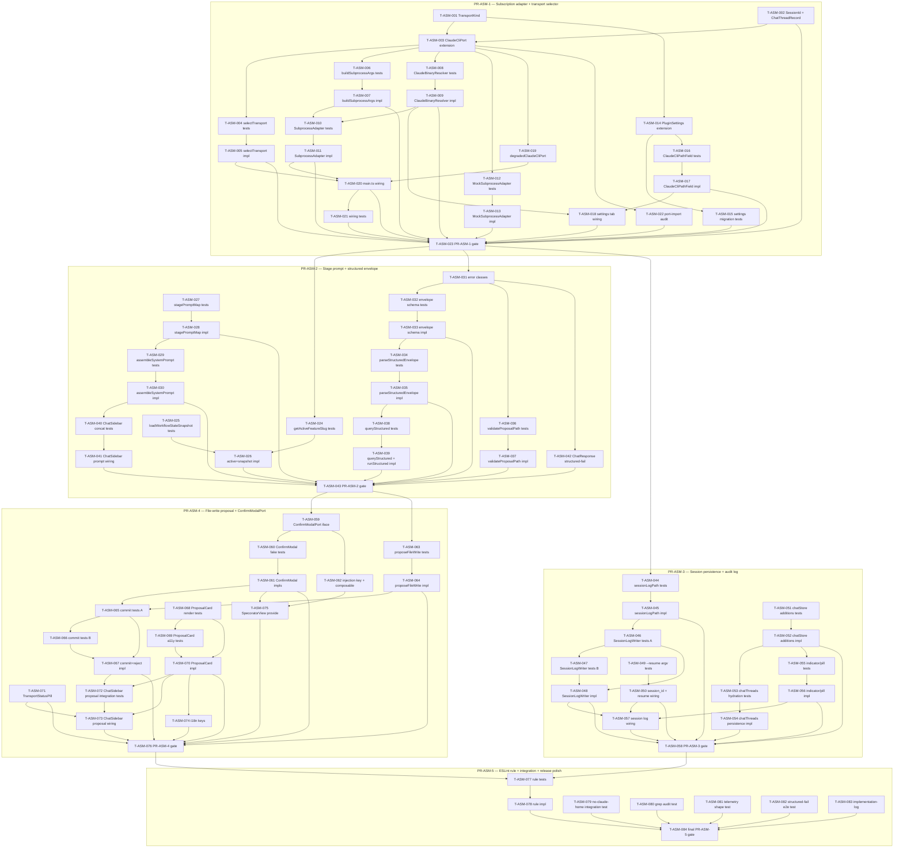

# Tasks — Agent Sidepanel MVP (Increment 1)

Executable plan that breaks SPEC-ASM-001 into ordered, sized, TDD-paired tasks
grouped into five per-PR chunks. Every task is S (≤ 2 h) or M (≤ ½ day); larger
work has been split. Every implementation task (🔨) is preceded by a sibling
test task (🧪) in the same PR. Every PR is cut from `develop` and squash-merged
back to `develop` with a closing `🚀 pre-PR gate` task that runs the full
verification chain (`audit → typecheck → lint → test → build → build:web → docs:api`).

The Stage-1 CCS work (PRs CCS-1/2/3) is already shipped to `develop`; ASM
extends those modules additively. Tasks below reference existing files where
they extend, and new files where the spec requires them.

## Legend

- 🧪 = test task
- 🔨 = implementation task
- 📐 = design / scaffolding task
- 📚 = documentation task
- 🚀 = release / ops task

---

## PR-ASM-1 — Subscription transport adapter + transport selector

**Scope.** Land the second transport behind the existing `ClaudeCliPort` shape:
`TransportKind`, `TransportSelectorFn`, `buildSubprocessArgs`, `ClaudeBinaryResolver`,
`ClaudeSubprocessAdapter`, `MockClaudeSubprocessAdapter`, two new settings
(`claudeCliPath`, `transportKind`) with migration, the rename of the existing
`ClaudeCliAdapter` to live alongside the new adapter, and the `selectTransport`
seam wired into `main.ts` and `SpecoratorView`. After this PR merges, opening
the chat panel with no API key but a discoverable `claude` binary selects the
subscription transport in degraded form (no stage prompt yet, no structured
parsing yet — those land in PR-ASM-2). No new visible chat UI besides the
Settings tab additions and a `CLI_LAUNCH_FAILED` degraded heading.

### T-ASM-001 📐 — `TransportKind` domain type

- **Description:** Create `src/domain/chat/TransportKind.ts` exporting `export type TransportKind = 'auto' | 'api-key' | 'subscription' | 'degraded'`. Re-export from `src/domain/chat/index.ts` if that barrel exists; otherwise leave standalone (CLAUDE.md: domain layer, zero `obsidian` imports).
- **Satisfies:** REQ-ASM-001, REQ-ASM-002
- **Owner:** dev
- **PR group:** PR-ASM-1
- **Depends on:** —
- **Estimate:** S
- **Definition of done:**
  - [ ] `TransportKind.ts` exports the exact four-string union from SPEC-ASM-001 §2.1.
  - [ ] File contains zero `obsidian` / `child_process` imports (ADR-008).
  - [ ] `npm run typecheck` green.

### T-ASM-002 📐 — `SessionId` brand and `ChatThreadRecord` DTO

- **Description:** Create `src/domain/chat/SessionId.ts` (branded string + `asSessionId` constructor) and `src/domain/chat/ChatThreadRecord.ts` per SPEC-ASM-001 §2.2. Keep the `feature: string | null` and `transport: 'api-key' | 'subscription'` fields exactly as specified.
- **Satisfies:** REQ-ASM-031, REQ-ASM-035, REQ-ASM-037
- **Owner:** dev
- **PR group:** PR-ASM-1
- **Depends on:** —
- **Estimate:** S
- **Definition of done:**
  - [ ] Branded `SessionId` type compiles with `asSessionId(raw)` round-trip.
  - [ ] `ChatThreadRecord` matches SPEC-ASM-001 §2.2 field-for-field.
  - [ ] Zero `obsidian` / `child_process` imports.

### T-ASM-003 🔨 — Extend `ClaudeCliPort` with `systemPromptSuffix` and `resumeSessionId`

- **Description:** Add the two `readonly` optional fields to `ClaudeCliQueryOptions` in `src/domain/ports/ClaudeCliPort.ts` per SPEC-ASM-001 §2.6. Extend `ClaudeCliErrorCode` with `'CLI_LAUNCH_FAILED'` per §2.7. Existing SDK call sites continue to compile unchanged.
- **Satisfies:** REQ-ASM-001, REQ-ASM-009, REQ-ASM-013, REQ-ASM-035
- **Owner:** dev
- **PR group:** PR-ASM-1
- **Depends on:** T-ASM-002
- **Estimate:** S
- **Definition of done:**
  - [ ] `ClaudeCliQueryOptions` carries `systemPromptSuffix?: string` and `resumeSessionId?: string`, both `readonly`.
  - [ ] `ClaudeCliErrorCode` union contains `'CLI_LAUNCH_FAILED'` as a fifth member.
  - [ ] `npm run typecheck` green; existing `ClaudeCliAdapter` (SDK) compiles without changes.

### T-ASM-004 🧪 — Tests for `selectTransport` 8-row truth table

- **Description:** Co-located unit tests under `tests/plugin/transport/TransportSelector.test.ts` covering the 8 rows in SPEC-ASM-001 §3.1 plus TEST-ASM-001/002/003. Asserts deterministic ordering, no I/O, and that `cliResolved` is consumed as a plain boolean (no method calls inside the selector).
- **Satisfies:** REQ-ASM-002, REQ-ASM-003
- **Owner:** qa
- **PR group:** PR-ASM-1
- **Depends on:** T-ASM-001, T-ASM-003
- **Estimate:** S
- **Definition of done:**
  - [ ] 8 tests for §3.1 rows R1–R8 (one per row, each asserts `{ port, kind }`).
  - [ ] Selector test never spawns; `deps.cliResolved` is set explicitly per test.
  - [ ] All tests fail before T-ASM-005 lands.

### T-ASM-005 🔨 — `selectTransport` implementation + re-export

- **Description:** Implement `src/plugin/transport/TransportSelector.ts` per SPEC-ASM-001 §2.1 and §3.1. Re-export from `src/application/chat/selectTransport.ts` so UI imports stay in the application layer (SPEC §6.1). Synchronous, pure.
- **Satisfies:** REQ-ASM-002, REQ-ASM-003
- **Owner:** dev
- **PR group:** PR-ASM-1
- **Depends on:** T-ASM-004
- **Estimate:** S
- **Definition of done:**
  - [ ] T-ASM-004 tests pass.
  - [ ] Selector body has zero awaits, zero method calls on `deps.*Adapter`.
  - [ ] Re-export from `src/application/chat/selectTransport.ts` keeps the public import path stable for UI.

### T-ASM-006 🧪 — Tests for `buildSubprocessArgs` invariants INV-1…INV-6

- **Description:** `tests/infrastructure/obsidian/buildSubprocessArgs.test.ts`. Covers TEST-ASM-006 through TEST-ASM-011 (free-text vs structured framing, `--bare` never present, denylist always present, `--resume`, `--append-system-prompt`).
- **Satisfies:** REQ-ASM-006, REQ-ASM-021, REQ-ASM-026, REQ-ASM-027, REQ-ASM-028, REQ-ASM-035
- **Owner:** qa
- **PR group:** PR-ASM-1
- **Depends on:** T-ASM-003
- **Estimate:** S
- **Definition of done:**
  - [ ] At least one test per invariant INV-1…INV-6 (SPEC §3.7).
  - [ ] Property-style fuzz over 100 inputs asserts `'--bare'` never present (TEST-ASM-006).
  - [ ] All tests fail before T-ASM-007.

### T-ASM-007 🔨 — `buildSubprocessArgs` pure argv assembler

- **Description:** Implement `src/infrastructure/obsidian/buildSubprocessArgs.ts` per SPEC-ASM-001 §3.7. Returns `Object.freeze(argv)`. Single source of truth for argv assembly used by both `query` and `runStructured` paths.
- **Satisfies:** REQ-ASM-006, REQ-ASM-021, REQ-ASM-026, REQ-ASM-027, REQ-ASM-028, REQ-ASM-035
- **Owner:** dev
- **PR group:** PR-ASM-1
- **Depends on:** T-ASM-006
- **Estimate:** S
- **Definition of done:**
  - [ ] T-ASM-006 tests pass.
  - [ ] No `obsidian` / `child_process` imports — pure function.
  - [ ] Lint and type checks green.

### T-ASM-008 🧪 — Tests for `ClaudeBinaryResolver`

- **Description:** Tests under `tests/infrastructure/obsidian/ClaudeBinaryResolver.test.ts` covering macOS/Linux `sh -lc 'command -v claude'`, Windows `where.exe claude`, multi-line output (first path wins, REQ-ASM-005), `path.isAbsolute` rejection, and timeout/failure → `null`.
- **Satisfies:** REQ-ASM-004, REQ-ASM-005, NFR-ASM-010
- **Owner:** qa
- **PR group:** PR-ASM-1
- **Depends on:** T-ASM-003
- **Estimate:** S
- **Definition of done:**
  - [ ] Three platform branches each have at least one test (`darwin`, `linux`, `win32`).
  - [ ] Multi-path output of `"/usr/local/bin/claude\n/opt/homebrew/bin/claude"` resolves to `/usr/local/bin/claude` (REQ-ASM-005).
  - [ ] Non-absolute result → resolver returns `null`.

### T-ASM-009 🔨 — `ClaudeBinaryResolver` implementation

- **Description:** Implement `src/infrastructure/obsidian/ClaudeBinaryResolver.ts`. Spawns the platform-appropriate discovery command with a 5 s timeout, parses stdout, takes the first non-empty line, validates `path.isAbsolute`, returns `Promise<string | null>`. Injectable `spawn` for tests.
- **Satisfies:** REQ-ASM-004, REQ-ASM-005, NFR-ASM-010
- **Owner:** dev
- **PR group:** PR-ASM-1
- **Depends on:** T-ASM-008
- **Estimate:** M
- **Definition of done:**
  - [ ] T-ASM-008 tests pass.
  - [ ] `process.platform` switch covers `darwin`, `linux`, `win32`.
  - [ ] No literal `'~/.claude/'` or `'.credentials.json'` strings anywhere in source (NFR-ASM-004).

### T-ASM-010 🧪 — Tests for `ClaudeSubprocessAdapter` (lifecycle + free-text)

- **Description:** `tests/infrastructure/obsidian/ClaudeSubprocessAdapter.test.ts`. Covers TEST-ASM-012 (CLI-not-found → `isAvailable === false` within 500 ms), TEST-ASM-013 (one spawn per thread across 3 turns), TEST-ASM-014 (chunked stdout reassembled via `readline`), TEST-ASM-015 (`is_error: true` and non-zero exit → `QUERY_FAILED`), TEST-ASM-016 (`session/init` → `chatThread.sessionId`), and `shutdown()` SIGTERM/SIGKILL ladder.
- **Satisfies:** REQ-ASM-001, REQ-ASM-009, REQ-ASM-010, REQ-ASM-029, REQ-ASM-030, REQ-ASM-031, NFR-ASM-005, NFR-ASM-006, NFR-ASM-012
- **Owner:** qa
- **PR group:** PR-ASM-1
- **Depends on:** T-ASM-007, T-ASM-009
- **Estimate:** M
- **Definition of done:**
  - [ ] Streaming reuse test asserts `spawn` called exactly once across three same-threadId `query` calls.
  - [ ] Chunked-stdout test concatenates `\n` mid-line and asserts events still dispatch by `type`.
  - [ ] Log-redaction test asserts neither `prompt` body nor `binaryPath` nor user `$HOME` appears in any `LoggerPort` call (NFR-ASM-005).
  - [ ] All tests fail before T-ASM-011.

### T-ASM-011 🔨 — `ClaudeSubprocessAdapter` production implementation

- **Description:** Implement `src/infrastructure/obsidian/ClaudeSubprocessAdapter.ts` per SPEC-ASM-001 §4. Public `readonly kind = 'subscription'`; `_streamingProc: Map<threadId, ChildProcess>`; `startup`, `isAvailable`, `isAvailableSync` (class-only synchronous accessor per §4.2), `query`, `shutdown`. JSDoc restates the ToS posture verbatim (§4 opening paragraph).
- **Satisfies:** REQ-ASM-001, REQ-ASM-009, REQ-ASM-010, REQ-ASM-029, REQ-ASM-030, REQ-ASM-031, NFR-ASM-001, NFR-ASM-005, NFR-ASM-006, NFR-ASM-012
- **Owner:** dev
- **PR group:** PR-ASM-1
- **Depends on:** T-ASM-010
- **Estimate:** M
- **Definition of done:**
  - [ ] T-ASM-010 tests pass.
  - [ ] `implements ClaudeCliPort` declared on the class.
  - [ ] `isAvailableSync()` is not on the `ClaudeCliPort` interface (class-only).
  - [ ] No string literal under `src/infrastructure/obsidian/ClaudeSubprocessAdapter.ts` matches `/~\/\.claude\//` or `/\.credentials\.json/` (NFR-ASM-004).
  - [ ] Lint and type checks green.

### T-ASM-012 🧪 — Tests for `MockClaudeSubprocessAdapter`

- **Description:** `tests/infrastructure/mock/MockClaudeSubprocessAdapter.test.ts`. Field defaults (table in SPEC §5), `queryLog` and `argsLog` append behaviour, `cannedSessionId` emission, `cannedStreamDeltas` callback ordering, `queryError` short-circuits both `query` and `runStructured`, `kind === 'subscription'`.
- **Satisfies:** REQ-ASM-001, REQ-ASM-031, REQ-ASM-049
- **Owner:** qa
- **PR group:** PR-ASM-1
- **Depends on:** T-ASM-003
- **Estimate:** S
- **Definition of done:**
  - [ ] All field defaults in SPEC §5 verified.
  - [ ] `argsLog` populated for every call (used by INV-1…INV-6 assertions in later PRs).
  - [ ] All tests fail before T-ASM-013.

### T-ASM-013 🔨 — `MockClaudeSubprocessAdapter` implementation

- **Description:** Implement `src/infrastructure/mock/MockClaudeSubprocessAdapter.ts` mirroring SPEC §5. Field-driven, no I/O. Default `cannedStructuredEnvelope` exactly as §5.1. Exposes `kind = 'subscription'` for `isSubscriptionCapable` narrowing.
- **Satisfies:** REQ-ASM-001, REQ-ASM-031, REQ-ASM-049
- **Owner:** dev
- **PR group:** PR-ASM-1
- **Depends on:** T-ASM-012
- **Estimate:** S
- **Definition of done:**
  - [ ] T-ASM-012 tests pass.
  - [ ] `implements ClaudeCliPort` and structurally satisfies `SubscriptionCapable` (declared once §2.9 lands in PR-ASM-2; in PR-ASM-1 the `kind` discriminator is present even though the interface is added later).
  - [ ] Lint and type checks green.

### T-ASM-014 🔨 — Extend `PluginSettings` with `claudeCliPath` and `transportKind`

- **Description:** Add the two readonly fields to `src/domain/settings/PluginSettings.ts` per SPEC-ASM-001 §2.12 with defaults `''` and `'auto'`. Extend `PLUGIN_SETTINGS_KEYS` in `src/plugin/loadSettings-migrate.ts` (SPEC §11.1) and `core-settings.ts` mirror per the existing migration pattern. Coercion rules (§11.2) added to the existing `validateSettings` switch.
- **Satisfies:** REQ-ASM-002, REQ-ASM-004
- **Owner:** dev
- **PR group:** PR-ASM-1
- **Depends on:** T-ASM-001
- **Estimate:** S
- **Definition of done:**
  - [ ] `PluginSettings` carries both fields with the exact types in SPEC §2.12.
  - [ ] `DEFAULT_SETTINGS` carries `''` and `'auto'`.
  - [ ] `PLUGIN_SETTINGS_KEYS` tripwire list includes both keys (SPEC §11.1).
  - [ ] Coercion table in §11.2 implemented in `validateSettings`.

### T-ASM-015 🧪 — Tests for settings migration of new fields

- **Description:** Extend `tests/plugin/loadSettings-migrate.test.ts` with the two assertions from SPEC §11.4: legacy flat blob with `claudeCliPath` and `transportKind` at top level promotes both under `specorator`; already-nested `transportKind: 'auto'` is a no-op (double-promotion guard).
- **Satisfies:** REQ-ASM-002, REQ-ASM-004
- **Owner:** qa
- **PR group:** PR-ASM-1
- **Depends on:** T-ASM-014
- **Estimate:** S
- **Definition of done:**
  - [ ] Two new assertions added per SPEC §11.4.
  - [ ] Coercion test: non-string `claudeCliPath` → `''`; unknown `transportKind` → `'auto'`.
  - [ ] All tests pass.

### T-ASM-016 🧪 — Tests for `ClaudeCliPathField.vue`

- **Description:** Co-located `tests/ui/components/settings/ClaudeCliPathField.test.ts` plus PageObject `ClaudeCliPathField.po.ts`. Asserts the five `data-testid` attributes in SPEC §7.5, `aria-describedby` wiring, `update:modelValue` fires on blur with trimmed value, and `autodetect` / `test` emit events.
- **Satisfies:** REQ-ASM-004, REQ-ASM-005, REQ-ASM-008
- **Owner:** qa
- **PR group:** PR-ASM-1
- **Depends on:** T-ASM-014
- **Estimate:** S
- **Definition of done:**
  - [ ] PageObject co-located, exclusive `data-testid` selectors (ADR-009).
  - [ ] Five `data-testid` attributes from §7.5 each have an assertion.
  - [ ] All tests fail before T-ASM-017.

### T-ASM-017 🔨 — `ClaudeCliPathField.vue` component

- **Description:** Implement `src/ui/components/settings/ClaudeCliPathField.vue` per SPEC §7.5. `<script setup>`, no `v-html`. Description renders the literal REQ-ASM-008 disclosure copy.
- **Satisfies:** REQ-ASM-004, REQ-ASM-005, REQ-ASM-008
- **Owner:** dev
- **PR group:** PR-ASM-1
- **Depends on:** T-ASM-016
- **Estimate:** S
- **Definition of done:**
  - [ ] T-ASM-016 tests pass.
  - [ ] Description text matches REQ-ASM-008 byte-for-byte.
  - [ ] No CSS-class / id selectors in tests; no `v-html`.

### T-ASM-018 🔨 — Wire `ClaudeCliPathField` into `SpecoratorSettingTab`

- **Description:** Add `renderClaudeCliPathField()` to `src/plugin/settings.ts` per SPEC §10.2: text input, autodetect and test extra-buttons, status node. `onChange` trims and calls `bumpSettingsVersion()` (existing `_bumpAllViews()` pattern). `handleAutodetect` invokes `ClaudeBinaryResolver.resolve()`. `handleTestBinary` runs `<path> --version` via `child_process.spawnSync` with a 5 s timeout.
- **Satisfies:** REQ-ASM-004, REQ-ASM-005, REQ-ASM-008
- **Owner:** dev
- **PR group:** PR-ASM-1
- **Depends on:** T-ASM-009, T-ASM-017
- **Estimate:** M
- **Definition of done:**
  - [ ] `renderClaudeCliPathField()` called below the existing `renderAnthropicKeyField()` call.
  - [ ] `handleAutodetect` and `handleTestBinary` private methods exist.
  - [ ] `onChange` writes a trimmed value and bumps views.
  - [ ] No literal `'~/.claude/'` or `'.credentials.json'` strings anywhere in settings.ts (NFR-ASM-004).

### T-ASM-019 📐 — `degradedClaudeCliPort` constant for the `'degraded'` selector path

- **Description:** Create `src/infrastructure/bridge/degradedClaudeCliPort.ts` exporting a stub `ClaudeCliPort` whose `isAvailable()` returns `false`, `startup`/`shutdown` are no-ops, and `query()` returns `err(new ClaudeCliError('CLI_LAUNCH_FAILED', '...'))`. Returned by the selector for the four degraded rows in §3.1 (R1, R3, R5, R8). Documented as the single sink for the degraded path.
- **Satisfies:** REQ-ASM-002, REQ-ASM-009
- **Owner:** dev
- **PR group:** PR-ASM-1
- **Depends on:** T-ASM-003
- **Estimate:** S
- **Definition of done:**
  - [ ] `degradedClaudeCliPort` exported as a singleton object frozen with `Object.freeze`.
  - [ ] `query()` returns `Result.error(ClaudeCliError{ CLI_LAUNCH_FAILED })`.
  - [ ] No throws on any method.

### T-ASM-020 🔨 — Wire subscription adapter + selector into `main.ts` and `SpecoratorView`

- **Description:** Per SPEC §9.1: instantiate `ClaudeSubprocessAdapter` with `spawn` statically imported at the top of `main.ts`; `register(() => adapter.shutdown())`; pass it to `SpecoratorView` constructor alongside the existing SDK adapter and a `selectTransport` factory closure. Per §9.2: `onLayoutReady` awaits `Promise.all([sdk.startup(), subscription.startup()])`. Per §9.5: `SpecoratorView.onOpen()` calls `selectTransport(settings)` and provides the resolved `port` via `CLAUDE_CLI_PORT`. `bumpSettingsVersion()` re-runs `selectTransport` only when `store.status !== 'loading'` (REQ-ASM-003).
- **Satisfies:** REQ-ASM-001, REQ-ASM-002, REQ-ASM-003
- **Owner:** dev
- **PR group:** PR-ASM-1
- **Depends on:** T-ASM-005, T-ASM-011, T-ASM-019
- **Estimate:** M
- **Definition of done:**
  - [ ] `child_process.spawn` imported statically at the top of `main.ts` (no dynamic import in `onload`).
  - [ ] Both adapters started under `onLayoutReady` via `Promise.all`.
  - [ ] `bumpSettingsVersion()` guard prevents mid-session switching when `store.status === 'loading'`.
  - [ ] `_specoratorView` receives the `selectTransport` factory via constructor options bag.

### T-ASM-021 🧪 — Tests for the wiring: selector receives correct deps

- **Description:** `tests/plugin/main.transport-wiring.test.ts`. With a `fakeModulePorts()` harness, asserts that when `anthropicApiKey` is set and the subscription mock reports `isAvailableSync() === false`, the SDK adapter is provided through `CLAUDE_CLI_PORT`; when the key is empty and the mock reports `true`, the subscription adapter is provided. Covers TEST-ASM-001 through TEST-ASM-004.
- **Satisfies:** REQ-ASM-001, REQ-ASM-002, REQ-ASM-003
- **Owner:** qa
- **PR group:** PR-ASM-1
- **Depends on:** T-ASM-020
- **Estimate:** S
- **Definition of done:**
  - [ ] Four wiring scenarios covered (api-key set, sub available, both, neither).
  - [ ] Mid-session lock asserts `bumpSettingsVersion()` is a no-op while `store.status === 'loading'`.

### T-ASM-022 🧪 — Static-import audit test for `ClaudeCliPort.ts`

- **Description:** `tests/domain/ports/ClaudeCliPort.import-audit.test.ts`. Reads the file's source text and asserts zero imports of `obsidian`, `child_process`, or `@anthropic-ai/claude-agent-sdk`. Covers TEST-ASM-005.
- **Satisfies:** REQ-ASM-001
- **Owner:** qa
- **PR group:** PR-ASM-1
- **Depends on:** T-ASM-003
- **Estimate:** S
- **Definition of done:**
  - [ ] Single test asserts the port file is ADR-008 clean.
  - [ ] Test fails if any of the three forbidden modules is imported.

### T-ASM-023 🚀 — PR-ASM-1 pre-PR gate

- **Description:** Run the full pre-PR verification gate on the PR-ASM-1 branch.
- **Satisfies:** SPEC-ASM-001 §13.1 release criteria
- **Owner:** dev
- **PR group:** PR-ASM-1
- **Depends on:** T-ASM-002, T-ASM-005, T-ASM-007, T-ASM-009, T-ASM-011, T-ASM-013, T-ASM-015, T-ASM-017, T-ASM-018, T-ASM-020, T-ASM-021, T-ASM-022
- **Estimate:** S
- **Definition of done:**
  - [ ] `npm audit --audit-level=high --omit=dev` — 0 high.
  - [ ] `npm run typecheck` — pass.
  - [ ] `npm run lint` — 0 errors.
  - [ ] `npm run test` — all tests pass.
  - [ ] `npm run build` — pass.
  - [ ] `npm run build:web` — pass.
  - [ ] `npm run docs:api` — pass.

---

## PR-ASM-2 — Stage-aware system prompt + structured JSON envelope parsing

**Scope.** Pure application-layer services that compose with PR-ASM-1's
transport seam: `WorkflowStateSnapshot`, `StagePromptMap`, `getActiveFeatureSlug`,
`loadWorkflowStateSnapshot`, `assembleSystemPrompt`, `createFileEnvelopeSchema`,
`parseStructuredEnvelope`, `validateProposalPath`, `queryStructured`,
`isSubscriptionCapable`, `SubscriptionCapable` interface, the `runStructured`
method on the subscription adapter, and the application-layer error classes
(`EnvelopeParseError`, `PathValidationError`, `CommitProposalError`,
`ClaudeSubscriptionError`). No new UI. `ChatSidebar.vue` is wired to call
`assembleSystemPrompt` for the `--append-system-prompt` value (free-text path
only). Structured parsing is in the codebase but the proposal card surface
arrives in PR-ASM-4 — until then `queryStructured` is callable from tests but
not invoked from production UI.

### T-ASM-024 🧪 — Tests for `getActiveFeatureSlug`

- **Description:** `tests/application/chat/getActiveFeatureSlug.test.ts`. Covers TEST-ASM-018: `specs/foo/idea.md` → `'foo'`; `README.md` → `null`; `specs/foo/sub/bar.md` → `'foo'`; non-matching `specsFolder` setting → `null`.
- **Satisfies:** REQ-ASM-011
- **Owner:** qa
- **PR group:** PR-ASM-2
- **Depends on:** —
- **Estimate:** S
- **Definition of done:**
  - [ ] 4 cases above each have an assertion.
  - [ ] Test fails before T-ASM-026.

### T-ASM-025 🧪 — Tests for `loadWorkflowStateSnapshot`

- **Description:** `tests/application/chat/loadWorkflowStateSnapshot.test.ts`. Uses `fakeModulePorts()` to seed `workflow-state.md`. Covers TEST-ASM-019 (valid YAML returns `{feature, stage, status}`), TEST-ASM-022 (malformed YAML → `logger.warn` called once, returns `null`, no notification), missing file → `null` + warn.
- **Satisfies:** REQ-ASM-012, REQ-ASM-015
- **Owner:** qa
- **PR group:** PR-ASM-2
- **Depends on:** —
- **Estimate:** S
- **Definition of done:**
  - [ ] Valid / malformed / missing branches each tested.
  - [ ] `logger.warn` call count asserted exactly once on the failure paths.
  - [ ] No `NotificationPort` invocation on any branch.

### T-ASM-026 🔨 — `getActiveFeatureSlug` + `loadWorkflowStateSnapshot`

- **Description:** Implement `src/application/chat/assembleSystemPrompt.ts` exports per SPEC §6.2: `getActiveFeatureSlug` (pure regex match), `loadWorkflowStateSnapshot` (async, uses `VaultPort.readFile` and YAML parse). Never throws; on failure returns `null` and logs `warn`.
- **Satisfies:** REQ-ASM-011, REQ-ASM-012, REQ-ASM-015
- **Owner:** dev
- **PR group:** PR-ASM-2
- **Depends on:** T-ASM-024, T-ASM-025
- **Estimate:** S
- **Definition of done:**
  - [ ] Both T-ASM-024 and T-ASM-025 pass.
  - [ ] No throws on any branch.

### T-ASM-027 🧪 — Tests for `StagePromptMap` and `buildStagePromptMap`

- **Description:** `tests/application/chat/stagePromptMap.test.ts`. Asserts every `FEATURE_STEPS` slug resolves to a non-empty `oneLineDescription`; unknown slug returns `null`; static-import audit asserts `stagePromptMap.ts` imports `FEATURE_STEPS` from `src/domain/feature/FeatureStep.ts` (REQ-ASM-017).
- **Satisfies:** REQ-ASM-017
- **Owner:** qa
- **PR group:** PR-ASM-2
- **Depends on:** —
- **Estimate:** S
- **Definition of done:**
  - [ ] Loops over `FEATURE_STEPS` and asserts each has a descriptor.
  - [ ] Unknown slug returns `null`.
  - [ ] Static-import audit asserts no hard-coded stage-name string literals in `stagePromptMap.ts`.

### T-ASM-028 🔨 — `StagePromptMap` and `buildStagePromptMap`

- **Description:** Implement `src/application/chat/stagePromptMap.ts` per SPEC §2.11 and §6.2. Iterates `FEATURE_STEPS` and pairs each slug with a one-sentence description maintained in the same module.
- **Satisfies:** REQ-ASM-017
- **Owner:** dev
- **PR group:** PR-ASM-2
- **Depends on:** T-ASM-027
- **Estimate:** S
- **Definition of done:**
  - [ ] T-ASM-027 tests pass.
  - [ ] Single module file; no string literals containing stage names live outside the descriptor table.

### T-ASM-029 🧪 — Tests for `assembleSystemPrompt`

- **Description:** `tests/application/chat/assembleSystemPrompt.test.ts`. Covers TEST-ASM-020 (slug + display name + one-sentence description present), TEST-ASM-021 (null snapshot → `''`), TEST-ASM-023 (`workflow-state` body containing `"TopSecret"` never reaches the assembled string), TEST-ASM-024 (recomputed each call, no caching), TEST-ASM-025 (5 000-char synthetic description → output ≤ 2 000 chars, sentence boundary).
- **Satisfies:** REQ-ASM-013, REQ-ASM-014, REQ-ASM-016, REQ-ASM-018, REQ-ASM-019, REQ-ASM-020
- **Owner:** qa
- **PR group:** PR-ASM-2
- **Depends on:** T-ASM-028
- **Estimate:** S
- **Definition of done:**
  - [ ] All five TEST-ASM scenarios covered.
  - [ ] Cap test asserts `result.length <= 2_000` and ends at `. ` boundary.

### T-ASM-030 🔨 — `assembleSystemPrompt` pure function

- **Description:** Implement the 7-step algorithm in SPEC §3.2. Default `maxChars = 2_000`. Pure; no I/O.
- **Satisfies:** REQ-ASM-013, REQ-ASM-014, REQ-ASM-016, REQ-ASM-018, REQ-ASM-019, REQ-ASM-020, NFR-ASM-003
- **Owner:** dev
- **PR group:** PR-ASM-2
- **Depends on:** T-ASM-029
- **Estimate:** S
- **Definition of done:**
  - [ ] T-ASM-029 tests pass.
  - [ ] No `VaultPort` / `LoggerPort` injections — `assembleSystemPrompt` itself is pure.

### T-ASM-031 📐 — Application-layer error classes

- **Description:** Create `src/application/chat/errors.ts` with `EnvelopeParseError`, `PathValidationError`, `CommitProposalError`, and `ClaudeSubscriptionError` per SPEC §2.8. All five classes restore the prototype chain via `Object.setPrototypeOf(this, new.target.prototype)`.
- **Satisfies:** REQ-ASM-023, REQ-ASM-025, REQ-ASM-044, REQ-ASM-048
- **Owner:** dev
- **PR group:** PR-ASM-2
- **Depends on:** —
- **Estimate:** S
- **Definition of done:**
  - [ ] All four classes compile with the exact `name` / `errorCode` / `kind` fields in §2.8.
  - [ ] Prototype-chain test (one per class) asserts `instanceof` works.

### T-ASM-032 🧪 — Tests for `createFileEnvelopeSchema` (Zod)

- **Description:** `tests/application/chat/proposalEnvelope.test.ts`. Covers: strict-mode rejects unknown keys; `action !== 'createFile'` rejects; non-md extension rejects; absolute-path rejects; `folderHint` not a prefix of `path` rejects (superRefine); valid envelope round-trips. Includes byte-for-byte JSON-Schema snapshot test (TEST-ASM-026).
- **Satisfies:** REQ-ASM-022, REQ-ASM-023, REQ-ASM-047
- **Owner:** qa
- **PR group:** PR-ASM-2
- **Depends on:** T-ASM-031
- **Estimate:** S
- **Definition of done:**
  - [ ] 6 Zod scenarios above each have an assertion.
  - [ ] Snapshot test asserts `createFileEnvelopeJsonSchema` is byte-stable.

### T-ASM-033 🔨 — `createFileEnvelopeSchema` and JSON-Schema string

- **Description:** Implement `src/application/chat/proposalEnvelope.ts` per SPEC §2.4. `.strict()` + `superRefine` for the folderHint-prefix-of-path rule. Export `createFileEnvelopeJsonSchema` as the byte-frozen JSON Schema string passed to `claude --json-schema`. Forward-looking `UpdateFileAction` / `DeleteFileAction` type names declared but not exported as schemas (Increment 1 ships `createFile` only).
- **Satisfies:** REQ-ASM-022, REQ-ASM-023, REQ-ASM-047
- **Owner:** dev
- **PR group:** PR-ASM-2
- **Depends on:** T-ASM-032
- **Estimate:** S
- **Definition of done:**
  - [ ] T-ASM-032 tests pass.
  - [ ] `createFileEnvelopeJsonSchema` is generated once at module load and frozen.

### T-ASM-034 🧪 — Tests for `extractFirstBalancedObject` + `parseStructuredEnvelope`

- **Description:** `tests/application/chat/parseStructuredEnvelope.test.ts`. Covers TEST-ASM-027 (extra unknown field → `PRIMARY_ZOD_FAILED`), TEST-ASM-028 (`.structured_output` missing, `.result` has prose-wrapped envelope with nested braces inside `content` → balanced scan succeeds), and the three remaining `EnvelopeParseFailureKind` branches (`STRUCTURED_OUTPUT_MISSING`, `FALLBACK_EXTRACTION_FAILED`, `FALLBACK_JSON_PARSE_FAILED`, `FALLBACK_ZOD_FAILED`).
- **Satisfies:** REQ-ASM-023, REQ-ASM-024, REQ-ASM-025
- **Owner:** qa
- **PR group:** PR-ASM-2
- **Depends on:** T-ASM-033
- **Estimate:** S
- **Definition of done:**
  - [ ] All 5 `EnvelopeParseFailureKind` values reachable in tests.
  - [ ] Nested-brace test embeds `{ "content": "foo { bar } baz" }` and asserts the scanner still balances.

### T-ASM-035 🔨 — `parseStructuredEnvelope` + `extractFirstBalancedObject`

- **Description:** Implement `src/application/chat/parseStructuredEnvelope.ts` per SPEC §3.3 and §6.3. Brace-depth scanner tracks string and escape state. Pure; synchronous.
- **Satisfies:** REQ-ASM-023, REQ-ASM-024, REQ-ASM-025
- **Owner:** dev
- **PR group:** PR-ASM-2
- **Depends on:** T-ASM-034
- **Estimate:** M
- **Definition of done:**
  - [ ] T-ASM-034 tests pass.
  - [ ] `extractFirstBalancedObject` exported for direct unit testing.
  - [ ] No regex used to extract the `{…}` block (REQ-ASM-024).

### T-ASM-036 🧪 — Tests for `validateProposalPath`

- **Description:** `tests/application/chat/validateProposalPath.test.ts`. Covers TEST-ASM-030 plus the five `PathValidationFailureKind` cases (`EMPTY`, `LEADING_SLASH`, `CONTAINS_DOTDOT`, `BAD_EXTENSION`, `ESCAPES_VAULT_ROOT`).
- **Satisfies:** REQ-ASM-048
- **Owner:** qa
- **PR group:** PR-ASM-2
- **Depends on:** T-ASM-031
- **Estimate:** S
- **Definition of done:**
  - [ ] All 5 failure kinds reachable.
  - [ ] Valid path round-trips returning `ok(envelope)`.

### T-ASM-037 🔨 — `validateProposalPath` + `posixNormalize` helper

- **Description:** Implement `src/application/chat/validateProposalPath.ts` per SPEC §3.4. Includes the `posixNormalize` helper that collapses `./` and dedupes `//` without filesystem access.
- **Satisfies:** REQ-ASM-048
- **Owner:** dev
- **PR group:** PR-ASM-2
- **Depends on:** T-ASM-036
- **Estimate:** S
- **Definition of done:**
  - [ ] T-ASM-036 tests pass.
  - [ ] `posixNormalize` exported from the same module for direct unit testing.

### T-ASM-038 🧪 — Tests for `isSubscriptionCapable` and `queryStructured`

- **Description:** `tests/application/chat/queryStructured.test.ts`. Covers: SDK adapter (`kind` undefined) → `isSubscriptionCapable === false` → `queryStructured` returns `err(ClaudeCliError{ NOT_INSTALLED })`. Subscription adapter (`kind === 'subscription'`) → `runStructured` is invoked, parsing pipeline runs, valid envelope returned.
- **Satisfies:** REQ-ASM-001, REQ-ASM-021
- **Owner:** qa
- **PR group:** PR-ASM-2
- **Depends on:** T-ASM-013, T-ASM-035
- **Estimate:** S
- **Definition of done:**
  - [ ] Type-guard test asserts `isSubscriptionCapable` fails closed on SDK adapter.
  - [ ] Happy-path test asserts the validated envelope is returned via `parseStructuredEnvelope`.

### T-ASM-039 🔨 — `queryStructured` + `SubscriptionCapable` interface + `runStructured` on subscription adapter

- **Description:** Implement `src/application/chat/queryStructured.ts` per SPEC §2.9 and §6.6. Extend `ClaudeSubprocessAdapter` (PR-ASM-1) with the public `runStructured` method (SPEC §4.2): short-lived spawn per call, collects entire stdout, `JSON.parse`, returns `{ result, structured_output }`. Update `MockClaudeSubprocessAdapter` (PR-ASM-1) with a `runStructured` method that returns `cannedStructuredEnvelope` / `cannedStructuredRawResult`.
- **Satisfies:** REQ-ASM-001, REQ-ASM-021, REQ-ASM-049
- **Owner:** dev
- **PR group:** PR-ASM-2
- **Depends on:** T-ASM-038
- **Estimate:** M
- **Definition of done:**
  - [ ] T-ASM-038 tests pass.
  - [ ] `runStructured` spawns short-lived process; never registered in `_streamingProc` (REQ-ASM-049).
  - [ ] `SubscriptionCapable` interface declared once, both adapters narrowing test green.

### T-ASM-040 🧪 — Tests for `assembleSystemPrompt` concatenation order in `ChatSidebar`

- **Description:** Add a scenario to `tests/ui/components/chat/ChatSidebar.test.ts` (extending the CCS PageObject): given an active feature with a seeded `workflow-state.md`, the prompt argument passed to `query()` is `stagePreamble + ccsContextPreamble + userText`. Covers TEST-ASM-048.
- **Satisfies:** REQ-ASM-013, REQ-ASM-018, REQ-ASM-019, REQ-ASM-054
- **Owner:** qa
- **PR group:** PR-ASM-2
- **Depends on:** T-ASM-030
- **Estimate:** S
- **Definition of done:**
  - [ ] Concatenation order asserted: stage preamble first, then CCS preamble, then user text.
  - [ ] `MockClaudeCliPort.queryLog` is the inspection point.
  - [ ] Stage advance between two sends produces two distinct preambles (TEST-ASM-024).

### T-ASM-041 🔨 — Wire stage prompt into `ChatSidebar.handleSend`

- **Description:** Extend `src/ui/components/chat/ChatSidebar.vue` to call `getActiveFeatureSlug`, `loadWorkflowStateSnapshot`, `assembleSystemPrompt` inside `handleSend` before invoking the port. Pass the assembled string via `options.systemPromptSuffix` (REQ-ASM-013). Recomputed every send — no caching (REQ-ASM-019).
- **Satisfies:** REQ-ASM-013, REQ-ASM-014, REQ-ASM-018, REQ-ASM-019, REQ-ASM-054
- **Owner:** dev
- **PR group:** PR-ASM-2
- **Depends on:** T-ASM-040
- **Estimate:** S
- **Definition of done:**
  - [ ] T-ASM-040 tests pass.
  - [ ] `systemPromptSuffix` passed verbatim to `port.query`.
  - [ ] No new caching introduced.

### T-ASM-042 🔨 — `ChatResponse.vue` `structured-fail` state

- **Description:** Add the new `state === 'structured-fail'` branch to `src/ui/components/chat/ChatResponse.vue` per SPEC §7.8: `
` rendering the i18n key `chat.responseStructuredFail`. Also expose a named `proposalCard` slot for PR-ASM-4 consumption.
- **Satisfies:** REQ-ASM-025
- **Owner:** dev
- **PR group:** PR-ASM-2
- **Depends on:** T-ASM-031
- **Estimate:** S
- **Definition of done:**
  - [ ] New `data-testid="chat-response-structured-fail"` present.
  - [ ] Component test (existing `ChatResponse.test.ts`) extended with one case asserting the state.
  - [ ] Named slot `proposalCard` defined (empty in PR-ASM-2; populated in PR-ASM-4).

### T-ASM-043 🚀 — PR-ASM-2 pre-PR gate

- **Description:** Full pre-PR gate on PR-ASM-2.
- **Satisfies:** SPEC-ASM-001 §13.1
- **Owner:** dev
- **PR group:** PR-ASM-2
- **Depends on:** T-ASM-026, T-ASM-028, T-ASM-030, T-ASM-033, T-ASM-035, T-ASM-037, T-ASM-039, T-ASM-041, T-ASM-042
- **Estimate:** S
- **Definition of done:**
  - [ ] `npm audit --audit-level=high --omit=dev` — 0 high.
  - [ ] `npm run typecheck` — pass.
  - [ ] `npm run lint` — 0 errors.
  - [ ] `npm run test` — all tests pass.
  - [ ] `npm run build` — pass.
  - [ ] `npm run build:web` — pass.
  - [ ] `npm run docs:api` — pass.

---

## PR-ASM-3 — Session ID persistence + audit log

**Scope.** Plugin-data persistence for `chatThreads`, `SessionLogWriter`,
`SessionLogFrontmatter` / `SessionTurnBlock` / `SessionProposalBlock` types,
`resolveSessionLogPath`, async-flush mutex, overwrite suffixing, `--resume`
wiring on the subscription adapter, and `useChatStore` extensions
(`chatThreads`, `activeThreadId`, `streamingText`, `cliStartingUp`,
`sessionResumed`). Hydration on `SpecoratorView.onOpen()`. Also lands two new
visible UI surfaces: `SessionResumeIndicator.vue` and
`SubprocessStartingPill.vue` plus their slots in `ChatSidebar.vue`.

### T-ASM-044 🧪 — Tests for `resolveSessionLogPath`

- **Description:** `tests/application/chat/sessionLogPath.test.ts`. Covers TEST-ASM-031: active feature → `<specsFolder>/<feature>/sessions/<id>.md`; null feature → `.specorator/sessions/<id>.md`; `specsFolder` other than `'specs'` honoured.
- **Satisfies:** REQ-ASM-032
- **Owner:** qa
- **PR group:** PR-ASM-3
- **Depends on:** —
- **Estimate:** S
- **Definition of done:**
  - [ ] 3 cases above each tested.
  - [ ] Pure function, no I/O.

### T-ASM-045 🔨 — `resolveSessionLogPath`

- **Description:** Implement `src/application/chat/sessionLogPath.ts` per SPEC §6.7. Pure.
- **Satisfies:** REQ-ASM-032
- **Owner:** dev
- **PR group:** PR-ASM-3
- **Depends on:** T-ASM-044
- **Estimate:** S
- **Definition of done:**
  - [ ] T-ASM-044 tests pass.

### T-ASM-046 🧪 — Tests for `SessionLogWriter.appendUserAssistant`

- **Description:** `tests/application/chat/SessionLogWriter.test.ts`. Covers TEST-ASM-032 (frontmatter parses with the five named keys), TEST-ASM-033 (one `writeFile` per turn, `updated` newer than `created`), TEST-ASM-036 (`createFolder` called once on first write).
- **Satisfies:** REQ-ASM-033, REQ-ASM-034, REQ-ASM-038
- **Owner:** qa
- **PR group:** PR-ASM-3
- **Depends on:** T-ASM-002, T-ASM-045
- **Estimate:** S
- **Definition of done:**
  - [ ] Three scenarios each have an assertion.
  - [ ] Uses `fakeModulePorts()` for vault + logger.

### T-ASM-047 🧪 — Tests for overwrite suffixing + async flush

- **Description:** Same test file. Covers TEST-ASM-037 (conflicting `session_id` → write goes to `<id>-2.md`, `warn` logged once) and TEST-ASM-038 (1 000 ms mocked write does not block in-memory UI update).
- **Satisfies:** REQ-ASM-039, REQ-ASM-040
- **Owner:** qa
- **PR group:** PR-ASM-3
- **Depends on:** T-ASM-046
- **Estimate:** S
- **Definition of done:**
  - [ ] Overwrite suffix loop verified through `-2`, `-3`, `-4`.
  - [ ] Latency-independence test asserts UI update fires within 100 ms regardless of `writeFile` delay.

### T-ASM-048 🔨 — `SessionLogWriter` class

- **Description:** Implement `src/application/chat/SessionLogWriter.ts` per SPEC §6.7. Per-log-file mutex map serialises writes; `ensureSessionsFolder` (first-write `createFolder`); `appendUserAssistant` (fire-and-forget, errors routed to `logger.error`); `appendProposalDecision` (used by PR-ASM-4 — awaited inline by `commitFileWriteProposal`). Conflict-suffix loop for REQ-ASM-039.
- **Satisfies:** REQ-ASM-033, REQ-ASM-034, REQ-ASM-038, REQ-ASM-039, REQ-ASM-040, REQ-ASM-046, NFR-ASM-002, NFR-ASM-005
- **Owner:** dev
- **PR group:** PR-ASM-3
- **Depends on:** T-ASM-046, T-ASM-047
- **Estimate:** M
- **Definition of done:**
  - [ ] T-ASM-046 and T-ASM-047 tests pass.
  - [ ] Redacted `sessionId` in every `logger.error` call (NFR-ASM-005).
  - [ ] `appendUserAssistant` returns `Promise<void>` not awaited by callers.

### T-ASM-049 🧪 — Tests for `--resume` argv on subsequent turn

- **Description:** Extend `tests/infrastructure/obsidian/ClaudeSubprocessAdapter.test.ts`. Given a thread record with `sessionId='abc-123'`, the next `query()` call's `argsLog` contains `'--resume', 'abc-123'` (TEST-ASM-034). Given `sessionId === null`, `'--resume'` is absent (already covered by INV-5).
- **Satisfies:** REQ-ASM-035
- **Owner:** qa
- **PR group:** PR-ASM-3
- **Depends on:** T-ASM-011
- **Estimate:** S
- **Definition of done:**
  - [ ] Two cases (with and without `sessionId`) covered.
  - [ ] Assertion reads `argsLog` directly.

### T-ASM-050 🔨 — Wire `--resume` and `session_id` capture into subscription adapter

- **Description:** Extend `ClaudeSubprocessAdapter.query` (from PR-ASM-1) to (a) capture the `session_id` emitted in `system/init` and invoke an injected `onSessionIdCaptured(threadId, sessionId)` callback (REQ-ASM-031), (b) honour `options.resumeSessionId` by routing through `buildSubprocessArgs` (REQ-ASM-035).
- **Satisfies:** REQ-ASM-031, REQ-ASM-035
- **Owner:** dev
- **PR group:** PR-ASM-3
- **Depends on:** T-ASM-049
- **Estimate:** S
- **Definition of done:**
  - [ ] T-ASM-049 tests pass.
  - [ ] Callback hook injected through constructor or per-call options bag.

### T-ASM-051 🧪 — Tests for `useChatStore` additions

- **Description:** Extend `tests/ui/stores/chatStore.test.ts` with the new action and state coverage from SPEC §8.1: `upsertThread`, `setActiveThreadId`, `captureSessionId` (mutates thread record sessionId), `markThreadUsed`, `appendStreamingDelta`, `resetStreaming`, `addProposal`, `setProposalStatus`, `setCliStartingUp`, `setSessionResumed`. All existing CCS tests must continue to pass (additive).
- **Satisfies:** REQ-ASM-031, REQ-ASM-037, REQ-ASM-041
- **Owner:** qa
- **PR group:** PR-ASM-3
- **Depends on:** T-ASM-002
- **Estimate:** S
- **Definition of done:**
  - [ ] At least one test per new action.
  - [ ] State default values asserted (SPEC §8.1 table).

### T-ASM-052 🔨 — Extend `useChatStore` with thread / proposal / streaming state

- **Description:** Implement the additive state and action signatures in SPEC §8.1 on `src/ui/stores/chatStore.ts`. No domain class instances cross the store boundary (plain DTOs only). All existing CCS fields preserved.
- **Satisfies:** REQ-ASM-031, REQ-ASM-037, REQ-ASM-041
- **Owner:** dev
- **PR group:** PR-ASM-3
- **Depends on:** T-ASM-051
- **Estimate:** M
- **Definition of done:**
  - [ ] T-ASM-051 tests pass.
  - [ ] CCS chatStore tests all still pass.

### T-ASM-053 🧪 — Tests for plugin-data hydration of `chatThreads`

- **Description:** `tests/plugin/main.chat-threads-hydration.test.ts`. Covers TEST-ASM-035: blob with persisted `chatThreads` → `useChatStore.chatThreads` rehydrated, `activeThreadId` set to the most-recently-used record; missing `chatThreads` key → empty Map. Malformed records filtered with `warn` log.
- **Satisfies:** REQ-ASM-037
- **Owner:** qa
- **PR group:** PR-ASM-3
- **Depends on:** T-ASM-052
- **Estimate:** S
- **Definition of done:**
  - [ ] Three scenarios (present, missing, malformed) covered.

### T-ASM-054 🔨 — Plugin-data blob: read/write `chatThreads` map

- **Description:** Extend `loadSettings-migrate.ts` / `core-settings.ts` to ferry `chatThreads: Record<string, ChatThreadRecord>` under `_storedData.specorator.chatThreads` per SPEC §9.3. Add hydration in `SpecoratorView.onOpen()` per §9.5. Persist on every `markThreadUsed` / `captureSessionId` via a debounced 1 s flush.
- **Satisfies:** REQ-ASM-037
- **Owner:** dev
- **PR group:** PR-ASM-3
- **Depends on:** T-ASM-053
- **Estimate:** M
- **Definition of done:**
  - [ ] T-ASM-053 tests pass.
  - [ ] Malformed records filtered + logged at `warn` per §11.3.
  - [ ] Debounced flush prevents disk thrashing.

### T-ASM-055 🧪 — Tests for `SessionResumeIndicator.vue` and `SubprocessStartingPill.vue`

- **Description:** Co-located component tests with PageObjects (`SessionResumeIndicator.po.ts`, `SubprocessStartingPill.po.ts`). Asserts `data-testid="chat-session-resume"` renders when `resumed === true`, `aria-label` matches `chat.subscription.resumeAriaLabel`; visual `↻` is `aria-hidden`. Pill: visible/hidden binary state with `role="status"`, `aria-live="polite"`.
- **Satisfies:** REQ-ASM-035, NFR-ASM-001, NFR-ASM-008
- **Owner:** qa
- **PR group:** PR-ASM-3
- **Depends on:** T-ASM-052
- **Estimate:** S
- **Definition of done:**
  - [ ] Both components have a PageObject and at least three assertions each.
  - [ ] Tests fail before T-ASM-056.

### T-ASM-056 🔨 — `SessionResumeIndicator.vue` and `SubprocessStartingPill.vue`

- **Description:** Implement both components per SPEC §7.3 and §7.2. `<script setup>`, no `v-html`, exclusive `data-testid` selectors. Mount slots in `ChatSidebar.vue` (SPEC §7.6).
- **Satisfies:** REQ-ASM-035, NFR-ASM-001, NFR-ASM-008
- **Owner:** dev
- **PR group:** PR-ASM-3
- **Depends on:** T-ASM-055
- **Estimate:** S
- **Definition of done:**
  - [ ] T-ASM-055 tests pass.
  - [ ] Slots mounted in ChatSidebar with `:visible` / `:resumed` bound to store state.

### T-ASM-057 🔨 — Wire session log writes into `ChatSidebar.handleSend`

- **Description:** Extend `ChatSidebar.handleSend` so that after a successful turn the store calls `sessionLogWriter.appendUserAssistant(thread, { user, assistant })` fire-and-forget; on `system/init` the store mutates the active thread record via `captureSessionId` and `markThreadUsed`. `sessionResumed = true` flag set whenever the next `query()` carries `--resume`.
- **Satisfies:** REQ-ASM-034, REQ-ASM-035, REQ-ASM-037, REQ-ASM-040
- **Owner:** dev
- **PR group:** PR-ASM-3
- **Depends on:** T-ASM-048, T-ASM-050, T-ASM-056
- **Estimate:** M
- **Definition of done:**
  - [ ] No `await` on `appendUserAssistant` in the UI critical path.
  - [ ] Resume indicator flashes once when a thread is resumed from a prior session.

### T-ASM-058 🚀 — PR-ASM-3 pre-PR gate

- **Description:** Full pre-PR gate on PR-ASM-3.
- **Satisfies:** SPEC-ASM-001 §13.1
- **Owner:** dev
- **PR group:** PR-ASM-3
- **Depends on:** T-ASM-045, T-ASM-048, T-ASM-050, T-ASM-052, T-ASM-054, T-ASM-056, T-ASM-057
- **Estimate:** S
- **Definition of done:**
  - [ ] `npm audit --audit-level=high --omit=dev` — 0 high.
  - [ ] `npm run typecheck` — pass.
  - [ ] `npm run lint` — 0 errors.
  - [ ] `npm run test` — all tests pass.
  - [ ] `npm run build` — pass.
  - [ ] `npm run build:web` — pass.
  - [ ] `npm run docs:api` — pass.

---

## PR-ASM-4 — File-write proposal UI + ConfirmModalPort

**Scope.** Land the trust-first proposal surface end-to-end:
`ConfirmModalPort` domain port, `ObsidianConfirmModalAdapter` and
`MockConfirmModalPort` infrastructure, `proposeFileWrite` (read-only inspection)
and `commitFileWriteProposal` / `rejectFileWriteProposal` application services,
`FileWriteProposalCard.vue` component with five render states, the
`TransportStatusPill.vue` decoration, plus the `ChatSidebar.handleAccept` /
`handleReject` / `handleRetry` handlers and the proposal-card slot wiring.
After this PR merges, a structured-output proposal from the subscription
transport renders a card; clicking Accept fires exactly one `VaultPort.writeFile`
call; clicking Reject fires zero. `commitFileWriteProposal` is the sole
vault-mutation path for any model-originated write (NFR-ASM-011).

### T-ASM-059 📐 — `ConfirmModalPort` domain interface

- **Description:** Create `src/domain/ports/ConfirmModalPort.ts` with `ConfirmModalRequest` and `ConfirmModalPort` per SPEC §2.10. Re-export from `src/domain/ports/index.ts`. Zero `obsidian` imports.
- **Satisfies:** REQ-ASM-044
- **Owner:** dev
- **PR group:** PR-ASM-4
- **Depends on:** —
- **Estimate:** S
- **Definition of done:**
  - [ ] Interface matches SPEC §2.10 byte-for-byte.
  - [ ] ADR-008 audit test (zero `obsidian` imports) green.

### T-ASM-060 🧪 — Tests for `MockConfirmModalPort` / `FakeConfirmModal`

- **Description:** `tests/__fakes__/FakeConfirmModal.test.ts` and `tests/infrastructure/mock/MockConfirmModalPort.test.ts`. Asserts field-driven `nextResult` resolves `show()`; `calls: ConfirmModalRequest[]` is append-only; never throws.
- **Satisfies:** REQ-ASM-044
- **Owner:** qa
- **PR group:** PR-ASM-4
- **Depends on:** T-ASM-059
- **Estimate:** S
- **Definition of done:**
  - [ ] Two tests cover `nextResult === true` and `nextResult === false`.
  - [ ] `calls` array captures the request payload verbatim.

### T-ASM-061 🔨 — `MockConfirmModalPort` and `ObsidianConfirmModalAdapter`

- **Description:** Implement `src/infrastructure/mock/MockConfirmModalPort.ts` (field-driven test double, SPEC §2.10 fake spec) and `src/infrastructure/obsidian/ObsidianConfirmModalAdapter.ts` (wraps an `obsidian` `Modal` subclass; resolves the promise on confirm / cancel / Escape). The Obsidian implementation never uses `window.confirm` (CLAUDE.md DOM rules).
- **Satisfies:** REQ-ASM-044
- **Owner:** dev
- **PR group:** PR-ASM-4
- **Depends on:** T-ASM-060
- **Estimate:** M
- **Definition of done:**
  - [ ] Both implementations declared `implements ConfirmModalPort`.
  - [ ] Obsidian adapter resolves `false` on Escape and on cancel button.
  - [ ] No `window.confirm` / `window.prompt` / `window.alert` calls (no-restricted-globals).

### T-ASM-062 📐 — Register `CONFIRM_MODAL_PORT` injection key + composable

- **Description:** Add `CONFIRM_MODAL_PORT: InjectionKey<ConfirmModalPort>` and `TRANSPORT_KIND_KEY: InjectionKey<Ref<TransportKind>>` to `src/infrastructure/bridge/ports.ts` per SPEC §10.1. Create `src/ui/composables/useConfirmModalPort.ts` (strict inject, throws when not provided). No aggregate composable.
- **Satisfies:** REQ-ASM-044
- **Owner:** dev
- **PR group:** PR-ASM-4
- **Depends on:** T-ASM-059
- **Estimate:** S
- **Definition of done:**
  - [ ] Both injection keys exported.
  - [ ] `useConfirmModalPort` follows the existing strict-inject pattern.

### T-ASM-063 🧪 — Tests for `proposeFileWrite`

- **Description:** `tests/application/chat/proposeFileWrite.test.ts`. Asserts read-only behaviour: `vault.fileExists` is called once; no `writeFile` / `createFolder` / `deleteFile` invocations; `targetExists` reflects vault state; `diff === null` in Increment 1.
- **Satisfies:** REQ-ASM-041
- **Owner:** qa
- **PR group:** PR-ASM-4
- **Depends on:** T-ASM-033
- **Estimate:** S
- **Definition of done:**
  - [ ] Read-only invariant asserted by `fakeModulePorts()` mutation tracking.
  - [ ] `targetExists` true / false both branches covered.

### T-ASM-064 🔨 — `proposeFileWrite` application service

- **Description:** Implement `src/application/chat/proposeFileWrite.ts` per SPEC §3.5 and §6.4. Async; read-only; returns `Result<ProposalPreview, VaultReadError>`.
- **Satisfies:** REQ-ASM-041
- **Owner:** dev
- **PR group:** PR-ASM-4
- **Depends on:** T-ASM-063
- **Estimate:** S
- **Definition of done:**
  - [ ] T-ASM-063 tests pass.
  - [ ] `diff: null` reserved for Increment 2.

### T-ASM-065 🧪 — Tests for `commitFileWriteProposal` (happy + overwrite)

- **Description:** `tests/application/chat/commitFileWriteProposal.test.ts`. Covers TEST-ASM-041 (Accept → `writeFile` called once with validated values), TEST-ASM-042 (existing path → `ConfirmModalPort.show` invoked; `writeFile` fires only on `true`; not invoked on `false`), TEST-ASM-045 (folderHint → `createFolder` precedes `writeFile`), TEST-ASM-047 (integration: structured-output → card → Accept → exactly one `writeFile`).
- **Satisfies:** REQ-ASM-043, REQ-ASM-044, REQ-ASM-047, NFR-ASM-011
- **Owner:** qa
- **PR group:** PR-ASM-4
- **Depends on:** T-ASM-061, T-ASM-064
- **Estimate:** M
- **Definition of done:**
  - [ ] 4 scenarios above each have an assertion.
  - [ ] Mutation-tracking fake-port harness asserts the trust-first invariant: zero `writeFile` calls when Accept is not clicked.

### T-ASM-066 🧪 — Tests for `commitFileWriteProposal` (failures + audit row)

- **Description:** Same test file. Covers the four `CommitProposalErrorCode` paths (`OVERWRITE_CANCELLED`, `FOLDER_CREATE_FAILED`, `WRITE_FAILED`, `SESSION_LOG_FAILED`), TEST-ASM-044 (audit row `## proposal` appended with all four fields), and that `appendProposalDecision` is awaited inline (the §6.7 departure rule for audit rows).
- **Satisfies:** REQ-ASM-044, REQ-ASM-046, NFR-ASM-011
- **Owner:** qa
- **PR group:** PR-ASM-4
- **Depends on:** T-ASM-065
- **Estimate:** S
- **Definition of done:**
  - [ ] All 4 error codes reachable.
  - [ ] Audit row YAML/markdown structure parsed and asserted.

### T-ASM-067 🔨 — `commitFileWriteProposal` + `rejectFileWriteProposal`

- **Description:** Implement `src/application/chat/commitFileWriteProposal.ts` per SPEC §3.6 and §6.5. JSDoc carries the verbatim trust-first invariant (§3.6 second paragraph). `rejectFileWriteProposal` calls `appendProposalDecision({ decision: 'rejected', ... })` only; never invokes any `VaultPort` mutation method (REQ-ASM-045).
- **Satisfies:** REQ-ASM-043, REQ-ASM-044, REQ-ASM-045, REQ-ASM-046, REQ-ASM-047, NFR-ASM-011
- **Owner:** dev
- **PR group:** PR-ASM-4
- **Depends on:** T-ASM-065, T-ASM-066
- **Estimate:** M
- **Definition of done:**
  - [ ] T-ASM-065 and T-ASM-066 tests pass.
  - [ ] `commitFileWriteProposal` is the only call site of `VaultPort.writeFile` introduced by ASM; grep audit asserts this.
  - [ ] `appendProposalDecision` is awaited inline; failures return `SESSION_LOG_FAILED`.

### T-ASM-068 🧪 — `FileWriteProposalCard.vue` PageObject + render-state tests

- **Description:** Co-located `FileWriteProposalCard.po.ts` and `FileWriteProposalCard.test.ts`. Covers TEST-ASM-039 (pending render: path, first-40-line preview, rationale, show-more affordance), the five render states from SPEC §7.4 (`pending`, `accepted`, `rejected`, `failed`, `path-invalid`), and the `data-testid` enumeration in §7.4. `path-invalid` state hides the Accept button (REQ-ASM-048, TEST-ASM-030).
- **Satisfies:** REQ-ASM-041, REQ-ASM-048
- **Owner:** qa
- **PR group:** PR-ASM-4
- **Depends on:** T-ASM-037
- **Estimate:** S
- **Definition of done:**
  - [ ] PageObject uses `data-testid` selectors exclusively.
  - [ ] 5 render-state cases each tested.
  - [ ] `path-invalid` state asserts Accept button absent.

### T-ASM-069 🧪 — `FileWriteProposalCard.vue` accessibility + tab order tests

- **Description:** Same test file. Covers TEST-ASM-040 (Tab order: heading → show-more → accept → reject → retry; Enter and Space both activate Accept and Reject; `aria-label` matches REQ-ASM-042) and TEST-ASM-046 (Retry button present, re-issues prior user turn).
- **Satisfies:** REQ-ASM-042, REQ-ASM-050, NFR-ASM-007
- **Owner:** qa
- **PR group:** PR-ASM-4
- **Depends on:** T-ASM-068
- **Estimate:** S
- **Definition of done:**
  - [ ] Tab-order test traverses the five focusable elements in order.
  - [ ] Enter and Space each trigger the corresponding emit.

### T-ASM-070 🔨 — `FileWriteProposalCard.vue` component

- **Description:** Implement `src/ui/components/chat/FileWriteProposalCard.vue` per SPEC §7.4. `<script setup>`, no `v-html`, five render states, `defineExpose` of `headingEl` / `acceptButtonEl` / `rejectButtonEl`, exclusive `data-testid` selectors. Content preview uses `<pre>{{ first40LinesOf(envelope.content) }}</pre>`. Heading receives programmatic focus on mount.
- **Satisfies:** REQ-ASM-041, REQ-ASM-042, REQ-ASM-048, REQ-ASM-050, NFR-ASM-007
- **Owner:** dev
- **PR group:** PR-ASM-4
- **Depends on:** T-ASM-068, T-ASM-069
- **Estimate:** M
- **Definition of done:**
  - [ ] T-ASM-068 and T-ASM-069 tests pass.
  - [ ] All `data-testid` attributes from §7.4 present.
  - [ ] No `v-html`; no CSS-class / id selectors in tests.

### T-ASM-071 🔨 — `TransportStatusPill.vue` decoration

- **Description:** Implement `src/ui/components/chat/TransportStatusPill.vue` per SPEC §7.1. Renders only when `kind === 'subscription'`; otherwise renders nothing. `role="status"`, `aria-live="polite"`. Co-located test with PageObject asserts both branches.
- **Satisfies:** REQ-ASM-002, NFR-ASM-008
- **Owner:** dev
- **PR group:** PR-ASM-4
- **Depends on:** T-ASM-001
- **Estimate:** S
- **Definition of done:**
  - [ ] Renders the i18n key `chat.subscription.statusPill` only when `kind === 'subscription'`.
  - [ ] Co-located PageObject + test verifies render and ARIA.

### T-ASM-072 🧪 — Integration test: chat handler full path

- **Description:** `tests/ui/components/chat/ChatSidebar.proposals.test.ts`. Covers TEST-ASM-043 (Reject click → zero `VaultPort` mutations + audit row `rejected`), TEST-ASM-047 (full integration: structured output → card → Accept → exactly one `writeFile`; mutation tracker on `fakeModulePorts()` confirms zero other writes), TEST-ASM-049 (CLI-not-found degraded heading), and the `chat-response-structured-fail` rendering after a parse error.
- **Satisfies:** REQ-ASM-043, REQ-ASM-045, REQ-ASM-050, REQ-ASM-055, NFR-ASM-011
- **Owner:** qa
- **PR group:** PR-ASM-4
- **Depends on:** T-ASM-067, T-ASM-070
- **Estimate:** M
- **Definition of done:**
  - [ ] Trust-first invariant: zero `writeFile` calls when Accept not clicked.
  - [ ] Reject path covered with audit-row assertion.

### T-ASM-073 🔨 — Wire proposal flow into `ChatSidebar.vue`

- **Description:** Extend `src/ui/components/chat/ChatSidebar.vue` per SPEC §7.6. Inject `CONFIRM_MODAL_PORT` and `TRANSPORT_KIND_KEY`. Add `<TransportStatusPill>`, `<SessionResumeIndicator>`, `<SubprocessStartingPill>` slots (latter two from PR-ASM-3). New `handleAccept`, `handleReject`, `handleRetry` handlers route to `commitFileWriteProposal`, `rejectFileWriteProposal`, and a re-issue of `handleSend` respectively. New `degradedCli` branch (REQ-ASM-009). Pass `FileWriteProposalCard` through the named `proposalCard` slot on `ChatResponse`.
- **Satisfies:** REQ-ASM-002, REQ-ASM-009, REQ-ASM-041, REQ-ASM-042, REQ-ASM-050, REQ-ASM-055
- **Owner:** dev
- **PR group:** PR-ASM-4
- **Depends on:** T-ASM-070, T-ASM-071, T-ASM-072
- **Estimate:** M
- **Definition of done:**
  - [ ] T-ASM-072 tests pass.
  - [ ] Degraded `v-else-if` branches ordered per SPEC §7.6.
  - [ ] `handleAccept` is the only call site of `commitFileWriteProposal`.

### T-ASM-074 🔨 — i18n keys (proposal, subscription, degraded, structured-fail)

- **Description:** Extend the existing i18n translation file with the new namespaces `chat.proposal.*`, `chat.subscription.*`, `chat.degradedCliHeading` (and body / link copy), `chat.responseStructuredFail`, `settings.claudeCliPath.*`. Add a forbidden-terms test (`tests/ui/i18n/forbidden-terms.test.ts`) asserting none of the new strings contain `subprocess`, `OAuth`, `session_id`, `stream-json`, `schema`, `Zod`, `envelope`, `token`, `API key`, or `system prompt` per SPEC §10.3.
- **Satisfies:** REQ-ASM-008, REQ-ASM-025, REQ-ASM-055, NFR-ASM-009
- **Owner:** dev
- **PR group:** PR-ASM-4
- **Depends on:** T-ASM-070
- **Estimate:** S
- **Definition of done:**
  - [ ] All new keys present and referenced by at least one component.
  - [ ] Forbidden-terms test asserts the negative list across all new keys.

### T-ASM-075 🔨 — Provide `CONFIRM_MODAL_PORT` and `TRANSPORT_KIND_KEY` in `SpecoratorView`

- **Description:** Update `src/plugin/SpecoratorView.ts` per SPEC §9.5: instantiate the modal port (`ObsidianConfirmModalAdapter`) in `main.ts` (SPEC §9.1) and provide it via `CONFIRM_MODAL_PORT`; provide a `ref(selectTransport(settings).kind)` via `TRANSPORT_KIND_KEY`. `bumpSettingsVersion` updates the ref only when `store.status !== 'loading'`.
- **Satisfies:** REQ-ASM-002, REQ-ASM-003, REQ-ASM-044
- **Owner:** dev
- **PR group:** PR-ASM-4
- **Depends on:** T-ASM-061, T-ASM-062, T-ASM-020
- **Estimate:** S
- **Definition of done:**
  - [ ] Both keys provided once in `onOpen()`.
  - [ ] `bumpSettingsVersion` guard preserved.

### T-ASM-076 🚀 — PR-ASM-4 pre-PR gate

- **Description:** Full pre-PR gate on PR-ASM-4.
- **Satisfies:** SPEC-ASM-001 §13.1
- **Owner:** dev
- **PR group:** PR-ASM-4
- **Depends on:** T-ASM-061, T-ASM-064, T-ASM-067, T-ASM-070, T-ASM-071, T-ASM-073, T-ASM-074, T-ASM-075
- **Estimate:** S
- **Definition of done:**
  - [ ] `npm audit --audit-level=high --omit=dev` — 0 high.
  - [ ] `npm run typecheck` — pass.
  - [ ] `npm run lint` — 0 errors.
  - [ ] `npm run test` — all tests pass.
  - [ ] `npm run build` — pass.
  - [ ] `npm run build:web` — pass.
  - [ ] `npm run docs:api` — pass.

---

## PR-ASM-5 — ESLint rule + integration tests + release polish

**Scope.** Final cross-cutting hardening: the custom ESLint rule
`no-claude-home-reads` with its wiring in `eslint.config.js`, the integration
test that monitors runtime `fs` reads under `~/.claude/`, the
`tests/integration/no-claude-home.test.ts` runtime audit, and the
verification-gate sweep that the full feature passes end-to-end against
`develop`. Includes any straggling i18n forbidden-term updates and the
SPEC §13.4 release-blockers checklist.

### T-ASM-077 🧪 — Tests for `no-claude-home-reads` ESLint rule

- **Description:** `eslint-rules/__tests__/no-claude-home-reads.test.js` (CommonJS — runs in Node, not Vitest). Uses `RuleTester` to assert: rule flags literal `'~/.claude/'`, literal `'.credentials.json'`, literal `'CLAUDE_CODE_OAUTH_TOKEN'`, the concatenation pattern `process.env.HOME + '/.claude'`, and the `path.join(os.homedir(), '.claude')` call expression. Covers TEST-ASM-050 (REQ-ASM-007). Allow-list scenarios under `tests/**`, `inputs/**`, `docs/**` pass without error.
- **Satisfies:** REQ-ASM-007, NFR-ASM-004
- **Owner:** qa
- **PR group:** PR-ASM-5
- **Depends on:** —
- **Estimate:** S
- **Definition of done:**
  - [ ] All five disallow patterns covered.
  - [ ] Allow-list paths produce zero rule violations.
  - [ ] Severity asserted as `error`.

### T-ASM-078 🔨 — `no-claude-home-reads` ESLint rule

- **Description:** Implement `eslint-rules/no-claude-home-reads.js` per SPEC §13.2. CommonJS (`module.exports = { create(context) { /* … */ } }`). Wire into `eslint.config.js` as `plugins: ['local'], rules: { 'local/no-claude-home-reads': 'error' }` with `files: ['src/**']` override and ignore patterns for `tests/**`, `inputs/**`, `docs/**`.
- **Satisfies:** REQ-ASM-007, NFR-ASM-004
- **Owner:** dev
- **PR group:** PR-ASM-5
- **Depends on:** T-ASM-077
- **Estimate:** M
- **Definition of done:**
  - [ ] T-ASM-077 tests pass.
  - [ ] `npm run lint` flags a synthetic violation added in a temporary fixture file (manual confirmation).
  - [ ] Allow-list verified (tests/inputs/docs paths exempt).

### T-ASM-079 🧪 — Runtime integration test: no production `fs` reads under `~/.claude/`

- **Description:** `tests/integration/no-claude-home.test.ts`. Spies on `fs.readFile`, `fs.readFileSync`, `fs.promises.readFile`, and the Obsidian `app.vault.adapter.read` surface. Runs the full chat-sidebar happy path through `fakeModulePorts()` and asserts no read targets any path containing `.claude/`. Covers TEST-ASM-051.
- **Satisfies:** REQ-ASM-036, NFR-ASM-004
- **Owner:** qa
- **PR group:** PR-ASM-5
- **Depends on:** T-ASM-073
- **Estimate:** S
- **Definition of done:**
  - [ ] Spy assertion: zero reads against any path matching `/\.claude\//`.
  - [ ] Test runs against the production code path (subscription adapter spawn argv allowed; reads forbidden).

### T-ASM-080 🧪 — Static grep audit test

- **Description:** `tests/integration/credentials-grep-audit.test.ts`. Greps `src/**` for `/\.credentials\.json/` and asserts zero matches; greps for `/~\/\.claude\//` and asserts the only matches live in test fixtures or argv-string assembly. Covers TEST-ASM-052.
- **Satisfies:** NFR-ASM-004
- **Owner:** qa
- **PR group:** PR-ASM-5
- **Depends on:** —
- **Estimate:** S
- **Definition of done:**
  - [ ] Both greps run and assert expected match counts.
  - [ ] Test fails if a regression slips in.

### T-ASM-081 🧪 — Telemetry-shape unit test (NFR-ASM-012)

- **Description:** `tests/infrastructure/obsidian/ClaudeSubprocessAdapter.telemetry.test.ts`. Asserts `LoggerPort.debug` payloads from the subscription adapter conform exactly to `{ transport: 'subscription', sessionId: <redacted>, durationMs: <number>, exitCode: <number | null> }` — no prompt body, no binary path, no `$HOME`.
- **Satisfies:** NFR-ASM-005, NFR-ASM-012
- **Owner:** qa
- **PR group:** PR-ASM-5
- **Depends on:** T-ASM-050
- **Estimate:** S
- **Definition of done:**
  - [ ] Telemetry shape asserted across `query` and `runStructured` paths.
  - [ ] Redaction of `sessionId` confirmed (no raw UUIDs in log payload).

### T-ASM-082 🧪 — `chat-response-structured-fail` end-to-end test

- **Description:** Extend `tests/ui/components/chat/ChatSidebar.proposals.test.ts` to cover TEST-ASM-029: structured-output payload that fails Zod and fallback → `EnvelopeParseError` surfaces → chat panel renders the `chat-response-structured-fail` element with no raw model output quoted.
- **Satisfies:** REQ-ASM-025
- **Owner:** qa
- **PR group:** PR-ASM-5
- **Depends on:** T-ASM-073
- **Estimate:** S
- **Definition of done:**
  - [ ] Test asserts `data-testid="chat-response-structured-fail"` visible.
  - [ ] Test asserts raw model output does not appear in any rendered text node.

### T-ASM-083 📚 — Implementation log + ADR cross-reference

- **Description:** Append a per-PR section to `specs/agent-sidepanel-mvp/implementation-log.md` (created on first PR-ASM-1 commit) summarising what each PR landed and which REQ-ASM IDs closed. Cross-reference ADR-0029, 0030, 0031, 0032 in the final entry for PR-ASM-5. No new requirements implied.
- **Satisfies:** SPEC-ASM-001 §13.1 (traceability)
- **Owner:** dev
- **PR group:** PR-ASM-5
- **Depends on:** —
- **Estimate:** S
- **Definition of done:**
  - [ ] `implementation-log.md` has 5 sections (one per PR) plus a final closing entry.
  - [ ] Each section lists the REQ-ASM IDs closed and ADR references.

### T-ASM-084 🚀 — PR-ASM-5 pre-PR gate (final)

- **Description:** Full pre-PR gate on PR-ASM-5 plus the SPEC §13.4 release-blockers checklist sweep.
- **Satisfies:** SPEC-ASM-001 §13.1, §13.4
- **Owner:** dev
- **PR group:** PR-ASM-5
- **Depends on:** T-ASM-078, T-ASM-079, T-ASM-080, T-ASM-081, T-ASM-082, T-ASM-083
- **Estimate:** S
- **Definition of done:**
  - [ ] `npm audit --audit-level=high --omit=dev` — 0 high.
  - [ ] `npm run typecheck` — pass.
  - [ ] `npm run lint` — 0 errors, `no-claude-home-reads` active and silent.
  - [ ] `npm run test` — all tests pass.
  - [ ] `npm run build` — pass.
  - [ ] `npm run build:web` — pass.
  - [ ] `npm run docs:api` — pass.
  - [ ] §13.4 release-blockers checklist (5 items) each verified by a test or a manual grep:
    - `'--bare'` never appears in argv (TEST-ASM-006).
    - Vault writes only from `commitFileWriteProposal` (TEST-ASM-047 + grep).
    - `STRUCTURED_PARSE_FAILED` never surfaces raw output (TEST-ASM-029, TEST-ASM-082).
    - Session-log writes are fire-and-forget on the critical path; only `appendProposalDecision` is awaited.
    - Forbidden i18n terms absent (T-ASM-074 forbidden-terms test).

---

## Dependency graph

## Parallelisable batches

Batches within a single PR whose tasks have no intra-batch dependencies and can
run concurrently. Cross-PR ordering is governed by the gate tasks (T-ASM-023,
T-ASM-043, T-ASM-058, T-ASM-076) which gate the next PR's opening.

**PR-ASM-1 Batch A** (parallel once T-ASM-001 + T-ASM-002 + T-ASM-003 land):

- T-ASM-004 (selectTransport tests)
- T-ASM-006 (buildSubprocessArgs tests)
- T-ASM-008 (ClaudeBinaryResolver tests)
- T-ASM-012 (MockSubprocessAdapter tests)
- T-ASM-014 (PluginSettings extension)
- T-ASM-019 (degradedClaudeCliPort)
- T-ASM-022 (port-import audit)

**PR-ASM-1 Batch B** (parallel after the test tasks land):

- T-ASM-005 (selectTransport impl)
- T-ASM-007 (buildSubprocessArgs impl)
- T-ASM-009 (ClaudeBinaryResolver impl)
- T-ASM-013 (MockSubprocessAdapter impl)
- T-ASM-015 (migration tests) + T-ASM-016 (field tests) once T-ASM-014 lands

**PR-ASM-2 Batch A** (parallel once T-ASM-031 lands):

- T-ASM-024, T-ASM-025 (active + snapshot tests)
- T-ASM-027 (stagePromptMap tests)
- T-ASM-032 (envelope schema tests)
- T-ASM-036 (validateProposalPath tests)
- T-ASM-042 (ChatResponse structured-fail)

**PR-ASM-3 Batch A** (parallel):

- T-ASM-044 / T-ASM-045 chain (sessionLogPath)
- T-ASM-049 / T-ASM-050 chain (resume + capture)
- T-ASM-051 / T-ASM-052 chain (chatStore extensions)
- T-ASM-055 / T-ASM-056 chain (indicator components)

**PR-ASM-4 Batch A** (parallel once T-ASM-059 lands):

- T-ASM-060 → T-ASM-061 (modal impls)
- T-ASM-062 (injection key)
- T-ASM-063 → T-ASM-064 (proposeFileWrite)
- T-ASM-068 → T-ASM-070 (ProposalCard)
- T-ASM-071 (TransportStatusPill)

**PR-ASM-5 Batch A** (parallel):

- T-ASM-077 → T-ASM-078 (ESLint rule chain)
- T-ASM-079 (runtime integration)
- T-ASM-080 (static grep)
- T-ASM-081 (telemetry shape)
- T-ASM-082 (structured-fail e2e)
- T-ASM-083 (implementation log)

---

## Quality gate

- [x] Each task has estimate S or M (no L). 84 tasks total: 73 S, 11 M.
- [x] Each task has a stable `T-ASM-NNN` ID (T-ASM-001 through T-ASM-084, contiguous).
- [x] Each task references at least one REQ-ASM / NFR-ASM / TEST-ASM / SPEC-ASM ID.
- [x] Dependencies explicit for every task (within and across PRs).
- [x] Each task has a Definition of Done with concrete observable outcomes.
- [x] TDD ordering: every implementation (🔨) task is preceded by a sibling test (🧪) task in the same PR.
- [x] Owner assigned per task (`dev` for implementation / scaffolding / gate, `qa` for test tasks).
- [x] Every PR ends with a `🚀 pre-PR gate` task (T-ASM-023, T-ASM-043, T-ASM-058, T-ASM-076, T-ASM-084).
- [x] Every REQ-ASM-001…055 (55 functional) covered by at least one task: REQ-ASM-001 (T-001/003/011/013/020/022), REQ-ASM-002 (T-004/005/014/020/021/071/073/075), REQ-ASM-003 (T-004/005/020/021/075), REQ-ASM-004 (T-014/016/017/018), REQ-ASM-005 (T-008/009/018), REQ-ASM-006 (T-006/007), REQ-ASM-007 (T-077/078/079/080), REQ-ASM-008 (T-016/017/018/074), REQ-ASM-009 (T-003/010/011/019/073), REQ-ASM-010 (T-010/011), REQ-ASM-011 (T-024/026), REQ-ASM-012 (T-025/026), REQ-ASM-013 (T-003/029/030/040/041), REQ-ASM-014 (T-029/030/041), REQ-ASM-015 (T-025/026), REQ-ASM-016 (T-029/030), REQ-ASM-017 (T-027/028), REQ-ASM-018 (T-029/030/040/041), REQ-ASM-019 (T-029/030/040/041), REQ-ASM-020 (T-029/030), REQ-ASM-021 (T-006/007/038/039), REQ-ASM-022 (T-032/033), REQ-ASM-023 (T-031/032/033/034/035), REQ-ASM-024 (T-034/035), REQ-ASM-025 (T-031/034/035/042/082), REQ-ASM-026 (T-006/007), REQ-ASM-027 (T-006/007), REQ-ASM-028 (T-006/007), REQ-ASM-029 (T-010/011), REQ-ASM-030 (T-010/011), REQ-ASM-031 (T-002/010/011/050/051/052), REQ-ASM-032 (T-044/045), REQ-ASM-033 (T-046/048), REQ-ASM-034 (T-046/048/057), REQ-ASM-035 (T-002/003/049/050/055/056/057), REQ-ASM-036 (T-079), REQ-ASM-037 (T-002/051/052/053/054/057), REQ-ASM-038 (T-046/048), REQ-ASM-039 (T-047/048), REQ-ASM-040 (T-047/048/057), REQ-ASM-041 (T-051/052/063/064/068/070/073), REQ-ASM-042 (T-069/070/073), REQ-ASM-043 (T-065/067/072), REQ-ASM-044 (T-031/059/060/061/062/065/067), REQ-ASM-045 (T-067/072), REQ-ASM-046 (T-048/066/067), REQ-ASM-047 (T-032/033/065/067), REQ-ASM-048 (T-031/036/037/068/070), REQ-ASM-049 (T-012/013/039), REQ-ASM-050 (T-069/070/072/073), REQ-ASM-051…053 (CCS-inherited), REQ-ASM-054 (T-040/041), REQ-ASM-055 (T-072/073/074).
- [x] Every NFR-ASM-001…012 (12 NFRs) covered: NFR-ASM-001 (T-010/011/055/056), NFR-ASM-002 (T-047/048/057), NFR-ASM-003 (T-030), NFR-ASM-004 (T-009/011/018/077/078/079/080), NFR-ASM-005 (T-010/011/048/081), NFR-ASM-006 (T-010/011), NFR-ASM-007 (T-069/070), NFR-ASM-008 (T-055/056/071), NFR-ASM-009 (T-074), NFR-ASM-010 (T-008/009), NFR-ASM-011 (T-065/067/072), NFR-ASM-012 (T-010/011/081).
- [x] Every SPEC-ASM-001 §6 / §7 / §8 / §9 / §10 / §13 element is covered by at least one task:
  - §6.1 selectTransport — T-ASM-004/005
  - §6.2 assembleSystemPrompt — T-ASM-024/025/026/029/030
  - §6.3 parseStructuredEnvelope — T-ASM-034/035
  - §6.4 proposeFileWrite — T-ASM-063/064
  - §6.5 commitFileWriteProposal — T-ASM-065/066/067
  - §6.6 queryStructured — T-ASM-038/039
  - §6.7 SessionLogWriter — T-ASM-044/045/046/047/048
  - §7.1 TransportStatusPill — T-ASM-071
  - §7.2 SubprocessStartingPill — T-ASM-055/056
  - §7.3 SessionResumeIndicator — T-ASM-055/056
  - §7.4 FileWriteProposalCard — T-ASM-068/069/070
  - §7.5 ClaudeCliPathField — T-ASM-016/017
  - §7.6 ChatSidebar extensions — T-ASM-041/057/073
  - §7.7 ChatInput disabled-during-startup — T-ASM-057
  - §7.8 ChatResponse structured-fail — T-ASM-042
  - §8.1 useChatStore extensions — T-ASM-051/052
  - §9.1–9.5 plugin wiring — T-ASM-018/020/054/075
  - §10.1 InjectionKeys — T-ASM-062
  - §10.2 settings tab — T-ASM-018
  - §10.3 i18n keys + forbidden-terms — T-ASM-074
  - §13.2 ESLint rule — T-ASM-077/078
  - §13.3 ToS posture — T-ASM-011/079/080
  - §13.4 release blockers — T-ASM-084 final sweep
- [x] All L estimates broken down to S/M (verified by survey above; no L remains).

---

## Open questions

The following surfaced during planning. None blocks PR-ASM-1; flag to the
architect before opening PR-ASM-3 and PR-ASM-4 respectively.

- **OQ-ASM-T1 (PR-ASM-3).** SPEC §9.3 specifies `chatThreads` lives under
  `_storedData.specorator.chatThreads`, but the flush cadence is not pinned.
  T-ASM-054 assumes a debounced 1 s flush. If a different cadence is required
  (e.g. eager on every `markThreadUsed`), revisit before T-ASM-054 lands.
- **OQ-ASM-T2 (PR-ASM-4).** SPEC §7.6 mandates a programmatic focus on the
  proposal card heading on mount, but does not specify what happens when the
  card unmounts mid-conversation (focus left dangling). T-ASM-070 routes focus
  back to the ChatInput textarea on unmount — confirm this matches NFR-ASM-007
  expectations.
- **OQ-ASM-T3 (PR-ASM-4).** SPEC §6.7 makes `appendProposalDecision` the only
  `await`-on-critical-path session-log write. T-ASM-067 implements this. If the
  architect later wants to add an eager-flush opt-in for `appendUserAssistant`,
  it would be additive and not blocking for Increment 1.
