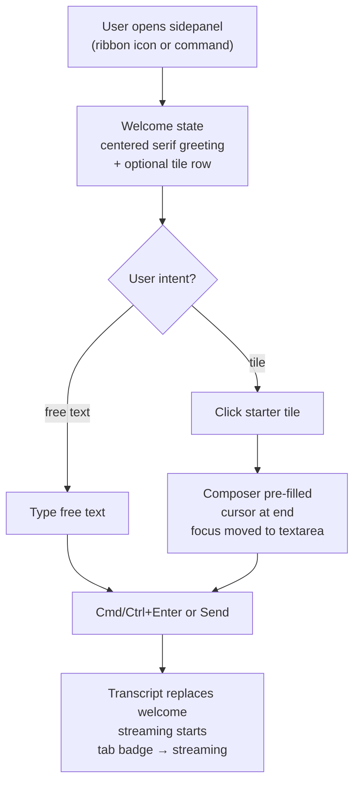
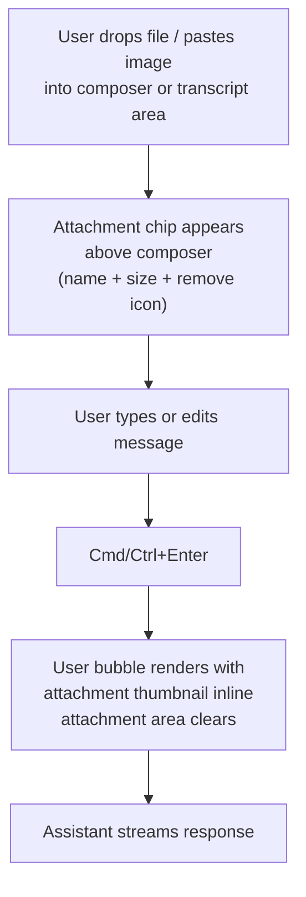
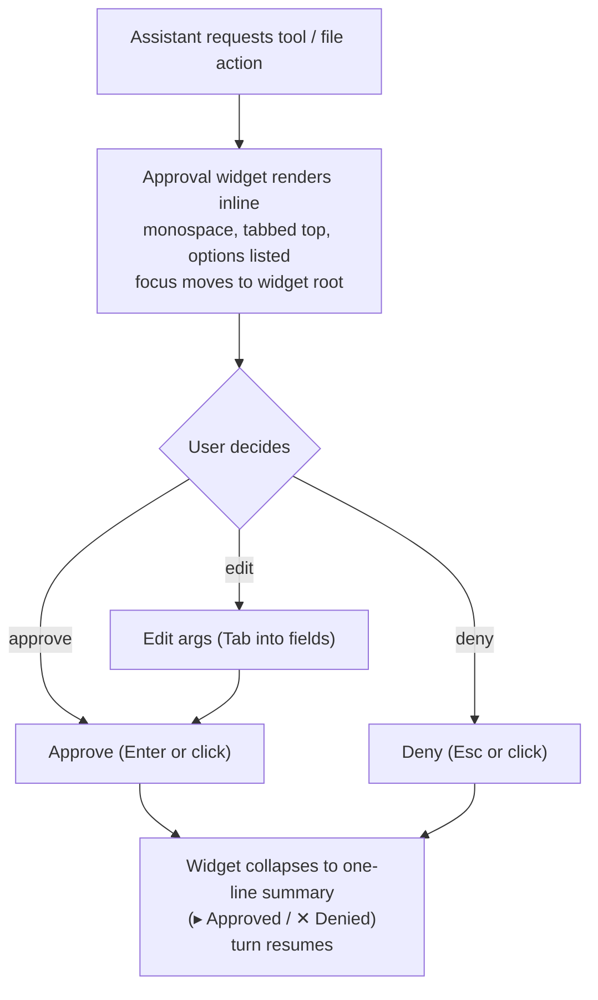
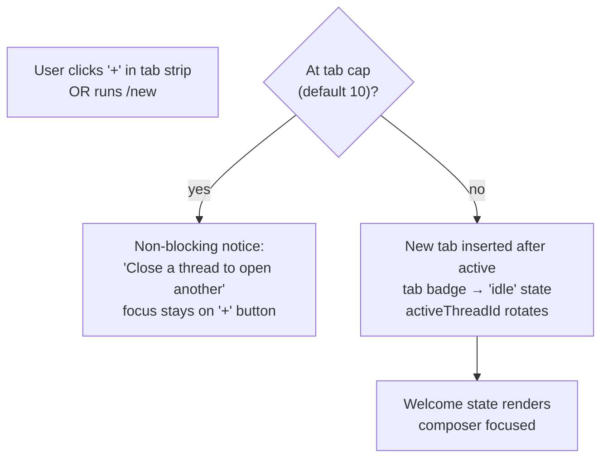
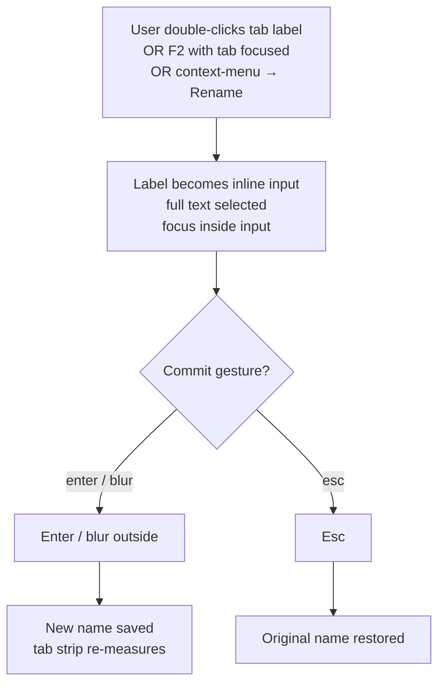
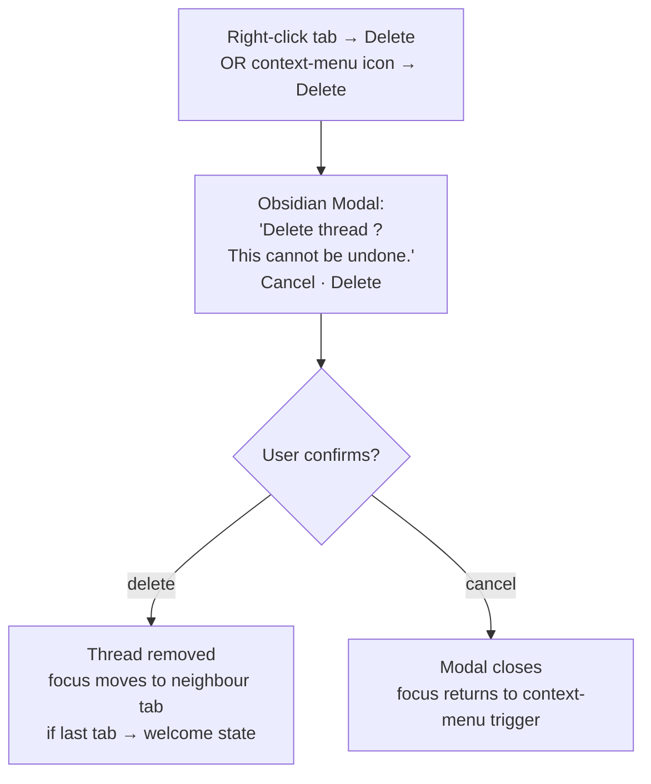

# Design — Part A — UX

**Feature slug:** `agent-ux-parity`
**Area:** AUX
**Author:** ux-designer
**Status:** Draft (for PM + ui-designer + architect review)
**Companion parts:**
- Part B — UI (`ui-designer`, pending)
- Part C — Architecture (`architect`, pending)

> Scope reminder: this part defines *experience* only. No fonts, colours, component
> variants (B), no data structures or transports (C). Where this document references
> a visual state it uses token names (`var(--paper)`, `var(--ink)`); concrete values
> belong to Part B.

> Requirement IDs (`REQ-AUX-*`) are referenced as **TBD** below pending the
> `requirements.md` artifact. The architect / pm will backfill the table in §A.8.

---

## A.1 — User flows

Eight canonical flows. Each is the *experience* sequence; transport mechanics
belong to Part C.

### (a) First-launch / welcome → first turn



Welcome state **is not erased** until the first assistant token arrives — clicking a
tile only pre-fills the composer; the user must still commit. This preserves
reversibility (Constitution Article IX).

### (b) Sending a turn with attachment



States to call out:
- **No attachment**: attachment area collapses to zero height (not an empty pill).
- **Attachment rejected** (size / type): chip renders in error state, focus moves
  to chip's remove button, screen reader announces "Attachment rejected: <reason>".
- **Attachment too large for current provider**: chip shows warning state, send
  remains enabled but provider auto-switches per Part C's resolution rules.

### (c) Approval flow inline in transcript



The widget is **part of the transcript**, not a modal — it scrolls with history.
Once decided, it collapses to a single-line summary that remains reviewable.

### (d) Switching provider mid-conversation

```mermaid
flowchart TD
    click["User clicks provider chip<br/>in composer toolbar"]
    menu["Dropdown opens (backdrop-blur)<br/>groups: 'Claude', 'Codex', 'OpenCode'<br/>current item marked"]
    pick["User selects a provider"]
    confirm{"Conversation has<br/>≥1 message?"}
    swap["Brand color swaps<br/>(via [data-provider])<br/>badge copy updates"]
    boundary["Compact-boundary divider<br/>inserted into transcript<br/>'Switched to Codex · CLI · 14:22'"]
    nochange["Brand swap only<br/>no boundary"]

    click --> menu --> pick --> confirm
    confirm -->|yes| swap --> boundary
    confirm -->|no| swap --> nochange
```

The boundary divider is **distinct**: it carries an icon (provider glyph) and a
left/right rule. It is not the italic muted label the current build uses.

### (e) Creating a new thread



### (f) Renaming a thread



Empty name on commit → revert to previous (do not allow empty labels).

### (g) Deleting a thread



**No `window.confirm`** (project rule). Uses an Obsidian `Modal`.

### (h) Keyboard-only navigation through composer toolbar

```
[Textarea] ──Tab──> [Model chip] ──Tab──> [Mode chip] ──Tab──> [Permission chip]
                                                                       │
                                                                       Tab
                                                                       ▼
[Send button] <──Tab── [Context meter] <──Tab── [MCP chip] <──Tab── [Thinking chip]
```

- `Tab` advances through visible toolbar items left-to-right (logical: inline-start
  → inline-end).
- Each chip opens its menu on `Enter` / `Space` / `Down`.
- Inside a menu: arrow keys to navigate, `Enter` to select, `Esc` to close and
  restore focus to the originating chip.
- `Shift+Tab` reverses to textarea.
- `Esc` from any chip without an open menu returns focus to the textarea.
- Focus rings are visible on **every** toolbar item (Part B owns the ring token).

---

## A.2 — Information architecture

### Parity layout (target)

```
┌─────────────────────────────────────────────────────────────────┐
│ ┌─ HEADER BAND (single row) ────────────────────────────────┐   │
│ │  [bot] Specorator Agent · feature-slug         [+ ▾] [?]  │   │
│ ├──────────────────────────────────────────────────────────┤   │
│ │  TAB STRIP (only when ≥1 thread)                         │   │
│ │  [active] [thread-2] [thread-3] … [+]                    │   │
│ └──────────────────────────────────────────────────────────┘   │
│                                                                 │
│ ┌─ TRANSCRIPT SCROLL REGION ───────────────────────────────┐   │
│ │  (welcome state OR messages)                              │ ← │
│ │                                                            │   │
│ │   …                                                        │   │
│ │                                                            │   │
│ │  [↓ New messages] (floating pill, when scrolled up)       │   │
│ └──────────────────────────────────────────────────────────┘   │
│                                                                 │
│ ┌─ STATUS PANEL (collapsible, persistent above composer) ──┐   │
│ │  todos · bash tail · (max 40vh, own scroll)              │   │
│ └──────────────────────────────────────────────────────────┘   │
│                                                                 │
│ ┌─ COMPOSER GROUP ─────────────────────────────────────────┐   │
│ │  [attachment chips row, when ≥1]                          │   │
│ │  ┌──────────────────────────────────────────────────┐     │   │
│ │  │  textarea (140px min-height)                      │     │   │
│ │  └──────────────────────────────────────────────────┘     │   │
│ │  TOOLBAR:                                                  │   │
│ │  [model][mode][perm][think][mcp]      [meter] [➤ send]   │   │
│ └──────────────────────────────────────────────────────────┘   │
│                                                          ┌─┐    │
│                                                          │○│ ←  │
│  FLOATING NAV-SIDEBAR (right edge, optional)             │○│    │
│  32px circular buttons, opacity 0.15 → 1 on hover       │○│    │
│                                                          └─┘    │
└─────────────────────────────────────────────────────────────────┘
```

### Comparison — current vs target

| Region | Current Specorator | Claudian | Parity move |
|---|---|---|---|
| Header band 1 (title + action) | "Specorator Agent" + "New conversation" button | `[bot]` icon + label + `[+]` mint icon | Collapse text button → icon button; move action to header right edge |
| Header band 2 (feature scope) | Separate `<p>` line "Working on: <slug>" | Inline next to title | Inline into header row 1 as muted suffix |
| Header band 3 (tab strip) | Slot inside header | Slot inside header | **Keep** — only band-2 collapse changes layout |
| Header band 4 (provider/model row) | Separate `<div>` between header and body | Lives inside composer toolbar | **Move** ProviderBadge + ModelSelector down into composer toolbar |
| Transcript | OK | OK | Add "↓ New messages" pill when scrolled-up + streaming |
| Status panel | Stacked between MessageList and ChatInput | Persistent above composer, visually grouped with it | Visually merge with composer (shared container, no full-width border between) |
| Attachment strip | Stacked sibling of ChatInput | Inside composer group | Move into composer group above textarea |
| Composer | textarea + send-only row | textarea + full toolbar | Build `InputToolbar` with model/mode/perm/think/mcp/meter/send |
| Nav-sidebar | Does not exist | Floating right edge | Add as optional, opacity-faded resting state |

**Net effect:** four header bands → one (plus optional tab strip). Provider/model
controls relocate from header to composer toolbar where they are contextually
adjacent to send.

### Deep-link / routing convention

No URL routing change. Sidepanel surfaces remain mounted via `AgentSidepanelView`;
thread switching is internal state. Out of scope for this part.

---

## A.3 — Empty / loading / error states

Each state below is **prescriptive**. "Use the existing component" is not allowed
unless that component is named.

### Empty (no messages in active thread)

- Centered serif greeting (Part B owns the font stack — token: `var(--font-display)`).
- Greeting copy: see §A.6 microcopy table.
- Below greeting: optional tile row (2 or 4 tiles, single row on wide, wrap on narrow).
- Tile content lives in §A.6.
- Welcome state **does not** display a spinner, progress, or "thinking" — it is the
  resting surface.
- Empty state is replaced only when the first user OR assistant message renders.

### Loading (subprocess starting — pre-stream)

- A **transport status pill** appears at the top of the transcript (inside the
  scroll region, not overlaid).
- Shape: pill with leading spinner icon + label.
- Copy: "Starting Claude CLI…" / "Connecting to Codex…" (provider-specific; §A.6).
- Pill **dismisses** when the first token streams in OR when transport reports
  ready.
- Pill is **announced** via the live region (polite, once).

### Streaming (tokens arriving)

- Active assistant message renders a **styled pulse cursor** at the trailing edge.
- The cursor is a span element with a CSS animation (Part B owns the keyframes
  + colour); the design contract here is:
  - Single character width.
  - Pulses at ~1.5s ease-in-out.
  - **No literal `▍` text**.
  - Hidden when `prefers-reduced-motion: reduce` is set; static block instead.

### Streaming + scrolled-up

- The user has scrolled away from the bottom while tokens arrive.
- A floating "↓ New messages" pill appears at the bottom-center of the transcript
  scroll region.
- Clicking the pill scrolls to bottom with smooth behaviour (or instant under
  reduced-motion).
- Pill dismisses on reaching bottom OR when streaming completes and user is at
  bottom.

### Error (assistant turn failed)

- The existing `ChatDegradedState` component, currently dormant in
  `src/ui/components/chat/`, is **surfaced inline** in the transcript at the
  point of failure (in place of the partial assistant bubble, not in addition).
- Carries: icon (alert-circle), error category, one-sentence cause, two actions:
  **Retry** (primary), **Copy error details** (secondary).
- Retry re-runs the failed turn with same args (Part C defines the dispatch).
- Component is keyboard-reachable: Tab into Retry → Tab into Copy → Tab out.

### Network / transport failure (subprocess crash, no token at all)

- Same `ChatDegradedState` surfaced, but at the **bottom** of the transcript
  (turn never started).
- Composer remains enabled (the user can retype or pick another provider).
- Provider chip in toolbar shows a small warning dot (Part B owns the dot).
- Screen reader announces: "Connection to <provider> failed. Retry available."

### Compact boundary (provider/mode switch, /clear, manual context reset)

- A distinctive marker, **not** an italic muted label.
- Visual contract (Part B owns colours): icon glyph + label centred on a
  horizontal rule that extends to both edges.
- Icon: provider glyph (for provider switches), broom (for `/clear`), clock (for
  auto-rotation due to context cap).
- Label: "Switched to Codex · CLI · 14:22" / "Context cleared · 14:22" / "New
  context · 14:22".
- The boundary is part of the transcript; it scrolls and is selectable.

---

## A.4 — Hover/focus reveal pattern

Canonical pattern used by:
- Per-message actions (Copy, Edit, Regenerate)
- Thread context-menu trigger on history rows
- Code-block copy buttons
- Attachment chip remove button when chip is in a long row

### Contract

| Trigger | Action |
|---|---|
| Pointer enters the **parent row** (message bubble, history row, code block) | Reveal actions: `opacity 0 → 1` over 150ms |
| Pointer leaves the parent row | Hide: `opacity 1 → 0` over 150ms |
| Keyboard focus enters the parent row (via `:focus-within`) | Reveal, no animation |
| Keyboard focus leaves the parent row | Hide, no animation |
| Action itself is focused | Stay revealed regardless of pointer |
| `prefers-reduced-motion: reduce` | Snap (no transition) |
| Touch / coarse pointer | Always visible (no hover concept) — Part B owns media-query branch |

### Screen-reader behaviour

- Action buttons remain in the accessibility tree at all times (only `opacity`
  changes, not `display` or `visibility`).
- Each action has an explicit `aria-label` (see §A.6).
- The parent row is a `role="article"` (for messages) or `role="row"` (for
  history). Actions are inside the same row so SR announces them in context.

### Placement

- Per-message actions: **bottom edge**, offset slightly below the bubble, aligned
  to the inline-end (right in LTR, left in RTL).
- History row actions: **inline-end** of the row, vertically centred.
- Code-block copy: **top inline-end** corner of the code block.

---

## A.5 — Accessibility

### Roving tabindex in tab strip

The current implementation is correct — keep it.
- Tab strip is a single tab stop in the document order.
- Inside the strip, Arrow Left/Right move between tabs (roving `tabindex`).
- Home / End jump to first / last tab.
- Enter / Space activate the focused tab.

### ARIA labels on icon-only buttons

Every icon-only affordance needs an `aria-label`. See §A.6 for the canonical
copy. Affordances:

- Header `[+]` mint thread
- Header `[?]` help
- Header `[bot]` (decorative — `aria-hidden="true"`)
- Composer toolbar: model chip, mode chip, permission chip, thinking chip, MCP
  chip, send button
- Per-message: copy, edit, regenerate, fork (if/when added)
- Tab close `[×]`, tab context-menu `[⋯]`
- Attachment chip remove `[×]`
- Nav-sidebar buttons (all)

### Live region for streaming announcements

- ONE polite live region is already provided via `A11yAnnouncer` + the
  `useA11yAnnouncer` composable. **Keep** that single source.
- Events that announce:
  - Transport starting → "Starting <provider>"
  - First token → silent (the visible cursor is enough; announcing would spam)
  - Streaming complete → "Response complete" (existing behaviour)
  - Approval requested → "Approval requested: <action summary>"
  - Error → "Response failed. <category>. Retry available."

### Focus rings on all interactive elements

- Do not rely on hover to indicate interactivity.
- Every chip, button, tab, action, link receives a visible focus ring when
  focused via keyboard.
- Ring token is Part B's; the contract is "WCAG 2.4.7 non-occluded, ≥3:1 against
  adjacent colours".

### Keyboard shortcuts

| Shortcut | Context | Effect |
|---|---|---|
| `Enter` | Textarea, no Shift | Send turn |
| `Shift+Enter` | Textarea | Newline |
| `Esc` | Textarea | If menu open → close menu; else clear textarea selection only (do not lose text) |
| `Esc` | Approval widget | Deny |
| `Esc` | Any open dropdown / popover | Close, restore focus to trigger |
| `Shift+Tab` | First focusable in toolbar | Return to textarea |
| `/` | Textarea, at column 0 | Open slash palette |
| `@` | Textarea, anywhere | Open mention picker |
| `!` | Textarea, at column 0 | Switch composer to bang-bash mode |
| `#` | Textarea, anywhere | Open context tag picker |
| `↑` (ArrowUp) | Textarea, empty, no menus open | Load last user message into textarea for edit |
| `Cmd/Ctrl+Enter` | Textarea | Send turn (primary commit gesture) |
| `Cmd/Ctrl+K` | Anywhere in sidepanel | Focus the composer textarea |
| `F2` | Tab strip with tab focused | Rename tab |

The slash / @ / ! / # triggers must be **suppressed** while inside an open
dropdown to avoid recursive openings.

### Reduced motion

- `@media (prefers-reduced-motion: reduce)`:
  - Streaming cursor → static block (no pulse).
  - Hover reveals → snap (no opacity transition).
  - "↓ New messages" pill click → instant scroll, not smooth.
  - Tab badge state transitions → snap.
- All animations described in Part B must declare a reduced-motion branch.

### Contrast

- All text-on-background combinations must hit WCAG AA (4.5:1 normal, 3:1 large)
  in both default Obsidian themes (light and dark).
- Brand-tinted backgrounds (user bubble, provider chip) must hit ≥4.5:1 with
  their foreground.
- Disabled controls remain ≥3:1 vs background.
- Part B owns the contrast verification per token pair.

### RTL

- All layout uses logical properties (`inset-inline-*`, `margin-inline-*`,
  `border-start-end-radius`, etc.).
- Flow above is correct in both LTR and RTL by construction; the tab strip,
  per-message actions, and toolbar all use inline-start / inline-end.
- No physical `left` / `right` in CSS authored under this feature.

---

## A.6 — Microcopy & tone

Tone per `docs/steering/product.md`: direct, neutral, no exclamation marks, no
"please". Strings live in i18n (`agent.*` namespace) — keys below are
suggestions for the translator handoff.

| Surface | Key | English copy |
|---|---|---|
| Empty greeting (line 1) | `agent.welcome.greeting` | "How can I help with this feature?" |
| Empty greeting (line 2, muted) | `agent.welcome.subtitle` | "Pick a starting point or type a question." |
| Tile — slash | `agent.welcome.tile.slash.title` / `.hint` | "Run a command" / "Start with /" |
| Tile — mention | `agent.welcome.tile.mention.title` / `.hint` | "Reference a file" / "Start with @" |
| Tile — send | `agent.welcome.tile.send.title` / `.hint` | "Send a message" / "Cmd/Ctrl + Enter" |
| Tile — escape | `agent.welcome.tile.escape.title` / `.hint` | "Cancel a turn" / "Esc while streaming" |
| Send button aria-label | `agent.composer.sendAriaLabel` | "Send message" |
| Send button (with attachment) aria-label | `agent.composer.sendWithAttachmentAriaLabel` | "Send message with attachment" |
| Attachment empty placeholder | `agent.composer.attachment.empty` | (no copy — area collapses) |
| Attachment chip remove aria-label | `agent.composer.attachment.removeAriaLabel` | "Remove attachment {name}" |
| Approval — accept | `agent.approval.accept` | "Approve" |
| Approval — deny | `agent.approval.deny` | "Deny" |
| Approval — edit | `agent.approval.edit` | "Edit arguments" |
| Approval — summary (approved) | `agent.approval.summaryApproved` | "Approved {action}" |
| Approval — summary (denied) | `agent.approval.summaryDenied` | "Denied {action}" |
| Thread tab — new (aria-label) | `agent.thread.newAriaLabel` | "New thread" |
| Thread tab — placeholder name | `agent.thread.placeholderName` | "New thread" |
| Thread tab — context menu (aria-label) | `agent.thread.contextMenuAriaLabel` | "Thread options" |
| Thread tab — at cap warning | `agent.thread.atCapWarning` | "Close a thread to open another (limit {n})." |
| Thread tab — delete confirm title | `agent.thread.deleteConfirmTitle` | "Delete thread {name}?" |
| Thread tab — delete confirm body | `agent.thread.deleteConfirmBody` | "This cannot be undone." |
| Help popover — heading | `agent.help.heading` | "Commands" |
| Help popover — search placeholder | `agent.help.searchPlaceholder` | "Search commands" |
| Help popover — empty | `agent.help.empty` | "No commands match." |
| Model selector — group: Claude | `agent.model.group.claude` | "Claude" |
| Model selector — group: Codex | `agent.model.group.codex` | "Codex" |
| Model selector — group: OpenCode | `agent.model.group.opencode` | "OpenCode" |
| Provider badge — Claude CLI | `agent.provider.claudeCli` | "Claude · CLI" |
| Provider badge — Claude API | `agent.provider.claudeApi` | "Claude · API" |
| Provider badge — Codex CLI | `agent.provider.codexCli` | "Codex · CLI" |
| Provider badge — OpenCode | `agent.provider.opencode` | "OpenCode" |
| Transport pill — starting | `agent.transport.starting` | "Starting {provider}…" |
| Transport pill — connecting | `agent.transport.connecting` | "Connecting to {provider}…" |
| "↓ New messages" pill | `agent.transcript.newMessagesPill` | "New messages" |
| Compact boundary — provider switch | `agent.boundary.providerSwitch` | "Switched to {provider} · {time}" |
| Compact boundary — clear | `agent.boundary.clear` | "Context cleared · {time}" |
| Compact boundary — rotate | `agent.boundary.rotate` | "New context · {time}" |
| Error — generic | `agent.error.generic` | "Response failed." |
| Error — retry | `agent.error.retry` | "Retry" |
| Error — copy details | `agent.error.copyDetails` | "Copy details" |
| Per-message — copy aria | `agent.message.copyAriaLabel` | "Copy message" |
| Per-message — copy success | `agent.message.copySuccess` | "Copied" |
| Per-message — edit aria | `agent.message.editAriaLabel` | "Edit message" |
| Per-message — regenerate aria | `agent.message.regenerateAriaLabel` | "Regenerate response" |

Voice rules:
- No "please", "sorry", or exclamation marks.
- Sentence case for buttons and headings.
- Provider names rendered exactly: "Claude", "Codex", "OpenCode" (not "claude").
- Mode / transport rendered with middle-dot separator: `Provider · Mode`.

---

## A.7 — Open UX questions

1. **Q-UX-1 — Welcome tile count.** Two tiles or four? Idea says "optional tile
   row" — proposing four (slash / mention / send / escape) to mirror current
   build. PM to confirm we keep the four-tile shape or move to two.
2. **Q-UX-2 — Per-message action set.** Idea calls out Copy, Edit, Regenerate.
   Claudian also exposes Fork (`git-fork`). Is Fork in scope for parity, or
   deferred? (Architecture impact: requires thread duplication.) PM / architect.
3. **Q-UX-3 — Tab close affordance.** Tab strip currently uses context-menu →
   Delete (modal-gated). Claudian uses `[×]` directly on each tab on hover. Do
   we add inline `[×]` (and skip the modal for unmodified threads) or keep the
   modal-only flow? PM.
4. **Q-UX-4 — Nav-sidebar contents.** Idea references a "floating nav-sidebar"
   right edge with 32px circular buttons. What goes inside? Proposing: history
   (chat archive), settings shortcut, collapse-all. PM to confirm or trim.
5. **Q-UX-5 — Approval widget — what fields are editable?** Idea lists "Edit
   args" — but the underlying tool / file action schema isn't enumerated in the
   idea. Architect to specify which approval payloads expose editable fields
   for Part C; UX prescribes the *focus order* once fields are known.
6. **Q-UX-6 — `↑` to edit last user message.** Claudian does this; current
   Specorator does not. Confirming this is in scope (it interacts with the
   slash / mention picker that already binds `↑` inside their menus). Proposing
   guard: only fires when textarea is empty AND no picker is open.
7. **Q-UX-7 — Compact-boundary icon set.** Provider glyphs exist (lucide
   `bot` / equivalent); broom and clock are stand-ins. ui-designer to settle
   icon mapping per boundary type in Part B.
8. **Q-UX-8 — Streaming cursor under reduced-motion.** Static block as
   proposed, or no cursor at all? Suggesting static block so the trailing edge
   of streaming remains identifiable.

---

## A.8 — Requirements coverage (Part A scope)

| Requirement | Where addressed |
|---|---|
| REQ-AUX-* (TBD) Welcome state & first-turn flow | §A.1 (a), §A.3 Empty, §A.6 welcome rows |
| REQ-AUX-* (TBD) Attachment flow | §A.1 (b), §A.6 attachment rows |
| REQ-AUX-* (TBD) Inline approval | §A.1 (c), §A.6 approval rows |
| REQ-AUX-* (TBD) Provider switch & branding | §A.1 (d), §A.2 IA move, §A.3 Compact boundary, §A.6 provider rows |
| REQ-AUX-* (TBD) Thread create / rename / delete | §A.1 (e)(f)(g), §A.6 thread rows |
| REQ-AUX-* (TBD) Keyboard navigation | §A.1 (h), §A.5 Shortcuts, §A.5 Roving tabindex |
| REQ-AUX-* (TBD) Hover-reveal per-message actions | §A.4 |
| REQ-AUX-* (TBD) Status panel grouping | §A.2 IA move |
| REQ-AUX-* (TBD) Composer toolbar | §A.1 (h), §A.2 IA, §A.6 toolbar rows |
| REQ-AUX-* (TBD) Empty / loading / streaming / error states | §A.3 |
| REQ-AUX-* (TBD) Reduced-motion support | §A.5 Reduced motion |
| REQ-AUX-* (TBD) RTL via logical properties | §A.5 RTL |
| REQ-AUX-* (TBD) Live region & screen-reader behaviour | §A.5 Live region, §A.4 SR behaviour |
| REQ-AUX-* (TBD) Microcopy table | §A.6 |

> The architect should backfill exact `REQ-AUX-NNN` IDs once `requirements.md`
> lands. Anything below not mapped to a requirement should trigger a clarification
> rather than implementation.

---

## Hand-off notes (for ui-designer + architect)

**To ui-designer (Part B):**
- Token layer (`--sp-*`) is yours. This part references `var(--paper)` / `var(--ink)`
  / `var(--font-display)` only as placeholders.
- Streaming pulse keyframes, focus-ring token, hover-reveal opacity timing
  (150ms here is a starting point) all live in B.
- Compact-boundary visual treatment, transport-pill shape, "↓ New messages" pill
  shape — all yours.
- Confirm the icon mapping for compact boundaries (Q-UX-7).
- The brand-color swap pattern (`[data-provider]`) is yours to implement; UX
  defines *when* it swaps (§A.1 (d)).

**To architect (Part C):**
- Provider-switch boundary insertion (§A.1 (d)) needs a transcript event/marker
  type — Part C should specify how that marker is stored.
- Approval widget collapse-to-summary (§A.1 (c)) implies the transcript
  remembers approval state across re-renders — confirm with Part C.
- `↑`-to-edit-last-user-message (§A.5) needs a deterministic "find last user
  message in active thread" path — confirm Part C exposes this on the store.
- Retry on `ChatDegradedState` (§A.3 Error) needs the original turn args
  preserved — confirm Part C carries them through to the error state.
- Tab-cap warning copy is non-blocking notice; existing `NotificationPort`
  channel is fine, no new port needed.
