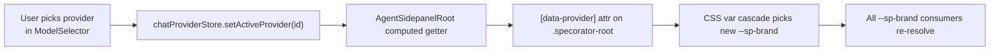
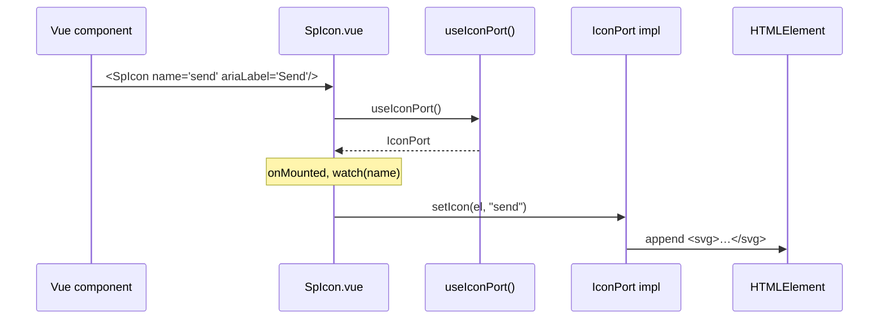

# Design — Agent Sidepanel UX Parity

This document consolidates the three design parts into one canonical artifact:

- **Part A — UX** (flows, IA, states, hover-reveal pattern, a11y, microcopy) — authored by `ux-designer`.
- **Part B — UI** (token layer, component catalogue, icons, microcopy, layout, animation, RTL) — authored by `ui-designer`.
- **Part C — Architecture** (this part, NEW) — authored by `architect`.

Parts A and B exist as standalone scratch files (`design-part-a-ux.md`, `design-part-b-ui.md`) and are summarised here. Where this file says "see Part A §A.N" / "see Part B §B.N", consult the scratch file for the full rationale.

---

## Part A — UX (summary)

> Full text: `specs/agent-ux-parity/design-part-a-ux.md`. The summary below preserves the section IDs so REQ traceability survives.

### A.1 — User flows

Eight canonical flows, all rendered as Mermaid diagrams in the scratch file:

- **(a) First-launch / welcome → first turn.** Sidepanel mounts to a centred serif greeting. Clicking a tile pre-fills the composer but does not commit; the user still presses Cmd/Ctrl+Enter. Welcome state is replaced only when the first user OR assistant message renders.
- **(b) Sending a turn with attachment.** Drag/paste → attachment chip above composer → user bubble inlines the thumbnail. Rejected attachments render in error state with focus on the remove button; oversized for current provider triggers Part C's auto-switch path.
- **(c) Approval flow inline in transcript.** Tool/file action → tabbed widget inline → approve/deny/edit. Widget collapses to a one-line summary after decision; remains part of the scrollable transcript (not a modal).
- **(d) Switching provider mid-conversation.** Composer chip → `[data-provider]` swap + brand re-resolve. If thread has ≥1 message, a `CompactBoundary` marker is inserted into the transcript ("Switched to Codex · CLI · 14:22").
- **(e) Creating a new thread.** Tab `+` or `/new`. At cap (default 10) shows non-blocking notice; otherwise mints a tab in `idle` state and focuses composer.
- **(f) Renaming a thread.** Double-click / F2 / context-menu. Inline input, Enter or blur commits, Esc reverts, empty name reverts.
- **(g) Deleting a thread.** Context-menu → Delete → Obsidian `Modal` confirmation (no `window.confirm`). On confirm, focus moves to neighbour tab; if last tab, welcome state renders.
- **(h) Keyboard-only toolbar navigation.** Tab walks textarea → model → mode → permission → thinking → MCP → context-meter → send. Arrow keys navigate inside menus; Esc closes and restores focus to the chip.

### A.2 — Information architecture

Target layout collapses the four current header bands to one (plus optional tab strip row) and relocates provider/model into the composer toolbar:

```
[ HEADER · 36px · logo + title + scope + (+) (?) ]
[ TAB STRIP ROW · only when ≥1 thread ]
[ TRANSCRIPT SCROLL · welcome OR messages · floating "↓ New" pill when scrolled-up ]
[ STATUS PANEL · grouped with composer · max-height min(40vh, 320px) ]
[ COMPOSER GROUP · attachments → textarea → InputToolbar ]
[ FLOATING NAV-SIDEBAR · right edge · optional ]
```

Net effect: 4 header bands → 1; provider/model moves from header into the composer toolbar.

### A.3 — Empty / loading / error / streaming states

- **Empty.** Centred serif greeting + optional suggestion chips. No spinner.
- **Loading.** Transport status pill at top of MessageList scroll region; pill announces via `aria-live="polite"` once.
- **Streaming.** Styled pulse cursor at trailing edge of in-progress assistant message; reduced-motion → static block; no literal `▍`.
- **Streaming + scrolled-up.** Floating "↓ New messages" pill at bottom-centre of scroll region.
- **Error (turn failed).** `ChatDegradedState` surfaced inline at point of failure, replaces partial bubble. Carries icon + cause + Retry (primary) + Copy details.
- **Network/transport failure.** Same component at bottom of transcript; composer stays enabled; provider chip shows warning dot.
- **Compact boundary.** Centred label with side rules and an icon glyph (provider / broom / clock); selectable and part of scrollable transcript.

### A.4 — Hover/focus-reveal pattern

The canonical interaction model behind per-message actions, history-row context menus, code-block copy, and attachment chip remove (in long rows):

| Trigger | Behaviour |
|---|---|
| Pointer enters parent row | `opacity 0 → 1` over 150ms |
| Pointer leaves parent row | `opacity 1 → 0` over 150ms |
| `:focus-within` parent row | Reveal, snap (no transition) |
| Focus leaves parent row | Hide, snap |
| Action itself focused | Stay revealed |
| `prefers-reduced-motion: reduce` | Snap |
| Coarse pointer / touch | Always visible |

Action buttons stay in the accessibility tree at all times (only opacity, never `display` or `visibility`). Each carries an explicit `aria-label`; parent row is `role="article"` (message) or `role="row"` (history).

### A.5 — Accessibility

- **Roving tabindex** in tab strip (Arrow Left/Right move; Home/End jump; Enter/Space activate). Keep current behaviour.
- **ARIA labels** on every icon-only affordance (enumerated in Part A §A.5 + Part B §B.4).
- **One polite live region** via existing `A11yAnnouncer` + `useA11yAnnouncer`. Announces transport start, streaming complete, approval requested, errors.
- **Visible focus rings** via `--sp-focus-ring` token (defined in Part B). ≥3:1 against adjacent colours.
- **Shortcuts.** Enter / Shift+Enter / Esc / Cmd-Ctrl+Enter / Cmd-Ctrl+K / `/` / `@` / `!` / `#` / F2 / ArrowUp-empty-textarea.
- **Reduced motion.** Streaming cursor → static; hover reveals → snap; "↓ New" → instant scroll; tab badge state → snap.
- **Contrast.** WCAG 2.2 AA in both Obsidian themes; brand-tinted backgrounds ≥4.5:1 with foreground.
- **RTL.** All layout uses logical properties; tested by sidepanel flip.

### A.6 — Microcopy & tone

i18n keys live under `agent.*`. Tone: direct, neutral, no exclamation marks, no "please". Sentence case. Provider names rendered as `Provider · Mode`. Full table in Part A §A.6.

### A.7 — Open UX questions

Eight items (`Q-UX-1..8`) deferred to ux-designer for resolution before implementation. Carried forward into spec.md §10 (Open clarifications) as `CQ-AUX-NN`.

---

## Part B — UI (summary)

> Full text: `specs/agent-ux-parity/design-part-b-ui.md`. The summary below preserves the `--sp-*` token names; full enumeration moves into `spec.md` §4.

### B.1 — Design token layer (`--sp-*`)

- **File:** `src/ui/styles/tokens.css`, declared on `.specorator-root`.
- **Mount:** imported once at the app shell. In standalone mode via `src/ui/main.ts`; in Obsidian via inclusion in the bundled `styles.css` (Vite `cssCodeSplit: false`). `AgentSidepanelRoot.vue` carries `.specorator-root` + `[data-provider]`.
- **Mapping rule.** Every `--sp-*` defaults to a `var(--*)` lookup against Obsidian's theme. Brand-flavour tokens are literals because Claudian uses literals.
- **Provider override.** `.specorator-root[data-provider="claude|codex|opencode|cursor"]` rebinds `--sp-brand` + `--sp-brand-rgb`.
- **Reduced motion.** `@media (prefers-reduced-motion: reduce)` collapses `--sp-duration-*` to `0s`; the `spin` animation has an explicit `animation: none` override (Part B §B.6).
- **Catalogue:** color (18 tokens), typography (12), spacing rhythm (7), radii (10), shadows (4), z-index (6), motion (6). Full enumeration in `spec.md` §4.

### B.2 — Component catalogue

Nineteen surfaces, each with parity treatment + tokens consumed + sub-components. New / refresh / extracted breakdown:

| § | Component | Status |
|---|---|---|
| B.2.1 | `AgentHeader.vue` (+ `AgentHeaderTooltip.vue` new sub) | refresh |
| B.2.2 | `ThreadTabStrip.vue` (+ `ThreadTabBadge.vue` new extract) | refresh |
| B.2.3 | `MessageList.vue`, `MessageItem.vue` | refresh (tokens + role split) |
| B.2.4 | `MessageActions.vue` (+ `MessageActionIcon.vue` new sub) | refresh |
| B.2.5 | `ThinkingBlock`, `ToolCallBlock`, `SubagentBlock` (+ `NestedDetailFrame.vue` new shared) | refresh + new shared frame |
| B.2.6 | `StatusPanel.vue` (+ `StatusTodoItem.vue` new extract) | refresh |
| B.2.7 | `ChatInput.vue` + new `InputToolbar.vue` | refresh + new composite |
| B.2.8 | `ModeSelector`, `PermissionToggle`, `ThinkingToggle` (+ `SpToggleSwitch.vue` new primitive) | refresh + new primitive |
| B.2.9 | `ModelSelector.vue` | refresh |
| B.2.10 | `ProviderBadge.vue` | refresh (copy table) |
| B.2.11 | `SlashCommandPopover.vue` + new `MentionPopover.vue` | refresh + new |
| B.2.12 | `ThreadHistoryMenu.vue` | new |
| B.2.13 | `SpDropdownPanel.vue` | new primitive |
| B.2.14 | `WelcomeGreeting.vue` (+ `WelcomeSuggestionChip.vue`) | new |
| B.2.15 | `InlineApprovalCard.vue` (+ `ApprovalTabBar`, `ApprovalItem`, `ApprovalReviewBody`) | new |
| B.2.16 | `FloatingNavSidebar.vue` (+ `NavSidebarButton.vue`) | new |
| B.2.17 | `CompactBoundary.vue` | refresh |
| B.2.18 | `StreamingCursor.vue` | new |
| B.2.19 | `TransportStatusPill.vue` | new (surfaces dormant `ChatDegradedState`) |

### B.3 — Icon set

36 Lucide icons, all bundled in Obsidian ≥1.5. Routed through a new `<SpIcon>` wrapper. Missing-icon fallback renders `ariaLabel` text inside the span (never an empty box).

### B.4 — Microcopy table

Provider labels, header tooltips, composer placeholders, message actions, welcome states, approval card, transport pill, history menu, compact boundary. Keys mirror existing `src/ui/i18n/en.ts` shape. Full table in `spec.md` §1.7 (microcopy contract) and Part B §B.4.

### B.5 — Layout grids

Density rules per surface (padding, gap, min/max) — full table in Part B §B.5. Narrow-pane rules at <360px: InputToolbar wraps to two rows; per-message actions move to `bottom: -22px`; header title truncates with tooltip.

### B.6 — Animations

Nine named animations (`thinking-pulse`, `streaming-cursor-blink`, `spin`, `mcp-glow`, `external-context-glow`, hover-reveal fade, toggle slide, context-meter fill, nav-sidebar reveal). All declared in `src/ui/styles/animations.css`. Reduced-motion handled by duration-token override, except `spin` which uses explicit `animation: none`.

### B.7 — RTL / logical-property migration

Sweep of physical → logical properties under `src/ui/agent/**`, `src/ui/components/agent/**`, `src/ui/components/chat/**`. Two content-level globals added: `unicode-bidi: plaintext` on `.sp-message-content` + `.sp-input`; `dir="auto"` on user-authored text containers. CI guard via Stylelint rule (or grep) flagging physical properties under migrated paths.

### B.8 — Open UI questions

Eleven items (`Q-AUX-UI-01..11`) raised by ui-designer; the architecturally relevant ones (Q5 = `IconPort` seam, Q4 = `SpDropdownPanel` cross-feature impact, Q9 = Stylelint guard) are resolved in Part C below. Remaining design-system questions carry forward to `spec.md` §10.

---

## Part C — Architecture (NEW)

> Scope: how the parity work threads through the Vue / DDD architecture without violating narrow-port rules (ADR-008), ESLint guardrails, or the inward-only import direction. No domain or use-case changes — every architectural addition lives in the UI layer or in one new narrow port.

### C.1 — System overview

```mermaid
flowchart TB
    subgraph plugin["Plugin layer · src/plugin/"]
        main["main.ts<br/>boots view, provides ports"]
    end

    subgraph infra["Infrastructure layer · src/infrastructure/"]
        obs["ObsidianBridge<br/>(setIcon via obsidian)"]
        mock["MockBridge<br/>(testing)"]
        ls["LocalStorageBridge<br/>(GitHub Pages demo)"]
        ports["bridge/ports.ts<br/>+ ICON_PORT"]
    end

    subgraph domainports["Domain · src/domain/ports/"]
        iconport["IconPort<br/>(NEW · setIcon)"]
        existingports["SettingsPort, VaultPort,<br/>WorkspacePort,<br/>NotificationPort, LoggerPort,<br/>ConfirmModalPort, …<br/>(unchanged)"]
    end

    subgraph stores["UI stores · src/ui/stores/"]
        prov["chatProviderStore<br/>+ providerId getter"]
        ctx["contextUsageStore<br/>(NEW · tokens used + cap)"]
        threads["chatThreadsStore<br/>(unchanged)"]
        messages["messagesStore<br/>(unchanged)"]
    end

    subgraph styles["Token layer · src/ui/styles/"]
        tokens["tokens.css<br/>(NEW · --sp-*)"]
        anim["animations.css<br/>(NEW · 9 keyframes)"]
    end

    subgraph primitives["UI primitives · src/ui/components/primitives/"]
        spicon["SpIcon.vue (NEW)"]
        spbtn["SpButton, SpIconButton (NEW)"]
        sptog["SpToggleSwitch.vue (NEW)"]
        spdrop["SpDropdownPanel.vue (NEW)"]
        hover["HoverActions.vue (NEW)"]
    end

    subgraph agentui["Agent surface · src/ui/agent/, src/ui/components/agent/"]
        root["AgentSidepanelRoot.vue<br/>(refresh: data-provider attr)"]
        header["AgentHeader.vue (refresh)"]
        tabs["ThreadTabStrip + TabBadge"]
        msglist["MessageList + MessageItem"]
        msgact["MessageActions"]
        nested["NestedDetailFrame (NEW)"]
        thinking["ThinkingBlock, ToolCallBlock, SubagentBlock"]
        status["StatusPanel"]
        composer["ChatInput + InputToolbar (NEW)"]
        toggles["Mode/Permission/Thinking"]
        modelsel["ModelSelector"]
        provbadge["ProviderBadge"]
        meter["ContextMeter (NEW)"]
        welcome["WelcomeGreeting (NEW)"]
        cursor["StreamingCursor (NEW)"]
        approval["InlineApprovalCard (NEW)"]
        nav["FloatingNavSidebar (NEW)"]
        compact["CompactBoundary (refresh)"]
        transport["TransportStatusPill (NEW)"]
        slash["SlashCommandPopover, MentionPopover"]
        history["ThreadHistoryMenu (NEW)"]
        help["HelpPopover (refresh)"]
    end

    main --> obs
    main --> ports
    obs -. implements .-> iconport
    mock -. implements .-> iconport
    ls -. implements .-> iconport
    ports --> iconport

    primitives --> styles
    agentui --> primitives
    agentui --> styles
    spicon -. useIconPort .-> iconport
    root --> prov
    root --> ctx
    composer --> meter
    meter --> ctx
```



**What is net-new (created files)** — see `spec.md` §5 for the full enumeration:

- One new narrow port (`IconPort`) + InjectionKey + composable.
- One new Pinia store (`contextUsageStore`).
- Two new global CSS files (`tokens.css`, `animations.css`).
- Five new primitive components (`SpIcon`, `SpButton`, `SpIconButton`, `SpToggleSwitch`, `SpDropdownPanel`, `HoverActions`).
- Twelve new agent-surface components (`InputToolbar`, `ContextMeter`, `WelcomeGreeting`, `StreamingCursor`, `InlineApprovalCard`, `FloatingNavSidebar`, `MentionPopover`, `ThreadHistoryMenu`, `TransportStatusPill`, `NestedDetailFrame`, `WelcomeSuggestionChip`, plus extracted sub-components for Storybook).

**What changes (modified files)**:

- `AgentSidepanelRoot.vue` (mount `data-provider` attribute, host new welcome + nav surfaces).
- `AgentHeader.vue`, `ThreadTabStrip.vue`, `MessageList.vue`, `MessageItem.vue`, `MessageActions.vue`, `ChatInput.vue`, `StatusPanel.vue`, `ProviderBadge.vue`, `ModelSelector.vue`, `ModeSelector.vue`, `PermissionToggle.vue`, `ThinkingToggle.vue`, `SlashCommandPopover.vue`, `HelpPopover.vue`, `CompactBoundary.vue`, `ThinkingBlock.vue`, `ToolCallBlock.vue`, `SubagentBlock.vue`.
- `src/ui/main.ts` (import tokens.css; provide ICON_PORT in mock setup).
- `src/plugin/main.ts` (provide ICON_PORT to view).
- `src/infrastructure/obsidian/ObsidianBridge.ts`, `src/infrastructure/mock/MockBridge.ts`, `src/infrastructure/localstorage/LocalStorageBridge.ts` (implement `setIcon`).
- `src/infrastructure/bridge/ports.ts` (export `ICON_PORT`).
- `src/domain/ports/index.ts` (export `IconPort` type).
- `src/ui/i18n/locales/en.ts` (microcopy additions).
- `eslint.config.js` (Stylelint rule integration for physical-property guard — see C.4 ADR-AUX-003).

**What is unchanged**: domain aggregates, application use cases, all narrow ports except the newly-added `IconPort`, repository contracts, ChatTransport infrastructure, settings schema (no new fields).

### C.2 — Components

> Each entry: dependencies (which port/composable/store), props, emits, exposed refs. Exact TS signatures live in `spec.md` §1.

#### C.2.1 — `IconPort` (NEW narrow port)

- **Path:** `src/domain/ports/IconPort.ts`.
- **Surface:** `setIcon(el: HTMLElement, name: string): void`.
- **Why a port:** Vue components under `src/ui/` are forbidden from importing `obsidian` directly (ESLint `no-restricted-imports`). `setIcon` is an Obsidian API. The seam matches the precedent established by `ConfirmModalPort` and `MarkdownRenderPort`.
- **Implementations:**
  - `ObsidianBridge.setIcon` — delegates to `obsidian.setIcon(el, name)`.
  - `MockBridge.setIcon` — writes an `<svg>` placeholder with `<title>{name}</title>` so test assertions can read `el.querySelector('title')?.textContent`.
  - `LocalStorageBridge.setIcon` — same `<svg>` placeholder so the GitHub Pages demo renders something deterministic without the Obsidian runtime.
- **Wire-up:** new `ICON_PORT` symbol in `src/infrastructure/bridge/ports.ts`; new composable `src/ui/composables/useIconPort.ts`; `IconPort` added to `src/domain/ports/index.ts` exports.

#### C.2.2 — `tokens.css` + `animations.css`

- **Path:** `src/ui/styles/tokens.css`, `src/ui/styles/animations.css`.
- **Mount:** imported once from `src/ui/main.ts` (standalone) and surfaced into the Obsidian-bundled `styles.css` via Vite (`cssCodeSplit: false` keeps it inlined into the plugin bundle).
- **Scope:** `.specorator-root` is the carrier selector; brand override via `[data-provider]` attribute on the same node.
- **Reduced motion:** media query in `tokens.css` collapses `--sp-duration-*` to `0s` and `animations.css` has an explicit `animation: none` for `spin`.

#### C.2.3 — `<SpIcon>`

- **Path:** `src/ui/components/primitives/SpIcon.vue`.
- **Dependencies:** `useIconPort()`; no store; no other port.
- **Props:**
  - `name: string` (required) — Lucide icon name.
  - `size?: number` — default 16 (CSS px).
  - `ariaLabel?: string` — if omitted, the icon renders `aria-hidden="true"`.
- **Emits:** none.
- **Expose:** `el: Ref<HTMLElement | null>` (for parent imperative measure if needed).
- **Implementation:** template renders `<span class="sp-icon" :style="{ width, height }" :aria-label :aria-hidden="!ariaLabel">`; `onMounted` and `watch(name)` call `iconPort.setIcon(el.value, name)`. On missing icon, fallback renders `ariaLabel` text content via `setText` semantics (`textContent` assignment).

#### C.2.4 — `<HoverActions>`

- **Path:** `src/ui/components/primitives/HoverActions.vue`.
- **Dependencies:** none.
- **Props:**
  - `placement?: 'block-end-inline-end' | 'block-end-inline-start' | 'block-start-inline-end'` — default `'block-end-inline-end'`.
  - `alwaysVisible?: boolean` — default `false`; forced `true` under coarse-pointer media query.
- **Emits:** none.
- **Expose:** none.
- **Slots:** default — the action buttons.
- **Implementation:** root `<div>` with `role="toolbar"`, CSS class `sp-hover-actions`. The reveal logic lives in CSS using `:hover` and `:focus-within` selectors on the parent (consumer applies a parent class `.sp-hover-host` so the reveal rule scopes correctly). Coarse-pointer / reduced-motion handled by media queries in the component's scoped style. Action buttons stay in the accessibility tree at all times (opacity only).

#### C.2.5 — `<InputToolbar>`

- **Path:** `src/ui/components/agent/InputToolbar.vue`.
- **Dependencies:** `chatProviderStore` (read provider id, write provider selection), `contextUsageStore` (read tokens used + cap), `messagesStore` (read streaming state to swap send→stop icon).
- **Props:** none (reads stores directly).
- **Emits:**
  - `send` — user pressed the send button (parent commits the turn).
  - `stop` — user pressed the stop button while streaming.
  - `attach` — user pressed the paperclip.
- **Expose:** `sendButtonEl: Ref<HTMLElement | null>` (focus target for Cmd-Ctrl+K).
- **Composes:** `ModelSelector`, `ModeSelector`, `PermissionToggle`, `ThinkingToggle`, `McpIndicator`, `ContextMeter`, `SpIconButton` (send/stop).

#### C.2.6 — `<ContextMeter>`

- **Path:** `src/ui/components/agent/ContextMeter.vue`.
- **Dependencies:** `contextUsageStore` (NEW — see C.3).
- **Props:**
  - `size?: number` — default 18 (px).
  - `strokeWidth?: number` — default 2.
- **Emits:** none.
- **Implementation:** SVG donut, stroke colour transitions to `--sp-warning` above 80% usage. Tooltip surfaces the exact `used / total` figures via `composer.contextMeter.tooltip` microcopy. Hover/focus surfaces tooltip.

#### C.2.7 — `<WelcomeGreeting>`

- **Path:** `src/ui/components/agent/WelcomeGreeting.vue`.
- **Dependencies:** `useI18n()` (locale + greeting variant); no port.
- **Props:**
  - `suggestions?: WelcomeSuggestion[]` — see `spec.md` §1.
- **Emits:**
  - `suggestion-pick: { id: WelcomeSuggestion['id'] }` — parent maps id to a composer pre-fill.
- **Layout:** centred serif `--sp-font-serif` at `--sp-font-size-display`; suggestion chips below.

#### C.2.8 — `<StreamingCursor>`

- **Path:** `src/ui/components/agent/StreamingCursor.vue`.
- **Dependencies:** none.
- **Props:** none.
- **Element:** `<span class="sp-streaming-cursor" aria-hidden="true">` — 2px × 1em block; animation `streaming-cursor-blink 1s steps(2, end) infinite`. Reduced-motion → static span.

#### C.2.9 — `<MessageBubble>` / `<MessageItem>` refresh

- **Path:** `src/ui/components/agent/MessageItem.vue`.
- **Role-aware modifier:** root element gets `data-role="user" | "assistant" | "system"`. CSS uses attribute selectors to apply asymmetric corner radii.
- **Slots:** default — message content; `actions` — slot consumed by `MessageActions` via `HoverActions`.
- **A11y:** root carries `role="article"` so per-message actions inherit context.

#### C.2.10 — `<NavSidebar>` / `FloatingNavSidebar`

- **Path:** `src/ui/components/agent/FloatingNavSidebar.vue`.
- **Dependencies:** `messagesStore` (regenerate-last availability), `chatThreadsStore` (new-thread action).
- **Props:**
  - `visible?: boolean` — default `true`; hidden by parent when sidepanel width <300 px (see C.6).
- **Emits:**
  - `scroll-to-top`, `scroll-to-bottom`, `regenerate-last`, `new-thread`.
- **A11y:** `nav` landmark with `aria-label="Sidepanel navigation"`. Buttons are `SpIconButton` with explicit `ariaLabel`.

#### C.2.11 — `<NestedBlockShell>` / `NestedDetailFrame`

- **Path:** `src/ui/components/agent/NestedDetailFrame.vue`.
- **Dependencies:** none.
- **Props:**
  - `icon: string` — Lucide name forwarded to `SpIcon`.
  - `label: string` — header label.
  - `summary?: string` — header summary (right of label).
  - `status?: 'idle' | 'running' | 'complete' | 'error'`.
  - `defaultExpanded?: boolean` — default `true`.
- **Emits:**
  - `expand-change: { expanded: boolean }`.
- **Slots:** default — block body.
- **Consumed by:** `ThinkingBlock.vue`, `ToolCallBlock.vue`, `SubagentBlock.vue` (the three rewrap their existing body inside this frame; the 2px inline-start border + indent live exclusively on this component).

#### C.2.12 — `<TabBadge>` / `ThreadTabBadge`

- **Path:** `src/ui/components/agent/ThreadTabBadge.vue`.
- **Dependencies:** none.
- **Props:**
  - `state: 'active' | 'streaming' | 'attention' | 'idle'` — required.
  - `digit: number | string` — required; displayed in the badge.
- **Emits:** none.
- **Element:** 24×24, `border-radius: --sp-radius-sm`, 2 px border whose colour token depends on `state`.

#### C.2.13 — `<ApprovalCard>` / `InlineApprovalCard`

- **Path:** `src/ui/components/agent/InlineApprovalCard.vue`.
- **Dependencies:** `messagesStore` (approval payload), `useI18n()`.
- **Props:**
  - `request: ApprovalRequest` — typed payload (see `spec.md` §1).
- **Emits:**
  - `decision: { id: string; verdict: 'allow-once' | 'allow-always' | 'deny'; edits?: Record<string, unknown> }`.
- **Sub-components:** `ApprovalTabBar.vue`, `ApprovalItem.vue`, `ApprovalReviewBody.vue`.

#### C.2.14 — `<HelpPopover>` refresh

- **Path:** `src/ui/components/agent/HelpPopover.vue` (existing).
- **Adds:** search input at top; arrow-key navigation; selection announcement via `useA11yAnnouncer`. Filters `BUILT_IN_SLASH_COMMANDS` by substring on label + description.
- **Emits:** `pick: { commandId: string }`, `close`.

#### C.2.15 — `<SpButton>` / `<SpIconButton>`

- **Path:** `src/ui/components/primitives/SpButton.vue`, `SpIconButton.vue`.
- **Props (`SpButton`):** `variant?: 'primary' | 'secondary' | 'ghost'`, `disabled?: boolean`, `loading?: boolean`, `type?: 'button' | 'submit'`.
- **Props (`SpIconButton`):** `icon: string` (required), `ariaLabel: string` (required), `variant?: 'primary' | 'secondary' | 'ghost'`, `disabled?: boolean`, `size?: number`.
- **Slots:** default — label content (button only).
- **Emits:** `click: MouseEvent`.

### C.3 — Data flow

#### C.3.1 — Brand colour resolution



- `chatProviderStore` exposes a computed `providerId: 'claude' | 'codex' | 'opencode' | 'cursor'` (derived from the existing transport-kind/provider state — no schema change).
- `AgentSidepanelRoot.vue` binds `:data-provider="providerStore.providerId"` on its root element. Vue updates the attribute reactively; CSS handles the rest.
- Brand-flavour tokens already define per-provider literals (`--sp-brand-{claude,codex,opencode,cursor}`); the `[data-provider]` selector rebinds `--sp-brand` to the appropriate one. No remount.

#### C.3.2 — Context meter data

`contextUsageStore` is a NEW Pinia store with the minimum surface:

```ts
interface ContextUsageState {
  tokensUsed: number;        // current accumulated input + output tokens for active thread
  tokensCap: number | null;  // provider+model capability cap; null = unknown
}
```

Sources:

- `tokensUsed` is updated from the streaming transport's per-turn deltas (already collected by the existing `messagesStore` streaming reducer). The store exposes a `recordTokens(used: number)` action; the transport hook in `ChatSidebar.vue`'s send/stream pipeline calls it.
- `tokensCap` is derived from `ProviderRegistry.getCapabilities(providerId, modelId).contextWindow` (an existing field exposed by the WS-3 provider registry). `contextUsageStore.refreshCapFromRegistry(providerId, modelId)` is called whenever the active model changes.

`ContextMeter` subscribes via `useContextUsageStore()` and renders `tokensUsed / tokensCap` as a donut. Above 80% the stroke transitions to `--sp-warning`.

> No new transport surface, no new port. The store is a derived view of data already flowing through `messagesStore` + `ProviderRegistry`.

#### C.3.3 — Icon resolution



In production the `ObsidianBridge` calls `obsidian.setIcon`. In tests / standalone, the `MockBridge`/`LocalStorageBridge` writes an `<svg><title>send</title></svg>` placeholder so tests can assert on the name.

If `setIcon` produces no SVG (icon name missing), `SpIcon` falls back to setting `el.textContent` to `ariaLabel` so the surface never renders empty (Part C.6 edge case).

#### C.3.4 — Token cascade

- `tokens.css` declares everything on `.specorator-root`. `AgentSidepanelRoot.vue`'s root element already carries that class.
- `animations.css` is imported by `tokens.css` (`@import` at top) so a single import surface in `main.ts` brings both.
- Per-component scoped styles consume `var(--sp-*)` only. ESLint (or a grep-based CI guard added in this workstream) flags any scoped style that reads `var(--text-*)` / `var(--background-*)` / `var(--interactive-*)` directly under `src/ui/agent/**` or `src/ui/components/agent/**`.

### C.4 — Decisions / ADR drafts

Three ADRs are filed in `decisions/` alongside this design. Each is irreversible enough to warrant a record: introducing a new narrow port, introducing a project-wide CSS token contract, and codifying the canonical hover-reveal primitive.

| ADR | Title | File |
|---|---|---|
| ADR-AUX-001 | Narrow `IconPort` for `obsidian.setIcon` | `decisions/ADR-AUX-001-icon-port-for-set-icon.md` |
| ADR-AUX-002 | `--sp-*` design-token CSS layer mapped onto Obsidian vars | `decisions/ADR-AUX-002-sp-design-token-css-layer.md` |
| ADR-AUX-003 | Canonical hover/focus-reveal pattern via `<HoverActions>` primitive | `decisions/ADR-AUX-003-hover-actions-primitive.md` |

Each ADR follows `templates/adr-template.md`. Status is `proposed` at this stage; the planner will move them to `accepted` once `tasks.md` lands.

### C.5 — Migration / sequencing

Nine workstreams. Each ships independently on a topic branch; PR gates the verify chain. Dependencies form an almost-linear graph with one fan-out at WS-5.

| WS | Title | Depends on | Brief |
|---|---|---|---|
| WS-AUX-1 | Token layer + animations.css | — | Add `tokens.css` + `animations.css`, mount at root. Backwards-compatible default mapping to Obsidian vars. No component code touched yet. Bundle-size baseline captured here. |
| WS-AUX-2 | `IconPort` + bridges + `<SpIcon>` | WS-AUX-1 | Add the port, three bridge implementations, composable, InjectionKey, primitive component. No usage site changes yet — just the seam. |
| WS-AUX-3 | Primitives — `SpButton`, `SpIconButton`, `SpToggleSwitch`, `SpDropdownPanel`, `HoverActions` | WS-AUX-1, WS-AUX-2 | Land the shared primitives. Storybook stories per primitive. |
| WS-AUX-4 | Header + tabs + welcome + compact-boundary | WS-AUX-1, WS-AUX-2 | `AgentHeader` collapse; `ThreadTabBadge` extract; `WelcomeGreeting`; `CompactBoundary` upgrade. Header relocations (provider/model removed) happen here but ProviderBadge stays in-place until WS-AUX-6. |
| WS-AUX-5 | Messages — bubbles, actions (hover-reveal), nested blocks, streaming cursor | WS-AUX-3 | `MessageItem` role split; `MessageActions` via `HoverActions`; `NestedDetailFrame` consumed by `ThinkingBlock`/`ToolCallBlock`/`SubagentBlock`; `StreamingCursor`. |
| WS-AUX-6 | Composer + InputToolbar + ContextMeter + contextUsageStore | WS-AUX-3, WS-AUX-5 | `InputToolbar` lands; `ContextMeter` + new store; ProviderBadge + ModelSelector relocate; mode-tinted borders. Replaces send-only row. |
| WS-AUX-7 | Status panel + transport pill + degraded surfacing | WS-AUX-6 | `StatusPanel` reskin + group with composer; `TransportStatusPill` surfaces dormant `ChatDegradedState`. |
| WS-AUX-8 | Inline approval card + help popover upgrade + slash/mention dropdowns | WS-AUX-3, WS-AUX-5 | `InlineApprovalCard`; `HelpPopover` search + keyboard nav; backdrop-blur slash/mention. |
| WS-AUX-9 | Floating nav-sidebar + history menu + RTL sweep + lint guard | WS-AUX-3 (others can land in parallel) | `FloatingNavSidebar`; `ThreadHistoryMenu`; logical-property migration sweep; Stylelint guard turned on. |
| WS-AUX-10 | Storybook coverage + parity screenshots + bundle-size verification | WS-AUX-1..9 | One story per MPS surface; verify-gate sweep; capture parity screenshots at three breakpoints; confirm ≤5% bundle growth. |

**Incremental-shipping note.** WS-AUX-1 introduces the token layer with **defaults equal to current Obsidian vars**, so it is a no-op visually. Components opt in to `--sp-*` as their workstream lands. This keeps every workstream tip green on the verify gate.

### C.6 — Edge cases

| Case | Handling |
|---|---|
| Reduced motion preference | `@media (prefers-reduced-motion: reduce)` collapses `--sp-duration-*` tokens to `0s`; `StreamingCursor` renders static; `HoverActions` snap; nav-sidebar reveal snap; `spin` has explicit `animation: none`. |
| High-contrast / forced-colors | `@media (forced-colors: active)` overrides brand tokens to `CanvasText` / `Highlight` / `LinkText`. Focus rings use `outline: 2px solid Highlight` fallback. |
| Light vs dark theme contrast | All `--sp-*` defaults map to Obsidian theme vars; brand literals overridden under `body.theme-light .specorator-root` where needed (codex `#000`, opencode `#707070`). WCAG audit at WS-AUX-10. |
| RTL languages | All scoped styles use logical properties; `unicode-bidi: plaintext` on content; `dir="auto"` on user-authored containers. Stylelint guard prevents regressions. |
| Narrow sidepanel <300 px | `FloatingNavSidebar` hidden (`visible=false` driven by `ResizeObserver` on root); `InputToolbar` wraps to two rows (model + send row 1, toggles row 2); tab strip overflow scroll; header thread title `…` with tooltip. |
| Wide sidepanel ≥720 px | `FloatingNavSidebar` always visible; no other layout shift (status panel and composer do not stretch). |
| Missing icon name | `SpIcon` falls back to `el.textContent = ariaLabel` (or `name` if no label). Never an empty box. Console warn via `useLoggerPort().warn` once per icon name (deduped by Set). |
| No provider selected yet | `[data-provider]` attribute omitted; `--sp-brand` resolves to the default (`--sp-brand-claude`). UI renders the brand badge as "—" placeholder. |
| Bundle-size growth | WS-AUX-1 captures baseline; WS-AUX-10 verifies ≤5% growth. If exceeded, planner re-prioritises (likely deferring `FloatingNavSidebar` or `MentionPopover` icon set). Lint guard cannot help here — review-gate concern. |

### C.7 — Rejected alternatives

| Alternative | Why rejected |
|---|---|
| Direct `obsidian.setIcon` import in `<SpIcon>` via ESLint exception | Adds one more allowlist entry; precedent in `MarkdownRenderPort` and `ConfirmModalPort` is to introduce a port instead. Keeps `src/ui` import surface clean and tests fast. |
| `useIcons()` composable that wraps `setIcon` but reads `IconPort` lazily | Indirection without benefit; `<SpIcon>` is itself the wrapper, doesn't need a second layer. |
| Single aggregate `--sp` namespace with nested objects (CSS Houdini paint) | Browser support; complexity for theming gain we don't need. Token layer is enough. |
| Replace Obsidian vars entirely (literal palette) | Breaks user themes; conflicts with Obsidian Marketplace expectations. |
| Co-locate hover-reveal as a CSS-only mixin | Cannot enforce accessibility-tree contract (opacity-only, not `display`/`visibility`) at lint time; primitive component lets us write tests against the contract. |
| Touch-targeted persistent actions (no hover) | Re-introduces the visual-noise problem we're solving; coarse-pointer branch in `HoverActions` is the targeted fix. |
| Render the streaming cursor as a CSS pseudo-element on the bubble | Pseudo-elements aren't in the accessibility tree and don't respond to JS lifecycle; hard to swap to static under reduced-motion without a parent attribute. Component is simpler. |

---

## Requirements coverage

| REQ | Where addressed |
|---|---|
| REQ-AUX-001 (Lucide via `setIcon`) | Part C §C.2.1 (IconPort), §C.2.3 (SpIcon); Part B §B.3 icon set; ADR-AUX-001. |
| REQ-AUX-002 (hover-reveal per-message actions) | Part A §A.4; Part C §C.2.4 (HoverActions); ADR-AUX-003. |
| REQ-AUX-003 (header consolidation) | Part A §A.2; Part B §B.2.1; WS-AUX-4. |
| REQ-AUX-004 (composer toolbar parity) | Part B §B.2.7; Part C §C.2.5 (InputToolbar); WS-AUX-6. |
| REQ-AUX-005 (message role differentiation) | Part B §B.2.3; Part C §C.2.9 (MessageItem `data-role`); WS-AUX-5. |
| REQ-AUX-006 (brand colour via `[data-provider]`) | Part B §B.1.4; Part C §C.3.1. |
| REQ-AUX-007 (welcome state) | Part A §A.3; Part B §B.2.14; Part C §C.2.7. |
| REQ-AUX-008 (streaming indicator element) | Part A §A.3; Part B §B.2.18; Part C §C.2.8. |
| REQ-AUX-009 (design-token layer) | Part B §B.1; Part C §C.2.2; ADR-AUX-002. |
| REQ-AUX-010 (logical-property layout) | Part B §B.7; Part C §C.6 RTL row + lint guard. |
| REQ-AUX-011 (status panel grouping) | Part A §A.2; Part B §B.2.6; WS-AUX-7. |
| REQ-AUX-012 (backdrop-blur dropdowns) | Part B §B.2.13 (SpDropdownPanel); WS-AUX-8. |
| REQ-AUX-013 (nested-block idiom) | Part B §B.2.5; Part C §C.2.11 (NestedDetailFrame). |
| REQ-AUX-014 (avatars, model name, timestamps) | Part A §A.5 (live region); Part B §B.2.3; settings flag `showMessageTimestamps` (existing). |
| REQ-AUX-015 (compact-boundary upgrade) | Part A §A.3; Part B §B.2.17. |
| REQ-AUX-016 (provider badge copy table) | Part B §B.2.10 + §B.4.1. |
| REQ-AUX-017 (Storybook coverage) | WS-AUX-10. |
| REQ-AUX-018 (accessibility) | Part A §A.5; Part C §C.6. |
| REQ-AUX-019 (tab badge states) | Part B §B.2.2; Part C §C.2.12. |
| REQ-AUX-020 (help popover upgrade) | Part C §C.2.14. |
| REQ-AUX-021 (approval/ask-user widget) | Part B §B.2.15; Part C §C.2.13. |

---

## Hand-off

- **To `planner`:** consume this design + `spec.md` to produce TDD-ordered tasks. Workstream skeleton is in §C.5; expand each into deterministic + critic-review subtasks.
- **Open clarifications:** carried into `spec.md` §10 as `CQ-AUX-NN`. None blocks design acceptance.
