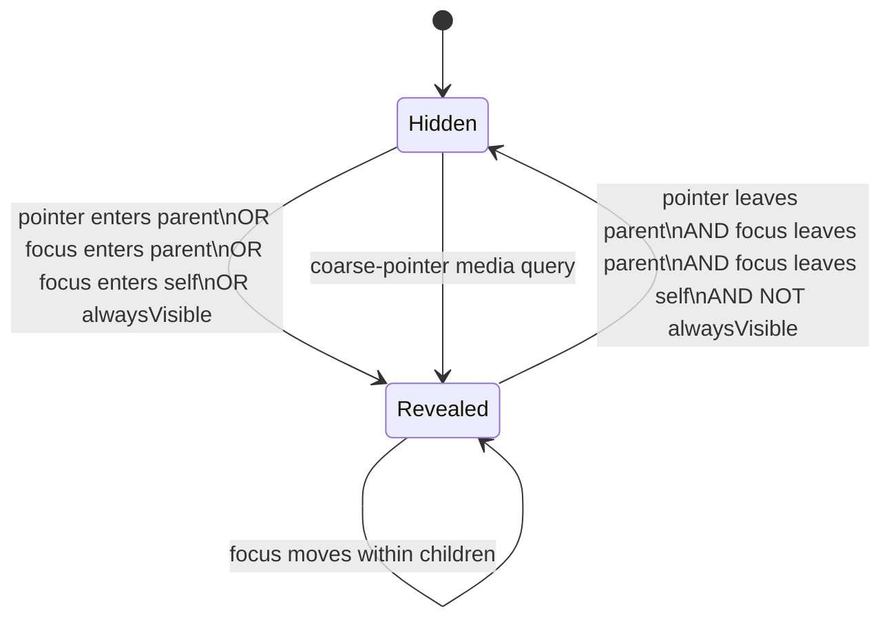
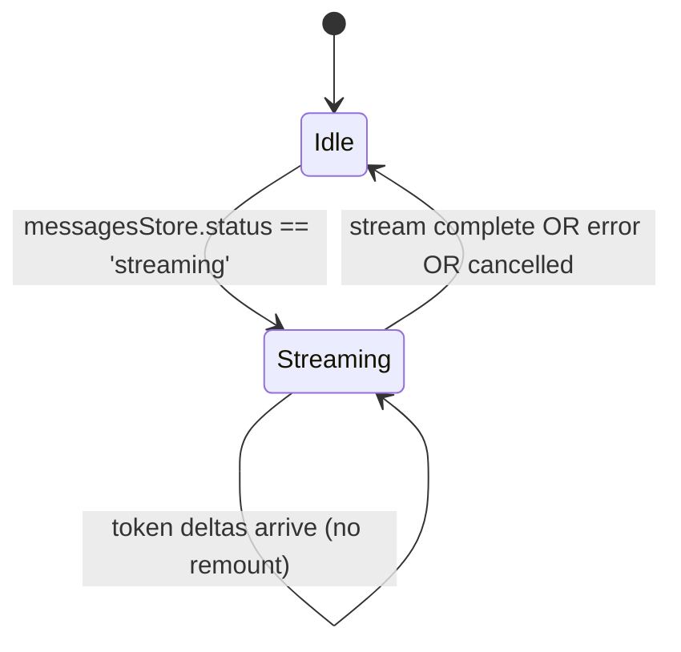
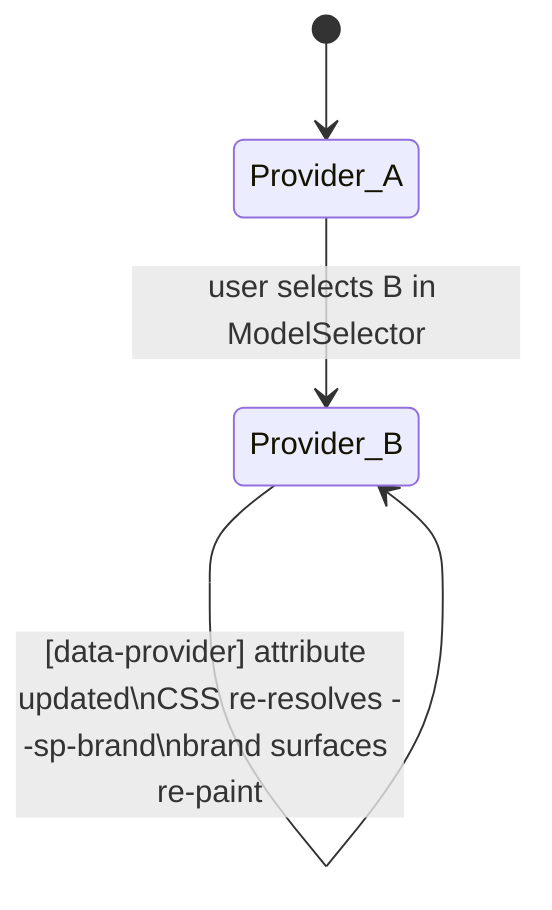
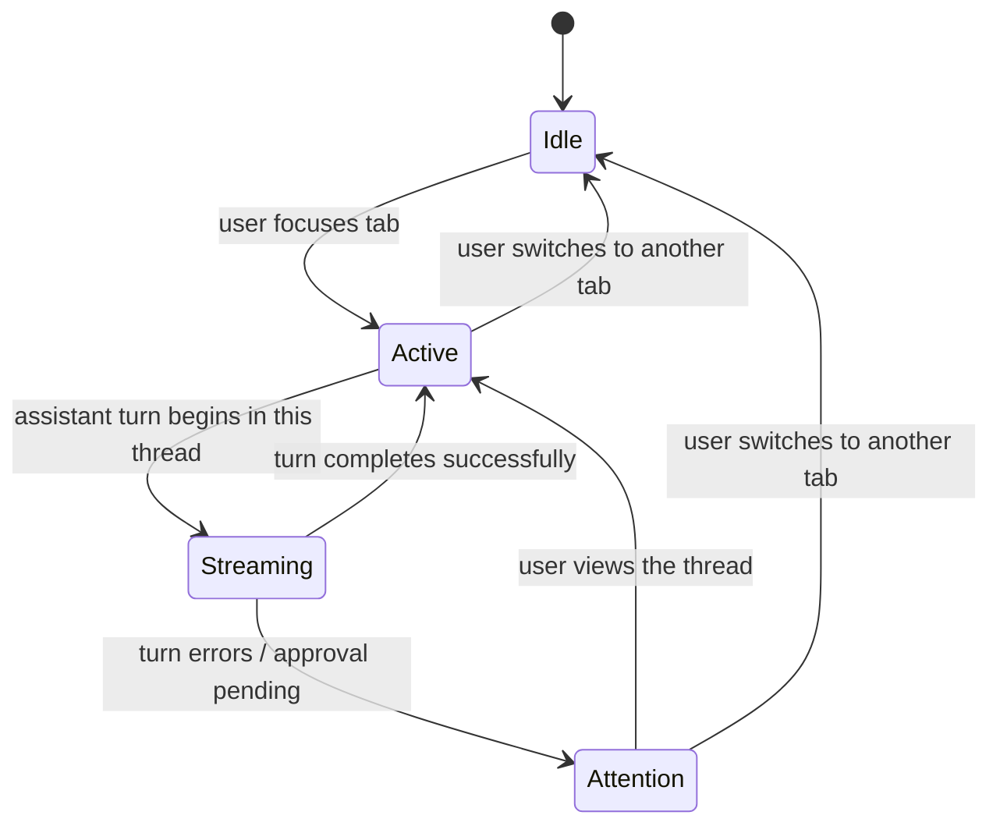
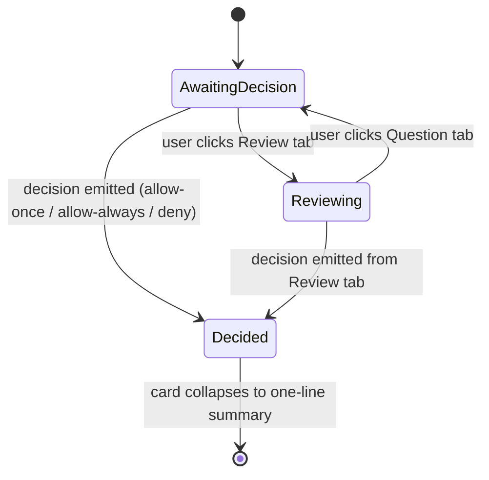
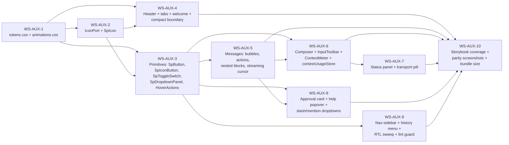

# Spec — Agent Sidepanel UX Parity

Implementation-ready contracts. Two independent teams should produce the same code from this document.

Trace IDs use `REQ-AUX-NNN` (functional), `NFR-AUX-NNN` (non-functional), `CQ-AUX-NN` (open clarification).

---

## 1. Interfaces

### 1.1 — `IconPort` (NEW narrow port)

**Path:** `src/domain/ports/IconPort.ts`

```ts
/**
 * Render a Lucide icon into an HTMLElement.
 *
 * Production implementation (ObsidianBridge) delegates to obsidian.setIcon.
 * Test / standalone implementations (MockBridge, LocalStorageBridge) write
 * an SVG placeholder of the form `<svg><title>{name}</title></svg>` so
 * consumers can assert on the icon name without booting Obsidian.
 *
 * Pre-conditions:
 *   - `el` is a mounted HTMLElement (in the DOM).
 *   - `name` is a non-empty string matching a Lucide icon id.
 * Post-conditions:
 *   - If `name` resolves: `el` contains an `<svg>` child.
 *   - If `name` does not resolve: `el` contents are unchanged (UI layer's
 *     SpIcon falls back to text rendering).
 *   - The function is synchronous and idempotent — calling it twice with the
 *     same `(el, name)` produces the same DOM state.
 * Errors: must not throw; missing-icon must leave `el` untouched.
 * Satisfies: REQ-AUX-001.
 */
export interface IconPort {
  setIcon(el: HTMLElement, name: string): void;
}
```

**Export:** add `export type { IconPort } from './IconPort';` to `src/domain/ports/index.ts`.

**InjectionKey:**

```ts
// src/infrastructure/bridge/ports.ts
export const ICON_PORT: InjectionKey<IconPort> = Symbol('IconPort');
```

**Composable:**

```ts
// src/ui/composables/useIconPort.ts
import { inject } from 'vue';
import type { IconPort } from '@/domain/ports';
import { ICON_PORT } from '@/infrastructure/bridge/ports';

export function useIconPort(): IconPort {
  const port = inject(ICON_PORT);
  if (!port) {
    throw new Error(
      'IconPort was not provided. Call app.provide(ICON_PORT, port) before mounting the app.',
    );
  }
  return port;
}
```

### 1.2 — `contextUsageStore` (NEW Pinia store)

**Path:** `src/ui/stores/contextUsageStore.ts`

```ts
import { defineStore } from 'pinia';

export interface ContextUsageState {
  /** Accumulated input + output tokens for the active thread. */
  tokensUsed: number;
  /** Provider+model capability cap; null when unknown (no cap reported). */
  tokensCap: number | null;
  /** Provider id the current cap corresponds to; used to invalidate on switch. */
  capProviderId: string | null;
  /** Model id the current cap corresponds to. */
  capModelId: string | null;
}

export interface ContextUsageActions {
  /**
   * Add `delta` tokens to the current count. Called by the streaming
   * reducer whenever a turn reports usage.
   */
  recordTokens(delta: number): void;
  /**
   * Reset the counter for a new thread or after /clear.
   */
  reset(): void;
  /**
   * Set the cap from the ProviderRegistry lookup. Called whenever the
   * active model changes.
   */
  setCap(providerId: string, modelId: string, cap: number | null): void;
}

export interface ContextUsageGetters {
  /** Fractional usage 0..1 (or null when cap unknown). */
  usageFraction: number | null;
  /** Whether usage is in the "warning" range (>=80%). */
  isWarning: boolean;
}

export const useContextUsageStore = defineStore('contextUsage', { /* … */ });
```

### 1.3 — Component contracts

> Vue 3 `<script setup lang="ts">`. Props use `defineProps<…>()`, emits use `defineEmits<…>()`, exposes via `defineExpose({ … })`.

#### 1.3.1 — `SpIcon.vue`

**Path:** `src/ui/components/primitives/SpIcon.vue`

```ts
interface SpIconProps {
  name: string;          // required — Lucide icon id
  size?: number;         // default 16 (CSS px)
  ariaLabel?: string;    // when omitted, root receives aria-hidden="true"
}
defineProps<SpIconProps>();
// no emits
defineExpose({ el: Ref<HTMLElement | null> });
```

Behaviour:

- `onMounted` and `watch(() => props.name)` call `useIconPort().setIcon(el.value, props.name)`.
- If after the call `el.value.querySelector('svg')` is `null`, set `el.value.textContent = props.ariaLabel ?? props.name` (missing-icon fallback) and call `useLoggerPort().warn('SpIcon: missing icon {name}', { name })` deduplicated by `name` (module-level `Set<string>`).
- Render template: `<span ref="el" class="sp-icon" :style="sizeStyle" :aria-label="ariaLabel" :aria-hidden="!ariaLabel" :data-icon="name"></span>`.

Satisfies: REQ-AUX-001, REQ-AUX-018.

#### 1.3.2 — `HoverActions.vue`

**Path:** `src/ui/components/primitives/HoverActions.vue`

```ts
type HoverActionsPlacement =
  | 'block-end-inline-end'
  | 'block-end-inline-start'
  | 'block-start-inline-end';

interface HoverActionsProps {
  placement?: HoverActionsPlacement;  // default 'block-end-inline-end'
  alwaysVisible?: boolean;            // default false
}
defineProps<HoverActionsProps>();
// no emits
// no exposes
// default slot — the action buttons
```

Behaviour: see ADR-AUX-003. Root is `<div class="sp-hover-actions" :data-placement="placement" role="toolbar">`. CSS contract:

```css
.sp-hover-actions { opacity: 0; transition: opacity var(--sp-duration-fast) var(--sp-ease); }
.sp-hover-host:hover .sp-hover-actions,
.sp-hover-host:focus-within .sp-hover-actions,
.sp-hover-actions:focus-within { opacity: 1; }
.sp-hover-actions[data-always-visible="true"] { opacity: 1; }
@media (prefers-reduced-motion: reduce) { .sp-hover-actions { transition: none; } }
@media (pointer: coarse) { .sp-hover-actions { opacity: 1; } }
```

Children remain in the accessibility tree at all times (opacity-only). Satisfies: REQ-AUX-002.

#### 1.3.3 — `InputToolbar.vue`

**Path:** `src/ui/components/agent/InputToolbar.vue`

```ts
// no props; reads stores
const emit = defineEmits<{
  (e: 'send'): void;
  (e: 'stop'): void;
  (e: 'attach'): void;
}>();
defineExpose({ sendButtonEl: Ref<HTMLElement | null> });
```

Composes (left to right): `ModelSelector`, `ModeSelector`, `PermissionToggle`, `ThinkingToggle`, `McpIndicator`, `ContextMeter`, `SpIconButton` (send/stop). Order is REQ-AUX-004 normative — model · mode · permission · thinking · mcp · context-meter · send, with send at `inset-inline-end`.

Send vs Stop: when `messagesStore.status === 'streaming'`, the trailing button renders `icon="square"` and emits `stop`; otherwise renders `icon="send"` and emits `send`.

Narrow-pane (root width < 360 px, measured by `ResizeObserver` on `.specorator-root`): toolbar wraps to two rows — model + send on row 1, toggles + meter on row 2.

Satisfies: REQ-AUX-004.

#### 1.3.4 — `ContextMeter.vue`

**Path:** `src/ui/components/agent/ContextMeter.vue`

```ts
interface ContextMeterProps {
  size?: number;          // default 18
  strokeWidth?: number;   // default 2
}
defineProps<ContextMeterProps>();
// no emits
```

Reads `useContextUsageStore()`. Renders an SVG donut whose `stroke-dashoffset` is bound to `usageFraction`. Stroke colour transitions from `--sp-brand` to `--sp-warning` when `isWarning` is true. Tooltip via `composer.contextMeter.tooltip` microcopy (`{used} of {total} tokens used.`).

#### 1.3.5 — `WelcomeGreeting.vue`

**Path:** `src/ui/components/agent/WelcomeGreeting.vue`

```ts
interface WelcomeSuggestion {
  id: 'feature' | 'tasks' | 'file' | 'slash' | 'mention' | 'send' | 'escape';
  prefillText?: string;
}
interface WelcomeGreetingProps {
  suggestions?: WelcomeSuggestion[];
}
defineProps<WelcomeGreetingProps>();
const emit = defineEmits<{
  (e: 'suggestion-pick', payload: { id: WelcomeSuggestion['id'] }): void;
}>();
```

Greeting variant is computed from `new Date().getHours()`: 5–11 → morning, 12–17 → afternoon, 18–22 → evening, otherwise → night. i18n keys `welcome.greeting.{morning|afternoon|evening|night}`.

Satisfies: REQ-AUX-007.

#### 1.3.6 — `StreamingCursor.vue`

**Path:** `src/ui/components/agent/StreamingCursor.vue`

No props, no emits. Template: `<span class="sp-streaming-cursor" aria-hidden="true"></span>`. CSS: 2 px × 1em, `background: currentColor`, `animation: streaming-cursor-blink 1s steps(2, end) infinite`. Reduced-motion → static block (no animation).

Satisfies: REQ-AUX-008.

#### 1.3.7 — `NestedDetailFrame.vue`

**Path:** `src/ui/components/agent/NestedDetailFrame.vue`

```ts
interface NestedDetailFrameProps {
  icon: string;                                       // required — Lucide name
  label: string;                                      // required
  summary?: string;
  status?: 'idle' | 'running' | 'complete' | 'error'; // default 'idle'
  defaultExpanded?: boolean;                          // default true
}
defineProps<NestedDetailFrameProps>();
const emit = defineEmits<{
  (e: 'expand-change', payload: { expanded: boolean }): void;
}>();
```

Root: `<section class="sp-nested-detail" :data-status>`. CSS contract owns the 2px inline-start border + indent (the only place those values exist). Default slot renders body inside the indented region.

Satisfies: REQ-AUX-013.

#### 1.3.8 — `ThreadTabBadge.vue`

**Path:** `src/ui/components/agent/ThreadTabBadge.vue`

```ts
type ThreadTabBadgeState = 'active' | 'streaming' | 'attention' | 'idle';
interface ThreadTabBadgeProps {
  state: ThreadTabBadgeState;
  digit: number | string;
}
defineProps<ThreadTabBadgeProps>();
```

Element: 24×24 fixed, `border-radius: var(--sp-radius-sm)`, 2 px border whose colour resolves from a data-state map (see §3.4). Streaming state animates via `thinking-pulse` keyframe applied to the border.

Satisfies: REQ-AUX-019.

#### 1.3.9 — `InlineApprovalCard.vue`

**Path:** `src/ui/components/agent/InlineApprovalCard.vue`

```ts
interface ApprovalRequest {
  id: string;
  toolName: string;
  blockedPath?: string;
  reason?: string;
  items: ApprovalItemModel[];
  selectMode: 'single' | 'multi';
}
interface ApprovalItemModel {
  id: string;
  label: string;
  defaultSelected?: boolean;
  editableFields?: ApprovalEditableField[];  // future-expandable; empty for now
}
interface ApprovalEditableField {
  key: string;
  label: string;
  type: 'text' | 'number' | 'boolean';
  initialValue: string | number | boolean;
}

interface InlineApprovalCardProps {
  request: ApprovalRequest;
}
defineProps<InlineApprovalCardProps>();
const emit = defineEmits<{
  (
    e: 'decision',
    payload: {
      id: string;
      verdict: 'allow-once' | 'allow-always' | 'deny';
      selectedItemIds: string[];
      edits?: Record<string, string | number | boolean>;
    },
  ): void;
}>();
```

Satisfies: REQ-AUX-021.

#### 1.3.10 — `TransportStatusPill.vue`

**Path:** `src/ui/components/agent/TransportStatusPill.vue`

```ts
type TransportStatusKind = 'connecting' | 'degraded' | 'offline';
interface TransportStatusPillProps {
  kind: TransportStatusKind;
  providerLabel: string;       // pre-resolved via copy table
  diagnostic?: string;
}
defineProps<TransportStatusPillProps>();
const emit = defineEmits<{
  (e: 'retry'): void;
}>();
```

#### 1.3.11 — `FloatingNavSidebar.vue`

```ts
interface FloatingNavSidebarProps {
  visible?: boolean;       // default true
}
defineProps<FloatingNavSidebarProps>();
const emit = defineEmits<{
  (e: 'scroll-to-top'): void;
  (e: 'scroll-to-bottom'): void;
  (e: 'regenerate-last'): void;
  (e: 'new-thread'): void;
}>();
```

#### 1.3.12 — `SpButton.vue` / `SpIconButton.vue`

```ts
// SpButton.vue
interface SpButtonProps {
  variant?: 'primary' | 'secondary' | 'ghost';   // default 'secondary'
  disabled?: boolean;
  loading?: boolean;
  type?: 'button' | 'submit';                    // default 'button'
}
const emit = defineEmits<{ (e: 'click', ev: MouseEvent): void }>();

// SpIconButton.vue
interface SpIconButtonProps {
  icon: string;             // Lucide name
  ariaLabel: string;        // required (icon-only is name-less without it)
  variant?: 'primary' | 'secondary' | 'ghost';
  disabled?: boolean;
  loading?: boolean;
  size?: number;            // default 16
}
const emit = defineEmits<{ (e: 'click', ev: MouseEvent): void }>();
```

#### 1.3.13 — `SpToggleSwitch.vue`

```ts
interface SpToggleSwitchProps {
  modelValue: boolean;
  label: string;            // visible inline label
  ariaLabel?: string;       // overrides aria-label if differing from visible label
  disabled?: boolean;
}
defineProps<SpToggleSwitchProps>();
const emit = defineEmits<{
  (e: 'update:modelValue', value: boolean): void;
}>();
```

#### 1.3.14 — `SpDropdownPanel.vue`

```ts
interface SpDropdownPanelProps {
  open: boolean;
  anchorMode?: 'dropup' | 'dropdown';  // default 'dropup'
  ariaLabel: string;
}
defineProps<SpDropdownPanelProps>();
const emit = defineEmits<{
  (e: 'close'): void;
}>();
// default slot — panel content
```

Behaviour: backdrop-filter blur with solid fallback; trap-focus while open; `Escape` closes; outside-click closes. Satisfies: REQ-AUX-012.

#### 1.3.15 — `HelpPopover.vue` (refresh)

```ts
interface HelpPopoverProps {
  open: boolean;
  commands: SlashCommand[];
}
defineProps<HelpPopoverProps>();
const emit = defineEmits<{
  (e: 'pick', payload: { commandId: string }): void;
  (e: 'close'): void;
}>();
```

Adds: search input, arrow-key navigation, selection announcement via `useA11yAnnouncer`. Satisfies: REQ-AUX-020.

### 1.4 — Existing component changes (signatures only)

| Component | Change |
|---|---|
| `AgentSidepanelRoot.vue` | Bind `:data-provider="providerStore.providerId"` on root `.specorator-root`. Mount `WelcomeGreeting` when `messages.length === 0`. Mount `FloatingNavSidebar`. Wire `ResizeObserver` to expose `narrow` via provide. |
| `AgentHeader.vue` | Collapse to single 36px band; remove `ProviderBadge` + `ModelSelector` slots. |
| `ThreadTabStrip.vue` | Render each tab via `ThreadTabBadge`; handle the existing `rename` emit at root. |
| `MessageList.vue` | Render `WelcomeGreeting` empty state in place of dashed tile grid. Surface `TransportStatusPill` at top of scroll region. Surface "↓ New messages" pill while streaming + scrolled-up. |
| `MessageItem.vue` | Add `data-role="user|assistant|system"`; wrap actions in `HoverActions`; add `unicode-bidi: plaintext` on content. |
| `MessageActions.vue` | Switch to `HoverActions` parent; icons via `SpIcon`. Copy success toggles to "Copied" label for 1.5s. |
| `ThinkingBlock.vue`, `ToolCallBlock.vue`, `SubagentBlock.vue` | Wrap body in `NestedDetailFrame`; remove their own border-indent CSS. |
| `StatusPanel.vue` | Group visually with composer; max-height `min(40vh, 320px)`; own scroll. |
| `ChatInput.vue` | Mount `InputToolbar` inside its wrapper; remove the send-only row. |
| `ModeSelector.vue`, `PermissionToggle.vue`, `ThinkingToggle.vue` | Adopt `SpToggleSwitch`. |
| `ModelSelector.vue` | Render dropdown via `SpDropdownPanel`. |
| `ProviderBadge.vue` | Resolve display text through `provider.combined` copy template; fallback to title-case humanisation for unknown ids. |
| `SlashCommandPopover.vue` | Render via `SpDropdownPanel`. |
| `CompactBoundary.vue` | Token-driven rule + chip; consume `--sp-compact`. |

### 1.5 — Bridge implementations (`IconPort.setIcon`)

```ts
// src/infrastructure/obsidian/ObsidianBridge.ts (excerpt)
import { setIcon as obsidianSetIcon } from 'obsidian';
public setIcon(el: HTMLElement, name: string): void {
  obsidianSetIcon(el, name);
}

// src/infrastructure/mock/MockBridge.ts (excerpt)
public setIcon(el: HTMLElement, name: string): void {
  // Deterministic placeholder so tests can assert on the icon name.
  while (el.firstChild) el.removeChild(el.firstChild);
  const svgNS = 'http://www.w3.org/2000/svg';
  const svg = document.createElementNS(svgNS, 'svg');
  svg.setAttribute('data-icon', name);
  svg.setAttribute('aria-hidden', 'true');
  const title = document.createElementNS(svgNS, 'title');
  title.textContent = name;
  svg.appendChild(title);
  el.appendChild(svg);
}

// src/infrastructure/localstorage/LocalStorageBridge.ts (excerpt)
// Identical to MockBridge.setIcon — both render the placeholder.
```

`tests/__fakes__/fake-ports.ts` extends `fakeModulePorts()` to expose `iconPort` with the MockBridge implementation.

### 1.6 — Microcopy contract

Add to `src/ui/i18n/locales/en.ts` (and locale stubs):

```ts
agent: {
  // … existing entries …
  provider: {
    label: { claude: 'Claude', codex: 'Codex', opencode: 'OpenCode', cursor: 'Cursor' },
    mode: { cli: 'CLI', api: 'API', web: 'Web' },
    combined: '{provider} · {mode}',
  },
  header: {
    title: 'Specorator',
    action: {
      newThread: { tooltip: 'New thread' },
      history: { tooltip: 'Thread history' },
      rename: { tooltip: 'Rename thread' },
      settings: { tooltip: 'Settings' },
      toggleNav: { tooltip: 'Toggle navigation' },
    },
  },
  composer: {
    placeholder: 'Ask Specorator, or type / for commands.',
    placeholderBashMode: 'Run a shell command (bang-bash mode).',
    placeholderInstructionMode: 'Add an instruction for the next turn.',
    send: { tooltip: 'Send', streamingTooltip: 'Stop generation' },
    attach: { tooltip: 'Attach a file' },
    mention: { tooltip: 'Mention a file or thread' },
    slash: { tooltip: 'Insert a slash command' },
    mode: { normal: 'Normal', instruction: 'Instruction', bash: 'Bash', plan: 'Plan' },
    permission: { label: 'Allow', planLabel: 'Plan' },
    thinking: { label: 'Thinking' },
    mcp: { label: 'MCP' },
    contextMeter: { tooltip: '{used} of {total} tokens used.' },
  },
  message: {
    action: {
      copy: { tooltip: 'Copy message', confirm: 'Copied' },
      edit: { tooltip: 'Edit message' },
      regenerate: { tooltip: 'Regenerate response' },
      fork: { tooltip: 'Fork thread from here' },
      delete: { tooltip: 'Delete message' },
    },
  },
  welcome: {
    greeting: {
      morning: 'Good morning.',
      afternoon: 'Good afternoon.',
      evening: 'Good evening.',
      night: 'Working late.',
    },
    suggestion: {
      feature: 'Start a feature',
      tasks: 'Review the task plan',
      file: 'Explain the active file',
    },
  },
  approval: {
    title: 'Permission needed.',
    tab: { question: 'Question', review: 'Review' },
    action: { allowOnce: 'Allow once', allowAlways: 'Allow always', deny: 'Deny' },
    hint: { shortcut: 'Enter to submit, Esc to deny.' },
  },
  transport: {
    connecting: 'Connecting to {provider}.',
    degraded: '{provider} is slow to respond.',
    offline: '{provider} is unreachable.',
    retry: 'Retry',
  },
  history: {
    sectionTitle: 'RECENT THREADS',
    empty: 'No previous threads yet.',
    action: {
      rename: { tooltip: 'Rename thread' },
      delete: { tooltip: 'Delete thread' },
    },
    confirmDelete: 'Delete this thread? This cannot be undone.',
  },
  compact: { boundary: { label: 'Conversation compacted at {time}.' } },
}
```

Satisfies: REQ-AUX-016, REQ-AUX-018.

---

## 2. Data structures

### 2.1 — Store fields

| Store | Field | Type | Default | Notes |
|---|---|---|---|---|
| `chatProviderStore` | `providerId` getter | `'claude' \| 'codex' \| 'opencode' \| 'cursor'` | derived | Computed from existing transport/provider state. No persisted change. |
| `contextUsageStore` (NEW) | `tokensUsed` | `number` | `0` | Per-thread accumulator. |
| `contextUsageStore` | `tokensCap` | `number \| null` | `null` | From `ProviderRegistry.getCapabilities().contextWindow`. |
| `contextUsageStore` | `capProviderId` | `string \| null` | `null` | For invalidation. |
| `contextUsageStore` | `capModelId` | `string \| null` | `null` | For invalidation. |
| `settingsStore` (existing) | `showMessageTimestamps` | `boolean` | `false` | Already present; surfaced by REQ-AUX-014. |

### 2.2 — Port surfaces

`IconPort` is the only new port. See §1.1.

### 2.3 — Capability fields

No new fields. `ProviderCapabilities.contextWindow` already exists (WS-3 provider registry); `contextUsageStore` reads it via `getCapabilities()`.

### 2.4 — DOM contract

- `.specorator-root` carries `[data-provider]` whenever a provider is active. Selector parity with the token layer.
- `.sp-hover-host` is added to any row that drives a `<HoverActions>` reveal (MessageItem, history row, code block, attachment chip wrapper).
- `data-role="user|assistant|system"` on `MessageItem.vue` root.
- `data-status="idle|running|complete|error"` on `NestedDetailFrame.vue` root.
- `data-state="active|streaming|attention|idle"` on `ThreadTabBadge.vue` root.

---

## 3. State transitions

### 3.1 — Hover/focus-reveal state machine (`HoverActions`)



Note: state is entirely CSS-driven; no JS state machine. Children are present in DOM in both states.

### 3.2 — Streaming-cursor state



Element exists only while `Streaming`; appended after the last text node of the in-progress assistant bubble. Reduced-motion: same lifecycle, no animation.

### 3.3 — Provider-swap visual transition



No re-mount. The transition is whatever the CSS specifies (currently 0.15s on consuming surfaces — colour transition tokens).

### 3.4 — Tab badge state diagram



Border-colour mapping (driven by `data-state`):

| State | Border colour token |
|---|---|
| `active` | `var(--sp-interactive-accent)` |
| `streaming` | `var(--sp-brand)` (+ `thinking-pulse` keyframe) |
| `attention` | `var(--sp-error)` |
| `idle` | `var(--sp-border)` |

Satisfies: REQ-AUX-019.

### 3.5 — Approval card lifecycle



---

## 4. CSS token contract

Full enumeration of `--sp-*` tokens. Declared on `.specorator-root` in `src/ui/styles/tokens.css`. Default values map to Obsidian custom properties where applicable; brand literals are inlined here only.

### 4.1 — Colour tokens

```css
.specorator-root {
  --sp-text-normal:        var(--text-normal);
  --sp-text-muted:         var(--text-muted);
  --sp-text-faint:         var(--text-faint);
  --sp-bg-primary:         var(--background-primary);
  --sp-bg-primary-alt:     var(--background-primary-alt);
  --sp-bg-secondary:       var(--background-secondary);
  --sp-bg-secondary-alt:   var(--background-secondary-alt);
  --sp-border:             var(--background-modifier-border);
  --sp-border-strong:      var(--background-modifier-border-hover);
  --sp-interactive-accent: var(--interactive-accent);
  --sp-interactive-hover:  var(--background-modifier-hover);
  --sp-error:              var(--text-error, #dc3545);
  --sp-error-rgb:          220, 53, 69;
  --sp-warning:            var(--color-orange, #d97706);
  --sp-success:            var(--color-green, #16a34a);
  --sp-compact:            #5bc0de;
  --sp-focus-ring:         var(--interactive-accent);
}
```

### 4.2 — Brand tokens + provider overrides

```css
.specorator-root {
  --sp-brand:              var(--sp-brand-claude);
  --sp-brand-rgb:          var(--sp-brand-claude-rgb);
  --sp-brand-claude:       #D97757;
  --sp-brand-claude-rgb:   217, 119, 87;
  --sp-brand-codex:        #d0d0d0;
  --sp-brand-codex-rgb:    208, 208, 208;
  --sp-brand-opencode:     #B8B8B8;
  --sp-brand-opencode-rgb: 184, 184, 184;
  --sp-brand-cursor:       #6b7280;       /* CQ-AUX-01 — placeholder */
  --sp-brand-cursor-rgb:   107, 114, 128;
  --sp-brand-translucent:  rgba(var(--sp-brand-rgb), 0.15);
  --sp-accent:             var(--sp-brand);
}
body.theme-light .specorator-root {
  --sp-brand-codex:        #000000;
  --sp-brand-codex-rgb:    0, 0, 0;
  --sp-brand-opencode:     #707070;
  --sp-brand-opencode-rgb: 112, 112, 112;
}
.specorator-root[data-provider="claude"]   { --sp-brand: var(--sp-brand-claude);   --sp-brand-rgb: var(--sp-brand-claude-rgb); }
.specorator-root[data-provider="codex"]    { --sp-brand: var(--sp-brand-codex);    --sp-brand-rgb: var(--sp-brand-codex-rgb); }
.specorator-root[data-provider="opencode"] { --sp-brand: var(--sp-brand-opencode); --sp-brand-rgb: var(--sp-brand-opencode-rgb); }
.specorator-root[data-provider="cursor"]   { --sp-brand: var(--sp-brand-cursor);   --sp-brand-rgb: var(--sp-brand-cursor-rgb); }
```

### 4.3 — Typography tokens

```css
.specorator-root {
  --sp-font-text:          var(--font-text);
  --sp-font-mono:          var(--font-monospace);
  --sp-font-serif:         Copernicus, 'Tiempos Headline', Tiempos, Georgia, 'Times New Roman', serif;

  --sp-font-size-xs:       11px;
  --sp-font-size-sm:       12px;
  --sp-font-size-md:       13px;
  --sp-font-size-base:     14px;
  --sp-font-size-lg:       15px;
  --sp-font-size-xl:       16px;
  --sp-font-size-display:  28px;

  --sp-font-weight-light:     300;
  --sp-font-weight-medium:    500;
  --sp-font-weight-semibold:  600;

  --sp-line-height-tight:   1.4;
  --sp-line-height-normal:  1.5;
}
```

### 4.4 — Spacing rhythm

```css
.specorator-root {
  --sp-space-1: 2px;
  --sp-space-2: 4px;
  --sp-space-3: 6px;
  --sp-space-4: 8px;
  --sp-space-5: 12px;
  --sp-space-6: 16px;
  --sp-space-7: 24px;
}
```

### 4.5 — Radii

```css
.specorator-root {
  --sp-radius-xs:                    3px;
  --sp-radius-sm:                    4px;
  --sp-radius-md:                    6px;
  --sp-radius-lg:                    8px;
  --sp-radius-pill:                  9px;
  --sp-radius-pill-lg:               12px;
  --sp-radius-pill-xl:               16px;
  --sp-radius-full:                  999px;
  --sp-radius-bubble-tail-user:      4px;
  --sp-radius-bubble-tail-assistant: 4px;
}
```

### 4.6 — Shadows + z-index + motion

```css
.specorator-root {
  --sp-shadow-subtle:      var(--shadow-s, 0 2px 4px rgba(0,0,0,0.1));
  --sp-shadow-dropup:      0 -4px 16px rgba(0,0,0,0.2);
  --sp-shadow-dropdown:    0 4px 16px rgba(0,0,0,0.25);
  --sp-shadow-focus-ring:  0 0 0 2px var(--sp-focus-ring);

  --sp-blur:               blur(20px);

  --sp-z-base:             1;
  --sp-z-floating:         2;
  --sp-z-tooltip:          100;
  --sp-z-nav:              100;
  --sp-z-dropdown:         1000;
  --sp-z-dropdown-fixed:   10001;

  --sp-duration-fast:      0.15s;
  --sp-duration-medium:    0.2s;
  --sp-duration-slow:      0.3s;
  --sp-ease:               ease;
  --sp-ease-in-out:        ease-in-out;
  --sp-ease-linear:        linear;
}
@media (prefers-reduced-motion: reduce) {
  .specorator-root {
    --sp-duration-fast:   0s;
    --sp-duration-medium: 0s;
    --sp-duration-slow:   0s;
  }
}
```

### 4.7 — Surfaces

```css
.specorator-root {
  --sp-surface-overlay: var(--sp-bg-secondary);  /* used by SpDropdownPanel with backdrop blur */
}
```

---

## 5. File-level change list

> Path / status / 1-line rationale. `NEW` files are unique to this feature; `MODIFIED` files are existing files touched.

### 5.1 — Domain layer

| Path | Status | Rationale |
|---|---|---|
| `src/domain/ports/IconPort.ts` | NEW | Narrow port for `obsidian.setIcon` (ADR-AUX-001). |
| `src/domain/ports/index.ts` | MODIFIED | Export `IconPort` type. |

### 5.2 — Infrastructure layer

| Path | Status | Rationale |
|---|---|---|
| `src/infrastructure/bridge/ports.ts` | MODIFIED | Export `ICON_PORT` InjectionKey. |
| `src/infrastructure/obsidian/ObsidianBridge.ts` | MODIFIED | Implement `setIcon` via `obsidian.setIcon`. |
| `src/infrastructure/mock/MockBridge.ts` | MODIFIED | Implement `setIcon` writing SVG `<title>` placeholder. |
| `src/infrastructure/localstorage/LocalStorageBridge.ts` | MODIFIED | Same placeholder as MockBridge. |

### 5.3 — UI: composables, stores, styles

| Path | Status | Rationale |
|---|---|---|
| `src/ui/composables/useIconPort.ts` | NEW | Composable for `<SpIcon>`. |
| `src/ui/stores/contextUsageStore.ts` | NEW | Tokens-used + cap; consumed by `ContextMeter`. |
| `src/ui/styles/tokens.css` | NEW | `--sp-*` design-token layer (ADR-AUX-002). |
| `src/ui/styles/animations.css` | NEW | Named keyframes (`thinking-pulse`, `streaming-cursor-blink`, `spin`, `mcp-glow`, `external-context-glow`). |
| `src/ui/main.ts` | MODIFIED | Import `tokens.css`; provide `ICON_PORT` in mock setup. |
| `src/ui/i18n/locales/en.ts` | MODIFIED | Microcopy additions (§1.6). |

### 5.4 — UI: primitives (NEW directory under `src/ui/components/primitives/`)

| Path | Status | Rationale |
|---|---|---|
| `src/ui/components/primitives/SpIcon.vue` | NEW | Single Lucide-icon seam. |
| `src/ui/components/primitives/SpButton.vue` | NEW | Token-driven button primitive. |
| `src/ui/components/primitives/SpIconButton.vue` | NEW | Icon-only button with required ariaLabel. |
| `src/ui/components/primitives/SpToggleSwitch.vue` | NEW | Shared pill toggle. |
| `src/ui/components/primitives/SpDropdownPanel.vue` | NEW | Backdrop-blur dropdown primitive. |
| `src/ui/components/primitives/HoverActions.vue` | NEW | Hover/focus-reveal primitive (ADR-AUX-003). |

### 5.5 — UI: agent surface

| Path | Status | Rationale |
|---|---|---|
| `src/ui/agent/AgentSidepanelRoot.vue` | MODIFIED | `[data-provider]` attr; mount welcome + nav; `ResizeObserver` for narrow-pane. |
| `src/ui/components/agent/AgentHeader.vue` | MODIFIED | Collapse to single 36px band. |
| `src/ui/components/agent/AgentHeaderTooltip.vue` | NEW | Tooltip wrapper for header icon buttons. |
| `src/ui/components/agent/ThreadTabStrip.vue` | MODIFIED | Render via `ThreadTabBadge`; handle rename emit. |
| `src/ui/components/agent/ThreadTabBadge.vue` | NEW | Extracted badge with state-aware border. |
| `src/ui/components/agent/MessageList.vue` | MODIFIED | Welcome state + transport pill + "↓ New" pill. |
| `src/ui/components/agent/MessageItem.vue` | MODIFIED | `data-role`; `HoverActions` wrap; `unicode-bidi: plaintext`. |
| `src/ui/components/agent/MessageActions.vue` | MODIFIED | `SpIcon` + `HoverActions`; "Copied" swap. |
| `src/ui/components/agent/MessageActionIcon.vue` | NEW | Per-action wrapper for tooltip + aria. |
| `src/ui/components/agent/NestedDetailFrame.vue` | NEW | Shared 2px-border-indent frame. |
| `src/ui/components/agent/ThinkingBlock.vue` | MODIFIED | Wrap in `NestedDetailFrame`. |
| `src/ui/components/agent/ToolCallBlock.vue` | MODIFIED | Wrap in `NestedDetailFrame`. |
| `src/ui/components/agent/SubagentBlock.vue` | MODIFIED | Wrap in `NestedDetailFrame`. |
| `src/ui/components/agent/StatusPanel.vue` | MODIFIED | Group with composer; max-height + own scroll. |
| `src/ui/components/agent/StatusTodoItem.vue` | NEW | Extracted todo renderer for Storybook. |
| `src/ui/components/chat/ChatInput.vue` | MODIFIED | Mount `InputToolbar`; drop send-only row. |
| `src/ui/components/agent/InputToolbar.vue` | NEW | model · mode · permission · thinking · mcp · meter · send. |
| `src/ui/components/agent/ContextMeter.vue` | NEW | SVG donut from `contextUsageStore`. |
| `src/ui/components/agent/McpIndicator.vue` | NEW | MCP active indicator with glow animation. |
| `src/ui/components/agent/ModeSelector.vue` | MODIFIED | Adopt `SpToggleSwitch`. |
| `src/ui/components/agent/PermissionToggle.vue` | MODIFIED | Adopt `SpToggleSwitch`. |
| `src/ui/components/agent/ThinkingToggle.vue` | MODIFIED | Adopt `SpToggleSwitch`. |
| `src/ui/components/agent/ModelSelector.vue` | MODIFIED | Render dropdown via `SpDropdownPanel`. |
| `src/ui/components/agent/ProviderBadge.vue` | MODIFIED | Copy-table resolution; fallback humanisation. |
| `src/ui/components/agent/SlashCommandPopover.vue` | MODIFIED | Render via `SpDropdownPanel`. |
| `src/ui/components/agent/MentionPopover.vue` | NEW | `@`-mentions mirror of slash dropdown. |
| `src/ui/components/agent/ThreadHistoryMenu.vue` | NEW | History menu in dropup. |
| `src/ui/components/agent/HelpPopover.vue` | MODIFIED | Search + arrow nav (REQ-AUX-020). |
| `src/ui/components/agent/WelcomeGreeting.vue` | NEW | Centred serif greeting. |
| `src/ui/components/agent/WelcomeSuggestionChip.vue` | NEW | Suggestion chip sub-component. |
| `src/ui/components/agent/StreamingCursor.vue` | NEW | Animated cursor element. |
| `src/ui/components/agent/InlineApprovalCard.vue` | NEW | Tabbed inline approval. |
| `src/ui/components/agent/ApprovalTabBar.vue` | NEW | Tabs within approval. |
| `src/ui/components/agent/ApprovalItem.vue` | NEW | Item row within approval. |
| `src/ui/components/agent/ApprovalReviewBody.vue` | NEW | Review tab body. |
| `src/ui/components/agent/FloatingNavSidebar.vue` | NEW | Right-edge floating nav. |
| `src/ui/components/agent/NavSidebarButton.vue` | NEW | Circular button sub-component. |
| `src/ui/components/agent/CompactBoundary.vue` | MODIFIED | Token-driven divider. |
| `src/ui/components/agent/TransportStatusPill.vue` | NEW | Surfaces dormant `ChatDegradedState`. |

### 5.6 — Plugin layer

| Path | Status | Rationale |
|---|---|---|
| `src/plugin/main.ts` | MODIFIED | Provide `ICON_PORT` to the Agent view. |

### 5.7 — Tests + tooling

| Path | Status | Rationale |
|---|---|---|
| `tests/__fakes__/fake-ports.ts` | MODIFIED | Expose `iconPort` from MockBridge in `fakeModulePorts()`. |
| `tests/ui/components/primitives/SpIcon.test.ts` | NEW | Asserts `setIcon` called + missing-icon fallback. |
| `tests/ui/components/primitives/HoverActions.test.ts` | NEW | Asserts a11y-tree invariant + reduced-motion + coarse-pointer branches. |
| Additional component tests under `tests/ui/components/agent/**` | NEW | One per new/refreshed component. |
| Storybook stories under `src/ui/components/agent/**/__stories__/` | NEW | One story per MPS surface component (REQ-AUX-017). |
| `eslint.config.js` | MODIFIED | Optional Stylelint integration for physical-property guard (WS-AUX-9). |

### 5.8 — Deletions

None. The dormant `ChatDegradedState` is **surfaced**, not deleted (it was idea.md gap #15).

---

## 6. Test scenarios (one per REQ)

| REQ | Test |
|---|---|
| REQ-AUX-001 | Mount `<SpIcon name="send" ariaLabel="Send"/>`. Assert `el.querySelector('svg [data-icon]')?.getAttribute('data-icon') === 'send'` (or `<title>send</title>` via MockBridge); assert `aria-label="Send"`. |
| REQ-AUX-002 | Mount `MessageItem` with one message. Assert `MessageActions` children are in DOM with `opacity: 0`. Dispatch `pointerenter`; assert opacity transitions to `1` (or snaps under reduced-motion). Move focus away; assert opacity `0`. Focus an action inside; assert opacity `1`. |
| REQ-AUX-003 | Mount `AgentSidepanelRoot`; assert `[data-testid="agent-header"]` direct children count is one band (logo+title+actions) and no ProviderBadge/ModelSelector descendant. |
| REQ-AUX-004 | Mount `InputToolbar`; query `[data-testid]`s in source order; assert order is `model`, `mode`, `permission`, `thinking`, `mcp`, `context-meter`, `send`. |
| REQ-AUX-005 | Mount `MessageList` with one user + one assistant message. Assert user `data-role="user"` and computed `align-self: flex-end`, assistant `data-role="assistant"` with no `background-color` set on bubble (transparent). |
| REQ-AUX-006 | Set `providerStore.providerId = 'claude'`; read `getComputedStyle(root).getPropertyValue('--sp-brand')` → `#D97757`. Switch to `codex`; re-read; assert it changed without remount (root element reference identity preserved). |
| REQ-AUX-007 | Mount `MessageList` with empty thread; assert `WelcomeGreeting` present, no dashed tile grid (`[data-testid="empty-tile-grid"]` absent), greeting uses `font-family` including `Copernicus`. |
| REQ-AUX-008 | Set `messagesStore.status = 'streaming'`; assert `<span class="sp-streaming-cursor">` present at tail of last assistant message; assert transcript text contains no `▍` glyph. |
| REQ-AUX-009 | Grep scoped `<style>` blocks under `src/ui/agent/**` and `src/ui/components/agent/**`; assert no occurrences of `var(--text-` / `var(--background-` / `var(--interactive-`. CI-level grep. |
| REQ-AUX-010 | Grep same paths for `padding-left|padding-right|margin-left|margin-right|left:|right:|text-align:\s*(left\|right)|border-(top\|bottom)-(left\|right)-radius`; assert zero matches. CI-level grep. |
| REQ-AUX-011 | Mount `StatusPanel` + `ChatInput`; assert they share a single bordered ancestor (`closest('.sp-composer-group')` returns same node). Assert `getComputedStyle(StatusPanel).maxHeight` resolves to a value `≤ min(40vh, 320px)`. |
| REQ-AUX-012 | Open any `SpDropdownPanel`; assert `getComputedStyle(panel).backdropFilter` contains `blur`; press Escape; assert `open` becomes false; click outside; assert closed. |
| REQ-AUX-013 | Mount `ThinkingBlock`, `ToolCallBlock`, `SubagentBlock`; for each, query the rendered `NestedDetailFrame` root; assert `border-inline-start: 2px solid var(--sp-border)` (computed) and identical `padding-inline-start`. |
| REQ-AUX-014 | Mount `MessageItem` user message; assert user-role avatar present, no model name. Mount assistant message; assert assistant-role avatar + model display name. Toggle `showMessageTimestamps`; assert timestamp visibility flips. |
| REQ-AUX-015 | Mount transcript with one `CompactBoundary`; assert rendered DOM has `<hr>`-equivalent rules on both sides of a centred label; assert label colour resolves to `var(--sp-compact)`. |
| REQ-AUX-016 | Pass `provider.id="claude/cli"` to `ProviderBadge`; assert rendered text is `Claude · CLI` (from copy table). Pass `provider.id="unknown-thing"`; assert title-cased fallback `Unknown · Thing`. |
| REQ-AUX-017 | CI runs `npm run test:storybook`; assert every component in the §5 NEW list has at least one story registered. |
| REQ-AUX-018 | A11y axe scan on `AgentSidepanelRoot` Storybook story; assert no critical violations. Manual keyboard walk: tab from top, assert order header → tabs → transcript actionable → status panel → composer. Assert every icon-only button has non-empty `aria-label`. |
| REQ-AUX-019 | Mount `ThreadTabBadge` with `state="active"` then `"streaming"` then `"attention"` then `"idle"`; for each, assert border-colour matches the §3.4 mapping; under streaming, assert `animation-name: thinking-pulse`. |
| REQ-AUX-020 | Open `HelpPopover`; type into search input; assert visible items filter; press ArrowDown twice + Enter; assert `pick` event fires with the third item's id; press Escape; assert `close` event. |
| REQ-AUX-021 | Render `InlineApprovalCard` with single-select request; assert tabs `Question` / `Review` present, items prefixed with `▌`. Click an item then Allow once; assert `decision` event payload `{ verdict: 'allow-once', selectedItemIds: ['…'] }`. Repeat for multi-select with `[ ]` / `[✓]`. |

NFR test scenarios:

| NFR | Verification |
|---|---|
| NFR-AUX-001 | CI captures gzipped `main.js` + `styles.css` at baseline (WS-AUX-1 tip); at WS-AUX-10 assert `(new - baseline) / baseline ≤ 0.05`. |
| NFR-AUX-002 / 003 / 004 / 005 | ESLint pre-existing rules (`vue/no-v-html`, `no-restricted-properties`, `no-restricted-globals`, `no-restricted-imports`) stay green. |
| NFR-AUX-006 / 010 | Stylelint (or grep) guard added in WS-AUX-9; CI step fails on violation. |
| NFR-AUX-007 | Every workstream tip runs `npm run verify`; CI required check. |
| NFR-AUX-008 | Axe scan + manual contrast review at WS-AUX-10. |
| NFR-AUX-009 | Storybook coverage check enumerates NEW components and matches against story registry. |
| NFR-AUX-011 | Code review checklist; no new outbound calls or `localStorage`/`SettingsPort` writes. |
| NFR-AUX-012 | `npm run test:coverage` threshold gate (80/70/80/80). |

---

## 7. Workstreams (finalised)

Nine workstreams. Each ships independently; each PR runs the verify gate. Dependencies:



WS-AUX-1 is a pure additive workstream; the token defaults equal Obsidian vars so no visual change occurs until consumers opt in.

---

## 8. Edge cases (matching design §C.6)

| Case | Handling |
|---|---|
| Reduced motion (`prefers-reduced-motion: reduce`) | `--sp-duration-*` collapse to `0s`; `StreamingCursor` static; `HoverActions` snap; `spin` has explicit `animation: none`. Test: per-component story toggles the media query. |
| High-contrast / forced-colors | `@media (forced-colors: active)` overrides brand tokens to `CanvasText` / `Highlight` / `LinkText`; focus rings use `outline: 2px solid Highlight`. Test: axe forced-colors story. |
| Light vs dark theme contrast | Defaults map to Obsidian vars so user theme drives contrast. Brand literals overridden under `body.theme-light .specorator-root` (codex `#000`, opencode `#707070`). WCAG audit at WS-AUX-10. |
| RTL languages | All scoped styles use logical properties; `unicode-bidi: plaintext` on content; `dir="auto"` on user-authored containers. Stylelint guard prevents physical-property regressions. |
| Narrow sidepanel <300 px | `FloatingNavSidebar.visible=false` via `ResizeObserver`; `InputToolbar` wraps to two rows; tab strip overflow-scrolls; header title truncates with tooltip. |
| Wide sidepanel ≥720 px | `FloatingNavSidebar` always visible; layout unchanged otherwise. |
| Missing icon name | `<SpIcon>` falls back to `el.textContent = ariaLabel ?? name`; warns once per name through `useLoggerPort().warn` (deduped). |
| No provider selected yet | `[data-provider]` omitted; `--sp-brand` falls back to `--sp-brand-claude`; `ProviderBadge` shows `—`. |
| Bundle-size growth >5% | Block release; planner re-prioritises (likely deferring `FloatingNavSidebar` or `MentionPopover` icons). |
| Concurrency: provider switched mid-stream | `chatProviderStore.setActiveProvider` blocks mid-stream (existing behaviour); the boundary marker is only inserted after the stream completes. |
| Idempotency: same icon name set twice | `IconPort.setIcon` is idempotent per the port contract; `<SpIcon>` watcher only fires on actual `name` changes. |
| Empty thread + `[data-provider]` swap | Welcome greeting re-renders with the new brand colour; no compact boundary is inserted (no messages exist). |
| Very long thread name | Header title truncates with `text-overflow: ellipsis`; full title in `title` attribute for native tooltip. |
| Timezone boundaries on `welcome.greeting.*` | Variant is computed from local `getHours()` — locale's local time; documented in microcopy. No UTC drift expected. |
| Concurrent approval prompts | At most one `InlineApprovalCard` renders at a time; queued approvals show as collapsed pending rows above the active card. (Already enforced by existing `messagesStore`; this spec inherits.) |
| Streaming cursor while user is editing a prior message | `StreamingCursor` only appears on the in-progress assistant message; user-edit mode swaps the bubble for a textarea, no cursor in that branch. |

---

## 9. Risks + mitigations

| Risk | Likelihood | Impact | Mitigation |
|---|---|---|---|
| Token defaults drift from Obsidian vars (silent regression) | Medium | Medium | Snapshot a Storybook page per surface at default theme; visual diff in CI. |
| `IconPort` placeholder differs visually from production icons in dev/demo | Low | Low | Document the placeholder shape in the demo README; production parity is achieved in Obsidian. |
| `HoverActions` consumers forget `.sp-hover-host` class | Medium | Medium | JSDoc + PR review; consider runtime warning if `HoverActions` mounts under an ancestor without `.sp-hover-host` (dev-only). |
| Bundle growth exceeds 5% | Medium | High | Audit Lucide icon set at WS-AUX-10; trim unused icons; lazy-load `MentionPopover` content. |
| RTL guard surfaces a flood of existing violations | Medium | Medium | Guard scoped initially to migrated paths under `src/ui/agent/**` and `src/ui/components/agent/**`; broaden after sweep. |
| `contextUsageStore` cap incorrect for new providers | Medium | Low | Defaults to `null` → meter renders without warning state; provider registry update lands separately. |
| Cursor brand colour placeholder (`#6b7280`) accepted by default | Medium | Low | CQ-AUX-01 carried into spec; Cursor adapter is still gated by CQ-MPS-01. |
| Floating nav-sidebar conflicts with sidepanel chrome on some Obsidian layouts | Low | Medium | `visible` prop driven by `ResizeObserver`; can be disabled via setting if needed. |
| `setIcon` semantics change in a future Obsidian release | Low | Low | One seam to update (`ObsidianBridge.setIcon`); contract test catches breakage. |

---

## 10. Open clarifications (`CQ-AUX-NN`)

> Carried forward from design Part A §A.7 (`Q-UX-*`), Part B §B.8 (`Q-AUX-UI-*`). None block design acceptance.

| ID | Source | Question | Owner |
|---|---|---|---|
| CQ-AUX-01 | Part B Q1 | Cursor brand colour — placeholder `#6b7280` until Cursor adapter ships. | ux-designer + PM |
| CQ-AUX-02 | Part B Q2 | `NestedDetailFrame` design-system sign-off. | ux-designer |
| CQ-AUX-03 | Part B Q3 | `InputToolbar` slot order + promotion to design-system primitive. | ux-designer |
| CQ-AUX-04 | Part B Q4 | `SpDropdownPanel` cross-feature impact (Settings tab pickers). | architect + ux-designer |
| CQ-AUX-05 | Part A Q1 | Welcome tile count — 2 or 4? Spec defaults to 3 (start a feature, review tasks, explain file). | PM |
| CQ-AUX-06 | Part A Q2 | Per-message action set — does Fork ship in this feature? Spec includes it; defer if PM disagrees. | PM + architect |
| CQ-AUX-07 | Part A Q3 | Tab close affordance — inline `[×]` on hover, or modal-only? Spec keeps modal. | PM |
| CQ-AUX-08 | Part A Q4 | Floating nav-sidebar contents — spec lists scroll-to-top, scroll-to-bottom, regenerate-last, new-thread. | PM |
| CQ-AUX-09 | Part A Q5 | Approval widget editable fields — spec leaves `editableFields: []` until tool schemas land. | architect |
| CQ-AUX-10 | Part A Q6 | `↑` to edit last user message — spec accepts in scope, guarded to empty textarea + no open picker. | PM |
| CQ-AUX-11 | Part A Q7 | Compact-boundary icon mapping by boundary type. | ui-designer |
| CQ-AUX-12 | Part A Q8 | Streaming cursor under reduced-motion — static block, confirmed in spec. | ux-designer |
| CQ-AUX-13 | Part B Q6 | Plan-mode label colour `rgb(92, 148, 140)` as first-class token? Spec leaves it inline pending decision. | ux-designer |
| CQ-AUX-14 | Part B Q7 | Reduced-motion of `spin` — explicit `animation: none`, confirmed in spec. | ux-designer |
| CQ-AUX-15 | Part B Q8 | Welcome-greeting time-of-day variation per provider — spec uses provider-agnostic strings. | PM |
| CQ-AUX-16 | Part B Q9 | Stylelint guard lands in WS-AUX-9 (confirmed by spec). | architect |
| CQ-AUX-17 | Part B Q10 | Storybook stories produced in WS-AUX-10 vs per-workstream — spec specifies per-workstream (each WS adds its own stories). | planner |
| CQ-AUX-18 | Part B Q11 | AttachmentStrip placement — inside composer wrapper (spec) vs outside (current). Confirms move. | ux-designer |

---

## Quality gate

- [x] Every public interface specified (signatures + behaviour + pre/post + errors).
- [x] Every spec item traces to ≥1 REQ-AUX or NFR-AUX.
- [x] Edge cases enumerated (not "TBD").
- [x] State transitions modelled where relevant.
- [x] CSS token contract fully enumerated.
- [x] File-level change list NEW/MODIFIED/DELETED.
- [x] One test scenario per REQ.
- [x] Workstreams + dependency graph.
- [x] Risks + mitigations.
- [x] Open clarifications captured as `CQ-AUX-NN`.
- [ ] Planner has acknowledged hand-off. *(pending)*
