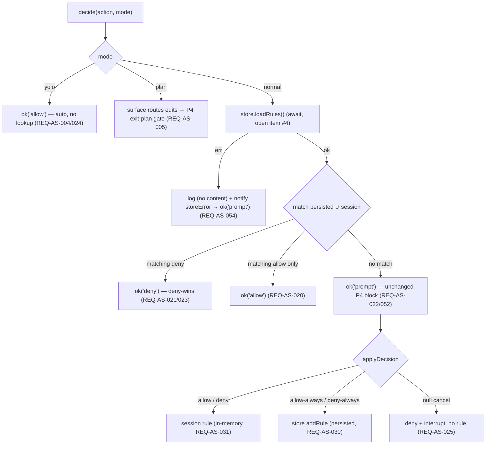

# Specification — Approvals & Security (P7)

Implementation-ready contracts for P7. Every contract is grounded in `design.md` (DESIGN-AS-001), the
three accepted P7 ADRs (**ADR-AS-001/002/003**), the P4 inline approval block + the
`ChatRuntimePort.setApprovalCallback` seam (SPEC-CP-002/004, `src/domain/chat/inline/Approval.ts`), the
P6 toolbar control state (`TabControls`, `foldControlOptions`, `ToolbarCapabilities`,
`PermissionToggle.vue` — SPEC-TC-001/005/006/010/015), the device-local `SettingsPort` pattern
(ADR-PSR-002, `ObsidianBridge.saveLocalStorage('specorator:settings')`), and Claudian's real code under
`D:\Projects\claudian-main` (`core/security/ApprovalManager.ts`, `providers/claude/runtime/
ClaudeApprovalHandler.ts`, `providers/claude/security/ClaudePermissionUpdates.ts`,
`core/types/settings.ts:76`). **Two independent teams should build the same thing from this document.**

> **Conventions in force (inherited from P1–P6, do not relax):** DDD inward-only imports (ADR-001,
> `domain ← application ← infrastructure ← ui`, NFR-AS-005); narrow ports + three bridges (ADR-008,
> NFR-AS-005); `Result<T,E>` at every use-case boundary + every store method, **pure-total** transforms
> elsewhere (ADR-004, NFR-AS-004/009); DTO-only store boundary — no domain class instance / function /
> Obsidian handle crosses into reactive state (ADR-003, NFR-AS-008); Vue `<script setup>` only
> (NFR-AS-008); **no `obsidian`/`node:*` import under `src/ui/**`** (NFR-AS-006); **no
> `v-html`/`innerHTML`/`outerHTML`/`insertAdjacentHTML`** anywhere (NFR-AS-007); blocking flows use an
> Obsidian `Modal` via a seam, never `window.confirm`/`alert`/`prompt` (NFR-AS-007); the inline approval
> block stays a non-blocking Vue block (NFR-AS-007); `--sp-*` token parity, colour literals confined to
> the token layer (NFR-AS-012); WCAG 2.2 AA + full keyboard nav + non-colour cues + reduced-motion +
> forced-colors (NFR-AS-013); tests mirror `src/` + `data-testid` PageObjects, coverage 80/70/80/80
> (NFR-AS-010/011); `manifest.json` untouched, no migration (NFR-AS-014); **no secret in any rule / store
> payload / log; nothing rule-related to `data.json` or a vault file** (NFR-AS-002/003); **no new runtime
> dependency** (NFR-AS-016); new user-facing strings via `TranslationPort` en+de (NFR-AS-015); **additive
> growth only — no rename/removal of any P0–P6 member; with no rule + `normal` mode, P0–P6 byte-identical
> (NFR-AS-001)**.

This spec defines **28 spec items** across six layer groups (SPEC-AS-001..028). The Tasks stage
(`planner`) decomposes them into `T-AS-NNN`; the QA stage turns the TEST-AS-NNN scenarios (§8) into
automated tests. SPEC-AS items that **extend** a P0–P6 counterpart cite the extension point.

> **The six field-level open items the design (DESIGN-AS-001 §Open clarifications) handed to
> `/spec:specify` — RESOLVED HERE (pinned literals, not architecture):**
> 1. **Session-rule scope** — settled in SPEC-AS-008: session rules live in **one `ApprovalManager`
>    instance per surface** (per `ChatSurface`, not per-tab). Persisted rules are device-global; a
>    session "once" rule applies to every tab on the surface for the session. The manager is constructed
>    once at the surface and shared.
> 2. **`addRule` dedupe** — settled in SPEC-AS-005/008: `addRule(rule)` **dedupes by the
>    `(toolName, actionPattern ?? '', decision)` triple** — a duplicate persisted rule for the same
>    tool/pattern/decision is a no-op (the existing rule's `id`/`createdAt` survive); a same-tool/pattern
>    rule with the **opposite** decision is appended (so deny-wins can apply, EC-AS-12). The session map
>    dedupes on the same triple.
> 3. **JSON-fallback pattern storage** — settled in SPEC-AS-004/005: when the derived action pattern
>    begins with `{` (the `getActionPattern` `JSON.stringify(input)` default branch), the persisted rule
>    is stored with **`actionPattern` absent** (match-all for the tool), mirroring
>    `ClaudePermissionUpdates.ts:31` (`if (pattern && !pattern.startsWith('{'))`). No serialised input
>    content lands in the store (NFR-AS-002).
> 4. **Concurrency / ordering** — settled in SPEC-AS-008: `decide()` **awaits** `store.loadRules()` (and,
>    for an `*-always` decision, `store.addRule()`) **before** it resolves the `ApprovalDecision | null`
>    to the runtime callback. A second approval request for the same action arriving while the first is
>    pending re-evaluates against the rules present **at its own decision time** (a fresh `loadRules`); no
>    shared mutable lookup snapshot is cached across requests.
> 5. **yolo lifetime** — settled in SPEC-AS-006/SPEC-AS-019: the permission **mode** is per-tab **draft
>    state** on `TabControls.permissionMode` (parity with how P6 holds `mode`/`reasoning`); it is **not** a
>    persisted rule and is **not** written to the device-local store. A reload returns every tab to the
>    absent → `normal` default (`freshTab()` seeds `controls: {}`). yolo auto-approves only for the live
>    session of that tab.
> 6. **`'deny-always'` option label + ordering** — settled in SPEC-AS-003/SPEC-AS-018: the P4
>    `ApprovalDecision` union grows the **fourth** member `'deny-always'`; the inline block's option row
>    renders the four options in the order **Allow once (`allow`) · Always allow (`allow-always`) · Deny
>    once (`deny`) · Always deny (`deny-always`)** (the two allow options first, then the two deny
>    options), each via an i18n key (SPEC-AS-018). The block render/interaction is otherwise unchanged
>    (NG4).

---

## 0. Spec-item index

| Spec item | Title | Layer | New / Extends | REQ / NFR links |
|---|---|---|---|---|
| **DOMAIN** | | | | |
| SPEC-AS-001 | `PermissionMode` type (`'normal'\|'plan'\|'yolo'`) (`src/domain/chat/PermissionMode.ts`) | domain | new | REQ-AS-001/004/005; ADR-AS-002 §1 |
| SPEC-AS-002 | `ChatRuntimeQueryOptions.permissionMode?` + `TabControls.permissionMode?` — additive optionals | domain | extends `ChatTurn.ts` / `TabControls.ts` | REQ-AS-002/006/052; ADR-AS-002 §1 |
| SPEC-AS-003 | `ApprovalDecision` union grown by `'deny-always'` + the `'deny-always'` option label (`Approval.ts`) | domain | extends `Approval.ts` | REQ-AS-016/021/030; ADR-AS-003 §3 |
| SPEC-AS-004 | `getActionPattern` / `getActionDescription` / `matchesRulePattern` — the PURE matcher (`src/domain/chat/approvals/ApprovalMatcher.ts`) | domain | new | REQ-AS-010..015; ADR-AS-001 §3 |
| SPEC-AS-005 | `ApprovalRule` DTO + `ApprovalRuleInput` + the dedupe key (`src/domain/chat/approvals/ApprovalRule.ts`) | domain | new | REQ-AS-016/030/031; ADR-AS-001 §1 |
| SPEC-AS-006 | `ApprovalRuleStorePort` + `APPROVAL_RULE_STORE_PORT` key + barrel; `ToolbarCapabilities.permissionMode` widen | domain | new + extends `ChatRuntimePort.ts` | REQ-AS-001/003/032..034/053; ADR-AS-001 §2 / ADR-AS-002 §2 |
| **INFRA** | | | | |
| SPEC-AS-007 | `ObsidianBridge` — device-local `ApprovalRuleStorePort` (`saveLocalStorage`) + the Claude-runtime SDK mapping + plan-exit `setMode`; coverage-excluded → manual leg | infra | new | REQ-AS-002/004/005/030/034/053; NFR-AS-003 (manual leg) |
| SPEC-AS-008 | `MockBridge` — scriptable in-memory `ApprovalRuleStorePort` (seedable + failure-injectable) + scriptable runtime mode | infra | extends SPEC-CC mock | REQ-AS-020/021/032/053/054; NFR-AS-010 |
| SPEC-AS-009 | `LocalStorageBridge` — browser-`localStorage` `ApprovalRuleStorePort` (same key) + inert runtime mode | infra | extends SPEC-CC LS | REQ-AS-053; ADR-AS-001 §4 |
| **APPLICATION** | | | | |
| SPEC-AS-010 | `ApprovalManager.decide(request, mode, sessionRules, store)` — the decision-flow use case (mode-gate-first → match → prompt → persist) | application | new | REQ-AS-004/005/020..025/030/031/052/054; ADR-AS-003 |
| SPEC-AS-011 | `foldControlOptions` — the guarded `permissionMode` clause (non-`normal` only) | application | extends `foldControlOptions.ts` | REQ-AS-002/052; ADR-AS-002 §1 |
| **UI** | | | | |
| SPEC-AS-012 | `PermissionToggle.vue` — the live three-mode toggle/select + PLAN label (replaces the P6 honest-defer seam) | ui | extends SPEC-TC-015 | REQ-AS-001/002/003/006/050/051 |
| SPEC-AS-013 | `ApprovalsPanel.vue` — the status/approvals surface (active mode + rule list, live) | ui | new | REQ-AS-040/041/043/050/051 |
| SPEC-AS-014 | `ApprovalRuleRow.vue` — one rule row (tool · pattern · decision · lifetime + remove) | ui | new | REQ-AS-041/042/050/051 |
| SPEC-AS-015 | `InlineApproval.vue` — the P4 block + the `deny-always` option (additive; render otherwise unchanged) | ui | extends SPEC-CP-024 | REQ-AS-022/025/030; NG4 |
| SPEC-AS-016 | `ChatSurface.vue` — register the approval callback → delegate to `ApprovalManager`; own the approvals view-model + the mode getter/setter | ui | extends SPEC-TC-022 | REQ-AS-002/004/005/020..025/040/043 |
| SPEC-AS-017 | `tabsStore.ts` — `setControl('permissionMode', …)` reuse + the reactive rule-list view state for the panel | ui (store) | extends SPEC-TC-023 | REQ-AS-002/006/040..043 |
| SPEC-AS-018 | `useApprovalRuleStorePort` composable | ui | extends SPEC-TC-024 | REQ-AS-040/042/053 |
| SPEC-AS-019 | Wiring — `AgentSidebarView` + `ui/main.ts` provide `APPROVAL_RULE_STORE_PORT`; the runtime maps the live mode | plugin/ui | extends SPEC-TC-025 | REQ-AS-002/030/053 |
| **STYLES** | | | | |
| SPEC-AS-020 | `status-panel` / `permission-toggle` `--sp-*` token slice (charter §3.10) | ui (styles) | extends SPEC-TC tokens | NFR-AS-012 |
| **CROSS-CUTTING** | | | | |
| SPEC-AS-021 | Additivity invariant (P0–P6 members + `ChatRuntimeQueryOptions`/`TabControls`/`ApprovalDecision` grow additively; no-rule + `normal` byte-identical to P6) | domain | — | NFR-AS-001 |
| SPEC-AS-022 | i18n / microcopy invariant (`agent.chat.toolbar.permission.*` + `agent.chat.inline.approval.*` + `agent.chat.approvals.*` en+de; no hardcoded string) | ui | — | NFR-AS-015 |
| SPEC-AS-023 | No-provider-branch + mode-gate-first + deny-wins + fail-safe-to-prompt invariant | app/ui | — | REQ-AS-003/023/024/054 |
| SPEC-AS-024 | Security: rules inert / no-secret / device-local-only / no-`data.json` invariant | cross | — | NFR-AS-002/003 |
| SPEC-AS-025 | Result / matcher-total / DOM-rule / observability invariant (no rule content logged) | cross | — | NFR-AS-002/004/009 |
| SPEC-AS-026 | The `matchesRulePattern` behaviour table + the `getActionPattern`/`getActionDescription` per-tool table | domain | — | REQ-AS-010..015 |
| SPEC-AS-027 | The `decide()` decision-flow state model (mode gate → load → match → prompt → persist) | application | — | REQ-AS-020..025/052/054 |
| SPEC-AS-028 | Per-tab mode + device-global persisted rules + per-surface session rules invariant | domain/app | — | REQ-AS-006/030..033 |

---

# 1. Domain — types, ports, additive growth (SPEC-AS-001..006)

Types under `src/domain/chat/`, `src/domain/chat/approvals/`, and `src/domain/ports/`. No `obsidian`, no
`node:*`, no Vue, no class — pure interfaces/unions + pure functions (ADR-001). **Additive only: no
P0–P6 field or member is renamed or removed (NFR-AS-001, SPEC-AS-021).** The P4 `Approval.ts` audit (read
verbatim above) confirms the three-member `ApprovalDecision` union (`'deny'|'allow'|'allow-always'`) — P7
appends a fourth. The P6 `ChatTurn.ts`/`TabControls.ts`/`ChatRuntimePort.ts` audit confirms the existing
members — P7 appends one optional each + widens one display union.

## SPEC-AS-001 — `PermissionMode` (`src/domain/chat/PermissionMode.ts`)

**REQ:** REQ-AS-001/004/005 · **ADR:** ADR-AS-002 §1 · **Claudian ground-truth:** `core/types/
settings.ts:76` (`PermissionMode = 'yolo' | 'plan' | 'normal'`). A closed lower-case string union — the
**fixed three-mode set is the invariant** (CLAR-AS-002; no fourth mode, no catalog list):

```ts
/** The Claudian permission-mode set (parity `core/types/settings.ts:76`). Closed lower-case union. */
export type PermissionMode = 'normal' | 'plan' | 'yolo';
```

**Validation rules:** `'normal'` is the default; **the absence of a `permissionMode` value is equivalent
to `'normal'`** (the no-rules default, REQ-AS-052). `'plan'` gates edits behind the P4 exit-plan block
(SPEC-AS-010). `'yolo'` auto-approves for the session (SPEC-AS-010). Pure type — no class, no Obsidian.
Re-exported from `src/domain/chat/PermissionMode.ts` and surfaced through the ports barrel
(`src/domain/ports/index.ts`, appended). Unit-testable as a type-shape contract (TEST-AS-001).

## SPEC-AS-002 — `ChatRuntimeQueryOptions.permissionMode?` + `TabControls.permissionMode?` (`ChatTurn.ts` / `TabControls.ts`)

**REQ:** REQ-AS-002/006/052 · **ADR:** ADR-AS-002 §1 · **Claudian ground-truth:**
`ClaudianSettings.permissionMode` (line 99) + per-provider `savedProviderPermissionMode` (line 136).
**Append** one optional field to each interface, **after** the P6 members; the P0–P6 members stay
**byte-identical** (SPEC-AS-021):

```ts
// src/domain/chat/ChatTurn.ts — APPENDED after serviceTier (ADR-AS-002 §1).
import type { PermissionMode } from './PermissionMode';
export interface ChatRuntimeQueryOptions {
  // model? / forceColdStart? / appendSystemPrompt? / mode? / reasoning? / serviceTier?  — UNCHANGED (P0–P6)
  permissionMode?: PermissionMode;   // P7 additive (ADR-AS-002); absent ⇒ the runtime's default ('normal')
}

// src/domain/chat/toolbar/TabControls.ts — APPENDED after serviceTier (ADR-AS-002 §1).
import type { PermissionMode } from '../PermissionMode';
export interface TabControls {
  // model? / mode? / reasoning? / serviceTier?  — UNCHANGED (P6)
  permissionMode?: PermissionMode;   // P7 additive; per-tab draft state (REQ-AS-006, resolved open item #5)
}
```

**Validation rules:** both are **optional**; absence is the P6 send path (REQ-AS-052). When present on the
query, `permissionMode` is one of the three `PermissionMode` literals; `foldControlOptions` only ever
writes a **non-`normal`** value (SPEC-AS-011) so a `normal`/absent tab folds nothing → a byte-identical
P6 turn. On `TabControls` it is **per-tab draft state** that rides the existing P6 control bag (the P6
`setControl` action sets it, SPEC-AS-017); `freshTab()` seeds `controls: {}` so an unset member ⇒
`normal`; a reload returns the tab to the absent → `normal` default (resolved open item #5 — the mode is
not persisted). `PreparedChatTurn` / `ChatRuntimeEnsureReadyOptions` / `ChatTurnRequest` stay
**byte-identical** (SPEC-AS-021). Unit-testable as a type-shape + serialisation contract: a P6-shaped
query (no `permissionMode`) serialises byte-identically to P6 (TEST-AS-002, NFR-AS-001).

## SPEC-AS-003 — `ApprovalDecision` grown by `'deny-always'` (`src/domain/chat/inline/Approval.ts`)

**REQ:** REQ-AS-016/021/030 · **ADR:** ADR-AS-003 §3 · **Claudian ground-truth:** `ClaudeApprovalHandler.ts:118`
(allow/allow-always allow), `:128` (deny). **Grow the P4 union additively** by one member; the three P4
members stay byte-identical (NFR-AS-001):

```ts
// src/domain/chat/inline/Approval.ts — the union grows by ONE member (additive, NG4).
export type ApprovalDecision = 'deny' | 'allow' | 'allow-always' | 'deny-always';
// ApprovalOption / ApprovalRequest — UNCHANGED shape; the block renders ONE additional option row entry.
```

**Validation rules:** `'allow'`/`'deny'` are the "once" (session) decisions; `'allow-always'`/`'deny-always'`
are the "persist a rule" decisions (SPEC-AS-010). The P4 callback contract — `setApprovalCallback(cb: (req)
=> Promise<ApprovalDecision | null>)` — is **unchanged**; `null` is the cancel/Escape leg (deny + interrupt,
REQ-AS-025). The `ApprovalRequest`/`ApprovalOption` interfaces are byte-identical; the inline block (SPEC-AS-015)
renders a fourth `ApprovalOption` whose `decision` is `'deny-always'` and whose `label` is the
`agent.chat.inline.approval.denyAlways` i18n string (SPEC-AS-022). The option-row **order** is pinned in
SPEC-AS-018. No `decisionReason`/`blockedPath` field is added — context rides the existing
`ApprovalRequest.context` string (CLAR-AS-005, NG3). Unit-testable as a type-shape contract (TEST-AS-016).

## SPEC-AS-004 — The pure matcher (`src/domain/chat/approvals/ApprovalMatcher.ts`)

**REQ:** REQ-AS-010..015 · **ADR:** ADR-AS-001 §3 · **Claudian ground-truth:** `core/security/
ApprovalManager.ts` (`getActionPattern:13`, `getActionDescription:35`, `matchesRulePattern:60`,
`isPathPrefixMatch:116`, `matchesBashPrefix:132`). **Ported verbatim** into pure domain functions — no
class, no Obsidian, no I/O, **total (never throws)**:

```ts
/** Tool-name constants (parity claudian `core/tools/toolNames`) — local to the matcher module. */
export const TOOL_BASH = 'Bash';
export const TOOL_READ = 'Read';
export const TOOL_WRITE = 'Write';
export const TOOL_EDIT = 'Edit';
export const TOOL_NOTEBOOK_EDIT = 'NotebookEdit';
export const TOOL_GLOB = 'Glob';
export const TOOL_GREP = 'Grep';

/**
 * Derive the action pattern from the tool + its input (REQ-AS-010). Bash → trimmed
 * command (or '' when absent); Read/Write/Edit → file_path or null; NotebookEdit →
 * notebook_path ?? file_path or null; Glob/Grep → pattern or null; default →
 * JSON.stringify(input). Total — returns `string | null`, never throws.
 */
export function getActionPattern(toolName: string, input: Record<string, unknown>): string | null;

/**
 * A human-readable description for the inline prompt (REQ-AS-015): "Run command: …",
 * "Read file: …", "Write to file: …", "Edit file: …", "Search files matching: …",
 * "Search content matching: …", else "{tool}: {pattern}". Total.
 */
export function getActionDescription(toolName: string, input: Record<string, unknown>): string;

/**
 * Whether `rulePattern` matches `actionPattern` for `toolName` (REQ-AS-011..014).
 * Pure + total — never throws. The exact Claudian semantics (SPEC-AS-026).
 */
export function matchesRulePattern(
  toolName: string,
  actionPattern: string | null,
  rulePattern: string | undefined,
): boolean;
```

**Validation rules / behaviour — the exact Claudian semantics (the full table is SPEC-AS-026):**

- **No rule pattern** (`rulePattern` `undefined`/empty) → match-all → `true` (REQ-AS-013).
- **Null action pattern** + a content rule → `false` (the null-action guard, REQ-AS-014; falls through to
  prompt).
- Both strings **`\`→`/` normalised** before any comparison (line 71, REQ-AS-012).
- `rulePattern === '*'` → `true`; exact `normalizedAction === normalizedRule` → `true`.
- **Bash:** beyond exact, **only** an explicit wildcard matches — `"foo:*"` (colon form → `matchesBashPrefix`
  on the pre-`:*` prefix) or `"foo *"`/`"foo*"` (`*`-suffix form → `matchesBashPrefix` on the pre-`*`
  prefix); **a bare prefix without a wildcard never matches** (REQ-AS-011). `matchesBashPrefix(action,
  prefix)`: `true` iff `action === prefix`, OR (prefix ends with a space) `action.startsWith(prefix)`, OR
  `action.startsWith(prefix + ' ')`.
- **File tools** (`Read`/`Write`/`Edit`/`NotebookEdit`): `isPathPrefixMatch` — `action.startsWith(rule)`
  AND (rule ends with `/` → subtree, `true`; OR equal length → `true`; OR the char at `rule.length` is
  `/`). So `/a/b` matches `/a/b` and `/a/b/c` but **not** `/a/bc` (REQ-AS-012).
- **Other tools** (`Glob`/`Grep`/…): simple `action.startsWith(rule)` prefix (REQ-AS-013).

**The matcher is pure + total** — any input returns a `boolean`/`string`/`string | null`, never throws
(NFR-AS-009). Re-exported from `src/domain/chat/approvals/index.ts`. Unit-testable in isolation across the
full table (TEST-AS-010/011/012/013/014/015, EC-AS-7/8/9).

## SPEC-AS-005 — `ApprovalRule` DTO (`src/domain/chat/approvals/ApprovalRule.ts`)

**REQ:** REQ-AS-016/030/031 · **ADR:** ADR-AS-001 §1 · **Claudian ground-truth:** the rule shape
`{ toolName, ruleContent? }` + `behavior:'allow'` (`ClaudePermissionUpdates.ts:30`), the session-vs-project
destination (`:11–12`). Pure domain data — readonly, no class, no Obsidian — so it crosses the Pinia store
boundary (NFR-AS-008) and serialises cleanly:

```ts
export interface ApprovalRule {
  readonly id: string;                          // stable opaque id (the store mints it; removal targets it)
  readonly toolName: string;                     // the matched tool (e.g. 'Bash', 'Write')
  readonly actionPattern?: string;               // absent / '*' ⇒ match-all for the tool (the JSON-fallback case stores it ABSENT, open item #3)
  readonly decision: 'allow' | 'deny';           // Specorator adds the explicit deny (CLAR-AS-004)
  readonly lifetime: 'session' | 'persisted';    // 'persisted' ⇒ device-local store; 'session' ⇒ ApprovalManager memory
  readonly createdAt: number;                     // epoch ms at creation (display ordering only)
}

/** What the use case hands the store to persist (the store mints `id`/`createdAt`). */
export type ApprovalRuleInput = Omit<ApprovalRule, 'id' | 'createdAt'>;

/** The dedupe identity (resolved open item #2): same tool + same pattern + same decision = the same rule. */
export function ruleDedupeKey(r: Pick<ApprovalRule, 'toolName' | 'actionPattern' | 'decision'>): string;
```

**Validation rules:** `toolName` non-empty. `actionPattern` is **absent** when (a) the derived pattern is
match-all (`'*'`/none) **or** (b) the derived pattern begins with `{` (the `JSON.stringify(input)` fallback
— stored without content so no serialised input lands in the store, resolved open item #3 / NFR-AS-002);
otherwise it is the `\`→`/`-normalised pattern. `decision` ∈ `{'allow','deny'}`. `lifetime` ∈
`{'session','persisted'}`. `createdAt` a finite non-negative integer. `ruleDedupeKey` =
`` `${toolName}${actionPattern ?? ''}${decision}` `` (the triple, NUL-joined). **The DTO carries
no secret/token/path-outside-the-vault** — it is inert data, never executable (NFR-AS-002, SPEC-AS-024).
Re-exported from `src/domain/chat/approvals/index.ts`. Unit-testable as a type-shape + dedupe-key contract
(TEST-AS-016).

## SPEC-AS-006 — `ApprovalRuleStorePort` + key + `ToolbarCapabilities` widen (`src/domain/ports/ApprovalRuleStorePort.ts`, `ChatRuntimePort.ts`)

**REQ:** REQ-AS-001/003/032..034/053 · **ADR:** ADR-AS-001 §2 / ADR-AS-002 §2 · **Claudian ground-truth:**
the persisted-rule set (`ClaudePermissionUpdates.ts`), the per-provider `permissionMode` capability.

**(a) The store port (store-only, `Result`-typed).** One narrow port for one consumer kind (the approvals
use cases); its own `InjectionKey` + composable, no aggregate (ADR-008, NFR-AS-005). It handles **only the
persisted lifetime** — session rules live in `ApprovalManager` memory (SPEC-AS-010):

```ts
import type { Result } from '@/domain/shared/Result';
import type { ApprovalRule, ApprovalRuleInput } from '@/domain/chat/approvals/ApprovalRule';

export interface ApprovalRuleStorePort {
  /** Load-or-default the persisted rules (REQ-AS-032). Empty/unparseable store ⇒ ok([]) — NO migration (CHARTER-REQ-FRESH). */
  loadRules(): Promise<Result<readonly ApprovalRule[]>>;
  /** Persist a rule (REQ-AS-030); DEDUPE by `ruleDedupeKey` (open item #2) — a duplicate is a no-op ok. Mints `id`/`createdAt`. Returns the stored rule. */
  addRule(input: ApprovalRuleInput): Promise<Result<ApprovalRule>>;
  /** Delete the persisted rule with `id` (REQ-AS-042). A missing id is a no-op ok. */
  removeRule(id: string): Promise<Result<void>>;
  /** Clear all persisted rules. */
  clear(): Promise<Result<void>>;
}
```

**Per-method contract (signature · behaviour · pre/post · errors · side effects):**

| Method | Behaviour · Post · Errors · Side effects |
|---|---|
| `loadRules()` | Read the device-local blob, parse + coerce to `ApprovalRule[]`. **Post:** `ok([])` on an empty/absent/unparseable blob (load-or-default, REQ-AS-032). **Errors:** a true store-read failure (the device-local read throws) → `err` (the engine fails safe to prompt, REQ-AS-054). **Side effects:** none. |
| `addRule(input)` | Load, dedupe by `ruleDedupeKey` (open item #2). **Post:** if a same-triple persisted rule exists → `ok(existing)` (no write); else mint `id` (e.g. a uuid/`createdAt`-seeded token) + `createdAt`, append, write, `ok(stored)` (REQ-AS-030). **Errors:** a write failure → `err` (the engine still resolves the user's decision — the persist failure surfaces a notice, never blocks the allow/deny, SPEC-AS-010). **Side effects:** one device-local write. |
| `removeRule(id)` | Load, drop the entry with `id`, write. **Post:** `ok()` (idempotent — a missing id is a no-op ok, REQ-AS-042). **Errors:** a write failure → `err`. **Side effects:** one write. |
| `clear()` | Write an empty set. **Post:** `ok()`. **Errors:** a write failure → `err`. **Side effects:** one write. |

**(b) `ToolbarCapabilities.permissionMode` widen** (`src/domain/ports/ChatRuntimePort.ts`, ADR-AS-002 §2).
The **only** non-additive *type* change — behaviour-additive, confined to the P6 callers expanded in P7:

```ts
export interface ToolbarCapabilities {
  // supportsMcpTools / reasoningControl / hasServiceTier / hasModeToggle — UNCHANGED (P6)
  readonly permissionMode: PermissionMode;   // WIDENED from 'default' | 'plan' to the live three-mode value ('default'→'normal')
}
```

The P6 `'default'` value maps to `'normal'`; the P6 `'plan'` value is unchanged; `'yolo'` is newly
representable. The P0–P6 `ChatRuntimePort` members + the four other `ToolbarCapabilities` flags + the five
`RuntimeCapabilities` flags stay byte-identical (SPEC-AS-021). **`APPROVAL_RULE_STORE_PORT` InjectionKey**
(`src/infrastructure/bridge/ports.ts`, appended alongside the existing keys) + **barrel re-exports** of
`ApprovalRuleStorePort` / `ApprovalRule` / `ApprovalRuleInput` / `PermissionMode` from
`src/domain/ports/index.ts` (appended). Three bridges implement the port (SPEC-AS-007/008/009).
Unit-testable against the scriptable Mock impl (TEST-AS-030/032/053/054).

---

# 2. Infrastructure — three-bridge implementations (SPEC-AS-007..009)

The three bridges implement `ApprovalRuleStorePort` (device-local / scriptable in-memory / browser
localStorage) and the runtime's live-mode mapping (NFR-AS-001/002/003). `src/infrastructure/obsidian/**`
is coverage-excluded (the real device-local store + the real Claude SDK mapping/`setMode` are the manual
legs); `MockBridge` + `LocalStorageBridge` carry the unit-testable behaviour. `tests/__fakes__/fake-ports.ts`
grows an `approvalRuleStore` member (the scriptable Mock store, with a failure-injection switch) so the
`ApprovalManager` + panel tests run without Obsidian (DESIGN-AS-001 C.4).

## SPEC-AS-007 — `ObsidianBridge` impls (`src/infrastructure/obsidian/*`)

**REQ:** REQ-AS-002/004/005/030/034/053 · **NFR:** NFR-AS-003 (manual leg). **Claudian ground-truth:**
`ClaudePermissionUpdates` (the persisted-rule destination), `ClaudeApprovalHandler.ts:63–71` (plan-exit
`setMode`), `resolveSDKPermissionMode`.

- **`ApprovalRuleStorePort`** — backed by the device-local store under a stable key
  `'specorator:approval-rules'`, mirroring the `SettingsPort` device-local pattern
  (`app.saveLocalStorage`/`app.loadLocalStorage`, ADR-PSR-002, `ObsidianBridge._SETTINGS_KEY`). `loadRules`
  is load-or-default (a missing/unparseable blob → `ok([])`, REQ-AS-032; a coercion drops malformed
  entries); `addRule`/`removeRule`/`clear` read-modify-write the blob. **Never `data.json`, never a vault
  file** (NFR-AS-003, REQ-AS-034) — a review check + TEST-AS-034 assert no rule data in `data.json` or the
  vault.
- **The Claude-runtime live-mode mapping** — the runtime maps `queryOptions.permissionMode` to the SDK
  `PermissionMode` on the wire (`yolo`↔`bypassPermissions`, `plan`↔`plan`, `normal`↔`default`), and on
  plan-exit emits the session `{ type:'setMode', mode, destination:'session' }` permission update
  (parity `ClaudeApprovalHandler.ts:63–71`). The SDK mapping + `setMode` stay **in the Claude runtime** —
  no `providerId` branch in the UI/app (SPEC-AS-023, NG6).

Both are **coverage-excluded** (`src/infrastructure/obsidian/**`) and verified on the manual Obsidian leg
(TEST-AS-M1/M2/M3). No `obsidian` symbol leaks past these files.

## SPEC-AS-008 — `MockBridge` impls (`src/infrastructure/mock/*`)

**REQ:** REQ-AS-020/021/032/053/054 · **NFR:** NFR-AS-010.

- **`ApprovalRuleStorePort`** — a **scriptable in-memory** array store:
  - `seedRules(rules)` pre-populates persisted rules (drives the matched-allow/deny + reload tests
    TEST-AS-020/021/032).
  - `loadRules`/`addRule` (dedupe by `ruleDedupeKey`, open item #2) / `removeRule` / `clear` operate on the
    in-memory array, all `Promise<Result<…>>`.
  - **Failure injection**: `setFailMode('load' | 'save' | 'none')` forces `loadRules`/`addRule` to return
    `Result.err` so the fail-safe-to-prompt test (TEST-AS-054, REQ-AS-054) runs deterministically.
- **The runtime mode** — the scriptable `MockChatRuntime` records the `queryOptions.permissionMode` of the
  last query (so a test asserts the folded mode reaches the runtime, TEST-AS-002) and exposes a scriptable
  `getToolbarCapabilities().permissionMode` so the toggle/panel reflect a driven mode (TEST-AS-003/006/040).

`fake-ports.ts` exposes the store as `approvalRuleStore` (the `MockBridge` scriptable store) so the
`ApprovalManager` + `ApprovalsPanel` tests inject it without a real provider. The single per-surface
`ApprovalManager` instance (resolved open item #1) holds the session rules in a `Map` keyed by
`ruleDedupeKey`.

## SPEC-AS-009 — `LocalStorageBridge` impls (`src/infrastructure/localstorage/*`)

**REQ:** REQ-AS-053 · **ADR:** ADR-AS-001 §4.

- **`ApprovalRuleStorePort`** — browser `localStorage` under the same key `'specorator:approval-rules'`
  (parity with the LS `SettingsPort`), so the GitHub Pages demo persists rules across a reload with no
  Obsidian runtime (REQ-AS-053). Load-or-default, all `Result`-typed.
- **The runtime mode** — **inert**: the LS demo has no live SDK, so the mode is recorded on the turn
  (subscription/CLI parity) but no live `setMode` fires. The toggle/panel still reflect the per-tab mode
  draft (SPEC-AS-012/013).

---

# 3. Application — the use case + the fold (SPEC-AS-010..011)

`ApprovalManager` is a use case (it touches the `ApprovalRuleStorePort` + `NotificationPort`/`LoggerPort`,
returns `Result`, ADR-004); `foldControlOptions` is the existing pure transform (extended). No
`obsidian`/Vue import. These + the pure matcher (SPEC-AS-004) are the QA seam — the whole mode-gate / match
/ fail-safe matrix is driven by the scriptable Mock store + a scripted mode (DESIGN-AS-001 C.9).

## SPEC-AS-010 — `ApprovalManager.decide` (`src/application/chat/approvals/ApprovalManager.ts`)

**REQ:** REQ-AS-004/005/020..025/030/031/052/054 · **ADR:** ADR-AS-003 · **Claudian ground-truth:**
`ClaudeApprovalHandler` (the `CanUseTool` callback: mode/allowedTools gate → exit-plan → ask-user →
approval → decision). The decision-flow use case behind the P4 `setApprovalCallback` seam — it holds the
**per-surface in-memory session rules** (resolved open item #1) and resolves the runtime callback's
`Promise<ApprovalDecision | null>` for an **unmatched** request, OR auto-resolves a matched/mode-gated one:

```ts
import type { Result } from '@/domain/shared/Result';
import type { ApprovalRequest, ApprovalDecision } from '@/domain/chat/inline';
import type { ApprovalRule } from '@/domain/chat/approvals/ApprovalRule';
import type { PermissionMode } from '@/domain/chat/PermissionMode';
import type { ApprovalRuleStorePort } from '@/domain/ports';

/** What `decide` resolves: an auto-decision, OR `'prompt'` meaning "surface the unchanged P4 block". */
export type ApprovalGateOutcome = ApprovalDecision | 'prompt';

/** The action identity the manager matches on — derived by the surface from the request (SPEC-AS-016). */
export interface ApprovalAction {
  readonly toolName: string;
  readonly actionPattern: string | null;   // from getActionPattern (SPEC-AS-004)
}

export class ApprovalManager {
  constructor(
    private readonly store: ApprovalRuleStorePort,
    private readonly feedback: FeedbackService,   // LoggerPort + NotificationPort wrapper (no rule content logged)
  ) {}

  /**
   * Decide whether `action` (for the active tab's `mode`) auto-allows, auto-denies,
   * or must `'prompt'`. Mode-gate-FIRST (yolo→allow, plan→edits routed to the P4
   * exit-plan gate, normal→continue), then load (store ∪ session) → match (deny-wins)
   * → auto OR 'prompt'. Awaits the store load before resolving (open item #4). On a
   * store load error: log (NO rule content) + showInfo(approvals.storeError) + return
   * 'prompt' — NEVER auto-allow (REQ-AS-054, NFR-AS-004).
   */
  decide(action: ApprovalAction, mode: PermissionMode): Promise<Result<ApprovalGateOutcome>>;

  /**
   * Apply a PROMPTED user decision: 'allow'/'deny' → add a SESSION rule (in-memory,
   * REQ-AS-031); 'allow-always'/'deny-always' → store.addRule(persisted) (REQ-AS-030);
   * null (cancel) → no rule. A persist `err` shows the storeError notice but the
   * returned decision still stands (the allow/deny is honoured this turn). Returns the
   * concrete ApprovalDecision the callback resolves to ('allow-always'→allow,
   * 'deny-always'→deny on the wire; the *-always is the persistence flavour).
   */
  applyDecision(action: ApprovalAction, decision: ApprovalDecision | null): Promise<Result<ApprovalDecision | null>>;

  /** The current rule view for the panel: persisted (loaded) ∪ session (in-memory). Result-typed (load may err). */
  listRules(): Promise<Result<readonly ApprovalRule[]>>;
}
```

**`decide` algorithm (the exact order — SPEC-AS-027, ADR-AS-003 §2):**

1. **Mode gate FIRST** (CLAR-AS-004): `mode === 'yolo'` → `ok('allow')` (auto-approve, no rule lookup,
   REQ-AS-004/024); `mode === 'plan'` → the surface routes the agent's edit attempt through the P4
   exit-plan block (the manager returns `ok('prompt')` for a non-exit-plan action under plan mode only if
   the surface delegates it; plan-gating itself is owned by the P4 exit-plan callback, SPEC-AS-016,
   REQ-AS-005); `mode === 'normal'` (or absent) → continue.
2. **Load** the persisted rules: `store.loadRules()`. On `err` → log (no rule content) +
   `feedback.notify(approvals.storeError)` + `ok('prompt')` (fail-safe, REQ-AS-054). On `ok` → the lookup
   set is `persisted ∪ session` (the in-memory session map).
3. **Match** (deny-wins, CLAR-AS-004): for each rule whose `toolName === action.toolName`, evaluate
   `matchesRulePattern(action.toolName, action.actionPattern, rule.actionPattern)` (SPEC-AS-004). If **any**
   matching `deny` rule exists → `ok('deny')` (auto-deny, deny-wins over any allow, REQ-AS-021/023). Else if
   **any** matching `allow` rule exists → `ok('allow')` (auto-allow, REQ-AS-020). Else → `ok('prompt')`
   (no match → the unchanged P4 inline block, REQ-AS-022/052).

**`applyDecision`:** `'allow'`/`'deny'` → upsert a **session** rule (`lifetime:'session'`) into the
in-memory map keyed by `ruleDedupeKey` (REQ-AS-031); `'allow-always'`/`'deny-always'` → `store.addRule({
toolName, actionPattern, decision })` with `decision` = `allow`/`deny` respectively (REQ-AS-030, the
`*-always` is the persisted flavour); `null` → no rule (cancel, REQ-AS-025). A persist `err` →
`feedback.notify(approvals.storeError)` but the decision is still returned (the user's allow/deny is
honoured for the turn). The action pattern handed to the store follows the open-item-#3 rule (a `{`-leading
JSON-fallback pattern → `actionPattern` absent, NFR-AS-002).

**Auto-decisions are silent** — for `ok('allow')`/`ok('deny')` the surface resolves the callback without
rendering the inline block (REQ-AS-020/021). For `ok('prompt')` the surface renders the unchanged P4 block
and feeds the user's choice back through `applyDecision` (SPEC-AS-016). **Never throws across the
approval-callback boundary** (`tryAsync` around the store; the matcher is total — NFR-AS-004/009). **No
`providerId` branch** (SPEC-AS-023). One `ApprovalManager` per surface holds the session rules; persisted
rules are device-global (SPEC-AS-028). Unit-testable in isolation across the full matrix with the
scriptable Mock store (TEST-AS-020/021/023/024/025/030/031/032/052/054, EC-AS-1..6/10/11).

## SPEC-AS-011 — `foldControlOptions` — the guarded `permissionMode` clause (`src/application/chat/toolbar/foldControlOptions.ts`)

**REQ:** REQ-AS-002/052 · **ADR:** ADR-AS-002 §1 · **Extends:** SPEC-TC-010 (the P6 fold). **Add one
guarded clause** to the existing pure/total fold — write `permissionMode` **only** when present **and
non-`normal`** (so a `normal`/absent tab folds nothing → byte-identical P6, REQ-AS-052, EC-AS-2):

```ts
export function foldControlOptions(
  controls: TabControls,
): Partial<Pick<ChatRuntimeQueryOptions, 'model' | 'mode' | 'reasoning' | 'serviceTier' | 'permissionMode'>> {
  // ... the P6 model/mode/reasoning/serviceTier clauses — UNCHANGED ...
  if (controls.permissionMode !== undefined && controls.permissionMode !== 'normal') {
    folded.permissionMode = controls.permissionMode;   // P7 additive (ADR-AS-002 §1)
  }
  return folded;
}
```

**Contract:** `foldControlOptions({})` → `{}` and `foldControlOptions({ permissionMode: 'normal' })` → `{}`
(both byte-identical to a P6 turn — the runtime applies its `normal` default, EC-AS-2/13). `'plan'`/`'yolo'`
are folded. The return type widens by the one optional `permissionMode` key (the P6
`model`/`mode`/`reasoning`/`serviceTier` keys + behaviour stay byte-identical, SPEC-AS-021). Pure + total —
never throws. Unit-testable in isolation (TEST-AS-002, EC-AS-2/13).

---

# 4. UI — components, store, composable, wiring (SPEC-AS-012..019)

Vue `<script setup>` components under `src/ui/chat/toolbar/` + `src/ui/chat/approvals/` + `src/ui/chat/
inline/`; **no `obsidian` import** (NFR-AS-006); **no `v-html`** (NFR-AS-007). Every mounted component has
a co-located `data-testid` PageObject `.po.ts` (NFR-AS-010). Rules, mode, and decisions arrive as DTOs from
the store/view-model (NFR-AS-008).

## SPEC-AS-012 — `PermissionToggle.vue` (`src/ui/chat/toolbar/PermissionToggle.vue`, PO co-located)

**REQ:** REQ-AS-001/002/003/006/050/051 · **Extends:** SPEC-TC-015 (the P6 honest-defer seam → live).
**Claudian ground-truth:** `PermissionToggle` (the live three-mode control + the PLAN display). The P6
disabled seam is **replaced** by a live control. **Props:** `mode: PermissionMode` (the active tab's
`controls.permissionMode ?? 'normal'`). **Emits:** `set: [mode: PermissionMode]`. **Behaviour:**

- Offers the **fixed three modes** (`normal`/`plan`/`yolo` — the invariant, not a catalog list, CLAR-AS-002)
  as a keyboard-operable control (`role="listbox"` of three options, or a cycling `role="switch"` — either
  way keyboard-openable: focus, Enter/Space activate, Arrow keys move through the three, Escape closes,
  REQ-AS-050).
- When `mode === 'plan'`, the control is **replaced by the "PLAN" label** (the P6 display special-case, now
  backed by the live mode, REQ-AS-003) with an `aria-label` describing the active plan mode (REQ-AS-051).
- For `normal`/`yolo`, the active mode is shown via the i18n label (`agent.chat.toolbar.permission.mode.*`)
  and exposed to AT (`aria-checked`/`aria-selected` per the live state + an accessible name,
  REQ-AS-050/051). It is **no longer `aria-disabled`** (the P6 seam state is removed) and **no longer shows
  the `toolbar.permission.deferred` notice** (the deferred string is removed, SPEC-AS-022).
- Selecting a mode emits `set(mode)` up to the surface, which sets `controls.permissionMode` (SPEC-AS-016/017,
  REQ-AS-002). Switching tabs reflects that tab's mode (the prop re-derives, REQ-AS-006).
- Mode/state cues are **text + border, never colour-only** (forced-colors + reduced-motion honoured,
  NFR-AS-013).

`data-testid`: `toolbar-permission` (the control), `toolbar-permission-plan` (the PLAN label),
`toolbar-permission-option` (per mode). Tested via PageObject (TEST-AS-001/002/003/006/050/051, A-leg).

## SPEC-AS-013 — `ApprovalsPanel.vue` (`src/ui/chat/approvals/ApprovalsPanel.vue`, PO co-located)

**REQ:** REQ-AS-040/041/043/050/051 · **Claudian ground-truth:** `status-panel.css` running/approval state.
The minimal status/approvals surface (NG2 defers the rich editor to P10). **Props:** `mode: PermissionMode`,
`rules: readonly ApprovalRule[]`. **Emits:** `remove: [id: string]`. **Behaviour:**

- Shows the **active mode** (`agent.chat.approvals.mode` "Mode: {mode}", reads the active tab's mode,
  REQ-AS-040) under a localised title (`agent.chat.approvals.title`).
- Renders the **rule list** (`agent.chat.approvals.rulesHeading`) as a list of `ApprovalRuleRow`
  (SPEC-AS-014), one per `rules` entry (REQ-AS-041); re-emits each row's `remove` up to the surface
  (REQ-AS-042).
- When `rules` is empty, shows `agent.chat.approvals.empty` ("No approval rules yet.").
- **Live** (REQ-AS-043): the panel re-renders on rule add/remove + mode change because `mode`/`rules`
  derive from reactive store state (SPEC-AS-017) — no manual refresh.
- Keyboard-navigable list; each control carries an accessible name (REQ-AS-050/051).

`data-testid`: `approvals-panel`, `approvals-mode`, `approvals-empty`. Tested via PageObject
(TEST-AS-040/041/043, A-leg).

## SPEC-AS-014 — `ApprovalRuleRow.vue` (`src/ui/chat/approvals/ApprovalRuleRow.vue`, PO co-located)

**REQ:** REQ-AS-041/042/050/051 · One rule row. **Props:** `rule: ApprovalRule`. **Emits:** `remove: [id:
string]`. **Behaviour:** shows tool · action pattern (`actionPattern ?? '*'`) · decision (the localised
`agent.chat.approvals.decision.allow|deny`) · lifetime (the localised `agent.chat.approvals.lifetime.session
|persisted`), each as **text** (not colour-alone, NFR-AS-013). A **persisted** rule carries a focusable
**remove** button with an accessible name (`agent.chat.approvals.remove` "Remove rule: {tool} {pattern}",
REQ-AS-042/051) that emits `remove(rule.id)` on click/Enter/Space (REQ-AS-050); a **session** rule is listed
but has no remove control (it is inherently ephemeral). The allow/deny badge uses the
`--sp-approvals-decision-allow`/`--sp-approvals-decision-deny` token (SPEC-AS-020) with a text label so the
decision survives forced-colors. `data-testid`: `approvals-rule`, `approvals-rule-remove`. Tested via
PageObject (TEST-AS-041/042/051, A-leg).

## SPEC-AS-015 — `InlineApproval.vue` (`src/ui/chat/inline/InlineApproval.vue`, PO co-located)

**REQ:** REQ-AS-022/025/030 · **Extends:** SPEC-CP-024 (the P4 block, render unchanged, NG4).
**Additive only** — the option row gains **one** entry driven by the additive `'deny-always'`
`ApprovalDecision` member (SPEC-AS-003); layout, focus model, context rendering, and the Escape/cancel leg
are **byte-identical to P4**. **Props:** `request: ApprovalRequest` (unchanged). **Emits:** `decide:
[decision: ApprovalDecision]`, `cancel: []` (unchanged shape; `decide` now also carries `'deny-always'`).
**Behaviour:** renders the tool + the `request.context` description (from `getActionDescription` +
the available `decisionReason`/`blockedPath` folded into the P4 `context` string, CLAR-AS-005) + the option
row; the four options render in the SPEC-AS-018 order (Allow once · Always allow · Deny once · Always deny),
each keyboard-operable, Escape cancels (REQ-AS-025). No new context panel (NG3). No `v-html`; the option row
is declarative Vue (NFR-AS-007). `data-testid`: `inline-approval`, `inline-approval-option` (per option,
with a `data-decision` attribute), `inline-approval-deny-always`. Tested via PageObject (TEST-AS-022/025,
A-leg).

## SPEC-AS-016 — `ChatSurface.vue` (`src/ui/chat/ChatSurface.vue`, PO co-located)

**REQ:** REQ-AS-002/004/005/020..025/040/043 · **Extends:** SPEC-TC-022 (the P6 surface). **Additive.**
The surface owns the approval-callback registration + the approvals view-model:

- **Register the approval callback** on the active runtime (the P4 `setApprovalCallback` seam): the
  callback derives the `ApprovalAction` via `getActionPattern(req.tool, …)` (the surface reads the request's
  tool + maps it to an action; the P4 `ApprovalRequest` carries `tool` + `context`), reads the active tab's
  `mode = activeTab.controls.permissionMode ?? 'normal'`, and calls `ApprovalManager.decide(action, mode)`:
  - `ok('allow')`/`ok('deny')` → resolve the callback with the auto-decision; **render no inline block**
    (REQ-AS-020/021/024).
  - `ok('prompt')` → render the unchanged P4 `InlineApproval` (SPEC-AS-015); on the user's `decide` →
    `ApprovalManager.applyDecision(action, decision)` then resolve the callback; on `cancel` →
    `applyDecision(action, null)` → resolve `null` (deny + interrupt, REQ-AS-022/025/030/031).
  - `err` is unreachable (`decide` fails safe to `ok('prompt')`); a defensive `err` still resolves to the
    prompt (NFR-AS-004).
- **Plan-mode** routing reuses the **P4 exit-plan block** unchanged (NG4): while `mode === 'plan'`, the
  agent's exit-plan attempt surfaces the P4 exit-plan callback; on `implement` the edits proceed and the
  runtime syncs the mode session-scoped (the `setMode` lives in the Claude runtime, SPEC-AS-007, REQ-AS-005).
- **The mode setter:** wire `PermissionToggle`'s `set` to `tabs.setControl('permissionMode', mode)`
  (SPEC-AS-017, REQ-AS-002); pass `:mode="activeTab.controls.permissionMode ?? 'normal'"` to the toggle +
  the panel.
- **The approvals view-model:** own a reactive `rules` derived from `ApprovalManager.listRules()` (persisted
  ∪ session) + the active mode; pass to `ApprovalsPanel`; wire its `remove` to `store.removeRule(id)` then
  refresh (REQ-AS-040..043). A single `ApprovalManager` instance is constructed at the surface (per-surface
  session-rule scope, resolved open item #1).

The surface **never branches on a provider id** (SPEC-AS-023). `data-testid` inherited (`chat-surface`).
Tested via PageObject extension (TEST-AS-020/021/022/025/040/043, A-leg).

## SPEC-AS-017 — `tabsStore.ts` (`src/ui/stores/tabsStore.ts`)

**REQ:** REQ-AS-002/006/040..043 · **Extends:** SPEC-TC-023 (`TabControls` + `setControl` + fold).
**Additive.**

- `setControl('permissionMode', mode)` **reuses** the P6 generic `setControl<K extends keyof TabControls>`
  action — no new action; it sets `activeTab.controls.permissionMode` (a draft-input mutation; it does not
  send, REQ-AS-002). `freshTab()` already seeds `controls: {}` (so an unset member ⇒ `normal`, REQ-AS-006);
  `loadIntoTab` resets `controls` to `{}` (a resumed/forked conversation starts at `normal` — the mode is
  not persisted, resolved open item #5).
- On submit, `_turnQueryOptions()` already merges `foldControlOptions(active.controls)` (SPEC-AS-011) — the
  added `permissionMode` clause folds non-`normal` only, byte-identical otherwise (NFR-AS-001).
- The store exposes the active tab's `controls.permissionMode` reactively for the toggle + panel
  (REQ-AS-006/040); switching tabs re-derives (REQ-AS-006). The approvals rule-list view state is owned by
  `ChatSurface` over the `ApprovalManager` (SPEC-AS-016) — the store holds only the per-tab mode draft (no
  rule DTO crosses the store except as a read-through view-model, NFR-AS-008).

`PermissionMode` is a DTO-only import (no domain class instance crosses the store boundary, NFR-AS-008).
Unit-testable: `setControl('permissionMode')` mutates the active tab only; the fold runs on submit
(TEST-AS-002/006).

## SPEC-AS-018 — `useApprovalRuleStorePort` composable (`src/ui/composables/useApprovalRuleStorePort.ts`)

**REQ:** REQ-AS-040/042/053 · **Extends:** SPEC-TC-024 (the port-composable pattern). Mirroring
`useToolbarCatalogPort`/`useVaultPort` (inject the key; throw a helpful error when unprovided):

```ts
export function useApprovalRuleStorePort(): ApprovalRuleStorePort;   // inject APPROVAL_RULE_STORE_PORT
```

One-port-one-composable (ADR-008, NFR-AS-005). `ChatSurface` injects it to construct the per-surface
`ApprovalManager` + to back the panel's remove. Tested via the Mock port (TEST-AS-030/042/053, A-leg).

> **The `'deny-always'` option-row order (resolved open item #6):** the inline block renders the four
> `ApprovalOption`s in this fixed order, each via its i18n label:
> 1. **Allow once** — `decision: 'allow'`, `agent.chat.inline.approval.allowOnce`
> 2. **Always allow** — `decision: 'allow-always'`, `agent.chat.inline.approval.allowAlways`
> 3. **Deny once** — `decision: 'deny'`, `agent.chat.inline.approval.denyOnce`
> 4. **Always deny** — `decision: 'deny-always'`, `agent.chat.inline.approval.denyAlways`
>
> The two allow options precede the two deny options. The labels are produced by the surface/runtime when
> it builds the `ApprovalRequest.options` (parity with how the P4 block already builds its three options);
> P7 appends the fourth. Escape always cancels (`null`).

## SPEC-AS-019 — Wiring (`src/plugin/AgentSidebarView.ts` + `src/ui/main.ts`)

**REQ:** REQ-AS-002/030/053 · **Extends:** SPEC-TC-025 (the provide pattern). **`AgentSidebarView`**
(production) `app.provide`s `APPROVAL_RULE_STORE_PORT` (the `ObsidianBridge` device-local store,
SPEC-AS-007); the per-tab Claude `ChatRuntimePort` already maps `queryOptions.permissionMode` to the SDK +
emits the plan-exit `setMode` (SPEC-AS-007). **`ui/main.ts`** (standalone) provides the
`MockBridge`/`LocalStorageBridge` store (SPEC-AS-008/009) + the inert/scriptable runtime mode so the demo
exercises the toggle, the panel, the inline block (incl. `deny-always`), and the rule engine without a live
SDK. Verified on the manual Obsidian leg (TEST-AS-M1/M2/M3). No `obsidian` symbol enters `src/ui/**`.

---

# 5. Styles — `status-panel` / `permission-toggle` `--sp-*` token slice (SPEC-AS-020)

## SPEC-AS-020 — token additions (`src/ui/styles/tokens.css` + the new component styles)

**NFR:** NFR-AS-012 · Charter §3.10 `status-panel` / `permission-toggle`. Reuse the existing token set
(DESIGN-AS-001 B.2); add **only** what the new surfaces genuinely need. **No hex, no raw Obsidian var
outside the token layer, no physical CSS property** (`lint-style-tokens` guard). Reused: `--sp-border`,
`--sp-radius-*`, `--sp-bg-*`, `--sp-text-*`, `--sp-accent`, `--sp-space-*`, `--sp-font-*`, `--sp-status-*`,
the P6 `--sp-toggle-track`/`--sp-toggle-thumb`/`--sp-toggle-active`, `--sp-toolbar-widget-h`.

| New token (only if not already present) | Surface | Default (token-layer lookup) | Justification (Claudian rule) |
|---|---|---|---|
| `--sp-approvals-row-gap` | rule list rows | `var(--sp-space-2)` | `status-panel.css` list spacing |
| `--sp-approvals-decision-allow` | allow-rule badge | `var(--sp-status-success)` | the allow/approve state colour |
| `--sp-approvals-decision-deny` | deny-rule badge | `var(--sp-status-error)` | the deny/blocked state colour |
| `--sp-permission-mode-active` | the active mode pill | `var(--sp-toggle-active)` | `permission-toggle.css` active fill |

> Prefer reuse over a near-duplicate (the P6 toggle track/thumb/active tokens already exist). Each minted
> token is checked against a Claudian `status-panel.css` / `permission-toggle.css` rule at the single final
> review gate. The P6 `toolbar.permission.deferred` styling is removed with the seam. A `lint-style-tokens`
> test asserts no raw hex / raw Obsidian var / physical property leaks (TEST-AS-020).

---

# 6. Cross-cutting invariants (SPEC-AS-021..028)

## SPEC-AS-021 — Additivity invariant

**NFR:** NFR-AS-001. P0–P6 stay byte-identical: the **only** growth is the new `PermissionMode` type
(SPEC-AS-001), the two additive optionals (`ChatRuntimeQueryOptions.permissionMode?`,
`TabControls.permissionMode?` — SPEC-AS-002), the additive `ApprovalDecision` member `'deny-always'`
(SPEC-AS-003), the new pure matcher + `ApprovalRule` DTO (SPEC-AS-004/005), the new `ApprovalRuleStorePort`
+ `APPROVAL_RULE_STORE_PORT` key + barrel, the **widened** `ToolbarCapabilities.permissionMode` (the only
non-additive *type* change, behaviour-additive — SPEC-AS-006), the `ApprovalManager` use case + the
`foldControlOptions` clause, the three UI components + the `InlineApproval`/`PermissionToggle` extensions +
the `ChatSurface`/`tabsStore` wiring, and the composable. `PreparedChatTurn`,
`ChatRuntimeEnsureReadyOptions`, `ChatTurnRequest`, the P4 `ApprovalRequest`/`ApprovalOption` shapes, the
P0–P6 `ChatRuntimePort` members + the five `RuntimeCapabilities` flags + the four other
`ToolbarCapabilities` flags, and the P6 toolbar widgets are **unchanged**. **With no rule + `normal` mode,
P0–P6 behave byte-identically** — `decide` returns `'prompt'`, the P4 block renders unchanged, and
`foldControlOptions` writes no `permissionMode` field (REQ-AS-052). TEST-AS-002 asserts a P6-shaped query
serialises byte-identically to P6; TEST-AS-021 asserts the unchanged members + the no-rule/`normal`
pass-through.

## SPEC-AS-022 — i18n / microcopy invariant

**NFR:** NFR-AS-015. Every new user-facing string routes through `TranslationPort`/`vue-i18n` with English
**and German** keys (en+de like P5/P6; full-locale parity is NG8 → P11). The P6
`agent.chat.toolbar.permission.deferred` string is **removed** (the seam is backed). New keys (en shown):

| Key | en |
|---|---|
| `agent.chat.toolbar.permission.mode.normal` | "Normal" |
| `agent.chat.toolbar.permission.mode.plan` | "Plan" |
| `agent.chat.toolbar.permission.mode.yolo` | "Auto-approve" |
| `agent.chat.toolbar.permission.plan` | "PLAN" |
| `agent.chat.inline.approval.allowOnce` | "Allow once" |
| `agent.chat.inline.approval.allowAlways` | "Always allow" |
| `agent.chat.inline.approval.denyOnce` | "Deny once" |
| `agent.chat.inline.approval.denyAlways` | "Always deny" |
| `agent.chat.approvals.title` | "Approvals" |
| `agent.chat.approvals.mode` | "Mode: {mode}" |
| `agent.chat.approvals.rulesHeading` | "Rules" |
| `agent.chat.approvals.empty` | "No approval rules yet." |
| `agent.chat.approvals.decision.allow` | "allow" |
| `agent.chat.approvals.decision.deny` | "deny" |
| `agent.chat.approvals.lifetime.session` | "session" |
| `agent.chat.approvals.lifetime.persisted` | "persisted" |
| `agent.chat.approvals.remove` | "Remove rule: {tool} {pattern}" |
| `agent.chat.approvals.storeError` | "Could not read your approval rules — asking for this action." |

No hardcoded user-facing string in any new/changed component; no rule `actionPattern` is logged
(NFR-AS-002); no `v-html` (NFR-AS-007). Verified by a review check + the A-leg component tests asserting the
keyed strings render.

## SPEC-AS-023 — No-provider-branch + mode-gate-first + deny-wins + fail-safe invariant

**REQ:** REQ-AS-003/023/024/054. The mode gate, capability reads, and SDK mapping go through ports/getters,
never a `providerId` literal (parity with REQ-TC-003 / REQ-CA-028) — **zero `if (providerId === 'claude')`
branch** in `ApprovalManager`, `foldControlOptions`, `ChatSurface`, the toggle, or the panel; the SDK
`yolo`↔`bypassPermissions`/`plan`↔`plan`/`normal`↔`default` mapping + the plan-exit `setMode` stay in the
Claude runtime (SPEC-AS-007, NG6). **Mode-gate-first:** `yolo` short-circuits to allow **before** the rule
lookup; `plan` routes through the P4 exit-plan gate (SPEC-AS-010/027). **Deny-wins:** a matching deny rule
denies even when an allow rule also matches (REQ-AS-023). **Fail-safe-to-prompt:** a store load error → the
prompt + a notice, never a silent auto-approve (REQ-AS-054, NFR-AS-004). TEST-AS-023 grep-asserts no
provider-id branch + the deny-wins/yolo-short-circuit/fail-safe behaviours.

## SPEC-AS-024 — Security: rules inert / no-secret / device-local-only invariant

**NFR:** NFR-AS-002/003. **Rules are inert data, never executable** — an `ApprovalRule` is
`{ id, toolName, actionPattern?, decision, lifetime, createdAt }`; the matcher does string comparison,
never `eval`/exec (SPEC-AS-004); the rule never becomes code. **No secret in a rule, the store, or a log** —
the action pattern is a command/path/glob, never a token; a `{`-leading JSON-fallback pattern is stored
**without** an `actionPattern` (match-all, open item #3) so no serialised input lands in the store;
`ApprovalManager`/`FeedbackService` log **no** `actionPattern` content (SPEC-AS-025). **Device-local only** —
rules live in `app.saveLocalStorage('specorator:approval-rules')`, never `data.json`, never a vault file
(REQ-AS-034); TEST-AS-034 asserts `data.json` + the vault contain no rule data. `manifest.json` untouched;
no migration (NFR-AS-014).

## SPEC-AS-025 — Result / matcher-total / DOM-rule / observability invariant

**NFR:** NFR-AS-002/004/009. Every store method returns `Result`; `ApprovalManager.decide`/`applyDecision`/
`listRules` return `Result` and convert a store `err` to a fail-safe outcome (decide → `'prompt'`) or a
surfaced notice (applyDecision persist err) — **no exception crosses the approval-callback boundary**
(`tryAsync`, the matcher is total — NFR-AS-004/009). No `v-html`/`innerHTML`/`outerHTML`/
`insertAdjacentHTML`; the toggle, panel, rule row, and inline block are declarative Vue; no
`window.confirm`/`alert`/`prompt`; any seam notice is a `NotificationPort` call, never a blocking dialog
(NFR-AS-007). **Observability:** the surface/manager emit `LoggerPort` events at boundaries (mode set,
auto-decision taken, rule persisted, store load/save failed, rule removed) but **never log a rule's
`actionPattern`, a command/path, or a secret** (NFR-AS-002) — the store-error notice names the *category*,
not the action. TEST-AS-025/034 assert no rule content logged + no `data.json`/vault rule write + the engine
never throws.

## SPEC-AS-026 — The matcher behaviour table (`matchesRulePattern` / `getActionPattern` / `getActionDescription`)

**REQ:** REQ-AS-010..015 · Ported verbatim from `ApprovalManager.ts`. The exact match decision per tool
family (the truth table the QA stage turns into a parameterised test):

| Tool family | Rule pattern | Action | Match? | Source |
|---|---|---|---|---|
| any | `undefined`/empty (no rule content) | any | ✅ (match-all) | `:66` |
| any | content rule | `null` action | ❌ (null-action guard) | `:68–69` |
| any | `'*'` | any | ✅ | `:75` |
| any | exact (post-normalise) | exact | ✅ | `:78` |
| **Bash** | `"git *"` | `"git status"` | ✅ (explicit wildcard) | `:92–95`,`matchesBashPrefix` |
| **Bash** | `"git"` (no wildcard) | `"git status"` | ❌ (bare prefix rejected) | `:96–97` |
| **Bash** | `"npm:*"` | `"npm install"` | ✅ (CC colon form) | `:87–90` |
| **Bash** | `"git *"` | `"github"` | ❌ (boundary: needs `git` + space) | `matchesBashPrefix` |
| **File** | `"/a/b"` | `"/a/b/c.md"` | ✅ (segment boundary) | `isPathPrefixMatch` |
| **File** | `"/a/b"` | `"/a/b"` | ✅ (equal length) | `:125` |
| **File** | `"/a/b"` | `"/a/bc.md"` | ❌ (not a `/` boundary) | `:129` |
| **File** | `"/a/b/"` | anything under `/a/b/` | ✅ (trailing-`/` subtree) | `:121` |
| **File** | `"C:\\notes"` | `"C:/notes/x.md"` | ✅ (`\`→`/` normalise then prefix) | `:71`,`isPathPrefixMatch` |
| **Other** (`Glob`/`Grep`) | `"TODO"` | `"TODO-list"` | ✅ (simple prefix) | `:111` |

`getActionPattern`: Bash → `input.command.trim()` (or `''`); Read/Write/Edit → `input.file_path` or `null`;
NotebookEdit → `input.notebook_path ?? input.file_path` or `null`; Glob/Grep → `input.pattern` or `null`;
default → `JSON.stringify(input)`. `getActionDescription`: "Run command: …" (Bash), "Read file: …",
"Write to file: …", "Edit file: …", "Search files matching: …" (Glob), "Search content matching: …"
(Grep), else "{tool}: {pattern}" (a `null` pattern renders as `(unknown)`). Both total. Asserted by
TEST-AS-010/011/012/013/014/015 + EC-AS-7/8/9.

## SPEC-AS-027 — The `decide()` decision-flow state model

**REQ:** REQ-AS-020..025/052/054 · The state model the QA stage drives (mirrors DESIGN-AS-001 A.2):



## SPEC-AS-028 — Per-tab mode + device-global persisted rules + per-surface session rules

**REQ:** REQ-AS-006/030..033. **Permission mode is per-tab** — it rides `TabControls.permissionMode` on
`TabState`; switching tabs reflects that tab's mode (REQ-AS-006); a reload returns each tab to the absent →
`normal` default (the mode is not persisted, open item #5). **Persisted rules are device-global** — they
live in the device-local store (one set per device), so an `allow-always` from any tab applies everywhere
on that device + survives reload (REQ-AS-030/032/034). **Session rules are per-surface** — one
`ApprovalManager` instance per `ChatSurface` holds them in memory (resolved open item #1); they apply across
the surface's tabs for the session and are **gone on reload** (REQ-AS-031/033). TEST-AS-006 asserts per-tab
mode; TEST-AS-032/033 assert persisted-survives / session-gone on reload.

---

# 7. Edge cases (EC-AS-*)

| ID | Scenario | Specified behaviour | Spec item · REQ |
|---|---|---|---|
| EC-AS-1 | No rule + `normal` mode | `decide → ok('prompt')`; the P4 block renders unchanged every time (byte-identical P4) | SPEC-AS-010/021 · REQ-AS-052 |
| EC-AS-2 | Untouched / `normal` toolbar — turn submitted | `foldControlOptions` writes no `permissionMode` → query byte-identical to P6 | SPEC-AS-011/021 · NFR-AS-001 / REQ-AS-052 |
| EC-AS-3 | yolo mode + a matching deny rule | yolo short-circuits → `ok('allow')` (the mode gate is first) | SPEC-AS-010/023 · REQ-AS-024 |
| EC-AS-4 | plan mode active | edits routed through the P4 exit-plan gate; on `implement` the runtime syncs the mode session-scoped | SPEC-AS-007/016 · REQ-AS-005 |
| EC-AS-5 | Conflicting allow + deny match the same action | `ok('deny')` (deny-wins) | SPEC-AS-010/023 · REQ-AS-023 |
| EC-AS-6 | Store load failure | log (no content) + `storeError` notice + `ok('prompt')` — never auto-allow | SPEC-AS-010/023/025 · REQ-AS-054 |
| EC-AS-7 | Bash `"git *"` vs `"github"` | does **not** match (`matchesBashPrefix` needs `git` + space) | SPEC-AS-004/026 · REQ-AS-011 |
| EC-AS-8 | File `"/a/b"` vs `"/a/bc.md"` | does **not** match (not a `/` segment boundary) | SPEC-AS-004/026 · REQ-AS-012 |
| EC-AS-9 | Null action pattern + a content rule | does **not** match → falls through to prompt | SPEC-AS-004/026 · REQ-AS-014 |
| EC-AS-10 | Duplicate "always allow" for the same `(tool, pattern, allow)` | `addRule` dedupes → no-op `ok(existing)`; one rule in the list | SPEC-AS-005/006/010 · REQ-AS-030 |
| EC-AS-11 | "Always allow" then "always deny" for the same action | both stored (opposite decisions appended); deny-wins on the next request | SPEC-AS-005/010 · REQ-AS-023/030 |
| EC-AS-12 | Cancel the inline prompt (Escape / `null`) | `applyDecision(action, null)` → deny + interrupt, persist no rule | SPEC-AS-010/015 · REQ-AS-025 |
| EC-AS-13 | `permissionMode: 'normal'` explicitly set then submit | folds nothing (the guard is non-`normal` only) → byte-identical P6 | SPEC-AS-011 · NFR-AS-001 |
| EC-AS-14 | Session rule then reload | the in-memory session map is gone → the next matching request prompts again | SPEC-AS-008/028 · REQ-AS-033 |
| EC-AS-15 | Persisted rule then reload | `loadRules` returns it (load-or-default) → the next matching request auto-decides, no prompt | SPEC-AS-007/008/028 · REQ-AS-032 |
| EC-AS-16 | JSON-fallback action pattern (`{`-leading) chosen as "always allow" | stored with `actionPattern` **absent** (match-all for the tool); no serialised input in the store | SPEC-AS-005/024 · NFR-AS-002 |
| EC-AS-17 | Remove a persisted rule from the panel | `store.removeRule(id)` → gone; the next matching request re-prompts | SPEC-AS-006/014/016 · REQ-AS-042 |
| EC-AS-18 | Tab A plan / tab B normal — switch tabs | the toggle + panel reflect each tab's mode (the prop re-derives) | SPEC-AS-012/017/028 · REQ-AS-006 |
| EC-AS-19 | Empty / unparseable store blob | `loadRules → ok([])` (no migration); the engine prompts | SPEC-AS-006/007 · REQ-AS-032 |
| EC-AS-20 | Second request for the same pending action | re-evaluates against the rules present at its own decision time (fresh `loadRules`); no stale snapshot | SPEC-AS-010 · REQ-AS-020 (open item #4) |

---

# 8. Test scenarios (TEST-AS-*) — U / A / M split

> **U** = pure unit (the matcher, the `ApprovalManager` algorithm over the scriptable Mock store, the fold,
> the DTOs, the additivity/no-secret/no-branch invariants). **A** = component via co-located `data-testid`
> PageObject (mount + assert). **M** = manual Obsidian leg (coverage-excluded real device-local store, the
> real Claude SDK-string mapping + plan-exit `setMode`) accumulating for the single final human review gate
> (autonomous-drive). Each maps 1:1 to a REQ-AS or an EC-AS.

| TEST | Asserts | Layer | Covers |
|---|---|---|---|
| TEST-AS-001 | `PermissionMode` shape; the toggle renders the three modes + marks the active (incl. PLAN) | U/A | REQ-AS-001; SPEC-AS-001/012 |
| TEST-AS-002 | a P6-shaped query (no `permissionMode`) + `foldControlOptions({})`/`({permissionMode:'normal'})` → `{}` serialise byte-identically to P6; selecting a mode → `setControl('permissionMode')` → next non-`normal` turn carries `queryOptions.permissionMode` | U | REQ-AS-002/052; NFR-AS-001; SPEC-AS-002/011/017; EC-AS-2/13 |
| TEST-AS-003 | `decide` reads `mode` + `matchesRulePattern`, NO `providerId` branch (grep + behaviour); deny-wins; yolo short-circuit; fail-safe-to-prompt | U | REQ-AS-003/023/024/054; SPEC-AS-010/023; EC-AS-3/5/6 |
| TEST-AS-004 | mode `yolo` → `decide` auto-allows without consulting rules | U | REQ-AS-004/024; SPEC-AS-010; EC-AS-3 |
| TEST-AS-005 | (manual) plan mode routes edits through the P4 exit-plan gate; on `implement` the runtime syncs `setMode` session-scoped | M | REQ-AS-005; SPEC-AS-007/016; EC-AS-4 |
| TEST-AS-006 | tab A `plan` / tab B `normal`: switching re-derives the toggle + panel mode | A | REQ-AS-006; SPEC-AS-012/017/028; EC-AS-18 |
| TEST-AS-010 | `getActionPattern` per tool (bash command / file path / glob-grep pattern / JSON fallback) | U | REQ-AS-010; SPEC-AS-004/026 |
| TEST-AS-011 | bash matching: `"git *"`↦`"git status"` ✅, `"git"`↦`"git status"` ❌, `"npm:*"`↦`"npm install"` ✅, `"git *"`↦`"github"` ❌ | U | REQ-AS-011; SPEC-AS-004/026; EC-AS-7 |
| TEST-AS-012 | file matching: `"/a/b"`↦`"/a/b/c.md"` ✅, `"/a/b"` ✅, `"/a/bc.md"` ❌, `"/a/b/"` subtree ✅; `\`→`/` normalise | U | REQ-AS-012; SPEC-AS-004/026; EC-AS-8 |
| TEST-AS-013 | other-tool prefix; no-pattern/`'*'` matches all | U | REQ-AS-013; SPEC-AS-004/026 |
| TEST-AS-014 | null action pattern + content rule → no match | U | REQ-AS-014; SPEC-AS-004/026; EC-AS-9 |
| TEST-AS-015 | `getActionDescription` per tool ("Run command: npm test", "Write to file: /a.md") | U | REQ-AS-015; SPEC-AS-004/026 |
| TEST-AS-016 | `ApprovalRule` + `ApprovalRuleInput` shape; `ruleDedupeKey` triple; the grown `ApprovalDecision` union (4 members) | U | REQ-AS-016; SPEC-AS-003/005 |
| TEST-AS-020 | a persisted allow rule for `Bash "git *"` → `decide(git status, normal)` auto-allows, no prompt | U | REQ-AS-020; SPEC-AS-010; EC-AS-20 |
| TEST-AS-021 | a session deny rule auto-denies; additivity: P0–P6 members byte-identical + no-rule/`normal` passes through to `'prompt'` | U | REQ-AS-021/052; NFR-AS-001; SPEC-AS-010/021; EC-AS-1 |
| TEST-AS-022 | no match + `normal` → the unchanged P4 `InlineApproval` renders with the four-option row | A | REQ-AS-022; SPEC-AS-015/016 |
| TEST-AS-023 | conflicting allow + deny match → deny-wins | U | REQ-AS-023; SPEC-AS-010/023; EC-AS-5 |
| TEST-AS-025 | cancel (Escape / `null`) → `applyDecision(null)` → deny + interrupt, no rule persisted | U/A | REQ-AS-025; SPEC-AS-010/015; EC-AS-12 |
| TEST-AS-030 | "always allow" → `store.addRule` (persisted allow); dedupe no-op on a duplicate | U | REQ-AS-030; SPEC-AS-005/006/010; EC-AS-10/16 |
| TEST-AS-031 | "allow once" → in-memory session rule, no store write | U | REQ-AS-031; SPEC-AS-010/028 |
| TEST-AS-032 | a seeded persisted rule survives a "reload" (fresh `loadRules`) → auto-decides | U | REQ-AS-032; SPEC-AS-006/008/028; EC-AS-15/19 |
| TEST-AS-033 | a session rule does NOT survive a reload (fresh manager) → re-prompts | U | REQ-AS-033; SPEC-AS-008/028; EC-AS-14 |
| TEST-AS-034 | persisted rule lands in the device-local store ONLY; `data.json` + the vault contain no rule data | U | REQ-AS-034; NFR-AS-003; SPEC-AS-007/024 |
| TEST-AS-040 | the panel shows the active mode (`yolo`) from the active tab | A | REQ-AS-040; SPEC-AS-013/016 |
| TEST-AS-041 | the panel lists rules (tool · pattern · decision · lifetime); allow + deny + persisted + session mix | A | REQ-AS-041; SPEC-AS-013/014 |
| TEST-AS-042 | removing a persisted rule → `store.removeRule(id)` → gone → next matching request re-prompts | U/A | REQ-AS-042; SPEC-AS-006/014/016; EC-AS-17 |
| TEST-AS-043 | persisting a new "always allow" updates the panel without a manual refresh (live) | A | REQ-AS-043; SPEC-AS-013/016 |
| TEST-AS-050 | the toggle + rule-remove are keyboard-operable (focus, Enter/Space, Arrow); no hover-only | A | REQ-AS-050; SPEC-AS-012/014 |
| TEST-AS-051 | the toggle exposes its active mode + accessible name to AT; each rule control has an accessible name | A | REQ-AS-051; SPEC-AS-012/014 |
| TEST-AS-053 | the store round-trips a rule under `MockBridge` (in-memory) + `LocalStorageBridge` (localStorage), no Obsidian | U | REQ-AS-053; SPEC-AS-008/009 |
| TEST-AS-054 | `setFailMode('load')` → `decide` falls back to `'prompt'` + a non-blocking notice, no error crosses the boundary, never auto-allows | U | REQ-AS-054; NFR-AS-004/009; SPEC-AS-010/025; EC-AS-6 |
| TEST-AS-060 | no secret in any rule / store payload; `ApprovalManager`/`FeedbackService` log no `actionPattern` content | U | NFR-AS-002; SPEC-AS-024/025 |
| TEST-AS-061 | the inline block + toggle + panel + rule row have co-located `.po.ts`; no `v-html`/`obsidian` import in `src/ui/**` | A | NFR-AS-006/007/010; SPEC-AS-012..015/025 |
| TEST-AS-062 | `--sp-*` tokens: no raw hex / Obsidian var / physical property leaks | U/A | NFR-AS-012; SPEC-AS-020 |
| TEST-AS-M1 | (manual) the real device-local `ApprovalRuleStorePort` round-trips in Obsidian; `data.json`/vault untouched | M | NFR-AS-003; SPEC-AS-007/019 |
| TEST-AS-M2 | (manual) per-surface parity screenshots vs claudian at 320/520/720 px, light + dark (toggle 3 modes / inline 4-option row / panel / auto-decided turn) | M | NFR-AS-012; SPEC-AS-012/013/015/020 |
| TEST-AS-M3 | (manual) the real Claude runtime maps the live mode to the SDK + emits the plan-exit `setMode` | M | REQ-AS-002/004/005; SPEC-AS-007 |

**Split tally:** **U ≈ 20** (the matcher table, the `decide`/`applyDecision`/`listRules` algorithm incl.
deny-wins/yolo/fail-safe, the fold, the DTOs/dedupe, the store round-trip + failure injection,
additivity/no-secret/no-branch) — these hold the 80/70/80/80 coverage gate (NFR-AS-011); **A ≈ 10** (the
toggle, the panel + rule row, the inline four-option block, the surface wiring, the keyboard/AT-state, the
token guard — several U/A spanning both); **M ≈ 3** (the real device-local store, the real Claude SDK
mapping + `setMode`, the parity screenshots) accumulating for the single final human review gate
(autonomous-drive).

---

# 9. Requirements coverage — REQ-AS ↔ SPEC-AS ↔ TEST-AS

| REQ / NFR | SPEC-AS | TEST-AS |
|---|---|---|
| REQ-AS-001 | SPEC-AS-001/006/012 | TEST-AS-001 |
| REQ-AS-002 | SPEC-AS-002/011/016/017/019 | TEST-AS-002; TEST-AS-M3 (M); EC-AS-2/13 |
| REQ-AS-003 | SPEC-AS-006/012/023 | TEST-AS-001/003 |
| REQ-AS-004 | SPEC-AS-001/010/023 | TEST-AS-004; EC-AS-3 |
| REQ-AS-005 | SPEC-AS-007/010/016 | TEST-AS-005 (M); EC-AS-4 |
| REQ-AS-006 | SPEC-AS-002/012/017/028 | TEST-AS-006; EC-AS-18 |
| REQ-AS-010 | SPEC-AS-004/026 | TEST-AS-010 |
| REQ-AS-011 | SPEC-AS-004/026 | TEST-AS-011; EC-AS-7 |
| REQ-AS-012 | SPEC-AS-004/026 | TEST-AS-012; EC-AS-8 |
| REQ-AS-013 | SPEC-AS-004/026 | TEST-AS-013 |
| REQ-AS-014 | SPEC-AS-004/026 | TEST-AS-014; EC-AS-9 |
| REQ-AS-015 | SPEC-AS-004/026 | TEST-AS-015 |
| REQ-AS-016 | SPEC-AS-003/005 | TEST-AS-016 |
| REQ-AS-020 | SPEC-AS-010/016 | TEST-AS-020; EC-AS-20 |
| REQ-AS-021 | SPEC-AS-010/016 | TEST-AS-021 |
| REQ-AS-022 | SPEC-AS-010/015/016 | TEST-AS-022; EC-AS-1 |
| REQ-AS-023 | SPEC-AS-010/023 | TEST-AS-003/023; EC-AS-5/11 |
| REQ-AS-024 | SPEC-AS-010/023 | TEST-AS-003/004; EC-AS-3 |
| REQ-AS-025 | SPEC-AS-010/015 | TEST-AS-025; EC-AS-12 |
| REQ-AS-030 | SPEC-AS-005/006/010 | TEST-AS-030; EC-AS-10/16 |
| REQ-AS-031 | SPEC-AS-010/028 | TEST-AS-031 |
| REQ-AS-032 | SPEC-AS-006/007/008/028 | TEST-AS-032; EC-AS-15/19 |
| REQ-AS-033 | SPEC-AS-008/028 | TEST-AS-033; EC-AS-14 |
| REQ-AS-034 | SPEC-AS-007/024 | TEST-AS-034; TEST-AS-M1 (M) |
| REQ-AS-040 | SPEC-AS-013/016/017 | TEST-AS-040 |
| REQ-AS-041 | SPEC-AS-013/014 | TEST-AS-041 |
| REQ-AS-042 | SPEC-AS-006/014/016/018 | TEST-AS-042; EC-AS-17 |
| REQ-AS-043 | SPEC-AS-013/016 | TEST-AS-043 |
| REQ-AS-050 | SPEC-AS-012/013/014 | TEST-AS-050 |
| REQ-AS-051 | SPEC-AS-012/014 | TEST-AS-051 |
| REQ-AS-052 | SPEC-AS-010/011/021 | TEST-AS-002/021; EC-AS-1/2/13 |
| REQ-AS-053 | SPEC-AS-006/008/009/018/019 | TEST-AS-053 |
| REQ-AS-054 | SPEC-AS-010/023/025 | TEST-AS-054; EC-AS-6 |
| NFR-AS-001 | SPEC-AS-002/003/006/011/021 | TEST-AS-002/021 |
| NFR-AS-002 | SPEC-AS-005/024/025 | TEST-AS-060 |
| NFR-AS-003 | SPEC-AS-007/024 | TEST-AS-034; TEST-AS-M1 (M) |
| NFR-AS-004 | SPEC-AS-010/023/025 | TEST-AS-054 |
| NFR-AS-005 | SPEC-AS-006/010/018 (ports/DDD; one port one consumer) | TEST-AS-053; A-leg lint |
| NFR-AS-006 | SPEC-AS-012..016/025 (no `obsidian` in `src/ui/**`) | TEST-AS-061 |
| NFR-AS-007 | SPEC-AS-015/025 (no `v-html`/blocking dialog) | TEST-AS-061 |
| NFR-AS-008 | SPEC-AS-005/010/017 (`<script setup>`, `Result`, DTO store) | A-leg + U-leg |
| NFR-AS-009 | SPEC-AS-004/010/025 (matcher total; engine never throws) | TEST-AS-054 |
| NFR-AS-010 | every `.vue` has a `.po.ts` (SPEC-AS-012..015) | TEST-AS-061 |
| NFR-AS-011 | SPEC-AS-004/010/011 (U-leg) | coverage 80/70/80/80 gate |
| NFR-AS-012 | SPEC-AS-020 | TEST-AS-062; TEST-AS-M2 (M) |
| NFR-AS-013 | SPEC-AS-012/013/014 (a11y) | TEST-AS-050/051; TEST-AS-M2 (M) |
| NFR-AS-014 | manifest untouched / no migration (SPEC-AS-024) | review check |
| NFR-AS-015 | SPEC-AS-022 | A-leg (keyed strings render) |
| NFR-AS-016 | matcher + store in-repo; SDK mapping reuses the Claude runtime (SPEC-AS-004/007) | review check (deps unchanged) |

**All 33 REQ-AS + 16 NFR-AS covered by ≥ 1 SPEC-AS and ≥ 1 TEST-AS. No `TBD`.**

---

# 10. Quality gate

- [x] Every public interface specified (signature · behaviour · pre/post · errors · side effects · REQ
      links) — DOMAIN types/matcher/ports (SPEC-AS-001..006), the use case + fold (SPEC-AS-010/011), the UI
      components + store + composable + wiring (SPEC-AS-012..019).
- [x] Data structures specified with per-field validation rules (SPEC-AS-001/002/003/005/006).
- [x] State transitions modelled (the `decide()` decision-flow state model SPEC-AS-027; the matcher truth
      table SPEC-AS-026).
- [x] Edge cases enumerated, not `TBD` (EC-AS-1..20).
- [x] Test scenarios derived, U/A/M split, 1:1 to REQ/EC (TEST-AS-001..062 + M1/M2/M3).
- [x] Observability specified (SPEC-AS-025 — boundary logs, no rule content/secret).
- [x] Performance budgets inherited (no new threshold; the matcher + store are in-repo, NFR-AS-016).
- [x] Compatibility: **fully additive** — P0–P6 byte-identical with no rule + `normal` mode; the only
      non-additive *type* change is the `ToolbarCapabilities.permissionMode` widen (behaviour-additive); no
      migration (SPEC-AS-021/024, NFR-AS-014).
- [x] Every spec item traces to ≥ 1 REQ; full coverage table (§9).
- [x] Two independent teams would build the same thing (the six design open items RESOLVED in §0:
      per-surface session scope, dedupe-by-triple, JSON-fallback stored match-all, await-store-before-decide,
      mode-as-per-tab-draft, the `deny-always` label + ordering).
- [x] Every irreversible architectural choice already has an ADR (ADR-AS-001..003, accepted) — no new ADR
      needed; this spec only refines field-level details the ADRs delegated to spec.

> **No open clarifications block the planner.** The six design open items are RESOLVED in §0. Hand-off to
> `/spec:tasks` (planner) in `workflow-state.md`.
