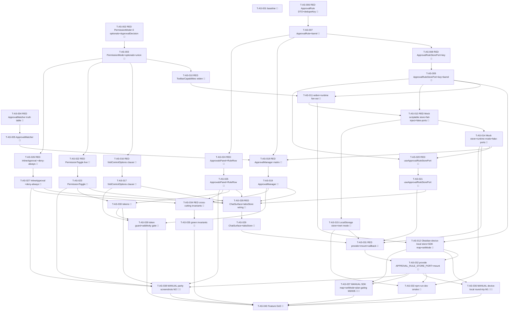

# Tasks — Approvals & Security (P7)

Each task is ≤ ~½ day, has a stable `T-AS-NNN` id, references ≥ 1 SPEC-AS / TEST-AS / REQ-AS / NFR-AS,
names an owner, lists explicit dependencies, and has a testable Definition of Done. This decomposes
**SPEC-AS-001..028** (28 spec items) on top of the merged P1–P6 chat surface on the `next` integration
branch (P6 toolbar-controls #447 / 4f645a40): the P4 inline approval block + the
`ChatRuntimePort.setApprovalCallback` seam, the P6 `PermissionToggle.vue` honest-defer seam + the
`TabControls`/`foldControlOptions`/`ToolbarCapabilities` control state, and the device-local `SettingsPort`
pattern (ADR-PSR-002).

> **TDD ordering (mission discipline):** the RED test task for a contract comes **before** the
> implementation task that greens it. RED test tasks are owned by `qa`; implementation tasks by
> `dev`. **Every dev task's first DoD line is "the prior RED test(s) now pass".** This mirrors the
> P5/P6 task style the maintainer accepted (TASKS-CA-001 / TASKS-TC-001).

> **DDD inward layering order (the batch structure):**
> 1. **DOMAIN** — `PermissionMode` (SPEC-AS-001); the two additive optionals
>    (`ChatRuntimeQueryOptions.permissionMode?` + `TabControls.permissionMode?`, SPEC-AS-002) + the grown
>    `ApprovalDecision` `'deny-always'` member (SPEC-AS-003); the PURE matcher
>    (`getActionPattern`/`getActionDescription`/`matchesRulePattern`, SPEC-AS-004) with its own RED→green
>    + the deny-wins/bash/path/null-action truth table; the `ApprovalRule` DTO + `ApprovalRuleInput` +
>    `ruleDedupeKey` (SPEC-AS-005); `ApprovalRuleStorePort` + `APPROVAL_RULE_STORE_PORT` key + barrel +
>    the `ToolbarCapabilities.permissionMode` widen (SPEC-AS-006).
> 2. **INFRA** — the 3-bridge `ApprovalRuleStorePort` (Obsidian device-local `saveLocalStorage`
>    coverage-excluded → manual / Mock scriptable in-memory + `setFailMode` + `fake-ports.approvalRuleStore`
>    / LocalStorage browser-`localStorage`) + the Claude-runtime SDK-string mapping + plan-exit `setMode`
>    (coverage-excluded → manual) (SPEC-AS-007/008/009).
> 3. **APPLICATION** — the `foldControlOptions` guarded `permissionMode` clause (SPEC-AS-011, RED→green,
>    pure/total) + the `ApprovalManager.decide`/`applyDecision`/`listRules` use case (SPEC-AS-010, RED→green:
>    mode-gate-first → match deny-wins → prompt → persist; fail-safe-to-prompt).
> 4. **UI** — `useApprovalRuleStorePort` (SPEC-AS-018); the live three-mode `PermissionToggle.vue`
>    (SPEC-AS-012); `ApprovalsPanel.vue` + `ApprovalRuleRow.vue` (SPEC-AS-013/014); `InlineApproval.vue`
>    +`deny-always` (SPEC-AS-015); the `ChatSurface` approval-callback → `ApprovalManager` wiring +
>    the approvals view-model (SPEC-AS-016) + the `tabsStore` `permissionMode` control (SPEC-AS-017). Each
>    mounted component carries a co-located `data-testid` PageObject; RED component test before each.
> 5. **STYLES** — the `status-panel`/`permission-toggle` `--sp-*` token slice + the tokens-contract update
>    (SPEC-AS-020), runnable anytime before the gate.
> 6. **WIRE-IN** — provide `APPROVAL_RULE_STORE_PORT` in `AgentSidebarView` + `src/ui/main.ts`; wire the
>    `ApprovalManager` into the live approval callback; mount the approvals panel; `npm run dev` standalone
>    smoke (SPEC-AS-019).
> 7. **GATE** — full `npm run verify` + `npm run test:all` + the grep gate (no `providerId` branch /
>    deny-wins / yolo short-circuit / fail-safe) + additivity + the no-secret/no-`data.json` check + the
>    parity self-review note + the three manual legs (TEST-AS-M1/M2/M3) + draft PR into `next`
>    (orchestrator merges).
> A test for a layer may not depend on a layer further out.

> **The fold + the additive types freeze early (carried from the design + spec hand-off).** The
> `PermissionMode` type (SPEC-AS-001) + the two additive optionals (SPEC-AS-002) + the grown
> `ApprovalDecision` (SPEC-AS-003) + the matcher (SPEC-AS-004) + the `ApprovalRule` DTO (SPEC-AS-005) are
> sequenced FIRST so the engine + the toggle build on frozen types; an untouched-toolbar / no-rule + `normal`
> turn is proven byte-identical to P6 (TEST-AS-002, NFR-AS-001) before the use case + the UI build on top —
> mirroring the P6 ordering that froze the `ChatRuntimeQueryOptions` grow first.

> **Build-green discipline — the two interface changes land their `implements`-fan-out in the SAME task
> (the P5 `readBinary`/T-CA-006 + the P6 `getToolbarCapabilities`/T-TC-008 lesson).** Two domain changes in
> P7 are interface changes that ripple to every `implements ChatRuntimePort`:
> - **The `ToolbarCapabilities.permissionMode` WIDEN** (`'default'|'plan'` → `PermissionMode`, SPEC-AS-006).
>   Widening the union breaks the build for every runtime/double whose `getToolbarCapabilities()` returns a
>   now-too-narrow `permissionMode` literal until each is updated. So the widen task (T-AS-011) **also**
>   updates every `getToolbarCapabilities()` impl on the three runtimes (Obsidian/Mock/LocalStorage) **plus**
>   the `EnqueueRuntime` decorator and the test `ScriptedRuntime` doubles (mapping the P6 `'default'`→`'normal'`)
>   in the SAME task so `npm run build` + `npm run typecheck` stay green.
> - **The additive `ChatRuntimeQueryOptions.permissionMode?`** (SPEC-AS-002) is a **purely additive optional
>   field** — the runtimes read the optional field, they do not re-declare the interface — so it carries **no**
>   `implements`-break and **no** companion-stub concern (same as the P6 `ChatRuntimeQueryOptions` grow). The
>   `TabControls.permissionMode?` optional likewise breaks nothing (the store/fold read it). T-AS-003's DoD
>   notes this explicitly.

> **Coverage-excluded infra (manual legs):** the **real** device-local `ApprovalRuleStorePort`
> (`app.saveLocalStorage`/`loadLocalStorage('specorator:approval-rules')`) and the **real** Claude runtime
> SDK-string mapping (`yolo`↔`bypassPermissions`/`plan`↔`plan`/`normal`↔`default`) + the plan-exit `setMode`
> session sync live under `src/infrastructure/obsidian/**` (coverage-excluded, §10). Their behavioural gate
> is the **manual** legs **TEST-AS-M1** (the real device-local store round-trips in Obsidian; `data.json` +
> the vault stay untouched), **TEST-AS-M2** (per-surface parity screenshots at 320/520/720 px, light + dark),
> and **TEST-AS-M3** (the real Claude runtime maps the live mode to the SDK + emits the plan-exit `setMode`),
> plus **TEST-AS-005** (the real plan-mode edit-gating routing through the P4 exit-plan block) — never
> self-claimed by an agent; recorded for the single final epic-review gate (autonomous drive). The PURE
> matcher, the `ApprovalManager` algorithm (over the scriptable Mock store + a scripted mode), the fold, the
> DTOs/dedupe, the Mock scriptable store + `setFailMode`, and the LocalStorage browser-localStorage impl carry
> the unit/component weight + the 80/70/80/80 coverage gate (NFR-AS-011).

> **Deleted-symbol guard (ESLint) — NO relaxation needed (verified).** Mirroring P2/P3/P4/P5/P6, **none** of
> the P7 symbols were P0-deleted. `eslint.config.js` `DELETED_SUBSYSTEM_BAN` lists only the
> feature/transport/MCP/secret/metadata/canvas paths — it does **not** list `ApprovalRuleStorePort`,
> `ApprovalRule`/`ApprovalRuleInput`/`ruleDedupeKey`, `PermissionMode`, `ApprovalManager`,
> `ApprovalMatcher`/`getActionPattern`/`matchesRulePattern`, `ApprovalsPanel`/`ApprovalRuleRow`/`InlineApproval`,
> or any approvals path. The new domain/application/ui paths (`@/domain/chat/PermissionMode`,
> `@/domain/chat/approvals/**`, `@/domain/ports/ApprovalRuleStorePort`, `@/application/chat/approvals/**`,
> `@/ui/chat/approvals/**`) match **no** ban glob (`@/domain/chat` + `@/domain/chat/inline` regrew in P1/P4
> and are off the list; `ChatRuntimePort` is a live core port, never banned), and `DELETED_INJECTION_KEYS`
> does **not** contain `APPROVAL_RULE_STORE_PORT`. So there is **no guard-relax task** in P7. (T-AS-001's DoD
> includes a one-line lint check confirming the new key/port imports resolve clean; T-AS-040 re-confirms at
> the gate.)

> **Parity is a review-stage human task:** the P7 per-surface parity-screenshot capture (charter §5.1 /
> NFR-AS-012) for the permission toggle (three modes incl. the PLAN label), the inline four-option row, the
> approvals panel, and the auto-decided turn at 320 / 520 / 720 px, light + dark, is deferred to the single
> final epic-review human gate (TEST-AS-M2), not CI. The baseline-capture task (T-AS-001) runs first so a
> `claudian-main` `ApprovalManager` / `ClaudeApprovalHandler` / `status-panel.css` / `permission-toggle.css`
> reference exists pre-impl.

## Legend

- 🧪 = test task (RED-first; owner `qa`)
- 🔨 = implementation task (owner `dev`)
- 📐 = design / scaffolding / baseline task
- 🚀 = release / ops / gate task
- 🪓 = may slice (touches multiple independent code paths; expect several PRs)
- 👤 = human-owned (never agent-self-claimed)

---

## Task list

### T-AS-001 📐 — Baseline-capture: `claudian-main` P7 ApprovalManager + permission-toggle/status-panel reference + guard verification

- **Description:** Before any P7 implementation, capture the `claudian-main` baseline for the P7 surfaces:
  the `ApprovalManager` matching semantics (`core/security/ApprovalManager.ts` —
  `getActionPattern:13`/`getActionDescription:35`/`matchesRulePattern:60`/`isPathPrefixMatch:116`/
  `matchesBashPrefix:132`), the approval decision flow (`providers/claude/runtime/ClaudeApprovalHandler.ts`
  — the `CanUseTool` callback, the cancel `{behavior:'deny',interrupt:true}` at `:114`, the plan-exit
  `setMode destination:'session'` at `:63–71`), the persisted-rule destination + the SDK mapping
  (`ClaudePermissionUpdates.ts:11–12/30–31`, `resolveSDKPermissionMode`), the three-mode set
  (`core/types/settings.ts:76`), and the `permission-toggle.css` / `status-panel.css` running/approval
  state — into a `specs/approvals-security/parity-screenshots.md` skeleton (baseline column only: the
  permission toggle in each of the three modes incl. the PLAN label, the inline approval block with the
  four-option row, the approvals panel with a mix of allow/deny + persisted/session rules + the empty state,
  the auto-decided turn (no prompt) — at 320 / 520 / 720 px, light + dark). Confirm (one lint run) that the
  new `APPROVAL_RULE_STORE_PORT` key + the new domain/application/ui approvals paths
  (`@/domain/chat/PermissionMode`, `@/domain/chat/approvals/**`, `@/domain/ports/ApprovalRuleStorePort`,
  `@/application/chat/approvals/**`, `@/ui/chat/approvals/**`) are **not** caught by the
  `DELETED_SUBSYSTEM_BAN` / `DELETED_INJECTION_KEYS` guard (no relaxation required). No production code.
- **Satisfies:** NFR-AS-012 (baseline leg), NFR-AS-001 (guard verification), SPEC-AS-004/012/013/015/020/026
- **Owner:** dev
- **Depends on:** —
- **Estimate:** S
- **Definition of done:**
  - [ ] `specs/approvals-security/parity-screenshots.md` exists with the per-surface × 320/520/720 ×
        light/dark baseline matrix scaffolded, baseline column captured from `D:\Projects\claudian-main`
        (`ApprovalManager.ts` semantics notes + `ClaudeApprovalHandler.ts` flow + `permission-toggle.css` /
        `status-panel.css`).
  - [ ] A one-line lint check confirms the deleted-symbol guard does **not** block the
        `APPROVAL_RULE_STORE_PORT` key / the new approvals domain/application/ui paths (no relaxation task
        needed); noted in `test-plan.md`.
  - [ ] No file under `src/` changed.

---

## Layer 1 — DOMAIN (SPEC-AS-001..006)

### T-AS-002 🧪 — RED: `PermissionMode` + the two additive optionals + the grown `ApprovalDecision` (structural + serialisation)

- **Description:** Author the failing structural/type-level + serialisation tests asserting: (a)
  `PermissionMode` is **exactly** the closed lower-case union `'normal' | 'plan' | 'yolo'`, re-exported from
  `@/domain/chat/PermissionMode` + surfaced through the ports barrel (TEST-AS-001 type-shape leg,
  SPEC-AS-001); (b) `ChatRuntimeQueryOptions` gains **exactly** one optional field
  `permissionMode?: PermissionMode` appended **after** `serviceTier`, the P0–P6
  `model?`/`forceColdStart?`/`appendSystemPrompt?`/`mode?`/`reasoning?`/`serviceTier?` stay byte-identical,
  and a P6-shaped query (no `permissionMode`) serialises byte-identically to P6 —
  `PreparedChatTurn`/`ChatRuntimeEnsureReadyOptions`/`ChatTurnRequest` unchanged (TEST-AS-002 serialisation
  leg, NFR-AS-001, SPEC-AS-002/021); (c) `TabControls` gains **exactly** one optional member
  `permissionMode?: PermissionMode` appended after `serviceTier`, the four P6 members byte-identical
  (TEST-AS-002 type-shape leg, SPEC-AS-002); (d) `ApprovalDecision` is grown to **exactly** the four members
  `'deny' | 'allow' | 'allow-always' | 'deny-always'`, the three P4 members byte-identical, and
  `ApprovalRequest`/`ApprovalOption` shapes unchanged (TEST-AS-016 union leg, SPEC-AS-003). Names
  TEST-AS-001/002/016 in metadata.
- **Satisfies:** TEST-AS-001 (type-shape leg), TEST-AS-002 (serialisation + type-shape leg), TEST-AS-016 (union leg), SPEC-AS-001, SPEC-AS-002, SPEC-AS-003, SPEC-AS-021, REQ-AS-001/002/006/016/052, NFR-AS-001
- **Owner:** qa
- **Depends on:** —
- **Estimate:** M
- **Definition of done:**
  - [ ] `tests/domain/chat/PermissionMode.test.ts`, `tests/domain/chat/ChatTurn.ts.test.ts` (the P7
        `permissionMode?` additivity + the P6-shaped serialisation leg),
        `tests/domain/chat/toolbar/TabControls.test.ts` (the appended `permissionMode?`), and
        `tests/domain/chat/inline/Approval.test.ts` (the grown four-member union) exist, naming the listed
        TEST-AS legs.
  - [ ] Tests fail (RED) — `PermissionMode` / the two optionals / the fourth `ApprovalDecision` member do
        not yet exist (compile/run failure is the RED signal).

### T-AS-003 🔨 — `PermissionMode.ts` + `ChatRuntimeQueryOptions.permissionMode?` + `TabControls.permissionMode?` + grown `ApprovalDecision`

- **Description:** Implement per SPEC-AS-001/002/003: `src/domain/chat/PermissionMode.ts` exporting
  `PermissionMode = 'normal' | 'plan' | 'yolo'` (lower-case closed union; `'normal'` is the default, absence
  ≡ `'normal'`); **append** `permissionMode?: PermissionMode` **after** `serviceTier` in
  `ChatRuntimeQueryOptions` (`src/domain/chat/ChatTurn.ts`, importing from `./PermissionMode`) and **after**
  `serviceTier` in `TabControls` (`src/domain/chat/toolbar/TabControls.ts`, importing from
  `../PermissionMode`) — the P0–P6 members stay byte-identical, `PreparedChatTurn`/
  `ChatRuntimeEnsureReadyOptions`/`ChatTurnRequest` byte-identical; **grow** the `ApprovalDecision` union in
  `src/domain/chat/inline/Approval.ts` by the fourth member `'deny-always'` (the three P4 members +
  `ApprovalRequest`/`ApprovalOption` byte-identical). Re-export `PermissionMode` from
  `src/domain/ports/index.ts` (appended). Pure types; no behaviour. **Note (build-green):** these two
  additive optionals + the union grow are purely additive — no `implements ChatRuntimePort` breaks (the
  runtimes read the optional field; the union grows additively), so **no** companion-stub is needed here
  (the `ToolbarCapabilities.permissionMode` widen that *does* break `implements` lands its fan-out in T-AS-011).
  No `obsidian`/`node:*`/Vue/class.
- **Satisfies:** SPEC-AS-001, SPEC-AS-002, SPEC-AS-003, SPEC-AS-021, REQ-AS-001/002/006/016/052, NFR-AS-001
- **Owner:** dev
- **Depends on:** T-AS-002
- **Estimate:** S
- **Definition of done:**
  - [ ] The prior RED tests (TEST-AS-001 type-shape leg + TEST-AS-002 serialisation + the TEST-AS-016 union
        leg) now pass (the `PermissionMode` union; exactly the one optional field appended to each of
        `ChatRuntimeQueryOptions`/`TabControls`; a P6-shaped query byte-identical to P6; the four-member
        `ApprovalDecision`; the other request/inline types unchanged).
  - [ ] `npm run typecheck` + `npm run lint` green; no `obsidian`/`node:*`/Vue import in
        `src/domain/chat/**`; no `implements ChatRuntimePort` break (additive-only).
  - [ ] Implementation-log entry added.

### T-AS-004 🧪 — RED: the PURE matcher (`getActionPattern`/`getActionDescription`/`matchesRulePattern`) — the full truth table

- **Description:** Author the failing unit tests for the pure/total matcher (SPEC-AS-004/026), covering the
  full Claudian truth table the QA stage parameterises: (a) `getActionPattern(toolName, input)` per tool —
  Bash → `input.command.trim()` (or `''`), Read/Write/Edit → `file_path` or `null`, NotebookEdit →
  `notebook_path ?? file_path` or `null`, Glob/Grep → `pattern` or `null`, default → `JSON.stringify(input)`
  (TEST-AS-010); (b) `getActionDescription(toolName, input)` per tool — "Run command: …", "Read file: …",
  "Write to file: …", "Edit file: …", "Search files matching: …", "Search content matching: …", else
  "{tool}: {pattern}", a `null` pattern renders `(unknown)` (TEST-AS-015); (c) `matchesRulePattern(toolName,
  actionPattern, rulePattern)` — no-rule/empty → match-all `true`; `'*'` → `true`; exact (post-normalise) →
  `true`; **null action + content rule → `false`** (the null-action guard, EC-AS-9/TEST-AS-014); **Bash**
  `"git *"`↦`"git status"` ✅, `"git"`↦`"git status"` ❌ (bare prefix rejected), `"npm:*"`↦`"npm install"` ✅,
  `"git *"`↦`"github"` ❌ (EC-AS-7/TEST-AS-011); **File** `"/a/b"`↦`"/a/b/c.md"` ✅, `"/a/b"` ✅, `"/a/bc.md"`
  ❌ (EC-AS-8), `"/a/b/"` subtree ✅, `"C:\notes"`↦`"C:/notes/x.md"` ✅ (`\`→`/` normalise then prefix)
  (TEST-AS-012); **Other** (Glob/Grep) `"TODO"`↦`"TODO-list"` ✅ simple prefix (TEST-AS-013); and that all
  three functions are **total — never throw** for any input (NFR-AS-009). Names
  TEST-AS-010/011/012/013/014/015 + EC-AS-7/8/9.
- **Satisfies:** TEST-AS-010, TEST-AS-011, TEST-AS-012, TEST-AS-013, TEST-AS-014, TEST-AS-015, SPEC-AS-004, SPEC-AS-026, REQ-AS-010/011/012/013/014/015, NFR-AS-009, EC-AS-7/8/9
- **Owner:** qa
- **Depends on:** —
- **Estimate:** M
- **Definition of done:**
  - [ ] `tests/domain/chat/approvals/ApprovalMatcher.test.ts` exists, naming the listed TEST-AS ids,
        parameterised across the full SPEC-AS-026 truth table (the bash explicit-wildcard, file
        path-segment-boundary, other-tool prefix, null-action guard, `\`→`/` normalise) + the
        `getActionPattern`/`getActionDescription` per-tool tables + the never-throws assertion.
  - [ ] Tests fail (RED) — `ApprovalMatcher.ts` does not yet exist.

### T-AS-005 🔨 — `ApprovalMatcher.ts` (pure `getActionPattern` / `getActionDescription` / `matchesRulePattern`)

- **Description:** Implement `src/domain/chat/approvals/ApprovalMatcher.ts` per SPEC-AS-004/026, ported
  verbatim from `ApprovalManager.ts`: the tool-name constants (`TOOL_BASH`/`TOOL_READ`/`TOOL_WRITE`/
  `TOOL_EDIT`/`TOOL_NOTEBOOK_EDIT`/`TOOL_GLOB`/`TOOL_GREP`); `getActionPattern(toolName, input):
  string | null`; `getActionDescription(toolName, input): string`; `matchesRulePattern(toolName,
  actionPattern, rulePattern): boolean` with the internal `isPathPrefixMatch` (path-segment-boundary) +
  `matchesBashPrefix` (exact OR `prefix + ' '`/trailing-space prefix) helpers; `\`→`/` normalise before any
  comparison; no-rule/empty + `'*'` → match-all; exact → match; the bash explicit-wildcard-only stance (bare
  prefix never matches); the file path-segment boundary (`/a/b` ⊃ `/a/b/c`, ¬ `/a/bc`; trailing `/` =
  subtree); the other-tool simple prefix; the null-action guard. All three functions **pure + total — never
  throw** (NFR-AS-009). Re-export from `src/domain/chat/approvals/index.ts`. No `obsidian`/`node:*`/Vue/class.
- **Satisfies:** SPEC-AS-004, SPEC-AS-026, REQ-AS-010/011/012/013/014/015, NFR-AS-009
- **Owner:** dev
- **Depends on:** T-AS-004
- **Estimate:** M
- **Definition of done:**
  - [ ] The prior RED tests (TEST-AS-010/011/012/013/014/015 + EC-AS-7/8/9) now pass across the full truth
        table; the functions never throw for any input.
  - [ ] `npm run typecheck` + `npm run lint` + `npm run test` green; no `obsidian`/`node:*`/Vue import in
        `src/domain/chat/approvals/**`; no `eval`/exec — string comparison only (NFR-AS-002).
  - [ ] Implementation-log entry added.

### T-AS-006 🧪 — RED: `ApprovalRule` DTO + `ApprovalRuleInput` + `ruleDedupeKey` (structural + dedupe-key)

- **Description:** Author the failing structural/type-level + behaviour tests asserting (SPEC-AS-005): the
  `ApprovalRule` interface is **exactly** the six `readonly` members (`id:string`, `toolName:string`,
  `actionPattern?:string`, `decision:'allow'|'deny'`, `lifetime:'session'|'persisted'`, `createdAt:number`);
  `ApprovalRuleInput = Omit<ApprovalRule, 'id' | 'createdAt'>`; `ruleDedupeKey(r)` returns
  `` `${toolName} ${actionPattern ?? ''} ${decision}` `` (the triple) so two rules with the same
  tool/pattern/decision share a key and an absent vs `''` pattern collapse to the same key; the DTO carries
  no secret/token field — it is plain inert data that crosses the Pinia store boundary cleanly (NFR-AS-008).
  Re-exported from `@/domain/chat/approvals/index`. Names TEST-AS-016.
- **Satisfies:** TEST-AS-016, SPEC-AS-005, SPEC-AS-024, REQ-AS-016/030/031, NFR-AS-002, NFR-AS-008
- **Owner:** qa
- **Depends on:** —
- **Estimate:** S
- **Definition of done:**
  - [ ] `tests/domain/chat/approvals/ApprovalRule.test.ts` exists, naming TEST-AS-016, asserting the
        six-member DTO shape, the `ApprovalRuleInput` omit, and the `ruleDedupeKey` triple.
  - [ ] Tests fail (RED) — `ApprovalRule.ts` does not yet exist.

### T-AS-007 🔨 — `ApprovalRule.ts` (DTO + `ApprovalRuleInput` + `ruleDedupeKey`) + barrel

- **Description:** Implement `src/domain/chat/approvals/ApprovalRule.ts` per SPEC-AS-005: the `ApprovalRule`
  interface (the six `readonly` members), `ApprovalRuleInput = Omit<ApprovalRule, 'id' | 'createdAt'>`, and
  `ruleDedupeKey(r: Pick<ApprovalRule,'toolName'|'actionPattern'|'decision'>): string` returning the
  `` `${toolName} ${actionPattern ?? ''} ${decision}` `` triple. Plain domain DTO — string/number/enum/
  `readonly` only, no `obsidian`, no `node:*`, no Vue, no class (NFR-AS-008); `toolName` non-empty,
  `actionPattern` absent for match-all + the `{`-leading JSON-fallback case (documented, open item #3),
  `decision ∈ {'allow','deny'}`, `lifetime ∈ {'session','persisted'}`, `createdAt` a finite non-negative
  integer; **no secret/token/path-outside-the-vault** is carried (NFR-AS-002). Re-export from
  `src/domain/chat/approvals/index.ts` (alongside the matcher).
- **Satisfies:** SPEC-AS-005, SPEC-AS-024, REQ-AS-016/030/031, NFR-AS-002, NFR-AS-008
- **Owner:** dev
- **Depends on:** T-AS-006
- **Estimate:** S
- **Definition of done:**
  - [ ] The prior RED test (TEST-AS-016) now passes (the DTO shape, the `ApprovalRuleInput` omit, the
        `ruleDedupeKey` triple, the barrel re-export).
  - [ ] `npm run typecheck` + `npm run lint` green; no `obsidian`/`node:*`/Vue import in
        `src/domain/chat/approvals/**`; no secret field (NFR-AS-002).
  - [ ] Implementation-log entry added.

### T-AS-008 🧪 — RED: `ApprovalRuleStorePort` + `APPROVAL_RULE_STORE_PORT` key + barrel (structural)

- **Description:** Author the failing structural/type-level tests asserting (SPEC-AS-006a): `ApprovalRuleStorePort`
  exposes **exactly** `loadRules(): Promise<Result<readonly ApprovalRule[]>>`,
  `addRule(input: ApprovalRuleInput): Promise<Result<ApprovalRule>>`, `removeRule(id: string):
  Promise<Result<void>>`, `clear(): Promise<Result<void>>` (every method `Result`-typed); `APPROVAL_RULE_STORE_PORT`
  is its **own** `InjectionKey` in `@/infrastructure/bridge/ports` (alongside the existing keys, no
  aggregate); the barrel `src/domain/ports/index.ts` re-exports `ApprovalRuleStorePort` / `ApprovalRule` /
  `ApprovalRuleInput` / `PermissionMode` (appended). The behavioural store contract (load-or-default,
  dedupe, idempotent remove) is the Mock/LS leg (T-AS-013/015). Names the shape leg of TEST-AS-053.
- **Satisfies:** TEST-AS-053 (port-shape leg), SPEC-AS-006, REQ-AS-001/032/033/034/053, NFR-AS-005
- **Owner:** qa
- **Depends on:** T-AS-007
- **Estimate:** S
- **Definition of done:**
  - [ ] `tests/domain/ports/ApprovalRuleStorePort.test.ts` exists, naming the TEST-AS-053 shape leg,
        asserting the four `Result`-typed method signatures + the own key + the barrel re-exports.
  - [ ] Tests fail (RED) — `ApprovalRuleStorePort` + the `APPROVAL_RULE_STORE_PORT` key + the barrel
        re-exports do not yet exist.

### T-AS-009 🔨 — `ApprovalRuleStorePort` + `APPROVAL_RULE_STORE_PORT` key + barrel re-exports

- **Description:** Implement per SPEC-AS-006a: the narrow store-only port interface
  `src/domain/ports/ApprovalRuleStorePort.ts` (`loadRules`/`addRule`/`removeRule`/`clear`, all
  `Promise<Result<…>>`, importing `Result` + `ApprovalRule`/`ApprovalRuleInput`; documented per-method
  contract — `loadRules` load-or-default `ok([])` on empty/unparseable, `addRule` dedupe-by-`ruleDedupeKey`
  no-op `ok(existing)` else mint `id`/`createdAt` + write `ok(stored)`, `removeRule` idempotent `ok()`,
  `clear` `ok()`; only the **persisted** lifetime — session rules live in `ApprovalManager` memory); add the
  `APPROVAL_RULE_STORE_PORT` `InjectionKey` to `src/infrastructure/bridge/ports.ts` (no aggregate — keep the
  per-key header); re-export `ApprovalRuleStorePort` / `ApprovalRule` / `ApprovalRuleInput` / `PermissionMode`
  from `src/domain/ports/index.ts` (appended). One consumer (the approvals use cases), one port (ADR-008). No
  `obsidian`/`node:*`/Vue; no class.
- **Satisfies:** SPEC-AS-006, REQ-AS-001/032/033/034/053, NFR-AS-005, NFR-AS-010
- **Owner:** dev
- **Depends on:** T-AS-008, T-AS-007
- **Estimate:** S
- **Definition of done:**
  - [ ] The prior RED test (TEST-AS-053 port-shape leg) now passes (the four method signatures, own key,
        barrel re-exports).
  - [ ] `npm run typecheck` + `npm run lint` green; deleted-symbol guard green (the new key/port imports
        resolve clean — no relaxation needed); no `obsidian`/`node:*` import in `src/domain/**`.
  - [ ] Implementation-log entry added.

### T-AS-010 🧪 — RED: `ToolbarCapabilities.permissionMode` WIDEN (structural + additivity + `implements` fan-out)

- **Description:** Author the failing structural/type-level tests asserting (SPEC-AS-006b): the
  `ToolbarCapabilities.permissionMode` field is **widened** from the P6 `'default' | 'plan'` to the live
  `PermissionMode` (`'normal' | 'plan' | 'yolo'`), the four other `ToolbarCapabilities` flags
  (`supportsMcpTools`/`reasoningControl`/`hasServiceTier`/`hasModeToggle`) + the five `RuntimeCapabilities`
  flags + the P0–P6 `ChatRuntimePort` members stay byte-identical (the TEST-AS-021 additivity leg,
  NFR-AS-001, SPEC-AS-021); and that the P6 `'default'` value maps to `'normal'`. Names the shape +
  additivity legs of TEST-AS-001/021.
- **Satisfies:** TEST-AS-001 (capabilities-shape leg), TEST-AS-021 (ChatRuntimePort additivity leg), SPEC-AS-006, SPEC-AS-021, REQ-AS-003, NFR-AS-001
- **Owner:** qa
- **Depends on:** T-AS-003
- **Estimate:** S
- **Definition of done:**
  - [ ] `tests/domain/ports/ChatRuntimePort.ts.test.ts` (the P7 `ToolbarCapabilities.permissionMode` widen
        + the additivity leg) exists, naming the listed TEST-AS legs, asserting the widened `permissionMode`
        type + the four-other-flags + the `ChatRuntimePort`-members byte-identity.
  - [ ] Tests fail (RED) — `ToolbarCapabilities.permissionMode` is still the narrow `'default'|'plan'`.

### T-AS-011 🔨 — `ToolbarCapabilities.permissionMode` widen + the runtime `implements` fan-out (build-green companion) 🪓

> **The P5 `readBinary` / P6 `getToolbarCapabilities` lesson (T-CA-006 / T-TC-008) applied:** widening
> `ToolbarCapabilities.permissionMode` from `'default'|'plan'` to `PermissionMode` breaks the build for
> every class whose `getToolbarCapabilities()` returns a `permissionMode` literal that no longer satisfies
> the union — the three bridge runtimes (Obsidian/Mock/LocalStorage) **plus** the `EnqueueRuntime` decorator
> and the test `ScriptedRuntime` doubles — until each is updated. This task lands the widen **and** the
> `'default'`→`'normal'` mapping on every impl in the SAME commit so `npm run build` + `npm run typecheck`
> stay green; the scriptable Mock body + the real Obsidian SDK mapping are then fleshed out in the infra
> batch (T-AS-013/012).

- **Description:** Implement per SPEC-AS-006b: widen `ToolbarCapabilities.permissionMode` in
  `src/domain/ports/ChatRuntimePort.ts` from `'default' | 'plan'` to `PermissionMode` (importing from
  `@/domain/chat/PermissionMode`; the four other `ToolbarCapabilities` flags + the five
  `RuntimeCapabilities` flags + the P0–P6 `ChatRuntimePort` members byte-identical, SPEC-AS-021). In the
  **same task**, update every `getToolbarCapabilities()` impl that `implements ChatRuntimePort` — the three
  runtimes (Obsidian: map the active P4 plan state to `permissionMode` ahead of the real SDK mapping in
  T-AS-012; Mock: the P6 `'default'` value → `'normal'`, ahead of the scriptable body in T-AS-013;
  LocalStorage: `'default'` → `'normal'`) **plus** the `EnqueueRuntime` decorator (pass-through) and the
  test `ScriptedRuntime` doubles — so `npm run build` + `npm run typecheck` stay green. Synchronous + total;
  no `providerId` branch.
- **Satisfies:** SPEC-AS-006, SPEC-AS-021, REQ-AS-003, NFR-AS-001, NFR-AS-005
- **Owner:** dev
- **Depends on:** T-AS-010, T-AS-009
- **Estimate:** M
- **Slice plan:** may slice as (a) the `ToolbarCapabilities.permissionMode` widen + the three-runtime
  `'default'`→`'normal'` mapping, (b) the `EnqueueRuntime` decorator + the `ScriptedRuntime` test doubles.
- **Definition of done:**
  - [ ] The prior RED tests (the TEST-AS-001 capabilities-shape leg + the TEST-AS-021 additivity leg) now
        pass — `permissionMode` widened to `PermissionMode`, the four other flags + the `ChatRuntimePort`
        members byte-identical.
  - [ ] All three runtimes (plus the `EnqueueRuntime` decorator + the `ScriptedRuntime` test doubles) carry
        an updated `getToolbarCapabilities()` returning a valid `PermissionMode` (`'default'`→`'normal'`) so
        `npm run typecheck` + `npm run lint` + `npm run build` stay green (the build-green companion — the
        scriptable/real bodies follow in T-AS-013/012).
  - [ ] No `providerId` branch; synchronous + total; implementation-log entry added.

---

## Layer 2 — INFRA (SPEC-AS-007..009)

### T-AS-012 🔨 — `ObsidianBridge` device-local `ApprovalRuleStorePort` + the Claude-runtime SDK mapping + plan-exit `setMode` (coverage-excluded) 🪓

> The **real** device-local `ApprovalRuleStorePort` (`app.saveLocalStorage`/`loadLocalStorage('specorator:approval-rules')`)
> and the **real** Claude runtime SDK-string mapping (`yolo`↔`bypassPermissions`/`plan`↔`plan`/
> `normal`↔`default`) + the plan-exit `setMode destination:'session'` sync live under
> `src/infrastructure/obsidian/**` (coverage-excluded). Their behavioural gate is the **manual** legs
> TEST-AS-M1 (the real device-local store round-trips; `data.json`/vault untouched) + TEST-AS-M3 (the real
> Claude SDK mapping + plan-exit `setMode`). The Mock/LS halves (T-AS-013/015) carry the automated proof.

- **Description:** Implement per SPEC-AS-007 under `src/infrastructure/obsidian/**`: (a) the
  `ApprovalRuleStorePort` backed by the device-local store under the stable key `'specorator:approval-rules'`
  (`app.saveLocalStorage`/`loadLocalStorage`, mirroring the `SettingsPort` device-local pattern, ADR-PSR-002);
  `loadRules` load-or-default (a missing/unparseable blob → `ok([])`, a coercion drops malformed entries),
  `addRule`/`removeRule`/`clear` read-modify-write the blob — **never `data.json`, never a vault file**
  (NFR-AS-003, REQ-AS-034); (b) the Claude runtime maps `queryOptions.permissionMode` to the SDK
  `PermissionMode` on the wire (`yolo`↔`bypassPermissions`, `plan`↔`plan`, `normal`↔`default`) and on
  plan-exit emits the session `{type:'setMode',mode,destination:'session'}` permission update (parity
  `ClaudeApprovalHandler.ts:63–71`) — **the SDK mapping + `setMode` stay in the Claude runtime, no
  `providerId` branch in the UI/app** (SPEC-AS-023, NG6); flesh out the Claude runtime's
  `getToolbarCapabilities().permissionMode` to return the live mode (replacing the T-AS-011 plan-state stub).
  Coverage-excluded; no `obsidian` symbol leaks past these files.
- **Satisfies:** SPEC-AS-007, REQ-AS-002/004/005/030/034/053, NFR-AS-003 (manual leg)
- **Owner:** dev
- **Depends on:** T-AS-009, T-AS-011
- **Estimate:** M
- **Slice plan:** may slice as (a) the device-local `ApprovalRuleStorePort`, (b) the Claude-runtime SDK
  mapping + plan-exit `setMode`.
- **Definition of done:**
  - [x] `ObsidianBridge` provides the real device-local `ApprovalRuleStorePort` (load-or-default,
        read-modify-write, key `'specorator:approval-rules'`, never `data.json`/vault) + the Claude runtime
        maps the live mode to the SDK + emits the plan-exit `setMode`; both total; no `obsidian` symbol leaks
        past the file.
  - [x] `npm run typecheck` + `npm run lint` green; the manual legs TEST-AS-M1/M3 scheduled in `test-plan.md`.
  - [x] Implementation-log entry added.

### T-AS-013 🧪 — RED: scriptable `MockBridge` `ApprovalRuleStorePort` (seedable + `setFailMode`) + scriptable runtime mode + `fake-ports.approvalRuleStore`

- **Description:** Author the failing unit tests asserting (SPEC-AS-008): (a) the **Mock**
  `ApprovalRuleStorePort` is a **scriptable in-memory** array store — `seedRules(rules)` pre-populates
  persisted rules (drives the matched-allow/deny + reload tests), `loadRules`/`addRule` (dedupe by
  `ruleDedupeKey`, open item #2 — a duplicate triple is a no-op `ok(existing)`, an opposite-decision triple
  is appended) / `removeRule` (idempotent) / `clear` operate on the in-memory array, all
  `Promise<Result<…>>`; (b) **failure injection** — `setFailMode('load' | 'save' | 'none')` forces
  `loadRules`/`addRule` to return `Result.err` so the fail-safe-to-prompt test (TEST-AS-054) runs
  deterministically; (c) the scriptable `MockChatRuntime` records the `queryOptions.permissionMode` of the
  last query (so a test asserts the folded mode reaches the runtime, TEST-AS-002) and exposes a scriptable
  `getToolbarCapabilities().permissionMode` so the toggle/panel reflect a driven mode (TEST-AS-003/006/040);
  (d) `tests/__fakes__/fake-ports.ts` gains an `approvalRuleStore` member (the scriptable Mock store, with
  the failure-injection switch) wired into the factory so multi-port `ApprovalManager` + panel tests see it.
  Names the Mock backing of TEST-AS-020/021/030/032/033/053/054.
- **Satisfies:** TEST-AS-020 (Mock backing), TEST-AS-021 (Mock backing), TEST-AS-030 (Mock backing), TEST-AS-032 (Mock backing), TEST-AS-033 (Mock backing), TEST-AS-053 (Mock backing), TEST-AS-054 (fail-inject backing), SPEC-AS-008, REQ-AS-020/021/032/053/054, NFR-AS-010
- **Owner:** qa
- **Depends on:** T-AS-009, T-AS-011
- **Estimate:** M
- **Definition of done:**
  - [x] `tests/infrastructure/mock/MockApprovalRuleStore.test.ts`,
        `tests/infrastructure/mock/MockApprovalRuntimeMode.test.ts`, and the extended
        `tests/__fakes__/fake-ports.test.ts` (the `approvalRuleStore` member + `setFailMode`) exist, naming
        the listed TEST-AS ids.
  - [x] Tests fail (RED) — the scriptable Mock store (`seedRules`/`setFailMode`) + the scriptable runtime
        mode + the factory member do not yet exist (beyond the T-AS-011 default mapping).

### T-AS-014 🔨 — `MockBridge` scriptable `ApprovalRuleStorePort` + scriptable runtime mode + `fake-ports.approvalRuleStore`

- **Description:** Implement per SPEC-AS-008 under `src/infrastructure/mock/**`: the scriptable in-memory
  `ApprovalRuleStorePort` (`seedRules(rules)` pre-populates; `loadRules`/`addRule` dedupe-by-`ruleDedupeKey`/
  `removeRule` idempotent/`clear` over the in-memory array, all `Result`-typed, total — never throws);
  `setFailMode('load'|'save'|'none')` forcing `loadRules`/`addRule` to `Result.err`; flesh out the
  scriptable `MockChatRuntime` (record the last query's `permissionMode`; `setToolbarCapabilities`/the mode
  getter drives `getToolbarCapabilities().permissionMode`, replacing the T-AS-011 default mapping); add the
  `approvalRuleStore` member to `tests/__fakes__/fake-ports.ts`. No `node:*`, no `obsidian`.
- **Satisfies:** SPEC-AS-008, REQ-AS-020/021/032/053/054, NFR-AS-010
- **Owner:** dev
- **Depends on:** T-AS-013
- **Estimate:** M
- **Definition of done:**
  - [x] The prior RED tests (the Mock store seed/dedupe/fail-inject + the scriptable runtime mode legs of
        TEST-AS-020/021/030/032/033/053/054) now pass; the `fake-ports` `approvalRuleStore` member works for
        multi-port tests; `setFailMode` drives the fail-safe path deterministically.
  - [x] No `node:*`/`obsidian` import in Mock; total — never throws; `npm run typecheck` + `npm run lint` +
        `npm run test` green; implementation-log entry added.

### T-AS-015 🔨 — `LocalStorageBridge` browser-`localStorage` `ApprovalRuleStorePort` + inert runtime mode

- **Description:** Implement per SPEC-AS-009 under `src/infrastructure/localstorage/**`: the
  `ApprovalRuleStorePort` backed by browser `localStorage` under the same key `'specorator:approval-rules'`
  (parity with the LS `SettingsPort`) so the GitHub Pages demo persists rules across a reload with no
  Obsidian runtime (REQ-AS-053); `loadRules` load-or-default, `addRule` dedupe / `removeRule` idempotent /
  `clear`, all `Result`-typed, never throwing across the boundary (NFR-AS-010). The runtime mode is **inert**
  — the mode is recorded on the turn (subscription/CLI parity) but no live `setMode` fires; the toggle/panel
  still reflect the per-tab mode draft. No `node:*`.
- **Satisfies:** SPEC-AS-009, REQ-AS-053, NFR-AS-010
- **Owner:** dev
- **Depends on:** T-AS-013
- **Estimate:** S
- **Definition of done:**
  - [x] The prior RED tests (the LocalStorage round-trip leg of TEST-AS-053) now pass; the demo persists a
        rule across a reload with no Obsidian; the runtime mode is inert (recorded, no live `setMode`); never
        throws.
  - [x] `npm run typecheck` + `npm run lint` + `npm run test` green; implementation-log entry added.

---

## Layer 3 — APPLICATION (SPEC-AS-010..011)

### T-AS-016 🧪 — RED: `foldControlOptions` guarded `permissionMode` clause (incl. EC-AS-2/13 empty/normal fold)

- **Description:** Author the failing unit tests for the extended pure guarded fold (SPEC-AS-011): the added
  `permissionMode` clause writes `folded.permissionMode = controls.permissionMode` **only** when present
  **and non-`normal`** — `foldControlOptions({})` → `{}` and `foldControlOptions({permissionMode:'normal'})`
  → `{}` (both byte-identical to a P6 turn, EC-AS-2/13, the TEST-AS-002 fold leg, NFR-AS-001), `'plan'`/
  `'yolo'` folded; the P6 `model`/`mode`/`reasoning`/`serviceTier` clauses + behaviour stay byte-identical;
  pure + total — never throws. Names TEST-AS-002 (fold leg) + EC-AS-2/13.
- **Satisfies:** TEST-AS-002 (fold leg), SPEC-AS-011, SPEC-AS-021, REQ-AS-002/052, NFR-AS-001, EC-AS-2/13
- **Owner:** qa
- **Depends on:** T-AS-003
- **Estimate:** S
- **Definition of done:**
  - [x] `tests/application/chat/toolbar/foldControlOptions.test.ts` is extended, naming the TEST-AS-002 fold
        leg, covering the non-`normal`-only guard, the `{}`→`{}` and `{permissionMode:'normal'}`→`{}` empty
        folds (EC-AS-2/13), the `'plan'`/`'yolo'` fold, and the P6-clause byte-identity + never-throws.
  - [x] Tests fail (RED) — the `permissionMode` clause does not yet exist in `foldControlOptions.ts`.

### T-AS-017 🔨 — `foldControlOptions.ts` — add the guarded `permissionMode` clause

- **Description:** Implement per SPEC-AS-011: **add one guarded clause** to the existing pure/total
  `src/application/chat/toolbar/foldControlOptions.ts` — `if (controls.permissionMode !== undefined &&
  controls.permissionMode !== 'normal') folded.permissionMode = controls.permissionMode;` — so a
  `normal`/absent tab folds nothing → byte-identical P6 (REQ-AS-052, NFR-AS-001); the return type widens by
  the one optional `permissionMode` key, the P6 `model`/`mode`/`reasoning`/`serviceTier` keys + behaviour
  byte-identical (SPEC-AS-021). Pure + total — never throws. No `obsidian`/`node:*`/Vue import; no
  `providerId` branch.
- **Satisfies:** SPEC-AS-011, SPEC-AS-021, REQ-AS-002/052, NFR-AS-001
- **Owner:** dev
- **Depends on:** T-AS-016
- **Estimate:** S
- **Definition of done:**
  - [x] The prior RED tests (TEST-AS-002 fold leg, incl. EC-AS-2/13) now pass.
  - [x] Pure/total; never throws; no `obsidian`/Vue import; no `providerId` branch; the P6 clauses
        byte-identical.
  - [x] `npm run typecheck` + `npm run lint` + `npm run test` green; implementation-log entry added.

### T-AS-018 🧪 — RED: `ApprovalManager.decide`/`applyDecision`/`listRules` — the full decision-flow matrix (no `providerId` branch)

- **Description:** Author the failing unit tests for the decision-flow use case (SPEC-AS-010/023/027), over
  the scriptable Mock store + a scripted mode, asserting: (a) **`decide(action, mode)` mode-gate-FIRST** —
  `mode === 'yolo'` → `ok('allow')` with **no** rule lookup (TEST-AS-004, EC-AS-3), `mode === 'plan'` → the
  surface routes edits to the P4 exit-plan gate (the manager defers, SPEC-AS-016), `mode === 'normal'`/absent
  → continue; (b) **load** `store.loadRules()` awaited (open item #4); on `err` → log (no rule content) +
  `feedback.notify(approvals.storeError)` + `ok('prompt')` — **never auto-allow** (TEST-AS-054, EC-AS-6,
  REQ-AS-054); (c) **match** over `persisted ∪ session` via `matchesRulePattern` — any matching `deny` →
  `ok('deny')` (deny-wins over a matching allow, TEST-AS-003/023, EC-AS-5/11), else any matching `allow` →
  `ok('allow')` (TEST-AS-020, EC-AS-20), else `ok('prompt')` (no match → the unchanged P4 block,
  TEST-AS-021, EC-AS-1); (d) **`applyDecision(action, decision)`** — `'allow'`/`'deny'` → upsert an in-memory
  **session** rule keyed by `ruleDedupeKey` (TEST-AS-031, REQ-AS-031), `'allow-always'`/`'deny-always'` →
  `store.addRule({toolName,actionPattern,decision:allow|deny})` (TEST-AS-030, REQ-AS-030; the `{`-leading
  JSON-fallback pattern stored **without** `actionPattern`, EC-AS-16/NFR-AS-002), `null` → no rule (cancel,
  TEST-AS-025, EC-AS-12); a persist `err` surfaces the notice but the returned decision still stands; (e)
  **`listRules()`** returns persisted ∪ session, `Result`-typed; (f) a **grep + behaviour** assertion that
  the manager reads `mode` + the matcher with **zero** `if (providerId === 'claude')` branch (TEST-AS-003,
  SPEC-AS-023) and **never throws** across the approval-callback boundary (`tryAsync`, the matcher total,
  NFR-AS-004/009). Names TEST-AS-003/004/020/021/023/025/030/031/032/033/052/054 + EC-AS-1/3/5/6/10/11/12/16/20.
- **Satisfies:** TEST-AS-003, TEST-AS-004, TEST-AS-020, TEST-AS-021, TEST-AS-023, TEST-AS-025, TEST-AS-030, TEST-AS-031, TEST-AS-032, TEST-AS-033, TEST-AS-052 (decide-leg), TEST-AS-054, SPEC-AS-010, SPEC-AS-023, SPEC-AS-027, SPEC-AS-028, REQ-AS-004/005/020/021/022/023/024/025/030/031/052/054, NFR-AS-004, NFR-AS-009, EC-AS-1/3/5/6/10/11/12/16/20
- **Owner:** qa
- **Depends on:** T-AS-005, T-AS-007, T-AS-014
- **Estimate:** M
- **Definition of done:**
  - [x] `tests/application/chat/approvals/ApprovalManager.test.ts` exists, naming the listed TEST-AS ids,
        covering the mode-gate-first / load-await / match-deny-wins / prompt-fallback / applyDecision
        session-vs-persist / cancel / listRules paths + the fail-safe-to-prompt + the no-`providerId`-branch
        grep+behaviour + the never-throws assertion, driven by the scriptable Mock store + a scripted mode.
  - [x] Tests fail (RED) — `ApprovalManager.ts` does not yet exist.

### T-AS-019 🔨 — `ApprovalManager.ts` (`decide`/`applyDecision`/`listRules`)

- **Description:** Implement `src/application/chat/approvals/ApprovalManager.ts` per SPEC-AS-010/027: the
  `ApprovalGateOutcome` type (`ApprovalDecision | 'prompt'`), the `ApprovalAction` interface (`toolName` +
  `actionPattern`), and the `ApprovalManager` class (`constructor(store: ApprovalRuleStorePort, feedback:
  FeedbackService)`, holding the **per-surface in-memory session rules** in a `Map` keyed by `ruleDedupeKey`,
  resolved open item #1). `decide(action, mode)`: mode-gate-FIRST (`yolo`→`ok('allow')` no lookup,
  `plan`→defer to the surface's P4 exit-plan gate, `normal`→continue) → **await** `store.loadRules()` (on
  `err` → log no-content + `feedback.notify(approvals.storeError)` + `ok('prompt')`, fail-safe) → match
  `persisted ∪ session` via `matchesRulePattern` (deny-wins → `ok('deny')`, else allow → `ok('allow')`, else
  `ok('prompt')`). `applyDecision(action, decision)`: `'allow'`/`'deny'` → session-rule upsert;
  `'allow-always'`/`'deny-always'` → `store.addRule` (the `{`-leading JSON-fallback pattern stored without
  `actionPattern`, open item #3 / NFR-AS-002); `null` → no rule; a persist `err` surfaces the notice but
  returns the standing decision (`allow-always`→`allow`, `deny-always`→`deny` on the wire). `listRules()`:
  `persisted ∪ session`, `Result`-typed. **No exception crosses the approval-callback boundary** (`tryAsync`
  around the store; the matcher total — NFR-AS-004/009); logs **no** `actionPattern`/command/path/secret
  content (NFR-AS-002, SPEC-AS-025); **no `providerId` branch** (SPEC-AS-023). No `obsidian`/Vue import.
- **Satisfies:** SPEC-AS-010, SPEC-AS-023, SPEC-AS-025, SPEC-AS-027, SPEC-AS-028, REQ-AS-004/005/020/021/022/023/024/025/030/031/052/054, NFR-AS-002, NFR-AS-004, NFR-AS-009
- **Owner:** dev
- **Depends on:** T-AS-018
- **Estimate:** M
- **Definition of done:**
  - [x] The prior RED tests (TEST-AS-003/004/020/021/023/025/030/031/032/033/052/054 + the EC-AS legs) now
        pass across the full matrix (mode-gate-first, deny-wins, fail-safe-to-prompt, session-vs-persist,
        cancel, dedupe, JSON-fallback-as-match-all).
  - [x] Result-typed; never throws across the callback boundary; logs no rule content/secret; **no
        `providerId` branch**; no `obsidian`/Vue import.
  - [x] `npm run typecheck` + `npm run lint` + `npm run test` green; implementation-log entry added.

---

## Layer 4 — UI (SPEC-AS-012..018, except wiring SPEC-AS-019 → Layer 6)

### T-AS-020 🧪 — RED: `useApprovalRuleStorePort` composable

- **Description:** Author the failing unit test (SPEC-AS-018) asserting `useApprovalRuleStorePort()` mirrors
  `useVaultPort`/`useToolbarCatalogPort` — injects `APPROVAL_RULE_STORE_PORT`, returns the injected port
  when provided, throws a helpful error when unprovided. One-port-one-composable (ADR-008). Tested over the
  Mock port. Names the composable leg of TEST-AS-053.
- **Satisfies:** TEST-AS-053 (composable leg), SPEC-AS-018, REQ-AS-040/042/053, NFR-AS-005
- **Owner:** qa
- **Depends on:** T-AS-009, T-AS-014
- **Estimate:** S
- **Definition of done:**
  - [x] `tests/ui/composables/useApprovalRuleStorePort.test.ts` exists, naming the TEST-AS-053 composable
        leg, covering inject-when-provided + throw-when-unprovided.
  - [x] Test fails (RED) — `useApprovalRuleStorePort` does not yet exist.

### T-AS-021 🔨 — `useApprovalRuleStorePort.ts`

- **Description:** Implement `src/ui/composables/useApprovalRuleStorePort.ts` per SPEC-AS-018: inject
  `APPROVAL_RULE_STORE_PORT`, throw a helpful error when unprovided (mirroring `useVaultPort`); return the
  injected `ApprovalRuleStorePort`. No `obsidian` import (NFR-AS-006); DTO-only across any store boundary.
- **Satisfies:** SPEC-AS-018, REQ-AS-040/042/053, NFR-AS-005, NFR-AS-006
- **Owner:** dev
- **Depends on:** T-AS-020
- **Estimate:** S
- **Definition of done:**
  - [x] The prior RED test (TEST-AS-053 composable leg) now passes.
  - [x] No `obsidian` import under `src/ui/**`; `npm run typecheck` + `npm run lint` + `npm run test` green;
        implementation-log entry added.

### T-AS-022 🧪 — RED: `PermissionToggle.vue` live three-mode (+ PLAN label) (PO co-located)

- **Description:** Author the failing component test + co-located `data-testid` PageObject
  (`PermissionToggle.po.ts`) per SPEC-AS-012: mounting `PermissionToggle` with `mode: PermissionMode` offers
  the **fixed three modes** (`normal`/`plan`/`yolo` — keyboard-operable: focus, Enter/Space activate, Arrow
  keys move through the three, Escape closes — REQ-AS-050); when `mode === 'plan'` the control is **replaced
  by the "PLAN" label** with an `aria-label` (REQ-AS-003/051); for `normal`/`yolo` the active mode shows via
  the i18n label (`agent.chat.toolbar.permission.mode.*`) + AT state (`aria-checked`/`aria-selected` per the
  live mode + an accessible name, REQ-AS-050/051), and it is **no longer `aria-disabled`** + **no longer
  shows the `toolbar.permission.deferred` notice** (the P6 seam state is removed); selecting a mode emits
  `set(mode)` (REQ-AS-002); switching the prop re-derives the active mode (REQ-AS-006); cues are text +
  border, never colour-only (NFR-AS-013). `data-testid`: `toolbar-permission`, `toolbar-permission-plan`,
  `toolbar-permission-option`. Names TEST-AS-001/002/003/006/050/051 (A legs).
- **Satisfies:** TEST-AS-001 (A leg), TEST-AS-002 (toggle-set leg), TEST-AS-003 (PLAN leg), TEST-AS-006 (A leg), TEST-AS-050 (toggle leg), TEST-AS-051 (toggle leg), SPEC-AS-012, REQ-AS-001/002/003/006/050/051, NFR-AS-006, NFR-AS-013, NFR-AS-015
- **Owner:** qa
- **Depends on:** T-AS-003
- **Estimate:** M
- **Definition of done:**
  - [x] `tests/ui/chat/toolbar/PermissionToggle.test.ts` + `PermissionToggle.po.ts` exist, naming the listed
        TEST-AS legs, querying by `data-testid` only, asserting the three-mode keyboard control + the PLAN
        label + the `set` emit + the removed seam state + the AT state + non-colour cues + the keyed strings.
  - [x] Tests fail (RED) — the P6 honest-defer `PermissionToggle.vue` does not yet offer the live three-mode
        control (the disabled seam still renders).

### T-AS-023 🔨 — `PermissionToggle.vue` (live three-mode + PLAN label)

- **Description:** Implement per SPEC-AS-012 (`<script setup>`, presentational — props in / events out):
  replace the P6 honest-defer disabled seam with the live three-mode control. **Props:** `mode:
  PermissionMode`; **emits:** `set:[mode]`. The fixed three-mode keyboard-operable control (focus,
  Enter/Space, Arrow keys, Escape; `role="listbox"`/`role="switch"` + `aria-checked`/`aria-selected` + an
  accessible name); the PLAN-label special-case for `plan`; i18n labels via `TranslationPort`
  (`agent.chat.toolbar.permission.mode.*` + `agent.chat.toolbar.permission.plan`, en+de — the P6
  `toolbar.permission.deferred` string removed, SPEC-AS-022); the active mode emits `set(mode)` up to the
  surface; no `aria-disabled`; cues text + border (forced-colors + reduced-motion honoured, NFR-AS-013). No
  `obsidian` import (NFR-AS-006); no `v-html` (NFR-AS-007).
- **Satisfies:** SPEC-AS-012, SPEC-AS-022, REQ-AS-001/002/003/006/050/051, NFR-AS-006, NFR-AS-007, NFR-AS-013, NFR-AS-015
- **Owner:** dev
- **Depends on:** T-AS-022
- **Estimate:** M
- **Definition of done:**
  - [x] The prior RED tests (TEST-AS-001/002 toggle leg/003/006/050/051 A legs) now pass.
  - [x] No `obsidian` import under `src/ui/**`; no `v-html`; no `aria-disabled` seam; new strings via
        `TranslationPort` (en+de); the P6 `toolbar.permission.deferred` string removed.
  - [x] `npm run typecheck` + `npm run lint` + `npm run test` green; implementation-log entry added.

### T-AS-024 🧪 — RED: `ApprovalsPanel.vue` + `ApprovalRuleRow.vue` (POs co-located)

- **Description:** Author the failing component tests + co-located `data-testid` PageObjects
  (`ApprovalsPanel.po.ts`, `ApprovalRuleRow.po.ts`) per SPEC-AS-013/014: mounting `ApprovalsPanel` with
  `mode: PermissionMode` + `rules: readonly ApprovalRule[]` shows the active mode (`agent.chat.approvals.mode`
  "Mode: {mode}", REQ-AS-040) under a localised title, renders one `ApprovalRuleRow` per `rules` entry
  (REQ-AS-041), re-emits each row's `remove` up (REQ-AS-042), shows `agent.chat.approvals.empty` when
  `rules` is empty, and re-renders on `mode`/`rules` change (live, REQ-AS-043), keyboard-navigable with an
  accessible name per control (REQ-AS-050/051); mounting `ApprovalRuleRow` with `rule: ApprovalRule` shows
  tool · `actionPattern ?? '*'` · the localised decision (`agent.chat.approvals.decision.allow|deny`) ·
  lifetime (`agent.chat.approvals.lifetime.session|persisted`) each as **text** (not colour-alone,
  NFR-AS-013), a **persisted** rule carries a focusable **remove** button (`agent.chat.approvals.remove`
  "Remove rule: {tool} {pattern}") emitting `remove(rule.id)` on click/Enter/Space (REQ-AS-042/050/051), a
  **session** rule has no remove control, and the allow/deny badge uses the
  `--sp-approvals-decision-allow|deny` token with a text label (forced-colors survives). `data-testid`:
  `approvals-panel`, `approvals-mode`, `approvals-empty`, `approvals-rule`, `approvals-rule-remove`. Names
  TEST-AS-040/041/042/043/050/051 (A legs).
- **Satisfies:** TEST-AS-040, TEST-AS-041, TEST-AS-042 (A leg), TEST-AS-043, TEST-AS-050 (rule leg), TEST-AS-051 (rule leg), SPEC-AS-013, SPEC-AS-014, REQ-AS-040/041/042/043/050/051, NFR-AS-006, NFR-AS-013, NFR-AS-015
- **Owner:** qa
- **Depends on:** T-AS-007
- **Estimate:** M
- **Definition of done:**
  - [x] `tests/ui/chat/approvals/ApprovalsPanel.test.ts` + `ApprovalsPanel.po.ts` +
        `tests/ui/chat/approvals/ApprovalRuleRow.test.ts` + `ApprovalRuleRow.po.ts` exist, naming the listed
        TEST-AS legs, querying by `data-testid` only.
  - [x] Tests fail (RED) — `ApprovalsPanel.vue` / `ApprovalRuleRow.vue` do not yet exist.

### T-AS-025 🔨 — `ApprovalsPanel.vue` + `ApprovalRuleRow.vue`

- **Description:** Implement `src/ui/chat/approvals/ApprovalsPanel.vue` + `ApprovalRuleRow.vue` per
  SPEC-AS-013/014 (`<script setup>`, presentational — props in / events out): `ApprovalsPanel` props `mode:
  PermissionMode` + `rules: readonly ApprovalRule[]`, emits `remove:[id]`; shows the active mode + the
  localised title + the rule-list heading + one `ApprovalRuleRow` per rule (re-emitting `remove`) + the
  empty notice; live (reads reactive props); keyboard-navigable. `ApprovalRuleRow` props `rule:
  ApprovalRule`, emits `remove:[id]`; shows tool · `actionPattern ?? '*'` · decision · lifetime as text; a
  persisted rule carries the focusable remove button (accessible name) emitting `remove(rule.id)` on
  click/Enter/Space; a session rule has no remove control; the decision badge uses the
  `--sp-approvals-decision-allow|deny` token with a text label. i18n via `TranslationPort` (en+de,
  SPEC-AS-022). No `obsidian` import (NFR-AS-006); no `v-html` (NFR-AS-007).
- **Satisfies:** SPEC-AS-013, SPEC-AS-014, SPEC-AS-022, REQ-AS-040/041/042/043/050/051, NFR-AS-006, NFR-AS-007, NFR-AS-013, NFR-AS-015
- **Owner:** dev
- **Depends on:** T-AS-024
- **Estimate:** M
- **Definition of done:**
  - [x] The prior RED tests (TEST-AS-040/041/042 A leg/043/050/051 rule leg) now pass.
  - [x] No `obsidian` import under `src/ui/**`; no `v-html`; the decision badge carries a text label (not
        colour-alone); new strings via `TranslationPort` (en+de); co-located POs present.
  - [x] `npm run typecheck` + `npm run lint` + `npm run test` green; implementation-log entry added.

### T-AS-026 🧪 — RED: `InlineApproval.vue` +`deny-always` option (PO co-located, render otherwise unchanged)

- **Description:** Author the failing component test + co-located PageObject update
  (`InlineApproval.po.ts`) per SPEC-AS-015: the option row gains **one** entry driven by the additive
  `'deny-always'` member; the four options render in the SPEC-AS-018 fixed order — **Allow once**
  (`allow`, `agent.chat.inline.approval.allowOnce`) · **Always allow** (`allow-always`,
  `…allowAlways`) · **Deny once** (`deny`, `…denyOnce`) · **Always deny** (`deny-always`, `…denyAlways`) —
  each keyboard-operable, Escape cancels (`null`, REQ-AS-025); the tool + the `request.context` description
  + layout + focus model are **byte-identical to P4** (NG4); no new context panel (NG3); no `v-html`
  (NFR-AS-007). Asserts `decide` now also carries `'deny-always'`. `data-testid`: `inline-approval`,
  `inline-approval-option` (per option, with a `data-decision` attr), `inline-approval-deny-always`. Names
  TEST-AS-016 (option-row leg), TEST-AS-022 (four-option-row leg), TEST-AS-025 (cancel leg).
- **Satisfies:** TEST-AS-016 (option-row leg), TEST-AS-022 (A leg), TEST-AS-025 (A leg), SPEC-AS-015, SPEC-AS-018, SPEC-AS-022, REQ-AS-022/025/030, NFR-AS-006, NFR-AS-007, NFR-AS-015
- **Owner:** qa
- **Depends on:** T-AS-003
- **Estimate:** S
- **Definition of done:**
  - [x] `tests/ui/chat/inline/InlineApproval.test.ts` + `InlineApproval.po.ts` are extended, naming the
        listed TEST-AS legs, querying by `data-testid` only, asserting the four-option fixed-order row +
        the `deny-always` entry + Escape-cancels + the P4-unchanged render.
  - [x] Tests fail (RED) — the P4 `InlineApproval.vue` still renders three options (no `deny-always`).

### T-AS-027 🔨 — `InlineApproval.vue` (+`deny-always` option, additive)

- **Description:** Implement per SPEC-AS-015/018 (additive only): the P4 `src/ui/chat/inline/InlineApproval.vue`
  option row gains **one** entry — the fourth `ApprovalOption` (`decision:'deny-always'`, label
  `agent.chat.inline.approval.denyAlways`) — and renders the four options in the fixed order (Allow once ·
  Always allow · Deny once · Always deny), each via its i18n label (en+de, SPEC-AS-022); the
  layout/focus-model/context rendering + the Escape/cancel (`null`) leg are **byte-identical to P4** (NG4);
  no new context panel (NG3); the option row stays declarative Vue (no `v-html`, NFR-AS-007). **Props:**
  `request: ApprovalRequest` (unchanged). **Emits:** `decide:[decision]` (now also `'deny-always'`),
  `cancel:[]` (unchanged shape). No `obsidian` import (NFR-AS-006).
- **Satisfies:** SPEC-AS-015, SPEC-AS-018, SPEC-AS-022, REQ-AS-022/025/030, NFR-AS-006, NFR-AS-007, NFR-AS-015
- **Owner:** dev
- **Depends on:** T-AS-026
- **Estimate:** S
- **Definition of done:**
  - [x] The prior RED tests (TEST-AS-016 option-row/022 A/025 A legs) now pass; the four options render in
        the fixed order; Escape cancels; the P4 render is otherwise byte-identical (NG4).
  - [x] No `obsidian` import under `src/ui/**`; no `v-html`; the new label via `TranslationPort` (en+de).
  - [x] `npm run typecheck` + `npm run lint` + `npm run test` green; implementation-log entry added.

### T-AS-028 🧪 — RED: `ChatSurface` approval-callback → `ApprovalManager` wiring + `tabsStore` `permissionMode` control + approvals view-model

- **Description:** Author the failing component/store tests + the `ChatSurface.po.ts` extension per
  SPEC-AS-016/017: (a) **`tabsStore`** — `setControl('permissionMode', mode)` reuses the P6 generic
  `setControl`, mutating only the active tab's `controls.permissionMode` (a draft input — it does not send,
  REQ-AS-002); `freshTab()` seeds `controls: {}` (unset ⇒ `normal`, REQ-AS-006); `loadIntoTab` resets
  `controls` to `{}` (a resumed/forked conversation starts at `normal`, open item #5); on submit
  `_turnQueryOptions()` folds `permissionMode` non-`normal`-only (TEST-AS-002/006, SPEC-AS-011); switching
  tabs re-derives the active mode (TEST-AS-006, EC-AS-18); `PermissionMode` crosses the store as a DTO-only
  import (NFR-AS-008); (b) **`ChatSurface`** — registers the approval callback on the active runtime (the P4
  `setApprovalCallback` seam): the callback derives the `ApprovalAction` via `getActionPattern`, reads
  `mode = activeTab.controls.permissionMode ?? 'normal'`, calls `ApprovalManager.decide(action, mode)` →
  `ok('allow')`/`ok('deny')` resolve the callback with the auto-decision rendering **no** inline block
  (TEST-AS-020/021, REQ-AS-020/021/024), `ok('prompt')` renders the unchanged P4 `InlineApproval`
  (TEST-AS-022) and feeds the user's `decide`/`cancel` back through `applyDecision` then resolves
  (TEST-AS-025); a single `ApprovalManager` is constructed at the surface (per-surface session scope, open
  item #1); the approvals view-model (`rules` from `listRules()`, the active mode) flows to `ApprovalsPanel`
  + its `remove` calls `store.removeRule(id)` then refreshes live (TEST-AS-040/042/043, EC-AS-17); the
  `PermissionToggle`'s `set` wires to `tabs.setControl('permissionMode', mode)` (TEST-AS-002/006); **no
  `providerId` branch** (SPEC-AS-023). Names TEST-AS-002/006/020/021/022/025/040/042/043.
- **Satisfies:** TEST-AS-002 (store-fold leg), TEST-AS-006, TEST-AS-020 (surface leg), TEST-AS-021 (surface leg), TEST-AS-022 (surface leg), TEST-AS-025 (surface leg), TEST-AS-040 (surface leg), TEST-AS-042 (surface leg), TEST-AS-043, SPEC-AS-016, SPEC-AS-017, SPEC-AS-023, SPEC-AS-028, REQ-AS-002/004/005/006/020/021/022/023/024/025/040/043, NFR-AS-008, EC-AS-17/18
- **Owner:** qa
- **Depends on:** T-AS-017, T-AS-019, T-AS-021, T-AS-023, T-AS-025, T-AS-027
- **Estimate:** M
- **Definition of done:**
  - [x] `tests/ui/stores/tabsStore.ts.test.ts` (the P7 `permissionMode` control + fold-on-submit + tab-switch
        re-derive legs) and `tests/ui/chat/ChatSurface.test.ts` + `ChatSurface.po.ts` (the approval-callback
        → `ApprovalManager` wiring + the approvals view-model) are extended, naming the listed TEST-AS legs,
        querying by `data-testid` only.
  - [x] Tests fail (RED) — the `tabsStore` `permissionMode` reactive control + the `ChatSurface`
        approval-callback delegation + the approvals view-model do not yet exist.

### T-AS-029 🔨 — `ChatSurface.vue` approval-callback wiring + `tabsStore` `permissionMode` control + approvals view-model

- **Description:** Implement per SPEC-AS-016/017 (additive): (a) **`tabsStore`** —
  `setControl('permissionMode', mode)` reuses the P6 generic `setControl` (no new action); the submit fold
  already merges `foldControlOptions(active.controls)` (the added clause folds non-`normal` only); expose
  the active tab's `controls.permissionMode` reactively for the toggle + panel; `loadIntoTab` resets
  `controls` to `{}`; `PermissionMode` is a DTO-only import (NFR-AS-008); (b) **`ChatSurface.vue`** —
  construct a single per-surface `ApprovalManager` (over `useApprovalRuleStorePort` + `FeedbackService`);
  register the approval callback on the active runtime — derive the `ApprovalAction` via `getActionPattern`,
  read `mode = activeTab.controls.permissionMode ?? 'normal'`, call `decide`: `ok('allow')`/`ok('deny')`
  resolve the auto-decision with **no** block; `ok('prompt')` render the unchanged P4 `InlineApproval` then
  on `decide`/`cancel` call `applyDecision` and resolve (cancel → `null` deny+interrupt); a defensive `err`
  resolves to the prompt (fail-safe); plan-mode routing reuses the **P4 exit-plan block** unchanged (the
  `setMode` lives in the Claude runtime, SPEC-AS-007); own the approvals view-model (`rules` from
  `listRules()` + the active mode) → `ApprovalsPanel`, wire its `remove` to `store.removeRule(id)` then
  refresh; wire `PermissionToggle`'s `set` to `tabs.setControl('permissionMode', mode)`; pass
  `:mode="activeTab.controls.permissionMode ?? 'normal'"` to the toggle + the panel. **No `providerId`
  branch** (SPEC-AS-023). No `obsidian` import (NFR-AS-006); no `v-html`/`window.confirm` (NFR-AS-007).
- **Satisfies:** SPEC-AS-016, SPEC-AS-017, SPEC-AS-023, SPEC-AS-028, REQ-AS-002/004/005/006/020/021/022/023/024/025/040/043, NFR-AS-006, NFR-AS-007, NFR-AS-008
- **Owner:** dev
- **Depends on:** T-AS-028
- **Estimate:** M
- **Definition of done:**
  - [x] The prior RED tests (TEST-AS-002 store-fold/006/020/021/022/025/040/042/043 surface legs) now pass;
        the auto-decision renders no block; the prompt renders the unchanged P4 block; the panel is live.
  - [x] No `providerId` branch; no `obsidian` import under `src/ui/**`; no `v-html`/`window.confirm` (seam
        notices via `NotificationPort`); a single per-surface `ApprovalManager`.
  - [x] `npm run typecheck` + `npm run lint` + `npm run test` green; implementation-log entry added.

---

## Layer 5 — STYLES (SPEC-AS-020)

### T-AS-030 🔨 — `status-panel` / `permission-toggle` `--sp-*` token slice + tokens-contract update

- **Description:** Implement per SPEC-AS-020 the `status-panel`/`permission-toggle` `--sp-*` token slice
  (charter §3.10): reuse the existing token set (`--sp-border`, `--sp-radius-*`, `--sp-bg-*`, `--sp-text-*`,
  `--sp-accent`, `--sp-space-*`, `--sp-font-*`, `--sp-status-*`, the P6 `--sp-toggle-track`/`--sp-toggle-thumb`/
  `--sp-toggle-active`, `--sp-toolbar-widget-h`); mint **only** the genuinely-new tokens, each a
  token-layer lookup (no hex / no raw Obsidian var / no physical CSS property — `lint-style-tokens` guard,
  NFR-AS-012): `--sp-approvals-row-gap` (`var(--sp-space-2)`), `--sp-approvals-decision-allow`
  (`var(--sp-status-success)`), `--sp-approvals-decision-deny` (`var(--sp-status-error)`),
  `--sp-permission-mode-active` (`var(--sp-toggle-active)`); remove the P6 `toolbar.permission.deferred`
  styling with the seam; apply the slice to `PermissionToggle.vue` + `ApprovalsPanel.vue` +
  `ApprovalRuleRow.vue` styles; update the tokens-contract test. Runnable anytime before the gate.
- **Satisfies:** SPEC-AS-020, NFR-AS-012, TEST-AS-062
- **Owner:** dev
- **Depends on:** T-AS-023, T-AS-025
- **Estimate:** S
- **Definition of done:**
  - [ ] The `--sp-*` slice is applied to the toggle + panel + rule row; the four new tokens are
        token-layer lookups (no hex / no raw Obsidian var / no physical property); the P6 deferred styling
        is removed; the `lint-style-tokens` guard (TEST-AS-062) is green.
  - [ ] `npm run typecheck` + `npm run lint` + `npm run test` green; implementation-log entry added.

---

## Layer 6 — WIRE-IN (SPEC-AS-019)

### T-AS-031 🧪 — RED: provide `APPROVAL_RULE_STORE_PORT` + mount the approvals panel + the live approval-callback wiring

- **Description:** Author the failing wiring tests per SPEC-AS-019: `AgentSidebarView` (production)
  `app.provide`s `APPROVAL_RULE_STORE_PORT` (the `ObsidianBridge` device-local store); `src/ui/main.ts`
  (standalone) provides the `MockBridge`/`LocalStorageBridge` store + the inert/scriptable runtime mode; a
  mount with the port provided constructs the per-surface `ApprovalManager`, registers the live approval
  callback, and mounts `ApprovalsPanel`; a mount **without** the port degrades gracefully (the surface
  reads no rules — the engine still prompts, never crashes). Names the wiring leg of TEST-AS-053 + the
  deterministic mount legs of TEST-AS-022/040/043.
- **Satisfies:** TEST-AS-053 (wiring leg), TEST-AS-022 (mount leg), TEST-AS-040 (mount leg), TEST-AS-043 (mount leg), SPEC-AS-019, REQ-AS-002/030/053, NFR-AS-005
- **Owner:** qa
- **Depends on:** T-AS-021, T-AS-014, T-AS-015, T-AS-029
- **Estimate:** S
- **Definition of done:**
  - [ ] `tests/plugin/AgentSidebarView.ts.test.ts` (or the existing provide test) + `tests/ui/main.ts.test.ts`
        are extended, naming the listed TEST-AS legs, asserting the `APPROVAL_RULE_STORE_PORT` provide +
        the panel mount + the live callback wiring + the no-port degrade.
  - [ ] Tests fail (RED) — `APPROVAL_RULE_STORE_PORT` is not yet provided + the panel is not mounted.

### T-AS-032 🔨 — provide `APPROVAL_RULE_STORE_PORT` in `AgentSidebarView` + `src/ui/main.ts`; mount the approvals panel

- **Description:** Implement per SPEC-AS-019: in `src/plugin/AgentSidebarView.ts` `app.provide`
  `APPROVAL_RULE_STORE_PORT` with the `ObsidianBridge` device-local store (SPEC-AS-007); the per-tab Claude
  `ChatRuntimePort` already maps `queryOptions.permissionMode` to the SDK + emits the plan-exit `setMode`
  (T-AS-012). In `src/ui/main.ts` (standalone) provide the `MockBridge`/`LocalStorageBridge` store
  (SPEC-AS-008/009) + the inert/scriptable runtime mode so the demo exercises the toggle, the panel, the
  inline block (incl. `deny-always`), and the rule engine without a live SDK. Mount `ApprovalsPanel` in the
  surface; wire the live approval callback through the per-surface `ApprovalManager` (T-AS-029). No
  `obsidian` symbol enters `src/ui/**`.
- **Satisfies:** SPEC-AS-019, REQ-AS-002/030/053, NFR-AS-005, NFR-AS-006
- **Owner:** dev
- **Depends on:** T-AS-031, T-AS-012
- **Estimate:** S
- **Definition of done:**
  - [ ] The prior RED tests (TEST-AS-053 wiring leg + the TEST-AS-022/040/043 mount legs) now pass;
        production provides the device-local store; standalone provides the Mock/LS store + inert/scriptable
        mode; the panel is mounted; the live callback wires through the `ApprovalManager`.
  - [ ] No `obsidian` symbol enters `src/ui/**`; the manual leg TEST-AS-M1/M3 scheduled in `test-plan.md`.
  - [ ] `npm run typecheck` + `npm run lint` + `npm run test` green; implementation-log entry added.

### T-AS-033 🧪 — `npm run dev` standalone smoke (toggle / panel / inline four-option / rule engine)

- **Description:** Confirm `npm run dev` boots the standalone UI against `MockBridge`/`LocalStorageBridge`
  and exercises the P7 flows: select each of the three modes on the toggle (incl. the PLAN label), the
  approvals panel reflects the active mode + the seeded rules + remove, the inline block renders the
  four-option row (incl. `deny-always`), an "always allow" persists a rule that the next matching request
  auto-allows, and a forced store failure (`setFailMode`) falls back to the prompt. The deterministic
  mount + decide legs are automated as a `tests/ui/main.ts.test.ts` extension; the interactive live-dev
  flow is a deferred human-run leg (the agent does not start the long-running dev server).
- **Satisfies:** TEST-AS-022 (dev leg), TEST-AS-040 (dev leg), TEST-AS-043 (dev leg), TEST-AS-054 (dev leg), NFR-AS-005
- **Owner:** qa
- **Depends on:** T-AS-032, T-AS-014, T-AS-015
- **Estimate:** S
- **Definition of done:**
  - [ ] `npm run dev` boots; the toggle / panel / inline four-option / persist-then-auto-allow / fail-safe
        flows are exercised against `MockBridge`/`LocalStorageBridge` (deterministic mount + decide legs
        automated). _Deterministic legs automated + PASS; the interactive live-dev-server flow is a DEFERRED
        human-run leg — recorded in `test-plan.md`._
  - [ ] Result recorded in `test-plan.md` (TEST-AS-022/040/043/054 dev leg pass/fail + date).

---

## Layer 7 — GATE (manual legs + feature DoD)

### T-AS-034 🧪 — RED: the cross-cutting invariants (no-secret / no-log-content / no-provider-branch / `data.json` untouched)

- **Description:** Author the failing cross-cutting invariant tests (SPEC-AS-023/024/025): (a) **no secret**
  in any rule / store payload + `ApprovalManager`/`FeedbackService` log **no** `actionPattern`/command/path
  content (TEST-AS-060, NFR-AS-002); (b) a persisted rule lands in the device-local store **only** —
  `data.json` + the vault contain no rule data (TEST-AS-034, NFR-AS-003) — driven over the Mock/LS bridges +
  a `data.json`/vault inspection assertion; (c) the no-`v-html`/`obsidian`-import check across `src/ui/**`
  + every new `.vue` has a co-located `.po.ts` (TEST-AS-061, NFR-AS-006/007/010); (d) the no-`providerId`-branch
  grep across `ApprovalManager`/`foldControlOptions`/`ChatSurface`/the toggle/the panel (TEST-AS-003 grep
  leg, SPEC-AS-023). Names TEST-AS-034/060/061.
- **Satisfies:** TEST-AS-034, TEST-AS-060, TEST-AS-061, TEST-AS-003 (grep leg), SPEC-AS-023, SPEC-AS-024, SPEC-AS-025, NFR-AS-002, NFR-AS-003, NFR-AS-006, NFR-AS-007, NFR-AS-010
- **Owner:** qa
- **Depends on:** T-AS-019, T-AS-025, T-AS-027
- **Estimate:** S
- **Definition of done:**
  - [ ] `tests/application/chat/approvals/ApprovalManager.security.test.ts` (no-secret/no-log-content/
        no-`data.json`) + the `src/ui/**` no-`v-html`/`obsidian` + PO-presence lint/grep legs exist, naming
        the listed TEST-AS ids.
  - [ ] Tests fail (RED) where they target not-yet-final behaviour (or pass-as-guard for the lint legs),
        recorded as the invariant baseline for the gate.

### T-AS-035 🔨 — green the cross-cutting invariants (no-secret / no-log-content / `data.json` untouched)

- **Description:** Make the T-AS-034 invariant tests pass: confirm `ApprovalManager`/`FeedbackService` log
  only the *category* (never `actionPattern`/command/path/secret); confirm the `{`-leading JSON-fallback
  pattern is stored without an `actionPattern` (no serialised input in the store, EC-AS-16); confirm a
  persisted rule writes only to the device-local store (Mock/LS) and `data.json`/vault stay untouched; fix
  any leak found. No behaviour change beyond closing the invariant.
- **Satisfies:** TEST-AS-034, TEST-AS-060, TEST-AS-061, SPEC-AS-024, SPEC-AS-025, NFR-AS-002, NFR-AS-003
- **Owner:** dev
- **Depends on:** T-AS-034
- **Estimate:** S
- **Definition of done:**
  - [ ] The prior RED tests (TEST-AS-034/060/061) now pass — no secret in any rule/store/log; no rule
        content logged; the JSON-fallback stored match-all; `data.json`/vault untouched.
  - [ ] `npm run typecheck` + `npm run lint` + `npm run test` green; implementation-log entry added.

### T-AS-036 🚀👤 — MANUAL: the real device-local store round-trip + `data.json`/vault untouched (TEST-AS-M1) — human-run

> **Never self-claimed by an agent.** The `ObsidianBridge` real device-local `ApprovalRuleStorePort`
> (`app.saveLocalStorage`/`loadLocalStorage`) is coverage-excluded infra; this is its sole behavioural
> gate. The agent only schedules and records it.

- **Description:** On an Obsidian desktop install, confirm the real device-local `ApprovalRuleStorePort`
  round-trips: an "always allow" persists a rule, a reload loads it (load-or-default), the next matching
  request auto-decides, a remove deletes it, and **`data.json` + every vault file contain no rule data** —
  the rule blob lives only under `app.saveLocalStorage('specorator:approval-rules')` (REQ-AS-034,
  NFR-AS-003, TEST-AS-M1). Proves SPEC-AS-007/019 against the real Obsidian runtime.
- **Satisfies:** TEST-AS-M1, SPEC-AS-007, SPEC-AS-019, REQ-AS-030/032/034/042/053, NFR-AS-003
- **Owner:** human
- **Depends on:** T-AS-012, T-AS-032
- **Estimate:** S
- **Definition of done:**
  - [ ] The real device-local store round-trips (persist → reload → auto-decide → remove); `data.json` +
        the vault contain no rule data; recorded in `test-report.md` with reviewer name + date.

### T-AS-037 🚀👤 — MANUAL: the real Claude SDK mapping + plan-exit `setMode` + plan-mode edit gating (TEST-AS-M3 / TEST-AS-005) — human-run

> **Never self-claimed by an agent.** The real Claude runtime SDK-string mapping + the plan-exit `setMode`
> + the plan-mode edit-gating routing through the P4 exit-plan block are coverage-excluded / live-CLI
> behaviour; this is their sole behavioural gate. The agent only schedules and records it.

- **Description:** On an Obsidian desktop install with the `claude` CLI logged in, confirm: the real Claude
  runtime maps the live `permissionMode` to the SDK on the wire (`yolo`↔`bypassPermissions`, `plan`↔`plan`,
  `normal`↔`default`) and emits the plan-exit `{type:'setMode',mode,destination:'session'}` permission
  update (TEST-AS-M3); a `yolo` turn auto-approves without a per-action prompt (REQ-AS-004); a `plan` turn
  gates edits behind the P4 exit-plan block — on `implement` the edits proceed + the runtime syncs the mode
  session-scoped, on `cancel`/`revise` no edit runs (TEST-AS-005, REQ-AS-005, EC-AS-4). Proves
  SPEC-AS-007/016 against the real Obsidian + CLI runtime.
- **Satisfies:** TEST-AS-M3, TEST-AS-005, SPEC-AS-007, SPEC-AS-016, REQ-AS-002/004/005, EC-AS-4
- **Owner:** human
- **Depends on:** T-AS-012, T-AS-032
- **Estimate:** S
- **Definition of done:**
  - [ ] The real Claude runtime maps the live mode to the SDK + emits the plan-exit `setMode`; yolo
        auto-approves; plan gates edits behind the P4 exit-plan block (implement proceeds + syncs, cancel
        does not); recorded in `test-report.md` with reviewer name + date.

### T-AS-038 🚀👤 — MANUAL: per-surface parity screenshots vs claudian at 320/520/720 px, light + dark (TEST-AS-M2) — human-run

> **Never self-claimed by an agent.** The visual parity gate for the toggle (three modes incl. PLAN), the
> inline four-option row, the approvals panel, and the auto-decided turn against `claudian-main` is a
> human-judgement leg accumulating for the single final epic-review gate. The agent only schedules and
> records it.

- **Description:** On an Obsidian desktop install, capture the **per-surface parity screenshots** — (1) the
  permission toggle in each of the three modes (incl. the PLAN label), (2) the inline approval block with
  the four-option row (Allow once · Always allow · Deny once · Always deny), (3) the approvals panel with a
  mix of allow/deny + persisted/session rules + the empty state, (4) the auto-decided turn (no prompt
  rendered) — at 320 / 520 / 720 px, light + dark, against `D:\Projects\claudian-main`
  (`permission-toggle.css` / `status-panel.css` / the inline approval block) — the Specorator column of
  `parity-screenshots.md` (baseline column captured at T-AS-001); confirm colour is never the sole signal +
  reduced-motion + forced-colors hold (NFR-AS-013). Proves SPEC-AS-012/013/015/020 + the parity gate against
  the real surface.
- **Satisfies:** TEST-AS-M2, SPEC-AS-012, SPEC-AS-013, SPEC-AS-015, SPEC-AS-020, NFR-AS-012, NFR-AS-013
- **Owner:** human
- **Depends on:** T-AS-023, T-AS-025, T-AS-027, T-AS-030, T-AS-032
- **Estimate:** S
- **Definition of done:**
  - [ ] The per-surface parity screenshots are captured at the charter widths + light/dark; the non-colour
        cues + reduced-motion + forced-colors hold; recorded in `parity-screenshots.md` + `test-report.md`
        with reviewer name + date.

### T-AS-039 🧪 — `--sp-*` token guard + the additivity serialisation gate (automated)

- **Description:** Author/extend the automated guard tests that hold at the gate: (a) TEST-AS-062 — the
  `status-panel`/`permission-toggle` slice has no raw hex / raw Obsidian var / physical property leak
  (NFR-AS-012); (b) the **additivity** serialisation gate — a P6-shaped query (no `permissionMode`) +
  `foldControlOptions({})`/`({permissionMode:'normal'})` → `{}` serialise byte-identically to P6, the
  P0–P6 `ChatRuntimePort` members + the four other `ToolbarCapabilities` flags + the five
  `RuntimeCapabilities` flags + the P4 `ApprovalRequest`/`ApprovalOption` shapes byte-identical, the
  no-rule/`normal` `decide` returns `'prompt'` (TEST-AS-002/021, NFR-AS-001, EC-AS-1/2/13). Names
  TEST-AS-002/021/062.
- **Satisfies:** TEST-AS-002 (additivity gate), TEST-AS-021 (additivity gate), TEST-AS-062, SPEC-AS-020, SPEC-AS-021, NFR-AS-001, NFR-AS-012, EC-AS-1/2/13
- **Owner:** qa
- **Depends on:** T-AS-017, T-AS-019, T-AS-030
- **Estimate:** S
- **Definition of done:**
  - [ ] `tests/ui/styles/tokens.test.ts` (the `--sp-*` slice guard) + the additivity serialisation leg in
        the domain/application tests are extended/green, naming TEST-AS-002/021/062, asserting the
        byte-identity + the no-leak guard.
  - [ ] `npm run typecheck` + `npm run lint` + `npm run test` green; implementation-log entry added.

### T-AS-040 🚀 — Feature DoD: full verify + grep gate + additivity + no-secret + parity self-review + draft PR into `next`

- **Description:** The closing gate for P7. Run the full pre-PR verify chain and `npm run test:all`;
  confirm zero bypasses, `manifest.json` (`id`, `version`, `minAppVersion 1.12.7`) unchanged (NFR-AS-014),
  the no-`v-html`/`innerHTML`/`outerHTML`/`insertAdjacentHTML` lint guard green across the toggle + panel +
  rule row + inline block (NFR-AS-007, SPEC-AS-025), the `no-restricted-globals` guard green (no
  `window.confirm`/`alert`/`prompt` — the seam notices are `NotificationPort` calls, NFR-AS-007), the
  deleted-symbol guard green (**no P7 relaxation was needed** — confirm the `APPROVAL_RULE_STORE_PORT` key /
  the new `@/domain/chat/PermissionMode` / `@/domain/chat/approvals/**` / `@/domain/ports/ApprovalRuleStorePort`
  / `@/application/chat/approvals/**` / `@/ui/chat/approvals/**` paths resolve clean and every P0-deleted
  symbol stays forbidden), the **no-provider-branch grep gate** (TEST-AS-003: zero `if (providerId ===
  'claude')` in `ApprovalManager`/`foldControlOptions`/`ChatSurface`/the toggle/the panel across
  `src/application/**` + `src/ui/**`), the **mode-gate-first / deny-wins / fail-safe-to-prompt**
  behaviours (SPEC-AS-023, TEST-AS-003/023/054), the **security** invariants (no secret in any rule / store
  payload / log; the `{`-leading JSON-fallback stored match-all; rules device-local only — `data.json` +
  the vault untouched — TEST-AS-034/060, NFR-AS-002/003), the **additivity** contract (the P0–P6
  `ChatRuntimeQueryOptions` members + `PreparedChatTurn`/`ChatRuntimeEnsureReadyOptions`/`ChatTurnRequest`,
  the P4 `ApprovalRequest`/`ApprovalOption`, the P0–P6 `ChatRuntimePort` members + the five
  `RuntimeCapabilities` flags + the four other `ToolbarCapabilities` flags byte-identical; a P6-shaped query
  + `foldControlOptions({}) → {}` serialise byte-identically; the no-rule/`normal` path returns `'prompt'`
  — TEST-AS-002/021, SPEC-AS-021), the new-strings-via-`TranslationPort` en+de check (NFR-AS-015,
  SPEC-AS-022), no `obsidian`/`node:*` under `src/ui/**`, no new `package.json` runtime dep (NFR-AS-016),
  coverage 80/70/80/80 (NFR-AS-011), and that the three manual legs (T-AS-036/037/038) + the P7 parity
  self-review (the toggle/inline/panel/auto-decided turn, charter §5.1) are recorded for the single final
  epic-review human gate. Open a **draft PR into `next`** (orchestrator merges).
- **Satisfies:** SPEC-AS-021, SPEC-AS-022, SPEC-AS-023, SPEC-AS-024, SPEC-AS-025, NFR-AS-001, NFR-AS-002, NFR-AS-003, NFR-AS-004, NFR-AS-005, NFR-AS-006, NFR-AS-007, NFR-AS-008, NFR-AS-009, NFR-AS-010, NFR-AS-011, NFR-AS-012, NFR-AS-013, NFR-AS-014, NFR-AS-015, NFR-AS-016
- **Owner:** dev
- **Depends on:** T-AS-033, T-AS-035, T-AS-036, T-AS-037, T-AS-038, T-AS-039
- **Estimate:** M
- **Definition of done:**
  - [ ] `npm audit --audit-level=high --omit=dev` + `npm run typecheck` + `npm run lint` +
        `npm run test` (coverage 80/70/80/80) + `npm run build` + `npm run build:web` +
        `npm run docs:api` all green; `npm run test:all` green; zero bypasses (`--no-verify` etc.).
  - [ ] `manifest.json` unchanged; the no-`v-html`/`innerHTML` guard green across the toggle/panel/rule
        row/inline block; the `no-restricted-globals` guard green — seam notices are `NotificationPort`
        calls (NFR-AS-007); deleted-symbol guard green (no P7 relaxation; every P0-deleted symbol still
        forbidden); import-direction guard green; no `obsidian`/`node:*` under `src/ui/**`; no new
        `package.json` runtime dep (NFR-AS-016).
  - [ ] The no-provider-branch grep gate passes (zero `if (providerId === 'claude')` in
        `ApprovalManager`/`foldControlOptions`/`ChatSurface`/the toggle/the panel); the mode-gate-first /
        deny-wins / fail-safe behaviours hold; the security invariants hold (no secret/no rule content
        logged; JSON-fallback match-all; `data.json`/vault untouched — TEST-AS-034/060); the additivity
        contract holds (TEST-AS-002/021 — P0–P6 byte-identical + the empty-fold byte-identical + the
        no-rule/`normal` `'prompt'` pass-through); new strings go through `TranslationPort` (en+de).
  - [ ] The three manual legs (T-AS-036/037/038) + the P7 parity self-review (toggle/inline/panel/
        auto-decided turn) are recorded for the single final epic-review gate; draft PR opened targeting
        `next`, referencing TASKS-AS-001 + the closed REQ/SPEC ids.

---

## Dependency graph



## Parallelisable batches

- **Batch 0 (no deps — run anytime, parallel with everything):** T-AS-001 (baseline), T-AS-002 (domain RED
  — PermissionMode/optionals/ApprovalDecision), T-AS-004 (matcher RED), T-AS-006 (ApprovalRule RED).
- **Batch 1 (domain impl):** T-AS-003 (after T-AS-002) ∥ T-AS-005 (after T-AS-004) ∥ T-AS-007 (after
  T-AS-006); then T-AS-008 → T-AS-009 (after T-AS-007); T-AS-010 → T-AS-011 (after T-AS-003 + T-AS-009).
- **Batch 2 (infra, after T-AS-009 + T-AS-011):** T-AS-013 → T-AS-014 ∥ T-AS-015; T-AS-012 in parallel.
- **Batch 3 (application, parallel after their deps):** T-AS-016 → T-AS-017 (after T-AS-003) ∥
  T-AS-018 → T-AS-019 (after T-AS-005/007/014).
- **Batch 4 (UI composable + components, parallel after their deps):** T-AS-020 → T-AS-021 (after
  T-AS-009/014) ∥ T-AS-022 → T-AS-023 (after T-AS-003) ∥ T-AS-024 → T-AS-025 (after T-AS-007) ∥
  T-AS-026 → T-AS-027 (after T-AS-003).
- **Batch 5 (surface + store):** T-AS-028 → T-AS-029 (after T-AS-017/019/021/023/025/027).
- **Batch 6 (styles):** T-AS-030 (after T-AS-023/025) — runnable anytime before the gate.
- **Batch 7 (wire + smoke):** T-AS-031 → T-AS-032 (after T-AS-029 + T-AS-012) → T-AS-033 (smoke).
- **Batch 8 (invariants + gate-prep):** T-AS-034 → T-AS-035 (after T-AS-019/025/027) ∥ T-AS-039 (after
  T-AS-017/019/030).
- **Batch 9 (manual legs):** T-AS-036 ∥ T-AS-037 (after T-AS-012/032) ∥ T-AS-038 (after
  T-AS-023/025/027/030/032).
- **Batch 10 (gate):** T-AS-040.

## Critical path

```
T-AS-002 → T-AS-003 → T-AS-010 → T-AS-011 → T-AS-013 → T-AS-014 → T-AS-018 → T-AS-019 → T-AS-028
        → T-AS-029 → T-AS-031 → T-AS-032 → T-AS-037 → T-AS-040
```

(14 tasks on the critical path. T-AS-001/030 are off-path and run anytime before T-AS-040; the matcher
chain T-AS-004→T-AS-005, the DTO chain T-AS-006→T-AS-007, the store-port chain T-AS-008→T-AS-009, the
Obsidian infra T-AS-012, the LS infra T-AS-015, the fold chain T-AS-016→T-AS-017, the composable
T-AS-020→T-AS-021, the three component pairs T-AS-022..027, the smoke T-AS-033, the invariant gate
T-AS-034→T-AS-035/T-AS-039, and the other manual legs T-AS-036/038 are off-path branches that re-merge
before the closing gate.)

---

## Coverage table (SPEC-AS / REQ-AS / NFR-AS / TEST-AS → task)

| Item | Task(s) |
|---|---|
| SPEC-AS-001 (`PermissionMode`) | T-AS-002, T-AS-003 |
| SPEC-AS-002 (`ChatRuntimeQueryOptions`/`TabControls` `permissionMode?`) | T-AS-002, T-AS-003 |
| SPEC-AS-003 (`ApprovalDecision` +`deny-always`) | T-AS-002, T-AS-003 |
| SPEC-AS-004 (PURE matcher) | T-AS-004, T-AS-005 |
| SPEC-AS-005 (`ApprovalRule` DTO + dedupeKey) | T-AS-006, T-AS-007 |
| SPEC-AS-006 (`ApprovalRuleStorePort`+key+barrel + `ToolbarCapabilities` widen) | T-AS-008, T-AS-009, T-AS-010, T-AS-011 |
| SPEC-AS-007 (Obsidian device-local store + SDK map + setMode) | T-AS-012, T-AS-036 (M1), T-AS-037 (M3) |
| SPEC-AS-008 (Mock scriptable store + runtime mode) | T-AS-013, T-AS-014 |
| SPEC-AS-009 (LocalStorage store + inert mode) | T-AS-015 |
| SPEC-AS-010 (`ApprovalManager.decide`/`applyDecision`/`listRules`) | T-AS-018, T-AS-019 |
| SPEC-AS-011 (`foldControlOptions` `permissionMode` clause) | T-AS-016, T-AS-017 |
| SPEC-AS-012 (`PermissionToggle.vue` live) | T-AS-022, T-AS-023, T-AS-038 (M2) |
| SPEC-AS-013 (`ApprovalsPanel.vue`) | T-AS-024, T-AS-025, T-AS-038 (M2) |
| SPEC-AS-014 (`ApprovalRuleRow.vue`) | T-AS-024, T-AS-025 |
| SPEC-AS-015 (`InlineApproval.vue` +deny-always) | T-AS-026, T-AS-027, T-AS-038 (M2) |
| SPEC-AS-016 (`ChatSurface` callback + view-model) | T-AS-028, T-AS-029, T-AS-037 (M3/005) |
| SPEC-AS-017 (`tabsStore` permissionMode control) | T-AS-028, T-AS-029 |
| SPEC-AS-018 (`useApprovalRuleStorePort`) | T-AS-020, T-AS-021 |
| SPEC-AS-019 (wiring: provide + mount + callback) | T-AS-031, T-AS-032, T-AS-036 (M1) |
| SPEC-AS-020 (`status-panel`/`permission-toggle` `--sp-*` tokens) | T-AS-030, T-AS-039, T-AS-038 (M2) |
| SPEC-AS-021 (additivity invariant) | T-AS-002, T-AS-003, T-AS-010, T-AS-011, T-AS-016, T-AS-017, T-AS-039, T-AS-040 |
| SPEC-AS-022 (i18n invariant) | T-AS-023, T-AS-025, T-AS-027, T-AS-040 |
| SPEC-AS-023 (no-provider-branch + mode-gate-first + deny-wins + fail-safe) | T-AS-018, T-AS-019, T-AS-029, T-AS-034, T-AS-040 (grep gate) |
| SPEC-AS-024 (security: inert/no-secret/device-local-only) | T-AS-007, T-AS-019, T-AS-034, T-AS-035, T-AS-040 |
| SPEC-AS-025 (Result/matcher-total/DOM/observability) | T-AS-005, T-AS-019, T-AS-034, T-AS-035, T-AS-040 |
| SPEC-AS-026 (matcher truth table) | T-AS-004, T-AS-005 |
| SPEC-AS-027 (`decide()` decision-flow state model) | T-AS-018, T-AS-019 |
| SPEC-AS-028 (per-tab mode + device-global + per-surface session) | T-AS-018, T-AS-019, T-AS-028, T-AS-029 |
| REQ-AS-001 | T-AS-002, T-AS-003, T-AS-022, T-AS-023 |
| REQ-AS-002 | T-AS-002, T-AS-003, T-AS-016, T-AS-017, T-AS-022, T-AS-023, T-AS-028, T-AS-029, T-AS-037 (M3) |
| REQ-AS-003 | T-AS-010, T-AS-011, T-AS-022, T-AS-023 |
| REQ-AS-004 | T-AS-018, T-AS-019, T-AS-037 (M3) |
| REQ-AS-005 | T-AS-012, T-AS-019, T-AS-029, T-AS-037 (005) |
| REQ-AS-006 | T-AS-002, T-AS-003, T-AS-022, T-AS-023, T-AS-028, T-AS-029 |
| REQ-AS-010 | T-AS-004, T-AS-005 |
| REQ-AS-011 | T-AS-004, T-AS-005 |
| REQ-AS-012 | T-AS-004, T-AS-005 |
| REQ-AS-013 | T-AS-004, T-AS-005 |
| REQ-AS-014 | T-AS-004, T-AS-005 |
| REQ-AS-015 | T-AS-004, T-AS-005 |
| REQ-AS-016 | T-AS-002, T-AS-003, T-AS-006, T-AS-007 |
| REQ-AS-020 | T-AS-013, T-AS-014, T-AS-018, T-AS-019, T-AS-028, T-AS-029 |
| REQ-AS-021 | T-AS-013, T-AS-014, T-AS-018, T-AS-019, T-AS-028, T-AS-029 |
| REQ-AS-022 | T-AS-018, T-AS-019, T-AS-026, T-AS-027, T-AS-028, T-AS-029 |
| REQ-AS-023 | T-AS-018, T-AS-019, T-AS-040 (grep gate) |
| REQ-AS-024 | T-AS-018, T-AS-019 |
| REQ-AS-025 | T-AS-018, T-AS-019, T-AS-026, T-AS-027, T-AS-028, T-AS-029 |
| REQ-AS-030 | T-AS-007, T-AS-018, T-AS-019, T-AS-027, T-AS-032, T-AS-036 (M1) |
| REQ-AS-031 | T-AS-007, T-AS-018, T-AS-019 |
| REQ-AS-032 | T-AS-009, T-AS-013, T-AS-014, T-AS-018, T-AS-019, T-AS-036 (M1) |
| REQ-AS-033 | T-AS-013, T-AS-014, T-AS-018, T-AS-019 |
| REQ-AS-034 | T-AS-012, T-AS-034, T-AS-035, T-AS-036 (M1), T-AS-040 |
| REQ-AS-040 | T-AS-024, T-AS-025, T-AS-028, T-AS-029 |
| REQ-AS-041 | T-AS-024, T-AS-025 |
| REQ-AS-042 | T-AS-024, T-AS-025, T-AS-028, T-AS-029, T-AS-036 (M1) |
| REQ-AS-043 | T-AS-024, T-AS-025, T-AS-028, T-AS-029 |
| REQ-AS-050 | T-AS-022, T-AS-023, T-AS-024, T-AS-025 |
| REQ-AS-051 | T-AS-022, T-AS-023, T-AS-024, T-AS-025 |
| REQ-AS-052 | T-AS-016, T-AS-017, T-AS-018, T-AS-019, T-AS-039 |
| REQ-AS-053 | T-AS-008, T-AS-009, T-AS-013, T-AS-014, T-AS-015, T-AS-020, T-AS-021, T-AS-031, T-AS-032 |
| REQ-AS-054 | T-AS-013, T-AS-014, T-AS-018, T-AS-019, T-AS-033 |
| NFR-AS-001 | T-AS-002, T-AS-003, T-AS-010, T-AS-011, T-AS-016, T-AS-017, T-AS-039, T-AS-040 |
| NFR-AS-002 | T-AS-005, T-AS-007, T-AS-019, T-AS-034, T-AS-035, T-AS-040 |
| NFR-AS-003 | T-AS-012, T-AS-034, T-AS-035, T-AS-036 (M1), T-AS-040 |
| NFR-AS-004 | T-AS-018, T-AS-019, T-AS-033 |
| NFR-AS-005 | T-AS-009, T-AS-019, T-AS-021, T-AS-031, T-AS-040 |
| NFR-AS-006 | T-AS-021, T-AS-023, T-AS-025, T-AS-027, T-AS-029, T-AS-034, T-AS-040 |
| NFR-AS-007 | T-AS-023, T-AS-025, T-AS-027, T-AS-029, T-AS-034, T-AS-040 |
| NFR-AS-008 | T-AS-006, T-AS-007, T-AS-019, T-AS-028, T-AS-029 |
| NFR-AS-009 | T-AS-005, T-AS-018, T-AS-019 |
| NFR-AS-010 | T-AS-013, T-AS-014, T-AS-022..027 (POs), T-AS-034, T-AS-040 (coverage gate) |
| NFR-AS-011 | T-AS-005, T-AS-019, T-AS-040 (coverage 80/70/80/80 gate) |
| NFR-AS-012 | T-AS-001 (baseline), T-AS-030, T-AS-038 (M2), T-AS-039, T-AS-040 |
| NFR-AS-013 | T-AS-022, T-AS-023, T-AS-024, T-AS-025, T-AS-038 (M2) |
| NFR-AS-014 | T-AS-040 (manifest untouched) |
| NFR-AS-015 | T-AS-023, T-AS-025, T-AS-027, T-AS-040 (TranslationPort en+de check) |
| NFR-AS-016 | T-AS-005, T-AS-012, T-AS-040 (no-new-dep) |
| TEST-AS-001 | T-AS-002, T-AS-003, T-AS-010, T-AS-011, T-AS-022, T-AS-023 |
| TEST-AS-002 | T-AS-002, T-AS-003, T-AS-016, T-AS-017, T-AS-022, T-AS-023, T-AS-028, T-AS-029, T-AS-039 |
| TEST-AS-003 | T-AS-018, T-AS-019, T-AS-034 (grep), T-AS-040 (grep gate) |
| TEST-AS-004 | T-AS-018, T-AS-019 |
| TEST-AS-005 | T-AS-037 (M, human-run) |
| TEST-AS-006 | T-AS-022, T-AS-023, T-AS-028, T-AS-029 |
| TEST-AS-010 | T-AS-004, T-AS-005 |
| TEST-AS-011 | T-AS-004, T-AS-005 |
| TEST-AS-012 | T-AS-004, T-AS-005 |
| TEST-AS-013 | T-AS-004, T-AS-005 |
| TEST-AS-014 | T-AS-004, T-AS-005 |
| TEST-AS-015 | T-AS-004, T-AS-005 |
| TEST-AS-016 | T-AS-002, T-AS-003, T-AS-006, T-AS-007, T-AS-026, T-AS-027 |
| TEST-AS-020 | T-AS-013, T-AS-014, T-AS-018, T-AS-019, T-AS-028, T-AS-029 |
| TEST-AS-021 | T-AS-013, T-AS-014, T-AS-018, T-AS-019, T-AS-028, T-AS-029, T-AS-039 |
| TEST-AS-022 | T-AS-026, T-AS-027, T-AS-028, T-AS-029, T-AS-031, T-AS-033 (dev leg) |
| TEST-AS-023 | T-AS-018, T-AS-019 |
| TEST-AS-025 | T-AS-018, T-AS-019, T-AS-026, T-AS-027, T-AS-028, T-AS-029 |
| TEST-AS-030 | T-AS-013, T-AS-014, T-AS-018, T-AS-019 |
| TEST-AS-031 | T-AS-018, T-AS-019 |
| TEST-AS-032 | T-AS-013, T-AS-014, T-AS-018, T-AS-019 |
| TEST-AS-033 | T-AS-013, T-AS-014, T-AS-018, T-AS-019 |
| TEST-AS-034 | T-AS-034, T-AS-035, T-AS-040 |
| TEST-AS-040 | T-AS-024, T-AS-025, T-AS-028, T-AS-029, T-AS-031, T-AS-033 (dev leg) |
| TEST-AS-041 | T-AS-024, T-AS-025 |
| TEST-AS-042 | T-AS-024, T-AS-025, T-AS-028, T-AS-029 |
| TEST-AS-043 | T-AS-024, T-AS-025, T-AS-028, T-AS-029, T-AS-031, T-AS-033 (dev leg) |
| TEST-AS-050 | T-AS-022, T-AS-023, T-AS-024, T-AS-025 |
| TEST-AS-051 | T-AS-022, T-AS-023, T-AS-024, T-AS-025 |
| TEST-AS-053 | T-AS-008, T-AS-009, T-AS-013, T-AS-014, T-AS-015, T-AS-020, T-AS-021, T-AS-031 |
| TEST-AS-054 | T-AS-013, T-AS-014, T-AS-018, T-AS-019, T-AS-033 (dev leg) |
| TEST-AS-060 | T-AS-034, T-AS-035, T-AS-040 |
| TEST-AS-061 | T-AS-034, T-AS-040 |
| TEST-AS-062 | T-AS-030, T-AS-039 |
| TEST-AS-M1 | T-AS-012, T-AS-032, T-AS-036 (human-run, final review) |
| TEST-AS-M2 | T-AS-023, T-AS-025, T-AS-027, T-AS-030, T-AS-032, T-AS-038 (human-run, final review) |
| TEST-AS-M3 | T-AS-012, T-AS-032, T-AS-037 (human-run, final review) |

All 28 SPEC-AS items, all 33 REQ-AS + 16 NFR-AS, and all TEST-AS-001..062 + the 3 manual legs
(TEST-AS-M1/M2/M3) map to ≥ 1 task. The manual legs (incl. TEST-AS-005 plan-gating) ride the single final
human review gate.

---

## Quality gate

- [x] Each task ≤ ~½ day (estimate S or M; no L).
- [x] Each task has a stable `T-AS-NNN` id.
- [x] Each task references ≥ 1 SPEC-AS / TEST-AS / REQ-AS / NFR-AS id.
- [x] Dependencies explicit.
- [x] Each task has a testable Definition of Done.
- [x] TDD ordering: every RED test task precedes the impl task that greens it; each dev task's first DoD
      line is "the prior RED test(s) now pass".
- [x] Owner assigned per task (qa for RED tests, dev for impl, human for the three manual Obsidian/CLI legs).
- [x] DDD inward layering: domain → infra → application → ui → styles → wire-in → gate.
- [x] The additive domain grow + the matcher + the DTO + the fold (T-AS-002/003/004/005/006/007/016/017)
      freeze the types early — the no-rule/`normal` untouched-turn byte-identity (TEST-AS-002/021) is proven
      before the engine + the UI build on top.
- [x] **Build-green discipline:** the `ToolbarCapabilities.permissionMode` WIDEN lands its `implements`
      fan-out (the three runtimes + the `EnqueueRuntime` decorator + the `ScriptedRuntime` doubles, mapping
      `'default'`→`'normal'`) in the SAME task (T-AS-011, the P5 `readBinary`/T-CA-006 + P6
      `getToolbarCapabilities`/T-TC-008 lesson) so the build stays green; the additive
      `ChatRuntimeQueryOptions.permissionMode?` + `TabControls.permissionMode?` optionals carry **no**
      `implements`-break (T-AS-003 notes this — no companion stub needed).
- [x] Coverage table proves every SPEC-AS / REQ-AS / NFR-AS / TEST-AS (incl. the 3 manual legs) maps to
      ≥ 1 task.
- [x] Baseline-capture task sequenced before implementation (T-AS-001).
- [x] Deleted-symbol guard relaxation: **NONE needed** (verified against `eslint.config.js` — no P7 symbol
      was P0-deleted; `DELETED_SUBSYSTEM_BAN` lists only feature/transport/MCP/secret/metadata/canvas paths;
      the `APPROVAL_RULE_STORE_PORT` key + the new `@/domain/chat/PermissionMode` / `@/domain/chat/approvals/**`
      / `@/domain/ports/ApprovalRuleStorePort` / `@/application/chat/approvals/**` / `@/ui/chat/approvals/**`
      paths match no ban glob; `ChatRuntimePort` is a live core port; `DELETED_INJECTION_KEYS` does not
      contain `APPROVAL_RULE_STORE_PORT`); T-AS-001 + T-AS-009 + T-AS-040 carry the lint-confirmation DoD
      lines.
- [x] No-`v-html`/`innerHTML` (NFR-AS-007) AND no-`window.confirm` (NFR-AS-007) are explicit DoD lines on
      every Vue-component task; the inline approval block stays a non-blocking declarative Vue block; the
      seam notices are `NotificationPort` calls.
- [x] Each Vue component task pairs a `data-testid` PageObject (ADR-009 / NFR-AS-010).
- [x] The Obsidian device-local store + the real Claude SDK mapping/setMode (T-AS-012) are coverage-excluded
      → gated by the human-owned manual legs T-AS-036/037, never agent-self-claimed; the dev smoke
      (T-AS-033) flagged deterministic-leg-automated + live-feel-paired.
- [x] No-provider-branch + mode-gate-first + deny-wins + fail-safe invariant (SPEC-AS-023) carried as a
      grep+behaviour leg in T-AS-018/019/034 + the T-AS-040 grep gate.
- [x] Stability-loop NFRs: **none in scope** (no "0 flakes across N runs" NFR in the P7 spec/requirements —
      so no 1:1 stability-loop task is generated; nothing to escalate).
- [x] Parity-screenshot acceptance flagged as the single final epic-review human task (T-AS-038/040).
