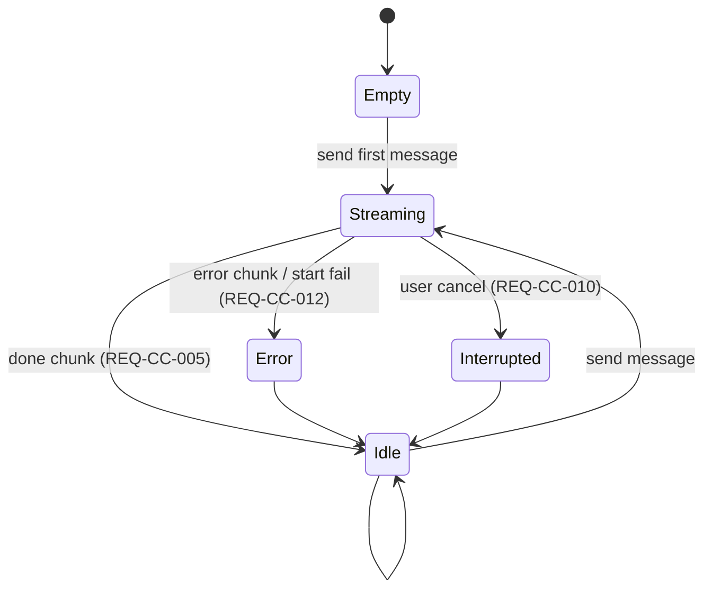
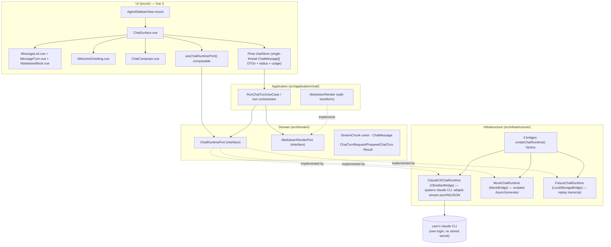

# Design — Chat core (P1)

Reproduces Claudian's core conversational loop (send → stream `text` chunks → `done`) inside
the Specorator DDD architecture, at **perceptual** (not pixel) parity, with Specorator
identity. Every claim cites the real Claudian solution under `D:\Projects\claudian-main`.

> **CHECKPOINT REQUIRED.** Part C drafts **ADR-CC-001** (status: *proposed*). A human must bless
> the `ChatRuntime` port shape (charter §6a, CLAR-CC-001) before `/spec:specify`. This design is
> complete and self-consistent, but the architectural seam it rests on is not yet accepted.

---

# Part A — UX

## A.1 Scope & the one user flow

P1 delivers exactly one flow: a logged-in `claude`-CLI user opens the agent sidebar, types a
message, watches the assistant reply stream token-by-token, and the turn finalises. No threads,
tabs, history, rich blocks, composer power, toolbar widgets, approvals (NG1–NG11). The surface
replaces the P0 empty `AgentPanelRoot` placeholder (REQ-CC-015).

Claudian sources reproduced: message stream + user/assistant render
(`MessageRenderer.ts`, `StreamController.ts:116`), the send-composer (`InputController.ts`,
`ui/textareaResize.ts`), and the empty/streaming/error/interrupt states (`messages.css`,
`input.css`). Frontend audit §3.1 "Message stream" and §3.3 "Composer core" are the behaviour
spec.

## A.2 Information architecture

The sidebar view (`AgentSidebarView`, `VIEW_TYPE_AGENT`) hosts a single chat surface, a flex
column filling the leaf:

```
┌─ specorator-agent-root (chat container) ───────────────┐
│  ┌─ message scroll region (flex:1, scroll-y) ───────┐  │
│  │   · welcome / empty state  (zero messages)        │  │
│  │   · message turns (user + assistant), gap 12px    │  │
│  │   · live streaming assistant turn (last)          │  │
│  └───────────────────────────────────────────────────┘  │
│  ┌─ composer (bottom, fixed) ────────────────────────┐  │
│  │   bordered rounded wrapper                         │  │
│  │     textarea (auto-grow, borderless, transparent)  │  │
│  │     toolbar row → [ send / stop ]                  │  │
│  └───────────────────────────────────────────────────┘  │
└─────────────────────────────────────────────────────────┘
```

This mirrors Claudian's `.claudian-messages` (scroll region) above `.claudian-input-container`
(composer at the bottom — the reason every Claudian dropdown opens *upward*; not relevant in P1
since there are no dropdowns). No header control strip in P1 (charter §4 names `header` as a P1
surface, but P1's only header content is the native view title "Specorator agent"; the toolbar
control strip is P6, NG4).

## A.3 States (empty / idle / streaming / error / interrupt)

The chat surface is a small state machine. Claudian drives the toolbar enabled-state from
runtime `isReady()` / `onReadyStateChange()` (`ChatRuntime.ts:25/43`); P1 reproduces the
visible states, simplified (no queue/steer — that is P4, NG3).

| State | Trigger | Visuals (Claudian parity) | Composer |
|---|---|---|---|
| **empty / welcome** | zero messages (REQ-CC-011) | centered greeting, `--text-muted`, weight-300; hidden on first send (`messages.css` `.claudian-welcome`, `.claudian-hidden`) | enabled, focused, empty |
| **idle** | ≥1 message, no turn streaming | message turns rendered; welcome hidden | enabled |
| **streaming** | turn in progress (REQ-CC-009) | live assistant turn grows token-by-token (`StreamController.ts:116`); a streaming/busy indicator; **send control becomes a stop control** | disabled for new send; Enter does not start a 2nd turn |
| **error** | `error` chunk or start failure (REQ-CC-012) | `error.content` rendered **inline in the conversation** (`StreamController.ts:194`), `--sp-error` color; return to idle | re-enabled |
| **interrupt** | user cancels a streaming turn (REQ-CC-010) | partial assistant turn marked **Interrupted** in red (`messages.css` `.claudian-interrupted`, `#d45d5d`); return to idle | re-enabled |

State diagram (full version in Part C §C.6 / the spec):



## A.4 Message turn UX

- **Roles are visually distinct** (REQ-CC-006, `messages.css`): the **user** turn is a bubble
  with a background, right-aligned (`align-self:flex-end`), `max-width:95%`, with the signature
  **clipped bottom-trailing corner** (`border-end-end-radius:4px`). The **assistant** turn is
  *transparent, full-width, left-aligned*, with a clipped bottom-leading corner
  (`border-end-start-radius:4px`). Assistant turns are **not** bubbles — this asymmetry is the
  parity-critical signature (frontend audit §3.1 "Parity-critical").
- **Content** renders with **minimal markdown** — paragraphs, inline code, line breaks — XSS-safe
  (REQ-CC-006, NFR-CC-008). `line-height:1.5`, tight paragraph margins (`0 0 8px`, last child 0),
  `unicode-bidi:plaintext` + `dir="auto"` for mixed RTL/LTR.
- **Streaming feel** (NFR-CC-014): assistant content grows as `text` chunks accumulate
  (`msg.content += chunk.content`, `StreamController.ts:135`), re-rendered incrementally. P1 may
  simplify Claudian's animation-frame-throttled renderer (`scheduleCurrentTextRender`,
  `StreamController.ts:698`) to a straightforward reactive re-render, **but keeps the render seam**
  so P2 can reintroduce throttling/rich blocks without restructuring (see Part C §C.5).
- **No** copy buttons, fork/rewind hover actions, duration footer, tool/thinking blocks in P1
  (those are P2/P3 — NG2). The optional `durationSeconds?` / `displayContent?` fields exist on
  `ChatMessage` but P1 does not render them.

## A.5 Composer UX (REQ-CC-007, REQ-CC-008)

- A single **bordered rounded wrapper** containing a **borderless, transparent, auto-growing**
  multi-line textarea + a bottom toolbar row whose only control is **send** (`input.css`
  `.claudian-input-wrapper` + `.claudian-input` + `.claudian-input-toolbar`; `textareaResize.ts`).
- **Keyboard contract** (REQ-CC-008, frontend audit keyboard map): **Enter** sends (when not
  Shift, not during IME composition — Claudian's `!e.shiftKey && !e.isComposing`); **Shift+Enter**
  inserts a newline; **Enter during IME composition** does not submit. **Esc** while streaming
  requests cancel (REQ-CC-010; Claudian shows "esc to interrupt" in the thinking hint).
- **Send/Stop affordance:** while idle the control sends; while streaming it becomes a **stop**
  control that calls `cancel()` (REQ-CC-009/010). Empty/whitespace-only input does not dispatch.
- **No** slash `/`, skills `$`, `@mention`, `#` instruction, `Shift+Tab` plan, `!` bang-bash,
  queue/steer row, attachments, file chips (all P4/P5 — NG3). The composer wrapper keeps the
  structural seams (context row, toolbar row) **collapsed/empty** so those phases grow in place.

## A.6 CLAR-CC-004 resolution — welcome serif identity & duration-footer microcopy

**Decision (architect, Part A — owner per workflow-state was ux-ui-designer; resolved here):**

1. **Keep a token-driven serif greeting.** The serif weight-300 greeting is a recognisable
   parity cue (frontend audit §3.1) and the `--sp-font-serif` token (Copernicus → Tiempos →
   Georgia → serif fallback) **already exists** in `src/ui/styles/tokens.css:79` from the AUX
   reuse base. The greeting renders in `--sp-font-serif` at `--sp-font-size-display` (28px),
   `--sp-font-weight-light` (300), `--sp-text-muted`. This is *perceptual* parity, not the
   literal "Copernicus" font (which we do not ship); the token degrades to Georgia/serif.
2. **Neutralise the microcopy under Specorator identity.** The greeting text is an i18n key
   (`agent.chat.welcome.greeting`), **not** the Claudian brand string. Recommended copy: a
   plain, brand-neutral greeting (e.g. *"How can I help?"*) — no Claudian name, no logo. Final
   wording is a brand-reviewer call at review; the design only fixes the *seam* (token + i18n
   key) and the visual treatment.
3. **Drop the "Baked for mm:ss" duration footer entirely from P1.** It is P2-adjacent
   (`durationSeconds`/`durationFlavorWord`, `chat.ts:55-57`; `FLAVOR_TEXTS`) and REQ-CC-011 needs
   only the empty/welcome state. The playful flavor-word microcopy is **not** reproduced in P1;
   if a later phase wants it, it is a brand decision then. No P1 component emits it (counter-
   metric: scope leakage — none).

## A.7 Accessibility (NFR-CC-002, WCAG 2.2 AA)

- The composer is fully keyboard-operable (Enter/Shift+Enter/Esc). Focus moves to the textarea
  on view open and returns there after a turn finalises.
- The streaming/busy indicator is announced (live region / `aria-live="polite"`) so a screen
  reader user hears the turn complete; the stop control has an accessible label.
- The message scroll region is focusable for keyboard scrolling; turns carry role-distinct
  semantics. Motion (any streaming/pulse animation) honours `prefers-reduced-motion` (tokens
  already collapse durations to `0s` under reduced-motion, `tokens.css:145`). Forced-colors and
  focus-visible rings inherit the token layer. Charter §1 "meet or beat Claudian's
  accessibility.css" — Claudian ships only focus rings; P1 adds the live-region + reduced-motion
  handling.

---

# Part B — UI

## B.1 Approach

Render through the **existing `--sp-*` token layer** (`src/ui/styles/tokens.css`), which survived
the P0 reboot intact (it is the AUX reuse base, charter §7). **No hardcoded hex** in components;
**no raw Obsidian var** leak (NFR-CC-012). Identity stays Specorator. The token layer already
carries most of what P1 needs (`--sp-radius-bubble-tail-user/assistant`, `--sp-font-serif`,
`--sp-error`, `--sp-msg`-adjacent spacing/radii); P1 adds only the few P1-specific surface
tokens below.

## B.2 Claudian CSS var → `--sp-*` token map (P1 surfaces)

`messages.css` + `input.css` + container/variables/header (charter §4 P1 surfaces). Existing
tokens are reused; **new** tokens are flagged.

| Surface | Claudian value (`claudian-main`) | `--sp-*` token | Status |
|---|---|---|---|
| message list gap | `gap:12px` (`messages.css:17`) | `--sp-msg-gap` → `var(--sp-space-5)` (12px) | **new alias** |
| message list padding | `padding:12px 0` | `var(--sp-space-5) 0` | reuse |
| message scrollbar | 6px thumb `--background-modifier-border` | `--sp-scrollbar-width` (6px) + `--sp-border` | **new** width token |
| user bubble bg | `rgba(0,0,0,0.3)` (`messages.css:54`) | `--sp-msg-user-bg` | **new** (token-driven, not raw hex) |
| user bubble radius | `border-radius:8px` | `--sp-radius-lg` (8px) | reuse |
| user clipped corner | `border-end-end-radius:4px` | `--sp-radius-bubble-tail-user` (4px) | reuse (exists) |
| assistant clipped corner | `border-end-start-radius:4px` | `--sp-radius-bubble-tail-assistant` (4px) | reuse (exists) |
| message max-width (user) | `max-width:95%` | `--sp-msg-user-max-width` (95%) | **new** |
| content line-height | `line-height:1.5` | `--sp-line-height-normal` (1.5) | reuse |
| content paragraph margin | `0 0 8px` | `var(--sp-space-4)` | reuse |
| interrupt color | `#d45d5d` (`messages.css:82`) | `--sp-interrupt` | **new** (not `--sp-error`; distinct red) |
| error inline color | `❌ Error:` muted/red | `--sp-error` | reuse (exists) |
| welcome greeting font | serif stack (`messages.css:38`) | `--sp-font-serif` | reuse (exists) |
| welcome greeting size/weight | 28px / 300 | `--sp-font-size-display` / `--sp-font-weight-light` | reuse |
| welcome greeting color | `--text-muted` | `--sp-text-muted` | reuse |
| input wrapper border | `1px var(--background-modifier-border)` | `--sp-border` | reuse |
| input wrapper radius | `6px` | `--sp-radius-md` (6px) | reuse |
| input wrapper min-height | `min-height:140px` | `--sp-input-min-h` (140px) | **new** |
| input wrapper bg | `--background-primary` | `--sp-bg-primary` | reuse |
| textarea (borderless/transparent) | `border:none; background:transparent` | (no token — structural) | — |
| textarea font-size | `14px` | `--sp-font-size-base` (14px) | reuse |
| textarea min/max height | `--claudian-textarea-min/max-height` (60px / none) | `--sp-textarea-min-h` (60px) / `--sp-textarea-max-h` | **new** |
| toolbar row padding | `4px 6px 6px 6px` | `--sp-space-*` composite | reuse |
| busy/streaming indicator | brand italic pulse (`thinking.css` ref) | `--sp-accent` + `--sp-anim-pulse` (reduced-motion aware) | reuse accent; **new** pulse keyframe (or static) |

**New tokens to add (Part B → tokens.css, dev stage):** `--sp-msg-gap`, `--sp-scrollbar-width`,
`--sp-msg-user-bg`, `--sp-msg-user-max-width`, `--sp-interrupt`, `--sp-input-min-h`,
`--sp-textarea-min-h`, `--sp-textarea-max-h`. Each defaults to an Obsidian theme lookup or a
token-layer literal (never a raw hex in a component). `--sp-msg-user-bg` and `--sp-interrupt`
are the only color literals; they live in the token layer only (perceptual parity with
`rgba(0,0,0,0.3)` and `#d45d5d`), mirroring how the brand hex is inlined once in `tokens.css`.

## B.3 Identity & brand

Identity stays **Specorator** (charter §1 "does NOT mean copying assets or the Claudian
name/logo"). The provider-brand accent (`--sp-accent` → `--sp-brand`, `tokens.css:61`) drives any
streaming/busy accent; **no `#D97757` literal** appears in a component (NFR-CC-012). The
`[data-provider="claude"]` alias already exists; P1 sets `data-provider="claude"` on the chat
root so the accent resolves, but the visible product is Specorator.

## B.4 CLAR-CC-005 resolution — minimal-markdown render seam

**Decision (architect): ship a minimal safe inline renderer behind a thin `MarkdownRenderPort`
seam in P1, with the Obsidian `MarkdownRenderer.render` backing deferred to P2.**

Rationale:

- REQ-CC-006 requires only **paragraphs, inline code, line breaks** rendered XSS-safe
  (NFR-CC-008). REQ-CC-004 re-renders the assistant message on **every accumulated `text` chunk**,
  so the renderer must tolerate cheap, frequent re-render during streaming. Obsidian's
  `MarkdownRenderer.render` (async, component-scoped, heavy) is overkill for P1's three
  constructs and would couple the P1 streaming path to a comparatively expensive async call per
  chunk.
- **But** introducing the *port seam* now (a one-method `MarkdownRenderPort:
  render(markdown): SafeRenderResult` — DTO, never a DOM-injection sink) costs almost nothing and
  prevents a churny refactor in P2 when the full Obsidian-backed renderer + rich blocks land.
- **P1 implementation:** a small, pure, **safe** markdown→structured-nodes transform (paragraphs,
  inline `code`, line breaks) consumed by a Vue component that renders the structured nodes
  declaratively — **no `v-html`, no `innerHTML`** (NFR-CC-004/008, CLAUDE.md DOM rules). The
  transform is provider-agnostic and lives in domain/application (testable); the Vue render is
  XSS-safe by construction.
- **P2 implementation:** the same `MarkdownRenderPort` is re-backed by an `ObsidianBridge` impl
  wrapping `MarkdownRenderer.render` (frontend audit's named `MarkdownRenderPort`), and the Mock/
  LocalStorage bridges keep the lightweight transform. The port shape does not change.

This keeps the streaming render seam (Part A §A.4, Part C §C.5) and satisfies NFR-CC-008 with the
smallest P1 surface. The port is **declared** in P1 (one method) but its only P1 backing is the
safe minimal renderer.

## B.5 Parity-screenshot plan (NFR-CC-011/012/013, charter §5.1)

Acceptance method (human-run at review, not by this design):

- Capture side-by-side `claudian-main` vs the rebuilt P1 chat surface at **320 / 520 / 720 px**
  widths, **light + dark** theme, for each P1 state: **empty/welcome, idle (one user + one
  assistant turn), streaming (mid-turn), error (inline error), interrupt (Interrupted turn)**.
- Store under `specs/chat-core/parity-screenshots.md` (mirrors the AUX approach, charter §5.1).
- Pair with a **baseline-capture task** in `tasks.md` (NFR-CC-011): capture the `claudian-main`
  baseline on its `next`/reference checkout *before* P1 implementation so the comparison is
  apples-to-apples.
- The `reviewer` / `brand-reviewer` confirms (a) side-by-side "reads as the same product"
  (perceptual parity), (b) the token-map (Part B §B.2) has zero raw-var/hex leaks in components
  (the `lint-style-tokens` guard, AUX, regrowing), and (c) the interaction parity (Enter/Shift+
  Enter/Esc, empty→streaming→idle→error/interrupt) asserted in component tests (NFR-CC-013).

---

# Part C — Architecture

> Per the Arc42-style baseline: this repo has **no `arc42-questionnaire.md`** for chat-core, so
> Part C derives the feature-specific architecture directly from PRD-CC-001, the audits, and the
> in-force ADRs (ADR-001 DDD, ADR-004 `Result`, ADR-008 narrow ports, ADR-PSR-001/002).

## C.1 System overview



Inward-only imports (ADR-001): `domain ← application ← infrastructure ← ui`; the plugin layer
wires everything. The UI consumes the runtime **only** through `ChatRuntimePort`'s InjectionKey
(REQ-CC-002); no `obsidian` / `node:*` / `src/infrastructure/agent/**` import under `src/ui/**`.

## C.2 Components & responsibilities

| Component | Layer | Responsibility (single) | Reproduces (Claudian) |
|---|---|---|---|
| `ChatRuntimePort` | domain (`src/domain/ports/`) | The streaming + lifecycle port contract (P1 subset). | `ChatRuntime.ts:20` (subset) |
| `StreamChunk` union, `ChatMessage`, `ChatTurnRequest`, `PreparedChatTurn`, `ChatRuntimeQueryOptions`, `ChatRuntimeEnsureReadyOptions`, `UsageInfo` | domain (`src/domain/chat/`) | The normalized chat types (P1 subset; full union member names declared). | `chat.ts:39/137/165`, `runtime/types.ts:45/56/64/73` |
| `MarkdownRenderPort` | domain (`src/domain/ports/`) | One-method safe markdown→structured-nodes seam (CLAR-CC-005). | frontend audit `MarkdownRenderPort` |
| `RunChatTurnUseCase` (turn orchestrator) | application (`src/application/chat/`) | Coordinate one turn: `prepareTurn` → `query` → drive chunk handling into the store; finalise on `done`; map `error`/cancel. Returns `Result` at its boundary. | `StreamController.handleStreamChunk` (`:116`) + `InputController.sendMessage` |
| `safeMarkdownRender` | application/domain | Pure transform: markdown (¶/inline-code/breaks) → structured nodes. P1 backing of `MarkdownRenderPort`. | `MessageRenderer.renderContent` (minimal subset) |
| `chatStore` (Pinia) | ui (`src/ui/stores/`) | Single-thread `ChatMessage[]` (plain DTOs), `status` (empty/idle/streaming/error/interrupt), live-turn id, `usage` DTO. No domain instances cross the boundary (ADR-003). | `ChatState` (`features/chat/state/ChatState.ts`) — single thread only |
| `useChatRuntimePort()` | ui (`src/ui/composables/`) | Inject the runtime port via `CHAT_RUNTIME_PORT`. | n/a (Specorator port pattern) |
| `ChatSurface.vue` | ui | Compose message region + composer; own the state-machine wiring; mount welcome vs list. | `ChatView` container |
| `MessageList.vue` / `MessageTurn.vue` | ui | Render `ChatMessage[]` as role-distinct turns. | `MessageRenderer.addMessage` / role branch |
| `MarkdownBlock.vue` | ui | Render structured nodes declaratively (no `v-html`). | `MessageRenderer.renderContent` |
| `WelcomeGreeting.vue` | ui | Empty/welcome state (serif token, i18n greeting). | `messages.css` `.claudian-welcome` |
| `ChatComposer.vue` | ui | Auto-grow textarea + send/stop; Enter/Shift+Enter/Esc/IME. | `InputController` + `textareaResize.ts` |
| `createChatRuntime()` (per bridge) | infrastructure | Factory returning a fresh `ChatRuntimePort` instance. | `ProviderRegistration.createRuntime` (`providers/types.ts:63`) |
| `ClaudeCliChatRuntime` | infrastructure (`src/infrastructure/agent/claude/`) | Spawn the user's `claude` CLI, adapt stream-json/NDJSON → `StreamChunk`; no stored secret. | deleted P0 `ClaudeSubprocessAdapter` + `StreamDeltaReducer` (charter §7 reference) |
| `MockChatRuntime` | infrastructure (mock) | Scripted in-memory `AsyncGenerator<StreamChunk>`. | backend audit bridge row |
| `FixtureChatRuntime` | infrastructure (localStorage) | Replay a fixture transcript; no subprocess. | backend audit bridge row |

## C.3 Domain types (the StreamChunk union + ChatMessage — P1 subset)

Declared to mirror Claudian member names so P2+ is purely additive (REQ-CC-001a, `chat.ts:137`).
The **full** union is declared; P1 **emits** only the marked subset.

```ts
// src/domain/chat/StreamChunk.ts — mirrors chat.ts:137 member names exactly.
export type StreamChunk =
  // ---- P1 EMITS this subset ----
  | { type: 'assistant_message_start'; itemId?: string }   // optional, P1
  | { type: 'text'; content: string }                      // P1 — accumulate
  | { type: 'error'; content: string }                     // P1 — inline error
  | { type: 'done' }                                       // P1 — terminator
  | { type: 'usage'; usage: UsageInfo; sessionId?: string | null } // P1 (should)
  // ---- declared now, EMITTED in later phases (additive, no rename) ----
  | { type: 'user_message_start'; content: string; itemId?: string }
  | { type: 'thinking'; content: string }                       // P2
  | { type: 'tool_use'; id: string; name: string; input: Record<string, unknown> } // P2
  | { type: 'tool_result'; id: string; content: string; isError?: boolean; toolUseResult?: unknown } // P2
  | { type: 'tool_output'; id: string; content: string }        // P2
  | { type: 'notice'; content: string; level?: 'info' | 'warning' }
  | { type: 'context_compacted' }                               // P3
  | { type: 'async_subagent_result'; agentId: string; status: 'completed' | 'error'; result?: string } // P2/P9
  | { type: 'subagent_tool_use'; subagentId: string; id: string; name: string; input: Record<string, unknown> }
  | { type: 'subagent_tool_result'; subagentId: string; id: string; content: string; isError?: boolean; toolUseResult?: unknown };
```

> **Note (ground-truth):** there is **no** `text-delta` and **no** terminal `final` member —
> `text` carries incremental content, `done` terminates (`StreamController.ts:200`). The P1
> subset is the *only* part the runtime emits; declaring the rest now is documentation + future-
> proofing, not P1 behaviour. (P1 may declare only the subset and add the rest in P2 — either is
> compliant; declaring the full union now is the lower-churn option and is recommended.)

```ts
// src/domain/chat/ChatMessage.ts — P1 fields = chat.ts:39 subset.
export interface ChatMessage {
  id: string;
  role: 'user' | 'assistant';
  content: string;
  timestamp: number;
  displayContent?: string;     // optional (P1 may set, does not render)
  durationSeconds?: number;    // optional (P1 does not render — see CLAR-CC-004)
  // contentBlocks?, toolCalls?, images? — EXCLUDED from P1 (regrow P2+).
}
```

`ChatTurnRequest` (P1 uses `{ text }`), `PreparedChatTurn` (`{ request, persistedContent,
prompt, isCompact, mcpMentions }`), `ChatRuntimeQueryOptions`, `ChatRuntimeEnsureReadyOptions`,
and `UsageInfo` mirror `runtime/types.ts:45/56/64/73` and `chat.ts:165`. P1 may carry the full
shapes but only populates the fields it uses.

## C.4 The ChatRuntimePort (P1 surface) — see ADR-CC-001

```ts
// src/domain/ports/ChatRuntimePort.ts — streaming + lifecycle subset of ChatRuntime.ts:20.
export interface ChatRuntimePort {
  readonly providerId: ProviderId;
  prepareTurn(request: ChatTurnRequest): PreparedChatTurn;
  ensureReady(options?: ChatRuntimeEnsureReadyOptions): Promise<boolean>;
  query(
    turn: PreparedChatTurn,
    conversationHistory?: ChatMessage[],
    queryOptions?: ChatRuntimeQueryOptions,
  ): AsyncGenerator<StreamChunk>;
  cancel(): void;
  getSessionId(): string | null;
  resetSession(): void;
  onReadyStateChange(listener: (ready: boolean) => void): Unsubscriber;
  isReady(): boolean;
}
```

The callback setters (`ChatRuntime.ts:48-54`), `rewind` (:47), `steer` (:38), subagent hooks,
`getCapabilities`, `getSupportedCommands` are **deferred to P2–P4/P9** and grow additively
(ADR-CC-001 §3). The port gets its own `CHAT_RUNTIME_PORT` InjectionKey and `useChatRuntimePort()`
composable (one consumer = the chat turn path).

## C.5 Data flow — primary scenario (send → stream → done)

```mermaid
sequenceDiagram
    participant U as User
    participant C as ChatComposer.vue
    participant S as chatStore (Pinia)
    participant O as RunChatTurnUseCase
    participant P as ChatRuntimePort
    U->>C: type text, press Enter (not Shift, not IME)
    C->>S: append user ChatMessage; clear composer; status=streaming
    S->>O: runTurn(text, history)
    O->>P: ensureReady()
    alt not ready
        P-->>O: false
        O->>S: append error ChatMessage (start-fail) + NotificationPort notice; status=error→idle
    else ready
        O->>P: prepareTurn({ text })  →  PreparedChatTurn
        O->>P: query(prepared, history)  (AsyncGenerator)
        O->>S: create live assistant ChatMessage (empty)
        loop for await chunk
            alt text
                P-->>O: { type:'text', content }
                O->>S: liveMsg.content += content (incremental render — REQ-CC-004)
            else usage
                P-->>O: { type:'usage', usage, sessionId? }
                O->>S: store usage DTO (no content change — REQ-CC-005a)
            else error
                P-->>O: { type:'error', content }
                O->>S: render content inline; status=error (REQ-CC-012)
            else done
                P-->>O: { type:'done' }
                O->>S: finalise liveMsg; status=idle (REQ-CC-005)
            end
        end
    end
```

**Cancel path (REQ-CC-010):** user presses Esc / clicks Stop → `O` calls `P.cancel()`, stops
applying further `text` chunks, marks the partial assistant message **Interrupted**, status→idle.

**Render seam:** the store exposes `liveMsg.content`; `MarkdownBlock.vue` re-renders it reactively
on each accumulated chunk via `MarkdownRenderPort` (safe transform). P1 may re-render directly;
the seam lets P2 reintroduce Claudian's animation-frame throttling (`StreamController.ts:698`)
without restructuring (Part A §A.4).

## C.6 Bridge wiring (three bridges, ADR-008 + REQ-CC-014)

Unlike the six stateless core ports (the bridge *is* the port), a `ChatRuntimePort` instance is
**stateful per conversation**, so each bridge exposes a **factory** `createChatRuntime():
ChatRuntimePort` (ADR-CC-001 §6):

| Bridge | `createChatRuntime()` returns | Subprocess? |
|---|---|---|
| `ObsidianBridge` | `ClaudeCliChatRuntime` — spawns the resolved `claude` CLI, adapts stream-json/NDJSON → `StreamChunk`, uses the user's own login, **stores no secret** (REQ-CC-013, NFR-CC-006) | yes (desktop-only) |
| `MockBridge` | `MockChatRuntime` — scripted `AsyncGenerator<StreamChunk>` (`text…done`); `npm run dev` works | no |
| `LocalStorageBridge` | `FixtureChatRuntime` — replays a fixture transcript; GitHub Pages demo works | no |

`AgentSidebarView` (and `src/ui/main.ts` for standalone) calls the bridge factory once and
`app.provide(CHAT_RUNTIME_PORT, runtime)` alongside the six core ports (REQ-CC-015), replacing
the P0 `AgentPanelRoot` empty placeholder with `ChatSurface.vue`.

The CLI/Node discovery + PATH building is **internal to** `ClaudeCliChatRuntime` (no other
consumer → no separate port, backend audit "Port placement"). It references the deleted P0
`ClaudeSubprocessAdapter`/`StreamDeltaReducer` shape (charter §7) but is a clean reimplementation,
not a copy. Note the Electron `AbortSignal`-to-`spawn` gotcha (`customSpawn.ts` — manual abort,
no signal passed) is reproduced in P1's adapter for `cancel()`.

## C.7 The Result / streaming-error boundary (NFR-CC-003)

- **Discrete operations** return their natural type / `Result<T,E>` (ADR-004): application use
  cases (`RunChatTurnUseCase.runTurn`) return `Result` at their boundary; `ensureReady` mirrors
  Claudian and returns `Promise<boolean>`.
- **Streaming failure is the `{ type:'error'; content }` `StreamChunk` member** (`chat.ts:145`),
  **not** a per-chunk `Result`. This is the single deliberate exception, blessed by ADR-CC-001.
  A *start* failure (CLI missing / not logged in) surfaces as `ensureReady → false` or a synthetic
  `error` chunk + a `NotificationPort` notice (friendly message), then status→idle (REQ-CC-012).
- **No throwing across the port** for expected failures; no `window.confirm`/`alert`/`v-html`/
  `innerHTML` anywhere on the chat path (NFR-CC-004/008, CLAUDE.md).

## C.8 Declared P1 ports (audit-named) & deferrals

| Port | P1 status | Rationale |
|---|---|---|
| **`ChatRuntimePort`** | **Declared + Claude backing** | The P1 seam (ADR-CC-001). One consumer (turn path). |
| **`StreamChunk` union (type)** | **Declared** (P1 subset emitted) | Mirrors `chat.ts:137`; additive for P2+. |
| **`MarkdownRenderPort`** | **Declared + minimal safe backing** | CLAR-CC-005 — seam now, Obsidian backing P2 (Part B §B.4). |
| **`ProviderRegistryPort`** | **DEFERRED to P9** | P1 ships ONE provider created directly via the bridge factory. Stubbing a registry costs more than it saves for a single provider (NG6 — "kept only if free"; it is not free, so defer). Capabilities are not needed in P1 (no toolbar widgets, NG4). |
| `ProviderHistoryPort`, `HomeFsPort`, `McpConfigStorePort`, `McpClientPort`, `SecretStorePort`, `ApprovalRuleStorePort` | **OUT of P1** | P3/P7/P8/P9 + secret-defer (CLAR-CC-002, NFR-CC-006). |

`TranslationPort` already exists (P0); the welcome greeting + composer placeholder use it.

## C.9 Edge cases (seed for the spec stage)

1. **Empty/whitespace-only composer** → send is a no-op; no user message, no `query` (REQ-CC-007).
2. **Enter during IME composition** → no submit (`isComposing` guard, REQ-CC-008).
3. **Shift+Enter** → newline, no submit (REQ-CC-008).
4. **Send while streaming** → blocked; no 2nd turn started (REQ-CC-009).
5. **`done` arrives with zero `text` chunks** → assistant message finalises empty (or is dropped —
   spec to decide; recommend: finalise empty, idle).
6. **`error` chunk mid-stream after partial text** → inline error appended; partial text retained;
   idle (REQ-CC-012).
7. **`ensureReady()` returns false** (CLI missing / not logged in) → start-fail path; friendly
   `NotificationPort` notice; no live assistant message left dangling (REQ-CC-012).
8. **Cancel before any `text`** → interrupted with empty content; idle (REQ-CC-010).
9. **Cancel after `done` already applied** → no-op (turn already finalised).
10. **`usage` chunk before `done`** → usage DTO updated; no content mutation (REQ-CC-005a).
11. **`usage` chunk with a foreign `sessionId`** → ignored (mirror `StreamController.ts:219` guard).
12. **Very long single `text` chunk / very many small chunks** → incremental render must not batch-
    on-complete (NFR-CC-014); reactive re-render tolerates high chunk frequency.
13. **Generator throws (unexpected)** → caught by the use case, mapped to a synthetic `error`
    chunk + notice; never an unhandled rejection across the port (NFR-CC-003).
14. **Markdown edge cases** — empty content, content that is only whitespace, unbalanced inline
    code backtick, a literal `<` / `&` in content → rendered as text, never as HTML (NFR-CC-008).
15. **View closed mid-stream** → on `onClose`, the runtime is cancelled and the generator
    abandoned; no writes to an unmounted store.
16. **Locale boundary** — greeting + placeholder resolve via `TranslationPort`; missing key falls
    back to `en` (existing i18n behaviour).

## C.10 Observability (seed for the spec stage)

- **LoggerPort** (console-only, filtered by `logLevel`): turn start (provider, history length),
  `ensureReady` result, turn finalise (`done`), cancel, error chunk, generator throw. No message
  *content* logged (privacy — NFR-CC-006 posture).
- **NotificationPort**: friendly user-facing notices for start failures only (CLI missing / not
  logged in) — sticky error notice; not for normal inline `error` chunks (those render inline).
- No metrics/traces/alerts infra in this repo yet (steering docs unpopulated — see PRD NFR note);
  P1 stays with structured logs. Any numeric latency target is deferred (NFR-CC-014 qualitative).

## C.11 Performance budgets (NFR-CC-014)

Inherited from PRD-CC-001: **token-by-token incremental render observable per `text` chunk**, no
perceptible batch-on-complete vs the captured `claudian-main` baseline (NFR-CC-011); cancel is
responsive. No numeric latency threshold (steering unpopulated); qualitative against baseline.

## C.12 Compatibility (NFR-CC-007/009)

`manifest.json` (`id`, `version`, `minAppVersion 1.12.7`) **unchanged**. No backwards-compat / no
migration (charter CHARTER-REQ-FRESH); any chat state loads-or-defaults; **no stored secret**
(NFR-CC-006). Desktop-only (subprocess provider). No `data.json` secret writes.

## C.13 Key decisions

| # | Decision | Rationale | ADR |
|---|---|---|---|
| D1 | `ChatRuntimePort` = async-generator `query` + per-phase setter growth (P1 streaming+lifecycle subset) | Parity with `ChatRuntime.ts:20`; bends ADR-008 method-only style, blessed | **ADR-CC-001 (proposed)** |
| D2 | Streaming error = `error` `StreamChunk` member, not per-chunk `Result` | Mirrors `chat.ts:145`; generators can't return `Result` per-chunk cleanly | ADR-CC-001 §1 |
| D3 | `StreamChunk` = one union mirroring Claudian names; P1 emits subset | Additive P2+ (REQ-CC-001a) | ADR-CC-001 §4 |
| D4 | Runtime is bridge-provided via `createChatRuntime()` factory | Stateful per-conversation; not "bridge is port" | ADR-CC-001 §6 |
| D5 | `MarkdownRenderPort` seam in P1; minimal safe backing; Obsidian backing P2 | Cheap seam now, no churn in P2 (CLAR-CC-005) | — (Part B §B.4) |
| D6 | `ProviderRegistryPort` DEFERRED to P9 (single provider, no capabilities needed) | Stub isn't free; NG6 "only if free" | — (Part C §C.8) |
| D7 | Keep token-driven serif greeting; neutral Specorator microcopy; drop duration footer | CLAR-CC-004; `--sp-font-serif` already exists | — (Part A §A.6) |
| D8 | Single-thread `ChatMessage[]` in Pinia (DTOs only, ADR-003) | No threads/Conversation in P1 (NG1) | — |

## C.14 Rejected alternatives

- **Per-chunk `Result<StreamChunk,E>`** — doubles the discriminant, forces `result.ok` on every
  normal chunk, makes P2's chunk-`switch` harder. Rejected (ADR-CC-001 Option C).
- **Observable/listener-based `query` returning `Result<StreamHandle>`** — diverges from
  Claudian's real solution (maintainer forbade re-inventing); more machinery, no parity gain.
  Rejected (ADR-CC-001 Option B).
- **Chat methods on an existing core port / aggregate port** — violates one-port-one-consumer;
  reintroduces deleted `IBridge`/`useBridge`. Rejected (ADR-CC-001 Option D).
- **Full `ProviderRegistration` (capabilities/chatUIConfig/reconcilers/history) in P1** — that is
  the P9 registry surface (`providers/types.ts:55`); P1 needs one runtime, not routing. Deferred.
- **Obsidian `MarkdownRenderer.render` per `text` chunk in P1** — heavy async per chunk for three
  markdown constructs; couples streaming to an expensive call. Deferred to P2 behind the same
  port (CLAR-CC-005).

## C.15 Test-scenario seam (for QA / spec stage)

Each maps to ≥1 REQ; the QA agent turns these into automated tests (PageObjects + `data-testid`,
ADR-009; coverage 80/70/80/80):

- **Port contract** — Mock runtime scripted `["Hel","lo"]`+`done`; iterate `query`; assert order,
  terminator, concatenation = `"Hello"` (REQ-CC-001, 001a, 014).
- **Port surface** — interface declares exactly the nine members; no setter/rewind/steer/subagent
  (REQ-CC-002a; ADR-CC-001 compliance).
- **Dispatch** — non-empty send appends user msg, clears composer, calls `prepareTurn` once,
  starts one `query` with history (REQ-CC-003).
- **Accumulate** — `["Hel","lo"," world"]` → content observable per tick → `"Hello world"` before
  `done` (REQ-CC-004, NFR-CC-014).
- **Finalise** — `done` finalises, idle, composer re-enabled; no "final" chunk consumed (REQ-CC-005).
- **Usage** — usage chunk updates usage DTO, no content change; foreign sessionId ignored (REQ-CC-005a).
- **Render** — user/assistant distinct `data-testid` + treatment; inline `code` renders as code
  element; no `v-html`/`innerHTML` (REQ-CC-006, NFR-CC-008).
- **Composer** — Enter sends; Shift+Enter newline; Enter-in-IME no submit; empty no-op
  (REQ-CC-007, 008).
- **Busy** — send/Enter blocked while streaming; busy indicator visible; re-enabled after `done`
  (REQ-CC-009).
- **Cancel** — `cancel()` invoked, no further chunk mutates, partial marked Interrupted, idle
  (REQ-CC-010).
- **Empty/welcome** — visible at zero messages; hidden after first send (REQ-CC-011).
- **Error** — scripted `error` chunk (or `ensureReady→false`) → inline error, idle, re-enabled, no
  blocking dialog / no innerHTML (REQ-CC-012).
- **Claude provider** — runtime spawns only the resolved `claude` CLI; adapts output to chunks; no
  secret read/persisted (REQ-CC-013, NFR-CC-006) — infra-level test.
- **Bridges** — all three supply a runtime; mock/localStorage yield without subprocess; `npm run
  dev` chats against mock (REQ-CC-014).
- **Mount** — sidebar shows the chat surface instead of `agent-panel-empty`; `CHAT_RUNTIME_PORT`
  provided alongside the six core ports (REQ-CC-015).

## C.16 Requirements coverage (Part C)

| REQ | Covered by |
|---|---|
| REQ-CC-001 / 001a | §C.3 types, §C.4 port, ADR-CC-001 |
| REQ-CC-002 / 002a | §C.1 overview, §C.4 port surface, ADR-CC-001 §5/compliance |
| REQ-CC-003 | §C.5 data flow |
| REQ-CC-004 | §A.4, §C.5 render seam |
| REQ-CC-005 / 005a | §C.5, §C.9 edge cases |
| REQ-CC-006 | §A.4, Part B token map, §B.4 markdown seam |
| REQ-CC-007 / 008 | §A.5 composer |
| REQ-CC-009 / 010 | §A.3 states, §C.5 cancel path |
| REQ-CC-011 | §A.3, §A.6 (CLAR-CC-004) |
| REQ-CC-012 | §A.3, §C.7 boundary |
| REQ-CC-013 | §C.2, §C.6 Claude runtime |
| REQ-CC-014 | §C.6 bridges |
| REQ-CC-015 | §C.6 mount |
| NFR-CC-001..014 | §C.1 (DDD), §A.7 (a11y), §C.7 (Result boundary), §B (tokens/parity), §C.10/11/12 |
