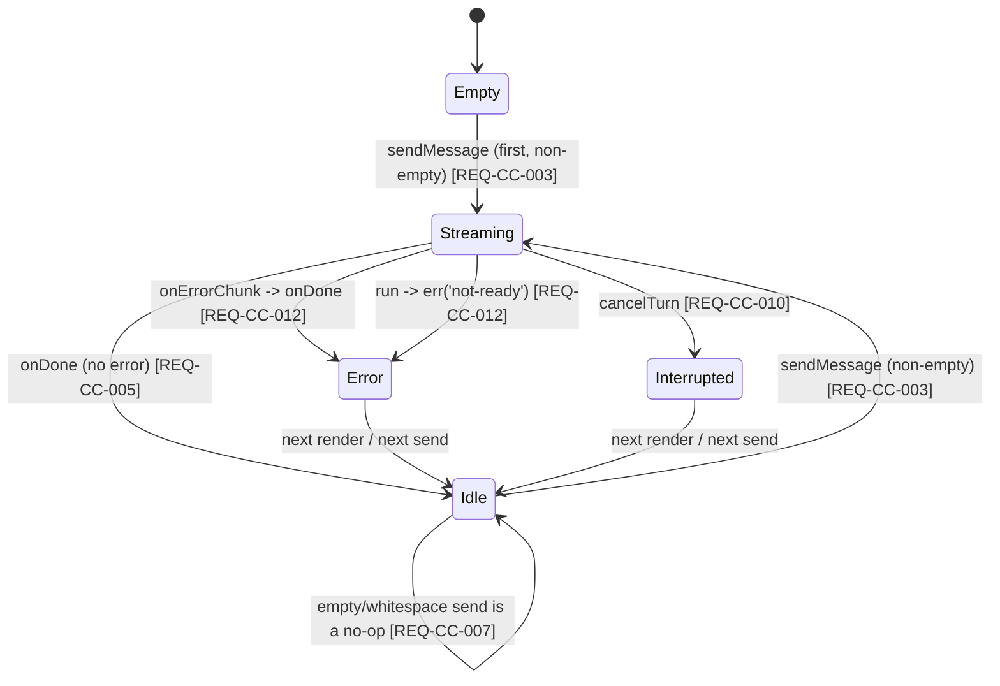

# Specification — Chat core (P1)

Implementation-ready contracts for P1. Every contract is grounded in `design.md` (DESIGN-CC-001),
the human-blessed **ADR-CC-001**, and Claudian's real code under `D:\Projects\claudian-main`
(cited inline). Two independent teams should build the same thing from this document.

> **Conventions in force (do not relax):** DDD inward-only imports (ADR-001, `domain ←
> application ← infrastructure ← ui`); narrow ports + 3 bridges (ADR-008); `Result<T,E>` at
> discrete/use-case boundaries (ADR-004); streaming failure = the `error` `StreamChunk` member,
> **not** per-chunk `Result` (ADR-CC-001 §1); Vue `<script setup>` only (ADR-003); no `obsidian`
> / `node:*` import under `src/ui/**` (NFR-CC-001); no `v-html`/`innerHTML`/`window.confirm`
> (NFR-CC-004/008); markdown via `MarkdownRenderPort` + a safe renderer (CLAR-CC-005); coverage
> 80/70/80/80 (NFR-CC-005); `--sp-*` token parity, no component hex (NFR-CC-012); `manifest.json`
> untouched (NFR-CC-007); **no stored secret** (NFR-CC-006).

This spec defines **23 spec items** across nine groups (SPEC-CC-001..023). The Tasks stage
(`planner`) decomposes them into `T-CC-NNN`; the QA stage turns the TEST-CC-NNN scenarios
(§9) into automated tests.

---

## 0. Spec-item index

| Spec item | Title | Layer | REQ links |
|---|---|---|---|
| SPEC-CC-001 | `ChatRuntimePort` interface | domain | REQ-CC-001, 002a; ADR-CC-001 |
| SPEC-CC-002 | `StreamChunk` discriminated union | domain | REQ-CC-001a; ADR-CC-001 §4 |
| SPEC-CC-003 | `UsageInfo` (P1 fields) | domain | REQ-CC-005a |
| SPEC-CC-004 | `ChatMessage` | domain | REQ-CC-006 |
| SPEC-CC-005 | `ChatTurnRequest` / `PreparedChatTurn` | domain | REQ-CC-003 |
| SPEC-CC-006 | `ChatRuntimeQueryOptions` / `ChatRuntimeEnsureReadyOptions` / `ProviderId` | domain | REQ-CC-001, 002a |
| SPEC-CC-007 | `MarkdownRenderPort` + `MarkdownNode` | domain | REQ-CC-006, NFR-CC-008; CLAR-CC-005 |
| SPEC-CC-008 | `CHAT_RUNTIME_PORT` / `MARKDOWN_RENDER_PORT` InjectionKeys | infra | REQ-CC-002, 015 |
| SPEC-CC-009 | `@/domain/ports` barrel re-exports | domain | REQ-CC-001a, 002 |
| SPEC-CC-010 | `ClaudeCliChatRuntime` (spawn + NDJSON reduce) | infra | REQ-CC-013, NFR-CC-006 |
| SPEC-CC-011 | `MockChatRuntime` | infra | REQ-CC-014 |
| SPEC-CC-012 | `FixtureChatRuntime` | infra | REQ-CC-014 |
| SPEC-CC-013 | `createChatRuntime()` per-bridge factory | infra | REQ-CC-014; ADR-CC-001 §6 |
| SPEC-CC-014 | `safeMarkdownRender` transform | application | REQ-CC-006, NFR-CC-008 |
| SPEC-CC-015 | `RunChatTurnUseCase` (turn orchestrator) | application | REQ-CC-003..005a, 010, 012, NFR-CC-003 |
| SPEC-CC-016 | `chatStore` (Pinia) | ui | REQ-CC-003..012 |
| SPEC-CC-017 | `useChatRuntimePort()` / `useMarkdownRenderPort()` composables | ui | REQ-CC-002 |
| SPEC-CC-018 | `ChatSurface.vue` + state machine | ui | REQ-CC-009..012, 015 |
| SPEC-CC-019 | `MessageList.vue` / `MessageTurn.vue` / `MarkdownBlock.vue` | ui | REQ-CC-004, 006, 010, 012 |
| SPEC-CC-020 | `WelcomeGreeting.vue` | ui | REQ-CC-011 |
| SPEC-CC-021 | `ChatComposer.vue` (keyboard contract) | ui | REQ-CC-007, 008, 009 |
| SPEC-CC-022 | `AgentSidebarView` + `src/ui/main.ts` mount/provide | plugin/ui | REQ-CC-015 |
| SPEC-CC-023 | `--sp-*` token additions | ui (styles) | NFR-CC-012, REQ-CC-006/007/011 |

---

# 1. Domain types & port (SPEC-CC-001..009)

All types live in `src/domain/chat/`; the two ports in `src/domain/ports/`. No `obsidian`,
no `node:*`, no Vue, no class — these are pure interfaces/unions (ADR-001).

## SPEC-CC-001 — `ChatRuntimePort` (`src/domain/ports/ChatRuntimePort.ts`)

**REQ:** REQ-CC-001, REQ-CC-002a · **ADR:** ADR-CC-001 (Decision block, lines 78–92).
**Claudian ground-truth:** the streaming + lifecycle subset of `ChatRuntime.ts:20` — members
`providerId` (:21), `prepareTurn` (:24), `onReadyStateChange` (:25), `ensureReady` (:32),
`query` (:33), `cancel` (:39), `resetSession` (:40), `getSessionId` (:41), `isReady` (:43).

### Signature (exact — copy verbatim)

```ts
import type { Unsubscriber } from './shared';
import type { ProviderId } from '@/domain/chat/ProviderId';
import type { StreamChunk } from '@/domain/chat/StreamChunk';
import type { ChatMessage } from '@/domain/chat/ChatMessage';
import type {
  ChatTurnRequest,
  PreparedChatTurn,
  ChatRuntimeQueryOptions,
  ChatRuntimeEnsureReadyOptions,
} from '@/domain/chat/ChatTurn';

/**
 * The P1 streaming + lifecycle subset of Claudian's ChatRuntime (ChatRuntime.ts:20),
 * blessed by ADR-CC-001. EXACTLY nine members. The tool/approval/plan callback setters
 * (ChatRuntime.ts:48-54), `rewind` (:47), `steer` (:38), subagent hooks,
 * `getCapabilities`/`getSupportedCommands` are DEFERRED to P2-P4/P9 and grow additively.
 * Do NOT add them in P1.
 */
export interface ChatRuntimePort {
  readonly providerId: ProviderId;
  prepareTurn(request: ChatTurnRequest): PreparedChatTurn;
  ensureReady(options?: ChatRuntimeEnsureReadyOptions): Promise<boolean>;
  query(
    turn: PreparedChatTurn,
    conversationHistory?: ChatMessage[],
    queryOptions?: ChatRuntimeQueryOptions,
  ): AsyncGenerator<StreamChunk>;
  cancel(): void;
  getSessionId(): string | null;
  resetSession(): void;
  onReadyStateChange(listener: (ready: boolean) => void): Unsubscriber;
  isReady(): boolean;
}
```

### Per-method contract

| Method | Pre-conditions | Behaviour | Post-conditions / returns | Errors |
|---|---|---|---|---|
| `providerId` (getter) | none | Immutable provider identity for the runtime instance (P1: `'claude'` for `ClaudeCliChatRuntime`, `'claude'` for mock/fixture so the UI accent resolves). | Returns a stable `ProviderId`. | none |
| `prepareTurn(request)` | `request.text` is the raw user text (may be empty — caller is responsible for the empty guard, REQ-CC-007). | Pure/synchronous build of the turn payload. P1 sets `prompt = request.text` and `persistedContent = request.text`; `isCompact=false`, `mcpMentions=new Set()`. **No I/O, no spawn.** | Returns a `PreparedChatTurn` (SPEC-CC-005). | Must not throw for normal input; a programming error (null request) may throw `TypeError`. |
| `ensureReady(options?)` | none | Resolve whether a turn can start: the runtime can locate/launch its backend (CLI resolvable + logged in for `ClaudeCliChatRuntime`; always `true` for mock/fixture). Idempotent; may cache. Fires `onReadyStateChange` listeners if readiness changed. | `Promise<boolean>` — `true` = a turn may start, `false` = blocked (caller surfaces the start-fail path, REQ-CC-012). | Never rejects for an *expected* unavailability (returns `false`); may reject only on a truly unexpected internal fault (caught by the use case, SPEC-CC-015). |
| `query(turn, history?, opts?)` | `turn` is a `PreparedChatTurn`; `ensureReady` SHOULD have resolved `true`. `history` is the conversation **before** this turn's assistant reply (includes the just-appended user message — REQ-CC-003). | Returns an `AsyncGenerator<StreamChunk>` that yields P1 chunks (SPEC-CC-002) and terminates with exactly one `done` (or an `error` then `done`/return). `text` chunks carry incremental content; **there is no `text-delta` and no `final` chunk** (`ChatRuntime.ts:33`, `chat.ts:137`). Generator MUST stop yielding `text` after `cancel()`. | An async generator. Concatenation of yielded `text.content` equals the full assistant text (REQ-CC-001 acceptance). | **Failure is the `{type:'error';content}` member, not a thrown error / `Result`** (ADR-CC-001 §1, `chat.ts:145`). An unexpected throw from the generator is caught by the use case and mapped to a synthetic `error` chunk (SPEC-CC-015, edge EC-13). |
| `cancel()` | A `query` may or may not be in progress. | Abort the in-flight turn: kill the subprocess (`ClaudeCliChatRuntime`) / signal the scripted generator to stop. Idempotent and safe when no turn is running (no-op). **Note the Electron gotcha** (`customSpawn.ts`): kill the child manually; do not rely on passing an `AbortSignal` to `spawn`. | `void`. After `cancel()` the generator must not yield further `text`/`usage` chunks. | Never throws. |
| `getSessionId()` | none | Return the backend session id if one is established (`ClaudeCliChatRuntime` learns it from CLI output / `usage.sessionId`), else `null`. | `string | null`. | none |
| `resetSession()` | none | Clear the cached session id so the next turn starts a fresh backend session. | `void`. Next `getSessionId()` returns `null` until re-established. | none |
| `onReadyStateChange(listener)` | none | Register a listener invoked with the new readiness boolean whenever it changes. | Returns an `Unsubscriber` (`() => void`, `src/domain/ports/shared.ts`) that removes the listener. | none |
| `isReady()` | none | Synchronous snapshot of the last-known readiness (drives composer enabled-state alongside `chatStore.status`, REQ-CC-009). | `boolean`. | none |

### Compliance

- The interface declares **exactly** the nine members above (review checklist diff vs
  `ChatRuntime.ts:20`, ADR-CC-001 Compliance). No `setApprovalCallback`/`rewind`/`steer`/
  subagent/`getCapabilities`/`getSupportedCommands` member appears in P1.
- The deleted `IBridge`/`useBridge`/`usePorts` symbols stay forbidden (ESLint); `ChatRuntimePort`
  gets its own InjectionKey (SPEC-CC-008) and composable (SPEC-CC-017).

## SPEC-CC-002 — `StreamChunk` (`src/domain/chat/StreamChunk.ts`)

**REQ:** REQ-CC-001a · **ADR:** ADR-CC-001 §4 · **Claudian ground-truth:** `chat.ts:137`
(member names + shapes byte-for-byte). The full union is **declared** so P2+ is additive; P1
**emits** only the marked subset. No `text-delta`, no `final`.

```ts
import type { UsageInfo } from './UsageInfo';

/**
 * Normalized stream chunk — mirrors claudian-main chat.ts:137 member NAMES and SHAPES exactly.
 * P1 EMITS only: assistant_message_start?, text, error, done, usage.
 * The remaining members are declared now (documentation + future-proofing) and EMITTED in
 * later phases — additive, never renamed.
 */
export type StreamChunk =
  // ---- P1 EMITS this subset ----
  | { type: 'assistant_message_start'; itemId?: string }                 // P1 (optional)
  | { type: 'text'; content: string }                                     // P1 — accumulate
  | { type: 'error'; content: string }                                    // P1 — inline error
  | { type: 'done' }                                                      // P1 — terminator
  | { type: 'usage'; usage: UsageInfo; sessionId?: string | null }        // P1 (should)
  // ---- declared now, EMITTED in later phases (additive) ----
  | { type: 'user_message_start'; content: string; itemId?: string }
  | { type: 'thinking'; content: string }                                            // P2
  | { type: 'tool_use'; id: string; name: string; input: Record<string, unknown> }   // P2
  | { type: 'tool_result'; id: string; content: string; isError?: boolean; toolUseResult?: unknown } // P2
  | { type: 'tool_output'; id: string; content: string }                             // P2
  | { type: 'notice'; content: string; level?: 'info' | 'warning' }
  | { type: 'context_compacted' }                                                    // P3
  | { type: 'async_subagent_result'; agentId: string; status: 'completed' | 'error'; result?: string }
  | { type: 'subagent_tool_use'; subagentId: string; id: string; name: string; input: Record<string, unknown> }
  | { type: 'subagent_tool_result'; subagentId: string; id: string; content: string; isError?: boolean; toolUseResult?: unknown };
```

**Validation rules:**

- `text.content` / `error.content` are strings (may be empty for `text`; `error.content` SHOULD
  be a human-readable failure message).
- `usage.sessionId` is `string | null | undefined`; `undefined`/`null` means "no session filter"
  (treated as "current session", EC-11).
- The exported type alias name is `StreamChunk` (no rename). Member shapes diff clean against
  `chat.ts:137` (TEST-CC-002).

## SPEC-CC-003 — `UsageInfo` (`src/domain/chat/UsageInfo.ts`)

**REQ:** REQ-CC-005a · **Claudian ground-truth:** `chat.ts:165`. P1 uses
`contextTokens`/`contextWindow`/`percentage`/`inputTokens`; the optional cache fields are kept
for shape-parity (the Claude CLI may report them) but P1 does not render any of these (NG4 — no
context meter). The store keeps the DTO for the P6 meter seam only (REQ-CC-005a).

```ts
/** Context window usage — mirrors claudian-main chat.ts:165. P1 stores, does not render. */
export interface UsageInfo {
  model?: string;
  inputTokens: number;
  cacheCreationInputTokens?: number;   // Claude-specific; 0 if omitted
  cacheReadInputTokens?: number;       // Claude-specific; 0 if omitted
  contextWindow: number;
  contextWindowIsAuthoritative?: boolean;
  contextTokens: number;
  percentage: number;
}
```

**Validation:** `inputTokens`, `contextWindow`, `contextTokens`, `percentage` are finite numbers
≥ 0; `percentage` is 0–100. Out-of-range values are stored as received (P1 does not validate the
provider) but must not throw.

## SPEC-CC-004 — `ChatMessage` (`src/domain/chat/ChatMessage.ts`)

**REQ:** REQ-CC-006 · **Claudian ground-truth:** `chat.ts:39` (P1 field subset). `contentBlocks`,
`toolCalls`, `images`, rewind ids, `currentNote` are EXCLUDED from P1 (regrow P2+).

```ts
/** A single chat turn — P1 subset of claudian-main chat.ts:39. */
export interface ChatMessage {
  id: string;
  role: 'user' | 'assistant';
  content: string;
  timestamp: number;            // epoch ms
  displayContent?: string;      // optional — P1 may set, does not render
  durationSeconds?: number;     // optional — P1 does not render (CLAR-CC-004)
}
```

**Validation rules per field:**

| Field | Rule |
|---|---|
| `id` | Non-empty unique string within the thread. Generated by `chatStore` (e.g. `crypto.randomUUID()` or a monotonic counter); MUST be stable across re-renders so Vue keys are stable. |
| `role` | Exactly `'user'` or `'assistant'`. |
| `content` | String; MAY be empty (an interrupted/empty assistant turn, EC-5/EC-8). User `content` is the trimmed-or-raw composer value (see SPEC-CC-021). |
| `timestamp` | Finite epoch-ms number, set at message creation. |
| `displayContent`/`durationSeconds` | Optional; P1 never renders them (no duration footer — CLAR-CC-004). |

> **Streaming/interrupt as store state, not message field:** "is streaming" and "interrupted"
> are NOT fields on `ChatMessage` in P1 (Claudian's `isInterrupt` is for SDK-persisted history,
> out of scope). The live-turn id and interrupted-turn id live on the `chatStore` (SPEC-CC-016)
> so DTOs stay minimal and additive.

## SPEC-CC-005 — `ChatTurnRequest` / `PreparedChatTurn` (`src/domain/chat/ChatTurn.ts`)

**REQ:** REQ-CC-003 · **Claudian ground-truth:** `runtime/types.ts:45` / `:56`. P1 carries the
full shapes for parity but only populates the marked fields.

```ts
/** Turn request — mirrors runtime/types.ts:45. P1 uses `text` (+ optional currentNotePath). */
export interface ChatTurnRequest {
  text: string;
  currentNotePath?: string;          // P1 optional context hint; rest of Claudian fields P2+
  // images?, editorSelection?, browserSelection?, canvasSelection?,
  // externalContextPaths?, enabledMcpServers? — EXCLUDED from P1 (regrow P2+).
}

/** Prepared turn — mirrors runtime/types.ts:56. */
export interface PreparedChatTurn {
  request: ChatTurnRequest;
  persistedContent: string;          // P1 = request.text
  prompt: string;                    // P1 = request.text
  isCompact: boolean;                // P1 = false
  mcpMentions: Set<string>;          // P1 = empty Set
}
```

## SPEC-CC-006 — query/ready options + `ProviderId` (`src/domain/chat/`)

**REQ:** REQ-CC-001, REQ-CC-002a · **Claudian ground-truth:** `runtime/types.ts:64` / `:73`,
`providers/types.ts` `ProviderId`.

```ts
// src/domain/chat/ChatTurn.ts (continued)
export interface ChatRuntimeQueryOptions {
  model?: string;                    // P1 optional; other Claudian fields (allowedTools,
                                     // mcpMentions, enabledMcpServers, forceColdStart,
                                     // externalContextPaths) are P2+ and EXCLUDED.
}

export interface ChatRuntimeEnsureReadyOptions {
  allowSessionCreation?: boolean;
  force?: boolean;
}

// src/domain/chat/ProviderId.ts
/** P1 ships one provider. Declared as a string union to stay additive (Codex/Opencode = P9). */
export type ProviderId = 'claude';
```

## SPEC-CC-007 — `MarkdownRenderPort` + `MarkdownNode` (`src/domain/ports/MarkdownRenderPort.ts`)

**REQ:** REQ-CC-006, NFR-CC-008 · **Decision:** CLAR-CC-005 / design Part B §B.4 — one-method
safe seam in P1 backed by a minimal pure transform; Obsidian `MarkdownRenderer.render` backing
deferred to P2 (same port shape). The port returns **structured nodes** (a DTO), never an
HTML string or a DOM-injection sink, so the Vue layer renders declaratively (no `v-html`).

```ts
/** Inline span inside a paragraph. */
export type MarkdownInline =
  | { kind: 'text'; value: string }
  | { kind: 'code'; value: string };          // inline `code`

/** Block-level node. P1 supports paragraphs only (separated by blank lines). */
export type MarkdownNode = {
  kind: 'paragraph';
  /** ordered inline spans; a hard line break inside a paragraph is a {kind:'text'} with '\n'. */
  spans: MarkdownInline[];
};

export interface SafeRenderResult {
  nodes: MarkdownNode[];
}

/**
 * One-method safe markdown -> structured-nodes seam (CLAR-CC-005).
 * P1 backing = `safeMarkdownRender` (SPEC-CC-014). P2 re-backs with Obsidian's renderer.
 * The result is a DTO consumed declaratively by MarkdownBlock.vue — never injected as HTML.
 */
export interface MarkdownRenderPort {
  render(markdown: string): SafeRenderResult;
}
```

**Contract:** `render` is pure, synchronous, total (never throws), and idempotent — safe to call
on every accumulated `text` chunk during streaming (REQ-CC-004). For empty/whitespace input it
returns `{ nodes: [] }` or a single empty paragraph (SPEC-CC-014 fixes the exact rule). Any `<`,
`&`, backtick, or HTML-looking content is carried as literal `text`/`code` values — there is no
HTML in the result (NFR-CC-008, EC-14).

## SPEC-CC-008 — InjectionKeys (`src/infrastructure/bridge/ports.ts`)

**REQ:** REQ-CC-002, REQ-CC-015 · ADR-008 (the seam grows per phase). Add two keys alongside
the six core keys (do **not** create an aggregate):

```ts
import type { ChatRuntimePort, MarkdownRenderPort } from '@/domain/ports';

export const CHAT_RUNTIME_PORT: InjectionKey<ChatRuntimePort> = Symbol('ChatRuntimePort');
export const MARKDOWN_RENDER_PORT: InjectionKey<MarkdownRenderPort> =
  Symbol('MarkdownRenderPort');
```

## SPEC-CC-009 — barrel re-exports (`src/domain/ports/index.ts`)

**REQ:** REQ-CC-001a, REQ-CC-002. Add type re-exports so consumers import from `@/domain/ports`:

```ts
export type { ChatRuntimePort } from './ChatRuntimePort';
export type {
  MarkdownRenderPort,
  MarkdownNode,
  MarkdownInline,
  SafeRenderResult,
} from './MarkdownRenderPort';
// re-export the chat domain types through the ports barrel for one-stop import:
export type { StreamChunk } from '@/domain/chat/StreamChunk';
export type { ChatMessage } from '@/domain/chat/ChatMessage';
export type { UsageInfo } from '@/domain/chat/UsageInfo';
export type {
  ChatTurnRequest,
  PreparedChatTurn,
  ChatRuntimeQueryOptions,
  ChatRuntimeEnsureReadyOptions,
} from '@/domain/chat/ChatTurn';
export type { ProviderId } from '@/domain/chat/ProviderId';
```

> The `index.ts` header comment that warns "do NOT compose two or more of these into a new
> aggregate" stays — `ChatRuntimePort` is one port for one consumer (the turn path), per
> ADR-CC-001 §5.

---

# 2. Infrastructure runtimes & factory (SPEC-CC-010..013)

All subprocess/transport lives here. `src/ui/**` never imports any of these modules
(NFR-CC-001). `ClaudeCliChatRuntime` lives under `src/infrastructure/obsidian/` (brief location)
or `src/infrastructure/agent/claude/`; **whichever, it is the only spawner** and is excluded from
coverage (`src/infrastructure/obsidian/**` is coverage-excluded — see §10).

## SPEC-CC-010 — `ClaudeCliChatRuntime` (`src/infrastructure/obsidian/ClaudeCliChatRuntime.ts`)

**REQ:** REQ-CC-013, NFR-CC-006 · **Claudian ground-truth:** the deleted P0 `ClaudeSubprocessAdapter`
+ `StreamDeltaReducer` (charter §7 reference — a clean reimplementation, not a copy);
`ProviderRegistration.createRuntime` (`providers/types.ts:63`); subprocess discovery / `customSpawn`
(backend audit "Subprocess spawning"). Implements `ChatRuntimePort` (SPEC-CC-001).

### Construction & dependencies

- Constructed by `ObsidianBridge.createChatRuntime()` (SPEC-CC-013). May receive a `LoggerPort`
  + `NotificationPort` reference for diagnostics (no message *content* logged — §C.10).
- Holds private mutable state: `sessionId: string | null`, `ready: boolean`, the active child
  process handle, the readiness-listener set, and a `cancelled` flag.

### Spawn contract

| Aspect | Contract |
|---|---|
| Binary | The resolved `claude` CLI on the user's machine (PATH resolution + common install locations are **internal** to this runtime — no separate port; backend audit "Port placement"). Desktop-only (NFR-CC-007). |
| Auth | Uses the user's own `claude` login/session. **Reads no API key/token/secret; writes none to `data.json` or any store** (NFR-CC-006, REQ-CC-013 acceptance). |
| Invocation | Non-interactive streaming mode emitting machine-readable NDJSON (stream-json), e.g. `claude --print --output-format stream-json --verbose` (+ `--resume <sessionId>` when `getSessionId()` is non-null and a session may be continued; `--model` from `queryOptions.model` when present). Exact flag set is a dev-stage detail validated against the installed CLI; the contract is: **one `claude` invocation, NDJSON on stdout, the user's login.** |
| Environment / PATH | Build the child env (augmented PATH for GUI-launched Obsidian) internally. |
| Cancel | `cancel()` sets `cancelled=true` and **kills the child manually** (`child.kill()`), reproducing the Electron `customSpawn` gotcha — do **not** pass an `AbortSignal` to `spawn` and rely on it (design §C.6). After kill, the generator stops yielding. |

### NDJSON → `StreamChunk` reduce (the `StreamDeltaReducer` equivalent)

`query(turn, history?, opts?)` is an `async *` generator that:

1. Spawns the CLI for `turn.prompt` (+ history as needed for session continuity).
2. Reads stdout line-by-line; each non-empty line is a JSON object. Parses and **reduces** it to
   zero-or-more `StreamChunk`s:
   - the first assistant content event → optionally `{type:'assistant_message_start', itemId?}`,
     then `{type:'text', content}` for each text delta (CLI deltas map to `text` chunks —
     accumulate, not a separate `text-delta` type);
   - a usage/result event carrying token + session info → `{type:'usage', usage, sessionId}` and
     captures `this.sessionId` from it;
   - a CLI error / non-zero exit / parse failure on a line → `{type:'error', content}` (friendly
     message), then terminate;
   - stream end / final result event → exactly one `{type:'done'}` (the terminator — there is no
     `final` chunk; `done` flushes).
3. Honours `cancelled`: once `cancel()` runs, stop reading/yielding and ensure the child is dead.
4. On an unexpected throw (spawn ENOENT, broken pipe) yields a synthetic `{type:'error', content}`
   then returns — **never** throws across the port (ADR-CC-001 §1, EC-13). A *hard* start failure
   (CLI not found / not logged in) is reported via `ensureReady()→false` when detectable before a
   turn; mid-turn it is the `error` chunk.

### Lifecycle methods

- `prepareTurn` / `getSessionId` / `resetSession` / `isReady` / `onReadyStateChange` per
  SPEC-CC-001 contract; `ensureReady()` probes CLI resolvability + login and caches/sets `ready`,
  firing listeners on change.

### Invariants

- No write to `data.json`/`SecretStorePort` (NFR-CC-006). No `obsidian` UI calls beyond the
  injected ports. `cancel()` and `resetSession()` are safe to call any time.

## SPEC-CC-011 — `MockChatRuntime` (`src/infrastructure/mock/MockChatRuntime.ts`)

**REQ:** REQ-CC-014 · Scripted in-memory runtime for unit tests and `npm run dev`. No subprocess.
Implements `ChatRuntimePort`.

- **Construction:** accepts an optional **script** — an ordered `StreamChunk[]` (or a builder)
  defaulting to a deterministic `text…done` sequence so `npm run dev` shows a working chat. The
  default script emits a few `text` chunks then `done`.
- `providerId = 'claude'` (so the UI accent resolves identically); `prepareTurn` builds the P1
  `PreparedChatTurn`; `ensureReady` resolves `true`; `isReady()` returns `true`;
  `onReadyStateChange` registers but P1 mock readiness never flips (returns a no-op-ish
  `Unsubscriber`); `getSessionId` returns a fixed/synthetic id; `resetSession` clears it.
- `query(turn, history?, opts?)`: an `async *` generator that yields the scripted chunks **with a
  per-chunk yield boundary** (each chunk on its own microtask/`await Promise.resolve()` or small
  timer) so accumulation is observable per tick (REQ-CC-004, NFR-CC-014, TEST-CC-004). Honours
  `cancel()` — stops yielding remaining chunks (TEST-CC-010).
- Test ergonomics: the script is injectable per test (`new MockChatRuntime(['Hel','lo'])` →
  yields `{text:'Hel'}`,`{text:'lo'}`,`{done}`). Supports scripting an `error` chunk and a
  `usage` chunk for the error/usage tests.

## SPEC-CC-012 — `FixtureChatRuntime` (`src/infrastructure/localstorage/FixtureChatRuntime.ts`)

**REQ:** REQ-CC-014 · GitHub Pages demo runtime. Replays a **bundled fixture transcript** (a
`StreamChunk[]` constant) as an async generator; no subprocess. Same `ChatRuntimePort` surface
and same per-chunk yield discipline as `MockChatRuntime`. `ensureReady → true`. The fixture is a
short canned `text…usage…done` reply so the demo streams a believable answer.

## SPEC-CC-013 — `createChatRuntime()` per-bridge factory

**REQ:** REQ-CC-014 · **ADR:** ADR-CC-001 §6 (runtime is bridge-provided as a factory — stateful
per conversation, not "the bridge is the port"). Each of the three bridges gains one method:

```ts
// on ObsidianBridge / MockBridge / LocalStorageBridge
createChatRuntime(): ChatRuntimePort;
```

| Bridge | Returns | Subprocess? |
|---|---|---|
| `ObsidianBridge` | a fresh `ClaudeCliChatRuntime` (SPEC-CC-010) | yes (desktop-only) |
| `MockBridge` | a fresh `MockChatRuntime` (SPEC-CC-011) | no |
| `LocalStorageBridge` | a fresh `FixtureChatRuntime` (SPEC-CC-012) | no |

**Contract:** each call returns a **new** runtime instance (per-conversation state isolation).
P1 calls it once per mounted view (SPEC-CC-022). The bridges also expose the **markdown render
port** — P1 returns the same `safeMarkdownRender`-backed `MarkdownRenderPort` (SPEC-CC-014) from
all three bridges (a `createMarkdownRenderPort()` method or a shared singleton; dev-stage choice).
Behaviour identical across bridges in P1 (Obsidian backing is P2).

---

# 3. Application (SPEC-CC-014..015)

`src/application/chat/`. Depends inward on domain only; never imports `obsidian`/Vue.

## SPEC-CC-014 — `safeMarkdownRender` (`src/application/chat/safeMarkdownRender.ts`)

**REQ:** REQ-CC-006, NFR-CC-008 · The pure P1 backing of `MarkdownRenderPort` (SPEC-CC-007).

**Signature:** `export function safeMarkdownRender(markdown: string): SafeRenderResult`

**Behaviour (the three constructs only — REQ-CC-006):**

| Construct | Rule |
|---|---|
| Paragraphs | Split on one-or-more blank lines (`\n\s*\n`) into `paragraph` nodes. |
| Inline code | A `` `...` `` run inside a paragraph becomes a `{kind:'code', value}` span. An **unbalanced** backtick is treated as a literal text character (EC-14) — no throw. |
| Line breaks | A single `\n` inside a paragraph is preserved as a `{kind:'text'}` span containing `\n` (the Vue layer renders it via `white-space: pre-wrap`). |
| Everything else (`<`, `&`, `*`, `_`, `#`, links, etc.) | Carried as literal `text` — **no** HTML, no bold/italic/heading parsing in P1. |

**Pre/post:** total function. Empty or whitespace-only input → `{ nodes: [] }` (the Vue layer
shows nothing for an empty assistant message, EC-5). Output contains only `text`/`code` inline
values; **no** field ever holds HTML (TEST-CC-014, NFR-CC-008).

## SPEC-CC-015 — `RunChatTurnUseCase` (`src/application/chat/RunChatTurnUseCase.ts`)

**REQ:** REQ-CC-003, 004, 005, 005a, 010, 012; NFR-CC-003 · **Claudian ground-truth:**
`StreamController.handleStreamChunk` (`:116`, the chunk switch) + `InputController.sendMessage`
(turn dispatch), simplified to the P1 chunk subset. This is the turn orchestrator from design
§C.5; it does **not** hold UI state — it drives callbacks the store supplies, OR returns chunks
for the store to apply. P1 chooses the **callback-sink** shape (matches Claudian's controller
calling into state):

### Signature

```ts
export interface RunChatTurnInput {
  request: ChatTurnRequest;                 // { text, currentNotePath? }
  history: ChatMessage[];                    // conversation BEFORE this turn's assistant reply
  queryOptions?: ChatRuntimeQueryOptions;    // { model? }
}

/** Side-effect sink the store provides; the use case never touches the store directly. */
export interface ChatTurnSink {
  onAssistantStart(): void;                  // create the empty live assistant message
  onText(content: string): void;             // append to live message content (REQ-CC-004)
  onUsage(usage: UsageInfo): void;           // store usage DTO (REQ-CC-005a)
  onErrorChunk(content: string): void;       // render error inline (REQ-CC-012)
  onDone(): void;                            // finalise live message -> idle (REQ-CC-005)
}

export class RunChatTurnUseCase {
  constructor(private readonly runtime: ChatRuntimePort) {}
  async run(input: RunChatTurnInput, sink: ChatTurnSink): Promise<Result<void, ChatTurnError>>;
  cancel(): void;                            // delegates to runtime.cancel()
}
```

### `run(...)` behaviour (the orchestration)

1. `prepareTurn(input.request)` → `PreparedChatTurn`.
2. `await runtime.ensureReady()`. If `false` → return
   `err(new ChatTurnError('not-ready', <friendly message>))` **without** creating a live
   assistant message (EC-7); the caller (store) shows the start-fail path (notice + no dangling
   message). No `query` is started.
3. If ready: `sink.onAssistantStart()`, then `for await (const chunk of runtime.query(prepared,
   input.history, input.queryOptions))` dispatch by `chunk.type`:
   - `assistant_message_start` → no-op in P1 (the live message already exists; itemId ignored).
   - `text` → `sink.onText(chunk.content)`.
   - `usage` → **session guard** (EC-11): if `chunk.sessionId` is set and differs from
     `runtime.getSessionId()`, ignore (mirror `StreamController.ts:219`); else `sink.onUsage(...)`.
   - `error` → `sink.onErrorChunk(chunk.content)`; continue iterating (a `done` may still follow,
     EC-6).
   - `done` → `sink.onDone()`; loop ends.
   - any other (P2+) member → ignored in P1 (forward-compatible default branch).
4. Normal completion → `return ok(undefined)`.
5. **Cancellation:** `cancel()` calls `runtime.cancel()`; the in-flight `for await` ends; the use
   case returns `ok(undefined)` (the *interrupted* marking is the store's job — SPEC-CC-016 — the
   use case just stops). No further `onText`/`onUsage` after `cancel()`.
6. **Unexpected generator throw** (EC-13) → caught; `sink.onErrorChunk(<friendly message>)` then
   `sink.onDone()`; return `err(new ChatTurnError('runtime-throw', message))`. **Never** rethrows
   across the boundary (NFR-CC-003).

### `Result` / streaming-error boundary (NFR-CC-003, ADR-CC-001 §1)

- The **discrete** outcome of the turn is a `Result<void, ChatTurnError>` (ADR-004): `ok` for a
  completed-or-cancelled turn, `err` for not-ready / unexpected-throw start/▸runtime faults.
- **Per-chunk streaming failures are NOT `Result`** — they arrive as the `error` `StreamChunk`
  member and are forwarded via `sink.onErrorChunk` (rendered inline). This dual convention is the
  blessed boundary; document it at the top of the file (ADR-CC-001 Compliance).

```ts
export class ChatTurnError extends Error {
  constructor(public readonly kind: 'not-ready' | 'runtime-throw', message: string) {
    super(message);
    this.name = 'ChatTurnError';
  }
}
```

---

# 4. UI — store, composables, components (SPEC-CC-016..022)

`src/ui/**`. Vue `<script setup>` only (ADR-003); **no** `obsidian`/`node:*`/`src/infrastructure/
agent/**` import (NFR-CC-001); **no** `v-html`/`innerHTML` (NFR-CC-004/008); plain DTOs cross the
store boundary only (ADR-003). Every mountable component has a co-located `*.po.ts` PageObject and
queries by `data-testid` (ADR-009, NFR-CC-005).

## SPEC-CC-016 — `chatStore` (Pinia) (`src/ui/stores/chatStore.ts`)

**REQ:** REQ-CC-003..012 · Single-thread chat state. **Plain DTOs only** — `ChatMessage[]` are
DTO-shaped (SPEC-CC-004), no domain class instance crosses the boundary (ADR-003).

### State

```ts
type ChatStatus = 'empty' | 'idle' | 'streaming' | 'error' | 'interrupted';

interface ChatStoreState {
  messages: ChatMessage[];          // single thread
  status: ChatStatus;
  liveAssistantId: string | null;   // id of the message being streamed (null when not streaming)
  interruptedId: string | null;     // id of the last interrupted assistant message (for the badge)
  usage: UsageInfo | null;          // last usage DTO (REQ-CC-005a; not rendered in P1)
  errorActive: boolean;             // an error chunk landed this turn (drives error styling)
}
```

### Getters

- `isEmpty` = `messages.length === 0` (drives welcome state, REQ-CC-011).
- `isStreaming` = `status === 'streaming'` (drives composer-disabled + busy indicator, REQ-CC-009).
- `canSend(text)` = not streaming AND `text.trim().length > 0` (REQ-CC-007).

### Actions (the `ChatTurnSink` implementation + dispatch)

| Action | Behaviour | REQ / edge |
|---|---|---|
| `sendMessage(text, currentNotePath?)` | Guard: if `!canSend(text)` → no-op (EC-1). Else: append a `user` `ChatMessage` (id, role:'user', content:text, timestamp:now); clear `errorActive`/`interruptedId`; set `status='streaming'`; capture `history` = current `messages`; call `runChatTurnUseCase.run({request:{text, currentNotePath}, history}, this.sink)`. On `run` returning `err('not-ready')` → set `status='error'`, `errorActive=true`, append an assistant `ChatMessage` whose content is the friendly start-fail text AND fire `NotificationPort.showError(...)` (via FeedbackService, sticky), then `status='idle'` once shown (EC-7). | REQ-CC-003, 012 |
| `onAssistantStart()` (sink) | Push an empty assistant `ChatMessage`; set `liveAssistantId` to its id. | REQ-CC-004 |
| `onText(content)` (sink) | If `liveAssistantId` set AND `status==='streaming'`: append `content` to that message's `content` (reactive — observable per tick, REQ-CC-004, NFR-CC-014). Ignored after cancel (`status !== 'streaming'`, EC-9). | REQ-CC-004 |
| `onUsage(usage)` (sink) | `usage = usage`. No message mutation (REQ-CC-005a, EC-10). | REQ-CC-005a |
| `onErrorChunk(content)` (sink) | Append `content` to the live message inline (mirroring Claudian's inline `❌ Error:` append, `StreamController.ts:194`); set `errorActive=true`. Keep iterating (EC-6). | REQ-CC-012 |
| `onDone()` (sink) | Finalise: `liveAssistantId=null`; `status = errorActive ? 'error' : 'idle'`; the error status is transient and resolves to `idle` for the next send (the composer is re-enabled in both). | REQ-CC-005, 012 |
| `cancelTurn()` | Call `runChatTurnUseCase.cancel()`; mark the live assistant message as interrupted: set `interruptedId = liveAssistantId`; `liveAssistantId=null`; `status='interrupted'` then `'idle'` (composer re-enabled). No further chunks mutate (EC-8, EC-9). | REQ-CC-010 |
| `$reset()` / view-close | Cancel any in-flight turn, clear state; used on `onClose` (EC-15). | EC-15 |

**Status transitions** are exactly the state machine in §6. The store NEVER imports `obsidian`;
it gets the runtime via the use case, which got it via the injected port (SPEC-CC-017).

## SPEC-CC-017 — composables (`src/ui/composables/`)

**REQ:** REQ-CC-002. Mirror the existing `useLoggerPort` shape (inject-or-throw):

```ts
// useChatRuntimePort.ts
export function useChatRuntimePort(): ChatRuntimePort {
  const port = inject(CHAT_RUNTIME_PORT);
  if (!port) throw new Error('ChatRuntimePort was not provided. Call app.provide(CHAT_RUNTIME_PORT, runtime) before mounting.');
  return port;
}
// useMarkdownRenderPort.ts — same pattern with MARKDOWN_RENDER_PORT.
```

## SPEC-CC-018 — `ChatSurface.vue` (`src/ui/chat/ChatSurface.vue`)

**REQ:** REQ-CC-009..012, 015 · The container: composes the message region over the bottom
composer (design §A.2), owns the state-machine wiring, mounts `WelcomeGreeting` vs `MessageList`.

- `data-testid="chat-surface"`. Root carries `data-provider="claude"` so the accent resolves
  (design §B.3).
- Reads `chatStore`; shows `WelcomeGreeting` when `isEmpty`, else `MessageList`.
- Shows a **busy/streaming indicator** with `aria-live="polite"` while `isStreaming`
  (`data-testid="chat-busy"`, REQ-CC-009, a11y §A.7).
- Hosts `ChatComposer`; wires composer `submit` → `chatStore.sendMessage`, composer `cancel` →
  `chatStore.cancelTurn`.
- On mount: instantiate `RunChatTurnUseCase` from `useChatRuntimePort()`, hand it to the store
  (or create the store with it). On unmount path (view close handled in SPEC-CC-022) the store
  resets.
- **PageObject:** `ChatSurface.po.ts`.

## SPEC-CC-019 — message render (`src/ui/chat/MessageList.vue`, `MessageTurn.vue`, `MarkdownBlock.vue`)

**REQ:** REQ-CC-004, 006, 010, 012 · **Claudian ground-truth:** `MessageRenderer` role branch;
`StreamController.ts:135` accumulate; `messages.css` asymmetric bubbles + `.claudian-interrupted`.

- **`MessageList.vue`** (`data-testid="message-list"`): scroll region (`flex:1`, scroll-y);
  `v-for` over `chatStore.messages` keyed by `message.id`, rendering a `MessageTurn` per message.
  Auto-scrolls to bottom as the live message grows (streaming feel).
- **`MessageTurn.vue`**: role-distinct (REQ-CC-006). User turn `data-testid="message-user"` — the
  bubble (background, right-aligned, clipped bottom-trailing corner). Assistant turn
  `data-testid="message-assistant"` — transparent, full-width, left-aligned, clipped
  bottom-leading corner. Adds `data-streaming="true"` on the live assistant message
  (`id === liveAssistantId`) and an **Interrupted** badge (`data-testid="message-interrupted"`,
  `--sp-interrupt` color) when `id === interruptedId` (REQ-CC-010). Renders content via
  `MarkdownBlock`. `dir="auto"` + `unicode-bidi:plaintext` on content (design §A.4).
- **`MarkdownBlock.vue`**: takes a `content: string`, calls `useMarkdownRenderPort().render(content)`,
  and renders the `MarkdownNode[]` **declaratively** — `<p>` per paragraph, `<code>` per inline
  code span (`data-testid="md-code"`), text spans as `{{ value }}` with `white-space: pre-wrap`
  for line breaks. **No `v-html`, no `innerHTML`** (NFR-CC-004/008). Re-renders reactively when
  `content` changes (REQ-CC-004) — the render seam (design §C.5) lets P2 reintroduce throttling.
- **PageObjects:** `MessageList.po.ts`, `MessageTurn.po.ts`, `MarkdownBlock.po.ts`.

## SPEC-CC-020 — `WelcomeGreeting.vue` (`src/ui/chat/WelcomeGreeting.vue`)

**REQ:** REQ-CC-011 · **Decision:** CLAR-CC-004 (design §A.6).

- `data-testid="chat-welcome"`. Centered greeting in `--sp-font-serif`, `--sp-font-size-display`
  (28px), `--sp-font-weight-light` (300), `--sp-text-muted`.
- Text is the i18n key `agent.chat.welcome.greeting` (brand-neutral, e.g. "How can I help?" —
  final wording is a brand-reviewer call). **No** duration footer, **no** Claudian name/logo.
- Visible only when `chatStore.isEmpty`; the parent (`ChatSurface`) hides it after first send.
- **PageObject:** `WelcomeGreeting.po.ts`.

## SPEC-CC-021 — `ChatComposer.vue` (`src/ui/chat/ChatComposer.vue`)

**REQ:** REQ-CC-007, 008, 009 · **Claudian ground-truth:** `InputController` send check
`!e.shiftKey && !e.isComposing`; `textareaResize.ts`; `input.css`.

- Bordered rounded wrapper (`data-testid="chat-composer"`) containing a borderless transparent
  **auto-growing** multi-line `<textarea>` (`data-testid="composer-textarea"`) + a toolbar row
  whose only control is **send/stop** (`data-testid="composer-send"`).
- **Keyboard contract (REQ-CC-008):**
  - `Enter` with `!event.shiftKey && !event.isComposing && value.trim() !== ''` → emit `submit`
    with the value; prevent default newline. **Empty/whitespace → no emit** (EC-1, REQ-CC-007).
  - `Shift+Enter` → insert a newline (default textarea behaviour); no submit (EC-3).
  - `Enter` during IME composition (`event.isComposing === true`) → no submit (EC-2).
  - `Esc` while `chatStore.isStreaming` → emit `cancel` (REQ-CC-010, design §A.5).
- **Send/Stop affordance:** while idle the control is **send** (disabled when value is
  empty/whitespace OR `isStreaming`); while `isStreaming` it is a **stop** control that emits
  `cancel` (REQ-CC-009/010). The textarea is not hard-disabled during streaming (the user may
  type the next message), but **Enter does not start a second turn** while streaming (guarded by
  `canSend`, EC-4).
- Auto-grow: textarea height grows from `--sp-textarea-min-h` toward `--sp-textarea-max-h`
  (design §B.2). Focus moves to the textarea on view open and returns after a turn finalises
  (a11y §A.7).
- Emits: `submit(text: string)`, `cancel()`. Owns no chat state; the parent wires to the store.
- **PageObject:** `ChatComposer.po.ts`.

## SPEC-CC-022 — mount + provide (`src/plugin/AgentSidebarView.ts`, `src/ui/main.ts`)

**REQ:** REQ-CC-015 · Replace the empty `AgentPanelRoot` with `ChatSurface` and provide the two
new ports alongside the six core ports.

- **`AgentSidebarView.onOpen`** (Obsidian): render `ChatSurface` (inside `ErrorBoundary`) instead
  of `AgentPanelRoot`; call `bridge.createChatRuntime()` once and
  `app.provide(CHAT_RUNTIME_PORT, runtime)`; provide `MARKDOWN_RENDER_PORT` from the bridge's
  markdown port; keep providing the six core ports (`SETTINGS_PORT`..`COMMUNITY_PLUGIN_PORT`).
- **`AgentSidebarView.onClose`**: before `vueApp.unmount()`, cancel the in-flight turn
  (`chatStore.cancelTurn()` / `runtime.cancel()`) so no write hits an unmounted store (EC-15).
- **`src/ui/main.ts`** (standalone / `npm run dev`): mount `ChatSurface` with `MockBridge`; provide
  `CHAT_RUNTIME_PORT` from `mockBridge.createChatRuntime()` and the markdown port — `npm run dev`
  shows a working chat against the mock (REQ-CC-014 acceptance).
- The `agent-panel-empty` placeholder is gone from the live view; `ChatSurface`
  (`data-testid="chat-surface"`) is present (REQ-CC-015 acceptance, TEST-CC-015).

---

# 5. Styling tokens (SPEC-CC-023)

## SPEC-CC-023 — `--sp-*` token additions (`src/ui/styles/tokens.css`)

**REQ:** NFR-CC-012, REQ-CC-006/007/011 · Add the **8 new** P1 surface tokens from design §B.2.
No raw Obsidian var or hardcoded hex in any **component** — color literals confined to the token
layer (NFR-CC-012):

`--sp-msg-gap` (12px / `var(--sp-space-5)`), `--sp-scrollbar-width` (6px), `--sp-msg-user-bg`
(perceptual `rgba(0,0,0,0.3)` parity — token layer only), `--sp-msg-user-max-width` (95%),
`--sp-interrupt` (`#d45d5d` parity — token layer only), `--sp-input-min-h` (140px),
`--sp-textarea-min-h` (60px), `--sp-textarea-max-h`.

Reused (already in `tokens.css`): `--sp-radius-bubble-tail-user/assistant`, `--sp-radius-lg`,
`--sp-radius-md`, `--sp-font-serif`, `--sp-font-size-display`, `--sp-font-weight-light`,
`--sp-text-muted`, `--sp-error`, `--sp-line-height-normal`, `--sp-accent`/`--sp-brand`,
`--sp-bg-primary`, `--sp-border`, `--sp-space-*`. The `lint-style-tokens` guard (AUX, regrowing)
must pass with zero leaks.

---

# 6. State model

Chat surface state machine (design §A.3, store `status` field — SPEC-CC-016):



Notes: `Error` and `Interrupted` are transient display states; the composer is re-enabled in
both, and the next `sendMessage` moves to `Streaming`. There is no `Empty` return (once a message
exists the welcome stays hidden, REQ-CC-011).

---

# 7. Edge cases (carried from design §C.9 — EC-1..EC-16)

| # | Edge case | Required behaviour | REQ / spec item |
|---|---|---|---|
| EC-1 | Empty/whitespace-only composer | `sendMessage` no-op; no user message; no `query` | REQ-CC-007 · SPEC-CC-016/021 |
| EC-2 | Enter during IME composition | No submit (`isComposing` guard) | REQ-CC-008 · SPEC-CC-021 |
| EC-3 | Shift+Enter | Newline, no submit | REQ-CC-008 · SPEC-CC-021 |
| EC-4 | Send/Enter while streaming | Blocked; no 2nd turn | REQ-CC-009 · SPEC-CC-016/021 |
| EC-5 | `done` with zero `text` chunks | **Finalise the empty assistant message; status→idle** (decision: finalise-empty, not drop — design §C.9 recommendation, confirmed) | REQ-CC-005 · SPEC-CC-015/016 |
| EC-6 | `error` chunk mid-stream after partial text | Inline error appended; partial text retained; status→error→idle | REQ-CC-012 · SPEC-CC-015/016 |
| EC-7 | `ensureReady()` → false | Start-fail: friendly `NotificationPort.showError`; **no dangling live assistant message**; status→error→idle | REQ-CC-012 · SPEC-CC-015/016 |
| EC-8 | Cancel before any `text` | Interrupted with empty content; status→idle | REQ-CC-010 · SPEC-CC-016 |
| EC-9 | Cancel after `done` applied | No-op (turn already finalised) | REQ-CC-010 · SPEC-CC-015/016 |
| EC-10 | `usage` before `done` | Usage DTO updated; no content mutation | REQ-CC-005a · SPEC-CC-016 |
| EC-11 | `usage` with foreign `sessionId` | Ignored (mirror `StreamController.ts:219`) | REQ-CC-005a · SPEC-CC-015 |
| EC-12 | Very long single chunk / many small chunks | Incremental render per chunk; no batch-on-complete | NFR-CC-014 · SPEC-CC-011/019 |
| EC-13 | Generator throws unexpectedly | Caught → synthetic `error` chunk + `done`; `err('runtime-throw')`; never an unhandled rejection across the port | NFR-CC-003 · SPEC-CC-010/015 |
| EC-14 | Markdown: empty / whitespace-only / unbalanced backtick / literal `<`/`&` | Rendered as text, never HTML; no throw | NFR-CC-008 · SPEC-CC-014/019 |
| EC-15 | View closed mid-stream | `onClose` cancels the runtime and resets the store; no write to an unmounted store | NFR-CC-001 · SPEC-CC-016/022 |
| EC-16 | Locale boundary | Greeting + placeholder via `TranslationPort`; missing key → `en` fallback | NFR-CC-002 · SPEC-CC-020/021 |

---

# 8. Observability (design §C.10)

Per-interface logging via the existing `LoggerPort` (console-only, filtered by `logLevel`).
**No message content is logged** (privacy posture, NFR-CC-006).

| Event | Port | Level | Fields (no content) |
|---|---|---|---|
| Turn start | LoggerPort.info | info | `providerId`, `historyLength` |
| `ensureReady` result | LoggerPort.debug | debug | `ready: boolean` |
| Turn finalise (`done`) | LoggerPort.info | info | `errorActive: boolean`, `chunkCount?` |
| Cancel requested | LoggerPort.debug | debug | — |
| `error` chunk | LoggerPort.warn | warn | (message text is provider-supplied error, not user content) |
| Generator throw (EC-13) | LoggerPort.error | error | error name/message |
| Start failure (CLI missing / not logged in) | NotificationPort.showError | sticky | friendly user-facing message (EC-7) |

No metrics/traces/alerts infra exists in this repo (steering docs unpopulated — PRD note);
structured logs only. No numeric latency target (NFR-CC-014 is qualitative vs the captured
`claudian-main` baseline).

---

# 9. Test scenarios (TEST-CC-001..017)

Each maps 1:1 to ≥1 REQ-CC and cites the Claudian behaviour it preserves. **Type** marks the
test layer: **U** = unit (domain/application, fixture/mock runtime, no browser); **A** =
component (mounted Vue + PageObject + `data-testid`, ADR-009); **M** = manual (real `claude` CLI
in Obsidian — NFR-PSR-003-style desktop check, not automatable in CI). The QA stage authors the
automated U/A tests; M tests are recorded in the test-plan for the reviewer.

| TEST | Title | Type | REQ | Claudian cite | Notes |
|---|---|---|---|---|---|
| TEST-CC-001 | Port streams `["Hel","lo"]`+`done`; order preserved; concat = `"Hello"`; generator completes after `done` | U | REQ-CC-001, 001a, 014 | `ChatRuntime.ts:33`, `chat.ts:137` | MockChatRuntime scripted |
| TEST-CC-002 | `StreamChunk` P1 member names/shapes diff clean vs `chat.ts:137`; no `text-delta`/`final` | U | REQ-CC-001a | `chat.ts:137` | type-level / structural assertion |
| TEST-CC-003 | `ChatRuntimePort` declares exactly the 9 members; no setter/rewind/steer/subagent | U | REQ-CC-002a | `ChatRuntime.ts:20` | compile-time/structural check |
| TEST-CC-004 | Dispatch: non-empty send appends user msg, clears composer, calls `prepareTurn` once, starts one `query` with history incl. the user msg | A | REQ-CC-003 | `InputController.sendMessage` | spy on mock port |
| TEST-CC-005 | Accumulate: `["Hel","lo"," world"]` observable per tick → `"Hello world"` before `done` | A | REQ-CC-004, NFR-CC-014 | `StreamController.ts:135` | assert across chunk ticks via PageObject |
| TEST-CC-006 | Finalise: `done` finalises; status idle; composer re-enabled; no separate "final" chunk consumed | A | REQ-CC-005 | `StreamController.ts:200` | |
| TEST-CC-007 | Usage: `usage` chunk updates `usage` DTO, no content change; foreign `sessionId` ignored | U | REQ-CC-005a | `StreamController.ts:217/219` | EC-10/EC-11 |
| TEST-CC-008 | Render roles: user/assistant distinct `data-testid` + treatment; inline `code` → `<code>`; no `v-html`/`innerHTML` | A | REQ-CC-006, NFR-CC-008 | `MessageRenderer` / `messages.css` | |
| TEST-CC-009 | Composer keyboard: Enter sends; Shift+Enter newline; Enter-in-IME no submit; empty no-op | A | REQ-CC-007, 008 | `InputController` send check | EC-1/2/3 |
| TEST-CC-010 | Busy: send/Enter blocked while streaming; busy indicator visible; re-enabled after `done` | A | REQ-CC-009 | `ChatRuntime.ts:25/43` | EC-4 |
| TEST-CC-011 | Cancel: `cancel()` invoked; no further chunk mutates; partial marked Interrupted; status idle | A | REQ-CC-010 | `ChatRuntime.ts:39`, `.claudian-interrupted` | EC-8/EC-9 |
| TEST-CC-012 | Welcome: visible at zero messages; hidden after first send | A | REQ-CC-011 | `messages.css` `.claudian-welcome` | EC-16 (i18n key) |
| TEST-CC-013 | Error: scripted `error` chunk (and `ensureReady→false`) → inline error, status idle, re-enabled; no blocking dialog / no innerHTML | A + U | REQ-CC-012 | `StreamController.ts:194`, `chat.ts:145` | EC-6/EC-7 |
| TEST-CC-014 | Markdown safety: empty / whitespace / unbalanced backtick / literal `<`,`&` → text not HTML; never throws | U | NFR-CC-008 | `MessageRenderer.renderContent` (subset) | EC-14, `safeMarkdownRender` |
| TEST-CC-015 | Mount: sidebar shows `chat-surface` not `agent-panel-empty`; `CHAT_RUNTIME_PORT` + `MARKDOWN_RENDER_PORT` provided with the six core ports | A | REQ-CC-015 | P0 `AgentPanelRoot` mount point | |
| TEST-CC-016 | Bridges: all three supply a runtime; mock/fixture yield without subprocess; `npm run dev` chats against mock | U + M | REQ-CC-014 | backend audit bridge rows | mock/fixture = U; `npm run dev` = M |
| TEST-CC-017 | Claude provider: production runtime spawns only the resolved `claude` CLI; adapts NDJSON → chunks; no secret read/persisted (review source + `data.json`) | M | REQ-CC-013, NFR-CC-006 | deleted `ClaudeSubprocessAdapter`/`StreamDeltaReducer`; `providers/types.ts:63` | real CLI in Obsidian; coverage-excluded infra |

**Split:** 17 scenarios total. **Unit (U):** TEST-CC-001, 002, 003, 007, 014 (5 pure U) +
the U-portion of 013 and 016. **Component (A):** TEST-CC-004, 005, 006, 008, 009, 010, 011, 012,
015 (9 A) + the A-portion of 013 and 016. **Manual (M):** TEST-CC-017 (Claude CLI, no-secret
review) + the M-portion of 016 (`npm run dev` smoke). So **15 automatable** scenarios (U/A) and
**2 with a manual leg** (TEST-CC-016 `npm run dev` smoke, TEST-CC-017 real-CLI no-secret review).

---

# 10. Performance, compatibility, coverage

- **Performance (NFR-CC-014):** token-by-token incremental render observable per `text` chunk
  (TEST-CC-005); no perceptible batch-on-complete vs the captured `claudian-main` baseline
  (NFR-CC-011); cancel is responsive (TEST-CC-011). No numeric latency threshold (steering
  unpopulated) — qualitative against baseline.
- **Compatibility (NFR-CC-007/009):** `manifest.json` (`id`, `version`, `minAppVersion 1.12.7`)
  **unchanged**. No backwards-compat / no migration (CHARTER-REQ-FRESH); chat state
  loads-or-defaults; **no stored secret** (NFR-CC-006) — no `data.json` secret writes. Desktop-only
  (subprocess provider).
- **Coverage (NFR-CC-005):** 80/70/80/80. `safeMarkdownRender`, `RunChatTurnUseCase`,
  `MockChatRuntime`, `FixtureChatRuntime`, the `createChatRuntime()` factory, and the chat domain
  types/store carry the unit/component weight. `ClaudeCliChatRuntime` lives under
  `src/infrastructure/obsidian/**` (coverage-excluded) and is validated by TEST-CC-017 (manual) —
  this is the standard exclusion for the production bridge.

---

# 11. Requirements coverage (spec ↔ REQ)

| REQ | Spec item(s) | Test(s) |
|---|---|---|
| REQ-CC-001 / 001a | SPEC-CC-001, 002 | TEST-CC-001, 002, 003 |
| REQ-CC-002 / 002a | SPEC-CC-001, 008, 009, 017 | TEST-CC-003, 015 |
| REQ-CC-003 | SPEC-CC-005, 015, 016, 021 | TEST-CC-004 |
| REQ-CC-004 | SPEC-CC-014, 015, 016, 019 | TEST-CC-005 |
| REQ-CC-005 | SPEC-CC-015, 016 | TEST-CC-006 |
| REQ-CC-005a | SPEC-CC-003, 015, 016 | TEST-CC-007 |
| REQ-CC-006 | SPEC-CC-004, 007, 014, 019, 023 | TEST-CC-008, 014 |
| REQ-CC-007 / 008 | SPEC-CC-016, 021 | TEST-CC-009 |
| REQ-CC-009 | SPEC-CC-016, 018, 021 | TEST-CC-010 |
| REQ-CC-010 | SPEC-CC-015, 016, 019, 021 | TEST-CC-011 |
| REQ-CC-011 | SPEC-CC-020 | TEST-CC-012 |
| REQ-CC-012 | SPEC-CC-015, 016, 019 | TEST-CC-013 |
| REQ-CC-013 | SPEC-CC-010 | TEST-CC-017 |
| REQ-CC-014 | SPEC-CC-011, 012, 013, 022 | TEST-CC-016 |
| REQ-CC-015 | SPEC-CC-008, 022 | TEST-CC-015 |
| NFR-CC-001 | SPEC-CC-001 (port), 016, 017, 022 | (lint-enforced) |
| NFR-CC-003 | SPEC-CC-001, 002, 015 | TEST-CC-013 |
| NFR-CC-005 | §10 | (coverage gate) |
| NFR-CC-006 | SPEC-CC-010 | TEST-CC-017 |
| NFR-CC-007 / 009 | §10 | (review) |
| NFR-CC-008 | SPEC-CC-007, 014, 019 | TEST-CC-008, 014 |
| NFR-CC-011/012/013 | SPEC-CC-023; design §B.5 parity plan | (parity review) |
| NFR-CC-014 | SPEC-CC-011, 016, 019 | TEST-CC-005 |

---

## Open clarification for the planner

- **EC-5 (`done` with zero `text` chunks)** is **resolved** in this spec: finalise the empty
  assistant message and return to idle (do not drop). No remaining open question blocks tasks.
- Planner should add: a **baseline-capture task** (NFR-CC-011 — capture the `claudian-main` P1
  baseline before implementation), the **8 new `--sp-*` token** additions (SPEC-CC-023), and the
  `MARKDOWN_RENDER_PORT` wiring (SPEC-CC-008/022) which the design's per-bridge factory implies
  but did not enumerate as a separate token line.

## Quality gate (Specification)

- [x] Every public interface has signature + behaviour + pre/post + side effects + errors.
- [x] Data structures specified with per-field validation rules.
- [x] State transitions modelled (§6).
- [x] Edge cases enumerated (16, §7) — none "TBD".
- [x] Test scenarios derived (17, §9), U/A/M split stated, each 1:1 to a REQ + Claudian cite.
- [x] Observability specified per interface (§8).
- [x] Performance budget + compatibility + coverage stated (§10).
- [x] Every spec item traces to ≥1 REQ (§11); every REQ has a downstream spec + test.
