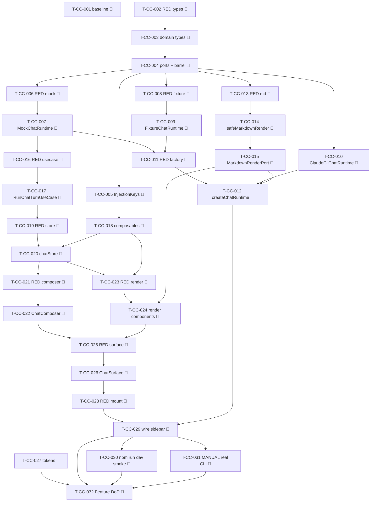

# Tasks — Chat core (P1)

Each task is ≤ ~½ day, has a stable `T-CC-NNN` id, references ≥ 1 SPEC-CC / TEST-CC / REQ-CC,
names an owner, lists explicit dependencies, and has a testable Definition of Done.

> **TDD ordering (mission discipline):** the RED test task for a contract comes **before** the
> implementation task that greens it. RED test tasks are owned by `qa`; implementation tasks by
> `dev`. The `dev` task's first DoD line is always "the prior RED test(s) now pass". This mirrors
> the P0 `tasks.md` style the maintainer accepted.

> **DDD inward layering order:** domain types/ports → infrastructure (`ClaudeCliChatRuntime` +
> bridge factory + mock/fixture runtimes) → application (`safeMarkdownRender`,
> `RunChatTurnUseCase`) → ui (store, composables, components) → styles tokens → wire into the
> sidebar. A test for a layer may not depend on a layer further out.

> **Coverage-excluded infra:** `ClaudeCliChatRuntime` lives under `src/infrastructure/obsidian/**`
> (coverage-excluded, §10). Its only gate is the **manual** TEST-CC-017 — never self-claimed by an
> agent; recorded for the reviewer/SRE in `test-plan.md` and run on real `claude` CLI in Obsidian.

> **Parity is a review-stage human task:** the parity-screenshot set
> (320 / 520 / 720 px × light + dark × the 5 states — empty/idle/streaming/error/interrupt) per
> charter §5 / NFR-CC-011..013 is captured and signed off by a human at `/spec:review`, not in CI.
> The baseline-capture task (T-CC-001) runs first so a `claudian-main` reference exists pre-impl.

## Legend

- 🧪 = test task (RED-first; owner `qa`)
- 🔨 = implementation task (owner `dev`)
- 📐 = design / scaffolding task
- 📚 = documentation task
- 🚀 = release / ops / gate task
- 🪓 = may slice (touches multiple independent code paths; expect several PRs)

## Task list

> **Baseline-capture before implementation:** NFR-CC-011 references a `claudian-main` "current
> behaviour" baseline. T-CC-001 captures it on the `next` integration branch BEFORE any impl, and
> records the capture in `test-plan.md` (the canonical sink Stage 6/8 read from). Without it the
> baseline is irrecoverable once P1 lands.

---

### T-CC-001 📐 — Baseline-capture: `claudian-main` P1-surface reference

- **Description:** Before any P1 implementation, capture the `claudian-main` baseline for the P1
  surfaces (message stream, send-composer, the 5 states) at 320 / 520 / 720 px, light + dark, into
  a `specs/chat-core/parity-screenshots.md` skeleton (baseline column only; the Specorator column
  is filled at review). Record the streaming-feel qualitative baseline note for NFR-CC-014. No
  production code.
- **Satisfies:** NFR-CC-011, NFR-CC-013, NFR-CC-014 (baseline leg)
- **Owner:** dev
- **Depends on:** —
- **Estimate:** S
- **Definition of done:**
  - [ ] `specs/chat-core/parity-screenshots.md` exists with the 3×2×5 baseline matrix scaffolded
        (320/520/720 × light/dark × empty/idle/streaming/error/interrupt), baseline column captured
        from `D:\Projects\claudian-main`.
  - [ ] Baseline reference + the qualitative streaming-feel note are recorded in `test-plan.md`
        (canonical sink).
  - [ ] No file under `src/` changed.

---

### T-CC-002 🧪 — RED: `StreamChunk` union + `ChatRuntimePort` 9-member shape (structural)

- **Description:** Author the failing structural/type-level tests asserting (a) the `StreamChunk`
  P1 member names + shapes diff clean vs `chat.ts:137` (no `text-delta`, no `final`), and (b) the
  `ChatRuntimePort` declares exactly the 9 members (no setter/`rewind`/`steer`/subagent). Tests
  reference TEST-CC-002 / TEST-CC-003 in name/metadata.
- **Satisfies:** TEST-CC-002, TEST-CC-003, SPEC-CC-001, SPEC-CC-002, REQ-CC-001a, REQ-CC-002a
- **Owner:** qa
- **Depends on:** —
- **Estimate:** S
- **Definition of done:**
  - [ ] `tests/domain/chat/StreamChunk.test.ts` + `tests/domain/ports/ChatRuntimePort.test.ts`
        exist, naming TEST-CC-002 / TEST-CC-003.
  - [ ] Tests fail (RED) because the domain types do not yet exist (compile/run failure is the RED
        signal).

### T-CC-003 🔨 — Domain chat types: `StreamChunk`, `UsageInfo`, `ChatMessage`, `ChatTurn`, `ProviderId`

- **Description:** Implement the pure domain types in `src/domain/chat/`: `StreamChunk.ts`
  (full union, P1-emitted subset documented), `UsageInfo.ts` (chat.ts:165 fields),
  `ChatMessage.ts` (P1 field subset + per-field rules), `ChatTurn.ts` (`ChatTurnRequest`,
  `PreparedChatTurn`, `ChatRuntimeQueryOptions`, `ChatRuntimeEnsureReadyOptions`),
  `ProviderId.ts` (`'claude'`). No `obsidian`, no `node:*`, no class — pure interfaces/unions.
- **Satisfies:** SPEC-CC-002, SPEC-CC-003, SPEC-CC-004, SPEC-CC-005, SPEC-CC-006, REQ-CC-001a, REQ-CC-005a, REQ-CC-006
- **Owner:** dev
- **Depends on:** T-CC-002
- **Estimate:** M
- **Definition of done:**
  - [ ] The TEST-CC-002 structural test passes (member names/shapes diff clean vs `chat.ts:137`).
  - [ ] `npm run typecheck` + `npm run lint` green; no `obsidian`/`node:*` import in `src/domain/chat/**`.
  - [ ] Implementation-log entry added.

### T-CC-004 🔨 — `ChatRuntimePort` + `MarkdownRenderPort` interfaces + `@/domain/ports` barrel re-exports

- **Description:** Implement `src/domain/ports/ChatRuntimePort.ts` (exact 9-member interface,
  SPEC-CC-001) and `src/domain/ports/MarkdownRenderPort.ts` (`MarkdownInline` / `MarkdownNode` /
  `SafeRenderResult` / one-method `render`, SPEC-CC-007). Add the type re-exports to
  `src/domain/ports/index.ts` (SPEC-CC-009), keeping the "no aggregate" header comment.
- **Satisfies:** SPEC-CC-001, SPEC-CC-007, SPEC-CC-009, REQ-CC-001, REQ-CC-002a, REQ-CC-006
- **Owner:** dev
- **Depends on:** T-CC-002, T-CC-003
- **Estimate:** M
- **Definition of done:**
  - [ ] The TEST-CC-003 structural test passes (exactly the 9 members; no setter/rewind/steer/subagent).
  - [ ] `@/domain/ports` re-exports `ChatRuntimePort`, the markdown port types, and the chat domain
        types; the "do NOT compose into an aggregate" comment is retained.
  - [ ] `npm run typecheck` + `npm run lint` green; implementation-log entry added.

### T-CC-005 🔨 — InjectionKeys: `CHAT_RUNTIME_PORT` + `MARKDOWN_RENDER_PORT`

- **Description:** Add `CHAT_RUNTIME_PORT` and `MARKDOWN_RENDER_PORT` `InjectionKey`s alongside the
  six core keys in `src/infrastructure/bridge/ports.ts` (SPEC-CC-008). Do **not** create an
  aggregate key. The deleted `IBridge`/`BridgeKey`/`useBridge`/`usePorts` symbols stay forbidden.
- **Satisfies:** SPEC-CC-008, REQ-CC-002, REQ-CC-015
- **Owner:** dev
- **Depends on:** T-CC-004
- **Estimate:** S
- **Definition of done:**
  - [x] Both `InjectionKey`s exported, typed against `@/domain/ports`.
  - [x] `npm run typecheck` + `npm run lint` green; no re-introduced deleted-symbol.
  - [x] Implementation-log entry added.

---

### T-CC-006 🧪 — RED: `MockChatRuntime` streams scripted `text…done`; cancel stops yielding

- **Description:** Author the failing unit tests for `MockChatRuntime`: scripted
  `["Hel","lo"]`+`done` yields in order, concat = `"Hello"`, generator completes after `done`,
  per-chunk yield boundary observable per tick; `cancel()` stops further yields; scripted `error`
  and `usage` chunks are emitted on request. Names TEST-CC-001 (+ the cancel/usage legs).
- **Satisfies:** TEST-CC-001, SPEC-CC-011, REQ-CC-001, REQ-CC-001a, REQ-CC-014
- **Owner:** qa
- **Depends on:** T-CC-004
- **Estimate:** S
- **Definition of done:**
  - [ ] `tests/infrastructure/mock/MockChatRuntime.test.ts` exists, naming TEST-CC-001.
  - [ ] Tests fail (RED) — `MockChatRuntime` does not yet exist.

### T-CC-007 🔨 — `MockChatRuntime` (scripted in-memory runtime)

- **Description:** Implement `src/infrastructure/mock/MockChatRuntime.ts` per SPEC-CC-011:
  optional script (default deterministic `text…done`), `providerId='claude'`, `prepareTurn` builds
  the P1 `PreparedChatTurn`, `ensureReady→true`, `isReady→true`, no-op-ish `onReadyStateChange`,
  synthetic `getSessionId`/`resetSession`; `query` is an `async *` yielding scripted chunks with a
  per-chunk yield boundary; honours `cancel()`. No subprocess.
- **Satisfies:** SPEC-CC-011, REQ-CC-014, NFR-CC-014
- **Owner:** dev
- **Depends on:** T-CC-006
- **Estimate:** M
- **Definition of done:**
  - [ ] TEST-CC-001 (+ cancel/usage legs) pass.
  - [ ] Implements `ChatRuntimePort` (9 members); per-chunk yield boundary observable per tick.
  - [ ] `npm run typecheck` + `npm run lint` + `npm run test` green; implementation-log entry added.

### T-CC-008 🧪 — RED: `FixtureChatRuntime` replays bundled transcript; no subprocess

- **Description:** Author the failing unit test for `FixtureChatRuntime`: replays a bundled
  `StreamChunk[]` transcript (`text…usage…done`) as an async generator with the per-chunk yield
  discipline; `ensureReady→true`; no subprocess. Part of TEST-CC-016 (U leg).
- **Satisfies:** TEST-CC-016 (U leg), SPEC-CC-012, REQ-CC-014
- **Owner:** qa
- **Depends on:** T-CC-004
- **Estimate:** S
- **Definition of done:**
  - [x] `tests/infrastructure/localstorage/FixtureChatRuntime.test.ts` exists, naming TEST-CC-016.
  - [x] Test fails (RED) — `FixtureChatRuntime` does not yet exist.

### T-CC-009 🔨 — `FixtureChatRuntime` (GitHub Pages demo runtime)

- **Description:** Implement `src/infrastructure/localstorage/FixtureChatRuntime.ts` per
  SPEC-CC-012: replays a short canned `text…usage…done` fixture; same `ChatRuntimePort` surface +
  per-chunk yield discipline as the mock; `ensureReady→true`; no subprocess.
- **Satisfies:** SPEC-CC-012, REQ-CC-014
- **Owner:** dev
- **Depends on:** T-CC-008
- **Estimate:** S
- **Definition of done:**
  - [x] TEST-CC-016 (U leg) passes for the fixture runtime.
  - [x] Implements `ChatRuntimePort`; replays the fixture believably; no `node:*`/subprocess.
  - [x] `npm run typecheck` + `npm run lint` + `npm run test` green; implementation-log entry added.

### T-CC-010 🔨 — `ClaudeCliChatRuntime` (spawn + NDJSON→`StreamChunk` reduce)

> Coverage-excluded infra (`src/infrastructure/obsidian/**`). Its only behavioural gate is the
> **manual** TEST-CC-017 (T-CC-026). No CI unit test greens this task — its DoD is structural +
> lint + typecheck + the no-secret review hand-off.

- **Description:** Implement `src/infrastructure/obsidian/ClaudeCliChatRuntime.ts` per SPEC-CC-010,
  a clean reimplementation referencing (not copying) the deleted P0
  `ClaudeSubprocessAdapter`/`StreamDeltaReducer` on `develop`/history. Spawns the resolved `claude`
  CLI (NDJSON / stream-json on stdout, user's own login — **no stored secret**), reduces NDJSON
  lines to `StreamChunk`s (`text` accumulate, `usage` capture + sessionId, `error` then terminate,
  `done` terminator), `cancel()` manually kills the child (Electron `customSpawn` gotcha — no
  reliance on `AbortSignal`), `ensureReady()` probes CLI resolvability + login and fires listeners.
  Never throws across the port — an unexpected throw yields a synthetic `error` then returns.
- **Satisfies:** SPEC-CC-010, REQ-CC-013, NFR-CC-006, NFR-CC-003 (EC-13)
- **Owner:** dev
- **Depends on:** T-CC-004
- **Estimate:** M
- **Definition of done:**
  - [x] Implements `ChatRuntimePort` (9 members); reads/writes **no** API key/token/secret (no
        `data.json`/`SecretStorePort` access — verifiable by source review).
  - [x] `cancel()` kills the child manually; `query` never throws across the port (synthetic `error`
        + return on unexpected fault).
  - [x] `npm run typecheck` + `npm run lint` green; no `obsidian`/`node:*` leak outside this infra
        file's allowed scope. (`npm run build` deferred to the T-CC-032 verify gate per the batch brief.)
  - [x] Implementation-log entry added; the manual TEST-CC-017 (T-CC-031) is scheduled in `test-plan.md`.

### T-CC-011 🧪 — RED: per-bridge `createChatRuntime()` + markdown port (all three bridges)

- **Description:** Author the failing unit tests asserting each bridge exposes
  `createChatRuntime()` returning a **fresh** runtime instance (`MockBridge` → `MockChatRuntime`,
  `LocalStorageBridge` → `FixtureChatRuntime`; `ObsidianBridge` row covered structurally — its
  runtime is coverage-excluded), and that each bridge exposes a `safeMarkdownRender`-backed
  `MarkdownRenderPort`. Two calls return distinct instances. Part of TEST-CC-016.
- **Satisfies:** TEST-CC-016, SPEC-CC-013, REQ-CC-014, ADR-CC-001 §6
- **Owner:** qa
- **Depends on:** T-CC-007, T-CC-009
- **Estimate:** S
- **Definition of done:**
  - [x] `tests/infrastructure/mock/createChatRuntime.test.ts` (mock + fixture runtimes) exists, naming
        TEST-CC-016 (runtime-factory leg). Markdown-port leg deferred — CLAR-CC-007.
  - [x] Tests fail (RED) — the factory methods do not yet exist.

### T-CC-012 🔨 — `createChatRuntime()` factory + markdown port on all three bridges 🪓

- **Description:** Add `createChatRuntime(): ChatRuntimePort` to `ObsidianBridge` (→
  `ClaudeCliChatRuntime`), `MockBridge` (→ `MockChatRuntime`), `LocalStorageBridge` (→
  `FixtureChatRuntime`) per SPEC-CC-013, each returning a fresh per-conversation instance. Expose
  the `safeMarkdownRender`-backed `MarkdownRenderPort` from all three bridges (method or shared
  singleton — dev-stage choice), identical behaviour across bridges in P1.
- **Satisfies:** SPEC-CC-013, REQ-CC-014, ADR-CC-001 §6
- **Owner:** dev
- **Depends on:** T-CC-011, T-CC-010, T-CC-015
- **Estimate:** M
- **Slice plan:** may slice as (a) Mock+LocalStorage factory + markdown port (CI-greens TEST-CC-016)
  then (b) ObsidianBridge factory wiring (coverage-excluded, lands with T-CC-010).
- **Definition of done:**
  - [x] TEST-CC-016 (factory U leg) passes; each call returns a distinct instance. (Slice a+b runtime leg.)
  - [x] All three bridges expose the markdown port backed by `safeMarkdownRender`. **DONE — CLAR-CC-007 RESOLVED**
        (delivered with T-CC-015, commit `7185de0`).
  - [x] `npm run typecheck` + `npm run lint` + `npm run test` green (runtime + markdown legs); implementation-log entry added.

---

### T-CC-013 🧪 — RED: `safeMarkdownRender` (paragraphs / inline code / breaks; XSS-safe; never throws)

- **Description:** Author the failing unit tests for `safeMarkdownRender`: paragraphs split on
  blank lines; inline `` `code` `` → `{kind:'code'}`; single `\n` preserved as a text span;
  unbalanced backtick is literal text (no throw); empty/whitespace → `{nodes:[]}`; literal `<`/`&`
  carried as text — **no HTML in any output field**. Names TEST-CC-014 (EC-14).
- **Satisfies:** TEST-CC-014, SPEC-CC-014, REQ-CC-006, NFR-CC-008
- **Owner:** qa
- **Depends on:** T-CC-004
- **Estimate:** S
- **Definition of done:**
  - [x] `tests/application/chat/safeMarkdownRender.test.ts` exists, naming TEST-CC-014, covering the
        empty/whitespace/unbalanced-backtick/literal-`<`-`&` cases.
  - [x] Tests fail (RED) — `safeMarkdownRender` does not yet exist. (Watched RED, commit `0f02a93`.)

### T-CC-014 🔨 — `safeMarkdownRender` transform (pure backing of `MarkdownRenderPort`)

- **Description:** Implement `src/application/chat/safeMarkdownRender.ts` per SPEC-CC-014: total,
  synchronous, idempotent; the three constructs only (paragraphs / inline code / line breaks);
  output contains only `text`/`code` inline values; never holds HTML; never throws.
- **Satisfies:** SPEC-CC-014, REQ-CC-006, NFR-CC-008
- **Owner:** dev
- **Depends on:** T-CC-013
- **Estimate:** M
- **Definition of done:**
  - [x] TEST-CC-014 passes (incl. EC-14 edge cases). (13/13, commit `b617142`.)
  - [x] Output is `SafeRenderResult`; no field ever holds HTML; never throws on any string input.
  - [x] `npm run typecheck` + `npm run lint` + `npm run test` green; implementation-log entry added.

### T-CC-015 🔨 — `MarkdownRenderPort` adapter wrapping `safeMarkdownRender`

- **Description:** Provide the P1 `MarkdownRenderPort` implementation that delegates `render` to
  `safeMarkdownRender` (the seam P2 re-backs with Obsidian's renderer). This is the object the
  bridges return from T-CC-012.
- **Satisfies:** SPEC-CC-007, SPEC-CC-014, REQ-CC-006, NFR-CC-008
- **Owner:** dev
- **Depends on:** T-CC-014
- **Estimate:** S
- **Definition of done:**
  - [x] An object implementing `MarkdownRenderPort` exists; `render(md)` === `safeMarkdownRender(md)`.
        (`safeMarkdownRenderPort` singleton; bridges expose `createMarkdownRenderPort()`; commit `7185de0`.)
  - [x] `npm run typecheck` + `npm run lint` + `npm run test` green; implementation-log entry added.

---

### T-CC-016 🧪 — RED: `RunChatTurnUseCase` orchestration (dispatch / usage guard / error / done / cancel / throw)

- **Description:** Author the failing unit tests for `RunChatTurnUseCase` against a `MockChatRuntime`
  / stub `ChatTurnSink`: non-empty turn calls `prepareTurn` once + starts one `query` with history;
  `text`→`onText`, `usage`→`onUsage` (foreign `sessionId` ignored — EC-11), `error`→`onErrorChunk`
  then continue (EC-6), `done`→`onDone` + `ok`; `ensureReady→false`→`err('not-ready')` with no
  `onAssistantStart` (EC-7); `cancel()` stops the loop + `ok`; generator throw → synthetic
  `onErrorChunk`+`onDone` + `err('runtime-throw')`, never rethrows (EC-13). Names TEST-CC-007 (U),
  TEST-CC-013 (U leg), and the dispatch/throw legs.
- **Satisfies:** TEST-CC-007, TEST-CC-013 (U leg), SPEC-CC-015, REQ-CC-003, REQ-CC-004, REQ-CC-005, REQ-CC-005a, REQ-CC-010, REQ-CC-012, NFR-CC-003
- **Owner:** qa
- **Depends on:** T-CC-007
- **Estimate:** M
- **Definition of done:**
  - [x] `tests/application/chat/RunChatTurnUseCase.test.ts` exists, naming TEST-CC-007 / TEST-CC-013
        and the not-ready / usage-guard / error-continue / cancel / generator-throw scenarios.
  - [x] Tests fail (RED) — the use case does not yet exist. (Watched RED, commit `b3bab93`.)

### T-CC-017 🔨 — `RunChatTurnUseCase` (turn orchestrator) + `ChatTurnError`

- **Description:** Implement `src/application/chat/RunChatTurnUseCase.ts` per SPEC-CC-015:
  `prepareTurn`→`ensureReady`→(`onAssistantStart`)→`for await` dispatch by `chunk.type`; usage
  session guard; `error` forwarded inline (not `Result`) then continue; `done` finalises; `cancel()`
  delegates to `runtime.cancel()`; generator throw caught → synthetic `error`+`done` then
  `err('runtime-throw')`. Returns `Result<void, ChatTurnError>` at the discrete boundary; document
  the error-as-chunk vs `Result` boundary at the top of the file (ADR-CC-001 §1 / NFR-CC-003).
- **Satisfies:** SPEC-CC-015, REQ-CC-003, REQ-CC-004, REQ-CC-005, REQ-CC-005a, REQ-CC-010, REQ-CC-012, NFR-CC-003
- **Owner:** dev
- **Depends on:** T-CC-016
- **Estimate:** M
- **Definition of done:**
  - [x] TEST-CC-007 + TEST-CC-013 (U leg) + all orchestration scenarios pass. (10/10, commit `96ff568`.)
  - [x] `Result<void, ChatTurnError>` at the discrete boundary; streaming error never crosses as a
        thrown error / per-chunk `Result`; file-top comment documents the boundary.
  - [x] `npm run typecheck` + `npm run lint` + `npm run test` green; implementation-log entry added.

---

### T-CC-018 🔨 — composables: `useChatRuntimePort()` + `useMarkdownRenderPort()`

- **Description:** Add `src/ui/composables/useChatRuntimePort.ts` and `useMarkdownRenderPort.ts`
  mirroring the existing `useLoggerPort` inject-or-throw pattern (SPEC-CC-017), each injecting its
  matching `InjectionKey` and throwing a clear "was not provided" error if absent.
- **Satisfies:** SPEC-CC-017, REQ-CC-002
- **Owner:** dev
- **Depends on:** T-CC-005
- **Estimate:** S
- **Definition of done:**
  - [x] Both composables exist, inject-or-throw; no `obsidian`/`node:*` import.
  - [x] `npm run typecheck` + `npm run lint` green; implementation-log entry added.

### T-CC-019 🧪 — RED: `chatStore` (Pinia) state machine + sink actions

- **Description:** Author the failing unit tests for `chatStore`: `sendMessage` guard (empty
  no-op — EC-1) / append user msg + history capture + `status='streaming'`; sink actions
  `onAssistantStart`/`onText` (ignored after cancel — EC-9)/`onUsage` (no content mutation —
  EC-10)/`onErrorChunk` (inline + `errorActive`)/`onDone` (`errorActive ? 'error' : 'idle'`,
  EC-5 finalise-empty); `cancelTurn` (interrupted id + `'idle'`, EC-8); not-ready start-fail
  (EC-7 — no dangling live message + sticky notice); `$reset` on close (EC-15). Asserts the exact
  5-status machine (§6) and `isEmpty`/`isStreaming`/`canSend` getters. DTOs only — no domain class
  crosses the boundary.
- **Satisfies:** SPEC-CC-016, REQ-CC-003, REQ-CC-004, REQ-CC-005, REQ-CC-005a, REQ-CC-007, REQ-CC-009, REQ-CC-010, REQ-CC-012
- **Owner:** qa
- **Depends on:** T-CC-017
- **Estimate:** M
- **Definition of done:**
  - [x] `tests/ui/stores/chatStore.test.ts` exists, covering the state machine + sink actions +
        EC-1/5/7/8/9/10/15.
  - [x] Tests fail (RED) — `chatStore` does not yet exist. (Watched RED, commit `01ccd9d`.)

### T-CC-020 🔨 — `chatStore` (Pinia single-thread chat state + `ChatTurnSink`)

- **Description:** Implement `src/ui/stores/chatStore.ts` per SPEC-CC-016: state
  (`messages`/`status`/`liveAssistantId`/`interruptedId`/`usage`/`errorActive`), getters
  (`isEmpty`/`isStreaming`/`canSend`), and the `ChatTurnSink` actions + `sendMessage` /
  `cancelTurn` / `$reset`. Drives `RunChatTurnUseCase`; plain DTOs only; never imports `obsidian`.
  Start-fail surfaces a sticky `NotificationPort.showError` via `FeedbackService` with no dangling
  live message (EC-7).
- **Satisfies:** SPEC-CC-016, REQ-CC-003, REQ-CC-004, REQ-CC-005, REQ-CC-005a, REQ-CC-007, REQ-CC-009, REQ-CC-010, REQ-CC-012, NFR-CC-014
- **Owner:** dev
- **Depends on:** T-CC-019, T-CC-018
- **Estimate:** M
- **Definition of done:**
  - [x] T-CC-019 tests pass (17/17); the 5-status machine matches §6 exactly.
  - [x] DTOs only across the store boundary; no `obsidian`/`node:*`/`src/infrastructure/agent/**` import.
  - [x] `npm run typecheck` + `npm run lint` + `npm run test` green; implementation-log entry added. (commit `bab9e44`)

---

### T-CC-021 🧪 — RED: `ChatComposer.vue` keyboard contract + send/stop (PageObject)

- **Description:** Author the failing component test + `ChatComposer.po.ts` PageObject (data-testid
  only): Enter (no shift, no IME, non-empty) → `submit`, prevents newline; Shift+Enter → newline,
  no submit (EC-3); Enter during IME → no submit (EC-2); empty/whitespace → no `submit` (EC-1);
  `Esc` while streaming → `cancel`; send disabled when empty or streaming; while streaming the
  control is **stop** → `cancel` (EC-4). Names TEST-CC-009.
- **Satisfies:** TEST-CC-009, SPEC-CC-021, REQ-CC-007, REQ-CC-008, REQ-CC-009, REQ-CC-010
- **Owner:** qa
- **Depends on:** T-CC-020
- **Estimate:** M
- **Definition of done:**
  - [x] `tests/ui/chat/ChatComposer.test.ts` + co-located `ChatComposer.po.ts` exist, naming
        TEST-CC-009, querying by `data-testid` only.
  - [x] Tests fail (RED) — `ChatComposer.vue` does not yet exist. (Watched RED, commit `1808552`.)

### T-CC-022 🔨 — `ChatComposer.vue` (auto-grow textarea + send/stop + keyboard handler)

- **Description:** Implement `src/ui/chat/ChatComposer.vue` (`<script setup>`) per SPEC-CC-021:
  bordered wrapper (`data-testid="chat-composer"`), borderless auto-grow `<textarea>`
  (`data-testid="composer-textarea"`), send/stop control (`data-testid="composer-send"`); the
  keyboard contract; emits `submit(text)` / `cancel()`; focus on open + after finalise; owns no
  chat state. Auto-grow uses `--sp-textarea-min-h`/`-max-h`.
- **Satisfies:** SPEC-CC-021, REQ-CC-007, REQ-CC-008, REQ-CC-009, REQ-CC-010
- **Owner:** dev
- **Depends on:** T-CC-021
- **Estimate:** M
- **Definition of done:**
  - [x] TEST-CC-009 passes (Enter/Shift+Enter/IME/empty/Esc/send-stop). (12/12)
  - [x] `<script setup>`; no `v-html`/`innerHTML`/`window.confirm`; no `obsidian` import.
  - [x] `npm run typecheck` + `npm run lint` + `npm run test` green; implementation-log entry added. (commit `aaa0868`)

### T-CC-023 🧪 — RED: message render — `MessageList` / `MessageTurn` / `MarkdownBlock` + `WelcomeGreeting` (PageObjects) 🪓

- **Description:** Author the failing component tests + PageObjects (data-testid only) for:
  `MessageList.vue` (`message-list`, keyed v-for, auto-scroll); `MessageTurn.vue` (distinct
  `message-user` / `message-assistant`, `data-streaming` on live, `message-interrupted` badge —
  EC-8; `dir="auto"`); `MarkdownBlock.vue` (declarative nodes, `md-code` for inline code, no
  `v-html`/`innerHTML` — EC-12/EC-14); `WelcomeGreeting.vue` (`chat-welcome` visible at zero
  messages, hidden after first send — EC-16 i18n key). Names TEST-CC-008, TEST-CC-005,
  TEST-CC-012, and the interrupted-badge leg of TEST-CC-011.
- **Satisfies:** TEST-CC-005, TEST-CC-008, TEST-CC-012, TEST-CC-011 (render leg), SPEC-CC-019, SPEC-CC-020, REQ-CC-004, REQ-CC-006, REQ-CC-010, REQ-CC-011, NFR-CC-008, NFR-CC-014
- **Owner:** qa
- **Depends on:** T-CC-020, T-CC-018
- **Estimate:** M
- **Slice plan:** may slice as (a) MarkdownBlock + MessageTurn render tests, (b) MessageList +
  accumulate/auto-scroll tests, (c) WelcomeGreeting tests.
- **Definition of done:**
  - [x] `tests/ui/chat/{MessageList,MessageTurn,MarkdownBlock,WelcomeGreeting}.test.ts` + co-located
        `*.po.ts` exist, naming the listed TEST-CC ids, data-testid only.
  - [x] Tests fail (RED) — the components do not yet exist. (Watched RED, commit `ef07550`.)

### T-CC-024 🔨 — message render components + `WelcomeGreeting.vue` 🪓

- **Description:** Implement `src/ui/chat/MessageList.vue`, `MessageTurn.vue`, `MarkdownBlock.vue`
  (SPEC-CC-019) and `WelcomeGreeting.vue` (SPEC-CC-020). `MarkdownBlock` calls
  `useMarkdownRenderPort().render(content)` and renders `MarkdownNode[]` **declaratively**
  (`<p>`/`<code data-testid="md-code">`/text spans with `white-space: pre-wrap`) — no `v-html`.
  `MessageTurn` role-distinct + `data-streaming` + interrupted badge (`--sp-interrupt`).
  `WelcomeGreeting` uses `--sp-font-serif` + the `agent.chat.welcome.greeting` i18n key, no
  duration footer. `MessageList` auto-scrolls to bottom as the live message grows.
- **Satisfies:** SPEC-CC-019, SPEC-CC-020, REQ-CC-004, REQ-CC-006, REQ-CC-010, REQ-CC-011, NFR-CC-008, NFR-CC-014
- **Owner:** dev
- **Depends on:** T-CC-023, T-CC-015
- **Estimate:** M
- **Slice plan:** may slice per component (MarkdownBlock+MessageTurn, MessageList, WelcomeGreeting).
- **Definition of done:**
  - [x] TEST-CC-005, 008, 012, and the TEST-CC-011 render leg pass. (18/18)
  - [x] All components `<script setup>`; **no** `v-html`/`innerHTML`; no `obsidian` import; the
        `agent.chat.welcome.greeting` key exists in the i18n stub with `en` fallback.
  - [x] `npm run typecheck` + `npm run lint` + `npm run test` green; implementation-log entry added. (commit `69131df`)

### T-CC-025 🧪 — RED: `ChatSurface.vue` — state wiring, busy indicator, accumulate, finalise, cancel, error (PageObject) 🪓

- **Description:** Author the failing component test + `ChatSurface.po.ts` for the container
  (`chat-surface`, `data-provider="claude"`): welcome vs message-list by `isEmpty`; busy indicator
  `chat-busy` with `aria-live="polite"` while streaming (TEST-CC-010, EC-4 send blocked); composer
  `submit`→`sendMessage`, `cancel`→`cancelTurn`; accumulate observable per tick → `"Hello world"`
  before `done` (TEST-CC-005 surface leg); `done` finalises + composer re-enabled (TEST-CC-006);
  cancel marks interrupted + idle (TEST-CC-011); scripted `error` chunk and `ensureReady→false`
  render inline + idle + re-enabled, no blocking dialog / no innerHTML (TEST-CC-013 A leg).
- **Satisfies:** TEST-CC-004, TEST-CC-005, TEST-CC-006, TEST-CC-010, TEST-CC-011, TEST-CC-013 (A leg), SPEC-CC-018, REQ-CC-003, REQ-CC-005, REQ-CC-009, REQ-CC-010, REQ-CC-012
- **Owner:** qa
- **Depends on:** T-CC-022, T-CC-024
- **Estimate:** M
- **Slice plan:** may slice as (a) dispatch+accumulate+finalise, (b) busy/cancel/error states.
- **Definition of done:**
  - [x] `tests/ui/chat/ChatSurface.test.ts` + `ChatSurface.po.ts` exist, naming the listed TEST-CC ids.
  - [x] Tests fail (RED) — `ChatSurface.vue` does not yet exist. (Watched RED, commit `25feb7b`.)

### T-CC-026 🔨 — `ChatSurface.vue` (container + state machine wiring)

- **Description:** Implement `src/ui/chat/ChatSurface.vue` (`<script setup>`) per SPEC-CC-018:
  message region over the bottom composer; `data-testid="chat-surface"`, root
  `data-provider="claude"`; shows `WelcomeGreeting` when `isEmpty` else `MessageList`; busy
  indicator `chat-busy` (`aria-live="polite"`) while streaming; hosts `ChatComposer` and wires
  `submit`→`chatStore.sendMessage`, `cancel`→`chatStore.cancelTurn`; on mount instantiates
  `RunChatTurnUseCase` from `useChatRuntimePort()` and hands it to the store.
- **Satisfies:** SPEC-CC-018, REQ-CC-003, REQ-CC-005, REQ-CC-009, REQ-CC-010, REQ-CC-012, REQ-CC-015
- **Owner:** dev
- **Depends on:** T-CC-025
- **Estimate:** M
- **Definition of done:**
  - [x] TEST-CC-004, 005, 006, 010, 011, 013 (A leg) pass. (7/7)
  - [x] `<script setup>`; no `v-html`/`innerHTML`/`window.confirm`; no `obsidian`/`node:*` import.
  - [x] `npm run typecheck` + `npm run lint` + `npm run test` green; implementation-log entry added. (commit `b5bdb41`)

---

### T-CC-027 🔨 — `--sp-*` token additions (token layer only)

- **Description:** Add the 8 new P1 surface tokens to `src/ui/styles/tokens.css` per SPEC-CC-023:
  `--sp-msg-gap`, `--sp-scrollbar-width`, `--sp-msg-user-bg`, `--sp-msg-user-max-width`,
  `--sp-interrupt`, `--sp-input-min-h`, `--sp-textarea-min-h`, `--sp-textarea-max-h`. Color
  literals confined to the token layer — **no** component hex / raw Obsidian var.
- **Satisfies:** SPEC-CC-023, NFR-CC-012, REQ-CC-006, REQ-CC-007, REQ-CC-011
- **Owner:** dev
- **Depends on:** —
- **Estimate:** S
- **Definition of done:**
  - [ ] The 8 tokens exist in `tokens.css`; no chat component file contains a hex/raw-var color.
  - [ ] The `lint-style-tokens` guard passes with zero leaks; `npm run lint` green.
  - [ ] Implementation-log entry added.

---

### T-CC-028 🧪 — RED: sidebar mount — `chat-surface` replaces `agent-panel-empty`; ports provided (PageObject)

- **Description:** Author the failing component/integration test asserting the mounted view shows
  `chat-surface` (not `agent-panel-empty`) and that `CHAT_RUNTIME_PORT` + `MARKDOWN_RENDER_PORT`
  are provided alongside the six core ports. Names TEST-CC-015.
- **Satisfies:** TEST-CC-015, SPEC-CC-022, REQ-CC-015, REQ-CC-002
- **Owner:** qa
- **Depends on:** T-CC-026
- **Estimate:** S
- **Definition of done:**
  - [x] `tests/ui/chat/mount.test.ts` (or equivalent) exists, naming TEST-CC-015, data-testid only.
  - [x] Test fails (RED) — the view still mounts `AgentPanelRoot`. (Watched RED, commit `698bcc7`.)

### T-CC-029 🔨 — wire `ChatSurface` into `AgentSidebarView` + `src/ui/main.ts` (provide both ports) 🪓

- **Description:** Per SPEC-CC-022, replace `AgentPanelRoot` with `ChatSurface` (inside
  `ErrorBoundary`) in `src/plugin/AgentSidebarView.ts`: call `bridge.createChatRuntime()` once,
  `app.provide(CHAT_RUNTIME_PORT, runtime)` + provide `MARKDOWN_RENDER_PORT`, keep the six core
  ports; `onClose` cancels the in-flight turn before `unmount` (EC-15). Mirror in `src/ui/main.ts`
  (standalone / `npm run dev`) with `MockBridge` so `npm run dev` shows a working chat against the
  mock. The `agent-panel-empty` placeholder is gone from the live view.
- **Satisfies:** SPEC-CC-022, REQ-CC-015, REQ-CC-014, REQ-CC-002, NFR-CC-001 (EC-15)
- **Owner:** dev
- **Depends on:** T-CC-028, T-CC-012
- **Estimate:** M
- **Slice plan:** may slice as (a) `AgentSidebarView` wiring + onClose cancel, (b) `src/ui/main.ts`
  standalone wiring.
- **Definition of done:**
  - [x] TEST-CC-015 passes; `chat-surface` present, `agent-panel-empty` absent from the live view.
  - [x] Both new ports provided with the six core ports; `onClose` cancels then unmounts (no write
        to an unmounted store — via `ChatSurface.onBeforeUnmount → store.$reset()`, EC-15).
  - [x] `npm run typecheck` + `npm run lint` + `npm run test` green; implementation-log entry added.
        (`npm run build` / `npm run build:web` deferred to the T-CC-032 verify gate per the batch brief.) (commit `2b5bf06`)

### T-CC-030 🧪 — `npm run dev` standalone smoke (TEST-CC-016 manual leg)

- **Description:** Run `npm run dev` and confirm the chat surface mounts against `MockBridge`,
  streams the scripted `text…done` reply token-by-token, and finalises — the standalone smoke leg
  of TEST-CC-016. Manual-assisted: the harness build is automatable but the visual stream check is
  human-observed; record the result in `test-plan.md`.
- **Satisfies:** TEST-CC-016 (M leg), REQ-CC-014
- **Owner:** qa
- **Depends on:** T-CC-029
- **Estimate:** S
- **Definition of done:**
  - [ ] `npm run dev` boots; the chat surface streams the mock reply token-by-token and finalises to
        idle (composer re-enabled).
  - [ ] Result recorded in `test-plan.md` (TEST-CC-016 M leg pass/fail + date).

---

### T-CC-031 🚀 — MANUAL: real `claude` CLI in Obsidian + no-secret review (TEST-CC-017) — human-run

> **Never self-claimed by an agent.** This is a desktop manual check on real `claude` CLI; the
> agent only schedules and records it. `ClaudeCliChatRuntime` is coverage-excluded infra, so this
> is its sole behavioural gate.

- **Description:** On an Obsidian desktop install with the `claude` CLI logged in, send a message,
  confirm the production `ClaudeCliChatRuntime` spawns only the resolved `claude` CLI, adapts NDJSON
  → `StreamChunk`s, streams + finalises, and that a review of the runtime source + `data.json`
  confirms **no** API key / token / secret is read or persisted (NFR-CC-006).
- **Satisfies:** TEST-CC-017, REQ-CC-013, NFR-CC-006
- **Owner:** human
- **Depends on:** T-CC-029
- **Estimate:** S
- **Definition of done:**
  - [ ] A real turn streams + finalises in Obsidian against the user's own `claude` login.
  - [ ] Source review + `data.json` inspection confirm zero secrets read/persisted; recorded in
        `test-plan.md` / `test-report.md` with reviewer name + date.

---

### T-CC-032 🚀 — Feature DoD: full verify + parity sign-off + draft PR into `next`

- **Description:** The closing gate for P1. Run the full pre-PR verify chain and `npm run test:all`;
  confirm zero bypasses, `manifest.json` unchanged, the deleted-symbol guard green (no
  re-introduced `IBridge`/`useBridge`/`usePorts` or deleted-subsystem import), and that the parity
  screenshots (charter §5, NFR-CC-011..013 — 320/520/720 × light+dark × the 5 states) are captured
  and human-signed at review. Open a **draft PR into `next`**.
- **Satisfies:** NFR-CC-005, NFR-CC-007, NFR-CC-009, NFR-CC-010, NFR-CC-011, NFR-CC-012, NFR-CC-013, NFR-CC-001
- **Owner:** dev
- **Depends on:** T-CC-027, T-CC-029, T-CC-030, T-CC-031
- **Estimate:** M
- **Definition of done:**
  - [ ] `npm audit --audit-level=high --omit=dev` + `npm run typecheck` + `npm run lint` +
        `npm run test` (coverage 80/70/80/80) + `npm run build` + `npm run build:web` +
        `npm run docs:api` all green; `npm run test:all` green; zero bypasses (`--no-verify` etc.).
  - [ ] `manifest.json` (`id`, `version`, `minAppVersion 1.12.7`) unchanged; deleted-symbol /
        import-direction guards green; no `obsidian`/`node:*` under `src/ui/**`.
  - [ ] Parity screenshots captured (T-CC-001 baseline column + Specorator column) and human-signed
        at review (NFR-CC-011..013); recorded in `specs/chat-core/parity-screenshots.md`.
  - [ ] Draft PR opened targeting `next`, referencing TASKS-CC-001 + the closed REQ/SPEC ids.

---

## Dependency graph



## Parallelisable batches

Batches whose tasks have no inter-dependencies and can run concurrently:

- **Batch 0 (pre-impl, parallel with everything):** T-CC-001 (baseline), T-CC-027 (tokens).
- **Batch 1 (domain RED):** T-CC-002.
- **Batch 2 (domain impl):** T-CC-003 → T-CC-004 → T-CC-005 (sequential within the layer).
- **Batch 3 (infra + md RED, parallel after T-CC-004):** T-CC-006, T-CC-008, T-CC-013, and
  T-CC-010 (ClaudeCli impl can start in parallel — coverage-excluded).
- **Batch 4 (infra + md impl):** T-CC-007, T-CC-009, T-CC-014 → T-CC-015 in parallel; then
  T-CC-011 (RED) → T-CC-012 (factory) once mock+fixture+markdown port land.
- **Batch 5 (application):** T-CC-016 (RED) → T-CC-017.
- **Batch 6 (ui foundation):** T-CC-018 (composables, after T-CC-005) ∥ T-CC-019 (RED store) →
  T-CC-020.
- **Batch 7 (ui components RED+impl, parallel after T-CC-020):** T-CC-021→T-CC-022 (composer) ∥
  T-CC-023→T-CC-024 (render).
- **Batch 8 (surface):** T-CC-025 (RED) → T-CC-026.
- **Batch 9 (wire + smoke):** T-CC-028 (RED) → T-CC-029 → T-CC-030 (smoke) ∥ T-CC-031 (manual).
- **Batch 10 (gate):** T-CC-032.

## Critical path

```
T-CC-002 → T-CC-003 → T-CC-004 → T-CC-006 → T-CC-007 → T-CC-016 → T-CC-017
        → T-CC-019 → T-CC-020 → T-CC-023 → T-CC-024 → T-CC-025 → T-CC-026
        → T-CC-028 → T-CC-029 → T-CC-032
```

(16 tasks. T-CC-001/T-CC-027 are off-path and run anytime before T-CC-032; T-CC-010/T-CC-012,
T-CC-013→T-CC-015, T-CC-018, T-CC-021→T-CC-022, T-CC-030, T-CC-031 are off-path branches that
re-merge before the closing gate.)

---

## Coverage table (SPEC-CC / REQ-CC / NFR-CC / TEST-CC → task)

| Item | Task(s) |
|---|---|
| SPEC-CC-001 (`ChatRuntimePort`) | T-CC-002, T-CC-004 |
| SPEC-CC-002 (`StreamChunk`) | T-CC-002, T-CC-003 |
| SPEC-CC-003 (`UsageInfo`) | T-CC-003 |
| SPEC-CC-004 (`ChatMessage`) | T-CC-003 |
| SPEC-CC-005 (`ChatTurn*`) | T-CC-003 |
| SPEC-CC-006 (query/ready opts + `ProviderId`) | T-CC-003 |
| SPEC-CC-007 (`MarkdownRenderPort`) | T-CC-004, T-CC-015 |
| SPEC-CC-008 (InjectionKeys) | T-CC-005 |
| SPEC-CC-009 (barrel re-exports) | T-CC-004 |
| SPEC-CC-010 (`ClaudeCliChatRuntime`) | T-CC-010 |
| SPEC-CC-011 (`MockChatRuntime`) | T-CC-006, T-CC-007 |
| SPEC-CC-012 (`FixtureChatRuntime`) | T-CC-008, T-CC-009 |
| SPEC-CC-013 (`createChatRuntime()` factory) | T-CC-011, T-CC-012 |
| SPEC-CC-014 (`safeMarkdownRender`) | T-CC-013, T-CC-014 |
| SPEC-CC-015 (`RunChatTurnUseCase`) | T-CC-016, T-CC-017 |
| SPEC-CC-016 (`chatStore`) | T-CC-019, T-CC-020 |
| SPEC-CC-017 (composables) | T-CC-018 |
| SPEC-CC-018 (`ChatSurface.vue`) | T-CC-025, T-CC-026 |
| SPEC-CC-019 (message render) | T-CC-023, T-CC-024 |
| SPEC-CC-020 (`WelcomeGreeting.vue`) | T-CC-023, T-CC-024 |
| SPEC-CC-021 (`ChatComposer.vue`) | T-CC-021, T-CC-022 |
| SPEC-CC-022 (mount + provide) | T-CC-028, T-CC-029 |
| SPEC-CC-023 (`--sp-*` tokens) | T-CC-027 |
| REQ-CC-001 / 001a | T-CC-002, T-CC-003, T-CC-004, T-CC-006, T-CC-007 |
| REQ-CC-002 / 002a | T-CC-002, T-CC-004, T-CC-005, T-CC-018, T-CC-029 |
| REQ-CC-003 | T-CC-016, T-CC-017, T-CC-019, T-CC-020, T-CC-025, T-CC-026 |
| REQ-CC-004 | T-CC-016, T-CC-017, T-CC-019, T-CC-020, T-CC-023, T-CC-024, T-CC-025 |
| REQ-CC-005 | T-CC-016, T-CC-017, T-CC-019, T-CC-020, T-CC-025, T-CC-026 |
| REQ-CC-005a | T-CC-003, T-CC-016, T-CC-017, T-CC-019, T-CC-020 |
| REQ-CC-006 | T-CC-003, T-CC-004, T-CC-013, T-CC-014, T-CC-015, T-CC-023, T-CC-024, T-CC-027 |
| REQ-CC-007 / 008 | T-CC-019, T-CC-020, T-CC-021, T-CC-022 |
| REQ-CC-009 | T-CC-019, T-CC-020, T-CC-021, T-CC-022, T-CC-025, T-CC-026 |
| REQ-CC-010 | T-CC-016, T-CC-017, T-CC-019, T-CC-020, T-CC-021..026 |
| REQ-CC-011 | T-CC-023, T-CC-024 |
| REQ-CC-012 | T-CC-016, T-CC-017, T-CC-019, T-CC-020, T-CC-025, T-CC-026 |
| REQ-CC-013 | T-CC-010, T-CC-031 |
| REQ-CC-014 | T-CC-006..009, T-CC-011, T-CC-012, T-CC-029, T-CC-030 |
| REQ-CC-015 | T-CC-005, T-CC-026, T-CC-028, T-CC-029 |
| NFR-CC-001 (DDD/ports) | T-CC-003, T-CC-004, T-CC-018, T-CC-020, T-CC-029, T-CC-032 (lint gate) |
| NFR-CC-002 (a11y) | T-CC-022, T-CC-026 (focus + `aria-live`); review |
| NFR-CC-003 (Result/stream boundary) | T-CC-010, T-CC-016, T-CC-017 |
| NFR-CC-005 (coverage) | T-CC-032 (coverage gate) |
| NFR-CC-006 (no secret) | T-CC-010, T-CC-031 |
| NFR-CC-007 / 009 (manifest / no-migration) | T-CC-032 |
| NFR-CC-008 (DOM/XSS) | T-CC-013, T-CC-014, T-CC-024 |
| NFR-CC-010 (supply-chain) | T-CC-032 |
| NFR-CC-011/012/013 (parity) | T-CC-001 (baseline), T-CC-027 (tokens), T-CC-032 (human sign-off) |
| NFR-CC-014 (streaming feel) | T-CC-001 (baseline), T-CC-007, T-CC-020, T-CC-024, T-CC-025 |
| TEST-CC-001 | T-CC-006, T-CC-007 |
| TEST-CC-002 | T-CC-002, T-CC-003 |
| TEST-CC-003 | T-CC-002, T-CC-004 |
| TEST-CC-004 | T-CC-025, T-CC-026 |
| TEST-CC-005 | T-CC-023, T-CC-024, T-CC-025 |
| TEST-CC-006 | T-CC-025, T-CC-026 |
| TEST-CC-007 | T-CC-016, T-CC-017 |
| TEST-CC-008 | T-CC-023, T-CC-024 |
| TEST-CC-009 | T-CC-021, T-CC-022 |
| TEST-CC-010 | T-CC-025, T-CC-026 |
| TEST-CC-011 | T-CC-023, T-CC-024 (render leg), T-CC-025, T-CC-026 |
| TEST-CC-012 | T-CC-023, T-CC-024 |
| TEST-CC-013 | T-CC-016, T-CC-017 (U leg), T-CC-025, T-CC-026 (A leg) |
| TEST-CC-014 | T-CC-013, T-CC-014 |
| TEST-CC-015 | T-CC-028, T-CC-029 |
| TEST-CC-016 | T-CC-008, T-CC-009 (U), T-CC-011, T-CC-012 (U), T-CC-030 (M) |
| TEST-CC-017 | T-CC-031 (manual, human-run) |

All 23 SPEC-CC items, all 15 REQ-CC + 14 NFR-CC, and all 17 TEST-CC scenarios map to ≥ 1 task.

---

## Quality gate (Tasks)

- [x] Each task ≤ ~½ day (estimate S or M; no L).
- [x] Each task has a stable `T-CC-NNN` id.
- [x] Each task references ≥ 1 SPEC-CC / TEST-CC / REQ-CC id.
- [x] Dependencies explicit.
- [x] Each task has a testable Definition of Done.
- [x] TDD ordering: every RED test task precedes the impl task that greens it.
- [x] Owner assigned per task (qa for RED tests, dev for impl, human for the manual CLI gate).
- [x] Coverage table proves every SPEC-CC / REQ-CC / NFR-CC / TEST-CC maps to ≥ 1 task.
- [x] Baseline-capture task sequenced before implementation (T-CC-001).
- [x] Manual-only legs (TEST-CC-017 real CLI; TEST-CC-016 `npm run dev` smoke) flagged as
      non-CI-automatable; TEST-CC-017 is human-owned and never self-claimed.
- [x] Parity-screenshot acceptance flagged as a review-stage human task (T-CC-032).
