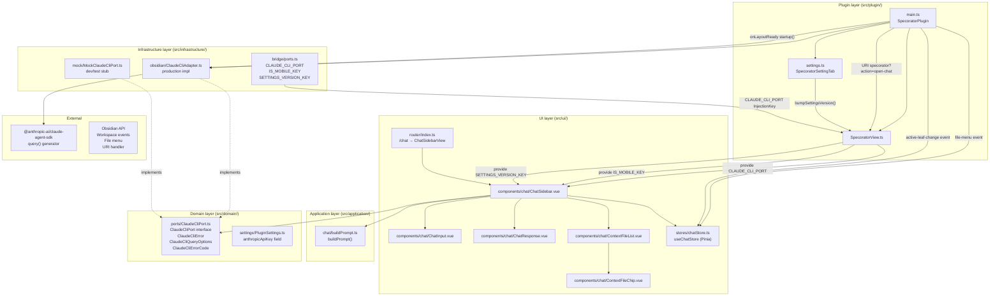

# Design — Claude CLI chat sidebar

---

## Part A — UX

### A1. User flows

#### Flow 1 — Open the chat panel

1. User is inside Obsidian with the Specorator panel closed or on a different route.
2. User clicks the Specorator ribbon icon **or** runs the "Open panel" command.
3. Specorator view opens in the right sidebar. The active route navigates to `/chat`.
4. `ChatSidebar` mounts. Availability check runs asynchronously (`ClaudeCliPort.isAvailable()`).
5. While the check is pending the panel renders nothing (blank — no flash of degraded copy).
6. Check resolves:
   - If platform is mobile — go to **Flow 5 (Mobile degraded)**.
   - If unavailable and API key is empty — go to **Flow 4a (No-key degraded)**.
   - If unavailable and API key is set — go to **Flow 4b (SDK-unavailable degraded)**.
   - If available — panel renders the ready state (title, context strip, input, response area). Focus moves to the text input.

Alternately the user may navigate directly to `/#/chat` via the URI `obsidian://specorator?action=open-chat`, which activates the same view.

The Chat nav tab in the top navigation bar is always present; clicking it from any other route performs a router push to `/chat`.

---

#### Flow 2 — Send a prompt

Pre-condition: panel is in the ready state; at least one context file may or may not be present.

1. User reads the context strip. Zero or more chips are shown. If no file is open, the empty-context hint is displayed inside the strip.
2. User clicks the text input (or it already has focus from mount).
3. User types a question. The send button label reads "Ask".
4. User submits via the "Ask" button or via Ctrl+Enter / Cmd+Enter.
5. **Empty guard:** if text is whitespace-only the submission is silently ignored; status stays idle.
6. Send begins:
   - Store status transitions to `loading`.
   - Send button becomes disabled and its label changes to "Asking…" with a spinner.
   - Context chip remove buttons are hidden (chips themselves stay visible as read-only context).
   - Text input becomes read-only.
7. File contents for all context entries are read from the vault in parallel. A failed read yields empty content without surfacing an error to the user.
8. `buildPrompt` assembles the payload. If the result is over budget, LIFO manual-file removal and then auto-file trimming reduce it; `truncated` is noted.
9. `ClaudeCliPort.query()` is awaited with a 30-second timeout.
10. On success:
    - If `truncated` is true — trim notice is shown above the response text. See copy in A3.
    - Response text is rendered in the response area.
    - Status returns to `idle`.
    - User text is cleared.
    - Focus returns to the text input.
11. On error — see **Flow 3 (Error states)**.

---

#### Flow 3 — Error states during a query

Pre-condition: a query is in flight (status is `loading`) and the adapter returns a failure.

**Timeout (errorCode `TIMEOUT`):**

1. Status transitions to `error`, `errorType` becomes `timeout`.
2. Response area renders the timeout message in place of any previous response.
3. Text input retains the user's original message so they can retry without retyping.
4. Send button is re-enabled. Focus returns to the text input.

**Generic query failure (any other errorCode):**

1. Status transitions to `error`, `errorType` becomes `query_failed`.
2. Response area renders the generic error message.
3. Text input retains the user's original message.
4. Send button is re-enabled. Focus returns to the text input.

In both error cases the context strip is unchanged. The user can edit the message, add or wait and resend.

---

#### Flow 4a — No-key degraded state

Pre-condition: `ClaudeCliPort.isAvailable()` resolved to `false` and `anthropicApiKey` is empty.

1. Panel renders a framed notice block (no input, no context strip, no title).
2. Heading reads: "Chat is not set up yet."
3. Body reads: "To use this feature, add your Anthropic key in Settings. Your key is stored privately on this device and is never shared."
4. A button-styled link labelled "Open settings" routes to `/settings`.
5. Programmatic focus is placed on the heading on mount.
6. User clicks "Open settings", completes key entry, and saves.
7. Settings save fires `bumpSettingsVersion()`. The `settingsVersion` watcher in `ChatSidebar` fires, re-calls `isAvailable()`, and if it now returns `true` the ready state replaces the degraded block without a page reload.

---

#### Flow 4b — SDK-unavailable degraded state

Pre-condition: `ClaudeCliPort.isAvailable()` resolved to `false` and `anthropicApiKey` is non-empty.

1. Panel renders a framed notice block (no input).
2. Heading reads: "AI assistant is not available right now."
3. Body reads: "The AI assistant could not start. This may be a temporary issue. If the problem continues, try restarting Obsidian."
4. No action link is shown.
5. Programmatic focus is placed on the heading on mount.
6. Settings version watcher is still active; if the user later enters or changes their API key, availability is re-checked live.

---

#### Flow 5 — Mobile degraded state

Pre-condition: `usePlatform().isMobile` is `true`.

1. This check runs before the availability check and takes precedence.
2. Panel renders a framed notice block.
3. Heading reads: "Chat is available on desktop only."
4. Body reads: "Open Obsidian on your Mac, Windows, or Linux computer to use the AI assistant."
5. No input, no context strip, no action link.
6. Programmatic focus is placed on the heading on mount.

---

#### Flow 6 — Add a file to context via right-click

Pre-condition: user is anywhere in Obsidian with the file explorer or an editor tab visible.

1. User right-clicks a vault file.
2. Obsidian file menu shows "Add to chat context" as an item.
3. User clicks the item.
4. `chatStore.addContextFile({ path, label, isAuto: false })` is called. Duplicate guard: if the path already exists in the store, the call is a no-op.
5. The Specorator view is activated and navigated to `/chat`.
6. The new chip appears in the context strip with a remove button.
7. Focus is not forcibly moved (the user was in the file explorer; returning focus would be disruptive).

---

#### Flow 7 — Remove a manual context file

Pre-condition: one or more manual (non-auto) chips are visible; status is not `loading`.

1. User identifies the chip to remove by its filename label.
2. User clicks the "×" remove button on the chip, or focuses the button and presses Enter or Space.
3. `store.removeContextFile(path)` is called.
4. The chip disappears from the strip immediately.
5. Focus is not explicitly managed after removal (browser default — focus may move to body; this is acceptable given there is no sensible adjacent target).

Auto chips (the currently open file) have no remove button. They cannot be removed manually.

---

### A2. Information architecture

#### Route placement

`/chat` is a top-level named route registered in `src/ui/router/index.ts`. It sits alongside `/`, `/features`, `/settings`, and `/file/:filePath`.

```
/                   Home
/features           Feature list
/settings           Settings
/chat               Chat sidebar   ← this feature
/file/:filePath     File viewer
```

`/chat` is wrapped by `MainLayout`, which provides the four-item top navigation bar. The "Chat" tab is the fourth item, rendered after Settings.

Tab order in the nav bar (left to right):
1. Home
2. Features
3. Settings
4. Chat

The Chat tab carries `data-testid="nav-link-chat"`.

#### Deep-link convention

- Internal navigation: `router.push({ name: 'chat' })` or `router.push('/chat')`
- External URI: `obsidian://specorator?action=open-chat`

The URI handler activates the Specorator view and dispatches an internal router navigation to `/chat`. No additional query parameters are defined for v1.

#### Panel hosting

The Specorator view (`SpecoratorView`) opens in Obsidian's right sidebar leaf. The entire plugin UI, including the Chat route, is hosted inside this single leaf via the embedded Vue application. There is no second, dedicated sidebar leaf for chat.

---

### A3. Empty, loading, and error state copy

All copy is derived from `src/ui/i18n/locales/en.ts` (`chat.*` keys) and the literal strings in the component templates. None of the strings below introduce terminology from the non-goals list (no "token", "context window", "system prompt", "Claude CLI", "SDK", "subprocess").

#### Context strip — empty (no file open)

> "No file is currently open. Open a file in your vault and it will be included here automatically."

Shown inside the context strip section when `store.contextFiles` is empty. This is an inline informational string, not a blocking state. The send input is still accessible.

#### Response area — idle (no query yet)

> "(Response will appear here.)"

Shown as a muted italic placeholder in the response area when `store.response` is null and status is idle.

#### Response area — loading (query in flight)

> "Thinking…"

Shown in the response area wrapped in `role="status"` with `aria-live="polite"`. The send button label simultaneously reads "Asking…".

#### Response area — trimmed-success (query succeeded, context was reduced)

Trim notice (shown above response text):
> "Some context was trimmed to keep the message within size limits."

The response text follows immediately below the notice. No blocking action is required from the user.

#### Response area — timeout error

> "That took too long. Please try again."

Rendered inside `role="alert"` with `aria-live="assertive"`. The user's input text is preserved.

#### Response area — generic error

> "Something went wrong. Please try again."

Rendered inside `role="alert"` with `aria-live="assertive"`. The user's input text is preserved.

#### Degraded — no API key

- **Heading:** "Chat is not set up yet."
- **Body:** "To use this feature, add your Anthropic key in Settings. Your key is stored privately on this device and is never shared."
- **Action link label:** "Open settings"

#### Degraded — SDK unavailable

- **Heading:** "AI assistant is not available right now."
- **Body:** "The AI assistant could not start. This may be a temporary issue. If the problem continues, try restarting Obsidian."
- No action link.

#### Degraded — mobile

- **Heading:** "Chat is available on desktop only."
- **Body:** "Open Obsidian on your Mac, Windows, or Linux computer to use the AI assistant."
- No action link.

---

### A4. Accessibility

#### Keyboard navigation order — ready state

When the chat panel is in the ready state the natural tab order from top to bottom is:

1. Navigation bar links (Home, Features, Settings, Chat) — these are `RouterLink` elements, keyboard-focusable by default.
2. Context strip — the strip itself carries `aria-label="Context for this message."` on the `<section>` wrapper. Auto chips are `<span>` elements (not interactive, not in tab order). Manual chip remove buttons are `<button>` elements and appear in tab order; each is labelled `aria-label="Remove <filename> from context"`. When status is `loading`, remove buttons are not rendered, so they vacate the tab order.
3. Text input (`<textarea>`) — `aria-label="Message"`, `aria-multiline="true"`. Receives programmatic focus on mount when the panel is in the ready state.
4. Send button — `aria-label="Send message"`. Disabled during loading (native HTML `disabled` attribute).

#### Keyboard shortcut

Ctrl+Enter (Windows/Linux) or Cmd+Enter (macOS) in the textarea fires the send action, equivalent to clicking the send button. This is the only non-standard keyboard shortcut; it is consistent with other multi-line input patterns users encounter in chat tools.

#### Focus management

| Event | Focus destination |
|---|---|
| Chat panel mounts — ready state | Text textarea (`ChatInput.textareaEl`) |
| Chat panel mounts — any degraded state | Degraded heading (`[data-testid="chat-degraded-heading"]`, `tabindex="-1"`) |
| Send succeeds | Text textarea |
| Send fails (timeout or error) | Text textarea |
| Manual chip removed | Browser default (no explicit management) |

The degraded heading has `tabindex="-1"` so it can receive programmatic focus without entering the normal tab sequence. Screen readers will announce the heading copy when focus arrives.

#### ARIA on the response area

| Component state | Element role | Live region |
|---|---|---|
| Loading | `role="status"` | `aria-live="polite"` |
| Timeout error | `role="alert"` | `aria-live="assertive"` |
| Generic error | `role="alert"` | `aria-live="assertive"` |
| Success | Plain `<div>` | (none — content is stable) |
| Trimmed-success trim notice | `role="status"` | `aria-live="polite"` |

#### ARIA on context chips

- Auto chip: The visual "(auto)" suffix is `aria-hidden="true"`. A visually hidden `<span class="sr-only">` reads "(included automatically)" so screen reader users receive the full meaning.
- The decorative indicator square on the auto chip is `aria-hidden="true"`.
- Manual chip remove button: `aria-label="Remove <filename> from context"` where `<filename>` is the chip's label value. The "×" glyph inside the button is `aria-hidden="true"`.

#### Context strip region

The `<section>` wrapping the context list carries `aria-label="Context for this message."`. The inner `<ul>` carries `aria-label="Context files"` with `role="list"`.

#### Send button disabled state

The send button uses the native HTML `disabled` attribute when `store.status === 'loading'`. This removes it from the tab order and announces as disabled to screen readers without needing `aria-disabled`.

#### Settings link in degraded state

The "Open settings" link is a `RouterLink` (renders as `<a>`) — keyboard-focusable and accessible by default.

#### Colour-independent communication

All state distinctions (active context, error, loading) are communicated through copy and structural change, not through colour alone. The trim notice uses a background change alongside its text; error states use explicit alert copy.

---

### A5. Requirements coverage (Part A)

| REQ ID | Description | Where addressed in Part A |
|---|---|---|
| REQ-CCS-005 | Active file auto-context | Flow 1 step 6 (ready state), Flow 2 step 1 |
| REQ-CCS-006 | Active file cleared when no file open | A3 — context strip empty copy |
| REQ-CCS-007 | Chat panel via ribbon and command | Flow 1 steps 1–3 |
| REQ-CCS-008 | URI handler open-chat | Flow 1 (alternate path); A2 deep-link convention |
| REQ-CCS-009 | Right-click "Add to chat context" | Flow 6 |
| REQ-CCS-010 | No-duplicate context files | Flow 6 step 4 (duplicate guard noted) |
| REQ-CCS-011 | Remove manual context file | Flow 7 |
| REQ-CCS-012 | Context truncation notice | A3 — trimmed-success copy; Flow 2 step 10 |
| REQ-CCS-013 | Send message and display response | Flow 2 steps 3–10 |
| REQ-CCS-014 | Loading state during query | Flow 2 step 6; A4 send button disabled state |
| REQ-CCS-015 | Empty message guard | Flow 2 step 5 |
| REQ-CCS-016 | Error state on query failure | Flow 3; A3 error copy |
| REQ-CCS-017 | userText retained on error | Flow 3 steps 3, 7 |
| REQ-CCS-018 | API key missing degraded state | Flow 4a; A3 degraded no-key copy |
| REQ-CCS-019 | SDK unavailable degraded state | Flow 4b; A3 degraded SDK-unavailable copy |
| REQ-CCS-020 | Mobile degraded state | Flow 5; A3 degraded mobile copy |
| REQ-CCS-024 | Settings change re-checks availability | Flow 4a step 6–7 |
| NFR-CCS-009 | Degraded headings receive programmatic focus | A4 focus management table |
| NFR-CCS-010 | Context chip remove buttons carry accessible labels | A4 ARIA on context chips |
| NFR-CCS-012 | No AI terminology in UI copy | A3 all copy verified against prohibited word list |

Requirements REQ-CCS-001 through REQ-CCS-004, REQ-CCS-021 through REQ-CCS-023, and REQ-CCS-025 through REQ-CCS-028 are infrastructure, port-interface, and settings-field requirements that have no UX surface; they are addressed in Part C (architect) or in the settings tab implementation.

---

---

## Part B — UI (visual design)

### B1. Component inventory

| File | Role |
|---|---|
| `src/ui/views/ChatSidebarView.vue` | Route component for `/chat`; thin shell that mounts `ChatSidebar` |
| `src/ui/components/chat/ChatSidebar.vue` | Orchestrator: availability check, active-file watcher, send handler, state branching between degraded and ready views |
| `src/ui/components/chat/ContextFileList.vue` | `<section>` container rendering the context-file chip list and the empty-state hint |
| `src/ui/components/chat/ContextFileChip.vue` | Single chip: auto variant (no remove) and manual variant (with remove button) |
| `src/ui/components/chat/ChatInput.vue` | `<textarea>` with `<button>` send control; exposes `textareaEl` ref for programmatic focus |
| `src/ui/components/chat/ChatResponse.vue` | Response area: renders one of six mutually exclusive states (`idle`, `loading`, `success`, `trimmed-success`, `timeout`, `error`) |

### B2. Design tokens (Obsidian CSS variables used)

| CSS variable | Where used |
|---|---|
| `--text-normal` | Panel title, chip labels, response text, degraded heading |
| `--text-muted` | Context-label caption, context-empty hint, loading text, idle placeholder, chip suffix, remove button icon |
| `--text-error` | Error message text (`ChatResponse` `.sp-chat__error`) |
| `--text-warning` (with `--text-muted` fallback) | Trim-notice text (`ChatResponse` `.sp-chat__trim-notice`) |
| `--background-primary` | Textarea background |
| `--background-secondary` | Degraded state block background; manual chip background |
| `--background-modifier-border` | Degraded block border; chip border; divider `<hr>`; textarea border; trim-notice background |
| `--background-modifier-hover` | Chip remove button hover/focus background |
| `--interactive-accent` | Textarea focus border colour; auto chip indicator square colour |
| `--font-text` | Textarea and response text font family |

No Specorator-custom CSS variables are introduced by this feature. All colours reference Obsidian theme tokens so the chat panel inherits any installed Obsidian theme automatically.

### B3. Microcopy source

All user-visible strings are sourced from `src/ui/i18n/locales/en.ts` under the `chat.*` namespace. No hardcoded English strings are introduced outside of the template literals in Vue component templates (which mirror the i18n values exactly for the degraded-state headings and body paragraphs, given that those are rendered as literal text nodes rather than via `$t()`).

Key i18n keys:

| Key | Value |
|---|---|
| `chat.title` | `Ask Claude.` |
| `chat.contextLabel` | `Context for this message.` |
| `chat.contextEmpty` | `No file is currently open. Open a file in your vault and it will be included here automatically.` |
| `chat.autoSuffix` | `(auto)` |
| `chat.autoSrOnly` | `(included automatically)` |
| `chat.dismissAriaLabel` | `Remove {label} from context` |
| `chat.inputPlaceholder` | `Ask anything about your work…` |
| `chat.inputAriaLabel` | `Message` |
| `chat.sendIdle` | `Ask` |
| `chat.sendLoading` | `Asking…` |
| `chat.sendAriaLabel` | `Send message` |
| `chat.responsePlaceholder` | `(Response will appear here.)` |
| `chat.responseLoading` | `Thinking…` |
| `chat.responseTrimmed` | `Some context was trimmed to keep the message within size limits.` |
| `chat.responseTimeout` | `That took too long. Please try again.` |
| `chat.responseError` | `Something went wrong. Please try again.` |
| `chat.degradedNoKeyHeading` | `Chat is not set up yet.` |
| `chat.degradedNoKeyBody` | `To use this feature, add your Anthropic key in Settings. Your key is stored privately on this device and is never shared.` |
| `chat.degradedNoKeyAction` | `Open settings` |
| `chat.degradedUnavailableHeading` | `AI assistant is not available right now.` |
| `chat.degradedUnavailableBody` | `The AI assistant could not start. This may be a temporary issue. If the problem continues, try restarting Obsidian.` |
| `chat.degradedMobileHeading` | `Chat is available on desktop only.` |
| `chat.degradedMobileBody` | `Open Obsidian on your Mac, Windows, or Linux computer to use the AI assistant.` |
| `chat.addToContext` | `Add to chat context` |

### B4. Requirements coverage (Part B)

| REQ ID | Where addressed in Part B |
|---|---|
| REQ-CCS-012 | B1 `ChatResponse` — `trimmed-success` state renders trim notice |
| REQ-CCS-013 | B1 `ChatSidebar` send handler; `ChatResponse` success state |
| REQ-CCS-014 | B1 `ChatInput` disabled prop; `ContextFileList` disabled prop hides remove buttons |
| REQ-CCS-016 | B1 `ChatResponse` timeout/error states; B3 error copy |
| REQ-CCS-018 | B1 `ChatSidebar` degraded no-key branch; B3 degraded-no-key copy |
| REQ-CCS-019 | B1 `ChatSidebar` degraded unavailable branch; B3 degraded-unavailable copy |
| REQ-CCS-020 | B1 `ChatSidebar` mobile degraded branch; B3 degraded-mobile copy |
| NFR-CCS-010 | B1 `ContextFileChip` — `aria-label` on remove button from B3 `dismissAriaLabel` |
| NFR-CCS-012 | B3 — verified: no prohibited term appears in any `chat.*` value |

---

## Part C — Architecture

### C1. System overview



### C2. Component responsibilities

| Component | Single responsibility |
|---|---|
| `ClaudeCliPort` (interface) | Declare the four-method narrow port contract; define `ClaudeCliError`, `ClaudeCliErrorCode`, `ClaudeCliQueryOptions` |
| `ClaudeCliAdapter` | Resolve the SDK binary, manage `_available`/`_sdkReady` flags, call `sdkQuery`, enforce the timeout race, map errors to `ClaudeCliErrorCode`, never log the API key |
| `MockClaudeCliPort` | Provide a configurable test/dev stub: `available`, `cannedResponse`, `queryError`, `delayMs`, `queryLog` |
| `buildPrompt()` | Assemble the final prompt string from user text and context file contents; enforce the LIFO manual-removal + auto-file-trim + hard-truncate algorithm; return `{ prompt, truncated }` |
| `useChatStore` | Hold the chat panel's DTO state: `contextFiles`, `userText`, `response`, `status`, `errorType`, `truncated`; expose typed actions |
| `ChatSidebar.vue` | Orchestrate the availability check, active-file subscription, send flow, error mapping, and state branching between degraded and ready views |
| `ChatInput.vue` | Render the textarea and send button; expose `textareaEl` for programmatic focus; emit `send` on button click or Ctrl+Enter |
| `ChatResponse.vue` | Render one of six response states as a pure display component given `state` and optional `text` props |
| `ContextFileList.vue` | Render the chip list section, the empty-state hint, and the `disabled` forwarding to chips |
| `ContextFileChip.vue` | Render auto or manual chip variant; emit `remove` for manual chips |
| `SpecoratorView` | Host the Vue application; provide all injection keys; expose `navigateTo` and `bumpSettingsVersion`; hold the `_settingsVersion` reactive counter |
| `main.ts` (`SpecoratorPlugin`) | Wire Obsidian lifecycle: instantiate adapter, register view, ribbon, commands, file-menu handler, active-leaf handler, URI handler, and `onLayoutReady` startup |

### C3. Data model changes

#### New field on `PluginSettings`

```typescript
// src/domain/settings/PluginSettings.ts
interface PluginSettings {
  // ... existing fields ...
  readonly anthropicApiKey: string  // default: ''
}
```

Stored in the `specorator` sub-key of the plugin data blob via `this.saveData()`. Never written to any vault file. Subject to Obsidian Sync if the user has Sync enabled (disclosed in settings UI per REQ-CCS-028).

#### New Pinia store — `chatStore`

State shape (all fields are `ref<T>`):

| Field | Type | Initial value | Semantics |
|---|---|---|---|
| `contextFiles` | `ContextFileEntry[]` | `[]` | Ordered list; auto entry at index 0 when present |
| `userText` | `string` | `''` | Bound to textarea; cleared on success, retained on error |
| `response` | `string \| null` | `null` | Last successful response text |
| `status` | `ChatStatus` | `'idle'` | `'idle' \| 'loading' \| 'error'` |
| `errorType` | `ChatErrorType \| null` | `null` | `'timeout' \| 'query_failed' \| null` |
| `truncated` | `boolean` | `false` | True when `buildPrompt` removed content to stay within the cap |

`ContextFileEntry` shape:

```typescript
interface ContextFileEntry {
  readonly path: string    // vault-relative, used as unique key
  readonly label: string   // filename for chip display
  readonly isAuto: boolean // true = active editor file; false = manually added
}
```

`ContextFileEntry` is a plain DTO. No domain class instances cross the store boundary (per ADR-003). File content is never stored in the store; it is loaded on-demand from `VaultPort.readFile()` at send time.

#### No vault schema changes

No new vault files are created or read as part of the chat feature itself. Context files are read transiently from the vault at send time and discarded after prompt assembly. Conversation history is not persisted (NG1).

### C4. Data flows

#### Flow A — Send a message (happy path)

```
User submits text in ChatInput
  → ChatSidebar.handleSend()
    [guard: userText.trim() is non-empty]
    [guard: store.status !== 'loading']
    [guard: available === true]
  → store.beginRequest()           // status='loading', clears response/errorType/truncated
  → VaultPort.readFile(path) × N  // parallel reads for all context files; errors yield ''
  → buildPrompt(userText, loadedFiles)
      → assemblePrompt() → string
      → LIFO manual file removal if over charBudget
      → auto file trim if still over charBudget
      → hard-truncate if still over charBudget
      → returns { prompt, truncated }
  → ClaudeCliPort.query(prompt, { timeoutMs: 30_000 })
      → ClaudeCliAdapter._runSdkQuery(prompt, controller)
          → sdkQuery({ prompt, options: { maxTurns: 1, abortController } })
          → iterates generator for message.type === 'result'
          → returns resultText
      → on success: ok(resultText)
  → store.setResponse(resultText, truncated)   // status='idle'
  → store.setUserText('')
  → focusTextarea()
```

#### Flow B — Query timeout

```
ClaudeCliPort.query()
  → setTimeout fires at timeoutMs → controller.abort() → rejects with ClaudeCliError{TIMEOUT}
  → Promise.race resolves with the rejection
  → _mapError(e) → returns ClaudeCliError{TIMEOUT}
  → err(ClaudeCliError{TIMEOUT}) returned to ChatSidebar
  → store.setError('timeout')   // status='error', errorType='timeout', userText retained
  → focusTextarea()
```

#### Flow C — Settings change re-checks availability

```
User saves API key in SpecoratorSettingTab
  → plugin.updateSettings({ anthropicApiKey })
  → specoratorView.bumpSettingsVersion()        // _settingsVersion.value++
  → SETTINGS_VERSION_KEY reactive ref increments
  → ChatSidebar watch(settingsVersion) fires
  → claudeCliPort.isAvailable()
      → ClaudeCliAdapter.isAvailable()
          → returns _available && settings.anthropicApiKey.trim() !== ''
  → available.value updated
  → template re-renders (degraded vs. ready)
```

#### Flow D — Right-click file menu

```
User right-clicks a vault file
  → Obsidian fires 'file-menu' workspace event
  → main.ts handler adds "Add to chat context" menu item
  → User clicks the item
  → plugin.activateView()
  → useChatStore(specoratorView.pinia).addContextFile({ path, label, isAuto: false })
      → duplicate guard: no-op if path already in contextFiles
      → appends ContextFileEntry to contextFiles
```

#### Flow E — Active file tracking

```
Obsidian fires 'active-leaf-change' workspace event
  → main.ts handler reads app.workspace.getActiveFile()
  → useChatStore(specoratorView.pinia).setActiveFile(file | null)
      → removes existing isAuto entry
      → if non-null: inserts { path, label, isAuto: true } at index 0
```

### C5. API / interaction contracts

#### `ClaudeCliPort` interface (exact TypeScript)

```typescript
// src/domain/ports/ClaudeCliPort.ts

export type ClaudeCliErrorCode =
  | 'NOT_INSTALLED'
  | 'API_KEY_MISSING'
  | 'TIMEOUT'
  | 'QUERY_FAILED'

export class ClaudeCliError extends Error {
  public readonly name = 'ClaudeCliError'
  constructor(
    public readonly errorCode: ClaudeCliErrorCode,
    message: string,
    public readonly cause?: unknown,
  ) { super(message) }
}

export interface ClaudeCliQueryOptions {
  readonly timeoutMs?: number   // default 30 000; clamped to [1 000, 300 000]
  readonly maxTurns?: number    // clamped to 1 in v1
}

export interface ClaudeCliPort {
  query(prompt: string, options?: ClaudeCliQueryOptions): Promise<Result<string, ClaudeCliError>>
  isAvailable(): Promise<boolean>
  startup(): Promise<void>
  shutdown(): void
}
```

The file imports only `Result` from `@/domain/shared/Result`. No import from `obsidian` or `@anthropic-ai/claude-agent-sdk` is present (REQ-CCS-021, NFR-CCS-011).

#### `buildPrompt()` function signature and algorithm

```typescript
// src/application/chat/buildPrompt.ts

export function buildPrompt(
  userText: string,
  contextFiles: ReadonlyArray<ContextFile>,
  options?: { readonly tokenCap?: number },  // default 50 000
): BuildPromptResult
// BuildPromptResult = { prompt: string, truncated: boolean }
```

Algorithm (seven steps):

1. Compute `charBudget = (tokenCap ?? 50_000) × 4`.
2. Assemble full prompt via `assemblePrompt(userText, contextFiles)`.
   - Format when `files.length > 0`: `"The following files are provided for context:\n\n" + fileSections + "---\n\n" + userText`
   - Format when `files.length === 0`: `userText`
3. If `fullPrompt.length <= charBudget` → return `{ prompt: fullPrompt, truncated: false }`.
4. Separate `autoFiles` and `manualFiles` (mutable copy for LIFO removal).
5. While `assembled.length > charBudget && manualFiles.length > 0`: pop last manual file, reassemble.
6. If now within budget → return `{ prompt: assembled, truncated: true }`.
7. If auto file exists and still over budget: trim `autoFile.content` from the end, preserving at minimum `MIN_ACTIVE_FILE_CHARS = 500` characters; reassemble.
8. If still over budget (e.g., `userText` alone exceeds budget): hard-truncate `assembled` to `charBudget`.
9. Return `{ prompt: assembled, truncated: true }`.

#### Injection keys

```typescript
// src/infrastructure/bridge/ports.ts

export const CLAUDE_CLI_PORT: InjectionKey<ClaudeCliPort> = Symbol('ClaudeCliPort')
export const IS_MOBILE_KEY: InjectionKey<boolean> = Symbol('IsMobile')
export const SETTINGS_VERSION_KEY: InjectionKey<Ref<number>> = Symbol('settingsVersion')
```

`SETTINGS_VERSION_KEY` holds a `Ref<number>` that `SpecoratorView` owns and increments via `bumpSettingsVersion()`. `ChatSidebar` watches it with `watch(settingsVersion, ...)` to re-check adapter availability after a settings save.

### C6. `ClaudeCliAdapter` — class outline

`src/infrastructure/obsidian/ClaudeCliAdapter.ts`

```
class ClaudeCliAdapter implements ClaudeCliPort
  private _available: boolean          // true only after startup() succeeds
  private _sdkReady: boolean           // guards idempotent startup
  private _getSettings: () => PluginSettings
  private _logger: LoggerPort
  private _resolveCliPath: () => string  // injectable for testability

  startup(): Promise<void>
    1. Idempotency: return early if _sdkReady
    2. Read key; if empty, set _available=false and return
    3. Set process.env.ANTHROPIC_API_KEY = key
    4. Resolve binary path via _resolveCliPath(); catch → _available=false, return
    5. Validate binary path is absolute; if not → _available=false, return
    6. Set _sdkReady=true, _available=true

  query(prompt, options?): Promise<Result<string, ClaudeCliError>>
    - Guard: return err if !_available (with _unavailableCode())
    - Re-read key at call time; if empty → err API_KEY_MISSING
    - Clamp timeout to [1 000, 300 000] ms
    - Clamp maxTurns to 1 (log warn if > 1)
    - Race: _runSdkQuery(prompt, AbortController) vs. timeout promise
    - Catch any error → _mapError()
    - Finally: clearTimeout, controller.abort()

  isAvailable(): Promise<boolean>
    → _available && _getSettings().anthropicApiKey.trim() !== ''

  shutdown(): void
    → _sdkReady=false, _available=false (synchronous, never throws)

  private _runSdkQuery(prompt, controller): Promise<string>
    → sdkQuery({ prompt, options: { maxTurns: 1, abortController: controller } })
    → iterates async generator; collects message.type === 'result'
    → throws if no result message received

  private _mapError(e, timeoutMs): ClaudeCliError
    → ClaudeCliError{TIMEOUT} passthrough
    → API key / auth patterns → API_KEY_MISSING (key value never logged)
    → Error instance → QUERY_FAILED
    → unknown → QUERY_FAILED

  private _unavailableCode(): 'API_KEY_MISSING' | 'NOT_INSTALLED'
    → API_KEY_MISSING if key is empty, NOT_INSTALLED otherwise

  private _clampTimeout(raw?): number
    → Math.min(Math.max(raw ?? 30_000, 1_000), 300_000)
```

### C7. `MockClaudeCliPort` — configuration fields

`src/infrastructure/mock/MockClaudeCliPort.ts`

| Field | Type | Default | Purpose |
|---|---|---|---|
| `available` | `boolean` | `false` | Controls `isAvailable()` return value and `query()` no-op branch |
| `cannedResponse` | `string` | `'Mock response from MockClaudeCliPort.'` | Text returned on success |
| `queryError` | `ClaudeCliError \| null` | `null` | If non-null, `query()` returns this error |
| `delayMs` | `number` | `0` | Artificial delay before `query()` resolves (simulates latency) |
| `queryLog` | `string[]` (readonly) | `[]` | Append-only log of every prompt passed to `query()` |

`startup()` and `shutdown()` are no-ops. `isAvailable()` returns `available`. When `available === false`, `query()` returns `err(ClaudeCliError{ NOT_INSTALLED })` without logging.

### C8. Plugin wiring (main.ts)

#### Lifecycle events

| Obsidian hook | Action |
|---|---|
| `onload()` | Instantiate `ClaudeCliAdapter`; register `shutdown()` via `this.register()`; register the `SpecoratorView` view factory; add ribbon icon; add commands; register `file-menu` and `active-leaf-change` events; register `specorator` URI handler; add settings tab |
| `onLayoutReady()` (inside `onload`) | Call `ClaudeCliAdapter.startup()` (fire-and-forget); detect legacy vault layout |
| `onunload()` | Detach view leaves; `core.destroy()`; adapter `shutdown()` fires via the registered cleanup function |

#### File-menu handler

Registered with `this.app.workspace.on('file-menu', ...)`. On item click:
1. `activateView()` — opens or reveals the Specorator leaf.
2. `useChatStore(specoratorView.pinia).addContextFile({ path: file.path, label: file.name, isAuto: false })` — guarded by the store's duplicate check.

Applies to all vault files regardless of type (no TFile extension filter — `TFolder` instances do not receive file-menu events in practice).

#### Active-leaf-change handler

Registered with `this.app.workspace.on('active-leaf-change', ...)`. On fire:
- Reads `app.workspace.getActiveFile()`.
- Calls `store.setActiveFile(file | null)` on the view's Pinia instance.
- Guards against `_specoratorView?.pinia` being undefined (view not yet opened).

#### URI handler

Registered with `this.registerObsidianProtocolHandler('specorator', ...)`.

| `action` value | Behaviour |
|---|---|
| `open-chat` or `focus-chat` | `activateView()` then `specoratorView.navigateTo('/chat')` |
| `send-message` or `open-workflow` | `bridge.showInfo("URI action … is not yet implemented.")` |
| anything else | `bridge.showWarning("Unknown Specorator URI action: …")` |
| any value handled by `PluginCore.handleUri()` | Delegated to core; handler returns early |

#### Settings-version bump

`SpecoratorSettingTab` calls `specoratorView.bumpSettingsVersion()` from the `onChange` handler of the Anthropic API key input field. This increments `_settingsVersion.value`, which `ChatSidebar` watches via `SETTINGS_VERSION_KEY`.

### C9. Key decisions

| Decision | Rationale | ADR |
|---|---|---|
| Context assembled as a single user-turn preamble | Keeps the `ClaudeCliPort.query()` signature SDK-agnostic; `buildPrompt` testable without any SDK dependency | ADR-0027 |
| `anthropicApiKey` stored in top-level `PluginSettings` | Adapter must be instantiatable before `PluginCore` loads modules; consistent with other plugin-wide fields | ADR-0028 |
| `ClaudeCliPort` as a narrow domain-layer port | Consistent with ADR-008; allows `MockClaudeCliPort` for dev/test without subprocess; enables future SDK swap | ADR-008 |
| `maxTurns` clamped to 1 in v1 | Defers multi-turn complexity (NG2); adapter logs a warn if caller passes `> 1`, so the contract is visible | — |
| No streaming in v1 | Response buffered and displayed as a complete string (NG3); simplifies error handling and `ChatResponse` state model | — |
| No conversation history persistence | Memory-only in v1 (NG1); avoids vault write complexity for the initial release | — |
| `SETTINGS_VERSION_KEY` reactive counter pattern | Avoids a direct coupling from the settings tab to `ChatSidebar`; the view mediates the signal via `bumpSettingsVersion()` | — |
| `process.env.ANTHROPIC_API_KEY` written at startup and re-written at query time | SDK reads the key from the environment at call time; re-reading at query time means settings changes take effect without an adapter restart | — |

### C10. Rejected alternatives

| Alternative | Why rejected |
|---|---|
| Expose a `systemPrompt` parameter on `ClaudeCliPort.query()` | Would leak SDK semantics through the narrow port; violates NFR-CCS-012 (no "system prompt" in user surface) |
| Store conversation history in a vault file | NG1; adds vault-write complexity and opens vault-pollution concerns for v1 |
| Streaming (`queryStream()`) | NG3; requires `ChatResponse` to handle partial-update state machine; deferred to v2 |
| Separate Vue leaf for chat | NG — only one leaf is used (ADR-003 convention); routing within the single leaf is simpler |
| Store `anthropicApiKey` in a module sub-key | Requires `PluginCore` to be fully loaded before adapter initialisation; creates startup-ordering fragility (see ADR-0028) |
| `ClaudeCliPort` in the application layer | Would break the inward-only import direction (domain ← application); the port must live in the domain layer per ADR-001 and ADR-008 |
| `useBridge()` aggregate injection for `ClaudeCliPort` | `useBridge` / `IBridge` are deleted symbols; per-port injection is enforced by ESLint (ADR-008) |

### C11. Requirements coverage (Part C)

| REQ ID | Where addressed in Part C |
|---|---|
| REQ-CCS-001 | C9 (`anthropicApiKey` in `PluginSettings`); ADR-0028 |
| REQ-CCS-002 | C6 `startup()` — key trimmed via `.trim()` before writing to env |
| REQ-CCS-003 | C6 `startup()` deferred to `onLayoutReady`; C8 lifecycle table |
| REQ-CCS-004 | C6 `shutdown()` — synchronous, registered via `this.register()`; C8 lifecycle table |
| REQ-CCS-005 | C8 active-leaf-change handler; C4 Flow E |
| REQ-CCS-006 | C8 active-leaf-change handler (null case); C3 `setActiveFile(null)` |
| REQ-CCS-007 | C8 ribbon icon and command registration |
| REQ-CCS-008 | C8 URI handler (`open-chat` / `focus-chat`); C4 (implicitly) |
| REQ-CCS-009 | C8 file-menu handler; C4 Flow D |
| REQ-CCS-010 | C3 `addContextFile` duplicate guard |
| REQ-CCS-011 | C3 `removeContextFile` action |
| REQ-CCS-012 | C5 `buildPrompt` `truncated` return value; C4 Flow A |
| REQ-CCS-013 | C4 Flow A; C5 `ClaudeCliPort.query()` contract |
| REQ-CCS-014 | C3 `beginRequest()` sets `status='loading'` |
| REQ-CCS-015 | C4 Flow A guard: `userText.trim()` is non-empty |
| REQ-CCS-016 | C4 Flow B; C6 `_mapError()`; C3 `setError()` |
| REQ-CCS-017 | C3 store: `userText` not cleared by `setError()` |
| REQ-CCS-018 | C5 `isAvailable()` returns false when key empty; C4 Flow C |
| REQ-CCS-019 | C6 `_unavailableCode()` returns `NOT_INSTALLED` when key non-empty |
| REQ-CCS-020 | C5 `IS_MOBILE_KEY`; C1 `Platform.isMobile` provided in `SpecoratorView.onOpen()` |
| REQ-CCS-021 | C5 `ClaudeCliPort` interface — exactly four methods; no forbidden imports |
| REQ-CCS-022 | C6 `isAvailable()` — never throws; returns `_available && key !== ''` |
| REQ-CCS-023 | C7 `MockClaudeCliPort.available` defaults to `false` |
| REQ-CCS-024 | C4 Flow C; C9 `SETTINGS_VERSION_KEY` counter pattern |
| REQ-CCS-025 | C5 `buildPrompt` algorithm step 2 — exact preamble format; ADR-0027 |
| REQ-CCS-026 | C5 `buildPrompt` algorithm step 5 — LIFO manual file removal |
| REQ-CCS-027 | C5 `buildPrompt` algorithm step 7 — auto file trim with `MIN_ACTIVE_FILE_CHARS = 500` floor |
| REQ-CCS-028 | ADR-0028 Consequences — settings description must mention Obsidian Sync |
| NFR-CCS-001 | C5 `buildPrompt()` — pure function, no I/O |
| NFR-CCS-002 | C8 — `startup()` deferred to `onLayoutReady`; `onload()` completes before startup |
| NFR-CCS-003 | C6 `_clampTimeout()` — clamps to [1 000, 300 000] |
| NFR-CCS-004 | C7 — `MockClaudeCliPort` all five config fields listed |
| NFR-CCS-005 | C6 `_mapError()` — auth errors logged without key value; `startup()` logs only presence/absence |
| NFR-CCS-006 | ADR-0028 Compliance — `type='password'`, `autocomplete='off'` |
| NFR-CCS-007 | C6 `shutdown()` — synchronous, never throws |
| NFR-CCS-008 | C5 `buildPrompt` algorithm step 8 — hard-truncate fallback |
| NFR-CCS-011 | C5 `ClaudeCliPort` — no imports from `obsidian` or SDK |
