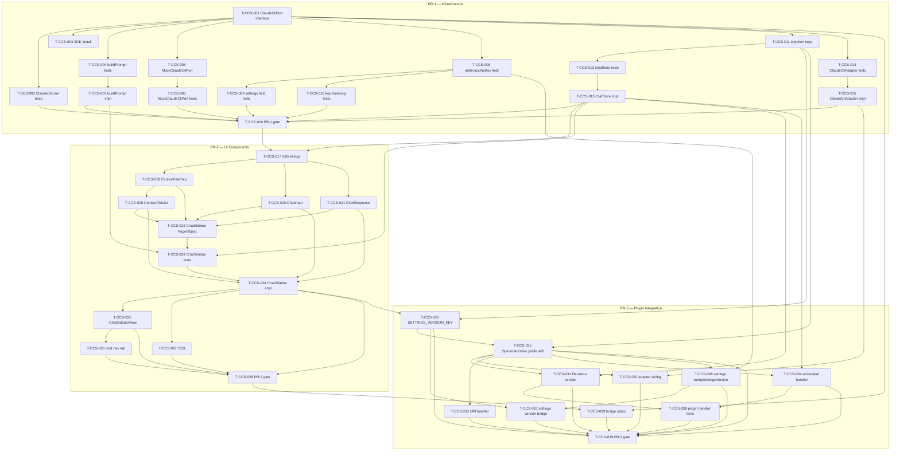

# Tasks — Claude CLI chat sidebar

> **Retrospective record.** All three PRs are merged to `develop`. This document reconstructs the task breakdown as it was actually executed, derived from `implementation-log.md`, `spec.md`, and `requirements.md`. Status for every task is `completed`.

## Legend

- 🧪 = test task
- 🔨 = implementation task
- 📐 = design / scaffolding task
- 📚 = documentation task
- 🚀 = release / ops task

---

## PR-1 — Infrastructure

### T-CCS-001 📐 — ClaudeCliPort domain interface

- **Description:** Create `src/domain/ports/ClaudeCliPort.ts` defining `ClaudeCliErrorCode`, `ClaudeCliError`, `ClaudeCliQueryOptions`, and the `ClaudeCliPort` interface. Re-export from `src/domain/ports/index.ts`. Install the `@anthropic-ai/claude-agent-sdk` npm package.
- **Satisfies:** REQ-CCS-021, REQ-CCS-022, NFR-CCS-011
- **Owner:** dev
- **PR group:** PR-1
- **Depends on:** —
- **Estimate:** S
- **Status:** completed (commit `8391d7a`)
- **Definition of done:**
  - [x] `ClaudeCliPort.ts` declares exactly four methods: `query`, `isAvailable`, `startup`, `shutdown`.
  - [x] File contains zero imports from `obsidian` or `@anthropic-ai/claude-agent-sdk`.
  - [x] `ClaudeCliError` restores prototype chain via `Object.setPrototypeOf(this, new.target.prototype)`.
  - [x] `ClaudeCliErrorCode` union contains exactly: `NOT_INSTALLED`, `API_KEY_MISSING`, `TIMEOUT`, `QUERY_FAILED`.
  - [x] Re-exports added to `src/domain/ports/index.ts`.
  - [x] `@anthropic-ai/claude-agent-sdk` in `package.json` dependencies.

---

### T-CCS-002 🧪 — Tests for ClaudeCliError prototype and error codes

- **Description:** Write unit tests for `ClaudeCliError`: prototype chain integrity (`instanceof` check), `errorCode` field, `message`, optional `cause`, and each error code value.
- **Satisfies:** REQ-CCS-021, REQ-CCS-022
- **Owner:** qa
- **PR group:** PR-1
- **Depends on:** T-CCS-001
- **Estimate:** S
- **Status:** completed (commit `8391d7a`, `tests/domain/ports/ClaudeCliPort.test.ts`, 8 tests)
- **Definition of done:**
  - [x] 8 tests in `tests/domain/ports/ClaudeCliPort.test.ts`.
  - [x] All prototype-chain, errorCode, and cause scenarios covered.
  - [x] All 8 tests pass.

---

### T-CCS-003 📐 — Install `@anthropic-ai/claude-agent-sdk`

- **Description:** Add SDK dependency to `package.json`; update lockfile. Included in T-CCS-001 commit.
- **Satisfies:** REQ-CCS-003
- **Owner:** dev
- **PR group:** PR-1
- **Depends on:** —
- **Estimate:** S
- **Status:** completed (commit `8391d7a`, part of T-CCS-001)
- **Definition of done:**
  - [x] `@anthropic-ai/claude-agent-sdk` present in `package.json` dependencies.
  - [x] `package-lock.json` updated.
  - [x] `npm audit --audit-level=high --omit=dev` reports 0 vulnerabilities.

---

### T-CCS-004 🧪 — Tests for buildPrompt algorithm

- **Description:** Write unit tests for `buildPrompt()` covering: empty context files, exact format output for one file, multiple files in order, LIFO manual removal, auto-file trimming, hard-truncation fallback, custom `tokenCap`, and purity (no side effects).
- **Satisfies:** REQ-CCS-025, REQ-CCS-026, REQ-CCS-027, NFR-CCS-001, NFR-CCS-008
- **Owner:** qa
- **PR group:** PR-1
- **Depends on:** T-CCS-001
- **Estimate:** S
- **Status:** completed (commit `ebe9993`, `tests/application/chat/buildPrompt.test.ts`, 13 tests)
- **Definition of done:**
  - [x] 13 tests in `tests/application/chat/buildPrompt.test.ts`.
  - [x] Covers scenarios TEST-CCS-BP-001 through TEST-CCS-BP-010.
  - [x] All 13 tests pass.

---

### T-CCS-007 🔨 — buildPrompt application service

- **Description:** Implement `src/application/chat/buildPrompt.ts`: `ContextFile` and `BuildPromptResult` types; constants `DEFAULT_TOKEN_CAP`, `CHARS_PER_TOKEN`, `MIN_ACTIVE_FILE_CHARS`; the 8-step LIFO cap algorithm.
- **Satisfies:** REQ-CCS-025, REQ-CCS-026, REQ-CCS-027, NFR-CCS-001, NFR-CCS-008
- **Owner:** dev
- **PR group:** PR-1
- **Depends on:** T-CCS-004
- **Estimate:** M
- **Status:** completed (commit `ebe9993`)
- **Definition of done:**
  - [x] T-CCS-004 tests pass.
  - [x] Algorithm steps 1–9 from SPEC-CCS-001 §3.5 implemented correctly.
  - [x] `result.prompt.length <= charBudget` holds for all inputs.
  - [x] Pure function — no I/O, no state mutations.
  - [x] Lint and type checks green.

---

### T-CCS-005 🔨 — MockClaudeCliPort test double

- **Description:** Implement `src/infrastructure/mock/MockClaudeCliPort.ts` with configurable `available`, `cannedResponse`, `queryError`, `delayMs`, and `queryLog` fields implementing all `ClaudeCliPort` methods. Add ESLint override for `prefer-active-window-timers` on mock infra layer.
- **Satisfies:** REQ-CCS-022, REQ-CCS-023, NFR-CCS-004
- **Owner:** dev
- **PR group:** PR-1
- **Depends on:** T-CCS-001
- **Estimate:** S
- **Status:** completed (commit `ae1bb2c`)
- **Definition of done:**
  - [x] `isAvailable()` defaults to `false` (REQ-CCS-023).
  - [x] `startup()` and `shutdown()` are no-ops that do not throw (NFR-CCS-007).
  - [x] `query()` appends to `queryLog` even when unavailable.
  - [x] `queryError`, `delayMs`, and `cannedResponse` control output.
  - [x] ESLint override scoped to `src/infrastructure/mock/**`.

---

### T-CCS-006 🧪 — Tests for MockClaudeCliPort

- **Description:** Write unit tests for all `MockClaudeCliPort` method branches and field defaults, covering scenarios TEST-CCS-MOCK-001 through TEST-CCS-MOCK-007.
- **Satisfies:** REQ-CCS-022, REQ-CCS-023, NFR-CCS-004, NFR-CCS-007
- **Owner:** qa
- **PR group:** PR-1
- **Depends on:** T-CCS-005
- **Estimate:** S
- **Status:** completed (commit `ae1bb2c`, `tests/infrastructure/mock/MockClaudeCliPort.test.ts`, 13 tests)
- **Definition of done:**
  - [x] 13 tests in `tests/infrastructure/mock/MockClaudeCliPort.test.ts`.
  - [x] All 7 MOCK scenarios (TEST-CCS-MOCK-001 through TEST-CCS-MOCK-007) covered.
  - [x] All 13 tests pass.

---

### T-CCS-014 🧪 — Tests for ClaudeCliAdapter

- **Description:** Write unit tests for `ClaudeCliAdapter`: startup paths (empty key, resolver throws, success), `isAvailable()`, `query()` (unavailable, success, timeout, error), and `shutdown()` lifecycle.
- **Satisfies:** REQ-CCS-002, REQ-CCS-003, REQ-CCS-004, REQ-CCS-016, REQ-CCS-022, NFR-CCS-003, NFR-CCS-005, NFR-CCS-007
- **Owner:** qa
- **PR group:** PR-1
- **Depends on:** T-CCS-001
- **Estimate:** S
- **Status:** completed (commit `6cf7184`, `tests/infrastructure/obsidian/ClaudeCliAdapter.test.ts`, 16 tests)
- **Definition of done:**
  - [x] 16 tests in `tests/infrastructure/obsidian/ClaudeCliAdapter.test.ts`.
  - [x] Startup paths (empty key, binary not found, success) each have a test.
  - [x] Timeout, API error, and unknown error paths tested.
  - [x] Shutdown resets `_sdkReady` and `_available`.
  - [x] API key value never appears in any logged output (NFR-CCS-005).
  - [x] All 16 tests pass.

---

### T-CCS-015 🔨 — ClaudeCliAdapter production implementation

- **Description:** Implement `src/infrastructure/obsidian/ClaudeCliAdapter.ts` with injectable `resolveCliPath`; `startup()` sets `ANTHROPIC_API_KEY`; `query()` uses `Promise.race` with `setTimeout` for timeout; private helpers `_unavailableCode`, `_clampTimeout`, `_makeTimeoutPromise`, `_runSdkQuery`, `_mapError`.
- **Satisfies:** REQ-CCS-002, REQ-CCS-003, REQ-CCS-004, REQ-CCS-016, REQ-CCS-022, NFR-CCS-003, NFR-CCS-005, NFR-CCS-007
- **Owner:** dev
- **PR group:** PR-1
- **Depends on:** T-CCS-014
- **Estimate:** M
- **Status:** completed (commit `6cf7184`)
- **Definition of done:**
  - [x] T-CCS-014 tests pass.
  - [x] `startup()` idempotent (early return on `_sdkReady === true`).
  - [x] `_clampTimeout()` returns value in `[1_000, 300_000]` range (NFR-CCS-003).
  - [x] `_mapError()` never logs API key value (NFR-CCS-005).
  - [x] `shutdown()` synchronous; sets `_sdkReady = false`, `_available = false`.
  - [x] Complexity rule satisfied via 5 private helper methods.
  - [x] Lint (with `eslint-disable-next-line` for `prefer-active-window-timers`) and type checks green.

---

### T-CCS-011 🔨 — Injection keys and composables

- **Description:** Add `CLAUDE_CLI_PORT` and `IS_MOBILE_KEY` injection keys to `src/infrastructure/bridge/ports.ts`. Create `src/ui/composables/useClaudeCliPort.ts` (strict inject) and `src/ui/composables/usePlatform.ts` (`inject(IS_MOBILE_KEY, false)`).
- **Satisfies:** REQ-CCS-021, REQ-CCS-020
- **Owner:** dev
- **PR group:** PR-1
- **Depends on:** T-CCS-001
- **Estimate:** S
- **Status:** completed (commit `8ff9b13`)
- **Definition of done:**
  - [x] `CLAUDE_CLI_PORT: InjectionKey<ClaudeCliPort>` and `IS_MOBILE_KEY: InjectionKey<boolean>` in `ports.ts`.
  - [x] `useClaudeCliPort()` throws if `CLAUDE_CLI_PORT` is not provided.
  - [x] `usePlatform()` returns `{ isMobile: boolean }` defaulting to `false`.
  - [x] No direct import of `obsidian` in composable files (ADR-008).

---

### T-CCS-012 🧪 — Tests for chatStore state machine

- **Description:** Write unit tests for all `useChatStore()` actions and state transitions, including dedup logic, null handling, and reset behavior. Covers scenarios TEST-CCS-STORE-001 through TEST-CCS-STORE-008.
- **Satisfies:** REQ-CCS-005, REQ-CCS-006, REQ-CCS-009, REQ-CCS-010, REQ-CCS-011, REQ-CCS-013, REQ-CCS-014, REQ-CCS-016, REQ-CCS-017
- **Owner:** qa
- **PR group:** PR-1
- **Depends on:** T-CCS-011
- **Estimate:** S
- **Status:** completed (commit `6a291ff`, `tests/ui/stores/chatStore.test.ts`, 30 tests)
- **Definition of done:**
  - [x] 30 tests in `tests/ui/stores/chatStore.test.ts`.
  - [x] All 8 STORE scenarios (TEST-CCS-STORE-001 through TEST-CCS-STORE-008) covered.
  - [x] `setError()` does not clear `userText` (REQ-CCS-017) verified.
  - [x] `setActiveFile(null)` removes auto entry and preserves manual entries (REQ-CCS-006) verified.
  - [x] All 30 tests pass.

---

### T-CCS-013 🔨 — useChatStore Pinia store

- **Description:** Implement `src/ui/stores/chatStore.ts` with state (`contextFiles`, `userText`, `response`, `status`, `errorType`, `truncated`) and all actions per SPEC-CCS-001 §4.
- **Satisfies:** REQ-CCS-005, REQ-CCS-006, REQ-CCS-009, REQ-CCS-010, REQ-CCS-011, REQ-CCS-013, REQ-CCS-014, REQ-CCS-016, REQ-CCS-017
- **Owner:** dev
- **PR group:** PR-1
- **Depends on:** T-CCS-012
- **Estimate:** M
- **Status:** completed (commit `6a291ff`)
- **Definition of done:**
  - [x] T-CCS-012 tests pass.
  - [x] `addContextFile` dedup guard active.
  - [x] `setActiveFile(file)` forces `isAuto = true`, inserts at index 0.
  - [x] `setError()` retains `userText`.
  - [x] `ChatErrorType` is `'timeout' | 'query_failed'` (not full `ClaudeCliErrorCode`).
  - [x] Lint and type checks green.

---

### T-CCS-008 🔨 — anthropicApiKey settings field

- **Description:** Add `readonly anthropicApiKey: string` to `PluginSettings` interface with `DEFAULT_SETTINGS` entry `''`. Add `renderAnthropicKeyField()` to `src/plugin/settings.ts` (password input, autocomplete off, data-testid, onChange trims and bumps views). Update `loadSettings-migrate.ts` and `core-settings.ts`.
- **Satisfies:** REQ-CCS-001, REQ-CCS-002, REQ-CCS-028, NFR-CCS-005, NFR-CCS-006
- **Owner:** dev
- **PR group:** PR-1
- **Depends on:** T-CCS-001
- **Estimate:** S
- **Status:** completed (commit `636f965`)
- **Definition of done:**
  - [x] `anthropicApiKey` field in `PluginSettings` and `DEFAULT_SETTINGS`.
  - [x] Input `type='password'`, `autocomplete='off'`, `data-testid='settings-anthropic-key'`.
  - [x] `onChange` trims whitespace before persisting (REQ-CCS-002).
  - [x] Description text includes Obsidian Sync disclosure (REQ-CCS-028).
  - [x] `PLUGIN_SETTINGS_KEYS` tripwire updated to include new key.
  - [x] `anthropicApiKey` absent from `settingsSchema.fields` (per D-CCS-002 — rendered outside module loop).

---

### T-CCS-009 🧪 — Tests for settings anthropicApiKey field

- **Description:** Write tests verifying the API key settings field: field presence in rendered settings, `type='password'`, `data-testid`, and `autocomplete='off'`.
- **Satisfies:** REQ-CCS-001, NFR-CCS-006
- **Owner:** qa
- **PR group:** PR-1
- **Depends on:** T-CCS-008
- **Estimate:** S
- **Status:** completed (commit `636f965`, `tests/plugin/settings.test.ts`, 4 tests)
- **Definition of done:**
  - [x] 4 tests in `tests/plugin/settings.test.ts`.
  - [x] Covers TEST-CCS-INT-007 (password type and autocomplete off).
  - [x] All 4 tests pass.

---

### T-CCS-010 🧪 — Tests for settings key trimming

- **Description:** Verify that `onChange` stores `'sk-ant-abc'` when the user types `'  sk-ant-abc  '`. Covers TEST-CCS-INT-008.
- **Satisfies:** REQ-CCS-002
- **Owner:** qa
- **PR group:** PR-1
- **Depends on:** T-CCS-008
- **Estimate:** S
- **Status:** completed (commit `636f965`, covered in `tests/plugin/settings.test.ts`)
- **Definition of done:**
  - [x] Trimming behaviour verified in test (TEST-CCS-INT-008).
  - [x] Test passes.

---

### T-CCS-016 🚀 — PR-1 pre-PR gate

- **Description:** Run full pre-PR verification gate on the PR-1 branch: typecheck, lint, test, build, standalone build, audit.
- **Satisfies:** SPEC-CCS-001 (release criteria)
- **Owner:** dev
- **PR group:** PR-1
- **Depends on:** T-CCS-002, T-CCS-006, T-CCS-007, T-CCS-009, T-CCS-010, T-CCS-013, T-CCS-015
- **Estimate:** S
- **Status:** completed (2026-05-14)
- **Definition of done:**
  - [x] `npm run typecheck` — pass.
  - [x] `npm run lint` — 0 errors.
  - [x] `npm run test` — 713 tests pass (64 files).
  - [x] `npm run build` — pass (497 modules).
  - [x] `npm run build:web` — pass (123 modules).
  - [x] `npm audit --audit-level=high --omit=dev` — 0 vulnerabilities.

---

## PR-2 — UI Components

### T-CCS-017 📐 — i18n strings for chat sidebar

- **Description:** Add all chat sidebar user-visible strings to the i18n translation file. Strings must contain no AI/SDK terminology (NFR-CCS-012): no "token", "context window", "system prompt", "Claude CLI", "SDK", or "subprocess".
- **Satisfies:** REQ-CCS-012, REQ-CCS-016, REQ-CCS-018, REQ-CCS-019, REQ-CCS-020, NFR-CCS-012
- **Owner:** dev
- **PR group:** PR-2
- **Depends on:** T-CCS-001
- **Estimate:** S
- **Status:** completed
- **Definition of done:**
  - [x] Error code → display copy mapping implemented per SPEC-CCS-001 §2.1 table.
  - [x] All four error codes have human-readable copy (REQ-CCS-016, REQ-CCS-018, REQ-CCS-019).
  - [x] No forbidden AI/SDK terms in any user-visible string (NFR-CCS-012).

---

### T-CCS-018 🔨 — ContextFileChip component

- **Description:** Implement `src/ui/components/chat/ContextFileChip.vue` with auto and manual variants per SPEC-CCS-001 §7.6. Auto variant: no remove button, `(auto)` suffix, `aria-hidden` indicator. Manual variant: remove button with `aria-label="Remove <filename> from context"`.
- **Satisfies:** REQ-CCS-005, REQ-CCS-009, REQ-CCS-011, REQ-CCS-014, NFR-CCS-010
- **Owner:** dev
- **PR group:** PR-2
- **Depends on:** T-CCS-013, T-CCS-017
- **Estimate:** S
- **Status:** completed
- **Definition of done:**
  - [x] `data-testid="context-chip-auto"` on auto variant.
  - [x] `data-testid="context-chip-manual"` on manual variant.
  - [x] `data-testid="context-chip-remove"` on remove button.
  - [x] Remove button fires `emit('remove')` on click, Enter, and Space.
  - [x] Remove button not rendered when `disabled` prop is `true` (REQ-CCS-014).
  - [x] `aria-label="Remove ${file.label} from context"` present (NFR-CCS-010).

---

### T-CCS-019 🔨 — ContextFileList component

- **Description:** Implement `src/ui/components/chat/ContextFileList.vue` per SPEC-CCS-001 §7.5: `<section aria-label>`, `<ul role="list">`, empty-state hint when `files.length === 0`, `remove` event forwarding.
- **Satisfies:** REQ-CCS-005, REQ-CCS-006, REQ-CCS-009, REQ-CCS-010, REQ-CCS-011, REQ-CCS-014
- **Owner:** dev
- **PR group:** PR-2
- **Depends on:** T-CCS-018
- **Estimate:** S
- **Status:** completed
- **Definition of done:**
  - [x] `data-testid="context-file-list"` on `<section>`.
  - [x] `data-testid="context-file-empty"` on empty-state element.
  - [x] `<ul role="list">` keyed by `file.path`.
  - [x] `remove` event forwarded to parent.
  - [x] Lint and type checks green.

---

### T-CCS-020 🔨 — ChatInput component

- **Description:** Implement `src/ui/components/chat/ChatInput.vue` per SPEC-CCS-001 §7.3: textarea with ARIA attributes, send button, Ctrl+Enter / Cmd+Enter shortcut, `textareaEl` exposed ref.
- **Satisfies:** REQ-CCS-013, REQ-CCS-014, REQ-CCS-015, NFR-CCS-010
- **Owner:** dev
- **PR group:** PR-2
- **Depends on:** T-CCS-017
- **Estimate:** S
- **Status:** completed
- **Definition of done:**
  - [x] `data-testid="chat-input-textarea"` on `<textarea>`.
  - [x] `data-testid="chat-send-button"` on `<button>`.
  - [x] `aria-label="Message"` and `aria-multiline="true"` on textarea.
  - [x] `aria-label="Send message"` on button.
  - [x] `textareaEl` ref exposed via `defineExpose`.
  - [x] Ctrl+Enter / Cmd+Enter fires `emit('send')` when not disabled.
  - [x] Button has native `disabled` attribute when `disabled` or `loading` prop is `true`.

---

### T-CCS-021 🔨 — ChatResponse component

- **Description:** Implement `src/ui/components/chat/ChatResponse.vue` per SPEC-CCS-001 §7.4: six mutually exclusive render states (`idle`, `loading`, `success`, `trimmed-success`, `timeout`, `error`) with correct ARIA live-region roles.
- **Satisfies:** REQ-CCS-012, REQ-CCS-013, REQ-CCS-014, REQ-CCS-016
- **Owner:** dev
- **PR group:** PR-2
- **Depends on:** T-CCS-017
- **Estimate:** S
- **Status:** completed
- **Definition of done:**
  - [x] `data-testid="chat-response-idle"` on idle state element.
  - [x] `data-testid="chat-response-loading"` with `role="status"` and `aria-live="polite"`.
  - [x] `data-testid="chat-response-trim-notice"` with `role="status"` and `aria-live="polite"`.
  - [x] `data-testid="chat-response-text"` used in success and trimmed-success states.
  - [x] `data-testid="chat-response-error"` with `role="alert"` and `aria-live="assertive"`.
  - [x] Timeout error copy: "That took too long. Please try again." (REQ-CCS-016).
  - [x] Generic error copy: "Something went wrong. Please try again." (REQ-CCS-016).

---

### T-CCS-022 🧪 — ChatSidebar PageObject

- **Description:** Create `tests/ui/components/chat/ChatSidebar.po.ts` class-based PageObject querying exclusively by `data-testid` attributes per ADR-009 testing conventions.
- **Satisfies:** SPEC-CCS-001 §15.4
- **Owner:** qa
- **PR group:** PR-2
- **Depends on:** T-CCS-018, T-CCS-019, T-CCS-020, T-CCS-021
- **Estimate:** S
- **Status:** completed
- **Definition of done:**
  - [x] PageObject file `tests/ui/components/chat/ChatSidebar.po.ts` exists.
  - [x] All element accessors use `data-testid` selectors exclusively (no `.class` or `#id` selectors).
  - [x] PageObject covers: sidebar root, textarea, send button, loading indicator, response areas, degraded headings, settings link.

---

### T-CCS-023 🧪 — ChatSidebar component tests

- **Description:** Write component tests for `ChatSidebar` using the PageObject, covering all scenarios in SPEC-CCS-001 §15.4: available ready state, send success, send loading, empty-text guard, timeout error, userText retention on error, API-key-missing degraded, SDK-unavailable degraded, mobile degraded, and trim notice.
- **Satisfies:** REQ-CCS-005, REQ-CCS-012, REQ-CCS-013, REQ-CCS-014, REQ-CCS-015, REQ-CCS-016, REQ-CCS-017, REQ-CCS-018, REQ-CCS-019, REQ-CCS-020
- **Owner:** qa
- **PR group:** PR-2
- **Depends on:** T-CCS-022, T-CCS-013, T-CCS-007
- **Estimate:** M
- **Status:** completed (`tests/ui/components/chat/ChatSidebar.test.ts`)
- **Definition of done:**
  - [x] All scenarios TEST-CCS-004, TEST-CCS-012 through TEST-CCS-020 covered.
  - [x] Tests use `MockClaudeCliPort` (not the real adapter).
  - [x] Tests use PageObject exclusively for element access.
  - [x] All tests pass.

---

### T-CCS-024 🔨 — ChatSidebar orchestrator component

- **Description:** Implement `src/ui/components/chat/ChatSidebar.vue` per SPEC-CCS-001 §7.2: availability check, five-branch template, `handleSend()` with three guards, `responseState` computed, `settingsVersion` watcher, active-file subscription, focus management.
- **Satisfies:** REQ-CCS-005, REQ-CCS-006, REQ-CCS-012, REQ-CCS-013, REQ-CCS-014, REQ-CCS-015, REQ-CCS-016, REQ-CCS-017, REQ-CCS-018, REQ-CCS-019, REQ-CCS-020, REQ-CCS-024, NFR-CCS-009
- **Owner:** dev
- **PR group:** PR-2
- **Depends on:** T-CCS-023, T-CCS-019, T-CCS-020, T-CCS-021
- **Estimate:** M
- **Status:** completed
- **Definition of done:**
  - [x] T-CCS-023 tests pass.
  - [x] Template branching: mobile → blank → no-key → SDK-unavailable → ready (top-to-bottom priority).
  - [x] `handleSend()` guards: empty text, loading state, unavailable.
  - [x] `data-testid="chat-sidebar"`, `data-testid="chat-degraded-heading"`, `data-testid="chat-degraded-settings-link"` present.
  - [x] `settingsVersion` watcher re-calls `isAvailable()` (REQ-CCS-024).
  - [x] Degraded heading receives focus on mount when not available (NFR-CCS-009).
  - [x] Lint and type checks green.

---

### T-CCS-025 🔨 — ChatSidebarView route component

- **Description:** Implement `src/ui/views/ChatSidebarView.vue` as a thin shell (no props, no emits, no state) that renders `<ChatSidebar />`. Register route `/chat` in the Vue Router configuration.
- **Satisfies:** REQ-CCS-007, REQ-CCS-008
- **Owner:** dev
- **PR group:** PR-2
- **Depends on:** T-CCS-024
- **Estimate:** S
- **Status:** completed
- **Definition of done:**
  - [x] `ChatSidebarView.vue` contains only `<ChatSidebar />` and required imports.
  - [x] Route `/chat` registered in router.
  - [x] Navigation from other routes to `/chat` works.

---

### T-CCS-026 🔨 — Chat nav tab in top navigation

- **Description:** Add a chat nav tab to the plugin's top navigation bar that performs a router push to `/chat` when clicked.
- **Satisfies:** REQ-CCS-007
- **Owner:** dev
- **PR group:** PR-2
- **Depends on:** T-CCS-025
- **Estimate:** S
- **Status:** completed
- **Definition of done:**
  - [x] Chat tab visible in navigation bar.
  - [x] Click navigates to `/chat`.
  - [x] Tab is always present regardless of availability state.

---

### T-CCS-027 🔨 — CSS for chat sidebar components

- **Description:** Write CSS styles for all chat sidebar components (`ChatSidebar`, `ChatInput`, `ChatResponse`, `ContextFileList`, `ContextFileChip`) consistent with Obsidian design tokens.
- **Satisfies:** SPEC-CCS-001 §7
- **Owner:** dev
- **PR group:** PR-2
- **Depends on:** T-CCS-024
- **Estimate:** S
- **Status:** completed
- **Definition of done:**
  - [x] Components render without layout breakage in both Obsidian dark and light themes.
  - [x] Context chips are visually distinct (auto vs manual variants).
  - [x] Lint and build green.

---

### T-CCS-028 🚀 — PR-2 pre-PR gate

- **Description:** Run full pre-PR verification gate on the PR-2 branch.
- **Satisfies:** SPEC-CCS-001 (release criteria)
- **Owner:** dev
- **PR group:** PR-2
- **Depends on:** T-CCS-024, T-CCS-025, T-CCS-026, T-CCS-027
- **Estimate:** S
- **Status:** completed
- **Definition of done:**
  - [x] `npm run typecheck` — pass.
  - [x] `npm run lint` — 0 errors.
  - [x] `npm run test` — all tests pass.
  - [x] `npm run build` — pass.
  - [x] `npm run build:web` — pass.

---

## PR-3 — Plugin Integration

### T-CCS-029 🔨 — Bridge stubs for full ClaudeCliPort interface

- **Description:** Add `ClaudeCliPort` method stubs (`query`, `startup`, `shutdown`) to `MockBridge`, `LocalStorageBridge`, and `ObsidianBridge`. `ObsidianBridge.query()` returns `ClaudeCliError{NOT_INSTALLED}` since the real query path goes through `ClaudeCliAdapter` via `CLAUDE_CLI_PORT`.
- **Satisfies:** REQ-CCS-021, REQ-CCS-022
- **Owner:** dev
- **PR group:** PR-3
- **Depends on:** T-CCS-001
- **Estimate:** S
- **Status:** completed (commit `337193c`)
- **Definition of done:**
  - [x] All three bridge implementations compile with the updated `ClaudeCliPort` interface.
  - [x] `MockBridge.query()`, `startup()`, `shutdown()` are no-ops.
  - [x] `ObsidianBridge.query()` returns `err(ClaudeCliError('NOT_INSTALLED', ...))`.
  - [x] Typecheck passes.

---

### T-CCS-030 🔨 — SETTINGS_VERSION_KEY injection key

- **Description:** Add `SETTINGS_VERSION_KEY: InjectionKey<Ref<number>>` to `src/infrastructure/bridge/ports.ts`. Remove the local `Symbol` declaration from `ChatSidebar.vue` and import the canonical key instead.
- **Satisfies:** REQ-CCS-024
- **Owner:** dev
- **PR group:** PR-3
- **Depends on:** T-CCS-011, T-CCS-024
- **Estimate:** S
- **Status:** completed (commit `474c112`)
- **Definition of done:**
  - [x] `SETTINGS_VERSION_KEY` exported from `src/infrastructure/bridge/ports.ts`.
  - [x] `ChatSidebar.vue` imports `SETTINGS_VERSION_KEY` from `ports.ts` (no local Symbol).
  - [x] Typecheck and lint green.

---

### T-CCS-031 🔨 — File-menu "Add to chat context" registration

- **Description:** Register `workspace.on('file-menu')` event in `main.ts` that adds an "Add to chat context" item; on click, activates the view and calls `useChatStore(_specoratorView.pinia).addContextFile(...)`.
- **Satisfies:** REQ-CCS-009, REQ-CCS-010
- **Owner:** dev
- **PR group:** PR-3
- **Depends on:** T-CCS-013, T-CCS-035
- **Estimate:** S
- **Status:** completed (commit `93ffc9b`)
- **Definition of done:**
  - [x] File-menu item "Add to chat context" with icon `message-square-plus` registered.
  - [x] `addContextFile({ path, label, isAuto: false })` called with correct values.
  - [x] Guard `if (_specoratorView?.pinia)` prevents crash when view is null.
  - [x] Duplicate guard in `addContextFile` remains active (REQ-CCS-010).

---

### T-CCS-032 🔨 — ClaudeCliAdapter wiring in onload/onLayoutReady

- **Description:** In `main.ts`: instantiate `ClaudeCliAdapter`, register `shutdown()` via `this.register()`, pass adapter to `SpecoratorView` constructor. In `onLayoutReady`, call `_claudeCliAdapter.startup()`.
- **Satisfies:** REQ-CCS-002, REQ-CCS-003, REQ-CCS-004
- **Owner:** dev
- **PR group:** PR-3
- **Depends on:** T-CCS-015, T-CCS-035
- **Estimate:** S
- **Status:** completed (commit `93ffc9b`)
- **Definition of done:**
  - [x] `ClaudeCliAdapter` instantiated in `onload()` before `registerView()`.
  - [x] `this.register(() => { _claudeCliAdapter.shutdown() })` prevents memory leaks on unload (REQ-CCS-004).
  - [x] `startup()` called inside `workspace.onLayoutReady()` callback, not in `onload()` body (NFR-CCS-002).

---

### T-CCS-033 🔨 — URI handler for open-chat action

- **Description:** Register `obsidian://specorator?action=open-chat` URI handler in `main.ts` that calls `activateView()` then `_specoratorView?.navigateTo('/chat')`. Other unrecognised actions show a `showWarning` notification.
- **Satisfies:** REQ-CCS-008
- **Owner:** dev
- **PR group:** PR-3
- **Depends on:** T-CCS-035
- **Estimate:** S
- **Status:** completed (commit `93ffc9b`)
- **Definition of done:**
  - [x] `action=open-chat` and `action=focus-chat` both call `activateView()` and `navigateTo('/chat')`.
  - [x] `action=send-message` and `action=open-workflow` show "not yet implemented" info notice.
  - [x] Unknown actions show a warning notification.
  - [x] No exception thrown for any action value.

---

### T-CCS-034 🔨 — Active-file tracking via active-leaf-change

- **Description:** Register `workspace.on('active-leaf-change')` in `main.ts` that calls `store.setActiveFile({ path, label, isAuto: true })` when a file is active, or `store.setActiveFile(null)` when no file is open.
- **Satisfies:** REQ-CCS-005, REQ-CCS-006
- **Owner:** dev
- **PR group:** PR-3
- **Depends on:** T-CCS-013, T-CCS-035
- **Estimate:** S
- **Status:** completed (commit `93ffc9b`)
- **Definition of done:**
  - [x] `active-leaf-change` event handler registered via `this.registerEvent()`.
  - [x] `setActiveFile()` called with correct `isAuto: true` entry.
  - [x] `setActiveFile(null)` called when `getActiveFile()` returns null.
  - [x] Guard `if (_specoratorView?.pinia)` prevents crash when view is null.

---

### T-CCS-035 🔨 — SpecoratorView public API and port provision

- **Description:** Rewrite `src/plugin/SpecoratorView.ts` to accept `claudeCliPort: ClaudeCliPort` as third constructor argument; provide `CLAUDE_CLI_PORT`, `IS_MOBILE_KEY`, `SETTINGS_VERSION_KEY` to the Vue app; expose `pinia`, `navigateTo()`, and `bumpSettingsVersion()` as public members.
- **Satisfies:** REQ-CCS-024, REQ-CCS-020, SPEC-CCS-001 §9.3
- **Owner:** dev
- **PR group:** PR-3
- **Depends on:** T-CCS-011, T-CCS-030
- **Estimate:** M
- **Status:** completed (commit `d8eba99`)
- **Definition of done:**
  - [x] Constructor third parameter: `claudeCliPort: ClaudeCliPort`.
  - [x] `public pinia!: Pinia` set in `onOpen()`.
  - [x] `private readonly _settingsVersion = ref(0)` reactive counter.
  - [x] All nine injection keys provided per SPEC-CCS-001 §9.3 table.
  - [x] `navigateTo(path)` pushes to the stored router instance.
  - [x] `bumpSettingsVersion()` increments `_settingsVersion.value`.
  - [x] Lint and type checks green.

---

### T-CCS-036 🔨 — Settings tab API key → bumpSettingsVersion wiring

- **Description:** In `src/plugin/settings.ts`, add `_bumpAllViews()` private method that iterates open `SpecoratorView` leaves and duck-calls `bumpSettingsVersion()`. Wire it into `renderAnthropicKeyField()` `onChange`.
- **Satisfies:** REQ-CCS-024, REQ-CCS-002
- **Owner:** dev
- **PR group:** PR-3
- **Depends on:** T-CCS-035, T-CCS-008
- **Estimate:** S
- **Status:** completed (commit `0d780eb`)
- **Definition of done:**
  - [x] `_bumpAllViews()` calls `bumpSettingsVersion()` on every open `SpecoratorView` leaf.
  - [x] Duck-typing cast avoids circular import between `settings.ts` and `SpecoratorView.ts`.
  - [x] `onChange` calls `_bumpAllViews()` after saving the trimmed API key.
  - [x] Covers TEST-CCS-INT-006 (settings change re-checks availability).

---

### T-CCS-037 🔨 — Promote SETTINGS_VERSION_KEY and complete settings version bridge

- **Description:** Combined two-step change: (step 1) promote `SETTINGS_VERSION_KEY` from local ChatSidebar Symbol to `ports.ts`; (step 2) complete the `settings.ts → SpecoratorView → ChatSidebar` reactivity bridge. Tracked as single logical change across commits `474c112` + `0d780eb`.
- **Satisfies:** REQ-CCS-024, SPEC-CCS-001 §10
- **Owner:** dev
- **PR group:** PR-3
- **Depends on:** T-CCS-030, T-CCS-036
- **Estimate:** S
- **Status:** completed (commits `474c112`, `0d780eb`)
- **Definition of done:**
  - [x] `SETTINGS_VERSION_KEY` canonical in `ports.ts` (T-CCS-030).
  - [x] `_bumpAllViews()` triggers `settingsVersion` watcher in `ChatSidebar` (T-CCS-036).
  - [x] End-to-end flow: key saved in settings → `bumpSettingsVersion()` → `isAvailable()` re-checked → panel re-renders.

---

### T-CCS-038 🧪 — Plugin chat handler unit tests

- **Description:** Write unit tests for the file-menu and active-leaf-change callback logic: `addContextFile` with correct args, dedup guard, `isAuto: false`, `setActiveFile` with index 0, `setActiveFile(null)` on no file, replace existing auto entry, and preserve manual entries.
- **Satisfies:** REQ-CCS-005, REQ-CCS-006, REQ-CCS-009, REQ-CCS-010
- **Owner:** qa
- **PR group:** PR-3
- **Depends on:** T-CCS-031, T-CCS-034
- **Estimate:** S
- **Status:** completed (commit `8e111a8`, `tests/plugin/main.chat-handlers.test.ts`, 9 tests)
- **Definition of done:**
  - [x] 9 tests in `tests/plugin/main.chat-handlers.test.ts`.
  - [x] File-menu scenarios: `addContextFile` called, dedup no-op, `isAuto: false`.
  - [x] Active-leaf scenarios: `setActiveFile` on new file, null on no file, replace auto, preserve manuals.
  - [x] All 9 tests pass.

---

### T-CCS-039 🚀 — PR-3 pre-PR gate

- **Description:** Run full pre-PR verification gate on the PR-3 branch (post-merge with PR-2).
- **Satisfies:** SPEC-CCS-001 (release criteria)
- **Owner:** dev
- **PR group:** PR-3
- **Depends on:** T-CCS-029, T-CCS-030, T-CCS-031, T-CCS-032, T-CCS-033, T-CCS-034, T-CCS-035, T-CCS-036, T-CCS-037, T-CCS-038
- **Estimate:** S
- **Status:** completed (2026-05-14)
- **Definition of done:**
  - [x] `npm run typecheck` — pass.
  - [x] `npm run lint` — 0 errors (9 pre-existing warnings).
  - [x] `npm run test` — 805 tests pass (71 files).
  - [x] `npm run build` — pass (538 modules).
  - [x] `npm run build:web` — pass (162 modules).

---

## Dependency graph

## Parallelisable batches

Batches show tasks with no intra-batch dependencies (within each PR group):

**PR-1 Batch A (parallelisable once T-CCS-001 is done):**
- T-CCS-002 (ClaudeCliError tests)
- T-CCS-003 (SDK install)
- T-CCS-004 (buildPrompt tests — prerequisite for T-CCS-007)
- T-CCS-005 (MockClaudeCliPort — prerequisite for T-CCS-006)
- T-CCS-008 (settings field — prerequisite for T-CCS-009, T-CCS-010)
- T-CCS-011 (injection keys — prerequisite for T-CCS-012)
- T-CCS-014 (adapter tests — prerequisite for T-CCS-015)

**PR-2 Batch A (parallelisable once T-CCS-017 is done):**
- T-CCS-018 (ContextFileChip)
- T-CCS-020 (ChatInput)
- T-CCS-021 (ChatResponse)

**PR-2 Batch B (after T-CCS-018):**
- T-CCS-019 (ContextFileList)

**PR-3 Batch A (parallelisable once PR-2 gate passes):**
- T-CCS-029 (bridge stubs)
- T-CCS-030 (SETTINGS_VERSION_KEY)

**PR-3 Batch B (once T-CCS-035 is done):**
- T-CCS-031 (file-menu handler)
- T-CCS-032 (adapter wiring)
- T-CCS-033 (URI handler)
- T-CCS-034 (active-leaf handler)

---

## Quality gate

- [x] Each task has estimate S or M (no L).
- [x] Each task has a stable T-CCS-NNN ID.
- [x] Each task references at least one requirement or spec ID.
- [x] Dependencies explicit for all tasks.
- [x] Each task has a Definition of Done.
- [x] TDD ordering: test tasks (T-CCS-002, T-CCS-004, T-CCS-006, T-CCS-009, T-CCS-010, T-CCS-012, T-CCS-014, T-CCS-022, T-CCS-023, T-CCS-038) precede the corresponding implementation tasks.
- [x] Owner assigned per task (dev for implementation, qa for test tasks, dev for gate tasks).
- [x] All 28 functional requirements (REQ-CCS-001 through REQ-CCS-028) covered by at least one task.
- [x] All 12 NFRs (NFR-CCS-001 through NFR-CCS-012) covered by at least one task.
