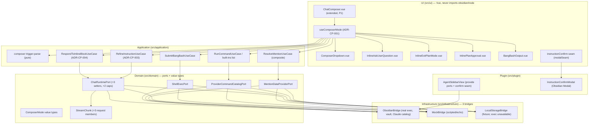

# Design — Composer Power (P4)

> Three parts. **A — UX** (composer trigger→dropdown flows, keyboard semantics, plan mode + inline
> blocks, bang-bash, instruction confirm). **B — UI** (`--sp-*` token map for the composer surfaces,
> parity-screenshot plan). **C — Architecture** (DDD placement, the new ports/types/components, the
> three-bridge story, edge cases, security posture). All four CLARs resolved as ADR-CP-001..004.

This phase layers on the **merged P1–P3 surface**: it extends `ChatComposer.vue` (P1), drives the
`tabsStore` + per-tab `ChatRuntimePort` (P3, ADR-TS-002), and grows `ChatRuntimePort`/`StreamChunk`
additively (ADR-CC-001 §3/§4). Nothing P1–P3 is renamed or removed (NFR-CP-009).

---

## Part A — UX

### A.0 The surface this layers on

The P1 composer (`ChatComposer.vue`) is a bordered rounded wrapper containing a borderless
auto-growing textarea + a send/stop control, with the REQ-CC-008 keyboard contract (Enter sends,
Shift+Enter newlines, IME-safe). P4 keeps that wrapper and that contract, and layers seven states
on it (ADR-CP-001): `default`, `slash`, `skills`, `mention`, `instruction`, `bang-bash`, plus the
`inline-block` swap; and an orthogonal `planActive` toggle.

### A.1 Trigger → dropdown flows (slash / skills / mention)

| Trigger | When it opens | What shows | Confirm result |
|---|---|---|---|
| `/` | at start-of-token (empty input or after whitespace) — REQ-CP-001 | drop-UP palette: built-ins first, then provider commands (lazy) — REQ-CP-003/004 | inserts `prefix+name+space`, or runs a built-in action (REQ-CP-005/006) |
| `$` | at start-of-token — REQ-CP-002 | drop-UP palette: skill entries from the catalog | inserts `$name+space` (REQ-CP-005) |
| `@` | anywhere on `@` — REQ-CP-009 | drop-UP mention palette: vault files/folders (single-line ellipsised path), subagents/MCP/dirs (two-line name+description, category icon) — REQ-CP-011 | replaces the `@`-token with the resolved mention text (REQ-CP-013); a *file* mention inserts the token only — the removable chip is P5 (NG1) |

**Shared dropdown interaction (all three palettes):**
- Drop-**UP** (opens above the textarea — the composer sits at the bottom of the surface).
- Typing after the trigger filters by name; mention filtering is debounced so five fast keystrokes
  query the data provider once (REQ-CP-014).
- A **whitespace** typed into a slash/skills search **closes** the palette and leaves the text
  literal (REQ-CP-007). (Mention allows spaces in some referent names — its close rule is Escape /
  losing the `@`-token, not whitespace.)
- **Escape** dismisses the palette and leaves the composer text unchanged (REQ-CP-008); a cancelled
  trigger token is preserved intact — `look at @no` survives Escape (REQ-CP-036).
- Request-id guarding: changing the filter before the provider catalog responds discards the stale
  response (REQ-CP-004) — no flicker of stale entries.

### A.2 Keyboard semantics (WCAG 2.2 AA combobox/listbox)

The textarea is the **combobox input** (`role="combobox"`, `aria-expanded`, `aria-controls` →
listbox id, `aria-activedescendant` → the highlighted option id). Each palette is a
`role="listbox"`; rows are `role="option"` with `aria-selected`. Focus **stays in the textarea**
while the palette is open (the user keeps typing the filter); navigation is via
`aria-activedescendant`, not roving DOM focus.

| Key | Slash/Skills/Mention palette | Inline ask-user block | Inline plan blocks |
|---|---|---|---|
| Arrow Up/Down | move highlight | move focused item | move focused action |
| Left/Right or Tab/Shift+Tab | (Tab confirms — see below) | switch question tab (multi-question) — REQ-CP-022 | n/a |
| Enter | confirm highlighted entry — REQ-CP-005 | select item / advance — REQ-CP-022 | activate focused action — REQ-CP-024/026 |
| Tab | confirm highlighted entry (alias of Enter) — REQ-CP-005 | within block per Claudian | n/a |
| Escape | close, text unchanged — REQ-CP-008 | cancel (resolve `null`) — REQ-CP-022 | cancel — REQ-CP-024/026 |
| `Shift+Tab` (textarea, no palette) | toggle plan mode; **consume** the event so focus does not tab-out — REQ-CP-020/021 | n/a | n/a |

Hints text mirrors Claudian (`Enter to select · Arrow keys to navigate · Esc to cancel`) and is an
`aria-describedby` target so it is announced.

### A.3 Plan mode (`Shift+Tab`)

`Shift+Tab` in the textarea (no palette open) toggles plan mode **iff** the active provider reports
`supportsPlanMode` (ADR-CP-004, REQ-CP-020). On: a teal **"PLAN"** label + the plan-mode composer
border appear; a second `Shift+Tab` toggles off. The toggle **consumes** the keydown so focus stays
in the composer (REQ-CP-021). When `supportsPlanMode` is false the chord is inert (no toggle, no
indicator) — honest gating, not a broken affordance.

### A.4 Inline interactive blocks (render + respond — rules/persistence are P7)

When the runtime emits an `ask_user_question` / `exit_plan_mode` / `approval_request` request chunk
(ADR-CP-004 §2), the composer enters `inline-block` mode: the **textarea + toolbar are hidden** and
the block renders **in their place** (REQ-CP-027 — replaced, not overlaid). Multiple concurrent
requests are depth-counted; the composer reappears only when the **last** active block resolves
(REQ-CP-027 acceptance).

- **Ask-user-question** (REQ-CP-022/023): a (possibly multi-question) block; Arrow navigates items,
  Left/Right or Tab switches question tabs, Enter selects/advances, Escape cancels. On a complete
  answer → the runtime's registered `setAskUserQuestionCallback` resolves with the answer; the
  composer restores.
- **Exit-plan-mode** (REQ-CP-024/025): a "Plan complete" card with a **scrollable plan preview** and
  **implement / revise / cancel** actions. The chosen decision resolves
  `setExitPlanModeCallback`; revise carries the feedback text.
- **Plan-approval** (REQ-CP-026): the action context + decision options (Deny / Allow once / Always
  allow); the chosen decision resolves `setApprovalCallback`. **P4 persists no rule** — `Always
  allow` routes the *decision* for the *current* request only; the rule store is P7 (NG3).
- **Escape** on any block resolves the callback with `null` (cancel); the runtime decides how to
  proceed; the composer restores.

**Transport honesty (REQ-CP-028, NFR-CP-007):** if the active provider reports
`supportsInlineResponse: false` (the `claude --print` one-shot transport cannot round-trip a
mid-turn answer), the block is **not presented as answerable** — it renders read-only with a note +
a non-blocking `NotificationPort` info ("This provider can't answer inline; …"), and **no response is
lost** (nothing is silently dropped). When a capable interactive transport ships later, the same UI
becomes answerable with no UX change.

### A.5 Bang-bash (`!`)

`!` at empty input enters bang-bash mode (REQ-CP-029): the textarea switches to **monospace** and
the bang-bash border state applies; placeholder becomes the run-command hint. **Enter** (no Shift,
not composing) runs **exactly the typed command** via `ShellExecPort` — no rewrite/augment/chain
(REQ-CP-030). The output surfaces as a **tool-like output block** with stdout/stderr and a non-zero
exit indication (REQ-CP-031). **Escape** exits the mode and runs nothing (REQ-CP-033). The command
runs **only** on explicit Enter — a paste or programmatic set never auto-executes (REQ-CP-032).

### A.6 Instruction mode (`#`)

`#` at empty input enters instruction mode (REQ-CP-015): the instruction placeholder ("# Save in
custom system prompt") + the instruction-mode border appear. On submit, **if the provider supports
refine** (ADR-CP-003), a refine side-query runs and presents the refined instruction (or a
clarification question) — REQ-CP-016. The instruction (refined or raw) then goes to the **Obsidian
`Modal`** confirm dialog (via the modal seam — REQ-CP-017): **accept / edit / reject**. Reject →
nothing persisted. Accept → **appended** (not replaced) to the custom system prompt via
`SettingsPort` (REQ-CP-018). **Escape** or an empty submit exits instruction mode without persisting
(REQ-CP-019).

### A.7 Composer-mode arbitration + send-contract preservation

One active mode at a time (ADR-CP-001, REQ-CP-034): entering one trigger mode deterministically
resolves any other (clear-and-`!` from instruction mode transitions to exactly bang-bash). When **no
palette / special mode / inline block** is active, the P1 send contract is preserved verbatim
(REQ-CP-035): Enter sends, Shift+Enter newlines, IME-safe. Cancelling any mode restores the composer
text intact (REQ-CP-036).

### A.8 Accessibility (NFR-CP-008)

Combobox/listbox roles + `aria-activedescendant` on all three palettes; every trigger, palette, and
inline block fully keyboard-operable; mode borders carry a **non-colour** cue (an icon/label, not
colour alone) so plan/instruction/bang-bash states are distinguishable in forced-colors; motion
honours `prefers-reduced-motion`; the inline-block swap moves focus into the block on render and
returns it to the textarea on restore.

---

## Part B — UI

### B.1 `--sp-*` token map (reuse first; add only what is missing)

Maps the four Claudian CSS modules P4 reproduces (`slash-commands`, `plan-mode`,
`ask-user-question`, `input`) onto the `--sp-*` token layer. **No component carries a hex literal or
a raw Obsidian var** — colour literals live only in the token layer (NFR-CP-011). Reuse the existing
P1–P3 tokens; add only the listed new tokens.

| Surface | Reused tokens | New tokens (add to the token layer) |
|---|---|---|
| Dropdown palette (slash/skills/mention) | `--sp-bg-primary`, `--sp-border`, `--sp-radius-md`, `--sp-space-*`, `--sp-text-normal`, `--sp-text-muted`, `--sp-font-text/-mono`, `--sp-accent` (highlight) | `--sp-dropdown-shadow`, `--sp-dropdown-max-h`, `--sp-option-selected-bg` |
| Plan-mode indicator + border | `--sp-radius-md`, `--sp-space-*`, `--sp-font-size-sm` | `--sp-plan-accent` (teal), `--sp-plan-border`, `--sp-plan-label-bg` |
| Instruction-mode border + placeholder | `--sp-border`, `--sp-text-muted` | `--sp-instruction-border` (blue) |
| Bang-bash mode border + mono textarea | `--sp-font-mono`, `--sp-border` | `--sp-bash-border` (pink), `--sp-bash-output-bg` |
| Ask-user / plan / approval inline blocks | `--sp-bg-primary`, `--sp-border`, `--sp-radius-md`, `--sp-space-*`, `--sp-accent` (focused row), `--sp-text-*` | `--sp-inline-block-bg`, `--sp-ask-cursor` (the `›` focus cursor), `--sp-ask-item-focused-bg` |
| Mention category icons | `--sp-icon-*` via `IconPort`/`<SpIcon>` (P2 seam) | `--sp-mention-file`, `--sp-mention-agent`, `--sp-mention-mcp`, `--sp-mention-dir` (category colours) |

All new tokens resolve from Obsidian theme variables (teal/blue/pink derived from accent + semantic
vars) so light/dark/forced-colors all honour the user's theme — perceptual parity, not byte-parity
(charter §1).

### B.2 Components + their `data-testid`s

`ComposerDropdown` (`composer-dropdown`, rows `composer-dropdown-option-{i}`),
`MentionRow` (`mention-row-{i}`), `PlanModeIndicator` (`plan-indicator`),
`InlineAskUserQuestion` (`inline-ask`), `InlineExitPlanMode` (`inline-exit-plan`),
`InlinePlanApproval` (`inline-plan-approval`), `BangBashOutput` (`bang-bash-output`), and the
extended `ChatComposer` (`chat-composer`, existing). Elements queried only by `data-testid`
(NFR-CP-012). No `v-html`; DOM via templates only (NFR-CP-003).

### B.3 Parity-screenshot plan (deferred to final review — charter §5.1)

Capture side-by-side `claudian-main` vs rebuilt, at 320/520/720 px, light + dark, for: slash
palette, skills palette, mention palette (file + agent rows), plan-mode indicator + border,
instruction-mode + confirm modal, bang-bash mode + output block, and each inline block
(ask-user / exit-plan / plan-approval). **Include the capability-gated state** (a non-capable
transport's read-only inline block) — that is the correct rendering, not a missing feature
(ADR-CP-004 consequence). Stored under `specs/composer-power/parity-screenshots.md`; the legs
accumulate for the single final human review gate (autonomous-drive directive).

---

## Part C — Architecture

### C.1 System overview

### C.2 Layer placement (DDD inward-only — ADR-001, NFR-CP-002)

**Domain (`src/domain`)** — no Obsidian/node:
- `chat/composer/ComposerMode.ts` — `ComposerMode`, `ComposerModeKind`, `TriggerHit` value types (ADR-CP-001).
- `ports/MentionDataProviderPort.ts`, `ports/ProviderCommandCatalogPort.ts`, `ports/ShellExecPort.ts` (ADR-CP-002).
- `ChatRuntimePort.ts` — **+3 additive members** (`setAskUserQuestionCallback`/`setExitPlanModeCallback`/`setApprovalCallback`) and **+2 `RuntimeCapabilities` flags** (`supportsPlanMode`/`supportsInlineResponse`) — ADR-CP-004.
- `chat/StreamChunk.ts` — **+3 additive request members** (`ask_user_question`/`exit_plan_mode`/`approval_request`). *(Audit confirmed: the P2 union does NOT yet carry these; they grow additively, no rename — ADR-CC-001 §4.)*
- `chat/inline/*.ts` — request/decision DTOs (`AskUserQuestionRequest`/`AskUserQuestionAnswer`, `ExitPlanModeRequest`/`ExitPlanModeDecision`, `ApprovalRequest`/`ApprovalDecision`) mirroring Claudian's `core/runtime/types` + `core/types/tools`.
- `ports/index.ts` + `infrastructure/bridge/ports.ts` — re-export the new ports + add the three InjectionKeys (additive).

**Application (`src/application/chat/composer`)** — pure, no Obsidian/node:
- `detectTrigger` / `shouldEnterInstruction` / `shouldEnterBangBash` / `replaceTriggerToken` (pure trigger-parse, ADR-CP-001 §2).
- `builtInCommands.ts` (pure list, REQ-CP-003), `RunCommandUseCase` (built-in action vs provider entry).
- `ResolveMentionUseCase` + the composite mention sources (vault source over `VaultPort` + catalog source) — ADR-CP-002 §1.
- `instructionRefine.ts` (ported pure `buildRefineSystemPrompt`/`parseRefineResponse`) + `RefineInstructionUseCase` (ADR-CP-003).
- `SubmitBangBashUseCase` (over `ShellExecPort`; maps `Result` → output-block DTO).
- `RespondToInlineBlockUseCase` (resolves the runtime callback with the decision; ADR-CP-004).

**Infrastructure (`src/infrastructure`)** — three bridges (ADR-008):
- `MentionDataProviderPort` + `ProviderCommandCatalogPort`: per-mount factories (`createMentionDataProvider()`, `createProviderCommandCatalog()`). Obsidian → real vault + Claude file-backed catalog; Mock → scripted lists; Local → fixture lists. MCP source no-ops `[]` (P8).
- `ShellExecPort`: Obsidian → real `child_process.exec` under `src/infrastructure/obsidian/**` (coverage-excluded), 30 s / 1 MB, `cmd.exe`/`/bin/bash`, vault cwd, enhanced PATH; Mock → scripted echo, no spawn; Local → `err('not available in the browser demo')`.

**UI (`src/ui/chat/composer`)** — never imports obsidian/node:
- `useComposerMode.ts` (the composable), `ComposerDropdown.vue`, `MentionRow.vue`, `PlanModeIndicator.vue`, `InlineAskUserQuestion.vue`, `InlineExitPlanMode.vue`, `InlinePlanApproval.vue`, `BangBashOutput.vue`; extended `ChatComposer.vue`; new composables `useMentionDataProviderPort`/`useProviderCommandCatalogPort`/`useShellExecPort`; instruction-confirm launched via an additive `modalSeam` handle.

**Plugin (`src/plugin`)**:
- `AgentSidebarView` provides the three new ports (+ the instruction-confirm modal seam handle) at mount.
- `InstructionConfirmModal` (Obsidian `Modal`, like `ForkTargetModal`/`DeleteConfirmModal`) under `src/plugin/modals/`.

### C.3 Data model + additive growth

No persisted schema changes beyond an **append** to the existing custom system prompt via
`SettingsPort` (REQ-CP-018) — load-or-default, no migration (NFR-CP-010). `ComposerMode` is
ephemeral UI state (composable `ref`, ADR-CP-001 §5), never persisted. The `StreamChunk` +
`ChatRuntimePort` + `RuntimeCapabilities` growth is **purely additive** (diffed against
ADR-CC-001's 12 members + SPEC-TS-003's flags + the P2 union — NFR-CP-009).

### C.4 Primary data flows

**Slash command run/insert:** `@input` → `detectTrigger` → `useComposerMode` sets `slash` → palette
opens with built-ins (pure list) + lazy provider entries (`ProviderCommandCatalogPort.getEntries`,
request-id guarded) → Enter → built-in → `RunCommandUseCase` runs the action (REQ-CP-006); else
`replaceTriggerToken` inserts `prefix+name+space` (REQ-CP-005).

**@mention:** `@` → `mention` mode → debounced `ResolveMentionUseCase` → `MentionDataProviderPort.query`
(vault source over `VaultPort` + catalog source; MCP `[]`) → palette → Enter → `replaceTriggerToken`
with the resolved mention text (REQ-CP-013).

**Instruction refine + confirm:** `#` (empty) → `instruction` mode → submit → if capable,
`RefineInstructionUseCase` (cold-start side-query over `ChatRuntimePort.query`, ADR-CP-003) →
`refined` or `clarification` → instruction-confirm `Modal` (accept/edit/reject) → accept → append to
the custom system prompt via `SettingsPort` (REQ-CP-018).

**Plan + inline block respond:** runtime emits an `ask_user_question`/`exit_plan_mode`/
`approval_request` `StreamChunk` → `useComposerMode` → `inline-block` mode (textarea hidden,
depth-counted) → renders the block → user choice → `RespondToInlineBlockUseCase` resolves the
runtime's registered callback (ADR-CP-004) → composer restored. `supportsInlineResponse:false` →
read-only + notice, callback never reached, no lost response (REQ-CP-028).

**Bang-bash:** `!` (empty) → `bang-bash` mode → Enter → `SubmitBangBashUseCase` →
`ShellExecPort.run({command})` → `Result<ShellExecResult>` → `BangBashOutput` block (REQ-CP-031).

### C.5 Result / streaming-error boundary (NFR-CP-004)

Every new use case (`RunCommandUseCase`, `ResolveMentionUseCase`, `RefineInstructionUseCase`,
`SubmitBangBashUseCase`, `RespondToInlineBlockUseCase`) returns `Result<T,E>` at its boundary
(ADR-004). The streaming refine side-query maps the `{type:'error'}` `StreamChunk` to a `Result.err`
at the use-case boundary (ADR-CC-001 §2), never thrown across `src/ui/**`. `ShellExecPort.run`
returns `Result` (a non-zero exit is `ok(result)`, only a spawn failure is `err`). Inline-block
transport surfaces a non-capable provider as a gated affordance, never a throw (NFR-CP-007).

### C.6 Edge cases

- Trigger at non-start-of-token (`a/b`) → no palette (REQ-CP-001 rule).
- `#`/`!` on non-empty input → literal text, no mode (empty-input gate).
- Whitespace in slash/skills search → palette closes, text literal (REQ-CP-007).
- Escape mid-trigger → text intact, including a partial `@no` (REQ-CP-036).
- Stale provider-catalog response after the filter changed → discarded (REQ-CP-004).
- Concurrent inline blocks → depth-counted; composer restores after the **last** resolves (REQ-CP-027).
- `supportsPlanMode:false` → `Shift+Tab` inert; `supportsInlineResponse:false` → blocks read-only + notice (REQ-CP-020/028).
- Bang-bash paste/programmatic-set without Enter → no exec (REQ-CP-032); timeout/maxbuffer → `exitCode 124` + notice (ADR-CP-002 S4).
- Bang-bash output never carries a secret value into the block or the log (ADR-CP-002 S3).
- Refine failure → fall through to the confirm modal with the raw instruction, no blocking error (REQ-CP-016).
- IME composition during any Enter → never sends/submits (REQ-CC-008 preserved, REQ-CP-035).

### C.7 QA seam + security posture

- **QA seam:** pure trigger-parse + the five use cases + the ported prompt/parse functions are unit-testable with no mount; mounted components carry `data-testid` PageObjects (NFR-CP-012); the Mock bridge drives the full composer with no CLI/process (`npm run dev`), and a *capable* + *non-capable* mock runtime exercise both ADR-CP-004 transport branches. Coverage gate 80/70/80/80.
- **Security posture (NFR-CP-006, ADR-CP-002 §3):** `ShellExecPort` is the sole shell path (S1 user-explicit-only, never model-reachable; S2 no rewrite; S3 no secret capture/log/render; S4 bounded 30 s/1 MB; S5 output-as-block). The browser demo degrades honestly (exec unavailable). Confirms use the Obsidian `Modal` seam, never `window.confirm` (NFR-CP-003).

### C.8 Key decisions (→ ADRs)

| Decision | Choice | ADR | CLAR |
|---|---|---|---|
| Composer-mode arbitration | `useComposerMode` composable + discriminated `ComposerMode` union + pure trigger-parse; P1 send gated behind `kind==='default'` | ADR-CP-001 | CLAR-CP-001 |
| New ports | `MentionDataProviderPort` (VaultPort + catalog), `ProviderCommandCatalogPort` (request-id guarded; built-ins as a pure list), `ShellExecPort` (sole shell path, S1–S5, browser-unavailable) | ADR-CP-002 | CLAR-CP-002 |
| Instruction-refine | second cold-start side-query over `ChatRuntimePort.query` behind `RefineInstructionUseCase`; `AuxModelPort` deferred to P5 | ADR-CP-003 | CLAR-CP-003 |
| Inline-block response transport | three additive `ChatRuntimePort` callback-setters + `StreamChunk` request members; capability-gate (`supportsPlanMode`/`supportsInlineResponse`) what `claude --print` can't carry; rules/persistence stay P7 | ADR-CP-004 | CLAR-CP-004 |

### C.9 Rejected alternatives (summary; full rationale in the ADRs)

- Pinia store for composer-mode (ADR-CP-001 Opt A) — ephemeral UI state needs no store.
- XState machine (ADR-CP-001 Opt C) — new dependency for 7 states; no parity gain.
- One god mention-source / two vault ports (ADR-CP-002) — vault is already `VaultPort`.
- Built-ins inside the catalog port (ADR-CP-002) — forces IO for a static list.
- Exec on `ChatRuntimePort` / in the UI (ADR-CP-002 Opt B/C) — model-reachable shell / DDD violation.
- `AuxModelPort` now (ADR-CP-003 Opt B) — not yet earned; P5 inline-edit is the re-eval point.
- `respondToPrompt(...)` push method (ADR-CP-004 Opt B) — needs request-id correlation; setters are the blessed shape.
- Always-present blocks / `provider===` gating (ADR-CP-004 Opt B/C) — dishonest dead path / breaks capability discipline.

### C.10 Requirements coverage (Part C)

| REQ | Covered by |
|---|---|
| REQ-CP-001/002/007/008 | C.2 trigger-parse, C.4 slash flow, A.1/A.2 |
| REQ-CP-003/004/005/006 | C.2 built-ins list + `RunCommandUseCase` + `ProviderCommandCatalogPort` (ADR-CP-002) |
| REQ-CP-009/010/011/012/013/014 | `ResolveMentionUseCase` + `MentionDataProviderPort` composite (ADR-CP-002), A.1 |
| REQ-CP-015/016/017/018/019 | `RefineInstructionUseCase` (ADR-CP-003) + instruction-confirm modal seam + `SettingsPort` append, A.6 |
| REQ-CP-020/021 | `supportsPlanMode` gate + `Shift+Tab` consume (ADR-CP-004, ADR-CP-001), A.3 |
| REQ-CP-022/023/024/025/026/027/028 | inline-block render (StreamChunk request members) + `RespondToInlineBlockUseCase` + callback-setters + `supportsInlineResponse` gate (ADR-CP-004), A.4 |
| REQ-CP-029/030/031/032/033 | `SubmitBangBashUseCase` + `ShellExecPort` (ADR-CP-002 §3), A.5 |
| REQ-CP-034/035/036 | `useComposerMode` arbitration + P1 send gating (ADR-CP-001), A.7 |
| NFR-CP-001..013 | C.2–C.7 (perf C.4 debounce; ports/3-bridge C.2; security C.7; Result C.5; additivity C.3; a11y A.8; tokens B.1; tests C.7) |

---

## Quality gate

- [x] System overview diagram (C.1).
- [x] Components + responsibilities (C.2).
- [x] Data model + additive-growth impact (C.3).
- [x] Primary data flows end-to-end (C.4).
- [x] Key decisions recorded + each ADR filed accepted (C.8; ADR-CP-001..004).
- [x] Rejected alternatives with rationale (C.9 + ADRs).
- [x] Requirements coverage table for Part C (C.10).
- [x] UX (Part A) + UI (Part B) drafted; WCAG 2.2 AA + `--sp-*` token map.
- [x] Security posture + Result/streaming boundary + edge cases enumerated (C.5–C.7).
- [x] CLAR-CP-001..004 resolved as ADR-CP-001..004 (accepted).
