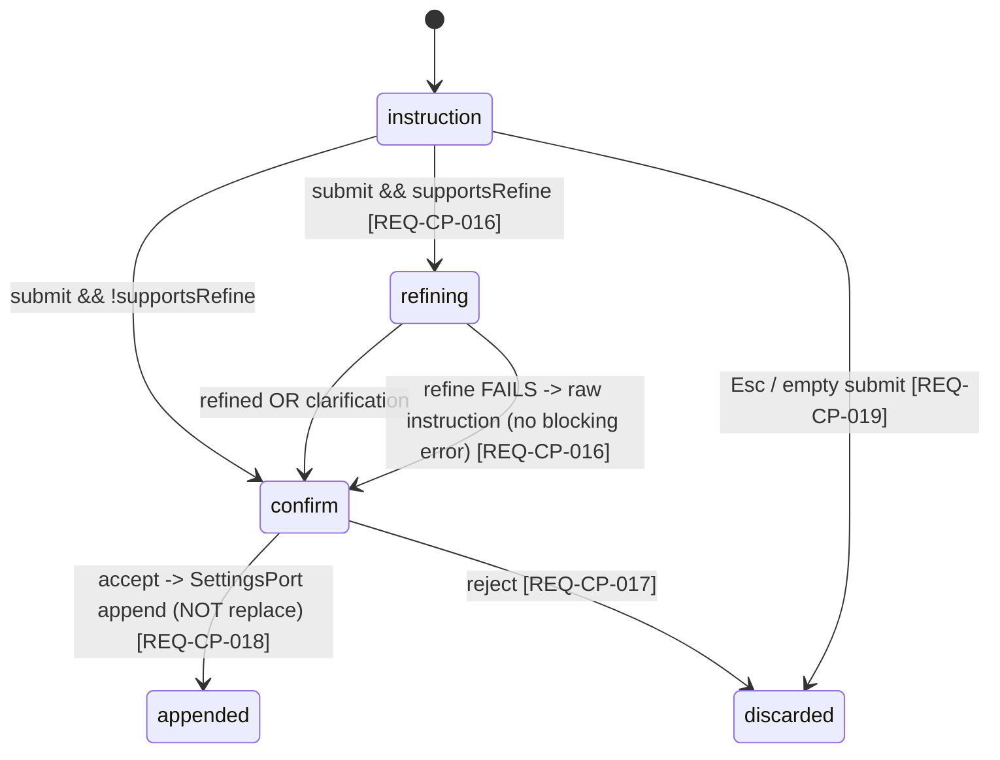

# Specification — Composer Power (P4)

Implementation-ready contracts for P4. Every contract is grounded in `design.md` (DESIGN-CP-001), the
four accepted P4 ADRs (**ADR-CP-001/002/003/004**), the P1 composer contract (SPEC-CC-021), the P3
additive-runtime contract (SPEC-TS-003), and Claudian's real code under `D:\Projects\claudian-main`
(cited inline). **Two independent teams should build the same thing from this document.**

> **Conventions in force (inherited from P1/P2/P3, do not relax):** DDD inward-only imports (ADR-001,
> `domain ← application ← infrastructure ← ui`, NFR-CP-002); narrow ports + three bridges (ADR-008,
> NFR-CP-002); `Result<T,E>` at every discrete/use-case boundary, **pure-total** transforms elsewhere
> (ADR-004, NFR-CP-004); streaming failure stays the `{type:'error'}` `StreamChunk` member, **not**
> per-chunk `Result` or a thrown error across the port (ADR-CC-001 §1/§2, NFR-CP-004); DTO-only store
> boundary — no domain class instance / function / Obsidian handle crosses into reactive state (ADR-003,
> NFR-CP-005); Vue `<script setup>` only (NFR-CP-005); **no `obsidian`/`node:*` import under `src/ui/**`**
> (NFR-CP-003); **no `v-html`/`innerHTML`/`outerHTML`/`insertAdjacentHTML`** anywhere (NFR-CP-003);
> blocking flows use an Obsidian `Modal` via the modal seam, never `window.confirm`/`alert`/`prompt`
> (NFR-CP-003); `--sp-*` token parity, colour literals confined to the token layer (NFR-CP-011); WCAG
> 2.2 AA combobox/listbox + full keyboard nav + non-colour cues + reduced-motion (NFR-CP-008); tests
> mirror `src/` + `data-testid` PageObjects, coverage 80/70/80/80 (NFR-CP-012); `manifest.json` untouched
> (NFR-CP-013); **no stored secret, no migration — load-or-default** (NFR-CP-010); **additive growth only
> — no rename/removal of any P1/P2/P3 member** (NFR-CP-009, ADR-CC-001).

This spec defines **38 spec items** across five layer groups (SPEC-CP-001..038). The Tasks stage
(`planner`) decomposes them into `T-CP-NNN`; the QA stage turns the TEST-CP-NNN scenarios (§9) into
automated tests. SPEC-CP items that **extend** a P1/P2/P3 counterpart cite the extension point.

> **Four open items the design handed to `/spec:specify` — RESOLVED HERE:**
> 1. **The AskUserQuestion answer DTO shape** — settled in SPEC-CP-004 (`AskUserQuestionItem`
>    multi-question array + `AskUserQuestionAnswer` keyed by question id, with an optional
>    `customInput` free-text path; mirrors Claudian `core/types/tools.ts` `AskUserQuestionItem`).
> 2. **The Claude command/skill storage source paths** — settled in SPEC-CP-013 (commands from
>    `<vault>/.claude/commands/**/*.md`, skills from `<vault>/.claude/skills/**/SKILL.md`, read through
>    `VaultPort`; mirrors `providers/claude/{commands,storage}/*`).
> 3. **The instruction-append target field** — settled in SPEC-CP-005: a new device-local
>    `PluginSettings.customSystemPrompt: string` (read/written via `SettingsPort`, **append** with a
>    `\n\n` separator, never overwrite — REQ-CP-018). No vault file; no secret; load-or-default.
> 4. **The Obsidian `ShellExecPort` cwd** — settled in SPEC-CP-014: the vault adapter base path
>    (`FileSystemAdapter.getBasePath()`), with the Claudian enhanced-PATH + 30 s / 1 MB bounds.

---

## 0. Spec-item index

| Spec item | Title | Layer | Extends | REQ / NFR links |
|---|---|---|---|---|
| **DOMAIN** | | | | |
| SPEC-CP-001 | `StreamChunk` — additive `ask_user_question` / `exit_plan_mode` / `approval_request` request members | domain | SPEC-CC-002 / SPEC-RR-001 | REQ-CP-022/024/026; ADR-CP-004 §2 |
| SPEC-CP-002 | `ChatRuntimePort` — additive `setAskUserQuestionCallback` / `setExitPlanModeCallback` / `setApprovalCallback` + `RuntimeCapabilities.supportsPlanMode` / `supportsInlineResponse` | domain | SPEC-TS-003 | REQ-CP-020/023/025/026/028; ADR-CP-004 §1 |
| SPEC-CP-003 | `MentionDataProviderPort` + `MENTION_DATA_PROVIDER_PORT` key + barrel re-export | domain | — (new, ADR-CP-002 §1) | REQ-CP-009/010/011/012/013 |
| SPEC-CP-004 | Inline-block DTOs (`AskUserQuestionItem`/`AskUserQuestionAnswer`, `ExitPlanModeRequest`/`Decision`, `ApprovalRequest`/`ApprovalDecision`) | domain | — (new) | REQ-CP-022/024/026; ADR-CP-004 §1 |
| SPEC-CP-005 | `ProviderCommandCatalogPort` + `SHELL_EXEC_PORT`/`ShellExecPort` types + `PluginSettings.customSystemPrompt` + keys + barrel | domain | SPEC-PSR-001 / SPEC-TS-005 | REQ-CP-003/004/005/006/018/030/031; ADR-CP-002 §2/§3 |
| SPEC-CP-006 | `ComposerMode` value types (`ComposerModeKind` union, `TriggerHit`, mention/catalog item DTOs) | domain | — (new, ADR-CP-001 §1) | REQ-CP-034; ADR-CP-001 §1 |
| **INFRA** | | | | |
| SPEC-CP-007 | `ObsidianBridge` — `createMentionDataProvider()` + `createProviderCommandCatalog()` (vault + Claude catalog) | infra | — (new) | REQ-CP-009/010/012/004; NFR-CP-002 (manual leg) |
| SPEC-CP-008 | `ObsidianBridge` — `ShellExecPort` (real `child_process.exec`, S1–S5, coverage-excluded) | infra | — (new) | REQ-CP-030/031/032; NFR-CP-006 (manual leg) |
| SPEC-CP-009 | `MockBridge` — fixture mention/catalog providers + scripted `ShellExecPort` (no spawn) + scriptable runtime callbacks | infra | SPEC-CC-011 / SPEC-TS-007 | REQ-CP-004/012/030/032; NFR-CP-002 |
| SPEC-CP-010 | `LocalStorageBridge` — fixture mention/catalog providers + `err`-not-available `ShellExecPort` | infra | SPEC-CC-012 / SPEC-TS-008 | REQ-CP-012; ADR-CP-002 §3 |
| SPEC-CP-011 | Grown `ChatRuntimePort` impls (the three callback setters + the two capability flags; CLI honesty) + reducer emits the three request chunks | infra | SPEC-TS-009 | REQ-CP-020/023/025/026/028 |
| **APPLICATION** | | | | |
| SPEC-CP-012 | Pure trigger-parse (`detectTrigger` / `shouldEnterInstruction` / `shouldEnterBangBash` / `replaceTriggerToken`) | application | — (new, ADR-CP-001 §2) | REQ-CP-001/002/007/008/015/029/036 |
| SPEC-CP-013 | `builtInCommands` (pure list) + `RunCommandUseCase` + the Claude catalog source paths | application | — (new) | REQ-CP-003/004/005/006 |
| SPEC-CP-014 | `ResolveMentionUseCase` (composite vault + catalog source) | application | — (new) | REQ-CP-009/010/012/013/014 |
| SPEC-CP-015 | `instructionRefine.ts` (pure `buildRefineSystemPrompt` / `parseRefineResponse`) + `RefineInstructionUseCase` | application | SPEC-TS-016 (side-query) | REQ-CP-016 |
| SPEC-CP-016 | `SubmitBangBashUseCase` (over `ShellExecPort` → output-block DTO) | application | — (new) | REQ-CP-030/031/032 |
| SPEC-CP-017 | `RespondToInlineBlockUseCase` (resolve the registered runtime callback; capability-gated) | application | — (new) | REQ-CP-023/025/026/028 |
| **UI** | | | | |
| SPEC-CP-018 | `useComposerMode` composable (the mode arbiter + depth-counted inline-block queue + request-id guard + debounce) | ui | — (new, ADR-CP-001) | REQ-CP-004/014/027/034/035/036 |
| SPEC-CP-019 | `ChatComposer.vue` extension (delegate keydown; `kind==='default'` send-gate; mode borders) | ui | SPEC-CC-021 | REQ-CP-020/021/029/034/035 |
| SPEC-CP-020 | `ComposerDropdown.vue` + `MentionRow.vue` (combobox/listbox; slash/skills/mention) | ui | — (new) | REQ-CP-001/002/005/006/007/008/009/011/013 |
| SPEC-CP-021 | `PlanModeIndicator.vue` + the plan-mode toggle (`Shift+Tab`, capability-gated) | ui | — (new) | REQ-CP-020/021 |
| SPEC-CP-022 | `InlineAskUserQuestion.vue` (render + respond; read-only when `supportsInlineResponse:false`) | ui | — (new) | REQ-CP-022/023/027/028 |
| SPEC-CP-023 | `InlineExitPlanMode.vue` (plan preview + implement/revise/cancel; gated) | ui | — (new) | REQ-CP-024/025/027/028 |
| SPEC-CP-024 | `InlinePlanApproval.vue` (deny/allow-once/always; **no rule persisted**; gated) | ui | — (new) | REQ-CP-026/027/028 |
| SPEC-CP-025 | `BangBashOutput.vue` (stdout/stderr + non-zero exit; no `v-html`) | ui | — (new) | REQ-CP-031 |
| SPEC-CP-026 | `useMentionDataProviderPort` / `useProviderCommandCatalogPort` / `useShellExecPort` composables | ui | SPEC-CC-017 | REQ-CP-004/009/030 |
| SPEC-CP-027 | Instruction-confirm modal seam handle (`InstructionConfirmFn`) + `InstructionConfirmModal` (Obsidian `Modal`) | ui/plugin | SPEC-TS-023/024 | REQ-CP-017/018/019 |
| SPEC-CP-028 | Wiring — `AgentSidebarView` + `ui/main.ts` provide the three ports + the instruction-confirm seam | plugin/ui | SPEC-TS-027 | REQ-CP-004/009/017/030 |
| **STYLES** | | | | |
| SPEC-CP-029 | `--sp-*` token additions (tokens.css §4.11 — slash-commands / plan-mode / ask-user-question / input) | ui (styles) | SPEC-TS-028 | NFR-CP-011 |
| SPEC-CP-030 | No-`v-html` / Obsidian-`Modal` / no-`node:*`-in-UI compliance invariant (cross-cutting) | ui/plugin | SPEC-TS-029 | NFR-CP-003 |
| **CROSS-CUTTING** | | | | |
| SPEC-CP-031 | Composer-mode arbitration invariant (one active mode; P1 send gated behind `kind==='default'`) | ui | — | REQ-CP-034/035/036 |
| SPEC-CP-032 | Capability-gating invariant (`getCapabilities()`, zero `provider === 'claude'` branch) | app/ui | — | REQ-CP-020/028; NFR-CP-007 |
| SPEC-CP-033 | `ShellExecPort` security-posture invariant (S1–S5; sole shell path; no secret in log/render) | infra/app | — | REQ-CP-030/031/032; NFR-CP-006 |
| SPEC-CP-034 | Additivity invariant (P1/P2/P3 members + the 12 runtime members + 3 caps + the StreamChunk union unchanged) | domain | — | NFR-CP-009 |
| SPEC-CP-035 | Result / streaming-error boundary invariant (every new use case returns `Result`; error-as-chunk → `Result.err`) | app | — | NFR-CP-004 |
| SPEC-CP-036 | Observability (LoggerPort events; no message/instruction/bash-output content logged) | cross | — | NFR-CP-006/010 |
| SPEC-CP-037 | Accessibility invariant (combobox/listbox + `aria-activedescendant`; non-colour cues; reduced-motion; focus moves into/out of inline blocks) | ui | — | NFR-CP-008 |
| SPEC-CP-038 | Per-mount factory wiring invariant (mention/catalog as factories; ShellExec stateless; one-port-one-consumer) | infra/ui | — | NFR-CP-002; ADR-CP-002 §4 |

---

# 1. Domain — types, ports, and additive growth (SPEC-CP-001..006)

Types under `src/domain/chat/` and `src/domain/ports/`; the settings field under
`src/domain/settings/`. No `obsidian`, no `node:*`, no Vue, no class — pure interfaces/unions
(ADR-001). **Additive only: no P1/P2/P3 field or member is renamed or removed (NFR-CP-009).** The
audit confirmed (DESIGN-CP-001 C.2): the P2 `StreamChunk` union does **not** yet carry the three
request members; they grow additively. The P3 `ChatRuntimePort` carries 12 members + 3
`RuntimeCapabilities` flags (`supportsFork`/`supportsRewind` plus the existing one); P4 appends 3
setters + 2 flags.

## SPEC-CP-001 — `StreamChunk` request members (`src/domain/chat/StreamChunk.ts`)

**REQ:** REQ-CP-022/024/026 · **ADR:** ADR-CP-004 §2 · **Claudian ground-truth:** `core/types/chat.ts`
(the `ask_user_question` / `exit_plan_mode` / `approval_request` runtime request envelopes),
`features/chat/controllers/InputController.ts` (`handleAskUserQuestion`/`handleExitPlanMode`/
`handleApprovalRequest`). **Append** these three members to the existing union (declared-now /
emitted-by-a-capable-transport, ADR-CC-001 §4 discipline — same as the P2/P3 declared-now members):

```ts
// ---- P4 additive request members (ADR-CP-004 §2) — declared now, emitted by a capable transport ----
| { type: 'ask_user_question'; requestId: string; questions: AskUserQuestionItem[] }
| { type: 'exit_plan_mode'; requestId: string; plan: string; allowedPrompts?: { tool: string; prompt: string }[] }
| { type: 'approval_request'; requestId: string; tool: string; context: string; options: ApprovalOption[] }
```

**Validation rules (per member):** `requestId` is a non-empty correlation string (the UI never
synthesises it — the runtime owns it; it is the key the callback resolves against, SPEC-CP-017).
`questions` is a non-empty `AskUserQuestionItem[]` (SPEC-CP-004); an empty array is treated as a malformed
chunk → ignored + logged `warn` (EC-CP-12). `plan` is a string (may be long → scroll, SPEC-CP-023);
`allowedPrompts` optional. `options` is a non-empty `ApprovalOption[]` (SPEC-CP-004). `AskUserQuestionItem`,
`ApprovalOption` import from `src/domain/chat/inline/*` (SPEC-CP-004). **No P1/P2 member is renamed; the
union only grows** (TEST-CP-001, SPEC-CP-034). Unit-testable as a type-shape contract (TEST-CP-001).

## SPEC-CP-002 — `ChatRuntimePort` additive members (`src/domain/ports/ChatRuntimePort.ts`)

**REQ:** REQ-CP-020/023/025/026/028 · **ADR:** ADR-CP-004 §1 · **Claudian ground-truth:**
`core/runtime/ChatRuntime.ts:48/50/51` (the three callback setters — the ADR-CC-001 §1 pre-blessed
channel), `core/runtime/ProviderRegistry` capability flags. **Append** to `RuntimeCapabilities` and to
`ChatRuntimePort`; the 12 existing members + 3 existing flags stay byte-identical (SPEC-CP-034):

```ts
// additive on RuntimeCapabilities (after supportsFork / supportsRewind)
readonly supportsPlanMode: boolean;        // gates the Shift+Tab plan toggle (REQ-CP-020)
readonly supportsInlineResponse: boolean;  // gates the answerable inline blocks (REQ-CP-028)

// additive on ChatRuntimePort — the UI→runtime control channel for inline blocks (ADR-CP-004 §1)
setAskUserQuestionCallback(cb: (req: AskUserQuestionRequest) => Promise<AskUserQuestionAnswer | null>): void;
setExitPlanModeCallback(cb: (req: ExitPlanModeRequest) => Promise<ExitPlanModeDecision | null>): void;
setApprovalCallback(cb: (req: ApprovalRequest) => Promise<ApprovalDecision | null>): void;
```

**Per-setter contract (signature · behaviour · pre/post · errors · side effects):**

| Setter | Behaviour | Pre / Post | Side effects |
|---|---|---|---|
| `setAskUserQuestionCallback(cb)` | Register the callback the runtime invokes when it reaches an ask-user-question mid-turn; the returned promise resolves with the user's `AskUserQuestionAnswer`, or **`null` for cancel** (Escape, REQ-CP-022). | Pre: called once at composer bind (idempotent — last registration wins). Post: the runtime owns the call timing (pull), the UI owns the answer (register). | mutable runtime state (the registered handler) |
| `setExitPlanModeCallback(cb)` | Register the exit-plan-mode handler; resolves an `ExitPlanModeDecision` or `null` (cancel, REQ-CP-025). | as above | as above |
| `setApprovalCallback(cb)` | Register the approval handler; resolves an `ApprovalDecision` or `null` (cancel, REQ-CP-026). **P4 stores no rule** (NG3). | as above | as above |

> **No `respond(...)` method (ADR-CP-004 §1, Opt B rejected):** the setter + returning-promise shape
> is the exact Claudian channel; the runtime pulls when it owns the timing, the UI registers how to
> answer — no request-id correlation map in the UI. The setters are **always registered** (the channel
> exists); the *answerable affordance* is what `supportsInlineResponse` gates (SPEC-CP-017/032). Two
> `void` setters do **not** change the streaming error convention (ADR-CC-001 §1, unchanged). The
> request/decision DTOs are SPEC-CP-004. Unit-test (TEST-CP-002): exactly three setters + two flags
> appended; the 12 P3 members + 3 flags byte-identical.

## SPEC-CP-003 — `MentionDataProviderPort` (`src/domain/ports/MentionDataProviderPort.ts`)

**REQ:** REQ-CP-009/010/011/012/013 · **ADR:** ADR-CP-002 §1 · **Claudian ground-truth:**
`shared/mention/{MentionDropdownController,VaultMentionDataProvider,VaultMentionCache,types}.ts`,
`utils/contextMentionResolver.ts`. **New narrow port — one consumer (the mention palette).** Reproduced
verbatim from ADR-CP-002 §1 (the ADR body is the contract; this is its implementation-ready restatement):

```ts
export type MentionReferentKind = 'file' | 'folder' | 'subagent' | 'mcp-server' | 'external-dir';

export interface MentionReferent {
  readonly kind: MentionReferentKind;
  readonly name: string;          // display name (filename / agent name / server name)
  readonly mentionText: string;   // what replaceTriggerToken inserts (the resolved mention; SPEC-CP-014)
  readonly detail?: string;       // path (files/folders) or description (subagent/MCP) — drives the 2-line row
}

export interface MentionDataProviderPort {
  /** Filtered referents for the open palette. Load-or-default: empty/unloaded sources → []. */
  query(filter: string, signal?: AbortSignal): Promise<MentionReferent[]>;
}
```

**`query(filter, signal)` contract:** returns referents whose `name`/`detail` matches `filter`
(case-insensitive substring, parity with `VaultMentionDataProvider`); an **empty filter** returns the
unfiltered (capped) list (palette just opened, REQ-CP-009). **Load-or-default:** an empty vault and an
empty/unwired non-vault source both return `[]` — **never throws, never errors the palette**
(REQ-CP-012 acceptance). `signal` (optional `AbortSignal`) lets the consumer abort a stale query
(debounce + request-guard live in the consumer, SPEC-CP-018 — the port stays a pure data seam). **No
`Result`** here: it is a best-effort read whose only failure mode is "no results" (`[]`), matching
Claudian's cache-backed provider. **`MENTION_DATA_PROVIDER_PORT` InjectionKey** (`ports.ts`, appended)
and **barrel re-export** (`index.ts`, appended) per SPEC-CP-005. Unit-testable as a type-shape +
behaviour contract via the Mock/Fixture providers (TEST-CP-003).

## SPEC-CP-004 — Inline-block DTOs (`src/domain/chat/inline/*.ts`)

**REQ:** REQ-CP-022/024/026 · **ADR:** ADR-CP-004 §1 · **Claudian ground-truth:** `core/types/tools.ts`
(`AskUserQuestionItem`, the `ApprovalDecision` union), `core/runtime/types.ts` (the exit-plan /
approval request shapes). **Plain domain DTOs — string/enum/array only, no Obsidian, no class
(RESOLVES design open item #1).**

```ts
// src/domain/chat/inline/AskUserQuestion.ts
export interface AskUserQuestionOption {
  readonly id: string;            // stable option id (the answer carries it back)
  readonly label: string;
  readonly description?: string;
}
export interface AskUserQuestionItem {
  readonly id: string;            // stable question id (multi-question keying)
  readonly question: string;
  readonly options: AskUserQuestionOption[];
  readonly allowCustomInput?: boolean;   // when true, a free-text answer is permitted (mirrors Claudian)
}
export interface AskUserQuestionRequest {
  readonly requestId: string;
  readonly questions: AskUserQuestionItem[];   // one or many (multi-question tabs, REQ-CP-022)
}
/** The answer per question: the chosen option id, OR a custom free-text string (allowCustomInput). */
export interface AskUserQuestionAnswer {
  readonly requestId: string;
  /** Keyed by question id; value is the chosen option id or, for a custom answer, { custom: string }. */
  readonly answers: Record<string, string | { custom: string }>;
}

// src/domain/chat/inline/ExitPlanMode.ts
export interface ExitPlanModeRequest {
  readonly requestId: string;
  readonly plan: string;
  readonly allowedPrompts?: { tool: string; prompt: string }[];
}
export type ExitPlanModeDecision =
  | { kind: 'implement' }
  | { kind: 'revise'; feedback: string }    // carries the revise feedback text (REQ-CP-024)
  | { kind: 'cancel' };

// src/domain/chat/inline/Approval.ts
export type ApprovalDecision = 'deny' | 'allow' | 'allow-always';   // Claudian core/types/tools.ts
export interface ApprovalOption {
  readonly decision: ApprovalDecision;
  readonly label: string;       // 'Deny' / 'Allow once' / 'Always allow' (REQ-CP-026)
}
export interface ApprovalRequest {
  readonly requestId: string;
  readonly tool: string;        // the action's tool/context (render-only)
  readonly context: string;     // human-readable action context
  readonly options: ApprovalOption[];
}
```

**Validation rules:** every `id`/`requestId` non-empty; `AskUserQuestionAnswer.answers` keys are exactly
the `question.id`s of the request (a complete answer covers every question — REQ-CP-022 "complete
answer"); a custom answer is only valid when `allowCustomInput === true` (else the use case rejects it,
EC-CP handled in SPEC-CP-022). `ApprovalDecision` is the exact Claudian union — **`'allow-always'`
selected in P4 routes the decision but persists no rule** (NG3, REQ-CP-026, SPEC-CP-024). Re-exported
from `src/domain/chat/inline/index.ts`; referenced by SPEC-CP-001/002. Unit-test (TEST-CP-004): shapes;
`allow-always` carries no persistence field.

## SPEC-CP-005 — `ProviderCommandCatalogPort` + `ShellExecPort` + `PluginSettings.customSystemPrompt` + keys + barrel

**REQ:** REQ-CP-003/004/005/006/018/030/031 · **ADR:** ADR-CP-002 §2/§3 · **Claudian ground-truth:**
`core/providers/commands/{ProviderCommandCatalog,ProviderCommandEntry}.ts`,
`features/chat/services/BangBashService.ts` (exec options), `InputController.handleInstructionSubmit`
(append to `systemPrompt`).

**`ProviderCommandCatalogPort`** (`src/domain/ports/ProviderCommandCatalogPort.ts`):

```ts
export type CatalogEntryKind = 'command' | 'skill';
export interface CatalogEntry {
  readonly kind: CatalogEntryKind;
  readonly prefix: '/' | '$';     // drives REQ-CP-005 prefix+name+space insertion
  readonly name: string;
  readonly description?: string;
  readonly builtIn: boolean;      // built-in → run an action (REQ-CP-006); provider entry → insert (REQ-CP-005)
}
export interface ProviderCommandCatalogPort {
  /** Provider command/skill entries for the open palette. Load-or-default: [] on empty/unloaded. */
  getEntries(kind: CatalogEntryKind): Promise<CatalogEntry[]>;
}
```

> **Built-ins are NOT in the port** (ADR-CP-002 §2): the six built-ins are a pure application list
> (SPEC-CP-013), listed before provider entries, independent of any catalog load (REQ-CP-003). The port
> supplies only the provider (file-backed, lazily-loaded) entries (REQ-CP-004). Request-id guarding is
> the **consumer's** job (SPEC-CP-018), not the port. Load-or-default: an unloaded/empty catalog →
> `ok([])` shape (`[]`), never throws.

**`ShellExecPort`** (`src/domain/ports/ShellExecPort.ts`) — the security-bounded bang-bash seam:

```ts
import type { Result } from '@/domain/shared/Result';
export interface ShellExecRequest { readonly command: string; }   // EXACTLY the user's typed text (S2)
export interface ShellExecResult {
  readonly command: string;
  readonly stdout: string;
  readonly stderr: string;
  readonly exitCode: number;   // 124 = timeout/maxbuffer breach (Claudian parity)
  readonly truncated: boolean; // hit the 1 MB output cap
  readonly notice?: string;    // 'timed out' / 'output exceeded 1MB'
}
export interface ShellExecPort {
  /** Run one command. Resolves a Result; a NON-ZERO exit is ok(result), only a SPAWN failure is err. */
  run(request: ShellExecRequest): Promise<Result<ShellExecResult, Error>>;
}
```

The S1–S5 security posture (SPEC-CP-033) binds every impl. **`run` is `Result`-returning** (ADR-004): a
non-zero exit (e.g. a failing command) is `ok(result)` with the non-zero `exitCode`; only a spawn
failure / unavailable transport is `err` (REQ-CP-031, SPEC-CP-016).

**`PluginSettings.customSystemPrompt`** (`src/domain/settings/PluginSettings.ts`, appended — RESOLVES
design open item #3):

```ts
// ---- P4 composer-power (SPEC-CP-005) ----
/** The custom system prompt instructions are APPENDED to (REQ-CP-018). Device-local, never a secret. Default ''. */
readonly customSystemPrompt: string
```

`DEFAULT_SETTINGS.customSystemPrompt = ''`. **Append, never overwrite** (REQ-CP-018): the accept path
writes `existing === '' ? instruction : existing + '\n\n' + instruction`. A pure helper
`appendInstruction(existing: string, instruction: string): string` (in `PluginSettings.ts`, total) owns
the separator + the empty-existing rule, unit-tested (TEST-CP-005). No vault file, no secret, no
migration — load-or-default (NFR-CP-010).

**InjectionKeys** (`src/infrastructure/bridge/ports.ts`, appended — no aggregate, ADR-008):

```ts
// P4 composer-power ports (SPEC-CP-005, ADR-CP-002 §4).
export const MENTION_DATA_PROVIDER_PORT: InjectionKey<MentionDataProviderPort> = Symbol('MentionDataProviderPort');
export const PROVIDER_COMMAND_CATALOG_PORT: InjectionKey<ProviderCommandCatalogPort> = Symbol('ProviderCommandCatalogPort');
export const SHELL_EXEC_PORT: InjectionKey<ShellExecPort> = Symbol('ShellExecPort');
```

**Barrel re-exports** (`src/domain/ports/index.ts`, appended): `MentionDataProviderPort` +
`MentionReferent` + `MentionReferentKind`; `ProviderCommandCatalogPort` + `CatalogEntry` +
`CatalogEntryKind`; `ShellExecPort` + `ShellExecRequest` + `ShellExecResult`; the inline DTOs from
`@/domain/chat/inline`. Unit-test (TEST-CP-005): the three port shapes + the settings helper.

## SPEC-CP-006 — `ComposerMode` value types (`src/domain/chat/composer/ComposerMode.ts`)

**REQ:** REQ-CP-034 · **ADR:** ADR-CP-001 §1 · **Claudian ground-truth:** `features/chat/controllers/
InputController.ts` mode arbitration, `features/chat/ui/{InstructionModeManager,BangBashModeManager}.ts`.
Pure DTO/value types (no Vue, no Obsidian, no class — ADR-CP-001 §5):

```ts
export type ComposerModeKind =
  | 'default'      // P1 send contract in force (REQ-CP-035)
  | 'slash'        // '/' palette open
  | 'skills'       // '$' palette open
  | 'mention'      // '@' palette open
  | 'instruction'  // '#' at empty input
  | 'bang-bash'    // '!' at empty input
  | 'inline-block';// an ask-user/exit-plan/plan-approval block replaces the composer (REQ-CP-027)

export interface ComposerMode {
  readonly kind: ComposerModeKind;
  /** plan mode is ORTHOGONAL (REQ-CP-020) — beside the union, not a member; coexists with default/slash/etc. */
  readonly planActive: boolean;
}

/** The pure trigger-parse result (SPEC-CP-012). */
export interface TriggerHit {
  readonly kind: 'slash' | 'skills' | 'mention';
  readonly tokenStart: number;   // caret index where the trigger char sits
  readonly filter: string;       // the text typed after the trigger (drives the palette filter)
}
```

`ComposerMode` is a plain DTO; it crosses no store boundary (it lives in a composable `ref`,
SPEC-CP-018). The mention/catalog row DTOs the palette renders are `MentionReferent` (SPEC-CP-003) and
`CatalogEntry` (SPEC-CP-005). Unit-test (TEST-CP-006): the union covers exactly the seven kinds;
`planActive` is orthogonal. (No runtime behaviour here — the *parse* is SPEC-CP-012.)

---

# 2. Infrastructure — the three-bridge impls + grown runtimes (SPEC-CP-007..011)

`src/infrastructure/**` (ADR-008). Each new port is implemented by all three bridges; the Obsidian
`ShellExecPort` + the real catalog/vault reads live under `src/infrastructure/obsidian/**`
(coverage-excluded, manual leg). `MentionDataProviderPort` + `ProviderCommandCatalogPort` are provided
per mount via **factories** (`createMentionDataProvider()` / `createProviderCommandCatalog()`, ADR-CC-001
§6 — the Claude impl binds to the active provider context); `ShellExecPort` is **stateless → the bridge
is the port** (ADR-CP-002 §3, no factory).

## SPEC-CP-007 — `ObsidianBridge` mention + catalog providers (`src/infrastructure/obsidian/**`)

**REQ:** REQ-CP-009/010/012/004 · **NFR:** NFR-CP-002 (manual leg). **`createMentionDataProvider()`** →
an application-layer **composite** (ADR-CP-002 §1) over: (i) a **vault source** built on the existing
`VaultPort` (`listFiles`/`listFolders` → `file`/`folder` referents — the UI never imports `obsidian`,
REQ-CP-010); (ii) a **catalog source** for `subagent`/`mcp-server`/`external-dir` referents. In P4 the
**MCP-server source no-ops `[]`** (P8, NG4) and the **subagent source is wired Claude-only** (NG5,
REQ-CP-012); `external-dir` reads the Claude added-dir list. A merged empty non-vault source **does not
error** the palette (REQ-CP-012 acceptance). Filtering + the cap (parity `VaultMentionCache`) live in
the source; debounce + request-guard live in the consumer (SPEC-CP-018).

**`createProviderCommandCatalog()`** → the Claude file-backed catalog (RESOLVES design open item #2):
commands from `<vault>/.claude/commands/**/*.md`, skills from `<vault>/.claude/skills/**/SKILL.md`, read
through `VaultPort.listFiles`/`readFile` (mirrors `providers/claude/{commands,storage}/*`). `getEntries`
maps each file to a `CatalogEntry` (`builtIn: false`, `prefix` `/` for commands / `$` for skills). An
absent `.claude/commands` folder → `[]` (load-or-default, REQ-CP-004). Proven on the manual leg
(TEST-CP-M1) against the real vault.

## SPEC-CP-008 — `ObsidianBridge` `ShellExecPort` (`src/infrastructure/obsidian/ObsidianShellExec.ts`, coverage-excluded)

**REQ:** REQ-CP-030/031/032 · **NFR:** NFR-CP-006 (manual leg). **The sole real shell-execution path in
the plugin** (SPEC-CP-033). Wraps node `child_process.exec` with the Claudian `BangBashService` options
(RESOLVES design open item #4):

- **cwd** = the **vault adapter base path** (`app.vault.adapter` cast to `FileSystemAdapter`,
  `getBasePath()`); if the adapter is not a `FileSystemAdapter` (e.g. mobile) → `err('shell execution
  is not available on this platform')` (honest degrade, parity with the browser-unavailable impl).
- **shell** = `cmd.exe` on Windows / `/bin/bash` elsewhere (Claudian parity).
- **enhanced PATH** = the user's PATH augmented with the common bin dirs (Claudian parity), but **no
  plugin secret is injected** into the child env (S3, SPEC-CP-033).
- **bounds (S4)** = `timeout: 30_000` ms, `maxBuffer: 1_048_576` (1 MB). On timeout / maxbuffer breach →
  `ok({ exitCode: 124, truncated: true, notice })` (never an unbounded read, never a throw across the
  port).
- **passthrough (S2)** = `request.command` runs **verbatim** — no prefix/suffix/augmentation.

`run` resolves `ok(ShellExecResult)` for any completed run (incl. non-zero exit); only a spawn failure
→ `err`. The **only** place `child_process`/`node:*` is imported besides the existing CLI runtime (S1,
SPEC-CP-033). Coverage-excluded (`src/infrastructure/obsidian/**`); proven on the manual leg
(TEST-CP-M2).

## SPEC-CP-009 — `MockBridge` fixtures + scripted `ShellExecPort` + scriptable callbacks (`src/infrastructure/mock/**`)

**REQ:** REQ-CP-004/012/030/032 · **NFR:** NFR-CP-002 · **Extends SPEC-CC-011 / SPEC-TS-007.**

- **`createMentionDataProvider()`** → a fixture provider over an in-memory referent list (files +
  one subagent; MCP `[]`); `query(filter)` filters the fixture, proving the composite + the empty-MCP
  branch (REQ-CP-012) with no Obsidian.
- **`createProviderCommandCatalog()`** → a fixture `getEntries` returning a scripted command/skill list;
  a `seedCatalogDelay(ms)` test hook lets a test fire a stale + a fresh response to prove request-id
  guarding (REQ-CP-004, SPEC-CP-018).
- **`ShellExecPort.run`** → a **scripted echo** impl over a fixture `Map<command, ShellExecResult>`
  (default: echoes the command on stdout, `exitCode 0`); a fixture entry can script a non-zero exit /
  a `truncated` result. **Never spawns a process** (a test asserts no `child_process` import in the
  Mock, S1/REQ-CP-032). Drives the full bang-bash flow under `npm run dev` + unit tests.
- **Runtime callbacks** — the Mock `ChatRuntimePort` (SPEC-CP-011) exposes **scriptable** callback
  channels: a test sets `supportsInlineResponse: true|false` and `supportsPlanMode: true|false`, and
  drives an `ask_user_question`/`exit_plan_mode`/`approval_request` chunk to exercise both ADR-CP-004
  transport branches (capable + non-capable) with no CLI.

## SPEC-CP-010 — `LocalStorageBridge` fixtures + unavailable `ShellExecPort` (`src/infrastructure/localstorage/**`)

**REQ:** REQ-CP-012 · **ADR:** ADR-CP-002 §3 · **Extends SPEC-CC-012 / SPEC-TS-008.** The GitHub Pages
demo: `createMentionDataProvider()` + `createProviderCommandCatalog()` return **fixture** lists (so the
palettes work in the browser demo); **`ShellExecPort.run` resolves `err(new Error('shell execution is
not available in the browser demo'))`** — honest capability gating, no silent dead path (parity ADR-TS-004
transport honesty). The demo runtime reports `supportsPlanMode:false` + `supportsInlineResponse:false`
so the gated read-only inline-block state is demonstrable in the browser (the correct rendering, not a
missing feature). Test (TEST-CP-016): `run` → `err`; the bang-bash UI surfaces the notice.

## SPEC-CP-011 — Grown `ChatRuntimePort` impls + reducer emits the request chunks (`src/infrastructure/**`)

**REQ:** REQ-CP-020/023/025/026/028 · **ADR:** ADR-CP-004 · **Extends SPEC-TS-009.** All three runtimes
gain the three callback setters + the two capability flags:

- **`ClaudeCliChatRuntime`** (production, `src/infrastructure/obsidian/**`, coverage-excluded): the three
  setters **store** the registered callbacks; `getCapabilities()` reports `supportsPlanMode` /
  `supportsInlineResponse` **per the CLI honesty decision** — the one-shot `claude --print` transport
  **cannot** round-trip a mid-turn interactive answer, so it reports **`supportsInlineResponse: false`**
  (and `supportsPlanMode` per its real plan-mode capability). When a later interactive transport
  (Agent-SDK / ACP) ships it flips the flag and the same UI lights up — no UI change (ADR-CP-004 §3).
  The CLI stream reducer, where the wire surfaces an ask-user / exit-plan / approval request, **emits
  the matching `StreamChunk` request member** (SPEC-CP-001) so the existing streaming path delivers it
  to the composer; the response flows back via the registered callback (SPEC-CP-017). Proven on the
  manual leg (TEST-CP-M2 — real-CLI inline-response behaviour).
- **`MockChatRuntime`** (SPEC-CP-009): scriptable flags + scriptable request-chunk emission + callback
  capture — the capable/non-capable test driver.
- **Fixture runtime** (`LocalStorageBridge`): `supportsPlanMode:false` + `supportsInlineResponse:false`
  (SPEC-CP-010).

**Additivity (SPEC-CP-034):** the 12 P3 `ChatRuntimePort` members + the 3 existing capability flags +
the P1/P2/P3 `StreamChunk` members stay byte-identical; only the three setters + two flags + three union
members are appended (TEST-CP-002, TEST-CP-001). The setters do not change the streaming error
convention (ADR-CC-001 §1).

---

# 3. Application — pure parse, refine, and the five use cases (SPEC-CP-012..017)

`src/application/chat/composer/` — pure functions + use cases; no Obsidian, no `node:*`, no Vue. Every
use case returns `Result<T,E>` at its boundary (ADR-004, NFR-CP-004, SPEC-CP-035); the pure transforms
are total (never throw). The streaming refine side-query maps the `{type:'error'}` `StreamChunk` to a
`Result.err` at the use-case boundary (ADR-CC-001 §2).

## SPEC-CP-012 — Pure trigger-parse (`src/application/chat/composer/triggerParse.ts`)

**REQ:** REQ-CP-001/002/007/008/015/029/036 · **ADR:** ADR-CP-001 §2 · **Claudian ground-truth:**
`utils/slashCommand.ts` (trigger detection + whitespace-closes), `utils/contextMentionResolver.ts`,
`features/chat/ui/{InstructionModeManager,BangBashModeManager}.ts` (empty-input gates). **Pure, total —
never throw, no side effects:**

```ts
/** Classify the active trigger from (value, caret). null when no trigger applies. */
export function detectTrigger(value: string, caret: number): TriggerHit | null;
/** '#' rule (REQ-CP-015): the WHOLE value is empty (or whitespace). */
export function shouldEnterInstruction(value: string): boolean;
/** '!' rule (REQ-CP-029): the WHOLE value is empty (or whitespace). */
export function shouldEnterBangBash(value: string): boolean;
/** Replace the trigger token [tokenStart..caret] with `insertion`; return the new value + caret. */
export function replaceTriggerToken(value: string, tokenStart: number, caret: number, insertion: string): { value: string; caret: number };
```

**`detectTrigger` rules (ported verbatim from `slashCommand.ts`):**
- `/` or `$` → a `slash`/`skills` `TriggerHit` **iff** the trigger char is at **start-of-token** —
  caret follows the trigger and the trigger is at index 0 **or** immediately after whitespace
  (REQ-CP-001/002). A trigger mid-word (`a/b`) → `null` (EC-CP-1).
- `@` → a `mention` `TriggerHit` for an `@` **anywhere** the caret sits within the `@`-token (mention
  referents may contain non-whitespace, REQ-CP-009); the `filter` is the text after `@` up to the caret.
- A **whitespace** typed into a `slash`/`skills` filter ends the token → `detectTrigger` returns `null`
  for that position (the palette closes, the text stays literal — REQ-CP-007, EC-CP-2). Mention does
  not close on whitespace (its close is Escape / losing the `@`-token — A.1).
- `filter` is the substring between the trigger and the caret.

**`replaceTriggerToken`** rewrites only the `[tokenStart, caret]` span; text **outside** the token is
preserved (so Escape-then-restore keeps `look at @no` intact — the composable never destructively
rewrites on cancel, only on confirm; REQ-CP-036, EC-CP-4). **Pre:** `0 <= tokenStart <= caret <=
value.length`. **Post:** `{value, caret}` with the caret after the inserted text. Unit-tested
exhaustively against the Claudian edge-case rules (TEST-CP-007) — start-of-token, mid-word,
whitespace-closes, empty-input gate, multiple `@`/`/` tokens (EC-CP-10).

## SPEC-CP-013 — `builtInCommands` + `RunCommandUseCase` (`src/application/chat/composer/`)

**REQ:** REQ-CP-003/004/005/006 · **Claudian ground-truth:** `core/commands/builtInCommands.ts`,
`core/providers/commands/hiddenCommands.ts`, `InputController` built-in interception before send.

**`builtInCommands.ts` (pure list, ported):**

```ts
export const BUILT_IN_COMMANDS: readonly CatalogEntry[];  // /clear /new /add-dir /resume /fork /compact
export const HIDDEN_COMMANDS: ReadonlySet<string>;        // excluded from the palette (REQ-CP-003)
/** The built-ins (minus hidden) for the slash palette, listed BEFORE provider entries. */
export function listBuiltInCommands(): CatalogEntry[];     // pure, total
```

Each built-in is a `CatalogEntry` with `builtIn: true`, `prefix: '/'`. They list independent of any
catalog load (REQ-CP-003) and **before** provider entries (the consumer concatenates
`listBuiltInCommands()` then the request-guarded `getEntries` result, SPEC-CP-018).

**`RunCommandUseCase.execute(entry: CatalogEntry): Promise<Result<RunCommandOutcome>>`** where

```ts
type RunCommandOutcome =
  | { kind: 'insert'; text: string }    // provider entry / non-action built-in → prefix+name+space (REQ-CP-005)
  | { kind: 'action'; action: BuiltInAction };   // a built-in that runs an action (REQ-CP-006)
type BuiltInAction = 'clear' | 'new' | 'add-dir' | 'resume' | 'fork' | 'compact';
```

A `builtIn: true` entry mapped to an action resolves `{kind:'action'}` (the UI dispatches the existing
tabsStore/history action — `/clear`→reset, `/new`→openTab, `/resume`→ResumeSessionDropdown, `/fork`→
ForkTargetModal, `/compact`→CompactConversationUseCase, `/add-dir`→add-dir flow); a provider entry (or a
built-in without an action in P4) resolves `{kind:'insert'; text: prefix+name+' '}` (REQ-CP-005). **Pre:**
a valid `CatalogEntry`. **Errors:** the underlying action's `Result.err` propagates. Unit-test
(TEST-CP-008): `/clear` → action (not inserted text); a provider entry → insert `prefix+name+space`;
built-ins list with no catalog load; hidden commands excluded.

## SPEC-CP-014 — `ResolveMentionUseCase` (`src/application/chat/composer/ResolveMentionUseCase.ts`)

**REQ:** REQ-CP-009/010/012/013/014 · **ADR:** ADR-CP-002 §1 · **Claudian ground-truth:**
`MentionDropdownController` (select), `contextMentionResolver.ts`. Composes the vault source over
`VaultPort` + the catalog source into the `MentionDataProviderPort` (SPEC-CP-003/007).

```ts
class ResolveMentionUseCase {
  constructor(private readonly mentions: MentionDataProviderPort) {}
  /** Filtered referents for the open palette (debounce + request-guard are the consumer's, SPEC-CP-018). */
  query(filter: string, signal?: AbortSignal): Promise<Result<MentionReferent[]>>;
}
```

`query` delegates to `mentions.query` and wraps it in a `Result` (load-or-default `ok([])` on an empty
source, REQ-CP-012; `err` only on an irrecoverable read fault). The **resolved mention text** the
palette inserts is the referent's `mentionText` (REQ-CP-013) — a *file* mention inserts the token only;
the removable chip is P5 (NG1). **Pre:** none (empty filter → unfiltered list). **Post:** `Result<
MentionReferent[]>`. Unit-test (TEST-CP-009): vault file + folder + subagent listed; empty MCP source
does not error; the resolved `mentionText` is the insertion.

## SPEC-CP-015 — `instructionRefine.ts` + `RefineInstructionUseCase` (`src/application/chat/composer/`)

**REQ:** REQ-CP-016 · **ADR:** ADR-CP-003 · **Mirrors SPEC-TS-016 (the title-gen side-query).**
**Claudian ground-truth:** `core/prompt/instructionRefine.ts` (`buildRefineSystemPrompt`,
`<instruction>…</instruction>` extraction), `core/auxiliary/QueryBackedInstructionRefineService.ts`.

**Pure functions (ported verbatim, unit-tested in isolation — TEST-CP-010):**

```ts
export function buildRefineSystemPrompt(existingInstructions: string): string;   // ported verbatim
/** Extract <instruction>…</instruction> → refined; else a non-empty plain text → clarification; '' → null. */
export function parseRefineResponse(raw: string): RefineOutcome | null;
export type RefineOutcome =
  | { kind: 'refined'; instruction: string }
  | { kind: 'clarification'; question: string };
```

**`RefineInstructionUseCase` (the cold-start side-query, exactly the SPEC-TS-016 shape):**

```ts
class RefineInstructionUseCase {
  constructor(private readonly runtime: ChatRuntimePort) {}
  execute(rawInstruction: string, existingInstructions: string): Promise<Result<RefineOutcome>>;
}
```

1. Build a one-shot prepared turn from `rawInstruction` + `buildRefineSystemPrompt(existingInstructions)`.
2. Drive `runtime.query(turn, [], { forceColdStart: true })` (a **fresh cold-start** runtime, isolated
   from the tab's main stream — same isolation property ADR-TS-003 relies on), accumulating `text`
   chunks, ignoring tool/thinking; `done` terminates.
3. `parseRefineResponse(accumulated)` → `ok({kind:'refined'|'clarification'})`; empty / parse-fail / an
   `{type:'error'}` chunk → `Result.err(...)` (maps the streaming error-as-chunk to a `Result` at this
   boundary, ADR-CC-001 §2).

**Best-effort (REQ-CP-016 `should`):** on `err` the **raw** instruction proceeds straight to the
confirm modal (SPEC-CP-027), the failure logged via `LoggerPort`, **never** a `NotificationPort.showError`
(EC-CP-9). **Provider-addressed:** gated on `getCapabilities()` (SPEC-CP-032), never a `provider ===`
branch; `ChatRuntimePort` gains **no** refine-specific member (reuses `query`, NFR-CP-009). Unit-test
(TEST-CP-011): refined / clarification / failure-falls-through-to-raw / no `showError`.

## SPEC-CP-016 — `SubmitBangBashUseCase` (`src/application/chat/composer/SubmitBangBashUseCase.ts`)

**REQ:** REQ-CP-030/031/032 · **ADR:** ADR-CP-002 §3 · **Claudian ground-truth:** `BangBashService.ts`.

```ts
class SubmitBangBashUseCase {
  constructor(private readonly shell: ShellExecPort) {}
  /** Run EXACTLY the user's command; map the Result to a render-only output-block DTO. */
  execute(command: string): Promise<Result<BangBashOutput>>;
}
interface BangBashOutput {
  readonly command: string;
  readonly stdout: string;
  readonly stderr: string;
  readonly exitCode: number;
  readonly truncated: boolean;
  readonly notice?: string;
}
```

`execute` calls `shell.run({command})` **verbatim** (S2 — no rewrite/augment/chain, REQ-CP-030) and maps
`ok(ShellExecResult)` → `ok(BangBashOutput)`. A non-zero exit is **`ok`** (it ran; the block indicates
the non-zero exit, REQ-CP-031). A spawn failure / browser-unavailable → `err` (the UI surfaces the
notice, EC-CP-5). **The use case never logs `stdout`/`stderr` content** (S3, SPEC-CP-033/036) — only the
command + exit code may be logged. **The caller (`useComposerMode`) calls `execute` ONLY on an explicit
Enter** — never on paste/programmatic set (S1, REQ-CP-032, SPEC-CP-018). **Pre:** `command` non-empty.
**Post:** `Result<BangBashOutput>`. Unit-test (TEST-CP-013): verbatim passthrough; non-zero exit →
`ok` with the code; unavailable → `err`; logger never sees output content.

## SPEC-CP-017 — `RespondToInlineBlockUseCase` (`src/application/chat/composer/RespondToInlineBlockUseCase.ts`)

**REQ:** REQ-CP-023/025/026/028 · **ADR:** ADR-CP-004 · **Claudian ground-truth:**
`InputController.handle{AskUserQuestion,ExitPlanMode,ApprovalRequest}`. Routes a decision back to the
runtime via the registered callback's resolve (the block components hold the `resolve` handle the
runtime's setter registered, ADR-CP-004 §1). This use case is the **capability gate** boundary:

```ts
class RespondToInlineBlockUseCase {
  constructor(private readonly runtime: ChatRuntimePort) {}
  /** Resolve the registered callback with the decision (or null for cancel). */
  respondAskUserQuestion(answer: AskUserQuestionAnswer | null): Result<void>;
  respondExitPlanMode(decision: ExitPlanModeDecision | null): Result<void>;
  respondApproval(decision: ApprovalDecision | null): Result<void>;
}
```

- **Capability-gated (REQ-CP-028, SPEC-CP-032):** each method **first** reads
  `runtime.getCapabilities().supportsInlineResponse`. When **false**, it returns `Result.err` carrying a
  typed `InlineResponseUnavailableError` **without** reaching the callback — **no response is lost** (the
  block was rendered read-only + a notice, SPEC-CP-022..024). When **true**, it resolves the runtime's
  registered callback (which the runtime is awaiting). A `null` decision resolves the callback with `null`
  (cancel — Escape, REQ-CP-022/033); the runtime decides how to proceed (its concern, not P4's).
- **No rule persisted (NG3, REQ-CP-026):** `respondApproval('allow-always')` routes the *decision* for
  the *current* request only — it writes **nothing** to settings/history. A test asserts no
  `SettingsPort.saveSettings`/history write fires (TEST-CP-021).

**Pre:** an inline-block request is active (the runtime is awaiting). **Post:** `Result<void>`. Unit-test
(TEST-CP-020/021): capable → callback resolved with the decision, `null` → cancel; non-capable → `err`,
callback never invoked, no lost response; `allow-always` persists no rule.

---

# 4. UI — composer, dropdowns, inline blocks, wiring (SPEC-CP-018..028)

`src/ui/chat/composer/**` (+ the Obsidian `InstructionConfirmModal`, which imports `obsidian` and
therefore lives with the view in `src/plugin/`). Vue `<script setup>` only (NFR-CP-005); no
`obsidian`/`node:*` under `src/ui/**` (NFR-CP-003); no `v-html`/`innerHTML` (NFR-CP-003); plain DTOs
cross the store boundary only (ADR-003/NFR-CP-005). Every mountable component has a co-located `*.po.ts`
PageObject querying by `data-testid` (ADR-009/NFR-CP-012). The `data-testid` names below are the
PageObject query keys.

## SPEC-CP-018 — `useComposerMode` composable (`src/ui/chat/composer/useComposerMode.ts`)

**REQ:** REQ-CP-004/014/027/034/035/036 · **ADR:** ADR-CP-001 · **The mode arbiter (ADR-CP-001 §1/§4).**
Owns a `ref<ComposerMode>` (DTO, no store — ADR-CP-001 §5) and is the **sole** arbiter of the active
trigger surface (REQ-CP-034). Calls the pure parse (SPEC-CP-012) on every `@input`/`@keydown` and sets
the mode from the result.

**Surface (the composable returns):**

| Member | Behaviour | REQ / edge |
|---|---|---|
| `mode: Ref<ComposerMode>` | the single active mode + `planActive` (DTO). | REQ-CP-034 |
| `handleKeydown(e): boolean` | Mirror Claudian's mode managers — returns **`true` when handled** (palette/inline/plan consumed the event); the composer's `onKeydown` falls through to the P1 send logic **only when `false`** (REQ-CP-035). `Shift+Tab` in the textarea (no palette) toggles `planActive` **iff** `supportsPlanMode` and **consumes** the event (REQ-CP-020/021); `Escape` closes the active palette/mode leaving text intact and returns `true` (REQ-CP-008/036). | REQ-CP-008/020/021/035/036 |
| `handleInput(value, caret)` | Re-classify: `detectTrigger` → slash/skills/mention (open the palette); else `shouldEnterInstruction`/`shouldEnterBangBash` on empty input → those modes; else `default`. One active mode (REQ-CP-034). | REQ-CP-001/002/007/015/029/034 |
| `paletteEntries` | the current dropdown rows: `listBuiltInCommands()` ++ request-guarded `getEntries` (slash/skills, SPEC-CP-013) or the **debounced** `ResolveMentionUseCase.query` result (mention, SPEC-CP-014). | REQ-CP-003/004/009/014 |
| `confirmEntry(i)` | `RunCommandUseCase` (slash/skills → action or `replaceTriggerToken` insert) or mention insert via `replaceTriggerToken(referent.mentionText)`. | REQ-CP-005/006/013 |
| `enqueueInlineBlock(req)` / `resolveInlineBlock(...)` | the **depth-counted** inline-block queue (ADR-CP-001 §4): an array of pending requests; `inline-block` mode holds while `length > 0`; the composer reappears only when the **last** resolves (REQ-CP-027). | REQ-CP-027 |

- **Request-id guarding (REQ-CP-004):** each palette open / filter change stamps a monotonic request id;
  a late `getEntries` response whose id is stale is **discarded** (no flicker of stale entries, EC-CP-3).
- **Debounced mention filtering (REQ-CP-014):** five fast keystrokes query the provider **once** after
  the debounce window (an `AbortSignal` cancels the prior in-flight query).
- **Bang-bash explicit-Enter only (S1, REQ-CP-032):** `SubmitBangBashUseCase.execute` is called **only**
  from the explicit-Enter branch of `handleKeydown` — never from `handleInput` (paste/set), EC-CP-5.

`ComposerMode` and all queue entries are plain DTOs (no use-case instance, no Obsidian handle in
reactive state — NFR-CP-005, SPEC-CP-031). Unit-test as a composable (TEST-CP-022): one active mode;
P1 send fires only when `kind==='default'` and `handleKeydown` returned `false`; depth-counted restore;
request-id discard; debounce-once; bang-bash only on explicit Enter.

## SPEC-CP-019 — `ChatComposer.vue` extension (`src/ui/chat/ChatComposer.vue`)

**REQ:** REQ-CP-020/021/029/034/035 · **ADR:** ADR-CP-001 §3 · **Extends SPEC-CC-021.** Keeps its
existing `submitTurn`/`autoGrow`/IME-safe `onKeydown` **byte-for-byte** (REQ-CP-035, NFR-CP-009). P4
wraps the keydown: a new handler **first** calls `useComposerMode().handleKeydown(event)`; **only when
it returns `false`** (no palette/inline/plan intercepting and `kind==='default'`) does control fall
through to the unchanged P1 Enter/Shift+Enter/IME logic (SPEC-CP-031). The textarea gains the combobox
ARIA wiring (SPEC-CP-020/037) and the mode-border classes bound from `mode.kind`/`planActive`
(instruction-blue / bang-bash-pink / plan-teal — non-colour cue per NFR-CP-008, SPEC-CP-029/037).
`inline-block` mode hides the textarea+toolbar (`v-if`) and renders the active block sibling (REQ-CP-027).
The bang-bash mode switches the textarea to monospace + the run-command placeholder (REQ-CP-029).
PageObject `ChatComposer.po.ts` extended: default-Enter sends; `/` opens the palette and send does not
fire; Escape restores `look at @no` intact; the composer is hidden while a block is active and restored
after the last resolves (TEST-CP-022/023). `data-testid="chat-composer"` (existing),
`composer-textarea` (existing).

## SPEC-CP-020 — `ComposerDropdown.vue` + `MentionRow.vue` (`src/ui/chat/composer/`)

**REQ:** REQ-CP-001/002/005/006/007/008/009/011/013 · **Claudian ground-truth:** `SlashCommandDropdown.ts`,
`MentionDropdownController.ts`, `features/file-context.css` (`.claudian-mention-*`). The drop-**UP**
palette shared by slash/skills/mention (one component, the row content varies by mode). **WCAG 2.2 AA
combobox/listbox (NFR-CP-008, SPEC-CP-037):** the **textarea** is the combobox input (`role="combobox"`,
`aria-expanded`, `aria-controls` → the listbox id, `aria-activedescendant` → the highlighted option id);
the palette is `role="listbox"`; rows are `role="option"` with `aria-selected`. **Focus stays in the
textarea** (the user keeps typing the filter); navigation is via `aria-activedescendant`, not roving DOM
focus.

- **Slash/skills rows:** built-ins first (SPEC-CP-013) then request-guarded provider entries (REQ-CP-003/
  004); a built-in confirm runs an action (REQ-CP-006), a provider entry inserts `prefix+name+space`
  (REQ-CP-005). Whitespace in the filter closes the palette (REQ-CP-007, EC-CP-2). Escape closes, text
  unchanged (REQ-CP-008).
- **`MentionRow.vue`** (`data-testid="mention-row-{i}"`): a **file/folder** referent renders a
  single-line ellipsised path; a **subagent/MCP** referent renders a two-line name + description with a
  category-distinct icon (REQ-CP-011) via the P2 `IconPort`/`<SpIcon>` seam (no raw colour, SPEC-CP-029).
  `@` with no vault matches → an empty-state line, the palette stays open (EC-CP-3b).
- **Keyboard:** Arrow Up/Down move the highlight; Enter **or** Tab confirm the highlighted entry
  (REQ-CP-005); Escape closes (REQ-CP-008). Hints text (`Enter to select · Arrow keys to navigate · Esc
  to cancel`) is an `aria-describedby` target. `data-testid="composer-dropdown"`, rows
  `composer-dropdown-option-{i}`. PageObject `ComposerDropdown.po.ts` (TEST-CP-014/017).

## SPEC-CP-021 — `PlanModeIndicator.vue` + the plan-mode toggle (`src/ui/chat/composer/PlanModeIndicator.vue`)

**REQ:** REQ-CP-020/021 · **ADR:** ADR-CP-004 §3 (capability gate) + ADR-CP-001 (toggle). **Claudian
ground-truth:** `InputToolbar.ts` (`PermissionToggle` plan state), `features/plan-mode.css`. The toggle
lives in `useComposerMode.handleKeydown` (`Shift+Tab`, SPEC-CP-018): it toggles `planActive` **iff**
`runtime.getCapabilities().supportsPlanMode` (SPEC-CP-032) and **consumes** the keydown so focus stays
in the composer (REQ-CP-021, EC-CP-7). When `supportsPlanMode === false` the chord is **inert** — no
toggle, no indicator (honest gating, not a broken affordance, EC-CP-7). When on, `PlanModeIndicator`
renders a teal **"PLAN"** label (`data-testid="plan-indicator"`) + the plan-mode composer border
(non-colour cue = the label text, NFR-CP-008). PageObject `PlanModeIndicator.po.ts` (TEST-CP-018):
toggles on capable, inert on non-capable, focus stays in the composer.

## SPEC-CP-022 — `InlineAskUserQuestion.vue` (`src/ui/chat/composer/InlineAskUserQuestion.vue`)

**REQ:** REQ-CP-022/023/027/028 · **ADR:** ADR-CP-004 · **Claudian ground-truth:**
`features/chat/rendering/InlineAskUserQuestion.ts`, `features/ask-user-question.css`. Renders an
`AskUserQuestionRequest` (SPEC-CP-004) **in place of** the composer (REQ-CP-027). A (possibly
multi-question) block: **Arrow** navigates items, **Left/Right or Tab/Shift+Tab** switch question tabs
(REQ-CP-022), **Enter** selects/advances, **Escape** cancels (resolve `null`). When `allowCustomInput`,
a free-text field is offered. On a **complete** answer (every question id covered) →
`RespondToInlineBlockUseCase.respondAskUserQuestion(answer)` (SPEC-CP-017); the composer restores when
the last block resolves (REQ-CP-027).

- **Capability-gated (REQ-CP-028, SPEC-CP-032):** when `supportsInlineResponse === false` the block
  renders **read-only** with a note + a non-blocking `NotificationPort.showInfo` ("This provider can't
  answer inline; …") — **not presented as answerable**, no response lost (EC-CP-6). The same UI becomes
  answerable with no UX change when a capable transport ships.
- **Focus (NFR-CP-008):** focus moves into the block on render and returns to the textarea on restore.

`data-testid="inline-ask"`. No `v-html` (NFR-CP-003). PageObject `InlineAskUserQuestion.po.ts`
(TEST-CP-019/020/024).

## SPEC-CP-023 — `InlineExitPlanMode.vue` (`src/ui/chat/composer/InlineExitPlanMode.vue`)

**REQ:** REQ-CP-024/025/027/028 · **Claudian ground-truth:** `InlineExitPlanMode.ts`,
`InputController.handleExitPlanMode`. Renders an `ExitPlanModeRequest`: a **"Plan complete"** card with a
**scrollable plan preview** + **implement / revise / cancel** actions (REQ-CP-024). The chosen decision
resolves `RespondToInlineBlockUseCase.respondExitPlanMode(decision)` (SPEC-CP-017); **revise** carries
the feedback text (`{kind:'revise'; feedback}`). Escape → cancel (`null`). Capability-gated identically
to SPEC-CP-022 (read-only + notice when `supportsInlineResponse:false`, REQ-CP-028). Keyboard: Arrow
moves the focused action, Enter activates, Escape cancels. `data-testid="inline-exit-plan"`. PageObject
`InlineExitPlanMode.po.ts` (TEST-CP-024).

## SPEC-CP-024 — `InlinePlanApproval.vue` (`src/ui/chat/composer/InlinePlanApproval.vue`)

**REQ:** REQ-CP-026/027/028 · **ADR:** ADR-CP-004 §4 (no rule). **Claudian ground-truth:**
`InlinePlanApproval.ts`, `InputController.handleApprovalRequest`/`showPlanApproval`. Renders an
`ApprovalRequest`: the action context (`tool` + `context`, render-only) + the decision options
(**Deny / Allow once / Always allow** = `deny`/`allow`/`allow-always`, REQ-CP-026). The chosen decision
resolves `RespondToInlineBlockUseCase.respondApproval(decision)`. **P4 persists NO rule (NG3):**
`'allow-always'` routes the decision for the **current** request only — writes nothing to
settings/history (a test asserts no persistence write, TEST-CP-021); the rule store is P7. Escape →
cancel (`null`). Capability-gated identically (read-only + notice when `supportsInlineResponse:false`).
`data-testid="inline-plan-approval"`. PageObject `InlinePlanApproval.po.ts` (TEST-CP-021/024).

## SPEC-CP-025 — `BangBashOutput.vue` (`src/ui/chat/composer/BangBashOutput.vue`)

**REQ:** REQ-CP-031 · **Claudian ground-truth:** `BangBashService.ts`, `StatusPanel.ts` (bash output
section). Renders a `BangBashOutput` DTO (SPEC-CP-016) as a **tool-like output block**: monospace
stdout + stderr, a **non-zero exit indication** (the exit code badge), and the `notice` (timeout /
truncated) when present. **No `v-html`** — content is `{{ }}` text / `textContent` only (a `<script>` in
the output renders **verbatim as text**, never executed — EC-CP-13, SPEC-CP-030). `data-testid="bang-bash-output"`.
PageObject `BangBashOutput.po.ts` (TEST-CP-013): stdout + stderr + exit-code shown; verbatim script text.

## SPEC-CP-026 — Port composables (`src/ui/composables/`)

**REQ:** REQ-CP-004/009/030 · **Extends SPEC-CC-017.** One composable per port (no aggregate, ADR-008):
`useMentionDataProviderPort()` (injects `MENTION_DATA_PROVIDER_PORT`), `useProviderCommandCatalogPort()`
(`PROVIDER_COMMAND_CATALOG_PORT`), `useShellExecPort()` (`SHELL_EXEC_PORT`). Each throws a clear error
when the port was not provided (mirrors `useChatRuntimeFactory`). Used by `useComposerMode` (SPEC-CP-018)
and the use cases' UI wiring. Unit-test (TEST-CP-026): each injects its key; absent → throws.

## SPEC-CP-027 — Instruction-confirm modal seam + `InstructionConfirmModal` (`src/ui/chat/modalSeam.ts`, `src/plugin/modals/`)

**REQ:** REQ-CP-017/018/019 · **ADR:** ADR-CP-003 (refine precedes) · **Extends SPEC-TS-023/024 (the
modal seam pattern).** **Claudian ground-truth:** `shared/modals/InstructionConfirmModal.ts`. Add a seam
handle to `modalSeam.ts` (appended, additive):

```ts
/** Confirm an instruction before it is appended; resolves the decision or null on dismiss (SPEC-CP-027). */
export type InstructionConfirmFn = (instruction: string) => Promise<InstructionConfirmResult | null>;
export type InstructionConfirmResult =
  | { kind: 'accept'; instruction: string }   // accept (possibly edited) → append
  | { kind: 'reject' };                         // reject → persist nothing
export const INSTRUCTION_CONFIRM: InjectionKey<InstructionConfirmFn> = Symbol('InstructionConfirm');
export function useInstructionConfirm(): InstructionConfirmFn;  // falls back to an auto-reject when absent
```

**Flow (instruction mode, A.6):** `#` at empty input → instruction mode (SPEC-CP-012/018) → submit → if
`getCapabilities()` supports refine, `RefineInstructionUseCase` (SPEC-CP-015) presents the refined
instruction (or a clarification); a refine failure falls through with the **raw** instruction (EC-CP-9) →
`useInstructionConfirm()(instruction)` opens the **Obsidian `Modal`** (accept/edit/reject, REQ-CP-017) →
**accept** → `SettingsPort.saveSettings({ customSystemPrompt: appendInstruction(existing, accepted) })`
(**append**, REQ-CP-018, SPEC-CP-005); **reject** → persist nothing (REQ-CP-017). Escape / empty submit →
exit instruction mode, persist nothing (REQ-CP-019). `InstructionConfirmModal` (Obsidian `Modal` subclass
under `src/plugin/modals/`, like `ForkTargetModal`) builds DOM via `createEl`/`setText` — **never
`window.confirm`/`prompt`** (NFR-CP-003, SPEC-CP-030). Proven on the manual leg (TEST-CP-M2); the
standalone entry provides a browser-safe auto-accept/reject stand-in. Unit/component-test (TEST-CP-011):
accept appends (preserving prior); reject persists nothing; refine-fail → raw instruction to the modal.

## SPEC-CP-028 — Wiring (`src/plugin/AgentSidebarView.ts`, `src/ui/main.ts`)

**REQ:** REQ-CP-004/009/017/030 · **Extends SPEC-TS-027.** Both mount points **add provides** alongside
the existing chat/history ports:

```ts
app.provide(MENTION_DATA_PROVIDER_PORT, bridge.createMentionDataProvider());
app.provide(PROVIDER_COMMAND_CATALOG_PORT, bridge.createProviderCommandCatalog());
app.provide(SHELL_EXEC_PORT, bridge.shellExec);          // stateless — the bridge IS the port (ADR-CP-002 §3)
app.provide(INSTRUCTION_CONFIRM, (instruction) => /* open InstructionConfirmModal */);  // Obsidian view only
```

The Obsidian view provides the **real** `InstructionConfirmModal` launcher; `ui/main.ts` (standalone)
provides a browser-safe stand-in (no `window.*`). The mention/catalog ports are **factories** (per-mount,
the Claude impl binds to the active provider context — SPEC-CP-038); `ShellExecPort` is provided directly
(stateless). No router reintroduced. Proven on the manual leg for the Obsidian path (TEST-CP-M1/M2) +
component tests for the standalone path (TEST-CP-026).

---

# 5. Styles (SPEC-CP-029) + the compliance invariant (SPEC-CP-030)

## SPEC-CP-029 — `--sp-*` token additions (`src/ui/styles/tokens.css` §4.11)

**REQ:** NFR-CP-011 · From design Part B.1. **Colour literals confined to the token layer** — no P4
component carries a hex / raw Obsidian var. Add a `§4.11 — Composer power (P4)` block after the P3 §4.10;
all values resolve from Obsidian theme variables (teal/blue/pink derived from accent + semantic vars) so
light/dark/forced-colors honour the user's theme (perceptual parity, not byte-parity):

```css
/* §4.11 — Composer power (P4, SPEC-CP-029). slash-commands / plan-mode / ask-user-question / input. */
.specorator-root {
  /* dropdown palette (slash/skills/mention) */
  --sp-dropdown-shadow: var(--shadow-s);
  --sp-dropdown-max-h: 320px;
  --sp-option-selected-bg: var(--sp-accent);
  /* plan-mode indicator + border (teal) */
  --sp-plan-accent: var(--color-cyan);
  --sp-plan-border: var(--sp-plan-accent);
  --sp-plan-label-bg: var(--sp-plan-accent);
  /* instruction-mode border (blue) */
  --sp-instruction-border: var(--color-blue);
  /* bang-bash mode border (pink) + output bg */
  --sp-bash-border: var(--color-pink);
  --sp-bash-output-bg: var(--sp-bg-secondary);
  /* ask-user / exit-plan / approval inline blocks */
  --sp-inline-block-bg: var(--sp-bg-primary);
  --sp-ask-cursor: var(--sp-accent);            /* the › focus cursor */
  --sp-ask-item-focused-bg: var(--sp-bg-secondary);
  /* mention category icons */
  --sp-mention-file: var(--sp-text-muted);
  --sp-mention-agent: var(--color-purple);
  --sp-mention-mcp: var(--color-green);
  --sp-mention-dir: var(--color-orange);
}
@media (prefers-reduced-motion: reduce) {
  .specorator-root { --sp-dropdown-anim-duration: 0s; }   /* palette open is instant under reduced-motion */
}
```

> The `lint-style-tokens` guard must pass with zero leaks (NFR-CP-011); all indents/borders use logical
> properties at the component layer. Mode borders carry a **non-colour cue** (the PLAN label / the mono
> textarea / the placeholder text) so forced-colors users distinguish the states (NFR-CP-008, SPEC-CP-037).

## SPEC-CP-030 — No-`v-html` / Obsidian-`Modal` / no-`node:*`-in-UI invariant (cross-cutting)

**REQ:** NFR-CP-003 · The P4 composer surfaces carry zero raw-HTML sink, zero `window.confirm`/`alert`/
`prompt`, and zero `obsidian`/`node:*` import under `src/ui/**`. Enforced by ESLint
`no-restricted-properties` (`innerHTML`/`outerHTML`/`insertAdjacentHTML`) + `vue/no-v-html` +
`no-restricted-globals` + `no-restricted-imports`, all at error severity.

| Surface | How it satisfies NFR-CP-003 |
|---|---|
| Dropdown / mention rows | declarative templates; names/paths/descriptions as `{{ }}` text; icons via `IconPort`; no `v-html` (SPEC-CP-020). |
| Bang-bash output | stdout/stderr as `{{ }}` text / `textContent`; a `<script>` in the output renders verbatim, never executed (EC-CP-13, SPEC-CP-025). |
| Inline blocks | declarative templates; the plan preview is text; no `v-html` (SPEC-CP-022/023/024). |
| Instruction confirm | Obsidian `Modal` subclass; DOM via `createEl`/`setText`; resolves a `Promise`; never `window.confirm`/`prompt` (SPEC-CP-027). |
| Shell exec | `child_process`/`node:*` imported **only** in `src/infrastructure/obsidian/**` (SPEC-CP-008/033); never under `src/ui/**`. |

---

# 6. State models

**Composer mode (SPEC-CP-018, REQ-CP-034) — one active mode + an orthogonal plan toggle:**

```mermaid
stateDiagram-v2
  [*] --> default
  default --> slash: '/' at start-of-token [REQ-CP-001]
  default --> skills: '$' at start-of-token [REQ-CP-002]
  default --> mention: '@' in token [REQ-CP-009]
  default --> instruction: '#' on empty input [REQ-CP-015]
  default --> bangBash: '!' on empty input [REQ-CP-029]
  slash --> default: confirm / Esc / whitespace [REQ-CP-005/007/008]
  skills --> default: confirm / Esc / whitespace
  mention --> default: confirm / Esc [REQ-CP-013/008]
  instruction --> default: accept-or-reject / Esc / empty submit [REQ-CP-017/019]
  bangBash --> default: Enter-runs / Esc [REQ-CP-030/033]
  default --> inlineBlock: runtime emits a request chunk [REQ-CP-027]
  slash --> inlineBlock: runtime emits a request chunk
  inlineBlock --> default: last block resolves (depth-counted) [REQ-CP-027]
  note right of default: planActive is ORTHOGONAL — Shift+Tab toggles it iff supportsPlanMode [REQ-CP-020]
```

**Instruction ladder (SPEC-CP-015/027, REQ-CP-016/017/018/019):**



**Inline-block capability gate (SPEC-CP-017/022..024, REQ-CP-028):**

```mermaid
stateDiagram-v2
  [*] --> Rendered: request chunk -> inline-block mode
  Rendered --> Answerable: getCapabilities().supportsInlineResponse == true
  Rendered --> ReadOnly: supportsInlineResponse == false [REQ-CP-028]
  Answerable --> Resolved: user choice -> callback resolves (decision or null)
  ReadOnly --> Informed: notice shown; callback NEVER reached; NO lost response [REQ-CP-028]
  Resolved --> [*]: composer restored (when last block resolves)
  Informed --> [*]: composer restored
```

---

# 7. Edge cases (EC-CP-1..13, carried + made testable from design §C.6)

| # | Edge case | Required behaviour | REQ / spec item |
|---|---|---|---|
| EC-CP-1 | Trigger mid-word (`a/b`) vs at-start | `detectTrigger` → `null` mid-word; a `TriggerHit` only at start-of-token (`/`/`$`) / in-token (`@`) | REQ-CP-001 · SPEC-CP-012 |
| EC-CP-2 | Whitespace typed into a slash/skills filter | Palette closes; text stays literal incl. the space | REQ-CP-007 · SPEC-CP-012/020 |
| EC-CP-3 | Esc with a palette open | Closes the **palette**, not the turn; text unchanged | REQ-CP-008 · SPEC-CP-018/020 |
| EC-CP-3b | `@` with no vault matches | Empty-state line; palette stays open; no error | REQ-CP-009/012 · SPEC-CP-014/020 |
| EC-CP-4 | Esc mid-trigger (`look at @no`) | Token preserved intact; full text restored (no destructive rewrite on cancel) | REQ-CP-036 · SPEC-CP-012/018 |
| EC-CP-5 | Bang-bash unavailable (browser demo) / timeout / non-zero exit | unavailable → `err` + notice; timeout/maxbuffer → `exitCode 124` + `truncated`/notice; non-zero exit → `ok` with the code | REQ-CP-031 · SPEC-CP-008/010/016/025 |
| EC-CP-6 | Inline block when `supportsInlineResponse:false` | Rendered **read-only** + notice; callback never reached; no lost response | REQ-CP-028 · SPEC-CP-017/022..024 |
| EC-CP-7 | Plan-mode toggle / focus | `Shift+Tab` toggles iff `supportsPlanMode`, consumes the event (focus stays); inert when false | REQ-CP-020/021 · SPEC-CP-021 |
| EC-CP-8 | Empty catalog / unloaded provider | `getEntries → []`; built-ins still list; palette does not error | REQ-CP-003/004 · SPEC-CP-013/018 |
| EC-CP-9 | Instruction refine fails | Raw instruction proceeds to the confirm modal; logged; **no** `showError` | REQ-CP-016 · SPEC-CP-015/027 |
| EC-CP-10 | Multiple `@`/`/` tokens | `detectTrigger` classifies the token the caret sits in; others untouched | REQ-CP-001/009 · SPEC-CP-012 |
| EC-CP-11 | Skill `$` vs slash `/` | Distinct `kind` (`skills`/`slash`) + `prefix` (`$`/`/`); `$name+space` vs `/name+space` | REQ-CP-002/005 · SPEC-CP-012/013/020 |
| EC-CP-12 | Concurrent inline blocks / malformed chunk | Depth-counted; composer restores after the **last** resolves; an empty-questions chunk ignored + `warn` | REQ-CP-027 · SPEC-CP-001/018 |
| EC-CP-13 | `<script>` in a command/mention/bash output | Rendered **verbatim as text**, never executed (no `v-html`, `textContent`) | NFR-CP-003 · SPEC-CP-020/025/030 |

---

# 8. Observability (SPEC-CP-036 — qualitative, mirroring P1/P2/P3)

Per-interface logging via the existing `LoggerPort` (console-only, filtered by `logLevel`). **No message,
instruction, or bash-output content is logged** (privacy + S3 posture, NFR-CP-006/010). User-facing
failures stay on the established paths: a refine failure → a `warn` only (never a blocking error, EC-CP-9);
bang-bash unavailable / timeout → `NotificationPort.showInfo`/`showWarning` (non-blocking); a non-capable
inline block → `NotificationPort.showInfo` (the gated-state notice).

| Event | Port | Level | Fields (no content) |
|---|---|---|---|
| Palette opened/closed (slash/skills/mention) | LoggerPort.debug | debug | `mode`, `entryCount` |
| Stale catalog response discarded (EC-CP-3) | LoggerPort.debug | debug | `requestId` |
| Instruction refine pending/ok/failed (EC-CP-9) | LoggerPort.debug/warn | debug/warn | status (never the instruction text) |
| Instruction appended | LoggerPort.debug | debug | `length` (never the text) |
| Bang-bash run (S3) | LoggerPort.debug | debug | `command`, `exitCode` (**never** stdout/stderr) |
| Bang-bash unavailable / timeout (EC-CP-5) | LoggerPort.warn + NotificationPort | warn | reason |
| Inline block rendered (capable / read-only) | LoggerPort.debug | debug | `requestId`, `supportsInlineResponse` |
| Inline block gated (non-capable) | LoggerPort.info + NotificationPort.showInfo | info | `requestId` |

No new metrics/traces/alerts — steering `operations.md`/`quality.md` remain unpopulated (as in P1/P2/P3).

---

# 9. Test scenarios (TEST-CP-001..028 + 2 manual legs)

Each maps 1:1 to ≥1 REQ-CP / NFR-CP / EC-CP and cites the Claudian behaviour it preserves. **Type:**
**U** = unit (domain/application/pure parse + the use cases + the `useComposerMode` composable, no
browser); **A** = component (mounted Vue + PageObject + `data-testid`, ADR-009); **M** = manual (the
Obsidian `ShellExec` + the real-CLI inline-response leg — coverage-excluded production-bridge infra). The
QA stage authors U/A tests; M legs are recorded for the single final epic-review gate (autonomous drive).

> **Fake-ports factory note:** `tests/__fakes__/fake-ports.ts` gains a `mentionData`, `commandCatalog`,
> and `shellExec` member (fixture providers + a scripted-echo `ShellExecPort` over a `Map`), plus a
> capable/non-capable Mock runtime toggle, so multi-port composer tests get all three new ports + the
> inline-block channels with mutations visible across them (mirrors the existing factory contract).

| TEST | Title | Type | REQ / EC | Claudian cite |
|---|---|---|---|---|
| TEST-CP-001 | `StreamChunk` gains exactly the three request members; P1/P2/P3 union members byte-identical | U | REQ-CP-022/024/026 · NFR-CP-009 | `core/types/chat.ts` |
| TEST-CP-002 | `ChatRuntimePort` gains exactly 3 setters + 2 flags; the 12 P3 members + 3 caps byte-identical | U | REQ-CP-020/023/028 · NFR-CP-009 | `ChatRuntime.ts:48/50/51` |
| TEST-CP-003 | `MentionDataProviderPort` + key + barrel: `query(filter,signal)` shape; empty source → `[]` no throw | U | REQ-CP-009/012 | `VaultMentionDataProvider` |
| TEST-CP-004 | Inline DTO shapes (`AskUserQuestionItem`/`Answer`, exit-plan, approval); `allow-always` carries no persistence field | U | REQ-CP-022/024/026 | `core/types/tools.ts` |
| TEST-CP-005 | `ProviderCommandCatalogPort` + `ShellExecPort` shapes; `appendInstruction` empty→raw / non-empty→`\n\n` join; keys + barrel | U | REQ-CP-004/018/030 | `ProviderCommandCatalog`, `BangBashService` |
| TEST-CP-006 | `ComposerMode` union covers exactly seven kinds; `planActive` orthogonal | U | REQ-CP-034 | `InputController` modes |
| TEST-CP-007 | `detectTrigger`/`shouldEnterInstruction`/`shouldEnterBangBash`/`replaceTriggerToken`: start-of-token vs mid-word; whitespace-closes; empty-gate; multiple tokens; `@no` survives | U | REQ-CP-001/002/007/015/029/036 · EC-CP-1/2/4/10 | `utils/slashCommand.ts` |
| TEST-CP-008 | `builtInCommands` + `RunCommandUseCase`: built-ins list (hidden excluded) with no catalog; `/clear`→action; provider entry→insert `prefix+name+space` | U | REQ-CP-003/005/006 · EC-CP-8 | `builtInCommands.ts`, `hiddenCommands` |
| TEST-CP-009 | `ResolveMentionUseCase`: vault file+folder+subagent listed; empty MCP source no error; `mentionText` is the insertion | U | REQ-CP-010/012/013 · EC-CP-3b | `contextMentionResolver.ts` |
| TEST-CP-010 | `instructionRefine` pure: `parseRefineResponse` extracts `<instruction>` → refined; plain text → clarification; `''`→null | U | REQ-CP-016 | `core/prompt/instructionRefine.ts` |
| TEST-CP-011 | `RefineInstructionUseCase` + confirm: refined presented; error chunk → `err` falls through to RAW (no `showError`); accept appends (prior preserved); reject persists nothing | U + A | REQ-CP-016/017/018 · EC-CP-9 | `QueryBackedInstructionRefineService`, `InstructionConfirmModal` |
| TEST-CP-012 | Request-id guard: a stale `getEntries` after a filter change is discarded; only current-request entries show | U | REQ-CP-004 · EC-CP-3 | `ProviderCommandCatalog` lazy load |
| TEST-CP-013 | `SubmitBangBashUseCase` + `BangBashOutput`: verbatim passthrough; non-zero exit → `ok` w/ code; unavailable → `err` + notice; logger never sees stdout/stderr; `<script>` rendered verbatim | U + A | REQ-CP-030/031 · EC-CP-5/13 · NFR-CP-006 | `BangBashService.ts`, `StatusPanel` |
| TEST-CP-014 | `ComposerDropdown` slash/skills: built-ins first then provider; Enter/Tab confirm; whitespace closes; Esc closes text-unchanged; `$` vs `/` prefix | A | REQ-CP-005/006/007/008 · EC-CP-2/11 | `SlashCommandDropdown.ts` |
| TEST-CP-015 | Mention debounce: five keystrokes within the window query the provider **once**; an `AbortSignal` cancels the prior | U | REQ-CP-014 | `MentionDropdownController` debounce |
| TEST-CP-016 | `LocalStorageBridge` `ShellExec` → `err` (browser-unavailable); fixture mention/catalog providers list | U | EC-CP-5 · ADR-CP-002 §3 | ADR-TS-004 honest degrade |
| TEST-CP-017 | `MentionRow`: file → single-line ellipsised path; subagent → two-line name+desc + category icon | A | REQ-CP-011 | `shared/mention/types.ts` |
| TEST-CP-018 | Plan-mode toggle: `Shift+Tab` toggles + shows PLAN iff `supportsPlanMode`; inert when false; focus stays in composer | A | REQ-CP-020/021 · EC-CP-7 | `InputToolbar` PermissionToggle |
| TEST-CP-019 | `InlineAskUserQuestion` render + keyboard: multi-question tabs (Left/Right/Tab); Arrow items; Enter selects; Escape cancels (resolve null); composer hidden while active | A | REQ-CP-022/027 | `InlineAskUserQuestion.ts` |
| TEST-CP-020 | `RespondToInlineBlockUseCase` capable: ask-user/exit-plan/approval choice resolves the registered callback; `null`→cancel | U | REQ-CP-023/025/026 | `InputController.handle*` |
| TEST-CP-021 | `RespondToInlineBlockUseCase` + `InlinePlanApproval`: `allow-always` routes the decision but writes **NO** rule (no `saveSettings`/history write) | U + A | REQ-CP-026 (NG3) | `showPlanApproval` (rules → P7) |
| TEST-CP-022 | `useComposerMode` arbitration: one active mode; P1 Enter sends only when `kind==='default'` && `handleKeydown→false`; depth-counted restore; bang-bash only on explicit Enter | U | REQ-CP-027/032/034/035 · EC-CP-5/12 | `InputController` arbitration |
| TEST-CP-023 | `ChatComposer` extension: default-Enter sends; `/` opens palette (send does not fire); Esc restores `look at @no`; composer hidden during a block, restored after last | A | REQ-CP-035/036/027 · EC-CP-4 | `ChatComposer.vue` (P1) |
| TEST-CP-024 | Capability gate (non-capable mock `supportsInlineResponse:false`): ask-user/exit-plan/approval render **read-only** + notice; callback never invoked; no lost response | A + U | REQ-CP-028 · EC-CP-6 · NFR-CP-007 | ADR-CP-004 §3 / ADR-TS-004 |
| TEST-CP-025 | Instruction append target: accept → `SettingsPort.saveSettings({customSystemPrompt})` appended below prior; reject / empty / Esc → unchanged | U + A | REQ-CP-017/018/019 | `InputController.handleInstructionSubmit` |
| TEST-CP-026 | Port composables inject their keys; absent → throw; wiring provides all three ports + the instruction-confirm seam | U + A | REQ-CP-004/009/017/030 | `modalSeam` / mount wiring |
| TEST-CP-027 | Capability-gating invariant: **grep gate** — zero `if (provider === 'claude')` in `src/application/**` + `src/ui/**`; gates read `getCapabilities()` | U | NFR-CP-007 · REQ-CP-020/028 | "selection is data, not branch" |
| TEST-CP-028 | `ShellExecPort` security: Mock proves **no `child_process` import**; explicit-Enter-only call; `LoggerPort` never receives stdout/stderr; the port is the only `node:*` shell import outside the CLI runtime | U | REQ-CP-030/032 · NFR-CP-006 | `BangBashService` posture |

**Manual legs (M — coverage-excluded Obsidian production bridge, recorded for the final review gate):**

- **TEST-CP-M1** — the **`ObsidianBridge` mention + catalog** providers in real Obsidian: `@` lists real
  vault files/folders via `VaultPort`; `/` lists real `<vault>/.claude/commands/**` entries; `$` lists
  real `<vault>/.claude/skills/**` entries; an absent `.claude` folder lists only built-ins. Proves
  SPEC-CP-007/013/028 against the real vault. (NFR-CP-002 Obsidian leg.)
- **TEST-CP-M2** — the **`ObsidianBridge` `ShellExec`** + the **real-CLI inline-response** legs: a `!cmd`
  runs verbatim under the vault cwd, surfaces stdout/stderr + exit code as a block, times out at 30 s →
  `exitCode 124`; the `InstructionConfirmModal` renders + resolves (accept appends to the system prompt,
  reject persists nothing) with **no `window.confirm`/`prompt`**; and the **real `claude --print` CLI**
  reports `supportsInlineResponse: false` so an emitted ask-user/exit-plan/approval block renders
  **read-only** + a notice (the honest gated state — the correct rendering, not a missing feature).
  Proves SPEC-CP-008/011/027/033 + the ADR-CP-004 §3 capability honesty against the real CLI.

**Split:** 28 automatable scenarios + 2 manual legs.
- **Unit (U):** TEST-CP-001, 002, 003, 004, 005, 006, 007, 008, 009, 010, 012, 015, 016, 020, 022, 027,
  028 (17 pure U + the use cases + `useComposerMode`) + the U-portion of 011, 013, 021, 024, 025, 026.
- **Component (A):** TEST-CP-014, 017, 018, 019, 023 (5 A) + the A-portion of 011, 013, 021, 024, 025, 026.
- **Manual (M):** TEST-CP-M1 (Obsidian mention/catalog vault read), TEST-CP-M2 (Obsidian ShellExec +
  real-CLI inline-response honesty + the confirm modal). So **28 automatable** (U/A) and **2 with a
  manual leg**.

---

# 10. Performance, compatibility, coverage

- **Performance (NFR-CP-001):** the palette opens within one animation frame of the trigger (pure
  `detectTrigger` + a `v-if`); the filtered list updates ≤ 1 frame after the **debounced** mention filter
  window (REQ-CP-014, SPEC-CP-018); request-id guarding prevents a stale-response re-render. No
  perceptible composer-typing lag vs the `next` P3 baseline (qualitative — steering unpopulated; pair
  with the baseline-capture task PRD-CP-001 calls out). Bang-bash is bounded 30 s / 1 MB (S4).
- **Compatibility (NFR-CP-009/010/013):** `manifest.json` (`id`, `version`, `minAppVersion`) **unchanged**.
  **Additive over P1/P2/P3** — three new ports + new value types + three additive `ChatRuntimePort`
  setters + two `RuntimeCapabilities` flags + three `StreamChunk` request members + one optional
  `PluginSettings.customSystemPrompt` field; **no rename/removal** (NFR-CP-009; TEST-CP-001/002,
  SPEC-CP-034). **No migration** (NFR-CP-010) — settings load-or-default; the instruction append writes
  only `customSystemPrompt` via `SettingsPort` (device-local, ADR-PSR-002). **No stored secret** — the
  shell env is the user's own, never a plugin secret (S3); the bang-bash output is render-only, never
  persisted (NFR-CP-006/010, TEST-CP-028).
- **Coverage (NFR-CP-012):** 80/70/80/80. The pure parse (`triggerParse`, `instructionRefine`,
  `builtInCommands`, `appendInstruction`), the inline DTOs, the five use cases, the `useComposerMode`
  composable, and the Mock/Fixture providers + scripted `ShellExec` + capable/non-capable runtimes carry
  the unit/component weight. The **`ObsidianBridge` `ShellExec` + the real vault catalog reads** live
  under `src/infrastructure/obsidian/**` (coverage-excluded) → the manual legs TEST-CP-M1/M2 (the
  standard production-bridge exclusion).

---

# 11. Requirements coverage (REQ-CP / NFR-CP ↔ SPEC-CP ↔ TEST-CP)

| REQ / NFR | Spec item(s) | Test(s) |
|---|---|---|
| REQ-CP-001 | SPEC-CP-006, 012, 018, 020 | TEST-CP-007, 014 |
| REQ-CP-002 | SPEC-CP-012, 018, 020 | TEST-CP-007, 014 |
| REQ-CP-003 | SPEC-CP-013, 018, 020 | TEST-CP-008 |
| REQ-CP-004 | SPEC-CP-005, 007, 009, 013, 018, 026, 028 | TEST-CP-008, 012, 026 |
| REQ-CP-005 | SPEC-CP-012, 013, 018, 020 | TEST-CP-008, 014 |
| REQ-CP-006 | SPEC-CP-013, 018, 020 | TEST-CP-008, 014 |
| REQ-CP-007 | SPEC-CP-012, 018, 020 | TEST-CP-007, 014 |
| REQ-CP-008 | SPEC-CP-018, 020 | TEST-CP-014, 023 |
| REQ-CP-009 | SPEC-CP-003, 007, 014, 018, 020, 026 | TEST-CP-003, 009 |
| REQ-CP-010 | SPEC-CP-003, 007, 014 | TEST-CP-009, M1 |
| REQ-CP-011 | SPEC-CP-020 | TEST-CP-017 |
| REQ-CP-012 | SPEC-CP-003, 007, 009, 010, 014 | TEST-CP-003, 009, 016 |
| REQ-CP-013 | SPEC-CP-014, 018, 020 | TEST-CP-009 |
| REQ-CP-014 | SPEC-CP-014, 018 | TEST-CP-015 |
| REQ-CP-015 | SPEC-CP-012, 018, 027 | TEST-CP-007, 011 |
| REQ-CP-016 | SPEC-CP-015, 027 | TEST-CP-010, 011 |
| REQ-CP-017 | SPEC-CP-027 | TEST-CP-011, 025, M2 |
| REQ-CP-018 | SPEC-CP-005, 027 | TEST-CP-005, 025 |
| REQ-CP-019 | SPEC-CP-018, 027 | TEST-CP-025 |
| REQ-CP-020 | SPEC-CP-002, 021, 032 | TEST-CP-002, 018, 027 |
| REQ-CP-021 | SPEC-CP-018, 021 | TEST-CP-018 |
| REQ-CP-022 | SPEC-CP-001, 004, 022 | TEST-CP-004, 019 |
| REQ-CP-023 | SPEC-CP-002, 017, 022 | TEST-CP-020 |
| REQ-CP-024 | SPEC-CP-001, 004, 023 | TEST-CP-004, 024 |
| REQ-CP-025 | SPEC-CP-002, 017, 023 | TEST-CP-020 |
| REQ-CP-026 | SPEC-CP-001, 004, 017, 024 | TEST-CP-004, 020, 021 |
| REQ-CP-027 | SPEC-CP-018, 019, 022, 023, 024 | TEST-CP-019, 022, 023 |
| REQ-CP-028 | SPEC-CP-002, 011, 017, 022, 023, 024, 032 | TEST-CP-024, 027 |
| REQ-CP-029 | SPEC-CP-012, 018, 019 | TEST-CP-007, 022 |
| REQ-CP-030 | SPEC-CP-005, 008, 016, 033 | TEST-CP-013, 028, M2 |
| REQ-CP-031 | SPEC-CP-008, 016, 025 | TEST-CP-013, M2 |
| REQ-CP-032 | SPEC-CP-016, 018, 033 | TEST-CP-022, 028 |
| REQ-CP-033 | SPEC-CP-018 | TEST-CP-022 |
| REQ-CP-034 | SPEC-CP-006, 018, 031 | TEST-CP-006, 022 |
| REQ-CP-035 | SPEC-CP-018, 019, 031 | TEST-CP-022, 023 |
| REQ-CP-036 | SPEC-CP-012, 018, 031 | TEST-CP-007, 023 |
| NFR-CP-001 | SPEC-CP-018 (debounce/req-guard/frame) | TEST-CP-012, 015 |
| NFR-CP-002 | SPEC-CP-007..011, 038 | TEST-CP-016, M1, M2 |
| NFR-CP-003 | SPEC-CP-030 | TEST-CP-013, 028 (and ESLint) |
| NFR-CP-004 | SPEC-CP-035 (Result boundary) | TEST-CP-011, 013, 020 |
| NFR-CP-005 | SPEC-CP-006, 018, 031 | TEST-CP-022 |
| NFR-CP-006 | SPEC-CP-008, 016, 033, 036 | TEST-CP-013, 028 |
| NFR-CP-007 | SPEC-CP-011, 017, 032 | TEST-CP-024, 027 |
| NFR-CP-008 | SPEC-CP-020, 021, 022, 037 | TEST-CP-018, 019 |
| NFR-CP-009 | SPEC-CP-001, 002, 034 | TEST-CP-001, 002 |
| NFR-CP-010 | SPEC-CP-005, 033, 036 | TEST-CP-005, 028 |
| NFR-CP-011 | SPEC-CP-029 | (lint-style-tokens gate) |
| NFR-CP-012 | SPEC-CP-019..025 (PageObjects) | (coverage gate 80/70/80/80) |
| NFR-CP-013 | SPEC-CP-034 (manifest untouched) | TEST-CP-001, 002 |

**Coverage check:** every REQ-CP-001..036 and NFR-CP-001..013 maps to ≥1 SPEC-CP item and ≥1 TEST-CP
scenario; every SPEC-CP-001..038 traces back to ≥1 REQ/NFR. No "TBD" — the four design open items are
resolved in the header + SPEC-CP-004/005/013/014/008.

---

## Quality gate

- [x] Every public interface specified (signature · behaviour · pre/post · side effects · errors · REQ links) — SPEC-CP-001..038.
- [x] Data structures with validation rules per field (SPEC-CP-001..006).
- [x] State transitions modelled (§6 — composer mode, instruction ladder, inline-block capability gate).
- [x] Edge cases enumerated, not "TBD" (EC-CP-1..13, §7).
- [x] Test scenarios derived (TEST-CP-001..028 + M1/M2), U/A/M split stated (§9).
- [x] Observability per interface (§8, SPEC-CP-036) — no message/instruction/bash-output content logged.
- [x] Performance budgets stated (§10, NFR-CP-001 inherited).
- [x] Compatibility stated — additive, no migration, manifest untouched (§10, SPEC-CP-034).
- [x] Full REQ-CP ↔ SPEC-CP ↔ TEST-CP coverage table (§11); every item traces ≥1 requirement.
- [x] Every irreversible architectural choice already has an ADR (ADR-CP-001..004, accepted).
- [x] Two independent teams would build the same thing — claudian-grounded, additive, decisions settled.
