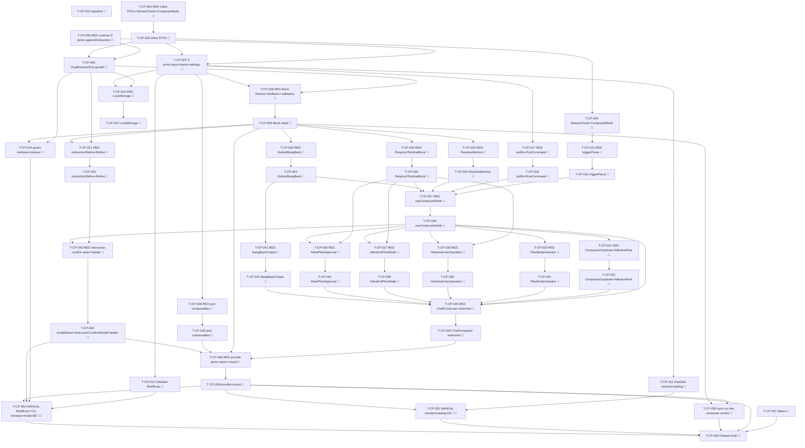

# Tasks — Composer Power (P4)

Each task is ≤ ~½ day, has a stable `T-CP-NNN` id, references ≥ 1 SPEC-CP / TEST-CP / REQ-CP / NFR-CP,
names an owner, lists explicit dependencies, and has a testable Definition of Done. This decomposes
**SPEC-CP-001..038** (38 spec items) on top of the merged P1 chat surface (`chat-core`, TASKS-CC-001),
the merged P2 rich-render surface (`rich-rendering`, TASKS-RR-001), and the merged P3 threads/sessions
surface (`threads-sessions`, TASKS-TS-001) on the `next` integration branch.

> **TDD ordering (mission discipline):** the RED test task for a contract comes **before** the
> implementation task that greens it. RED test tasks are owned by `qa`; implementation tasks by
> `dev`. **Every dev task's first DoD line is "the prior RED test(s) now pass".** This mirrors the
> P2 TASKS-RR-001 / P3 TASKS-TS-001 style the maintainer accepted.

> **DDD inward layering order (the batch structure):**
> 1. **DOMAIN** — the three additive `StreamChunk` request members; the +3 `ChatRuntimePort`
>    callback-setters + 2 `RuntimeCapabilities` flags; `MentionDataProviderPort` /
>    `ProviderCommandCatalogPort` / `ShellExecPort` interfaces + 3 InjectionKeys + barrel; the
>    inline-block DTOs; `ComposerMode` + `TriggerHit` value types; `PluginSettings.customSystemPrompt`
>    + `appendInstruction` helper (SPEC-CP-001..006).
> 2. **INFRA** — the three-bridge port impls (Obsidian mention/catalog factories + the Obsidian
>    `ShellExec` coverage-excluded → manual leg; Mock scripted-echo + fixtures + scriptable callbacks;
>    LocalStorage fixtures + err-not-available); the runtime callback-setters on all three runtimes +
>    the reducer emitting the three request chunks (CLI honesty: `supportsInlineResponse:false`).
>    Pure trigger-parse is **application**, not infra (SPEC-CP-007..011).
> 3. **APPLICATION** — pure `detectTrigger`/`shouldEnterInstruction`/`shouldEnterBangBash`/
>    `replaceTriggerToken` (RED→green); pure refine prompt/parse; then the five use cases
>    `RunCommand` / `ResolveMention` / `RefineInstruction` (side-query) / `SubmitBangBash` /
>    `RespondToInlineBlock` (capability-gated) (SPEC-CP-012..017).
> 4. **UI** — `useComposerMode`; extended `ChatComposer`; the dropdown/overlay components
>    (slash/skill/mention, combobox/listbox ARIA); `PlanModeIndicator`; the three inline-block
>    components (render+respond, depth-counted hide, read-only when `supportsInlineResponse:false`);
>    `BangBashOutput`; the instruction-confirm seam + Obsidian `Modal`; the three port composables —
>    each Vue component pairs a `data-testid` PageObject (SPEC-CP-018..028).
> 5. **STYLES** — §4.11 `--sp-*` tokens + the tokens contract update (SPEC-CP-029), runnable anytime
>    before the gate.
> 6. **WIRE-IN** — provide the three new ports + the instruction-confirm seam in `AgentSidebarView` +
>    `ui/main.ts`; mount the composer modes; `npm run dev` composer smoke (SPEC-CP-028).
> 7. **GATE** — full `npm run verify` + `npm run test:all` + the two manual legs (TEST-CP-M1/M2) +
>    the parity self-review note + draft PR into `next` (orchestrator merges).
> A test for a layer may not depend on a layer further out.

> **Coverage-excluded infra:** the Obsidian `ShellExecPort` (`ObsidianShellExec`, SPEC-CP-008), the
> Obsidian mention/catalog vault reads (SPEC-CP-007 production half), and the `ClaudeCliChatRuntime`
> grown members (SPEC-CP-011 production half) live under `src/infrastructure/obsidian/**`
> (coverage-excluded, §10). Their behavioural gate is the **manual** legs TEST-CP-M1 (vault mention +
> `.claude/commands`/`.claude/skills` catalog read) and TEST-CP-M2 (real `child_process.exec` bang-bash
> + the real-CLI honest read-only inline state + the `InstructionConfirmModal`) — never self-claimed by
> an agent; recorded for the single final epic-review gate (autonomous drive). The **pure parse/refine**
> (SPEC-CP-012/015), the use cases, the **Mock scripted-echo / scriptable-callback** runtime, and the
> **LocalStorage err-not-available** impl carry the unit/component weight.

> **Deleted-symbol guard (ESLint) — NO relaxation needed (verified).** Unlike P2 (which relaxed
> `IconPort`/`SpIcon`/`ICON_PORT`), **none** of the P4 symbols were P0-deleted. `eslint.config.js`
> `DELETED_SUBSYSTEM_BAN` does not list `MentionDataProviderPort`, `ProviderCommandCatalogPort`,
> `ShellExecPort`, `ComposerMode`, `InstructionConfirmModal`, or any mention/command/bang-bash/
> inline-block path; the new domain/application/ui paths (`@/domain/chat/inline/**`,
> `@/domain/chat/composer/**`, `@/domain/ports/{MentionDataProviderPort,ProviderCommandCatalogPort,
> ShellExecPort}`, `@/application/chat/composer/**`, `@/ui/chat/composer/**`) match **no** ban glob
> (`@/domain/chat` regrew in P1 and is off the list; `@/domain/ports/Chat*` is not banned), and
> `DELETED_INJECTION_KEYS` does **not** contain `MENTION_DATA_PROVIDER_PORT` /
> `PROVIDER_COMMAND_CATALOG_PORT` / `SHELL_EXEC_PORT`. So there is **no guard-relax task** in P4.
> (T-CP-001's DoD includes a one-line lint check confirming the new key/port imports resolve clean.)

> **Parity is a review-stage human task:** the P4 per-surface parity-screenshot capture (charter §5 /
> NFR-CP-011) for the composer sub-surfaces (slash/skills palette, mention palette, instruction
> mode + confirm, plan-mode indicator, the three inline blocks, bang-bash output) is deferred to the
> single final epic-review human gate, captured at the charter widths + light/dark, not in CI. The
> baseline-capture task (T-CP-001) runs first so a `claudian-main` composer reference exists pre-impl.

## Legend

- 🧪 = test task (RED-first; owner `qa`)
- 🔨 = implementation task (owner `dev`)
- 📐 = design / scaffolding / baseline task
- 🚀 = release / ops / gate task
- 🪓 = may slice (touches multiple independent code paths; expect several PRs)
- 👤 = human-owned (never agent-self-claimed)

---

## Task list

### T-CP-001 📐 — Baseline-capture: `claudian-main` P4 composer reference + guard verification

- **Description:** Before any P4 implementation, capture the `claudian-main` baseline for the P4
  composer sub-surfaces (the drop-UP `/`/`$` slash palette, the `@` mention palette with two-line
  agent/MCP rows, the instruction-mode placeholder + `InstructionConfirmModal`, the teal PLAN indicator
  + plan-mode border, the three inline blocks — ask-user / exit-plan / plan-approval, the bang-bash
  monospace mode + output block) at the charter widths (320 / 520 / 720 px), light + dark, into a
  `specs/composer-power/parity-screenshots.md` skeleton (baseline column only; the Specorator column is
  filled at the final review). Confirm (one lint run) that the new `MENTION_DATA_PROVIDER_PORT` /
  `PROVIDER_COMMAND_CATALOG_PORT` / `SHELL_EXEC_PORT` keys and the new domain/application/ui paths are
  **not** caught by the `DELETED_SUBSYSTEM_BAN` / `DELETED_INJECTION_KEYS` guard (no relaxation
  required). No production code.
- **Satisfies:** NFR-CP-011 (baseline leg), NFR-CP-002 (guard verification)
- **Owner:** dev
- **Depends on:** —
- **Estimate:** S
- **Definition of done:**
  - [ ] `specs/composer-power/parity-screenshots.md` exists with the per-sub-surface × 320/520/720 ×
        light/dark baseline matrix scaffolded, baseline column captured from `D:\Projects\claudian-main`.
  - [ ] A one-line lint check confirms the deleted-symbol guard does **not** block the three new keys /
        the new port + composer paths (no relaxation task needed); noted in `test-plan.md`.
  - [ ] No file under `src/` changed.

---

## Layer 1 — DOMAIN (SPEC-CP-001..006)

### T-CP-002 🧪 — RED: inline-block DTOs + `StreamChunk` request members + `ComposerMode` value types (structural)

- **Description:** Author the failing structural/type-level tests asserting: (a) the inline-block DTOs
  (`AskUserQuestionOption`/`AskUserQuestionItem`/`AskUserQuestionRequest`/`AskUserQuestionAnswer`,
  `ExitPlanModeRequest`/`ExitPlanModeDecision`, `ApprovalDecision`/`ApprovalOption`/`ApprovalRequest`)
  match SPEC-CP-004 shapes — every `id`/`requestId` is a non-empty string field, `answers` is keyed by
  question id with `string | {custom}` values, `ExitPlanModeDecision` is the three-kind union with
  `revise` carrying `feedback`, `ApprovalDecision` is exactly `'deny'|'allow'|'allow-always'` and
  `'allow-always'` carries **no persistence field**, re-exported from `@/domain/chat/inline/index`
  (TEST-CP-004); (b) the `StreamChunk` union gains **exactly** the three request members
  `ask_user_question`/`exit_plan_mode`/`approval_request` (SPEC-CP-001) and the **P1/P2 union members
  stay byte-identical** (TEST-CP-001, SPEC-CP-034); (c) the `ComposerMode` union covers **exactly** the
  seven kinds (`default`/`slash`/`skills`/`mention`/`instruction`/`bang-bash`/`inline-block`),
  `planActive` is an orthogonal boolean beside the union (not a member), and `TriggerHit`
  (`kind`/`tokenStart`/`filter`) matches SPEC-CP-006 (TEST-CP-006). Names TEST-CP-001/004/006 in metadata.
- **Satisfies:** TEST-CP-001, TEST-CP-004, TEST-CP-006, SPEC-CP-001, SPEC-CP-004, SPEC-CP-006, SPEC-CP-034, REQ-CP-022/024/026/034, NFR-CP-009
- **Owner:** qa
- **Depends on:** —
- **Estimate:** M
- **Definition of done:**
  - [ ] `tests/domain/chat/inline/inlineBlockDtos.test.ts`, `tests/domain/chat/StreamChunk.ts.test.ts`
        (additivity), `tests/domain/chat/composer/ComposerMode.test.ts` exist, naming TEST-CP-001/004/006.
  - [ ] Tests fail (RED) because the inline DTOs / the three StreamChunk members / `ComposerMode` +
        `TriggerHit` do not yet exist (compile/run failure is the RED signal).

### T-CP-003 🔨 — Inline-block DTOs (`src/domain/chat/inline/*.ts` + barrel)

- **Description:** Implement per SPEC-CP-004 under `src/domain/chat/inline/`: `AskUserQuestion.ts`
  (`AskUserQuestionOption`/`AskUserQuestionItem`/`AskUserQuestionRequest`/`AskUserQuestionAnswer`),
  `ExitPlanMode.ts` (`ExitPlanModeRequest`/`ExitPlanModeDecision`), `Approval.ts`
  (`ApprovalDecision`/`ApprovalOption`/`ApprovalRequest`), and `index.ts` re-exporting all of them. Plain
  domain DTOs — string/enum/array only; no `obsidian`, no `node:*`, no Vue, no class. `'allow-always'`
  carries **no** persistence field (NG3, REQ-CP-026).
- **Satisfies:** SPEC-CP-004, REQ-CP-022, REQ-CP-024, REQ-CP-026, NFR-CP-005
- **Owner:** dev
- **Depends on:** T-CP-002
- **Estimate:** S
- **Definition of done:**
  - [ ] The prior RED test (TEST-CP-004) now passes (shapes match `core/types/tools.ts`; `allow-always`
        carries no persistence field; complete-answer keying).
  - [ ] `npm run typecheck` + `npm run lint` green; no `obsidian`/`node:*` import in `src/domain/chat/inline/**`.
  - [ ] Implementation-log entry added.

### T-CP-004 🔨 — `StreamChunk` additive request members + `ComposerMode`/`TriggerHit` value types

- **Description:** Implement per SPEC-CP-001 + SPEC-CP-006: **append** the three request members
  (`ask_user_question`/`exit_plan_mode`/`approval_request`, importing `AskUserQuestionItem`/`ApprovalOption`
  from `@/domain/chat/inline`) to the `StreamChunk` union in `src/domain/chat/StreamChunk.ts` — the
  P1/P2 union members stay byte-identical, the streaming-error convention unchanged (declared-now,
  emitted-by-a-capable-transport); and create `src/domain/chat/composer/ComposerMode.ts` with the
  seven-kind `ComposerModeKind` union, the `ComposerMode` DTO (`kind` + orthogonal `planActive`), and the
  `TriggerHit` DTO. Pure types only; no behaviour (the parse is SPEC-CP-012).
- **Satisfies:** SPEC-CP-001, SPEC-CP-006, SPEC-CP-034, REQ-CP-022, REQ-CP-024, REQ-CP-026, REQ-CP-034, NFR-CP-009
- **Owner:** dev
- **Depends on:** T-CP-002, T-CP-003
- **Estimate:** S
- **Definition of done:**
  - [ ] The prior RED tests (TEST-CP-001 + TEST-CP-006) now pass (exactly the three StreamChunk members
        appended, P1/P2 union byte-identical; the seven `ComposerMode` kinds + orthogonal `planActive`;
        `TriggerHit` shape).
  - [ ] `npm run typecheck` + `npm run lint` green; no `obsidian`/`node:*` import in `src/domain/chat/**`;
        streaming-error boundary unchanged.
  - [ ] Implementation-log entry added.

### T-CP-005 🧪 — RED: `ChatRuntimePort` additive growth + the three new port shapes + `appendInstruction` (structural)

- **Description:** Author the failing structural/type-level + pure-helper tests asserting: (a)
  `ChatRuntimePort` gains **exactly** `setAskUserQuestionCallback`/`setExitPlanModeCallback`/
  `setApprovalCallback` (each a `void` setter taking a `(req) => Promise<decision|null>` callback) +
  `RuntimeCapabilities` gains **exactly** `supportsPlanMode`/`supportsInlineResponse`, with the **12 P3
  members + 3 existing caps byte-identical** and the streaming-error convention unchanged (TEST-CP-002,
  SPEC-CP-034); (b) `MentionDataProviderPort` exposes `query(filter, signal?) → Promise<MentionReferent[]>`
  (no `Result`), `MentionReferent`/`MentionReferentKind` shapes match SPEC-CP-003, `MENTION_DATA_PROVIDER_PORT`
  is its own `InjectionKey`, barrel re-exports it (TEST-CP-003); (c) `ProviderCommandCatalogPort` exposes
  `getEntries(kind) → Promise<CatalogEntry[]>`, `CatalogEntry`/`CatalogEntryKind` shapes match SPEC-CP-005,
  and `ShellExecPort` exposes `run(request) → Promise<Result<ShellExecResult, Error>>` with the
  `ShellExecRequest`/`ShellExecResult` shapes (`exitCode`/`truncated`/`notice`), both with own
  `InjectionKey`s + barrel re-exports (TEST-CP-005 shape leg); (d) `appendInstruction(existing, instruction)`:
  empty existing → the raw instruction, non-empty → `existing + '\n\n' + instruction` (TEST-CP-005 helper
  leg); `PluginSettings.customSystemPrompt` default `''`. Names TEST-CP-002/003/005.
- **Satisfies:** TEST-CP-002, TEST-CP-003, TEST-CP-005, SPEC-CP-002, SPEC-CP-003, SPEC-CP-005, SPEC-CP-034, REQ-CP-009/012/018/020/023/025/026/028/030/031, NFR-CP-009
- **Owner:** qa
- **Depends on:** —
- **Estimate:** M
- **Definition of done:**
  - [ ] `tests/domain/ports/ChatRuntimePort.ts.test.ts` (P4 additivity),
        `tests/domain/ports/MentionDataProviderPort.test.ts`,
        `tests/domain/ports/ProviderCommandCatalogPort.test.ts`,
        `tests/domain/ports/ShellExecPort.test.ts`, and
        `tests/domain/settings/appendInstruction.test.ts` exist, naming TEST-CP-002/003/005.
  - [ ] Tests fail (RED) — the additive runtime members + the three ports + keys + barrel + the settings
        helper do not yet exist.

### T-CP-006 🔨 — `ChatRuntimePort` additive growth (3 callback-setters + 2 caps flags)

- **Description:** Make the **additive-only** growth per SPEC-CP-002: add
  `RuntimeCapabilities.supportsPlanMode` + `supportsInlineResponse` and the three members
  `setAskUserQuestionCallback`/`setExitPlanModeCallback`/`setApprovalCallback` to
  `src/domain/ports/ChatRuntimePort.ts` (importing the request/decision DTOs from `@/domain/chat/inline`).
  The 12 P3 members + the 3 existing capability flags stay byte-identical; the three setters are
  `void`-returning (no `respond(...)` method, ADR-CP-004 §1), non-streaming, do not change the
  streaming-error convention (ADR-CC-001 §1). No rename/removal of any P1/P2/P3 member.
- **Satisfies:** SPEC-CP-002, SPEC-CP-034, REQ-CP-020, REQ-CP-023, REQ-CP-025, REQ-CP-026, REQ-CP-028, NFR-CP-009
- **Owner:** dev
- **Depends on:** T-CP-005, T-CP-003
- **Estimate:** S
- **Definition of done:**
  - [ ] The prior RED test (TEST-CP-002) now passes (exactly the three setters + two flags appended; the
        12 P3 members + 3 caps byte-identical; no rename/removal).
  - [ ] `npm run typecheck` + `npm run lint` green; no `obsidian`/`node:*` import in `src/domain/**`;
        the setters are non-`Result`, the streaming-error boundary unchanged.
  - [ ] Implementation-log entry added.

### T-CP-007 🔨 — `MentionDataProviderPort` + `ProviderCommandCatalogPort` + `ShellExecPort` + 3 keys + barrel + `PluginSettings.customSystemPrompt` + `appendInstruction`

- **Description:** Implement per SPEC-CP-003 + SPEC-CP-005: the three narrow port interfaces under
  `src/domain/ports/` (`MentionDataProviderPort.ts` with `MentionReferent`/`MentionReferentKind`,
  `ProviderCommandCatalogPort.ts` with `CatalogEntry`/`CatalogEntryKind`, `ShellExecPort.ts` with
  `ShellExecRequest`/`ShellExecResult`, `run` returning `Result`); add the three InjectionKeys
  (`MENTION_DATA_PROVIDER_PORT`/`PROVIDER_COMMAND_CATALOG_PORT`/`SHELL_EXEC_PORT`) to
  `src/infrastructure/bridge/ports.ts` (no aggregate — keep the per-key header); re-export all three
  ports + their types + the inline DTOs from `src/domain/ports/index.ts`; and grow
  `src/domain/settings/PluginSettings.ts` additively with `customSystemPrompt: string` (default `''` in
  `DEFAULT_SETTINGS`) + the total pure helper `appendInstruction(existing, instruction)`. Device-local,
  no secret, no migration (NFR-CP-010).
- **Satisfies:** SPEC-CP-003, SPEC-CP-005, REQ-CP-004, REQ-CP-009, REQ-CP-012, REQ-CP-018, REQ-CP-030, REQ-CP-031, NFR-CP-002, NFR-CP-010
- **Owner:** dev
- **Depends on:** T-CP-005, T-CP-003
- **Estimate:** M
- **Definition of done:**
  - [ ] The prior RED tests (TEST-CP-003 + TEST-CP-005) now pass (the three port shapes, own keys, barrel
        re-exports; `appendInstruction` empty→raw / non-empty→`\n\n` join; `customSystemPrompt` default `''`).
  - [ ] `npm run typecheck` + `npm run lint` green; deleted-symbol guard green (the three new key/port
        imports resolve clean — no relaxation needed); no `obsidian`/`node:*` import in `src/domain/**`.
  - [ ] Implementation-log entry added.

---

## Layer 2 — INFRA (SPEC-CP-007..011)

### T-CP-008 🧪 — RED: `MockBridge` fixtures + scripted `ShellExecPort` + scriptable callbacks + fake-ports members

- **Description:** Author the failing unit tests asserting the Mock bridge surface (SPEC-CP-009): (a)
  `MockBridge.createMentionDataProvider()` returns a fixture provider over an in-memory referent list
  (files + one subagent; MCP `[]`); `query(filter)` filters case-insensitively, empty filter →
  the unfiltered capped list, empty source → `[]` no throw (REQ-CP-012); (b)
  `MockBridge.createProviderCommandCatalog()` returns a fixture `getEntries(kind)` (scripted command/skill
  list), with a `seedCatalogDelay(ms)` hook so a test can fire a stale + a fresh response (REQ-CP-004);
  (c) `MockBridge.shellExec.run` is a **scripted echo** over a fixture `Map<command, ShellExecResult>`
  (default echoes the command, `exitCode 0`); a fixture entry scripts a non-zero exit / a `truncated`
  result; a test asserts **no `child_process` import** in the Mock (S1/REQ-CP-032); (d) the Mock
  `ChatRuntimePort` exposes **scriptable** callback channels + scriptable `supportsPlanMode`/
  `supportsInlineResponse` so a test drives an `ask_user_question`/`exit_plan_mode`/`approval_request`
  chunk in capable + non-capable mode and captures the registered callbacks; (e) `tests/__fakes__/fake-ports.ts`
  gains `mentionData`, `commandCatalog`, `shellExec` members + the capable/non-capable runtime toggle,
  with mutations visible across the factory's ports. Names the U leg of TEST-CP-003/005 (Mock fixtures),
  TEST-CP-012 (catalog delay), TEST-CP-028 (no-spawn), and the capable/non-capable backing of TEST-CP-020/024.
- **Satisfies:** TEST-CP-012, TEST-CP-028 (Mock no-spawn), TEST-CP-020 (capable backing), TEST-CP-024 (non-capable backing), SPEC-CP-009, REQ-CP-004, REQ-CP-012, REQ-CP-030, REQ-CP-032, NFR-CP-002, NFR-CP-006
- **Owner:** qa
- **Depends on:** T-CP-006, T-CP-007
- **Estimate:** M
- **Definition of done:**
  - [ ] `tests/infrastructure/mock/MockMentionCatalog.test.ts`,
        `tests/infrastructure/mock/MockShellExec.test.ts`,
        `tests/infrastructure/mock/MockChatRuntime.ts.test.ts` (the P4 callback/caps growth), and the
        extended `tests/__fakes__/fake-ports.test.ts` exist, naming the listed TEST-CP ids.
  - [ ] Tests fail (RED) — the Mock fixtures / scripted ShellExec / scriptable callbacks / the factory
        members do not yet exist.

### T-CP-009 🔨 — `MockBridge` fixtures + scripted `ShellExecPort` + scriptable callbacks + fake-ports members

- **Description:** Implement per SPEC-CP-009 under `src/infrastructure/mock/**`:
  `createMentionDataProvider()` (fixture composite incl. empty-MCP branch), `createProviderCommandCatalog()`
  (fixture `getEntries` + `seedCatalogDelay` hook), `shellExec.run` (scripted echo over a `Map`, **never
  spawns**), and the Mock `ChatRuntimePort` growth (the three callback setters that capture the registered
  callbacks + scriptable `supportsPlanMode`/`supportsInlineResponse` + scriptable request-chunk emission);
  add the `mentionData`/`commandCatalog`/`shellExec` members + the capable/non-capable runtime toggle to
  `tests/__fakes__/fake-ports.ts`. No `node:*`, no spawn.
- **Satisfies:** SPEC-CP-009, REQ-CP-004, REQ-CP-012, REQ-CP-030, REQ-CP-032, NFR-CP-002, NFR-CP-006
- **Owner:** dev
- **Depends on:** T-CP-008
- **Estimate:** M
- **Definition of done:**
  - [ ] The prior RED tests (TEST-CP-012 + TEST-CP-028 Mock leg + the capable/non-capable backing) now
        pass; the fake-ports factory members work for multi-port composer tests; mutations visible across ports.
  - [ ] **No `child_process`/`node:*` import** in the Mock (asserted, S1); DTO-only; `npm run typecheck`
        + `npm run lint` + `npm run test` green; implementation-log entry added.

### T-CP-010 🧪 — RED: `LocalStorageBridge` fixtures + err-not-available `ShellExecPort`

- **Description:** Author the failing unit tests asserting (SPEC-CP-010): `LocalStorageBridge.createMentionDataProvider()`
  + `createProviderCommandCatalog()` return **fixture** lists (so the palettes work in the browser demo);
  `LocalStorageBridge.shellExec.run(...)` resolves **`err(new Error('shell execution is not available in
  the browser demo'))`** (honest gating, no silent dead path); the demo runtime reports
  `supportsPlanMode:false` + `supportsInlineResponse:false` so the gated read-only inline state is
  demonstrable. Names TEST-CP-016.
- **Satisfies:** TEST-CP-016, SPEC-CP-010, REQ-CP-012, NFR-CP-002, NFR-CP-007
- **Owner:** qa
- **Depends on:** T-CP-006, T-CP-007
- **Estimate:** S
- **Definition of done:**
  - [ ] `tests/infrastructure/localstorage/LocalStorageComposerPorts.test.ts` exists, naming TEST-CP-016,
        covering fixture mention/catalog + `run`→`err` + the false caps flags.
  - [ ] Tests fail (RED) — the LocalStorage composer ports do not yet exist.

### T-CP-011 🔨 — `LocalStorageBridge` fixtures + err-not-available `ShellExecPort`

- **Description:** Implement per SPEC-CP-010 under `src/infrastructure/localstorage/**`:
  `createMentionDataProvider()` + `createProviderCommandCatalog()` returning fixture lists; `shellExec.run`
  resolving `err('shell execution is not available in the browser demo')`; the demo runtime caps
  `supportsPlanMode:false` + `supportsInlineResponse:false`. No `node:*`, no spawn.
- **Satisfies:** SPEC-CP-010, REQ-CP-012, NFR-CP-002, NFR-CP-007
- **Owner:** dev
- **Depends on:** T-CP-010
- **Estimate:** S
- **Definition of done:**
  - [ ] The prior RED test (TEST-CP-016) now passes (fixture palettes; `run`→`err`; false caps).
  - [ ] No `node:*`/subprocess; `npm run typecheck` + `npm run lint` + `npm run test` green;
        implementation-log entry added.

### T-CP-012 🔨 — `ObsidianBridge` mention + catalog providers (`createMentionDataProvider` / `createProviderCommandCatalog`) 🪓

> The `ObsidianBridge` vault/catalog reads live under `src/infrastructure/obsidian/**`
> (coverage-excluded); their behavioural gate is the **manual** leg TEST-CP-M1. The filtering/cap logic
> mirrors `VaultMentionCache`; this task is structural + typecheck + the manual-leg backing.

- **Description:** Implement per SPEC-CP-007 under `src/infrastructure/obsidian/**`:
  `createMentionDataProvider()` → an application-layer **composite** over (i) a vault source on the
  existing `VaultPort` (`listFiles`/`listFolders` → `file`/`folder` referents) and (ii) a catalog source
  for `subagent`/`mcp-server`/`external-dir` referents (MCP no-ops `[]` (P8/NG4); subagent Claude-only
  (NG5); `external-dir` reads the Claude added-dir list); an empty non-vault source does not error the
  palette (REQ-CP-012). `createProviderCommandCatalog()` → the Claude file-backed catalog: commands from
  `<vault>/.claude/commands/**/*.md`, skills from `<vault>/.claude/skills/**/SKILL.md` via
  `VaultPort.listFiles`/`readFile`, mapped to `CatalogEntry` (`builtIn:false`, `prefix` `/` or `$`); an
  absent `.claude` folder → `[]` (load-or-default). All I/O through `VaultPort`.
- **Satisfies:** SPEC-CP-007, REQ-CP-004, REQ-CP-009, REQ-CP-010, REQ-CP-012, NFR-CP-002 (manual leg)
- **Owner:** dev
- **Depends on:** T-CP-007
- **Estimate:** M
- **Slice plan:** may slice as (a) the vault mention source + composite, then (b) the Claude
  `.claude/commands`/`.claude/skills` catalog source.
- **Definition of done:**
  - [ ] `createMentionDataProvider()` + `createProviderCommandCatalog()` exposed on `ObsidianBridge`; all
        I/O via `VaultPort`; absent `.claude` folder → `[]`; empty non-vault source does not error.
  - [ ] `npm run typecheck` + `npm run lint` green; the manual leg TEST-CP-M1 is scheduled in `test-plan.md`.
  - [ ] Implementation-log entry added.

### T-CP-013 🔨 — `ObsidianBridge` `ShellExecPort` (`ObsidianShellExec`, real `child_process.exec`, S1–S5, coverage-excluded) 🪓

> The sole real shell-execution path in the plugin (SPEC-CP-033) + the **only** `node:*` shell import
> outside the existing CLI runtime. Lives under `src/infrastructure/obsidian/**` (coverage-excluded);
> its behavioural gate is the **manual** leg TEST-CP-M2. The Mock scripted-echo (TEST-CP-028) +
> LocalStorage err (TEST-CP-016) carry the automated proof.

- **Description:** Implement per SPEC-CP-008 + SPEC-CP-033: `src/infrastructure/obsidian/ObsidianShellExec.ts`
  implementing `ShellExecPort`, exposed as `ObsidianBridge.shellExec` (stateless — the bridge IS the
  port). Wrap node `child_process.exec` with the Claudian `BangBashService` options: **cwd** = the vault
  adapter base path (`FileSystemAdapter.getBasePath()`); non-`FileSystemAdapter` (mobile) →
  `err('shell execution is not available on this platform')`; **shell** = `cmd.exe` (Windows) / `/bin/bash`
  (else); **enhanced PATH** (Claudian parity) but **no plugin secret injected** into the child env (S3);
  **bounds** `timeout: 30_000` + `maxBuffer: 1_048_576` → on breach `ok({exitCode:124, truncated:true,
  notice})`; **passthrough** `request.command` runs **verbatim** (S2 — no rewrite/augment/chain). `run`
  resolves `ok(ShellExecResult)` for any completed run (incl. non-zero exit); only a spawn failure → `err`.
- **Satisfies:** SPEC-CP-008, SPEC-CP-033, REQ-CP-030, REQ-CP-031, REQ-CP-032, NFR-CP-006 (manual leg)
- **Owner:** dev
- **Depends on:** T-CP-007
- **Estimate:** M
- **Slice plan:** may slice as (a) the exec wrapper + cwd/shell/PATH resolution, then (b) the
  timeout/maxbuffer → `exitCode 124` bounds path.
- **Definition of done:**
  - [ ] `ObsidianShellExec` implements `ShellExecPort` (`run` → `Result`); **S1** `child_process`/`node:*`
        imported **only** here (besides the existing CLI runtime — confirmed by a one-line grep noted in
        `test-plan.md`); **S2** verbatim passthrough; **S3** no plugin secret in the child env; **S4** bounded
        30 s / 1 MB → `exitCode 124`/`truncated`; **S5** result is a render-only DTO (no persistence here).
  - [ ] `npm run typecheck` + `npm run lint` green; the manual leg TEST-CP-M2 is scheduled in `test-plan.md`
        (non-zero exit → `ok`, spawn failure → `err`, timeout → 124).
  - [ ] Implementation-log entry added.

### T-CP-014 🔨 — Grown `ChatRuntimePort` impls (callback-setters + caps + reducer emits the 3 request chunks; CLI honesty) 🪓

> The `ClaudeCliChatRuntime` (production) lives under `src/infrastructure/obsidian/**`
> (coverage-excluded); its behavioural gate is the **manual** leg TEST-CP-M2 (the real `claude --print`
> CLI reporting `supportsInlineResponse:false`). The Mock half (T-CP-009) + LocalStorage half (T-CP-011)
> already CI-green the capable/non-capable backing.

- **Description:** Implement per SPEC-CP-011: add the three callback-setters + the two capability flags
  to each bridge runtime. **`ClaudeCliChatRuntime`** (coverage-excluded): the three setters **store** the
  registered callbacks; `getCapabilities()` reports `supportsInlineResponse: false` (the one-shot
  `claude --print` transport cannot round-trip a mid-turn interactive answer — CLI honesty, ADR-CP-004 §3)
  + `supportsPlanMode` per its real plan capability; the CLI stream **reducer** emits the matching
  `StreamChunk` request member (SPEC-CP-001) where the wire surfaces an ask-user / exit-plan / approval
  request, and the response flows back via the registered callback (SPEC-CP-017). The Mock + Fixture
  runtimes already grew in T-CP-009/T-CP-011. **Additivity (SPEC-CP-034):** the 12 P3 members + 3 caps +
  the P1/P2/P3 `StreamChunk` members stay byte-identical.
- **Satisfies:** SPEC-CP-011, SPEC-CP-034, REQ-CP-020, REQ-CP-023, REQ-CP-025, REQ-CP-026, REQ-CP-028, NFR-CP-002, NFR-CP-007
- **Owner:** dev
- **Depends on:** T-CP-006, T-CP-009
- **Estimate:** M
- **Slice plan:** may slice as (a) the setter-store + capability flags, then (b) the reducer emitting the
  three request chunks (coverage-excluded, manual leg TEST-CP-M2).
- **Definition of done:**
  - [ ] The Mock/Fixture capable + non-capable backing (TEST-CP-020/024) stays green; the
        `ClaudeCliChatRuntime` reports `supportsInlineResponse:false`; the reducer emits the three request
        chunks; the 12 P3 members + 3 caps + the StreamChunk union byte-identical.
  - [ ] `npm run typecheck` + `npm run lint` green; the streaming-error convention unchanged; the real-CLI
        honest read-only state is scheduled as the manual leg TEST-CP-M2 in `test-plan.md`.
  - [ ] Implementation-log entry added.

---

## Layer 3 — APPLICATION (SPEC-CP-012..017)

### T-CP-015 🧪 — RED: pure trigger-parse (`detectTrigger`/`shouldEnterInstruction`/`shouldEnterBangBash`/`replaceTriggerToken`)

- **Description:** Author the failing unit tests for the pure trigger-parse (SPEC-CP-012):
  `detectTrigger(value, caret)` → `slash`/`skills` `TriggerHit` **iff** start-of-token (index 0 or after
  whitespace), `null` mid-word (`a/b`, EC-CP-1); `@` → `mention` `TriggerHit` anywhere the caret sits in
  the `@`-token; a whitespace typed into a `slash`/`skills` filter → `null` for that position (palette
  closes, EC-CP-2); `filter` is the substring between the trigger and the caret; multiple `@`/`/` tokens
  → classifies the token the caret sits in, others untouched (EC-CP-10); `shouldEnterInstruction(value)`
  / `shouldEnterBangBash(value)` → true **iff** the WHOLE value is empty/whitespace (REQ-CP-015/029);
  `replaceTriggerToken(value, tokenStart, caret, insertion)` rewrites only `[tokenStart, caret]`, text
  outside intact (so `look at @no` survives a cancel, EC-CP-4), caret after the inserted text. All
  pure/total — never throw. Names TEST-CP-007.
- **Satisfies:** TEST-CP-007, SPEC-CP-012, REQ-CP-001, REQ-CP-002, REQ-CP-007, REQ-CP-008, REQ-CP-015, REQ-CP-029, REQ-CP-036, NFR-CP-005
- **Owner:** qa
- **Depends on:** T-CP-004
- **Estimate:** M
- **Definition of done:**
  - [ ] `tests/application/chat/composer/triggerParse.test.ts` exists, naming TEST-CP-007, covering
        start-of-token vs mid-word / whitespace-closes / empty-gate / multiple tokens / `@no` survives.
  - [ ] Tests fail (RED) — `triggerParse.ts` does not yet exist.

### T-CP-016 🔨 — `triggerParse.ts` (pure trigger detection + token replace)

- **Description:** Implement `src/application/chat/composer/triggerParse.ts` per SPEC-CP-012:
  `detectTrigger` (the start-of-token `/`/`$` rule, the in-token `@` rule, whitespace-closes for
  slash/skills, the per-token classify), `shouldEnterInstruction`/`shouldEnterBangBash` (whole-value
  empty/whitespace), `replaceTriggerToken` (rewrite only the `[tokenStart, caret]` span, text outside
  preserved). Ported verbatim from Claudian `utils/slashCommand.ts`. Pure, total, never throws; no
  `obsidian`/`node:*`/Vue import.
- **Satisfies:** SPEC-CP-012, REQ-CP-001, REQ-CP-002, REQ-CP-007, REQ-CP-008, REQ-CP-015, REQ-CP-029, REQ-CP-036, NFR-CP-005
- **Owner:** dev
- **Depends on:** T-CP-015
- **Estimate:** S
- **Definition of done:**
  - [ ] The prior RED test (TEST-CP-007) now passes, incl. EC-CP-1/2/4/10.
  - [ ] Total/pure; no side effects; no `obsidian`/`node:*`/Vue import.
  - [ ] `npm run typecheck` + `npm run lint` + `npm run test` green; implementation-log entry added.

### T-CP-017 🧪 — RED: `builtInCommands` + `RunCommandUseCase`

- **Description:** Author the failing unit tests (SPEC-CP-013): `listBuiltInCommands()` returns the six
  built-ins (`/clear`/`/new`/`/add-dir`/`/resume`/`/fork`/`/compact`, each `builtIn:true`, `prefix:'/'`)
  with the `HIDDEN_COMMANDS` set excluded, independent of any catalog load (REQ-CP-003, EC-CP-8);
  `RunCommandUseCase.execute(entry)` → a `builtIn:true` action entry resolves `{kind:'action'; action}`
  (`/clear` → `clear`, not inserted text, REQ-CP-006), a provider entry (or a built-in without an action)
  resolves `{kind:'insert'; text: prefix+name+' '}` (REQ-CP-005); `$` vs `/` prefix distinct (EC-CP-11);
  `Result`-returning. Names the U leg of TEST-CP-008.
- **Satisfies:** TEST-CP-008, SPEC-CP-013, REQ-CP-003, REQ-CP-005, REQ-CP-006, NFR-CP-004
- **Owner:** qa
- **Depends on:** T-CP-007
- **Estimate:** S
- **Definition of done:**
  - [ ] `tests/application/chat/composer/builtInCommands.test.ts` +
        `tests/application/chat/composer/RunCommandUseCase.test.ts` exist, naming TEST-CP-008, covering
        built-ins-list-no-catalog / hidden-excluded (EC-CP-8) / `/clear`→action / provider-entry→insert / `$` vs `/`.
  - [ ] Tests fail (RED) — `builtInCommands.ts`/`RunCommandUseCase` do not yet exist.

### T-CP-018 🔨 — `builtInCommands.ts` (pure list) + `RunCommandUseCase`

- **Description:** Implement per SPEC-CP-013 under `src/application/chat/composer/`: `builtInCommands.ts`
  (`BUILT_IN_COMMANDS`/`HIDDEN_COMMANDS`/`listBuiltInCommands()` — pure, total, ported) and
  `RunCommandUseCase.execute(entry)` → `Result<RunCommandOutcome>` (`{kind:'action'; action}` for an
  action built-in / `{kind:'insert'; text: prefix+name+' '}` for a provider entry or non-action built-in);
  the underlying action's `Result.err` propagates. No provider branch; no `obsidian`/`node:*`/Vue import.
- **Satisfies:** SPEC-CP-013, REQ-CP-003, REQ-CP-005, REQ-CP-006, NFR-CP-004, NFR-CP-005
- **Owner:** dev
- **Depends on:** T-CP-017
- **Estimate:** S
- **Definition of done:**
  - [ ] The prior RED test (TEST-CP-008) now passes, incl. EC-CP-8/11.
  - [ ] `Result`-returning; the built-ins list with no catalog load; pure/total list; no provider branch;
        no `obsidian`/Vue import.
  - [ ] `npm run typecheck` + `npm run lint` + `npm run test` green; implementation-log entry added.

### T-CP-019 🧪 — RED: `ResolveMentionUseCase`

- **Description:** Author the failing unit tests against the fixture `MentionDataProviderPort`
  (SPEC-CP-014): `ResolveMentionUseCase.query(filter, signal?)` → `Result<MentionReferent[]>` wrapping the
  port (load-or-default `ok([])` on an empty source, REQ-CP-012; `err` only on an irrecoverable read
  fault); a vault file + folder + subagent are listed, the empty MCP source does not error (EC-CP-3b),
  the resolved `mentionText` is the insertion (REQ-CP-013). Names the U leg of TEST-CP-009.
- **Satisfies:** TEST-CP-009, SPEC-CP-014, REQ-CP-009, REQ-CP-010, REQ-CP-012, REQ-CP-013, NFR-CP-004
- **Owner:** qa
- **Depends on:** T-CP-009
- **Estimate:** S
- **Definition of done:**
  - [ ] `tests/application/chat/composer/ResolveMentionUseCase.test.ts` exists, naming TEST-CP-009,
        covering vault file+folder+subagent listed / empty MCP no error (EC-CP-3b) / `mentionText` is the insertion.
  - [ ] Tests fail (RED) — `ResolveMentionUseCase` does not yet exist.

### T-CP-020 🔨 — `ResolveMentionUseCase`

- **Description:** Implement `src/application/chat/composer/ResolveMentionUseCase.ts` per SPEC-CP-014:
  `query(filter, signal?)` delegates to `mentions.query` wrapped in a `Result` (load-or-default `ok([])`;
  `err` only on an irrecoverable read fault); the resolved insertion is the referent's `mentionText`
  (file mention inserts the token only — the removable chip is P5/NG1). The debounce + request-guard are
  the consumer's (SPEC-CP-018), not here. No provider branch; no `obsidian`/`node:*`/Vue import.
- **Satisfies:** SPEC-CP-014, REQ-CP-009, REQ-CP-010, REQ-CP-012, REQ-CP-013, NFR-CP-004, NFR-CP-005
- **Owner:** dev
- **Depends on:** T-CP-019
- **Estimate:** S
- **Definition of done:**
  - [ ] The prior RED test (TEST-CP-009) now passes, incl. EC-CP-3b.
  - [ ] `Result`-returning; no provider branch; no `obsidian`/Vue import.
  - [ ] `npm run typecheck` + `npm run lint` + `npm run test` green; implementation-log entry added.

### T-CP-021 🧪 — RED: `instructionRefine.ts` pure transforms + `RefineInstructionUseCase` (side-query)

- **Description:** Author the failing unit tests (SPEC-CP-015): the pure `buildRefineSystemPrompt(existing)`
  (ported verbatim) + `parseRefineResponse(raw)` — extract `<instruction>…</instruction>` → `{kind:'refined'}`,
  a non-empty plain text → `{kind:'clarification'}`, `''` → `null` (TEST-CP-010); and
  `RefineInstructionUseCase.execute(rawInstruction, existingInstructions)` against a `MockChatRuntime`:
  builds the one-shot prepared turn from `buildRefineSystemPrompt`, drives `query(turn, [],
  {forceColdStart:true})` accumulating `text` (ignoring tool/thinking), `done` terminates, parsed →
  `Result.ok(RefineOutcome)`; an empty/parse-fail or an `{type:'error'}` chunk → `Result.err` (error-as-chunk
  → `Result` at the boundary, ADR-CC-001 §2); on `err` the caller falls through to the **raw** instruction
  and **no `NotificationPort.showError`** fires (EC-CP-9); gated on `getCapabilities()`, never a `provider
  ===` branch. Names TEST-CP-010 + the U leg of TEST-CP-011 (refine).
- **Satisfies:** TEST-CP-010, TEST-CP-011 (refine U leg), SPEC-CP-015, REQ-CP-016, NFR-CP-004, NFR-CP-007
- **Owner:** qa
- **Depends on:** T-CP-006, T-CP-009
- **Estimate:** M
- **Definition of done:**
  - [ ] `tests/application/chat/composer/instructionRefine.test.ts` +
        `tests/application/chat/composer/RefineInstructionUseCase.test.ts` exist, naming TEST-CP-010/011,
        covering refined / clarification / `''`→null / error-chunk→err-falls-through-to-raw / no `showError`.
  - [ ] Tests fail (RED) — `instructionRefine.ts`/`RefineInstructionUseCase` do not yet exist.

### T-CP-022 🔨 — `instructionRefine.ts` (pure) + `RefineInstructionUseCase` (cold-start side-query)

- **Description:** Implement per SPEC-CP-015 under `src/application/chat/composer/`: `instructionRefine.ts`
  (`buildRefineSystemPrompt` + `parseRefineResponse` + the `RefineOutcome` union, ported verbatim from
  `core/prompt/instructionRefine.ts`, pure/total) and `RefineInstructionUseCase.execute(rawInstruction,
  existingInstructions)` (the SPEC-TS-016-shaped cold-start side-query via `query(turn, [],
  {forceColdStart:true})`; accumulate `text`; `parseRefineResponse` → `Result<RefineOutcome>`; error chunk
  → `err`; best-effort — on `err` the raw instruction proceeds, logged `warn`, **never `showError`**).
  Provider-addressed via `getCapabilities()`; the runtime gains **no** refine-specific member (reuses
  `query`, NFR-CP-009). No provider branch.
- **Satisfies:** SPEC-CP-015, REQ-CP-016, NFR-CP-004, NFR-CP-005, NFR-CP-007
- **Owner:** dev
- **Depends on:** T-CP-021
- **Estimate:** M
- **Definition of done:**
  - [ ] The prior RED tests (TEST-CP-010 + the TEST-CP-011 refine U leg) now pass, incl. EC-CP-9
        (refine-fail → raw, no `showError`).
  - [ ] `Result`-returning; the error-as-chunk → `Result` mapping at the boundary; cold-start does not
        steer the tab's main stream; no new runtime member; no provider branch; no `obsidian`/Vue import.
  - [ ] `npm run typecheck` + `npm run lint` + `npm run test` green; implementation-log entry added.

### T-CP-023 🧪 — RED: `SubmitBangBashUseCase`

- **Description:** Author the failing unit tests against the scripted Mock `ShellExecPort` (SPEC-CP-016):
  `SubmitBangBashUseCase.execute(command)` calls `shell.run({command})` **verbatim** (S2 — no
  rewrite/augment/chain, REQ-CP-030); maps `ok(ShellExecResult)` → `ok(BangBashOutput)`; a **non-zero
  exit** is **`ok`** with the code (REQ-CP-031); a spawn failure / browser-unavailable → `err` (the UI
  surfaces the notice, EC-CP-5); the use case **never logs `stdout`/`stderr` content** — only the command
  + exit code may be logged (S3, asserted the `LoggerPort` never receives output content). Names the U
  leg of TEST-CP-013 + TEST-CP-028 (explicit-call / no-output-log).
- **Satisfies:** TEST-CP-013 (U leg), TEST-CP-028, SPEC-CP-016, SPEC-CP-033, REQ-CP-030, REQ-CP-031, REQ-CP-032, NFR-CP-006
- **Owner:** qa
- **Depends on:** T-CP-009
- **Estimate:** S
- **Definition of done:**
  - [ ] `tests/application/chat/composer/SubmitBangBashUseCase.test.ts` exists, naming TEST-CP-013/028,
        covering verbatim passthrough / non-zero exit→`ok` w/ code / unavailable→`err` / logger never sees stdout/stderr.
  - [ ] Tests fail (RED) — `SubmitBangBashUseCase` does not yet exist.

### T-CP-024 🔨 — `SubmitBangBashUseCase`

- **Description:** Implement `src/application/chat/composer/SubmitBangBashUseCase.ts` per SPEC-CP-016:
  `execute(command)` → `shell.run({command})` verbatim → maps to `Result<BangBashOutput>` (non-zero exit
  → `ok` with the code; spawn-failure/unavailable → `err`); logs only `command` + `exitCode` via
  `LoggerPort`, **never** `stdout`/`stderr` content (S3, SPEC-CP-036). Pre: `command` non-empty. The
  caller (`useComposerMode`) calls `execute` **only** on an explicit Enter (S1, REQ-CP-032). No provider
  branch; no `obsidian`/`node:*`/Vue import.
- **Satisfies:** SPEC-CP-016, SPEC-CP-033, REQ-CP-030, REQ-CP-031, REQ-CP-032, NFR-CP-004, NFR-CP-006
- **Owner:** dev
- **Depends on:** T-CP-023
- **Estimate:** S
- **Definition of done:**
  - [ ] The prior RED tests (TEST-CP-013 U leg + TEST-CP-028) now pass, incl. EC-CP-5.
  - [ ] `Result`-returning; verbatim passthrough (no rewrite); `LoggerPort` never receives output
        content; no provider branch; no `obsidian`/`node:*`/Vue import.
  - [ ] `npm run typecheck` + `npm run lint` + `npm run test` green; implementation-log entry added.

### T-CP-025 🧪 — RED: `RespondToInlineBlockUseCase` (capability-gated)

- **Description:** Author the failing unit tests against the capable + non-capable Mock runtime
  (SPEC-CP-017): `RespondToInlineBlockUseCase.respondAskUserQuestion`/`respondExitPlanMode`/`respondApproval`
  each **first** read `runtime.getCapabilities().supportsInlineResponse` — when **true** they resolve the
  runtime's registered callback with the decision (a `null` decision resolves with `null` = cancel,
  REQ-CP-022/033); when **false** they return `Result.err(InlineResponseUnavailableError)` **without**
  reaching the callback — **no lost response** (REQ-CP-028, EC-CP-6); `respondApproval('allow-always')`
  routes the decision but writes **NO** rule (no `SettingsPort.saveSettings`/history write, NG3,
  REQ-CP-026). Names the U leg of TEST-CP-020 (capable), TEST-CP-021 (no-rule), TEST-CP-024 (non-capable),
  TEST-CP-027 (no `provider ===` grep).
- **Satisfies:** TEST-CP-020, TEST-CP-021 (U leg), TEST-CP-024 (U leg), TEST-CP-027, SPEC-CP-017, SPEC-CP-032, REQ-CP-023, REQ-CP-025, REQ-CP-026, REQ-CP-028, NFR-CP-004, NFR-CP-007
- **Owner:** qa
- **Depends on:** T-CP-009
- **Estimate:** M
- **Definition of done:**
  - [ ] `tests/application/chat/composer/RespondToInlineBlockUseCase.test.ts` exists, naming
        TEST-CP-020/021/024/027, covering capable→callback-resolved / `null`→cancel / non-capable→err-no-callback
        (EC-CP-6) / `allow-always`→no-persistence-write (NG3).
  - [ ] Tests fail (RED) — `RespondToInlineBlockUseCase` does not yet exist.

### T-CP-026 🔨 — `RespondToInlineBlockUseCase` (the capability-gate boundary)

- **Description:** Implement `src/application/chat/composer/RespondToInlineBlockUseCase.ts` per
  SPEC-CP-017: `respondAskUserQuestion`/`respondExitPlanMode`/`respondApproval`, each reading
  `runtime.getCapabilities().supportsInlineResponse` **first** — false → `Result.err(InlineResponseUnavailableError)`,
  callback never reached, no lost response (REQ-CP-028); true → resolve the runtime's registered callback
  with the decision (`null` → cancel). **No rule persisted** for `'allow-always'` (NG3) — routes the
  current decision only, writes nothing to settings/history. `Result`-returning. Capability-gated via
  `getCapabilities()`, **never a `provider === 'claude'` branch** (SPEC-CP-032). No `obsidian`/Vue import.
- **Satisfies:** SPEC-CP-017, SPEC-CP-032, REQ-CP-023, REQ-CP-025, REQ-CP-026, REQ-CP-028, NFR-CP-004, NFR-CP-007
- **Owner:** dev
- **Depends on:** T-CP-025
- **Estimate:** M
- **Definition of done:**
  - [ ] The prior RED tests (TEST-CP-020/021 U leg/024 U leg/027) now pass, incl. EC-CP-6 + the no-rule
        (NG3) assertion.
  - [ ] `Result`-returning; the gate reads `getCapabilities()`, never a provider branch; `allow-always`
        persists no rule; no `obsidian`/Vue import.
  - [ ] `npm run typecheck` + `npm run lint` + `npm run test` green; implementation-log entry added.

---

## Layer 4 — UI (SPEC-CP-018..028)

### T-CP-027 🧪 — RED: `useComposerMode` composable (mode arbiter, depth-counted queue, req-guard, debounce)

- **Description:** Author the failing composable test (SPEC-CP-018): `useComposerMode` owns a
  `ref<ComposerMode>` (DTO, no store); `handleInput(value, caret)` re-classifies via the pure parse →
  one active mode (REQ-CP-034); `handleKeydown(e)` returns **`true` when handled** (palette/inline/plan
  consumed) so the composer's P1 send fires only when `kind==='default'` && it returned `false`
  (REQ-CP-035); `Shift+Tab` toggles `planActive` **iff** `supportsPlanMode` and consumes the event
  (REQ-CP-020/021, EC-CP-7); `Escape` closes the active palette/mode leaving text intact (EC-CP-3/4);
  `paletteEntries` = `listBuiltInCommands()` ++ the **request-guarded** `getEntries` (a stale response is
  discarded, EC-CP-3) or the **debounced** `ResolveMentionUseCase.query` (five fast keystrokes → one
  query, an `AbortSignal` cancels the prior, REQ-CP-014); `confirmEntry(i)` → `RunCommandUseCase`
  action/insert or mention insert via `replaceTriggerToken`; `enqueueInlineBlock`/`resolveInlineBlock`
  the **depth-counted** queue (composer restores only when the last resolves, EC-CP-12); `SubmitBangBashUseCase.execute`
  is called **only** from the explicit-Enter branch, never from `handleInput` (S1, REQ-CP-032, EC-CP-5).
  All entries are plain DTOs (no use-case instance / Obsidian handle in reactive state). Names TEST-CP-022
  + the U leg of TEST-CP-012/015.
- **Satisfies:** TEST-CP-022, TEST-CP-012 (req-guard U leg), TEST-CP-015 (debounce), SPEC-CP-018, SPEC-CP-031, REQ-CP-004, REQ-CP-014, REQ-CP-027, REQ-CP-032, REQ-CP-034, REQ-CP-035, REQ-CP-036, NFR-CP-001, NFR-CP-005
- **Owner:** qa
- **Depends on:** T-CP-016, T-CP-018, T-CP-020, T-CP-024, T-CP-026
- **Estimate:** M
- **Definition of done:**
  - [ ] `tests/ui/chat/composer/useComposerMode.test.ts` exists, naming TEST-CP-022/012/015, covering one
        active mode / P1-send-gate / Shift+Tab-toggle / Escape-text-intact / req-id discard / debounce-once /
        depth-counted restore / bang-bash explicit-Enter-only.
  - [ ] Tests fail (RED) — `useComposerMode` does not yet exist.

### T-CP-028 🔨 — `useComposerMode` composable

- **Description:** Implement `src/ui/chat/composer/useComposerMode.ts` per SPEC-CP-018: the `ref<ComposerMode>`
  arbiter; `handleInput` (pure parse → mode), `handleKeydown` (returns `true` when handled; `Shift+Tab`
  plan toggle gated on `supportsPlanMode` + consumed; `Escape` closes leaving text intact); `paletteEntries`
  (built-ins ++ request-guarded `getEntries`, monotonic request-id discard of stale responses; or the
  debounced `ResolveMentionUseCase.query` with an `AbortSignal`); `confirmEntry` (`RunCommandUseCase` /
  `replaceTriggerToken` mention insert); the depth-counted `enqueueInlineBlock`/`resolveInlineBlock` queue;
  `SubmitBangBashUseCase.execute` only on explicit Enter. DTO-only reactive state — the use-case instances
  / runtime / logger live **outside** the `ref`s. No `obsidian`/`node:*` import.
- **Satisfies:** SPEC-CP-018, SPEC-CP-031, REQ-CP-004, REQ-CP-014, REQ-CP-027, REQ-CP-032, REQ-CP-034, REQ-CP-035, REQ-CP-036, NFR-CP-001, NFR-CP-005
- **Owner:** dev
- **Depends on:** T-CP-027
- **Estimate:** M
- **Definition of done:**
  - [ ] The prior RED tests (TEST-CP-022/012/015) now pass, incl. EC-CP-3/4/5/7/12.
  - [ ] DTO-only across reactive state (use-case/runtime/logger outside the `ref`s — asserted); bang-bash
        only on explicit Enter; no provider branch; no `obsidian`/`node:*` import.
  - [ ] `npm run typecheck` + `npm run lint` + `npm run test` green; implementation-log entry added.

### T-CP-029 🧪 — RED: port composables (`useMentionDataProviderPort`/`useProviderCommandCatalogPort`/`useShellExecPort`, PageObject-free U)

- **Description:** Author the failing unit tests (SPEC-CP-026): each of `useMentionDataProviderPort()`
  (injects `MENTION_DATA_PROVIDER_PORT`), `useProviderCommandCatalogPort()` (`PROVIDER_COMMAND_CATALOG_PORT`),
  `useShellExecPort()` (`SHELL_EXEC_PORT`) returns the provided port; an **absent** provide → a clear
  thrown error (mirrors `useChatRuntimeFactory`). Names the U leg of TEST-CP-026.
- **Satisfies:** TEST-CP-026 (composables U leg), SPEC-CP-026, REQ-CP-004, REQ-CP-009, REQ-CP-030, NFR-CP-002
- **Owner:** qa
- **Depends on:** T-CP-007
- **Estimate:** S
- **Definition of done:**
  - [ ] `tests/ui/composables/useMentionDataProviderPort.test.ts`,
        `tests/ui/composables/useProviderCommandCatalogPort.test.ts`,
        `tests/ui/composables/useShellExecPort.test.ts` exist, naming TEST-CP-026, covering inject-key + absent→throw.
  - [ ] Tests fail (RED) — the three composables do not yet exist.

### T-CP-030 🔨 — port composables (`useMentionDataProviderPort`/`useProviderCommandCatalogPort`/`useShellExecPort`)

- **Description:** Implement the three per-port composables under `src/ui/composables/` per SPEC-CP-026:
  each injects its own key (no aggregate, ADR-008) and throws a clear error when absent (parity with the
  existing per-port composables). No `obsidian` import.
- **Satisfies:** SPEC-CP-026, REQ-CP-004, REQ-CP-009, REQ-CP-030, NFR-CP-002
- **Owner:** dev
- **Depends on:** T-CP-029
- **Estimate:** S
- **Definition of done:**
  - [ ] The prior RED test (TEST-CP-026 composables leg) now passes (each injects its key; absent → throws).
  - [ ] `<script setup>`-compatible; no `obsidian` import; no aggregate composable.
  - [ ] `npm run typecheck` + `npm run lint` + `npm run test` green; implementation-log entry added.

### T-CP-031 🧪 — RED: `ComposerDropdown.vue` + `MentionRow.vue` (combobox/listbox, PageObjects)

- **Description:** Author the failing component tests + `ComposerDropdown.po.ts` + `MentionRow.po.ts`
  (data-testid only) per SPEC-CP-020/037: `data-testid="composer-dropdown"` `role="listbox"`, rows
  `composer-dropdown-option-{i}` `role="option"` `aria-selected`; the **textarea** is the combobox
  (`role="combobox"` + `aria-expanded` + `aria-controls` + `aria-activedescendant`), focus stays in the
  textarea; **slash/skills**: built-ins first then request-guarded provider entries (REQ-CP-003/004),
  Enter **or** Tab confirm (REQ-CP-005), whitespace closes (EC-CP-2), Escape closes text-unchanged
  (REQ-CP-008), `$` vs `/` prefix distinct (EC-CP-11); **`MentionRow`** (`mention-row-{i}`): a file/folder
  → single-line ellipsised path, a subagent/MCP → two-line name+description with a category-distinct icon
  via `<SpIcon>` (REQ-CP-011), `@` with no matches → an empty-state line + the palette stays open (EC-CP-3b);
  Arrow Up/Down move the highlight; no `v-html`, a `<script>` in a name renders verbatim as text (EC-CP-13).
  Names TEST-CP-014 + TEST-CP-017.
- **Satisfies:** TEST-CP-014, TEST-CP-017, SPEC-CP-020, SPEC-CP-037, REQ-CP-001, REQ-CP-002, REQ-CP-005, REQ-CP-006, REQ-CP-007, REQ-CP-008, REQ-CP-009, REQ-CP-011, REQ-CP-013, NFR-CP-003, NFR-CP-008
- **Owner:** qa
- **Depends on:** T-CP-028
- **Estimate:** M
- **Definition of done:**
  - [ ] `tests/ui/chat/composer/ComposerDropdown.test.ts` + `ComposerDropdown.po.ts` +
        `tests/ui/chat/composer/MentionRow.test.ts` + `MentionRow.po.ts` exist, naming TEST-CP-014/017,
        data-testid only; combobox/listbox ARIA + Enter/Tab/whitespace/Esc + `$` vs `/` + the two row layouts +
        empty-state (EC-CP-3b) + verbatim-text (EC-CP-13) asserted.
  - [ ] Tests fail (RED) — `ComposerDropdown.vue`/`MentionRow.vue` do not yet exist.

### T-CP-032 🔨 — `ComposerDropdown.vue` + `MentionRow.vue`

- **Description:** Implement `src/ui/chat/composer/ComposerDropdown.vue` + `MentionRow.vue` per SPEC-CP-020:
  the drop-UP palette shared by slash/skills/mention (row content varies by mode), the combobox/listbox
  ARIA wiring (`aria-activedescendant`, focus stays in the textarea), built-ins-first + request-guarded
  provider rows, Enter/Tab confirm, whitespace-closes, Escape closes text-unchanged, the file/folder vs
  subagent/MCP row layouts with `<SpIcon>` category icons (no raw colour, tokens via §4.11), the empty-state
  line, and the `aria-describedby` hints text. `<script setup>`; names/paths/descriptions as `{{ }}` text;
  **no `v-html`**; no `obsidian` import.
- **Satisfies:** SPEC-CP-020, SPEC-CP-037, REQ-CP-001, REQ-CP-002, REQ-CP-005, REQ-CP-006, REQ-CP-007, REQ-CP-008, REQ-CP-009, REQ-CP-011, REQ-CP-013, NFR-CP-003, NFR-CP-008
- **Owner:** dev
- **Depends on:** T-CP-031
- **Estimate:** M
- **Definition of done:**
  - [ ] The prior RED tests (TEST-CP-014/017) now pass, incl. EC-CP-2/3b/11/13.
  - [ ] **No `v-html`/`innerHTML`** (NFR-CP-003, lint-verified); `<script setup>`; no `obsidian` import;
        no `window.confirm`/`alert`/`prompt`; category colour via `--sp-mention-*` tokens only.
  - [ ] `npm run typecheck` + `npm run lint` + `npm run test` green; implementation-log entry added.

### T-CP-033 🧪 — RED: `PlanModeIndicator.vue` + the plan-mode toggle (PageObject)

- **Description:** Author the failing component test + `PlanModeIndicator.po.ts` (data-testid only) per
  SPEC-CP-021: when `planActive` and `supportsPlanMode`, `data-testid="plan-indicator"` renders the teal
  **"PLAN"** label (the non-colour cue is the label text) + the plan-mode composer border; the
  `Shift+Tab` toggle (driven through `useComposerMode.handleKeydown`) toggles on a **capable** runtime and
  is **inert** when `supportsPlanMode === false` (no toggle, no indicator — honest gating, EC-CP-7); focus
  stays in the composer. Names TEST-CP-018.
- **Satisfies:** TEST-CP-018, SPEC-CP-021, SPEC-CP-032, REQ-CP-020, REQ-CP-021, NFR-CP-007, NFR-CP-008
- **Owner:** qa
- **Depends on:** T-CP-028
- **Estimate:** S
- **Definition of done:**
  - [ ] `tests/ui/chat/composer/PlanModeIndicator.test.ts` + `PlanModeIndicator.po.ts` exist, naming
        TEST-CP-018, data-testid only; toggles-on-capable / inert-on-non-capable (EC-CP-7) / focus-stays asserted.
  - [ ] Tests fail (RED) — `PlanModeIndicator.vue` does not yet exist.

### T-CP-034 🔨 — `PlanModeIndicator.vue` + the plan-mode toggle

- **Description:** Implement `src/ui/chat/composer/PlanModeIndicator.vue` per SPEC-CP-021: the teal "PLAN"
  label + the plan-mode border, gated on `planActive` (the toggle lives in `useComposerMode.handleKeydown`,
  `Shift+Tab`, gated on `runtime.getCapabilities().supportsPlanMode`, consuming the keydown so focus stays
  in the composer; inert when false — never a provider branch, SPEC-CP-032). `<script setup>`; label as
  `{{ }}` text (non-colour cue); **no `v-html`**; colour via `--sp-plan-*` tokens; no `obsidian` import.
- **Satisfies:** SPEC-CP-021, SPEC-CP-032, REQ-CP-020, REQ-CP-021, NFR-CP-007, NFR-CP-008
- **Owner:** dev
- **Depends on:** T-CP-033
- **Estimate:** S
- **Definition of done:**
  - [ ] The prior RED test (TEST-CP-018) now passes, incl. EC-CP-7.
  - [ ] The gate reads `getCapabilities()`, never a provider branch; **no `v-html`/`innerHTML`**;
        `<script setup>`; no `obsidian` import; colour via `--sp-plan-*` tokens only.
  - [ ] `npm run typecheck` + `npm run lint` + `npm run test` green; implementation-log entry added.

### T-CP-035 🧪 — RED: `InlineAskUserQuestion.vue` (render + respond + capability-gated, PageObject)

- **Description:** Author the failing component test + `InlineAskUserQuestion.po.ts` (data-testid only)
  per SPEC-CP-022: `data-testid="inline-ask"` renders an `AskUserQuestionRequest` **in place of** the
  composer (REQ-CP-027); **Arrow** navigates items, **Left/Right or Tab/Shift+Tab** switch question tabs
  (REQ-CP-022), **Enter** selects/advances, **Escape** cancels (resolve `null`); `allowCustomInput` offers
  a free-text field; a **complete** answer → `RespondToInlineBlockUseCase.respondAskUserQuestion(answer)`;
  focus moves into the block on render and back to the textarea on restore; **capability-gated**: when
  `supportsInlineResponse === false` the block renders **read-only** + a `NotificationPort.showInfo` note —
  not answerable, callback never reached, no lost response (EC-CP-6). Names TEST-CP-019 + the A leg of
  TEST-CP-024 (ask-user).
- **Satisfies:** TEST-CP-019, TEST-CP-024 (ask-user A leg), SPEC-CP-022, SPEC-CP-032, REQ-CP-022, REQ-CP-023, REQ-CP-027, REQ-CP-028, NFR-CP-003, NFR-CP-007, NFR-CP-008
- **Owner:** qa
- **Depends on:** T-CP-026, T-CP-028
- **Estimate:** M
- **Definition of done:**
  - [ ] `tests/ui/chat/composer/InlineAskUserQuestion.test.ts` + `InlineAskUserQuestion.po.ts` exist,
        naming TEST-CP-019/024, data-testid only; multi-question tabs / Arrow / Enter / Escape-cancel /
        composer-hidden-while-active / read-only-when-non-capable (EC-CP-6) asserted.
  - [ ] Tests fail (RED) — `InlineAskUserQuestion.vue` does not yet exist.

### T-CP-036 🔨 — `InlineAskUserQuestion.vue`

- **Description:** Implement `src/ui/chat/composer/InlineAskUserQuestion.vue` per SPEC-CP-022: render the
  (possibly multi-question) block in place of the composer, the Arrow/Left-Right/Tab/Enter/Escape
  keyboard map, the `allowCustomInput` free-text field, the complete-answer →
  `RespondToInlineBlockUseCase.respondAskUserQuestion`, the focus-in/focus-out, and the capability-gated
  **read-only + `showInfo`** state when `supportsInlineResponse:false` (never a provider branch). `<script
  setup>`; question/option text as `{{ }}`; **no `v-html`**; no `obsidian` import.
- **Satisfies:** SPEC-CP-022, SPEC-CP-032, REQ-CP-022, REQ-CP-023, REQ-CP-027, REQ-CP-028, NFR-CP-003, NFR-CP-007, NFR-CP-008
- **Owner:** dev
- **Depends on:** T-CP-035
- **Estimate:** M
- **Definition of done:**
  - [ ] The prior RED tests (TEST-CP-019 + the TEST-CP-024 ask-user A leg) now pass, incl. EC-CP-6.
  - [ ] The gate reads `getCapabilities()`, never a provider branch; **no `v-html`/`innerHTML`**;
        `<script setup>`; no `obsidian` import; no `window.confirm`/`alert`/`prompt`.
  - [ ] `npm run typecheck` + `npm run lint` + `npm run test` green; implementation-log entry added.

### T-CP-037 🧪 — RED: `InlineExitPlanMode.vue` (PageObject)

- **Description:** Author the failing component test + `InlineExitPlanMode.po.ts` (data-testid only) per
  SPEC-CP-023: `data-testid="inline-exit-plan"` renders an `ExitPlanModeRequest` as a **"Plan complete"**
  card with a **scrollable plan preview** + **implement / revise / cancel** actions (REQ-CP-024); the
  chosen decision → `RespondToInlineBlockUseCase.respondExitPlanMode(decision)`, **revise** carrying the
  feedback text (`{kind:'revise'; feedback}`), Escape → cancel (`null`); Arrow moves the focused action,
  Enter activates; capability-gated identically (read-only + notice when `supportsInlineResponse:false`,
  EC-CP-6). Names the A leg of TEST-CP-024 (exit-plan) + the render leg.
- **Satisfies:** TEST-CP-024 (exit-plan A leg), SPEC-CP-023, SPEC-CP-032, REQ-CP-024, REQ-CP-025, REQ-CP-027, REQ-CP-028, NFR-CP-003, NFR-CP-007, NFR-CP-008
- **Owner:** qa
- **Depends on:** T-CP-026, T-CP-028
- **Estimate:** S
- **Definition of done:**
  - [ ] `tests/ui/chat/composer/InlineExitPlanMode.test.ts` + `InlineExitPlanMode.po.ts` exist, naming
        TEST-CP-024, data-testid only; plan preview / implement-revise-cancel / revise-feedback / Escape-cancel /
        read-only-when-non-capable (EC-CP-6) asserted.
  - [ ] Tests fail (RED) — `InlineExitPlanMode.vue` does not yet exist.

### T-CP-038 🔨 — `InlineExitPlanMode.vue`

- **Description:** Implement `src/ui/chat/composer/InlineExitPlanMode.vue` per SPEC-CP-023: the "Plan
  complete" card with the scrollable plan preview + implement/revise/cancel, the decision →
  `RespondToInlineBlockUseCase.respondExitPlanMode` (revise carries feedback), Escape→cancel, the
  Arrow/Enter keyboard map, and the capability-gated read-only + notice state (never a provider branch).
  `<script setup>`; plan body as `{{ }}` text; **no `v-html`**; no `obsidian` import.
- **Satisfies:** SPEC-CP-023, SPEC-CP-032, REQ-CP-024, REQ-CP-025, REQ-CP-027, REQ-CP-028, NFR-CP-003, NFR-CP-007, NFR-CP-008
- **Owner:** dev
- **Depends on:** T-CP-037
- **Estimate:** S
- **Definition of done:**
  - [ ] The prior RED test (TEST-CP-024 exit-plan A leg) now passes, incl. EC-CP-6.
  - [ ] The gate reads `getCapabilities()`, never a provider branch; **no `v-html`/`innerHTML`**;
        `<script setup>`; no `obsidian` import; no `window.confirm`/`alert`/`prompt`.
  - [ ] `npm run typecheck` + `npm run lint` + `npm run test` green; implementation-log entry added.

### T-CP-039 🧪 — RED: `InlinePlanApproval.vue` (no rule persisted, PageObject)

- **Description:** Author the failing component test + `InlinePlanApproval.po.ts` (data-testid only) per
  SPEC-CP-024: `data-testid="inline-plan-approval"` renders an `ApprovalRequest` (the `tool`+`context`
  render-only + the **Deny / Allow once / Always allow** = `deny`/`allow`/`allow-always` options,
  REQ-CP-026); the chosen decision → `RespondToInlineBlockUseCase.respondApproval(decision)`;
  **`'allow-always'` routes the decision for the CURRENT request only and writes NO persistent rule** (a
  test asserts no `SettingsPort.saveSettings`/history write, NG3, TEST-CP-021); Escape→cancel (`null`);
  capability-gated identically (read-only + notice when `supportsInlineResponse:false`, EC-CP-6). Names the
  A leg of TEST-CP-021 + TEST-CP-024 (approval).
- **Satisfies:** TEST-CP-021 (A leg), TEST-CP-024 (approval A leg), SPEC-CP-024, SPEC-CP-032, REQ-CP-026, REQ-CP-027, REQ-CP-028, NFR-CP-003, NFR-CP-007, NFR-CP-008
- **Owner:** qa
- **Depends on:** T-CP-026, T-CP-028
- **Estimate:** S
- **Definition of done:**
  - [ ] `tests/ui/chat/composer/InlinePlanApproval.test.ts` + `InlinePlanApproval.po.ts` exist, naming
        TEST-CP-021/024, data-testid only; deny/allow/allow-always options / `allow-always`→no-persistence-write
        (NG3) / Escape-cancel / read-only-when-non-capable (EC-CP-6) asserted.
  - [ ] Tests fail (RED) — `InlinePlanApproval.vue` does not yet exist.

### T-CP-040 🔨 — `InlinePlanApproval.vue`

- **Description:** Implement `src/ui/chat/composer/InlinePlanApproval.vue` per SPEC-CP-024: render the
  action context (render-only) + the Deny/Allow once/Always allow options, the decision →
  `RespondToInlineBlockUseCase.respondApproval`, **`'allow-always'` persists NO rule** (NG3 — routes the
  current decision only, writes nothing to settings/history), Escape→cancel, and the capability-gated
  read-only + notice state (never a provider branch). `<script setup>`; context as `{{ }}` text;
  **no `v-html`**; no `obsidian` import.
- **Satisfies:** SPEC-CP-024, SPEC-CP-032, REQ-CP-026, REQ-CP-027, REQ-CP-028, NFR-CP-003, NFR-CP-007, NFR-CP-008
- **Owner:** dev
- **Depends on:** T-CP-039
- **Estimate:** S
- **Definition of done:**
  - [ ] The prior RED tests (TEST-CP-021 A leg + TEST-CP-024 approval A leg) now pass, incl. NG3 (no rule
        persisted) + EC-CP-6.
  - [ ] The gate reads `getCapabilities()`, never a provider branch; no persistence write on `allow-always`;
        **no `v-html`/`innerHTML`**; `<script setup>`; no `obsidian` import; no `window.confirm`/`alert`/`prompt`.
  - [ ] `npm run typecheck` + `npm run lint` + `npm run test` green; implementation-log entry added.

### T-CP-041 🧪 — RED: `BangBashOutput.vue` (PageObject)

- **Description:** Author the failing component test + `BangBashOutput.po.ts` (data-testid only) per
  SPEC-CP-025: `data-testid="bang-bash-output"` renders a `BangBashOutput` DTO as a tool-like block —
  monospace stdout + stderr, a **non-zero exit indication** (the exit-code badge), and the `notice`
  (timeout/truncated) when present (REQ-CP-031); **no `v-html`** — a `<script>` in the output renders
  **verbatim as text**, never executed (EC-CP-13). Names the A leg of TEST-CP-013.
- **Satisfies:** TEST-CP-013 (A leg), SPEC-CP-025, REQ-CP-031, NFR-CP-003
- **Owner:** qa
- **Depends on:** T-CP-024
- **Estimate:** S
- **Definition of done:**
  - [ ] `tests/ui/chat/composer/BangBashOutput.test.ts` + `BangBashOutput.po.ts` exist, naming TEST-CP-013,
        data-testid only; stdout + stderr + exit-code badge + notice + verbatim-script-text (EC-CP-13) asserted.
  - [ ] Tests fail (RED) — `BangBashOutput.vue` does not yet exist.

### T-CP-042 🔨 — `BangBashOutput.vue`

- **Description:** Implement `src/ui/chat/composer/BangBashOutput.vue` per SPEC-CP-025: the tool-like
  output block — monospace stdout/stderr as `{{ }}` text / `textContent`, the non-zero exit-code badge,
  the optional `notice`. `<script setup>`; **no `v-html`** (a `<script>` in the output renders verbatim,
  never executed, EC-CP-13); output bg via `--sp-bash-output-bg`; no `obsidian` import.
- **Satisfies:** SPEC-CP-025, REQ-CP-031, NFR-CP-003
- **Owner:** dev
- **Depends on:** T-CP-041
- **Estimate:** S
- **Definition of done:**
  - [ ] The prior RED test (TEST-CP-013 A leg) now passes, incl. EC-CP-13 (verbatim script text).
  - [ ] **No `v-html`/`innerHTML`** (NFR-CP-003, lint-verified); `<script setup>`; no `obsidian` import;
        colour via `--sp-bash-*` tokens only.
  - [ ] `npm run typecheck` + `npm run lint` + `npm run test` green; implementation-log entry added.

### T-CP-043 🧪 — RED: instruction-confirm seam + the instruction ladder (PageObject) 🪓

- **Description:** Author the failing tests for the instruction-confirm seam (SPEC-CP-027): the
  `modalSeam.ts` additive handle (`InstructionConfirmFn`/`InstructionConfirmResult`/`INSTRUCTION_CONFIRM`
  key/`useInstructionConfirm()` falling back to an auto-reject when absent); and the instruction ladder
  (component/composable leg): `#` at empty input → instruction mode → submit → (if `getCapabilities()`
  supports refine) `RefineInstructionUseCase` presents the refined instruction, a refine failure falls
  through with the **raw** instruction (EC-CP-9) → `useInstructionConfirm()(instruction)` → **accept** →
  `SettingsPort.saveSettings({customSystemPrompt: appendInstruction(existing, accepted)})` (**append**,
  prior preserved, REQ-CP-018); **reject** → persist nothing (REQ-CP-017); Escape / empty submit → exit,
  persist nothing (REQ-CP-019). Names the U+A leg of TEST-CP-011 (confirm) + TEST-CP-025 (append target).
- **Satisfies:** TEST-CP-011 (confirm leg), TEST-CP-025, SPEC-CP-027, REQ-CP-015, REQ-CP-016, REQ-CP-017, REQ-CP-018, REQ-CP-019, NFR-CP-003, NFR-CP-010
- **Owner:** qa
- **Depends on:** T-CP-022, T-CP-028
- **Estimate:** M
- **Definition of done:**
  - [ ] `tests/ui/chat/modalSeam.ts.test.ts` (the P4 instruction-confirm handle) + the instruction-ladder
        component/composable test exist, naming TEST-CP-011/025, covering accept-appends-prior-preserved /
        reject-persists-nothing / Escape-empty-persists-nothing / refine-fail→raw (EC-CP-9) / auto-reject-when-absent.
  - [ ] Tests fail (RED) — the `InstructionConfirmFn` seam + the instruction ladder do not yet exist.

### T-CP-044 🔨 — instruction-confirm seam (`modalSeam.ts`) + `InstructionConfirmModal` (Obsidian `Modal`) + the instruction ladder 🪓

> The `InstructionConfirmModal` imports `obsidian`, so it lives under `src/plugin/modals/` (like
> `ForkTargetModal`), **not** under `src/ui/**`. Its pure decision-resolution is unit-tested via the seam;
> its visual render + `Promise` resolution is proven on the **manual** leg TEST-CP-M2. It MUST be an
> Obsidian `Modal` subclass — **never `window.confirm`/`prompt`/`alert`** (NFR-CP-003) — DOM built with
> `createEl`/`setText`, **no `innerHTML`** (NFR-CP-003).

- **Description:** Implement per SPEC-CP-027: append the `InstructionConfirmFn`/`InstructionConfirmResult`/
  `INSTRUCTION_CONFIRM`/`useInstructionConfirm()` (auto-reject fallback) handle to `src/ui/chat/modalSeam.ts`;
  add `InstructionConfirmModal` (Obsidian `Modal` subclass under `src/plugin/modals/`) building DOM via
  `createEl`/`setText`, offering accept (possibly edited) / reject, resolving a `Promise<InstructionConfirmResult
  | null>`; and wire the instruction ladder in `useComposerMode`/`ChatComposer`: submit → optional
  `RefineInstructionUseCase` (refine-fail → raw, EC-CP-9) → `useInstructionConfirm()` → accept →
  `SettingsPort.saveSettings({customSystemPrompt: appendInstruction(...)})` (append) / reject → nothing /
  Escape-empty → exit. The standalone entry provides a browser-safe stand-in (no `window.*`).
- **Satisfies:** SPEC-CP-027, REQ-CP-015, REQ-CP-016, REQ-CP-017, REQ-CP-018, REQ-CP-019, NFR-CP-003, NFR-CP-010
- **Owner:** dev
- **Depends on:** T-CP-043
- **Estimate:** M
- **Slice plan:** may slice as (a) the `modalSeam` handle + the ladder wiring (CI-greens the U+A leg),
  then (b) the Obsidian `InstructionConfirmModal` (visual proof = manual leg TEST-CP-M2).
- **Definition of done:**
  - [ ] The prior RED tests (TEST-CP-011 confirm leg + TEST-CP-025) now pass, incl. EC-CP-9 + append-not-replace.
  - [ ] `InstructionConfirmModal` is an Obsidian `Modal` subclass resolving a `Promise`, **never
        `window.confirm`/`prompt`/`alert`** (NFR-CP-003); DOM via `createEl`/`setText`, **no `innerHTML`/`v-html`**;
        the `.vue`/composable path is `<script setup>` with no `obsidian` import; append never overwrites.
  - [ ] `npm run typecheck` + `npm run lint` + `npm run test` green; the modal manual leg TEST-CP-M2 is
        scheduled in `test-plan.md`; implementation-log entry added.

### T-CP-045 🧪 — RED: `ChatComposer.vue` extension (delegate keydown, send-gate, mode borders, PageObject)

- **Description:** Author the failing component test + the extended `ChatComposer.po.ts` (data-testid only)
  per SPEC-CP-019: the new keydown handler **first** calls `useComposerMode().handleKeydown(event)` and
  only falls through to the unchanged P1 Enter/Shift+Enter/IME logic when it returns `false` &&
  `kind==='default'` (default-Enter sends; `/` opens the palette and send does **not** fire; Escape
  restores `look at @no` intact, EC-CP-4); the textarea gains the combobox ARIA wiring + the mode-border
  classes bound from `mode.kind`/`planActive` (instruction-blue / bang-bash-pink / plan-teal, non-colour
  cue); `inline-block` mode hides the textarea+toolbar (`v-if`) and renders the active block sibling, the
  composer restored after the last resolves (REQ-CP-027); bang-bash mode switches the textarea to
  monospace + the run-command placeholder (REQ-CP-029). `data-testid="chat-composer"` /
  `composer-textarea` (existing). Names TEST-CP-023.
- **Satisfies:** TEST-CP-023, SPEC-CP-019, SPEC-CP-031, REQ-CP-020, REQ-CP-021, REQ-CP-027, REQ-CP-029, REQ-CP-034, REQ-CP-035, REQ-CP-036, NFR-CP-008, NFR-CP-009
- **Owner:** qa
- **Depends on:** T-CP-028, T-CP-032, T-CP-034, T-CP-036, T-CP-038, T-CP-040, T-CP-042
- **Estimate:** M
- **Definition of done:**
  - [ ] `tests/ui/chat/ChatComposer.ts.test.ts` (the P4 extension) + the extended `ChatComposer.po.ts`
        exist, naming TEST-CP-023, data-testid only; default-Enter-sends / `/`-opens-palette-send-suppressed /
        Esc-restores-`look at @no` (EC-CP-4) / composer-hidden-during-block-restored-after-last (REQ-CP-027) /
        mode-border classes / bang-bash-monospace asserted.
  - [ ] Tests fail (RED) — the `ChatComposer` P4 extension does not yet exist.

### T-CP-046 🔨 — `ChatComposer.vue` extension

- **Description:** Extend `src/ui/chat/ChatComposer.vue` per SPEC-CP-019: keep its existing
  `submitTurn`/`autoGrow`/IME-safe `onKeydown` **byte-for-byte** (REQ-CP-035, NFR-CP-009); wrap the keydown
  to first call `useComposerMode().handleKeydown(event)` and fall through to the unchanged P1 logic only
  when it returns `false` && `kind==='default'`; add the combobox ARIA wiring + the mode-border classes
  (from `mode.kind`/`planActive`); `inline-block` mode `v-if`-hides the textarea+toolbar and renders the
  active inline block (`InlineAskUserQuestion`/`InlineExitPlanMode`/`InlinePlanApproval`) sibling; mount
  `ComposerDropdown` + `PlanModeIndicator` + `BangBashOutput`; bang-bash mode → monospace + run-command
  placeholder. `<script setup>`; **no `v-html`**; no `obsidian` import.
- **Satisfies:** SPEC-CP-019, SPEC-CP-031, REQ-CP-020, REQ-CP-021, REQ-CP-027, REQ-CP-029, REQ-CP-034, REQ-CP-035, REQ-CP-036, NFR-CP-008, NFR-CP-009
- **Owner:** dev
- **Depends on:** T-CP-045
- **Estimate:** M
- **Definition of done:**
  - [ ] The prior RED test (TEST-CP-023) now passes, incl. EC-CP-4 + the depth-counted restore.
  - [ ] The P1 send contract is byte-identical and reached only when `handleKeydown→false` &&
        `kind==='default'`; **no `v-html`/`innerHTML`**; `<script setup>`; no `obsidian` import; no provider branch.
  - [ ] `npm run typecheck` + `npm run lint` + `npm run test` green; implementation-log entry added.

---

## Layer 5 — STYLES (SPEC-CP-029) + the no-`v-html`/Obsidian-`Modal` invariant (SPEC-CP-030)

### T-CP-047 🔨 — `--sp-*` token additions (§4.11, token layer only) + tokens.test contract update

> No dependencies on the components — runnable anytime before the gate (parallel with the domain RED).

- **Description:** Add the `§4.11 — Composer power (P4)` block to `src/ui/styles/tokens.css` per SPEC-CP-029:
  the dropdown palette tokens (`--sp-dropdown-shadow`/`--sp-dropdown-max-h`/`--sp-option-selected-bg`),
  plan-mode (`--sp-plan-accent`/`--sp-plan-border`/`--sp-plan-label-bg`), instruction-mode border
  (`--sp-instruction-border`), bang-bash (`--sp-bash-border`/`--sp-bash-output-bg`), inline-block
  (`--sp-inline-block-bg`/`--sp-ask-cursor`/`--sp-ask-item-focused-bg`), and the mention category icons
  (`--sp-mention-file`/`-agent`/`-mcp`/`-dir`); all resolving from Obsidian theme vars (perceptual parity);
  the `prefers-reduced-motion` guard zeroing `--sp-dropdown-anim-duration`. Update the `tokens.test` /
  `lint-style-tokens` contract so the new tokens are asserted present and zero colour literals leak into
  P4 components (NFR-CP-011).
- **Satisfies:** SPEC-CP-029, SPEC-CP-030, NFR-CP-008, NFR-CP-011
- **Owner:** dev
- **Depends on:** —
- **Estimate:** S
- **Definition of done:**
  - [ ] The §4.11 tokens exist in `tokens.css`; the reduced-motion guard zeroes the palette anim duration;
        the `tokens.test` contract asserts the new `--sp-*` tokens present.
  - [ ] The `lint-style-tokens` guard passes with zero leaks; no P4 component file contains a hex/raw-var
        colour; `npm run lint` green.
  - [ ] Implementation-log entry added.

---

## Layer 6 — WIRE-IN (SPEC-CP-028 provide + mount + smoke)

### T-CP-048 🧪 — RED: provide the three ports + the instruction-confirm seam in the sidebar + standalone mount

- **Description:** Author the failing component/integration test asserting (SPEC-CP-028) that
  `MENTION_DATA_PROVIDER_PORT` (`bridge.createMentionDataProvider()` — a per-mount **factory**),
  `PROVIDER_COMMAND_CATALOG_PORT` (`bridge.createProviderCommandCatalog()` — factory), `SHELL_EXEC_PORT`
  (`bridge.shellExec` — stateless, direct), and `INSTRUCTION_CONFIRM` are provided alongside the existing
  chat/history ports in **both** `AgentSidebarView` and `src/ui/main.ts`; the Obsidian view provides the
  **real** `InstructionConfirmModal` launcher, `ui/main.ts` provides a browser-safe stand-in (no `window.*`);
  the composer modes mount (`ChatComposer` extension live). Names the standalone-path leg of TEST-CP-026 +
  TEST-CP-027 (the grep-gate hook).
- **Satisfies:** TEST-CP-026 (mount leg), TEST-CP-027, SPEC-CP-028, SPEC-CP-038, REQ-CP-004, REQ-CP-009, REQ-CP-017, REQ-CP-030, NFR-CP-002
- **Owner:** qa
- **Depends on:** T-CP-046, T-CP-009, T-CP-030, T-CP-044
- **Estimate:** S
- **Definition of done:**
  - [ ] `tests/ui/chat/composer/mount.ts.test.ts` (or the extended P3 mount test) exists, asserting the
        three ports + the instruction-confirm seam are provided in both entry points + the composer modes mount;
        data-testid only.
  - [ ] Test fails (RED) — the three ports + the seam are not yet provided.

### T-CP-049 🔨 — Provide the three ports + the instruction-confirm seam in `AgentSidebarView` + `src/ui/main.ts`; mount the composer modes 🪓

- **Description:** Per SPEC-CP-028 + SPEC-CP-038: in `src/plugin/AgentSidebarView.ts` and
  `src/ui/main.ts` call `app.provide(MENTION_DATA_PROVIDER_PORT, bridge.createMentionDataProvider())`,
  `app.provide(PROVIDER_COMMAND_CATALOG_PORT, bridge.createProviderCommandCatalog())` (both per-mount
  **factories** — the Claude impl binds to the active provider context), `app.provide(SHELL_EXEC_PORT,
  bridge.shellExec)` (stateless — the bridge IS the port), and `app.provide(INSTRUCTION_CONFIRM, …)` (the
  Obsidian view → the real `InstructionConfirmModal` launcher; `ui/main.ts` → a browser-safe stand-in, no
  `window.*`); the extended `ChatComposer` mounts the composer modes. No router reintroduced. With the
  Mock fixtures + scripted ShellExec already landed, `npm run dev` drives the composer headlessly.
- **Satisfies:** SPEC-CP-028, SPEC-CP-038, REQ-CP-004, REQ-CP-009, REQ-CP-017, REQ-CP-030, NFR-CP-002
- **Owner:** dev
- **Depends on:** T-CP-048
- **Estimate:** S
- **Slice plan:** may slice as (a) `AgentSidebarView` provision + the real modal launcher, (b) `src/ui/main.ts`
  standalone + the stand-in.
- **Definition of done:**
  - [ ] The prior RED test (TEST-CP-026 mount leg + TEST-CP-027) now passes; the three ports + the seam are
        provided in both entry points (mention/catalog as factories, ShellExec direct); the composer modes mount.
  - [ ] `npm run typecheck` + `npm run lint` + `npm run test` green; no `obsidian`/`node:*` leak under
        `src/ui/**`; no router reintroduced.
  - [ ] Implementation-log entry added.

### T-CP-050 🧪 — `npm run dev` standalone composer smoke (TEST-CP-026 dev leg)

- **Description:** Run `npm run dev` and confirm the composer mounts against `MockBridge` and drives all
  five trigger modes: `/`/`$` open the palette and insert/run; `@` opens the mention palette and inserts;
  `#` enters instruction mode → refine → confirm stand-in → append; `Shift+Tab` toggles the PLAN indicator
  (capable mock); an emitted ask-user / exit-plan / approval chunk renders the inline block and routes a
  response (capable mock) / read-only (non-capable mock); `!echo hi` runs the scripted echo and surfaces
  the output block — the standalone smoke leg of TEST-CP-026. The deterministic legs are automatable; the
  live-feel pairs with the human run; record the result in `test-plan.md`.
- **Satisfies:** TEST-CP-026 (dev leg), NFR-CP-002
- **Owner:** qa
- **Depends on:** T-CP-049, T-CP-009
- **Estimate:** S
- **Definition of done:**
  - [ ] `npm run dev` boots; the five trigger modes + the inline-block capable/non-capable render + the
        scripted bang-bash echo are exercised against `MockBridge` (deterministic legs automated as a
        `tests/ui/main.ts.test.ts` extension).
  - [ ] Result recorded in `test-plan.md` (TEST-CP-026 dev leg pass/fail + date).

---

## Layer 7 — GATE (manual legs + feature DoD)

### T-CP-051 🚀👤 — MANUAL: Obsidian mention + `.claude` catalog vault read (TEST-CP-M1) — human-run

> **Never self-claimed by an agent.** The `ObsidianBridge` mention/catalog vault reads
> (`src/infrastructure/obsidian/**`) are coverage-excluded infra; this is their sole behavioural gate,
> mirroring P3's TEST-TS-M1. The agent only schedules and records it.

- **Description:** On an Obsidian desktop install, confirm: `@` lists real vault files/folders via
  `VaultPort`; `/` lists real `<vault>/.claude/commands/**/*.md` entries; `$` lists real
  `<vault>/.claude/skills/**/SKILL.md` entries; an absent `.claude` folder lists only the built-ins
  (load-or-default, no throw). Proves SPEC-CP-007/013/028 against the real vault.
- **Satisfies:** TEST-CP-M1, SPEC-CP-007, SPEC-CP-013, SPEC-CP-028, NFR-CP-002
- **Owner:** human
- **Depends on:** T-CP-012, T-CP-049
- **Estimate:** S
- **Definition of done:**
  - [ ] The mention palette lists real vault files/folders; `/` + `$` list real `.claude/commands` +
        `.claude/skills` entries; an absent `.claude` folder shows only built-ins (no throw); recorded in
        `test-report.md` with reviewer name + date.

### T-CP-052 🚀👤 — MANUAL: Obsidian `ShellExec` + real-CLI inline honesty + `InstructionConfirmModal` (TEST-CP-M2) — human-run

> **Never self-claimed by an agent.** The Obsidian `ShellExec` (`ObsidianShellExec`), the
> `ClaudeCliChatRuntime` grown members, and the `InstructionConfirmModal` are the coverage-excluded
> production surface; this is their sole behavioural gate. The agent only schedules and records it.
> **Security DoD (S1–S5):** the `node:*` shell import is confined to `ObsidianShellExec` (besides the
> existing CLI runtime); no plugin secret in the child env; output is render-only.

- **Description:** On an Obsidian desktop install with the `claude` CLI logged in, confirm: a `!cmd`
  runs **verbatim** under the vault cwd, surfaces stdout/stderr + exit code as a block, and times out at
  30 s → `exitCode 124` (S2/S4); **no plugin secret is read into / logged / rendered** with the output
  (S3); the `node:*` shell import is **only** in `ObsidianShellExec` (S1, source review); the
  `InstructionConfirmModal` renders + resolves (accept appends to the custom system prompt, reject persists
  nothing) with **no `window.confirm`/`prompt`** (NFR-CP-003); and the **real `claude --print` CLI** reports
  `supportsInlineResponse:false` so an emitted ask-user / exit-plan / approval block renders **read-only**
  + a notice (the honest gated state — the correct rendering, not a missing feature). Proves
  SPEC-CP-008/011/027/033 + the ADR-CP-004 §3 capability honesty against the real CLI.
- **Satisfies:** TEST-CP-M2, SPEC-CP-008, SPEC-CP-011, SPEC-CP-027, SPEC-CP-033, REQ-CP-017, REQ-CP-028, REQ-CP-030, REQ-CP-031, NFR-CP-003, NFR-CP-006, NFR-CP-007
- **Owner:** human
- **Depends on:** T-CP-013, T-CP-014, T-CP-044, T-CP-049
- **Estimate:** S
- **Definition of done:**
  - [ ] A `!cmd` runs verbatim under the vault cwd, surfaces stdout/stderr + exit code, times out → 124;
        a source review confirms S1 (`node:*` only in `ObsidianShellExec`) + S3 (no secret in env/log/render).
  - [ ] The `InstructionConfirmModal` renders/resolves (accept appends, reject persists nothing) with **no
        `window.confirm`/`prompt`**; the real CLI reports `supportsInlineResponse:false` → an inline block
        renders read-only + a notice; recorded in `test-report.md` with reviewer name + date.

### T-CP-053 🚀 — Feature DoD: full verify + grep gate + additivity + parity self-review + draft PR into `next`

- **Description:** The closing gate for P4. Run the full pre-PR verify chain and `npm run test:all`;
  confirm zero bypasses, `manifest.json` (`id`, `version`, `minAppVersion 1.12.7`) unchanged, the
  no-`v-html`/`innerHTML` lint guard green across the composer/dropdown/inline/output path + the modal +
  the bridge DTO-walks (NFR-CP-003, SPEC-CP-030), the `no-restricted-globals` guard green (no
  `window.confirm`/`alert`/`prompt` — the `InstructionConfirmModal` is an Obsidian `Modal` subclass,
  NFR-CP-003), the deleted-symbol guard green (**no P4 relaxation was needed** — confirm the three new
  keys / the new port + composer paths resolve clean and every P0-deleted symbol stays forbidden), the
  **provider-addressed grep gate** (TEST-CP-027: zero `if (provider === 'claude')` in `src/application/**`
  + `src/ui/**`; gates read `getCapabilities()`), the **S1 shell-import grep gate** (`node:*`/`child_process`
  only in `ObsidianShellExec` + the existing CLI runtime, TEST-CP-028), the additivity contract (the 12 P3
  `ChatRuntimePort` members + 3 caps + the P1/P2/P3 `StreamChunk` union byte-identical, TEST-CP-001/002,
  SPEC-CP-034), no `obsidian`/`node:*` under `src/ui/**`, coverage 80/70/80/80, and that the manual legs
  (T-CP-051/052) + the P4 parity self-review (the composer sub-surfaces, charter §5) are recorded for the
  single final epic-review human gate. Open a **draft PR into `next`** (orchestrator merges).
- **Satisfies:** SPEC-CP-030, SPEC-CP-031, SPEC-CP-032, SPEC-CP-033, SPEC-CP-034, SPEC-CP-035, SPEC-CP-036, SPEC-CP-037, REQ-CP-028, REQ-CP-032, NFR-CP-002, NFR-CP-003, NFR-CP-004, NFR-CP-005, NFR-CP-006, NFR-CP-007, NFR-CP-008, NFR-CP-009, NFR-CP-010, NFR-CP-011, NFR-CP-012, NFR-CP-013
- **Owner:** dev
- **Depends on:** T-CP-047, T-CP-049, T-CP-050, T-CP-051, T-CP-052
- **Estimate:** M
- **Definition of done:**
  - [ ] `npm audit --audit-level=high --omit=dev` + `npm run typecheck` + `npm run lint` +
        `npm run test` (coverage 80/70/80/80) + `npm run build` + `npm run build:web` +
        `npm run docs:api` all green; `npm run test:all` green; zero bypasses (`--no-verify` etc.).
  - [ ] `manifest.json` unchanged; the no-`v-html`/`innerHTML` guard green across the composer surfaces +
        the modal + bridge DTO-walks (NFR-CP-003); the `no-restricted-globals` guard green — the
        `InstructionConfirmModal` is an Obsidian `Modal` subclass, no `window.confirm`/`alert`/`prompt`
        (NFR-CP-003); deleted-symbol guard green (no P4 relaxation; every P0-deleted symbol still forbidden);
        import-direction guard green; no `obsidian`/`node:*` under `src/ui/**`.
  - [ ] The provider-addressed grep gate passes (TEST-CP-027): zero `if (provider === 'claude')` in
        `src/application/**` + `src/ui/**`; the S1 shell-import grep gate passes (TEST-CP-028: `node:*` only
        in `ObsidianShellExec` + the CLI runtime); the additivity contract holds (12 P3 + 3 caps + the
        StreamChunk union byte-identical, TEST-CP-001/002).
  - [ ] The two manual legs (T-CP-051/052) + the P4 parity self-review (the composer sub-surfaces) are
        recorded for the single final epic-review gate; draft PR opened targeting `next`, referencing
        TASKS-CP-001 + the closed REQ/SPEC ids.

---

## Dependency graph



## Parallelisable batches

- **Batch 0 (no deps — run anytime, parallel with everything):** T-CP-001 (baseline), T-CP-002 (domain
  RED — inline DTOs/StreamChunk/ComposerMode), T-CP-005 (domain RED — runtime/3 ports/appendInstruction),
  T-CP-047 (tokens).
- **Batch 1 (domain impl):** T-CP-003 → T-CP-004 (after T-CP-002); T-CP-006 ∥ T-CP-007 (both after
  T-CP-005 + T-CP-003).
- **Batch 2 (infra, after their deps):** T-CP-008 → T-CP-009 (after T-CP-006 + T-CP-007); T-CP-010 →
  T-CP-011 ∥ T-CP-012 ∥ T-CP-013 (all after T-CP-007); T-CP-014 (after T-CP-006 + T-CP-009).
- **Batch 3 (application, parallel after their deps):** T-CP-015→T-CP-016 (after T-CP-004) ∥
  T-CP-017→T-CP-018 (after T-CP-007) ∥ T-CP-019→T-CP-020 (after T-CP-009) ∥ T-CP-021→T-CP-022 (after
  T-CP-006 + T-CP-009) ∥ T-CP-023→T-CP-024 (after T-CP-009) ∥ T-CP-025→T-CP-026 (after T-CP-009).
- **Batch 4 (UI composable):** T-CP-027 → T-CP-028 (after the five app deps: T-CP-016/018/020/024/026);
  T-CP-029 → T-CP-030 runs in parallel (after T-CP-007).
- **Batch 5 (UI components, parallel after T-CP-028):** T-CP-031→T-CP-032 (dropdown/mention) ∥
  T-CP-033→T-CP-034 (plan indicator) ∥ T-CP-035→T-CP-036 (ask-user) ∥ T-CP-037→T-CP-038 (exit-plan) ∥
  T-CP-039→T-CP-040 (approval) ∥ T-CP-041→T-CP-042 (bang-bash output, after T-CP-024) ∥
  T-CP-043→T-CP-044 (instruction-confirm, after T-CP-022).
- **Batch 6 (composer extension):** T-CP-045 → T-CP-046 (after T-CP-032/034/036/038/040/042).
- **Batch 7 (wire + smoke):** T-CP-048 → T-CP-049 → T-CP-050 (smoke).
- **Batch 8 (manual legs):** T-CP-051 (after T-CP-012/049) ∥ T-CP-052 (after T-CP-013/014/044/049).
- **Batch 9 (gate):** T-CP-053.

## Critical path

```
T-CP-005 → T-CP-007 → T-CP-009 → T-CP-025 → T-CP-026 → T-CP-027 → T-CP-028
        → T-CP-035 → T-CP-036 → T-CP-045 → T-CP-046 → T-CP-048 → T-CP-049 → T-CP-053
```

(14 tasks on the critical path. T-CP-001/047 are off-path and run anytime before T-CP-053; the domain
inline-DTO chain T-CP-002→T-CP-004 + T-CP-006, the infra T-CP-008→T-CP-009 and T-CP-010..014, the pure
parse/use cases T-CP-015..024, the component branches T-CP-029..044 (other than the ask-user spine), and
the manual legs T-CP-051/052 are off-path branches that re-merge before the closing gate.)

---

## Coverage table (SPEC-CP / REQ-CP / NFR-CP / TEST-CP → task)

| Item | Task(s) |
|---|---|
| SPEC-CP-001 (`StreamChunk` request members) | T-CP-002, T-CP-004 |
| SPEC-CP-002 (`ChatRuntimePort` additive +caps) | T-CP-005, T-CP-006 |
| SPEC-CP-003 (`MentionDataProviderPort`+key+barrel) | T-CP-005, T-CP-007 |
| SPEC-CP-004 (inline-block DTOs) | T-CP-002, T-CP-003 |
| SPEC-CP-005 (`ProviderCommandCatalogPort`+`ShellExecPort`+`customSystemPrompt`+keys+barrel) | T-CP-005, T-CP-007 |
| SPEC-CP-006 (`ComposerMode`/`TriggerHit`) | T-CP-002, T-CP-004 |
| SPEC-CP-007 (Obsidian mention/catalog) | T-CP-012, T-CP-051 (M1) |
| SPEC-CP-008 (Obsidian `ShellExec`) | T-CP-013, T-CP-052 (M2) |
| SPEC-CP-009 (Mock fixtures+scripted ShellExec+callbacks) | T-CP-008, T-CP-009 |
| SPEC-CP-010 (LocalStorage fixtures+err) | T-CP-010, T-CP-011 |
| SPEC-CP-011 (grown runtimes+reducer; CLI honesty) | T-CP-014, T-CP-052 (M2) |
| SPEC-CP-012 (pure trigger-parse) | T-CP-015, T-CP-016 |
| SPEC-CP-013 (`builtInCommands`+`RunCommandUseCase`) | T-CP-017, T-CP-018, T-CP-051 (M1) |
| SPEC-CP-014 (`ResolveMentionUseCase`) | T-CP-019, T-CP-020 |
| SPEC-CP-015 (`instructionRefine`+`RefineInstructionUseCase`) | T-CP-021, T-CP-022 |
| SPEC-CP-016 (`SubmitBangBashUseCase`) | T-CP-023, T-CP-024 |
| SPEC-CP-017 (`RespondToInlineBlockUseCase`) | T-CP-025, T-CP-026 |
| SPEC-CP-018 (`useComposerMode`) | T-CP-027, T-CP-028 |
| SPEC-CP-019 (`ChatComposer.vue` extension) | T-CP-045, T-CP-046 |
| SPEC-CP-020 (`ComposerDropdown`+`MentionRow`) | T-CP-031, T-CP-032 |
| SPEC-CP-021 (`PlanModeIndicator`+toggle) | T-CP-033, T-CP-034 |
| SPEC-CP-022 (`InlineAskUserQuestion`) | T-CP-035, T-CP-036 |
| SPEC-CP-023 (`InlineExitPlanMode`) | T-CP-037, T-CP-038 |
| SPEC-CP-024 (`InlinePlanApproval`) | T-CP-039, T-CP-040 |
| SPEC-CP-025 (`BangBashOutput`) | T-CP-041, T-CP-042 |
| SPEC-CP-026 (port composables) | T-CP-029, T-CP-030 |
| SPEC-CP-027 (instruction-confirm seam+`InstructionConfirmModal`) | T-CP-043, T-CP-044, T-CP-052 (M2) |
| SPEC-CP-028 (wiring: provide+mount) | T-CP-048, T-CP-049, T-CP-051 (M1) |
| SPEC-CP-029 (`--sp-*` tokens §4.11) | T-CP-047 |
| SPEC-CP-030 (no-`v-html`/Modal/no-`node:*`-UI invariant) | T-CP-032, T-CP-036, T-CP-038, T-CP-040, T-CP-042, T-CP-044, T-CP-046, T-CP-047, T-CP-053 |
| SPEC-CP-031 (composer-mode arbitration invariant) | T-CP-027, T-CP-028, T-CP-046, T-CP-053 |
| SPEC-CP-032 (capability-gating invariant) | T-CP-026, T-CP-034, T-CP-036, T-CP-038, T-CP-040, T-CP-053 (grep gate) |
| SPEC-CP-033 (`ShellExecPort` security posture) | T-CP-013, T-CP-024, T-CP-052 (M2), T-CP-053 (grep gate) |
| SPEC-CP-034 (additivity invariant) | T-CP-002, T-CP-004, T-CP-005, T-CP-006, T-CP-014, T-CP-053 |
| SPEC-CP-035 (Result/streaming-error boundary) | T-CP-018, T-CP-020, T-CP-022, T-CP-024, T-CP-026, T-CP-053 |
| SPEC-CP-036 (observability — no content logged) | T-CP-024, T-CP-028, T-CP-053 |
| SPEC-CP-037 (accessibility invariant) | T-CP-031, T-CP-032, T-CP-033, T-CP-035, T-CP-036, T-CP-037, T-CP-039 |
| SPEC-CP-038 (per-mount factory wiring invariant) | T-CP-048, T-CP-049 |
| REQ-CP-001 | T-CP-015, T-CP-016, T-CP-031, T-CP-032 |
| REQ-CP-002 | T-CP-015, T-CP-016, T-CP-031, T-CP-032 |
| REQ-CP-003 | T-CP-017, T-CP-018, T-CP-031, T-CP-032 |
| REQ-CP-004 | T-CP-007, T-CP-008, T-CP-009, T-CP-027, T-CP-028, T-CP-029, T-CP-030, T-CP-048, T-CP-049 |
| REQ-CP-005 | T-CP-017, T-CP-018, T-CP-031, T-CP-032 |
| REQ-CP-006 | T-CP-017, T-CP-018, T-CP-031, T-CP-032 |
| REQ-CP-007 | T-CP-015, T-CP-016, T-CP-031, T-CP-032 |
| REQ-CP-008 | T-CP-027, T-CP-028, T-CP-031, T-CP-032 |
| REQ-CP-009 | T-CP-007, T-CP-012, T-CP-019, T-CP-020, T-CP-029, T-CP-030, T-CP-031, T-CP-032, T-CP-048, T-CP-049 |
| REQ-CP-010 | T-CP-012, T-CP-019, T-CP-020, T-CP-051 (M1) |
| REQ-CP-011 | T-CP-031, T-CP-032 |
| REQ-CP-012 | T-CP-007, T-CP-009, T-CP-011, T-CP-012, T-CP-019, T-CP-020 |
| REQ-CP-013 | T-CP-019, T-CP-020, T-CP-031, T-CP-032 |
| REQ-CP-014 | T-CP-027, T-CP-028 |
| REQ-CP-015 | T-CP-015, T-CP-016, T-CP-043, T-CP-044 |
| REQ-CP-016 | T-CP-021, T-CP-022, T-CP-043, T-CP-044 |
| REQ-CP-017 | T-CP-043, T-CP-044, T-CP-048, T-CP-049, T-CP-052 (M2) |
| REQ-CP-018 | T-CP-007, T-CP-043, T-CP-044 |
| REQ-CP-019 | T-CP-043, T-CP-044 |
| REQ-CP-020 | T-CP-006, T-CP-014, T-CP-033, T-CP-034, T-CP-053 (grep gate) |
| REQ-CP-021 | T-CP-027, T-CP-028, T-CP-033, T-CP-034, T-CP-045, T-CP-046 |
| REQ-CP-022 | T-CP-002, T-CP-003, T-CP-035, T-CP-036 |
| REQ-CP-023 | T-CP-006, T-CP-025, T-CP-026, T-CP-035, T-CP-036 |
| REQ-CP-024 | T-CP-002, T-CP-003, T-CP-037, T-CP-038 |
| REQ-CP-025 | T-CP-006, T-CP-025, T-CP-026, T-CP-037, T-CP-038 |
| REQ-CP-026 | T-CP-002, T-CP-003, T-CP-025, T-CP-026, T-CP-039, T-CP-040 |
| REQ-CP-027 | T-CP-027, T-CP-028, T-CP-035, T-CP-036, T-CP-037, T-CP-038, T-CP-039, T-CP-040, T-CP-045, T-CP-046 |
| REQ-CP-028 | T-CP-006, T-CP-014, T-CP-025, T-CP-026, T-CP-035..040, T-CP-053 (grep gate) |
| REQ-CP-029 | T-CP-015, T-CP-016, T-CP-027, T-CP-028, T-CP-045, T-CP-046 |
| REQ-CP-030 | T-CP-007, T-CP-013, T-CP-023, T-CP-024, T-CP-029, T-CP-030, T-CP-052 (M2) |
| REQ-CP-031 | T-CP-013, T-CP-023, T-CP-024, T-CP-041, T-CP-042, T-CP-052 (M2) |
| REQ-CP-032 | T-CP-009, T-CP-023, T-CP-024, T-CP-027, T-CP-028, T-CP-053 (S1 grep gate) |
| REQ-CP-033 | T-CP-027, T-CP-028 |
| REQ-CP-034 | T-CP-002, T-CP-004, T-CP-027, T-CP-028 |
| REQ-CP-035 | T-CP-027, T-CP-028, T-CP-045, T-CP-046 |
| REQ-CP-036 | T-CP-015, T-CP-016, T-CP-027, T-CP-028, T-CP-045, T-CP-046 |
| NFR-CP-001 (responsiveness — debounce/req-guard/frame) | T-CP-027, T-CP-028 |
| NFR-CP-002 (DDD/ports/3 bridges) | T-CP-001 (guard), T-CP-007, T-CP-009, T-CP-011, T-CP-012, T-CP-029, T-CP-030, T-CP-048, T-CP-049, T-CP-051, T-CP-053 (lint gate) |
| NFR-CP-003 (no `v-html`/`window.confirm`/`node:*`-UI) | T-CP-032, T-CP-036, T-CP-038, T-CP-040, T-CP-042, T-CP-044, T-CP-046, T-CP-047, T-CP-052, T-CP-053 |
| NFR-CP-004 (Result/stream boundary) | T-CP-018, T-CP-020, T-CP-022, T-CP-024, T-CP-026 |
| NFR-CP-005 (`<script setup>` / DTO-only) | T-CP-003, T-CP-016, T-CP-018, T-CP-020, T-CP-022, T-CP-027, T-CP-028, T-CP-053 (lint gate) |
| NFR-CP-006 (bang-bash security posture) | T-CP-009, T-CP-013, T-CP-023, T-CP-024, T-CP-052, T-CP-053 (S1 grep gate) |
| NFR-CP-007 (transport honesty) | T-CP-011, T-CP-014, T-CP-021, T-CP-022, T-CP-025, T-CP-026, T-CP-034, T-CP-036, T-CP-038, T-CP-040, T-CP-053 (grep gate) |
| NFR-CP-008 (WCAG combobox/listbox + keyboard) | T-CP-031, T-CP-032, T-CP-033, T-CP-034, T-CP-035, T-CP-036, T-CP-047 |
| NFR-CP-009 (additivity) | T-CP-002, T-CP-004, T-CP-005, T-CP-006, T-CP-014, T-CP-046, T-CP-053 |
| NFR-CP-010 (no secret / no migration / load-or-default) | T-CP-007, T-CP-043, T-CP-044, T-CP-052, T-CP-053 |
| NFR-CP-011 (`--sp-*` token parity) | T-CP-001 (baseline), T-CP-047, T-CP-053 |
| NFR-CP-012 (tests mirror src + coverage + PageObjects) | T-CP-002..046 (RED tests + PageObjects), T-CP-053 (coverage gate) |
| NFR-CP-013 (manifest untouched / verify green) | T-CP-053 |
| TEST-CP-001 | T-CP-002, T-CP-004 |
| TEST-CP-002 | T-CP-005, T-CP-006 |
| TEST-CP-003 | T-CP-005, T-CP-007 (shape), T-CP-008, T-CP-009 (Mock fixture leg) |
| TEST-CP-004 | T-CP-002, T-CP-003 |
| TEST-CP-005 | T-CP-005, T-CP-007 |
| TEST-CP-006 | T-CP-002, T-CP-004 |
| TEST-CP-007 | T-CP-015, T-CP-016 |
| TEST-CP-008 | T-CP-017, T-CP-018 |
| TEST-CP-009 | T-CP-019, T-CP-020 |
| TEST-CP-010 | T-CP-021, T-CP-022 |
| TEST-CP-011 | T-CP-021, T-CP-022 (refine U leg), T-CP-043, T-CP-044 (confirm A leg) |
| TEST-CP-012 | T-CP-008, T-CP-009 (catalog delay), T-CP-027, T-CP-028 (req-guard U leg) |
| TEST-CP-013 | T-CP-023, T-CP-024 (U leg), T-CP-041, T-CP-042 (A leg), T-CP-052 (M2) |
| TEST-CP-014 | T-CP-031, T-CP-032 |
| TEST-CP-015 | T-CP-027, T-CP-028 |
| TEST-CP-016 | T-CP-010, T-CP-011 |
| TEST-CP-017 | T-CP-031, T-CP-032 |
| TEST-CP-018 | T-CP-033, T-CP-034 |
| TEST-CP-019 | T-CP-035, T-CP-036 |
| TEST-CP-020 | T-CP-008, T-CP-009 (capable backing), T-CP-025, T-CP-026 |
| TEST-CP-021 | T-CP-025, T-CP-026 (U leg), T-CP-039, T-CP-040 (A leg) |
| TEST-CP-022 | T-CP-027, T-CP-028 |
| TEST-CP-023 | T-CP-045, T-CP-046 |
| TEST-CP-024 | T-CP-008, T-CP-009 (non-capable backing), T-CP-025, T-CP-026 (U leg), T-CP-035..040 (A legs) |
| TEST-CP-025 | T-CP-043, T-CP-044 |
| TEST-CP-026 | T-CP-029, T-CP-030 (composables U leg), T-CP-048, T-CP-049 (mount leg), T-CP-050 (dev leg) |
| TEST-CP-027 | T-CP-025, T-CP-026, T-CP-048, T-CP-053 (grep gate) |
| TEST-CP-028 | T-CP-008, T-CP-009 (Mock no-spawn), T-CP-023, T-CP-024, T-CP-053 (S1 grep gate) |
| TEST-CP-M1 | T-CP-012, T-CP-049, T-CP-051 (human-run, final review) |
| TEST-CP-M2 | T-CP-013, T-CP-014, T-CP-044, T-CP-049, T-CP-052 (human-run, final review) |

All 38 SPEC-CP items, all 36 REQ-CP + 13 NFR-CP, and all 28 automatable TEST-CP + the 2 manual legs
(TEST-CP-M1/M2) map to ≥ 1 task. The two manual legs ride the single final human review gate.

---

## Quality gate (Tasks)

- [x] Each task ≤ ~½ day (estimate S or M; no L).
- [x] Each task has a stable `T-CP-NNN` id.
- [x] Each task references ≥ 1 SPEC-CP / TEST-CP / REQ-CP / NFR-CP id.
- [x] Dependencies explicit.
- [x] Each task has a testable Definition of Done.
- [x] TDD ordering: every RED test task precedes the impl task that greens it; each dev task's first
      DoD line is "the prior RED test(s) now pass".
- [x] Owner assigned per task (qa for RED tests, dev for impl, human for the two manual Obsidian/CLI legs).
- [x] DDD inward layering: domain → infra → application → ui → styles → wire-in → gate.
- [x] Coverage table proves every SPEC-CP / REQ-CP / NFR-CP / TEST-CP (incl. the 2 manual legs) maps to ≥ 1 task.
- [x] Baseline-capture task sequenced before implementation (T-CP-001).
- [x] Deleted-symbol guard relaxation: **NONE needed** (verified against `eslint.config.js` — no P4
      symbol was P0-deleted; the three new keys + the new port/composer paths match no ban glob);
      T-CP-001 + T-CP-007 + T-CP-053 carry the lint-confirmation DoD lines.
- [x] No-`v-html` (NFR-CP-003) AND no-`window.confirm` (NFR-CP-003) are explicit DoD lines on every
      Vue-component / Modal task; `InstructionConfirmModal` is an Obsidian `Modal` subclass via the modalSeam.
- [x] Each Vue component task pairs a `data-testid` PageObject (ADR-009).
- [x] The Obsidian `ShellExec` impl (T-CP-013) is the sole `node:*` shell path outside the CLI runtime +
      coverage-excluded → it carries the S1–S5 security DoD + rides the manual leg TEST-CP-M2.
- [x] Coverage-excluded Obsidian backings gated by human-owned manual legs (T-CP-051/052), never
      agent-self-claimed; the dev smoke (T-CP-050) flagged deterministic-leg-automated + live-feel-paired.
- [x] Stability-loop NFRs: none in scope (no "0 flakes across N runs" NFR in the P4 spec/requirements).
- [x] Parity-screenshot acceptance flagged as the single final epic-review human task (T-CP-053).
