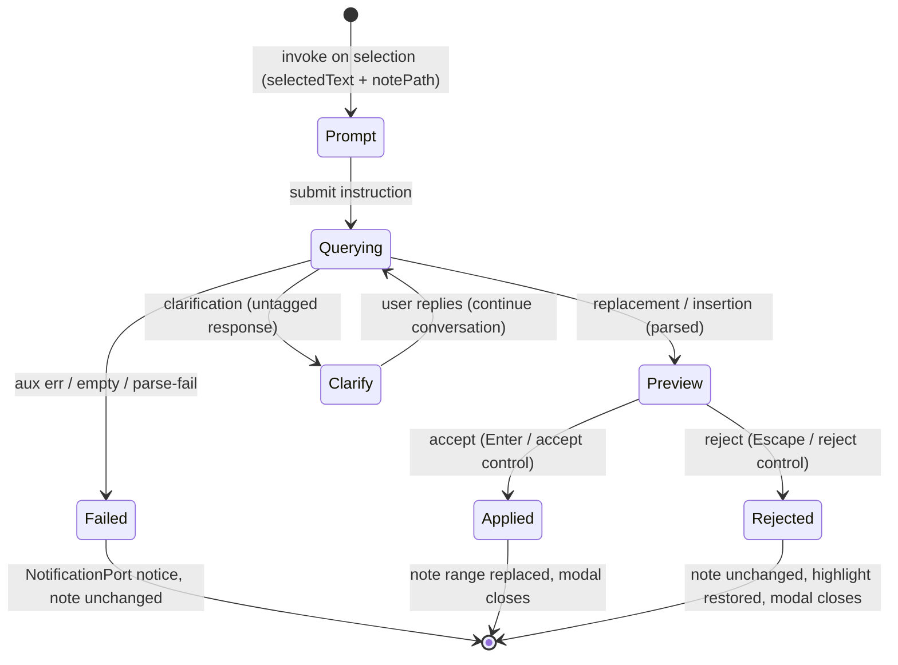

# Design — Context & Attachments (P5)

> Three parts. **A — UX** (file-chip add/remove, image attach/preview-modal, selection capture +
> highlight + clear, the inline-edit modal flow). **B — UI** (`--sp-*` token map for the new
> surfaces, parity-screenshot plan). **C — Architecture** (DDD placement, the new ports/types/
> components, the three-bridge story, edge cases, the Result boundary, the image size/no-secret
> constraint). All four CLARs resolved as **ADR-CA-001..004** (accepted, autonomous-drive).

This phase layers on the **merged P1–P4 surface**. It extends `ChatComposer.vue` (P1/P4) with a
context bar, drives the per-tab `tabsStore` + per-tab `ChatRuntimePort` (P3, ADR-TS-002), reuses the
`DiffView` renderer (P2, ADR-RR-001/002), reuses the `modalSeam` (P3/P4), and **regrows the reserved
`ChatTurnRequest` fields** (`ChatTurn.ts:12-13`, ADR-CA-001). Nothing P1–P4 is renamed or removed
(G2, NFR-CA-001); the one P3/P4 refactor is the additive `AuxModelPort` re-point of title-gen +
instruction-refine, kept test-green (ADR-CA-002 §3).

---

## Part A — UX

### A.0 The surface this layers on

The P4 composer is a bordered rounded wrapper: textarea + send/stop control, the slash/skills/mention
palettes, plan-mode, bang-bash, instruction-confirm, and the inline interactive blocks. P5 adds a
**context bar** above the textarea (a removable-chip row) and a **per-note inline-edit** flow that is
*not* on the composer at all — it is invoked on an editor selection and runs in an Obsidian modal.

### A.1 File context chips (REQ-CA-001..006)

| Step | Behaviour | Source |
|---|---|---|
| Attach | The user attaches a vault file → a removable chip appears in the context bar; the attached-file set adds the path (idempotent — re-attaching the same path is a no-op, no duplicate chip) | `FileContextState.attachFile:48` |
| Display | The chip shows the file's display name (basename, no extension) and reads as an Obsidian **wikilink**; activating it opens the file via `WorkspacePort.openFile` (not `app.workspace` directly — NFR-CA-002) | `utils/fileLink.ts:146/209` |
| Remove | The user removes a chip → its path leaves the set, the chip disappears | `FileContextState.detachFile:52` |
| Send | On submit, the attached paths travel with the turn (ADR-CA-001 `attachedFiles`), then the set **clears** | `FileContextState.clearAttachments:56` |
| Reset | New/loaded conversation clears the set | `resetForNewConversation:27`/`resetForLoadedConversation:34` |

The wikilink **format** is reproduced composer-side; the message-body file-link rewrite walker is
**NG8** (out of scope).

### A.2 Image context / preview-modal (REQ-CA-007..012)

| Step | Behaviour | Source |
|---|---|---|
| Attach | The user attaches an image → a thumbnail chip appears in the context bar; the image-context set adds it. The thumbnail `` binds an Obsidian-resolved **resource path** declaratively (NO `v-html`/`innerHTML`, REQ-CA-011) | `ImageContext.ts`, `imageEmbed.ts` |
| Reject | A non-image type (allow-list: png/jpeg/webp/gif) or an over-limit image (> 8 MiB, ADR-CA-001 §3) is **declined** with a non-blocking `NotificationPort.showWarning`; nothing is added | `imageEmbed.IMAGE_EXTENSIONS:15` |
| Preview | Opening a thumbnail shows the image full-size in an Obsidian **modal via the modal seam**; dismissable by Escape and an explicit close control | image-modal css |
| Remove | Removing a thumbnail deletes it from the set | `ImageContext.ts` remove |
| Send | On submit the images travel as bounded **base64-inline** (ADR-CA-001 §3), then the set **clears** | `ChatTurnRequest.images` (regrown) |

**Transport vs display:** the *thumbnail* uses a resource path for display; the *turn payload* is
base64 (ADR-CA-001) — two separate concerns.

### A.3 Selection capture + highlight + clear (REQ-CA-013..019)

| Step | Behaviour | Source |
|---|---|---|
| Editor capture | A non-empty editor selection is captured as `{ notePath, selectedText, startLine, lineCount }` | `SelectionController.getContext:377` |
| Canvas capture | A canvas node selection is captured as `{ canvasPath, nodeIds }` | `CanvasSelectionController.getContext:126` |
| Browser capture | **Only where `supportsBrowserSelection` is true** (ADR-CA-003 §2): `{ source, selectedText, title?, url? }`. Where the capability is absent, no affordance renders and no error surfaces — an honest defer, not a silent drop (REQ-CA-018, ADR-TS-004) | `BrowserSelectionController` |
| Highlight | While captured + the editor's native selection is not visible, a highlight marks the range in the source editor (`SelectionHighlightPort.show`) | `SelectionHighlight.showSelectionHighlight:71` |
| Focus hand-off | Moving focus from the editor into the chat surface **retains** the selection (not a deselection) | `isFocusWithinChatSidebar:246` |
| Clear | Deselecting (focus not in the chat surface) clears the selection + removes the highlight | `handleDeselection:290`/`clear:396` |
| Send | On submit the captured selection travels with the turn (ADR-CA-001 slots) | per controller |

> **NG1 note:** P5 *captures* selection context; the toolbar control strip that toggles
> external-context inclusion is **P6** — not built here.

### A.4 Inline edit modal (REQ-CA-020..028)

Invoked on a **non-empty note selection** (a command/affordance), not from the composer. The flow
runs entirely in an Obsidian `Modal` launched through the `OpenInlineEditFn` seam (ADR-CA-004 §1):



- **Prompt** — pre-bound to the selected text + note path, accepts an instruction (REQ-CA-020).
- **Querying** — a one-shot **cold-start aux query** (`AuxModelPort.run`, ADR-CA-002) that does not
  steer the tab's main stream (REQ-CA-021); abortable via `AbortSignal` on dismiss.
- **Parse** — `parseInlineEditResponse`: `<replacement>` / `<insertion>` / untagged clarification /
  empty failure (REQ-CA-022).
- **Preview** — a **word-level diff** (`computeWordDiff` → `DiffLine[]`) rendered by the **unchanged
  `DiffView`** (ADR-CA-004 §3); `bank` removed + `riverbank` inserted, equal words unmarked
  (REQ-CA-023).
- **Accept** — replace the note range, close (REQ-CA-024). **Reject** — note unchanged, highlight
  restored, close (REQ-CA-025). **Clarify** — continue the conversation with the reply (REQ-CA-026).
- **Failure** — non-blocking `NotificationPort` notice, note unchanged, `Result.err` (REQ-CA-027).

### A.5 Accessibility (WCAG 2.2 AA, NFR-CA-008)

- **Chips** are buttons in a labelled toolbar/list; each has a keyboard-reachable remove control
  (`aria-label`); the file-link chip activates via Enter/Space (opens the file).
- **Image preview modal** + **inline-edit modal** are Obsidian `Modal`s: focus is trapped on open,
  restored on close, Escape dismisses, the close/accept/reject controls are buttons with labels.
- **Selection highlight** is decorative (`aria-hidden`); the captured-selection state is surfaced as a
  chip/indicator with a text label, not colour alone.
- **Forced-colors + reduced-motion** are honoured on every new surface (no colour-only signalling; no
  motion-dependent affordance) — asserted in component tests.
- The word-diff preview uses **background highlight only**, never strikethrough/`text-decoration`
  (inherited from the P2 `DiffView`/`diff.css` rule, REQ-RR-025).

---

## Part B — UI

### B.1 `--sp-*` token map

Reuse the existing token set; add only what the new surfaces genuinely need. **No hex, no raw
Obsidian var, no physical CSS property** (`lint-style-tokens` guard, NFR-CA-007). Existing tokens
reused: `--sp-border`, `--sp-radius-md`/`--sp-radius-full`, `--sp-bg-primary`, `--sp-text-normal`/
`--sp-text-muted`/`--sp-text-on-accent`, `--sp-accent`, `--sp-space-1..3`, `--sp-font-text`/
`--sp-font-mono`/`--sp-font-size-sm`/`--sp-font-size-base`, and the diff tokens
(`--sp-diff-insert-bg`/`--sp-diff-delete-bg`/`--sp-diff-gutter`/`--sp-diff-max-height`) — the
word-diff preview rides the **same** diff tokens (renderer reuse).

| New token (only if not already present) | Surface | Purpose |
|---|---|---|
| `--sp-chip-bg` / `--sp-chip-border` | file + image chips | chip surface (reuse `--sp-bg-secondary`/`--sp-border` if equivalent — prefer reuse) |
| `--sp-chip-radius` | chips | chip corner (reuse `--sp-radius-sm` if present) |
| `--sp-context-bar-gap` | context bar | chip row spacing (reuse `--sp-space-2` if equivalent) |
| `--sp-image-thumb-size` | image thumbnail | thumbnail box |
| `--sp-image-modal-max` | image preview modal | full-size cap |
| `--sp-selection-highlight-bg` | selection highlight | captured-range tint (forced-colors safe) |
| `--sp-inline-edit-modal-w` | inline-edit modal | modal width |

> Prefer reusing an existing token over minting a near-duplicate. Each minted token is justified
> against a Claudian `style/**/{file-context,file-link,image-*,inline-edit}.css` rule at review.

### B.2 Parity-screenshot plan (deferred to the single final review gate)

Per-surface parity screenshots vs claudian at **320 / 520 / 720 px, light + dark** (NFR-CA-007,
charter §5.1): (1) file-chip context bar (one + many chips), (2) image thumbnail + the full-size
preview modal, (3) the selection-captured indicator + the in-editor highlight, (4) the inline-edit
modal at prompt / word-diff-preview / clarification. The modal renders (image preview, inline-edit)
are verified on the **manual Obsidian leg** like `InstructionConfirmModal` (TEST-CP-M2) — they
accumulate for the single final human review gate (autonomous-drive directive).

---

## Part C — Architecture

### C.1 System overview

```mermaid
flowchart TD
    subgraph ui[ui (Vue, no obsidian)]
        composer[ChatComposer.vue + ContextBar]
        chips[FileChips.vue]
        imgctx[ImageContext.vue]
        selind[SelectionIndicator.vue]
        diffview[DiffView.vue — UNCHANGED]
    end
    subgraph app[application]
        addfile[AddFileContextUseCase]
        addimg[AddImageUseCase]
        capsel[CaptureSelectionUseCase]
        inline[InlineEditUseCase]
        titlegen[GenerateTitleUseCase — re-pointed]
        refine[RefineInstructionUseCase — re-pointed]
        worddiff[computeWordDiff — pure]
        parseie[parseInlineEditResponse — pure]
    end
    subgraph domain[domain]
        ctr[ChatTurnRequest + Attachment DTOs]
        aux[AuxModelPort]
        selsrc[SelectionSourcePort]
        selhl[SelectionHighlightPort]
        vault[VaultPort + readBinary]
    end
    subgraph plugin[plugin (owns obsidian)]
        ieModal[InlineEditModal]
        imgModal[ImagePreviewModal]
        bridges[ObsidianBridge / MockBridge / LocalStorageBridge]
    end
    composer --> chips & imgctx & selind
    chips --> addfile --> ctr
    imgctx --> addimg --> vault
    selind --> capsel --> selsrc & selhl
    inline --> aux & parseie & worddiff
    inline -.OpenInlineEditFn seam.-> ieModal
    worddiff --> diffview
    titlegen & refine --> aux
    aux & selsrc & selhl & vault --> bridges
    ieModal & imgModal --> bridges
```

### C.2 Components & responsibilities

| Layer | Component | Responsibility | New / changed |
|---|---|---|---|
| domain | `chat/attachments/Attachments.ts` | `AttachedFileRef`, `AttachedImage` pure DTOs | new |
| domain | `chat/attachments/Selection.ts` | `EditorSelectionContext`/`CanvasSelectionContext`/`BrowserSelectionContext`/`CapturedSelection` union | new |
| domain | `chat/ChatTurn.ts` | grow `ChatTurnRequest` with `attachedFiles?`/`images?`/`editorSelection?`/`canvasSelection?`/`browserSelection?` (all optional — ADR-CA-001 §1) | changed (additive) |
| domain | `ports/AuxModelPort.ts` | one-shot cold-start aux query: `run(prompt, {systemPrompt?, model?, signal?}) → Result<string>` (ADR-CA-002 §1) | new |
| domain | `ports/SelectionSourcePort.ts` | `getCurrentSelection`/`onSelectionChange`/`supportsBrowserSelection` (ADR-CA-003 §1) | new |
| domain | `ports/SelectionHighlightPort.ts` | `show(editorSel)`/`clear` (ADR-CA-003 §1) | new |
| domain | `ports/VaultPort.ts` | `readBinary(path) → Promise<Uint8Array>` for image read+encode (ADR-CA-001 §3) | changed (additive) |
| application | `chat/inlineEdit/parseInlineEditResponse.ts` | pure/total parse: replacement/insertion/clarification/failure (REQ-CA-022) | new |
| application | `chat/inlineEdit/inlineEditPrompt.ts` | the inline-edit system prompt (ported pure) | new |
| application | `chat/inlineEdit/computeWordDiff.ts` | pure word-level DP/LCS → `DiffLine[]` (REQ-CA-023, ADR-CA-004 §3) | new |
| application | `chat/inlineEdit/InlineEditUseCase.ts` | drive aux query → parse → outcome; `Result` boundary (REQ-CA-021/026/027) | new |
| application | `chat/attachments/AddFileContextUseCase.ts` | add/remove/idempotent file-set ops (REQ-CA-001..003) | new |
| application | `chat/attachments/AddImageUseCase.ts` | allow-list + size gate + `VaultPort.readBinary` + base64 encode (REQ-CA-007/012, ADR-CA-001 §3) | new |
| application | `chat/attachments/CaptureSelectionUseCase.ts` | read `SelectionSourcePort`, drive highlight, focus-hand-off retain (REQ-CA-013..019) | new |
| application | `threads/GenerateTitleUseCase.ts` | **re-point** ctor `(runtime)`→`(aux)`; delete the drain loop (ADR-CA-002 §3) | changed (refactor) |
| application | `chat/composer/RefineInstructionUseCase.ts` | **re-point** ctor `(runtime)`→`(aux)`; delete the drain loop (ADR-CA-002 §3) | changed (refactor) |
| ui | `chat/FileChips.vue` | render removable file chips (wikilink display, open via `WorkspacePort`) (REQ-CA-001/003/005) | new |
| ui | `chat/ImageContext.vue` | thumbnail chips (declarative `:src`, no `v-html`), open preview via seam (REQ-CA-007/008/009/011) | new |
| ui | `chat/SelectionIndicator.vue` | captured-selection chip + clear (REQ-CA-015) | new |
| ui | `chat/ChatComposer.vue` | host a **context bar** slot above the textarea (additive prop) (REQ-CA-001/004) | changed (additive) |
| ui | `chat/modalSeam.ts` | add `OpenInlineEditFn` + `OPEN_INLINE_EDIT` key + `useOpenInlineEdit` + an image-preview launcher (ADR-CA-004 §1) | changed (additive) |
| ui | `chat/DiffView.vue` | reused **unchanged** for the word-diff preview (ADR-CA-004 §3) | reused |
| plugin | `modals/InlineEditModal.ts` | Obsidian `Modal`: instruction input + `DiffView` preview + accept/reject/clarify; resolves `InlineEditDecision` (NFR-CA-003) | new |
| plugin | `modals/ImagePreviewModal.ts` | Obsidian `Modal`: full-size image; Escape + close (REQ-CA-008) | new |
| infrastructure | three bridges | implement `AuxModelPort` (cold-start delegate), `SelectionSourcePort`, `SelectionHighlightPort`, `VaultPort.readBinary`; register the new modal-seam launchers (NFR-CA-001) | changed |
| infrastructure | `bridge/ports.ts` | add `AUX_MODEL_PORT`, `SELECTION_SOURCE_PORT`, `SELECTION_HIGHLIGHT_PORT` InjectionKeys | changed (additive) |

### C.3 DDD placement & the three-bridge story

- **domain** owns the DTOs (pure data, cross the store boundary, NFR-CA-004) + the three new port
  interfaces + the additive `VaultPort.readBinary` + the additive `ChatTurnRequest` fields.
- **application** owns the pure transforms (`parseInlineEditResponse`, `computeWordDiff`, the
  inline-edit prompt) + the use cases. The two re-pointed use cases lose their drain loops to the
  `AuxModelPort` (ADR-CA-002 §3).
- **ui** owns the Vue components — **never imports `obsidian`** (selection capture/highlight via
  ports; image resolution + the two modals via the seam, NFR-CA-002). The word-diff preview reuses
  `DiffView` unchanged.
- **plugin** owns the two new Obsidian `Modal` subclasses + the bridge wiring; the standalone entry
  provides browser-safe seam stand-ins.

| Port | `ObsidianBridge` | `MockBridge` | `LocalStorageBridge` |
|---|---|---|---|
| `AuxModelPort` | builds a fresh cold-start `ChatRuntimePort`, drains `query(..., {forceColdStart:true})`, maps error/empty/abort → `Result` | scriptable aux returning canned text (the title/refine/inline-edit tests inject this) | browser-safe canned/echo stand-in |
| `SelectionSourcePort` | CM6 editor + Obsidian canvas poll (250 ms); `supportsBrowserSelection` = build capability (may be `false`) | inert + the existing `canvas` mock; `supportsBrowserSelection: false` | inert; `supportsBrowserSelection: false` |
| `SelectionHighlightPort` | paint/remove a CM6 decoration | no-op (records calls for assertion) | no-op |
| `VaultPort.readBinary` | read vault file bytes → `Uint8Array` | in-memory bytes | localStorage-backed bytes |

`fake-ports.ts` grows an `auxModel` member (the `MockBridge` aux port) so the re-pointed title/refine
tests inject the aux stub instead of a runtime — same assertions, smaller fake (ADR-CA-002 §3).

### C.4 Data flow — primary scenarios

1. **Attach a file → send:** `FileChips` → `AddFileContextUseCase` adds the path (idempotent) to the
   tab's attached-file set → on submit the store folds `attachedFiles` into the `ChatTurnRequest`,
   the runtime's `prepareTurn` includes the wikilinks, the set clears (REQ-CA-001/004).
2. **Attach an image → send:** `ImageContext` → `AddImageUseCase` checks the allow-list + 8 MiB limit,
   reads bytes via `VaultPort.readBinary`, encodes base64 → `AttachedImage`; on submit it travels
   inline in the request, the set clears (REQ-CA-007/010/012).
3. **Capture a selection → send:** `SelectionSourcePort.onSelectionChange` → `CaptureSelectionUseCase`
   stores the `CapturedSelection`, drives `SelectionHighlightPort.show`; focus hand-off to the
   composer retains it; on submit it fills the matching request slot (REQ-CA-013..019).
4. **Inline edit:** invoke on a selection → `OpenInlineEditFn` opens the modal → instruction →
   `InlineEditUseCase.execute` → `AuxModelPort.run` (cold-start) → `parseInlineEditResponse` →
   replacement/insertion → `computeWordDiff` → `DiffView` preview → accept replaces the note range;
   clarification loops; failure → notice + `err` (REQ-CA-020..027).

### C.5 Edge cases

- **Empty / whitespace inline-edit instruction** — no aux query; the modal stays on the prompt.
- **Empty selection** — inline edit / selection capture is not invoked (non-empty precondition,
  REQ-CA-013/020).
- **Re-attach same file** — idempotent, no duplicate chip (REQ-CA-002).
- **Over-limit / non-image** — declined with a warning, set unchanged (REQ-CA-012).
- **Image file moved/deleted after attach** — the base64 snapshot was captured at attach time, so the
  turn is stable (ADR-CA-001 §3 rationale).
- **Browser selection with no capability** — no affordance, no capture, no error (REQ-CA-018).
- **Aux abort (modal dismissed mid-query)** — `AbortSignal` → `Result.err`, note unchanged
  (REQ-CA-027).
- **Clarification then dismiss** — `null` decision → reject (note unchanged).
- **Transient selection-poll error** — swallowed inside the bridge impl, no crash (NFR-CA-010).
- **Word diff on equal strings / empty** — `computeWordDiff` is total → all-equal/empty diff
  (ADR-CA-004 §3).
- **Concurrency** — each tab has its own context sets + runtime (P3 per-tab isolation); the aux query
  is cold-start, so it never interleaves the main stream (ADR-CA-002 §1).

### C.6 QA seam, Result boundary, constraints

- **QA seam:** the pure functions (`parseInlineEditResponse`, `computeWordDiff`, the prompt builders)
  and the use cases are testable in isolation; mounted components get co-located `data-testid`
  PageObjects (NFR-CA-005); `DiffView` reuse is asserted by mounting the **same** component with
  word-diff `ToolDiffData`.
- **Result boundary:** every use case returns `Result<T,E>`; `AuxModelPort.run` maps error/empty/abort
  → `err`; no exception crosses a boundary (REQ-CA-027, NFR-CA-004/010, ADR-CC-001 §2).
- **Image size / no-secret:** 8 MiB limit + MIME allow-list; the payload is bytes+MIME+size only — no
  secret, no `data.json` write (NFR-CA-009, ADR-CA-001 §3).
- **DOM rules:** no `v-html`/`innerHTML`; the inline-edit + image-preview modals are Obsidian `Modal`s
  via the seam; no `window.confirm`/`prompt` (NFR-CA-003).
- **No new dependency:** `computeWordDiff` is in-repo DP/LCS; selection capture is bridge-native
  (NFR-CA-011).
- **No provider-id branch:** inline edit is addressed through `AuxModelPort` / the active runtime
  (REQ-CA-028); `ClaudeInlineEditService` is the only wired impl (Codex/Opencode = P9, NG4).

---

## Requirements coverage (Part C)

| REQ | Covered by |
|---|---|
| REQ-CA-001..006 | `AddFileContextUseCase` + `FileChips.vue` + `attachedFiles` (ADR-CA-001); `WorkspacePort.openFile` for the wikilink |
| REQ-CA-007..012 | `AddImageUseCase` (allow-list + 8 MiB + `VaultPort.readBinary` + base64) + `ImageContext.vue` + `ImagePreviewModal` (ADR-CA-001) |
| REQ-CA-013..019 | `SelectionSourcePort` + `SelectionHighlightPort` + `CaptureSelectionUseCase` + `SelectionIndicator.vue`; browser leg capability-gated (ADR-CA-003) |
| REQ-CA-020..027 | `OpenInlineEditFn` seam + `InlineEditModal` + `InlineEditUseCase` over `AuxModelPort` + `parseInlineEditResponse` + `computeWordDiff` → `DiffView` (ADR-CA-002/004) |
| REQ-CA-028 | aux query addressed by the active runtime, no provider-id branch (ADR-CA-002 §4 / ADR-CA-004 §2) |
| NFR-CA-001..013 | three-bridge story (C.3), Vue-no-obsidian (C.3), DOM rules + Result (C.6), tokens (Part B), a11y (A.5), image size/no-secret (ADR-CA-001 §3), no new dep (`computeWordDiff`) |

## Open clarifications for the planner (Tasks)

- **None blocking.** All four CLARs are resolved (ADR-CA-001..004 accepted). One implementation note
  to carry into spec/tasks: the `startLine` indexing for `EditorSelectionContext` (0- vs 1-based) and
  the exact wikilink display format are **spec-level** field-validation details to pin in `spec.md`,
  not architecture decisions. The `AuxModelPort` re-point of `GenerateTitleUseCase` +
  `RefineInstructionUseCase` is a bounded refactor (ADR-CA-002 §3) — sequence it as an early task so
  the inline-edit work builds on the unified seam.
