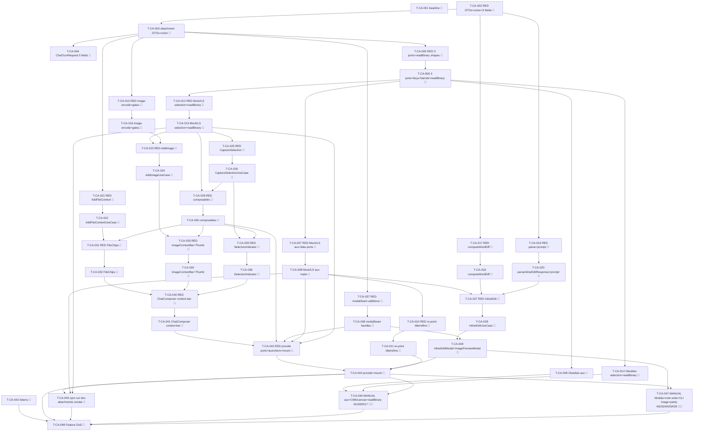

# Tasks — Context & Attachments (P5)

Each task is ≤ ~½ day, has a stable `T-CA-NNN` id, references ≥ 1 SPEC-CA / TEST-CA / REQ-CA / NFR-CA,
names an owner, lists explicit dependencies, and has a testable Definition of Done. This decomposes
**SPEC-CA-001..030** (30 spec items) on top of the merged P1 chat surface (`chat-core`, TASKS-CC-001),
the merged P2 rich-render surface (`rich-rendering`, TASKS-RR-001), the merged P3 threads/sessions
surface (`threads-sessions`, TASKS-TS-001), and the merged P4 composer surface (`composer-power`,
TASKS-CP-001) on the `next` integration branch.

> **TDD ordering (mission discipline):** the RED test task for a contract comes **before** the
> implementation task that greens it. RED test tasks are owned by `qa`; implementation tasks by
> `dev`. **Every dev task's first DoD line is "the prior RED test(s) now pass".** This mirrors the
> P2/P3/P4 task style the maintainer accepted.

> **DDD inward layering order (the batch structure):**
> 1. **DOMAIN** — the five additive optional `ChatTurnRequest` fields (SPEC-CA-001); the
>    `AttachedFileRef`/`AttachedImage` + `CapturedSelection` union DTOs (SPEC-CA-002/003); `AuxModelPort`
>    + `AUX_MODEL_PORT` key + barrel (SPEC-CA-004); `SelectionSourcePort` + `SelectionHighlightPort` +
>    `supportsBrowserSelection` + their two keys + barrels (SPEC-CA-005); the additive
>    `VaultPort.readBinary` (SPEC-CA-006).
> 2. **AuxModelPort + THE RE-POINT EARLY** (ADR-CA-002 §3 / spec hand-off) — the three-bridge
>    `AuxModelPort` impls + the scriptable `fake-ports.auxModel` member (SPEC-CA-007/008/009 aux leg),
>    then re-point `GenerateTitleUseCase` (P3, SPEC-TS-016) + `RefineInstructionUseCase` (P4,
>    SPEC-CP-015) onto it (behaviour-preserving; migrate their tests to inject the Mock aux stub) so
>    P3/P4 stay GREEN before inline-edit builds on the unified seam (SPEC-CA-018).
> 3. **INFRA** — `SelectionSourcePort`/`SelectionHighlightPort` impls (Obsidian CM6 + canvas poll +
>    decoration = coverage-excluded → manual leg; Mock scriptable + the existing `canvas` mock fixture;
>    LocalStorage inert, `supportsBrowserSelection:false`); `VaultPort.readBinary` on the three bridges;
>    the bounded base64 image-encode (SPEC-CA-007/008/009/010).
> 4. **APPLICATION** — pure `computeWordDiff` (RED→green) + pure `parseInlineEditResponse` +
>    `inlineEditPrompt` (SPEC-CA-011/012/013) BEFORE the use cases `AddFileContext` / `AddImage` /
>    `CaptureSelection` / `InlineEdit` (SPEC-CA-014/015/016/017), each RED→green, `Result`-returning.
> 5. **UI** — `FileChips` / `ImageContextBar`+`ImageThumb` / `SelectionIndicator` + the `ChatComposer`
>    context-bar slot (SPEC-CA-019..022); the `modalSeam` `OpenInlineEditFn` + `OpenImagePreviewFn`
>    handles + the `InlineEditModal` (Obsidian `Modal`, reusing the UNCHANGED `DiffView`) +
>    `ImagePreviewModal` (SPEC-CA-023/024); `useAuxModelPort` / `useSelectionSourcePort` /
>    `useSelectionHighlightPort` + `useCapturedSelection` composables (SPEC-CA-025) — each Vue
>    component pairs a co-located `data-testid` PageObject (ADR-009).
> 6. **STYLES** — the §5 `--sp-*` token additions + the tokens contract update (SPEC-CA-027), runnable
>    anytime before the gate.
> 7. **WIRE-IN** — provide the three new ports + the inline-edit + image-preview launchers in
>    `AgentSidebarView` + `src/ui/main.ts`; mount the context bar; `npm run dev` attachments smoke
>    (SPEC-CA-026).
> 8. **GATE** — full `npm run verify` + `npm run test:all` + the three manual legs (TEST-CA-M1/M2/M3) +
>    the parity self-review note + draft PR into `next` (orchestrator merges).
> A test for a layer may not depend on a layer further out.

> **Coverage-excluded infra (manual legs):** the Obsidian `AuxModelPort` (real cold-start subprocess),
> the `SelectionSourcePort`/`SelectionHighlightPort` (real CM6 + Obsidian canvas + decoration), the real
> `VaultPort.readBinary` (vault byte read), and the two Obsidian `Modal`s (`InlineEditModal` reusing
> `DiffView` + `ImagePreviewModal`) live under `src/infrastructure/obsidian/**` + `src/plugin/**`
> (coverage-excluded, §10). Their behavioural gate is the **manual** legs **TEST-CA-M1** (the three
> ObsidianBridge ports wire end-to-end), **TEST-CA-M2** (the two real Modals render + dismiss + parity
> screenshots), and **TEST-CA-M3** (real `VaultPort.readBinary` reads vault image bytes) plus the
> **real-CLI image turn** (TEST-CA-029) — never self-claimed by an agent; recorded for the single final
> epic-review gate (autonomous drive). The **pure transforms** (SPEC-CA-011/012/013), the four **use
> cases**, the **Mock scriptable aux / selection** impls, and the **LocalStorage inert** impls carry the
> unit/component weight + the 80/70/80/80 coverage gate.

> **Deleted-symbol guard (ESLint) — NO relaxation needed (verified).** Mirroring P3/P4, **none** of the
> P5 symbols were P0-deleted. `eslint.config.js` `DELETED_SUBSYSTEM_BAN` does not list `AuxModelPort`,
> `SelectionSourcePort`, `SelectionHighlightPort`, `AttachedFileRef`/`AttachedImage`/`CapturedSelection`,
> `FileChips`/`ImageContextBar`/`SelectionIndicator`, `InlineEditModal`/`ImagePreviewModal`,
> `computeWordDiff`/`parseInlineEditResponse`, or any attachment/selection/inline-edit path. The new
> domain/application/ui paths (`@/domain/chat/attachments/**`, `@/domain/ports/{AuxModelPort,
> SelectionSourcePort,SelectionHighlightPort}`, `@/application/chat/{attachments,inlineEdit}/**`,
> `@/ui/chat/{FileChips,ImageContextBar,ImageThumb,SelectionIndicator}.vue`) match **no** ban glob
> (`@/domain/chat` regrew in P1 and is off the list; `VaultPort` is a live core port, never banned), and
> `DELETED_INJECTION_KEYS` does **not** contain `AUX_MODEL_PORT` / `SELECTION_SOURCE_PORT` /
> `SELECTION_HIGHLIGHT_PORT`. So there is **no guard-relax task** in P5. (T-CA-001's DoD includes a
> one-line lint check confirming the new key/port imports resolve clean; T-CA-035 re-confirms at the gate.)

> **Parity is a review-stage human task:** the P5 per-surface parity-screenshot capture (charter §5 /
> NFR-CA-007) for the four sub-surfaces (file chips, image preview/modal, selection indicator,
> inline-edit prompt + word-diff) at 320 / 520 / 720 px, light + dark, is deferred to the single final
> epic-review human gate (TEST-CA-M2), not CI. The baseline-capture task (T-CA-001) runs first so a
> `claudian-main` context-footer + inline-edit reference exists pre-impl.

## Legend

- 🧪 = test task (RED-first; owner `qa`)
- 🔨 = implementation task (owner `dev`)
- 📐 = design / scaffolding / baseline task
- 🚀 = release / ops / gate task
- 🪓 = may slice (touches multiple independent code paths; expect several PRs)
- 👤 = human-owned (never agent-self-claimed)

---

## Task list

### T-CA-001 📐 — Baseline-capture: `claudian-main` P5 context-footer + inline-edit reference + guard verification

- **Description:** Before any P5 implementation, capture the `claudian-main` baseline for the four P5
  sub-surfaces (the file-context chips + wikilink row, the image thumbnail bar + full-size image modal,
  the selection indicator chip + the in-editor selection highlight, the inline-edit prompt → querying →
  word-diff preview → accept/reject state machine) at the charter widths (320 / 520 / 720 px), light +
  dark, into a `specs/context-attachments/parity-screenshots.md` skeleton (baseline column only; the
  Specorator column is filled at the final review). Confirm (one lint run) that the new `AUX_MODEL_PORT`
  / `SELECTION_SOURCE_PORT` / `SELECTION_HIGHLIGHT_PORT` keys and the new domain/application/ui paths are
  **not** caught by the `DELETED_SUBSYSTEM_BAN` / `DELETED_INJECTION_KEYS` guard (no relaxation
  required). No production code.
- **Satisfies:** NFR-CA-007 (baseline leg), NFR-CA-001 (guard verification)
- **Owner:** dev
- **Depends on:** —
- **Estimate:** S
- **Definition of done:**
  - [ ] `specs/context-attachments/parity-screenshots.md` exists with the per-sub-surface × 320/520/720 ×
        light/dark baseline matrix scaffolded, baseline column captured from `D:\Projects\claudian-main`.
  - [ ] A one-line lint check confirms the deleted-symbol guard does **not** block the three new keys /
        the new port + attachment/inline-edit paths (no relaxation task needed); noted in `test-plan.md`.
  - [ ] No file under `src/` changed.

---

## Layer 1 — DOMAIN (SPEC-CA-001..006)

### T-CA-002 🧪 — RED: attachment DTOs + `CapturedSelection` union + the five additive `ChatTurnRequest` fields (structural)

- **Description:** Author the failing structural/type-level + serialisation tests asserting: (a) the
  attachment DTOs `AttachedFileRef` (`path`/`displayName`) + `AttachedImage`
  (`path`/`mimeType`/`byteSize`/`dataBase64`) match SPEC-CA-002 shapes — `ImageMimeType` is exactly the
  four-member allow-list (`image/png`|`image/jpeg`|`image/webp`|`image/gif`), all fields `readonly`,
  re-exported from `@/domain/chat/attachments/index` (TEST-CA-003); (b) the `CapturedSelection`
  discriminated union covers **exactly** the three members `EditorSelectionContext`
  (`kind:'editor'`/`notePath`/`selectedText`/`startLine`/`lineCount`),
  `CanvasSelectionContext` (`kind:'canvas'`/`canvasPath`/`nodeIds`), `BrowserSelectionContext`
  (`kind:'browser'`/`source`/`selectedText`/`title?`/`url?`), `startLine` 0-based, `lineCount` ≥ 1
  documented, re-exported from the same barrel (TEST-CA-013 type-shape leg); (c) `ChatTurnRequest` gains
  **exactly** the five optional fields (`attachedFiles?`/`images?`/`editorSelection?`/`canvasSelection?`/
  `browserSelection?`), the P1 `text` + `currentNotePath` stay byte-identical, and a `{ text }`-only
  request serialises byte-identically to P1 — `PreparedChatTurn`/`ChatRuntimeQueryOptions` unchanged
  (TEST-CA-001 type-shape leg + TEST-CA-002 serialisation, NFR-CA-001/SPEC-CA-028). Names
  TEST-CA-001/002/003/013 in metadata.
- **Satisfies:** TEST-CA-001, TEST-CA-002, TEST-CA-003, TEST-CA-013 (type-shape leg), SPEC-CA-001, SPEC-CA-002, SPEC-CA-003, SPEC-CA-028, REQ-CA-001, REQ-CA-007, REQ-CA-013, REQ-CA-019, NFR-CA-001
- **Owner:** qa
- **Depends on:** —
- **Estimate:** M
- **Definition of done:**
  - [ ] `tests/domain/chat/attachments/Attachments.test.ts`,
        `tests/domain/chat/attachments/Selection.test.ts`, and
        `tests/domain/chat/ChatTurn.ts.test.ts` (the P5 additivity + `{text}`-only serialisation) exist,
        naming TEST-CA-001/002/003 + the TEST-CA-013 type-shape leg.
  - [ ] Tests fail (RED) — the attachment DTOs / the `CapturedSelection` union / the five
        `ChatTurnRequest` fields do not yet exist (compile/run failure is the RED signal).

### T-CA-003 🔨 — Attachment DTOs (`AttachedFileRef`/`AttachedImage`) + `CapturedSelection` union + barrel

- **Description:** Implement per SPEC-CA-002 + SPEC-CA-003 under `src/domain/chat/attachments/`:
  `Attachments.ts` (`AttachedFileRef`, `ImageMimeType`, `AttachedImage`), `Selection.ts`
  (`EditorSelectionContext`/`CanvasSelectionContext`/`BrowserSelectionContext`/`CapturedSelection`), and
  `index.ts` re-exporting all of them. Plain domain DTOs — string/number/enum/readonly-array only; no
  `obsidian`, no `node:*`, no Vue, no class (so they cross the Pinia store boundary cleanly, NFR-CA-004).
  `startLine` 0-based; `displayName` is documented as the basename-without-extension (the
  `AddFileContextUseCase` builds it, SPEC-CA-014).
- **Satisfies:** SPEC-CA-002, SPEC-CA-003, REQ-CA-001, REQ-CA-007, REQ-CA-010, REQ-CA-013, REQ-CA-017, REQ-CA-018, NFR-CA-004
- **Owner:** dev
- **Depends on:** T-CA-002
- **Estimate:** S
- **Definition of done:**
  - [ ] The prior RED test (TEST-CA-003 + the TEST-CA-013 type-shape leg) now passes (the DTO shapes; the
        four-member `ImageMimeType`; the three-member discriminated union narrowing on `kind`).
  - [ ] `npm run typecheck` + `npm run lint` green; no `obsidian`/`node:*`/Vue import in
        `src/domain/chat/attachments/**`.
  - [ ] Implementation-log entry added.

### T-CA-004 🔨 — `ChatTurnRequest` five additive optional context fields

- **Description:** Implement per SPEC-CA-001: **append** the five optional fields
  (`attachedFiles?: readonly AttachedFileRef[]`, `images?: readonly AttachedImage[]`, `editorSelection?:
  EditorSelectionContext`, `canvasSelection?: CanvasSelectionContext`, `browserSelection?:
  BrowserSelectionContext`) to the `ChatTurnRequest` interface in `src/domain/chat/ChatTurn.ts`,
  importing the DTOs from `./attachments/Attachments` + `./attachments/Selection` — the P1 `text` +
  `currentNotePath` stay byte-identical, the reserved `ChatTurn.ts:12-13` comment is replaced by the
  types, and `PreparedChatTurn`/`ChatRuntimeQueryOptions`/`ChatRuntimeEnsureReadyOptions` stay
  byte-identical (`enabledMcpServers`/`externalContextPaths` stay excluded, NG3). Pure types; no
  behaviour (`prepareTurn`'s fold is out-of-scope beyond the field contract).
- **Satisfies:** SPEC-CA-001, SPEC-CA-028, REQ-CA-004, REQ-CA-010, REQ-CA-019, NFR-CA-001
- **Owner:** dev
- **Depends on:** T-CA-002, T-CA-003
- **Estimate:** S
- **Definition of done:**
  - [ ] The prior RED tests (TEST-CA-001 + TEST-CA-002) now pass (exactly the five optional fields
        appended; a `{ text }`-only request byte-identical to P1; the other request types unchanged).
  - [ ] `npm run typecheck` + `npm run lint` green; no `obsidian`/`node:*` import in `src/domain/chat/**`.
  - [ ] Implementation-log entry added.

### T-CA-005 🧪 — RED: `AuxModelPort` + the two selection ports + `VaultPort.readBinary` shapes + keys + barrels (structural)

- **Description:** Author the failing structural/type-level tests asserting: (a) `AuxModelPort` exposes
  `run(prompt, options?) → Promise<Result<string>>` with `AuxModelRunOptions` (`systemPrompt?`/`model?`/
  `signal?`), `AUX_MODEL_PORT` is its own `InjectionKey`, the barrel re-exports `AuxModelPort` +
  `AuxModelRunOptions` (TEST-CA-021 shape leg, SPEC-CA-004); (b) `SelectionSourcePort` exposes
  `getCurrentSelection() → CapturedSelection | null`, `onSelectionChange(listener) → Unsubscriber`, and a
  `readonly supportsBrowserSelection: boolean`, and `SelectionHighlightPort` exposes
  `show(target: EditorSelectionContext): void` + `clear(): void`, both with their own
  `SELECTION_SOURCE_PORT` / `SELECTION_HIGHLIGHT_PORT` `InjectionKey`s + barrel re-exports (SPEC-CA-005);
  (c) `VaultPort` gains **exactly** `readBinary(path) → Promise<Uint8Array>` with the seven P0–P4 members
  byte-identical (TEST-CA-010 shape leg + the additivity leg of TEST-CA-028, SPEC-CA-006/028). Names
  TEST-CA-010/021/028 (shape legs).
- **Satisfies:** TEST-CA-010 (shape leg), TEST-CA-021 (shape leg), TEST-CA-028 (readBinary additivity leg), SPEC-CA-004, SPEC-CA-005, SPEC-CA-006, SPEC-CA-028, REQ-CA-010, REQ-CA-013, REQ-CA-021, NFR-CA-001
- **Owner:** qa
- **Depends on:** T-CA-003
- **Estimate:** M
- **Definition of done:**
  - [ ] `tests/domain/ports/AuxModelPort.test.ts`, `tests/domain/ports/SelectionSourcePort.test.ts`,
        `tests/domain/ports/SelectionHighlightPort.test.ts`, and `tests/domain/ports/VaultPort.ts.test.ts`
        (the P5 `readBinary` additivity) exist, naming the listed TEST-CA shape legs.
  - [ ] Tests fail (RED) — the three new ports + keys + barrel re-exports + the `readBinary` member do
        not yet exist.

### T-CA-006 🔨 — `AuxModelPort` + `SelectionSourcePort` + `SelectionHighlightPort` + 3 keys + barrels + `VaultPort.readBinary`

- **Description:** Implement per SPEC-CA-004/005/006: the three narrow port interfaces under
  `src/domain/ports/` (`AuxModelPort.ts` with `AuxModelRunOptions` + the `run` contract,
  `SelectionSourcePort.ts` with `getCurrentSelection`/`onSelectionChange`/`supportsBrowserSelection`,
  `SelectionHighlightPort.ts` with `show`/`clear`); add the three InjectionKeys
  (`AUX_MODEL_PORT`/`SELECTION_SOURCE_PORT`/`SELECTION_HIGHLIGHT_PORT`) to
  `src/infrastructure/bridge/ports.ts` (no aggregate — keep the per-key header); re-export all three
  ports + their option/types from `src/domain/ports/index.ts`; and **append** `readBinary(path):
  Promise<Uint8Array>` to `VaultPort` in `src/domain/ports/VaultPort.ts` (the seven P0–P4 members
  byte-identical — no `AttachmentPort` added, ADR-CA-001 §3). No `obsidian`/`node:*`/Vue; `run` returns
  `Result`, the selection ports throw nowhere in their contract.
- **Satisfies:** SPEC-CA-004, SPEC-CA-005, SPEC-CA-006, SPEC-CA-028, REQ-CA-010, REQ-CA-013, REQ-CA-014, REQ-CA-015, REQ-CA-018, REQ-CA-021, NFR-CA-001
- **Owner:** dev
- **Depends on:** T-CA-005, T-CA-003
- **Estimate:** M
- **Definition of done:**
  - [ ] The prior RED tests (TEST-CA-010/021/028 shape legs) now pass (the three port shapes, own keys,
        barrel re-exports; `readBinary` appended; the seven P0–P4 `VaultPort` members byte-identical).
  - [ ] `npm run typecheck` + `npm run lint` green; deleted-symbol guard green (the three new key/port
        imports resolve clean — no relaxation needed); no `obsidian`/`node:*` import in `src/domain/**`.
  - [ ] Implementation-log entry added.

---

## Layer 2 — AuxModelPort impl + THE RE-POINT EARLY (SPEC-CA-007/008/009 aux leg + SPEC-CA-018)

> Sequenced **before** the rest of infra and before inline-edit (ADR-CA-002 §3 / spec hand-off) so the
> two P3/P4 use cases stay GREEN on the unified seam and inline-edit (SPEC-CA-017) builds on it.

### T-CA-007 🧪 — RED: three-bridge `AuxModelPort` impls + scriptable `fake-ports.auxModel` member

- **Description:** Author the failing unit tests asserting the aux impls (SPEC-CA-008/009 aux leg): (a)
  the **Mock** `AuxModelPort` is **scriptable** — `setAuxResponse(text)` → `run` resolves
  `ok(text)`; `setAuxError()` → `err`; `setAuxEmpty()` → `err` (empty/whitespace accumulated text); an
  already-aborted `options.signal` → `err`; records the last `prompt` + `options.systemPrompt` for
  assertion (TEST-CA-021 Mock-aux leg); (b) the **LocalStorage** `AuxModelPort` is a browser-safe
  canned/echo stand-in that never throws (SPEC-CA-009); (c) `tests/__fakes__/fake-ports.ts` gains an
  `auxModel` member wired into the factory so multi-port tests see it. Names the Mock-aux backing of
  TEST-CA-021 + the re-point backing of TEST-CA-018.
- **Satisfies:** TEST-CA-021 (Mock-aux leg), TEST-CA-018 (aux backing), SPEC-CA-008, SPEC-CA-009, SPEC-CA-004, REQ-CA-021, NFR-CA-001, NFR-CA-010
- **Owner:** qa
- **Depends on:** T-CA-006
- **Estimate:** M
- **Definition of done:**
  - [x] `tests/infrastructure/mock/MockAuxModel.test.ts`,
        `tests/infrastructure/localstorage/LocalStorageAuxModel.test.ts`, and the extended
        `tests/__fakes__/fake-ports.test.ts` (the `auxModel` member) exist, naming the listed TEST-CA ids.
  - [x] Tests fail (RED) — the Mock/LocalStorage `AuxModelPort` impls + the factory member do not yet exist.

### T-CA-008 🔨 — `MockBridge` + `LocalStorageBridge` `AuxModelPort` impls + `fake-ports.auxModel`

- **Description:** Implement per SPEC-CA-008/009 (aux leg): the scriptable Mock `AuxModelPort`
  (`setAuxResponse`/`setAuxError`/`setAuxEmpty`, honours `signal`, records `prompt`+`systemPrompt`,
  maps empty → `err`) under `src/infrastructure/mock/**`; the LocalStorage browser-safe canned/echo aux
  under `src/infrastructure/localstorage/**` (no subprocess, never throws); add the `auxModel` member to
  `tests/__fakes__/fake-ports.ts`. Both map error/empty/abort → `Result.err`, never throw across the
  boundary (NFR-CA-010). No `node:*`, no spawn.
- **Satisfies:** SPEC-CA-008, SPEC-CA-009, SPEC-CA-004, REQ-CA-021, NFR-CA-001, NFR-CA-010
- **Owner:** dev
- **Depends on:** T-CA-007
- **Estimate:** M
- **Definition of done:**
  - [x] The prior RED tests (the TEST-CA-021 Mock-aux leg) now pass; the `fake-ports` `auxModel` member
        works for multi-port tests; the LocalStorage stand-in never throws.
  - [x] No `node:*`/subprocess in Mock/LocalStorage; `Result`-mapped error/empty/abort; `npm run typecheck`
        + `npm run lint` + `npm run test` green; implementation-log entry added.

### T-CA-009 🔨 — `ObsidianBridge` `AuxModelPort` (real cold-start subprocess, coverage-excluded) 🪓

> The `ObsidianBridge` `AuxModelPort` builds a fresh cold-start `ChatRuntimePort` and drives
> `query(turn, [], { forceColdStart: true })`; it lives under `src/infrastructure/obsidian/**`
> (coverage-excluded). Its behavioural gate is the **manual** leg TEST-CA-M1 (+ the real-CLI image turn
> TEST-CA-029). The Mock/LocalStorage halves (T-CA-008) carry the automated proof.

- **Description:** Implement per SPEC-CA-007 (aux leg) under `src/infrastructure/obsidian/**`: the
  `AuxModelPort.run(prompt, options?)` builds a cold-start prepared turn (text =
  `options.systemPrompt ? \`${systemPrompt}\\n\\n${prompt}\` : prompt`), uses the same factory the tabs
  use (`bridge.createChatRuntime`), calls `query(prepareTurn({text}), [], { forceColdStart: true })`,
  accumulates `text` chunks (tool/thinking/usage ignored), maps a streaming `error` chunk / an
  empty-accumulated result / an aborted `signal` → `Result.err` (the `signal` aborts the subprocess via
  `cancel()`), the non-empty text → `ok(text)`, and never resumes a session (cold-start only,
  REQ-CA-021). Never throws across the boundary (`tryAsync`, NFR-CA-010). No `obsidian` symbol leaks
  past this file.
- **Satisfies:** SPEC-CA-007 (aux leg), SPEC-CA-004, REQ-CA-021, NFR-CA-001 (manual leg), NFR-CA-010
- **Owner:** dev
- **Depends on:** T-CA-006
- **Estimate:** M
- **Definition of done:**
  - [x] `ObsidianBridge.createAuxModel()` (or the equivalent member) implements `AuxModelPort`;
        cold-start only (never resumes a session); maps error/empty/abort → `Result.err`; the `signal`
        aborts the subprocess.
  - [x] `npm run typecheck` + `npm run lint` green; the manual leg TEST-CA-M1 (+ TEST-CA-029 real-CLI
        image turn) scheduled in `test-plan.md`.
  - [x] Implementation-log entry added.

### T-CA-010 🧪 — RED: re-point `GenerateTitleUseCase` (P3) + `RefineInstructionUseCase` (P4) onto `AuxModelPort`

- **Description:** Author the migrated unit tests that inject the **scriptable Mock `AuxModelPort`**
  (SPEC-CA-018, T-CA-008) into the two re-pointed use cases instead of a `MockChatRuntime`, asserting
  their **observable behaviour is identical**: `GenerateTitleUseCase` over the aux — a scripted
  `ok(text)` → `parseTitleGenerationResponse` → `ok(title)`; `setAuxError`/`setAuxEmpty` → `err(new
  Error(TITLE_GEN_FAILED_MESSAGE))`; still **never** surfaces `NotificationPort.showError` (REQ-TS-025),
  still `Result`-returning, no `providerId` branch; `RefineInstructionUseCase` over the aux — refined /
  clarification outcomes preserved, on aux `err` the caller falls through to the raw instruction with
  **no `showError`** (the P4 EC-CP-9 behaviour). Assert the pure transforms (`titleGeneration.ts`,
  `instructionRefine.ts`) are **byte-identical** (untouched). Names TEST-CA-018 (and confirms the
  migrated SPEC-TS-016 / SPEC-CP-015 scenarios stay green over the aux stub).
- **Satisfies:** TEST-CA-018, SPEC-CA-018, ADR-CA-002 §3, REQ-CA-021, NFR-CA-004, NFR-CA-010
- **Owner:** qa
- **Depends on:** T-CA-008
- **Estimate:** M
- **Definition of done:**
  - [x] The existing `tests/application/threads/GenerateTitleUseCase.test.ts` +
        `tests/application/chat/composer/RefineInstructionUseCase.test.ts` are migrated to inject the Mock
        `auxModel`; the assertions are the **same** (title parsed / fallback on err / refine outcome / no
        `showError`); naming TEST-CA-018.
  - [x] Tests fail (RED) — the use-case constructors still take `ChatRuntimePort`, not `AuxModelPort`
        (compile/run failure is the RED signal); the pure-transform byte-identity assertion is in place.

### T-CA-011 🔨 — Re-point `GenerateTitleUseCase` + `RefineInstructionUseCase` onto `AuxModelPort` (behaviour-preserving)

- **Description:** Implement per SPEC-CA-018 (ADR-CA-002 §3): change the `GenerateTitleUseCase`
  constructor `(runtime: ChatRuntimePort)` → `(aux: AuxModelPort)`, **delete** the `prepareTurn` +
  `accumulate` drain loop, and replace it with a single `await this.aux.run(buildTitleGenerationPrompt(
  firstUserMessage), { systemPrompt: TITLE_GENERATION_SYSTEM_PROMPT })` — the outcome mapping (parse →
  `ok(title)` / `err(TITLE_GEN_FAILED_MESSAGE)`) is **unchanged**; do the same for
  `RefineInstructionUseCase` (`(runtime)` → `(aux)`, drain loop deleted, replaced by `await this.aux.run(
  rawInstruction, { systemPrompt: buildRefineSystemPrompt(existingInstructions) })`, outcome mapping
  unchanged, still best-effort, still no notice). The pure transforms stay byte-identical. No
  `providerId` branch; still `Result`-returning. Re-point the **wiring** call sites (the per-use-case
  construction) to pass the aux port (the production wiring is finalised in T-CA-033).
- **Satisfies:** SPEC-CA-018, ADR-CA-002 §3, REQ-CA-021, NFR-CA-004, NFR-CA-010
- **Owner:** dev
- **Depends on:** T-CA-010
- **Estimate:** M
- **Definition of done:**
  - [x] The prior RED tests (TEST-CA-018) now pass — the two re-pointed use cases over the Mock aux keep
        their observable behaviour; the pure transforms are byte-identical; the drain loops are deleted.
  - [x] No `providerId` branch; `Result`-returning; the P3/P4 use-case tests stay GREEN; `npm run typecheck`
        + `npm run lint` + `npm run test` green; no dead `ChatRuntimePort`-side-query code left behind.
  - [x] Implementation-log entry added.

---

## Layer 3 — INFRA (SPEC-CA-007 selection leg / 008 / 009 / 010)

### T-CA-012 🧪 — RED: `MockBridge` + `LocalStorageBridge` selection ports + `readBinary` + `fake-ports` members

- **Description:** Author the failing unit tests asserting (SPEC-CA-008/009 selection+readBinary legs):
  (a) the **Mock** `SelectionSourcePort` is **inert by default** (`getCurrentSelection() → null`,
  `supportsBrowserSelection:false`) but **scriptable** — `setSelection(captured)` pushes to
  `onSelectionChange` listeners + makes `getCurrentSelection` return it (drives editor + canvas capture,
  the existing `canvas` mock in `fake-ports.ts` backs the canvas path); the **Mock**
  `SelectionHighlightPort` is a **no-op that records `show`/`clear` calls** for assertion (TEST-CA-014/015
  backing); (b) the Mock `VaultPort.readBinary` reads from the in-memory vault map, a missing path
  rejects (the `Result.err` path of `AddImageUseCase`, TEST-CA-010); (c) the **LocalStorage** selection
  ports are inert (`supportsBrowserSelection:false`, `onSelectionChange` never fires) and `readBinary` is
  localStorage-backed; (d) `fake-ports.ts` gains `selectionSource`/`selectionHighlight` members. Names
  the Mock/LocalStorage backing of TEST-CA-010/013/014/015 + TEST-CA-018b (gated browser).
- **Satisfies:** TEST-CA-010 (Mock readBinary), TEST-CA-013 (Mock capture backing), TEST-CA-014/015 (recording highlight backing), TEST-CA-018b (gated browser backing), SPEC-CA-008, SPEC-CA-009, REQ-CA-013, REQ-CA-017, REQ-CA-018, NFR-CA-001, NFR-CA-010
- **Owner:** qa
- **Depends on:** T-CA-006
- **Estimate:** M
- **Definition of done:**
  - [x] `tests/infrastructure/mock/MockSelectionPorts.test.ts`,
        `tests/infrastructure/mock/MockReadBinary.test.ts`,
        `tests/infrastructure/localstorage/LocalStorageSelectionPorts.test.ts`, and the extended
        `tests/__fakes__/fake-ports.test.ts` exist, naming the listed TEST-CA ids.
  - [x] Tests fail (RED) — the Mock/LocalStorage selection ports + `readBinary` + the factory members do
        not yet exist.

### T-CA-013 🔨 — `MockBridge` + `LocalStorageBridge` selection ports + `readBinary` + `fake-ports` members

- **Description:** Implement per SPEC-CA-008/009 (selection + readBinary legs): the scriptable Mock
  `SelectionSourcePort` (`setSelection` pushes to listeners + backs `getCurrentSelection`,
  `supportsBrowserSelection:false`, canvas via the existing `canvas` mock), the recording Mock
  `SelectionHighlightPort` (`show`/`clear` push to an array), the Mock `VaultPort.readBinary` (in-memory
  map, missing path rejects); the inert LocalStorage selection ports (`supportsBrowserSelection:false`,
  `onSelectionChange` no-op) + localStorage `readBinary`; add the `selectionSource`/`selectionHighlight`
  members to `tests/__fakes__/fake-ports.ts`. No `node:*`, no `obsidian`.
- **Satisfies:** SPEC-CA-008, SPEC-CA-009, REQ-CA-013, REQ-CA-017, REQ-CA-018, NFR-CA-001, NFR-CA-010
- **Owner:** dev
- **Depends on:** T-CA-012
- **Estimate:** M
- **Definition of done:**
  - [x] The prior RED tests (TEST-CA-010 Mock readBinary + the capture/recording-highlight/gated-browser
        backing) now pass; the factory members work for multi-port tests; mutations visible across ports.
  - [x] No `node:*`/`obsidian` import in Mock/LocalStorage; `npm run typecheck` + `npm run lint` +
        `npm run test` green; implementation-log entry added.

### T-CA-014 🔨 — `ObsidianBridge` selection ports + `readBinary` (CM6 + canvas + decoration + real bytes, coverage-excluded) 🪓

> The `ObsidianBridge` selection capture (CM6 + canvas poll), the highlight decoration, and the real
> `vault.readBinary` live under `src/infrastructure/obsidian/**` (coverage-excluded). Their behavioural
> gate is the **manual** legs TEST-CA-M1 (the three ports wire end-to-end) + TEST-CA-M3 (real
> `readBinary`); TEST-CA-017 is the real CM6/canvas capture manual leg. The Mock half (T-CA-013) carries
> the automated proof.

- **Description:** Implement per SPEC-CA-007 under `src/infrastructure/obsidian/**`: the
  `SelectionSourcePort` — a CM6 editor-selection read + an Obsidian canvas-node-selection read polled at
  **250 ms** (parity Claudian), firing `onSelectionChange` on a change; transient read errors are
  **swallowed** (degrade to `null`, NFR-CA-010, EC-CA-12); `supportsBrowserSelection` reflects whether
  this Obsidian/Electron build can read an embedded-view selection (**P5 may ship `false`** — an honest
  defer, REQ-CA-018, never silently dropped); the `SelectionHighlightPort` — paints/removes a CM6
  decoration over the captured editor range (`show`/`clear`, ported from `SelectionHighlight`); and
  `VaultPort.readBinary` — `this.vault.readBinary(file)` → `new Uint8Array(arrayBuffer)`. No `obsidian`
  symbol leaks past this file.
- **Satisfies:** SPEC-CA-007, REQ-CA-013, REQ-CA-014, REQ-CA-015, REQ-CA-017, REQ-CA-018, REQ-CA-010, NFR-CA-001 (manual leg), NFR-CA-010
- **Owner:** dev
- **Depends on:** T-CA-006
- **Estimate:** M
- **Slice plan:** may slice as (a) the CM6 + canvas `SelectionSourcePort` poll, (b) the
  `SelectionHighlightPort` decoration, (c) `VaultPort.readBinary`.
- **Definition of done:**
  - [x] The three ObsidianBridge impls exist; the poll swallows transient errors → `null`;
        `supportsBrowserSelection` is an honest fixed boolean; `readBinary` returns the real bytes.
  - [x] `npm run typecheck` + `npm run lint` green; the manual legs TEST-CA-M1/M3 + TEST-CA-017 scheduled
        in `test-plan.md`.
  - [x] Implementation-log entry added.

### T-CA-015 🧪 — RED: bounded base64 image-encode + gate constants (`MAX_IMAGE_BYTES` / `IMAGE_MIME_ALLOW_LIST`)

- **Description:** Author the failing unit tests for the pure encode + gate constants (SPEC-CA-010):
  `MAX_IMAGE_BYTES === 8 * 1024 * 1024`; `IMAGE_MIME_ALLOW_LIST` is exactly the four members; the encode
  fn given a `Uint8Array` + a resolved `ImageMimeType` produces base64 (no data-URI prefix) and is pure
  given the bytes (no `obsidian`); the MIME-from-extension resolver maps `.png`/`.jpg`/`.jpeg`/`.webp`/
  `.gif` to an allow-list member and `.exe` (and any non-image) to **no** member (EC-CA-2). Names the
  encode/gate-constant leg of TEST-CA-010/012.
- **Satisfies:** TEST-CA-010 (encode leg), TEST-CA-012 (gate-constant leg), SPEC-CA-010, REQ-CA-010, REQ-CA-012, NFR-CA-009, NFR-CA-011
- **Owner:** qa
- **Depends on:** T-CA-003
- **Estimate:** S
- **Definition of done:**
  - [x] `tests/infrastructure/imageEncode.test.ts` (or the in-app-helper path mirror) exists, naming the
        encode/gate legs of TEST-CA-010/012, covering the 8 MiB constant, the allow-list, the pure encode,
        and the `.exe` → no-member resolve.
  - [x] Tests fail (RED) — the encode helper + the gate constants do not yet exist.

### T-CA-016 🔨 — Bounded base64 image-encode + `MAX_IMAGE_BYTES` / `IMAGE_MIME_ALLOW_LIST`

- **Description:** Implement per SPEC-CA-010 (`src/infrastructure/.../imageEncode.ts` or the in-use-case
  helper): `MAX_IMAGE_BYTES = 8 * 1024 * 1024`; `IMAGE_MIME_ALLOW_LIST` (the four ported `IMAGE_EXTENSIONS`
  members); the pure encode (`btoa` over the byte string in browser/Obsidian, `Buffer` in Node — pure
  given the bytes, no `obsidian` import; no data-URI prefix); the MIME-from-extension resolver (parity
  Claudian — `.exe` resolves to no allow-list member). Total/never-throws given valid inputs; the gate
  ordering is enforced by `AddImageUseCase` (SPEC-CA-015, T-CA-020).
- **Satisfies:** SPEC-CA-010, REQ-CA-010, REQ-CA-012, NFR-CA-009, NFR-CA-011
- **Owner:** dev
- **Depends on:** T-CA-015
- **Estimate:** S
- **Definition of done:**
  - [x] The prior RED tests (the encode/gate legs of TEST-CA-010/012) now pass.
  - [x] Pure encode; no `obsidian` import; no data-URI prefix; `npm run typecheck` + `npm run lint` +
        `npm run test` green; implementation-log entry added.

---

## Layer 4 — APPLICATION (SPEC-CA-011..017)

### T-CA-017 🧪 — RED: pure `computeWordDiff` (incl. the identical-text no-op EC-CA-10)

- **Description:** Author the failing unit tests for the pure word-level diff (SPEC-CA-011):
  `computeWordDiff(original, edited)` tokenises both with `split(/(\s+)/)` (words + whitespace runs as
  tokens), computes the LCS over the token arrays, and returns a single-row `ToolDiffData` whose
  `diffLines` are word-granular `equal`/`insert`/`delete` ops (`text` = the token), `filePath` = `''`,
  `stats` counting insert/delete tokens; the REQ-CA-023 acceptance (`"The bank was steep"` → `"The
  riverbank was steep"`) yields `bank` `delete` + `riverbank` `insert`, `The`/`was`/`steep` `equal`;
  **EC-CA-10:** `computeWordDiff(s, s)` is all-`equal`, `stats {added:0, removed:0}`; empty inputs →
  `{ filePath:'', diffLines:[], stats:{added:0, removed:0} }`; **never throws** (NFR-CA-011, pure/total).
  Names TEST-CA-023 (U leg) + TEST-CA-023b.
- **Satisfies:** TEST-CA-023 (U leg), TEST-CA-023b, SPEC-CA-011, REQ-CA-023, NFR-CA-011
- **Owner:** qa
- **Depends on:** T-CA-002
- **Estimate:** M
- **Definition of done:**
  - [x] `tests/application/chat/inlineEdit/computeWordDiff.test.ts` exists, naming TEST-CA-023/023b,
        covering the bank→riverbank acceptance, the identical-text no-op, the empty inputs, and never-throws.
  - [x] Tests fail (RED) — `computeWordDiff.ts` does not yet exist (it consumes the existing P2
        `ToolDiffData`/`DiffLine` from `@/domain/chat/diff/Diff`, unchanged).

### T-CA-018 🔨 — `computeWordDiff.ts` (pure word-level DP/LCS → `ToolDiffData`)

- **Description:** Implement `src/application/chat/inlineEdit/computeWordDiff.ts` per SPEC-CA-011:
  tokenise on `split(/(\s+)/)`, classic LCS DP table over the tokens, back-trace into `DiffLine[]`
  (`equal`/`insert`/`delete`), `stats` counts; identical inputs → all-equal; empty → empty diff;
  `filePath` = `''` (inline edit has no tool file). The `ToolDiffData` is passed verbatim to the
  **UNCHANGED** `DiffView` (the renderer reuse, asserted by T-CA-027). In-repo DP/LCS — no new runtime
  dependency (NFR-CA-011). Pure/total; no `obsidian`/`node:*`/Vue import.
- **Satisfies:** SPEC-CA-011, REQ-CA-023, NFR-CA-011
- **Owner:** dev
- **Depends on:** T-CA-017
- **Estimate:** S
- **Definition of done:**
  - [x] The prior RED tests (TEST-CA-023 U leg + TEST-CA-023b) now pass, incl. EC-CA-10.
  - [x] Pure/total; never throws; no new `package.json` runtime dep; no `obsidian`/Vue import.
  - [x] `npm run typecheck` + `npm run lint` + `npm run test` green; implementation-log entry added.

### T-CA-019 🧪 — RED: `parseInlineEditResponse` + `inlineEditPrompt` (pure/total)

- **Description:** Author the failing unit tests for the two pure transforms (SPEC-CA-012/013):
  `parseInlineEditResponse(raw)` → a `<replacement>…</replacement>` (first match, `[\s\S]*?`, trimmed
  inner) → `{kind:'replacement'}`; else `<insertion>…</insertion>` → `{kind:'insertion'}`; else a
  non-empty trimmed string → `{kind:'clarification'}`; else (empty/whitespace) → `{kind:'failure'}` (the
  REQ-CA-022 acceptances: `"<replacement>Bonjour</replacement>"` → replacement `Bonjour`; `"Which
  meaning?"` → clarification; `""` → failure) — pure/total, never throws; and the `inlineEditPrompt`
  module exposes `INLINE_EDIT_SYSTEM_PROMPT` (a non-empty string instructing the `<replacement>`/
  `<insertion>`/clarification contract) + `buildInlineEditPrompt(selectedText, instruction, notePath?)`
  framing the selection + instruction (pure/total). Names TEST-CA-022 + the prompt leg of TEST-CA-021.
- **Satisfies:** TEST-CA-022, TEST-CA-021 (prompt leg), SPEC-CA-012, SPEC-CA-013, REQ-CA-021, REQ-CA-022, NFR-CA-004
- **Owner:** qa
- **Depends on:** T-CA-002
- **Estimate:** S
- **Definition of done:**
  - [x] `tests/application/chat/inlineEdit/parseInlineEditResponse.test.ts` +
        `tests/application/chat/inlineEdit/inlineEditPrompt.test.ts` exist, naming TEST-CA-022 + the
        TEST-CA-021 prompt leg, covering replacement / insertion / clarification / failure + the prompt shape.
  - [x] Tests fail (RED) — `parseInlineEditResponse.ts` + `inlineEditPrompt.ts` do not yet exist.

### T-CA-020 🔨 — `parseInlineEditResponse.ts` + `inlineEditPrompt.ts` (ported pure)

- **Description:** Implement per SPEC-CA-012/013 under `src/application/chat/inlineEdit/`:
  `parseInlineEditResponse.ts` (the `InlineEditParse` union + the parse, ported verbatim from claudian
  `utils/inlineEdit.ts:9`, pure/total, mirroring the P3/P4 `parseTitleGenerationResponse`/
  `parseRefineResponse` style) and `inlineEditPrompt.ts` (`INLINE_EDIT_SYSTEM_PROMPT` ported verbatim
  from `core/prompt/inlineEdit.ts` + `buildInlineEditPrompt(selectedText, instruction, notePath?)`).
  Both pure/total; no `obsidian`/`node:*`/Vue import.
- **Satisfies:** SPEC-CA-012, SPEC-CA-013, REQ-CA-021, REQ-CA-022, NFR-CA-004
- **Owner:** dev
- **Depends on:** T-CA-019
- **Estimate:** S
- **Definition of done:**
  - [x] The prior RED tests (TEST-CA-022 + the TEST-CA-021 prompt leg) now pass.
  - [x] Pure/total; never throws; no side effects; no `obsidian`/Vue import.
  - [x] `npm run typecheck` + `npm run lint` + `npm run test` green; implementation-log entry added.

### T-CA-021 🧪 — RED: `AddFileContextUseCase`

- **Description:** Author the failing unit tests for the pure file-set ops (SPEC-CA-014):
  `AddFileContextUseCase.add(current, path)` returns a new array = `current` + `{ path, displayName }`
  (`displayName` = basename-without-extension; `folder/a.md` → `a`) **unless** `path` is already present
  → idempotent no-op returning the same membership (REQ-CA-002, EC-CA-3); `remove(current, path)` returns
  `current` minus the matching entry (REQ-CA-003, EC-CA-4); both `Result.ok(nextSet)`; a malformed
  (empty) path → `Result.err`. Names TEST-CA-001 (add leg) + TEST-CA-003 (displayName leg).
- **Satisfies:** TEST-CA-001 (add leg), TEST-CA-003 (displayName leg), SPEC-CA-014, REQ-CA-001, REQ-CA-002, REQ-CA-003, NFR-CA-004
- **Owner:** qa
- **Depends on:** T-CA-003
- **Estimate:** S
- **Definition of done:**
  - [x] `tests/application/chat/attachments/AddFileContextUseCase.test.ts` exists, naming the listed
        TEST-CA legs, covering add / idempotent re-add (EC-CA-3) / remove (EC-CA-4) / displayName basename /
        empty-path → `err`.
  - [x] Tests fail (RED) — `AddFileContextUseCase` does not yet exist.

### T-CA-022 🔨 — `AddFileContextUseCase` (pure file-set ops)

- **Description:** Implement `src/application/chat/attachments/AddFileContextUseCase.ts` per SPEC-CA-014:
  `add`/`remove` over a `readonly AttachedFileRef[]`, path-unique idempotent add (`displayName` =
  basename-without-extension), `Result`-returning, empty path → `err`. **No port** — pure set math (the
  store owns the reactive set; the runtime reads `attachedFiles` off the request). No `obsidian`/Vue import.
- **Satisfies:** SPEC-CA-014, REQ-CA-001, REQ-CA-002, REQ-CA-003, NFR-CA-004
- **Owner:** dev
- **Depends on:** T-CA-021
- **Estimate:** S
- **Definition of done:**
  - [x] The prior RED test (TEST-CA-001 add leg + TEST-CA-003 displayName leg) now passes, incl. EC-CA-3/4.
  - [x] `Result`-returning; pure; no port; no `obsidian`/Vue import.
  - [x] `npm run typecheck` + `npm run lint` + `npm run test` green; implementation-log entry added.

### T-CA-023 🧪 — RED: `AddImageUseCase` (gate order MIME → readBinary → 8 MiB → encode)

- **Description:** Author the failing unit tests against the in-memory Mock `readBinary` (SPEC-CA-015):
  `AddImageUseCase.execute(path)` — (1) resolve MIME from the extension; a non-image (`.exe`) → `err`
  before any read (REQ-CA-012, EC-CA-2); (2) read bytes via `vault.readBinary` wrapped in `tryAsync` (a
  missing file → `err`, never an unguarded throw); (3) `byteSize > MAX_IMAGE_BYTES` → `err` **measured
  before encode** (no oversize string built, REQ-CA-012, EC-CA-1); (4) else encode → `ok({ path, mimeType,
  byteSize, dataBase64 })`; a rejected image never enters the set; the payload carries **no secret**
  (only bytes+MIME+size+base64). Names TEST-CA-007 (U leg) + TEST-CA-012 (EC-CA-1/2) + the no-secret leg
  of TEST-CA-030.
- **Satisfies:** TEST-CA-007 (U leg), TEST-CA-012, TEST-CA-030 (no-secret leg), SPEC-CA-015, REQ-CA-007, REQ-CA-012, NFR-CA-009, NFR-CA-004
- **Owner:** qa
- **Depends on:** T-CA-013, T-CA-016
- **Estimate:** M
- **Definition of done:**
  - [x] `tests/application/chat/attachments/AddImageUseCase.test.ts` exists, naming TEST-CA-007/012 + the
        TEST-CA-030 no-secret leg, covering the gate order, EC-CA-1 (oversize before encode), EC-CA-2
        (non-image), the missing-file → `err`, and the payload-has-no-secret assertion.
  - [x] Tests fail (RED) — `AddImageUseCase` does not yet exist.

### T-CA-024 🔨 — `AddImageUseCase` (allow-list + 8 MiB gate + `readBinary` + base64)

- **Description:** Implement `src/application/chat/attachments/AddImageUseCase.ts` per SPEC-CA-015:
  constructor `(vault: VaultPort)`; `execute(path)` runs the gate **in order** (MIME allow-list →
  `vault.readBinary` in `tryAsync` → `byteSize ≤ MAX_IMAGE_BYTES` measured before encode → base64 encode)
  → `Result<AttachedImage>`; a rejected image never produces an `AttachedImage` (the caller only adds on
  `ok`); nothing is written to `data.json`, no secret in the payload (NFR-CA-009, SPEC-CA-030). Uses the
  T-CA-016 encode helper. `Result`-returning, never throws; no provider branch; no `obsidian`/Vue import.
- **Satisfies:** SPEC-CA-015, REQ-CA-007, REQ-CA-012, NFR-CA-009, NFR-CA-004
- **Owner:** dev
- **Depends on:** T-CA-023
- **Estimate:** M
- **Definition of done:**
  - [x] The prior RED tests (TEST-CA-007 U leg + TEST-CA-012 + the TEST-CA-030 no-secret leg) now pass,
        incl. EC-CA-1/2 and the gate ordering (oversize measured before encode).
  - [x] `Result`-returning; gate order enforced; no secret/`data.json` write; no provider branch; no
        `obsidian`/Vue import.
  - [x] `npm run typecheck` + `npm run lint` + `npm run test` green; implementation-log entry added.

### T-CA-025 🧪 — RED: `CaptureSelectionUseCase` (capture + highlight + focus-hand-off retain)

- **Description:** Author the failing unit tests against the Mock source + the recording highlight
  (SPEC-CA-016): `CaptureSelectionUseCase.onChange(sel, focusWithinChat)` — an `EditorSelectionContext`
  drives `highlight.show(sel)` (REQ-CA-014, TEST-CA-014); `sel === null` **and** `focusWithinChat ===
  false` → drop + `highlight.clear()` + result `null` (REQ-CA-015, EC-CA-5-clear, TEST-CA-015); `sel ===
  null` **but** `focusWithinChat === true` → the previously-captured selection is **retained**, highlight
  stays (REQ-CA-016, EC-CA-11, TEST-CA-016); a `canvas`/`browser` selection captures but paints **no**
  highlight (no editor range); the browser member only ever arrives where `supportsBrowserSelection` is
  `true` (REQ-CA-018, TEST-CA-018b); `current()` returns the latest captured selection or `null`; all
  `Result.ok`, never throws (NFR-CA-010). Names TEST-CA-013/014/015/016 + TEST-CA-018b (U legs).
- **Satisfies:** TEST-CA-013 (U leg), TEST-CA-014, TEST-CA-015 (U leg), TEST-CA-016 (U leg), TEST-CA-018b (U leg), SPEC-CA-016, REQ-CA-013, REQ-CA-014, REQ-CA-015, REQ-CA-016, REQ-CA-017, REQ-CA-018, NFR-CA-010
- **Owner:** qa
- **Depends on:** T-CA-013
- **Estimate:** M
- **Definition of done:**
  - [x] `tests/application/chat/attachments/CaptureSelectionUseCase.test.ts` exists, naming the listed
        TEST-CA U legs, covering editor → show / null+no-focus → clear / null+focus → retain / canvas no
        highlight / browser only when gated.
  - [x] Tests fail (RED) — `CaptureSelectionUseCase` does not yet exist.

### T-CA-026 🔨 — `CaptureSelectionUseCase`

- **Description:** Implement `src/application/chat/attachments/CaptureSelectionUseCase.ts` per
  SPEC-CA-016: constructor `(source: SelectionSourcePort, highlight: SelectionHighlightPort)`;
  `current()` returns the latest captured selection; `onChange(sel, focusWithinChat)` applies the
  capture/paint/clear/retain rules (editor → `show`; null+no-focus → `clear` + drop; null+focus →
  retain; canvas/browser → capture, no highlight); `Result.ok(nextSelection)`, never throws. The
  **focus-within-chat** signal is computed by the UI composable (SPEC-CA-025) and passed in — the port
  stays a pure capture/paint seam. No provider branch; no `obsidian`/Vue import.
- **Satisfies:** SPEC-CA-016, REQ-CA-013, REQ-CA-014, REQ-CA-015, REQ-CA-016, REQ-CA-017, REQ-CA-018, NFR-CA-010
- **Owner:** dev
- **Depends on:** T-CA-025
- **Estimate:** M
- **Definition of done:**
  - [x] The prior RED tests (TEST-CA-013/014/015/016 U legs + TEST-CA-018b U leg) now pass, incl.
        EC-CA-5-clear/EC-CA-11.
  - [x] `Result`-returning; never throws; no provider branch; no `obsidian`/Vue import.
  - [x] `npm run typecheck` + `npm run lint` + `npm run test` green; implementation-log entry added.

### T-CA-027 🧪 — RED: `InlineEditUseCase` (aux → parse → outcome; clarification loop; abort)

- **Description:** Author the failing unit tests against the scriptable Mock aux (SPEC-CA-017):
  `InlineEditUseCase.execute(selectedText, instruction, notePath?, signal?)` calls `aux.run(
  buildInlineEditPrompt(...), { systemPrompt: INLINE_EDIT_SYSTEM_PROMPT, signal })`; aux `err` (error /
  empty / abort) → `Result.err` (REQ-CA-027, EC-CA-8/9); aux `ok(text)` → `parseInlineEditResponse`:
  `failure` → `err`; `replacement` → `ok({ kind:'replacement', text, diff: computeWordDiff(selectedText,
  text) })` (the preview diff feeds `DiffView`, REQ-CA-023); `insertion` → `ok({ kind:'insertion', text
  })`; `clarification` → `ok({ kind:'clarification', question })` (REQ-CA-026); `continue(selectedText,
  priorExchange, reply, signal?)` re-frames + re-runs (the clarification loop, REQ-CA-026); an
  empty/whitespace instruction → `err` defensively (no aux query); **no `providerId` branch**
  (SPEC-CA-029); never throws (`tryAsync`, NFR-CA-010). Names TEST-CA-021 (use-case leg) + TEST-CA-026 +
  TEST-CA-027.
- **Satisfies:** TEST-CA-021 (use-case leg), TEST-CA-026, TEST-CA-027, SPEC-CA-017, REQ-CA-021, REQ-CA-022, REQ-CA-026, REQ-CA-027, REQ-CA-028, NFR-CA-004, NFR-CA-010
- **Owner:** qa
- **Depends on:** T-CA-008, T-CA-018, T-CA-020
- **Estimate:** M
- **Definition of done:**
  - [x] `tests/application/chat/inlineEdit/InlineEditUseCase.test.ts` exists, naming TEST-CA-021/026/027,
        covering execute (replacement+diff / insertion / clarification / failure) / continue / abort →
        err (EC-CA-8) / empty-or-error aux → err (EC-CA-9) / no provider branch.
  - [x] Tests fail (RED) — `InlineEditUseCase` does not yet exist.

### T-CA-028 🔨 — `InlineEditUseCase` (over `AuxModelPort`, no provider branch)

- **Description:** Implement `src/application/chat/inlineEdit/InlineEditUseCase.ts` per SPEC-CA-017:
  constructor `(aux: AuxModelPort)`; `execute` drives `aux.run(buildInlineEditPrompt(...), {
  systemPrompt: INLINE_EDIT_SYSTEM_PROMPT, signal })` → maps via `parseInlineEditResponse` to the
  `InlineEditOutcome` union (`replacement` carries `diff: computeWordDiff(selectedText, text)`); `failure`
  / aux `err` → `Result.err`; `continue` re-frames the prior exchange + reply and re-runs; an
  empty/whitespace instruction → `err` defensively. **No `providerId` branch** (SPEC-CA-029); never
  throws across the boundary (`tryAsync`, NFR-CA-010); `Result`-returning. No `obsidian`/Vue import.
- **Satisfies:** SPEC-CA-017, REQ-CA-021, REQ-CA-022, REQ-CA-026, REQ-CA-027, REQ-CA-028, NFR-CA-004, NFR-CA-010
- **Owner:** dev
- **Depends on:** T-CA-027
- **Estimate:** M
- **Definition of done:**
  - [x] The prior RED tests (TEST-CA-021 use-case leg + TEST-CA-026 + TEST-CA-027) now pass, incl.
        EC-CA-8/9.
  - [x] `Result`-returning; never throws; no `providerId` branch; the `replacement` outcome carries the
        word-diff; no `obsidian`/Vue import.
  - [x] `npm run typecheck` + `npm run lint` + `npm run test` green; implementation-log entry added.

---

## Layer 5 — UI (SPEC-CA-019..026, except wiring SPEC-CA-026 → Layer 7)

### T-CA-029 🧪 — RED: port composables (`useAuxModelPort` / `useSelectionSourcePort` / `useSelectionHighlightPort`) + `useCapturedSelection`

- **Description:** Author the failing unit tests (SPEC-CA-025) asserting the three port composables
  mirror `useVaultPort` (inject the key; throw a helpful error when unprovided; return the injected port
  when provided); and `useCapturedSelection` subscribes `source.onSelectionChange`, computes the
  **focus-within-chat** signal (whether the active element is inside the chat surface — the focus
  hand-off retain, REQ-CA-016), feeds `CaptureSelectionUseCase.onChange(sel, focusWithinChat)`, and
  exposes the reactive `current` selection + a `clear()` — tested over the Mock ports + the recording
  highlight. Names TEST-CA-013 (composable leg) + TEST-CA-016 (composable leg).
- **Satisfies:** TEST-CA-013 (composable leg), TEST-CA-016 (composable leg), SPEC-CA-025, REQ-CA-013, REQ-CA-016, REQ-CA-021, NFR-CA-002
- **Owner:** qa
- **Depends on:** T-CA-013, T-CA-026
- **Estimate:** M
- **Definition of done:**
  - [x] `tests/ui/composables/useAuxModelPort.test.ts`, `tests/ui/composables/useSelectionSourcePort.test.ts`,
        `tests/ui/composables/useSelectionHighlightPort.test.ts`, and
        `tests/ui/composables/useCapturedSelection.test.ts` exist, naming the listed TEST-CA legs.
  - [x] Tests fail (RED) — the four composables do not yet exist.

### T-CA-030 🔨 — Port composables + `useCapturedSelection`

- **Description:** Implement per SPEC-CA-025 under `src/ui/composables/`: `useAuxModelPort()` (inject
  `AUX_MODEL_PORT`), `useSelectionSourcePort()` (inject `SELECTION_SOURCE_PORT`),
  `useSelectionHighlightPort()` (inject `SELECTION_HIGHLIGHT_PORT`) — each throws a helpful error when
  unprovided (mirroring `useVaultPort`); and `useCapturedSelection` (subscribe `onSelectionChange`,
  compute the focus-within-chat signal from the active element relative to the chat surface, feed
  `CaptureSelectionUseCase.onChange`, expose reactive `current` + `clear()`). No `obsidian` import
  (NFR-CA-002); DTO-only across any store boundary.
- **Satisfies:** SPEC-CA-025, REQ-CA-013, REQ-CA-016, REQ-CA-021, NFR-CA-002, NFR-CA-004
- **Owner:** dev
- **Depends on:** T-CA-029
- **Estimate:** M
- **Definition of done:**
  - [x] The prior RED tests (TEST-CA-013/016 composable legs) now pass.
  - [x] No `obsidian` import under `src/ui/**`; DTO-only; `npm run typecheck` + `npm run lint` +
        `npm run test` green; implementation-log entry added.

### T-CA-031 🧪 — RED: `FileChips.vue` (PageObject `FileChips.po.ts`)

- **Description:** Author the failing component test + co-located `data-testid` PageObject
  `FileChips.po.ts` (SPEC-CA-019): mounting `FileChips` with `files: readonly AttachedFileRef[]` renders
  one chip per file showing `displayName`, reads as the wikilink form `[[path]]` via a **declarative**
  element (no raw HTML), is keyboard-activatable (Enter/Space → `open` emit, REQ-CA-005), and has a
  labelled remove control (`aria-label`, Enter/Space → `remove` emit, REQ-CA-003); `<script>` in a path
  renders verbatim as text (EC-CA-14, no `v-html`/`innerHTML`, TEST-CA-031). `data-testid`: `file-chips`,
  `file-chip`, `file-chip-link`, `file-chip-remove` — queried via the PageObject only (no CSS/id
  selectors). Names TEST-CA-001 (A leg) + TEST-CA-003 (A leg) + TEST-CA-005 + TEST-CA-031 (file leg).
- **Satisfies:** TEST-CA-001 (A leg), TEST-CA-003 (A leg), TEST-CA-005, TEST-CA-031 (file leg), SPEC-CA-019, REQ-CA-001, REQ-CA-003, REQ-CA-005, NFR-CA-002, NFR-CA-003, NFR-CA-005, NFR-CA-008
- **Owner:** qa
- **Depends on:** T-CA-022, T-CA-030
- **Estimate:** M
- **Definition of done:**
  - [x] `tests/ui/chat/FileChips.test.ts` + `tests/ui/chat/FileChips.po.ts` exist, naming the listed
        TEST-CA legs, querying by `data-testid` only.
  - [x] Tests fail (RED) — `FileChips.vue` does not yet exist.

### T-CA-032 🔨 — `FileChips.vue`

- **Description:** Implement `src/ui/chat/FileChips.vue` per SPEC-CA-019 (`<script setup>`): props `files:
  readonly AttachedFileRef[]`; emits `remove: [path]`, `open: [path]`; each chip shows `displayName`,
  reads as `[[path]]` via a **declarative** element (no `v-html`/`innerHTML`, NFR-CA-003), keyboard
  Enter/Space → `open` (the parent routes to `WorkspacePort.openFile` — the component stays
  obsidian-free, NFR-CA-002), a labelled remove control (`aria-label`, Enter/Space → `remove`); chips are
  buttons in a labelled list; reduced-motion + forced-colors honoured (NFR-CA-008). No `obsidian` import;
  no `window.confirm`/`alert`/`prompt`.
- **Satisfies:** SPEC-CA-019, REQ-CA-001, REQ-CA-003, REQ-CA-005, NFR-CA-002, NFR-CA-003, NFR-CA-008
- **Owner:** dev
- **Depends on:** T-CA-031
- **Estimate:** M
- **Definition of done:**
  - [x] The prior RED tests (TEST-CA-001/003 A legs + TEST-CA-005 + TEST-CA-031 file leg) now pass.
  - [x] `<script setup>`; **no `v-html`/`innerHTML`** (NFR-CA-003); **no `window.confirm`/`alert`/`prompt`**;
        no `obsidian` import; keyboard-operable + forced-colors/reduced-motion; PageObject + `data-testid` only.
  - [x] `npm run typecheck` + `npm run lint` + `npm run test` green; implementation-log entry added.

### T-CA-033 🧪 — RED: `ImageContextBar.vue` + `ImageThumb.vue` (POs co-located)

- **Description:** Author the failing component tests + co-located PageObjects (SPEC-CA-020): mounting
  `ImageContextBar` with `images: readonly AttachedImage[]` + a `resolveThumbSrc(path) => string` callback
  renders one `ImageThumb` per image binding `` **declaratively**
  (no `v-html`/`innerHTML`, REQ-CA-011, TEST-CA-011) with `alt` = the basename; opening a thumb emits
  `preview: [image]` (the parent launches the modal via the seam, REQ-CA-008); a remove control emits
  `remove: [path]` (REQ-CA-009); the component never imports `obsidian` (the resource path is injected).
  `data-testid`: `image-context-bar`, `image-thumb`, `image-thumb-img`, `image-thumb-remove`,
  `image-thumb-preview` — PageObject only. Names TEST-CA-007 (A leg) + TEST-CA-009 + TEST-CA-011.
- **Satisfies:** TEST-CA-007 (A leg), TEST-CA-009, TEST-CA-011, SPEC-CA-020, REQ-CA-007, REQ-CA-008, REQ-CA-009, REQ-CA-011, NFR-CA-002, NFR-CA-003, NFR-CA-005, NFR-CA-008
- **Owner:** qa
- **Depends on:** T-CA-024, T-CA-030
- **Estimate:** M
- **Definition of done:**
  - [x] `tests/ui/chat/ImageContextBar.test.ts` + `tests/ui/chat/ImageContextBar.po.ts` +
        `tests/ui/chat/ImageThumb.test.ts` + `tests/ui/chat/ImageThumb.po.ts` exist, naming the listed
        TEST-CA legs, querying by `data-testid` only.
  - [x] Tests fail (RED) — `ImageContextBar.vue` / `ImageThumb.vue` do not yet exist.

### T-CA-034 🔨 — `ImageContextBar.vue` + `ImageThumb.vue`

- **Description:** Implement `src/ui/chat/ImageContextBar.vue` + `src/ui/chat/ImageThumb.vue` per
  SPEC-CA-020 (`<script setup>`): props `images` + `resolveThumbSrc: (path) => string`; emits
  `remove: [path]`, `preview: [image: AttachedImage]`; each thumb binds ``
  declaratively (no `v-html`/`innerHTML`), `alt` = the basename; the resource path is **display only**,
  the turn payload is the base64 `dataBase64` (DESIGN-CA-001 A.2); keyboard-operable; forced-colors/
  reduced-motion. No `obsidian` import; no `window.confirm`/`alert`/`prompt`. The parent launches the
  `ImagePreviewModal` via the seam (T-CA-036).
- **Satisfies:** SPEC-CA-020, REQ-CA-007, REQ-CA-008, REQ-CA-009, REQ-CA-011, NFR-CA-002, NFR-CA-003, NFR-CA-008
- **Owner:** dev
- **Depends on:** T-CA-033
- **Estimate:** M
- **Definition of done:**
  - [x] The prior RED tests (TEST-CA-007 A leg + TEST-CA-009 + TEST-CA-011) now pass.
  - [x] `<script setup>`; declarative `:src` (no `v-html`/`innerHTML`, NFR-CA-003); no `obsidian` import;
        no `window.confirm`/`alert`/`prompt`; PageObject + `data-testid` only; keyboard + forced-colors.
  - [x] `npm run typecheck` + `npm run lint` + `npm run test` green; implementation-log entry added.

### T-CA-035 🧪 — RED: `SelectionIndicator.vue` (PO co-located; gated browser affordance)

- **Description:** Author the failing component test + PageObject (SPEC-CA-021): mounting
  `SelectionIndicator` with `selection: CapturedSelection | null` + `supportsBrowserSelection: boolean`
  renders, when `selection` present, a chip with a **text label** (not colour alone, NFR-CA-008) — editor:
  a `notePath`+`startLine`+`lineCount` label; canvas: a `canvasPath` + node-count label; browser:
  `title ?? source`; a labelled clear control emits `clear` (REQ-CA-015); **when
  `supportsBrowserSelection` is `false` no browser-capture affordance renders and no error surfaces**
  (REQ-CA-018, EC-CA-7, SPEC-CA-029, the honest defer). `data-testid`: `selection-indicator`,
  `selection-indicator-label`, `selection-indicator-clear` — PageObject only. Names TEST-CA-015 (A leg) +
  TEST-CA-018b (A leg).
- **Satisfies:** TEST-CA-015 (A leg), TEST-CA-018b (A leg), SPEC-CA-021, REQ-CA-015, REQ-CA-018, NFR-CA-005, NFR-CA-008
- **Owner:** qa
- **Depends on:** T-CA-026, T-CA-030
- **Estimate:** M
- **Definition of done:**
  - [x] `tests/ui/chat/SelectionIndicator.test.ts` + `tests/ui/chat/SelectionIndicator.po.ts` exist,
        naming the listed TEST-CA legs, querying by `data-testid` only, covering the gated browser affordance.
  - [x] Tests fail (RED) — `SelectionIndicator.vue` does not yet exist.

### T-CA-036 🔨 — `SelectionIndicator.vue`

- **Description:** Implement `src/ui/chat/SelectionIndicator.vue` per SPEC-CA-021 (`<script setup>`):
  props `selection` + `supportsBrowserSelection`; emits `clear: []`; renders the captured-selection chip
  with a text label per `kind` + a labelled clear control; the browser affordance renders **only** where
  `supportsBrowserSelection` is `true` (no affordance + no error otherwise, EC-CA-7); keyboard-operable;
  forced-colors/reduced-motion. No `obsidian` import; no `window.confirm`/`alert`/`prompt`.
- **Satisfies:** SPEC-CA-021, REQ-CA-015, REQ-CA-018, NFR-CA-008, NFR-CA-002, NFR-CA-003
- **Owner:** dev
- **Depends on:** T-CA-035
- **Estimate:** S
- **Definition of done:**
  - [x] The prior RED tests (TEST-CA-015 A leg + TEST-CA-018b A leg) now pass, incl. EC-CA-7.
  - [x] `<script setup>`; text label (not colour alone); the browser affordance gated; no `obsidian`
        import; no `v-html`; no `window.confirm`/`alert`/`prompt`; PageObject + `data-testid` only.
  - [x] `npm run typecheck` + `npm run lint` + `npm run test` green; implementation-log entry added.

### T-CA-037 🧪 — RED: `modalSeam.ts` additions (`OpenInlineEditFn` / `OpenImagePreviewFn` + keys + fallback composables)

- **Description:** Author the failing unit tests (SPEC-CA-023): the seam adds `InlineEditDecision`
  (`{kind:'accept'; editedText}` | `{kind:'reject'}`), `OpenInlineEditFn(selectedText, notePath?) →
  Promise<InlineEditDecision | null>`, `OpenImagePreviewFn(image) → Promise<void>`, `OPEN_INLINE_EDIT` +
  `OPEN_IMAGE_PREVIEW` keys; `useOpenInlineEdit()` falls back to `() => Promise.resolve(null)` when
  unprovided (a missing launcher **never silently applies** — mirrors `useInstructionConfirm`'s
  auto-reject, NFR-CA-003), `useOpenImagePreview()` falls back to a no-op resolve; the four P3/P4 seam
  handles + keys + composables stay byte-identical (additivity). Names TEST-CA-020 (A/fallback leg).
- **Satisfies:** TEST-CA-020 (fallback leg), SPEC-CA-023, REQ-CA-008, REQ-CA-020, NFR-CA-003
- **Owner:** qa
- **Depends on:** T-CA-003
- **Estimate:** S
- **Definition of done:**
  - [x] `tests/ui/chat/modalSeam.ts.test.ts` (the P5 additions) exists, naming TEST-CA-020, covering the
        two handles + keys + the auto-reject/no-op fallbacks + the four P3/P4 handles unchanged.
  - [x] Tests fail (RED) — the inline-edit + image-preview seam handles do not yet exist.

### T-CA-038 🔨 — `modalSeam.ts` `OpenInlineEditFn` + `OpenImagePreviewFn` handles + keys + composables

- **Description:** Implement per SPEC-CA-023 in `src/ui/chat/modalSeam.ts` (additive — the four P3/P4
  handles unchanged): the `InlineEditDecision` type, `OpenInlineEditFn`, `OpenImagePreviewFn`, the
  `OPEN_INLINE_EDIT` + `OPEN_IMAGE_PREVIEW` `InjectionKey`s, and the `useOpenInlineEdit()` (auto-reject
  `null` fallback) + `useOpenImagePreview()` (no-op resolve fallback) composables. No `obsidian` import
  (the real launchers live in the plugin layer); no `window.*`.
- **Satisfies:** SPEC-CA-023, REQ-CA-008, REQ-CA-020, NFR-CA-003
- **Owner:** dev
- **Depends on:** T-CA-037
- **Estimate:** S
- **Definition of done:**
  - [x] The prior RED test (TEST-CA-020 fallback leg) now passes; the four P3/P4 seam handles
        byte-identical; the fallbacks never silently apply.
  - [x] No `obsidian` import; no `window.*`; `npm run typecheck` + `npm run lint` + `npm run test` green;
        implementation-log entry added.

### T-CA-039 🔨 — `InlineEditModal.ts` + `ImagePreviewModal.ts` (Obsidian `Modal`, coverage-excluded) 🪓

> The two Obsidian `Modal` subclasses import `obsidian`, so they live in `src/plugin/modals/`
> (coverage-excluded). Their behavioural gate is the **manual** leg TEST-CA-M2 (render + dismiss + the
> parity screenshots) + TEST-CA-024/025 (accept/reject note-range write, manual). The word-diff
> RENDERER reuse (the UNCHANGED `DiffView` fed a word-diff `ToolDiffData`) is unit-asserted in T-CA-027
> (use case) + the DiffView mount in TEST-CA-023. They are Obsidian `Modal`s — **never** `window.confirm`.

- **Description:** Implement `src/plugin/modals/InlineEditModal.ts` + `src/plugin/modals/ImagePreviewModal.ts`
  per SPEC-CA-024. **`InlineEditModal`** drives the Prompt → Querying → Preview / Clarify / Failed →
  Applied / Rejected state machine: Prompt (instruction input pre-bound to `selectedText` + `notePath`,
  an empty/whitespace instruction submits nothing); Querying (`InlineEditUseCase.execute(...)` cold-start
  aux, abortable — dismiss aborts the `signal` → `Result.err`, EC-CA-8); Preview (for `replacement`,
  render the word-diff by mounting the **UNCHANGED `DiffView`** with `InlineEditOutcome.diff` —
  accept/Enter resolves `{kind:'accept', editedText}` → caller replaces the note range, REQ-CA-024;
  reject/Escape resolves `{kind:'reject'}` → note unchanged, highlight restored, REQ-CA-025); Clarify
  (render the question, accept a reply, call `InlineEditUseCase.continue`, REQ-CA-026); Failed (on
  `Result.err`, surface a non-blocking `NotificationPort` notice, note unchanged, resolve `null`,
  REQ-CA-027, EC-CA-9); focus trapped/restored, Escape dismisses, accept/reject/clarify labelled buttons
  (NFR-CA-008). **`ImagePreviewModal`** shows the full-size image (declarative `createEl('img', { attr:
  { src } })`, **no `innerHTML`**), dismissable by Escape + an explicit close control (REQ-CA-008). Both
  are **Obsidian `Modal` subclasses** (NFR-CA-003 — no `window.confirm`/`alert`/`prompt`); the note-range
  replacement on accept is performed by the launcher/caller (T-CA-040, manual leg).
- **Satisfies:** SPEC-CA-024, REQ-CA-008, REQ-CA-020, REQ-CA-023, REQ-CA-024, REQ-CA-025, REQ-CA-026, REQ-CA-027, NFR-CA-003, NFR-CA-008
- **Owner:** dev
- **Depends on:** T-CA-028, T-CA-038
- **Estimate:** M
- **Slice plan:** may slice as (a) the `InlineEditModal` state machine + `DiffView` reuse, (b) the
  `ImagePreviewModal`.
- **Definition of done:**
  - [x] Both are Obsidian `Modal` subclasses in `src/plugin/modals/`; **no `window.confirm`/`alert`/
        `prompt`** (NFR-CA-003); `ImagePreviewModal` uses declarative `createEl('img', …)` — **no
        `innerHTML`/`outerHTML`/`insertAdjacentHTML`**; the `InlineEditModal` reuses the **UNCHANGED**
        `DiffView` for the preview; focus trap/restore + Escape dismiss + labelled buttons.
  - [x] `npm run typecheck` + `npm run lint` green; the manual legs TEST-CA-M2 (+ TEST-CA-024/025)
        scheduled in `test-plan.md`.
  - [x] Implementation-log entry added.

### T-CA-040 🧪 — RED: `ChatComposer.vue` context-bar slot extension (PageObject extension)

- **Description:** Author the failing component test + PageObject extension (SPEC-CA-022): the additive
  context-bar region **above the textarea** hosts `FileChips` + `ImageContextBar` + `SelectionIndicator`
  when their props are non-empty; the composer gains optional props (`attachedFiles?`/`images?`/
  `capturedSelection?`/`supportsBrowserSelection?`) and re-emits the children's `remove`/`open`/`preview`/
  `clear`; **with no context the composer is byte-identical to P4** (the context bar is hidden, the send
  path unchanged, G2); on submit the parent folds the present sets into the `ChatTurnRequest` and
  **clears** them, and the set clears on submit (TEST-CA-004); on new/loaded conversation the parent
  resets the sets (TEST-CA-006, EC-CA-6). `data-testid`: `composer-context-bar`. Names TEST-CA-004 +
  TEST-CA-006.
- **Satisfies:** TEST-CA-004, TEST-CA-006, SPEC-CA-022, REQ-CA-001, REQ-CA-004, REQ-CA-006, REQ-CA-010, REQ-CA-019, NFR-CA-005
- **Owner:** qa
- **Depends on:** T-CA-032, T-CA-034, T-CA-036
- **Estimate:** M
- **Definition of done:**
  - [x] The existing `tests/ui/chat/ChatComposer.test.ts` + `ChatComposer.po.ts` are extended, naming
        TEST-CA-004/006, covering files-travel-and-clear-on-submit, reset-on-new/loaded, and
        context-bar-hidden-when-empty (P4 byte-identical).
  - [x] Tests fail (RED) — the context-bar slot + the optional props do not yet exist.

### T-CA-041 🔨 — `ChatComposer.vue` context-bar slot (additive)

- **Description:** Implement per SPEC-CA-022 (additive — no rename/removal of any P4 composer member):
  add the context-bar region above the textarea hosting `FileChips` + `ImageContextBar` +
  `SelectionIndicator` (rendered only when their props are non-empty; the bar is **hidden** when all
  three are empty → the composer renders exactly as P4, G2); add the optional props + re-emit the
  children's `remove`/`open`/`preview`/`clear` to the parent (which owns the store sets, ADR-CA-001 §2);
  the parent folds the present sets into the `ChatTurnRequest` on submit + clears them (REQ-CA-004/010/019)
  and resets them on new/loaded conversation (REQ-CA-006). `<script setup>`; no `v-html`; no `obsidian`
  import; no `window.confirm`/`alert`/`prompt`.
- **Satisfies:** SPEC-CA-022, REQ-CA-001, REQ-CA-004, REQ-CA-006, REQ-CA-010, REQ-CA-019, NFR-CA-002, NFR-CA-003
- **Owner:** dev
- **Depends on:** T-CA-040
- **Estimate:** M
- **Definition of done:**
  - [x] The prior RED tests (TEST-CA-004 + TEST-CA-006) now pass; with no context the composer is
        byte-identical to P4 (the send path unchanged, EC-CA-6/11 reset path covered).
  - [x] `<script setup>`; additive only; no `v-html`/`innerHTML`; no `obsidian` import; no
        `window.confirm`/`alert`/`prompt`; PageObject + `data-testid` only.
  - [x] `npm run typecheck` + `npm run lint` + `npm run test` green; implementation-log entry added.

---

## Layer 6 — STYLES (SPEC-CA-027)

### T-CA-042 🔨 — `--sp-*` token additions + tokens contract update

- **Description:** Implement per SPEC-CA-027 in `src/ui/styles/tokens.css` (appended): add **only** the
  eight surfaces that genuinely need them — `--sp-chip-bg`, `--sp-chip-border`, `--sp-chip-radius`,
  `--sp-context-bar-gap`, `--sp-image-thumb-size`, `--sp-image-modal-max`, `--sp-selection-highlight-bg`,
  `--sp-inline-edit-modal-w` — each a token-layer var lookup (no hex, no raw Obsidian var outside the
  token layer, no physical CSS property), each justified against a claudian `style/**` rule. The
  **word-diff preview rides the P2 diff tokens unchanged** (`--sp-diff-insert-bg`/`--sp-diff-delete-bg`/
  `--sp-diff-gutter`/`--sp-diff-max-height`) — no new diff token. Update the `tokens.test` contract to
  assert the additions + no raw-hex / Obsidian-var / physical-property leaks (TEST-CA-032). Reused tokens
  (`--sp-border`/`--sp-radius-*`/`--sp-bg-*`/`--sp-text-*`/`--sp-accent`/`--sp-space-1..3`/`--sp-font-*`)
  are not re-minted.
- **Satisfies:** SPEC-CA-027, TEST-CA-032, NFR-CA-007
- **Owner:** dev
- **Depends on:** —
- **Estimate:** S
- **Definition of done:**
  - [ ] The eight tokens added (or fewer if already present); the word-diff rides the P2 diff tokens (no
        new diff token); the `tokens.test` contract asserts the additions + the `lint-style-tokens` guard
        (no raw hex / Obsidian var / physical property leaks, TEST-CA-032) is green.
  - [ ] `npm run typecheck` + `npm run lint` + `npm run test` green; implementation-log entry added.

---

## Layer 7 — WIRE-IN (SPEC-CA-026 provide + mount + smoke)

### T-CA-043 🧪 — RED: provide the three ports + the two launchers in the sidebar + standalone mount

- **Description:** Author the failing component/integration test asserting (SPEC-CA-026) that
  `AUX_MODEL_PORT` (the ObsidianBridge aux / Mock aux), `SELECTION_SOURCE_PORT` +
  `SELECTION_HIGHLIGHT_PORT` (the bridge selection impls), `OPEN_INLINE_EDIT` (a launcher opening
  `InlineEditModal`, wiring `InlineEditUseCase` over the aux + applying the accepted edit to the note),
  and `OPEN_IMAGE_PREVIEW` (a launcher opening `ImagePreviewModal`) are provided alongside the existing
  chat/composer ports in **both** `AgentSidebarView` and `src/ui/main.ts`; the Obsidian view provides the
  **real** launchers, `ui/main.ts` provides browser-safe stand-ins (no `window.*`); the context bar
  mounts (`ChatComposer` extension live); the re-pointed title/refine use cases are constructed over the
  provided aux (T-CA-011). Names the standalone-path leg of TEST-CA-020 + the wiring leg of TEST-CA-M1.
- **Satisfies:** TEST-CA-020 (mount leg), SPEC-CA-026, REQ-CA-008, REQ-CA-020, REQ-CA-021, NFR-CA-002
- **Owner:** qa
- **Depends on:** T-CA-041, T-CA-030, T-CA-038, T-CA-008, T-CA-013
- **Estimate:** S
- **Definition of done:**
  - [ ] `tests/ui/chat/attachmentsMount.ts.test.ts` (or the extended composer mount test) exists,
        asserting the three ports + the two launchers are provided in both entry points + the context bar
        mounts; data-testid only.
  - [ ] Test fails (RED) — the three ports + the two launchers are not yet provided.

### T-CA-044 🔨 — Provide the three ports + the inline-edit + image-preview launchers; mount the context bar 🪓

- **Description:** Per SPEC-CA-026: in `src/plugin/AgentSidebarView.ts` `app.provide(AUX_MODEL_PORT, …)`
  (the ObsidianBridge aux), `app.provide(SELECTION_SOURCE_PORT, …)` + `app.provide(SELECTION_HIGHLIGHT_PORT,
  …)` (the ObsidianBridge selection impls), `app.provide(OPEN_INLINE_EDIT, …)` (a launcher opening
  `InlineEditModal`, wiring `InlineEditUseCase` over the aux + applying the accepted edit to the note via
  the Obsidian editor), `app.provide(OPEN_IMAGE_PREVIEW, …)` (a launcher opening `ImagePreviewModal`), and
  register the inline-edit **command/affordance** on a non-empty note selection (REQ-CA-020); finalise the
  re-pointed `GenerateTitle`/`RefineInstruction` construction over the provided aux (T-CA-011). In
  `src/ui/main.ts` provide the Mock/LocalStorage aux + inert selection ports + browser-safe seam stand-ins
  (no `window.*`); mount the `ChatComposer` context bar. No router reintroduced.
- **Satisfies:** SPEC-CA-026, REQ-CA-008, REQ-CA-020, REQ-CA-021, NFR-CA-002
- **Owner:** dev
- **Depends on:** T-CA-043, T-CA-039, T-CA-011
- **Estimate:** M
- **Slice plan:** may slice as (a) `AgentSidebarView` provision + the real launchers + the inline-edit
  command, (b) `src/ui/main.ts` standalone + the stand-ins + the context-bar mount.
- **Definition of done:**
  - [ ] The prior RED test (TEST-CA-020 mount leg) now passes; the three ports + the two launchers are
        provided in both entry points; the context bar mounts; the inline-edit command is registered (manual leg).
  - [ ] `npm run typecheck` + `npm run lint` + `npm run test` green; no `obsidian`/`node:*` leak under
        `src/ui/**`; no router reintroduced.
  - [ ] Implementation-log entry added.

### T-CA-045 🧪 — `npm run dev` standalone attachments smoke (TEST-CA-007/004 dev leg)

- **Description:** Run `npm run dev` and confirm the context surface mounts against `MockBridge`: a file
  attaches as a removable chip + travels with the turn + clears on submit; an image attaches as a
  thumbnail (the LocalStorage/Mock `resolveThumbSrc` + scriptable aux) and the preview stand-in resolves;
  the `SelectionIndicator` renders a scripted Mock selection and its clear works; the inline-edit
  launcher stand-in auto-rejects (no silent apply) — the standalone smoke leg. The deterministic legs are
  automatable as a `tests/ui/main.ts.test.ts` extension; the live-feel pairs with the human run; record
  the result in `test-plan.md`.
- **Satisfies:** TEST-CA-007 (dev leg), TEST-CA-004 (dev leg), NFR-CA-002
- **Owner:** qa
- **Depends on:** T-CA-044, T-CA-008, T-CA-013
- **Estimate:** S
- **Definition of done:**
  - [ ] `npm run dev` boots; the file-chip / image-thumb / selection-indicator / inline-edit-stand-in
        flows are exercised against `MockBridge` (deterministic legs automated as a `tests/ui/main.ts.test.ts`
        extension).
  - [ ] Result recorded in `test-plan.md` (TEST-CA-007/004 dev leg pass/fail + date).

---

## Layer 8 — GATE (manual legs + feature DoD)

### T-CA-046 🚀👤 — MANUAL: the three ObsidianBridge ports wire end-to-end + real CM6/canvas capture + real `readBinary` (TEST-CA-M1/M3/017) — human-run

> **Never self-claimed by an agent.** The ObsidianBridge `AuxModelPort` (real cold-start subprocess), the
> `SelectionSourcePort`/`SelectionHighlightPort` (real CM6 + Obsidian canvas + decoration), and
> `VaultPort.readBinary` (real bytes) are coverage-excluded infra; this is their sole behavioural gate.
> The agent only schedules and records it.

- **Description:** On an Obsidian desktop install with the `claude` CLI logged in, confirm: the
  `AuxModelPort` cold-start aux query runs without steering any tab's main stream (REQ-CA-021); a non-empty
  editor selection is captured `{notePath, selectedText, startLine(0-based), lineCount}` with the
  highlight decoration painted while focus is in the composer, cleared on deselection, retained on focus
  hand-off (REQ-CA-013/014/015/016, TEST-CA-017); a canvas multi-node selection records `{canvasPath,
  nodeIds}` (REQ-CA-017); a transient poll error degrades to `null` without a crash (EC-CA-12); the real
  `VaultPort.readBinary` reads a vault image's bytes (TEST-CA-M3, REQ-CA-010). Proves SPEC-CA-004/005/006/
  007/026 against the real Obsidian runtime.
- **Satisfies:** TEST-CA-M1, TEST-CA-M3, TEST-CA-017, SPEC-CA-007, SPEC-CA-006, REQ-CA-010, REQ-CA-013, REQ-CA-014, REQ-CA-017, REQ-CA-021, NFR-CA-001, NFR-CA-010
- **Owner:** human
- **Depends on:** T-CA-009, T-CA-014, T-CA-044
- **Estimate:** S
- **Definition of done:**
  - [ ] The aux cold-start query runs without steering a tab; editor + canvas capture + the highlight
        + clear/retain behave; a transient poll error degrades to `null`; real `readBinary` reads vault
        bytes; recorded in `test-report.md` with reviewer name + date.

### T-CA-047 🚀👤 — MANUAL: the two real Modals + accept/reject note write + real-CLI image turn + parity screenshots (TEST-CA-M2/024/025/029) — human-run

> **Never self-claimed by an agent.** The `InlineEditModal` (reusing `DiffView`) + `ImagePreviewModal`
> are coverage-excluded Obsidian `Modal`s; the note-range write on accept + the real-CLI base64 image
> turn are the real production surface. This is their sole behavioural gate + the parity-screenshot gate.
> The agent only schedules and records it.

- **Description:** On an Obsidian desktop install with the `claude` CLI logged in, confirm: the
  `InlineEditModal` opens pre-bound to a selection (REQ-CA-020), runs the cold-start aux, renders the
  **word-diff** via the UNCHANGED `DiffView`, **accept** replaces the note's selected range with the
  edited text + closes (REQ-CA-024, TEST-CA-024), **reject** leaves the note unchanged + restores the
  highlight + closes (REQ-CA-025, TEST-CA-025), a clarification accepts a reply and continues (REQ-CA-026),
  a failure surfaces a non-blocking notice + leaves the note unchanged (REQ-CA-027); the `ImagePreviewModal`
  shows the full-size image, dismissable by Escape + close (REQ-CA-008); a real `claude --print` turn
  carries an attached image as base64 (TEST-CA-029, REQ-CA-010); **no `window.confirm`/`alert`/`prompt`**
  anywhere in the flow (NFR-CA-003); and capture the **per-surface parity screenshots** (file chips,
  image preview/modal, selection indicator, inline-edit prompt + word-diff) at 320/520/720 px, light +
  dark (NFR-CA-007, the Specorator column of `parity-screenshots.md`). Proves SPEC-CA-024/026 + the parity
  gate against the real CLI + Obsidian.
- **Satisfies:** TEST-CA-M2, TEST-CA-024, TEST-CA-025, TEST-CA-029, SPEC-CA-024, SPEC-CA-026, REQ-CA-008, REQ-CA-010, REQ-CA-020, REQ-CA-024, REQ-CA-025, REQ-CA-026, REQ-CA-027, NFR-CA-003, NFR-CA-007
- **Owner:** human
- **Depends on:** T-CA-039, T-CA-044
- **Estimate:** M
- **Definition of done:**
  - [ ] The `InlineEditModal` opens/queries/previews (DiffView reuse)/accept-writes/reject-restores/
        clarifies/fails-with-notice; the `ImagePreviewModal` shows + dismisses; a real-CLI turn carries a
        base64 image; no `window.confirm`/`alert`/`prompt`; the parity screenshots are captured at the
        charter widths + light/dark; recorded in `test-report.md` + `parity-screenshots.md` with reviewer
        name + date.

### T-CA-048 🚀 — Feature DoD: full verify + grep gate + additivity + parity self-review + draft PR into `next`

- **Description:** The closing gate for P5. Run the full pre-PR verify chain and `npm run test:all`;
  confirm zero bypasses, `manifest.json` (`id`, `version`, `minAppVersion 1.12.7`) unchanged (NFR-CA-012),
  the no-`v-html`/`innerHTML`/`outerHTML`/`insertAdjacentHTML` lint guard green across the
  chips/image/selection/composer surfaces + the `ImagePreviewModal` `createEl('img', …)` (NFR-CA-003,
  SPEC-CA-030), the `no-restricted-globals` guard green (no `window.confirm`/`alert`/`prompt` — the
  `InlineEditModal`/`ImagePreviewModal` are Obsidian `Modal` subclasses, NFR-CA-003), the deleted-symbol
  guard green (**no P5 relaxation was needed** — confirm the three new keys / the new attachment/
  inline-edit paths resolve clean and every P0-deleted symbol stays forbidden), the **no-provider-branch
  grep gate** (TEST-CA-028/029: zero `if (providerId === 'claude')` in `src/application/**` + `src/ui/**`;
  inline edit goes through `AuxModelPort`), the **gated-affordance** check (the browser leg renders only
  where `supportsBrowserSelection`, SPEC-CA-029), the **additivity** contract (the P1–P4 `ChatTurnRequest`
  `text`/`currentNotePath`, `PreparedChatTurn`, the `DiffView`/`DiffLine`/`ToolDiffData`, the seven P0–P4
  `VaultPort` members, and the four P3/P4 modal-seam handles byte-identical; the re-pointed title/refine
  use cases keep observable behaviour — TEST-CA-002/028, SPEC-CA-028), the **no-secret** check (the image
  payload is bytes+MIME+size+base64 only, `data.json` untouched — TEST-CA-030, NFR-CA-009), no
  `obsidian`/`node:*` under `src/ui/**`, the new-strings-via-`TranslationPort` check (NFR-CA-013),
  coverage 80/70/80/80 (NFR-CA-006), and that the manual legs (T-CA-046/047) + the P5 parity self-review
  (the four sub-surfaces, charter §5) are recorded for the single final epic-review human gate. Open a
  **draft PR into `next`** (orchestrator merges).
- **Satisfies:** SPEC-CA-028, SPEC-CA-029, SPEC-CA-030, REQ-CA-028, NFR-CA-001, NFR-CA-002, NFR-CA-003, NFR-CA-004, NFR-CA-005, NFR-CA-006, NFR-CA-007, NFR-CA-009, NFR-CA-010, NFR-CA-011, NFR-CA-012, NFR-CA-013
- **Owner:** dev
- **Depends on:** T-CA-042, T-CA-044, T-CA-045, T-CA-046, T-CA-047
- **Estimate:** M
- **Definition of done:**
  - [ ] `npm audit --audit-level=high --omit=dev` + `npm run typecheck` + `npm run lint` +
        `npm run test` (coverage 80/70/80/80) + `npm run build` + `npm run build:web` +
        `npm run docs:api` all green; `npm run test:all` green; zero bypasses (`--no-verify` etc.).
  - [ ] `manifest.json` unchanged; the no-`v-html`/`innerHTML` guard green across the P5 surfaces + the
        `ImagePreviewModal`; the `no-restricted-globals` guard green — the two modals are Obsidian `Modal`
        subclasses, no `window.confirm`/`alert`/`prompt` (NFR-CA-003); deleted-symbol guard green (no P5
        relaxation; every P0-deleted symbol still forbidden); import-direction guard green; no
        `obsidian`/`node:*` under `src/ui/**`; no new `package.json` runtime dep (NFR-CA-011).
  - [ ] The no-provider-branch grep gate passes (zero `if (providerId === 'claude')` in `src/application/**`
        + `src/ui/**`); the gated browser affordance holds (SPEC-CA-029); the additivity contract holds
        (TEST-CA-002/028 — P1–P4 byte-identical + the re-point behaviour-preserving); the no-secret check
        passes (TEST-CA-030 — image payload + `data.json` untouched); new strings go through `TranslationPort`.
  - [ ] The two manual legs (T-CA-046/047) + the P5 parity self-review (the four sub-surfaces) are
        recorded for the single final epic-review gate; draft PR opened targeting `next`, referencing
        TASKS-CA-001 + the closed REQ/SPEC ids.

---

## Dependency graph



## Parallelisable batches

- **Batch 0 (no deps — run anytime, parallel with everything):** T-CA-001 (baseline), T-CA-002 (domain
  RED — DTOs/union/5 fields), T-CA-042 (tokens).
- **Batch 1 (domain impl):** T-CA-003 (after T-CA-002) → T-CA-004 ∥ T-CA-005; T-CA-006 (after T-CA-005 +
  T-CA-003).
- **Batch 2 (aux impl + re-point EARLY, after T-CA-006):** T-CA-007 → T-CA-008 ∥ T-CA-009; then
  T-CA-010 → T-CA-011 (after T-CA-008 — keeps P3/P4 green).
- **Batch 3 (infra, after T-CA-006):** T-CA-012 → T-CA-013 ∥ T-CA-014; T-CA-015 → T-CA-016 (after
  T-CA-003).
- **Batch 4 (application, parallel after their deps):** T-CA-017→T-CA-018 (after T-CA-002) ∥
  T-CA-019→T-CA-020 (after T-CA-002) ∥ T-CA-021→T-CA-022 (after T-CA-003) ∥ T-CA-023→T-CA-024 (after
  T-CA-013 + T-CA-016) ∥ T-CA-025→T-CA-026 (after T-CA-013) ∥ T-CA-027→T-CA-028 (after T-CA-008/018/020).
- **Batch 5 (UI composables):** T-CA-029 → T-CA-030 (after T-CA-013 + T-CA-026).
- **Batch 6 (UI components, parallel after their deps):** T-CA-031→T-CA-032 (after T-CA-022/030) ∥
  T-CA-033→T-CA-034 (after T-CA-024/030) ∥ T-CA-035→T-CA-036 (after T-CA-026/030) ∥ T-CA-037→T-CA-038
  (after T-CA-003) ∥ T-CA-039 (after T-CA-028 + T-CA-038).
- **Batch 7 (composer extension):** T-CA-040 → T-CA-041 (after T-CA-032/034/036).
- **Batch 8 (wire + smoke):** T-CA-043 → T-CA-044 (after T-CA-039 + T-CA-011) → T-CA-045 (smoke).
- **Batch 9 (manual legs):** T-CA-046 (after T-CA-009/014/044) ∥ T-CA-047 (after T-CA-039/044).
- **Batch 10 (gate):** T-CA-048.

## Critical path

```
T-CA-002 → T-CA-003 → T-CA-005 → T-CA-006 → T-CA-007 → T-CA-008 → T-CA-027 → T-CA-028
        → T-CA-039 → T-CA-044 → T-CA-047 → T-CA-048
```

(12 tasks on the critical path. T-CA-001/042 are off-path and run anytime before T-CA-048; the
ChatTurnRequest field chain T-CA-004, the re-point T-CA-010→T-CA-011, the infra T-CA-012→T-CA-016, the
pure transforms T-CA-017→T-CA-020, the file/image/selection use cases + components T-CA-021..026 +
T-CA-029..041, and the manual aux/selection leg T-CA-046 are off-path branches that re-merge before the
closing gate.)

---

## Coverage table (SPEC-CA / REQ-CA / NFR-CA / TEST-CA → task)

| Item | Task(s) |
|---|---|
| SPEC-CA-001 (`ChatTurnRequest` 5 fields) | T-CA-002, T-CA-004 |
| SPEC-CA-002 (`AttachedFileRef`/`AttachedImage` DTOs) | T-CA-002, T-CA-003 |
| SPEC-CA-003 (`CapturedSelection` union) | T-CA-002, T-CA-003 |
| SPEC-CA-004 (`AuxModelPort`+key+barrel) | T-CA-005, T-CA-006, T-CA-007, T-CA-008, T-CA-009 |
| SPEC-CA-005 (selection ports+keys+barrels) | T-CA-005, T-CA-006 |
| SPEC-CA-006 (`VaultPort.readBinary`) | T-CA-005, T-CA-006, T-CA-046 (M3) |
| SPEC-CA-007 (Obsidian aux/selection/readBinary) | T-CA-009, T-CA-014, T-CA-046 (M1/M3) |
| SPEC-CA-008 (Mock aux/selection/readBinary) | T-CA-007, T-CA-008, T-CA-012, T-CA-013 |
| SPEC-CA-009 (LocalStorage aux/selection/readBinary) | T-CA-007, T-CA-008, T-CA-012, T-CA-013 |
| SPEC-CA-010 (image encode + gate constants) | T-CA-015, T-CA-016 |
| SPEC-CA-011 (`computeWordDiff`) | T-CA-017, T-CA-018 |
| SPEC-CA-012 (`parseInlineEditResponse`) | T-CA-019, T-CA-020 |
| SPEC-CA-013 (`inlineEditPrompt`) | T-CA-019, T-CA-020 |
| SPEC-CA-014 (`AddFileContextUseCase`) | T-CA-021, T-CA-022 |
| SPEC-CA-015 (`AddImageUseCase`) | T-CA-023, T-CA-024 |
| SPEC-CA-016 (`CaptureSelectionUseCase`) | T-CA-025, T-CA-026 |
| SPEC-CA-017 (`InlineEditUseCase`) | T-CA-027, T-CA-028 |
| SPEC-CA-018 (re-point title/refine onto aux) | T-CA-010, T-CA-011 |
| SPEC-CA-019 (`FileChips.vue`) | T-CA-031, T-CA-032 |
| SPEC-CA-020 (`ImageContextBar`+`ImageThumb`) | T-CA-033, T-CA-034 |
| SPEC-CA-021 (`SelectionIndicator.vue`) | T-CA-035, T-CA-036 |
| SPEC-CA-022 (`ChatComposer` context-bar slot) | T-CA-040, T-CA-041 |
| SPEC-CA-023 (`modalSeam` `OpenInlineEdit`/`OpenImagePreview`) | T-CA-037, T-CA-038 |
| SPEC-CA-024 (`InlineEditModal`+`ImagePreviewModal`) | T-CA-039, T-CA-047 (M2/024/025) |
| SPEC-CA-025 (port + selection composables) | T-CA-029, T-CA-030 |
| SPEC-CA-026 (wiring: provide+launchers+mount) | T-CA-043, T-CA-044, T-CA-046 (M1), T-CA-047 (M2) |
| SPEC-CA-027 (`--sp-*` tokens §5) | T-CA-042 |
| SPEC-CA-028 (additivity invariant) | T-CA-002, T-CA-004, T-CA-005, T-CA-006, T-CA-011, T-CA-041, T-CA-048 |
| SPEC-CA-029 (no-provider-branch + capability-gate) | T-CA-028, T-CA-036, T-CA-026, T-CA-048 (grep gate) |
| SPEC-CA-030 (Result/no-secret/DOM/observability) | T-CA-024, T-CA-028, T-CA-032, T-CA-034, T-CA-039, T-CA-048 |
| REQ-CA-001 | T-CA-002, T-CA-003, T-CA-022, T-CA-031, T-CA-032, T-CA-041 |
| REQ-CA-002 | T-CA-021, T-CA-022 |
| REQ-CA-003 | T-CA-021, T-CA-022, T-CA-031, T-CA-032 |
| REQ-CA-004 | T-CA-004, T-CA-040, T-CA-041 |
| REQ-CA-005 | T-CA-031, T-CA-032 |
| REQ-CA-006 | T-CA-040, T-CA-041 |
| REQ-CA-007 | T-CA-003, T-CA-023, T-CA-024, T-CA-033, T-CA-034 |
| REQ-CA-008 | T-CA-033, T-CA-034, T-CA-037, T-CA-038, T-CA-039, T-CA-044, T-CA-047 (M2) |
| REQ-CA-009 | T-CA-033, T-CA-034 |
| REQ-CA-010 | T-CA-004, T-CA-006, T-CA-015, T-CA-016, T-CA-024, T-CA-046 (M3), T-CA-047 (CLI image, 029) |
| REQ-CA-011 | T-CA-033, T-CA-034 |
| REQ-CA-012 | T-CA-015, T-CA-016, T-CA-023, T-CA-024 |
| REQ-CA-013 | T-CA-002, T-CA-003, T-CA-005, T-CA-006, T-CA-012, T-CA-025, T-CA-026, T-CA-029, T-CA-030, T-CA-046 (M1/017) |
| REQ-CA-014 | T-CA-006, T-CA-025, T-CA-026, T-CA-046 (M1) |
| REQ-CA-015 | T-CA-006, T-CA-025, T-CA-026, T-CA-035, T-CA-036 |
| REQ-CA-016 | T-CA-025, T-CA-026, T-CA-029, T-CA-030 |
| REQ-CA-017 | T-CA-003, T-CA-012, T-CA-013, T-CA-025, T-CA-026, T-CA-046 (M1/017) |
| REQ-CA-018 | T-CA-003, T-CA-006, T-CA-012, T-CA-013, T-CA-014, T-CA-025, T-CA-026, T-CA-035, T-CA-036 |
| REQ-CA-019 | T-CA-002, T-CA-004, T-CA-040, T-CA-041 |
| REQ-CA-020 | T-CA-037, T-CA-038, T-CA-039, T-CA-044, T-CA-047 (M2) |
| REQ-CA-021 | T-CA-006, T-CA-007, T-CA-008, T-CA-009, T-CA-019, T-CA-020, T-CA-027, T-CA-028, T-CA-044 |
| REQ-CA-022 | T-CA-019, T-CA-020, T-CA-027, T-CA-028 |
| REQ-CA-023 | T-CA-017, T-CA-018, T-CA-027, T-CA-028, T-CA-039, T-CA-047 (M2) |
| REQ-CA-024 | T-CA-039, T-CA-047 (M2/024) |
| REQ-CA-025 | T-CA-039, T-CA-047 (M2/025) |
| REQ-CA-026 | T-CA-027, T-CA-028, T-CA-039 |
| REQ-CA-027 | T-CA-027, T-CA-028, T-CA-039 |
| REQ-CA-028 | T-CA-006, T-CA-028, T-CA-048 (grep gate) |
| NFR-CA-001 | T-CA-002, T-CA-004, T-CA-005, T-CA-006, T-CA-007, T-CA-008, T-CA-012, T-CA-013, T-CA-046 (M1), T-CA-048 |
| NFR-CA-002 | T-CA-030, T-CA-032, T-CA-034, T-CA-036, T-CA-041, T-CA-043, T-CA-044, T-CA-048 (lint gate) |
| NFR-CA-003 | T-CA-032, T-CA-034, T-CA-036, T-CA-037, T-CA-038, T-CA-039, T-CA-041, T-CA-047, T-CA-048 |
| NFR-CA-004 | T-CA-003, T-CA-020, T-CA-022, T-CA-024, T-CA-028, T-CA-030 |
| NFR-CA-005 | every `.vue` has a `.po.ts` (T-CA-031..036, T-CA-040), T-CA-048 (coverage gate) |
| NFR-CA-006 | T-CA-002..045 (RED tests + PageObjects), T-CA-048 (coverage 80/70/80/80 gate) |
| NFR-CA-007 | T-CA-001 (baseline), T-CA-042, T-CA-047 (parity screenshots M2), T-CA-048 |
| NFR-CA-008 | T-CA-032, T-CA-034, T-CA-036, T-CA-039, T-CA-047 (M2) |
| NFR-CA-009 | T-CA-015, T-CA-016, T-CA-023, T-CA-024, T-CA-048 (no-secret check) |
| NFR-CA-010 | T-CA-008, T-CA-009, T-CA-013, T-CA-014, T-CA-026, T-CA-028, T-CA-048 |
| NFR-CA-011 | T-CA-017, T-CA-018, T-CA-048 (no-new-dep) |
| NFR-CA-012 | T-CA-048 (manifest untouched) |
| NFR-CA-013 | T-CA-032, T-CA-034, T-CA-036, T-CA-048 (TranslationPort check) |
| TEST-CA-001 | T-CA-002, T-CA-021, T-CA-022, T-CA-031, T-CA-032 |
| TEST-CA-002 | T-CA-002, T-CA-004 |
| TEST-CA-003 | T-CA-002, T-CA-003, T-CA-021, T-CA-022, T-CA-031, T-CA-032 |
| TEST-CA-004 | T-CA-040, T-CA-041, T-CA-045 (dev leg) |
| TEST-CA-005 | T-CA-031, T-CA-032 |
| TEST-CA-006 | T-CA-040, T-CA-041 |
| TEST-CA-007 | T-CA-023, T-CA-024 (U leg), T-CA-033, T-CA-034 (A leg), T-CA-045 (dev leg) |
| TEST-CA-008 (M) | T-CA-039, T-CA-047 (M2) |
| TEST-CA-009 | T-CA-033, T-CA-034 |
| TEST-CA-010 | T-CA-005, T-CA-006 (shape), T-CA-012, T-CA-013 (Mock readBinary), T-CA-015, T-CA-016 (encode) |
| TEST-CA-011 | T-CA-033, T-CA-034 |
| TEST-CA-012 | T-CA-015, T-CA-016 (gate constants), T-CA-023, T-CA-024 (use-case gate) |
| TEST-CA-013 | T-CA-002 (type-shape), T-CA-012, T-CA-013 (Mock backing), T-CA-025, T-CA-026 (U leg), T-CA-029, T-CA-030 (composable leg), T-CA-046 (M1/017) |
| TEST-CA-014 | T-CA-025, T-CA-026, T-CA-046 (M1) |
| TEST-CA-015 | T-CA-025, T-CA-026 (U leg), T-CA-035, T-CA-036 (A leg) |
| TEST-CA-016 | T-CA-025, T-CA-026 (U leg), T-CA-029, T-CA-030 (composable leg) |
| TEST-CA-017 (M) | T-CA-014, T-CA-046 (M1) |
| TEST-CA-018 | T-CA-007, T-CA-010, T-CA-011 |
| TEST-CA-018b | T-CA-012, T-CA-013 (backing), T-CA-025, T-CA-026 (U leg), T-CA-035, T-CA-036 (A leg) |
| TEST-CA-019 | T-CA-002, T-CA-004 (request slot), T-CA-040, T-CA-041 |
| TEST-CA-020 (M + fallback) | T-CA-037, T-CA-038 (fallback), T-CA-043, T-CA-044 (mount), T-CA-047 (M2) |
| TEST-CA-021 | T-CA-005, T-CA-006 (shape), T-CA-007, T-CA-008 (Mock aux), T-CA-019, T-CA-020 (prompt), T-CA-027, T-CA-028 (use case) |
| TEST-CA-022 | T-CA-019, T-CA-020 |
| TEST-CA-023 | T-CA-017, T-CA-018 (U), T-CA-039 (DiffView mount A leg) |
| TEST-CA-023b | T-CA-017, T-CA-018 |
| TEST-CA-024 (M) | T-CA-039, T-CA-044, T-CA-047 (M2) |
| TEST-CA-025 (M) | T-CA-039, T-CA-047 (M2) |
| TEST-CA-026 | T-CA-027, T-CA-028, T-CA-039 |
| TEST-CA-026b | T-CA-038 (fallback null→reject), T-CA-039 |
| TEST-CA-027 | T-CA-027, T-CA-028, T-CA-039 (Failed notice) |
| TEST-CA-028 | T-CA-005, T-CA-006 (readBinary additivity), T-CA-002, T-CA-004 (request additivity), T-CA-011 (re-point), T-CA-048 (grep gate) |
| TEST-CA-029 (M) | T-CA-009, T-CA-047 (M2 real-CLI image turn) |
| TEST-CA-030 | T-CA-023, T-CA-024 (no-secret leg), T-CA-013 (transient poll → null), T-CA-048 |
| TEST-CA-031 | T-CA-031, T-CA-032 (file leg), T-CA-039 (DiffView `{{ }}` verbatim, manual A) |
| TEST-CA-032 | T-CA-042 |
| TEST-CA-M1 | T-CA-009, T-CA-014, T-CA-044, T-CA-046 (human-run, final review) |
| TEST-CA-M2 | T-CA-039, T-CA-044, T-CA-047 (human-run, final review) |
| TEST-CA-M3 | T-CA-014, T-CA-046 (human-run, final review) |

All 30 SPEC-CA items, all 28 REQ-CA + 13 NFR-CA, and all 32 TEST-CA (TEST-CA-001..032 incl. 018b/023b/
026b) + the 3 manual legs (TEST-CA-M1/M2/M3) map to ≥ 1 task. The manual legs ride the single final human
review gate.

---

## Quality gate (Tasks)

- [x] Each task ≤ ~½ day (estimate S or M; no L).
- [x] Each task has a stable `T-CA-NNN` id.
- [x] Each task references ≥ 1 SPEC-CA / TEST-CA / REQ-CA / NFR-CA id.
- [x] Dependencies explicit.
- [x] Each task has a testable Definition of Done.
- [x] TDD ordering: every RED test task precedes the impl task that greens it; each dev task's first
      DoD line is "the prior RED test(s) now pass".
- [x] Owner assigned per task (qa for RED tests, dev for impl, human for the three manual Obsidian/CLI legs).
- [x] DDD inward layering: domain → aux-impl+re-point → infra → application → ui → styles → wire-in → gate.
- [x] AuxModelPort impl + the re-point (T-CA-007..011) sequenced **early** (ADR-CA-002 §3), before
      inline-edit (T-CA-027..028) and the InlineEditModal (T-CA-039), so P3/P4 stay green on the seam.
- [x] Coverage table proves every SPEC-CA / REQ-CA / NFR-CA / TEST-CA (incl. the 3 manual legs) maps to ≥ 1 task.
- [x] Baseline-capture task sequenced before implementation (T-CA-001).
- [x] Deleted-symbol guard relaxation: **NONE needed** (verified against `eslint.config.js` — no P5
      symbol was P0-deleted; the three new keys + the new attachment/inline-edit paths match no ban glob;
      `VaultPort` is a live core port); T-CA-001 + T-CA-006 + T-CA-048 carry the lint-confirmation DoD lines.
- [x] No-`v-html`/`innerHTML` (NFR-CA-003) AND no-`window.confirm` (NFR-CA-003) are explicit DoD lines on
      every Vue-component / Modal task; the `InlineEditModal` + `ImagePreviewModal` are Obsidian `Modal`
      subclasses via the `modalSeam` (NOT `window.confirm`), `ImagePreviewModal` uses `createEl('img', …)`.
- [x] Each Vue component task pairs a `data-testid` PageObject (ADR-009).
- [x] The Obsidian aux/selection/readBinary impls (T-CA-009/014) + the two real Modals (T-CA-039) are
      coverage-excluded → gated by the human-owned manual legs T-CA-046/047, never agent-self-claimed;
      the dev smoke (T-CA-045) flagged deterministic-leg-automated + live-feel-paired.
- [x] Stability-loop NFRs: **none in scope** (no "0 flakes across N runs" NFR in the P5 spec/requirements).
- [x] Parity-screenshot acceptance flagged as the single final epic-review human task (T-CA-047/048).
