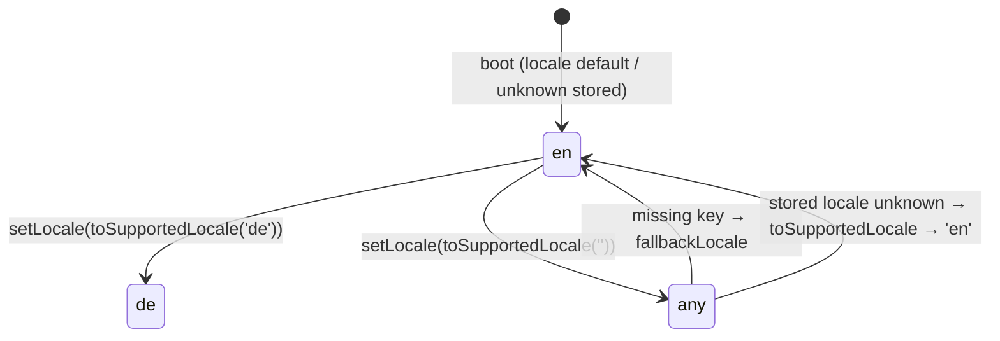

# Specification — i18n Full Locale Set (10 locales)

> Mechanical, additive. This spec pins the exact final shapes of the four widened declaration
> sites, the eight new catalogue file contracts, the two generalised tests, and the guard/build
> constraints. Two independent teams must produce the same files from this document.

The ten charter §3.9 codes, **in this canonical order**:
`en`, `de`, `es`, `fr`, `ja`, `ko`, `pt`, `ru`, `zh-CN`, `zh-TW`.
(The runtime array keeps `en` first so `fallbackLocale: 'en'` and the keyset authority are
unambiguous; `de` follows as the existing second locale; the eight new codes follow alphabetically
with the two regional `zh-*` tags last.)

---

## SPEC-IL-001 — Widened i18n declaration surface (`src/ui/i18n/index.ts`)

**Behaviour.** Widen the four declaration sites from two locales to ten. No new function, no
signature change to `setLocale` / `i18nMerge` / `i18nTranslate` / `flatToNested`.

**Exact final shapes.**

```ts
// type
export type SupportedLocale =
  | 'en' | 'de' | 'es' | 'fr' | 'ja' | 'ko' | 'pt' | 'ru' | 'zh-CN' | 'zh-TW';

// runtime array (en first, de second, then alphabetical, zh-* last)
export const SUPPORTED_LOCALES: SupportedLocale[] =
  ['en', 'de', 'es', 'fr', 'ja', 'ko', 'pt', 'ru', 'zh-CN', 'zh-TW'];

// imports (alongside the existing enMessages / deMessages)
import esMessages from './locales/es';
import frMessages from './locales/fr';
import jaMessages from './locales/ja';
import koMessages from './locales/ko';
import ptMessages from './locales/pt';
import ruMessages from './locales/ru';
import zhCNMessages from './locales/zh-CN';
import zhTWMessages from './locales/zh-TW';

// messages map inside createI18n
messages: {
  en: enMessages,
  de: deMessages,
  es: esMessages,
  fr: frMessages,
  ja: jaMessages,
  ko: koMessages,
  pt: ptMessages,
  ru: ruMessages,
  'zh-CN': zhCNMessages,
  'zh-TW': zhTWMessages,
} as unknown as Record<SupportedLocale, MessageSchema>,
```

**toSupportedLocale — body unchanged.** It stays exactly:

```ts
export function toSupportedLocale(locale: string): SupportedLocale {
  return (SUPPORTED_LOCALES as readonly string[]).includes(locale)
    ? (locale as SupportedLocale)
    : 'en';
}
```

Because it tests membership in `SUPPORTED_LOCALES`, widening the array makes it narrow all ten
codes (incl. `zh-CN`/`zh-TW`) and fall back to `'en'` for anything else. **Do not** rewrite it.

- **Pre-conditions:** the eight catalogue files (SPEC-IL-003) exist and export defaults.
- **Post-conditions:** `SUPPORTED_LOCALES.length === 10`; `Object.keys(i18n.global messages)` ===
  the ten codes; each `messages` entry resolves to a non-empty object.
- **Side effects:** none beyond module load (catalogues bundled into `main.js`).
- **Errors:** none new. `flatToNested` collision/forbidden-segment guards unchanged.
- **Imports:** `MessageSchema = typeof en` unchanged; `fallbackLocale: 'en'` unchanged.
- **Satisfies:** REQ-IL-001, REQ-IL-005, REQ-IL-006.

---

## SPEC-IL-002 — `messages` registration completeness

**Behaviour.** Every code in `SUPPORTED_LOCALES` has a `messages` entry and vice versa — the two
sets are identical (no code registered without a catalogue, no catalogue registered without being
listed).

- **Post-condition:** `new Set(SUPPORTED_LOCALES)` deep-equals `new Set(Object.keys(messages))`,
  both of size 10.
- **Satisfies:** REQ-IL-001. **Verified by:** TEST-IL-001.

---

## SPEC-IL-003 — New locale catalogue file contract (×8)

**Files.** `src/ui/i18n/locales/{es,fr,ja,ko,pt,ru,zh-CN,zh-TW}.ts`.

**Shape (mirrors `de.ts`).**

```ts
export default {
  // exact nested structure of en.ts, every leaf translated
} as const;
```

**Per-file invariants (each of the eight):**

1. **Default export**, single object literal, terminated `} as const;`.
2. **Keyset === `en.ts` exactly** — same nested tree, same leaf dot-paths; zero missing, zero extra
   keys (the leaf set is the ~140 paths under `agent.*` and `settings.*` in `en.ts`).
3. **Every leaf is a non-empty string.** No `null`, no nested arrays, no numbers.
4. **Placeholders preserved verbatim** — for each leaf, the `{token}` multiset equals the `en`
   value's multiset (SPEC-IL-005). Tokens in scope (from REQ-IL-008): `{provider}`, `{count}`,
   `{name}`, `{percent}`, `{scope}`, `{root}`, `{feature}`, `{reason}`, `{tool}`, `{pattern}`,
   `{mode}`, `{version}`, `{notePath}`, `{startLine}`, `{lineCount}`, `{canvasPath}`, `{keys}`.
5. **Idiomatic translation** — every leaf rendered in the target language; claudian wording reused
   where a term maps (e.g. fork/rewind/model); no leaf left in English where a translation exists
   (REQ-IL-007). Untranslated leaves are a defect, not a fallback.
6. **Plain text only** — no embedded HTML / markup (NFR-IL-009); `&`, `<`, `>` only as literal
   target-language text, never as tags.
7. **Forbidden-terms-clean** — no `API key` / `subprocess` / `SDK` (case-insensitive) in any leaf
   whose key is outside `ALLOWED_PREFIXES` (SPEC-IL-006).
8. **Filename === locale code** — `zh-CN.ts` and `zh-TW.ts` keep the hyphenated regional code;
   imported as `zhCNMessages` / `zhTWMessages`.

- **Pre-conditions:** `en.ts` is the keyset authority (frozen — NG2).
- **Side effects:** none.
- **Satisfies:** REQ-IL-002, REQ-IL-003, REQ-IL-007, REQ-IL-008, REQ-IL-009, NFR-IL-009.
- **Verified by:** TEST-IL-002, TEST-IL-003, TEST-IL-007, TEST-IL-008, TEST-IL-009.

---

## SPEC-IL-004 — Generalised all-ten key-parity test (`tests/ui/i18n/index.test.ts`)

**Behaviour.** Replace the en↔de-only parity assertion with an all-ten-against-en assertion,
preserving the snapshot-at-module-load discipline.

**Contract:**

- Reuse the existing `leafKeys(node, prefix)` helper unchanged.
- At module load (before the `i18nMerge` mutation tests run), snapshot `EN_KEYS_AT_LOAD` and a
  per-locale keyset for every non-en code in `SUPPORTED_LOCALES`. Snapshot from the **imported
  catalogue defaults**, not from the live vue-i18n instance (which `i18nMerge` tests mutate).
- Emit one assertion per non-en locale (table-driven over `SUPPORTED_LOCALES.filter(c => c !== 'en')`):
  - `missingInLocale = EN_KEYS \ LOCALE_KEYS` must be `[]`.
  - `extraInLocale = LOCALE_KEYS \ EN_KEYS` must be `[]`.
  - Failure message names the offending locale and the offending keys.
- The existing `i18nMerge` / `flatToNested` tests in the same file stay unchanged and must still pass
  (the snapshot-at-load ordering protects them).

- **Satisfies:** REQ-IL-003, REQ-IL-004, NFR-IL-001. **Verified by:** TEST-IL-003, TEST-IL-004.

---

## SPEC-IL-005 — Placeholder-multiset test (new, `tests/ui/i18n/`)

**Behaviour.** For every key present in `en`, assert each non-en locale's value carries the same
interpolation-placeholder multiset.

**Contract:**

- Extraction: `value.match(/\{[^}]+\}/g) ?? []`, then count tokens into a multiset (e.g. a sorted
  array or `Map<token, count>`).
- For each non-en locale and each `en` leaf key: `multiset(localeValue) === multiset(enValue)`.
- Failure names the locale, the key, and the diff (`en` tokens vs locale tokens).
- Iterate via the same `leafKeys` flattening so the test and the parity test share key discovery.

- **Edge:** a leaf with no placeholders → both multisets empty → passes trivially.
- **Satisfies:** REQ-IL-008, NFR-IL-002. **Verified by:** TEST-IL-008.

---

## SPEC-IL-006 — Forbidden-terms guard across all ten locales (`tests/i18n/forbidden-terms.test.ts`)

**Behaviour.** Run the existing `FORBIDDEN` scan (`/\bAPI key\b/i`, `/\bsubprocess\b/i`,
`/\bSDK\b/i`) and the existing `flatten` / `isAllowed` helpers across all ten catalogues, not just
`en`.

**Contract:**

- `ALLOWED_PREFIXES` is **unchanged from P9**: `['settings.', 'errors.subprocess',
  'provider.field.', 'agent.chat.providers.secret.', 'agent.chat.providers.notice.keyRequired']`.
- For each of the ten locales: `flatten(catalogue).filter(([k]) => !isAllowed(k))` must yield zero
  offenders against `FORBIDDEN`.
- Extend `ALLOWED_PREFIXES` **only** if a translated settings/credential string legitimately needs
  it (EC-IL-005) — and that extension is a defect-escalation, not a default.

- **Satisfies:** REQ-IL-009, NFR-IL-003. **Verified by:** TEST-IL-009.

---

## SPEC-IL-007 — Additivity: `en` / `de` / `manifest.json` untouched

**Behaviour.** `src/ui/i18n/locales/en.ts` and `de.ts` are byte-identical to the `next` baseline;
`manifest.json` is byte-identical (id / version / minAppVersion unchanged).

- **Post-condition:** `git diff next -- src/ui/i18n/locales/en.ts src/ui/i18n/locales/de.ts manifest.json`
  is empty.
- **Satisfies:** REQ-IL-010, NFR-IL-005, NFR-IL-008. **Verified by:** TEST-IL-010 (diff/review).

---

## SPEC-IL-008 — Missing-translation fallback

**Behaviour.** With a non-en locale active, a key absent from that locale but present in `en`
resolves the `en` string and never throws (`fallbackLocale: 'en'` honoured).

- **Post-condition:** `i18nTranslate(missingKey)` with active non-en locale returns the `en` value;
  no exception.
- **Note:** the all-ten parity test makes a genuinely missing key a red build, so this fallback is a
  safety net, not an expected runtime path. The test exercises it via a synthetic
  partially-merged locale rather than a real catalogue gap.
- **Satisfies:** REQ-IL-011, NFR-IL-004. **Verified by:** TEST-IL-011.

---

## SPEC-IL-009 — Build and bundle-size record

**Behaviour.** `npm run build` succeeds with the ten locales registered; `main.js` is produced;
the size delta versus the two-locale baseline is recorded in implementation-log / release-notes.

- **Post-condition:** build exits 0; `main.js` exists; recorded `main.js` size delta is a number
  (informational, no hard threshold beyond "build green").
- **No externalization** — catalogues are bundled (DESIGN-IL-001 §C.8).
- **Satisfies:** REQ-IL-012, NFR-IL-006. **Verified by:** TEST-IL-012.

---

## Data structures — validation rules per leaf

| Field | Rule |
|---|---|
| Leaf value | non-empty string; plain text (no HTML tags); `{token}` set === `en` leaf's set |
| Leaf key path | exists in `en.ts`; no extra path absent from `en.ts` |
| File default export | object literal, `as const`, no top-level arrays/primitives |
| Locale code (regional) | `zh-CN` / `zh-TW` kept hyphenated in filename, `SUPPORTED_LOCALES`, `messages` keys |

---

## State transitions



No persistent locale state beyond `PluginSettings.locale` (a string, narrowed on read). Switching
locale is a synchronous `i18n.global.locale.value` assignment.

---

## Edge cases

| ID | Edge case | Expected behaviour | Caught by |
|---|---|---|---|
| EC-IL-001 | A translated value drops a placeholder (`{provider}` omitted) | Placeholder-multiset mismatch → test fails naming locale + key | SPEC-IL-005 / TEST-IL-008 |
| EC-IL-002 | A translated value renames a placeholder (`{anbieter}`) | Multiset differs from `en` → test fails | SPEC-IL-005 / TEST-IL-008 |
| EC-IL-003 | A locale catalogue has an extra key not in `en` | `extraInLocale` non-empty → parity test fails | SPEC-IL-004 / TEST-IL-003 |
| EC-IL-004 | A locale catalogue is missing an `en` key | `missingInLocale` non-empty → parity test fails | SPEC-IL-004 / TEST-IL-003 |
| EC-IL-005 | A forbidden term (`API key` etc.) appears in a translated non-allowlisted leaf | Guard fails for that locale; fix the copy, or extend `ALLOWED_PREFIXES` only if a legitimate settings/credential string | SPEC-IL-006 / TEST-IL-009 |
| EC-IL-006 | `toSupportedLocale('zh-CN')` and `('zh-TW')` | Each returns itself unchanged (regional tags narrow correctly) | SPEC-IL-001 / TEST-IL-005 |
| EC-IL-007 | `toSupportedLocale('zh')`, `'it'`, `''`, `'EN'`, `'de-DE'` | Returns `'en'` (not in the ten; case-sensitive; no regional collapse) | SPEC-IL-001 / TEST-IL-006 |
| EC-IL-008 | Active locale missing a key at runtime | `en` fallback string, no throw | SPEC-IL-008 / TEST-IL-011 |
| EC-IL-009 | A leaf with no placeholders | Empty multiset both sides → passes | SPEC-IL-005 / TEST-IL-008 |
| EC-IL-010 | Empty/whitespace-only translated leaf | Violates "non-empty string"; reviewer/spot-check defect | SPEC-IL-003 / TEST-IL-007 |

---

## Test scenarios (TEST-IL-NNN)

| ID | Scenario | Type | Backs |
|---|---|---|---|
| TEST-IL-001 | `SUPPORTED_LOCALES` and `messages` keys both === the ten codes; each `messages` entry non-empty | unit | REQ-IL-001 |
| TEST-IL-002 | Each of the eight new catalogues imports and default-exports an object with ≥1 leaf string | unit | REQ-IL-002 |
| TEST-IL-003 | Per non-en locale: leaf keyset diff against `en` is empty both directions | unit (table-driven) | REQ-IL-003 |
| TEST-IL-004 | The parity suite emits one assertion per non-en locale; a planted missing/extra key fails naming the locale | unit | REQ-IL-004 |
| TEST-IL-005 | `toSupportedLocale(code)` returns `code` for each of the ten (incl. `zh-CN`/`zh-TW`) | unit | REQ-IL-005 |
| TEST-IL-006 | `toSupportedLocale` returns `'en'` for `'it'`, `'zh'`, `''`, `'EN'`, `'de-DE'` | unit | REQ-IL-006 |
| TEST-IL-007 | Spot-check: no leaf left in English where a translation exists (review-assisted; deterministic non-empty-leaf check) | unit + review | REQ-IL-007 |
| TEST-IL-008 | Per non-en locale, per key: `{…}` multiset === `en`'s | unit | REQ-IL-008 |
| TEST-IL-009 | Forbidden-terms scan clean across all ten, `ALLOWED_PREFIXES` unchanged | unit | REQ-IL-009 |
| TEST-IL-010 | `en.ts` / `de.ts` / `manifest.json` byte-identical to `next` baseline | diff/review | REQ-IL-010 |
| TEST-IL-011 | Missing key in active non-en locale → `en` string, no throw | unit | REQ-IL-011 |
| TEST-IL-012 | `npm run build` green; `main.js` produced; size delta recorded | build gate | REQ-IL-012 |

---

## Implementation chunking (for the planner — 2–3 locales per chunk)

The P8/P9 subagent-timeout lesson: eight full catalogues is large. Split locale authoring into
chunks; the index/test widening is its own chunk that lands once all catalogues exist.

| Chunk | Scope | Notes |
|---|---|---|
| **Chunk 1 — Romance** | `es.ts`, `fr.ts`, `pt.ts` | Latin-script, closest to `en`/`de` patterns; shortest review loop; do first to validate the contract end-to-end. |
| **Chunk 2 — CJK** | `ja.ts`, `ko.ts` | Non-Latin script; watch placeholder spacing (`{name}` must stay verbatim, no fullwidth braces). |
| **Chunk 3 — zh + ru** | `zh-CN.ts`, `zh-TW.ts`, `ru.ts` | The two regional Chinese tags (distinct simplified/traditional wording) + Cyrillic; keep `zh-CN`/`zh-TW` files distinct, not symlinked. |
| **Chunk 4 — wiring + tests** | `index.ts` widening (SPEC-IL-001/002) + generalised parity test (SPEC-IL-004) + placeholder test (SPEC-IL-005) + forbidden-terms all-ten (SPEC-IL-006) | Lands after all eight catalogues; flips the suite green. Run `npm run verify` + record bundle delta (SPEC-IL-009). |

Each catalogue chunk is independently parity-testable once Chunk 4's test exists; for parallelism,
Chunk 4 can land the test scaffold first (RED) and each locale chunk turns its row GREEN.

---

## Observability

No new logs/metrics/traces — i18n is synchronous in-process data with no external calls. The
forbidden-terms guard, parity test, placeholder test, and build gate are the observability surface
(CI signals). Bundle-size delta is recorded once in implementation-log / release-notes.

## Performance budget

Inherits PRD NFRs. No runtime perf budget change — catalogues load once at boot; locale switch is a
single ref assignment. Bundle size is the only watched dimension (NFR-IL-006, informational record).

## Compatibility

Fully backward-compatible. Additive only: `en`/`de`/`manifest.json` byte-identical (SPEC-IL-007);
`SupportedLocale` widens (no removed members); `toSupportedLocale` body unchanged. No migration.

---

## Requirements coverage table (REQ-IL ↔ SPEC-IL ↔ TEST-IL)

| REQ-IL | SPEC-IL | TEST-IL |
|---|---|---|
| REQ-IL-001 (ten registered) | SPEC-IL-001, SPEC-IL-002 | TEST-IL-001 |
| REQ-IL-002 (eight catalogue files) | SPEC-IL-003 | TEST-IL-002 |
| REQ-IL-003 (leaf keyset == en) | SPEC-IL-003, SPEC-IL-004 | TEST-IL-003 |
| REQ-IL-004 (parity generalised) | SPEC-IL-004 | TEST-IL-004 |
| REQ-IL-005 (narrows the ten) | SPEC-IL-001 | TEST-IL-005 |
| REQ-IL-006 (unknown → en) | SPEC-IL-001 | TEST-IL-006 |
| REQ-IL-007 (claudian wording) | SPEC-IL-003 | TEST-IL-007 |
| REQ-IL-008 (placeholders preserved) | SPEC-IL-003, SPEC-IL-005 | TEST-IL-008 |
| REQ-IL-009 (forbidden-terms guard) | SPEC-IL-003, SPEC-IL-006 | TEST-IL-009 |
| REQ-IL-010 (en/de byte-identical) | SPEC-IL-007 | TEST-IL-010 |
| REQ-IL-011 (fallback no crash) | SPEC-IL-008 | TEST-IL-011 |
| REQ-IL-012 (build + bundle recorded) | SPEC-IL-009 | TEST-IL-012 |

NFR coverage: NFR-IL-001→SPEC-IL-004; NFR-IL-002→SPEC-IL-005; NFR-IL-003→SPEC-IL-006;
NFR-IL-004→SPEC-IL-008; NFR-IL-005→SPEC-IL-007; NFR-IL-006→SPEC-IL-009; NFR-IL-007 (coverage
80/70/80/80)→whole suite; NFR-IL-008→SPEC-IL-007; NFR-IL-009→SPEC-IL-003.

---

## Quality gate

- [x] Every public interface specified (the four widened sites, exact final shapes).
- [x] Eight new-file contracts pinned (keyset, placeholders, plain-text, forbidden-terms).
- [x] Two generalised tests specified (all-ten parity + placeholder multiset).
- [x] Edge cases enumerated (EC-IL-001..010), not "TBD".
- [x] Test scenarios derived (TEST-IL-001..012).
- [x] Chunking guidance for the planner (2–3 locales per chunk).
- [x] Compatibility + bundle note stated.
- [x] REQ ↔ SPEC ↔ TEST coverage table complete; every SPEC traces to ≥1 REQ.
