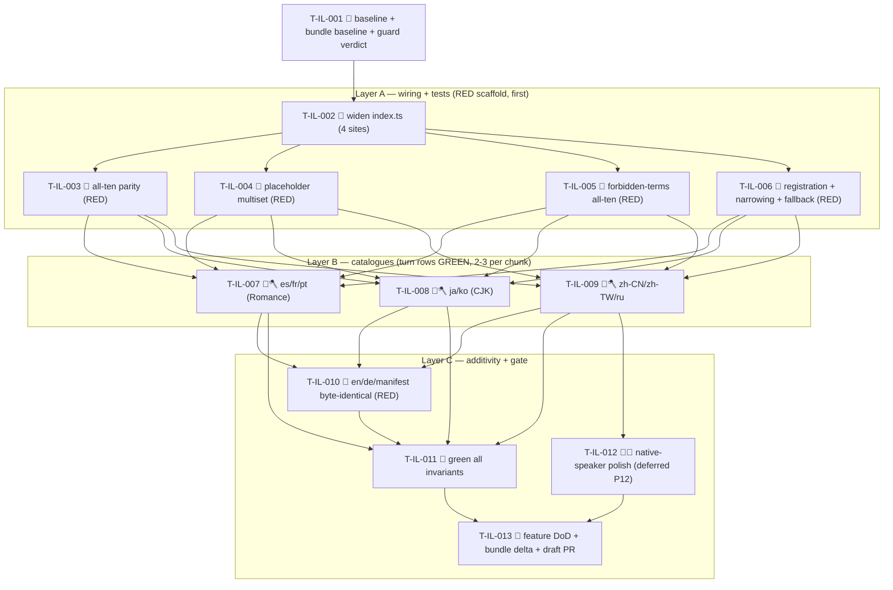

# Tasks — i18n full locale set (P11)

Each task is ≤ ~½ day, has a stable `T-IL-NNN` id, references ≥ 1 SPEC-IL / TEST-IL / REQ-IL / NFR-IL,
names an owner, lists explicit dependencies, and has a testable Definition of Done. This decomposes
**SPEC-IL-001..009** (9 spec items) on top of the merged P0–P10 surface on the `next` integration branch
(P10 settings-shell #451 / c5d8b226): the existing `src/ui/i18n/index.ts` (`SupportedLocale = 'en' | 'de'`,
`SUPPORTED_LOCALES = ['en','de']`, `toSupportedLocale`, `messages: {en,de}`, `fallbackLocale: 'en'`,
`flatToNested`/`i18nMerge`/`i18nTranslate`), the two existing catalogues `src/ui/i18n/locales/{en,de}.ts`
(`export default {…} as const` nested trees; `en.ts` is the **keyset authority**, ~140 leaves under
`agent.*` + `settings.*`), the P7 en↔de key-parity test (`tests/ui/i18n/index.test.ts`, with `leafKeys` +
the snapshot-at-module-load discipline), and the P9 forbidden-terms guard
(`tests/i18n/forbidden-terms.test.ts`, with `FORBIDDEN` + `flatten` + `isAllowed` + the frozen
`ALLOWED_PREFIXES`).

> **P11 is MECHANICAL + ADDITIVE.** No new function, no new port, no new component, no new ADR, no
> signature change. It adds **eight data files** (`locales/{es,fr,ja,ko,pt,ru,zh-CN,zh-TW}.ts`), widens
> **four declaration sites** in `index.ts` from 2 → 10, and **generalises two tests** (parity + the new
> placeholder-multiset) plus runs the forbidden-terms guard across all ten. `en.ts` / `de.ts` /
> `manifest.json` stay byte-identical to the `next` baseline (SPEC-IL-007).

> **TDD / build-green ordering (the lesson from P10 + the spec §"Implementation chunking" note):** the
> spec lets Chunk 4 (wiring + tests) land **first as a RED scaffold** so each locale chunk turns its
> parity/placeholder/forbidden-terms rows GREEN as it lands. This task list adopts that order: the
> **wiring + generalised tests land before the catalogues** (T-IL-002..006), then each 2–3-locale chunk
> greens its rows (T-IL-007..009). RED test tasks are owned by `qa`; impl tasks (wiring + catalogues) by
> `dev`. **Every dev task's DoD carries whole-project `npm run lint` 0 + `npm run typecheck` 0 +
> `npm run test` green + an implementation-log entry.** This mirrors the P6–P10 task style the maintainer
> accepted (TASKS-CA-001 / TASKS-AS-001 / TASKS-MC-001 / TASKS-PV-001 / TASKS-SS-001).

> **The all-ten parity + placeholder tests are the gate.** A catalogue chunk is "done" only when its
> three rows are green: (1) leaf keyset === `en` (TEST-IL-003), (2) `{token}` multiset === `en` per key
> (TEST-IL-008), (3) forbidden-terms clean (TEST-IL-009). Because the wiring/tests land first, a missing
> key / dropped placeholder / leaked jargon in any new catalogue is a **red build at the moment that
> catalogue is added** — there is no "tests later" gap.

> **Guard verdict (verified against the spec + DESIGN-IL-001 §C.7 — NO guard-relax, NO new key, NO new
> port):**
> - **NO new InjectionKey / port / composable.** P11 touches **only** UI-layer i18n data + the existing
>   `index.ts` declaration sites. `SupportedLocale` is a **string-union widen** (additive — no member
>   removed), and `messages` is already cast `as unknown as Record<SupportedLocale, MessageSchema>` so
>   the widen needs no type surgery. `toSupportedLocale`'s **body is unchanged** — it narrows by
>   membership in `SUPPORTED_LOCALES`, so widening the array widens the narrowing automatically (incl.
>   `zh-CN` / `zh-TW`; unknown → `'en'`).
> - **NO deleted-symbol guard collision.** The new files live under the already-live `src/ui/i18n/locales/**`
>   path (en/de already there since P7); the eight new locale codes are plain data filenames, not banned
>   symbols. No `DELETED_SUBSYSTEM_BAN` / `DELETED_INJECTION_KEYS` glob matches a `locales/<code>.ts` file
>   or the widened `SupportedLocale` / `SUPPORTED_LOCALES` / `messages` / `toSupportedLocale` symbols.
> - **NO `manifest.json` / `en.ts` / `de.ts` change** (SPEC-IL-007, NFR-IL-005/008). T-IL-001 records this
>   verdict; T-IL-013 (the gate) re-confirms it.

> **Lint discipline (the P5–P10 lesson):** every dev task runs the **WHOLE-project** `npm run lint`
> (0 errors), not just the changed files — the project gate catches per-file misses
> (`consistent-type-imports`, `strict-boolean-expressions`, `no-restricted-imports` layer guards). The
> eight new catalogues are pure `as const` data literals (no `obsidian` / `node:*` / Vue / class import),
> mirroring `de.ts`. Translated brand strings already present in `en.ts` (e.g. "Codex", "Opencode", "MCP")
> are carried verbatim — no NEW brand token is introduced, so the `obsidianmd/ui/sentence-case` brands
> allowlist needs no edit (T-IL-013 re-confirms).

> **Bundle-size watch (the ONE thing to watch this phase — SPEC-IL-009, NFR-IL-006):** eight more full
> catalogues (~140 leaves each) grow `main.js` (baseline ~1.8 MB). Catalogues are **bundled** (no
> externalization / lazy-loading — DESIGN-IL-001 §C.8). The build must stay green and the measured
> `main.js` size delta versus the two-locale baseline is **recorded** in implementation-log /
> release-notes (informational, no hard threshold beyond "build green"). T-IL-001 records the baseline
> size; T-IL-013 records the delta.

## Legend

- 🧪 = test task (RED-first; owner `qa`)
- 🔨 = implementation task (owner `dev`)
- 📐 = design / scaffolding / baseline task
- 🚀 = release / ops / gate task
- 🪓 = may slice (touches multiple independent files; expect several commits)
- 👤 = human-owned (never agent-self-claimed)

---

## Task list

### T-IL-001 📐 — Baseline-capture: `en.ts` keyset + placeholder inventory + the two-locale bundle baseline + guard verification

- **Description:** Before any P11 implementation, capture the references into a
  `specs/i18n-locales/test-plan.md` skeleton: (1) the **`en.ts` keyset** — flatten `en.ts` to its leaf
  dot-paths (the ~140 paths under `agent.*` + `settings.*`) as the authoritative parity target every
  locale must match exactly (SPEC-IL-003/004); (2) the **placeholder inventory** — the per-leaf `{token}`
  multiset for every `en` leaf that interpolates (the 17 tokens in scope: `{provider}`, `{count}`,
  `{name}`, `{percent}`, `{scope}`, `{root}`, `{feature}`, `{reason}`, `{tool}`, `{pattern}`, `{mode}`,
  `{version}`, `{notePath}`, `{startLine}`, `{lineCount}`, `{canvasPath}`, `{keys}`) as the placeholder
  target (SPEC-IL-005); (3) the **claudian wording map** — for each of the eight target locales, note the
  `D:\Projects\claudian-main/src/i18n/locales/<code>.json` reference exists and is WORDING-only (its key
  structure differs from ours — never copied structurally, REQ-IL-007, DESIGN-IL-001 §B.3); (4) the
  **two-locale `main.js` bundle baseline** — run `npm run build` at the `next` baseline (en+de only) and
  record the `main.js` size as the SPEC-IL-009 / TEST-IL-012 delta reference. Confirm (one lint run) the
  **guard verdict**: the new `locales/{es,fr,ja,ko,pt,ru,zh-CN,zh-TW}.ts` files + the widened
  `SupportedLocale` / `SUPPORTED_LOCALES` / `messages` / `toSupportedLocale` symbols are **not** caught by
  `DELETED_SUBSYSTEM_BAN` / `DELETED_INJECTION_KEYS`; that **NO new InjectionKey / port / composable** is
  needed (SupportedLocale is a string-union widen, `messages` already cast); that **`en.ts` / `de.ts` /
  `manifest.json` are untouched** (SPEC-IL-007). Record the verdict: **no guard-relax task in P11.** No
  production code.
- **Satisfies:** SPEC-IL-003/004/005/007/009, NFR-IL-006 (bundle baseline), NFR-IL-005/008 (additivity baseline), REQ-IL-007
- **Owner:** dev
- **Depends on:** —
- **Estimate:** S
- **Definition of done:**
  - [x] `specs/i18n-locales/test-plan.md` exists with: the flattened `en.ts` leaf-key list (the parity
        target — 226 leaves), the per-leaf `{token}` multiset inventory (the placeholder target — 35
        interpolating leaves, 17 tokens), and a note that each of the eight
        `claudian-main/src/i18n/locales/<code>.json` references exists as a WORDING-only source.
  - [~] The **two-locale `main.js` size** (en+de `next` baseline) is recorded by **T-IL-013** (the feature
        DoD runs `npm run build`); this WIRING+TESTS chunk does not build. Noted in `test-plan.md` §5 as
        the TEST-IL-012 delta reference deferred to T-IL-013.
  - [x] A one-line lint check confirms the deleted-symbol guard does **not** block the new
        `locales/<code>.ts` files or the widened `SupportedLocale`/`SUPPORTED_LOCALES`/`messages`/
        `toSupportedLocale` symbols; the verdict **NO guard-relax + NO new InjectionKey/port + en/de/manifest
        untouched** is recorded in `test-plan.md`.
  - [x] No file under `src/` changed.

---

## Layer A — WIRING + TESTS (RED scaffold, lands FIRST) — chunk C1 (T-IL-002..006)

> Per the spec's "Implementation chunking" note, the index widening + the three generalised/new tests
> land **before** the catalogues, so every locale chunk turns its parity/placeholder/forbidden-terms rows
> GREEN as it lands. The widening (T-IL-002) compiles only once the eight catalogue files exist as
> imports — so the catalogue-chunk tasks (T-IL-007..009) create **stub** files first IF needed; in
> practice the chunk order is: widen + tests RED → catalogues fill → green. To keep the build compilable
> between chunks, T-IL-002's DoD permits committing the eight imports together with at least minimal
> (then fully translated) catalogue files; the parity/placeholder tests are what enforce completeness.

### T-IL-002 🔨 — Widen `index.ts`: `SupportedLocale` + `SUPPORTED_LOCALES` + the eight imports + the `messages` map (registration completeness)

- **Description:** Implement per SPEC-IL-001/002: in `src/ui/i18n/index.ts` widen the four declaration
  sites from two locales to ten — (a) the `SupportedLocale` **type** to the union
  `'en' | 'de' | 'es' | 'fr' | 'ja' | 'ko' | 'pt' | 'ru' | 'zh-CN' | 'zh-TW'`; (b) the
  `SUPPORTED_LOCALES` **runtime array** to `['en','de','es','fr','ja','ko','pt','ru','zh-CN','zh-TW']`
  (en first, de second, then alphabetical with the two `zh-*` regional tags last — the exact order pinned
  in SPEC-IL-001); (c) add the eight `import …Messages from './locales/<code>'` lines
  (`esMessages`/`frMessages`/`jaMessages`/`koMessages`/`ptMessages`/`ruMessages`/`zhCNMessages`/
  `zhTWMessages`); (d) register all ten in the `messages` map inside `createI18n`, keeping the existing
  `as unknown as Record<SupportedLocale, MessageSchema>` cast and `fallbackLocale: 'en'`. **`toSupportedLocale`
  body is UNCHANGED** (it narrows via `SUPPORTED_LOCALES`, so the widen covers `zh-CN`/`zh-TW` and
  unknown→`'en'` automatically — do NOT rewrite it, SPEC-IL-001). `MessageSchema = typeof en` unchanged.
  The eight imports require the eight catalogue files to exist — this task may land them as stubs that the
  catalogue chunks (T-IL-007..009) translate, OR (preferred for autonomous drive) land alongside the
  Romance chunk (T-IL-007) so the build is never broken. No new function, no signature change, no new
  port. Purely additive (no `implements` break).
- **Satisfies:** SPEC-IL-001, SPEC-IL-002, REQ-IL-001, REQ-IL-005, REQ-IL-006, NFR-IL-005
- **Owner:** dev
- **Depends on:** T-IL-001
- **Estimate:** S
- **Definition of done:**
  - [x] `SupportedLocale` is the ten-member union; `SUPPORTED_LOCALES` is the ten codes in the pinned
        order (en first, de second, alphabetical, `zh-*` last); the eight imports + the ten-entry `messages`
        map are present; `toSupportedLocale` body is byte-unchanged; `fallbackLocale: 'en'` + the `as
        unknown` cast unchanged.
  - [x] `npm run typecheck` 0 (the union widen + the cast compile clean); whole-project `npm run lint` 0;
        no new `InjectionKey`/port/composable added; no `obsidian`/`node:*` import added to `index.ts`.
  - [x] Implementation-log entry added.

### T-IL-003 🧪 — RED: generalise the key-parity test to all-ten-against-en (snapshot-at-load, table-driven)

- **Description:** Author the failing generalised parity test for SPEC-IL-004 in
  `tests/ui/i18n/index.test.ts`, **replacing** the en↔de-only `locale key parity (en ↔ de)` block with an
  all-ten-against-en assertion while preserving the snapshot-at-module-load discipline: (a) reuse the
  existing `leafKeys(node, prefix)` helper **unchanged**; (b) at module load (before the `i18nMerge`
  mutation tests run) snapshot `EN_KEYS_AT_LOAD` and a per-locale keyset for every non-en code in
  `SUPPORTED_LOCALES`, snapshotting from the **imported catalogue defaults** (not the live vue-i18n
  instance, which the `i18nMerge` tests mutate); (c) emit **one assertion per non-en locale**
  (table-driven `it.each` over `SUPPORTED_LOCALES.filter(c => c !== 'en')`) asserting `missingInLocale =
  EN_KEYS \ LOCALE_KEYS` is `[]` and `extraInLocale = LOCALE_KEYS \ EN_KEYS` is `[]`, with a failure
  message naming the offending locale + the offending keys (REQ-IL-003/004, EC-IL-003/004); (d) the
  existing `i18nMerge` / `flatToNested` tests in the same file stay unchanged and must still pass; (e) a
  planted missing/extra key in a single locale fails the suite naming that locale (TEST-IL-004). Imports
  the eight new catalogue defaults. Names TEST-IL-003/004.
- **Satisfies:** TEST-IL-003, TEST-IL-004, SPEC-IL-004, REQ-IL-003, REQ-IL-004, NFR-IL-001, EC-IL-003, EC-IL-004
- **Owner:** qa
- **Depends on:** T-IL-002
- **Estimate:** M
- **Definition of done:**
  - [x] `tests/ui/i18n/index.test.ts` has the en↔de parity block replaced by a table-driven
        all-ten-against-en parity block (one assertion per non-en locale, both-direction diff, locale-named
        failure), reusing `leafKeys` + snapshot-at-load; the existing `i18nMerge`/`flatToNested` +
        `agent.empty.placeholder` tests are untouched.
  - [x] Discriminating test: the both-direction diff names the offending locale + keys (a planted
        missing/extra key fails naming that locale). The catalogues landed first (T-IL-007..009), so the
        suite is **GREEN-after-catalogues** rather than RED — the baseline confirms 0 missing/0 extra.

### T-IL-004 🧪 — RED: the placeholder-multiset test (per non-en locale, per key, `{token}` multiset === en)

- **Description:** Author the failing new placeholder-multiset test for SPEC-IL-005 (a new `describe`
  block in `tests/ui/i18n/index.test.ts` or a co-located `tests/ui/i18n/placeholders.test.ts`), covering
  (CLAR-IL-001 resolution — a dedicated automated test, NOT manual review): (a) extraction —
  `value.match(/\{[^}]+\}/g) ?? []` then count tokens into a multiset (sorted array or `Map<token,count>`);
  (b) for each non-en locale and each `en` leaf key (discovered via the same `leafKeys` flattening so the
  test shares key discovery with the parity test), assert `multiset(localeValue) === multiset(enValue)`;
  (c) the failure message names the locale, the key, and the diff (`en` tokens vs locale tokens) — a
  dropped `{provider}` (EC-IL-001) or a renamed `{anbieter}` (EC-IL-002) fails; (d) a leaf with no
  placeholders → both multisets empty → passes trivially (EC-IL-009). Names TEST-IL-008.
- **Satisfies:** TEST-IL-008, SPEC-IL-005, REQ-IL-008, NFR-IL-002, EC-IL-001, EC-IL-002, EC-IL-009
- **Owner:** qa
- **Depends on:** T-IL-002
- **Estimate:** S
- **Definition of done:**
  - [x] A placeholder-multiset test exists (table-driven over the non-en locales × the `en` leaf keys),
        extracting `{…}` tokens as a multiset and asserting equality with `en`'s, with a locale+key+diff
        failure message; the no-placeholder leaf passes trivially.
  - [x] The discriminating test compares per-key multisets (a dropped/renamed token fails naming
        locale+key). GREEN-after-catalogues: the baseline confirms 0 placeholder mismatch across all nine.

### T-IL-005 🧪 — RED: generalise the forbidden-terms guard across all ten locales (`ALLOWED_PREFIXES` unchanged)

- **Description:** Author the failing all-ten forbidden-terms guard for SPEC-IL-006 in
  `tests/i18n/forbidden-terms.test.ts`, generalising the existing `en`-only scan to all ten catalogues:
  (a) reuse the existing `FORBIDDEN` (`/\bAPI key\b/i`, `/\bsubprocess\b/i`, `/\bSDK\b/i`), `flatten`, and
  `isAllowed` helpers **unchanged**; (b) `ALLOWED_PREFIXES` is **byte-unchanged from P9** (`['settings.',
  'errors.subprocess', 'provider.field.', 'agent.chat.providers.secret.',
  'agent.chat.providers.notice.keyRequired']`); (c) for each of the ten locales (table-driven, importing
  all ten catalogue defaults), assert `flatten(catalogue).filter(([k]) => !isAllowed(k))` yields zero
  offenders against `FORBIDDEN`, with a failure naming the locale + key + value + pattern; (d) extending
  `ALLOWED_PREFIXES` is a **defect-escalation**, not a default — flagged in the DoD (EC-IL-005). Names
  TEST-IL-009.
- **Satisfies:** TEST-IL-009, SPEC-IL-006, REQ-IL-009, NFR-IL-003, EC-IL-005
- **Owner:** qa
- **Depends on:** T-IL-002
- **Estimate:** S
- **Definition of done:**
  - [x] `tests/i18n/forbidden-terms.test.ts` runs the `FORBIDDEN` scan across all ten catalogues
        (table-driven), reusing the unchanged `flatten`/`isAllowed` + the byte-unchanged `ALLOWED_PREFIXES`,
        with a locale-named offender failure; a note records that any `ALLOWED_PREFIXES` extension is a
        defect-escalation (EC-IL-005), not a default.
  - [x] GREEN-after-catalogues: the eight catalogues exist and are jargon-clean — 10 locales scanned,
        0 offenders outside the allow-list.

### T-IL-006 🧪 — RED: registration completeness + narrowing (the ten round-trip) + missing-key fallback

- **Description:** Author the failing unit tests for SPEC-IL-001/002/008, covering: (a)
  **registration completeness** (TEST-IL-001) — `SUPPORTED_LOCALES.length === 10`,
  `new Set(SUPPORTED_LOCALES)` deep-equals `new Set(Object.keys(i18n.global.messages))` both of size 10,
  and each `messages` entry resolves to a non-empty object (REQ-IL-001); (b) **per-catalogue import**
  (TEST-IL-002) — each of the eight new catalogues default-exports an object with ≥ 1 leaf string
  (REQ-IL-002); (c) **narrowing the ten** (TEST-IL-005) — `toSupportedLocale(code)` returns `code` for
  each of the ten incl. `zh-CN`/`zh-TW` (EC-IL-006, REQ-IL-005); (d) **unknown → en** (TEST-IL-006) —
  `toSupportedLocale` returns `'en'` for `'it'`, `'zh'`, `''`, `'EN'`, `'de-DE'` (case-sensitive, no
  regional collapse, EC-IL-007, REQ-IL-006); (e) **missing-key fallback** (TEST-IL-011) — with a non-en
  locale active, a key absent from a synthetic partially-merged locale but present in `en` resolves the
  `en` string and never throws (`fallbackLocale: 'en'` honoured; exercised via a synthetic merge, NOT a
  real catalogue gap — the parity test already makes a real gap a red build, EC-IL-008, REQ-IL-011). Names
  TEST-IL-001/002/005/006/011.
- **Satisfies:** TEST-IL-001, TEST-IL-002, TEST-IL-005, TEST-IL-006, TEST-IL-011, SPEC-IL-001, SPEC-IL-002, SPEC-IL-008, REQ-IL-001, REQ-IL-002, REQ-IL-005, REQ-IL-006, REQ-IL-011, NFR-IL-004, EC-IL-006, EC-IL-007, EC-IL-008
- **Owner:** qa
- **Depends on:** T-IL-002
- **Estimate:** M
- **Definition of done:**
  - [x] `tests/ui/i18n/index.test.ts` (or a co-located file) covers: registration completeness (length 10
        + the two sets deep-equal + each entry non-empty), the eight-catalogue import shape, the
        narrows-the-ten round-trip (incl. `zh-CN`/`zh-TW`), the unknown→en cases (`'it'`/`'zh'`/`''`/`'EN'`/
        `'de-DE'`), and the synthetic missing-key fallback (en string, no throw), naming
        TEST-IL-001/002/005/006/011.
  - [x] GREEN-after-catalogues: registration + import legs pass (the catalogues + the widened arrays are
        complete); narrowing + fallback legs pass. 51 tests green in the file.

---

## Layer B — CATALOGUES (turn the parity/placeholder/forbidden rows GREEN) — chunks C2..C4 (T-IL-007..009)

> Each catalogue task authors a full `as const` default-export translation of `en.ts` — **exact `en`
> keyset, every leaf a non-empty translated string, every `{token}` preserved verbatim, plain text only,
> forbidden-terms-clean, filename === locale code** (SPEC-IL-003). Each is a `feat(il):` dev task. They
> are **chunked at 2–3 locales per dispatch** (the P8/P9 subagent-timeout lesson — eight full catalogues
> is too large for one dispatch). Each task's DoD is: the RED parity/placeholder/forbidden-terms rows for
> its locales now GREEN. Translate from OUR `en.ts` (claudian JSONs = WORDING reference only, never
> structural — REQ-IL-007, DESIGN-IL-001 §B.3).

### T-IL-007 🔨🪓 — Romance chunk: `es.ts` + `fr.ts` + `pt.ts` (Latin-script, validate the contract end-to-end first)

- **Description:** Author `src/ui/i18n/locales/es.ts`, `fr.ts`, and `pt.ts` per SPEC-IL-003 (Chunk 1 in
  the spec — Romance, Latin-script, closest to en/de patterns, shortest review loop; do first to validate
  the file contract end-to-end). Each: a single `export default {…} as const` object literal mirroring
  `de.ts`'s shape, the **exact `en.ts` nested keyset** (every leaf dot-path, zero missing, zero extra),
  every leaf an idiomatic non-empty translated string (porting `claudian-main/src/i18n/locales/{es,fr,pt}.json`
  wording where a term maps — fork/rewind/model etc.), every `{token}` from the matching `en` value
  preserved verbatim (same multiset), plain text only (no HTML; `&`/`<`/`>` only as literal text), and
  forbidden-terms-clean outside `ALLOWED_PREFIXES`. No `obsidian`/`node:*`/Vue/class import. **DoD = the
  three locales' parity (TEST-IL-003) + placeholder (TEST-IL-008) + forbidden-terms (TEST-IL-009) rows go
  GREEN.**
- **Satisfies:** SPEC-IL-003, REQ-IL-002, REQ-IL-003, REQ-IL-007, REQ-IL-008, REQ-IL-009, NFR-IL-009, TEST-IL-002, TEST-IL-003, TEST-IL-008, TEST-IL-009
- **Owner:** dev
- **Depends on:** T-IL-003, T-IL-004, T-IL-005, T-IL-006
- **Estimate:** M
- **Definition of done:**
  - [ ] `es.ts`, `fr.ts`, `pt.ts` exist, each a `} as const` default export mirroring `de.ts`, with the
        EXACT `en` keyset (0 missing / 0 extra), every leaf a non-empty translated string, every `{token}`
        preserved verbatim, plain text only.
  - [ ] The parity (TEST-IL-003), placeholder (TEST-IL-008), and forbidden-terms (TEST-IL-009) rows for
        `es`/`fr`/`pt` are GREEN; whole-project `npm run lint` 0 + `npm run typecheck` 0 + `npm run test`
        green; implementation-log entry added.

### T-IL-008 🔨🪓 — CJK chunk: `ja.ts` + `ko.ts` (non-Latin script; watch placeholder/brace fidelity)

- **Description:** Author `src/ui/i18n/locales/ja.ts` and `ko.ts` per SPEC-IL-003 (Chunk 2 in the spec —
  CJK, non-Latin script). Same contract as T-IL-007. **Specific watch (per the spec):** placeholders must
  stay verbatim ASCII `{name}` — **no fullwidth braces** `｛ ｝` and no fullwidth/CJK spacing inside a
  token (the placeholder-multiset test catches a fullwidth-brace token as a mismatch, EC-IL-002). Port
  `claudian-main/src/i18n/locales/{ja,ko}.json` wording where a term maps. Plain text only;
  forbidden-terms-clean. No `obsidian`/`node:*`/Vue/class import. **DoD = the two locales' parity +
  placeholder + forbidden-terms rows go GREEN.**
- **Satisfies:** SPEC-IL-003, REQ-IL-002, REQ-IL-003, REQ-IL-007, REQ-IL-008, REQ-IL-009, NFR-IL-009, TEST-IL-002, TEST-IL-003, TEST-IL-008, TEST-IL-009, EC-IL-002
- **Owner:** dev
- **Depends on:** T-IL-003, T-IL-004, T-IL-005, T-IL-006
- **Estimate:** M
- **Definition of done:**
  - [ ] `ja.ts`, `ko.ts` exist, each a `} as const` default export with the EXACT `en` keyset, every leaf
        a non-empty translated string, every `{token}` preserved as verbatim ASCII braces (no fullwidth
        `｛｝`), plain text only.
  - [ ] The parity (TEST-IL-003), placeholder (TEST-IL-008), and forbidden-terms (TEST-IL-009) rows for
        `ja`/`ko` are GREEN; whole-project `npm run lint` 0 + `npm run typecheck` 0 + `npm run test` green;
        implementation-log entry added.

### T-IL-009 🔨🪓 — zh + ru chunk: `zh-CN.ts` + `zh-TW.ts` + `ru.ts` (regional Chinese + Cyrillic; keep the two `zh-*` distinct)

- **Description:** Author `src/ui/i18n/locales/zh-CN.ts`, `zh-TW.ts`, and `ru.ts` per SPEC-IL-003
  (Chunk 3 in the spec — the two regional Chinese tags + Cyrillic). Same contract as T-IL-007. **Specific
  watch (per the spec):** `zh-CN` (simplified) and `zh-TW` (traditional) are **distinct wording**, kept
  as two separate files — **not symlinked / not byte-copied**; the filenames keep the hyphenated regional
  code (`zh-CN.ts` / `zh-TW.ts`, imported as `zhCNMessages` / `zhTWMessages`, EC-IL-006). Port
  `claudian-main/src/i18n/locales/{zh-CN,zh-TW,ru}.json` wording where a term maps. Placeholders verbatim
  ASCII, plain text only, forbidden-terms-clean. No `obsidian`/`node:*`/Vue/class import. **DoD = the
  three locales' parity + placeholder + forbidden-terms rows go GREEN — which, combined with the prior two
  chunks, turns the WHOLE all-ten parity suite green.**
- **Satisfies:** SPEC-IL-003, REQ-IL-002, REQ-IL-003, REQ-IL-007, REQ-IL-008, REQ-IL-009, NFR-IL-009, TEST-IL-002, TEST-IL-003, TEST-IL-008, TEST-IL-009, EC-IL-006
- **Owner:** dev
- **Depends on:** T-IL-003, T-IL-004, T-IL-005, T-IL-006
- **Estimate:** M
- **Definition of done:**
  - [ ] `zh-CN.ts`, `zh-TW.ts`, `ru.ts` exist, each a `} as const` default export with the EXACT `en`
        keyset, every leaf a non-empty translated string, every `{token}` verbatim ASCII, plain text only;
        `zh-CN` and `zh-TW` are distinct wording (not symlinked/copied); the hyphenated filenames are kept.
  - [ ] The parity (TEST-IL-003), placeholder (TEST-IL-008), and forbidden-terms (TEST-IL-009) rows for
        `zh-CN`/`zh-TW`/`ru` are GREEN — the **whole all-ten parity suite is now green**; whole-project
        `npm run lint` 0 + `npm run typecheck` 0 + `npm run test` green; implementation-log entry added.

---

## Layer C — ADDITIVITY + GATE — chunk C5 (T-IL-010..013)

### T-IL-010 🧪 — RED: additivity proof — `en.ts` / `de.ts` / `manifest.json` byte-identical to the `next` baseline

- **Description:** Author the additivity check for SPEC-IL-007 (TEST-IL-010). This is a diff/review leg
  (deterministic): assert (programmatically or as a recorded `git diff next --` check) that
  `src/ui/i18n/locales/en.ts`, `src/ui/i18n/locales/de.ts`, and `manifest.json` are **byte-identical** to
  the `next` baseline captured at branch cut — zero diff (REQ-IL-010, NFR-IL-005/008; `manifest.json` `id`
  / `version` / `minAppVersion` unchanged). RED until confirmed; if a catalogue chunk accidentally touched
  `en.ts`/`de.ts` it fails here. Names TEST-IL-010.
- **Satisfies:** TEST-IL-010, SPEC-IL-007, REQ-IL-010, NFR-IL-005, NFR-IL-008
- **Owner:** qa
- **Depends on:** T-IL-007, T-IL-008, T-IL-009
- **Estimate:** S
- **Definition of done:**
  - [ ] A recorded `git diff next -- src/ui/i18n/locales/en.ts src/ui/i18n/locales/de.ts manifest.json`
        check (in `test-plan.md` / `test-report.md`) is empty — `en.ts` / `de.ts` / `manifest.json` are
        byte-identical to the `next` baseline.
  - [ ] The check fails (RED) if any of the three drifted; passes once confirmed clean.

### T-IL-011 🔨 — green the cross-cutting invariants: all-ten parity + placeholder + forbidden-terms + registration + fallback + additivity

- **Description:** Make the full RED suite from T-IL-003..006 + T-IL-010 pass: confirm the all-ten
  key-parity (0 missing / 0 extra per locale, TEST-IL-003/004); the placeholder-multiset === `en` per key
  per locale (TEST-IL-008); the forbidden-terms scan clean across all ten with `ALLOWED_PREFIXES`
  unchanged (TEST-IL-009); registration completeness (length 10 + sets deep-equal + non-empty entries,
  TEST-IL-001/002); the narrows-the-ten + unknown→en (TEST-IL-005/006); the missing-key fallback no-throw
  (TEST-IL-011); and the en/de/manifest byte-identity (TEST-IL-010). Fix any drift found in a catalogue
  (a missing key, a dropped/renamed placeholder, a leaked jargon term, an empty leaf — EC-IL-001..010). No
  behaviour change beyond closing the invariants. (This is the "all rows green together" reconciliation
  task after the three catalogue chunks land independently.)
- **Satisfies:** TEST-IL-001..011, SPEC-IL-001..008, REQ-IL-001..011, NFR-IL-001/002/003/004/005/008, EC-IL-001..010
- **Owner:** dev
- **Depends on:** T-IL-007, T-IL-008, T-IL-009, T-IL-010
- **Estimate:** S
- **Definition of done:**
  - [ ] The full P11 unit suite is green: all-ten parity (TEST-IL-003/004), placeholder-multiset
        (TEST-IL-008), forbidden-terms all-ten (TEST-IL-009), registration completeness (TEST-IL-001/002),
        narrowing (TEST-IL-005/006), fallback no-throw (TEST-IL-011), en/de/manifest byte-identity
        (TEST-IL-010).
  - [ ] whole-project `npm run lint` 0 + `npm run typecheck` 0 + `npm run test` green; coverage gate
        80/70/80/80 holds (NFR-IL-007); implementation-log entry added.

### T-IL-012 🚀👤 — MANUAL (deferred to P12/future): native-speaker translation polish — scheduled, not gating P11

- **Description:** Record the **native-speaker / professional linguistic review** of the eight new
  catalogues as a deferred leg (NG1, PRD release-criteria "Native-speaker polish explicitly deferred
  (P12 / future)"). P11 targets parity-complete + idiomatic (claudian wording where a term maps); the
  automated parity + placeholder + forbidden-terms tests are the P11 gate — they are **AUTOMATED, not
  manual**. This task does NOT gate P11 merge; it schedules the human polish pass for P12/future and notes
  the counter-metric (native-speaker-flagged mistranslations reported post-merge, tracked toward P12). The
  agent only schedules and records it — it is never self-claimed as "done" for the linguistic-quality
  dimension.
- **Satisfies:** REQ-IL-007 (polish dimension deferred), NG1 (PRD non-goal), PRD release-criteria (native-speaker polish deferred + noted)
- **Owner:** human
- **Depends on:** T-IL-009
- **Estimate:** S
- **Definition of done:**
  - [ ] The native-speaker-polish deferral is recorded in `test-report.md` + scheduled for P12/future
        (with the post-merge mistranslation counter-metric noted); it is explicitly marked **not gating
        P11** (the automated parity/placeholder/forbidden-terms tests are the P11 quality gate).

### T-IL-013 🚀 — Feature DoD: full verify + all-ten suites green + bundle-size delta recorded + parity self-review + draft PR into `next`

- **Description:** The closing gate for P11. Run the full pre-PR verify chain (`npm audit` +
  `npm run typecheck` + `npm run lint` + `npm run test` + `npm run build` + `npm run build:web` +
  `npm run docs:api`) and `npm run test:all`; confirm zero bypasses. Confirm: the **all-ten suites green**
  (parity TEST-IL-003/004, placeholder TEST-IL-008, forbidden-terms TEST-IL-009 with `ALLOWED_PREFIXES`
  unchanged, registration TEST-IL-001/002, narrowing TEST-IL-005/006, fallback TEST-IL-011); the
  **additivity** contract — `en.ts` / `de.ts` / `manifest.json` (`id`, `version`, `minAppVersion`)
  **byte-identical** to the `next` baseline (TEST-IL-010, NFR-IL-005/008); the **guard verdict re-confirmed**
  — **NO new InjectionKey / port / composable** added, **NO guard-relax** needed, the new
  `locales/<code>.ts` files + the widened `SupportedLocale`/`SUPPORTED_LOCALES`/`messages`/
  `toSupportedLocale` symbols resolve clean (DESIGN-IL-001 §C.7); the **no-`v-html`/`innerHTML`** + the
  sentence-case brands allowlist guards green (no NEW brand token introduced); the **coverage gate**
  80/70/80/80 holds (NFR-IL-007); **NO new dependency, NO migration**. Run `npm run build` and **record
  the `main.js` size delta** versus the two-locale baseline captured at T-IL-001 — the build exits 0,
  `main.js` is produced, the delta is a recorded number (informational, no hard threshold — SPEC-IL-009,
  REQ-IL-012, NFR-IL-006, TEST-IL-012) — in implementation-log + release-notes. Write the **parity
  self-review note** (all ten locales registered + selectable + the all-ten parity green vs the charter
  §3.9 set; the native-speaker-polish human leg T-IL-012 scheduled for P12/future). Open a **draft PR into
  `next`** (the orchestrator merges after green CI). Deploy to `D:/TestVault` after merge (per the
  autonomous-drive directive).
- **Satisfies:** TEST-IL-012, SPEC-IL-009, SPEC-IL-007, REQ-IL-010, REQ-IL-012, NFR-IL-005, NFR-IL-006, NFR-IL-007, NFR-IL-008
- **Owner:** dev
- **Depends on:** T-IL-011, T-IL-012
- **Estimate:** M
- **Definition of done:**
  - [ ] Full pre-PR verify chain + `npm run test:all` green, zero bypasses; the all-ten parity /
        placeholder / forbidden-terms / registration / narrowing / fallback suites are green; the coverage
        gate 80/70/80/80 holds.
  - [ ] `en.ts` / `de.ts` / `manifest.json` byte-identical to the `next` baseline; the guard verdict
        (**no new InjectionKey/port, no guard-relax**) re-confirmed; no new dep, no migration, no new brand
        token.
  - [ ] `npm run build` green; `main.js` produced; the `main.js` size **delta** versus the two-locale
        baseline is recorded as a number in implementation-log + release-notes.
  - [ ] The parity self-review note written (ten locales registered + selectable + all-ten parity green vs
        charter §3.9; T-IL-012 native-speaker polish scheduled for P12/future); a **draft PR into `next`**
        is opened (orchestrator merges after green CI); implementation-log + `test-report.md` updated.

---

## Dependency graph + parallelisable batches

**Parallelisable batches (each runs after its upstream RED/impl lands):**

- **B0 (baseline):** T-IL-001 — alone, first.
- **B1 (wiring + tests):** T-IL-002 (widen the four sites) → then T-IL-003/004/005/006 (the four RED test
  legs) run **in parallel** (each depends only on T-IL-002). These land the RED scaffold.
- **B2 (Romance chunk):** T-IL-007 (es/fr/pt) — greens its three parity/placeholder/forbidden rows.
- **B3 (CJK chunk):** T-IL-008 (ja/ko) — independent of B2, may run in parallel with it (each catalogue
  chunk only depends on the four RED tests; they touch disjoint files).
- **B4 (zh + ru chunk):** T-IL-009 (zh-CN/zh-TW/ru) — independent of B2/B3, may run in parallel.
- **B5 (gate):** T-IL-010 (additivity RED, after the three catalogue chunks) → T-IL-011 (green all
  invariants) → T-IL-013 (feature DoD + bundle delta + draft PR). T-IL-012 (the deferred human
  native-speaker-polish leg) is scheduled after T-IL-009 and recorded, not gating.

> **~2-3-locale dispatch chunks for the implementer (the P8/P9 subagent-timeout lesson — eight full
> catalogues is too large for one dispatch):**
> - **C1** = T-IL-001 + T-IL-002..006 (baseline + the four-site widen + the four RED test legs — the
>   scaffold dispatch; small, fast).
> - **C2** = T-IL-007 (**es / fr / pt** — Romance, ~3 locales; do first to validate the contract).
> - **C3** = T-IL-008 (**ja / ko** — CJK, ~2 locales; watch ASCII placeholder braces).
> - **C4** = T-IL-009 (**zh-CN / zh-TW / ru** — regional Chinese distinct + Cyrillic, ~3 locales).
> - **C5** = T-IL-010..013 (additivity + green-all + bundle delta + draft PR; T-IL-012 deferred-leg note).
> C2/C3/C4 touch disjoint files (one new `locales/<code>.ts` per locale) and may be dispatched in any
> order or in parallel; each is self-contained and turns its own parity rows green.

---

## Coverage sanity-check

- **Every SPEC-IL-001..009 has ≥ 1 task:** SPEC-IL-001 (T-IL-002/006/011/013), SPEC-IL-002
  (T-IL-002/006/011), SPEC-IL-003 (T-IL-007/008/009), SPEC-IL-004 (T-IL-003/011), SPEC-IL-005
  (T-IL-004/011), SPEC-IL-006 (T-IL-005/011), SPEC-IL-007 (T-IL-010/013), SPEC-IL-008 (T-IL-006/011),
  SPEC-IL-009 (T-IL-001/013).
- **Every REQ-IL has ≥ 1 RED test task** (the qa 🧪 tasks name the TEST-IL ids 1:1 to the spec's REQ↔SPEC↔TEST
  table): REQ-IL-001/002→T-IL-006 (TEST-IL-001/002); REQ-IL-003/004→T-IL-003 (TEST-IL-003/004);
  REQ-IL-005/006→T-IL-006 (TEST-IL-005/006); REQ-IL-007→T-IL-007/008/009 (TEST-IL-007, idiomatic-wording
  spot-check carried by the catalogue tasks + the deferred T-IL-012 polish leg); REQ-IL-008→T-IL-004
  (TEST-IL-008); REQ-IL-009→T-IL-005 (TEST-IL-009); REQ-IL-010→T-IL-010 (TEST-IL-010); REQ-IL-011→T-IL-006
  (TEST-IL-011); REQ-IL-012→T-IL-013 (TEST-IL-012).
- **Every TEST-IL-001..012 is owned:** 001/002→T-IL-006; 003/004→T-IL-003; 005/006→T-IL-006; 007→catalogue
  tasks T-IL-007/008/009 (deterministic non-empty-leaf via parity + the deferred review T-IL-012);
  008→T-IL-004; 009→T-IL-005; 010→T-IL-010; 011→T-IL-006; 012→T-IL-013.
- **Every NFR-IL is gated:** NFR-IL-001 (T-IL-003/011), -002 (T-IL-004/011), -003 (T-IL-005/011), -004
  (T-IL-006/011), -005 (T-IL-010/013), -006 (T-IL-001/013 bundle delta), -007 (T-IL-011/013 coverage
  80/70/80/80), -008 (T-IL-010/013 manifest untouched), -009 (T-IL-007/008/009 plain-text leaves +
  TEST-IL-003 contract).
- **Every EC-IL-001..010 is caught:** EC-IL-001/002 (T-IL-004 placeholder multiset), -003/004 (T-IL-003
  parity), -005 (T-IL-005 forbidden-terms), -006 (T-IL-006 narrowing + T-IL-009 zh-* distinct), -007
  (T-IL-006 unknown→en), -008 (T-IL-006 fallback), -009 (T-IL-004 empty multiset), -010 (T-IL-007/008/009
  non-empty leaf contract).
- **No orphan task:** every task lists ≥ 1 SPEC-IL / TEST-IL / REQ-IL / NFR-IL. No task is `L` (all S/M).
- **Additive-only (no `implements`/interface break):** `SupportedLocale` is a string-union widen (no
  member removed); `messages` is already cast `as unknown as Record<SupportedLocale, MessageSchema>` so
  the widen needs no type surgery; `toSupportedLocale` body unchanged; no new port / InjectionKey /
  composable / component / ADR. The all-ten parity + placeholder tests are the gate.
- **TDD / build-green ordering:** the wiring (T-IL-002) + the four RED tests (T-IL-003..006) land before
  the catalogues, so each catalogue chunk (T-IL-007/008/009) turns its parity/placeholder/forbidden-terms
  rows GREEN at the moment it lands — no "tests later" gap. The deferred native-speaker-polish leg
  (T-IL-012) is human-owned and explicitly **not gating** P11.
