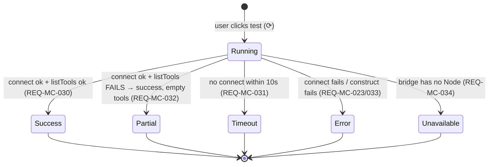

# Design — MCP client (P8)

> Three parts. **A — UX** (the MCP settings flows + states empty/list/add-edit/test-running/test-ok/
> test-error/connect-fail, the selector listing enabled servers, keyboard + a11y). **B — UI** (the Vue
> component + modal inventory via the modal seam, the expanded `McpSelector`, the `mcp-*` `--sp-*`
> token slice, microcopy en+de, no `v-html`). **C — Architecture** (system overview; `McpConfigStorePort`
> + pure `McpConfigParser` + `McpServerManager` use case + `McpClientPort` transport + the additive
> runtime seam + the P7 approval composition; the three-bridge story; the externals/dependency
> decision; the data flow; DDD placement + narrow-port discipline; the security analysis; the ADR-MC
> list). The five CLARs resolve as **ADR-MC-001..003** (accepted, autonomous-drive).

This phase layers on the **merged P1–P7 surface**. It backs one honest seam shipped earlier and
composes with two engines:

1. **The P6 MCP selector** (`McpSelector.vue` + `ToolbarCapabilities.supportsMcpTools`, a visible-empty
   "MCP servers arrive in a later release" panel reading `McpWidgetVm`). P8 **backs it** (ADR-MC-003 §3):
   the selector lists every managed server with its enabled state + a count badge, and toggling a server
   enables/disables it — replacing the P6 empty panel **once at least one server is configured**.
2. **The P7 approval engine** (`ApprovalManager` behind `ChatRuntimePort.setApprovalCallback`). An MCP
   tool call is gated by the **unchanged, tool-agnostic** P7 path — an MCP tool is not auto-trusted
   (ADR-MC-003 §4).
3. **The additive runtime seam** — the EXCLUDED `ChatRuntimeQueryOptions.enabledMcpServers?`
   (`ChatTurn.ts:51`) is introduced additively + guarded-folded (ADR-MC-003 §1).

The invariant (G6, REQ-MC-082, NFR-MC-001): **with no MCP server configured, P1–P7 behaves
byte-identically** — the selector keeps its P6 empty seam, the toolbar is unchanged, the runtime query
omits `enabledMcpServers`. The MCP config is a **vault** artifact (`.claude/mcp.json`), the only seam
that diverges from the device-local storage precedent — and it diverges precisely because the Claude CLI
must read it (ADR-MC-001). The Vue layer never imports `obsidian`/`node:*`; the real SDK transports live
in coverage-excluded infra.

---

## Part A — UX

### A.0 The surfaces this layers on

P6 ships the toolbar MCP selector as a visible-empty seam (the `🔌` icon + a count-0 badge; opening
shows "MCP servers arrive in a later release"), hidden entirely when `!supportsMcpTools`. P8 adds the
**MCP settings surface** (the managed-server list + add/edit modal + test-result modal), makes the P6
selector live, and threads enabled servers into the turn. The settings + modal + selector surfaces
render through the `mcp-settings` / `mcp-modal` / `mcp-selector` `--sp-*` slice (charter §3.10).

### A.1 The MCP settings surface — states (REQ-MC-040/041)

The settings section renders **only while the active provider reports `supportsMcpTools:true`** (Claude;
hidden for non-Claude, REQ-MC-041). It has three top-level states:

```
EMPTY (no .claude/mcp.json or no servers)              LIST (≥ 1 managed server)
┌── MCP servers ──────────────────────────────┐       ┌── MCP servers ──────────────────────────┐
│  No MCP servers yet.                         │       │  fs       stdio   [✓ enabled]  ⚙ ✕ ⟳     │
│  [ + Add server ]   [ Paste config ]         │       │  search   http    [  enabled]  ⚙ ✕ ⟳     │
└──────────────────────────────────────────────┘       │  [ + Add server ]   [ Paste config ]     │
                                                        └──────────────────────────────────────────┘
```

- **EMPTY** (REQ-MC-002/082) — "No MCP servers yet." + the add/paste affordances. The byte-identical
  no-servers default for the chat surface (the selector keeps its P6 empty seam).
- **LIST** (REQ-MC-040) — each managed server renders its **name**, **transport type** (stdio/sse/http,
  from `getMcpServerType`), an **enabled toggle**, and per-server actions **edit (⚙) / remove (✕) /
  test (⟳)**. Each row carries a stable `data-testid` (`mcp-server-row`, `mcp-server-name`,
  `mcp-server-type`, `mcp-server-enabled`, `mcp-server-edit`, `mcp-server-remove`, `mcp-server-test`).

### A.2 Add / edit a server (REQ-MC-010/011/012/042/043)

The add + edit flow opens a **modal** (the established modal seam, A.0 / B.1 — never `window.prompt`):

```
┌── Add MCP server ──────────────────────────────────────┐
│  Name        [ fs                                 ]     │   (required; REQ-MC-011)
│  Config      [ { "command": "npx", "args": [...] } ]    │   (JSON; or pasted, REQ-MC-043)
│  Description [ Filesystem tools                   ]     │   (optional)
│  ☐ Context-saving (inject tools only when @-mentioned)  │   (REQ-MC-012/053)
│                                   [ Cancel ]  [ Save ]  │
└──────────────────────────────────────────────────────────┘
```

- **Name required + unique** (REQ-MC-011) — an empty or duplicate name shows an inline error and the
  Save is blocked; the existing server is never overwritten.
- **Config** — a JSON config; the **paste path** (REQ-MC-043) parses the four formats (REQ-MC-003): a
  format-2 paste (single server, no name) sets `needsName` → the name field is required/focused before
  Save; a **malformed paste shows the parse error** (REQ-MC-004 — "Invalid JSON" / "Invalid MCP
  configuration format") and adds nothing.
- **Edit** (REQ-MC-012) — the modal pre-fills the server's config / description / context-saving; Save
  replaces that entry + persists.
- **Context-saving** (REQ-MC-012/053) — a checkbox; when on, the server's tools are injected into a turn
  only when @-mentioned (the @-mention trigger is NG3/deferred — P8 wires the gating with an empty
  mention set, so a context-saving server is pre-registered-disabled).

### A.3 Test a server — states (REQ-MC-044/030/031/032/033/034)

The test action opens the **test-result modal** with a state machine:



```
RUNNING                          SUCCESS                                   ERROR / TIMEOUT / UNAVAILABLE
┌── Testing fs ──────┐           ┌── fs — connected ─────────────────┐     ┌── fs — failed ──────────────┐
│  ⟳ Connecting…     │           │  server-filesystem  v1.2.0        │     │  Connection timeout (10s)   │
│  (≤ 10s)           │           │  Tools                            │     │  (or the underlying message)│
└─────────────────────┘          │   ☑ read        ☐ write           │     │  (or: MCP testing requires  │
                                  │   ☑ search                        │     │   the desktop app)          │
                                  │                       [ Close ]   │     │                  [ Close ]  │
                                  └────────────────────────────────────┘     └──────────────────────────────┘
```

- **Running** — a spinner during the ≤ 10s probe (REQ-MC-044/031).
- **Success** — the server name/version header + the **per-tool list with enable/disable checkboxes**
  (REQ-MC-030/044). Disabling a tool records it in `disabledTools` (REQ-MC-016) → the tool is added to
  the runtime disallowed list (`mcp__<server>__<tool>`, REQ-MC-054) and persisted.
- **Partial** (REQ-MC-032) — connect-ok but list-tools-failed renders as success with an empty tool list
  (not an error).
- **Timeout** (REQ-MC-031) — after 10s, "Connection timeout (10s)".
- **Error** (REQ-MC-023/033) — the underlying friendly message ("Missing command" / a spawn/URL error);
  the host stays responsive.
- **Unavailable** (REQ-MC-034) — on a non-Node bridge (the GitHub Pages demo) the modal reports "MCP
  testing requires the desktop app" without attempting a connection.

`data-testid`: `mcp-test-modal`, `mcp-test-running`, `mcp-test-success`, `mcp-test-tool`,
`mcp-test-tool-toggle`, `mcp-test-error`, `mcp-test-unavailable`, `mcp-test-close`.

### A.4 The selector lists + toggles enabled servers (REQ-MC-050/051/082)

The P6 selector becomes live **once at least one server is configured**:

```
P6 (no servers) — UNCHANGED               P8 (≥ 1 server)
┌─ [🔌 0] ─┐                              ┌─ [🔌 1] ──────────────────────┐
│ MCP servers arrive in │                 │  ☑ fs       (stdio)            │
│ a later release       │                 │  ☐ search   (http)             │
└────────────────────────┘                └────────────────────────────────┘
```

- **No server configured** → the selector keeps its P6 visible-empty seam, count badge 0 (REQ-MC-082).
- **≥ 1 server** → the dropdown lists every managed server with its enabled toggle; the badge shows the
  **enabled count** (REQ-MC-050/015). Toggling a server enables/disables it + updates the badge
  (REQ-MC-051). `data-testid`: `toolbar-mcp` (the P6 shell), `mcp-selector-server`,
  `mcp-selector-toggle`, `mcp-selector-badge`.

### A.5 The turn + the approval gate (REQ-MC-052/053/054/065/071)

- An enabled (active) server's tools reach the turn via the additive `enabledMcpServers?`
  (REQ-MC-052); disabled tools are in the disallowed list and never callable (REQ-MC-054).
- When the agent calls an MCP tool, the **unchanged P7 inline approval block** is shown (on no-matching-
  rule + `normal` mode) — an MCP tool is gated exactly as any other tool (REQ-MC-065). The user sees the
  same deny / allow-once / always-allow / always-deny row (no new MCP approval surface, NG4).
- **Graceful degradation** (REQ-MC-071/072) — a malformed or unreachable server surfaces a non-blocking
  `NotificationPort` notice and the chat continues with the working servers; one bad server never crashes
  the view or breaks unrelated servers. No secret value appears in a notice or log (REQ-MC-072).

### A.6 Accessibility (WCAG 2.2 AA, NFR-MC-008, REQ-MC-070)

- **The selector** keeps its P6 `aria-expanded`; each server toggle is keyboard-operable (focus,
  Enter/Space) and exposes its enabled state (`role="switch"`/`aria-checked` or a labelled checkbox).
- **The settings list** — each row's edit/remove/test action + enabled toggle is a focusable control with
  an accessible name ("Edit server: fs", "Remove server: fs", "Test server: fs"); the list is keyboard-
  navigable.
- **The modals** — focus is trapped + restored on close, Escape closes, the name/config fields have
  associated labels, the submit/cancel buttons are keyboard-operable; the test modal announces the
  running → result transition (a polite live region).
- **Focus** is managed + visible; **forced-colors** + **reduced-motion** are honoured (state cues are
  text + border + icon, never colour-only) — asserted in component tests.

---

## Part B — UI

### B.1 Component + modal inventory

Each `<script setup>`, each mounted component with a co-located `data-testid` PageObject (`.po.ts`)
(NFR-MC-005/007). **No component imports `obsidian` or `node:*`** — servers, test results, and parse
errors arrive as DTOs from the use case / view-model; the modals open through a **modal seam** (an
`OpenMcpServerModalFn` / `OpenMcpTestModalFn` injected function, mirroring the P5 inline-edit/image modal
seam), so the Obsidian `Modal` host lives in the plugin layer and the Vue layer never touches it. No
`v-html` (NFR-MC-007).

| Component | Responsibility | data-testid | New/changed |
|---|---|---|---|
| `chat/mcp/McpSettingsManager.vue` | the managed-server list surface — empty / list states; each row's name · type · enabled toggle · edit/remove/test (REQ-MC-040/041/013/014) | `mcp-settings` | new |
| `chat/mcp/McpServerRow.vue` | one server row (name · transport type · enabled toggle · edit/remove/test actions) (REQ-MC-040) | `mcp-server-row` | new |
| `chat/mcp/McpServerModal.vue` | add/edit a server — name (required/unique) · config (JSON or pasted, REQ-MC-003/004/043) · description · context-saving; opened via the modal seam (REQ-MC-010/011/012/042) | `mcp-server-modal` | new |
| `chat/mcp/McpTestModal.vue` | the test-result modal — running spinner → server header + per-tool enable/disable checkboxes (REQ-MC-016/030/044) OR timeout/error/unavailable (REQ-MC-031/032/033/034) | `mcp-test-modal` | new |
| `chat/toolbar/McpSelector.vue` | the P6 selector EXPANDED — lists managed servers + enabled toggles + count badge once ≥ 1 server; keeps the P6 empty seam at 0 (REQ-MC-050/051/082) | `toolbar-mcp` | changed |

The modal seam keeps the DOM rules (NFR-MC-007): the blocking add/edit + test flows are Obsidian
`Modal` subclasses hosted in the plugin layer; the Vue components inside them build DOM declaratively
(no `innerHTML`/`v-html`, no `window.confirm`/`prompt`). The remove confirmation is an Obsidian `Modal`
(not `window.confirm`).

### B.2 `--sp-*` token slice (charter §3.10 `mcp-modal` / `mcp-settings` / `mcp-selector`)

Reuse the existing token set (`--sp-border`, `--sp-radius-*`, `--sp-bg-*`, `--sp-surface-overlay`,
`--sp-text-*`, `--sp-accent`, `--sp-space-*`, `--sp-font-*`, the P6 `--sp-toggle-track`/
`--sp-toggle-thumb`/`--sp-toggle-active`, `--sp-toolbar-widget-h`, `--sp-z-dropdown`,
`--sp-shadow-dropup`). **No hex, no raw Obsidian var, no physical-direction CSS property** —
`lint-style-tokens` guard (NFR-MC-009, REQ-MC-045). Mint only the genuinely-new tokens, each justified
at review against a Claudian `mcp-modal.css` / `mcp-settings.css` / `mcp-selector.css` rule:

| New token (only if not already present) | Surface | Maps to Claudian |
|---|---|---|
| `--sp-mcp-row-gap` | settings list rows | `mcp-settings.css` list spacing (reuse `--sp-space-2` if equivalent) |
| `--sp-mcp-status-ok` | test-success header | the connected/success state colour (reuse `--sp-status-success` if equivalent) |
| `--sp-mcp-status-error` | test-error message | the failed-connection state colour (reuse `--sp-status-error` if equivalent) |
| `--sp-mcp-selector-badge` | selector enabled-count badge | `mcp-selector.css` badge fill (reuse `--sp-accent` if equivalent) |

> Prefer reuse over a near-duplicate. Each minted token is checked against a `mcp-*.css` rule at review
> (NFR-MC-009). Perceptual parity at 320/520/720, light + dark (B.4).

### B.3 Microcopy / i18n (en + de, NFR-MC-006 a11y / charter §3.9 i18n)

All new strings go through the existing `TranslationPort` / `vue-i18n` with English + German keys (like
P5/P6/P7; full 10-locale parity is P11). The P6 deferred-MCP string (`agent.chat.toolbar.mcp.empty`) is
**kept** (it is still the no-servers seam, REQ-MC-082). New keys:

| Key | en |
|---|---|
| `agent.chat.mcp.settings.title` | "MCP servers" |
| `agent.chat.mcp.settings.empty` | "No MCP servers yet." |
| `agent.chat.mcp.settings.add` | "Add server" |
| `agent.chat.mcp.settings.paste` | "Paste config" |
| `agent.chat.mcp.row.edit` | "Edit server: {name}" |
| `agent.chat.mcp.row.remove` | "Remove server: {name}" |
| `agent.chat.mcp.row.test` | "Test server: {name}" |
| `agent.chat.mcp.row.enabled` | "Enabled" |
| `agent.chat.mcp.modal.addTitle` | "Add MCP server" |
| `agent.chat.mcp.modal.editTitle` | "Edit MCP server" |
| `agent.chat.mcp.modal.name` | "Name" |
| `agent.chat.mcp.modal.config` | "Config" |
| `agent.chat.mcp.modal.description` | "Description" |
| `agent.chat.mcp.modal.contextSaving` | "Context-saving (inject tools only when @-mentioned)" |
| `agent.chat.mcp.modal.nameRequired` | "A server name is required." |
| `agent.chat.mcp.modal.nameDuplicate` | "A server named “{name}” already exists." |
| `agent.chat.mcp.modal.parseError` | "Could not parse the config: {reason}" |
| `agent.chat.mcp.modal.save` | "Save" |
| `agent.chat.mcp.modal.cancel` | "Cancel" |
| `agent.chat.mcp.test.running` | "Connecting…" |
| `agent.chat.mcp.test.toolsHeading` | "Tools" |
| `agent.chat.mcp.test.timeout` | "Connection timeout (10s)" |
| `agent.chat.mcp.test.unavailable` | "MCP testing requires the desktop app." |
| `agent.chat.mcp.test.close` | "Close" |
| `agent.chat.mcp.selector.badge` | "{count} enabled" |
| `agent.chat.mcp.notice.serverFailed` | "MCP server “{name}” is unreachable — continuing without it." |
| `agent.chat.mcp.notice.saveFailed` | "Could not save the MCP config." |

No hardcoded user-facing string in any new/changed component; no server config value (auth header / env)
appears in any notice or log (NFR-MC-003, REQ-MC-072).

### B.4 Parity-screenshot plan (deferred to the single final review gate)

Per charter §5.1, parity screenshots vs claudian at **320 / 520 / 720 px, light + dark**: (1) the MCP
settings empty + list states, (2) the add/edit modal (incl. the paste + name-required + parse-error
states), (3) the test modal in each state (running / success-with-tools / partial / timeout / error /
unavailable), (4) the expanded selector with mixed enabled/disabled servers + the count badge, (5) the
no-servers selector seam (the P6 byte-identical state). These accumulate for the single final human
review gate (autonomous-drive directive).

---

## Part C — Architecture

### C.1 System overview

```mermaid
flowchart TD
    subgraph ui[ui (Vue, no obsidian/node)]
        settings[McpSettingsManager.vue + McpServerRow.vue]
        smodal[McpServerModal.vue — modal seam]
        tmodal[McpTestModal.vue — modal seam]
        selector[McpSelector.vue — expanded list+toggle+badge]
        surface[ChatSurface — owns the MCP view-model, registers nothing new in the gate]
    end
    subgraph app[application]
        mgr[McpServerManager — lifecycle + getActiveServers + disallowed tools]
        approval[ApprovalManager (P7, UNCHANGED) — decides MCP tool calls]
        foldmcp[foldEnabledMcpServers — pure, guarded]
        vm[buildMcpViewModel — pure selector/settings VM]
    end
    subgraph domain[domain]
        parser[McpConfigParser — PURE: 4 formats → Result; getMcpServerType; isValidMcpServerConfig]
        codec[mcp config codec — PURE: ManagedMcpServer[] ⇄ .claude/mcp.json]
        types[ManagedMcpServer / McpServerConfig / McpTool / McpTestResult / EnabledMcpServers]
        cport[McpConfigStorePort]
        clport[McpClientPort]
        cqo[ChatRuntimeQueryOptions.enabledMcpServers? — additive]
    end
    subgraph plugin[plugin (owns obsidian + node + the SDK)]
        bridges[ObsidianBridge real SDK transports / MockBridge scriptable / LocalStorageBridge inert]
        modals[Obsidian Modal hosts for the server/test modals]
    end
    settings --> mgr
    smodal --> mgr
    tmodal --> mgr
    selector --> vm
    selector -->|toggle| mgr
    mgr --> parser
    mgr --> codec
    mgr --> cport
    mgr --> clport
    mgr -->|getActiveServers ∅| foldmcp --> cqo
    cqo -.->|read by Claude runtime| bridges
    surface -->|MCP tool approval req| approval
    cport --> bridges
    clport --> bridges
    smodal -.->|opened via seam| modals
    tmodal -.->|opened via seam| modals
```

### C.2 Components & responsibilities

| Layer | Component | Responsibility | New/changed |
|---|---|---|---|
| domain | `chat/mcp/McpTypes.ts` | `ManagedMcpServer` / `McpServerConfig` (stdio/sse/http union) / `McpServerType` / `McpTool` / `McpTestResult` / `ParsedMcpConfig` / `EnabledMcpServers` / `DEFAULT_MCP_SERVER` (regrow from Claudian `core/types/mcp.ts`) | new |
| domain | `chat/mcp/McpConfigParser.ts` | PURE: `parseClipboardConfig(json) → Result<ParsedMcpConfig>` (the 4 formats), `getMcpServerType`, `isValidMcpServerConfig` — throws converted to `Result.err` (ADR-MC-001 §3, REQ-MC-003/004/005/006) | new |
| domain | `chat/mcp/McpConfigCodec.ts` | PURE: `ManagedMcpServer[]` ⇄ `.claude/mcp.json` document (parse-on-load + serialise-on-save with non-default `_claudian` pruning) (REQ-MC-001/007) | new |
| domain | `chat/mcp/parseCommand.ts` | PURE: `parseCommand`/`splitCommandString` (the stdio command split — no shell) (REQ-MC-020/061) | new |
| domain | `chat/mcp/getActiveServers.ts` | PURE: the active-set + disallowed-tools fold (`getActiveServers(servers, mentioned)` + `getAllDisallowedMcpTools`) — Claudian semantics (REQ-MC-052/053/054) | new |
| domain | `chat/ChatTurn.ts` | append `enabledMcpServers?: EnabledMcpServers` to `ChatRuntimeQueryOptions` (the EXCLUDED field, additive; P0–P7 byte-identical) (ADR-MC-003 §1) | changed (additive) |
| domain | `ports/McpConfigStorePort.ts` | `load`/`save`/`exists`, all `Promise<Result<…>>` (ADR-MC-001 §2) | new |
| domain | `ports/McpClientPort.ts` | `isAvailable`/`test`/`connect`/`listTools`/`callTool`/`disconnect` (ADR-MC-002 §1) | new |
| application | `chat/mcp/McpServerManager.ts` | the use case: lifecycle (add/edit/remove/setEnabled/setToolDisabled, `Result`), `getEnabledCount`, `getActiveServers(∅)` over the two ports; holds the loaded list (ADR-MC-003 §2) | new |
| application | `chat/mcp/foldEnabledMcpServers.ts` | PURE guarded fold — write `enabledMcpServers` ONLY when the active set is non-empty (ADR-MC-003 §1) | new |
| application | `chat/mcp/buildMcpViewModel.ts` | PURE: the selector + settings VM (servers + enabled state + count; empty-seam vs list) (ADR-MC-003 §3) | new |
| ui | `chat/mcp/McpSettingsManager.vue` + `McpServerRow.vue` | the list surface (B.1) | new |
| ui | `chat/mcp/McpServerModal.vue` + `McpTestModal.vue` | add/edit + test-result, via the modal seam (B.1) | new |
| ui | `chat/toolbar/McpSelector.vue` | EXPANDED — list + toggle + badge (B.1) | changed |
| ui | `composables/useMcpConfigStorePort.ts` + `useMcpClientPort.ts` | inject `MCP_CONFIG_STORE_PORT` / `MCP_CLIENT_PORT` (one-port-one-composable, ADR-008) | new |
| infrastructure | three bridges | implement `McpConfigStorePort` (Obsidian `VaultPort`-backed / Mock in-memory doc / LS browser-localStorage) + `McpClientPort` (Obsidian real SDK transports coverage-excluded / Mock scriptable / LS inert) (ADR-MC-001/002) | changed |
| infrastructure | `bridge/ports.ts` | add `MCP_CONFIG_STORE_PORT` + `MCP_CLIENT_PORT` InjectionKeys | changed (additive) |
| plugin | the Obsidian `Modal` hosts | host the server/test modals (the modal seam target) | new |

### C.3 Additive domain changes

```ts
// src/domain/chat/mcp/McpTypes.ts — new (regrow from Claudian core/types/mcp.ts, ADR-MC-001/002/003)
export interface ManagedMcpServer {
  name: string;
  config: McpServerConfig;            // stdio { command, args?, env? } | sse { type:'sse', url, headers? } | http { type:'http', url, headers? }
  enabled: boolean;
  contextSaving: boolean;
  disabledTools?: string[];
  description?: string;
}
export interface McpTool { name: string; description?: string; inputSchema?: Record<string, unknown>; }
export interface McpTestResult { success: boolean; serverName?: string; serverVersion?: string; tools: McpTool[]; error?: string; }
/** The folded active set + disallowed tools threaded to a turn (ADR-MC-003 §1). */
export interface EnabledMcpServers {
  servers: Record<string, McpServerConfig>;     // active (enabled ∧ (¬contextSaving ∨ mentioned))
  disallowedTools: readonly string[];           // mcp__<server>__<tool> for disabled tools
}

// src/domain/chat/ChatTurn.ts — APPENDED after permissionMode (P0–P7 members byte-identical; ADR-MC-003 §1)
export interface ChatRuntimeQueryOptions {
  // model? / forceColdStart? / appendSystemPrompt? / mode? / reasoning? / serviceTier? / permissionMode?  — UNCHANGED
  enabledMcpServers?: EnabledMcpServers;   // P8 additive; absent/empty ⇒ byte-identical to P7. externalContextPaths? stays EXCLUDED.
}
```

One additive optional, mirroring how P6/P7 appended `mode`/`reasoning`/`serviceTier`/`permissionMode`.
The guarded fold (`foldEnabledMcpServers`) writes it only for a non-empty active set, so a no-servers
turn folds nothing (REQ-MC-082, NFR-MC-001). `externalContextPaths?` stays EXCLUDED (a later phase).

### C.4 The two ports + the pure parser + the three-bridge story

**`McpConfigStorePort` (config, VAULT-backed — ADR-MC-001).** `load`/`save`/`exists`, all
`Promise<Result<…>>`. Models the `.claude/mcp.json` document round-trip via the pure `McpConfigCodec`
(parse-on-load, serialise-on-save with non-default `_claudian` pruning). Its own `InjectionKey`
(`MCP_CONFIG_STORE_PORT`) + composable; one consumer (`McpServerManager`), no aggregate (ADR-008,
REQ-MC-081). The pure parser + codec carry the automated coverage; only the vault read/write is in the
bridge.

**`McpClientPort` (transport — ADR-MC-002).** `isAvailable`/`test`/`connect`/`listTools`/`callTool`/
`disconnect`. `test` returns a structured `McpTestResult` (never throws); the live methods are
`Result`-typed. Its own `InjectionKey` (`MCP_CLIENT_PORT`) + composable; one consumer, no aggregate.

| Port | `ObsidianBridge` | `MockBridge` | `LocalStorageBridge` |
|---|---|---|---|
| `McpConfigStorePort` | `VaultPort.readFile`/`writeFile`/`fileExists` on `.claude/mcp.json` (the Claude-CLI-readable vault file, REQ-MC-001/007) | **in-memory** document — seed servers; force a parse/save fault for the malformed/save-fail tests | browser `localStorage` document (GitHub Pages demo can manage config) |
| `McpClientPort` | the **real SDK transports** in coverage-excluded `src/infrastructure/obsidian/**`: stdio (bounded spawn) / SSE / HTTP over the Node fetch + 10s timeout (REQ-MC-020..023/030..034/061..064); `isAvailable() → true` | **scriptable** — canned `test`/`listTools`/`callTool` results per server name + failure/timeout/partial injection; `isAvailable() → true` | **inert** — `isAvailable() → false`; `test`/`connect` return the "unavailable" result, no connection (REQ-MC-034) |

`fake-ports.ts` grows an `mcpConfigStore` (in-memory doc, fault switch) + an `mcpClient` (scriptable,
failure/timeout/partial switches) so the manager + selector + modal + settings tests run without
Obsidian / Node.

**The pure `McpConfigParser`** (domain, REQ-MC-003/004/005/006): the four formats →
`Result<ParsedMcpConfig>`, `getMcpServerType` (sse|http|stdio; bare-url → http), `isValidMcpServerConfig`
(non-empty `command` or `url`). Claudian's throw paths become `Result.err` (ADR-004).

### C.5 The externals / dependency decision (ADR-MC-002 §3)

`@modelcontextprotocol/sdk` is a **new runtime dependency** (CLAR-MC-003): the only sanctioned MCP
client/transport implementation, MIT-licensed, Anthropic-maintained, no in-tree alternative — rationale
recorded in the implementing PR per AGENTS.md §8. It is bundled into the plugin `main.js` like
`@anthropic-ai/claude-agent-sdk`; its Node-only entry points (`node:http`/`https`, the subprocess
transport) are covered by the existing plugin-build externals (`vite.config.ts` `ALL_EXTERNALS` =
`OBSIDIAN_EXTERNALS` + `builtinModules` + `node:` forms). The **standalone `build:web` build never sees
it**: the real `McpClientPort` lives only in `src/infrastructure/obsidian/**`, which the standalone
entry (`src/ui/main.ts` → `MockBridge`) never imports — so the standalone build (which sets no
`external`) never encounters a `node:*`/SDK import. This is the same CM6/SDK precedent already proven in
the codebase. `manifest.json` identity is untouched (NFR-MC-010).

### C.6 Data flow — primary scenarios

1. **Load:** `McpServerManager` → `McpConfigStorePort.load` → the Obsidian bridge reads
   `.claude/mcp.json` → the pure codec parses `mcpServers` + the `_claudian` sidecar → `ManagedMcpServer[]`;
   absent/empty/unparseable → `ok([])` (REQ-MC-001/002).
2. **Add (paste):** `McpServerModal` → `McpConfigParser.parseClipboardConfig` → on `needsName` ask for a
   name; on malformed → the parse error, add nothing (REQ-MC-003/004/043) → `McpServerManager.add`
   (reject empty/duplicate, REQ-MC-011) → `store.save` (codec prunes non-default metadata, REQ-MC-007).
3. **Edit / remove / enable-disable / tool-disable:** `McpServerManager.{edit,remove,setEnabled,
   setToolDisabled}` → mutate the list → `store.save` (REQ-MC-012/013/014/016).
4. **Test:** the row's test action → `McpClientPort.test(server)` → the Obsidian bridge builds the SDK
   transport (stdio spawn / SSE / HTTP over the Node fetch), connects with a 10s abort, lists tools →
   `McpTestResult` (success / partial / timeout / error); the LS bridge returns unavailable
   (REQ-MC-030..034). The modal renders the state (A.3); a per-tool toggle → `setToolDisabled` (REQ-MC-016).
5. **Selector list + toggle:** `buildMcpViewModel(servers)` → the expanded `McpSelector` lists servers +
   the enabled count; a toggle → `McpServerManager.setEnabled` → re-fold the badge (REQ-MC-050/051/015).
6. **Turn:** on submit, `McpServerManager.getActiveServers(∅)` → the pure fold → `foldEnabledMcpServers`
   writes `queryOptions.enabledMcpServers` **only if non-empty** → the Claude runtime advertises the
   active servers' tools + the disallowed list (REQ-MC-052/053/054); with no enabled server the field is
   omitted (byte-identical, REQ-MC-082).
7. **MCP tool approval:** the runtime requests approval for `mcp__fs__read` → the P7
   `ApprovalManager.decide({ toolName:'mcp__fs__read', actionPattern }, mode)` → mode gate → match →
   auto OR the unchanged P4 inline block; `*-always` persists a rule (REQ-MC-065). No MCP special-case.
8. **Bad server:** an unreachable server's `connect`/`test` returns a structured error → a non-blocking
   `NotificationPort` notice; the chat continues with the working servers (REQ-MC-071/072).
9. **No-servers default:** no `.claude/mcp.json` → empty list → the selector keeps the P6 seam → a turn
   folds no `enabledMcpServers` → byte-identical to P7 (REQ-MC-082, NFR-MC-001).

### C.7 Edge cases

- **Empty / unparseable `.claude/mcp.json`** — `load` returns `ok([])` (load-or-default, no migration);
  a server entry failing `isValidMcpServerConfig` is skipped, not fatal (REQ-MC-001/002, CHARTER-REQ-FRESH).
- **Malformed paste** — `parseClipboardConfig` returns `Result.err`; the modal shows the reason, adds
  nothing, the stored config is unchanged (REQ-MC-004).
- **Duplicate / empty name on add** — `Result.err`; the existing server is unchanged (REQ-MC-011).
- **stdio empty command** — `parseCommand` yields `cmd:''` → `McpClientPort.test` returns
  `{ success:false, error:'Missing command' }` (REQ-MC-023).
- **Malformed URL (sse/http)** — `new URL` throws inside the bridge → caught → `{ success:false, error:'Invalid server configuration' }` (REQ-MC-023).
- **Connect-ok but list-tools-fails** — `{ success:true, tools:[] }` (partial success, REQ-MC-032).
- **10s timeout** — the `AbortController` aborts → `{ success:false, error:'Connection timeout (10s)' }` (REQ-MC-031).
- **Non-Node bridge (GitHub Pages)** — `isAvailable() === false`; `test` returns unavailable, no spawn/
  fetch (REQ-MC-034); config management still works (the config store is functional).
- **Context-saving enabled server, empty mention set** — excluded from the active set, its disabled tools
  pre-registered in the disallowed list (REQ-MC-053).
- **Disabled tool** — `mcp__<server>__<tool>` is in `disallowedTools`; the agent cannot call it
  (REQ-MC-054); if it somehow requests it, the P7 gate still applies (REQ-MC-065).
- **Concurrent test + edit** — a test reads the server snapshot at test time; an edit during a test does
  not mutate the in-flight probe (spec-level ordering to pin in `spec.md`).
- **Secret-bearing config** — stored as authored (no duplication, no eval); never echoed to a notice/log
  (REQ-MC-063/072, NFR-MC-003).

### C.8 Security analysis (NFR-MC-002/003/011, REQ-MC-061..065)

- **stdio spawn is bounded + explicit** (REQ-MC-061, NFR-MC-002) — the parsed `cmd`+`args` (the pure
  no-shell `parseCommand`), env `{ ...process.env, ...config.env, PATH: enhancedPath }`, `stderr:'ignore'`;
  no `shell:true`, no string-eval of user input — the same posture as `ShellExecPort`.
- **User-explicit servers only** (REQ-MC-062) — the manager loads only `.claude/mcp.json` + servers the
  user adds; no auto-discover / auto-enable / auto-spawn. A fresh vault spawns nothing.
- **Config is inert data, no plaintext-secret duplication** (REQ-MC-063, NFR-MC-003) — the config is
  parsed JSON, never eval-ed; any user-authored auth (`headers`/`env`) stays in the config the user
  wrote; P8 introduces no separate plaintext secret store (`SecretStorePort` editor deferred,
  CLAR-MC-004). No secret appears in a notice or log (REQ-MC-072).
- **Remote probing bypasses renderer CORS without weakening TLS** (REQ-MC-064) — the Node `http`/`https`
  fetch + the official SDK transports; TLS verification is not disabled; the 10s abort is honoured.
- **MCP tool calls are not auto-trusted** (REQ-MC-065) — every MCP tool call routes through the
  unchanged P7 `ApprovalManager` gate (mode gate → rule match → prompt); deny-wins + the explicit P7
  posture apply equally to MCP tools.
- **Graceful degradation** (REQ-MC-071) — a malformed/unreachable server is a structured `Result.err`/
  `{ success:false }`, surfaced as a notice; never a throw across a port boundary; the chat continues.

### C.9 QA seam, Result boundary, constraints

- **QA seam:** the pure parser/codec/`getActiveServers`/`parseCommand`/`foldEnabledMcpServers`/
  `buildMcpViewModel` (domain + application, no I/O) + the `McpServerManager` lifecycle (over the
  scriptable fake ports) + the leaf components (props in, events out) are testable in isolation; mounted
  components get co-located `data-testid` PageObjects (NFR-MC-005); the transport matrix
  (success/partial/timeout/error/unavailable) is driven by the scriptable Mock `McpClientPort`
  (REQ-MC-080).
- **Result boundary:** every store/client port method returns `Result` (or a structured `McpTestResult`);
  the parser/codec are total `Result`-returning; no exception crosses a port boundary (NFR-MC-004,
  ADR-004).
- **DOM rules:** the settings list, selector, and modals are declarative Vue — no `v-html`/`innerHTML`,
  no `window.confirm`/`alert`/`prompt`; the add/edit + test + remove-confirm flows use the Obsidian
  `Modal` seam (NFR-MC-007, REQ-MC-042).
- **Dependency / coverage:** `@modelcontextprotocol/sdk` is the one new runtime dep (rationale recorded,
  AGENTS.md §8); the real transports are coverage-excluded `obsidian/**`; the suite meets 80/70/80/80 on
  the Mock-driven legs (NFR-MC-006/010, REQ-MC-080).
- **Identity / manifest:** no secret in any DTO/field beyond the user-authored config; nothing
  device-local introduced by P8 (the config is the vault file); `manifest.json` untouched; no migration
  (NFR-MC-010, CHARTER-REQ-FRESH).
- **Narrow-port discipline:** `McpConfigStorePort` + `McpClientPort` each have their own InjectionKey +
  composable, one consumer each, no aggregate; ESLint forbids Vue importing `obsidian`/`node:*`
  (NFR-MC-005, REQ-MC-081).

### C.10 ADR-MC list (status accepted)

| ADR | Decision | Ratifies | Status |
|---|---|---|---|
| **ADR-MC-001** | `McpConfigStorePort` (vault `.claude/mcp.json` + `_claudian` sidecar round-trip, `Result`-typed, default-pruning) + the PURE `McpConfigParser` (4 formats → `Result`); vault-file (diverges from the device-local precedent because the CLI must read it); no migration; no plaintext-secret duplication | CLAR-MC-001 + CLAR-MC-002 | accepted |
| **ADR-MC-002** | `McpClientPort` transport seam (test/connect/listTools/callTool/disconnect, structured/`Result`, never throws); real stdio (bounded spawn) / SSE / HTTP in coverage-excluded `obsidian/**` over `@modelcontextprotocol/sdk` (new runtime dep, externalized like `@codemirror/*`, rationale per AGENTS.md §8, never reaching `build:web`); Mock scriptable + LS inert | CLAR-MC-003 (+ CLAR-MC-004 transport/secret posture) | accepted |
| **ADR-MC-003** | additive `ChatRuntimeQueryOptions.enabledMcpServers?` (folded only when non-empty → byte-identical no-servers default) computed by the `McpServerManager` use case (lifecycle + pure `getActiveServers`/disallowed-tools, empty mention-set); the P6 selector lists + toggles; MCP tool calls route through the UNCHANGED tool-agnostic P7 `ApprovalManager`; no `providerId` branch | CLAR-MC-005 | accepted |

---

## Requirements coverage (Part C)

| REQ | Covered by |
|---|---|
| REQ-MC-001/002 | `McpConfigStorePort.load` + the pure codec (load-or-default, sidecar metadata) (ADR-MC-001, C.4/C.6) |
| REQ-MC-003/004 | the pure `McpConfigParser.parseClipboardConfig` (4 formats → `Result.err` on malformed) (ADR-MC-001 §3, C.4) |
| REQ-MC-005/006 | `getMcpServerType` + `isValidMcpServerConfig` (pure) (ADR-MC-001 §3) |
| REQ-MC-007 | `McpConfigStorePort.save` + the codec's non-default `_claudian` pruning (ADR-MC-001, C.4) |
| REQ-MC-010..014 | `McpServerManager` lifecycle (add/dup-reject/edit/remove/enable-disable) (ADR-MC-003 §2, C.2) |
| REQ-MC-015 | `getEnabledCount` → the selector badge (ADR-MC-003 §3, A.4) |
| REQ-MC-016 | `setToolDisabled` from the test modal → `disabledTools` (ADR-MC-003 §2, A.3) |
| REQ-MC-020..023 | `McpClientPort` stdio/SSE/HTTP transports + structured construct errors (ADR-MC-002, C.4) |
| REQ-MC-030..034 | `McpClientPort.test` (success/partial/timeout/error/unavailable) (ADR-MC-002 §1/§4, A.3) |
| REQ-MC-040/041 | `McpSettingsManager.vue` gated on `supportsMcpTools` (B.1, A.1) |
| REQ-MC-042/043 | `McpServerModal.vue` via the modal seam + the paste/parse path (B.1, A.2) |
| REQ-MC-044 | `McpTestModal.vue` state machine (B.1, A.3) |
| REQ-MC-045 | the `mcp-*` `--sp-*` token slice + `lint-style-tokens` (B.2) |
| REQ-MC-050/051 | the expanded `McpSelector.vue` (list + toggle + badge) (ADR-MC-003 §3, A.4) |
| REQ-MC-052 | the additive `enabledMcpServers?` + the guarded fold (ADR-MC-003 §1, C.3/C.6) |
| REQ-MC-053 | `getActiveServers(∅)` context-saving exclusion + pre-registered disabled tools (ADR-MC-003 §2) |
| REQ-MC-054 | disallowed `mcp__<server>__<tool>` never callable (ADR-MC-003 §2/§4) |
| REQ-MC-061..064 | bounded stdio spawn / explicit-add-only / inert config / Node fetch (ADR-MC-002, C.8) |
| REQ-MC-065 | MCP tool calls through the UNCHANGED P7 `ApprovalManager` gate (ADR-MC-003 §4, A.5/C.6) |
| REQ-MC-070 | keyboard-operable selector/list/modals + AT names (A.6) |
| REQ-MC-071/072 | graceful degrade + `NotificationPort` notices, no secret leak (C.8/C.9, A.5) |
| REQ-MC-080 | real transports coverage-excluded `obsidian/**`; Mock scriptable + LS inert (ADR-MC-002 §2/§4, C.4) |
| REQ-MC-081 | narrow `McpConfigStorePort`/`McpClientPort`, own keys/composables, no aggregate; no Vue `obsidian`/`node:*` (C.2/C.9) |
| REQ-MC-082 | no-servers default = byte-identical P1–P7 (the empty seam + omitted field) (ADR-MC-003 §1/§3, C.6) |
| NFR-MC-001..012 | additivity (C.3), security/spawn/secret (C.8), reliability/`Result` (C.9), DDD/ports (C.2/C.4), coverage (C.4/C.9), DOM (C.9/B.1), a11y (A.6), tokens (B.2), dep/manifest (C.5/C.9), privacy/desktop-only (C.5/C.8) |

## Open clarifications for the planner (Tasks)

- **None blocking.** All five CLARs resolve (ADR-MC-001..003 accepted). Implementation notes to carry
  into `spec.md`/`tasks.md` (spec-level field detail, not architecture):
  - **Concurrency / ordering** — a test that reads the server snapshot at test time; an edit during an
    in-flight probe does not mutate the probe; pin whether `store.save` is awaited before the row
    re-renders in `spec.md`.
  - **The `_claudian` codec round-trip fidelity** — pin that a save preserves any unknown top-level
    keys + any non-`servers` `_claudian` keys the file already had (Claudian `McpStorage.save` preserves
    `existing`), so editing in Specorator does not strip CLI-written fields; pin in `spec.md`.
  - **`McpClientPort.callTool` shape** — P8 ships the gating + the disallowed list; whether the live
    `connect`/`callTool` path is wired into the Claude runtime now or only `test` + the
    `enabledMcpServers` advertisement, with the SDK doing the actual call. Recommendation: the Claude
    runtime/SDK performs the tool call from the advertised `mcpServers` set (parity with Claudian
    feeding `getActiveServers` into the SDK); `McpClientPort.connect`/`callTool` exist for the tester +
    a future non-SDK transport but the turn-time call goes through the SDK. Pin the split in `spec.md`.
  - **Modal-seam function signatures** — pin `OpenMcpServerModalFn` (add/edit) + `OpenMcpTestModalFn`
    signatures (mirroring the P5 inline-edit/image modal seam) in `spec.md`.
  - Sequence the **pure domain** (types + parser + codec + `parseCommand` + `getActiveServers`) and the
    **additive `enabledMcpServers?`** as early tasks so the manager + UI build on frozen types; the two
    ports + three bridges follow; the `McpServerManager` use case + the UI (settings/modals/selector)
    last; the real SDK transport (coverage-excluded) is the final manual-leg task.
- **Found slightly over-specified (flagged, not blocking):**
  - The PRD pins `McpClientPort` with both `test` AND `connect`/`listTools`/`callTool` (REQ-MC-081
    audit ports table) while the turn-time tool call is performed by the Claude SDK from the advertised
    `mcpServers` set (REQ-MC-052). The design keeps all five verbs on the port (the tester needs
    `test`; `connect`/`listTools`/`callTool` are the seam for a future non-SDK / Mock-driven path) but
    marks `callTool` as not on the P8 turn-time critical path (the SDK calls it). Pin the verb scope
    in `spec.md` so the dev does not over-build a redundant turn-time call path.
  - The PRD specifies REQ-MC-053's context-saving pre-registration in detail while the @-mention trigger
    is NG3 (deferred). The design wires the gating with an empty mention set (so context-saving servers
    are inactive-but-pre-registered); the trigger plumbing is explicitly out of P8. Pin that the
    `mentionedNames` argument is always `∅` in P8 in `spec.md`.
