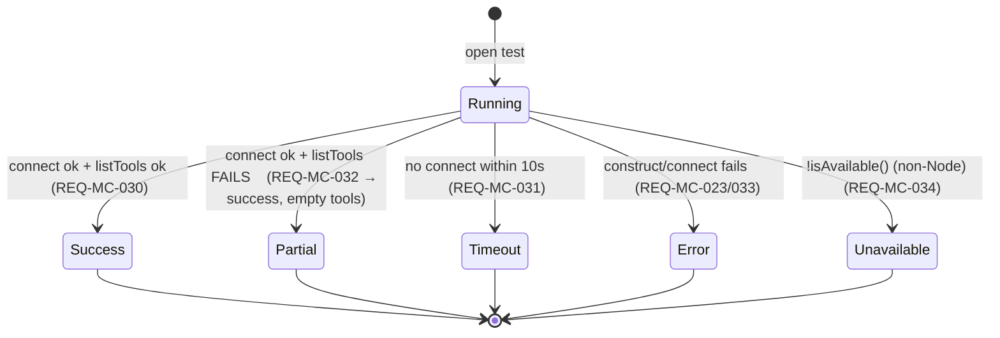

# Specification — MCP client (P8)

Implementation-ready contracts for P8. Every contract is grounded in `design.md` (DESIGN-MC-001), the
three accepted P8 ADRs (**ADR-MC-001/002/003**), the P6 MCP-selector seam + `ToolbarCapabilities.supportsMcpTools`
(`McpSelector.vue`, `ChatRuntimePort.ts:44`), the P7 `ApprovalManager` an MCP tool call routes through
unchanged (SPEC-AS-010, `setApprovalCallback`), the EXCLUDED `enabledMcpServers?` field (`ChatTurn.ts:51`),
the modal seam (`src/ui/chat/modalSeam.ts`), and Claudian's real code under `D:\Projects\claudian-main`
(`core/types/mcp.ts`, `core/mcp/McpConfigParser.ts`, `core/mcp/McpServerManager.ts`, `core/mcp/McpTester.ts`,
`utils/mcp.ts`, `providers/claude/storage/McpStorage.ts`). **Two independent teams should build the same
thing from this document.**

> **Conventions in force (inherited from P1–P7, do not relax):** DDD inward-only imports (ADR-001,
> `domain ← application ← infrastructure ← ui`, NFR-MC-005); narrow ports + three bridges (ADR-008,
> NFR-MC-005); `Result<T,E>` at every use-case boundary + every store method, **structured non-throwing
> results** for the client port, **pure-total** transforms elsewhere (ADR-004, NFR-MC-004); DTO-only store
> boundary — no domain class instance / function / Obsidian handle crosses into reactive state (ADR-003,
> NFR-MC-005); Vue `<script setup>` only; **no `obsidian`/`node:*` import under `src/ui/**`** (NFR-MC-005,
> REQ-MC-081); **no `v-html`/`innerHTML`/`outerHTML`/`insertAdjacentHTML`** anywhere (NFR-MC-007); blocking
> flows (add/edit/test/remove-confirm) use an Obsidian `Modal` via the modal seam, never
> `window.confirm`/`alert`/`prompt` (NFR-MC-007, REQ-MC-042); `--sp-*` token parity, colour literals confined
> to the token layer (NFR-MC-009, REQ-MC-045); WCAG 2.2 AA + full keyboard nav + non-colour cues +
> reduced-motion + forced-colors (NFR-MC-008, REQ-MC-070); tests mirror `src/` + `data-testid` PageObjects,
> coverage 80/70/80/80, the real SDK/Node transports in coverage-excluded `src/infrastructure/obsidian/**`
> (NFR-MC-006, REQ-MC-080); `manifest.json` untouched, no migration (NFR-MC-010, CHARTER-REQ-FRESH); **the
> only new runtime dependency is `@modelcontextprotocol/sdk`, rationale recorded per AGENTS.md §8, bundled
> into the plugin `main.js`, never reaching `build:web`** (NFR-MC-010, ADR-MC-002 §3); the MCP config is a
> **vault** artifact (`.claude/mcp.json`), the single seam diverging from the device-local precedent because
> the Claude CLI must read it (ADR-MC-001); **no secret in any notice/log** (NFR-MC-003, REQ-MC-072); new
> user-facing strings via `TranslationPort` en+de (NFR-MC-006); **additive growth only — no rename/removal of
> any P0–P7 member; with no MCP server configured, P1–P7 byte-identical (NFR-MC-001, REQ-MC-082)**.

This spec defines **30 spec items** across six layer groups (SPEC-MC-001..030). The Tasks stage (`planner`)
decomposes them into `T-MC-NNN`; the QA stage turns the TEST-MC-NNN scenarios (§8) into automated tests.
SPEC-MC items that **extend** a P0–P7 counterpart cite the extension point.

> **The five field-level open items the design (DESIGN-MC-001 §Open clarifications) handed to
> `/spec:specify` — RESOLVED HERE (pinned literals, not architecture):**
> 1. **`mentionedNames` is always `∅` in P8** — settled in SPEC-MC-008/012: `McpServerManager.getActiveServers`
>    takes a `mentionedNames: ReadonlySet<string>` argument but the surface ALWAYS passes the **empty set**
>    (the composer `@mention` MCP cross-link is NG3/deferred). A context-saving server is therefore
>    **inactive-but-pre-registered**: excluded from the active map, its disabled tools nonetheless pre-registered
>    in the disallowed list (parity `getAllDisallowedMcpTools`). The empty-set call is pinned so the dev does
>    not build a mention extractor (NG3).
> 2. **`McpClientPort.callTool` is OFF the P8 turn-time critical path** — settled in SPEC-MC-006/012/016:
>    the port keeps all six verbs (`isAvailable`/`test`/`connect`/`listTools`/`callTool`/`disconnect`) but the
>    **turn-time tool call is performed by the Claude SDK** from the advertised `enabledMcpServers.servers`
>    set (parity: Claudian feeds `getActiveServers` into the SDK options). `test`/`connect`/`listTools` are the
>    live tester path; `callTool`/`connect`/`disconnect` exist as the seam for a future non-SDK transport + the
>    Mock-driven test legs, but the dev does **not** wire a redundant turn-time `callTool` path in P8. Pinned
>    to prevent double-building.
> 3. **The `_claudian` codec round-trip preserves CLI-written keys** — settled in SPEC-MC-003: a save
>    preserves any unknown top-level keys the file already had AND any non-`servers` `_claudian` keys (parity
>    `McpStorage.save` `existing`/`existingClaudian` merge), so editing a server in Specorator never strips a
>    field the Claude CLI wrote. The codec is the round-trip authority; only the device-vault read/write is in
>    the bridge.
> 4. **Concurrency / ordering** — settled in SPEC-MC-008: a manager mutation (`add`/`edit`/`remove`/`setEnabled`/
>    `setToolDisabled`) **awaits** `store.save()` before it resolves its `Result`, so the UI re-renders from the
>    saved snapshot; a `test` reads the server snapshot **at test time** (the `ManagedMcpServer` passed to
>    `client.test`) and an `edit` arriving while a probe is in flight does not mutate the in-flight probe (the
>    probe owns its own immutable config copy). No shared mutable snapshot is cached across operations.
> 5. **The modal-seam fn signatures** — settled in SPEC-MC-023: `OpenMcpServerModalFn(input?) →
>    Promise<McpServerDraft | null>` (add when `input` absent, edit when present; `null` on dismiss) +
>    `OpenMcpTestModalFn(server) → Promise<void>` (the test modal owns its own probe + per-tool toggle lifecycle,
>    resolving when dismissed), mirroring the P5 `OpenInlineEditFn`/`OpenImagePreviewFn` seam. The real Obsidian
>    `Modal` hosts live in `src/plugin/**`; the standalone entry provides browser-safe stand-ins.

---

## 0. Spec-item index

| Spec item | Title | Layer | New / Extends | REQ / NFR links |
|---|---|---|---|---|
| **DOMAIN** | | | | |
| SPEC-MC-001 | `McpTypes.ts` — `McpServerConfig` (stdio\|sse\|http union) / `McpServerType` / `ManagedMcpServer` / `McpTool` / `McpTestResult` / `ParsedMcpConfig` / `EnabledMcpServers` / `DEFAULT_MCP_SERVER` | domain | new | REQ-MC-001/005/006/030..034/052..054; ADR-MC-001/002/003 |
| SPEC-MC-002 | `ChatRuntimeQueryOptions.enabledMcpServers?` — additive optional (the EXCLUDED field) | domain | extends `ChatTurn.ts` | REQ-MC-052/082; NFR-MC-001; ADR-MC-003 §1 |
| SPEC-MC-003 | `McpConfigCodec.ts` — PURE `ManagedMcpServer[]` ⇄ `.claude/mcp.json` (load-or-default, sidecar metadata, non-default `_claudian` pruning, CLI-key preservation) | domain | new | REQ-MC-001/002/007; ADR-MC-001 §1 |
| SPEC-MC-004 | `McpConfigParser.ts` — PURE `parseClipboardConfig(raw) → Result<ParsedMcpConfig>` (4 formats + `needsName`) + `getMcpServerType` + `isValidMcpServerConfig` | domain | new | REQ-MC-003/004/005/006; ADR-MC-001 §3 |
| SPEC-MC-005 | `parseCommand.ts` — PURE `parseCommand`/`splitCommandString` (the no-shell stdio command split) | domain | new | REQ-MC-020/023/061 |
| SPEC-MC-006 | `getActiveServers.ts` — PURE active-set + disallowed-tools fold (`getActiveServers(servers, mentioned)` + `collectDisallowedMcpTools`) | domain | new | REQ-MC-052/053/054 |
| SPEC-MC-007 | `McpConfigStorePort` + `MCP_CONFIG_STORE_PORT` key + barrel | domain | new | REQ-MC-001/002/007; ADR-MC-001 §2 |
| SPEC-MC-008 | `McpClientPort` + `MCP_CLIENT_PORT` key + barrel | domain | new | REQ-MC-020..023/030..034; ADR-MC-002 §1 |
| **INFRA** | | | | |
| SPEC-MC-009 | `ObsidianBridge` — `McpConfigStorePort` via `VaultPort` on `.claude/mcp.json` + `McpClientPort` real stdio/SSE/HTTP over the SDK; coverage-excluded → manual leg | infra | new | REQ-MC-001/007/020..023/030..034/061..064/080; NFR-MC-002/006 (manual leg) |
| SPEC-MC-010 | `MockBridge` — scriptable in-memory `McpConfigStorePort` (seedable + fault-injectable) + scriptable `McpClientPort` (canned test/connect/listTools/callTool + failure/timeout/partial switches) | infra | extends SPEC-CC mock | REQ-MC-002/004/030..033/080; NFR-MC-006 |
| SPEC-MC-011 | `LocalStorageBridge` — browser-`localStorage` `McpConfigStorePort` + inert `McpClientPort` (`isAvailable → false`, unavailable result) | infra | extends SPEC-CC LS | REQ-MC-034; ADR-MC-002 §4 |
| **APPLICATION** | | | | |
| SPEC-MC-012 | `McpServerManager.ts` — the lifecycle use case (load/add/edit/remove/setEnabled/setToolDisabled → `Result`; `getEnabledCount`; `getActiveServers(∅)`) over the two ports | application | new | REQ-MC-010..016/050/051/052..054; ADR-MC-003 §2 |
| SPEC-MC-013 | `foldEnabledMcpServers.ts` — PURE guarded fold (write `enabledMcpServers` ONLY when the active set is non-empty) | application | new | REQ-MC-052/082; NFR-MC-001; ADR-MC-003 §1 |
| SPEC-MC-014 | `buildMcpViewModel.ts` — PURE selector + settings VM (servers + enabled state + count; empty-seam vs list) | application | new | REQ-MC-015/040/050/051/082; ADR-MC-003 §3 |
| **UI** | | | | |
| SPEC-MC-015 | `McpSettingsManager.vue` + `McpServerRow.vue` — the managed-server list surface (empty / list; gated on `supportsMcpTools`) | ui | new | REQ-MC-040/041/013/014 |
| SPEC-MC-016 | `McpServerModal.vue` — add/edit (name required/unique · config JSON/paste · description · context-saving), via the modal seam | ui | new | REQ-MC-010/011/012/042/043 |
| SPEC-MC-017 | `McpTestModal.vue` — running → success+per-tool toggles / partial / timeout / error / unavailable, via the modal seam | ui | new | REQ-MC-016/030..034/044 |
| SPEC-MC-018 | `McpSelector.vue` — the P6 seam EXPANDED (list + toggle + count badge once ≥ 1 server; keeps the P6 empty seam at 0) | ui | extends SPEC-TC-018 | REQ-MC-050/051/082 |
| SPEC-MC-019 | `useMcpConfigStorePort` + `useMcpClientPort` composables | ui | new | REQ-MC-081 |
| SPEC-MC-020 | Wiring — `AgentSidebarView` + `ui/main.ts` provide the two keys + the modal-seam launchers; the surface holds the MCP view-model + folds the turn; an MCP tool call routes through the UNCHANGED P7 `ApprovalManager` | plugin/ui | extends SPEC-AS-019 | REQ-MC-052/065/071/072 |
| **STYLES** | | | | |
| SPEC-MC-021 | `mcp-settings` / `mcp-modal` / `mcp-selector` `--sp-*` token slice (charter §3.10) | ui (styles) | extends SPEC-TC tokens | NFR-MC-009; REQ-MC-045 |
| **CROSS-CUTTING** | | | | |
| SPEC-MC-022 | Additivity invariant (`ChatRuntimeQueryOptions` grows additively; no-servers default byte-identical to P1–P7) | domain | — | NFR-MC-001; REQ-MC-082 |
| SPEC-MC-023 | The modal-seam fn signatures (`OpenMcpServerModalFn`/`OpenMcpTestModalFn`) | ui | extends `modalSeam.ts` | REQ-MC-042/044 |
| SPEC-MC-024 | i18n / microcopy invariant (`agent.chat.mcp.*` en+de; the P6 `mcp.empty` kept; no hardcoded string; no secret in a notice) | ui | — | NFR-MC-006; REQ-MC-072 |
| SPEC-MC-025 | Security: bounded explicit stdio spawn / no eval / no plaintext-secret duplication / Node fetch no-TLS-weaken / explicit-add-only | cross | — | REQ-MC-061..064; NFR-MC-002/003/011 |
| SPEC-MC-026 | P7-approval-gating invariant (MCP tool call → the UNCHANGED tool-agnostic `ApprovalManager`; no new gate surface; no `providerId` branch) | app/ui | — | REQ-MC-065 |
| SPEC-MC-027 | Result / structured-result / never-throw-across-a-port / graceful-degrade / observability invariant | cross | — | REQ-MC-071/072; NFR-MC-004 |
| SPEC-MC-028 | The `McpTestResult` state model (running → success / partial / timeout(10s) / error / unavailable) | infra/ui | — | REQ-MC-030..034/044 |
| SPEC-MC-029 | The four paste-format + `needsName` truth table + `getMcpServerType`/`isValidMcpServerConfig` table | domain | — | REQ-MC-003..006 |
| SPEC-MC-030 | Coverage-exclusion + the manual real-transport leg (TEST-MC-M1); the SDK externalization + `build:web` invariant | cross | — | NFR-MC-006/010; REQ-MC-080 |

---

# 1. Domain — types, codec, parser, ports, additive growth (SPEC-MC-001..008)

Types under `src/domain/chat/mcp/`, `src/domain/chat/ChatTurn.ts`, and `src/domain/ports/`. No `obsidian`,
no `node:*`, no Vue, no class — pure interfaces/unions + pure functions + two port interfaces (ADR-001).
**Additive only: no P0–P7 field or member is renamed or removed (NFR-MC-001, SPEC-MC-022).** The P1
`ChatTurn.ts` audit (read verbatim above) confirms `enabledMcpServers?` is currently EXCLUDED at `:51`/`:71`
— P8 introduces it additively after `permissionMode`. The pure parser/codec/`getActiveServers`/`parseCommand`
are ported verbatim from Claudian, with throw-paths converted to `Result` (ADR-004).

## SPEC-MC-001 — `McpTypes.ts` (`src/domain/chat/mcp/McpTypes.ts`)

**REQ:** REQ-MC-001/005/006/030..034/052..054 · **ADR:** ADR-MC-001/002/003 · **Claudian ground-truth:**
`core/types/mcp.ts` (the config union, `ManagedMcpServer`, `ParsedMcpConfig`, `DEFAULT_MCP_SERVER`),
`core/mcp/McpTester.ts:13-25` (`McpTool`, `McpTestResult`). **Regrown verbatim** — pure data, readonly where
it crosses the store boundary (NFR-MC-005), no class, no Obsidian:

```ts
// src/domain/chat/mcp/McpTypes.ts — new (parity core/types/mcp.ts + core/mcp/McpTester.ts).

/** Stdio server config (local command-line program). */
export interface McpStdioServerConfig {
  type?: 'stdio';
  command: string;
  args?: string[];
  env?: Record<string, string>;
}
/** Server-Sent-Events remote server config. */
export interface McpSseServerConfig { type: 'sse'; url: string; headers?: Record<string, string>; }
/** Streamable-HTTP remote server config. */
export interface McpHttpServerConfig { type: 'http'; url: string; headers?: Record<string, string>; }

export type McpServerConfig = McpStdioServerConfig | McpSseServerConfig | McpHttpServerConfig;
export type McpServerType = 'stdio' | 'sse' | 'http';

/** A managed server = a config + the `_claudian` sidecar metadata (parity ManagedMcpServer). */
export interface ManagedMcpServer {
  name: string;
  config: McpServerConfig;
  enabled: boolean;
  contextSaving: boolean;
  disabledTools?: string[];
  description?: string;
}

/** One MCP tool descriptor (parity McpTester.ts:13). */
export interface McpTool { name: string; description?: string; inputSchema?: Record<string, unknown>; }

/** The structured test result — NEVER a throw (parity McpTester.ts:19; SPEC-MC-028). */
export interface McpTestResult {
  success: boolean;
  serverName?: string;
  serverVersion?: string;
  tools: McpTool[];
  error?: string;
}

/** The parse-clipboard result (parity ParsedMcpConfig). `needsName` true only for format 2. */
export interface ParsedMcpConfig {
  servers: ReadonlyArray<{ name: string; config: McpServerConfig }>;
  needsName: boolean;
}

/** The folded active set + disallowed tools threaded to a turn (ADR-MC-003 §1). */
export interface EnabledMcpServers {
  servers: Record<string, McpServerConfig>;       // active = enabled ∧ (¬contextSaving ∨ mentioned)
  disallowedTools: readonly string[];             // `mcp__<server>__<tool>` for disabled tools
}

/** Metadata defaults applied on load when the sidecar omits a field (parity DEFAULT_MCP_SERVER). */
export const DEFAULT_MCP_SERVER: { enabled: boolean; contextSaving: boolean } = {
  enabled: true,
  contextSaving: true,
};
```

**Validation rules:** a `McpServerConfig` is valid only when it carries a non-empty string `command` (stdio)
or a non-empty string `url` (sse/http) — see `isValidMcpServerConfig` (SPEC-MC-004/029). `ManagedMcpServer.name`
is non-empty + unique within a list (the `mcpServers` map key, REQ-MC-011). `disabledTools` entries are
trimmed non-empty tool names. `McpTestResult.success` is `true` for connect-ok (incl. the partial
list-tools-fail case, REQ-MC-032); `error` is a friendly message on `success:false`. `EnabledMcpServers` is
emitted only via the guarded fold (SPEC-MC-013); an absent/empty value is the P7 send path (REQ-MC-082).
Re-exported from `src/domain/chat/mcp/index.ts`. Unit-testable as a type-shape contract (TEST-MC-001).

## SPEC-MC-002 — `ChatRuntimeQueryOptions.enabledMcpServers?` (`src/domain/chat/ChatTurn.ts`)

**REQ:** REQ-MC-052/082 · **NFR:** NFR-MC-001 · **ADR:** ADR-MC-003 §1 · **Claudian ground-truth:** the SDK
`mcpServers` + `disallowedTools` options fed from `getActiveServers`. **Append** one optional field, **after**
the P7 `permissionMode`; the P0–P7 members stay **byte-identical** (SPEC-MC-022):

```ts
// src/domain/chat/ChatTurn.ts — APPENDED after permissionMode (ADR-MC-003 §1). The
// P0–P7 members above stay byte-identical; `externalContextPaths?` stays EXCLUDED.
import type { EnabledMcpServers } from './mcp/McpTypes';
export interface ChatRuntimeQueryOptions {
  // model? / forceColdStart? / appendSystemPrompt? / mode? / reasoning? / serviceTier? / permissionMode? — UNCHANGED (P0–P7)
  enabledMcpServers?: EnabledMcpServers;   // P8 additive (ADR-MC-003); absent/empty ⇒ byte-identical to P7
}
```

**Validation rules:** **optional**; absence is the P7 send path (REQ-MC-082). `foldEnabledMcpServers`
(SPEC-MC-013) writes it **only when the active set is non-empty** so a no-servers / all-disabled turn folds
nothing → a byte-identical P7 turn (NFR-MC-001, EC-MC-1). `ChatTurnRequest` / `PreparedChatTurn` /
`ChatRuntimeEnsureReadyOptions` stay **byte-identical**; `PreparedChatTurn.mcpMentions` (already present,
seeded empty in P1) stays the empty `Set` for P8 (NG3). Unit-testable as a type-shape + serialisation
contract: a P7-shaped query (no `enabledMcpServers`) serialises byte-identically to P7 (TEST-MC-082,
NFR-MC-001).

## SPEC-MC-003 — `McpConfigCodec.ts` (`src/domain/chat/mcp/McpConfigCodec.ts`)

**REQ:** REQ-MC-001/002/007 · **ADR:** ADR-MC-001 §1 · **Claudian ground-truth:** `McpStorage.load`
(`:14-56`) + `McpStorage.save` (`:58-134`). **PURE** — string ⇄ `ManagedMcpServer[]`, no I/O, **total (never
throws)**. The bridge does only the device-vault read/write; the codec is the round-trip authority:

```ts
import type { Result } from '@/domain/shared/Result';
import type { ManagedMcpServer } from './McpTypes';

/**
 * Parse the `.claude/mcp.json` document text into a server list (REQ-MC-001/002).
 * Reads `mcpServers` + the `_claudian.servers` sidecar; applies DEFAULT_MCP_SERVER
 * defaults; skips entries failing isValidMcpServerConfig; an absent/empty/unparseable
 * doc ⇒ ok([]) (load-or-default, no migration). Total — returns ok([]) on any parse
 * fault rather than err (parity McpStorage.load's catch→[]).
 */
export function deserializeMcpConfig(raw: string | null): Result<ManagedMcpServer[]>;

/**
 * Serialise a server list back to `.claude/mcp.json` document text (REQ-MC-007),
 * writing `mcpServers` + ONLY the non-default `_claudian` metadata (default-valued
 * servers write no sidecar entry). Preserves any unknown top-level keys AND any
 * non-`servers` `_claudian` keys the prior document had (`existingRaw`), so a
 * Specorator edit never strips a CLI-written field (open item #3). 2-space indent.
 * Total.
 */
export function serializeMcpConfig(
  servers: readonly ManagedMcpServer[],
  existingRaw: string | null,
): Result<string>;
```

**Validation rules / behaviour (parity `McpStorage`):**

- **`deserializeMcpConfig(null)`** / empty string / a doc whose `mcpServers` is missing or not-an-object →
  `ok([])` (REQ-MC-002). Unparseable JSON → `ok([])` (parity the `catch{ return []}` — load-or-default, no
  crash; REQ-MC-002).
- Each `mcpServers` entry failing `isValidMcpServerConfig` (SPEC-MC-004) is **skipped**, not fatal.
- For each kept entry, `enabled`/`contextSaving` default from `DEFAULT_MCP_SERVER` when the sidecar omits
  them; `disabledTools` is the sidecar array filtered to non-empty strings (→ `undefined` when empty);
  `description` is the sidecar string (REQ-MC-001).
- **`serializeMcpConfig`** writes `mcpServers[name] = server.config` for every server; the `_claudian.servers[name]`
  entry records **only** the fields differing from default — `enabled` (when `!== true`), `contextSaving`
  (when `!== true`), `disabledTools` (trimmed non-empty, when non-empty), `description` (when truthy). A
  server at all defaults writes **no** sidecar entry (REQ-MC-007). When no server has non-default metadata
  and the prior doc had no other `_claudian` keys, `_claudian` is **deleted** from the output (parity
  `:118-130`).
- **CLI-key preservation (open item #3):** the output starts from a shallow copy of the parsed `existingRaw`
  (when it parses to an object) so unknown top-level keys survive; `_claudian` merges `{ ...existingClaudian,
  servers }` so non-`servers` `_claudian` keys survive (parity `:97-119`).

**The codec is pure + total** — any input returns a `Result`, never throws (NFR-MC-004). The two functions
carry the automated coverage for the config round-trip; only the vault read/write is in the (coverage-excluded)
bridge. Re-exported from `src/domain/chat/mcp/index.ts`. Unit-testable in isolation (TEST-MC-001/002/007,
EC-MC-12).

## SPEC-MC-004 — `McpConfigParser.ts` (`src/domain/chat/mcp/McpConfigParser.ts`)

**REQ:** REQ-MC-003/004/005/006 · **ADR:** ADR-MC-001 §3 · **Claudian ground-truth:** `McpConfigParser.ts:17`
(`parseClipboardConfig`), `core/types/mcp.ts:74` (`getMcpServerType`), `:81` (`isValidMcpServerConfig`).
**Ported verbatim** into pure functions, with Claudian's throw paths converted to `Result.err` (ADR-004) —
no class, no Obsidian, no I/O, **total (never throws)**:

```ts
import type { Result } from '@/domain/shared/Result';
import type { McpServerConfig, McpServerType, ParsedMcpConfig } from './McpTypes';

/**
 * Parse a pasted config string (REQ-MC-003/004). Accepts the four Claudian formats
 * (SPEC-MC-029) and returns `{ servers, needsName }`. Invalid JSON → err('Invalid
 * JSON'); a valid object with no recognised server → err('Invalid MCP configuration
 * format'). Total — converts every Claudian throw to Result.err, never throws.
 */
export function parseClipboardConfig(raw: string): Result<ParsedMcpConfig>;

/** Classify a config by transport (REQ-MC-005). type:'sse'→sse; type:'http'→http; bare url→http; else (command)→stdio. Total. */
export function getMcpServerType(config: McpServerConfig): McpServerType;

/** Validate a single candidate (REQ-MC-006). True iff a non-empty string `command` OR a non-empty string `url`. Total. */
export function isValidMcpServerConfig(obj: unknown): obj is McpServerConfig;
```

**Validation rules / behaviour — the exact Claudian semantics (the full table is SPEC-MC-029):**

- **Format 1** — `{ "mcpServers": { name: config, … } }` → each valid entry → `{ servers, needsName:false }`;
  if no entry is valid → `err('No valid server configs found in mcpServers')` (parity `:37`).
- **Format 2** — a single un-named server (`{ command }` / `{ type:'sse', url }` …) → `{ servers:[{ name:'',
  config }], needsName:true }` (the name field is then required/focused before Save, REQ-MC-043).
- **Format 3** — a single `{ name: config }` (exactly one entry, the value validates) → `{ servers:[{ name,
  config }], needsName:false }`.
- **Format 4** — multiple `{ name: config, … }` (no `mcpServers` wrapper) → the valid entries → `{ servers,
  needsName:false }`; if none validate → `err('Invalid MCP configuration format')` (parity `:78`).
- **Malformed** — `JSON.parse` throws (a `SyntaxError`) → `err('Invalid JSON')`; a non-object / array →
  `err('Invalid MCP configuration format')` (parity `:21`). **Never throws, never corrupts the stored config**
  (REQ-MC-004).
- **`getMcpServerType`** — `type==='sse'`→`'sse'`; `type==='http'`→`'http'`; `'url' in config` (no explicit
  type)→`'http'`; else→`'stdio'` (REQ-MC-005).
- **`isValidMcpServerConfig`** — non-null object AND (`typeof command === 'string' && command` OR `typeof
  url === 'string' && url`); `{}`, a non-object, an array, `{ command:123 }` all fail (REQ-MC-006).

**The parser is pure + total** — any input returns a `Result`/`boolean`/`McpServerType`, never throws
(NFR-MC-004). Re-exported from `src/domain/chat/mcp/index.ts`. Unit-testable across the full table
(TEST-MC-003/004/005/006, EC-MC-2/3..6).

## SPEC-MC-005 — `parseCommand.ts` (`src/domain/chat/mcp/parseCommand.ts`)

**REQ:** REQ-MC-020/023/061 · **Claudian ground-truth:** `utils/mcp.ts:46` (`parseCommand`), `:59`
(`splitCommandString`). **Ported verbatim** — pure, total, **no shell evaluation**:

```ts
/** Split a stdio command into cmd + args (REQ-MC-020). If providedArgs is non-empty, returns { cmd: command, args: providedArgs }; else splits the command string (quote-aware). Total. */
export function parseCommand(command: string, providedArgs?: string[]): { cmd: string; args: string[] };

/** Quote-aware whitespace split (single/double quotes group, quotes stripped) — the no-shell tokeniser. Total. */
export function splitCommandString(cmdStr: string): string[];
```

**Validation rules:** `splitCommandString` groups runs inside matched `'`/`"` quotes (the quote chars are
stripped), splits on unquoted whitespace, never invokes a shell or eval — the same no-shell posture as
`ShellExecPort` (REQ-MC-061, NFR-MC-002). `parseCommand('', undefined)` → `{ cmd:'', args:[] }` (the empty-command
case the tester turns into `error:'Missing command'`, REQ-MC-023, EC-MC-7). Pure + total. Re-exported from
`src/domain/chat/mcp/index.ts`. Unit-testable in isolation (TEST-MC-020a, EC-MC-7).

## SPEC-MC-006 — `getActiveServers.ts` (`src/domain/chat/mcp/getActiveServers.ts`)

**REQ:** REQ-MC-052/053/054 · **ADR:** ADR-MC-003 §2 · **Claudian ground-truth:** `McpServerManager.getActiveServers`
(`:38`), `getAllDisallowedMcpTools`/`collectDisallowedTools` (`:74-94`). **PURE** — the active-set + disallowed
fold, **total**:

```ts
import type { ManagedMcpServer, McpServerConfig } from './McpTypes';

/**
 * The active enabled servers for a turn (REQ-MC-052/053). A server is included iff
 * it is enabled AND (NOT contextSaving OR its name ∈ mentionedNames). In P8 the
 * surface ALWAYS passes mentionedNames = ∅ (NG3, open item #1) → a context-saving
 * server is excluded. Total — returns a fresh map, never throws.
 */
export function getActiveServers(
  servers: readonly ManagedMcpServer[],
  mentionedNames: ReadonlySet<string>,
): Record<string, McpServerConfig>;

/**
 * The disallowed `mcp__<server>__<tool>` ids (REQ-MC-054). Pre-registers the disabled
 * tools of ALL enabled servers (ignoring mentions, parity getAllDisallowedMcpTools) so
 * a later mention does not force a cold start (REQ-MC-053). Trimmed, de-duped, sorted.
 * Total.
 */
export function collectDisallowedMcpTools(servers: readonly ManagedMcpServer[]): string[];
```

**Validation rules / behaviour (parity Claudian):** `getActiveServers` skips `!enabled` servers; skips a
`contextSaving` server unless mentioned (∅ in P8 → always skipped, REQ-MC-053, EC-MC-9); else copies
`server.config` under `server.name`. `collectDisallowedMcpTools` iterates **enabled** servers (ignoring
`contextSaving`/mentions), emits `mcp__${name}__${tool.trim()}` for each non-empty `disabledTools` entry into a
`Set`, returns the sorted array (REQ-MC-054, EC-MC-10). Pure + total. Re-exported from
`src/domain/chat/mcp/index.ts`. Unit-testable in isolation (TEST-MC-052/053/054, EC-MC-9/10).

## SPEC-MC-007 — `McpConfigStorePort` + key + barrel (`src/domain/ports/McpConfigStorePort.ts`, `ChatTurn.ts` barrel)

**REQ:** REQ-MC-001/002/007 · **ADR:** ADR-MC-001 §2 · **Claudian ground-truth:** `McpStorage`
(`load`/`save`/`exists` over `MCP_CONFIG_PATH = '.claude/mcp.json'`). One narrow port for one consumer
(`McpServerManager`); its own `InjectionKey` + composable, **no aggregate** (ADR-008, NFR-MC-005, REQ-MC-081).
`Result`-typed:

```ts
import type { Result } from '@/domain/shared/Result';
import type { ManagedMcpServer } from '@/domain/chat/mcp/McpTypes';

export interface McpConfigStorePort {
  /** Load-or-default the managed servers from `.claude/mcp.json` (REQ-MC-001/002). Absent/empty/unparseable ⇒ ok([]) — NO migration (CHARTER-REQ-FRESH). */
  load(): Promise<Result<ManagedMcpServer[]>>;
  /** Persist the full server list, preserving CLI-written keys + pruning default `_claudian` metadata (REQ-MC-007). */
  save(servers: readonly ManagedMcpServer[]): Promise<Result<void>>;
  /** Whether `.claude/mcp.json` exists in the vault. */
  exists(): Promise<Result<boolean>>;
}
```

**Per-method contract (signature · behaviour · pre/post · errors · side effects):**

| Method | Behaviour · Post · Errors · Side effects |
|---|---|
| `load()` | Read `.claude/mcp.json`, hand the text to `deserializeMcpConfig` (SPEC-MC-003). **Post:** `ok([])` on absent/empty/unparseable (load-or-default, REQ-MC-001/002, EC-MC-12). **Errors:** a true vault-read failure (the read throws for a reason other than not-found) → `err`. **Side effects:** none. |
| `save(servers)` | Read the prior doc text (for CLI-key preservation), hand `(servers, existingRaw)` to `serializeMcpConfig` (SPEC-MC-003), write `.claude/mcp.json`. **Post:** `ok()` (REQ-MC-007). **Errors:** a write failure → `err` (the manager surfaces `mcp.notice.saveFailed`, never crashes — REQ-MC-072). **Side effects:** one vault write (creates `.claude/` if absent). |
| `exists()` | `ok(fileExists('.claude/mcp.json'))`. **Errors:** a read failure → `err`. **Side effects:** none. |

**`MCP_CONFIG_STORE_PORT` InjectionKey** (`src/infrastructure/bridge/ports.ts`, appended) + barrel re-export of
`McpConfigStorePort` from `src/domain/ports/index.ts` (appended). Three bridges implement it (SPEC-MC-009/010/011).
Unit-testable against the scriptable Mock impl (TEST-MC-001/002/007).

## SPEC-MC-008 — `McpClientPort` + key + barrel (`src/domain/ports/McpClientPort.ts`)

**REQ:** REQ-MC-020..023/030..034 · **ADR:** ADR-MC-002 §1 · **Claudian ground-truth:** `core/mcp/McpTester.ts`
(`testMcpServer` + the stdio/SSE/HTTP transports). One narrow port for one consumer kind; its own
`InjectionKey` + composable, **no aggregate** (ADR-008). `test` returns a structured `McpTestResult` and
**never throws**; the live methods are `Result`-typed:

```ts
import type { Result } from '@/domain/shared/Result';
import type { ManagedMcpServer, McpTestResult, McpTool } from '@/domain/chat/mcp/McpTypes';

/** An opaque handle to a live MCP client connection (the SDK Client, hidden behind the port). */
export interface McpConnection { readonly id: string; }

export interface McpClientPort {
  /** Whether this bridge can run MCP transports (a Node runtime). Obsidian/Mock → true; LocalStorage → false (REQ-MC-034). Total. */
  isAvailable(): boolean;
  /** Connect → list tools → structured result; ENFORCES a 10s timeout; NEVER throws (REQ-MC-030..034; SPEC-MC-028). */
  test(server: ManagedMcpServer): Promise<McpTestResult>;
  /** Open a connection (the seam for a future non-SDK / Mock-driven path; OFF the P8 turn-time path — open item #2). */
  connect(server: ManagedMcpServer): Promise<Result<McpConnection>>;
  /** List tools on an open connection. */
  listTools(connection: McpConnection): Promise<Result<readonly McpTool[]>>;
  /** Invoke a tool on an open connection (NOT used at turn time in P8 — the SDK calls it from the advertised set; open item #2). */
  callTool(connection: McpConnection, toolName: string, input: Record<string, unknown>): Promise<Result<unknown>>;
  /** Close a connection. Idempotent — a missing/closed connection is a no-op ok. */
  disconnect(connection: McpConnection): Promise<Result<void>>;
}
```

**Per-method contract (signature · behaviour · pre/post · errors · side effects):**

| Method | Behaviour · Post · Errors · Side effects |
|---|---|
| `isAvailable()` | Synchronous + total; `true` on a Node bridge (Obsidian/Mock), `false` on LocalStorage (REQ-MC-034). **Side effects:** none. |
| `test(server)` | Build the transport for `getMcpServerType(server.config)`, connect with a **10s `AbortController`**, `listTools`, close. **Post (SPEC-MC-028):** connect-ok+list-ok → `{ success:true, serverName?, serverVersion?, tools }` (REQ-MC-030); connect-ok+list-fail → `{ success:true, tools:[], serverName?, serverVersion? }` (partial, REQ-MC-032); construct-fail (empty command / malformed url) → `{ success:false, tools:[], error:'Missing command' | 'Invalid server configuration' }` (REQ-MC-023); 10s abort → `{ success:false, tools:[], error:'Connection timeout (10s)' }` (REQ-MC-031); other connect failure → `{ success:false, tools:[], error:<message> }` (REQ-MC-033); `!isAvailable()` → `{ success:false, tools:[], error:<unavailable> }` (REQ-MC-034). **Never throws** (the whole body is guarded). **Side effects:** on a real bridge, a bounded stdio spawn / a Node http(s) probe, both torn down in `finally`. |
| `connect(server)` | Open + retain a connection. **Errors:** construct/connect failure → `err`. **Side effects:** a live transport (caller must `disconnect`). |
| `listTools(conn)` | `ok(tools)` or `err`. **Side effects:** none. |
| `callTool(conn,name,input)` | `ok(result)` or `err`. **Not invoked at turn time in P8** (open item #2). **Side effects:** the tool's. |
| `disconnect(conn)` | Close; idempotent `ok()`. **Side effects:** tears down the transport. |

**`MCP_CLIENT_PORT` InjectionKey** (`src/infrastructure/bridge/ports.ts`, appended) + barrel re-export of
`McpClientPort` / `McpConnection` from `src/domain/ports/index.ts` (appended). Three bridges implement it
(SPEC-MC-009/010/011). Unit-testable against the scriptable Mock impl (TEST-MC-030..034); the real transports
are the manual leg (TEST-MC-M1, SPEC-MC-030).

---

# 2. Infrastructure — three-bridge implementations (SPEC-MC-009..011)

The three bridges implement `McpConfigStorePort` + `McpClientPort` (NFR-MC-006). `src/infrastructure/obsidian/**`
is coverage-excluded (the real vault read/write + the real SDK transports are the manual legs); `MockBridge` +
`LocalStorageBridge` carry the unit-testable behaviour. `tests/__fakes__/fake-ports.ts` grows an `mcpConfigStore`
member (the scriptable in-memory store, with a fault switch) + an `mcpClient` member (the scriptable client,
with failure/timeout/partial switches) so the `McpServerManager` + settings + modal + selector tests run
without Obsidian / Node (DESIGN-MC-001 C.4).

## SPEC-MC-009 — `ObsidianBridge` impls (`src/infrastructure/obsidian/*`)

**REQ:** REQ-MC-001/007/020..023/030..034/061..064/080 · **NFR:** NFR-MC-002/006 (manual leg). **Claudian
ground-truth:** `McpStorage` (the vault round-trip), `McpTester` (the real transports).

- **`McpConfigStorePort`** — backed by `VaultPort.readFile`/`writeFile`/`fileExists` on `MCP_CONFIG_PATH =
  '.claude/mcp.json'` (the Claude-CLI-readable vault file, REQ-MC-001/007); `load` reads the text (or `null`
  when absent) → `deserializeMcpConfig`; `save` reads the prior text → `serializeMcpConfig(servers, existingRaw)`
  → `writeFile` (creating `.claude/` via `createFolder` when absent). The codec (SPEC-MC-003) is the round-trip
  authority — this bridge is thin I/O. **Vault file, NOT `data.json`, NOT device-local** (ADR-MC-001) — the
  single seam diverging from the device-local precedent (it diverges because the CLI must read it).
- **`McpClientPort`** — the **real SDK transports**: `isAvailable()` → `true`; `test`/`connect`/`listTools`/
  `callTool`/`disconnect` build the SDK `Client` + the per-type transport — stdio (`StdioClientTransport`, a
  **bounded explicit spawn**: the no-shell `parseCommand` cmd+args, `env: { ...process.env, ...config.env,
  PATH: getEnhancedPath(config.env?.PATH) }`, `stderr:'ignore'`, REQ-MC-061/020), SSE (the SDK's legacy
  `SSEClientTransport` over the Node http(s) fetch, REQ-MC-021/064), HTTP (`StreamableHTTPClientTransport` over
  the Node fetch, REQ-MC-022/064) — with the **10s `AbortController`** (REQ-MC-031), TLS verification **not**
  disabled (REQ-MC-064), the partial-success / friendly-error mapping (REQ-MC-032/033), and every transport
  torn down in `finally` (REQ-MC-030..034). `@modelcontextprotocol/sdk` is imported **only here**.

Both are **coverage-excluded** (`src/infrastructure/obsidian/**`) and verified on the manual Obsidian leg
(TEST-MC-M1, SPEC-MC-030). No `obsidian`/`@modelcontextprotocol/sdk`/`node:*` symbol leaks past these files.

## SPEC-MC-010 — `MockBridge` impls (`src/infrastructure/mock/*`)

**REQ:** REQ-MC-002/004/030..033/080 · **NFR:** NFR-MC-006.

- **`McpConfigStorePort`** — a **scriptable in-memory** document store:
  - `seedMcpServers(servers)` pre-populates the managed list (drives the list / selector / active-set tests).
  - `load`/`save`/`exists` operate on the in-memory `ManagedMcpServer[]` (round-tripped through the same pure
    codec so the default-pruning + CLI-key-preservation behaviour is exercised), all `Promise<Result<…>>`.
  - **Fault injection**: `setMcpStoreFailMode('load' | 'save' | 'none')` forces `load`/`save` to return
    `Result.err` so the save-fail notice test (TEST-MC-072) + the malformed-load resilience run deterministically.
- **`McpClientPort`** — a **scriptable** client: `isAvailable()` → `true`; `scriptTestResult(serverName,
  result)` queues a canned `McpTestResult` per server name; `setClientMode('success' | 'partial' | 'timeout' |
  'error' | 'unavailable')` drives `test` to return the matching `McpTestResult` (the full SPEC-MC-028 matrix,
  TEST-MC-030..034) without a real transport; `connect`/`listTools`/`callTool`/`disconnect` return canned
  `Result`s.

`fake-ports.ts` exposes the store as `mcpConfigStore` + the client as `mcpClient` so the `McpServerManager` +
`McpSettingsManager` + `McpServerModal` + `McpTestModal` + `McpSelector` tests inject them without a real
provider.

## SPEC-MC-011 — `LocalStorageBridge` impls (`src/infrastructure/localstorage/*`)

**REQ:** REQ-MC-034 · **ADR:** ADR-MC-002 §4.

- **`McpConfigStorePort`** — browser `localStorage` under a stable key `'specorator:mcp-config'` holding the
  `.claude/mcp.json` document text, so the GitHub Pages demo can **manage** config across a reload with no
  Obsidian runtime (load/save round-trip through the same pure codec). Load-or-default, all `Result`-typed.
- **`McpClientPort`** — **inert**: `isAvailable()` → `false`; `test` returns `{ success:false, tools:[],
  error:<the unavailable message> }` without attempting a connection (REQ-MC-034); `connect`/`listTools`/
  `callTool` return `err`; `disconnect` is `ok()`. No spawn, no fetch.

---

# 3. Application — the use case, the fold, the view-model (SPEC-MC-012..014)

`McpServerManager` is a use case (it touches the two MCP ports + `NotificationPort`/`LoggerPort`, returns
`Result`, ADR-004); `foldEnabledMcpServers` + `buildMcpViewModel` are pure transforms. No `obsidian`/Vue
import. These + the pure parser/codec/`getActiveServers`/`parseCommand` (SPEC-MC-003..006) are the QA seam —
the whole lifecycle + active-set + fold + view-model matrix is driven by the scriptable Mock store + client
(DESIGN-MC-001 C.9).

## SPEC-MC-012 — `McpServerManager` (`src/application/chat/mcp/McpServerManager.ts`)

**REQ:** REQ-MC-010..016/050/051/052..054 · **ADR:** ADR-MC-003 §2 · **Claudian ground-truth:**
`core/mcp/McpServerManager.ts`. The lifecycle use case over the two ports — it holds the loaded list, mutates
+ persists it, and computes the active set:

```ts
import type { Result } from '@/domain/shared/Result';
import type { ManagedMcpServer, McpServerConfig, EnabledMcpServers } from '@/domain/chat/mcp/McpTypes';
import type { McpConfigStorePort } from '@/domain/ports';

/** The add/edit draft the modal hands the manager (the name + parsed config + metadata). */
export interface McpServerDraft {
  readonly name: string;
  readonly config: McpServerConfig;
  readonly description?: string;
  readonly contextSaving: boolean;
}

export class McpServerManager {
  constructor(
    private readonly store: McpConfigStorePort,
    private readonly feedback: FeedbackService,   // LoggerPort + NotificationPort wrapper (no secret logged)
  ) {}

  /** Load the managed list from the store (REQ-MC-001/002). Err → notify + keep an empty list (never crashes). */
  load(): Promise<Result<readonly ManagedMcpServer[]>>;
  /** The current loaded list (DTO snapshot for the view-model). */
  getServers(): readonly ManagedMcpServer[];
  /** The enabled-server count for the selector badge (REQ-MC-015). */
  getEnabledCount(): number;

  /** Add a server with default metadata; REJECT an empty or duplicate name (REQ-MC-010/011). Awaits save (open item #4). */
  add(draft: McpServerDraft): Promise<Result<void>>;
  /** Replace a server's config / description / contextSaving by name (REQ-MC-012). Awaits save. */
  edit(name: string, draft: McpServerDraft): Promise<Result<void>>;
  /** Remove a server + its sidecar entry by name (REQ-MC-013). Awaits save. */
  remove(name: string): Promise<Result<void>>;
  /** Toggle a server's `enabled` (REQ-MC-014). Awaits save. */
  setEnabled(name: string, enabled: boolean): Promise<Result<void>>;
  /** Add/remove a tool from a server's `disabledTools` (REQ-MC-016). Awaits save. */
  setToolDisabled(name: string, tool: string, disabled: boolean): Promise<Result<void>>;

  /** The active enabled servers for a turn (REQ-MC-052). P8 ALWAYS passes ∅ (open item #1). Pure delegate to SPEC-MC-006. */
  getActiveServers(mentionedNames: ReadonlySet<string>): Record<string, McpServerConfig>;
  /** The folded `{ servers, disallowedTools }` for the turn, or `undefined` when the active set is empty (REQ-MC-052/054/082). Delegates to SPEC-MC-013. */
  getEnabledMcpServers(mentionedNames: ReadonlySet<string>): EnabledMcpServers | undefined;
}
```

**Behaviour / contract:**

- **`load`** → `store.load()`; on `ok` set the in-memory list; on `err` → `feedback.notify(mcp.notice.saveFailed
  or a load equivalent)` + keep `[]` (never crashes, REQ-MC-071). Returns the list.
- **`add`** — reject when `name` is empty or already in the list → `err` (the existing server is **unchanged**,
  REQ-MC-011, EC-MC-4); else append `{ ...draft, enabled:true, contextSaving:draft.contextSaving }` with
  `DEFAULT_MCP_SERVER` defaults applied, then `store.save(list)` — **await the save** before resolving (open
  item #4). A save `err` → notify + return `err` (the in-memory mutation is rolled back so the UI reflects the
  persisted truth).
- **`edit`/`remove`/`setEnabled`/`setToolDisabled`** — locate by `name` (a missing name → `err`); mutate the
  list; `store.save(list)` awaited; a save `err` → notify + `err`. `setToolDisabled(name,tool,true)` adds
  `tool` to `disabledTools` (creating the array); `false` removes it (REQ-MC-016).
- **`getActiveServers(∅)`** delegates to the pure `getActiveServers` (SPEC-MC-006). **`getEnabledMcpServers`**
  delegates to `foldEnabledMcpServers` (SPEC-MC-013) — returns `undefined` when the active set is empty so the
  surface folds nothing (REQ-MC-082).
- The manager holds the list; the surface re-reads `getServers()`/`getEnabledCount()` through the view-model
  (SPEC-MC-014) after each mutation. **Never throws across a port boundary** (`Result`-wrapped store + total
  pure delegates, NFR-MC-004). Unit-testable in isolation with the scriptable Mock store
  (TEST-MC-010..016/050/051/052..054, EC-MC-4/8/9/10/11).

## SPEC-MC-013 — `foldEnabledMcpServers` (`src/application/chat/mcp/foldEnabledMcpServers.ts`)

**REQ:** REQ-MC-052/082 · **NFR:** NFR-MC-001 · **ADR:** ADR-MC-003 §1. **PURE guarded fold** — produce the
`EnabledMcpServers` value **only** when the active set is non-empty:

```ts
import type { ManagedMcpServer, EnabledMcpServers } from '@/domain/chat/mcp/McpTypes';

/**
 * Fold the managed list to the turn's `enabledMcpServers` value (REQ-MC-052), or
 * `undefined` when the active server map is empty (so the turn omits the field →
 * byte-identical P7, REQ-MC-082, NFR-MC-001). Pure + total. P8 passes mentioned = ∅.
 */
export function foldEnabledMcpServers(
  servers: readonly ManagedMcpServer[],
  mentionedNames: ReadonlySet<string>,
): EnabledMcpServers | undefined;
```

**Contract:** computes `servers = getActiveServers(list, mentioned)` (SPEC-MC-006). When that map is **empty**
→ `undefined` (the surface writes no `enabledMcpServers` key, EC-MC-1/13). When non-empty → `{ servers,
disallowedTools: collectDisallowedMcpTools(list) }`. Note `disallowedTools` is computed over **all** enabled
servers (pre-registration, REQ-MC-053/054) but the field is only emitted when at least one server is **active**
(so an all-context-saving / all-disabled set with ∅ mentions still folds `undefined` → byte-identical P7,
EC-MC-9). Pure + total — never throws. Unit-testable in isolation (TEST-MC-052/082, EC-MC-1/9/13).

## SPEC-MC-014 — `buildMcpViewModel` (`src/application/chat/mcp/buildMcpViewModel.ts`)

**REQ:** REQ-MC-015/040/050/051/082 · **ADR:** ADR-MC-003 §3 · **Extends:** the P6 `buildMcp` empty-seam VM
(SPEC-TC). **PURE** — derive the selector + settings view-model from the managed list + the capability:

```ts
import type { McpServerType } from '@/domain/chat/mcp/McpTypes';

/** One server row for the settings list + the selector (DTO; no domain instance crosses the store, NFR-MC-005). */
export interface McpServerVm {
  readonly name: string;
  readonly type: McpServerType;
  readonly enabled: boolean;
  readonly description?: string;
}

/** The MCP view-model: the P6 empty seam at 0 servers, the live list at ≥ 1 (REQ-MC-082/050). */
export interface McpViewModel {
  readonly kind: 'empty-seam' | 'live';     // 'empty-seam' ⇒ the P6 "coming later" panel (REQ-MC-082)
  readonly servers: readonly McpServerVm[];  // [] when empty-seam
  readonly enabledCount: number;             // the selector badge (REQ-MC-015/050)
  readonly supported: boolean;               // ToolbarCapabilities.supportsMcpTools (REQ-MC-041)
}

export function buildMcpViewModel(
  servers: readonly ManagedMcpServer[],
  supportsMcpTools: boolean,
): McpViewModel;
```

**Contract:** `supported = supportsMcpTools` (the settings section + selector hide when `false`, REQ-MC-041).
`kind` is `'empty-seam'` when `servers` is empty (the P6 visible-empty seam survives, REQ-MC-082) and `'live'`
when `≥ 1` (REQ-MC-050); `servers` maps each `ManagedMcpServer` to `{ name, type:getMcpServerType(config),
enabled, description }`; `enabledCount` = the count of `enabled` servers (REQ-MC-015). Pure + total — never
throws. Unit-testable in isolation (TEST-MC-015/040/050/082, EC-MC-1/8).

---

# 4. UI — components, composables, wiring (SPEC-MC-015..020)

Vue `<script setup>` components under `src/ui/chat/mcp/` + `src/ui/chat/toolbar/`; **no `obsidian`/`node:*`
import** (NFR-MC-005, REQ-MC-081); **no `v-html`** (NFR-MC-007). Every mounted component has a co-located
`data-testid` PageObject `.po.ts` (NFR-MC-005). Servers, test results, and parse errors arrive as DTOs from the
manager / view-model (NFR-MC-005); the modals open through the modal seam (SPEC-MC-023). No banned DOM API
(`window.confirm`/`alert`/`prompt`, `innerHTML`); the remove-confirm is an Obsidian `Modal`, not
`window.confirm` (NFR-MC-007, REQ-MC-042).

## SPEC-MC-015 — `McpSettingsManager.vue` + `McpServerRow.vue` (`src/ui/chat/mcp/`, POs co-located)

**REQ:** REQ-MC-040/041/013/014 · **Claudian ground-truth:** `McpSettingsManager` (the list surface). The
managed-server list, **gated on `supportsMcpTools`** (REQ-MC-041). **`McpSettingsManager` props:** `vm:
McpViewModel` (SPEC-MC-014). **Emits:** `add: []`, `paste: []`, `edit: [name: string]`, `remove: [name:
string]`, `test: [name: string]`, `set-enabled: [name: string, enabled: boolean]`. **Behaviour:**

- Renders **nothing** when `!vm.supported` (REQ-MC-041, EC-MC- via capability).
- **Empty** (`vm.kind === 'empty-seam'` / `vm.servers` empty) → `agent.chat.mcp.settings.empty` ("No MCP servers
  yet.") + the `add` / `paste` affordances (REQ-MC-040).
- **List** → one `McpServerRow` per `vm.servers` entry; re-emits each row's `edit`/`remove`/`test`/`set-enabled`
  up to the surface (REQ-MC-013/014).

**`McpServerRow` props:** `server: McpServerVm`. **Emits:** `edit: []`, `remove: []`, `test: []`, `set-enabled:
[enabled: boolean]`. **Behaviour:** renders the server **name**, **transport type** (stdio/sse/http), an
**enabled toggle** (`role="switch"`/`aria-checked` or a labelled checkbox), and the edit/remove/test actions —
each a focusable control with an accessible name (`agent.chat.mcp.row.edit/remove/test` "{name}", REQ-MC-070).
State cues are **text + border + icon, never colour-only** (NFR-MC-008).

`data-testid`: `mcp-settings`, `mcp-settings-add`, `mcp-settings-paste`, `mcp-server-row`, `mcp-server-name`,
`mcp-server-type`, `mcp-server-enabled`, `mcp-server-edit`, `mcp-server-remove`, `mcp-server-test`. Tested via
PageObject (TEST-MC-040/041/013/014, A-leg).

## SPEC-MC-016 — `McpServerModal.vue` (`src/ui/chat/mcp/McpServerModal.vue`, PO co-located)

**REQ:** REQ-MC-010/011/012/042/043 · **Claudian ground-truth:** `McpServerModal` (the add/edit form). The
add/edit form, hosted in an Obsidian `Modal` via the modal seam (SPEC-MC-023, NFR-MC-007). **Props:** `input?:
McpServerDraft` (absent = add, present = edit, REQ-MC-012). **Emits:** `submit: [draft: McpServerDraft]`,
`cancel: []`. **Behaviour:**

- Fields: **Name** (required, REQ-MC-011), **Config** (a JSON textarea or the paste path, REQ-MC-043),
  **Description** (optional), **Context-saving** (a checkbox, REQ-MC-012/053).
- **Paste / parse** (REQ-MC-043/003/004) — on a config paste, calls `parseClipboardConfig` (SPEC-MC-004): on
  `needsName` (format 2) the **Name field is required + focused** before Save; on `err` shows the parse error
  (`agent.chat.mcp.modal.parseError` "{reason}") and **adds nothing** (REQ-MC-004, EC-MC-2); on `ok` populates
  the config.
- **Name validation** — an empty name shows `agent.chat.mcp.modal.nameRequired`; a name already in the list
  shows `agent.chat.mcp.modal.nameDuplicate` "{name}" — Save is blocked, the existing server **never overwritten**
  (REQ-MC-011, EC-MC-4). (Edit pre-fills from `input` and excludes the edited server's own name from the
  duplicate check.)
- **Edit** — pre-fills config / description / context-saving; Save emits the replacing draft (REQ-MC-012).
- All DOM is declarative Vue — **no `v-html`/`innerHTML`, no `window.prompt`** (NFR-MC-007). Focus trapped +
  restored, Escape cancels, fields have associated labels (REQ-MC-070).

`data-testid`: `mcp-server-modal`, `mcp-modal-name`, `mcp-modal-config`, `mcp-modal-description`,
`mcp-modal-context-saving`, `mcp-modal-name-error`, `mcp-modal-parse-error`, `mcp-modal-save`, `mcp-modal-cancel`.
Tested via PageObject (TEST-MC-010/011/012/042/043, A-leg).

## SPEC-MC-017 — `McpTestModal.vue` (`src/ui/chat/mcp/McpTestModal.vue`, PO co-located)

**REQ:** REQ-MC-016/030..034/044 · **Claudian ground-truth:** `McpTestModal` (the test-result modal). The
test-result modal with the SPEC-MC-028 state machine, hosted via the modal seam. **Props:** `server:
ManagedMcpServer`. **Emits:** `set-tool-disabled: [tool: string, disabled: boolean]`, `close: []`. **Behaviour:**

- On open, runs the probe (`McpClientPort.test(server)`, owned by the seam launcher, open item #5); shows the
  **running** spinner (`agent.chat.mcp.test.running` "Connecting…", ≤ 10s, REQ-MC-044/031).
- **Success** (REQ-MC-030/044) — the server name/version header + the **per-tool list** with enable/disable
  checkboxes; toggling a tool emits `set-tool-disabled` → the surface calls `setToolDisabled` (REQ-MC-016).
- **Partial** (REQ-MC-032) — connect-ok + list-fail renders as success with an **empty** tool list (not an
  error).
- **Timeout** (REQ-MC-031) — `agent.chat.mcp.test.timeout` "Connection timeout (10s)".
- **Error** (REQ-MC-023/033) — the underlying friendly message ("Missing command" / a spawn/URL error); the
  host stays responsive.
- **Unavailable** (REQ-MC-034) — on a non-Node bridge → `agent.chat.mcp.test.unavailable` "MCP testing requires
  the desktop app." without attempting a connection.
- A polite live region announces the running → result transition (REQ-MC-070, NFR-MC-008). **No secret value**
  (auth header / env) appears in any rendered text (REQ-MC-072).

`data-testid`: `mcp-test-modal`, `mcp-test-running`, `mcp-test-success`, `mcp-test-tool`, `mcp-test-tool-toggle`,
`mcp-test-error`, `mcp-test-unavailable`, `mcp-test-close`. Tested via PageObject across the matrix
(TEST-MC-030..034/044, A-leg + the scriptable Mock client).

## SPEC-MC-018 — `McpSelector.vue` (`src/ui/chat/toolbar/McpSelector.vue`, PO co-located)

**REQ:** REQ-MC-050/051/082 · **Extends:** SPEC-TC-018 (the P6 visible-empty seam → live). **Claudian
ground-truth:** `McpServerSelector` (the list + toggle + badge). The P6 selector EXPANDED. **Props:** `vm:
McpViewModel` (SPEC-MC-014) — replaces the P6 `McpWidgetVm`, carrying both the empty-seam and the live state.
**Emits:** `set-enabled: [name: string, enabled: boolean]`. **Behaviour:**

- Hidden entirely when `!vm.supported` (the P6 `supportsMcpTools` gate, REQ-MC-041).
- **`vm.kind === 'empty-seam'`** (no server configured) → the **P6 visible-empty seam is kept byte-identical**:
  the `🔌` shell + a **count-0 badge** + the `agent.chat.toolbar.mcp.empty` "coming later" panel on open
  (REQ-MC-082, EC-MC-1). No live server listed.
- **`vm.kind === 'live'`** (≥ 1 server) → the dropdown lists every `vm.servers` entry with its enabled toggle
  + transport type; the badge shows `vm.enabledCount` via `agent.chat.mcp.selector.badge` "{count} enabled"
  (REQ-MC-050/015). Toggling a server emits `set-enabled` → the surface calls `setEnabled` → the badge re-derives
  (REQ-MC-051, EC-MC-8).
- Keeps the P6 `aria-expanded`; each server toggle is keyboard-operable (focus, Enter/Space) + exposes its
  enabled state (REQ-MC-070, NFR-MC-008).

`data-testid`: `toolbar-mcp` (the P6 shell, kept), `toolbar-mcp-empty` (the P6 panel, kept),
`mcp-selector-server`, `mcp-selector-toggle`, `mcp-selector-badge`. Tested via PageObject (TEST-MC-050/051/082,
A-leg).

## SPEC-MC-019 — `useMcpConfigStorePort` + `useMcpClientPort` (`src/ui/composables/`)

**REQ:** REQ-MC-081 · **Extends:** the one-port-one-composable pattern (ADR-008). Two composables, each
`inject`-ing its own key (`MCP_CONFIG_STORE_PORT` / `MCP_CLIENT_PORT`); **no aggregate** (REQ-MC-081). Each
throws a clear "port was not provided" error when absent (mirroring `useChatRuntimeFactory`), since the MCP
surface needs both when `supportsMcpTools`. Unit-testable as a provide/inject contract (TEST-MC-081).

## SPEC-MC-020 — Wiring (`src/plugin/AgentSidebarView.ts` + `src/ui/main.ts` + the surface)

**REQ:** REQ-MC-052/065/071/072 · **Extends:** SPEC-AS-019 (the P7 wiring this composes with). **Behaviour:**

- **`AgentSidebarView`** provides `MCP_CONFIG_STORE_PORT` + `MCP_CLIENT_PORT` from `ObsidianBridge`, and the two
  modal-seam launchers `OPEN_MCP_SERVER_MODAL` + `OPEN_MCP_TEST_MODAL` (the Obsidian `Modal` hosts, SPEC-MC-023).
  `ui/main.ts` provides the `MockBridge`/`LocalStorageBridge` ports + browser-safe stand-in launchers (no
  `window.*`).
- **The surface** constructs **one `McpServerManager` per surface** (parity the per-surface `ApprovalManager`),
  loads it on mount, builds the `McpViewModel` (SPEC-MC-014) for the settings + selector, and on **turn submit**
  folds `manager.getEnabledMcpServers(∅)` (SPEC-MC-013) into `queryOptions.enabledMcpServers` **only when
  defined** (REQ-MC-052/082) — the runtime then advertises the active servers' tools + the disallowed list and
  the **Claude SDK performs the turn-time tool call** (open item #2).
- **An MCP tool call routes through the UNCHANGED P7 `ApprovalManager`** (SPEC-MC-026): the runtime requests
  approval for `mcp__<server>__<tool>` → the surface derives the `ApprovalAction` (`getActionPattern` →
  `JSON.stringify(input)` fallback for an MCP tool, SPEC-AS-004) → `ApprovalManager.decide` (mode gate → match →
  prompt). **No new MCP approval surface, no `providerId` branch** (REQ-MC-065, NG4).
- **Graceful degradation** (REQ-MC-071/072) — a manager/store/client `err` → `feedback.notify` (a non-blocking
  `NotificationPort` notice, no secret) + the chat continues with the working servers; one bad server never
  crashes the view. The surface never throws across the runtime/port boundary (NFR-MC-004).

Unit + component-testable: the fold reaches the runtime (TEST-MC-052), the no-servers turn omits the field
(TEST-MC-082), an MCP tool call hits the P7 gate (TEST-MC-065), a save-fail notifies (TEST-MC-072).

---

# 5. Styles (SPEC-MC-021)

## SPEC-MC-021 — `mcp-settings` / `mcp-modal` / `mcp-selector` `--sp-*` token slice

**REQ:** REQ-MC-045 · **NFR:** NFR-MC-009 · **Extends:** the P6 toolbar tokens (the selector reuses the P6
`--sp-toggle-*`/`--sp-toolbar-widget-h`/`--sp-z-dropdown`/`--sp-shadow-dropup`). **Reuse the existing token
set** (`--sp-border`, `--sp-radius-*`, `--sp-bg-*`, `--sp-surface-overlay`, `--sp-text-*`, `--sp-accent`,
`--sp-space-*`, `--sp-font-*`); mint a new token **only** when no existing token maps, each justified at review
against a Claudian `mcp-modal.css` / `mcp-settings.css` / `mcp-selector.css` rule (candidates: `--sp-mcp-row-gap`
→ reuse `--sp-space-2` if equal; `--sp-mcp-status-ok` → reuse `--sp-status-success`; `--sp-mcp-status-error` →
reuse `--sp-status-error`; `--sp-mcp-selector-badge` → reuse `--sp-accent`). **No hex, no raw Obsidian var, no
physical-direction CSS property** — the `lint-style-tokens` guard (NFR-MC-009, REQ-MC-045). Perceptual parity at
320/520/720, light + dark (the manual leg TEST-MC-M2). Unit/A-testable via the token guard (TEST-MC-045).

---

# 6. Cross-cutting invariants (SPEC-MC-022..030)

## SPEC-MC-022 — Additivity invariant

**NFR:** NFR-MC-001 · **REQ:** REQ-MC-082. `ChatRuntimeQueryOptions` grows by exactly one optional
(`enabledMcpServers?`, SPEC-MC-002); the P0–P7 members + `ChatTurnRequest`/`PreparedChatTurn`/
`ChatRuntimeEnsureReadyOptions` stay byte-identical. With **no MCP server configured**: the selector keeps the
P6 visible-empty seam (SPEC-MC-018), the toolbar is unchanged, and `foldEnabledMcpServers` returns `undefined`
so the runtime query omits `enabledMcpServers` (SPEC-MC-013) → a regression diff against P7 is **empty**
(NFR-MC-001). Provable as a serialisation contract (TEST-MC-082).

## SPEC-MC-023 — The modal-seam fn signatures (`src/ui/chat/modalSeam.ts`)

**REQ:** REQ-MC-042/044 · **Extends:** the P5 `OpenInlineEditFn`/`OpenImagePreviewFn` seam. **Append** two
launchers (the P3/P4/P5 handles stay byte-identical):

```ts
// src/ui/chat/modalSeam.ts — APPENDED (P8 additive). The real Obsidian Modal hosts
// live in src/plugin/**; the standalone entry provides browser-safe stand-ins.
import type { McpServerDraft } from '@/application/chat/mcp/McpServerManager';
import type { ManagedMcpServer } from '@/domain/chat/mcp/McpTypes';

/** Open the add/edit server modal (add when `input` absent, edit when present); resolves the draft or null on dismiss (REQ-MC-010/012/042). */
export type OpenMcpServerModalFn = (input?: McpServerDraft) => Promise<McpServerDraft | null>;
/** Open the test-result modal (owns its own probe + per-tool toggle lifecycle); resolves when dismissed (REQ-MC-044). */
export type OpenMcpTestModalFn = (server: ManagedMcpServer) => Promise<void>;

export const OPEN_MCP_SERVER_MODAL: InjectionKey<OpenMcpServerModalFn>; // = Symbol('OpenMcpServerModal')
export const OPEN_MCP_TEST_MODAL: InjectionKey<OpenMcpTestModalFn>;     // = Symbol('OpenMcpTestModal')
```

**Contract:** `useOpenMcpServerModal()` falls back to an AUTO-DISMISS (`null`) when absent (a missing launcher
adds nothing, mirroring `useOpenInlineEdit`); `useOpenMcpTestModal()` falls back to a no-op resolve. The seam
keeps the Vue layer free of `obsidian` (NFR-MC-007). Unit-testable as a provide/inject + fallback contract
(TEST-MC-042/044).

## SPEC-MC-024 — i18n / microcopy invariant

**NFR:** NFR-MC-006 · **REQ:** REQ-MC-072. All new user-facing strings go through `TranslationPort`/`vue-i18n`
with **en + de** keys (`agent.chat.mcp.settings.*`, `agent.chat.mcp.row.*`, `agent.chat.mcp.modal.*`,
`agent.chat.mcp.test.*`, `agent.chat.mcp.selector.badge`, `agent.chat.mcp.notice.serverFailed`,
`agent.chat.mcp.notice.saveFailed` — the full list in DESIGN-MC-001 B.3). The **P6 `agent.chat.toolbar.mcp.empty`
string is KEPT** (the no-servers seam, REQ-MC-082). **No hardcoded user-facing string** in any new/changed
component; **no server config value (auth header / env) appears in any notice or log** (NFR-MC-003, REQ-MC-072).
A-testable (keyed strings render) + a grep guard (no hardcoded strings, no secret in `feedback.notify`).

## SPEC-MC-025 — Security invariant

**REQ:** REQ-MC-061..064 · **NFR:** NFR-MC-002/003/011. **stdio spawn is bounded + explicit** — the no-shell
`parseCommand` cmd+args, `env: { ...process.env, ...config.env, PATH: enhancedPath }`, `stderr:'ignore'`, no
`shell:true`, no string-eval (REQ-MC-061, NFR-MC-002). **Explicit-add-only** — the manager loads only
`.claude/mcp.json` + user-added servers; no auto-discover / auto-enable / auto-spawn; a fresh vault spawns
nothing (REQ-MC-062, EC-MC-11). **Config is inert data** — parsed JSON, never eval-ed; user-authored auth
(`headers`/`env`) stays in the config the user wrote; **no separate plaintext secret store** introduced
(`SecretStorePort` deferred, CLAR-MC-004); **no secret in a notice/log** (REQ-MC-063/072, NFR-MC-003).
**Remote probing** uses the Node http(s) fetch (bypassing renderer CORS) over the SDK transports; **TLS
verification is not disabled**; the 10s abort is honoured (REQ-MC-064). Asserted by spawn-arg / no-eval / no-TLS-weaken
review checks + TEST-MC-061..064.

## SPEC-MC-026 — P7-approval-gating invariant

**REQ:** REQ-MC-065. An MCP tool call routes through the **UNCHANGED, tool-agnostic P7 `ApprovalManager`**
(SPEC-AS-010): `decide({ toolName:'mcp__<server>__<tool>', actionPattern }, mode)` → mode gate → rule match
(deny-wins) → auto OR the unchanged P4 inline block. **No new MCP approval surface** (NG4), **no MCP special-case
in the gate**, **no `providerId` branch** (REQ-MC-065). A disabled tool is in `disallowedTools` (SPEC-MC-006) so
it never reaches the runtime callable; if it somehow does, the P7 gate still applies. Unit-testable: an MCP
tool name flows through `decide` unchanged (TEST-MC-065).

## SPEC-MC-027 — Result / graceful-degrade / observability invariant

**REQ:** REQ-MC-071/072 · **NFR:** NFR-MC-004. Every store method returns `Result`; the client `test` returns a
structured `McpTestResult` (never throws); the parser/codec/`getActiveServers`/`parseCommand`/`foldEnabledMcpServers`/
`buildMcpViewModel` are total `Result`/pure functions; **no exception crosses a port boundary** (NFR-MC-004). A
malformed/unreachable server is a structured `err`/`{ success:false }` surfaced as a non-blocking
`NotificationPort` notice via `FeedbackService` (`mcp.notice.serverFailed` / `mcp.notice.saveFailed`) with
`LoggerPort` diagnostic detail; the chat continues with the working servers (REQ-MC-071, EC-MC-13). **No secret
value in the notice or log** (REQ-MC-072, NFR-MC-003). Unit-testable: a fault-injected store/client never throws,
always notifies (TEST-MC-071/072).

## SPEC-MC-028 — The `McpTestResult` state model

**REQ:** REQ-MC-030..034/044. The `McpClientPort.test` + `McpTestModal` state machine:



| State | `McpTestResult` shape | Modal render |
|---|---|---|
| Success | `{ success:true, serverName?, serverVersion?, tools:[…] }` | header + per-tool checkboxes (REQ-MC-016/030) |
| Partial | `{ success:true, tools:[] }` | header + empty tool list (REQ-MC-032) |
| Timeout | `{ success:false, error:'Connection timeout (10s)' }` | the timeout message (REQ-MC-031) |
| Error | `{ success:false, error:'Missing command' \| 'Invalid server configuration' \| <message> }` | the friendly error (REQ-MC-023/033) |
| Unavailable | `{ success:false, error:<unavailable> }` (no connection attempted) | "MCP testing requires the desktop app." (REQ-MC-034) |

Driven deterministically by the scriptable Mock client (`setClientMode`, SPEC-MC-010) for the A-leg
(TEST-MC-030..034); the real transports are the manual leg (TEST-MC-M1).

## SPEC-MC-029 — The paste-format + classification truth table

**REQ:** REQ-MC-003..006. `parseClipboardConfig`:

| Input | Result · `needsName` |
|---|---|
| `{ "mcpServers": { "fs": { "command":"npx" } } }` (format 1) | `ok({ servers:[{name:'fs',config}], needsName:false })` |
| `{ "command":"npx", "args":[…] }` (format 2, un-named) | `ok({ servers:[{name:'',config}], needsName:true })` |
| `{ "type":"sse", "url":"https://x" }` (format 2, un-named) | `ok({ servers:[{name:'',config}], needsName:true })` |
| `{ "fs": { "command":"npx" } }` (format 3, single named) | `ok({ servers:[{name:'fs',config}], needsName:false })` |
| `{ "fs": {…}, "search": {…} }` (format 4, multiple) | `ok({ servers:[…], needsName:false })` |
| `{ "mcpServers": {} }` / no valid entry | `err('No valid server configs found in mcpServers')` |
| `not json` | `err('Invalid JSON')` |
| `[1,2,3]` / `"str"` / a no-server object | `err('Invalid MCP configuration format')` |

`getMcpServerType`: `{type:'sse',url}`→`sse`; `{type:'http',url}`→`http`; `{url}` (no type)→`http`;
`{command}`→`stdio`. `isValidMcpServerConfig`: `{command:'x'}` ✅, `{url:'http://…'}` ✅; `{}` / non-object /
array / `{command:123}` ❌. Unit-testable in full (TEST-MC-003/004/005/006, EC-MC-2/3/5/6).

## SPEC-MC-030 — Coverage-exclusion + the manual real-transport leg

**NFR:** NFR-MC-006/010 · **REQ:** REQ-MC-080. The real SDK + Node spawn/http transports + the real vault
read/write live in `src/infrastructure/obsidian/**` (**coverage-excluded** per `vitest.config`), exercised only
by the manual Obsidian leg **TEST-MC-M1**; the Mock (scriptable) + LocalStorage (inert) impls carry the
automated weight so the suite meets 80/70/80/80 (NFR-MC-006). `@modelcontextprotocol/sdk` is the **one new
runtime dependency** (ADR-MC-002 §3, rationale recorded per AGENTS.md §8), bundled into the plugin `main.js`
(covered by the existing `vite.config` `ALL_EXTERNALS`), and **never reaches `build:web`** because the real port
lives only in `obsidian/**` which `src/ui/main.ts` (MockBridge) never imports. `manifest.json` untouched, no
migration (NFR-MC-010, CHARTER-REQ-FRESH). Asserted by a coverage-config review + a dep-rationale review +
TEST-MC-M1.

---

# 7. Edge cases (EC-MC-*)

| ID | Scenario | Specified behaviour | Spec item · REQ |
|---|---|---|---|
| EC-MC-1 | No server configured — turn submitted | the selector keeps the P6 empty seam; `foldEnabledMcpServers → undefined` → query omits `enabledMcpServers` → byte-identical P1–P7 | SPEC-MC-013/018/022 · REQ-MC-082 / NFR-MC-001 |
| EC-MC-2 | Malformed paste (invalid JSON / no server) | `parseClipboardConfig → err`; the modal shows the reason, adds nothing, the stored config unchanged | SPEC-MC-004/016/029 · REQ-MC-004 |
| EC-MC-3 | Format-2 paste (single un-named server) | `{ needsName:true }` → the Name field required/focused before Save | SPEC-MC-004/016/029 · REQ-MC-003/043 |
| EC-MC-4 | Duplicate / empty name on add | `add → err`; the existing server unchanged; the modal shows nameDuplicate/nameRequired | SPEC-MC-012/016 · REQ-MC-011 |
| EC-MC-5 | Each of the four paste formats | parsed per SPEC-MC-029 (`needsName` true only for format 2) | SPEC-MC-004/029 · REQ-MC-003 |
| EC-MC-6 | `getMcpServerType` / `isValidMcpServerConfig` boundaries | sse/http/stdio classified; `{}`/array/`{command:123}` invalid | SPEC-MC-004/029 · REQ-MC-005/006 |
| EC-MC-7 | stdio empty command | `parseCommand` → `cmd:''` → `test` → `{ success:false, error:'Missing command' }` | SPEC-MC-005/008/028 · REQ-MC-023 |
| EC-MC-8 | Malformed URL (sse/http) | `new URL` throws inside the bridge → caught → `{ success:false, error:'Invalid server configuration' }` | SPEC-MC-008/009/028 · REQ-MC-023 |
| EC-MC-9 | Context-saving enabled server, ∅ mentions | excluded from the active set; its disabled tools pre-registered in `disallowedTools` | SPEC-MC-006/013 · REQ-MC-053 |
| EC-MC-10 | Disabled tool | `mcp__<server>__<tool>` in `disallowedTools` → never callable; if requested, the P7 gate still applies | SPEC-MC-006/026 · REQ-MC-054/065 |
| EC-MC-11 | Fresh vault (no `.claude/mcp.json`) | `load → ok([])`; no server registered / spawned / connected | SPEC-MC-003/007/025 · REQ-MC-002/062 |
| EC-MC-12 | Empty / unparseable `.claude/mcp.json` | `deserializeMcpConfig → ok([])` (load-or-default, no migration); a server failing `isValidMcpServerConfig` skipped, not fatal | SPEC-MC-003/007 · REQ-MC-001/002 |
| EC-MC-13 | One unreachable server among working ones | the unreachable server's test/turn surfaces a non-blocking notice; the chat continues with the working servers | SPEC-MC-020/027 · REQ-MC-071 |
| EC-MC-14 | Connect-ok but list-tools-fails | `{ success:true, tools:[] }` (partial success, not an error) | SPEC-MC-008/028 · REQ-MC-032 |
| EC-MC-15 | 10s timeout | `AbortController` aborts → `{ success:false, error:'Connection timeout (10s)' }` | SPEC-MC-008/028 · REQ-MC-031 |
| EC-MC-16 | Non-Node bridge (GitHub Pages) | `isAvailable() === false`; `test` → unavailable, no spawn/fetch; config management still works | SPEC-MC-008/011/028 · REQ-MC-034 |
| EC-MC-17 | Concurrent test + edit | `test` reads the server snapshot at test time (its own immutable copy); an edit mid-probe does not mutate the in-flight probe | SPEC-MC-008/012 · open item #4 |
| EC-MC-18 | Save failure (write fault) | `store.save → err` → `mcp.notice.saveFailed` notice; the in-memory mutation rolled back; never crashes | SPEC-MC-007/012/027 · REQ-MC-072 |
| EC-MC-19 | A `_claudian` doc with CLI-written extra keys | a Specorator save preserves the unknown top-level keys + the non-`servers` `_claudian` keys (round-trip fidelity) | SPEC-MC-003 · REQ-MC-007 (open item #3) |
| EC-MC-20 | A server at all-default metadata | `serializeMcpConfig` writes no `_claudian.servers[name]` entry (default-pruning) | SPEC-MC-003 · REQ-MC-007 |

---

# 8. Test scenarios (TEST-MC-*) — U / A / M split

> **U** = pure unit (the parser/codec/`getActiveServers`/`parseCommand`/fold/view-model, the `McpServerManager`
> lifecycle over the scriptable Mock store, the store/client round-trip, the additivity/no-secret invariants).
> **A** = component via co-located `data-testid` PageObject (mount + assert, the modals/selector/settings/test
> modal driven by the scriptable Mock client). **M** = manual Obsidian leg (the coverage-excluded real SDK
> transports, the real stdio spawn, the real vault round-trip, the real Claude turn with MCP tools)
> accumulating for the single final human review gate (autonomous-drive). Each maps 1:1 to a REQ-MC or an EC-MC.

| TEST | Asserts | Layer | Covers |
|---|---|---|---|
| TEST-MC-001 | `deserializeMcpConfig` builds `ManagedMcpServer[]` from `mcpServers` + `_claudian` sidecar with defaults applied; the McpTypes shapes | U | REQ-MC-001; SPEC-MC-001/003 |
| TEST-MC-002 | absent/empty/unparseable doc → `ok([])`; the chat surface byte-identical (no-servers default) | U | REQ-MC-002; SPEC-MC-003/007/022; EC-MC-11/12 |
| TEST-MC-003 | the four paste formats → `{ servers, needsName }` (`needsName` true only for format 2) | U | REQ-MC-003; SPEC-MC-004/029; EC-MC-3/5 |
| TEST-MC-004 | malformed paste → `err('Invalid JSON')` / `err('Invalid MCP configuration format')`; never throws, stored config unchanged | U | REQ-MC-004; SPEC-MC-004/029; EC-MC-2 |
| TEST-MC-005 | `getMcpServerType`: sse/http(explicit)/http(bare-url)/stdio | U | REQ-MC-005; SPEC-MC-004/029; EC-MC-6 |
| TEST-MC-006 | `isValidMcpServerConfig`: `{command}` ✅, `{url}` ✅, `{}`/non-object/array/`{command:123}` ❌ | U | REQ-MC-006; SPEC-MC-004/029; EC-MC-6 |
| TEST-MC-007 | `serializeMcpConfig` round-trip: non-default `_claudian` only, default-pruning, CLI-key preservation, 2-space indent | U | REQ-MC-007; SPEC-MC-003; EC-MC-19/20 |
| TEST-MC-010 | `add(draft)` → list contains the server with default metadata; `store.save` awaited | U | REQ-MC-010; SPEC-MC-012 |
| TEST-MC-011 | `add` rejects empty + duplicate name → `err`, existing unchanged | U | REQ-MC-011; SPEC-MC-012; EC-MC-4 |
| TEST-MC-012 | `edit(name, draft)` replaces config/description/contextSaving + persists | U | REQ-MC-012; SPEC-MC-012 |
| TEST-MC-013 | `remove(name)` drops the server + its sidecar; persists | U | REQ-MC-013; SPEC-MC-012 |
| TEST-MC-014 | `setEnabled(name,false)` flips `enabled`; `getEnabledCount` decrements; persists | U | REQ-MC-014; SPEC-MC-012 |
| TEST-MC-015 | `getEnabledCount` + `buildMcpViewModel.enabledCount` over a mixed list | U | REQ-MC-015; SPEC-MC-012/014 |
| TEST-MC-016 | `setToolDisabled(name,tool,true/false)` adds/removes from `disabledTools`; persists; the test modal toggle wires it | U/A | REQ-MC-016; SPEC-MC-012/017 |
| TEST-MC-020 | `McpClientPort.test` matrix via the scriptable Mock: success header + tools | U/A | REQ-MC-020/030; SPEC-MC-008/028 |
| TEST-MC-020a | `parseCommand`/`splitCommandString`: quote-aware split; empty command → `{cmd:'',args:[]}` | U | REQ-MC-020/023/061; SPEC-MC-005; EC-MC-7 |
| TEST-MC-021 | (manual) the real SSE transport connects over the Node fetch | M | REQ-MC-021; SPEC-MC-009; TEST-MC-M1 |
| TEST-MC-022 | (manual) the real streamable-HTTP transport (incl. bare-url→http) connects over the Node fetch | M | REQ-MC-022; SPEC-MC-009; TEST-MC-M1 |
| TEST-MC-023 | construct-fail (empty command / malformed url) → `{ success:false, error }`; no throw | U/A | REQ-MC-023; SPEC-MC-008/028; EC-MC-7/8 |
| TEST-MC-030 | success → `{ success:true, serverName?, serverVersion?, tools }` | U/A | REQ-MC-030; SPEC-MC-008/028 |
| TEST-MC-031 | timeout → `{ success:false, error:'Connection timeout (10s)' }` (Mock `setClientMode('timeout')`) | U/A | REQ-MC-031; SPEC-MC-008/028; EC-MC-15 |
| TEST-MC-032 | partial → `{ success:true, tools:[] }` (connect ok, listTools fails) | U/A | REQ-MC-032; SPEC-MC-008/028; EC-MC-14 |
| TEST-MC-033 | failed connection → `{ success:false, error:<message> }`; host responsive | U/A | REQ-MC-033; SPEC-MC-008/028 |
| TEST-MC-034 | non-Node bridge → `isAvailable() false` → unavailable result, no connection (LocalStorage) | U/A | REQ-MC-034; SPEC-MC-008/011/028; EC-MC-16 |
| TEST-MC-040 | the settings list renders name/type/enabled/actions for each server; hidden when `!supportsMcpTools` | A | REQ-MC-040/041; SPEC-MC-014/015 |
| TEST-MC-042 | the add/edit modal opens via the seam; submit → `submit(draft)`; no `v-html`/`window.prompt` | A | REQ-MC-042; SPEC-MC-016/023 |
| TEST-MC-043 | a format-2 paste → name required/focused; a malformed paste → parse error, adds nothing | A | REQ-MC-043; SPEC-MC-016; EC-MC-2/3 |
| TEST-MC-044 | the test modal state machine: running → success+tools / partial / timeout / error / unavailable | A | REQ-MC-044; SPEC-MC-017/028 |
| TEST-MC-045 | `--sp-*` tokens: no raw hex / Obsidian var / physical property leaks (`lint-style-tokens`) | U/A | REQ-MC-045; SPEC-MC-021 |
| TEST-MC-050 | the selector lists servers + enabled toggles + count badge at ≥ 1 server | A | REQ-MC-050; SPEC-MC-014/018; EC-MC-8 |
| TEST-MC-051 | toggling a server in the selector → `set-enabled` → `setEnabled` → badge re-derives | A | REQ-MC-051; SPEC-MC-012/018 |
| TEST-MC-052 | `getEnabledMcpServers(∅)` folds active servers + disallowed into `queryOptions.enabledMcpServers`; reaches the runtime | U | REQ-MC-052; SPEC-MC-006/012/013/020 |
| TEST-MC-053 | a context-saving enabled server with ∅ mentions: excluded from the active set, its tools pre-registered disallowed | U | REQ-MC-053; SPEC-MC-006/013; EC-MC-9 |
| TEST-MC-054 | `collectDisallowedMcpTools` emits `mcp__<server>__<tool>` (trimmed, deduped, sorted); a disabled tool never callable | U | REQ-MC-054; SPEC-MC-006; EC-MC-10 |
| TEST-MC-061 | (manual) stdio spawn args asserted: parsed cmd+args, merged env, `stderr:'ignore'`, no `shell:true`/eval | M | REQ-MC-061; SPEC-MC-009/025; TEST-MC-M1 |
| TEST-MC-062 | explicit-add-only: a fresh vault registers/spawns/connects nothing | U | REQ-MC-062; SPEC-MC-025; EC-MC-11 |
| TEST-MC-063 | config is inert data: never eval-ed; no secret duplicated into a separate plaintext store | U | REQ-MC-063; SPEC-MC-025 |
| TEST-MC-064 | (manual) the Node http(s) fetch probes SSE/HTTP without disabling TLS; honours the 10s abort | M | REQ-MC-064; SPEC-MC-009/025; TEST-MC-M1 |
| TEST-MC-065 | an MCP tool name (`mcp__fs__read`) flows through the UNCHANGED P7 `ApprovalManager.decide`; no MCP special-case / `providerId` branch | U | REQ-MC-065; SPEC-MC-020/026 |
| TEST-MC-070 | the selector/list actions/modals are keyboard-operable (focus, Enter/Space, Escape) + expose AT state/names | A | REQ-MC-070; SPEC-MC-015/016/017/018 |
| TEST-MC-071 | one unreachable server among working ones → a notice + the chat continues; no crash | U/A | REQ-MC-071; SPEC-MC-020/027; EC-MC-13 |
| TEST-MC-072 | `setMcpStoreFailMode('save')` → `mcp.notice.saveFailed` notice; no secret in the notice/log; no throw | U | REQ-MC-072; SPEC-MC-024/027; EC-MC-18 |
| TEST-MC-080 | the real transports are coverage-excluded `obsidian/**`; the Mock/LS legs carry the suite | U | REQ-MC-080; SPEC-MC-030 |
| TEST-MC-081 | the two ports have own keys + composables, no aggregate; no Vue `obsidian`/`node:*` import (grep) | U/A | REQ-MC-081; SPEC-MC-007/008/019 |
| TEST-MC-082 | a no-servers turn omits `enabledMcpServers` → serialises byte-identically to P7 (regression diff empty) | U | REQ-MC-082; SPEC-MC-002/013/022; EC-MC-1 |
| TEST-MC-M1 | (manual) the real stdio/SSE/HTTP transports + the real vault `.claude/mcp.json` round-trip in Obsidian; a real Claude turn calls an MCP tool through the SDK + the P7 gate | M | REQ-MC-020..023/030..034/052/065/080; SPEC-MC-009/020/030 |
| TEST-MC-M2 | (manual) parity screenshots vs claudian at 320/520/720 px, light+dark (settings empty/list / add-edit modal incl. paste+name-required+parse-error / test modal each state / expanded selector / no-servers seam) | M | NFR-MC-009; SPEC-MC-015/016/017/018/021 |

**Split tally:** **U ≈ 26** (the parser/codec/`getActiveServers`/`parseCommand`/fold/view-model, the
`McpServerManager` lifecycle + active-set + fold over the scriptable Mock store, the client test matrix via the
Mock, the store/client round-trip, the P7-gating flow-through, additivity/no-secret/no-branch/coverage-exclusion)
— these hold the 80/70/80/80 coverage gate (NFR-MC-006); **A ≈ 9** (the settings list, the add/edit modal incl.
paste, the test modal state machine, the expanded selector, the keyboard/AT-state, the token guard — several U/A
spanning both); **M ≈ 5** (the real stdio/SSE/HTTP transports, the real stdio spawn args, the real Node fetch, the
real vault round-trip + real Claude MCP turn, the parity screenshots) accumulating for the single final human
review gate (autonomous-drive).

---

# 9. Requirements coverage — REQ-MC ↔ SPEC-MC ↔ TEST-MC

| REQ / NFR | SPEC-MC | TEST-MC |
|---|---|---|
| REQ-MC-001 | SPEC-MC-001/003/007/009 | TEST-MC-001; EC-MC-12 |
| REQ-MC-002 | SPEC-MC-003/007/010/011 | TEST-MC-002; EC-MC-11/12 |
| REQ-MC-003 | SPEC-MC-004/029 | TEST-MC-003; EC-MC-3/5 |
| REQ-MC-004 | SPEC-MC-004/016/029 | TEST-MC-004; EC-MC-2 |
| REQ-MC-005 | SPEC-MC-004/029 | TEST-MC-005; EC-MC-6 |
| REQ-MC-006 | SPEC-MC-004/029 | TEST-MC-006; EC-MC-6 |
| REQ-MC-007 | SPEC-MC-003/007/009 | TEST-MC-007; EC-MC-19/20 |
| REQ-MC-010 | SPEC-MC-012/016 | TEST-MC-010 |
| REQ-MC-011 | SPEC-MC-012/016 | TEST-MC-011; EC-MC-4 |
| REQ-MC-012 | SPEC-MC-012/016 | TEST-MC-012 |
| REQ-MC-013 | SPEC-MC-012/015 | TEST-MC-013 |
| REQ-MC-014 | SPEC-MC-012/015 | TEST-MC-014 |
| REQ-MC-015 | SPEC-MC-012/014/018 | TEST-MC-015 |
| REQ-MC-016 | SPEC-MC-012/017 | TEST-MC-016 |
| REQ-MC-020 | SPEC-MC-005/008/009 | TEST-MC-020/020a; TEST-MC-M1 (M) |
| REQ-MC-021 | SPEC-MC-008/009 | TEST-MC-021 (M); TEST-MC-M1 (M) |
| REQ-MC-022 | SPEC-MC-008/009 | TEST-MC-022 (M); TEST-MC-M1 (M) |
| REQ-MC-023 | SPEC-MC-008/028 | TEST-MC-023; EC-MC-7/8 |
| REQ-MC-030 | SPEC-MC-008/028 | TEST-MC-020/030; TEST-MC-M1 (M) |
| REQ-MC-031 | SPEC-MC-008/028 | TEST-MC-031; EC-MC-15 |
| REQ-MC-032 | SPEC-MC-008/028 | TEST-MC-032; EC-MC-14 |
| REQ-MC-033 | SPEC-MC-008/028 | TEST-MC-033; TEST-MC-M1 (M) |
| REQ-MC-034 | SPEC-MC-008/011/028 | TEST-MC-034; EC-MC-16 |
| REQ-MC-040 | SPEC-MC-014/015 | TEST-MC-040 |
| REQ-MC-041 | SPEC-MC-014/015/018 | TEST-MC-040 |
| REQ-MC-042 | SPEC-MC-016/023 | TEST-MC-042 |
| REQ-MC-043 | SPEC-MC-004/016 | TEST-MC-043; EC-MC-2/3 |
| REQ-MC-044 | SPEC-MC-017/028 | TEST-MC-044 |
| REQ-MC-045 | SPEC-MC-021 | TEST-MC-045; TEST-MC-M2 (M) |
| REQ-MC-050 | SPEC-MC-014/018 | TEST-MC-050; EC-MC-8 |
| REQ-MC-051 | SPEC-MC-012/018 | TEST-MC-051 |
| REQ-MC-052 | SPEC-MC-002/006/012/013/020 | TEST-MC-052/082 |
| REQ-MC-053 | SPEC-MC-006/013 | TEST-MC-053; EC-MC-9 |
| REQ-MC-054 | SPEC-MC-006/026 | TEST-MC-054; EC-MC-10 |
| REQ-MC-061 | SPEC-MC-005/009/025 | TEST-MC-020a/061 (M) |
| REQ-MC-062 | SPEC-MC-025 | TEST-MC-062; EC-MC-11 |
| REQ-MC-063 | SPEC-MC-025 | TEST-MC-063 |
| REQ-MC-064 | SPEC-MC-009/025 | TEST-MC-064 (M); TEST-MC-M1 (M) |
| REQ-MC-065 | SPEC-MC-020/026 | TEST-MC-065; TEST-MC-M1 (M) |
| REQ-MC-070 | SPEC-MC-015/016/017/018 | TEST-MC-070 |
| REQ-MC-071 | SPEC-MC-020/027 | TEST-MC-071; EC-MC-13 |
| REQ-MC-072 | SPEC-MC-024/027 | TEST-MC-072; EC-MC-18 |
| REQ-MC-080 | SPEC-MC-009/010/011/030 | TEST-MC-080; TEST-MC-M1 (M) |
| REQ-MC-081 | SPEC-MC-007/008/019 | TEST-MC-081 |
| REQ-MC-082 | SPEC-MC-002/013/018/022 | TEST-MC-082; EC-MC-1 |
| NFR-MC-001 | SPEC-MC-002/013/022 | TEST-MC-082 |
| NFR-MC-002 | SPEC-MC-005/009/025 | TEST-MC-020a/061 (M) |
| NFR-MC-003 | SPEC-MC-024/025/027 | TEST-MC-063/072 |
| NFR-MC-004 | SPEC-MC-008/012/027 | TEST-MC-071/072 |
| NFR-MC-005 | SPEC-MC-007/008/019 (ports/DDD; one port one consumer; no Vue `obsidian`/`node:*`) | TEST-MC-081; A-leg lint |
| NFR-MC-006 | SPEC-MC-009/010/011/030 (real transports coverage-excluded; Mock/LS carry the weight) | TEST-MC-080; coverage 80/70/80/80 gate |
| NFR-MC-007 | SPEC-MC-016/017/023 (no `v-html`/`window.confirm`; modal seam) | TEST-MC-042/070 |
| NFR-MC-008 | SPEC-MC-015/017/018 (a11y) | TEST-MC-070; TEST-MC-M2 (M) |
| NFR-MC-009 | SPEC-MC-021 | TEST-MC-045; TEST-MC-M2 (M) |
| NFR-MC-010 | SPEC-MC-030 (manifest untouched / SDK externalized / never `build:web`) | review check (deps + manifest); TEST-MC-080 |
| NFR-MC-011 | SPEC-MC-025 (vault config; no telemetry; no egress beyond configured servers) | review check |
| NFR-MC-012 | SPEC-MC-008/011/028 (desktop-only; clean degrade on non-Node) | TEST-MC-034; EC-MC-16 |

**All 45 REQ-MC + 12 NFR-MC covered by ≥ 1 SPEC-MC and ≥ 1 TEST-MC. No `TBD`.**

---

# 10. Quality gate

- [x] Every public interface specified (signature · behaviour · pre/post · errors · side effects · REQ
      links) — DOMAIN types/codec/parser/`parseCommand`/`getActiveServers`/ports (SPEC-MC-001..008), the use
      case + fold + view-model (SPEC-MC-012..014), the UI components + composables + wiring (SPEC-MC-015..020).
- [x] Data structures specified with per-field validation rules (SPEC-MC-001/003/004/006/007/008/012/014).
- [x] State transitions modelled (the `McpTestResult` state model SPEC-MC-028; the paste-format + classification
      truth table SPEC-MC-029).
- [x] Edge cases enumerated, not `TBD` (EC-MC-1..20).
- [x] Test scenarios derived, U/A/M split, 1:1 to REQ/EC (TEST-MC-001..082 + 020a + M1/M2).
- [x] Observability specified (SPEC-MC-027 — boundary notices via `FeedbackService`, no secret/config value).
- [x] Performance budgets inherited (the tester's 10s timeout, REQ-MC-031; the matcher/codec/parser in-repo).
- [x] Compatibility: **fully additive** — P0–P7 byte-identical with no MCP server configured; the only
      structural growth is one additive `ChatRuntimeQueryOptions.enabledMcpServers?` optional; no migration
      (SPEC-MC-002/022/030, NFR-MC-001/010).
- [x] Every spec item traces to ≥ 1 REQ; full coverage table (§9).
- [x] Two independent teams would build the same thing (the five design open items RESOLVED in §0:
      `mentionedNames` always ∅, `callTool` off the turn-time path, codec CLI-key preservation, await-save-ordering,
      the modal-seam signatures).
- [x] Every irreversible architectural choice already has an ADR (ADR-MC-001..003, accepted) — no new ADR
      needed; this spec only refines field-level details the ADRs delegated to spec.

> **No open clarifications block the planner.** The five design open items are RESOLVED in §0. Hand-off to
> `/spec:tasks` (planner) in `workflow-state.md`.
