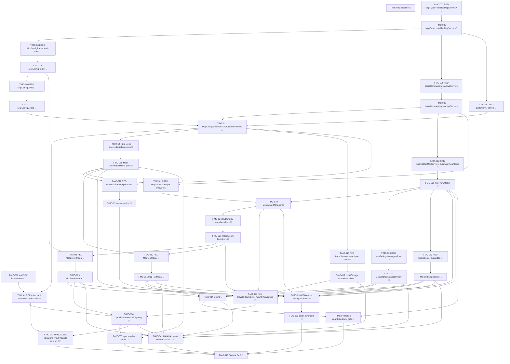

# Tasks — MCP client (P8)

Each task is ≤ ~½ day, has a stable `T-MC-NNN` id, references ≥ 1 SPEC-MC / TEST-MC / REQ-MC / NFR-MC,
names an owner, lists explicit dependencies, and has a testable Definition of Done. This decomposes
**SPEC-MC-001..030** (30 spec items) on top of the merged P1–P7 chat surface on the `next` integration
branch (P7 approvals-security #448 / 06734d5a): the P6 `McpSelector.vue` visible-empty seam + the
`ToolbarCapabilities.supportsMcpTools` gate, the P5 modal seam (`OpenInlineEditFn`/`OpenImagePreviewFn`),
the UNCHANGED P7 tool-agnostic `ApprovalManager` (`setApprovalCallback`), the EXCLUDED
`ChatRuntimeQueryOptions.enabledMcpServers?` field, the device-local/vault port + three-bridge pattern.

> **TDD ordering (mission discipline):** the RED test task for a contract comes **before** the
> implementation task that greens it. RED test tasks are owned by `qa`; implementation tasks by
> `dev`. **Every dev task's first DoD line is "the prior RED test(s) now pass".** This mirrors the
> P5/P6/P7 task style the maintainer accepted (TASKS-CA-001 / TASKS-TC-001 / TASKS-AS-001).

> **DDD inward layering order (the batch structure):**
> 1. **DOMAIN** — `McpTypes` (the config union / `ManagedMcpServer` / `_claudian` metadata / `McpTool` /
>    `McpTestResult` / `ParsedMcpConfig` / `EnabledMcpServers` / `DEFAULT_MCP_SERVER`, SPEC-MC-001); the
>    additive `ChatRuntimeQueryOptions.enabledMcpServers?` (SPEC-MC-002, RED additivity/serialisation leg);
>    the PURE `McpConfigParser` (4 paste formats + `getMcpServerType` + `isValidMcpServerConfig`,
>    SPEC-MC-004 — its own RED→green truth table) + the PURE `McpConfigCodec` (SPEC-MC-003) + the PURE
>    `parseCommand` (SPEC-MC-005) + the PURE `getActiveServers`/`collectDisallowedMcpTools` (SPEC-MC-006);
>    the `McpConfigStorePort` + `McpClientPort` + the `MCP_CONFIG_STORE_PORT`/`MCP_CLIENT_PORT` keys +
>    barrels (SPEC-MC-007/008).
> 2. **INFRA** — the 3-bridge `McpConfigStorePort` (Obsidian via `VaultPort` `.claude/mcp.json`
>    coverage-considered / Mock scriptable in-memory + fault switch + `fake-ports.mcpConfigStore` / LS
>    browser-localStorage) + `McpClientPort` (Obsidian real stdio/SSE/HTTP over `@modelcontextprotocol/sdk`
>    coverage-excluded → manual / Mock scriptable test+connect+listTools + the SPEC-MC-028 matrix +
>    `fake-ports.mcpClient` / LS inert `isAvailable→false`) (SPEC-MC-009/010/011) + the dependency-add task
>    (`@modelcontextprotocol/sdk` + `vite.config.ts` externals confirm + AGENTS.md §8 rationale).
> 3. **APPLICATION** — `McpServerManager` use case (load/add/edit/remove/setEnabled/setToolDisabled →
>    `Result`, await-save, `getEnabledCount`, `getActiveServers(∅)`, `getEnabledMcpServers(∅)`,
>    SPEC-MC-012) + the PURE `foldEnabledMcpServers` (SPEC-MC-013) + the PURE `buildMcpViewModel`
>    (SPEC-MC-014).
> 4. **UI** — `useMcpConfigStorePort` + `useMcpClientPort` (SPEC-MC-019); `McpSettingsManager.vue` +
>    `McpServerRow.vue` (SPEC-MC-015); `McpServerModal.vue` (paste/parse/add/edit) + `McpTestModal.vue`
>    (the 5-state machine) via the modal seam (SPEC-MC-016/017/023); the expanded `McpSelector.vue`
>    (list + toggle + badge, keeps the P6 empty seam at 0, SPEC-MC-018). Each mounted component carries a
>    co-located `data-testid` PageObject; RED component test before each. The `ChatSurface`/`tabsStore`
>    wiring for the enabled-servers fold + the selector + the UNCHANGED P7 gating (SPEC-MC-020).
> 5. **STYLES** — the `mcp-settings`/`mcp-modal`/`mcp-selector` `--sp-*` token slice + the tokens-contract
>    update (SPEC-MC-021), runnable anytime before the gate.
> 6. **WIRE-IN** — provide `MCP_CONFIG_STORE_PORT` + `MCP_CLIENT_PORT` in `AgentSidebarView` +
>    `src/ui/main.ts`; register the MCP modal-seam launchers (`OPEN_MCP_SERVER_MODAL` /
>    `OPEN_MCP_TEST_MODAL`); mount the MCP settings surface; `npm run dev` standalone smoke (SPEC-MC-020).
> 7. **GATE** — full `npm run verify` + `npm run test:all` + the grep gate (no `providerId` branch / no
>    secret leak / no `obsidian`/`node:*`/SDK under `src/ui/**` / never-build:web) + the additivity
>    byte-identical proof + the parity self-review note + the manual real-transport legs (TEST-MC-M1) +
>    the parity screenshots (TEST-MC-M2) + draft PR into `next` (orchestrator merges).
> A test for a layer may not depend on a layer further out.

> **The pure domain + the additive field freeze early (carried from the design + spec hand-off, §0).** The
> `McpTypes` shapes (SPEC-MC-001) + the additive `enabledMcpServers?` (SPEC-MC-002) + the PURE parser /
> codec / `parseCommand` / `getActiveServers` (SPEC-MC-003..006) are sequenced FIRST so the manager + the
> UI build on frozen types; a no-servers turn (no `enabledMcpServers`) is proven byte-identical to P7
> (TEST-MC-082, NFR-MC-001) before the use case + the UI build on top — mirroring the P6/P7 ordering that
> froze the `ChatRuntimeQueryOptions` grow first.

> **Build-green discipline — additive only; no `implements`-break.** The single domain interface change is
> the **purely additive optional** `ChatRuntimeQueryOptions.enabledMcpServers?` (SPEC-MC-002): the runtimes
> read the optional field, they do not re-declare the interface, so it carries **no** `implements
> ChatRuntimePort` break and **no** companion-stub concern (same as the P6 `ChatRuntimeQueryOptions` grow +
> the P7 `permissionMode?` optional — TASKS-AS-001 T-AS-003 noted this). T-MC-003's DoD notes this
> explicitly. The two new ports (`McpConfigStorePort`/`McpClientPort`) are **new** interfaces with no prior
> impl, so adding them breaks nothing until a bridge declares `implements` — the bridge tasks add the
> impl + the `fake-ports` member in the same task so `npm run build` + `npm run typecheck` stay green. No
> other interface-fan-out applies in P8.

> **Lint discipline (the P5/P6/P7 lesson):** every dev task runs the **WHOLE-project** `npm run lint`
> (0 errors), not just the changed files — the project gate catches per-file misses (sentence-case with the
> `MCP` brand allowlist, `consistent-type-imports`, `strict-boolean-expressions`, the Result-discipline
> try/catch ban, the `no-restricted-imports` layer guards). The `obsidianmd/ui/sentence-case` rule already
> allowlists the `MCP` brand (`eslint.config.js` `brands: ['Specorator', 'MCP']`), so "MCP servers" passes.

> **Coverage-excluded infra (manual legs):** the **real** SDK stdio/SSE/HTTP transports
> (`@modelcontextprotocol/sdk`, the bounded stdio spawn, the Node http(s) fetch) **and** the **real** vault
> `.claude/mcp.json` read/write live under `src/infrastructure/obsidian/**` (coverage-excluded, §10). Their
> behavioural gate is the **manual** legs **TEST-MC-M1** (the real stdio/SSE/HTTP transports + the real
> vault `.claude/mcp.json` round-trip in Obsidian + a real Claude turn calling an MCP tool through the SDK
> + the P7 gate) and **TEST-MC-M2** (parity screenshots at 320/520/720 px, light + dark), plus the manual
> real-transport sub-legs **TEST-MC-021/022** (real SSE/HTTP), **TEST-MC-061** (real stdio spawn args), and
> **TEST-MC-064** (real Node fetch / TLS) — never self-claimed by an agent; recorded for the single final
> epic-review gate (autonomous drive). The PURE parser / codec / `parseCommand` / `getActiveServers` /
> `foldEnabledMcpServers` / `buildMcpViewModel`, the `McpServerManager` lifecycle (over the scriptable Mock
> store + client), the Mock scriptable store (`seedMcpServers` + `setMcpStoreFailMode`) + the scriptable
> client (`scriptTestResult` + `setClientMode`) + the LocalStorage browser-localStorage / inert impls carry
> the unit/component weight + the 80/70/80/80 coverage gate (NFR-MC-006).

> **Deleted-symbol guard (ESLint) — NO relaxation needed (verified). The OLD pre-reboot MCP was P0-deleted;
> the NEW P8 names are clean BUT one Obsidian-layer file-name glob collides — see the naming directive.**
> Verified against `eslint.config.js`:
> - **`DELETED_SUBSYSTEM_BAN`** lists only the OLD MCP registrar paths:
>   `@/infrastructure/obsidian/ObsidianMcp*`, `@/infrastructure/obsidian/mcp/**`, and the old port
>   `@/domain/ports/ObsidianMcpServerPort`. It does **not** list `McpConfigStorePort`/`McpClientPort`/
>   `McpServerManager`/`McpConfigParser`/`McpConfigCodec`/`McpTypes`/`McpSettingsManager`/`McpServerRow`/
>   `McpServerModal`/`McpTestModal`/`McpSelector`, nor the new paths.
> - **The NEW P8 domain/application/ui paths are CLEAN:** `@/domain/chat/mcp/**`, `@/application/chat/mcp/**`,
>   and `@/ui/chat/mcp/**` match **no** ban glob (`@/domain/chat` + `@/application/chat` regrew in P1 and
>   are off the ban list; there is **no** `@/ui/chat` ban glob; only `@/domain/feature` /
>   `@/application/feature` / `@/application/migration` are banned). The new ports
>   `@/domain/ports/McpConfigStorePort` + `@/domain/ports/McpClientPort` are clean (only the old
>   `ObsidianMcpServerPort` is banned). `DELETED_INJECTION_KEYS` does **not** contain
>   `MCP_CONFIG_STORE_PORT` / `MCP_CLIENT_PORT`. So **there is NO guard-relax task in P8.** (Unlike P1's
>   scoped chat-ban relax — that relaxation already happened in P1 when `@/domain/chat`/`@/application/chat`
>   were removed from the ban list; nothing further is needed here.)
> - **The one collision to AVOID (a `@/…/mcp` glob that IS banned):** the two OLD Obsidian-layer globs
>   `@/infrastructure/obsidian/ObsidianMcp*` and `@/infrastructure/obsidian/mcp/**` still match any new
>   file named `ObsidianMcp…` or placed under `src/infrastructure/obsidian/mcp/`. The P8 real-transport
>   infra (SPEC-MC-009) MUST therefore be named so as **not** to match either glob — e.g.
>   `src/infrastructure/obsidian/VaultMcpConfigStore.ts` + `src/infrastructure/obsidian/SdkMcpClient.ts`
>   (or methods folded onto the existing `ObsidianBridge` import surface), and **never** under
>   `src/infrastructure/obsidian/mcp/` and **never** prefixed `ObsidianMcp`. T-MC-001's DoD includes a
>   one-line lint check confirming the chosen new file names + the new keys/ports resolve clean; T-MC-013
>   (the Obsidian infra task) carries the naming directive; T-MC-031 (the gate) re-confirms. **No scoped
>   guard-relax is needed** — the fix is a file-naming choice, not a ban edit.

> **Parity is a review-stage human task:** the P8 parity-screenshot capture (charter §5.1 / NFR-MC-009) for
> the MCP settings (empty + list), the add/edit modal (incl. paste + name-required + parse-error), the test
> modal in each state (running / success-with-tools / partial / timeout / error / unavailable), the expanded
> selector with mixed enabled/disabled servers + the count badge, and the no-servers selector seam (the P6
> byte-identical state) at 320 / 520 / 720 px, light + dark, is deferred to the single final epic-review
> human gate (TEST-MC-M2), not CI. The baseline-capture task (T-MC-001) runs first so a `claudian-main`
> `McpServerManager` / `McpConfigParser` / `McpTester` / `McpServerModal` / `McpTestModal` /
> `mcp-modal.css` / `mcp-settings.css` / `mcp-selector.css` reference exists pre-impl.

## Legend

- 🧪 = test task (RED-first; owner `qa`)
- 🔨 = implementation task (owner `dev`)
- 📐 = design / scaffolding / baseline task
- 🚀 = release / ops / gate task
- 🪓 = may slice (touches multiple independent code paths; expect several PRs)
- 👤 = human-owned (never agent-self-claimed)

---

## Task list

### T-MC-001 📐 — Baseline-capture: `claudian-main` P8 MCP reference + guard verification + the file-naming directive

- **Description:** Before any P8 implementation, capture the `claudian-main` baseline for the P8 surfaces:
  the config round-trip (`providers/claude/storage/McpStorage.ts` — `load:14-56`, `save:58-134`,
  `MCP_CONFIG_PATH '.claude/mcp.json'`), the parser (`core/mcp/McpConfigParser.ts:17` `parseClipboardConfig`
  + the four formats, `core/types/mcp.ts:74` `getMcpServerType`, `:81` `isValidMcpServerConfig`,
  `DEFAULT_MCP_SERVER`), the tester (`core/mcp/McpTester.ts` — the stdio/SSE/HTTP transports, the 10s
  `AbortController:268-269`, the partial-success `:276-285`, the friendly-error catch `:293-301`,
  `McpTool`/`McpTestResult` `:13-25`), the manager (`core/mcp/McpServerManager.ts` —
  `getActiveServers:38`, `getAllDisallowedMcpTools/collectDisallowedTools:74-94`, `getEnabledCount:25`),
  `parseCommand`/`splitCommandString` (`utils/mcp.ts:46/59`), and the `mcp-modal.css` / `mcp-settings.css` /
  `mcp-selector.css` rules — into a `specs/mcp-client/parity-screenshots.md` skeleton (baseline column only:
  the settings empty + list states, the add/edit modal incl. paste + name-required + parse-error, the test
  modal in each of the five states, the expanded selector with mixed enabled/disabled + the count badge,
  the no-servers selector seam — at 320 / 520 / 720 px, light + dark). Confirm (one lint run) that the new
  `MCP_CONFIG_STORE_PORT` + `MCP_CLIENT_PORT` keys + the new paths (`@/domain/chat/mcp/**`,
  `@/application/chat/mcp/**`, `@/ui/chat/mcp/**`, `@/domain/ports/McpConfigStorePort`,
  `@/domain/ports/McpClientPort`) are **not** caught by `DELETED_SUBSYSTEM_BAN` / `DELETED_INJECTION_KEYS`,
  AND record the **file-naming directive** for the Obsidian infra (SPEC-MC-009): the new real-transport
  files must NOT match the still-banned `@/infrastructure/obsidian/ObsidianMcp*` /
  `@/infrastructure/obsidian/mcp/**` globs — name them e.g. `VaultMcpConfigStore.ts` / `SdkMcpClient.ts`,
  never `ObsidianMcp…` and never under `obsidian/mcp/`. No production code.
- **Satisfies:** NFR-MC-009 (baseline leg), NFR-MC-005 (guard verification), SPEC-MC-001/003/004/009/015/016/017/018/021/030
- **Owner:** dev
- **Depends on:** —
- **Estimate:** S
- **Definition of done:**
  - [ ] `specs/mcp-client/parity-screenshots.md` exists with the per-surface × 320/520/720 × light/dark
        baseline matrix scaffolded, baseline column captured from `D:\Projects\claudian-main`
        (`McpStorage` / `McpConfigParser` / `McpTester` / `McpServerManager` / `utils/mcp.ts` + the three
        `mcp-*.css` modules).
  - [ ] A one-line lint check confirms the deleted-symbol guard does **not** block the new keys / the new
        `@/domain/chat/mcp/**` · `@/application/chat/mcp/**` · `@/ui/chat/mcp/**` · `McpConfigStorePort` ·
        `McpClientPort` paths (no relaxation task needed); the **Obsidian-infra file-naming directive**
        (avoid `ObsidianMcp*` / `obsidian/mcp/**`) is recorded in `test-plan.md`.
  - [ ] No file under `src/` changed.

---

## Layer 1 — DOMAIN (SPEC-MC-001..008)

### T-MC-002 🧪 — RED: `McpTypes` + the additive `ChatRuntimeQueryOptions.enabledMcpServers?` (structural + serialisation)

- **Description:** Author the failing structural/type-level + serialisation tests asserting: (a) the
  `McpTypes` shapes (SPEC-MC-001) — `McpStdioServerConfig`/`McpSseServerConfig`/`McpHttpServerConfig` →
  `McpServerConfig` union; `McpServerType = 'stdio'|'sse'|'http'`; `ManagedMcpServer { name, config,
  enabled, contextSaving, disabledTools?, description? }`; `McpTool { name, description?, inputSchema? }`;
  `McpTestResult { success, serverName?, serverVersion?, tools, error? }`; `ParsedMcpConfig { servers,
  needsName }`; `EnabledMcpServers { servers: Record<string, McpServerConfig>, disallowedTools: readonly
  string[] }`; `DEFAULT_MCP_SERVER = { enabled:true, contextSaving:true }` — all re-exported from
  `@/domain/chat/mcp/index` (TEST-MC-001 type-shape leg); (b) `ChatRuntimeQueryOptions` gains **exactly**
  one optional field `enabledMcpServers?: EnabledMcpServers` appended **after** `permissionMode`, the P0–P7
  `model?`/`forceColdStart?`/`appendSystemPrompt?`/`mode?`/`reasoning?`/`serviceTier?`/`permissionMode?`
  stay byte-identical, `externalContextPaths?` stays EXCLUDED, and a P7-shaped query (no `enabledMcpServers`)
  serialises byte-identically to P7 — `PreparedChatTurn`/`ChatRuntimeEnsureReadyOptions`/`ChatTurnRequest`
  unchanged, `PreparedChatTurn.mcpMentions` stays the empty `Set` (TEST-MC-082 serialisation leg,
  NFR-MC-001, SPEC-MC-002/022). Names TEST-MC-001/082 in metadata.
- **Satisfies:** TEST-MC-001 (type-shape leg), TEST-MC-082 (serialisation leg), SPEC-MC-001, SPEC-MC-002, SPEC-MC-022, REQ-MC-052/082, NFR-MC-001
- **Owner:** qa
- **Depends on:** —
- **Estimate:** M
- **Definition of done:**
  - [ ] `tests/domain/chat/mcp/McpTypes.test.ts` (the shapes) and `tests/domain/chat/ChatTurn.ts.test.ts`
        (the P8 `enabledMcpServers?` additivity + the P7-shaped serialisation leg) exist, naming
        TEST-MC-001/082.
  - [ ] Tests fail (RED) — the `McpTypes` module + the `enabledMcpServers?` field do not yet exist
        (compile/run failure is the RED signal).

### T-MC-003 🔨 — `McpTypes.ts` + `ChatRuntimeQueryOptions.enabledMcpServers?` + barrel

- **Description:** Implement per SPEC-MC-001/002: `src/domain/chat/mcp/McpTypes.ts` (the config union +
  `ManagedMcpServer` + `McpTool` + `McpTestResult` + `ParsedMcpConfig` + `EnabledMcpServers` +
  `DEFAULT_MCP_SERVER`, regrown verbatim from `core/types/mcp.ts` + `core/mcp/McpTester.ts:13-25`, `readonly`
  where it crosses the store boundary, no class/`obsidian`/`node:*`); **append** `enabledMcpServers?:
  EnabledMcpServers` **after** `permissionMode` in `ChatRuntimeQueryOptions` (`src/domain/chat/ChatTurn.ts`,
  importing from `./mcp/McpTypes`) — the P0–P7 members byte-identical, `externalContextPaths?` stays
  EXCLUDED, `PreparedChatTurn`/`ChatRuntimeEnsureReadyOptions`/`ChatTurnRequest` byte-identical. Create the
  barrel `src/domain/chat/mcp/index.ts` re-exporting the types. Pure types; no behaviour. **Note
  (build-green):** the additive optional is purely additive — no `implements ChatRuntimePort` break (the
  runtimes read the optional field), so **no** companion-stub is needed here. No `obsidian`/`node:*`/Vue/class.
- **Satisfies:** SPEC-MC-001, SPEC-MC-002, SPEC-MC-022, REQ-MC-052/082, NFR-MC-001
- **Owner:** dev
- **Depends on:** T-MC-002
- **Estimate:** S
- **Definition of done:**
  - [ ] The prior RED tests (TEST-MC-001 type-shape leg + TEST-MC-082 serialisation leg) now pass (the
        `McpTypes` shapes; exactly the one optional field appended to `ChatRuntimeQueryOptions`; a P7-shaped
        query byte-identical to P7; the other request types unchanged; `externalContextPaths?` still EXCLUDED).
  - [ ] whole-project `npm run lint` 0 errors + `npm run typecheck` 0 errors + `npm run test` green; no
        `obsidian`/`node:*`/Vue import in `src/domain/chat/mcp/**`; no `implements ChatRuntimePort` break
        (additive-only).
  - [ ] Implementation-log entry added.

### T-MC-004 🧪 — RED: the PURE `McpConfigParser` (`parseClipboardConfig`/`getMcpServerType`/`isValidMcpServerConfig`) — the full truth table

- **Description:** Author the failing unit tests for the pure/total parser (SPEC-MC-004/029), covering the
  full Claudian truth table the QA stage parameterises: (a) `parseClipboardConfig(raw)` across the **four
  formats** — format 1 `{ "mcpServers": { name: config } }` → `ok({ servers, needsName:false })`, an empty
  `mcpServers` / no valid entry → `err('No valid server configs found in mcpServers')`; format 2 a single
  un-named server (`{ command }` / `{ type:'sse', url }`) → `ok({ servers:[{name:'',config}], needsName:true
  })`; format 3 a single `{ name: config }` → `ok({ servers, needsName:false })`; format 4 multiple `{ name:
  config, … }` → `ok({ servers, needsName:false })`, none valid → `err('Invalid MCP configuration format')`;
  malformed `JSON.parse` throw → `err('Invalid JSON')`; a non-object / array / no-server object →
  `err('Invalid MCP configuration format')` — never throws, never corrupts (TEST-MC-003/004, EC-MC-2/3/5);
  (b) `getMcpServerType` — `{type:'sse',url}`→`sse`, `{type:'http',url}`→`http`, `{url}` (no type)→`http`,
  `{command}`→`stdio` (TEST-MC-005, EC-MC-6); (c) `isValidMcpServerConfig` — `{command:'x'}` ✅,
  `{url:'http://…'}` ✅, `{}` / non-object / array / `{command:123}` ❌ (TEST-MC-006, EC-MC-6); (d) all three
  are **total — never throw** for any input (NFR-MC-004). Names TEST-MC-003/004/005/006 + EC-MC-2/3/5/6.
- **Satisfies:** TEST-MC-003, TEST-MC-004, TEST-MC-005, TEST-MC-006, SPEC-MC-004, SPEC-MC-029, REQ-MC-003/004/005/006, NFR-MC-004, EC-MC-2/3/5/6
- **Owner:** qa
- **Depends on:** —
- **Estimate:** M
- **Definition of done:**
  - [ ] `tests/domain/chat/mcp/McpConfigParser.test.ts` exists, naming the listed TEST-MC ids, parameterised
        across the full SPEC-MC-029 truth table (the four formats + `needsName`, the malformed/err cases, the
        `getMcpServerType` + `isValidMcpServerConfig` per-shape tables) + the never-throws assertion.
  - [ ] Tests fail (RED) — `McpConfigParser.ts` does not yet exist.

### T-MC-005 🔨 — `McpConfigParser.ts` (pure `parseClipboardConfig` / `getMcpServerType` / `isValidMcpServerConfig`) + barrel

- **Description:** Implement `src/domain/chat/mcp/McpConfigParser.ts` per SPEC-MC-004/029, ported verbatim
  from `core/mcp/McpConfigParser.ts:17` + `core/types/mcp.ts:74/81` with Claudian's throw paths converted to
  `Result.err` (ADR-004): `parseClipboardConfig(raw): Result<ParsedMcpConfig>` (the four formats + `needsName`,
  the malformed/err cases per the truth table); `getMcpServerType(config): McpServerType` (sse/http/bare-url→
  http/stdio); `isValidMcpServerConfig(obj): obj is McpServerConfig` (non-empty string `command` OR non-empty
  string `url`). All three **pure + total — never throw** (NFR-MC-004); no class, no `obsidian`, no `node:*`,
  no I/O. Re-export from `src/domain/chat/mcp/index.ts`.
- **Satisfies:** SPEC-MC-004, SPEC-MC-029, REQ-MC-003/004/005/006, NFR-MC-004
- **Owner:** dev
- **Depends on:** T-MC-004, T-MC-003
- **Estimate:** M
- **Definition of done:**
  - [ ] The prior RED tests (TEST-MC-003/004/005/006 + EC-MC-2/3/5/6) now pass across the full truth table;
        the functions never throw for any input; the stored config is never corrupted on a malformed parse.
  - [ ] whole-project `npm run lint` 0 + `npm run typecheck` 0 + `npm run test` green; no
        `obsidian`/`node:*`/Vue import in `src/domain/chat/mcp/**`; no `eval` — JSON parse only (NFR-MC-003).
  - [ ] Implementation-log entry added.

### T-MC-006 🧪 — RED: the PURE `McpConfigCodec` (`deserializeMcpConfig`/`serializeMcpConfig`) — round-trip + default-pruning + CLI-key preservation

- **Description:** Author the failing unit tests for the pure/total codec (SPEC-MC-003), covering: (a)
  `deserializeMcpConfig(null)` / empty string / a missing-or-not-an-object `mcpServers` / unparseable JSON →
  `ok([])` (load-or-default, no crash, REQ-MC-002, EC-MC-12); a valid `mcpServers` + `_claudian.servers`
  sidecar → `ManagedMcpServer[]` with `DEFAULT_MCP_SERVER` defaults applied when the sidecar omits
  `enabled`/`contextSaving`, `disabledTools` filtered to non-empty strings (→ `undefined` when empty),
  `description` from the sidecar; an entry failing `isValidMcpServerConfig` is **skipped, not fatal**
  (TEST-MC-001, EC-MC-12); (b) `serializeMcpConfig(servers, existingRaw)` → `ok(<text>)` writing
  `mcpServers[name] = config` for each server + ONLY the non-default `_claudian.servers[name]` entry
  (`enabled` when `!== true`, `contextSaving` when `!== true`, `disabledTools` trimmed non-empty when
  non-empty, `description` when truthy); a server at all defaults writes **no** sidecar entry (TEST-MC-007,
  EC-MC-20); when no server has non-default metadata and the prior doc had no other `_claudian` keys,
  `_claudian` is **deleted** from the output; **CLI-key preservation** — the output preserves any unknown
  top-level keys + any non-`servers` `_claudian` keys the prior `existingRaw` had (TEST-MC-007, EC-MC-19); a
  2-space indent; (c) both functions **total — never throw** (NFR-MC-004). Names TEST-MC-001/002/007 +
  EC-MC-12/19/20.
- **Satisfies:** TEST-MC-001, TEST-MC-002, TEST-MC-007, SPEC-MC-003, REQ-MC-001/002/007, NFR-MC-004, EC-MC-12/19/20
- **Owner:** qa
- **Depends on:** T-MC-005
- **Estimate:** M
- **Definition of done:**
  - [ ] `tests/domain/chat/mcp/McpConfigCodec.test.ts` exists, naming the listed TEST-MC ids, covering the
        load-or-default (absent/empty/unparseable → `ok([])`), the sidecar default-application + skip-invalid,
        the serialise non-default pruning + default-pruning + the CLI-key preservation (top-level + non-
        `servers` `_claudian` keys) + the 2-space indent + the never-throws assertion.
  - [ ] Tests fail (RED) — `McpConfigCodec.ts` does not yet exist.

### T-MC-007 🔨 — `McpConfigCodec.ts` (pure `deserializeMcpConfig` / `serializeMcpConfig`) + barrel

- **Description:** Implement `src/domain/chat/mcp/McpConfigCodec.ts` per SPEC-MC-003, ported from
  `McpStorage.load:14-56` + `save:58-134` (the codec is the round-trip authority; the bridge does only the
  vault I/O): `deserializeMcpConfig(raw: string | null): Result<ManagedMcpServer[]>` (load-or-default
  `ok([])` on absent/empty/unparseable/no-`mcpServers`; per-entry defaults from `DEFAULT_MCP_SERVER`; skip
  `!isValidMcpServerConfig` entries); `serializeMcpConfig(servers, existingRaw: string | null):
  Result<string>` (write `mcpServers` + ONLY non-default `_claudian.servers` metadata; default-prune;
  delete an empty `_claudian`; preserve unknown top-level keys + non-`servers` `_claudian` keys from
  `existingRaw`; 2-space indent). Both **pure + total — never throw** (NFR-MC-004); no class, no `obsidian`,
  no `node:*`, no I/O. Re-export from `src/domain/chat/mcp/index.ts`.
- **Satisfies:** SPEC-MC-003, REQ-MC-001/002/007, NFR-MC-004
- **Owner:** dev
- **Depends on:** T-MC-006
- **Estimate:** M
- **Definition of done:**
  - [ ] The prior RED tests (TEST-MC-001/002/007 + EC-MC-12/19/20) now pass (load-or-default, default-pruning,
        CLI-key preservation, 2-space indent, never-throws).
  - [ ] whole-project `npm run lint` 0 + `npm run typecheck` 0 + `npm run test` green; no
        `obsidian`/`node:*`/Vue import in `src/domain/chat/mcp/**`.
  - [ ] Implementation-log entry added.

### T-MC-008 🧪 — RED: the PURE `parseCommand` + `getActiveServers`/`collectDisallowedMcpTools`

- **Description:** Author the failing unit tests for the pure/total domain folds (SPEC-MC-005/006): (a)
  `parseCommand(command, providedArgs?)` — when `providedArgs` is non-empty returns `{ cmd: command, args:
  providedArgs }`, else splits the command string (quote-aware); `parseCommand('', undefined)` → `{ cmd:'',
  args:[] }` (the empty-command case → `error:'Missing command'` in the tester, EC-MC-7); `splitCommandString`
  groups runs inside matched `'`/`"` quotes (quotes stripped), splits on unquoted whitespace, **no shell/eval**
  (TEST-MC-020a, EC-MC-7); (b) `getActiveServers(servers, mentionedNames)` — skips `!enabled`; skips a
  `contextSaving` server unless mentioned (P8 always passes ∅ → always skipped, EC-MC-9); else copies
  `config` under `name`; returns a fresh map (TEST-MC-052/053); (c) `collectDisallowedMcpTools(servers)` —
  iterates **enabled** servers (ignoring `contextSaving`/mentions, parity `getAllDisallowedMcpTools`), emits
  `mcp__${name}__${tool.trim()}` for each non-empty `disabledTools` entry, returns the de-duped sorted array
  (TEST-MC-054, EC-MC-10); (d) all **total — never throw**. Names TEST-MC-020a/052/053/054 + EC-MC-7/9/10.
- **Satisfies:** TEST-MC-020a, TEST-MC-052, TEST-MC-053, TEST-MC-054, SPEC-MC-005, SPEC-MC-006, REQ-MC-020/023/052/053/054/061, NFR-MC-004, EC-MC-7/9/10
- **Owner:** qa
- **Depends on:** T-MC-003
- **Estimate:** M
- **Definition of done:**
  - [ ] `tests/domain/chat/mcp/parseCommand.test.ts` + `tests/domain/chat/mcp/getActiveServers.test.ts`
        exist, naming the listed TEST-MC ids, covering the quote-aware split + empty-command, the
        active-set enabled/context-saving(∅) filter, the disallowed-tools trim/dedupe/sort + the
        never-throws assertion.
  - [ ] Tests fail (RED) — `parseCommand.ts` + `getActiveServers.ts` do not yet exist.

### T-MC-009 🔨 — `parseCommand.ts` + `getActiveServers.ts` (pure) + barrel

- **Description:** Implement `src/domain/chat/mcp/parseCommand.ts` (`parseCommand`/`splitCommandString`,
  ported verbatim from `utils/mcp.ts:46/59`, the no-shell quote-aware tokeniser — same posture as
  `ShellExecPort`, no shell, no eval, REQ-MC-061) + `src/domain/chat/mcp/getActiveServers.ts`
  (`getActiveServers(servers, mentionedNames): Record<string, McpServerConfig>` + `collectDisallowedMcpTools
  (servers): string[]`, ported from `McpServerManager.getActiveServers:38` + `getAllDisallowedMcpTools:74-94`)
  per SPEC-MC-005/006. All **pure + total — never throw**; no class, no `obsidian`, no `node:*`, no I/O.
  Re-export both from `src/domain/chat/mcp/index.ts`.
- **Satisfies:** SPEC-MC-005, SPEC-MC-006, REQ-MC-020/023/052/053/054/061, NFR-MC-002/004
- **Owner:** dev
- **Depends on:** T-MC-008
- **Estimate:** S
- **Definition of done:**
  - [ ] The prior RED tests (TEST-MC-020a/052/053/054 + EC-MC-7/9/10) now pass; the functions never throw;
        `splitCommandString` invokes no shell/eval.
  - [ ] whole-project `npm run lint` 0 + `npm run typecheck` 0 + `npm run test` green; no
        `obsidian`/`node:*`/Vue import in `src/domain/chat/mcp/**`.
  - [ ] Implementation-log entry added.

### T-MC-010 🧪 — RED: `McpConfigStorePort` + `McpClientPort` + the two keys + barrels (structural)

- **Description:** Author the failing structural/type-level tests asserting (SPEC-MC-007/008): (a)
  `McpConfigStorePort` exposes **exactly** `load(): Promise<Result<ManagedMcpServer[]>>`, `save(servers:
  readonly ManagedMcpServer[]): Promise<Result<void>>`, `exists(): Promise<Result<boolean>>`; (b)
  `McpClientPort` exposes **exactly** `isAvailable(): boolean`, `test(server): Promise<McpTestResult>`,
  `connect(server): Promise<Result<McpConnection>>`, `listTools(connection): Promise<Result<readonly
  McpTool[]>>`, `callTool(connection, toolName, input): Promise<Result<unknown>>`, `disconnect(connection):
  Promise<Result<void>>` (with `McpConnection { readonly id: string }`); (c) `MCP_CONFIG_STORE_PORT` +
  `MCP_CLIENT_PORT` are their **own** `InjectionKey`s in `@/infrastructure/bridge/ports` (alongside the
  existing keys, no aggregate); (d) the barrel `src/domain/ports/index.ts` re-exports `McpConfigStorePort` /
  `McpClientPort` / `McpConnection` (appended). The behavioural store/client contracts (load-or-default, the
  test matrix) are the Mock/LS legs (T-MC-013/015/017). Names the shape leg of TEST-MC-081.
- **Satisfies:** TEST-MC-081 (port-shape leg), SPEC-MC-007, SPEC-MC-008, REQ-MC-001/002/007/020..023/030..034/081, NFR-MC-005
- **Owner:** qa
- **Depends on:** T-MC-003
- **Estimate:** S
- **Definition of done:**
  - [ ] `tests/domain/ports/McpConfigStorePort.test.ts` + `tests/domain/ports/McpClientPort.test.ts` exist,
        naming the TEST-MC-081 shape leg, asserting the `Result`-typed method signatures + the own keys + the
        barrel re-exports.
  - [ ] Tests fail (RED) — the two ports + the two keys + the barrel re-exports do not yet exist.

### T-MC-011 🔨 — `McpConfigStorePort` + `McpClientPort` + the two keys + barrel re-exports

- **Description:** Implement per SPEC-MC-007/008: the narrow store-only port
  `src/domain/ports/McpConfigStorePort.ts` (`load`/`save`/`exists`, all `Promise<Result<…>>`, importing
  `Result` + `ManagedMcpServer`; documented per-method contract — `load` load-or-default `ok([])`,
  `save` codec-round-trip + CLI-key preservation, `exists` `ok(fileExists)`) + the narrow transport port
  `src/domain/ports/McpClientPort.ts` (`isAvailable`/`test`/`connect`/`listTools`/`callTool`/`disconnect` +
  `McpConnection`; `test` returns a structured `McpTestResult` and **never throws**, the live methods
  `Result`-typed; documented per-method contract incl. the 10s timeout + the SPEC-MC-028 matrix). Add the
  `MCP_CONFIG_STORE_PORT` + `MCP_CLIENT_PORT` `InjectionKey`s to `src/infrastructure/bridge/ports.ts` (no
  aggregate — keep the per-key header); re-export `McpConfigStorePort` / `McpClientPort` / `McpConnection`
  from `src/domain/ports/index.ts` (appended). One consumer each (the `McpServerManager` / the tester),
  one port each (ADR-008). No `obsidian`/`node:*`/Vue; no class.
- **Satisfies:** SPEC-MC-007, SPEC-MC-008, REQ-MC-001/002/007/020..023/030..034/081, NFR-MC-005, NFR-MC-004
- **Owner:** dev
- **Depends on:** T-MC-010, T-MC-007, T-MC-009
- **Estimate:** S
- **Definition of done:**
  - [ ] The prior RED tests (TEST-MC-081 port-shape leg) now pass (the method signatures, the own keys, the
        barrel re-exports).
  - [ ] whole-project `npm run lint` 0 + `npm run typecheck` 0 + `npm run test` green; **deleted-symbol guard
        green** (the new keys / the new port paths resolve clean — no relaxation needed); no
        `obsidian`/`node:*` import in `src/domain/**`.
  - [ ] Implementation-log entry added.

---

## Layer 2 — INFRA (SPEC-MC-009..011) + the dependency add

### T-MC-012 🔨 — Add `@modelcontextprotocol/sdk` + confirm `vite.config.ts` externals + record the dependency rationale (AGENTS.md §8)

- **Description:** Add `@modelcontextprotocol/sdk` as the one new runtime dependency (ADR-MC-002 §3,
  CLAR-MC-003) to `package.json` (`npm install @modelcontextprotocol/sdk`); confirm the plugin-build
  externals in `vite.config.ts` (`ALL_EXTERNALS` = `OBSIDIAN_EXTERNALS` + `builtinModules` + the `node:`
  forms) already cover its Node-only entry points (`node:http`/`https`, the subprocess transport) — the same
  CM6/agent-SDK externalization precedent (`@codemirror/*`); confirm the standalone `build:web` build never
  sees it (the real port lives only in `src/infrastructure/obsidian/**`, which `src/ui/main.ts` → `MockBridge`
  never imports); record the dependency **rationale** (license MIT, Anthropic-maintained, only sanctioned MCP
  client/transport, no in-tree alternative, bundled into `main.js`, never reaches `build:web`) in the
  implementing PR description per AGENTS.md §8 + a note in `implementation-log.md`. No application/UI code
  imports the SDK (only the Obsidian infra does, T-MC-013).
- **Satisfies:** SPEC-MC-030, REQ-MC-080, NFR-MC-010, ADR-MC-002 §3
- **Owner:** dev
- **Depends on:** —
- **Estimate:** S
- **Definition of done:**
  - [ ] `@modelcontextprotocol/sdk` added to `package.json` dependencies; `npm install` clean;
        `npm run build` (plugin) + `npm run build:web` (standalone) both green — the SDK bundles into the
        plugin `main.js` and is **absent** from `build:web` (verified — no `node:*`/SDK import in the
        standalone graph).
  - [ ] `vite.config.ts` `ALL_EXTERNALS` confirmed to cover the SDK's Node entry points (no new external
        needed, or the minimal addition recorded); the dependency rationale recorded in the PR description +
        `implementation-log.md` per AGENTS.md §8.
  - [ ] whole-project `npm run lint` 0 + `npm run typecheck` 0; `manifest.json` untouched (NFR-MC-010).

### T-MC-013 🔨 — `ObsidianBridge` real `McpConfigStorePort` (vault `.claude/mcp.json`) + real `McpClientPort` (SDK stdio/SSE/HTTP) — coverage-excluded 🪓

> The **real** vault `.claude/mcp.json` read/write **and** the **real** SDK stdio/SSE/HTTP transports live
> under `src/infrastructure/obsidian/**` (coverage-excluded). Their behavioural gate is the **manual** legs
> TEST-MC-M1 (the real transports + the real vault round-trip + a real Claude MCP turn) + the manual
> sub-legs TEST-MC-021/022/061/064. The Mock/LS halves (T-MC-015/017) carry the automated proof.
>
> **FILE-NAMING DIRECTIVE (deleted-symbol guard — T-MC-001):** the new files MUST NOT match the still-banned
> `@/infrastructure/obsidian/ObsidianMcp*` / `@/infrastructure/obsidian/mcp/**` globs. Name them e.g.
> `src/infrastructure/obsidian/VaultMcpConfigStore.ts` + `src/infrastructure/obsidian/SdkMcpClient.ts` (or
> fold the methods onto the existing bridge surface) — **never** prefixed `ObsidianMcp` and **never** under
> `src/infrastructure/obsidian/mcp/`. No scoped guard-relax is needed (the fix is the file name).

- **Description:** Implement per SPEC-MC-009 under `src/infrastructure/obsidian/**` (coverage-excluded,
  names per the directive above): (a) the `McpConfigStorePort` backed by `VaultPort.readFile`/`writeFile`/
  `fileExists` on `MCP_CONFIG_PATH = '.claude/mcp.json'` — `load` reads the text (or `null` when absent) →
  `deserializeMcpConfig` (SPEC-MC-003); `save` reads the prior text → `serializeMcpConfig(servers,
  existingRaw)` → `writeFile` (creating `.claude/` via `createFolder` when absent); `exists` →
  `fileExists`. **Vault file, NOT `data.json`, NOT device-local** (ADR-MC-001 — the single seam diverging
  from the device-local precedent because the Claude CLI must read it). (b) the `McpClientPort` real SDK
  transports: `isAvailable() → true`; `test`/`connect`/`listTools`/`callTool`/`disconnect` build the SDK
  `Client` + the per-type transport — stdio (`StdioClientTransport`, a **bounded explicit spawn**: the
  no-shell `parseCommand` cmd+args, `env: { ...process.env, ...config.env, PATH: getEnhancedPath(...) }`,
  `stderr:'ignore'`, REQ-MC-061/020), SSE (`SSEClientTransport` over the Node http(s) fetch, REQ-MC-021/064),
  HTTP (`StreamableHTTPClientTransport` over the Node fetch, REQ-MC-022/064) — with the **10s `AbortController`**
  (REQ-MC-031), TLS verification **not** disabled (REQ-MC-064), the partial-success / friendly-error mapping
  (REQ-MC-032/033), and every transport torn down in `finally` (REQ-MC-030..034). `@modelcontextprotocol/sdk`
  is imported **only here**. `test` **never throws** (the whole body guarded). Coverage-excluded; no
  `obsidian`/SDK/`node:*` symbol leaks past these files.
- **Satisfies:** SPEC-MC-009, REQ-MC-001/007/020..023/030..034/061..064/080, NFR-MC-002/006 (manual leg)
- **Owner:** dev
- **Depends on:** T-MC-011, T-MC-012
- **Estimate:** M
- **Slice plan:** may slice as (a) the vault `McpConfigStorePort`, (b) the real SDK `McpClientPort`
  (stdio / SSE / HTTP).
- **Definition of done:**
  - [ ] `ObsidianBridge` provides the real vault `McpConfigStorePort` (`.claude/mcp.json` round-trip via the
        pure codec, never `data.json`/device-local) + the real SDK `McpClientPort` (stdio bounded spawn /
        SSE / HTTP over the Node fetch, 10s abort, no TLS weakening, torn down in `finally`); `test` never
        throws; files named per the directive (not `ObsidianMcp*`, not under `obsidian/mcp/`); no
        `obsidian`/SDK/`node:*` symbol leaks past the files.
  - [ ] whole-project `npm run lint` 0 + `npm run typecheck` 0; the manual legs TEST-MC-M1 +
        TEST-MC-021/022/061/064 scheduled in `test-plan.md`.
  - [ ] Implementation-log entry added.

### T-MC-014 🧪 — RED: scriptable `MockBridge` `McpConfigStorePort` (seedable + `setMcpStoreFailMode`) + scriptable `McpClientPort` (`scriptTestResult`/`setClientMode`) + `fake-ports.mcpConfigStore`/`mcpClient`

- **Description:** Author the failing unit tests asserting (SPEC-MC-010): (a) the **Mock** `McpConfigStorePort`
  is a **scriptable in-memory** document store — `seedMcpServers(servers)` pre-populates the managed list
  (drives the list / selector / active-set tests); `load`/`save`/`exists` operate on the in-memory
  `ManagedMcpServer[]` **round-tripped through the same pure codec** (so default-pruning + CLI-key
  preservation are exercised), all `Promise<Result<…>>`; **fault injection** `setMcpStoreFailMode('load' |
  'save' | 'none')` forces `load`/`save` to `Result.err` so the save-fail notice (TEST-MC-072) + the
  malformed-load resilience run deterministically; (b) the **Mock** `McpClientPort` is **scriptable** —
  `isAvailable() → true`; `scriptTestResult(serverName, result)` queues a canned `McpTestResult` per server;
  `setClientMode('success' | 'partial' | 'timeout' | 'error' | 'unavailable')` drives `test` to return the
  matching `McpTestResult` (the full SPEC-MC-028 matrix, TEST-MC-030..034) without a real transport;
  `connect`/`listTools`/`callTool`/`disconnect` return canned `Result`s; (c) `tests/__fakes__/fake-ports.ts`
  gains an `mcpConfigStore` member (the scriptable store + fault switch) + an `mcpClient` member (the
  scriptable client + the mode/script switches) wired into the factory so the multi-port manager + settings +
  modal + selector tests see them. Names the Mock backing of TEST-MC-001/002/007/030..034/050/051/072/080.
- **Satisfies:** TEST-MC-001 (Mock backing), TEST-MC-002 (Mock backing), TEST-MC-007 (Mock backing), TEST-MC-030 (Mock backing), TEST-MC-031 (Mock backing), TEST-MC-032 (Mock backing), TEST-MC-033 (Mock backing), TEST-MC-034 (Mock backing), TEST-MC-072 (fail-inject backing), TEST-MC-080 (Mock backing), SPEC-MC-010, REQ-MC-002/004/030..033/080, NFR-MC-006
- **Owner:** qa
- **Depends on:** T-MC-011
- **Estimate:** M
- **Definition of done:**
  - [ ] `tests/infrastructure/mock/MockMcpConfigStore.test.ts`,
        `tests/infrastructure/mock/MockMcpClient.test.ts`, and the extended
        `tests/__fakes__/fake-ports.test.ts` (the `mcpConfigStore` + `mcpClient` members) exist, naming the
        listed TEST-MC ids, covering `seedMcpServers` / `setMcpStoreFailMode` / `scriptTestResult` /
        `setClientMode` across the SPEC-MC-028 matrix.
  - [ ] Tests fail (RED) — the scriptable Mock store + client + the factory members do not yet exist.

### T-MC-015 🔨 — `MockBridge` scriptable `McpConfigStorePort` + scriptable `McpClientPort` + `fake-ports` members

- **Description:** Implement per SPEC-MC-010 under `src/infrastructure/mock/**`: the scriptable in-memory
  `McpConfigStorePort` (`seedMcpServers`; `load`/`save`/`exists` round-tripped through the pure codec, all
  `Result`-typed, total; `setMcpStoreFailMode('load'|'save'|'none')` forcing `Result.err`); the scriptable
  `McpClientPort` (`isAvailable() → true`; `scriptTestResult(serverName, result)`; `setClientMode(...)`
  driving the SPEC-MC-028 `test` matrix; canned `connect`/`listTools`/`callTool`/`disconnect`); add the
  `mcpConfigStore` + `mcpClient` members to `tests/__fakes__/fake-ports.ts`. No `node:*`, no `obsidian`,
  total — never throws.
- **Satisfies:** SPEC-MC-010, REQ-MC-002/004/030..033/080, NFR-MC-006
- **Owner:** dev
- **Depends on:** T-MC-014
- **Estimate:** M
- **Definition of done:**
  - [ ] The prior RED tests (the Mock store seed/codec-round-trip/fail-inject + the scriptable client matrix +
        the `fake-ports` members) now pass; the `fake-ports` `mcpConfigStore`/`mcpClient` members work for
        multi-port tests; `setMcpStoreFailMode` + `setClientMode` drive the paths deterministically.
  - [ ] No `node:*`/`obsidian` import in Mock; total — never throws; whole-project `npm run lint` 0 +
        `npm run typecheck` 0 + `npm run test` green; implementation-log entry added.

### T-MC-016 🧪 — RED: `LocalStorageBridge` browser-`localStorage` `McpConfigStorePort` + inert `McpClientPort` (round-trip + unavailable)

- **Description:** Author the failing unit tests asserting (SPEC-MC-011): (a) the **LS** `McpConfigStorePort`
  backed by browser `localStorage` under a stable key `'specorator:mcp-config'` holding the `.claude/mcp.json`
  document text (so the GitHub Pages demo can manage config across a reload with no Obsidian, load/save
  round-trip through the same pure codec, load-or-default, all `Result`-typed); (b) the **LS** `McpClientPort`
  is **inert** — `isAvailable() → false`; `test` returns `{ success:false, tools:[], error:<unavailable> }`
  without a connection (REQ-MC-034, EC-MC-16); `connect`/`listTools`/`callTool` → `err`; `disconnect` → `ok()`;
  no spawn, no fetch. Names the LS leg of TEST-MC-002/034/080.
- **Satisfies:** TEST-MC-002 (LS leg), TEST-MC-034 (LS leg), TEST-MC-080 (LS leg), SPEC-MC-011, REQ-MC-034, NFR-MC-006, EC-MC-16
- **Owner:** qa
- **Depends on:** T-MC-011
- **Estimate:** S
- **Definition of done:**
  - [ ] `tests/infrastructure/localstorage/LocalStorageMcpConfigStore.test.ts` +
        `tests/infrastructure/localstorage/LocalStorageMcpClient.test.ts` exist, naming the listed TEST-MC
        legs, covering the LS round-trip (key `'specorator:mcp-config'`, codec, load-or-default) + the inert
        client (`isAvailable→false`, unavailable result, no spawn/fetch).
  - [ ] Tests fail (RED) — the LS `McpConfigStorePort` + inert `McpClientPort` do not yet exist.

### T-MC-017 🔨 — `LocalStorageBridge` browser-`localStorage` `McpConfigStorePort` + inert `McpClientPort`

- **Description:** Implement per SPEC-MC-011 under `src/infrastructure/localstorage/**`: the
  `McpConfigStorePort` backed by browser `localStorage` under `'specorator:mcp-config'` (load/save round-trip
  through the pure codec, load-or-default, `Result`-typed) so the GitHub Pages demo manages config across a
  reload with no Obsidian; the **inert** `McpClientPort` (`isAvailable() → false`; `test` → the unavailable
  `McpTestResult` with no connection; `connect`/`listTools`/`callTool` → `err`; `disconnect` → `ok()`; no
  spawn/fetch). Never throws across the boundary (NFR-MC-004). No `node:*`.
- **Satisfies:** SPEC-MC-011, REQ-MC-034, NFR-MC-006, EC-MC-16
- **Owner:** dev
- **Depends on:** T-MC-016
- **Estimate:** S
- **Definition of done:**
  - [ ] The prior RED tests (the LS round-trip + inert-client legs of TEST-MC-002/034/080) now pass; the
        demo persists config across a reload with no Obsidian; the client is inert (`isAvailable→false`,
        unavailable result); never throws.
  - [ ] whole-project `npm run lint` 0 + `npm run typecheck` 0 + `npm run test` green; implementation-log
        entry added.

---

## Layer 3 — APPLICATION (SPEC-MC-012..014)

### T-MC-018 🧪 — RED: `McpServerManager` lifecycle (load/add/edit/remove/setEnabled/setToolDisabled + getEnabledCount + getActiveServers(∅) + getEnabledMcpServers(∅))

- **Description:** Author the failing unit tests for the lifecycle use case (SPEC-MC-012), over the
  scriptable Mock store, asserting: (a) **`load`** → `store.load()`; on `ok` sets the in-memory list; on
  `err` → `feedback.notify` + keeps `[]` (never crashes, REQ-MC-071); (b) **`add(draft)`** appends `{ ...draft,
  enabled:true, contextSaving:draft.contextSaving }` with `DEFAULT_MCP_SERVER` defaults + **awaits**
  `store.save` (open item #4) — an empty or **duplicate** name → `err`, the existing server **unchanged**
  (REQ-MC-010/011, EC-MC-4); a save `err` → notify + `err` (the in-memory mutation rolled back, EC-MC-18);
  (c) **`edit`/`remove`/`setEnabled`/`setToolDisabled`** locate by `name` (missing → `err`), mutate, **await**
  `store.save`; `setToolDisabled(name,tool,true)` adds to `disabledTools`, `false` removes (REQ-MC-012/013/
  014/016); (d) **`getEnabledCount`** counts enabled servers (REQ-MC-015); (e) **`getActiveServers(∅)`**
  delegates to the pure `getActiveServers` (SPEC-MC-006), **`getEnabledMcpServers(∅)`** delegates to
  `foldEnabledMcpServers` (SPEC-MC-013) — `undefined` when the active set is empty (REQ-MC-052/082); (f)
  **never throws across a port boundary** (`Result`-wrapped store + total pure delegates, NFR-MC-004). Names
  TEST-MC-010..016/050/051/052..054/072 + EC-MC-4/8/9/10/18.
- **Satisfies:** TEST-MC-010, TEST-MC-011, TEST-MC-012, TEST-MC-013, TEST-MC-014, TEST-MC-015, TEST-MC-016, TEST-MC-050, TEST-MC-051, TEST-MC-052, TEST-MC-053, TEST-MC-054, TEST-MC-072, SPEC-MC-012, REQ-MC-010..016/050/051/052..054/071/072, NFR-MC-004, EC-MC-4/8/9/10/18
- **Owner:** qa
- **Depends on:** T-MC-009, T-MC-015
- **Estimate:** M
- **Definition of done:**
  - [ ] `tests/application/chat/mcp/McpServerManager.test.ts` exists, naming the listed TEST-MC ids, driven by
        the scriptable Mock store, covering the load / add-with-dup-reject / edit / remove / setEnabled /
        setToolDisabled / getEnabledCount / getActiveServers(∅) / getEnabledMcpServers(∅) / await-save /
        rollback-on-save-err / never-throws paths.
  - [ ] Tests fail (RED) — `McpServerManager.ts` does not yet exist (it imports `foldEnabledMcpServers` —
        whose RED is T-MC-020).

### T-MC-019 🔨 — `McpServerManager.ts` (lifecycle use case) + `McpServerDraft`

- **Description:** Implement `src/application/chat/mcp/McpServerManager.ts` per SPEC-MC-012: the
  `McpServerDraft` interface (`name` + parsed `config` + `description?` + `contextSaving`) + the
  `McpServerManager` class (`constructor(store: McpConfigStorePort, feedback: FeedbackService)`, holding the
  loaded list). `load`/`getServers`/`getEnabledCount`; `add` (reject empty/duplicate; apply
  `DEFAULT_MCP_SERVER`; **await** `store.save`; rollback + notify on save `err`); `edit`/`remove`/
  `setEnabled`/`setToolDisabled` (locate-by-name, mutate, **await** save, notify-on-err);
  `getActiveServers(∅)` → the pure `getActiveServers` (SPEC-MC-006); `getEnabledMcpServers(∅)` →
  `foldEnabledMcpServers` (SPEC-MC-013, `undefined` when empty). **Never throws across a port boundary**
  (`Result`-wrapped store + total pure delegates, NFR-MC-004); logs/notifies **no** secret/config value
  (REQ-MC-072, NFR-MC-003). No `obsidian`/`node:*`/Vue import.
- **Satisfies:** SPEC-MC-012, REQ-MC-010..016/050/051/052..054/071/072, NFR-MC-003, NFR-MC-004
- **Owner:** dev
- **Depends on:** T-MC-018, T-MC-021
- **Estimate:** M
- **Definition of done:**
  - [ ] The prior RED tests (TEST-MC-010..016/050/051/052..054/072 + the EC-MC legs) now pass across the full
        lifecycle (await-save, dup-reject, rollback-on-save-err, getActiveServers/getEnabledMcpServers(∅)).
  - [ ] `Result`-typed; never throws across the port boundary; logs/notifies no secret/config value; no
        `obsidian`/`node:*`/Vue import.
  - [ ] whole-project `npm run lint` 0 + `npm run typecheck` 0 + `npm run test` green; implementation-log
        entry added.

### T-MC-020 🧪 — RED: `foldEnabledMcpServers` + `buildMcpViewModel` (the guarded fold + the empty-seam-vs-live VM)

- **Description:** Author the failing unit tests for the two pure application transforms: (a)
  `foldEnabledMcpServers(servers, mentionedNames)` (SPEC-MC-013) — computes `getActiveServers(list,
  mentioned)`; **empty** active map → `undefined` (the surface writes no `enabledMcpServers` → byte-identical
  P7, EC-MC-1/13); non-empty → `{ servers, disallowedTools: collectDisallowedMcpTools(list) }`; an
  all-context-saving / all-disabled set with ∅ mentions still folds `undefined` (EC-MC-9); pure + total —
  never throws (TEST-MC-052/082); (b) `buildMcpViewModel(servers, supportsMcpTools)` (SPEC-MC-014) —
  `supported = supportsMcpTools`; `kind = 'empty-seam'` when `servers` empty (the P6 seam survives,
  REQ-MC-082) / `'live'` when ≥ 1 (REQ-MC-050); `servers` maps each to `McpServerVm { name,
  type:getMcpServerType(config), enabled, description }`; `enabledCount` = count of enabled (REQ-MC-015);
  pure + total (TEST-MC-015/040/050/082, EC-MC-1/8). Names TEST-MC-015/040/050/052/082 + EC-MC-1/8/9/13.
- **Satisfies:** TEST-MC-015, TEST-MC-040, TEST-MC-050, TEST-MC-052, TEST-MC-082, SPEC-MC-013, SPEC-MC-014, REQ-MC-015/040/050/051/052/082, NFR-MC-001, EC-MC-1/8/9/13
- **Owner:** qa
- **Depends on:** T-MC-009
- **Estimate:** S
- **Definition of done:**
  - [ ] `tests/application/chat/mcp/foldEnabledMcpServers.test.ts` +
        `tests/application/chat/mcp/buildMcpViewModel.test.ts` exist, naming the listed TEST-MC ids, covering
        the empty→`undefined` / non-empty fold (incl. the all-context-saving(∅) → `undefined` case) + the
        empty-seam-vs-live VM + the `enabledCount` + the never-throws assertion.
  - [ ] Tests fail (RED) — `foldEnabledMcpServers.ts` + `buildMcpViewModel.ts` do not yet exist.

### T-MC-021 🔨 — `foldEnabledMcpServers.ts` + `buildMcpViewModel.ts` (pure)

- **Description:** Implement `src/application/chat/mcp/foldEnabledMcpServers.ts` (SPEC-MC-013 — the guarded
  fold, `undefined` when the active set is empty so a no-servers / all-disabled turn folds nothing →
  byte-identical P7, REQ-MC-082/NFR-MC-001) + `src/application/chat/mcp/buildMcpViewModel.ts` (SPEC-MC-014 —
  the `McpServerVm` + `McpViewModel` `{ kind, servers, enabledCount, supported }`; empty-seam vs live;
  `enabledCount`). Both **pure + total — never throw**; DTO-only (no domain instance crosses the store
  boundary, NFR-MC-005). No `obsidian`/`node:*`/Vue import; no `providerId` branch.
- **Satisfies:** SPEC-MC-013, SPEC-MC-014, REQ-MC-015/040/050/051/052/082, NFR-MC-001, NFR-MC-005
- **Owner:** dev
- **Depends on:** T-MC-020
- **Estimate:** S
- **Definition of done:**
  - [ ] The prior RED tests (TEST-MC-015/040/050/052/082 + EC-MC-1/8/9/13) now pass.
  - [ ] Pure/total; never throws; DTO-only; no `obsidian`/Vue import; no `providerId` branch.
  - [ ] whole-project `npm run lint` 0 + `npm run typecheck` 0 + `npm run test` green; implementation-log
        entry added.

---

## Layer 4 — UI (SPEC-MC-015..019, except wiring SPEC-MC-020 → Layer 6)

### T-MC-022 🧪 — RED: `useMcpConfigStorePort` + `useMcpClientPort` composables

- **Description:** Author the failing unit tests (SPEC-MC-019) asserting `useMcpConfigStorePort()` /
  `useMcpClientPort()` each mirror `useVaultPort` — inject `MCP_CONFIG_STORE_PORT` / `MCP_CLIENT_PORT`,
  return the injected port when provided, throw a helpful "port was not provided" error when unprovided.
  One-port-one-composable, **no aggregate** (ADR-008, REQ-MC-081). Tested over the Mock ports. Names the
  composable leg of TEST-MC-081.
- **Satisfies:** TEST-MC-081 (composable leg), SPEC-MC-019, REQ-MC-081, NFR-MC-005
- **Owner:** qa
- **Depends on:** T-MC-011, T-MC-015
- **Estimate:** S
- **Definition of done:**
  - [ ] `tests/ui/composables/useMcpConfigStorePort.test.ts` +
        `tests/ui/composables/useMcpClientPort.test.ts` exist, naming the TEST-MC-081 composable leg,
        covering inject-when-provided + throw-when-unprovided.
  - [ ] Tests fail (RED) — `useMcpConfigStorePort` / `useMcpClientPort` do not yet exist.

### T-MC-023 🔨 — `useMcpConfigStorePort.ts` + `useMcpClientPort.ts`

- **Description:** Implement `src/ui/composables/useMcpConfigStorePort.ts` + `useMcpClientPort.ts` per
  SPEC-MC-019: each injects its own key (`MCP_CONFIG_STORE_PORT` / `MCP_CLIENT_PORT`), throws a helpful
  error when unprovided (mirroring `useVaultPort`); returns the injected port. **No aggregate** (REQ-MC-081);
  no `obsidian`/`node:*` import under `src/ui/**` (NFR-MC-005); DTO-only across any store boundary.
- **Satisfies:** SPEC-MC-019, REQ-MC-081, NFR-MC-005
- **Owner:** dev
- **Depends on:** T-MC-022
- **Estimate:** S
- **Definition of done:**
  - [ ] The prior RED tests (TEST-MC-081 composable leg) now pass.
  - [ ] No `obsidian`/`node:*` import under `src/ui/**`; no aggregate `usePorts`; whole-project
        `npm run lint` 0 + `npm run typecheck` 0 + `npm run test` green; implementation-log entry added.

### T-MC-024 🧪 — RED: the modal-seam launchers (`OpenMcpServerModalFn` / `OpenMcpTestModalFn` + the two keys + the fallback composables)

- **Description:** Author the failing unit tests (SPEC-MC-023) asserting the **appended** modal-seam
  launchers: `OpenMcpServerModalFn = (input?: McpServerDraft) => Promise<McpServerDraft | null>` (add when
  `input` absent, edit when present; `null` on dismiss) + `OpenMcpTestModalFn = (server: ManagedMcpServer)
  => Promise<void>`; the two `InjectionKey`s `OPEN_MCP_SERVER_MODAL` / `OPEN_MCP_TEST_MODAL` (appended to
  `src/ui/chat/modalSeam.ts`, the P3/P4/P5 handles byte-identical); `useOpenMcpServerModal()` falls back to
  an AUTO-DISMISS (`null`) when absent (mirroring `useOpenInlineEdit`), `useOpenMcpTestModal()` falls back to
  a no-op resolve. Names the seam legs of TEST-MC-042/044.
- **Satisfies:** TEST-MC-042 (seam leg), TEST-MC-044 (seam leg), SPEC-MC-023, REQ-MC-042/044, NFR-MC-007
- **Owner:** qa
- **Depends on:** T-MC-019
- **Estimate:** S
- **Definition of done:**
  - [ ] `tests/ui/chat/modalSeam.ts.test.ts` is extended, naming the TEST-MC-042/044 seam legs, asserting
        the two fn types + the two keys + the absent-launcher fallbacks (auto-dismiss `null` / no-op resolve).
  - [ ] Tests fail (RED) — `OPEN_MCP_SERVER_MODAL` / `OPEN_MCP_TEST_MODAL` + the fallback composables do not
        yet exist.

### T-MC-025 🔨 — `modalSeam.ts` — append the MCP launchers + the fallback composables

- **Description:** Implement per SPEC-MC-023: **append** to `src/ui/chat/modalSeam.ts` the
  `OpenMcpServerModalFn` / `OpenMcpTestModalFn` types + the `OPEN_MCP_SERVER_MODAL` / `OPEN_MCP_TEST_MODAL`
  `InjectionKey`s + the `useOpenMcpServerModal()` (auto-dismiss `null` fallback) / `useOpenMcpTestModal()`
  (no-op resolve fallback) composables, mirroring the P5 `OpenInlineEditFn`/`OpenImagePreviewFn` seam (the
  P3/P4/P5 handles byte-identical). The seam keeps the Vue layer free of `obsidian` (NFR-MC-007) — the real
  Obsidian `Modal` hosts live in `src/plugin/**` (wired in T-MC-035). No `obsidian` import under `src/ui/**`.
- **Satisfies:** SPEC-MC-023, REQ-MC-042/044, NFR-MC-007
- **Owner:** dev
- **Depends on:** T-MC-024
- **Estimate:** S
- **Definition of done:**
  - [ ] The prior RED tests (TEST-MC-042/044 seam legs) now pass; the absent-launcher fallbacks resolve
        (auto-dismiss `null` / no-op).
  - [ ] No `obsidian` import under `src/ui/**`; whole-project `npm run lint` 0 + `npm run typecheck` 0 +
        `npm run test` green; implementation-log entry added.

### T-MC-026 🧪 — RED: `McpSettingsManager.vue` + `McpServerRow.vue` (POs co-located)

- **Description:** Author the failing component tests + co-located `data-testid` PageObjects
  (`McpSettingsManager.po.ts`, `McpServerRow.po.ts`) per SPEC-MC-015: mounting `McpSettingsManager` with
  `vm: McpViewModel` renders **nothing** when `!vm.supported` (REQ-MC-041), the **empty** state
  (`agent.chat.mcp.settings.empty` "No MCP servers yet." + the `add`/`paste` affordances) when
  `vm.kind === 'empty-seam'` (REQ-MC-040), and one `McpServerRow` per `vm.servers` entry when `'live'`,
  re-emitting each row's `edit`/`remove`/`test`/`set-enabled` (REQ-MC-013/014); mounting `McpServerRow` with
  `server: McpServerVm` renders the **name** · **transport type** · an **enabled toggle**
  (`role="switch"`/`aria-checked` or labelled checkbox) · the edit/remove/test actions, each a focusable
  control with an accessible name (`agent.chat.mcp.row.edit/remove/test` "{name}", REQ-MC-070), state cues
  **text + border + icon, never colour-only** (NFR-MC-008). `data-testid`: `mcp-settings`,
  `mcp-settings-add`, `mcp-settings-paste`, `mcp-server-row`, `mcp-server-name`, `mcp-server-type`,
  `mcp-server-enabled`, `mcp-server-edit`, `mcp-server-remove`, `mcp-server-test`. Names TEST-MC-013/014/040/041/070 (A legs).
- **Satisfies:** TEST-MC-013 (A leg), TEST-MC-014 (A leg), TEST-MC-040, TEST-MC-041, TEST-MC-070 (settings leg), SPEC-MC-015, REQ-MC-013/014/040/041/070, NFR-MC-006, NFR-MC-008
- **Owner:** qa
- **Depends on:** T-MC-021
- **Estimate:** M
- **Definition of done:**
  - [ ] `tests/ui/chat/mcp/McpSettingsManager.test.ts` + `McpSettingsManager.po.ts` +
        `tests/ui/chat/mcp/McpServerRow.test.ts` + `McpServerRow.po.ts` exist, naming the listed TEST-MC
        legs, querying by `data-testid` only, asserting the gated/empty/list states + the row name/type/
        toggle/actions + the AT names + non-colour cues.
  - [ ] Tests fail (RED) — `McpSettingsManager.vue` / `McpServerRow.vue` do not yet exist.

### T-MC-027 🔨 — `McpSettingsManager.vue` + `McpServerRow.vue`

- **Description:** Implement `src/ui/chat/mcp/McpSettingsManager.vue` + `McpServerRow.vue` per SPEC-MC-015
  (`<script setup>`, presentational — props in / events out): `McpSettingsManager` props `vm: McpViewModel`,
  emits `add`/`paste`/`edit:[name]`/`remove:[name]`/`test:[name]`/`set-enabled:[name, enabled]`; renders
  nothing when `!vm.supported` (REQ-MC-041), the empty state + add/paste when `'empty-seam'`, one
  `McpServerRow` per server when `'live'` (re-emitting up). `McpServerRow` props `server: McpServerVm`, emits
  `edit`/`remove`/`test`/`set-enabled:[enabled]`; renders name · transport type · the enabled toggle · the
  edit/remove/test actions, each a focusable control with an accessible name; state cues text + border +
  icon (NFR-MC-008). i18n via `TranslationPort` (en+de, SPEC-MC-024). No `obsidian` import (NFR-MC-005); no
  `v-html` (NFR-MC-007); co-located POs present.
- **Satisfies:** SPEC-MC-015, SPEC-MC-024, REQ-MC-013/014/040/041/070, NFR-MC-005, NFR-MC-006, NFR-MC-007, NFR-MC-008
- **Owner:** dev
- **Depends on:** T-MC-026
- **Estimate:** M
- **Definition of done:**
  - [ ] The prior RED tests (TEST-MC-013/014 A legs/040/041/070 settings leg) now pass.
  - [ ] No `obsidian`/`node:*` import under `src/ui/**`; no `v-html`; state cues text+border+icon (not
        colour-alone); new strings via `TranslationPort` (en+de); co-located POs present.
  - [ ] whole-project `npm run lint` 0 + `npm run typecheck` 0 + `npm run test` green; implementation-log
        entry added.

### T-MC-028 🧪 — RED: `McpServerModal.vue` (add/edit · name required/unique · paste/parse) (PO co-located)

- **Description:** Author the failing component test + co-located PageObject (`McpServerModal.po.ts`) per
  SPEC-MC-016: mounting `McpServerModal` with `input?: McpServerDraft` (absent = add, present = edit) shows
  the **Name** (required) · **Config** (JSON textarea / paste) · **Description** · **Context-saving**
  (checkbox) fields; the **paste/parse** path calls `parseClipboardConfig` (SPEC-MC-004) — a format-2 paste
  (`needsName`) makes the Name field **required + focused** before Save (EC-MC-3), a malformed paste shows
  `agent.chat.mcp.modal.parseError` "{reason}" and **adds nothing** (REQ-MC-004, EC-MC-2), an `ok` paste
  populates the config (REQ-MC-043); **name validation** — empty → `agent.chat.mcp.modal.nameRequired`,
  duplicate → `agent.chat.mcp.modal.nameDuplicate` "{name}", Save blocked, the existing server **never
  overwritten** (REQ-MC-011, EC-MC-4; edit excludes its own name from the dup check); **edit** pre-fills +
  Save emits the replacing draft (REQ-MC-012); submit emits `submit(draft)`, cancel emits `cancel`; **no
  `v-html`/`window.prompt`** (NFR-MC-007), focus trapped + Escape cancels, fields labelled (REQ-MC-070).
  `data-testid`: `mcp-server-modal`, `mcp-modal-name`, `mcp-modal-config`, `mcp-modal-description`,
  `mcp-modal-context-saving`, `mcp-modal-name-error`, `mcp-modal-parse-error`, `mcp-modal-save`,
  `mcp-modal-cancel`. Names TEST-MC-010/011/012/042/043/070 (A legs) + EC-MC-2/3/4.
- **Satisfies:** TEST-MC-010 (A leg), TEST-MC-011 (A leg), TEST-MC-012 (A leg), TEST-MC-042, TEST-MC-043, TEST-MC-070 (modal leg), SPEC-MC-016, SPEC-MC-023, REQ-MC-010/011/012/042/043/070, NFR-MC-006, NFR-MC-007, EC-MC-2/3/4
- **Owner:** qa
- **Depends on:** T-MC-005, T-MC-025
- **Estimate:** M
- **Definition of done:**
  - [ ] `tests/ui/chat/mcp/McpServerModal.test.ts` + `McpServerModal.po.ts` exist, naming the listed TEST-MC
        legs, querying by `data-testid` only, asserting the fields + the paste/parse (`needsName`/parse-error/
        ok) + the name required/duplicate block + the edit pre-fill + the submit/cancel + the no-`v-html`/
        `window.prompt` + the focus/Escape.
  - [ ] Tests fail (RED) — `McpServerModal.vue` does not yet exist.

### T-MC-029 🔨 — `McpServerModal.vue` (add/edit · name required/unique · paste/parse)

- **Description:** Implement `src/ui/chat/mcp/McpServerModal.vue` per SPEC-MC-016 (`<script setup>`,
  presentational, hosted in an Obsidian `Modal` via the modal seam SPEC-MC-023): props `input?:
  McpServerDraft`; emits `submit:[draft]`/`cancel`. The Name (required) / Config (JSON or paste) /
  Description / Context-saving fields; the paste/parse path (`parseClipboardConfig` → `needsName`
  required+focused / parse-error / ok-populate); the name required/duplicate validation (Save blocked, never
  overwrite; edit excludes its own name); the edit pre-fill + replacing-draft Save. All DOM declarative Vue —
  **no `v-html`/`innerHTML`, no `window.prompt`** (NFR-MC-007); focus trapped + restored, Escape cancels,
  fields labelled (REQ-MC-070). i18n via `TranslationPort` (en+de, SPEC-MC-024); **no server config value
  appears in any error/notice** (REQ-MC-072). No `obsidian` import (NFR-MC-005/006); co-located PO present.
- **Satisfies:** SPEC-MC-016, SPEC-MC-023, SPEC-MC-024, REQ-MC-010/011/012/042/043/070/072, NFR-MC-006, NFR-MC-007
- **Owner:** dev
- **Depends on:** T-MC-028
- **Estimate:** M
- **Definition of done:**
  - [ ] The prior RED tests (TEST-MC-010/011/012 A legs/042/043/070 modal leg + EC-MC-2/3/4) now pass.
  - [ ] No `obsidian`/`node:*` import under `src/ui/**`; no `v-html`/`window.prompt`; new strings via
        `TranslationPort` (en+de); no secret in any error/notice; co-located PO present.
  - [ ] whole-project `npm run lint` 0 + `npm run typecheck` 0 + `npm run test` green; implementation-log
        entry added.

### T-MC-030 🧪 — RED: `McpTestModal.vue` (the 5-state machine, PO co-located)

- **Description:** Author the failing component test + co-located PageObject (`McpTestModal.po.ts`) per
  SPEC-MC-017/028, driven by the scriptable Mock client: mounting `McpTestModal` with `server:
  ManagedMcpServer` runs the probe and shows the **running** spinner (`agent.chat.mcp.test.running`
  "Connecting…", ≤ 10s, REQ-MC-044/031), then renders each of the five SPEC-MC-028 states —
  **Success** (server name/version header + the per-tool list with enable/disable checkboxes; toggling emits
  `set-tool-disabled`, REQ-MC-016/030/044), **Partial** (connect-ok + list-fail → success with an **empty**
  tool list, REQ-MC-032), **Timeout** (`agent.chat.mcp.test.timeout` "Connection timeout (10s)", REQ-MC-031),
  **Error** (the underlying friendly message, REQ-MC-023/033), **Unavailable** (`agent.chat.mcp.test.
  unavailable` "MCP testing requires the desktop app.", no connection, REQ-MC-034) — `close` emitted on
  dismiss; a polite live region announces running → result (REQ-MC-070); **no secret value** (auth header /
  env) appears in any rendered text (REQ-MC-072); no `v-html` (NFR-MC-007). `data-testid`: `mcp-test-modal`,
  `mcp-test-running`, `mcp-test-success`, `mcp-test-tool`, `mcp-test-tool-toggle`, `mcp-test-error`,
  `mcp-test-unavailable`, `mcp-test-close`. Names TEST-MC-016/044 + the A legs of TEST-MC-030..034.
- **Satisfies:** TEST-MC-016 (A leg), TEST-MC-030 (A leg), TEST-MC-031 (A leg), TEST-MC-032 (A leg), TEST-MC-033 (A leg), TEST-MC-034 (A leg), TEST-MC-044, SPEC-MC-017, SPEC-MC-028, REQ-MC-016/023/030..034/044/070/072, NFR-MC-006, NFR-MC-007, NFR-MC-008
- **Owner:** qa
- **Depends on:** T-MC-015, T-MC-025
- **Estimate:** M
- **Definition of done:**
  - [ ] `tests/ui/chat/mcp/McpTestModal.test.ts` + `McpTestModal.po.ts` exist, naming the listed TEST-MC
        legs, querying by `data-testid` only, driving the scriptable Mock client across the five-state matrix
        (running → success-with-tools / partial / timeout / error / unavailable) + the per-tool toggle + the
        no-secret-in-render + the live region.
  - [ ] Tests fail (RED) — `McpTestModal.vue` does not yet exist.

### T-MC-031 🔨 — `McpTestModal.vue` (the 5-state machine)

- **Description:** Implement `src/ui/chat/mcp/McpTestModal.vue` per SPEC-MC-017/028 (`<script setup>`,
  hosted via the modal seam): props `server: ManagedMcpServer`; emits `set-tool-disabled:[tool, disabled]` /
  `close`. The probe → the running spinner → the five states (success+per-tool toggles / partial empty list /
  timeout / error / unavailable) per SPEC-MC-028; a per-tool toggle emits `set-tool-disabled` (the surface
  calls `setToolDisabled`, REQ-MC-016); a polite live region announces the running → result transition
  (REQ-MC-070, NFR-MC-008); **no secret value** (auth header / env) in any rendered text (REQ-MC-072). i18n
  via `TranslationPort` (en+de, SPEC-MC-024). No `obsidian` import (NFR-MC-005/006); no `v-html` (NFR-MC-007);
  co-located PO present.
- **Satisfies:** SPEC-MC-017, SPEC-MC-028, SPEC-MC-024, REQ-MC-016/023/030..034/044/070/072, NFR-MC-006, NFR-MC-007, NFR-MC-008
- **Owner:** dev
- **Depends on:** T-MC-030
- **Estimate:** M
- **Definition of done:**
  - [ ] The prior RED tests (TEST-MC-016/030..034 A legs/044) now pass across the five-state matrix; the
        per-tool toggle emits; no secret renders.
  - [ ] No `obsidian`/`node:*` import under `src/ui/**`; no `v-html`; the live region announces the
        transition; new strings via `TranslationPort` (en+de); co-located PO present.
  - [ ] whole-project `npm run lint` 0 + `npm run typecheck` 0 + `npm run test` green; implementation-log
        entry added.

### T-MC-032 🧪 — RED: `McpSelector.vue` EXPANDED (list + toggle + badge; keeps the P6 empty seam) (PO co-located)

- **Description:** Author the failing component test + co-located PageObject update (`McpSelector.po.ts`) per
  SPEC-MC-018 (extends the P6 SPEC-TC-018 seam): mounting `McpSelector` with `vm: McpViewModel` (replacing
  the P6 `McpWidgetVm`) is hidden when `!vm.supported` (the P6 gate, REQ-MC-041); when `vm.kind ===
  'empty-seam'` the **P6 visible-empty seam is kept byte-identical** — the `🔌` shell + a **count-0 badge** +
  the `agent.chat.toolbar.mcp.empty` "coming later" panel on open (REQ-MC-082, EC-MC-1), no live server
  listed; when `vm.kind === 'live'` the dropdown lists every `vm.servers` entry with its enabled toggle +
  transport type, the badge shows `vm.enabledCount` via `agent.chat.mcp.selector.badge` "{count} enabled"
  (REQ-MC-050/015), toggling a server emits `set-enabled:[name, enabled]` (REQ-MC-051, EC-MC-8); keeps the
  P6 `aria-expanded`; each toggle keyboard-operable + exposes its enabled state (REQ-MC-070, NFR-MC-008).
  `data-testid`: `toolbar-mcp` (the P6 shell, kept), `toolbar-mcp-empty` (the P6 panel, kept),
  `mcp-selector-server`, `mcp-selector-toggle`, `mcp-selector-badge`. Names TEST-MC-050/051/082 (A legs) + EC-MC-1/8.
- **Satisfies:** TEST-MC-050 (A leg), TEST-MC-051 (A leg), TEST-MC-082 (selector leg), SPEC-MC-018, REQ-MC-050/051/070/082, NFR-MC-006, NFR-MC-008, EC-MC-1/8
- **Owner:** qa
- **Depends on:** T-MC-021
- **Estimate:** M
- **Definition of done:**
  - [ ] `tests/ui/chat/toolbar/McpSelector.test.ts` + `McpSelector.po.ts` are extended, naming the listed
        TEST-MC legs, querying by `data-testid` only, asserting the kept P6 empty seam (count-0 + "coming
        later") at 0 servers + the live list+toggle+badge at ≥ 1 + the `set-enabled` emit + the
        `aria-expanded` + the keyboard-operable toggles.
  - [ ] Tests fail (RED) — the P6 `McpSelector.vue` does not yet expand to the live list+toggle+badge (the
        empty seam still renders for all states).

### T-MC-033 🔨 — `McpSelector.vue` (EXPANDED — list + toggle + badge; keeps the P6 empty seam)

- **Description:** Implement per SPEC-MC-018 (extends the P6 seam, additive): `src/ui/chat/toolbar/
  McpSelector.vue` props `vm: McpViewModel` (replacing the P6 `McpWidgetVm`, carrying both the empty-seam +
  the live state); emits `set-enabled:[name, enabled]`. Hidden when `!vm.supported`; the **P6 visible-empty
  seam kept byte-identical** at `'empty-seam'` (count-0 badge + the kept `agent.chat.toolbar.mcp.empty`
  panel, REQ-MC-082); the live list + toggle + `enabledCount` badge (`agent.chat.mcp.selector.badge`) at
  `'live'`; toggling emits `set-enabled` (the surface calls `setEnabled` → the badge re-derives, REQ-MC-051);
  keeps the P6 `aria-expanded`; each toggle keyboard-operable + exposes its state (REQ-MC-070). i18n via
  `TranslationPort` (en+de; the P6 `agent.chat.toolbar.mcp.empty` string KEPT, SPEC-MC-024). No `obsidian`
  import (NFR-MC-005/006); no `v-html` (NFR-MC-007); co-located PO present.
- **Satisfies:** SPEC-MC-018, SPEC-MC-024, REQ-MC-050/051/070/082, NFR-MC-006, NFR-MC-007, NFR-MC-008
- **Owner:** dev
- **Depends on:** T-MC-032
- **Estimate:** M
- **Definition of done:**
  - [ ] The prior RED tests (TEST-MC-050/051 A legs/082 selector leg + EC-MC-1/8) now pass; the empty seam
        is byte-identical to P6 at 0 servers; the live list+toggle+badge renders at ≥ 1.
  - [ ] No `obsidian`/`node:*` import under `src/ui/**`; no `v-html`; the P6 `mcp.empty` string kept; new
        strings via `TranslationPort` (en+de); co-located PO present.
  - [ ] whole-project `npm run lint` 0 + `npm run typecheck` 0 + `npm run test` green; implementation-log
        entry added.

---

## Layer 5 — STYLES (SPEC-MC-021)

### T-MC-034 🔨 — `mcp-settings` / `mcp-modal` / `mcp-selector` `--sp-*` token slice + tokens-contract update

- **Description:** Implement per SPEC-MC-021 the `mcp-settings`/`mcp-modal`/`mcp-selector` `--sp-*` token
  slice (charter §3.10): **reuse** the existing token set (`--sp-border`, `--sp-radius-*`, `--sp-bg-*`,
  `--sp-surface-overlay`, `--sp-text-*`, `--sp-accent`, `--sp-space-*`, `--sp-font-*`, the P6
  `--sp-toggle-track`/`--sp-toggle-thumb`/`--sp-toggle-active`, `--sp-toolbar-widget-h`, `--sp-z-dropdown`,
  `--sp-shadow-dropup`); mint a new token **only** when no existing token maps, each a token-layer lookup (no
  hex / no raw Obsidian var / no physical-direction CSS property — `lint-style-tokens` guard, NFR-MC-009):
  `--sp-mcp-row-gap` (`var(--sp-space-2)` if equivalent), `--sp-mcp-status-ok` (`var(--sp-status-success)`),
  `--sp-mcp-status-error` (`var(--sp-status-error)`), `--sp-mcp-selector-badge` (`var(--sp-accent)`); apply
  the slice to `McpSettingsManager.vue` + `McpServerRow.vue` + `McpServerModal.vue` + `McpTestModal.vue` +
  `McpSelector.vue` styles; update the tokens-contract test. **lightningcss note:** all new token-layer
  comments are **ASCII-only** (no em-dash/curly-quote/non-ASCII) — the P6/P7 lightningcss lesson (a
  non-ASCII comment in a `--sp-*` declaration breaks the `build:web` lightningcss pass). Runnable anytime
  before the gate.
- **Satisfies:** SPEC-MC-021, NFR-MC-009, REQ-MC-045, TEST-MC-045
- **Owner:** dev
- **Depends on:** T-MC-027, T-MC-029, T-MC-031, T-MC-033
- **Estimate:** S
- **Definition of done:**
  - [ ] The `--sp-*` slice is applied to the settings/row/modal/test-modal/selector; any new token is a
        token-layer lookup (no hex / no raw Obsidian var / no physical property); the `lint-style-tokens`
        guard (TEST-MC-045) is green; all new token comments are ASCII-only (lightningcss-safe).
  - [ ] whole-project `npm run lint` 0 + `npm run typecheck` 0 + `npm run test` green + `npm run build:web`
        green (lightningcss pass clean); implementation-log entry added.

---

## Layer 6 — WIRE-IN (SPEC-MC-020)

### T-MC-035 🧪 — RED: provide `MCP_CONFIG_STORE_PORT` + `MCP_CLIENT_PORT` + the modal-seam launchers + mount the settings surface + the fold/gating wiring

- **Description:** Author the failing wiring tests per SPEC-MC-020: (a) `AgentSidebarView` (production)
  `app.provide`s `MCP_CONFIG_STORE_PORT` + `MCP_CLIENT_PORT` (the `ObsidianBridge` vault store + real SDK
  client) **plus** the two modal-seam launchers `OPEN_MCP_SERVER_MODAL` + `OPEN_MCP_TEST_MODAL` (the
  Obsidian `Modal` hosts); `src/ui/main.ts` (standalone) provides the `MockBridge`/`LocalStorageBridge`
  ports + browser-safe stand-in launchers (no `window.*`); (b) **the surface** constructs **one
  `McpServerManager` per surface** (parity the per-surface P7 `ApprovalManager`), loads it on mount, builds
  the `McpViewModel` (SPEC-MC-014) for the settings + selector, and on **turn submit** folds
  `manager.getEnabledMcpServers(∅)` (SPEC-MC-013) into `queryOptions.enabledMcpServers` **only when defined**
  (TEST-MC-052/082); (c) an **MCP tool call routes through the UNCHANGED P7 `ApprovalManager`** — the runtime
  requests approval for `mcp__<server>__<tool>` → the surface derives the `ApprovalAction` → `decide` (mode
  gate → match → prompt), **no new MCP approval surface, no `providerId` branch** (TEST-MC-065, SPEC-MC-026);
  (d) **graceful degradation** — a manager/store/client `err` → `feedback.notify` (non-blocking, no secret)
  + the chat continues, one bad server never crashes the view (TEST-MC-071/072, EC-MC-13/18); (e) a mount
  **without** the ports degrades gracefully (the settings/selector keep the P6 empty seam, the turn omits the
  field). Names TEST-MC-052/065/071/072/082 + the wiring leg of TEST-MC-081.
- **Satisfies:** TEST-MC-052 (wiring leg), TEST-MC-065, TEST-MC-071, TEST-MC-072, TEST-MC-082 (wiring leg), TEST-MC-081 (wiring leg), SPEC-MC-020, SPEC-MC-026, REQ-MC-052/065/071/072/082, NFR-MC-004
- **Owner:** qa
- **Depends on:** T-MC-019, T-MC-021, T-MC-023, T-MC-025, T-MC-027, T-MC-031, T-MC-033, T-MC-015, T-MC-017
- **Estimate:** M
- **Definition of done:**
  - [ ] `tests/plugin/AgentSidebarView.ts.test.ts` (or the existing provide test) + `tests/ui/main.ts.test.ts`
        + `tests/ui/chat/ChatSurface.test.ts` + `ChatSurface.po.ts` are extended, naming the listed TEST-MC
        legs, asserting the two-port + two-launcher provide + the per-surface manager + the fold-on-submit +
        the P7-gating flow-through + the graceful-degrade + the no-port degrade.
  - [ ] Tests fail (RED) — the two ports + the launchers are not yet provided, the settings surface is not
        mounted, and the fold/gating wiring does not yet exist.

### T-MC-036 🔨 — provide the two ports + the modal-seam launchers in `AgentSidebarView` + `src/ui/main.ts`; mount the settings surface; the fold/gating wiring 🪓

- **Description:** Implement per SPEC-MC-020: in `src/plugin/AgentSidebarView.ts` `app.provide`
  `MCP_CONFIG_STORE_PORT` + `MCP_CLIENT_PORT` (the `ObsidianBridge` vault store + real SDK client, T-MC-013)
  **plus** the `OPEN_MCP_SERVER_MODAL` + `OPEN_MCP_TEST_MODAL` launchers (the Obsidian `Modal` hosts in
  `src/plugin/**` that mount `McpServerModal.vue` / `McpTestModal.vue` and own the test probe + per-tool
  toggle lifecycle, open item #5). In `src/ui/main.ts` (standalone) provide the `MockBridge`/
  `LocalStorageBridge` ports + browser-safe stand-in launchers (no `window.confirm`/`prompt`). In the surface:
  construct one per-surface `McpServerManager` (over `useMcpConfigStorePort` + `FeedbackService`), load on
  mount, build the `McpViewModel` for `McpSettingsManager` + `McpSelector`, wire the selector's `set-enabled`
  + the settings' add/edit/remove/test (via the seam launchers) + the test modal's `set-tool-disabled` to the
  manager; on submit fold `getEnabledMcpServers(∅)` into `queryOptions.enabledMcpServers` only when defined;
  route an MCP tool call through the UNCHANGED P7 `ApprovalManager` (`getActionPattern` → `decide`, **no new
  surface, no `providerId` branch**); a manager/store/client `err` → `feedback.notify` (no secret) + continue
  (graceful degrade). No `obsidian` import under `src/ui/**` (NFR-MC-005/006); no `v-html`/`window.confirm`
  (NFR-MC-007).
- **Satisfies:** SPEC-MC-020, SPEC-MC-026, REQ-MC-052/065/071/072/082, NFR-MC-004, NFR-MC-005, NFR-MC-006, NFR-MC-007
- **Owner:** dev
- **Depends on:** T-MC-035, T-MC-013, T-MC-029
- **Estimate:** M
- **Slice plan:** may slice as (a) the production/standalone provides + the Obsidian `Modal` host launchers,
  (b) the surface's per-surface manager + view-model + fold + P7-gating wiring.
- **Definition of done:**
  - [ ] The prior RED tests (TEST-MC-052/065/071/072/082 + the TEST-MC-081 wiring leg) now pass; production
        provides the vault store + real SDK client + the Obsidian `Modal` launchers; standalone provides the
        Mock/LS ports + browser-safe launchers; the settings surface is mounted; the fold reaches the runtime
        only when defined; an MCP tool call hits the UNCHANGED P7 gate; a fault degrades gracefully.
  - [ ] No `providerId` branch; no `obsidian` symbol under `src/ui/**`; no `v-html`/`window.confirm` (seam
        notices via `NotificationPort`); a single per-surface `McpServerManager`; the manual leg TEST-MC-M1
        scheduled in `test-plan.md`.
  - [ ] whole-project `npm run lint` 0 + `npm run typecheck` 0 + `npm run test` green; implementation-log
        entry added.

### T-MC-037 🧪 — `npm run dev` standalone smoke (settings list / add-edit modal / test modal / selector / fold)

- **Description:** Confirm `npm run dev` boots the standalone UI against `MockBridge`/`LocalStorageBridge`
  and exercises the P8 flows: the settings list (empty → seed a server → list), the add/edit modal (incl. a
  format-2 paste → name required, a malformed paste → parse error adds nothing), the test modal across the
  five states (via the scriptable Mock client), the expanded selector (list + toggle + count badge; the P6
  empty seam at 0), a toggle persists + re-derives the badge, and a turn folds `enabledMcpServers` only when
  ≥ 1 active server (no-servers omits the field). The deterministic mount + fold legs are automated as a
  `tests/ui/main.ts.test.ts` extension; the interactive live-dev flow is a deferred human-run leg (the agent
  does not start the long-running dev server).
- **Satisfies:** TEST-MC-040 (dev leg), TEST-MC-043 (dev leg), TEST-MC-044 (dev leg), TEST-MC-050 (dev leg), TEST-MC-052 (dev leg), TEST-MC-082 (dev leg), NFR-MC-005
- **Owner:** qa
- **Depends on:** T-MC-036, T-MC-015, T-MC-017
- **Estimate:** S
- **Definition of done:**
  - [ ] `npm run dev` boots; the settings / add-edit modal / test modal / selector / fold flows are exercised
        against `MockBridge`/`LocalStorageBridge` (deterministic mount + fold legs automated). _Deterministic
        legs automated + PASS; the interactive live-dev-server flow is a DEFERRED human-run leg — recorded in
        `test-plan.md`._
  - [ ] Result recorded in `test-plan.md` (TEST-MC-040/043/044/050/052/082 dev leg pass/fail + date).

---

## Layer 7 — GATE (manual legs + feature DoD)

### T-MC-038 🧪 — RED: the cross-cutting invariants (no-secret / no-eval / explicit-add-only / no-provider-branch / additivity gate)

- **Description:** Author the failing cross-cutting invariant tests (SPEC-MC-022/024/025/026/027): (a)
  **no secret** in any rendered notice/log — `McpServerManager`/`FeedbackService`/`McpServerModal`/
  `McpTestModal` surface **no** auth header / env / config value (TEST-MC-063/072, NFR-MC-003); (b)
  **config is inert data** — never `eval`-ed; no secret duplicated into a separate plaintext store
  (TEST-MC-063, REQ-MC-063); (c) **explicit-add-only** — a fresh vault (no `.claude/mcp.json`)
  registers/spawns/connects nothing (TEST-MC-062, REQ-MC-062, EC-MC-11); (d) the
  no-`v-html`/`obsidian`/`node:*`/SDK-import check across `src/ui/**` + every new `.vue` has a co-located
  `.po.ts` (TEST-MC-081, NFR-MC-005/006/007); (e) the **no-`providerId`-branch** grep across
  `McpServerManager`/`foldEnabledMcpServers`/`buildMcpViewModel`/`ChatSurface`/the selector (SPEC-MC-026); (f)
  the **additivity** serialisation gate — a P7-shaped query (no `enabledMcpServers`) + a no-servers /
  all-disabled `foldEnabledMcpServers → undefined` serialise byte-identically to P7, the P0–P7
  `ChatRuntimeQueryOptions` members byte-identical (TEST-MC-082, NFR-MC-001, EC-MC-1). Names
  TEST-MC-062/063/072/081/082.
- **Satisfies:** TEST-MC-062, TEST-MC-063, TEST-MC-072, TEST-MC-081 (grep/PO leg), TEST-MC-082 (additivity gate), SPEC-MC-022, SPEC-MC-024, SPEC-MC-025, SPEC-MC-026, SPEC-MC-027, NFR-MC-001, NFR-MC-002, NFR-MC-003, NFR-MC-005, NFR-MC-007, EC-MC-1/11
- **Owner:** qa
- **Depends on:** T-MC-019, T-MC-021, T-MC-027, T-MC-029, T-MC-031, T-MC-033
- **Estimate:** S
- **Definition of done:**
  - [ ] `tests/application/chat/mcp/McpServerManager.security.test.ts` (no-secret/no-eval/explicit-add-only) +
        the `src/ui/**` no-`v-html`/`obsidian`/`node:*`/SDK + PO-presence lint/grep legs + the additivity
        serialisation leg exist, naming the listed TEST-MC ids.
  - [ ] Tests fail (RED) where they target not-yet-final behaviour (or pass-as-guard for the lint legs),
        recorded as the invariant baseline for the gate.

### T-MC-039 🔨 — green the cross-cutting invariants (no-secret / no-eval / explicit-add-only / additivity)

- **Description:** Make the T-MC-038 invariant tests pass: confirm `McpServerManager`/`FeedbackService`/the
  modals surface only the *category* (never an auth header / env / config value — REQ-MC-072, NFR-MC-003);
  confirm the config is parsed JSON never `eval`-ed + no secret is duplicated into a separate plaintext store
  (REQ-MC-063); confirm a fresh vault spawns/connects nothing (REQ-MC-062); confirm the no-servers /
  all-disabled turn omits `enabledMcpServers` (byte-identical P7); fix any leak found. No behaviour change
  beyond closing the invariant.
- **Satisfies:** TEST-MC-062, TEST-MC-063, TEST-MC-072, TEST-MC-082, SPEC-MC-024, SPEC-MC-025, SPEC-MC-027, NFR-MC-001, NFR-MC-002, NFR-MC-003
- **Owner:** dev
- **Depends on:** T-MC-038
- **Estimate:** S
- **Definition of done:**
  - [ ] The prior RED tests (TEST-MC-062/063/072/082) now pass — no secret in any notice/log; config inert
        (never eval-ed, no secret duplicated); explicit-add-only; the no-servers turn byte-identical to P7.
  - [ ] whole-project `npm run lint` 0 + `npm run typecheck` 0 + `npm run test` green; implementation-log
        entry added.

### T-MC-040 🧪 — `--sp-*` token guard + the additivity serialisation gate (automated)

- **Description:** Author/extend the automated guard tests that hold at the gate: (a) TEST-MC-045 — the
  `mcp-settings`/`mcp-modal`/`mcp-selector` slice has no raw hex / raw Obsidian var / physical property leak
  (NFR-MC-009, the `lint-style-tokens` guard); (b) the **additivity** serialisation gate — a P7-shaped query
  (no `enabledMcpServers`) + `foldEnabledMcpServers` returning `undefined` for a no-servers / all-disabled
  set serialise byte-identically to P7, the P0–P7 `ChatRuntimeQueryOptions` members +
  `PreparedChatTurn`/`ChatRuntimeEnsureReadyOptions`/`ChatTurnRequest` byte-identical (TEST-MC-082,
  NFR-MC-001, EC-MC-1). Names TEST-MC-045/082.
- **Satisfies:** TEST-MC-045, TEST-MC-082 (additivity gate), SPEC-MC-021, SPEC-MC-022, NFR-MC-001, NFR-MC-009, EC-MC-1
- **Owner:** qa
- **Depends on:** T-MC-021, T-MC-034
- **Estimate:** S
- **Definition of done:**
  - [ ] `tests/ui/styles/tokens.test.ts` (the `--sp-*` slice guard) + the additivity serialisation leg in the
        domain/application tests are extended/green, naming TEST-MC-045/082, asserting the byte-identity + the
        no-leak guard.
  - [ ] whole-project `npm run lint` 0 + `npm run typecheck` 0 + `npm run test` green; implementation-log
        entry added.

### T-MC-041 🚀👤 — MANUAL: the real stdio/SSE/HTTP transports + the real vault round-trip + a real Claude MCP turn (TEST-MC-M1 + TEST-MC-021/022/061/064) — human-run

> **Never self-claimed by an agent.** The `ObsidianBridge` real SDK transports + the real vault
> `.claude/mcp.json` read/write are coverage-excluded infra; this is their sole behavioural gate. The agent
> only schedules and records it.

- **Description:** On an Obsidian desktop install with the `claude` CLI logged in, confirm: (1) the **real
  stdio** transport spawns the parsed `cmd`+`args` with the merged env (`{ ...process.env, ...config.env,
  PATH: enhanced }`), `stderr:'ignore'`, **no `shell:true`**/eval (TEST-MC-061/020, REQ-MC-061); (2) the
  **real SSE** + **real streamable-HTTP** transports (incl. bare-url→http) connect over the **Node http(s)
  fetch** without disabling TLS, honouring the 10s abort (TEST-MC-021/022/064, REQ-MC-021/022/064); (3) a
  test reports success / partial / timeout / error correctly against real servers (REQ-MC-030..033); (4) the
  real vault `.claude/mcp.json` **round-trips** — add/edit/remove/enable persist, a reload loads
  (load-or-default), a CLI-written extra key survives a Specorator save (EC-MC-19), and the file is the
  Claude-CLI-readable path (**NOT `data.json`**, REQ-MC-001/007); (5) a real **Claude turn calls an MCP tool
  through the SDK** from the advertised `enabledMcpServers.servers` set + the tool call is gated by the
  UNCHANGED P7 `ApprovalManager` (TEST-MC-M1, REQ-MC-052/065). Proves SPEC-MC-009/020/030 against the real
  Obsidian + CLI runtime.
- **Satisfies:** TEST-MC-M1, TEST-MC-021, TEST-MC-022, TEST-MC-061, TEST-MC-064, SPEC-MC-009, SPEC-MC-020, SPEC-MC-030, REQ-MC-001/007/020..023/030..034/052/061/064/065/080
- **Owner:** human
- **Depends on:** T-MC-013, T-MC-036
- **Estimate:** S
- **Definition of done:**
  - [ ] The real stdio/SSE/HTTP transports connect (bounded spawn args asserted; Node fetch / TLS / 10s
        abort honoured); the real vault `.claude/mcp.json` round-trips (CLI-key preserved; not `data.json`);
        a real Claude turn calls an MCP tool through the SDK + the P7 gate; recorded in `test-report.md` with
        reviewer name + date.

### T-MC-042 🚀👤 — MANUAL: parity screenshots vs claudian at 320/520/720 px, light + dark (TEST-MC-M2) — human-run

> **Never self-claimed by an agent.** The visual parity gate for the settings / add-edit modal / test modal /
> selector / no-servers seam against `claudian-main` is a human-judgement leg accumulating for the single
> final epic-review gate. The agent only schedules and records it.

- **Description:** On an Obsidian desktop install, capture the **parity screenshots** — (1) the MCP settings
  empty + list states, (2) the add/edit modal (incl. the paste + name-required + parse-error states), (3) the
  test modal in each state (running / success-with-tools / partial / timeout / error / unavailable), (4) the
  expanded selector with mixed enabled/disabled servers + the count badge, (5) the no-servers selector seam
  (the P6 byte-identical state) — at 320 / 520 / 720 px, light + dark, against `D:\Projects\claudian-main`
  (`mcp-modal.css` / `mcp-settings.css` / `mcp-selector.css`) — the Specorator column of
  `parity-screenshots.md` (baseline column captured at T-MC-001); confirm colour is never the sole signal +
  reduced-motion + forced-colors hold (NFR-MC-008). Proves SPEC-MC-015/016/017/018/021 + the parity gate
  against the real surface.
- **Satisfies:** TEST-MC-M2, SPEC-MC-015, SPEC-MC-016, SPEC-MC-017, SPEC-MC-018, SPEC-MC-021, NFR-MC-008, NFR-MC-009
- **Owner:** human
- **Depends on:** T-MC-027, T-MC-029, T-MC-031, T-MC-033, T-MC-034, T-MC-036
- **Estimate:** S
- **Definition of done:**
  - [ ] The parity screenshots are captured at the charter widths + light/dark; the non-colour cues +
        reduced-motion + forced-colors hold; recorded in `parity-screenshots.md` + `test-report.md` with
        reviewer name + date.

### T-MC-043 🚀 — Feature DoD: full verify + grep gate + additivity + no-secret + dep-rationale + parity self-review + draft PR into `next`

- **Description:** The closing gate for P8. Run the full pre-PR verify chain and `npm run test:all`; confirm
  zero bypasses, `manifest.json` (`id`, `version`, `minAppVersion 1.12.7`) unchanged (NFR-MC-010), the
  no-`v-html`/`innerHTML`/`outerHTML`/`insertAdjacentHTML` lint guard green across the settings/row/modal/
  test-modal/selector (NFR-MC-007, SPEC-MC-025), the `no-restricted-globals` guard green (no
  `window.confirm`/`alert`/`prompt` — the modal seam + `NotificationPort` notices, NFR-MC-007), the
  **deleted-symbol guard green** (**no P8 relaxation was needed** — confirm the `MCP_CONFIG_STORE_PORT` /
  `MCP_CLIENT_PORT` keys + the new `@/domain/chat/mcp/**` / `@/application/chat/mcp/**` / `@/ui/chat/mcp/**` /
  `@/domain/ports/McpConfigStorePort` / `@/domain/ports/McpClientPort` paths resolve clean, the Obsidian-infra
  files were named to AVOID the still-banned `@/infrastructure/obsidian/ObsidianMcp*` /
  `@/infrastructure/obsidian/mcp/**` globs, and every P0-deleted symbol stays forbidden), the
  **no-provider-branch grep gate** (zero `if (providerId === 'claude')` in `McpServerManager`/
  `foldEnabledMcpServers`/`buildMcpViewModel`/`ChatSurface`/the selector across `src/application/**` +
  `src/ui/**`), the **security** invariants (no secret in any notice/log; config inert never eval-ed;
  explicit-add-only; bounded explicit stdio spawn; Node fetch no-TLS-weaken — TEST-MC-062/063/072,
  NFR-MC-002/003), the **additivity** contract (the P0–P7 `ChatRuntimeQueryOptions` members +
  `PreparedChatTurn`/`ChatRuntimeEnsureReadyOptions`/`ChatTurnRequest` byte-identical; a P7-shaped query +
  `foldEnabledMcpServers → undefined` serialise byte-identically; the no-servers selector keeps the P6 empty
  seam — TEST-MC-082, SPEC-MC-022), the new-strings-via-`TranslationPort` en+de check + the P6
  `agent.chat.toolbar.mcp.empty` string kept (NFR-MC-006, SPEC-MC-024), no `obsidian`/`node:*`/SDK under
  `src/ui/**`, the **`@modelcontextprotocol/sdk` dep rationale recorded** + the SDK **bundles into `main.js`
  but never reaches `build:web`** (NFR-MC-010, REQ-MC-080, SPEC-MC-030), coverage 80/70/80/80 (NFR-MC-006),
  and that the manual legs (T-MC-041/042) + the P8 parity self-review (settings/modal/test-modal/selector/
  no-servers seam, charter §5.1) are recorded for the single final epic-review human gate. Open a **draft PR
  into `next`** (orchestrator merges).
- **Satisfies:** SPEC-MC-021, SPEC-MC-022, SPEC-MC-024, SPEC-MC-025, SPEC-MC-026, SPEC-MC-027, SPEC-MC-030, NFR-MC-001, NFR-MC-002, NFR-MC-003, NFR-MC-004, NFR-MC-005, NFR-MC-006, NFR-MC-007, NFR-MC-008, NFR-MC-009, NFR-MC-010, NFR-MC-011, NFR-MC-012, REQ-MC-080/081/082
- **Owner:** dev
- **Depends on:** T-MC-037, T-MC-039, T-MC-040, T-MC-041, T-MC-042
- **Estimate:** M
- **Definition of done:**
  - [ ] `npm audit --audit-level=high --omit=dev` + `npm run typecheck` + `npm run lint` +
        `npm run test` (coverage 80/70/80/80) + `npm run build` + `npm run build:web` +
        `npm run docs:api` all green; `npm run test:all` green; zero bypasses (`--no-verify` etc.).
  - [ ] `manifest.json` unchanged; the no-`v-html`/`innerHTML` guard green across the settings/row/modal/
        test-modal/selector; the `no-restricted-globals` guard green (modal seam + `NotificationPort`
        notices); deleted-symbol guard green (**no P8 relaxation**; the new keys/paths clean; the
        Obsidian-infra files avoid `ObsidianMcp*` / `obsidian/mcp/**`; every P0-deleted symbol still
        forbidden); import-direction guard green; no `obsidian`/`node:*`/SDK under `src/ui/**`.
  - [ ] The `@modelcontextprotocol/sdk` dep rationale is recorded (AGENTS.md §8); the SDK bundles into
        `main.js` and is **absent** from `build:web`; the no-provider-branch grep gate passes; the security
        invariants hold (no secret/no eval/explicit-add-only/bounded spawn/no-TLS-weaken); the additivity
        contract holds (TEST-MC-082 — P0–P7 byte-identical + the empty-fold byte-identical + the P6 empty
        seam kept); new strings go through `TranslationPort` (en+de, the P6 `mcp.empty` kept).
  - [ ] The manual legs (T-MC-041/042) + the P8 parity self-review (settings/modal/test-modal/selector/
        no-servers seam) are recorded for the single final epic-review gate; draft PR opened targeting
        `next`, referencing TASKS-MC-001 + the closed REQ/SPEC ids.

---

## Dependency graph



## Parallelisable batches

- **Batch 0 (no deps — run anytime, parallel with everything):** T-MC-001 (baseline), T-MC-012 (SDK dep +
  externals — independent of the type chain), and T-MC-002 (the first domain RED).
- **Batch 1 (domain, a serial freeze-the-types chain then fan-out):** T-MC-002 → T-MC-003 (types frozen);
  then in parallel — T-MC-004 → T-MC-005 → T-MC-006 → T-MC-007 (parser → codec) ∥ T-MC-008 → T-MC-009
  (parseCommand + getActiveServers) ∥ T-MC-010 → T-MC-011 (ports + keys, after T-MC-007 + T-MC-009).
- **Batch 2 (infra, after T-MC-011):** T-MC-013 (after T-MC-012) ∥ T-MC-014 → T-MC-015 ∥ T-MC-016 → T-MC-017.
- **Batch 3 (application, parallel after their deps):** T-MC-020 → T-MC-021 (after T-MC-009) ∥
  T-MC-018 → T-MC-019 (after T-MC-009/015/021).
- **Batch 4 (UI composable + seam + components, parallel after their deps):** T-MC-022 → T-MC-023 (after
  T-MC-011/015) ∥ T-MC-024 → T-MC-025 (after T-MC-019) ∥ T-MC-026 → T-MC-027 (after T-MC-021) ∥
  T-MC-028 → T-MC-029 (after T-MC-005/025) ∥ T-MC-030 → T-MC-031 (after T-MC-015/025) ∥
  T-MC-032 → T-MC-033 (after T-MC-021).
- **Batch 5 (styles):** T-MC-034 (after T-MC-027/029/031/033) — runnable anytime before the gate.
- **Batch 6 (wire + smoke):** T-MC-035 → T-MC-036 (after the UI + infra batches + T-MC-013) → T-MC-037 (smoke).
- **Batch 7 (invariants + gate-prep):** T-MC-038 → T-MC-039 (after T-MC-019/021/027/029/031/033) ∥ T-MC-040
  (after T-MC-021/034).
- **Batch 8 (manual legs):** T-MC-041 (after T-MC-013/036) ∥ T-MC-042 (after T-MC-027/029/031/033/034/036).
- **Batch 9 (gate):** T-MC-043.

## Critical path

```
T-MC-002 → T-MC-003 → T-MC-004 → T-MC-005 → T-MC-006 → T-MC-007 → T-MC-010 → T-MC-011 → T-MC-014
        → T-MC-015 → T-MC-018 → T-MC-019 → T-MC-035 → T-MC-036 → T-MC-041 → T-MC-043
```

(17 tasks on the critical path. T-MC-001/012 are off-path and run anytime before their consumers
(T-MC-012 before T-MC-013); the parseCommand/getActiveServers chain T-MC-008→T-MC-009, the ports chain,
the Obsidian infra T-MC-013, the LS infra T-MC-016→T-MC-017, the fold/VM chain T-MC-020→T-MC-021, the
composable T-MC-022→T-MC-023, the seam T-MC-024→T-MC-025, the four component pairs T-MC-026..033, the
styles T-MC-034, the smoke T-MC-037, the invariant gate T-MC-038→T-MC-039/T-MC-040, and the parity leg
T-MC-042 are off-path branches that re-merge before the closing gate.)

---

## Coverage table (SPEC-MC / REQ-MC / NFR-MC / TEST-MC → task)

| Item | Task(s) |
|---|---|
| SPEC-MC-001 (`McpTypes`) | T-MC-002, T-MC-003 |
| SPEC-MC-002 (`ChatRuntimeQueryOptions.enabledMcpServers?`) | T-MC-002, T-MC-003 |
| SPEC-MC-003 (`McpConfigCodec`) | T-MC-006, T-MC-007 |
| SPEC-MC-004 (PURE `McpConfigParser`) | T-MC-004, T-MC-005 |
| SPEC-MC-005 (PURE `parseCommand`) | T-MC-008, T-MC-009 |
| SPEC-MC-006 (PURE `getActiveServers`/`collectDisallowedMcpTools`) | T-MC-008, T-MC-009 |
| SPEC-MC-007 (`McpConfigStorePort`+key+barrel) | T-MC-010, T-MC-011 |
| SPEC-MC-008 (`McpClientPort`+key+barrel) | T-MC-010, T-MC-011 |
| SPEC-MC-009 (Obsidian vault store + real SDK transports) | T-MC-013, T-MC-041 (M1) |
| SPEC-MC-010 (Mock scriptable store + client) | T-MC-014, T-MC-015 |
| SPEC-MC-011 (LocalStorage store + inert client) | T-MC-016, T-MC-017 |
| SPEC-MC-012 (`McpServerManager` lifecycle) | T-MC-018, T-MC-019 |
| SPEC-MC-013 (`foldEnabledMcpServers`) | T-MC-020, T-MC-021 |
| SPEC-MC-014 (`buildMcpViewModel`) | T-MC-020, T-MC-021 |
| SPEC-MC-015 (`McpSettingsManager.vue`+`McpServerRow.vue`) | T-MC-026, T-MC-027, T-MC-042 (M2) |
| SPEC-MC-016 (`McpServerModal.vue`) | T-MC-028, T-MC-029, T-MC-042 (M2) |
| SPEC-MC-017 (`McpTestModal.vue`) | T-MC-030, T-MC-031, T-MC-042 (M2) |
| SPEC-MC-018 (`McpSelector.vue` expanded) | T-MC-032, T-MC-033, T-MC-042 (M2) |
| SPEC-MC-019 (`useMcpConfigStorePort`+`useMcpClientPort`) | T-MC-022, T-MC-023 |
| SPEC-MC-020 (wiring: provide + launchers + mount + fold + P7 gating) | T-MC-035, T-MC-036, T-MC-041 (M1) |
| SPEC-MC-021 (`mcp-*` `--sp-*` tokens) | T-MC-034, T-MC-040, T-MC-042 (M2) |
| SPEC-MC-022 (additivity invariant) | T-MC-002, T-MC-003, T-MC-020, T-MC-021, T-MC-038, T-MC-040, T-MC-043 |
| SPEC-MC-023 (modal-seam fn signatures) | T-MC-024, T-MC-025 |
| SPEC-MC-024 (i18n invariant) | T-MC-027, T-MC-029, T-MC-031, T-MC-033, T-MC-043 |
| SPEC-MC-025 (security invariant) | T-MC-009, T-MC-013, T-MC-019, T-MC-038, T-MC-039, T-MC-043 |
| SPEC-MC-026 (P7-approval-gating invariant) | T-MC-035, T-MC-036, T-MC-038, T-MC-043 (grep gate) |
| SPEC-MC-027 (Result/graceful-degrade/observability) | T-MC-011, T-MC-019, T-MC-038, T-MC-039, T-MC-043 |
| SPEC-MC-028 (`McpTestResult` state model) | T-MC-014, T-MC-015, T-MC-030, T-MC-031 |
| SPEC-MC-029 (paste-format + classification truth table) | T-MC-004, T-MC-005 |
| SPEC-MC-030 (coverage-exclusion + SDK externalization + manual leg) | T-MC-012, T-MC-013, T-MC-041 (M1), T-MC-043 |
| REQ-MC-001 | T-MC-006, T-MC-007, T-MC-011, T-MC-013, T-MC-041 (M1) |
| REQ-MC-002 | T-MC-006, T-MC-007, T-MC-014, T-MC-015, T-MC-016, T-MC-017 |
| REQ-MC-003 | T-MC-004, T-MC-005, T-MC-028 |
| REQ-MC-004 | T-MC-004, T-MC-005, T-MC-028, T-MC-029 |
| REQ-MC-005 | T-MC-004, T-MC-005 |
| REQ-MC-006 | T-MC-004, T-MC-005 |
| REQ-MC-007 | T-MC-006, T-MC-007, T-MC-011, T-MC-013, T-MC-041 (M1) |
| REQ-MC-010 | T-MC-018, T-MC-019, T-MC-028, T-MC-029 |
| REQ-MC-011 | T-MC-018, T-MC-019, T-MC-028, T-MC-029 |
| REQ-MC-012 | T-MC-018, T-MC-019, T-MC-028, T-MC-029 |
| REQ-MC-013 | T-MC-018, T-MC-019, T-MC-026, T-MC-027 |
| REQ-MC-014 | T-MC-018, T-MC-019, T-MC-026, T-MC-027 |
| REQ-MC-015 | T-MC-018, T-MC-019, T-MC-020, T-MC-021, T-MC-032, T-MC-033 |
| REQ-MC-016 | T-MC-018, T-MC-019, T-MC-030, T-MC-031 |
| REQ-MC-020 | T-MC-008, T-MC-009, T-MC-013, T-MC-041 (M1) |
| REQ-MC-021 | T-MC-013, T-MC-041 (M1) |
| REQ-MC-022 | T-MC-013, T-MC-041 (M1) |
| REQ-MC-023 | T-MC-008, T-MC-009, T-MC-013, T-MC-030, T-MC-031 |
| REQ-MC-030 | T-MC-014, T-MC-015, T-MC-030, T-MC-031, T-MC-041 (M1) |
| REQ-MC-031 | T-MC-013, T-MC-014, T-MC-015, T-MC-030, T-MC-031 |
| REQ-MC-032 | T-MC-014, T-MC-015, T-MC-030, T-MC-031 |
| REQ-MC-033 | T-MC-014, T-MC-015, T-MC-030, T-MC-031, T-MC-041 (M1) |
| REQ-MC-034 | T-MC-016, T-MC-017, T-MC-030, T-MC-031 |
| REQ-MC-040 | T-MC-020, T-MC-021, T-MC-026, T-MC-027 |
| REQ-MC-041 | T-MC-020, T-MC-021, T-MC-026, T-MC-027, T-MC-032, T-MC-033 |
| REQ-MC-042 | T-MC-024, T-MC-025, T-MC-028, T-MC-029 |
| REQ-MC-043 | T-MC-028, T-MC-029, T-MC-037 (dev leg) |
| REQ-MC-044 | T-MC-024, T-MC-025, T-MC-030, T-MC-031 |
| REQ-MC-045 | T-MC-034, T-MC-040, T-MC-042 (M2) |
| REQ-MC-050 | T-MC-020, T-MC-021, T-MC-032, T-MC-033 |
| REQ-MC-051 | T-MC-018, T-MC-019, T-MC-032, T-MC-033 |
| REQ-MC-052 | T-MC-008, T-MC-009, T-MC-020, T-MC-021, T-MC-035, T-MC-036, T-MC-041 (M1) |
| REQ-MC-053 | T-MC-008, T-MC-009, T-MC-020, T-MC-021 |
| REQ-MC-054 | T-MC-008, T-MC-009, T-MC-019 |
| REQ-MC-061 | T-MC-008, T-MC-009, T-MC-013, T-MC-041 (M1) |
| REQ-MC-062 | T-MC-038, T-MC-039 |
| REQ-MC-063 | T-MC-038, T-MC-039 |
| REQ-MC-064 | T-MC-013, T-MC-041 (M1) |
| REQ-MC-065 | T-MC-035, T-MC-036, T-MC-041 (M1) |
| REQ-MC-070 | T-MC-026, T-MC-027, T-MC-028, T-MC-029, T-MC-030, T-MC-031, T-MC-032, T-MC-033 |
| REQ-MC-071 | T-MC-018, T-MC-019, T-MC-035, T-MC-036 |
| REQ-MC-072 | T-MC-018, T-MC-019, T-MC-038, T-MC-039 |
| REQ-MC-080 | T-MC-012, T-MC-013, T-MC-014, T-MC-015, T-MC-016, T-MC-017, T-MC-041 (M1), T-MC-043 |
| REQ-MC-081 | T-MC-010, T-MC-011, T-MC-022, T-MC-023, T-MC-038, T-MC-043 |
| REQ-MC-082 | T-MC-002, T-MC-003, T-MC-020, T-MC-021, T-MC-032, T-MC-033, T-MC-038, T-MC-040, T-MC-043 |
| NFR-MC-001 | T-MC-002, T-MC-003, T-MC-020, T-MC-021, T-MC-038, T-MC-040, T-MC-043 |
| NFR-MC-002 | T-MC-008, T-MC-009, T-MC-013, T-MC-039, T-MC-041 (M1), T-MC-043 |
| NFR-MC-003 | T-MC-019, T-MC-029, T-MC-031, T-MC-038, T-MC-039, T-MC-043 |
| NFR-MC-004 | T-MC-007, T-MC-009, T-MC-011, T-MC-017, T-MC-019, T-MC-039 |
| NFR-MC-005 | T-MC-001, T-MC-010, T-MC-011, T-MC-021, T-MC-023, T-MC-038, T-MC-043 |
| NFR-MC-006 | T-MC-013, T-MC-014, T-MC-015, T-MC-016, T-MC-017, T-MC-026..033 (POs), T-MC-043 (coverage gate) |
| NFR-MC-007 | T-MC-025, T-MC-027, T-MC-029, T-MC-031, T-MC-033, T-MC-038, T-MC-043 |
| NFR-MC-008 | T-MC-026, T-MC-027, T-MC-030, T-MC-031, T-MC-032, T-MC-033, T-MC-042 (M2) |
| NFR-MC-009 | T-MC-001 (baseline), T-MC-034, T-MC-040, T-MC-042 (M2), T-MC-043 |
| NFR-MC-010 | T-MC-012, T-MC-013, T-MC-043 (manifest untouched / SDK externalized / never build:web) |
| NFR-MC-011 | T-MC-013, T-MC-038, T-MC-043 (vault config; no telemetry/egress) |
| NFR-MC-012 | T-MC-016, T-MC-017, T-MC-030, T-MC-031 (desktop-only; clean degrade) |
| TEST-MC-001 | T-MC-002, T-MC-003, T-MC-006, T-MC-007, T-MC-014 |
| TEST-MC-002 | T-MC-006, T-MC-007, T-MC-014, T-MC-016, T-MC-017 |
| TEST-MC-003 | T-MC-004, T-MC-005 |
| TEST-MC-004 | T-MC-004, T-MC-005, T-MC-028, T-MC-029 |
| TEST-MC-005 | T-MC-004, T-MC-005 |
| TEST-MC-006 | T-MC-004, T-MC-005 |
| TEST-MC-007 | T-MC-006, T-MC-007, T-MC-014 |
| TEST-MC-010 | T-MC-018, T-MC-019, T-MC-028, T-MC-029 |
| TEST-MC-011 | T-MC-018, T-MC-019, T-MC-028, T-MC-029 |
| TEST-MC-012 | T-MC-018, T-MC-019, T-MC-028, T-MC-029 |
| TEST-MC-013 | T-MC-018, T-MC-019, T-MC-026, T-MC-027 |
| TEST-MC-014 | T-MC-018, T-MC-019, T-MC-026, T-MC-027 |
| TEST-MC-015 | T-MC-018, T-MC-019, T-MC-020, T-MC-021 |
| TEST-MC-016 | T-MC-018, T-MC-019, T-MC-030, T-MC-031 |
| TEST-MC-020 | T-MC-014, T-MC-015, T-MC-030, T-MC-031 |
| TEST-MC-020a | T-MC-008, T-MC-009 |
| TEST-MC-021 | T-MC-013, T-MC-041 (M, human-run) |
| TEST-MC-022 | T-MC-013, T-MC-041 (M, human-run) |
| TEST-MC-023 | T-MC-008, T-MC-009, T-MC-013, T-MC-030, T-MC-031 |
| TEST-MC-030 | T-MC-014, T-MC-015, T-MC-030, T-MC-031 |
| TEST-MC-031 | T-MC-014, T-MC-015, T-MC-030, T-MC-031 |
| TEST-MC-032 | T-MC-014, T-MC-015, T-MC-030, T-MC-031 |
| TEST-MC-033 | T-MC-014, T-MC-015, T-MC-030, T-MC-031 |
| TEST-MC-034 | T-MC-016, T-MC-017, T-MC-030, T-MC-031 |
| TEST-MC-040 | T-MC-020, T-MC-021, T-MC-026, T-MC-027, T-MC-037 (dev leg) |
| TEST-MC-042 | T-MC-024, T-MC-025, T-MC-028, T-MC-029 |
| TEST-MC-043 | T-MC-028, T-MC-029, T-MC-037 (dev leg) |
| TEST-MC-044 | T-MC-024, T-MC-025, T-MC-030, T-MC-031, T-MC-037 (dev leg) |
| TEST-MC-045 | T-MC-034, T-MC-040 |
| TEST-MC-050 | T-MC-020, T-MC-021, T-MC-032, T-MC-033, T-MC-037 (dev leg) |
| TEST-MC-051 | T-MC-018, T-MC-019, T-MC-032, T-MC-033 |
| TEST-MC-052 | T-MC-008, T-MC-009, T-MC-018, T-MC-019, T-MC-020, T-MC-021, T-MC-035, T-MC-036, T-MC-037 (dev leg) |
| TEST-MC-053 | T-MC-008, T-MC-009, T-MC-018, T-MC-019, T-MC-020, T-MC-021 |
| TEST-MC-054 | T-MC-008, T-MC-009, T-MC-018, T-MC-019 |
| TEST-MC-061 | T-MC-013, T-MC-041 (M, human-run) |
| TEST-MC-062 | T-MC-038, T-MC-039 |
| TEST-MC-063 | T-MC-038, T-MC-039 |
| TEST-MC-064 | T-MC-013, T-MC-041 (M, human-run) |
| TEST-MC-065 | T-MC-035, T-MC-036, T-MC-041 (M1) |
| TEST-MC-070 | T-MC-026, T-MC-027, T-MC-028, T-MC-029, T-MC-030, T-MC-031, T-MC-032, T-MC-033 |
| TEST-MC-071 | T-MC-018, T-MC-019, T-MC-035, T-MC-036 |
| TEST-MC-072 | T-MC-014, T-MC-015, T-MC-018, T-MC-019, T-MC-038, T-MC-039 |
| TEST-MC-080 | T-MC-012, T-MC-013, T-MC-014, T-MC-015, T-MC-016, T-MC-017, T-MC-043 |
| TEST-MC-081 | T-MC-010, T-MC-011, T-MC-022, T-MC-023, T-MC-035, T-MC-038 |
| TEST-MC-082 | T-MC-002, T-MC-003, T-MC-020, T-MC-021, T-MC-032, T-MC-033, T-MC-038, T-MC-040, T-MC-043 |
| TEST-MC-M1 | T-MC-013, T-MC-036, T-MC-041 (human-run, final review) |
| TEST-MC-M2 | T-MC-027, T-MC-029, T-MC-031, T-MC-033, T-MC-034, T-MC-036, T-MC-042 (human-run, final review) |

All 30 SPEC-MC items, all 45 REQ-MC + 12 NFR-MC, and all TEST-MC-001..082 + 020a + the 2 manual legs
(TEST-MC-M1/M2, incl. the real-transport sub-legs TEST-MC-021/022/061/064 folded into M1) map to ≥ 1 task.
The manual legs ride the single final human review gate.

---

## Quality gate

- [x] Each task ≤ ~½ day (estimate S or M; no L).
- [x] Each task has a stable `T-MC-NNN` id.
- [x] Each task references ≥ 1 SPEC-MC / TEST-MC / REQ-MC / NFR-MC id.
- [x] Dependencies explicit.
- [x] Each task has a testable Definition of Done.
- [x] TDD ordering: every RED test task precedes the impl task that greens it; each dev task's first DoD
      line is "the prior RED test(s) now pass".
- [x] Owner assigned per task (qa for RED tests, dev for impl, human for the two manual Obsidian/CLI legs).
- [x] DDD inward layering: domain → infra → application → ui → styles → wire-in → gate.
- [x] The pure domain + the additive field freeze early (T-MC-002/003/004/005/006/007/008/009) — the
      no-servers untouched-turn byte-identity (TEST-MC-082) is proven before the manager + the UI build on top.
- [x] **Build-green discipline:** the single domain interface change is the **purely additive optional**
      `ChatRuntimeQueryOptions.enabledMcpServers?` (T-MC-003) — no `implements ChatRuntimePort` break, no
      companion stub needed (the runtimes read the optional field; same as the P6 `ChatRuntimeQueryOptions`
      grow + the P7 `permissionMode?`). The two new ports are new interfaces with no prior impl; the bridge
      tasks add impl + `fake-ports` member in the same task. No other interface fan-out applies in P8.
- [x] **Lint discipline:** every dev task's DoD runs the WHOLE-project `npm run lint` (0 errors), not just
      changed files (the P5/P6/P7 lesson — the project gate catches per-file misses, incl. the `MCP`-brand
      sentence-case allowlist).
- [x] **lightningcss:** the styles task (T-MC-034) keeps all new `--sp-*` token comments ASCII-only (the
      P6/P7 lightningcss lesson) and its DoD runs `npm run build:web`.
- [x] **Dependency add:** the one new runtime dep `@modelcontextprotocol/sdk` is its own task (T-MC-012) —
      add to `package.json`, confirm the `vite.config.ts` externals (like `@codemirror/*`), confirm it
      bundles into `main.js` but never reaches `build:web`, record the rationale per AGENTS.md §8.
- [x] Coverage table proves every SPEC-MC / REQ-MC / NFR-MC / TEST-MC (incl. the 2 manual legs) maps to
      ≥ 1 task.
- [x] Baseline-capture task sequenced before implementation (T-MC-001).
- [x] **Deleted-symbol guard relaxation: NONE needed (verified against `eslint.config.js`).** The OLD
      pre-reboot MCP was P0-deleted, but the NEW P8 symbols are clean: the new keys (`MCP_CONFIG_STORE_PORT`,
      `MCP_CLIENT_PORT`) are not in `DELETED_INJECTION_KEYS`; the new paths (`@/domain/chat/mcp/**`,
      `@/application/chat/mcp/**`, `@/ui/chat/mcp/**`, `@/domain/ports/McpConfigStorePort`,
      `@/domain/ports/McpClientPort`) match no `DELETED_SUBSYSTEM_BAN` glob (`@/domain/chat` +
      `@/application/chat` regrew in P1; there is no `@/ui/chat` ban glob; only `@/domain/feature`/
      `@/application/feature`/`@/application/migration` + the old `ObsidianMcpServerPort` are banned). The
      ONE collision flagged (a `@/…/mcp` glob that IS banned): the still-active Obsidian-layer globs
      `@/infrastructure/obsidian/ObsidianMcp*` + `@/infrastructure/obsidian/mcp/**` — handled by the
      **file-naming directive** in T-MC-001/013 (name the new infra files `VaultMcpConfigStore.ts` /
      `SdkMcpClient.ts`, never `ObsidianMcp…`, never under `obsidian/mcp/`). No ban edit — a naming choice;
      T-MC-001 + T-MC-011 + T-MC-043 carry the lint-confirmation DoD lines.
- [x] No-`v-html`/`innerHTML` (NFR-MC-007) AND no-`window.confirm`/`prompt` (NFR-MC-007) are explicit DoD
      lines on every Vue-component task; the modals open via the modal seam (Obsidian `Modal` hosts in the
      plugin layer); the seam notices are `NotificationPort` calls.
- [x] Each Vue component task pairs a `data-testid` PageObject (ADR-009 / NFR-MC-006).
- [x] The Obsidian vault store + the real SDK transports (T-MC-013) are coverage-excluded → gated by the
      human-owned manual leg T-MC-041 (incl. the real-transport sub-legs TEST-MC-021/022/061/064 + the real
      vault round-trip + the real Claude MCP turn through the SDK + the P7 gate), never agent-self-claimed;
      the dev smoke (T-MC-037) flagged deterministic-leg-automated + live-feel-paired.
- [x] No-provider-branch + the UNCHANGED P7 approval gating (SPEC-MC-026) carried as a grep+behaviour leg in
      T-MC-035/036/038 + the T-MC-043 grep gate (no new MCP approval surface, no `providerId` branch).
- [x] Stability-loop NFRs: **none in scope** (no "0 flakes across N runs" NFR in the P8 spec/requirements —
      so no 1:1 stability-loop task is generated; nothing to escalate).
- [x] Parity-screenshot acceptance flagged as the single final epic-review human task (T-MC-042/043).
