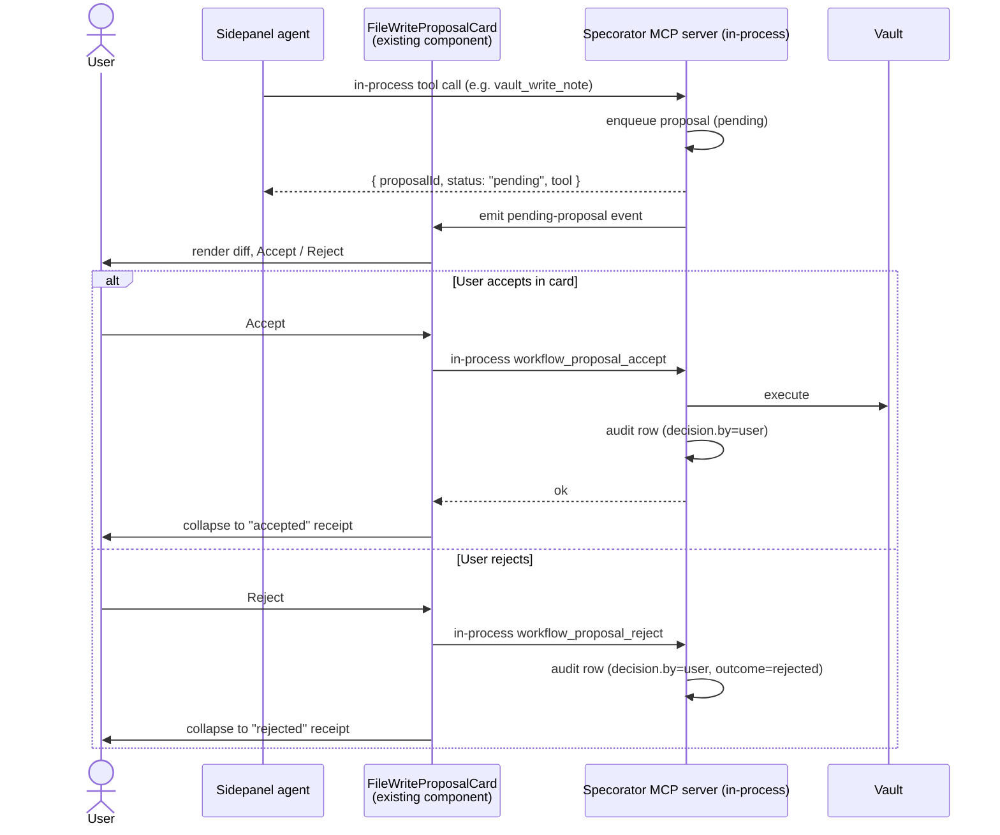
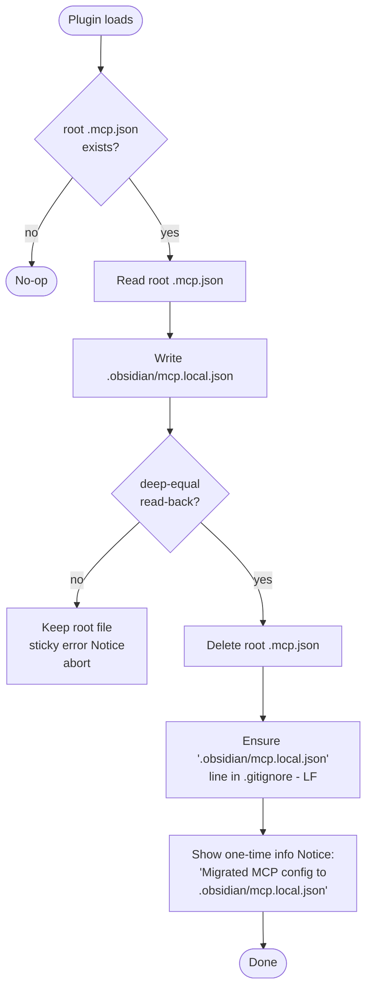
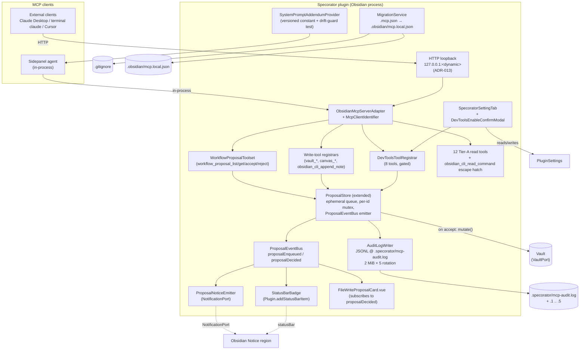

# Design — Host-side MCP proposal queue + Tier-A read expansion + tier-policy UX

> Scaffold. Parts A/B/C drafted by ux-designer / ui-designer / architect in sequence per `/spec:design` recipe. Cross-cutting requirements-coverage table closed by architect.

## Context

_To be drafted by architect at Part C synthesis time._

## Goals (design-level)

- D1 …

## Non-goals

- ND1 …

---

## Part A — UX

> Owner: ux-designer. Defines flows, IA, states, and accessibility — not visual treatment (Part B) or data flow (Part C). All REQ references trace back to `specs/mcp-host-side-proposals/requirements.md`.

### Scope of user-facing surfaces

This feature touches **four surfaces** and adds **no new Obsidian view** (per NG4):

1. **External MCP clients** (Claude Desktop, terminal `claude`, Cursor) — the *primary* approval surface for this feature. Specorator emits only the MCP tool contract; the client owns rendering.
2. **Specorator sidepanel agent** — existing in-product chat thread; existing `FileWriteProposalCard` continues to render when a proposal originates in-process.
3. **Obsidian chrome** — status-bar item (badge) + `NotificationPort` notices, both new surfaces for pending-proposal discovery (CLAR-MHP-017).
4. **Specorator settings tab** — DevTools opt-in matrix (new section), `requireExplicitAcceptForAllWrites` + `devtoolsAutoAcceptLowRisk` + `writeProjectMcpConfig` toggles.

### User flows

#### F1 — External-client write end-to-end (the headline flow)

Satisfies REQ-MHP-001, -002, -004, -005, -008, -017 (surfacing side), -022, -034, -035, -036, -037, -039, -040.

```mermaid
sequenceDiagram
    actor User
    participant Client as External MCP client<br/>(Claude Desktop / terminal claude)
    participant MCP as Specorator MCP server
    participant Surface as Obsidian chrome<br/>(status bar + Notice)
    participant Vault

    User->>Client: "Append outline notes to specs/foo/idea.md"
    Client->>MCP: tools/call vault_append_to_note { path, content, intent }
    MCP->>MCP: enqueue proposal (status=pending)
    MCP-->>Client: { proposalId, status: "pending", tool }
    MCP->>Surface: NotificationPort.showInfo("Pending MCP proposal from <client.id>")
    MCP->>Surface: status-bar badge += 1
    Note over Client: Agent narrates "Queued; awaiting your approval"<br/>(per system-prompt addendum, REQ-MHP-032)
    User->>Client: "list pending"
    Client->>MCP: tools/call workflow_proposal_list
    MCP-->>Client: [{ id, kind, intent, paths, client.id, ... }]
    User->>Client: "show me <id>"
    Client->>MCP: tools/call workflow_proposal_get { id }
    MCP-->>Client: full record incl. diff payload
    User->>Client: "accept"
    Client->>MCP: tools/call workflow_proposal_accept { id }
    MCP->>Vault: execute queued mutation
    Vault-->>MCP: ok
    MCP->>MCP: status=accepted; append audit row (decision.by=client)
    MCP->>Surface: status-bar badge -= 1
    MCP-->>Client: { ok: true }
```

**Decision moments:**
- Between `pending` response and user list/accept, the user may switch clients (start in Claude Desktop, finish in terminal `claude`). The MCP tools are host-agnostic by REQ-MHP-001/-004/-005, so accept from a *different* client than the one that proposed is a first-class flow.
- User may choose to never list — the Obsidian Notice + badge are the discovery affordance for "you have unfinished business" (CLAR-MHP-017).

#### F2 — Auto-accept active-feature append

Satisfies REQ-MHP-009 (auto-accept rule), -010 (opt-out), -022 (audit), -040 (`decision.by=auto`).

```mermaid
sequenceDiagram
    actor User
    participant Agent as Sidepanel agent<br/>(or any MCP client)
    participant MCP as Specorator MCP server
    participant Vault

    Agent->>MCP: tools/call vault_append_to_note { path: "specs/&lt;active&gt;/research.md", ... }
    MCP->>MCP: match path against active-feature rule
    MCP->>Vault: execute immediately
    Vault-->>MCP: ok
    MCP->>MCP: status=accepted; audit row (decision.by=auto, rule=active-feature-append)
    MCP-->>Agent: { proposalId, status: "accepted", tool }
    Note over Agent: No surfacing. No Notice. No badge increment.<br/>Audit row is the user-visible artefact.
```

**Why no user-visible surfacing here:** the auto-accept rule exists precisely to avoid surfacing noise during scaffold-heavy spec turns. The audit log is the receipt; surfacing belongs to the cases the user must act on.

> @ui-designer: F2's silent path means the sidepanel agent's existing transcript should still show a compact "appended to research.md" line so the user has a real-time receipt without leaving the conversation. Treatment (badge style on the existing message bubble vs. a discrete row) is yours to pick in Part B.

#### F3 — Sidepanel-agent write end-to-end (in-process path)

Satisfies REQ-MHP-008, -017 (surfacing applies equally to in-process), -034 (`client.transport=in-process`), -039, -040 (`decision.by=user` when accepted via card).



**Cross-surface invariant:** a proposal queued in-process is still listable + acceptable via external `workflow_proposal_*` tools. If the user accepts via terminal `claude` while the sidepanel card is open, the card must observe the decision and collapse to the same terminal receipt state — it must not present a stale Accept button.

> @architect: the cross-surface invariant requires an event-bus or store subscription on the proposal store; surface the contract to ui-designer so the card knows what to subscribe to.

#### F4 — List + reject from any client

Satisfies REQ-MHP-001, -005, -007 (reject on already-decided), -039, -040 (`decision.by=client`).

Step list:

1. User asks the agent in any MCP client: "what's pending?"
2. Client calls `workflow_proposal_list`. Server returns array.
3. Client renders the list using its own conventions (terminal table, chat bubble, sidebar list — not our concern).
4. User picks one to reject. Client calls `workflow_proposal_reject { id }`.
5. Server marks rejected, writes audit row (`decision.by=client`, `decision.outcome=rejected`), decrements badge, returns ok.
6. If the proposal was already decided (race with F1 accept), server returns MCP error `already_decided` carrying the prior decision (REQ-MHP-007). Client surfaces the error verbatim; no Specorator-side recovery flow.

#### F5 — DevTools opt-in journey

Satisfies REQ-MHP-016 (master toggle), -017 (per-tool toggles), -018 (master is precondition), -019 (always proposal-gated), -020 (`dev:cdp` always prompts), CLAR-MHP-010 (devtoolsAutoAcceptLowRisk).

Step list (first-time enable of a high-risk tool, the worst case):

1. User opens Specorator settings tab; scrolls to "DevTools (agent-driven)" section.
2. **State A — master off** (default). Section shows the master toggle as off, the `devtoolsAutoAcceptLowRisk` switch as disabled, and the five per-tool toggles as disabled (visually non-interactive). A short header explains "DevTools tools let agents read your screen, console output, and DOM. Off by default."
3. User flips master toggle on. Per-tool toggles for the five high-risk tools become interactive but remain off. `devtoolsAutoAcceptLowRisk` switch becomes interactive (still off by default). The three low-risk tools (`dev:screenshot`, `dev:errors`, `dev:console`) are now registered and callable; the section header changes to reflect the new state ("DevTools enabled. The three low-risk tools are now reachable.").
4. User flips `dev:dom` (or any high-risk per-tool) toggle on.
5. **Confirm modal opens** (blocking, focus-trapped). Body contains the verbatim threat paragraph for that specific tool from `research.md` §Q3 ("What it can access" / "Abuse vector" / "What remains the user's responsibility"). Two actions: primary "Enable `<tool>`" and secondary "Cancel". Primary action requires explicit click (no Enter-as-default per engagement.md §5 anti-pattern 3 — destructive enable must require deliberate gesture).
6. On confirm: tool is registered with the MCP server; settings row visibly reflects enabled state.
7. On cancel: setting reverts to off; focus returns to the toggle row.
8. **Special case for `dev:cdp`:** the modal copy includes a second sentence stating that even with this toggle on, every invocation will prompt (REQ-MHP-020) — no auto-accept is possible. This sets expectation before the first invocation.

> @ui-designer: the confirm modal is the load-bearing UX element here. Threat copy is verbatim from research.md §Q3 (Q3 paragraphs are user-facing). Pick the visual treatment (warning-band, padlock affordance, secondary-button placement) consistent with Obsidian's existing modal idiom. Don't soften the copy.

#### F6 — `.mcp.json` migration on plugin start

Satisfies REQ-MHP-027, -028, -029 (idempotence), -030, -031 (`.gitignore`).



**User-facing copy (notices):**
- Success (info, non-sticky default duration): `MCP config migrated to .obsidian/mcp.local.json. Original removed from vault root; .gitignore updated.`
- Failure (error, sticky per `NotificationPort.showError` default): `Could not migrate .mcp.json to .obsidian/mcp.local.json. Keeping the original at vault root. Check folder write permissions and reload the plugin.`

**Once-per-vault semantics:** the success Notice is tied to the migration event itself — it fires on the run where migration actually happens. F6 idempotence (REQ-MHP-029) means subsequent starts show no Notice at all because there is nothing to migrate.

#### F7 — Notice + status-bar discovery (passive surfacing)

Satisfies CLAR-MHP-017, REQ-MHP-022 (audit row precedes Notice; surfacing is post-enqueue).

**Trigger:** every transition that puts a proposal into `pending` state from an *external* (non-in-process) client OR from the sidepanel agent when the sidepanel is not the focused leaf.

**Surface composition:**

| Element | Behaviour |
|---|---|
| `NotificationPort.showInfo` notice | Fires once per new pending proposal. Copy: `Pending MCP proposal from <client.id> — review in your MCP client.` Duration: default non-sticky (info severity). Not stacked — if N proposals arrive in burst, last-write-wins on the message text but each still increments the badge. |
| Status-bar item | Always present once at least one proposal has ever been pending in the session. Shows "MCP: N pending" when N≥1. Hidden when N=0 (per engagement.md anti-pattern: no zero-state badge noise). Clicking it does **not** open a Specorator view (NG4) — it shows a tooltip-style ephemeral hint: `Pending proposals must be accepted from an MCP client. Use 'workflow_proposal_list' to view.` |

**Why the click does not open anything:** by design (NG4) there is no in-Obsidian queue view; the click would have nowhere to go. The hint reinforces that the canonical surface is the user's MCP client.

> @ui-designer: status-bar item — pick icon glyph + count formatting. Tooltip-on-click vs. ephemeral popover treatment is yours. Constraint from engagement.md §5: do NOT animate the badge increment (no slot-machine reinforcement).

### Information architecture

| Surface | Path / location | Reached how |
|---|---|---|
| DevTools settings section | Specorator settings tab → new "DevTools (agent-driven)" section, positioned below the existing `writeProjectMcpConfig` toggle inherited from the prior PR | Settings cog → Specorator |
| `requireExplicitAcceptForAllWrites` toggle | Same settings tab → "MCP write proposals" section (sibling to DevTools section, ordered first because it applies to all writes) | Same |
| `devtoolsAutoAcceptLowRisk` toggle | Inside the DevTools section, immediately below the master toggle | Same |
| Status-bar badge | Bottom status bar of Obsidian window | Always visible when N≥1 pending |
| Pending-proposal Notice | Top-right Obsidian Notice region | Fires on each new pending proposal |
| Audit log | `.specorator/mcp-audit.log` (+ rotated `.1`..`.5`) | File-explorer or external tooling; no in-product viewer ships in this feature |
| Migration Notice | Top-right Obsidian Notice region | One-time per migration event |
| Accept / reject affordance (external) | The user's MCP client's own UI | Calling `workflow_proposal_*` tools |
| Accept / reject affordance (in-process) | Existing `FileWriteProposalCard` in the sidepanel | Within the sidepanel chat thread |

**Deep-link convention:** none. There is no Specorator URL fragment / route added by this feature. Proposal records are addressed by `proposalId` strings inside MCP responses, not by URI.

### Empty / loading / error states

Per surface:

#### Settings → "MCP write proposals" section

| State | Behaviour |
|---|---|
| Default | `requireExplicitAcceptForAllWrites` toggle shown off. Helper text below: `When on, every MCP write — including spec-folder appends — must be accepted from your MCP client or the sidepanel card.` |
| On | Same toggle, on. Helper text changes to: `Auto-accept disabled. All writes queue as pending.` |

#### Settings → "DevTools (agent-driven)" section

| State | Behaviour |
|---|---|
| Master off (default) | Master toggle visible and off. `devtoolsAutoAcceptLowRisk` and the five per-tool toggles rendered but visually disabled (non-interactive); helper text under each disabled toggle reads `Enable DevTools first.` Per-tool toggles still display the tool name and one-line risk summary so the user can read the surface before opting in. |
| Master on, all per-tool off | Master on. `devtoolsAutoAcceptLowRisk` interactive and off. Per-tool toggles interactive and off. Header reads `DevTools enabled. Three low-risk tools (screenshot, errors, console) are now reachable.` |
| Master on, some per-tool on | As above, with each enabled per-tool showing its enabled state. No aggregate counter — the user sees the rows. |
| Confirm modal — opening | Focus moves to the modal's heading; primary button is the destructive enable; secondary is Cancel. Body shows the verbatim threat paragraph for the tool. Keyboard: `Esc` cancels; Tab cycles between the two buttons; no default-action key (Enter does nothing on the body — see F5 step 5 rationale). |
| Confirm modal — failure to register tool (e.g. server not running) | Modal stays open; primary button becomes momentarily disabled; an inline error message appears under the button: `Could not enable <tool>. Try reloading the plugin.` No silent revert. |

#### Status-bar badge

| State | Behaviour |
|---|---|
| Zero pending | Item is **hidden** (not "0 pending"). Avoids the engagement.md anti-pattern of giving the badge a permanent residence the eye learns to ignore. |
| One pending | `MCP: 1 pending` |
| N pending (N≥2) | `MCP: N pending` |
| Click (any N≥1) | Ephemeral hint as F7. No view opens. |
| Update animation | None (engagement.md §5). Plain count substitution. |

#### Notice on new pending proposal (F7)

| State | Behaviour |
|---|---|
| First proposal in a quiet session | Notice fires with the F7 copy. Standard info-severity duration. |
| Burst (≥2 within the standard Notice duration) | Subsequent Notices replace prior text in-place; the badge still increments per proposal so the running count is the ground truth, not the Notice. Do not coalesce ("3 new") in v1 — the count lives in the badge. |
| Sidepanel is the focused leaf | Notice still fires because the user may not be looking at the sidepanel even when it has focus. Cheap to read; suppression heuristics deferred. |

> @architect: confirm whether the proposal store emits an event for every transition into `pending` that the surfacing module can subscribe to — surfacing logic should not poll.

#### `.mcp.json` migration

| State | Behaviour |
|---|---|
| No root `.mcp.json` (steady state) | Silent no-op. No Notice. (REQ-MHP-029.) |
| Migration runs successfully | F6 success Notice (info, non-sticky). |
| Verification fails / `.obsidian/` not writable | F6 failure Notice (error, sticky). Root file preserved. Plugin starts normally; MCP server reads from root `.mcp.json` as a fallback **only if** that is its existing pre-feature behaviour — otherwise the user must reload after fixing permissions. |
| Migration succeeds but `.gitignore` write fails | Migration is considered complete (root file is gone, new file is in place). A second info Notice fires: `Migrated MCP config but could not update .gitignore. Add '.obsidian/mcp.local.json' manually.` (Two Notices is the right shape — the user has different remedies.) |

> @architect: confirm whether `.gitignore` write failure can happen independently of the migration write succeeding; if VaultPort raises the same error class, this two-Notice path may collapse to one.

#### Audit log

| State | Behaviour |
|---|---|
| First write ever (folder absent) | `.specorator/` created silently before first append (REQ-MHP-026). No Notice. |
| Rotation event (file crosses 2 MiB) | Silent. Rotation is housekeeping; surfacing it would spam users with frequent agents. (REQ-MHP-024.) |
| Append fails (filesystem error) | Sticky error Notice per REQ-MHP-025. Copy: `Could not write MCP audit row. Vault mutation completed; audit log is now incomplete.` LoggerPort.error also fires (developer surface). |

### Accessibility considerations

**Keyboard navigation.**

- Settings page DevTools section: tab order is master toggle → `devtoolsAutoAcceptLowRisk` → low-risk descriptive helper (non-focusable) → `dev:dom` row (label + toggle, single tab stop with arrow-key activation matching Obsidian's existing setting-row convention) → `dev:cdp` row → `dev:debug` row → `dev:mobile` row → `devtools` row. Disabled per-tool toggles (master off) are skipped by tab; they remain visible for transparency but are not focusable until master enables them.
- Confirm modal: focus moves to the modal heading on open (not to a button — gives a screen reader a moment to read the body before the user fires the action). `Tab` cycles `Cancel` → `Enable <tool>` → back. `Esc` cancels. No default-action keypress; the user must explicitly focus and activate the primary button.
- Status-bar item: focusable via Obsidian's status-bar keyboard nav; `Enter` invokes the same hint surface as click.

**Focus management.**

- Confirm modal close (cancel or success): focus returns to the per-tool toggle that opened it.
- Confirm modal close on registration failure: focus stays on the modal's inline error message.
- Notice surfaces (migration, pending-proposal, audit-error): non-focusable by Obsidian convention. Critical state (audit-error) is duplicated in the LoggerPort so screen-reader users running with a log viewer are not the only path.

**ARIA / screen-reader copy.**

- Status-bar item: announce as `aria-live="polite"` with text `MCP pending proposals: <N>`. Polite rather than assertive because the badge is informational, not actionable on its own surface — assertive would interrupt typing in the sidepanel which is the user's active task.
- Confirm modal: `role="alertdialog"` with `aria-labelledby` on the heading and `aria-describedby` on the threat paragraph body. The threat paragraph is read in full; do not collapse it behind a "show more" pattern.
- Pending-proposal Notice: relies on Obsidian's existing Notice ARIA. Copy uses no icons-as-meaning; the client identifier is plain text so screen readers read `Pending MCP proposal from Claude Desktop` cleanly.
- Migration Notices: same — plain text, no glyph-borne meaning.
- Per-tool toggle rows in settings: each row's label includes the tool name **and** its one-line risk summary so toggle state is meaningful without needing to read the surrounding section header. Example label text: `dev:dom — Reads the full text of every open note and frontmatter via DOM selector.`

**High-contrast / theme robustness.**

- Status-bar badge: must remain legible against any Obsidian theme. > @ui-designer: pick semantic CSS variables (`var(--text-normal)` / `var(--background-modifier-border)`-family tokens) rather than hard-coded colours. Do not rely on colour alone to convey "pending" — the text `MCP: N pending` is the signal.
- Confirm modal warning treatment (the "this is dangerous" framing): must work in high-contrast mode. Use border weight + icon-with-text, not red-only.
- Disabled per-tool rows (master off): contrast must remain WCAG 2.2 AA compliant (NFR-MHP-011) — typical "ghost" greys fail. > @ui-designer: validate the disabled treatment against the AA contrast ratio for the active Obsidian themes.

**Reduced-motion.**

- No badge animations, no Notice slide-ins beyond Obsidian defaults. Engagement.md anti-pattern compliance is also a reduced-motion win.

### Things this Part A deliberately does not specify

- Visual treatment of the status-bar badge, confirm modal, settings rows, or in-sidepanel auto-accept receipt — **Part B**.
- Component identity (which existing Vue component vs. new — e.g. is the confirm modal a new component or a parameterised existing one) — **Part B**.
- Schema of the in-memory proposal store, event-bus mechanics for cross-surface invariants, header-vs-`initialize` client-identity wiring (CLAR-MHP-006 resolution mechanics) — **Part C**.
- Audit-log file-handling concurrency (single writer? lock?) — **Part C**.
- Whether the pending-proposal Notice and the status-bar update are emitted by the same domain event or by two listeners — **Part C**.

---

## Part B — UI

> Owner: ui-designer. Resolves every `> @ui-designer:` hand-off marker from Part A. Visual treatment, component identity, exact microcopy, token bindings. Does not introduce new flows (Part A) or data shapes (Part C). All token names below are existing Obsidian CSS variables (e.g. `--text-normal`) or Specorator's existing `--sp-…` namespace as established in `styles.css`; any NEW token is flagged explicitly.

### Key screens / states

One row per discrete UI state introduced or modified by this feature. "Reference" cites an existing Vue component, the settings tab pattern, or `n/a — new` for visuals that do not yet exist. Storybook story IDs are placeholders; the implementer-stage Storybook task (see release criteria) wires them.

| # | Surface | State | Purpose | Reference |
|---|---|---|---|---|
| S01 | Settings → MCP write proposals section | `requireExplicitAcceptForAllWrites` toggle, off | Default; shows helper text "When on, every MCP write — including spec-folder appends — must be accepted from your MCP client or the sidepanel card." | Existing `Setting` row pattern in `src/plugin/settings.ts` (see `settings-write-project-mcp-config`) |
| S02 | Settings → MCP write proposals section | `requireExplicitAcceptForAllWrites` toggle, on | Helper text swaps to "Auto-accept disabled. All writes queue as pending." | Same |
| S03 | Settings → DevTools (agent-driven) section | Master off (default) | Header copy; master toggle off; `devtoolsAutoAcceptLowRisk` row visually disabled; five per-tool toggle rows visually disabled but with names + one-line risk summaries readable | `n/a — new` (composes existing `Setting` + a new `DevToolsToggleRow` helper, see Components) |
| S04 | Settings → DevTools | Master on, all per-tool off | Master on; `devtoolsAutoAcceptLowRisk` interactive and off; per-tool rows interactive and off; header updates per F5 step 3 | Same |
| S05 | Settings → DevTools | Master on, mix of per-tool on/off | Each enabled row visually distinct (toggle state) | Same |
| S06 | Settings → DevTools | Confirm modal — closed | n/a (no UI). | n/a |
| S07 | Settings → DevTools | Confirm modal — open | Focus on heading; threat paragraph (verbatim from research.md §Q3) shown; primary "Enable `<tool>`" and secondary "Cancel"; primary is destructive-styled | `n/a — new` (subclass of Obsidian `Modal`, see Components) |
| S08 | Settings → DevTools | Confirm modal — confirming (registration in flight) | Primary button briefly disabled; cancel remains enabled | Same |
| S09 | Settings → DevTools | Confirm modal — error (register failed) | Inline error message under buttons: "Could not enable `<tool>`. Try reloading the plugin." Modal stays open. | Same |
| S10 | Status bar | Hidden (count = 0) | Per F7 + engagement.md anti-pattern: no zero-state residence. Status-bar item removed from DOM, not just `display:none` | `n/a — new` (`Plugin.addStatusBarItem()`, see Components) |
| S11 | Status bar | Visible — 1 pending | Glyph + label `MCP: 1 pending`. `aria-live=polite` (per Part A). | Same |
| S12 | Status bar | Visible — N pending (2 ≤ N ≤ 99) | `MCP: N pending`. Plain count substitution; no animation. | Same |
| S13 | Status bar | Visible — N ≥ 100 | Renders as absolute integer (e.g. `MCP: 142 pending`). Decision below: no "99+" truncation. | Same |
| S14 | Status bar | Click / Enter | Ephemeral hint (Obsidian-native `Notice`, 4 s): "Pending proposals are accepted from your MCP client. Run `workflow_proposal_list` to view." | Same |
| S15 | Notice surface | New pending proposal (single) | Info severity (non-sticky). Text: "Pending MCP proposal from `<client.id>`. Review in your MCP client." | Existing `NotificationPort.showInfo` |
| S16 | Notice surface | New pending proposal (rapid burst — second arrives before prior dismisses) | Subsequent Notice replaces the prior text in-place per Part A; badge increments independently. Copy template unchanged (single-proposal form is the ground truth). No "3 new" coalescence in v1. | Same |
| S17 | Notice surface | Migration success | Info (non-sticky). Text per Part A F6 success copy. | Same |
| S18 | Notice surface | Migration partial (gitignore-only failure) | Info (non-sticky), fires *after* the success Notice. Text per Part A F6 partial copy. | Same |
| S19 | Notice surface | Migration failure | Error (sticky per `NotificationPort.showError` default). Text per Part A F6 failure copy. | Existing `NotificationPort.showError` |
| S19-extension | Notice surface | Migration conflict (both files present — EC-MHP-041) | Error (sticky). Text: "Both .mcp.json and .obsidian/mcp.local.json exist. Resolve manually before reload." Migration aborts; neither file is touched. | Existing `NotificationPort.showError` |
| S20 | Notice surface | Audit-log append failed | Error (sticky). Text: "Could not write MCP audit row. Vault mutation completed; audit log is now incomplete." | Same |
| S21 | `FileWriteProposalCard` | pending (existing) | Unchanged. `proposal-card-accept` / `proposal-card-reject` visible. | `src/ui/components/chat/FileWriteProposalCard.vue` (current) |
| S22 | `FileWriteProposalCard` | accepted (existing) | Unchanged accepted-body block. Now also reachable via cross-surface invariant (S24). | Same |
| S23 | `FileWriteProposalCard` | rejected (existing) | Unchanged. | Same |
| S24 | `FileWriteProposalCard` | externally-decided (NEW) | When external client decides while card is open: card transitions to the existing `accepted` or `rejected` visual *plus* a one-line provenance note under the body: "Decided in `<client.id>`." Accept / Reject buttons disappear (same as existing accepted/rejected branches). This is a render-time variant of the existing terminal states, NOT a fifth render state. | Modified `FileWriteProposalCard.vue` |
| S25 | Sidepanel chat transcript | F2 auto-accept receipt (NEW) | Inline compact row inside the agent's message bubble, immediately below the text that announced the call. One line: "Appended to `<path>`." Muted text colour. No card, no buttons. | `n/a — new` (small presentational component, see Components) |
| S26 | Sidepanel chat transcript | Auto-accept receipt — DevTools low-risk variant | Same shape as S25 but copy: "Ran `<tool>`." (no path; DevTools tools do not target vault paths). Only renders when `devtoolsAutoAcceptLowRisk = true` AND tool was in the low-risk three. | Same |

### Components

Inventory: which component renders which state. Inherits from existing patterns wherever possible; any NEW component is justified inline.

| Component | Layer | States | New / existing | Justification (if new) |
|---|---|---|---|---|
| `Setting` (Obsidian native) + `addToggle` | Plugin chrome (settings tab) | S01, S02, S03 master row, S04, S05 | Existing | Reuses the existing settings-tab pattern (`renderMcpServerStatus`, `renderApprovalRulesSection`). |
| `Modal` subclass `DevToolsEnableConfirmModal` | Plugin chrome | S06–S09 | **NEW** | Obsidian's settings API has no native confirm-modal primitive; existing `Modal` subclasses in the codebase (e.g. confirm flows referenced in `CLAUDE.md` §DOM construction) are bespoke. This one is parameterised by tool id + threat paragraph; cannot be derived from a `Setting` row. Lives in `src/plugin/settings/DevToolsEnableConfirmModal.ts`. |
| `Plugin.addStatusBarItem()` DOM block | Plugin chrome | S10–S14 | Existing API, **NEW** call-site | First Specorator use of the status-bar API. Pure DOM (no Vue — plugin chrome does not host Vue per `no-restricted-imports`). Lives in `src/plugin/SpecoratorStatusBar.ts`. |
| `NotificationPort` (existing port) | Application | S15–S20 | Existing | All notices route through `FeedbackService` → `NotificationPort` per ADR-008 + CLAR-MHP-017. No new component. |
| `FileWriteProposalCard.vue` | UI (Vue) | S21–S24 | Existing — **MODIFIED for S24** | Add a `decidedBy: 'self' \| 'external'` derived flag + a `decidedClient?: string` prop. When `decidedBy === 'external'`, render the existing `accepted` / `rejected` terminal block with an appended `<p data-testid="proposal-card-decided-elsewhere">Decided in {{ decidedClient }}.</p>`. No new render state — this is a presentational variant of the existing terminal states (matches the F3 cross-surface invariant: the card must observe the decision, not fight it). |
| `AutoAcceptReceipt.vue` | UI (Vue) | S25, S26 | **NEW** | Sidepanel message bubbles currently host either prose, a tool-call block, or `FileWriteProposalCard`. None of these is the right shape: prose drops typed metadata, the tool-call block is the agent's request (not the user's receipt), and the proposal card is wrong because there's nothing to accept. A 30-line presentational component renders a one-line muted row with a `data-testid="auto-accept-receipt"` hook. Reusable for both F2 (vault append) and DevTools-low-risk auto-accept (S26). Lives in `src/ui/components/chat/AutoAcceptReceipt.vue`. |
| `DevToolsToggleRow` helper function | Plugin chrome | S03 disabled rows, S04 enabled rows | **NEW (helper, not class)** | Not a Vue component; a private method on `SpecoratorSettingTab` (e.g. `renderDevToolsToggleRow(containerEl, toolId, riskSummary, masterEnabled)`) that produces a `Setting` with toggle, helper text under the row, and the disabled-when-master-off treatment. Justified because all five high-risk rows share the same skeleton (label + risk summary + toggle + opens confirm modal on user enable). Without the helper we copy-paste five times. |

No other new components. The DevTools section uses repeated `Setting` rows; no list / grid abstraction required.

### Tokens

All values resolve to existing Obsidian CSS variables or to existing `--sp-…` custom properties in `styles.css`. Any new token is flagged as `NEW` and proposed for addition. The implementation PR must either land the listed token or escalate.

#### Existing tokens reused (no additions)

| Surface | Property | Token |
|---|---|---|
| Status-bar item label colour | `color` | `var(--text-normal)` |
| Status-bar item glyph colour | `color` | `var(--text-muted)` (inactive) / `var(--text-normal)` (focused) |
| Status-bar item background | `background` | inherits status-bar background (Obsidian-owned) — no override |
| Status-bar item focus ring | `outline` | `2px solid var(--interactive-accent); outline-offset: 2px` (matches `FileWriteProposalCard.__heading:focus-visible`) |
| Confirm modal heading | `color`, `font-family` | `var(--text-normal)`, `var(--font-text)` |
| Confirm modal body (threat paragraph) | `color` | `var(--text-normal)` (full-strength — threat copy must not be muted) |
| Confirm modal warning band border | `border-left`, `padding-left` | `4px solid var(--text-error)`, `0.75rem` (uses Obsidian's existing `--text-error` token; no new red) |
| Confirm modal primary button (destructive) | `class` | Obsidian's `mod-warning` class on the `<button>` — already styled for destructive intent and theme-aware in dark/light/high-contrast |
| Confirm modal cancel button | `class` | Obsidian's default `<button>` (no modifier) — secondary by absence |
| Confirm modal inline error (S09) | `color` | `var(--text-error)` |
| Disabled per-tool toggle row label (S03) | `color` | `var(--text-normal)` — **NOT** `var(--text-muted)`; see NFR-MHP-011 below |
| Disabled per-tool toggle row helper text | `color` | `var(--text-muted)` |
| Disabled per-tool toggle row container | `opacity` | **1.0** (not the typical `0.5` "ghost"); the toggle itself communicates non-interactivity via `disabled` attribute + Obsidian's native disabled toggle visual |
| Auto-accept receipt row | `color`, `font-size` | `var(--text-muted)`, `0.8125rem` (matches existing `.sp-proposal-card__content` font-size for visual continuity within the bubble) |
| Auto-accept receipt path/tool code span | `font-family` | `var(--font-monospace)` |
| Cross-surface decided-elsewhere note (S24) | `color`, `font-style` | `var(--text-muted)`, `italic` |

#### Decisions deliberately rejecting new tokens

- **Status-bar badge background pill.** Considered: a coloured pill background (e.g. accent-on-secondary) to draw the eye. Rejected: (a) engagement.md anti-pattern (slot-machine reinforcement); (b) introducing a pill colour means choosing one that survives high-contrast mode, and the user already gets the count from the text label. The status-bar item is plain text with the glyph; no pill, no badge background. The text `MCP: N pending` is the entire signal.
- **`mod-cta` on the confirm primary.** Rejected: `mod-cta` reads as "the safe path forward" in Obsidian's idiom (used on onboarding "Get started" buttons). Enabling a high-risk DevTools tool is not a CTA; it's a destructive opt-in. `mod-warning` correctly carries the "this is the dangerous button" weight.
- **Default-action key on confirm modal.** No `Enter` binding to primary. Engagement.md §5 anti-pattern 3 — destructive enable must require a deliberate gesture. The user must focus the primary button explicitly and press `Space` / `Enter` once focused.

#### NEW tokens proposed (1)

| Token | Surface | Value (proposed) | Why a new token is needed |
|---|---|---|---|
| `--sp-status-bar-glyph-size` | Status-bar glyph (S11–S14) | `0.875rem` (≈ 14 px at default zoom) | Status-bar text inherits Obsidian's status-bar font-size; the leading glyph (Obsidian icon, name TBD in implementation — proposed `circle-dot` or `bell`) needs an explicit size so it does not float above/below the count text. Single-use; tiny scope. Add to `styles.css` under the `:root` Specorator scope. If the implementer finds Obsidian's status-bar icons size identically without override, drop this token. |

No new colour tokens. The intentional minimalism preserves theme robustness (NFR-MHP-011) — we do not introduce a colour the user's theme has not vetted.

#### NFR-MHP-011 (WCAG 2.2 AA contrast) assertions

| Surface | Combo | Required ratio | How met |
|---|---|---|---|
| Status-bar item label | `var(--text-normal)` on Obsidian status-bar background | ≥ 4.5:1 normal text | Inherits Obsidian's own contrast guarantees for status-bar text (Obsidian themes are pre-validated). Asserted by Storybook visual regression on the three shipped themes (default-dark, default-light, high-contrast). |
| Confirm modal heading + body | `var(--text-normal)` on modal background | ≥ 4.5:1 | Obsidian native; same as every other modal. |
| Confirm modal warning border | `var(--text-error)` 4 px against modal background | ≥ 3:1 non-text | `--text-error` is theme-vetted; the 4 px weight + the inline error glyph (lucide `triangle-alert`, see Content) means the warning is conveyed by border weight + icon + copy, never by colour alone. |
| Confirm modal primary button | `mod-warning` text on `mod-warning` background | ≥ 4.5:1 | Obsidian-owned class; vetted in core. |
| Disabled per-tool toggle row label (S03) | `var(--text-normal)` on `var(--background-primary)` at `opacity: 1.0` | ≥ 4.5:1 | The "disabled" state is communicated by the toggle's own disabled visual + an explicit `aria-disabled="true"` on the row + helper text "Enable DevTools first." — NOT by greying out the label. This keeps label text at full contrast and prevents the engagement.md anti-pattern of users skimming past unreadable rows. Helper text uses `--text-muted` which is theme-vetted at ≥ 4.5:1 for body copy. |
| Auto-accept receipt row | `var(--text-muted)` on bubble background | ≥ 4.5:1 | `--text-muted` is Obsidian-vetted. |
| Cross-surface decided-elsewhere note | `var(--text-muted)` italic on `var(--background-secondary)` | ≥ 4.5:1 | Same. Italic is not a contrast modifier — colour ratio is what counts. |

The Storybook story for the DevTools settings section + the confirm modal MUST include an axe-core scan (or equivalent) so NFR-MHP-011 is asserted automatically and regresses loudly, per the requirements release-criteria checkbox.

### Content (microcopy, headings, error messages)

**Voice rules (carried from `docs/steering/product.md` conventions and the existing settings tab):** sentence case, terminating period, ≤ 2 sentences per description, no exclamation marks, no emoji, no "we" / "you should" — instructions are imperative or third-person factual.

All strings below are **verbatim**. Implementer must paste — not paraphrase. i18n: strings used inside Vue components (`AutoAcceptReceipt.vue`, the modified `FileWriteProposalCard.vue`) live in the existing i18n message bundle (sibling keys to `chat.proposal.*`). Strings used in plugin chrome (settings tab, status bar, notices, confirm modal) are inline TypeScript constants per the existing settings-tab pattern (no i18n on plugin chrome today; introducing one is out of scope).

#### Settings — section headings

- DevTools section heading: `DevTools (agent-driven)`
- DevTools section description paragraph (rendered once at the top of the section, regardless of state):
  > `DevTools tools let agents read your screen, console output, and DOM. All eight tools are off by default. The three low-risk tools can be auto-accepted; the five high-risk tools always queue a proposal.`

#### Settings — `requireExplicitAcceptForAllWrites` toggle

- Name: `Require explicit accept for all writes`
- Description (off state): `When on, every MCP write — including spec-folder appends — must be accepted from your MCP client or the sidepanel card.`
- Description (on state): `Auto-accept disabled. All writes queue as pending.`
- `data-testid`: `settings-require-explicit-accept`

#### Settings — `devtoolsAutoAcceptLowRisk` toggle

- Name: `Auto-accept low-risk DevTools tools`
- Description: `When on, calls to dev:screenshot, dev:errors, and dev:console run immediately and post a receipt. High-risk DevTools tools still queue a proposal.`
- `data-testid`: `settings-devtools-auto-accept-low-risk`

#### Settings — DevTools master toggle

- Name: `Enable DevTools tools`
- Description: `Off by default. When on, the three low-risk DevTools tools become reachable. The five high-risk tools each need their own opt-in below.`
- `data-testid`: `settings-devtools-master`

#### Settings — DevTools per-tool toggles (labels + risk summaries)

Each row's label is the tool id; description is the one-line risk summary. Threat paragraphs go in the confirm modal, not the row. (Row-level data-testid pattern: `settings-devtools-tool-<toolId>` with `:` replaced by `-` for selector compatibility — e.g. `settings-devtools-tool-dev-dom`.)

- `dev:screenshot` — `Captures a PNG of the active Obsidian window. Result is not written to the audit log.`
- `dev:errors` — `Reads the Obsidian developer console error stream.`
- `dev:console` — `Reads the Obsidian developer console log stream.`
- `dev:dom` — `Reads the full text of every open note and frontmatter via DOM selector.`
- `dev:cdp` — `Sends commands to Chrome DevTools Protocol. Always prompts, even with auto-accept on.`
- `dev:debug` — `Toggles Obsidian's verbose debug mode.`
- `dev:mobile` — `Switches Obsidian into mobile-emulation mode.`
- `devtools` — `Opens Obsidian's DevTools window.`

Disabled-row helper text (S03, under each disabled toggle): `Enable DevTools first.`

#### Settings — DevTools confirm modal (S07–S09)

- Title: `Enable <tool>?` — interpolation point: literal tool id (e.g. `Enable dev:dom?`).
- Body: the verbatim threat paragraph for `<tool>` from `research.md` §Q3. Interpolation point: paragraph text. Implementation reads from the same constant the per-tool risk summary is sourced from (single source of truth — when ADR-019 lands, both surfaces update together). No abridgment, no "show more" collapse.
- For `dev:cdp` only: append this sentence as a second paragraph after the threat paragraph: `Even with this toggle on, every dev:cdp invocation prompts for approval.`
- Primary button label: `Enable <tool>` — same interpolation as title (e.g. `Enable dev:dom`). Class: `mod-warning`. `data-testid`: `devtools-confirm-enable`.
- Secondary button label: `Cancel`. `data-testid`: `devtools-confirm-cancel`.
- Inline error message (S09): `Could not enable <tool>. Try reloading the plugin.` `data-testid`: `devtools-confirm-error`.
- Modal root `data-testid`: `devtools-confirm-modal`.
- Modal `aria-labelledby`: heading element id; `aria-describedby`: threat paragraph id (per Part A).
- Warning glyph (left of heading): Obsidian icon `triangle-alert` (lucide). Conveys "this is dangerous" alongside the copy and border treatment — never colour alone.

#### Status-bar item (S10–S14)

- Glyph: Obsidian icon name — proposed `bell` (alternative: `circle-dot`). Implementer picks one; both convey "attention pending" without celebrating it. No animation.
- Label template (N ≥ 1): `MCP: <N> pending` — interpolation point is the integer count. No "99+" truncation; N renders as its absolute integer up to the queue cap (1000 per CLAR-MHP-009).
- `aria-label` template: `<N> pending MCP proposal` when N=1; `<N> pending MCP proposals` when N ≥ 2. Singular/plural branch on N === 1.
- `aria-live`: `polite` (carried from Part A).
- Click / Enter hint Notice copy: `Pending proposals are accepted from your MCP client. Run workflow_proposal_list to view.` (4 s duration; info severity.)
- `data-testid` on the status-bar root element: `mcp-status-bar`.
- Tooltip on hover (Obsidian native `aria-label` → tooltip): same as `aria-label` above.

#### Notices — pending proposal (S15, S16)

- Copy: `Pending MCP proposal from <client.id>. Review in your MCP client.` Interpolation point: `<client.id>` is the value from the proposal record (per REQ-MHP-034). For `client.id === "unknown"` the copy renders literally: `Pending MCP proposal from unknown. Review in your MCP client.` — no special-casing; "unknown" is the documented client.id per REQ-MHP-035 and the user should see the same string they would see in `workflow_proposal_list`.
- Severity: info (non-sticky default duration).
- No `data-testid` (Notices are Obsidian-owned DOM; tests assert via NotificationPort spy, not selector).

#### Notices — migration (S17–S19)

- Success (S17, info, non-sticky): `MCP config migrated to .obsidian/mcp.local.json. Original removed from vault root; .gitignore updated.`
- Partial (S18, info, non-sticky, fires after success): `Migrated MCP config but could not update .gitignore. Add ".obsidian/mcp.local.json" manually.`
- Failure (S19, error, sticky): `Could not migrate .mcp.json to .obsidian/mcp.local.json. Keeping the original at vault root. Check folder write permissions and reload the plugin.`
- Conflict (S19-extension / EC-MHP-041, error, sticky): `Both .mcp.json and .obsidian/mcp.local.json exist. Resolve manually before reload.` Fires when the plugin starts with both files present; migration aborts without touching either file. The user must delete or rename one of the two before reloading the plugin.

#### Notice — audit-log append failed (S20)

- Severity: error, sticky.
- Copy: `Could not write MCP audit row. Vault mutation completed; audit log is now incomplete.`

#### `FileWriteProposalCard.vue` — S24 addition (decided externally)

New i18n key:

- `chat.proposal.decidedElsewhereBody`: `Decided in {client}.` Interpolation: `{client}` is the `client.id` of the deciding client; falls back to `unknown` per REQ-MHP-035 — same casing as the Notice for consistency.
- New `data-testid`: `proposal-card-decided-elsewhere`.

No other copy changes. The existing `acceptedBody` / `rejectedBody` keys still apply (the card still went to one of those two terminal states; the new note is additive).

#### `AutoAcceptReceipt.vue` — S25, S26

New i18n keys (sibling to `chat.proposal.*`):

- `chat.autoAccept.vaultAppendBody`: `Appended to {path}.` Interpolation: `{path}` is the vault-relative POSIX path per REQ-MHP-023.
- `chat.autoAccept.devtoolsLowRiskBody`: `Ran {tool}.` Interpolation: `{tool}` is the tool id, e.g. `dev:screenshot`.
- `chat.autoAccept.regionAriaLabel`: `Automatic accept receipt.`

`data-testid`: `auto-accept-receipt` on the root; `data-testid="auto-accept-receipt-path"` on the `<code>` span for the path; `data-testid="auto-accept-receipt-tool"` on the `<code>` span for the tool id.

#### Summary count

24 verbatim microcopy strings across notices, settings, modal, status bar, card and receipt; plus 8 per-tool risk summaries; plus 8 confirm-modal threat-paragraph interpolation points sourced verbatim from `research.md` §Q3. Total ≈ 40 author-controlled strings ready for implementer paste.

### Things this Part B deliberately does not specify

- Per-tool **threat-paragraph text** — sourced verbatim from `research.md` §Q3 at implementation time (single source of truth; ADR-019 will codify). Part B does not duplicate that text here.
- The **proposal-store event contract** that drives the cross-surface invariant (S24) — `> @architect`: see Part A's existing hand-off; Part B assumes a `proposalDecided` event the card can subscribe to via its existing Pinia store.
- The exact **i18n bundle path** for the new keys — defers to the existing `chat.proposal.*` location (architect / dev to confirm at implementation).
- The **Storybook scaffold** for axe-core scans — captured as a release-criteria checkbox in `requirements.md` (DevTools settings warning copy NFR-MHP-011); the implementer writes the story.

---

## Part C — Architecture

> Owner: architect. Closes the data-flow, store-event, and audit-log questions raised by Parts A and B. No new ADR is authored beyond ADR-019 (`docs/adr/ADR-019-mcp-tier-policy-and-devtools-opt-in.md`); the other key decisions are recorded inline. The existing `ProposalStore` (`src/infrastructure/obsidian/ProposalStore.ts`) is **extended**, not replaced — every change is additive to its public surface so ADR-013 is amended, not regressed.

### System overview



The diagram shows the production wiring. ADR-013's "loopback + dynamic port + Host-header gate" boundary is unchanged; the adapter now (a) attaches a `McpClientIdentifier` to each connection during the MCP `initialize` handshake (REQ-MHP-034) and (b) routes every store transition through a `ProposalEventBus` that the surfacing surfaces (`ProposalNoticeEmitter`, `StatusBarBadge`, `FileWriteProposalCard.vue`) subscribe to. The audit writer is on the **store** side of the boundary — it writes regardless of which client decided the proposal (`auto` | `user` | `client` | `shutdown`).

### Components and responsibilities

| Component | Layer | Responsibility | Owns | Dependencies | New / modified |
|---|---|---|---|---|---|
| `ProposalStore` | infrastructure | Ephemeral queue of pending proposals; per-id mutex serialises accept; capacity 1000 (`queue_full` on overflow, REQ-MHP-042); emits `proposalEnqueued` and `proposalDecided` events through the injected `ProposalEventBus`. Returns deep-cloned snapshots to readers (preserved from ADR-013). | The in-memory `Map<id, ProposalEntry>` and the mutex map. | `ProposalEventBus`, `AuditLogWriter` (writes audit row inside the critical section, before resolving the accept), `LoggerPort` (warn on error). | **MODIFIED** — extends existing `src/infrastructure/obsidian/ProposalStore.ts`; the existing `accept`/`reject`/`getAll`/`get`/`queue` methods stay; adds `acceptBy(id, decisionBy, clientId)`, `rejectBy(id, decisionBy, clientId)`, fields for `client`, `intent`, `kind`, `decision`, and an internal `Map<id, Promise<void>>` mutex map. The orphaned `acceptProposal`/`rejectProposal`/`getProposals` shims on `ObsidianMcpServerAdapter` are wired through the new methods (REQ-MHP-008). |
| `WorkflowProposalToolset` | infrastructure | Registers the four `workflow_proposal_*` MCP tools (REQ-MHP-001..005). Each tool delegates to a `ProposalStore` method via the adapter; never bypasses the store. | The four tool names + their input schemas; the mapping from MCP error code to store result. | `ProposalStore`, `McpClientIdentifier` (for `decision.by = "client"` provenance). | **NEW** — `src/infrastructure/obsidian/mcp/registerWorkflowProposalTools.ts`. |
| `McpClientIdentifier` | infrastructure | Captures `clientInfo.name` (and optional `version`) from each MCP `initialize` handshake; stashes per-connection. Falls back to `"unknown"` when the field is absent or malformed (REQ-MHP-034, REQ-MHP-035). | The per-connection `Map<connId, ClientIdentity>`. | The MCP transport's `initialize` hook (SDK-provided). | **NEW** — `src/infrastructure/obsidian/mcp/McpClientIdentifier.ts`. |
| `AuditLogWriter` | infrastructure | Appends JSONL rows to `.specorator/mcp-audit.log`; size-based rotation at 2 MiB × 5 files (REQ-MHP-024); creates `.specorator/` on first write (REQ-MHP-026); on filesystem failure surfaces via LoggerPort + NotificationPort sticky (REQ-MHP-025) but does not block the proposal-decision return. Vault-relative POSIX paths only (REQ-MHP-023, NFR-MHP-014). DevTools result payloads never written (REQ-MHP-021, NFR-MHP-006). | The active log file and rotation slots `.1..5`. | `VaultPort` (read size, write, rename), `LoggerPort`, `NotificationPort`. Single in-process writer; serialised via a private async lock to satisfy NFR-MHP-012. | **NEW** — `src/infrastructure/obsidian/audit/AuditLogWriter.ts`. |
| `DevToolsToolRegistrar` | infrastructure | Reads `PluginSettings.devtools.*` and conditionally registers the eight DevTools tools per the ADR-019 matrix (REQ-MHP-016..020, REQ-MHP-043). Returns an unregister handle so settings-tab changes can re-evaluate without a plugin reload. | The eight registration call-sites. | `ProposalStore` (every DevTools call still goes through it — REQ-MHP-019), `SettingsPort`. | **NEW** — `src/infrastructure/obsidian/mcp/DevToolsToolRegistrar.ts`. |
| `StatusBarBadge` | plugin chrome | Subscribes to `proposalEnqueued` / `proposalDecided` events; recomputes pending count; shows/hides the status-bar item via `Plugin.addStatusBarItem` (REQ-MHP-046). Plain DOM (no Vue); ARIA-live polite. | The status-bar DOM element handle. | `ProposalEventBus`, `Plugin.addStatusBarItem`. | **NEW** — `src/plugin/SpecoratorStatusBar.ts`. |
| `ProposalNoticeEmitter` | application | Subscribes to `proposalEnqueued` for transitions to `pending`; fires `NotificationPort.showInfo` with the F7 copy template (REQ-MHP-046). Idempotent per proposal id. | None (event-driven only). | `ProposalEventBus`, `NotificationPort`. | **NEW** — `src/application/mcp/ProposalNoticeEmitter.ts`. |
| `MigrationService` | infrastructure | On plugin start, runs the `.mcp.json` → `.obsidian/mcp.local.json` migration (REQ-MHP-027..031): parse → re-serialise with `JSON.stringify(value, null, 2)` → write → verify by deep-equal re-parse → delete root → ensure `.gitignore` line. Idempotent (REQ-MHP-029); semantic-equal acceptance (REQ-MHP-027, REQ-MHP-030, CLAR-MHP-015); LF line ending, exact-line check once per migration (REQ-MHP-031, CLAR-MHP-014). Aborts with a dedicated sticky-error notice when both `.mcp.json` and `.obsidian/mcp.local.json` exist (EC-MHP-041). | The migration state machine and the one-time success/partial/failure notice dispatch. | `VaultPort`, `NotificationPort`, `LoggerPort`. | **NEW** — `src/infrastructure/obsidian/MigrationService.ts`. |
| `ActiveFeatureResolver` | infrastructure | Resolves the single feature whose `specs/<slug>/workflow-state.md` YAML frontmatter has `status: active` (CLAR-MHP-007, REQ-MHP-041). Returns `{ kind: 'zero' }`, `{ kind: 'one', slug }`, or `{ kind: 'multiple', slugs }`. On `multiple`, the caller (`ProposalStore`'s auto-accept branch) emits the `LoggerPort.warn` documented in REQ-MHP-041. Result may be cached for ≤ 1 s; cache invalidated when any `specs/*/workflow-state.md` changes. Invoked per write-tool call that is a candidate for auto-accept (the two append tools). | The scan logic and the optional short-lived cache. | `VaultPort` (list specs folders + read workflow-state YAML), `LoggerPort`. | **NEW** — `src/infrastructure/feature/ActiveFeatureResolver.ts`. |
| `SystemPromptAddendumProvider` | application | Owns the verbatim addendum string (REQ-MHP-032) as a versioned TS constant (REQ-MHP-033) and exposes it to the sidepanel agent's prompt assembly. A unit test asserts the constant's value is byte-equal to the REQ-MHP-032 verbatim text. | The constant + its export. | None. | **NEW** — `src/application/agent/SystemPromptAddendum.ts` (constant) + assembly hook in existing sidepanel prompt-assembly code. |
| `ObsidianMcpServerAdapter` | infrastructure | Owns the HTTP loopback (ADR-013) and the `initialize`-handshake hook that populates `McpClientIdentifier`; injects the `ProposalEventBus` into `ProposalStore`; wires the new tool registrars; the orphaned `acceptProposal`/`rejectProposal`/`getProposals` shims become thin delegates to the new store methods with hard-coded `decisionBy = "user"` for the sidepanel-card path (REQ-MHP-039, REQ-MHP-040). | The per-request `McpServer` factory. | All of the above. | **MODIFIED** — `src/infrastructure/obsidian/ObsidianMcpServerAdapter.ts`. |
| `FileWriteProposalCard.vue` | UI (Vue) | Existing card. Now subscribes (via its existing Pinia store) to `proposalDecided` events for its own `proposalId`; on external decision, transitions to the existing `accepted`/`rejected` terminal state with the S24 "Decided in `<client.id>`." note. Cross-surface invariant from Part A §F3. | Its own render branches (unchanged structurally). | `ProposalEventBus` (via the existing Pinia proposal store). | **MODIFIED** — additive only. |
| `ProposalEventBus` | shared | Plain typed pub/sub. Carries `proposalEnqueued`, `proposalDecided` (plus `client.id` for the decider). Single bus per plugin instance. | The subscriber list. | None. | **NEW** — `src/infrastructure/events/ProposalEventBus.ts` (or extends an existing project-wide bus if one is available; the architect notes none is in the current `src/` tree per `CLAUDE.md` §Key files, so a feature-local module is acceptable). |
| `DevToolsEnableConfirmModal` | plugin chrome | Owned by Part B §S07–S09; consumes the threat-paragraph constants exported by ADR-019's threat-paragraph TS module (single source of truth, see Part B Components row). | None new. | The threat-paragraph constants. | **NEW** (Part B). Listed here for the architect's cross-reference to the single-source-of-truth obligation. |

### Data model

All types are declared in `src/domain/mcp/` (new folder; deliberately under `domain/` because the proposal record is the shared contract between MCP tools and the audit writer, and `audit` consumers cannot import from `infrastructure/`).

```ts
// Discriminator union used by both the in-memory store and the on-disk audit row.
type ProposalKind =
  // Vault / CLI writes (3)
  | 'vault_write_note' | 'vault_append_to_note' | 'obsidian_cli_append_note'
  // Canvas writes (5) — one kind per registered tool name (REQ-MHP-008)
  | 'canvas_create' | 'canvas_add_text_node' | 'canvas_add_file_node'
  | 'canvas_add_edge' | 'canvas_update_node'
  // DevTools (8)
  | 'dev_screenshot' | 'dev_errors' | 'dev_console'
  | 'dev_dom' | 'dev_cdp' | 'dev_debug' | 'dev_mobile' | 'devtools'

type DecisionBy = 'auto' | 'user' | 'client' | 'shutdown'
type DecisionOutcome = 'accepted' | 'rejected' | 'discarded' | 'error' | 'already-decided'

interface ClientIdentity {
  id: string                         // clientInfo.name from MCP initialize, or "unknown" (REQ-MHP-034/-035)
  transport: 'in-process' | 'loopback'
  address: string                    // loopback "127.0.0.1:<port>" or "" for in-process
}

interface ProposalDecision {
  outcome: DecisionOutcome
  by: DecisionBy
  rule?: string                      // "active-feature-append" | "devtools-low-risk-auto-accept" | "" for user/client
  at: string                         // ISO-8601 UTC
}

interface ProposalResult {
  ok: boolean
  error: string | null
}

interface PendingProposal {           // returned to MCP clients via workflow_proposal_get/list
  proposalId: string                 // UUID v4
  kind: ProposalKind
  tool: string                       // MCP tool name as registered
  intent: string                     // empty string when caller omits (REQ-MHP-037)
  paths: string[]                    // vault-relative POSIX (REQ-MHP-023)
  client: ClientIdentity
  status: 'pending' | 'accepted' | 'rejected' | 'error'
  enqueuedAt: string                 // ISO-8601 UTC
  decision?: ProposalDecision        // set after accept/reject; absent while pending
  params: unknown                    // deep-cloned tool input payload
}

// Audit-log JSONL line (REQ-MHP-022; schema v1)
interface AuditRow {
  ts: string                         // ISO-8601 UTC, millisecond precision
  schema: 1
  client: ClientIdentity
  tool: string
  proposal: {
    id: string
    kind: ProposalKind
    intent: string                   // copied from proposal at decision time
    paths: string[]                  // vault-relative POSIX
  }
  decision: ProposalDecision
  result: ProposalResult
}

// EventBus payloads
interface ProposalEnqueuedEvent {
  proposalId: string
  kind: ProposalKind
  tool: string
  client: ClientIdentity
  enqueuedAt: string
}

interface ProposalDecidedEvent {
  proposalId: string
  decision: ProposalDecision
  decidedByClient: ClientIdentity    // who triggered the decision (may differ from the originating client)
}

// DevTools opt-in (added to PluginSettings)
type DevToolsToolId =
  | 'dev:screenshot' | 'dev:errors' | 'dev:console'
  | 'dev:dom' | 'dev:cdp' | 'dev:debug' | 'dev:mobile' | 'devtools'

interface DevToolsSettings {
  masterEnabled: boolean             // default false (REQ-MHP-016)
  autoAcceptLowRisk: boolean         // default false; key in settings file: `devtoolsAutoAcceptLowRisk` (REQ-MHP-043)
  tools: Record<Extract<DevToolsToolId, 'dev:dom' | 'dev:cdp' | 'dev:debug' | 'dev:mobile' | 'devtools'>, { enabled: boolean }>
}
```

**Migration impact on `PendingProposal`.** The pre-feature shape (`proposalId`, `toolName`, `params`, `status`) is a strict subset of the new shape (`toolName` is renamed to `tool` for parity with the audit row's field name; the old getter is preserved as a deprecated alias). The orphaned shims on `ObsidianMcpServerAdapter` are wired through new methods (`acceptBy`, `rejectBy`) that accept the deciding client identity rather than defaulting to anonymous; existing callers (sidepanel card) supply `{ by: 'user', client: SIDEPANEL_IDENTITY }`. No schema migration is required for any persisted artifact because the proposal store is in-memory (REQ-MHP-038).

**Migration impact on `PluginSettings`.** Adds the `devtools: DevToolsSettings` substructure with defaults documented above, plus the existing-but-not-yet-shipped `requireExplicitAcceptForAllWrites: boolean` (default `false`, REQ-MHP-010). No existing setting changes shape or default; the addition is additive. `DEFAULT_SETTINGS` (in `src/domain/settings/PluginSettings.ts`) gains the substructure with the documented defaults.

**Data on disk (only this feature writes any of these):**

- `.specorator/mcp-audit.log` (+ `.1..5` rotated) — JSONL `AuditRow[]`; created on first write (REQ-MHP-026). Vault-relative paths only.
- `.obsidian/mcp.local.json` — destination of the migration; semantic-equal to source `.mcp.json` (REQ-MHP-027, -030).
- `.gitignore` — receives the exact line `.obsidian/mcp.local.json` (LF) once at migration time (REQ-MHP-031).

### Data flow

#### F1 — External-client write end-to-end (data flow under Part A §F1)

1. External client opens HTTP loopback connection; MCP SDK runs `initialize` handshake.
2. `McpClientIdentifier` captures `clientInfo.name` into the per-connection identity map (REQ-MHP-034). Fallback to `"unknown"` if the field is absent (REQ-MHP-035).
3. Client invokes a write tool (e.g. `vault_append_to_note`). The write-tool registrar builds the `mutate` closure, then calls `ProposalStore.queue(kind, tool, params, intent, client, mutate)`.
4. `ProposalStore.queue` runs the auto-accept decision: (a) checks `requireExplicitAcceptForAllWrites` (REQ-MHP-010); (b) if false, asks `MigrationService`-adjacent `ActiveFeatureResolver` for the active slug (REQ-MHP-041); (c) if exactly one match and the path regex matches, marks `accepted` immediately and runs `mutate` inside the per-id mutex; otherwise marks `pending`.
5. Either way the store enforces the capacity cap of 1000 (REQ-MHP-042) — on overflow returns `queue_full` and the registrar maps it to MCP error.
6. Store emits `proposalEnqueued` on the EventBus. `ProposalNoticeEmitter` fires `NotificationPort.showInfo` (REQ-MHP-046). `StatusBarBadge` recomputes count.
7. `AuditLogWriter.append(row)` runs inside the store's critical section for `accepted` (auto) or immediately after the `pending` transition for `pending`. For `pending` no row is written yet — only the accept/reject/error transitions write rows (REQ-MHP-039, REQ-MHP-022). [Correction to step 7: for the auto-accept path, the row is written before the MCP response returns; for the queued path, no row is written at enqueue time. This matches the audit-log invariant that rows are *decisions*, not enqueue events.]
8. Write-tool registrar returns `{ proposalId, status, tool }` to the MCP client (REQ-MHP-042).
9. Time later, an MCP client (possibly different from step 1's client — host-agnostic invariant) calls `workflow_proposal_accept(proposalId)`.
10. `WorkflowProposalToolset` calls `ProposalStore.acceptBy(proposalId, 'client', acceptingClientIdentity)`.
11. `ProposalStore.acceptBy` acquires the per-id mutex (CLAR-MHP-008). If status is already `accepted`/`rejected`/`error`, releases mutex and returns `already_decided` MCP error (REQ-MHP-007); if a concurrent second accept lost the mutex race, it sees the post-accept status and is treated the same (REQ-MHP-006, NFR-MHP-012).
12. Otherwise transitions to `accepted`, runs `mutate()` inside the mutex; on throw, transitions to `error`, writes audit row with `decision.outcome: "error"` and `result.error` populated (REQ-MHP-044, REQ-MHP-045), releases mutex, returns `write_failed` to the MCP client.
13. On success, writes audit row with `decision.outcome: "accepted"`, emits `proposalDecided` event, releases mutex, returns `{ ok: true }` to client.
14. `StatusBarBadge` decrements. `FileWriteProposalCard.vue` (if open for the same `proposalId`) transitions to the S24 terminal state with the "Decided in `<client.id>`." note.

#### F2 — Auto-accept active-feature append (data flow under Part A §F2)

1. Sidepanel agent (or any MCP client) calls `vault_append_to_note` with path `specs/<active>/research.md`.
2. Steps 1–5 from F1 apply, except step 4 takes the auto-accept branch: `ProposalStore.queue` transitions directly to `accepted`, runs `mutate()` inside the per-id mutex.
3. `AuditLogWriter.append` writes row with `decision.by: "auto"`, `decision.rule: "active-feature-append"`.
4. EventBus emits `proposalEnqueued` AND `proposalDecided` back-to-back; surfacing surfaces (`ProposalNoticeEmitter`, `StatusBarBadge`) **deduplicate** by checking the post-state: `pending` count did not increment because the proposal never sat in `pending`. No Notice fires; no badge increment. (Part A §F2 invariant: "No surfacing. No Notice. No badge increment.")
5. Sidepanel chat renders `AutoAcceptReceipt.vue` (Part B §S25) as the user-visible receipt.
6. Write-tool registrar returns `{ proposalId, status: "accepted", tool }` (REQ-MHP-042).

#### F3 — Sidepanel-agent write + cross-surface invariant (data flow under Part A §F3)

1. Sidepanel calls a write tool in-process. Identity is hard-coded `{ id: "specorator-sidepanel", transport: "in-process", address: "" }`.
2. Same as F1 through step 6. The proposal goes to `pending` (assuming the auto-accept rule doesn't fire — non-append tools, or non-spec paths).
3. The sidepanel's Pinia proposal store subscribes to `proposalEnqueued` and renders `FileWriteProposalCard.vue` (Part B §S21).
4. **Branch A (user accepts in card).** Card click handler calls the off-port adapter shim `acceptProposal(id)`, which calls `ProposalStore.acceptBy(id, 'user', SIDEPANEL_IDENTITY)`. Same path as F1 steps 11–13.
5. **Branch B (external client decides first).** F1 steps 9–13 execute on the external thread. `proposalDecided` event fires. The card's Pinia store subscribes and (a) updates the local proposal state, (b) the card re-renders into the terminal `accepted`/`rejected` block with the S24 "Decided in `<client.id>`." note. The Accept/Reject buttons disappear because they only render when status is `pending`.
6. Both branches converge on the same audit-row row count (exactly one) and the same terminal store state.

### Interaction / API contracts

Full schemas live in `spec.md`. Here we sketch the four new MCP tools and the error vocabulary.

```
workflow_proposal_list
  input:  {}
  output: { proposals: PendingProposal[] }   // only status === 'pending'

workflow_proposal_get
  input:  { proposalId: string }
  output: PendingProposal                    // full record
  errors: not_found

workflow_proposal_accept
  input:  { proposalId: string }
  output: { ok: true, decision: ProposalDecision }
  errors: not_found | already_decided | write_failed | queue_full(*)

workflow_proposal_reject
  input:  { proposalId: string }
  output: { ok: true, decision: ProposalDecision }
  errors: not_found | already_decided

(*) queue_full is not returnable from workflow_proposal_* — only from the
    upstream write tools (REQ-MHP-042). Listed here for completeness of the
    server-wide error vocabulary; the implementer registers it on the write
    tools, not on the workflow tools.
```

**Error code table (server-wide):**

| Code | When | Where surfaced | REQ |
|---|---|---|---|
| `not_found` | `workflow_proposal_get/accept/reject` with unknown id | Workflow tools | REQ-MHP-003 |
| `already_decided` | Accept/reject on non-`pending` proposal | Workflow tools | REQ-MHP-007 |
| `write_failed` | Vault mutation throws post-accept | Workflow tools (accept response) | REQ-MHP-044 |
| `queue_full` | Store at 1000 `pending` entries | Write tools | REQ-MHP-042 |
| `invalid_argument` | Escape-hatch arg fails regex / traversal check; OR write-tool inbound payload fails Zod validation | `obsidian_cli_read_command` + write tools | REQ-MHP-013; REQ-MHP-045(c) |
| `not_allowed` | Escape-hatch command not in allow-list, or deny-list hit | `obsidian_cli_read_command` | REQ-MHP-013, REQ-MHP-015 |
| `cli_failed` | `obsidian-cli` subprocess returns non-zero exit (or invalid stdout) | Tier-A read tools + escape hatch | REQ-MHP-011 acceptance; REQ-MHP-013 |
| `mutate_threw` | The `mutate` callback inside `ProposalStore.acceptBy` throws — internal classification only; clients always see `write_failed` (aliased) so they need only handle one code. The internal row uses `mutate_threw` so telemetry can distinguish callback-throws from post-write filesystem failures via `result.error` text. | Workflow tools (accept response, alias of `write_failed`) | REQ-MHP-045(b) |

The four `workflow_proposal_*` tools are descriptor-tagged in the system-prompt addendum's sense (REQ-MHP-032 forbids the sidepanel agent from calling `workflow_proposal_accept` on the user's behalf); the tool descriptions exposed via `tools/list` reinforce that — they explicitly tell the calling agent "this is for the user, not for you." External non-sidepanel clients see no such restriction in the descriptor — they are the user's surface, not the agent's.

### Key decisions

| Decision | Choice | Why | ADR / Reference |
|---|---|---|---|
| Tier policy + permanent deny-list + DevTools opt-in matrix | Three-layer policy: tier classification → permanent deny-list → DevTools matrix | Consent surface must match blast radius; permanent surfaces (`eval`, plugin install, sync on/off) must be irreversibly closed; DevTools is opt-in per CLAR-MHP-004 with verbatim threat copy. Full rationale and threat paragraphs codified. | ADR-019 |
| Cross-surface event propagation | `ProposalEventBus` (`proposalEnqueued`, `proposalDecided`) | `FileWriteProposalCard.vue` must observe decisions made via external `workflow_proposal_*` calls (Part A §F3 invariant). Polling the store from the card would tie the card to the adapter; an event bus inverts the dependency cleanly and matches the existing Vue/Pinia subscription pattern. | inline (this section) |
| Audit-log rotation | Size-based (2 MiB × 5 files) | Predictable worst-case disk budget (≤ 12 MiB); rotation happens inside the existing write critical section so no background timer is needed. Date-based loses parity with low-write days and creates spurious empty files. | inline (research §Q4) |
| Per-id mutex | Single `Map<proposalId, Promise<void>>` in `ProposalStore`; await prior promise before mutating | Bounded by the ephemeral queue cap (1000); never grows unbounded. Simpler than a queue; the locking discipline is the whole accept critical section per CLAR-MHP-008. | inline |
| Tool naming namespace | `workflow_proposal_*` | Slots into existing `workflow_*` namespace; reflects role (workflow-governance write analogue); avoids ecosystem collision risk of bare `proposal_*`. | inline (research §Q5) |
| Client identification source | MCP-native `clientInfo.name` from the `initialize` handshake | Standard MCP field; works with any compliant client; avoids inventing a Specorator-private header. Fallback to `"unknown"` (REQ-MHP-035) preserves availability when the field is absent. | inline (CLAR-MHP-006) |
| Migration acceptance | Semantic (deep) equality via `JSON.parse` + `deepEqual`, with re-serialisation via `JSON.stringify(value, null, 2)` | Byte equality would fail on whitespace and key-ordering differences that are semantically irrelevant — and `.mcp.json` is JSON, not free-form text. | inline (CLAR-MHP-015) |
| Auto-accept active-slug resolution | Scan `specs/*/workflow-state.md` for the single feature with `status: active`; on zero/multiple matches, do not auto-accept (warn-log on multiple) | The active-feature rule (REQ-MHP-009) is meaningless without a deterministic active-slug definition; fallback to "no auto-accept" preserves the safety baseline. | inline (CLAR-MHP-007, REQ-MHP-041) |
| System-prompt addendum location | Versioned TS constant in `src/application/agent/SystemPromptAddendum.ts`; drift-guard unit test | Mitigates RISK-MHP-008 (silent template drift); a settings field or user-template path would defeat the integrity goal. | inline (REQ-MHP-033) |

### Alternatives considered

For the Key Decisions above:

- **Tier policy.** Alt: blanket allow-list of CLI commands without tiers. Rejected: collapses distinct blast radii (read vs write vs DevTools) into one trust decision; the user cannot accept the lower-risk surface without also accepting the higher. Alt: blanket permanent-deny of DevTools. Rejected by CLAR-MHP-004 (user wants the tools; ADR-019 codifies the opt-in instead).
- **Cross-surface event propagation.** Alt: card polls `getAll()` on a timer. Rejected: introduces latency (Part A §F3 specifies the card must observe the decision, not race a timer) and resource cost; also re-introduces the orphaned-method anti-pattern the feature is fixing. Alt: card calls back into the adapter via a custom callback registered at mount. Rejected: per-component callback wiring is more error-prone than a single typed bus and does not scale to the StatusBar + Notice surfaces that share the same need.
- **Audit-log rotation.** Alt: date-based daily rotation. Rejected per research §Q4 (timer ownership, empty-file proliferation, unbounded single-day size). Alt: no rotation, single growing file. Rejected per NFR-MHP-008 (worst-case disk-budget ceiling required).
- **Per-id mutex.** Alt: single global write lock across all proposals. Rejected: serialises unrelated proposals and degrades the multi-client scenario (Claude Desktop accept blocks a simultaneous Cursor accept on a different id). Alt: optimistic CAS without lock. Rejected: complicates the `mutate()` call ordering; the per-id-mutex pattern is well-understood and tractable.
- **Tool naming.** Alt: `proposal_*` (verbatim from issue #430). Rejected per research §Q5 — ecosystem collision risk + namespace mismatch. Alt: `mhp_proposal_*`. Rejected — leaks internal area code.
- **Client identification.** Alt: `x-mcp-client-name` header. Rejected per CLAR-MHP-006 — non-standard, requires every client to opt in. Alt: parse from `User-Agent`. Rejected — `User-Agent` is unstable across MCP SDK versions and not consistently sent.
- **Migration acceptance.** Alt: byte equality. Rejected per CLAR-MHP-015 — overconstrains; semantic equality is what the user cares about.
- **Auto-accept active-slug.** Alt: maintain a separate `active-feature` setting the user toggles. Rejected: duplicates state the workflow files already encode; introduces drift between the orchestrator's view of "active" and the auto-accept rule's view.
- **System-prompt addendum location.** Alt: user-editable settings textarea. Rejected per REQ-MHP-033 — the user could silently delete the addendum and re-introduce the confabulation pattern.

### Risks

The 10 RISK-MHP-001..010 from `research.md` apply unchanged and are not re-stated here; refer to that document. Five **new architecture-level risks** surface from Part C:

| ID | Risk | Severity | Likelihood | Mitigation |
|---|---|---|---|---|
| RISK-MHP-011 | `ProposalEventBus` listener leak: a `FileWriteProposalCard.vue` instance unmounts without unsubscribing from `proposalDecided`, accumulating listeners over the plugin's lifetime and causing memory growth and duplicate UI updates | med | med | The card subscribes via its existing Pinia store, not directly; the store owns one subscription per plugin instance and fans out internally. The card's `onUnmounted` only removes itself from the store's per-card listener map. A unit test asserts the bus's listener count returns to the baseline after mounting and unmounting 100 cards. |
| RISK-MHP-012 | Status-bar badge race on plugin reload: a `proposalEnqueued` event fires after the StatusBar's DOM element is destroyed but before the bus's listener map is cleared, causing a TypeError | med | low | `StatusBarBadge.dispose()` (called on plugin unload) unsubscribes from the bus *before* releasing the DOM element. Wrapped in a try/finally so a partial failure still releases the element. Asserted by a test that simulates an event during the dispose window. |
| RISK-MHP-013 | Per-id mutex deadlock: the `mutate()` callback re-enters the store (e.g. queues another proposal that targets the same id via a hash collision in a future UUID-shortening) and blocks on its own mutex | low | very low | Mutex map is keyed by proposalId (UUID v4); collision probability negligible. `mutate()` is called with the mutex held but does not call back into `acceptBy` for the same id (the only re-entrant path is `AuditLogWriter.append`, which has its own lock). Documented in `ProposalStore` source as a maintenance invariant. |
| RISK-MHP-014 | Audit-row drop on graceful shutdown when the 500 ms budget is exceeded (REQ-MHP-038): a high-pending-count vault loses discard rows for some proposals | low | med | Accepted trade-off per CLAR-MHP-016. Mitigation is the v1 boundary: persistence and a longer flush budget are deferred to a follow-up if pilot users report drops. The audit log carries no rows for the silently dropped proposals; the count is recoverable from the pre-shutdown `proposalEnqueued`/`proposalDecided` event sequence (debug-mode only — not on by default). |
| RISK-MHP-015 | Threat-paragraph drift between ADR-019 Part 4 (frozen) and `research.md` §Q3 (mutable) and the runtime threat-paragraph TS constant (drift-guard-tested) | med | med | (a) Single TS module exports the threat-paragraph constants consumed by `DevToolsEnableConfirmModal` AND asserted against ADR-019 Part 4's frozen text by a unit test (line-equality, normalised whitespace). (b) ADR-019 body is immutable post-acceptance, so drift can only originate in `research.md`; the review gate covers research.md edits. (c) If a future amendment is needed, a superseding ADR-NNNN is the required path. |

### Performance, security, observability

**Latency budgets (re-stated per NFR; baselines defined in `tasks.md`):**

- `workflow_proposal_list` p95 ≤ 50 ms with 100 pending proposals (NFR-MHP-001). The implementation returns a deep-clone of the store's value list; the deep-clone is the dominant cost (params payloads are bounded by tool schemas). Asserted by a unit-level benchmark.
- Audit-log append adds ≤ 10 ms p95 to the write-tool path (NFR-MHP-002). Achievable because the append is a single `VaultPort.writeFile` in append-mode (no rotation check on every write — rotation triggers only when `size + len > 2 MiB`).
- Tier-A read tools add ≤ 20 ms p95 over the baseline of `obsidian-cli` subprocess spawn, measured at the MCP server boundary (NFR-MHP-003, restated per CLAR-MHP-018). The 20 ms covers JSON serialisation of the result.

**Attack surface delta vs ADR-013 baseline:**

- ADR-013 baseline: loopback HTTP, dynamic port, Host-header gate; in-memory orphaned proposal store; in-process sidepanel can off-port-accept; no audit log; no client identity capture.
- Delta with this feature: (a) four new tools (`workflow_proposal_*`) reachable over the same loopback transport — no new network surface, no new auth model; (b) 12 Tier-A read tools + one escape hatch — read-only, regex-validated args, deny-list enforced; (c) 8 DevTools tools, opt-in per ADR-019, audit-logged unconditionally; (d) `.mcp.json` migrated out of vault root to `.obsidian/mcp.local.json` with `.gitignore` line — strict net positive (eliminates Git/iCloud/Syncthing leak surface, RISK-MHP-005); (e) audit log at `.specorator/mcp-audit.log` — new file under the plugin's existing `.specorator/` namespace, vault-relative POSIX paths only, no payload contents persisted (REQ-MHP-021).
- Loopback boundary unchanged; bearer-token auth deferred (NG1, CLAR-MHP-001); single-user threat model unchanged.

**New SLIs (server-side, surfaced via LoggerPort at info severity):**

- `mhp.proposal.pending.count` (gauge) — instantaneous size of the pending queue. Used for the badge and as a counter against NFR-MHP-001.
- `mhp.audit.append.error.rate` (counter) — REQ-MHP-025 trigger count per plugin session. Non-zero indicates filesystem or permission issues; sustained > 0 blocks the next release (matches the counter-metric in the PRD).
- `mhp.proposal.accept.latency.p95` (histogram) — `workflow_proposal_accept` round-trip from request receipt to response. Asserted against NFR-MHP-002 in the benchmark.
- `mhp.proposal.decision.outcome.error.count` (counter) — REQ-MHP-045 audit rows with `decision.outcome: "error"`. Non-zero on a healthy vault indicates one of the four exhaustive triggers fired; sustained > 0 indicates a structural issue and should trigger investigation.
- `mhp.client.id.unknown.share` (computed) — share of proposals with `client.id === "unknown"` among non-in-process proposals. Maps to the PRD counter-metric and to RISK-MHP-002.

No new SLOs are introduced — the latency budgets above are NFRs, not SLOs. The audit-log row schema (REQ-MHP-022) is itself the long-form observability surface and is the primary tool for postmortem.

---

---

## Cross-cutting

### Requirements coverage

Every PRD requirement is addressed in at least one of Part A (UX), Part B (UI), or Part C (Architecture). Where a requirement is purely server-internal, the architecture section that covers it is named.

| REQ ID | Addressed in |
|---|---|
| REQ-MHP-001 | UX §F1, §F4 ("List + reject from any client"); Arch §"Interaction / API contracts" (`workflow_proposal_list`), §"Components and responsibilities" (`WorkflowProposalToolset`) |
| REQ-MHP-002 | UX §F1; Arch §"Interaction / API contracts" (`workflow_proposal_get`) |
| REQ-MHP-003 | Arch §"Interaction / API contracts" (`not_found` error row); Arch §"Error code table" |
| REQ-MHP-004 | UX §F1, §F3; Arch §"Interaction / API contracts" (`workflow_proposal_accept`), §"Data flow" F1 steps 9–13 |
| REQ-MHP-005 | UX §F4; Arch §"Interaction / API contracts" (`workflow_proposal_reject`) |
| REQ-MHP-006 | Arch §"Components and responsibilities" (`ProposalStore` mutex), §"Data flow" F1 step 11, §"Risks" RISK-MHP-013 (re-entrance), §"Key decisions" (Per-id mutex row) |
| REQ-MHP-007 | UX §F4 step 6; Arch §"Interaction / API contracts" (`already_decided`), §"Error code table" |
| REQ-MHP-008 | Arch §"Components and responsibilities" (`ProposalStore` modified, wired through new methods), §"Data flow" F1 step 12 |
| REQ-MHP-009 | UX §F2; Arch §"Data flow" F2, §"Components and responsibilities" (`ProposalStore.queue` auto-accept branch) |
| REQ-MHP-010 | UX §F2 ("Decision moments"); UI §S01–S02 (`requireExplicitAcceptForAllWrites` toggle); Arch §"Data flow" F1 step 4 |
| REQ-MHP-011 | Arch §"Components and responsibilities" (read tools registrar); Arch §"System overview" (12 Tier-A read tools node) |
| REQ-MHP-012 | Arch §"Components and responsibilities" (read tools execute synchronously, do not call `ProposalStore`) |
| REQ-MHP-013 | Arch §"Interaction / API contracts" (`invalid_argument`, `not_allowed`); Arch §"Error code table"; ADR-019 Part 2 |
| REQ-MHP-014 | ADR-019 Part 2 (permanent deny-list verbatim); Arch §"Components and responsibilities" (deny-list enforcement at registration) |
| REQ-MHP-015 | ADR-019 Part 2 (deny-list applies to escape hatch); Arch §"Error code table" (`not_allowed`) |
| REQ-MHP-016 | UX §F5 step 2; UI §S03, §S04 (master toggle states); Arch §"Components and responsibilities" (`DevToolsToolRegistrar`); ADR-019 Part 3 matrix |
| REQ-MHP-017 | UX §F5 step 4; UI §S04–S05 (per-tool toggles); Arch §"Components and responsibilities" (`DevToolsToolRegistrar`); ADR-019 Part 3 matrix |
| REQ-MHP-018 | UX §F5 step 2 ("disabled per-tool toggles when master off"); UI §S03; Arch §"Components and responsibilities" (`DevToolsToolRegistrar` gate); ADR-019 Part 3 matrix |
| REQ-MHP-019 | Arch §"Components and responsibilities" (`DevToolsToolRegistrar` — every DevTools call still goes through `ProposalStore`); ADR-019 Part 3 |
| REQ-MHP-020 | UX §F5 step 8; UI §S07 (`dev:cdp` modal copy); ADR-019 Part 3 matrix (`dev:cdp` always-prompt row) |
| REQ-MHP-021 | Arch §"Components and responsibilities" (`AuditLogWriter` — DevTools result payloads never written); ADR-019 Part 3 |
| REQ-MHP-022 | Arch §"Data model" (`AuditRow`); Arch §"Components and responsibilities" (`AuditLogWriter`) |
| REQ-MHP-023 | Arch §"Data model" (`paths: string[]` — vault-relative POSIX); Arch §"Components and responsibilities" (`AuditLogWriter`) |
| REQ-MHP-024 | Arch §"Components and responsibilities" (`AuditLogWriter` 2 MiB × 5 rotation); Arch §"Key decisions" (Audit-log rotation row) |
| REQ-MHP-025 | UI §S20 (Audit-log append failed notice); Arch §"Components and responsibilities" (`AuditLogWriter` LoggerPort + NotificationPort branch) |
| REQ-MHP-026 | UX §"Empty / loading / error states" — Audit log; Arch §"Components and responsibilities" (`AuditLogWriter` creates `.specorator/`) |
| REQ-MHP-027 | UX §F6; UI §S17 (success notice); Arch §"Components and responsibilities" (`MigrationService`) |
| REQ-MHP-028 | UX §F6 (verify-before-delete branch); UI §S19 (failure notice); Arch §"Components and responsibilities" (`MigrationService`) |
| REQ-MHP-029 | UX §F6 ("no-op when absent"); Arch §"Components and responsibilities" (`MigrationService` idempotence) |
| REQ-MHP-030 | UX §F6; Arch §"Components and responsibilities" (`MigrationService` deep-equal verification) |
| REQ-MHP-031 | UX §F6 (Gitignore step); UI §S18 (partial-failure notice); Arch §"Components and responsibilities" (`MigrationService` once-per-migration check) |
| REQ-MHP-032 | Arch §"Components and responsibilities" (`SystemPromptAddendumProvider`); Arch §"Key decisions" (System-prompt addendum location row) |
| REQ-MHP-033 | Arch §"Components and responsibilities" (`SystemPromptAddendumProvider` versioned TS constant); Arch §"Key decisions" |
| REQ-MHP-034 | Arch §"Components and responsibilities" (`McpClientIdentifier`); Arch §"Data model" (`ClientIdentity`); Arch §"Key decisions" (Client identification source row) |
| REQ-MHP-035 | Arch §"Components and responsibilities" (`McpClientIdentifier` fallback); Arch §"Data model" (`ClientIdentity.id` "unknown" branch); UI §S15 ("unknown" literal in Notice copy) |
| REQ-MHP-036 | Arch §"Data model" (`ProposalKind` discriminator union); ADR-019 Part 1 (tier is property of tool definition) |
| REQ-MHP-037 | Arch §"Data model" (`PendingProposal.intent`); Arch §"Components and responsibilities" (`ProposalStore.queue` signature) |
| REQ-MHP-038 | Arch §"Components and responsibilities" (`ProposalStore` ephemeral); Arch §"Risks" RISK-MHP-014 (500 ms budget) |
| REQ-MHP-039 | Arch §"Components and responsibilities" (`AuditLogWriter` — every accept/reject); Arch §"Data flow" F1 step 13, F3 step 5 |
| REQ-MHP-040 | Arch §"Data model" (`DecisionBy`); Arch §"Components and responsibilities" (`ProposalStore.acceptBy`/`rejectBy` accept `decisionBy` parameter) |
| REQ-MHP-041 | Arch §"Components and responsibilities" (`ActiveFeatureResolver` row); Arch §"Data flow" F1 step 4; Arch §"Key decisions" (Auto-accept active-slug resolution row) |
| REQ-MHP-042 | Arch §"Interaction / API contracts" (`queue_full` error); Arch §"Components and responsibilities" (`ProposalStore` capacity); Arch §"Data flow" F1 step 5, F1 step 8 |
| REQ-MHP-043 | UI §S26 (DevTools-low-risk auto-accept receipt variant); UX §F5 (settings flow); Arch §"Components and responsibilities" (`DevToolsToolRegistrar` consults `devtoolsAutoAcceptLowRisk`); ADR-019 Part 3 matrix |
| REQ-MHP-044 | Arch §"Interaction / API contracts" (`write_failed` error); Arch §"Data flow" F1 step 12; Arch §"Risks" (REQ-MHP-045 cross-ref) |
| REQ-MHP-045 | Arch §"Components and responsibilities" (`ProposalStore` + `AuditLogWriter` cross-ref); Arch §"Interaction / API contracts" (error-code table) |
| REQ-MHP-046 | UX §F7; UI §S10–S16 (status-bar states + pending-proposal Notice states); Arch §"Components and responsibilities" (`StatusBarBadge`, `ProposalNoticeEmitter`, `ProposalEventBus`); Arch §"System overview" (`ProposalEventBus` path) |
| NFR-MHP-001 | Arch §"Performance, security, observability" (latency budget); Arch §"Components and responsibilities" (`ProposalStore.getAll` deep-clone cost analysis) |
| NFR-MHP-002 | Arch §"Performance, security, observability" (audit-log append budget); Arch §"Components and responsibilities" (`AuditLogWriter`) |
| NFR-MHP-003 | Arch §"Performance, security, observability" (Tier-A latency budget per CLAR-MHP-018) |
| NFR-MHP-004 | Arch §"Performance, security, observability" (attack-surface delta); ADR-019 Part 2 (deny-list compliance test) |
| NFR-MHP-005 | Arch §"Interaction / API contracts" (`invalid_argument` error row); ADR-019 Part 2 (escape-hatch compliance) |
| NFR-MHP-006 | Arch §"Components and responsibilities" (`AuditLogWriter` — DevTools result payloads excluded); Arch §"Performance, security, observability" (attack-surface delta) |
| NFR-MHP-007 | Arch §"Data model" (`AuditRow.schema: 1`); ADR-019 §"Compliance" |
| NFR-MHP-008 | Arch §"Components and responsibilities" (`AuditLogWriter` rotation budget); Arch §"Performance, security, observability" (worst-case disk-budget ceiling ≤ 12 MiB) |
| NFR-MHP-009 | Arch §"Components and responsibilities" (ProposalStore extended, not replaced; ADR-013 amended); Arch §"Key decisions" (all decisions are additive to ADR-013/-018) |
| NFR-MHP-010 | Arch §"Components and responsibilities" (`MigrationService` deep-equal verify); Arch §"Key decisions" (Migration acceptance row) |
| NFR-MHP-011 | UI §"NFR-MHP-011 (WCAG 2.2 AA contrast) assertions" table; UX §"Accessibility considerations"; UI §Tokens (token choices preserve contrast) |
| NFR-MHP-012 | Arch §"Components and responsibilities" (`ProposalStore` per-id mutex); Arch §"Risks" RISK-MHP-013; Arch §"Performance, security, observability" (SLI list — accept-latency p95) |
| NFR-MHP-013 | Arch §"Components and responsibilities" (`MigrationService` verify-before-delete invariant) |
| NFR-MHP-014 | Arch §"Data model" (`paths: string[]` — vault-relative POSIX); Arch §"Components and responsibilities" (`AuditLogWriter`) |

### Open questions

_To be drafted by contributors._

---

## Quality gate

- [x] UX: primary flows mapped; IA clear; empty/loading/error states prescribed.
- [x] UI: key screens identified; design system referenced.
- [x] Architecture: components, data flow, integration points named.
- [x] Alternatives considered and rejected with rationale.
- [x] Irreversible architectural decisions have ADRs.
- [x] Risks have mitigations.
- [x] Every PRD requirement is addressed.
