# Specification — Host-side MCP proposal queue + Tier-A read expansion + tier-policy UX

Implementation-ready contracts. The spec is precise enough that two independent teams could implement it and produce indistinguishable behaviour. All identifiers here are stable: TEST-MHP-NNN IDs are defined in this document only. `test-plan.md` and `test-report.md` cross-reference them by ID; they do not re-define them.

## Scope

**In scope.** Four new MCP `workflow_proposal_*` tools; modification of the eight existing MCP write tools (`vault_write_note`, `vault_append_to_note`, `obsidian_cli_append_note`, `canvas_create`, `canvas_add_text_node`, `canvas_add_file_node`, `canvas_add_edge`, `canvas_update_node`) to route through the proposal pipeline and return the new `{ proposalId, status, tool }` response shape; 12 Tier-A read tools and the `obsidian_cli_read_command` escape hatch; 8 DevTools tools registered conditionally on the ADR-019 opt-in matrix; the `AuditLogWriter` JSONL schema v1 at `.specorator/mcp-audit.log` with size-based rotation; the `.mcp.json` → `.obsidian/mcp.local.json` migration plus `.gitignore` line; the sidepanel system-prompt addendum; new settings keys; cross-surface event-bus contract that lets `FileWriteProposalCard.vue` observe externally-driven decisions.

**Out of scope.** Bearer-token auth, webviewer surface, Tier-B writes, in-Obsidian proposals view, batch Plan card, undo window, telemetry beyond audit log, agent-side `intent` enforcement, proposal-queue persistence across plugin restarts. See `requirements.md` §"Non-goals".

## Interfaces

### MCP-wide envelope and error codes

All MCP tool responses follow the MCP JSON-RPC envelope. Success returns `{ content: [{ type: 'text', text: <JSON> }] }` where `<JSON>` is the tool's documented output. Errors return an MCP error result: `{ isError: true, content: [{ type: 'text', text: '{ "error": "<code>", "message": "<human-readable>", ...optional fields }' }] }`. Codes used by this feature:

| Code | Triggering condition | Origin | REQ |
|---|---|---|---|
| `not_found` | `workflow_proposal_get` / `_accept` / `_reject` called with unknown `proposalId` | Workflow tools | REQ-MHP-003; REQ-MHP-045(d) |
| `already_decided` | `_accept` / `_reject` called on proposal whose status is not `pending`; response carries `{ priorDecision: ProposalDecision }` | Workflow tools | REQ-MHP-007 |
| `write_failed` | Queued mutation throws or returns failure post-accept; response carries `{ proposalId: string }` | Workflow tools (accept response) | REQ-MHP-044 |
| `queue_full` | Pending-queue at capacity 1000 | Write tools | REQ-MHP-042 |
| `invalid_argument` | `obsidian_cli_read_command` arg fails regex or path-traversal/absolute-path check; or write-tool inbound payload fails Zod validation | Read escape hatch + write tools | REQ-MHP-013; REQ-MHP-045(c) |
| `not_allowed` | `obsidian_cli_read_command` command name not on hard-coded allow-list OR is in permanent deny-list | Read escape hatch | REQ-MHP-013; REQ-MHP-015 |
| `mutate_threw` | The `mutate` callback inside `ProposalStore.acceptBy` throws | Workflow tools (accept response — alias of `write_failed` for telemetry classification) | REQ-MHP-045(b) |

`mutate_threw` is reported to the MCP client as `write_failed` (clients see only `write_failed`); the internal audit row distinguishes the two via `result.error` text. The matrix lists both for completeness.

---

### SPEC-MHP-001 — `workflow_proposal_list`

- **Kind:** MCP tool.
- **Tool description (sent to clients via `tools/list`):**
  > `List pending MCP write proposals queued by Specorator. Use this to discover proposals awaiting the user's accept/reject decision. This tool is for the user to drive — do not invoke it as part of an autonomous turn unless the user has asked for the pending list.`
- **Input schema (Zod):**
  ```ts
  z.object({}).strict().describe('No arguments.')
  ```
- **Output:**
  ```ts
  { proposals: PendingProposal[] }   // only entries with status === 'pending'
  ```
- **Behaviour:**
  - Returns a deep-cloned snapshot of every entry in `ProposalStore` whose `status === 'pending'`. Entries that have transitioned to `accepted`, `rejected`, or `error` are excluded.
  - Order: ascending by `enqueuedAt` (oldest first). Stable across calls.
- **Pre-conditions:** MCP server is running.
- **Post-conditions:** Store is unchanged. No audit row is written for read operations.
- **Side effects:** none.
- **Errors:** none. An empty list is the well-formed response when no proposals are pending.
- **Satisfies:** REQ-MHP-001.

---

### SPEC-MHP-002 — `workflow_proposal_get`

- **Kind:** MCP tool.
- **Tool description:**
  > `Fetch the full record of a single pending or recently-decided MCP proposal by id, including the rendered tool input payload, the path list, the submitting client identifier, and (if decided) the decision metadata.`
- **Input schema:**
  ```ts
  z.object({
    proposalId: z.string().uuid().describe('The proposalId returned by a write-tool call.')
  }).strict()
  ```
- **Output:**
  ```ts
  PendingProposal   // full record (status may be pending | accepted | rejected | error)
  ```
- **Behaviour:**
  - Returns a deep-cloned snapshot of the matching entry, regardless of `status`.
- **Pre-conditions:** none.
- **Post-conditions:** Store is unchanged.
- **Side effects:** none.
- **Errors:** `not_found` when no entry matches `proposalId`. No audit row is written for this read (REQ-MHP-045 lists only the four trigger conditions; `not_found` on `_get` is not among them — only on `_accept`/`_reject`).
- **Satisfies:** REQ-MHP-002, REQ-MHP-003.

---

### SPEC-MHP-003 — `workflow_proposal_accept`

- **Kind:** MCP tool.
- **Tool description:**
  > `Accept a pending MCP proposal by id and commit the queued vault mutation. This tool is for the user — do not call it on the user's behalf; the user will explicitly direct accept/reject. Returns the decision metadata on success.`
- **Input schema:**
  ```ts
  z.object({
    proposalId: z.string().uuid()
  }).strict()
  ```
- **Output (success):**
  ```ts
  { ok: true, decision: ProposalDecision }
  ```
- **Behaviour:**
  1. Acquire the per-id mutex from `ProposalStore` (CLAR-MHP-008). Holding the mutex serialises every subsequent step for this `proposalId`.
  2. Re-read the entry's `status`. If it is not `pending`, release the mutex and return `already_decided` carrying the prior `ProposalDecision`.
  3. Transition `status` to `accepted`. Construct a `ProposalDecision` with `by: 'client'`, `rule: ''`, `at: <now>`, and `outcome: 'accepted'` (preliminary — may be flipped to `error` in step 4 on mutation failure).
  4. Invoke the queued `mutate()` closure. If it throws or returns a rejected Result:
     - Transition `status` to `error` (terminal).
     - Mutate the decision so `outcome = 'error'`, `by` retains the value set in step 3 (`'client'`).
     - Append one audit row with `decision.outcome: 'error'`, `result.ok: false`, `result.error: <message>`.
     - Emit `LoggerPort.warn` with the error message.
     - Emit `proposalDecided` on EventBus.
     - Release the mutex.
     - Return MCP error `write_failed` carrying `{ proposalId }`.
  5. On success: append one audit row with `decision.outcome: 'accepted'`, `result.ok: true`, `result.error: null`. Emit `proposalDecided` on EventBus. Release the mutex. Return `{ ok: true, decision }`.
- **Pre-conditions:** none.
- **Post-conditions:** On success, the vault mutation has been committed (the `mutate` closure has returned successfully). On any error path the store reflects the appropriate terminal state (`error` or unchanged on `already_decided`/`not_found`).
- **Side effects:** Vault mutation (success path), audit-row append (success + error paths), event emission, logger output (error path).
- **Errors:** `not_found`, `already_decided`, `write_failed`.
- **Satisfies:** REQ-MHP-004, REQ-MHP-006, REQ-MHP-007, REQ-MHP-008, REQ-MHP-039, REQ-MHP-040, REQ-MHP-044, REQ-MHP-045(a), REQ-MHP-045(b), REQ-MHP-045(d); NFR-MHP-012.

---

### SPEC-MHP-004 — `workflow_proposal_reject`

- **Kind:** MCP tool.
- **Tool description:**
  > `Reject a pending MCP proposal by id. Discards the queued mutation; no vault file is modified. This tool is for the user — do not call it on the user's behalf.`
- **Input schema:**
  ```ts
  z.object({
    proposalId: z.string().uuid()
  }).strict()
  ```
- **Output (success):**
  ```ts
  { ok: true, decision: ProposalDecision }
  ```
- **Behaviour:**
  1. Acquire per-id mutex.
  2. If `status` is not `pending`, release mutex and return `already_decided` with the prior `ProposalDecision`.
  3. Transition `status` to `rejected`. Build a `ProposalDecision` with `by: 'client'`, `rule: ''`, `at: <now>`, `outcome: 'rejected'`.
  4. Append one audit row (`decision.outcome: 'rejected'`, `result.ok: true`, `result.error: null`).
  5. Emit `proposalDecided`. Release mutex. Return `{ ok: true, decision }`.
- **Pre-conditions:** none.
- **Post-conditions:** No vault mutation occurs. Store reflects `rejected` terminal state.
- **Side effects:** Audit-row append, event emission.
- **Errors:** `not_found`, `already_decided`.
- **Satisfies:** REQ-MHP-005, REQ-MHP-006 (mutex protects against dual-reject too), REQ-MHP-007, REQ-MHP-039, REQ-MHP-040, REQ-MHP-045(d).

---

### SPEC-MHP-005..012 — Modified MCP write tools (`vault_*` / `canvas_*` / `obsidian_cli_append_note`)

The eight existing write tools — `vault_write_note`, `vault_append_to_note`, `obsidian_cli_append_note`, `canvas_create`, `canvas_add_text_node`, `canvas_add_file_node`, `canvas_add_edge`, `canvas_update_node` — are modified uniformly. The shared contract is documented here once; per-tool input schemas are listed in §"Data structures — write-tool input schemas".

- **Kind:** MCP tools.
- **Common behaviour (per tool invocation):**
  1. Validate input against the per-tool Zod schema. On failure: append one audit row with `decision.outcome: 'error'` and `decision.by: 'client'`, `result.ok: false`, `result.error: <zod-message>`. Emit `LoggerPort.warn`. Return MCP error `invalid_argument`. **No proposal is enqueued.** (REQ-MHP-045(c).)
  2. Construct the `mutate()` closure (the function that, on accept, will perform the actual vault write via `VaultPort` or the `obsidian-cli` invocation).
  3. Resolve `intent` (= input's `intent` string or `''` if absent — REQ-MHP-037).
  4. Resolve `client` identity from the connection's stashed `ClientIdentity` (REQ-MHP-034, REQ-MHP-035).
  5. Resolve `paths` — the vault-relative POSIX paths the mutation will touch (REQ-MHP-023). Always non-empty for these eight tools; the path normaliser converts Windows separators to forward slashes.
  6. Call `ProposalStore.queue({ kind, tool, intent, paths, client, params, mutate })`:
     - The store first checks queue capacity. If the count of `pending` entries == 1000, return MCP error `queue_full` and do NOT enqueue (REQ-MHP-042).
     - Otherwise, evaluate the auto-accept rule (see §"Auto-accept decision algorithm" below):
       - If the rule fires, transition the new entry directly to `status: 'accepted'`, acquire the per-id mutex, run `mutate()` inside the mutex, write audit row (`decision.by: 'auto'`, `decision.rule` per the rule matched), emit `proposalEnqueued` + `proposalDecided` events back-to-back, release mutex.
       - Otherwise, store the entry as `status: 'pending'` and emit `proposalEnqueued`.
  7. Return `{ proposalId, status, tool }` to the MCP client (REQ-MHP-042).
- **Output (success):**
  ```ts
  { proposalId: string; status: 'pending' | 'accepted'; tool: string; intent?: string }
  ```
  `intent` is echoed when non-empty so the calling agent can confirm the field made it through.
- **Pre-conditions:** MCP server running; for `obsidian_cli_append_note`, the `obsidianCliPath` setting resolves to a usable binary.
- **Post-conditions:** Either an entry exists in `ProposalStore` (`pending` or `accepted`) or no state has changed and an MCP error was returned.
- **Side effects:** Event emission; on auto-accept path: vault mutation, audit-row append; on validation failure: audit-row append only.
- **Errors:** `invalid_argument`, `queue_full`.
- **Auto-accept decision algorithm (REQ-MHP-009, REQ-MHP-010, REQ-MHP-041, REQ-MHP-043):**
  ```
  if settings.requireExplicitAcceptForAllWrites:        return 'pending'
  if tool in {vault_append_to_note, obsidian_cli_append_note}:
      active = resolveActiveSlug()         // ActiveFeatureResolver, REQ-MHP-041
      if active.kind == 'one' AND every path matches /^specs\/<active.slug>\/.*\.md$/:
          rule = 'active-feature-append'
          return 'accepted'
      if active.kind == 'multiple':
          LoggerPort.warn('multiple active feature slugs', { slugs: active.slugs })
          return 'pending'
      return 'pending'    // zero active, or paths outside scope
  if tool in {dev:screenshot, dev:errors, dev:console} AND
     settings.devtools.masterEnabled AND settings.devtools.autoAcceptLowRisk:
      rule = 'devtools-low-risk-auto-accept'
      return 'accepted'
  return 'pending'
  ```
- **Satisfies:** REQ-MHP-008, REQ-MHP-009, REQ-MHP-010, REQ-MHP-034, REQ-MHP-035, REQ-MHP-036, REQ-MHP-037, REQ-MHP-041, REQ-MHP-042, REQ-MHP-043, REQ-MHP-045(c); NFR-MHP-002, NFR-MHP-014.

---

### SPEC-MHP-013..024 — 12 Tier-A read tools

The 12 read tools execute synchronously, never enqueue a proposal (REQ-MHP-012), and never write an audit row. Each delegates to the `obsidian-cli` binary at `PluginSettings.obsidianCliPath`. Common spawn discipline: `execFile` (not `exec`); no shell; arg vector passed verbatim; stdout captured to UTF-8 string; non-zero exit code surfaces as MCP error `cli_failed` carrying `{ exitCode, stderr }`.

| ID | Tool | CLI command (suffix on `obsidian-cli`) | Input Zod schema | Output |
|---|---|---|---|---|
| SPEC-MHP-013 | `obsidian_cli_backlinks` | `backlinks <path>` | `z.object({ path: vaultPath }).strict()` | `{ backlinks: string[] }` (vault-relative POSIX) |
| SPEC-MHP-014 | `obsidian_cli_links` | `links <path>` | `z.object({ path: vaultPath }).strict()` | `{ links: string[] }` |
| SPEC-MHP-015 | `obsidian_cli_unresolved` | `unresolved` | `z.object({}).strict()` | `{ unresolved: { source: string; target: string }[] }` |
| SPEC-MHP-016 | `obsidian_cli_orphans` | `orphans` | `z.object({}).strict()` | `{ orphans: string[] }` |
| SPEC-MHP-017 | `obsidian_cli_deadends` | `deadends` | `z.object({}).strict()` | `{ deadends: string[] }` |
| SPEC-MHP-018 | `obsidian_cli_outline` | `outline <path>` | `z.object({ path: vaultPath }).strict()` | `{ outline: { level: number; text: string; line: number }[] }` |
| SPEC-MHP-019 | `obsidian_cli_diff` | `diff <path> <revA> <revB>` | `z.object({ path: vaultPath, revA: z.string(), revB: z.string() }).strict()` | `{ diff: string }` (unified diff) |
| SPEC-MHP-020 | `obsidian_cli_history` | `history <path>` | `z.object({ path: vaultPath }).strict()` | `{ history: { rev: string; ts: string; bytes: number }[] }` |
| SPEC-MHP-021 | `obsidian_cli_templates` | `templates` | `z.object({}).strict()` | `{ templates: string[] }` |
| SPEC-MHP-022 | `obsidian_cli_template_read` | `template:read <name>` | `z.object({ name: z.string().min(1) }).strict()` | `{ template: string }` |
| SPEC-MHP-023 | `obsidian_cli_property_read` | `property:read <path> <name>` | `z.object({ path: vaultPath, name: z.string().min(1) }).strict()` | `{ value: unknown }` |
| SPEC-MHP-024 | `obsidian_cli_daily_read` | `daily:read <date?>` | `z.object({ date: z.string().regex(/^\d{4}-\d{2}-\d{2}$/).optional() }).strict()` | `{ content: string; date: string }` |

`vaultPath` (shared schema):
```ts
const vaultPath = z.string().min(1)
  .refine(s => !s.includes('..'), { message: 'path may not contain ..' })
  .refine(s => !/^([a-zA-Z]:[\\/]|\/|\\\\)/.test(s), { message: 'absolute paths not allowed' })
  .transform(s => s.replace(/\\/g, '/'))
```

- **Behaviour (all 12):**
  1. Validate input. On failure: return MCP error `invalid_argument`. No audit row (REQ-MHP-045 does not list read-tool validation as a trigger; reads do not generate audit rows at all).
  2. Spawn `obsidian-cli` with the mapped command and validated args. Subprocess timeout: 30 s wall clock (configurable infrastructure constant; not user-tunable).
  3. Capture stdout. Parse per tool's documented format; CLI failures (non-zero exit, invalid stdout) surface as MCP error `cli_failed`.
  4. Return parsed result. No store mutation. No event emission.
- **Errors:** `invalid_argument`, `cli_failed`.
- **Satisfies:** REQ-MHP-011, REQ-MHP-012; NFR-MHP-003.

---

### SPEC-MHP-025 — `obsidian_cli_read_command` (escape hatch)

- **Kind:** MCP tool.
- **Tool description:**
  > `Run a read-only Obsidian CLI command not yet exposed as a typed tool. Arguments are validated against a strict regex; only the 12 commands backing the Tier-A read tools are accepted. All writes are blocked. Use the typed read tools when one exists.`
- **Input schema:**
  ```ts
  z.object({
    command: z.string().min(1),
    args:    z.array(z.string()).default([])
  }).strict()
  ```
- **Behaviour:**
  1. Reject if `command` is in the permanent deny-list (REQ-MHP-014): return `not_allowed`.
  2. Reject if `command` is not in the hard-coded allow-list `{ backlinks, links, unresolved, orphans, deadends, outline, diff, history, templates, template:read, property:read, daily:read }` (CLAR-MHP-012): return `not_allowed`.
  3. For every arg, run the validation chain:
     - Regex `^[^;|&$`\n\r\\]+$` (REQ-MHP-013, NFR-MHP-005). Rejects shell metacharacters, newlines, carriage returns, backslashes.
     - Reject if the arg contains the substring `..` (REQ-MHP-013, CLAR-MHP-012).
     - Reject if the arg matches the absolute-path prefix regex `^([a-zA-Z]:[\\/]|\/|\\\\\\\\\\?\\\\)` (Unix root, drive-letter, UNC `\\?\`).
     - On any rejection: return `invalid_argument`.
  4. Spawn `obsidian-cli` via `execFile` with the validated `command` and `args`. Same spawn discipline as the typed reads.
  5. Return `{ stdout: string, exitCode: number }`. CLI failures surface as `cli_failed`.
- **Errors:** `not_allowed`, `invalid_argument`, `cli_failed`.
- **Satisfies:** REQ-MHP-013, REQ-MHP-014, REQ-MHP-015; NFR-MHP-004, NFR-MHP-005.

---

### SPEC-MHP-026..033 — DevTools tools (8, conditional registration)

Each of the eight DevTools tools is registered via `DevToolsToolRegistrar.refresh(settings)` at plugin start AND every time `PluginSettings` change (the registrar re-evaluates and registers / unregisters as needed). The registration matrix:

| ID | Tool | Registered when | Auto-accept eligible when | Notes |
|---|---|---|---|---|
| SPEC-MHP-026 | `dev:screenshot` | `devtools.masterEnabled` | `devtools.masterEnabled && devtools.autoAcceptLowRisk` | Output payload NEVER written to audit log (REQ-MHP-021) |
| SPEC-MHP-027 | `dev:errors` | `devtools.masterEnabled` | same as above | same — payload excluded from audit |
| SPEC-MHP-028 | `dev:console` | `devtools.masterEnabled` | same as above | same — payload excluded from audit |
| SPEC-MHP-029 | `dev:dom` | `devtools.masterEnabled && devtools.tools['dev:dom'].enabled` | never | always pending (REQ-MHP-017, -019) |
| SPEC-MHP-030 | `dev:cdp` | `devtools.masterEnabled && devtools.tools['dev:cdp'].enabled` | never (REQ-MHP-020 — even with auto-accept, always prompts) | |
| SPEC-MHP-031 | `dev:debug` | `devtools.masterEnabled && devtools.tools['dev:debug'].enabled` | never | |
| SPEC-MHP-032 | `dev:mobile` | `devtools.masterEnabled && devtools.tools['dev:mobile'].enabled` | never | |
| SPEC-MHP-033 | `devtools` | `devtools.masterEnabled && devtools.tools['devtools'].enabled` | never | |

If `devtools.masterEnabled === false`, NONE of the eight tools is registered, even if per-tool toggles are `true` (REQ-MHP-018). When a tool is unregistered, calls to it return the MCP framework's standard `unknown_tool`/`method_not_found` error; this is not a Specorator-defined error and is not in the table above.

- **Common per-tool behaviour (when registered):**
  1. Validate input (per-tool Zod schema below).
  2. Call `ProposalStore.queue` with `kind` ∈ `{dev_screenshot, dev_errors, dev_console, dev_dom, dev_cdp, dev_debug, dev_mobile, devtools}`. The auto-accept algorithm applies; high-risk five always queue `pending`. (REQ-MHP-019.)
  3. The `mutate` closure performs the DevTools operation (CDP call, screenshot capture, etc.). The closure's return value is the tool result. For audit purposes: the audit row's `result.error` carries any thrown message; **the tool result payload is never serialised into the audit row** (REQ-MHP-021, NFR-MHP-006).
  4. Response shape mirrors the write tools: `{ proposalId, status, tool, intent? }`. On `status: 'accepted'`, the tool result is delivered out-of-band in a follow-up `content` block — implementation detail: tool result attached as a second item in the MCP `content` array under key `result` when status is `accepted`; on `pending`, the result is delivered as the response of a later `workflow_proposal_accept` carrying the same `proposalId`. (Architecturally simpler: clients should always treat the tool response as "proposal queued" and call `workflow_proposal_accept` to obtain the actual side-effect result. The implementer chooses the simpler path that satisfies REQ-MHP-019 + REQ-MHP-046.)
- **Per-tool input schemas (Zod):**
  ```ts
  // SPEC-MHP-026 dev:screenshot
  z.object({ intent: z.string().optional() }).strict()
  // SPEC-MHP-027 dev:errors
  z.object({ intent: z.string().optional() }).strict()
  // SPEC-MHP-028 dev:console
  z.object({ intent: z.string().optional() }).strict()
  // SPEC-MHP-029 dev:dom
  z.object({ selector: z.string().min(1), intent: z.string().optional() }).strict()
  // SPEC-MHP-030 dev:cdp
  z.object({ method: z.string().min(1), params: z.unknown().optional(), intent: z.string().optional() }).strict()
  // SPEC-MHP-031 dev:debug
  z.object({ enable: z.boolean(), intent: z.string().optional() }).strict()
  // SPEC-MHP-032 dev:mobile
  z.object({ enable: z.boolean(), intent: z.string().optional() }).strict()
  // SPEC-MHP-033 devtools
  z.object({ docked: z.boolean().optional(), intent: z.string().optional() }).strict()
  ```
- **Errors:** `invalid_argument`, `queue_full`, plus those from `workflow_proposal_accept` when the user later accepts.
- **Satisfies:** REQ-MHP-016, REQ-MHP-017, REQ-MHP-018, REQ-MHP-019, REQ-MHP-020, REQ-MHP-021, REQ-MHP-043; NFR-MHP-006.

---

### SPEC-MHP-034 — `ProposalStore` extended public surface

The existing `src/infrastructure/obsidian/ProposalStore.ts` is extended additively. The pre-feature `queue`/`accept`/`reject`/`getAll`/`get` signatures change shape (single-argument call site rewrites are required across the adapter and tests), but no domain consumer outside the infrastructure layer depended on the old shape — the methods were orphaned (REQ-MHP-008).

```ts
class ProposalStore {
  constructor(deps: {
    eventBus: ProposalEventBus
    auditLog: AuditLogWriter
    logger: LoggerPort
    activeFeatureResolver: ActiveFeatureResolver
    settings: () => PluginSettings    // late-bound so settings changes propagate
    now: () => Date                    // injected for test determinism
  })

  queue(input: QueueInput): Promise<QueueResult>
  // QueueInput: { kind, tool, intent, paths, client, params, mutate }
  // QueueResult: { proposalId, status, tool, intent? } | { error: 'queue_full' }

  acceptBy(proposalId: string, by: Extract<DecisionBy, 'user' | 'client'>,
           decidingClient: ClientIdentity): Promise<AcceptResult>
  // AcceptResult: { ok: true, decision: ProposalDecision }
  //   | { error: 'not_found' }
  //   | { error: 'already_decided', priorDecision: ProposalDecision }
  //   | { error: 'write_failed', proposalId: string, message: string }

  rejectBy(proposalId: string, by: Extract<DecisionBy, 'user' | 'client'>,
           decidingClient: ClientIdentity): Promise<RejectResult>
  // RejectResult: { ok: true, decision: ProposalDecision }
  //   | { error: 'not_found' }
  //   | { error: 'already_decided', priorDecision: ProposalDecision }

  getAll(): ReadonlyArray<PendingProposal>            // includes terminal states for inspection
  listPending(): ReadonlyArray<PendingProposal>       // status === 'pending' only; backs SPEC-MHP-001
  get(proposalId: string): PendingProposal | undefined

  flushOnShutdown(): Promise<void>                    // best-effort 500 ms budget; REQ-MHP-038
  pendingCount(): number                              // backs StatusBarBadge
  dispose(): void                                     // unsubscribes EventBus / clears timers
}
```

- **Behaviour notes:**
  - `queue` is `async` because the auto-accept path calls `mutate()` and writes the audit row before returning (NFR-MHP-002 budget covers this).
  - All `*By` methods take the deciding `ClientIdentity` because the audit row captures `decision.by` provenance and may differ from the originating client (REQ-MHP-040). Sidepanel-card path: caller passes the constant `SIDEPANEL_IDENTITY = { id: 'specorator-sidepanel', transport: 'in-process', address: '' }` and `by: 'user'`. External MCP client path: caller passes the connection's stashed identity and `by: 'client'`.
  - Per-id mutex is implemented as `Map<proposalId, Promise<void>>`; each accept/reject awaits the prior promise (if any) before mutating (CLAR-MHP-008, NFR-MHP-012).
- **Satisfies:** REQ-MHP-006, REQ-MHP-007, REQ-MHP-008, REQ-MHP-038, REQ-MHP-039, REQ-MHP-040, REQ-MHP-042, REQ-MHP-044, REQ-MHP-046.

---

### SPEC-MHP-035 — `AuditLogWriter`

```ts
class AuditLogWriter {
  constructor(deps: {
    vault: VaultPort
    logger: LoggerPort
    notify: NotificationPort
    specoratorFolder: string  // '.specorator' literal; injected for testability
    maxSizeBytes: number      // default 2 * 1024 * 1024 = 2 MiB
    maxRotations: number      // default 5
  })
  append(row: AuditRow): Promise<Result<void, AuditError>>
  // Result<void, AuditError>:
  //   ok=true             → row appended (rotation may have run as a side effect)
  //   ok=false, error.kind='filesystem' → write failed; logger.error + notify.showError already invoked
}
```

- **Behaviour:**
  1. Serialise the row via `JSON.stringify(row)` followed by `'\n'` (LF). UTF-8 encoded.
  2. Acquire the internal async lock (single in-process writer; serialised to satisfy NFR-MHP-012's audit-row consistency invariant).
  3. Ensure `.specorator/` exists (`VaultPort.createFolder` if absent — REQ-MHP-026).
  4. Read current `mcp-audit.log` size (0 if absent).
  5. If `size + len(row) > maxSizeBytes`, perform rotation atomically:
     - Delete `.specorator/mcp-audit.log.<maxRotations>` if present.
     - For i in `maxRotations-1`..1: rename `.<i>` → `.<i+1>` (skip missing).
     - Rename `mcp-audit.log` → `mcp-audit.log.1`.
     - Proceed to append into a fresh `mcp-audit.log`.
  6. Append the serialised line via `VaultPort.writeFile` in append mode (existing `VaultPort.writeFile` performs whole-file write; the implementer reads-modify-writes when append mode is not exposed — performance is fine within NFR-MHP-002).
  7. Release lock. Return `ok: true`.
  8. On any filesystem error: call `logger.error('audit-log append failed', { error })` and `notify.showError('Could not write MCP audit row. Vault mutation completed; audit log is now incomplete.')` (sticky per default of `NotificationPort.showError`). Return `ok: false, error`.
- **Satisfies:** REQ-MHP-022, REQ-MHP-023, REQ-MHP-024, REQ-MHP-025, REQ-MHP-026, REQ-MHP-039; NFR-MHP-002, NFR-MHP-007, NFR-MHP-008, NFR-MHP-014.

---

### SPEC-MHP-036 — `McpClientIdentifier`

```ts
class McpClientIdentifier {
  attachInitializeHook(server: McpServer): void
  // Stashes the per-connection identity using clientInfo.name from MCP `initialize`.
  // Captured exactly once per connection; missing/empty/non-string name → 'unknown'.

  identityFor(connectionId: string): ClientIdentity
  // Returns { id, transport: 'loopback', address } for HTTP connections;
  // { id: 'specorator-sidepanel', transport: 'in-process', address: '' } for in-process.
  // For unknown connectionId returns { id: 'unknown', transport: 'loopback', address: '' }.
}
```

- **Validation rules:**
  - `clientInfo.name` is normalised: `String(name).trim()`. Empty after normalisation → `'unknown'`. Length cap: 128 chars (longer is truncated to 128). Non-ASCII allowed (REQ-MHP-034 does not constrain).
- **Satisfies:** REQ-MHP-034, REQ-MHP-035.

---

### SPEC-MHP-037 — `ActiveFeatureResolver`

```ts
class ActiveFeatureResolver {
  constructor(deps: { vault: VaultPort; specsFolder: string; logger: LoggerPort })
  resolve(): Promise<{ kind: 'zero' } | { kind: 'one'; slug: string } | { kind: 'multiple'; slugs: string[] }>
}
```

- **Behaviour:**
  1. List `${specsFolder}/*` folders.
  2. For each, read `workflow-state.md`; parse YAML frontmatter; collect those with `status === 'active'`.
  3. If 0 → `{ kind: 'zero' }`. If 1 → `{ kind: 'one', slug }`. If ≥ 2 → `{ kind: 'multiple', slugs }`; the caller (auto-accept algorithm) is responsible for emitting the LoggerPort.warn (REQ-MHP-041).
  4. Resolver is invoked per write-tool call that is a candidate for auto-accept (the two append tools). Result is NOT cached; a feature transitioning to/from `active` between two calls reflects on the next call. Implementation may cache for a short window (≤ 1 s) for performance, but the cache MUST be invalidated when `specs/*/workflow-state.md` changes (file watcher or equivalent).
- **Satisfies:** REQ-MHP-041.

---

### SPEC-MHP-038 — `MigrationService`

```ts
class MigrationService {
  constructor(deps: { vault: VaultPort; logger: LoggerPort; notify: NotificationPort })
  runOnce(): Promise<MigrationOutcome>
  // MigrationOutcome:
  //   'noop'                       — no .mcp.json at vault root
  //   'success'                    — migrated + gitignore updated
  //   'success-gitignore-failed'   — migrated; gitignore write failed
  //   'failed'                     — kept root file; aborted (any verification or write failure)
}
```

- **Behaviour:**
  1. If `.mcp.json` is absent at vault root → return `'noop'`. No notice (REQ-MHP-029).
  1a. If `.mcp.json` is present AND `.obsidian/mcp.local.json` already exists → return `'failed'`. Show sticky error notice with copy `Both .mcp.json and .obsidian/mcp.local.json exist. Resolve manually before reload.` Do NOT delete or overwrite either file. (EC-MHP-041.)
  2. Read `.mcp.json` as UTF-8 string `srcText`. Parse via `JSON.parse(srcText)` → `srcValue`. On parse error: return `'failed'`; notify error; log error.
  3. Re-serialise: `outText = JSON.stringify(srcValue, null, 2)` (CLAR-MHP-015).
  4. Write `outText` to `.obsidian/mcp.local.json` (creating `.obsidian/` if absent via `VaultPort.createFolder`).
  5. Read back the written file; `JSON.parse` to `verifyValue`; deep-equal compare to `srcValue`. On any mismatch or read/write failure: return `'failed'`; notify the F6 failure copy (sticky error); root file unchanged.
  6. On verify success: delete root `.mcp.json` via `VaultPort.deleteFile`.
  7. Ensure `.gitignore` line `.obsidian/mcp.local.json` (REQ-MHP-031):
     - If `.gitignore` absent, write a new one with single line `.obsidian/mcp.local.json\n` (LF).
     - Else read; split by `\n`; if any line trimmed of trailing `\r` equals `.obsidian/mcp.local.json`, no-op.
     - Else append `\n.obsidian/mcp.local.json\n` if the file did not end with `\n`, else `.obsidian/mcp.local.json\n`. LF only on every platform (CLAR-MHP-014).
     - On gitignore failure (filesystem error): return `'success-gitignore-failed'`; notify the F6 partial copy.
  8. On full success: return `'success'`; notify the F6 success copy.
- **Idempotence:** A second invocation in the same plugin session is also `'noop'` because the root file is gone. The gitignore check runs only inside step 7 — i.e. only when a migration actually occurs (REQ-MHP-031).
- **Satisfies:** REQ-MHP-027, REQ-MHP-028, REQ-MHP-029, REQ-MHP-030, REQ-MHP-031; NFR-MHP-010, NFR-MHP-013.

---

### SPEC-MHP-039 — `SystemPromptAddendumProvider`

```ts
// src/application/agent/SystemPromptAddendum.ts
export const SYSTEM_PROMPT_ADDENDUM_MHP =
  'When a write tool returns "status": "pending", the change has not been committed — it is queued for the user. Say so explicitly. Do not claim, summarise, or hint that the change took effect. Do not call workflow_proposal_accept on the user\'s behalf. The user will accept or reject the proposal; resume only when they tell you the outcome or you observe a follow-up tool call.'
```

- **Behaviour:**
  - The constant is exported from a fixed source file under `src/application/agent/`. A unit test asserts the constant equals the REQ-MHP-032 text byte-for-byte (no whitespace normalisation).
  - The sidepanel prompt-assembly call site appends the constant to the assembled prompt (location TBD-by-dev per hand-off; the integration is additive — the existing prompt remains intact).
- **Validation:** the test fails if the constant is sourced from `PluginSettings`, from a template file, from a markdown frontmatter field, or from any path mutable at runtime (REQ-MHP-033).
- **Satisfies:** REQ-MHP-032, REQ-MHP-033.

---

### SPEC-MHP-040 — `ProposalEventBus` (typed pub/sub)

```ts
type ProposalEvent =
  | { type: 'proposalEnqueued';  payload: ProposalEnqueuedEvent }
  | { type: 'proposalDecided';   payload: ProposalDecidedEvent  }

interface ProposalEventBus {
  on<T extends ProposalEvent['type']>(
    type: T,
    handler: (ev: Extract<ProposalEvent, { type: T }>['payload']) => void
  ): () => void          // returns unsubscribe
  emit(ev: ProposalEvent): void
  listenerCount(type: ProposalEvent['type']): number   // exposed for RISK-MHP-011 test
}
```

- **Behaviour:** synchronous fan-out (every listener invoked before `emit` returns). Listeners must not throw — any thrown error is caught and logged via LoggerPort, but is not re-thrown to the emitter (prevents one buggy listener from breaking the store's critical section).
- **Satisfies:** REQ-MHP-046; covers RISK-MHP-011.

---

### SPEC-MHP-041 — `StatusBarBadge`

- Subscribes to `proposalEnqueued` AND `proposalDecided`.
- Maintains a counter equal to `ProposalStore.pendingCount()` at the time of each event.
- When count > 0: shows the status-bar item with text `MCP: <N> pending` (Part B §S11–S13). `aria-live="polite"`.
- When count === 0: removes the status-bar item from the DOM (not `display: none` — full removal, per Part A §F7).
- `dispose()` unsubscribes from EventBus **before** releasing the DOM element (RISK-MHP-012).
- **Satisfies:** REQ-MHP-046.

---

### SPEC-MHP-042 — `ProposalNoticeEmitter`

- Subscribes to `proposalEnqueued`.
- On every event where the new entry's `status === 'pending'`: calls `NotificationPort.showInfo('Pending MCP proposal from <client.id>. Review in your MCP client.')`. Per-proposal-id idempotence — emitting twice for the same id (defensive guard against duplicate emissions) shows only one notice.
- Does not fire on `status === 'accepted'` (auto-accept path is silent per Part A §F2).
- **Satisfies:** REQ-MHP-046.

---

## Data structures

```ts
// src/domain/mcp/Proposal.ts ----------------------------------------

export type ProposalKind =
  // Vault / CLI writes (3)
  | 'vault_write_note' | 'vault_append_to_note' | 'obsidian_cli_append_note'
  // Canvas writes (5) — one kind per registered tool name (REQ-MHP-008)
  | 'canvas_create' | 'canvas_add_text_node' | 'canvas_add_file_node'
  | 'canvas_add_edge' | 'canvas_update_node'
  // DevTools (8)
  | 'dev_screenshot' | 'dev_errors' | 'dev_console'
  | 'dev_dom' | 'dev_cdp' | 'dev_debug' | 'dev_mobile' | 'devtools'

export type DecisionBy = 'auto' | 'user' | 'client' | 'shutdown'

export type DecisionOutcome =
  | 'accepted' | 'rejected' | 'discarded' | 'error' | 'already-decided'

export interface ClientIdentity {
  readonly id: string                   // clientInfo.name or 'unknown'; length ≤ 128
  readonly transport: 'in-process' | 'loopback'
  readonly address: string              // '' for in-process; '127.0.0.1:<port>' for loopback
}

export interface ProposalDecision {
  readonly outcome: DecisionOutcome
  readonly by: DecisionBy
  readonly rule: string                 // '' when not auto; otherwise 'active-feature-append' | 'devtools-low-risk-auto-accept'
  readonly at: string                   // ISO-8601 UTC, ms precision
}

export interface ProposalResult {
  readonly ok: boolean
  readonly error: string | null         // populated when ok=false
}

export interface PendingProposal {
  readonly proposalId: string           // UUID v4
  readonly kind: ProposalKind
  readonly tool: string                 // MCP tool name as registered
  readonly intent: string               // '' when caller omits (REQ-MHP-037)
  readonly paths: string[]              // vault-relative POSIX (REQ-MHP-023); may be empty for DevTools
  readonly client: ClientIdentity
  readonly status: 'pending' | 'accepted' | 'rejected' | 'error'
  readonly enqueuedAt: string           // ISO-8601 UTC, ms precision
  readonly decision?: ProposalDecision  // absent while pending
  readonly params: unknown              // deep-cloned tool input payload
}

export interface AuditRow {             // JSONL schema v1; REQ-MHP-022
  readonly ts: string                   // ISO-8601 UTC, ms precision
  readonly schema: 1
  readonly client: ClientIdentity
  readonly tool: string
  readonly proposal: {
    readonly id: string
    readonly kind: ProposalKind
    readonly intent: string
    readonly paths: string[]            // vault-relative POSIX (REQ-MHP-023, NFR-MHP-014)
  }
  readonly decision: ProposalDecision
  readonly result: ProposalResult
}

export interface ProposalEnqueuedEvent {
  readonly proposalId: string
  readonly kind: ProposalKind
  readonly tool: string
  readonly client: ClientIdentity
  readonly enqueuedAt: string
  readonly status: 'pending' | 'accepted'   // tells the badge / notice whether to react
}

export interface ProposalDecidedEvent {
  readonly proposalId: string
  readonly decision: ProposalDecision
  readonly decidedByClient: ClientIdentity   // who triggered the decision; may differ from originating client
}
```

### Settings additions

```ts
// Added to PluginSettings — additive; no existing field changes shape or default

export type DevToolsToolId =
  | 'dev:screenshot' | 'dev:errors' | 'dev:console'
  | 'dev:dom' | 'dev:cdp' | 'dev:debug' | 'dev:mobile' | 'devtools'

export type DevToolsHighRiskToolId =
  Extract<DevToolsToolId, 'dev:dom' | 'dev:cdp' | 'dev:debug' | 'dev:mobile' | 'devtools'>

export interface DevToolsSettings {
  readonly masterEnabled: boolean
  readonly autoAcceptLowRisk: boolean
  readonly tools: Readonly<Record<DevToolsHighRiskToolId, { readonly enabled: boolean }>>
}

interface PluginSettingsAdditions {
  readonly requireExplicitAcceptForAllWrites: boolean
  readonly devtools: DevToolsSettings
}
```

NEW settings keys + defaults (5 total):

| Key (dotted path) | Type | Default | Satisfies |
|---|---|---|---|
| `requireExplicitAcceptForAllWrites` | `boolean` | `false` | REQ-MHP-010 |
| `devtools.masterEnabled` | `boolean` | `false` | REQ-MHP-016 |
| `devtools.autoAcceptLowRisk` | `boolean` | `false` | REQ-MHP-043 |
| `devtools.tools.<id>.enabled` (per high-risk id; 5 entries) | `boolean` | `false` for every id | REQ-MHP-017 |

`DEFAULT_SETTINGS` gains:
```ts
requireExplicitAcceptForAllWrites: false,
devtools: {
  masterEnabled: false,
  autoAcceptLowRisk: false,
  tools: {
    'dev:dom':    { enabled: false },
    'dev:cdp':    { enabled: false },
    'dev:debug':  { enabled: false },
    'dev:mobile': { enabled: false },
    'devtools':   { enabled: false },
  },
},
```

### Validation rules per field

| Type | Field | Rule | Violation response |
|---|---|---|---|
| `PendingProposal` | `proposalId` | UUID v4 | constructed by store; non-UUID input on `*Get/Accept/Reject` → `not_found` (regex check before lookup is implementation choice) |
| `PendingProposal` | `kind` | one of the 16 literals (3 vault/CLI + 5 canvas + 8 DevTools) | constructed internally; never user-supplied — invalid construction is a programmer error |
| `PendingProposal` | `tool` | non-empty string | constructed internally |
| `PendingProposal` | `intent` | string, length ≤ 4096 | trim and truncate; never reject — fail-open since the field is advisory (REQ-MHP-037) |
| `PendingProposal` | `paths[*]` | vault-relative POSIX, no `..`, no absolute prefix | normalised by write-tool registrar before `queue` is called; violation → `invalid_argument` (REQ-MHP-023, NFR-MHP-014) |
| `PendingProposal` | `client.id` | string length ≤ 128 after trim; empty → `'unknown'` | normalised by `McpClientIdentifier` |
| `PendingProposal` | `status` | one of `'pending' | 'accepted' | 'rejected' | 'error'` | construction invariant |
| `AuditRow` | `ts` | ISO-8601 UTC, ms precision, ends in `Z` | construction invariant |
| `AuditRow` | `schema` | literal `1` | construction invariant (NFR-MHP-007) |
| `AuditRow` | `proposal.paths[*]` | same as `PendingProposal.paths[*]` | construction invariant |
| `ProposalDecision` | `outcome` | one of the five literals; `'already-decided'` reserved for second-accept telemetry | construction invariant |
| `ProposalDecision` | `by` | one of the four literals | construction invariant |
| `ProposalDecision` | `rule` | non-empty only when `by === 'auto'` | construction invariant |
| `DevToolsSettings` | `masterEnabled` | boolean | settings loader; absent → default `false` |
| `DevToolsSettings` | `tools[id].enabled` | boolean | settings loader; absent id-key → `{ enabled: false }` |

### Write-tool input schemas (the eight modified write tools)

```ts
// SPEC-MHP-005 vault_write_note
z.object({
  path:    vaultPath,
  content: z.string(),
  intent:  z.string().optional()
}).strict()

// SPEC-MHP-006 vault_append_to_note
z.object({
  path:    vaultPath,
  content: z.string(),
  intent:  z.string().optional()
}).strict()

// SPEC-MHP-007 obsidian_cli_append_note
z.object({
  path:    vaultPath,
  content: z.string(),
  intent:  z.string().optional()
}).strict()

// SPEC-MHP-008 canvas_create
z.object({
  path:    vaultPath,
  intent:  z.string().optional()
}).strict()

// SPEC-MHP-009 canvas_add_text_node
z.object({
  path:   vaultPath,
  text:   z.string(),
  x:      z.number().int(),
  y:      z.number().int(),
  width:  z.number().int().positive(),
  height: z.number().int().positive(),
  intent: z.string().optional()
}).strict()

// SPEC-MHP-010 canvas_add_file_node
z.object({
  path:     vaultPath,
  fileRef:  vaultPath,
  x:        z.number().int(),
  y:        z.number().int(),
  width:    z.number().int().positive(),
  height:   z.number().int().positive(),
  intent:   z.string().optional()
}).strict()

// SPEC-MHP-011 canvas_add_edge
z.object({
  path:    vaultPath,
  fromId:  z.string().min(1),
  toId:    z.string().min(1),
  intent:  z.string().optional()
}).strict()

// SPEC-MHP-012 canvas_update_node
z.object({
  path:    vaultPath,
  nodeId:  z.string().min(1),
  patch:   z.record(z.unknown()),
  intent:  z.string().optional()
}).strict()
```

`vaultPath` validator is defined in §SPEC-MHP-013..024.

---

## State transitions

### `PendingProposal.status` lifecycle

```mermaid
stateDiagram-v2
  [*] --> pending: queue (auto-accept rule did not fire)
  [*] --> accepted: queue (auto-accept rule fired; mutate succeeded)
  [*] --> error: queue (auto-accept rule fired; mutate threw)
  pending --> accepted: acceptBy (mutate succeeded)
  pending --> rejected: rejectBy
  pending --> error: acceptBy (mutate threw OR returned failure)
  pending --> [*]: shutdown flush (writes 'discarded' audit row; entry discarded)
  accepted --> [*]: plugin shutdown
  rejected --> [*]: plugin shutdown
  error    --> [*]: plugin shutdown
```



Terminal states: `accepted`, `rejected`, `error`. Discard on shutdown is not a state transition recorded in the entry's `status`; it is a write of one audit row with `decision.outcome: 'discarded'`, after which the entry is dropped from the in-memory store (REQ-MHP-038, CLAR-MHP-016).

### Per-id mutex invariant (CLAR-MHP-008)

For any `proposalId`, the set of mutating operations `{acceptBy(id, …), rejectBy(id, …), queue(id, …)::auto-accept-branch}` is serialised by a single mutex. Observable consequence: REQ-MHP-006 single-mutate guarantee. Asserted by NFR-MHP-012 stress test (1000 concurrent-pair runs, mutate-callback invocation count === 1).

### `AuditLogWriter` rotation transitions

```mermaid
stateDiagram-v2
  [*] --> ok
  ok --> rotating: size + len(row) > 2 MiB
  rotating --> ok: rotations shifted; .6 deleted (if existed); .log emptied
```



Rotation is atomic with respect to other writers because of the internal async lock.

---

## Validation rules

(Cross-reference of the per-interface and per-data-field rules; pulled together for the reviewer.)

- **All write tools** validate input against their per-tool Zod schema before any side effect. On failure: `invalid_argument` + audit row + LoggerPort.warn (REQ-MHP-045(c)). No proposal is enqueued.
- **All `vaultPath` arguments** are POSIX-normalised, `..`-rejected, absolute-prefix-rejected (REQ-MHP-013, REQ-MHP-023, NFR-MHP-014).
- **`workflow_proposal_*` tools** validate `proposalId` shape (UUID v4). Malformed → `invalid_argument` is acceptable but `not_found` is the canonical response (implementer choice; either keeps the store's lookup deterministic).
- **Escape hatch** double-validates: per-arg regex + traversal + absolute-prefix + command allow-list + permanent deny-list (REQ-MHP-013, REQ-MHP-014, REQ-MHP-015).
- **Settings loader** treats missing `devtools` substructure as `DEFAULT_SETTINGS.devtools`. Per-tool-id additions must not break older settings files; missing keys default to `enabled: false`.
- **Audit-row writer** never accepts a row whose `paths[*]` contains backslash or `..`. Implementation enforces by construction (the row is built from the proposal record which is itself path-validated).

---

## Edge cases

| ID | Case | Expected behaviour | Satisfies / CLAR |
|---|---|---|---|
| EC-MHP-001 | Two concurrent `workflow_proposal_accept` calls for the same `proposalId` | First call acquires mutex, transitions to `accepted`, runs `mutate`, writes accept audit row, returns `{ ok: true }`. Second call awaits the prior promise; on resume the entry's status is already `accepted`, so the second call returns `already_decided` with the first call's decision. Audit log contains exactly one `accepted` row (first) and one `already-decided` row (second, where `decision.outcome === 'already-decided'`). `mutate` callback invoked exactly once. | REQ-MHP-006; CLAR-MHP-008; NFR-MHP-012 |
| EC-MHP-002 | `workflow_proposal_accept` on a proposal whose status is `accepted` | Return `already_decided` carrying the prior decision. No additional `mutate` call. No new audit row written for this read attempt (REQ-MHP-045 does not list "lookup hit terminal status" as a trigger; `already_decided` is a response-shape concern only, not an error row). | REQ-MHP-007 |
| EC-MHP-003 | `workflow_proposal_reject` on a proposal whose status is `accepted` | Return `already_decided` carrying the prior decision. No audit row. | REQ-MHP-007 |
| EC-MHP-004 | `workflow_proposal_get` on unknown id | Return `not_found`. No audit row. | REQ-MHP-003 |
| EC-MHP-005 | `workflow_proposal_accept` on unknown id | Return `not_found`. Write one audit row with `decision.outcome: 'error'`, `decision.by: 'client'`, `result.error: 'not_found: <id>'` (REQ-MHP-045(d)). LoggerPort.warn. | REQ-MHP-045(d) |
| EC-MHP-006 | Queue at 1000 `pending` entries; new write-tool call arrives | Return `queue_full`. No enqueue. No audit row. No event. | REQ-MHP-042; CLAR-MHP-009 |
| EC-MHP-007 | Write-tool's `mutate()` callback throws after accept | Proposal transitions to `error`. One audit row with `decision.outcome: 'error'`, `decision.by` = whatever the deciding `by` was (`auto`/`user`/`client`), `result.error: <message>`. LoggerPort.warn. Return `write_failed` carrying `{ proposalId }`. Entry stays in store until shutdown. | REQ-MHP-044, REQ-MHP-045(a), REQ-MHP-045(b) |
| EC-MHP-008 | Schema validation fails on write-tool input | Return `invalid_argument`. One audit row with `decision.outcome: 'error'`. No enqueue. LoggerPort.warn. | REQ-MHP-045(c); CLAR-MHP-013 |
| EC-MHP-009 | MCP `initialize` handshake omits `clientInfo.name` | `McpClientIdentifier` stashes `{ id: 'unknown', transport: 'loopback', address }`. Subsequent proposals carry `client.id: 'unknown'`. Call is not refused (REQ-MHP-035). | REQ-MHP-034, REQ-MHP-035 |
| EC-MHP-010 | `clientInfo.name` is empty string / whitespace / non-string | After normalisation = empty → `'unknown'`. | REQ-MHP-034 |
| EC-MHP-011 | `clientInfo.name` > 128 characters | Truncated to first 128 chars (no rejection). | REQ-MHP-034 |
| EC-MHP-012 | Auto-accept rule evaluated: zero features have `status: active` | No auto-accept; proposal queued as `pending`. No LoggerPort.warn (only multiple is warned). | REQ-MHP-041 |
| EC-MHP-013 | Auto-accept rule evaluated: two features have `status: active` | No auto-accept; proposal queued as `pending`; LoggerPort.warn naming both slugs. | REQ-MHP-041 |
| EC-MHP-014 | Plugin shutdown with N pending proposals; flush completes within 500 ms | Audit log gets N rows with `decision.outcome: 'discarded'`, `decision.by: 'shutdown'`. Store cleared. On reload, store is empty. | REQ-MHP-038; CLAR-MHP-016 |
| EC-MHP-015 | Plugin shutdown with N pending proposals; flush exceeds 500 ms budget | Partial flush — some rows written, remainder silently dropped. Store cleared. No error to the user (graceful path). | REQ-MHP-038; CLAR-MHP-016 |
| EC-MHP-016 | Non-graceful exit (OS kill / process crash) with pending proposals | No audit rows written; store lost. Documented as out-of-scope for v1; audit log may be inconsistent. | REQ-MHP-038 |
| EC-MHP-017 | `.mcp.json` at vault root; `.obsidian/mcp.local.json` write succeeds; read-back deep-equals source | Delete root file; write `.gitignore` line; show success notice; return `'success'`. | REQ-MHP-027, REQ-MHP-030 |
| EC-MHP-018 | `.mcp.json` at vault root; `.obsidian/` is read-only (write fails) | Root file unchanged; sticky error notice; return `'failed'`. | REQ-MHP-028 |
| EC-MHP-019 | `.mcp.json` at vault root; `.obsidian/mcp.local.json` writes but read-back deep-equal fails (corruption) | Root file unchanged; sticky error notice; return `'failed'`. Implementation note: also delete the partially-written `.obsidian/mcp.local.json` to avoid leaving inconsistent state. | REQ-MHP-028, REQ-MHP-030; NFR-MHP-013 |
| EC-MHP-020 | `.mcp.json` absent at vault root | Return `'noop'` silently. No notice. (Idempotence.) | REQ-MHP-029 |
| EC-MHP-021 | `.gitignore` already contains exact line `.obsidian/mcp.local.json` | Migration leaves `.gitignore` unchanged. Returns `'success'`. | REQ-MHP-031; CLAR-MHP-014 |
| EC-MHP-022 | `.gitignore` write fails after successful main migration | Notify partial copy (info, non-sticky); return `'success-gitignore-failed'`. | REQ-MHP-031 |
| EC-MHP-023 | Audit-log file is read-only / disk full | `AuditLogWriter.append` returns failure; LoggerPort.error + NotificationPort.showError (sticky); the proposal-decision MCP response still reports the vault mutation's success/failure. | REQ-MHP-025 |
| EC-MHP-024 | Audit-log size exceeds 2 MiB after an append | Rotate: shift `.4`→`.5` (deleting prior `.5`), `.3`→`.4`, …, current `.log`→`.1`; start fresh `.log`. Worst-case disk ≤ 12 MiB (NFR-MHP-008). | REQ-MHP-024 |
| EC-MHP-025 | DevTools high-risk tool called when master toggle is off, per-tool toggle is on | Tool is NOT registered. MCP framework returns its own `unknown_tool`/`method_not_found` error. No audit row. | REQ-MHP-018 |
| EC-MHP-026 | DevTools low-risk tool called when `devtools.masterEnabled === false` | Tool is NOT registered. MCP framework returns its own `unknown_tool` error. | REQ-MHP-016 |
| EC-MHP-027 | `dev:cdp` called with `devtools.autoAcceptLowRisk === true` | Proposal queued as `pending` regardless. Auto-accept does not apply. | REQ-MHP-020 |
| EC-MHP-028 | DevTools low-risk tool called with master + auto-accept both on | Proposal transitions directly to `accepted`. Audit row with `decision.by: 'auto'`, `decision.rule: 'devtools-low-risk-auto-accept'`. Result payload NOT in audit row. | REQ-MHP-043, REQ-MHP-021 |
| EC-MHP-029 | Escape hatch called with command not on allow-list (e.g. `delete`) | Return `not_allowed`. CLI process NOT spawned. | REQ-MHP-013, REQ-MHP-014 |
| EC-MHP-030 | Escape hatch called with arg containing `;` (or `|`, `&`, `$`, backtick, newline, CR, backslash) | Return `invalid_argument`. CLI process NOT spawned. | REQ-MHP-013; NFR-MHP-005 |
| EC-MHP-031 | Escape hatch called with arg containing `..` segment | Return `invalid_argument`. | REQ-MHP-013; CLAR-MHP-012 |
| EC-MHP-032 | Escape hatch called with arg starting with `/`, `C:\`, or `\\?\` | Return `invalid_argument`. | REQ-MHP-013; CLAR-MHP-012 |
| EC-MHP-033 | Sidepanel card open for proposal X; external client accepts proposal X | EventBus emits `proposalDecided`; Pinia store updates; card transitions to terminal state with "Decided in `<client.id>`." note (Part B §S24). | REQ-MHP-046 (cross-surface); design §F3 invariant |
| EC-MHP-034 | New `pending` proposal arrives; pending count was 0 | StatusBarBadge shows `MCP: 1 pending`. NotificationPort.showInfo fires with the F7 copy. | REQ-MHP-046 |
| EC-MHP-035 | Pending count drops from 1 to 0 (user accepts via card) | StatusBarBadge removes the DOM element entirely (not "0 pending"). | REQ-MHP-046 |
| EC-MHP-036 | `proposalEnqueued` event handler throws inside a listener | EventBus catches; LoggerPort.error; other listeners still receive the event. Emitter is not affected. | RISK-MHP-011, RISK-MHP-012 |
| EC-MHP-037 | StatusBarBadge dispose during in-flight event | `dispose()` unsubscribes BEFORE releasing DOM; an event arriving during dispose is a no-op (no listener registered any more). | RISK-MHP-012 |
| EC-MHP-038 | Path passed to a write tool on Windows: `specs\foo\bar.md` | Normalised to `specs/foo/bar.md` before reaching the store. Audit row records `specs/foo/bar.md`. | REQ-MHP-023; NFR-MHP-014 |
| EC-MHP-039 | Proposal record `intent` field omitted by caller | Stored as `''`. Audit row `proposal.intent` is `''`. Card / receipt UI shows no intent line. | REQ-MHP-037 |
| EC-MHP-040 | `requireExplicitAcceptForAllWrites === true` AND auto-accept rule would otherwise have fired | Rule does NOT fire. Proposal queued as `pending`. | REQ-MHP-010 |
| EC-MHP-041 | Both `.mcp.json` AND `.obsidian/mcp.local.json` exist at plugin start | Migration aborts. Root `.mcp.json` is NOT deleted; existing `.obsidian/mcp.local.json` is NOT overwritten. Sticky error notice with copy `Both .mcp.json and .obsidian/mcp.local.json exist. Resolve manually before reload.` (design.md Part B §S19-extension). `MigrationService.runOnce` returns `'failed'`. No `.gitignore` change. User is expected to resolve manually by removing one of the two files before reloading the plugin. | REQ-MHP-028; NFR-MHP-013 |

---

## Test scenarios

> **TEST-MHP-* IDs are defined ONLY here.** `test-plan.md` and `test-report.md` cross-reference these IDs by row.

| Test ID | Scenario | Type | Satisfies |
|---|---|---|---|
| TEST-MHP-001 | `workflow_proposal_list` returns only `pending` entries; respects `enqueuedAt` ordering. | unit | REQ-MHP-001 |
| TEST-MHP-002 | `workflow_proposal_get` returns full record including `params`, `client`, `intent`. | unit | REQ-MHP-002 |
| TEST-MHP-003 | `workflow_proposal_get` on unknown id returns MCP `not_found`. | unit | REQ-MHP-003 |
| TEST-MHP-004 | `workflow_proposal_accept` commits the vault mutation and returns `{ ok: true, decision }`. | integration | REQ-MHP-004, REQ-MHP-008 |
| TEST-MHP-005 | `workflow_proposal_reject` discards the mutation; no vault write; returns `{ ok: true, decision }`. | unit | REQ-MHP-005 |
| TEST-MHP-006 | Dual-accept on the same id: 1000 paired runs; `mutate` invoked exactly once; first returns `ok`; second returns `already_decided`. | stress | REQ-MHP-006; NFR-MHP-012 |
| TEST-MHP-007 | Accept on `accepted` proposal returns `already_decided` with prior decision. | unit | REQ-MHP-007; EC-MHP-002 |
| TEST-MHP-008 | Reject on `accepted` proposal returns `already_decided`. | unit | REQ-MHP-007; EC-MHP-003 |
| TEST-MHP-009 | Each of the 8 modified write tools returns `{ proposalId, status, tool }`; on accept, the vault state mutates. | integration | REQ-MHP-008, REQ-MHP-042 |
| TEST-MHP-010 | Auto-accept fires for `vault_append_to_note` targeting `specs/<active>/research.md`. Audit row carries `by: 'auto'`, `rule: 'active-feature-append'`. | integration | REQ-MHP-009, REQ-MHP-041 |
| TEST-MHP-011 | `requireExplicitAcceptForAllWrites = true` disables auto-accept even when the rule matches. | unit | REQ-MHP-010 |
| TEST-MHP-012 | `tools/list` reports all 12 Tier-A read tools by canonical name. | integration | REQ-MHP-011 |
| TEST-MHP-013 | Tier-A read execution does not enqueue any proposal; store remains unchanged. | unit | REQ-MHP-012 |
| TEST-MHP-014 | Escape hatch arg `outline x.md` succeeds; `outline x.md; rm -rf /` returns `invalid_argument`; `outline ../etc/passwd` returns `invalid_argument`; `outline /etc/passwd` returns `invalid_argument`; `delete x.md` returns `not_allowed`. | unit | REQ-MHP-013; NFR-MHP-005; CLAR-MHP-012 |
| TEST-MHP-015 | `tools/list` does NOT include any deny-list CLI command (assert-by-name for the 24 deny-list entries). | unit | REQ-MHP-014; NFR-MHP-004 |
| TEST-MHP-016 | Escape hatch with deny-list command `eval` returns `not_allowed`; CLI process is NOT spawned (spawn-mock asserts). | unit | REQ-MHP-015 |
| TEST-MHP-017 | `devtools.masterEnabled = false` → none of `dev:screenshot/_errors/_console` appears in `tools/list`. | unit | REQ-MHP-016 |
| TEST-MHP-018 | `devtools.masterEnabled = true`, `devtools.tools['dev:dom'].enabled = true`, all other high-risk = false → `dev:dom` in `tools/list`; others absent. | unit | REQ-MHP-017 |
| TEST-MHP-019 | `devtools.masterEnabled = false` AND every high-risk per-tool toggle = true → none of the high-risk five in `tools/list`. | unit | REQ-MHP-018 |
| TEST-MHP-020 | Every DevTools tool invocation creates a proposal record AND a corresponding audit row. | integration | REQ-MHP-019 |
| TEST-MHP-021 | `dev:cdp` with auto-accept on still queues `pending`. | unit | REQ-MHP-020; EC-MHP-027 |
| TEST-MHP-022 | `dev:screenshot` returns base64 PNG; audit row contains no base64 payload (size-bounded assertion + content negative-match). | unit | REQ-MHP-021; NFR-MHP-006 |
| TEST-MHP-023 | Audit row carries all 7 top-level fields with `schema: 1`; sample line round-trips through `JSON.parse`. | unit | REQ-MHP-022 |
| TEST-MHP-024 | On Windows, path `specs\x\idea.md` becomes audit-row `specs/x/idea.md`. | unit | REQ-MHP-023; NFR-MHP-014 |
| TEST-MHP-025 | Append crossing 2 MiB triggers rotation; `.5` deleted; current `.log` becomes `.1`; new `.log` size < 2 MiB. | unit | REQ-MHP-024; NFR-MHP-008 |
| TEST-MHP-026 | Read-only audit-log path: vault append succeeds; LoggerPort.error + NotificationPort.showError fire; MCP response reports success of the underlying mutation. | unit | REQ-MHP-025 |
| TEST-MHP-027 | First audit write in a vault with no `.specorator/` creates the folder before writing the row. | unit | REQ-MHP-026 |
| TEST-MHP-028 | `.mcp.json` migration: parses, writes `.obsidian/mcp.local.json`, deep-equal verifies, deletes root, ensures `.gitignore` line, shows success notice. | integration | REQ-MHP-027 |
| TEST-MHP-029 | Migration write failure: root file preserved; sticky error notice; no `.obsidian/mcp.local.json` left behind. | unit (fault injection) | REQ-MHP-028; NFR-MHP-013 |
| TEST-MHP-030 | No `.mcp.json` at root: migration is silent no-op. Subsequent start: also no-op. | unit | REQ-MHP-029 |
| TEST-MHP-031 | Nested-object `.mcp.json` survives migration with deep equality. | unit | REQ-MHP-030; NFR-MHP-010 |
| TEST-MHP-032 | `.gitignore` absent → created with exact line + LF. Already-present line → unchanged. Subsequent (no-migration) start → `.gitignore` not re-inspected. | unit | REQ-MHP-031; CLAR-MHP-014 |
| TEST-MHP-033 | Assembled sidepanel system prompt contains the verbatim REQ-MHP-032 addendum string. Test fails if substring is absent or modified. | unit | REQ-MHP-032 |
| TEST-MHP-034 | Mutating a settings field does not change the addendum content in the assembled prompt; constant file on disk unchanged. | unit | REQ-MHP-033 |
| TEST-MHP-035 | MCP `initialize` with `clientInfo.name: 'cursor'` → subsequent proposal records carry `client.id: 'cursor'`, `client.transport: 'loopback'`. | integration | REQ-MHP-034 |
| TEST-MHP-036 | MCP `initialize` without `clientInfo.name` → proposal `client.id: 'unknown'`; call succeeds. | unit | REQ-MHP-035; EC-MHP-009 |
| TEST-MHP-037 | Proposal `kind` is one of 16 literals (3 vault/CLI + 5 canvas + 8 DevTools); audit-log reader can ignore `kind: 'future_unknown'` without throwing. | unit | REQ-MHP-036 |
| TEST-MHP-038 | `intent` echoed when supplied; defaults to empty string when omitted. | unit | REQ-MHP-037 |
| TEST-MHP-039 | Graceful shutdown with 3 pending proposals (flush within 500 ms): 3 `discarded` rows in audit log; store empty on reload. | integration | REQ-MHP-038 |
| TEST-MHP-040 | Shutdown flush exceeds 500 ms: partial flush; remaining rows silently dropped; no error path triggered. | unit (timed) | REQ-MHP-038; CLAR-MHP-016 |
| TEST-MHP-041 | Each accept and each reject writes exactly one audit row before the MCP response returns (order assertion via mock). | unit | REQ-MHP-039 |
| TEST-MHP-042 | Four-path decision provenance: auto / user (card) / client (external) / shutdown each produce a row with the matching `decision.by`. | integration | REQ-MHP-040 |
| TEST-MHP-043 | One feature `status: active` → resolver returns `{ kind: 'one', slug }`. Zero → `kind: 'zero'`. Two → `kind: 'multiple', slugs` AND LoggerPort.warn fires. | unit | REQ-MHP-041 |
| TEST-MHP-044 | Write-tool response is `{ proposalId, status: 'pending', tool }` when no rule fires; `{ proposalId, status: 'accepted', tool }` when rule fires. | unit | REQ-MHP-042 |
| TEST-MHP-045 | Store at 1000 pending: next write-tool call returns `queue_full`; store unchanged (still 1000). | unit | REQ-MHP-042; EC-MHP-006 |
| TEST-MHP-046 | `devtools.autoAcceptLowRisk = true` AND `masterEnabled = true` → `dev:screenshot` auto-accepts; `dev:dom` still queues `pending`. Default (false) → `dev:screenshot` queues `pending`. | unit | REQ-MHP-043 |
| TEST-MHP-047 | Vault-write failure post-accept: proposal status → `error`; audit row outcome `error`; MCP response `write_failed` carrying `proposalId`; proposal retrievable via `_get` until shutdown. | unit | REQ-MHP-044; EC-MHP-007 |
| TEST-MHP-048 | Each of the four `error`-outcome triggers (post-accept write failure, mutate throw, schema validation failure, `not_found` on accept) emits exactly one error audit row + one `LoggerPort.warn`. | unit | REQ-MHP-045 |
| TEST-MHP-049 | New `pending` proposal from external loopback client (count was 0): `NotificationPort.showInfo` called exactly once with the F7 copy including `client.id`; status-bar item shows `MCP: 1 pending`. After accept (count → 0): status-bar item removed from DOM. | integration | REQ-MHP-046 |
| TEST-MHP-050 | `workflow_proposal_list` benchmark: 100 pending entries; p95 latency ≤ 50 ms over 1000 calls. | benchmark | NFR-MHP-001 |
| TEST-MHP-051 | Audit-log append benchmark: write-tool path adds ≤ 10 ms p95 vs baseline. | benchmark | NFR-MHP-002 |
| TEST-MHP-052 | Tier-A read tools: round-trip latency ≤ baseline + 20 ms p95 vs the bare `obsidian-cli` subprocess spawn baseline measured in tasks.md. | benchmark | NFR-MHP-003 |
| TEST-MHP-053 | Mount + unmount 100 `FileWriteProposalCard` instances: EventBus listener count returns to baseline (RISK-MHP-011). | unit | RISK-MHP-011 |
| TEST-MHP-054 | StatusBarBadge dispose during a simulated event in flight does not throw; DOM element released. | unit | RISK-MHP-012 |
| TEST-MHP-055 | Threat-paragraph TS constants byte-equal ADR-019 Part 4 frozen text (normalised whitespace assertion). | unit | RISK-MHP-015 |
| TEST-MHP-056 | Sidepanel-card decision path: `acceptBy(id, 'user', SIDEPANEL_IDENTITY)` → audit row carries `decision.by: 'user'`. | unit | REQ-MHP-040 |
| TEST-MHP-057 | `.mcp.json` AND `.obsidian/mcp.local.json` both present at plugin start: `MigrationService.runOnce()` returns `'failed'`; both files remain unchanged; `NotificationPort.showError` called with the EC-MHP-041 verbatim copy; `.gitignore` not touched. | unit | REQ-MHP-028; EC-MHP-041; NFR-MHP-013 |

---

## Observability requirements

### Log events (LoggerPort)

| Event | Level | Fields | When |
|---|---|---|---|
| `mhp.proposal.enqueued` | debug | `proposalId`, `kind`, `tool`, `client.id`, `status` | Every successful `queue` |
| `mhp.proposal.accepted` | info | `proposalId`, `decision.by`, `client.id` (deciding), `latencyMs` | After successful accept |
| `mhp.proposal.rejected` | info | `proposalId`, `decision.by`, `client.id` (deciding) | After reject |
| `mhp.proposal.error` | warn | `proposalId`, `result.error`, `decision.by`, trigger ∈ `{post-accept-write, mutate-throw, schema-validation, not-found-on-accept}` | Every `error` audit row (REQ-MHP-045) |
| `mhp.proposal.queue_full` | warn | `tool`, `client.id`, currentSize=1000 | On `queue_full` response |
| `mhp.audit.append.error` | error | `error`, `auditRow.proposalId` | Audit-log append failure (REQ-MHP-025) |
| `mhp.active_feature.multiple` | warn | `slugs[]` | Auto-accept rule sees ≥ 2 active features (REQ-MHP-041) |
| `mhp.migration.success` | info | none | Successful `.mcp.json` migration |
| `mhp.migration.gitignore_failed` | warn | none | `'success-gitignore-failed'` outcome |
| `mhp.migration.failed` | error | `reason` | `'failed'` outcome |
| `mhp.devtools.registrar.refresh` | debug | `enabled: DevToolsToolId[]`, `disabled: DevToolsToolId[]` | On every `DevToolsToolRegistrar.refresh()` call |

### Metrics / SLIs (LoggerPort info severity; no metrics framework introduced)

| Name | Type | Source | Maps to |
|---|---|---|---|
| `mhp.proposal.pending.count` | gauge | `ProposalStore.pendingCount()` | NFR-MHP-001 backstop; StatusBarBadge feed |
| `mhp.proposal.accept.latency.{p50,p95,p99}` | histogram (ms) | Timestamp delta in `workflow_proposal_accept` from request receipt to response | NFR-MHP-001 |
| `mhp.audit.append.error.rate` | counter (per session) | Count of `mhp.audit.append.error` log entries | PRD counter-metric |
| `mhp.proposal.decision.outcome.error.count` | counter (per session) | Count of audit rows with `decision.outcome: 'error'` | PRD counter-metric; REQ-MHP-045 |
| `mhp.client.id.unknown.share` | computed (per session) | `unknown-client-count / non-in-process-count` | RISK-MHP-002; PRD counter-metric |

### Traces

No distributed tracing introduced. Single-process, single-vault scope.

### Alerts

No alerting infrastructure. The audit-log error notification (REQ-MHP-025) is the only user-facing alert; it is delivered as a sticky NotificationPort.showError.

---

## Performance budget

| Surface | Budget | Boundary | Sampling | REQ |
|---|---|---|---|---|
| `workflow_proposal_list` (100 pending entries) | p95 ≤ 50 ms | MCP request receipt → MCP response (server-side; no I/O beyond in-memory list + deep-clone) | benchmark: 1000 calls, single test run | NFR-MHP-001 |
| Write-tool path with audit-log append on accept | ≤ baseline + 10 ms p95 per accepted proposal | from `queue()` entry to MCP response (auto-accept branch), or from `acceptBy()` entry to response (manual branch) | benchmark relative to pre-change baseline established in tasks.md as the first task | NFR-MHP-002 |
| Tier-A read tool round-trip | ≤ baseline + 20 ms p95 | MCP request receipt → MCP response; baseline = bare `obsidian-cli` subprocess spawn from within plugin process, excluding MCP framing; the 20 ms covers JSON serialisation | benchmark per tool, 100 calls each | NFR-MHP-003 |
| Audit-log rotation event | not budgeted as a steady-state cost; rotation itself runs inside the writer's lock; expected ≤ 20 ms (5 renames + 1 delete) | inside `AuditLogWriter.append` when the size threshold is crossed | not benchmarked | NFR-MHP-008 (correctness budget) |
| Shutdown flush | ≤ 500 ms wall clock | from `flushOnShutdown()` entry to return; non-blocking from Obsidian's perspective | not benchmarked | REQ-MHP-038; CLAR-MHP-016 |

---

## Compatibility

### Backwards compatibility — runtime

- **`ProposalStore` public surface.** Pre-feature methods (`queue(toolName, params, mutate)`, `accept(id)`, `reject(id)`, `getAll()`, `get(id)`) change shape. There are no domain or UI consumers of these methods today — the only consumer is the orphaned `acceptProposal`/`rejectProposal`/`getProposals` shims on `ObsidianMcpServerAdapter`, which are rewritten as thin delegates to the new methods. Net effect: zero external breakage (the methods were architecturally orphaned per the feature's motivating problem).
- **`FileWriteProposalCard.vue`.** Additive only — one new derived flag (`decidedBy: 'self' | 'external'`), one new optional prop (`decidedClient?: string`), one new render branch under the existing `accepted`/`rejected` terminal block. Existing call sites unaffected; the new branch activates only when the deciding client differs from the originating client.
- **Existing in-process sidepanel proposal flow.** Routed through the same store as external clients (REQ-MHP-008). Acceptance via the existing card calls `acceptBy(id, 'user', SIDEPANEL_IDENTITY)` instead of the orphaned `acceptProposal(id)` shim; observable behaviour to the user is unchanged plus the audit log now records the decision.
- **Existing chat-thread transcript.** Unaffected. The new `AutoAcceptReceipt.vue` is introduced for F2/S25 silent auto-accept and renders inside the agent's message bubble; nothing existing is modified.
- **Existing 6 write tools' wire-format response.** Pre-feature, the response shape was undefined-by-test (the response was `pending` text without typed structure). The new typed response `{ proposalId, status, tool }` is a strict refinement: any client that ignored the body still works; clients that parsed the body now get typed fields. No deprecation period needed because no external consumer is documented today.

### Backwards compatibility — settings

- **`PluginSettings` additions are additive.** Five new keys (`requireExplicitAcceptForAllWrites`, `devtools.masterEnabled`, `devtools.autoAcceptLowRisk`, `devtools.tools.<5 ids>.enabled`). No existing key changes shape or default.
- **Settings loader.** When loading older saved settings without `devtools` substructure, defaults to `DEFAULT_SETTINGS.devtools` (all `false`). When loading without `requireExplicitAcceptForAllWrites`, defaults to `false`. No migration step required; the loader's default-merge behaviour covers it.

### Backwards compatibility — on-disk artifacts

- **`.specorator/mcp-audit.log`.** New file. Vault-relative. No pre-existing file at this path. Schema `1` (NFR-MHP-007); future additive fields keep `schema: 1`; breaking changes bump to `schema: 2` with a release-notes deprecation entry.
- **`.obsidian/mcp.local.json`.** New file written by `MigrationService`. Receives deep-equal copy of source `.mcp.json` (REQ-MHP-027, REQ-MHP-030). Pre-existing files at this path are NOT overwritten — if `.obsidian/mcp.local.json` exists AND `.mcp.json` exists, the migration aborts (it is not safe to overwrite without confirmation; implementer must treat this as a `'failed'` outcome with a distinct notice). See EC-MHP-041: this scenario is reported via the dedicated failure notice copy (`Both .mcp.json and .obsidian/mcp.local.json exist. Resolve manually before reload.`) and aborts the migration; the user is expected to resolve manually.
- **`.gitignore`.** Receives one new line (REQ-MHP-031). Idempotent on exact-line match. No other lines touched.
- **`.mcp.json` at vault root.** Deleted by `MigrationService` after verified migration. Once deleted, it is not recreated.

### Versioning strategy

- `AuditRow.schema` is the only versioned on-disk format. v1 is shipped by this feature. Additive field changes preserve v1; breaking changes (renames, type changes, removals) bump to v2 with a release-notes deprecation entry, a reader that supports both, and a one-release deprecation window for the v1 reader.
- No public API version bump. MCP tool names are stable identifiers; renaming any tool name would be a breaking change requiring a feature flag.

### Migration plan

The single migration shipped by this feature is the `.mcp.json` → `.obsidian/mcp.local.json` move. It runs at plugin start, is idempotent, and is documented in §SPEC-MHP-038. No data migrations are required for the proposal store (ephemeral) or any other artifact.

---

## Quality gate

- [x] Behaviour unambiguous.
- [x] Every interface specifies signature, behaviour, errors, side effects.
- [x] Validation rules explicit.
- [x] Edge cases enumerated (40 entries).
- [x] Test scenarios derivable (56 TEST-MHP-NNN entries).
- [x] Each spec item traces to ≥ 1 requirement ID.
- [x] Observability requirements specified.
