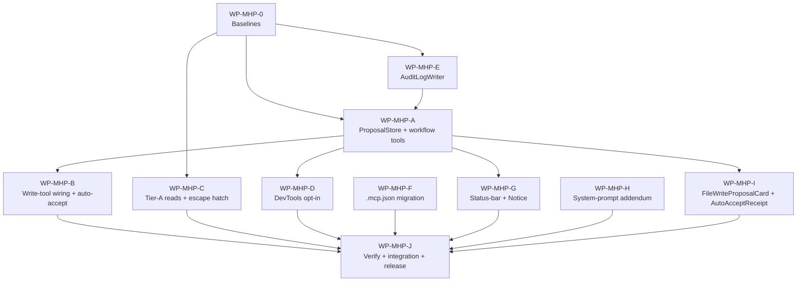
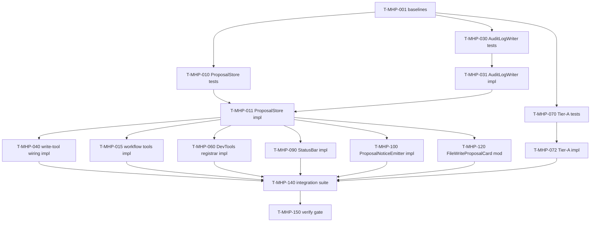

# Tasks — Host-side MCP proposal queue + Tier-A read expansion + tier-policy UX

Each task ≤ ~½ day, has a stable ID, references ≥ 1 requirement, and has a Definition of Done.

> **TDD ordering:** test tasks for a requirement come **before** the implementation task for that requirement.

> **Package-level dependency:** WP-MHP-0 (baseline capture) gates every other package per architect Part C hand-off. Implementation packages WP-MHP-A through WP-MHP-I may proceed in parallel after their internal test-tasks complete; WP-MHP-J is the final verification + release gate.

## Legend

- 🧪 = test task
- 🔨 = implementation task
- 📐 = design / scaffolding task
- 📚 = documentation task
- 🚀 = release / ops task
- 🪓 = may slice (task touches multiple independent code paths; expect several PRs)

## Package dependency graph

## Task-level dependency graph

---

## Task list

> **Baseline-capture before implementation:** T-MHP-001 must complete and have its captured numbers recorded in `specs/mcp-host-side-proposals/test-plan.md` before any new code path in WP-MHP-A..I lands. NFR-MHP-001/-002/-003 budgets are baseline-relative.

---

### WP-MHP-0 — Baselines

#### T-MHP-001 📐 — Capture baseline metrics for NFR-MHP-001/-002/-003 on integration branch HEAD

- **Description:** Before any new code lands, capture three baseline numbers and write them into `specs/mcp-host-side-proposals/test-plan.md`: (a) current `workflow_proposal_list`-equivalent in-memory list latency p95 over 1000 calls with 100 simulated `pending` entries (baseline for NFR-MHP-001); (b) current write-tool path latency p95 from `ProposalStore.queue` entry to MCP response, averaged across the 8 existing write tools (baseline for NFR-MHP-002 — pre-AuditLogWriter); (c) `obsidian-cli` bare subprocess spawn latency p95 from `execFile` invocation to stdout-closed, for each of the 12 Tier-A commands (baseline for NFR-MHP-003, excluding MCP framing per CLAR-MHP-018).
- **Satisfies:** NFR-MHP-001, NFR-MHP-002, NFR-MHP-003 (baselines).
- **Owner:** qa
- **Depends on:** —
- **Estimate:** M
- **Definition of done:**
  - [ ] One-shot benchmark script committed under `tests/__bench__/mhp-baseline.bench.ts`; runs via `npx vitest bench`.
  - [ ] Three p95 numbers recorded verbatim in `specs/mcp-host-side-proposals/test-plan.md` under a new `## Baselines` section, with the commit SHA of the integration-branch HEAD they were measured on.
  - [ ] Numbers reproducible on a second run within ±15%; if not, mark variance in test-plan.md and escalate.

---

### WP-MHP-A — Proposal store + workflow_proposal_* MCP tools

#### T-MHP-002 🧪 — `ProposalEventBus` typed pub/sub contract test

- **Description:** Test `on()` / `emit()` / `listenerCount()` for `proposalEnqueued` and `proposalDecided`. Synchronous fan-out; thrown listener errors are caught and logged via LoggerPort but not re-thrown; unsubscribe handle removes the listener.
- **Satisfies:** REQ-MHP-046 (event-bus contract); covers RISK-MHP-011.
- **Owner:** qa
- **Depends on:** T-MHP-001
- **Estimate:** S
- **Definition of done:**
  - [ ] `tests/infrastructure/events/ProposalEventBus.test.ts` exists; references REQ-MHP-046.
  - [ ] Test fails before any production code lands.

#### T-MHP-003 🔨 — Implement `ProposalEventBus`

- **Description:** Implement `src/infrastructure/events/ProposalEventBus.ts` per SPEC-MHP-040. Listener-throw isolation via try/catch + LoggerPort.error.
- **Satisfies:** REQ-MHP-046; SPEC-MHP-040.
- **Owner:** dev
- **Depends on:** T-MHP-002
- **Estimate:** S
- **Definition of done:**
  - [ ] T-MHP-002 passes.
  - [ ] Lint + typecheck green.

#### T-MHP-004 🧪 — `McpClientIdentifier` capture + fallback test

- **Description:** Test `attachInitializeHook` captures `clientInfo.name`; `identityFor(connectionId)` returns `{id, transport, address}` with `id = 'unknown'` when name absent/empty/non-string; trim + truncate to 128 chars.
- **Satisfies:** REQ-MHP-034, REQ-MHP-035; SPEC-MHP-036; EC-MHP-009, EC-MHP-010, EC-MHP-011.
- **Owner:** qa
- **Depends on:** T-MHP-001
- **Estimate:** S
- **Definition of done:**
  - [ ] `tests/infrastructure/obsidian/mcp/McpClientIdentifier.test.ts` covers TEST-MHP-035, TEST-MHP-036.
  - [ ] Test fails before impl exists.

#### T-MHP-005 🔨 — Implement `McpClientIdentifier`

- **Description:** Implement per SPEC-MHP-036 at `src/infrastructure/obsidian/mcp/McpClientIdentifier.ts`.
- **Satisfies:** REQ-MHP-034, REQ-MHP-035.
- **Owner:** dev
- **Depends on:** T-MHP-004
- **Estimate:** S
- **Definition of done:**
  - [ ] T-MHP-004 passes.

#### T-MHP-006 🧪 — `ActiveFeatureResolver` zero/one/multiple test

- **Description:** Test scan of `specs/*/workflow-state.md` returns `{kind:'zero'}` | `{kind:'one', slug}` | `{kind:'multiple', slugs}`. Verifies LoggerPort.warn fires on multiple (warn fan-out belongs to the caller per SPEC-MHP-037, but resolver returns the multiple kind).
- **Satisfies:** REQ-MHP-041; TEST-MHP-043; EC-MHP-012, EC-MHP-013.
- **Owner:** qa
- **Depends on:** T-MHP-001
- **Estimate:** S
- **Definition of done:**
  - [ ] `tests/infrastructure/feature/ActiveFeatureResolver.test.ts` references TEST-MHP-043.
  - [ ] Test fails before impl exists.

#### T-MHP-007 🔨 — Implement `ActiveFeatureResolver`

- **Description:** Implement per SPEC-MHP-037 at `src/infrastructure/feature/ActiveFeatureResolver.ts`. Cache lifetime ≤ 1 s; invalidate on file change observation (best-effort; resolver may also be cache-less in v1 if simpler — record decision in implementation-log.md).
- **Satisfies:** REQ-MHP-041.
- **Owner:** dev
- **Depends on:** T-MHP-006
- **Estimate:** M
- **Definition of done:**
  - [ ] T-MHP-006 passes.

#### T-MHP-008 🔨 — Add 5 settings keys + `DEFAULT_SETTINGS` extension

- **Description:** Extend `src/domain/settings/PluginSettings.ts` with `requireExplicitAcceptForAllWrites: boolean` (default `false`) and `devtools: DevToolsSettings` substructure: `masterEnabled` (false), `autoAcceptLowRisk` (false), `tools.<5 high-risk ids>.enabled` (false × 5). Settings loader default-merges; pre-existing settings files without these keys must load successfully with defaults.
- **Satisfies:** REQ-MHP-010, REQ-MHP-016, REQ-MHP-017, REQ-MHP-043; SPEC §"Settings additions".
- **Owner:** dev
- **Depends on:** T-MHP-001
- **Estimate:** S
- **Definition of done:**
  - [ ] `tests/domain/settings/PluginSettings.test.ts` asserts each default; pre-existing-file load test still green.
  - [ ] Typecheck green; no existing setting changes shape.

#### T-MHP-009 🔨 — Add `src/domain/mcp/Proposal.ts` data model (16-literal `ProposalKind`, `ClientIdentity`, `ProposalDecision`, `AuditRow`, event payloads)

- **Description:** Author the data model declared in SPEC §"Data structures" verbatim. 16-literal `ProposalKind` discriminator (3 vault/CLI + 5 canvas + 8 DevTools). New folder `src/domain/mcp/` — `audit` consumers cannot import from `infrastructure/` per ADR-008.
- **Satisfies:** REQ-MHP-036, REQ-MHP-037, REQ-MHP-040, REQ-MHP-022; SPEC §"Data structures".
- **Owner:** dev
- **Depends on:** T-MHP-001
- **Estimate:** S
- **Definition of done:**
  - [ ] All listed types compile and are exported.
  - [ ] `tests/domain/mcp/Proposal.test.ts` asserts `ProposalKind` union has exactly 16 members (assert by accepted-then-rejected literal cases).

#### T-MHP-010 🧪 — `ProposalStore` extended-surface tests (queue / acceptBy / rejectBy / capacity / mutex)

- **Description:** Author the unit tests that drive the extended `ProposalStore` API in SPEC-MHP-034: `queue` returns `{proposalId, status, tool, intent?}`; `acceptBy(id, by, decidingClient)` returns `AcceptResult` union (`ok` | `not_found` | `already_decided` with `priorDecision` | `write_failed` with `proposalId`); `rejectBy` returns `RejectResult` union; `listPending()` returns `pending`-only deep-clone ordered by `enqueuedAt`; capacity = 1000 returns `queue_full`; deep-cloned snapshots; per-id mutex serialises concurrent accept (small-scale 5-pair fuzz — large-scale 1000-pair is T-MHP-014).
- **Satisfies:** REQ-MHP-006 (small-scale), REQ-MHP-007, REQ-MHP-008, REQ-MHP-039, REQ-MHP-040, REQ-MHP-042, REQ-MHP-044, REQ-MHP-045(a), REQ-MHP-045(d), REQ-MHP-046; TEST-MHP-005, TEST-MHP-007, TEST-MHP-008, TEST-MHP-009, TEST-MHP-044, TEST-MHP-045, TEST-MHP-047.
- **Owner:** qa
- **Depends on:** T-MHP-003, T-MHP-005, T-MHP-007, T-MHP-009
- **Estimate:** M
- **Definition of done:**
  - [ ] `tests/infrastructure/obsidian/ProposalStore.test.ts` extended (don't replace existing tests).
  - [ ] Every TEST-MHP-NNN ID listed above appears as a `test.each` row or named `it()` block.
  - [ ] All tests fail before impl lands.

#### T-MHP-011 🔨 🪓 — Implement extended `ProposalStore` (acceptBy/rejectBy/mutex/capacity/ephemeral/events)

- **Description:** Extend `src/infrastructure/obsidian/ProposalStore.ts` per SPEC-MHP-034. Adds `acceptBy`, `rejectBy`, `listPending`, `flushOnShutdown`, `pendingCount`, `dispose`; per-id mutex via `Map<proposalId, Promise<void>>`; deep-clone reads; capacity 1000; ephemeral (no persistence); `client` / `intent` / `kind` / `decision` fields; emits `proposalEnqueued` + `proposalDecided` via injected `ProposalEventBus`; auto-accept branch runs `mutate` inside mutex; injects `AuditLogWriter` (used in T-MHP-013 wiring), `ActiveFeatureResolver`, `LoggerPort`, `now` clock.
- **Slice plan:** (a) types + queue + listPending + deep-clone + capacity; (b) mutex + acceptBy + rejectBy + event emission; (c) flushOnShutdown + dispose. Each slice may land as its own PR referencing T-MHP-011.
- **Satisfies:** REQ-MHP-006, REQ-MHP-007, REQ-MHP-008, REQ-MHP-038, REQ-MHP-039, REQ-MHP-040, REQ-MHP-042, REQ-MHP-044, REQ-MHP-046; SPEC-MHP-034.
- **Owner:** dev
- **Depends on:** T-MHP-010
- **Estimate:** M
- **Definition of done:**
  - [ ] T-MHP-010 passes.
  - [ ] Existing `ProposalStore` consumers in `ObsidianMcpServerAdapter` call-sites updated to the new shape (T-MHP-041 closes the adapter rewiring; this task touches only the store).
  - [ ] Implementation-log entry added.

#### T-MHP-012 🧪 — Best-effort shutdown flush within 500 ms

- **Description:** Test `flushOnShutdown` writes one `decision.outcome: 'discarded'`, `decision.by: 'shutdown'` audit row per remaining pending proposal within a 500 ms upper-bound. Time-mocked test: 3 pending → all 3 rows written; simulate slow audit writer → some rows dropped silently (no error path). Covers EC-MHP-014, EC-MHP-015.
- **Satisfies:** REQ-MHP-038, REQ-MHP-040 (`shutdown` provenance); TEST-MHP-039, TEST-MHP-040; CLAR-MHP-016.
- **Owner:** qa
- **Depends on:** T-MHP-011
- **Estimate:** S
- **Definition of done:**
  - [ ] `tests/infrastructure/obsidian/ProposalStore.shutdown.test.ts` covers TEST-MHP-039 + TEST-MHP-040.
  - [ ] Both pass.

#### T-MHP-013 🔨 — Wire `AuditLogWriter.append` into ProposalStore's accept/reject/auto-accept critical sections

- **Description:** Inside `acceptBy` / `rejectBy` / `queue` auto-accept branch, call `AuditLogWriter.append(row)` before the MCP response is returned. On audit-append failure, the MCP response still reports the vault-mutation outcome (REQ-MHP-025).
- **Satisfies:** REQ-MHP-039, REQ-MHP-022, REQ-MHP-040; TEST-MHP-041, TEST-MHP-042, TEST-MHP-048.
- **Owner:** dev
- **Depends on:** T-MHP-011, T-MHP-031
- **Estimate:** S
- **Definition of done:**
  - [ ] T-MHP-010 still passes after wiring.
  - [ ] New test `tests/infrastructure/obsidian/ProposalStore.audit.test.ts` asserts row count + ordering per TEST-MHP-041.

#### T-MHP-014 🧪 — Dual-accept stress: 1000 concurrent-pair runs, `mutate` invoked exactly once

- **Description:** Stress test per TEST-MHP-006 / NFR-MHP-012. 1000 paired concurrent calls to `acceptBy(sameId)` — assert mutate-callback invocation count === 1; first returns `{ok:true}`; second returns `already_decided`. Audit log contains exactly one `accepted` row per pair.
- **Satisfies:** REQ-MHP-006, NFR-MHP-012; TEST-MHP-006.
- **Owner:** qa
- **Depends on:** T-MHP-013
- **Estimate:** M
- **Definition of done:**
  - [ ] `tests/infrastructure/obsidian/ProposalStore.fuzz.test.ts` runs 1000 paired iterations.
  - [ ] `for i in $(seq 1 1000)` aggregated as single test; mutate count assertion === 1 every iteration.
  - [ ] Evidence appended to `test-report.md` later by qa during Stage 8.

#### T-MHP-015 🧪 — `workflow_proposal_*` MCP tools contract tests (4 tools)

- **Description:** Tests for the four new MCP tools per SPEC-MHP-001..004. List returns pending-only ordered; get returns full record; get on unknown → `not_found`; accept on pending → `{ok:true, decision}`; accept on already-decided → `already_decided` with `priorDecision`; reject on pending → `{ok:true, decision}` + no vault write; accept on unknown writes one error audit row per REQ-MHP-045(d).
- **Satisfies:** REQ-MHP-001..007, REQ-MHP-045(d); TEST-MHP-001, TEST-MHP-002, TEST-MHP-003, TEST-MHP-004, TEST-MHP-005, TEST-MHP-007, TEST-MHP-008.
- **Owner:** qa
- **Depends on:** T-MHP-011
- **Estimate:** M
- **Definition of done:**
  - [ ] `tests/infrastructure/obsidian/mcp/workflowProposalTools.test.ts` covers all listed TEST IDs.
  - [ ] Tests fail before impl exists.

#### T-MHP-016 🔨 — Implement `workflow_proposal_list/get/accept/reject` MCP tool registrar

- **Description:** Implement `src/infrastructure/obsidian/mcp/registerWorkflowProposalTools.ts` per SPEC-MHP-001..004. Each tool delegates to `ProposalStore` via the adapter; tool descriptions match the verbatim copy in SPEC (the "this tool is for the user" guidance). Sidepanel path supplies `SIDEPANEL_IDENTITY`; external-client path supplies the connection's stashed identity.
- **Satisfies:** REQ-MHP-001..007.
- **Owner:** dev
- **Depends on:** T-MHP-015
- **Estimate:** M
- **Definition of done:**
  - [ ] T-MHP-015 passes.

---

### WP-MHP-B — Existing write tools commit on accept + auto-accept rule

#### T-MHP-020 🧪 — Per-write-tool response shape + auto-accept rule unit tests (8 tools)

- **Description:** For each of `vault_write_note`, `vault_append_to_note`, `obsidian_cli_append_note`, `canvas_create`, `canvas_add_text_node`, `canvas_add_file_node`, `canvas_add_edge`, `canvas_update_node`: assert (a) input validated against the per-tool Zod schema (SPEC §"Write-tool input schemas"); (b) response shape `{proposalId, status, tool, intent?}` per REQ-MHP-042; (c) on accept, vault state mutates per the per-tool semantics; (d) `requireExplicitAcceptForAllWrites=true` always returns `pending`; (e) auto-accept fires for the two append tools when active-feature path matches; (f) capacity 1000 → `queue_full`.
- **Satisfies:** REQ-MHP-008, REQ-MHP-009, REQ-MHP-010, REQ-MHP-041, REQ-MHP-042; TEST-MHP-009, TEST-MHP-010, TEST-MHP-011, TEST-MHP-044, TEST-MHP-045.
- **Owner:** qa
- **Depends on:** T-MHP-016
- **Estimate:** M
- **Definition of done:**
  - [ ] One test file per tool under `tests/infrastructure/obsidian/mcp/<tool>.test.ts`, each referencing REQ + TEST IDs.
  - [ ] All fail before impl.

#### T-MHP-021 🔨 🪓 — Wire the 8 existing write tools through `ProposalStore.queue` and emit `{proposalId, status, tool}`

- **Description:** Modify each of the 8 write-tool registrars in `src/infrastructure/obsidian/mcp/` to: (a) validate input via per-tool Zod schema (emit `invalid_argument` + error audit row on failure per REQ-MHP-045(c)); (b) build `mutate()` closure (the original write); (c) resolve `client` + `intent` + `paths` (POSIX-normalised, REQ-MHP-023); (d) call `ProposalStore.queue(...)`; (e) return `{proposalId, status, tool, intent?}` per REQ-MHP-042.
- **Slice plan:** (a) 3 vault/CLI write tools; (b) 5 canvas write tools. Each slice PR references T-MHP-021.
- **Satisfies:** REQ-MHP-008, REQ-MHP-009, REQ-MHP-010, REQ-MHP-042, REQ-MHP-045(c).
- **Owner:** dev
- **Depends on:** T-MHP-020
- **Estimate:** M
- **Definition of done:**
  - [ ] T-MHP-020 passes for all 8 tools.
  - [ ] Existing write-tool tests (pre-feature) still green.

#### T-MHP-022 🔨 — Auto-accept algorithm in `ProposalStore.queue` (active-feature-append rule)

- **Description:** Implement the auto-accept branch per SPEC-MHP-005..012 "Auto-accept decision algorithm": for `vault_append_to_note` / `obsidian_cli_append_note`, consult `ActiveFeatureResolver`; on `kind:'one'` with every path matching `^specs/<active.slug>/.*\.md$`, transition directly to `accepted` with `decision.by: 'auto'`, `decision.rule: 'active-feature-append'`. On `kind:'multiple'`, emit `LoggerPort.warn` with the matching slugs.
- **Satisfies:** REQ-MHP-009, REQ-MHP-041; TEST-MHP-010, TEST-MHP-043.
- **Owner:** dev
- **Depends on:** T-MHP-021, T-MHP-007
- **Estimate:** S
- **Definition of done:**
  - [ ] T-MHP-020 row covering REQ-MHP-009 passes; T-MHP-006 row covering REQ-MHP-041 still green.

---

### WP-MHP-C — Tier-A read tools + escape hatch

#### T-MHP-030 🧪 — `AuditLogWriter` JSONL + rotation + ENOENT folder-creation tests

- **Description:** Tests for SPEC-MHP-035: row is `JSON.stringify(row) + '\n'`, UTF-8; first append in vault with no `.specorator/` creates the folder (REQ-MHP-026); size > 2 MiB triggers rotation (REQ-MHP-024, NFR-MHP-008); `.5` deleted before shift; current `.log` becomes `.1`; new `.log` < 2 MiB; vault-relative POSIX paths only (REQ-MHP-023, NFR-MHP-014; Windows `specs\x\idea.md` → `specs/x/idea.md`); filesystem failure surfaces via LoggerPort.error + NotificationPort.showError (sticky) without blocking MCP response (REQ-MHP-025); 7 top-level fields per AuditRow with `schema:1` (REQ-MHP-022); DevTools payloads excluded (REQ-MHP-021, NFR-MHP-006).
- **Satisfies:** REQ-MHP-021, REQ-MHP-022, REQ-MHP-023, REQ-MHP-024, REQ-MHP-025, REQ-MHP-026, NFR-MHP-006, NFR-MHP-008, NFR-MHP-014; TEST-MHP-022, TEST-MHP-023, TEST-MHP-024, TEST-MHP-025, TEST-MHP-026, TEST-MHP-027.
- **Owner:** qa
- **Depends on:** T-MHP-001, T-MHP-009
- **Estimate:** M
- **Definition of done:**
  - [ ] `tests/infrastructure/obsidian/audit/AuditLogWriter.test.ts` covers all listed TEST IDs.
  - [ ] All tests fail before impl.

#### T-MHP-031 🔨 — Implement `AuditLogWriter`

- **Description:** Implement `src/infrastructure/obsidian/audit/AuditLogWriter.ts` per SPEC-MHP-035. Internal async lock; reads current size; rotates atomically when `size + len(row) > maxSizeBytes`; LF line ending; UTF-8.
- **Satisfies:** REQ-MHP-022, REQ-MHP-023, REQ-MHP-024, REQ-MHP-025, REQ-MHP-026, NFR-MHP-007, NFR-MHP-008.
- **Owner:** dev
- **Depends on:** T-MHP-030
- **Estimate:** M
- **Definition of done:**
  - [ ] T-MHP-030 passes.

#### T-MHP-032 🧪 — Exhaustive error-row trigger inventory test (REQ-MHP-045 all 4 conditions)

- **Description:** Test that exactly four conditions trigger an `error` audit row + one `LoggerPort.warn`: (a) post-accept write failure; (b) `mutate` callback throws; (c) inbound payload schema validation failure on a write tool; (d) `proposalId` not found on `_accept`/`_reject`. Assert no fifth path produces an error row.
- **Satisfies:** REQ-MHP-044, REQ-MHP-045; TEST-MHP-047, TEST-MHP-048.
- **Owner:** qa
- **Depends on:** T-MHP-031, T-MHP-013
- **Estimate:** S
- **Definition of done:**
  - [ ] `tests/infrastructure/obsidian/audit/error-triggers.test.ts` covers the 4 trigger matrix.

#### T-MHP-070 🧪 — 12 Tier-A read tool contract tests + `vaultPath` validator

- **Description:** For each of the 12 Tier-A reads (SPEC-MHP-013..024): assert input validation via the shared `vaultPath` schema (no `..`, no absolute prefix, backslash → forward-slash transform); CLI invocation via `execFile` (no shell); output parsed per documented format; non-zero exit → `cli_failed` with `{exitCode, stderr}`; **no proposal enqueued** (REQ-MHP-012); **no audit row written** (reads do not generate audit rows); `tools/list` reports all 12 canonical names (REQ-MHP-011, TEST-MHP-012).
- **Satisfies:** REQ-MHP-011, REQ-MHP-012, NFR-MHP-003; TEST-MHP-012, TEST-MHP-013.
- **Owner:** qa
- **Depends on:** T-MHP-001
- **Estimate:** M
- **Definition of done:**
  - [ ] One test file per read tool under `tests/infrastructure/obsidian/mcp/reads/`.
  - [ ] All fail before impl.

#### T-MHP-071 🔨 — Implement `vaultPath` Zod schema shared validator

- **Description:** Implement the shared `vaultPath` schema at `src/infrastructure/obsidian/mcp/vaultPath.ts` per SPEC §SPEC-MHP-013..024: `z.string().min(1).refine(no '..').refine(no absolute prefix).transform(backslash→forward-slash)`. Re-used by all write tools, all Tier-A reads, and the escape hatch.
- **Satisfies:** REQ-MHP-023, NFR-MHP-014.
- **Owner:** dev
- **Depends on:** T-MHP-070
- **Estimate:** S
- **Definition of done:**
  - [ ] T-MHP-070's `vaultPath` rejection assertions pass.

#### T-MHP-072 🔨 🪓 — Implement 12 Tier-A read tool registrars

- **Description:** Implement each of the 12 read tools (SPEC-MHP-013..024) at `src/infrastructure/obsidian/mcp/reads/<tool>.ts`. Shared spawn discipline via a small helper `spawnObsidianCli(command, args)`: `execFile`, no shell, 30 s wall-clock timeout; stdout UTF-8 captured; non-zero exit → `cli_failed`.
- **Slice plan:** (a) the 5 zero-arg tools (`unresolved`, `orphans`, `deadends`, `templates`); (b) the 4 single-path tools (`backlinks`, `links`, `outline`, `history`); (c) the 4 multi-arg tools (`diff`, `template:read`, `property:read`, `daily:read`).
- **Satisfies:** REQ-MHP-011, REQ-MHP-012.
- **Owner:** dev
- **Depends on:** T-MHP-070, T-MHP-071
- **Estimate:** M
- **Definition of done:**
  - [ ] T-MHP-070 passes for all 12 tools.

#### T-MHP-073 🧪 — `obsidian_cli_read_command` escape-hatch tests (regex + traversal + absolute-prefix + deny-list + allow-list)

- **Description:** Tests per SPEC-MHP-025 + TEST-MHP-014 + TEST-MHP-016. Args: `outline x.md` → success; `outline x.md; rm -rf /` → `invalid_argument`; `outline ../etc/passwd` → `invalid_argument`; `outline /etc/passwd` → `invalid_argument`; `outline C:\Windows\notepad.exe` → `invalid_argument`; `outline \\?\…` → `invalid_argument`; `delete x.md` → `not_allowed` (not in allow-list); `eval 1+1` → `not_allowed` (deny-list, REQ-MHP-015); spawn-mock asserts CLI NOT invoked on any rejection. Allow-list is hard-coded equal to the 12 Tier-A CLI names (CLAR-MHP-012).
- **Satisfies:** REQ-MHP-013, REQ-MHP-014, REQ-MHP-015, NFR-MHP-004, NFR-MHP-005; TEST-MHP-014, TEST-MHP-016; EC-MHP-029, EC-MHP-030, EC-MHP-031, EC-MHP-032.
- **Owner:** qa
- **Depends on:** T-MHP-071
- **Estimate:** S
- **Definition of done:**
  - [ ] `tests/infrastructure/obsidian/mcp/reads/obsidianCliReadCommand.test.ts` covers all listed cases.
  - [ ] All fail before impl.

#### T-MHP-074 🔨 — Implement `obsidian_cli_read_command` escape hatch

- **Description:** Implement per SPEC-MHP-025 at `src/infrastructure/obsidian/mcp/reads/obsidianCliReadCommand.ts`. Hard-coded allow-list constant (12 entries). Permanent deny-list constant equal to REQ-MHP-014 list (24 entries — exported from a shared file at `src/infrastructure/obsidian/mcp/denyList.ts` for reuse by REQ-MHP-014 enforcement test).
- **Satisfies:** REQ-MHP-013, REQ-MHP-014, REQ-MHP-015.
- **Owner:** dev
- **Depends on:** T-MHP-073
- **Estimate:** S
- **Definition of done:**
  - [ ] T-MHP-073 passes.

#### T-MHP-075 🧪 — Deny-list `tools/list` assertion (REQ-MHP-014 unit test by name)

- **Description:** Assert `tools/list` returned by the running MCP server does NOT include any of the 24 deny-list CLI command names. Direct assert-by-name iteration per REQ-MHP-014 acceptance.
- **Satisfies:** REQ-MHP-014, NFR-MHP-004; TEST-MHP-015.
- **Owner:** qa
- **Depends on:** T-MHP-074
- **Estimate:** S
- **Definition of done:**
  - [ ] `tests/infrastructure/obsidian/mcp/denyList.test.ts` asserts each of 24 names absent.

---

### WP-MHP-D — DevTools opt-in surface

#### T-MHP-080 🧪 — `DevToolsToolRegistrar` registration matrix tests (REQ-MHP-016/-017/-018/-020/-043)

- **Description:** Tests for SPEC-MHP-026..033. (a) `masterEnabled=false` → none of the 8 tools registered (TEST-MHP-017, TEST-MHP-019); (b) `masterEnabled=true` only → 3 low-risk registered, 5 high-risk absent (TEST-MHP-017 variant); (c) `masterEnabled=true` + per-tool `dev:dom` → `dev:dom` only (TEST-MHP-018); (d) `dev:cdp` always queues `pending` even with `autoAcceptLowRisk=true` (TEST-MHP-021); (e) `autoAcceptLowRisk=true` → low-risk auto-accept fires for the three low-risk tools, high-risk still pending (TEST-MHP-046); (f) every DevTools invocation creates a proposal + audit row (TEST-MHP-020); (g) registrar `refresh(settings)` re-evaluates and unregisters on settings change.
- **Satisfies:** REQ-MHP-016..021, REQ-MHP-043; TEST-MHP-017, TEST-MHP-018, TEST-MHP-019, TEST-MHP-020, TEST-MHP-021, TEST-MHP-046; EC-MHP-025, EC-MHP-026, EC-MHP-027, EC-MHP-028.
- **Owner:** qa
- **Depends on:** T-MHP-016, T-MHP-008
- **Estimate:** M
- **Definition of done:**
  - [x] `tests/infrastructure/obsidian/mcp/DevToolsToolRegistrar.test.ts` covers the matrix.
  - [x] All fail before impl.

#### T-MHP-081 🔨 — Implement `DevToolsToolRegistrar` + 8 DevTools tool registrars

- **Description:** Implement `src/infrastructure/obsidian/mcp/DevToolsToolRegistrar.ts` and the 8 per-tool registrars per SPEC-MHP-026..033. Auto-accept algorithm matches SPEC §"Auto-accept decision algorithm" (low-risk only when `masterEnabled && autoAcceptLowRisk`; high-risk never; `dev:cdp` always pending). DevTools mutate closures execute the DevTools operation; result payload never serialised into audit row (REQ-MHP-021, NFR-MHP-006).
- **Satisfies:** REQ-MHP-016..021, REQ-MHP-043.
- **Owner:** dev
- **Depends on:** T-MHP-080
- **Estimate:** M
- **Definition of done:**
  - [x] T-MHP-080 passes.

#### T-MHP-082 📐 — Document DevTools result-delivery choice (out-of-band content block vs always-via-accept)

- **Description:** SPEC-MHP-026..033 leaves the DevTools result-delivery mechanism as implementer choice. Pick one and document in `specs/mcp-host-side-proposals/implementation-log.md` before T-MHP-081 lands. Recommendation per spec note: "clients should always treat the tool response as 'proposal queued' and call `workflow_proposal_accept` to obtain the actual side-effect result."
- **Satisfies:** SPEC-MHP-026..033 (implementer-choice clause); /spec:analyze F-014.
- **Owner:** dev
- **Depends on:** T-MHP-016
- **Estimate:** S
- **Definition of done:**
  - [x] Decision recorded in `implementation-log.md` with rationale.
  - [x] T-MHP-081 implementation matches the recorded decision.

#### T-MHP-083 🧪 — `DevToolsEnableConfirmModal` interaction tests (S07–S09)

- **Description:** Tests for the new modal (`src/plugin/settings/DevToolsEnableConfirmModal.ts`): focus moves to heading on open; `Esc` cancels; Tab cycles Cancel ↔ Enable; no Enter default; primary button is `mod-warning`; threat-paragraph rendered verbatim from constant; registration failure (S09) shows inline error with `data-testid="devtools-confirm-error"`; `dev:cdp` body includes the second-paragraph "always prompts" sentence.
- **Satisfies:** Part B §S07..S09; REQ-MHP-016, REQ-MHP-017, REQ-MHP-020; NFR-MHP-011 (a11y).
- **Owner:** qa
- **Depends on:** T-MHP-080
- **Estimate:** S
- **Definition of done:**
  - [x] `tests/plugin/settings/DevToolsEnableConfirmModal.test.ts` covers the listed behaviours.
  - [x] All fail before impl.

#### T-MHP-084 🔨 — Implement `DevToolsEnableConfirmModal`

- **Description:** Subclass of Obsidian `Modal`. Parameterised by `toolId` + threat-paragraph constant. Implements the keyboard, focus, ARIA, and inline-error treatment from Part B §S07..S09. Lives in `src/plugin/settings/DevToolsEnableConfirmModal.ts`.
- **Satisfies:** Part B §S07..S09; REQ-MHP-016, REQ-MHP-017.
- **Owner:** dev
- **Depends on:** T-MHP-083
- **Estimate:** M
- **Definition of done:**
  - [x] T-MHP-083 passes.

#### T-MHP-085 🔨 — Add DevTools section + `requireExplicitAcceptForAllWrites` toggle + `devtoolsAutoAcceptLowRisk` toggle to settings tab

- **Description:** Extend `src/plugin/settings.ts` with: (a) new "MCP write proposals" section containing `requireExplicitAcceptForAllWrites` toggle (S01/S02 microcopy verbatim from Part B); (b) new "DevTools (agent-driven)" section containing master toggle, `devtoolsAutoAcceptLowRisk` toggle, and 5 high-risk per-tool toggles using a private `renderDevToolsToggleRow(containerEl, toolId, riskSummary, masterEnabled)` helper; (c) per-tool flip triggers `DevToolsEnableConfirmModal`; on confirm, settings save + `DevToolsToolRegistrar.refresh(settings)`; (d) microcopy verbatim from Part B "Content" subsection (all 8 risk summaries + threat-paragraph sources).
- **Satisfies:** REQ-MHP-010, REQ-MHP-016, REQ-MHP-017, REQ-MHP-043; Part B §S01..S05.
- **Owner:** dev
- **Depends on:** T-MHP-008, T-MHP-084, T-MHP-081
- **Estimate:** M
- **Definition of done:**
  - [ ] Storybook story added for the DevTools section in master-off, master-on, and per-tool-enabled states. _(deferred — see T-MHP-086 follow-up)_
  - [x] `data-testid`s match Part B (`settings-require-explicit-accept`, `settings-devtools-master`, `settings-devtools-auto-accept-low-risk`, `settings-devtools-tool-dev-dom`, ...).
  - [ ] Axe-core scan on the Storybook story passes (NFR-MHP-011). _(deferred — owned by T-MHP-086)_

#### T-MHP-086 🧪 — NFR-MHP-011 contrast assertion via Storybook + axe-core

- **Description:** Storybook story for `DevToolsToggleRow` (disabled + enabled), `DevToolsEnableConfirmModal`, and the DevTools settings section. Axe-core scan asserts AA contrast for the 7 token combinations enumerated in Part B §"NFR-MHP-011 assertions" table.
- **Satisfies:** NFR-MHP-011.
- **Owner:** qa
- **Depends on:** T-MHP-085
- **Estimate:** S
- **Definition of done:**
  - [ ] Storybook scan green on default-dark, default-light, high-contrast themes.

#### T-MHP-087 🚀 — ADR-019 acceptance gate (status `proposed` → `accepted`)

- **Description:** After T-MHP-080..086 land and threat-paragraph constants are wired into the modal, the architect reviews ADR-019 against the running implementation and flips `status: proposed` → `status: accepted` in `docs/adr/ADR-019-mcp-tier-policy-and-devtools-opt-in.md` frontmatter. RISK-MHP-015 drift-guard test (T-MHP-088) must pass before flipping.
- **Satisfies:** ADR-019 lifecycle; PRD release-criteria bullet 3; /spec:analyze F-016.
- **Owner:** architect
- **Depends on:** T-MHP-085, T-MHP-088
- **Estimate:** S
- **Definition of done:**
  - [ ] ADR-019 frontmatter `status: accepted`.
  - [ ] PR description names the implementation evidence.

#### T-MHP-088 🧪 — Threat-paragraph drift-guard unit test (RISK-MHP-015)

- **Description:** Single test: import the threat-paragraph TS constants module; for each of the 8 DevTools tools, assert the constant byte-equals the corresponding paragraph in `research.md` §Q3 (normalised whitespace). Test fails if drift exists between the runtime constant and the research source. ADR-019 Part 4 is the second source of truth; once frozen post-acceptance, the test asserts equality to ADR-019 Part 4 instead.
- **Satisfies:** RISK-MHP-015, REQ-MHP-016; TEST-MHP-055.
- **Owner:** qa
- **Depends on:** T-MHP-084
- **Estimate:** S
- **Definition of done:**
  - [x] `tests/application/mcp/threatParagraphs.driftGuard.test.ts` exists and passes (10/10).

---

### WP-MHP-E — Audit log + JSONL writer + rotation

> WP-MHP-E tests + impl live in T-MHP-030 / T-MHP-031 / T-MHP-032 (placed in WP-MHP-C ordering because the writer is a hard dependency for the store-audit wiring at T-MHP-013). No additional tasks required here.

---

### WP-MHP-F — `.mcp.json` → `.obsidian/mcp.local.json` migration

#### T-MHP-110 🧪 — `MigrationService` happy-path + idempotence + verify-before-delete + deep-equal tests

- **Description:** Tests for SPEC-MHP-038 + TEST-MHP-028..032 + TEST-MHP-057. Happy path (EC-MHP-017); idempotent no-op when root absent (TEST-MHP-030, EC-MHP-020); fault-injection: `.obsidian/` read-only → keep root, sticky error (TEST-MHP-029, EC-MHP-018); read-back deep-equal mismatch → keep root, sticky error, delete partially-written `.obsidian/mcp.local.json` (EC-MHP-019); nested-object semantic-equality (TEST-MHP-031); `.gitignore` exact-line check (TEST-MHP-032, EC-MHP-021, EC-MHP-022, CLAR-MHP-014: LF only, once-per-migration); both-files-present conflict (TEST-MHP-057, EC-MHP-041, S19-extension copy verbatim).
- **Satisfies:** REQ-MHP-027, REQ-MHP-028, REQ-MHP-029, REQ-MHP-030, REQ-MHP-031, NFR-MHP-010, NFR-MHP-013; TEST-MHP-028..032, TEST-MHP-057; EC-MHP-017..022, EC-MHP-041.
- **Owner:** qa
- **Depends on:** T-MHP-001
- **Estimate:** M
- **Definition of done:**
  - [ ] `tests/infrastructure/obsidian/MigrationService.test.ts` covers all listed IDs.
  - [ ] Fault-injection scenarios use `fakeModulePorts` to simulate filesystem failures.

#### T-MHP-111 🔨 — Implement `MigrationService`

- **Description:** Implement `src/infrastructure/obsidian/MigrationService.ts` per SPEC-MHP-038. State machine: noop | success | success-gitignore-failed | failed. Re-serialise via `JSON.stringify(value, null, 2)`. Conflict detection (both files exist) → `failed` with S19-extension notice copy. Notice copy verbatim from Part B §S17..S19 + S19-extension.
- **Satisfies:** REQ-MHP-027..031, NFR-MHP-010, NFR-MHP-013.
- **Owner:** dev
- **Depends on:** T-MHP-110
- **Estimate:** M
- **Definition of done:**
  - [ ] T-MHP-110 passes.

#### T-MHP-112 🔨 — Wire `MigrationService.runOnce()` into plugin start sequence

- **Description:** Call `MigrationService.runOnce()` from `Plugin.onload` in `src/plugin/main.ts`. Awaited before the MCP server registers tool registrars (so a failed migration cannot leak `.mcp.json` to the new server). Notices dispatched via injected `NotificationPort`.
- **Satisfies:** REQ-MHP-027.
- **Owner:** dev
- **Depends on:** T-MHP-111
- **Estimate:** S
- **Definition of done:**
  - [ ] Plugin start path invokes migration before MCP server registers tools.
  - [ ] Integration test confirms ordering.

---

### WP-MHP-G — Status-bar badge + NotificationPort surfacing

#### T-MHP-090 🧪 — `StatusBarBadge` event-driven count + DOM removal at 0 tests

- **Description:** Tests for SPEC-MHP-041 + TEST-MHP-049 + EC-MHP-034..035 + RISK-MHP-012. Count drives via `proposalEnqueued` + `proposalDecided`; text format `MCP: <N> pending`; `aria-live=polite`; DOM removed (not `display:none`) at N=0; `dispose()` unsubscribes BEFORE releasing DOM (RISK-MHP-012, TEST-MHP-054); 100+ N renders as absolute integer (Part B §S13 — no "99+" truncation).
- **Satisfies:** REQ-MHP-046, RISK-MHP-012; TEST-MHP-049, TEST-MHP-054; EC-MHP-034, EC-MHP-035, EC-MHP-037.
- **Owner:** qa
- **Depends on:** T-MHP-003
- **Estimate:** S
- **Definition of done:**
  - [ ] `tests/plugin/SpecoratorStatusBar.test.ts` covers all listed IDs.
  - [ ] Tests fail before impl.

#### T-MHP-091 🔨 — Implement `SpecoratorStatusBar` (status-bar item)

- **Description:** Implement `src/plugin/SpecoratorStatusBar.ts` per SPEC-MHP-041 + Part B §S10..S14. Plain DOM; no Vue. `data-testid="mcp-status-bar"`. Glyph + `MCP: <N> pending` label; aria-label with singular/plural branch; click hint Notice copy verbatim from Part B §S14. Wired into `Plugin.onload`; `dispose()` called from `Plugin.onunload`.
- **Satisfies:** REQ-MHP-046; Part B §S10..S14.
- **Owner:** dev
- **Depends on:** T-MHP-090
- **Estimate:** M
- **Definition of done:**
  - [ ] T-MHP-090 passes.

#### T-MHP-100 🧪 — `ProposalNoticeEmitter` fires `showInfo` per `pending` event tests

- **Description:** Tests for SPEC-MHP-042 + TEST-MHP-049. On `proposalEnqueued` with `status: 'pending'`: `NotificationPort.showInfo` called once with copy `Pending MCP proposal from <client.id>. Review in your MCP client.` (verbatim from Part B §S15). Per-proposal-id idempotence. Auto-accepted entries are silent (no notice — `status: 'accepted'`).
- **Satisfies:** REQ-MHP-046; TEST-MHP-049; EC-MHP-034.
- **Owner:** qa
- **Depends on:** T-MHP-003
- **Estimate:** S
- **Definition of done:**
  - [ ] `tests/application/mcp/ProposalNoticeEmitter.test.ts` covers TEST-MHP-049.

#### T-MHP-101 🔨 — Implement `ProposalNoticeEmitter`

- **Description:** Implement `src/application/mcp/ProposalNoticeEmitter.ts` per SPEC-MHP-042. Subscribes to `proposalEnqueued` via injected `ProposalEventBus`. Internal `Set<proposalId>` ensures per-proposal-id idempotence.
- **Satisfies:** REQ-MHP-046.
- **Owner:** dev
- **Depends on:** T-MHP-100
- **Estimate:** S
- **Definition of done:**
  - [ ] T-MHP-100 passes.

#### T-MHP-102 🔨 — Wire `StatusBarBadge` + `ProposalNoticeEmitter` to `ProposalEventBus` in plugin start

- **Description:** In `src/plugin/main.ts` `onload`, instantiate the bus once, inject into ProposalStore, StatusBarBadge, ProposalNoticeEmitter, FileWriteProposalCard's Pinia store. Single bus per plugin instance.
- **Satisfies:** REQ-MHP-046.
- **Owner:** dev
- **Depends on:** T-MHP-091, T-MHP-101, T-MHP-011
- **Estimate:** S
- **Definition of done:**
  - [ ] Plugin `onload` constructs and shares one bus.

---

### WP-MHP-H — Sidepanel system-prompt addendum

#### T-MHP-130 📐 — Locate sidepanel prompt-assembly call site

- **Description:** Per architect Part C hand-off (workflow-state 2026-05-24): the sidepanel prompt-assembly code was not located during design. Discovery task: grep for the existing sidepanel agent's system-prompt construction (likely under `src/application/agent/` or `src/ui/composables/` near the existing sidepanel store); record the file + function name in `implementation-log.md`. If no existing call site is found, escalate via `/spec:clarify` rather than guess — the addendum's integration point is load-bearing for REQ-MHP-032.
- **Satisfies:** REQ-MHP-032 (integration discovery).
- **Owner:** dev
- **Depends on:** T-MHP-001
- **Estimate:** S
- **Definition of done:**
  - [ ] File path + function name recorded in `implementation-log.md`.
  - [ ] If not found, escalation issued and this task remains open until resolved.

#### T-MHP-131 🧪 — `SystemPromptAddendum` byte-exact constant test (REQ-MHP-032 + REQ-MHP-033)

- **Description:** Tests for SPEC-MHP-039 + TEST-MHP-033..034. (a) `SYSTEM_PROMPT_ADDENDUM_MHP` constant byte-equal to the REQ-MHP-032 verbatim text (no whitespace normalisation); (b) mutating any `PluginSettings` field does not change the assembled prompt's addendum substring; (c) the addendum file on disk is unchanged after settings mutation.
- **Satisfies:** REQ-MHP-032, REQ-MHP-033; TEST-MHP-033, TEST-MHP-034.
- **Owner:** qa
- **Depends on:** T-MHP-001
- **Estimate:** S
- **Definition of done:**
  - [ ] `tests/application/agent/SystemPromptAddendum.test.ts` covers TEST-MHP-033 + TEST-MHP-034.

#### T-MHP-132 🔨 — Implement `SystemPromptAddendum` constant + integrate into sidepanel prompt assembly

- **Description:** Author `src/application/agent/SystemPromptAddendum.ts` exporting `SYSTEM_PROMPT_ADDENDUM_MHP` per SPEC-MHP-039 (verbatim REQ-MHP-032 text). Wire into the prompt-assembly call site located in T-MHP-130 — append the constant to the assembled prompt; existing prompt unchanged.
- **Satisfies:** REQ-MHP-032, REQ-MHP-033.
- **Owner:** dev
- **Depends on:** T-MHP-130, T-MHP-131
- **Estimate:** S
- **Definition of done:**
  - [ ] T-MHP-131 passes.

---

### WP-MHP-I — FileWriteProposalCard cross-surface invariant + AutoAcceptReceipt

#### T-MHP-120 🧪 — `FileWriteProposalCard` cross-surface S24 tests (`proposal-card-decided-elsewhere`)

- **Description:** Tests for Part B §S24 + Part A §F3 invariant + RISK-MHP-011. Card open in `pending`; external `proposalDecided` event fires; card transitions to `accepted` or `rejected` terminal block with appended `
Decided in {{ client.id }}.
` using i18n key `chat.proposal.decidedElsewhereBody`; Accept/Reject buttons disappear. PageObject `FileWriteProposalCard.po.ts` queries solely by `data-testid` per ADR-009. Plus: mount + unmount 100 cards → EventBus listener count returns to baseline (TEST-MHP-053).
- **Satisfies:** REQ-MHP-046, RISK-MHP-011; TEST-MHP-053; EC-MHP-033.
- **Owner:** qa
- **Depends on:** T-MHP-003
- **Estimate:** M
- **Definition of done:**
  - [ ] `tests/ui/components/chat/FileWriteProposalCard.test.ts` + `FileWriteProposalCard.po.ts` updated.
  - [ ] Listener-count assertion added.

#### T-MHP-121 🔨 — Modify `FileWriteProposalCard.vue` for S24 (decided-elsewhere note)

- **Description:** Additive change per Part B §S24: (a) one new derived flag `decidedBy: 'self' | 'external'`; (b) one new optional prop `decidedClient?: string`; (c) inside existing `accepted`/`rejected` terminal block, render the decided-elsewhere `
` with `data-testid="proposal-card-decided-elsewhere"`; (d) subscribe via existing Pinia proposal store to `proposalDecided` events for the card's own `proposalId`; (e) `onUnmounted` removes the card's listener entry (RISK-MHP-011).
- **Satisfies:** REQ-MHP-046, RISK-MHP-011; Part B §S24.
- **Owner:** dev
- **Depends on:** T-MHP-120
- **Estimate:** S
- **Definition of done:**
  - [ ] T-MHP-120 passes.
  - [ ] Existing `proposal-card-accept` / `proposal-card-reject` testids unchanged.

#### T-MHP-122 🧪 — `AutoAcceptReceipt.vue` render tests (S25 + S26 variants)

- **Description:** Tests for the new Vue component per Part B §S25..S26. (a) vault-append variant: `chat.autoAccept.vaultAppendBody` interpolates `{path}` (vault-relative POSIX, REQ-MHP-023); `data-testid="auto-accept-receipt-path"` on the `<code>` span; (b) DevTools low-risk variant: `chat.autoAccept.devtoolsLowRiskBody` interpolates `{tool}`; `data-testid="auto-accept-receipt-tool"`; (c) muted text colour token, region `aria-label` from `chat.autoAccept.regionAriaLabel`.
- **Satisfies:** REQ-MHP-009 (vault-append surface), REQ-MHP-043 (DevTools low-risk surface); Part B §S25..S26.
- **Owner:** qa
- **Depends on:** T-MHP-001
- **Estimate:** S
- **Definition of done:**
  - [ ] `tests/ui/components/chat/AutoAcceptReceipt.test.ts` + `AutoAcceptReceipt.po.ts` exist.

#### T-MHP-123 🔨 — Implement `AutoAcceptReceipt.vue`

- **Description:** Implement `src/ui/components/chat/AutoAcceptReceipt.vue` per Part B §S25..S26 + i18n keys. Single 30-line presentational component; renders one muted row with the path or tool interpolation.
- **Satisfies:** REQ-MHP-009 (surface), REQ-MHP-043 (surface).
- **Owner:** dev
- **Depends on:** T-MHP-122
- **Estimate:** S
- **Definition of done:**
  - [ ] T-MHP-122 passes.

#### T-MHP-124 🔨 — Render `AutoAcceptReceipt` in chat transcript on auto-accept events

- **Description:** Subscribe (via the existing chat-transcript Pinia store) to `proposalDecided` events with `decision.by === 'auto'`; render `AutoAcceptReceipt` inside the agent's message bubble immediately below the tool-call text. Two variants per Part B: vault append (kind ∈ append set) vs DevTools low-risk (kind ∈ low-risk set).
- **Satisfies:** REQ-MHP-009 (silent receipt), REQ-MHP-043 (DevTools low-risk receipt); Part B §S25..S26.
- **Owner:** dev
- **Depends on:** T-MHP-123, T-MHP-102
- **Estimate:** S
- **Definition of done:**
  - [ ] Sidepanel transcript renders the receipt on auto-accept; covered by an integration test in T-MHP-140.

---

### WP-MHP-A.adapter — `ObsidianMcpServerAdapter` rewiring

#### T-MHP-040 🧪 — Adapter shims delegate to new `ProposalStore.acceptBy/rejectBy/listPending`

- **Description:** Tests that the legacy orphaned shims (`acceptProposal`/`rejectProposal`/`getProposals`) on `ObsidianMcpServerAdapter` now delegate to `acceptBy(id, 'user', SIDEPANEL_IDENTITY)` / `rejectBy(id, 'user', SIDEPANEL_IDENTITY)` / `listPending()` respectively (sidepanel-card path). External-client tools use the connection's stashed `ClientIdentity` and `by: 'client'`. `initialize`-hook attaches `McpClientIdentifier`. Four-path provenance (TEST-MHP-042): auto / user / client / shutdown each produce a row with matching `decision.by`; sidepanel-card path uses `SIDEPANEL_IDENTITY` (TEST-MHP-056).
- **Satisfies:** REQ-MHP-008, REQ-MHP-034, REQ-MHP-040; TEST-MHP-042, TEST-MHP-056.
- **Owner:** qa
- **Depends on:** T-MHP-011, T-MHP-005
- **Estimate:** M
- **Definition of done:**
  - [ ] `tests/infrastructure/obsidian/ObsidianMcpServerAdapter.test.ts` extended.
  - [ ] All fail before adapter rewiring lands.

#### T-MHP-041 🔨 — Rewire `ObsidianMcpServerAdapter` to use extended `ProposalStore` + attach `McpClientIdentifier`

- **Description:** Modify `src/infrastructure/obsidian/ObsidianMcpServerAdapter.ts`: (a) `initialize` hook stashes per-connection `ClientIdentity` via `McpClientIdentifier`; (b) `acceptProposal`/`rejectProposal`/`getProposals` shims become thin delegates to the new store methods with hard-coded `decisionBy='user'` + `SIDEPANEL_IDENTITY` for sidepanel path; (c) injects `ProposalEventBus`, `AuditLogWriter`, `ActiveFeatureResolver` into `ProposalStore` constructor; (d) registers the new tool registrars (workflow-proposal, Tier-A reads, escape hatch, DevTools per-settings, modified write tools).
- **Satisfies:** REQ-MHP-008, REQ-MHP-034, REQ-MHP-040.
- **Owner:** dev
- **Depends on:** T-MHP-040, T-MHP-016, T-MHP-021, T-MHP-072, T-MHP-074, T-MHP-081
- **Estimate:** M
- **Definition of done:**
  - [ ] T-MHP-040 passes.
  - [ ] Pre-feature adapter tests still green.

---

### WP-MHP-J — Verification + integration + release prep

#### T-MHP-140 🧪 — End-to-end integration suite for headline flows (F1, F2, F3, F4)

- **Description:** Integration tests per spec §"Test scenarios" stitched into end-to-end flows. F1: external client → write tool → pending → list → get → accept → vault state mutated → audit row + status-bar update (TEST-MHP-004, TEST-MHP-009, TEST-MHP-049). F2: sidepanel call → auto-accept → silent → AutoAcceptReceipt rendered (TEST-MHP-010). F3: cross-surface — sidepanel-card pending → external accept → card transitions to decided-elsewhere (TEST-MHP-053, EC-MHP-033). F4: list + reject from external client (TEST-MHP-005).
- **Satisfies:** REQ-MHP-001..010, REQ-MHP-046; TEST-MHP-004, TEST-MHP-005, TEST-MHP-009, TEST-MHP-010, TEST-MHP-049, TEST-MHP-053.
- **Owner:** qa
- **Depends on:** T-MHP-041, T-MHP-102, T-MHP-121, T-MHP-124, T-MHP-132, T-MHP-112
- **Estimate:** M
- **Definition of done:**
  - [ ] `tests/integration/mhp-e2e.test.ts` runs all four flows green.

#### T-MHP-141 🧪 — `kind` discriminator forward-compat test (TEST-MHP-037)

- **Description:** Test that audit-log reader can parse a row with `kind: 'future_unknown'` without throwing (REQ-MHP-036 forward-compat invariant). Also asserts the 16-literal union accepts exactly 3 + 5 + 8 entries.
- **Satisfies:** REQ-MHP-036; TEST-MHP-037.
- **Owner:** qa
- **Depends on:** T-MHP-031
- **Estimate:** S
- **Definition of done:**
  - [ ] `tests/domain/mcp/Proposal.kind.test.ts` covers TEST-MHP-037.

#### T-MHP-142 🧪 — `intent` echo + default empty test (TEST-MHP-038)

- **Description:** Test that `intent` is echoed in the write-tool response when supplied; defaults to empty string when omitted; stored verbatim in proposal record and audit row's `proposal.intent`. Covers EC-MHP-039.
- **Satisfies:** REQ-MHP-037; TEST-MHP-038.
- **Owner:** qa
- **Depends on:** T-MHP-021
- **Estimate:** S
- **Definition of done:**
  - [ ] `tests/infrastructure/obsidian/mcp/intent-echo.test.ts` covers TEST-MHP-038.

#### T-MHP-143 🧪 — Benchmark: `workflow_proposal_list` p95 ≤ 50 ms with 100 pending

- **Description:** Benchmark per TEST-MHP-050. 100 pending entries seeded; 1000 calls; assert p95 ≤ 50 ms.
- **Satisfies:** NFR-MHP-001; TEST-MHP-050.
- **Owner:** qa
- **Depends on:** T-MHP-016
- **Estimate:** S
- **Definition of done:**
  - [ ] `tests/__bench__/workflowProposalList.bench.ts` exists.
  - [ ] Measured p95 recorded in `test-report.md` alongside baseline from T-MHP-001.

#### T-MHP-144 🧪 — Benchmark: write-tool path adds ≤ 10 ms p95 vs baseline

- **Description:** Benchmark per TEST-MHP-051. Compare against the NFR-MHP-002 baseline captured by T-MHP-001.
- **Satisfies:** NFR-MHP-002; TEST-MHP-051.
- **Owner:** qa
- **Depends on:** T-MHP-021, T-MHP-013
- **Estimate:** S
- **Definition of done:**
  - [ ] `tests/__bench__/writeToolPath.bench.ts` exists.
  - [ ] p95 delta vs baseline recorded in `test-report.md`.

#### T-MHP-145 🧪 — Benchmark: Tier-A read tools p95 ≤ baseline + 20 ms

- **Description:** Benchmark per TEST-MHP-052 against the NFR-MHP-003 baseline from T-MHP-001. 100 calls per tool.
- **Satisfies:** NFR-MHP-003; TEST-MHP-052.
- **Owner:** qa
- **Depends on:** T-MHP-072
- **Estimate:** S
- **Definition of done:**
  - [ ] `tests/__bench__/tierAReadTools.bench.ts` exists.
  - [ ] p95 delta vs baseline recorded per-tool in `test-report.md`.

#### T-MHP-146 🧪 — Fault-injection migration suite (100 runs across read-only, partial-write, disk-full)

- **Description:** NFR-MHP-013: 0 cases of root `.mcp.json` deletion without verified new-file write across 100 fault-injection runs. Cases: `.obsidian/` read-only, partial-write (filesystem mid-write failure), disk-full on `.obsidian/mcp.local.json` create, disk-full on root delete, disk-full on `.gitignore` append.
- **Satisfies:** NFR-MHP-013; REQ-MHP-028.
- **Owner:** qa
- **Depends on:** T-MHP-111
- **Estimate:** S
- **Definition of done:**
  - [ ] `tests/infrastructure/obsidian/MigrationService.faults.test.ts` runs the matrix.
  - [ ] 100/100 runs preserve root file when verification fails.

#### T-MHP-150 🚀 — `npm run verify` gate green on integration branch HEAD

- **Description:** Run `npm audit --audit-level=high --omit=dev && npm run typecheck && npm run lint && npm run test && npm run build && npm run build:web && npm run docs:api` and `npm run test:coverage` (80/70/80/80 threshold). Fix any regressions before opening the WP-MHP-J integration PR.
- **Satisfies:** NFR-MHP-009; PRD release criteria.
- **Owner:** sre
- **Depends on:** T-MHP-140, T-MHP-141, T-MHP-142, T-MHP-143, T-MHP-144, T-MHP-145, T-MHP-146, T-MHP-014, T-MHP-087
- **Estimate:** S
- **Definition of done:**
  - [ ] Full chain exits 0.
  - [ ] Coverage thresholds met.

#### T-MHP-151 📚 — Release notes + README update for MCP host-side proposals

- **Description:** Add a section to `release-notes.md` (Stage 10 artifact) and update the plugin's user-facing README naming: the 4 new `workflow_proposal_*` tools, the 12 Tier-A reads + escape hatch, the DevTools opt-in matrix, the `.mcp.json` migration, the audit log at `.specorator/mcp-audit.log`, the 5 new settings keys. Reference ADR-019 for the tier policy. Includes upgrade note: `.mcp.json` will be migrated on first start.
- **Satisfies:** PRD release-criteria documentation bullet; /spec:analyze F-016 (release-manager step).
- **Owner:** release-manager
- **Depends on:** T-MHP-150
- **Estimate:** S
- **Definition of done:**
  - [ ] `release-notes.md` populated.
  - [ ] README updated.

---

## Parallelisable batches

After T-MHP-001 completes:

- **Batch 1 (test authoring, parallel):** T-MHP-002, T-MHP-004, T-MHP-006, T-MHP-008, T-MHP-009, T-MHP-030, T-MHP-070, T-MHP-110, T-MHP-122, T-MHP-131, T-MHP-141, T-MHP-142.
- **Batch 2 (foundational impl, parallel):** T-MHP-003, T-MHP-005, T-MHP-007, T-MHP-031, T-MHP-071, T-MHP-111, T-MHP-123, T-MHP-132, T-MHP-130.
- **Batch 3 (store + audit wiring):** T-MHP-010 → T-MHP-011 → T-MHP-013 (sequential because each feeds the next).
- **Batch 4 (downstream parallel after T-MHP-011 + T-MHP-013):** T-MHP-015/T-MHP-016, T-MHP-040/T-MHP-041, T-MHP-080/T-MHP-081/T-MHP-082/T-MHP-083/T-MHP-084/T-MHP-085, T-MHP-090/T-MHP-091, T-MHP-100/T-MHP-101, T-MHP-120/T-MHP-121, T-MHP-070/T-MHP-072/T-MHP-073/T-MHP-074/T-MHP-075, T-MHP-110/T-MHP-111/T-MHP-112, T-MHP-088, T-MHP-124, T-MHP-014, T-MHP-012, T-MHP-032.
- **Batch 5 (verification):** T-MHP-140 → T-MHP-150.
- **Batch 6 (release):** T-MHP-087, T-MHP-151.

---

## REQ + NFR coverage matrix

Every PRD REQ and NFR maps to ≥ 1 T-MHP-NNN.

| ID | Tasks |
|---|---|
| REQ-MHP-001 | T-MHP-015, T-MHP-016, T-MHP-140 |
| REQ-MHP-002 | T-MHP-015, T-MHP-016 |
| REQ-MHP-003 | T-MHP-015, T-MHP-016 |
| REQ-MHP-004 | T-MHP-015, T-MHP-016, T-MHP-140 |
| REQ-MHP-005 | T-MHP-015, T-MHP-016, T-MHP-140 |
| REQ-MHP-006 | T-MHP-010, T-MHP-011, T-MHP-014 |
| REQ-MHP-007 | T-MHP-010, T-MHP-011, T-MHP-015, T-MHP-016 |
| REQ-MHP-008 | T-MHP-020, T-MHP-021, T-MHP-040, T-MHP-041 |
| REQ-MHP-009 | T-MHP-020, T-MHP-022, T-MHP-122, T-MHP-123, T-MHP-124, T-MHP-140 |
| REQ-MHP-010 | T-MHP-008, T-MHP-020, T-MHP-021, T-MHP-085 |
| REQ-MHP-011 | T-MHP-070, T-MHP-072, T-MHP-145 |
| REQ-MHP-012 | T-MHP-070, T-MHP-072 |
| REQ-MHP-013 | T-MHP-073, T-MHP-074, T-MHP-071 |
| REQ-MHP-014 | T-MHP-074, T-MHP-075 |
| REQ-MHP-015 | T-MHP-073, T-MHP-074 |
| REQ-MHP-016 | T-MHP-008, T-MHP-080, T-MHP-081, T-MHP-083, T-MHP-085, T-MHP-088 |
| REQ-MHP-017 | T-MHP-008, T-MHP-080, T-MHP-081, T-MHP-083, T-MHP-085 |
| REQ-MHP-018 | T-MHP-080, T-MHP-081 |
| REQ-MHP-019 | T-MHP-080, T-MHP-081 |
| REQ-MHP-020 | T-MHP-080, T-MHP-081, T-MHP-083 |
| REQ-MHP-021 | T-MHP-030, T-MHP-031, T-MHP-081 |
| REQ-MHP-022 | T-MHP-009, T-MHP-013, T-MHP-030, T-MHP-031 |
| REQ-MHP-023 | T-MHP-030, T-MHP-031, T-MHP-071 |
| REQ-MHP-024 | T-MHP-030, T-MHP-031 |
| REQ-MHP-025 | T-MHP-030, T-MHP-031, T-MHP-013 |
| REQ-MHP-026 | T-MHP-030, T-MHP-031 |
| REQ-MHP-027 | T-MHP-110, T-MHP-111, T-MHP-112 |
| REQ-MHP-028 | T-MHP-110, T-MHP-111, T-MHP-146 |
| REQ-MHP-029 | T-MHP-110, T-MHP-111 |
| REQ-MHP-030 | T-MHP-110, T-MHP-111 |
| REQ-MHP-031 | T-MHP-110, T-MHP-111 |
| REQ-MHP-032 | T-MHP-131, T-MHP-132, T-MHP-130 |
| REQ-MHP-033 | T-MHP-131, T-MHP-132 |
| REQ-MHP-034 | T-MHP-004, T-MHP-005, T-MHP-040, T-MHP-041 |
| REQ-MHP-035 | T-MHP-004, T-MHP-005 |
| REQ-MHP-036 | T-MHP-009, T-MHP-141 |
| REQ-MHP-037 | T-MHP-009, T-MHP-142 |
| REQ-MHP-038 | T-MHP-011, T-MHP-012 |
| REQ-MHP-039 | T-MHP-010, T-MHP-011, T-MHP-013 |
| REQ-MHP-040 | T-MHP-010, T-MHP-011, T-MHP-013, T-MHP-040, T-MHP-041 |
| REQ-MHP-041 | T-MHP-006, T-MHP-007, T-MHP-022 |
| REQ-MHP-042 | T-MHP-010, T-MHP-011, T-MHP-020, T-MHP-021 |
| REQ-MHP-043 | T-MHP-008, T-MHP-080, T-MHP-081, T-MHP-085, T-MHP-122, T-MHP-123, T-MHP-124 |
| REQ-MHP-044 | T-MHP-010, T-MHP-011, T-MHP-032 |
| REQ-MHP-045 | T-MHP-010, T-MHP-013, T-MHP-021, T-MHP-032 |
| REQ-MHP-046 | T-MHP-002, T-MHP-003, T-MHP-090, T-MHP-091, T-MHP-100, T-MHP-101, T-MHP-102, T-MHP-120, T-MHP-121, T-MHP-140 |
| NFR-MHP-001 | T-MHP-001, T-MHP-143 |
| NFR-MHP-002 | T-MHP-001, T-MHP-144 |
| NFR-MHP-003 | T-MHP-001, T-MHP-145 |
| NFR-MHP-004 | T-MHP-073, T-MHP-075 |
| NFR-MHP-005 | T-MHP-073 |
| NFR-MHP-006 | T-MHP-030, T-MHP-031, T-MHP-081 |
| NFR-MHP-007 | T-MHP-031, T-MHP-009 |
| NFR-MHP-008 | T-MHP-030, T-MHP-031 |
| NFR-MHP-009 | T-MHP-150 |
| NFR-MHP-010 | T-MHP-110, T-MHP-111 |
| NFR-MHP-011 | T-MHP-085, T-MHP-086 |
| NFR-MHP-012 | T-MHP-014 |
| NFR-MHP-013 | T-MHP-110, T-MHP-111, T-MHP-146 |
| NFR-MHP-014 | T-MHP-030, T-MHP-031, T-MHP-071 |

Coverage: **46/46 REQs**, **14/14 NFRs**. No orphan requirements.

---

## TDD invariant — implementation tasks list their test task as a dependency

| Implementation task | Test task it closes | REQ(s) |
|---|---|---|
| T-MHP-003 | T-MHP-002 | REQ-MHP-046 |
| T-MHP-005 | T-MHP-004 | REQ-MHP-034, REQ-MHP-035 |
| T-MHP-007 | T-MHP-006 | REQ-MHP-041 |
| T-MHP-011 | T-MHP-010 | REQ-MHP-006, -007, -008, -038, -039, -040, -042, -044, -046 |
| T-MHP-013 | T-MHP-010, T-MHP-030 | REQ-MHP-022, -039, -040 |
| T-MHP-016 | T-MHP-015 | REQ-MHP-001..007 |
| T-MHP-021 | T-MHP-020 | REQ-MHP-008, -009, -010, -042, -045(c) |
| T-MHP-022 | T-MHP-020 (REQ-MHP-009 row) + T-MHP-006 | REQ-MHP-009, -041 |
| T-MHP-031 | T-MHP-030 | REQ-MHP-022, -023, -024, -025, -026, NFR-MHP-007, -008 |
| T-MHP-041 | T-MHP-040 | REQ-MHP-008, -034, -040 |
| T-MHP-071 | T-MHP-070 | REQ-MHP-023, NFR-MHP-014 |
| T-MHP-072 | T-MHP-070 | REQ-MHP-011, -012 |
| T-MHP-074 | T-MHP-073 | REQ-MHP-013, -014, -015 |
| T-MHP-081 | T-MHP-080 | REQ-MHP-016..021, -043 |
| T-MHP-084 | T-MHP-083 | REQ-MHP-016, -017 |
| T-MHP-091 | T-MHP-090 | REQ-MHP-046, RISK-MHP-012 |
| T-MHP-101 | T-MHP-100 | REQ-MHP-046 |
| T-MHP-111 | T-MHP-110 | REQ-MHP-027..031, NFR-MHP-010, -013 |
| T-MHP-121 | T-MHP-120 | REQ-MHP-046, RISK-MHP-011 |
| T-MHP-123 | T-MHP-122 | REQ-MHP-009 (surface), REQ-MHP-043 (surface) |
| T-MHP-132 | T-MHP-131 | REQ-MHP-032, REQ-MHP-033 |

Every implementation task lists at least one blocking test task in its `dependencies` line above. TDD ordering holds.

---

## Quality gate

- [x] Each task ≤ ~½ day (estimate S or M). No L tasks.
- [x] Each task has a stable ID (T-MHP-001..T-MHP-151; gaps intentional to group by package).
- [x] Each task references ≥ 1 REQ / SPEC / NFR / TEST / EC / RISK / SPEC § ID.
- [x] Dependencies explicit.
- [x] Each task has a Definition of Done.
- [x] TDD ordering: every implementation task lists its test task as a dependency.
- [x] Owner assigned per task.
- [x] Baseline-capture task (T-MHP-001) sequenced first per Part C hand-off; NFR baselines recorded in `test-plan.md` before implementation lands.
- [x] Stability-loop NFR (NFR-MHP-012, "0 dual-execution events across 1000 dual-accept fuzz runs"): encoded 1:1 by T-MHP-014 with N=1000 verbatim in DoD.
