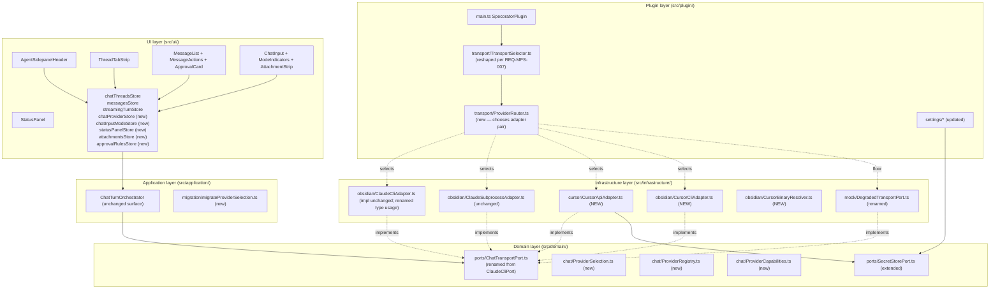

# Design — Multi-provider agent sidepanel

---

## Part A — UX

### A1. User flows

#### Flow 1 — Switch provider mid-session

Pre-condition: a thread is active; both Claude and Cursor are configured and available.

1. User clicks the provider badge in `AgentSidepanelHeader` (currently showing the resolved label, e.g. "Claude · CLI").
2. A dropdown opens listing the two providers; under each provider its enabled modes are nested with capability dots.
3. User selects "Cursor · API".
4. `chatProviderStore.setActiveProvider('cursor', 'api')` dispatches; `TransportSelector` re-resolves on the next turn.
5. The transcript is **not** mirrored to Cursor — the new selection takes effect from the **next user turn forward**. Existing messages remain rendered.
6. A subtle inline system note appears in the transcript: "Switched to Cursor for new messages."
7. If Cursor is configured but its key is missing or its CLI is not resolved, the dropdown row is rendered as disabled with the reason on hover ("Secret storage unavailable", "cursor-agent not found").

Satisfies REQ-MPS-018 (highlight update), REQ-MPS-040 (model selector re-renders), NFR-MPS-004 (≤ 200 ms perceived switch).

---

#### Flow 2 — Add Cursor API key

Pre-condition: Obsidian ≥ 1.11.4 desktop; `SecretStorePort.available === true`.

1. User opens Settings → Specorator → Providers → Cursor.
2. The "Cursor API key" field is rendered as a password input with `autocomplete="off"`, the same shape as the existing Anthropic field.
3. A description note reads: "Stored in your operating system's keychain. Not synced across devices."
4. User enters and saves the key.
5. The settings tab calls `secretStore.setSecret(SECRET_ID_CURSOR, trimmedValue)`.
6. `bumpSettingsVersion()` fires; `ChatSidebar` and `AgentSidepanelRoot` re-check Cursor availability.
7. The provider dropdown now shows "Cursor · API" as enabled.

Satisfies REQ-MPS-010, REQ-MPS-011, REQ-MPS-013.

---

#### Flow 3 — Multi-thread switcher (open, switch, rename, fork, delete)

Pre-condition: chat sidepanel is open.

1. User sees a horizontal tab strip at the top of `AgentSidepanelRoot`, each tab labelled with the thread title.
2. The active tab is highlighted with the accent colour underline; non-active tabs are muted.
3. Click a non-active tab → store sets `activeThreadId`; transcript re-renders.
4. Double-click an active tab → tab label becomes editable inline; Enter commits, Esc cancels.
5. Right-click any tab → context menu with Rename, Delete, Fork from last message, Open log file.
6. Click "New thread" (+) → fresh thread; takes focus; default title "New thread"; on first user message the title is replaced by the first 40 chars.
7. Delete → opens an Obsidian `Modal` confirmation; on confirm, the tab is removed and `VaultPort.deleteFile(logPath)` runs.
8. Fork from last message → new thread cloning the transcript up to the chosen message; `forkParent` recorded.

Satisfies REQ-MPS-018, REQ-MPS-019, REQ-MPS-020, REQ-MPS-021, REQ-MPS-022, REQ-MPS-023, REQ-MPS-024.

---

#### Flow 4 — Per-message action: edit-and-resend

Pre-condition: user has sent ≥ 1 user message.

1. User hovers their own message; an action row appears below it (Copy, Edit).
2. User clicks Edit. The message bubble collapses; the input below is populated with the message text; existing later messages remain visible but greyed out.
3. User edits the text and clicks Send.
4. `messagesStore.truncateAfter(index)` removes the original and all later messages.
5. A new user turn is dispatched as a normal send; the assistant response streams in.

Satisfies REQ-MPS-028, REQ-MPS-029.

---

#### Flow 5 — Regenerate last response

1. User hovers the latest assistant message; the action row shows Copy + Regenerate.
2. User clicks Regenerate.
3. `messagesStore.removeLatestAssistant()`; the preceding user turn is re-dispatched with the same `(provider, mode)` selection and `resumeSessionId` (when the provider supports it).

Satisfies REQ-MPS-027.

---

#### Flow 6 — Status panel: todos + bash output

Pre-condition: an agentic turn is in progress that emits TodoWrite or Bash tool-uses.

1. Status panel is fixed under the message list (collapsible per REQ-MPS-033).
2. Todo list: each row shows status icon (pending/in-progress/done), title, and optional description.
3. Bash history: most recent first, capped at 50. Each row shows the command in monospace and a chevron to expand the output body.
4. Long output bodies (> 200 lines) are clipped with a "Show all" affordance.

Satisfies REQ-MPS-030, REQ-MPS-031, REQ-MPS-032.

---

#### Flow 7 — Plan-mode toggle

1. User presses `Shift+Tab` in `ChatInput`.
2. Input border switches to accent colour; send button label becomes "Plan"; an aria-live announcement reads "Plan mode on."
3. Next send adds `planMode: true` to the turn options; the adapter forwards `--permission-mode plan` (Claude CLI) or equivalent.
4. `Shift+Tab` again toggles off.

Satisfies REQ-MPS-036, REQ-MPS-037, NFR-MPS-010.

---

#### Flow 8 — Inline approval card

1. Agent emits a Write tool-use to `notes/draft.md`.
2. An inline approval card renders in the message stream showing: path, content preview (≤ 20 lines, truncated with affordance), three buttons.
3. Deny → callback resolves with `false`; transcript records "Denied write to notes/draft.md".
4. Allow once → callback resolves with `true`; no rule persisted.
5. Always allow → callback resolves with `true` AND a rule `{ tool: 'Write', scope: 'notes/draft.md', providerId: 'claude' }` is persisted to `_storedData.specorator.approvalRules`.
6. Next time the same `(tool, scope, providerId)` triple is requested, the callback auto-resolves with no UI.

Satisfies REQ-MPS-045, REQ-MPS-046, REQ-MPS-047.

---

### A2. Information architecture

```
AgentSidepanelRoot
├── AgentSidepanelHeader
│   ├── ThreadTabStrip      [REQ-MPS-018..025]
│   ├── ProviderBadge       [REQ-MPS-007, REQ-MPS-018 highlight]
│   └── ModelSelector       [REQ-MPS-040, REQ-MPS-041]
├── MessageList
│   ├── UserMessage         (with Copy, Edit per-message actions)
│   ├── AssistantMessage    (with Copy, Regenerate when latest)
│   ├── ToolCallBlock
│   ├── ApprovalCard        [REQ-MPS-045..047]
│   └── ThinkingBlock
├── StatusPanel             [REQ-MPS-030..033]
│   ├── TodoList
│   └── BashHistoryList
└── ChatInput
    ├── AttachmentStrip     [REQ-MPS-042..044]
    ├── ModeIndicators      (Plan / Bang-bash / Instruction)
    ├── MentionDropdown     (existing)
    ├── SlashCommandDropdown (enriched per REQ-MPS-034)
    └── SendButton
```

Route placement unchanged — the multi-provider work continues to live in `AgentSidepanelView` (primary, `VIEW_TYPE_AGENT='specorator-agent'`). The legacy `/chat` route in `SpecoratorView` is **not modified by this feature**; its removal is tracked separately (CQ-MPS-02).

---

### A3. Copy

All new strings land under `chat.*` and a new `provider.*` namespace in `src/ui/i18n/locales/en.ts`. Existing `chat.*` keys are unchanged.

| Key | Value |
|---|---|
| `provider.label.claude` | `Claude` |
| `provider.label.cursor` | `Cursor` |
| `provider.mode.api` | `API` |
| `provider.mode.cli` | `Command line` |
| `provider.switch.notice` | `Switched to {provider} for new messages.` |
| `provider.cursor.keyDescription` | `Stored in your operating system's keychain. Not synced across devices.` |
| `provider.cursor.unavailable.heading` | `Secret storage isn't available on this device.` |
| `provider.cursor.unavailable.body` | `Cursor needs Obsidian 1.11.4 or newer on desktop.` |
| `thread.new` | `New thread` |
| `thread.action.rename` | `Rename` |
| `thread.action.delete` | `Delete` |
| `thread.action.fork` | `Fork from here` |
| `thread.delete.confirmTitle` | `Delete this thread?` |
| `thread.delete.confirmBody` | `Messages and the log file will be removed. This can't be undone.` |
| `thread.tabCap.warning` | `Close a thread before opening a new one.` |
| `message.action.copy` | `Copy` |
| `message.action.regenerate` | `Regenerate` |
| `message.action.edit` | `Edit` |
| `message.copy.toast` | `Copied to clipboard.` |
| `status.todos.heading` | `Tasks` |
| `status.bash.heading` | `Recent shell output` |
| `status.bash.showAll` | `Show all` |
| `mode.plan.on` | `Plan mode on` |
| `mode.plan.off` | `Plan mode off` |
| `mode.bangbash.indicator` | `Shell command` |
| `mode.instruction.indicator` | `System instruction` |
| `attachment.tooLarge` | `Attachments must be 5 MB or smaller.` |
| `approval.title.write` | `Write file?` |
| `approval.title.edit` | `Edit file?` |
| `approval.title.bash` | `Run command?` |
| `approval.action.deny` | `Deny` |
| `approval.action.allowOnce` | `Allow once` |
| `approval.action.alwaysAllow` | `Always allow` |

NFR-MPS-011 (plain language) enforced via `tests/i18n/forbidden-terms.test.ts` — extended to forbid "API key", "subprocess", "SDK" outside of Settings tab field labels.

---

### A4. Accessibility

- Tab strip: `<ul role="tablist">` with each tab `<li role="tab" tabindex="-1">`. Arrow keys move focus; Enter activates. Active tab carries `aria-selected="true"`. Delete via context menu (right-click or Shift+F10), confirmed via Obsidian Modal — no native `confirm`. (NFR-MPS-009)
- Per-message actions: each button carries `aria-label="<Action> message"`; the action row appears via hover OR keyboard focus to the message bubble. (NFR-MPS-008)
- Plan-mode toggle: dedicated `<div aria-live="polite" class="sr-only">` announces `mode.plan.on` / `mode.plan.off`. (NFR-MPS-010)
- Approval card: receives focus on render with `tabindex="-1"`; first focusable button is "Deny" (least-destructive default).
- Status panel: collapsible with `aria-expanded`; bash entry chevrons are `<button aria-controls="bash-output-{id}">`.
- Provider badge dropdown: `<button aria-haspopup="menu" aria-expanded="...">`; menu items disabled with `aria-disabled="true"` and `title` containing the reason.

---

## Part B — UI

### B1. Component inventory

New components (all under `src/ui/components/`):

| File | Role |
|---|---|
| `agent/ThreadTabStrip.vue` | Horizontal tab strip; renders one `ThreadTab.vue` per thread + "New thread" button |
| `agent/ThreadTab.vue` | Single tab with title, active state, double-click rename, context menu trigger |
| `agent/ProviderBadge.vue` | Displays current `(provider, mode)`; opens `ProviderMenu.vue` on click |
| `agent/ProviderMenu.vue` | Dropdown of providers and modes with capability dots and disable reasons |
| `agent/ModelSelector.vue` | Per-provider model dropdown; mounted by `AgentSidepanelHeader` |
| `agent/MessageActions.vue` | Action row (Copy, Edit / Regenerate); composed into `MessageList` rendering |
| `agent/StatusPanel.vue` | Container for `TodoList.vue` + `BashHistoryList.vue` |
| `agent/TodoList.vue` | Renders `statusPanelStore.todos` |
| `agent/BashHistoryList.vue` | Renders `statusPanelStore.bashHistory`, with collapsible entries |
| `agent/AttachmentStrip.vue` | Renders pending attachments below the input |
| `agent/ModeIndicators.vue` | Renders plan/bang-bash/instruction indicators in the input border |
| `agent/ApprovalCard.vue` | Inline approval card (replaces blocking modal) |
| `settings/CursorKeyField.vue` | Settings tab Cursor key control with degraded-notice variant |

Modified components:

| File | Change |
|---|---|
| `agent/AgentSidepanelRoot.vue` | Mount `ThreadTabStrip`, `StatusPanel`; pass `activeThreadId` to children |
| `agent/AgentSidepanelHeader.vue` | Mount `ProviderBadge`, `ModelSelector` |
| `agent/MessageList.vue` | Render `MessageActions` per message; render `ApprovalCard` for approval-required tool-uses |
| `chat/ChatInput.vue` | Mount `AttachmentStrip`, `ModeIndicators`; handle `!` / `#` prefix detection + `Shift+Tab` |
| `settings/*.vue` (new + existing) | Render `CursorKeyField`; render Approvals list (REQ-MPS-047) |

### B2. Design tokens

Reuses all existing Obsidian CSS variables. New token usage:

| CSS variable | Use |
|---|---|
| `--text-accent` | Active tab underline; plan-mode border colour |
| `--background-modifier-active-hover` | Hovered tab background |
| `--text-on-accent` | Plan-mode send button text |
| `--background-modifier-error-rgb` | Bash entry non-zero exit-code badge |

No custom Specorator CSS variables introduced.

### B3. Microcopy

All new copy listed in §A3 lives in `en.ts` under `provider.*`, `thread.*`, `message.*`, `status.*`, `mode.*`, `attachment.*`, `approval.*`. NFR-MPS-011 enforces vocabulary.

---

## Part C — Architecture

### C1. System overview



### C2. Renames (canonical)

| Before | After | File |
|---|---|---|
| `ClaudeCliPort` | `ChatTransportPort` | `src/domain/ports/ChatTransportPort.ts` (was `ClaudeCliPort.ts`) |
| `ClaudeCliError` | `ChatTransportError` | same file |
| `ClaudeCliErrorCode` | `ChatTransportErrorCode` | same file |
| `ClaudeCliQueryOptions` | `ChatTransportQueryOptions` | same file |
| `ClaudeCliStreamOptions` | `ChatTransportStreamOptions` | same file |
| `CLAUDE_CLI_PORT` (InjectionKey) | `CHAT_TRANSPORT_PORT` | `src/infrastructure/bridge/ports.ts` |
| `useClaudeCliPort` | `useChatTransportPort` | `src/ui/composables/useChatTransportPort.ts` |
| `ClaudeCliAdapter` | `ClaudeApiAdapter` | `src/infrastructure/obsidian/ClaudeApiAdapter.ts` (re-export from old path for one release) |

Codemod scripted in `scripts/codemod/rename-claude-cli-port.mjs` runs against `src/`, `tests/`, `templates/`. ESLint custom rule `no-legacy-claude-cli-port-names` errors if the old names reappear.

### C3. New domain types

```typescript
// src/domain/chat/ProviderSelection.ts
export type ProviderId = 'claude' | 'cursor'
export type ProviderMode = 'api' | 'cli'

export type ProviderSelection =
  | { readonly provider: ProviderId; readonly mode: ProviderMode }
  | { readonly forced: 'auto' | 'degraded' }

export function isExplicit(
  s: ProviderSelection,
): s is { readonly provider: ProviderId; readonly mode: ProviderMode } {
  return 'provider' in s
}
```

```typescript
// src/domain/chat/ProviderCapabilities.ts
export interface ProviderCapabilities {
  readonly modes: ReadonlyArray<ProviderMode>
  readonly models: ReadonlyArray<{ readonly id: string; readonly label: string }>
  readonly supportsStreaming: boolean
  readonly supportsTools: boolean
  readonly supportsThinking: boolean
  readonly supportsPlanMode: boolean
  readonly supportsAttachments: ReadonlyArray<'image' | 'file'>
  readonly supportsSessionResume: boolean
  /** Plain-language reason the mode is currently disabled, or null if enabled. */
  readonly modeDisabledReason: Readonly<Record<ProviderMode, string | null>>
}
```

```typescript
// src/domain/chat/ProviderRegistry.ts
export interface ProviderEntry {
  readonly id: ProviderId
  readonly label: string
  readonly capabilities: ProviderCapabilities
  readonly slashCommands: () => ReadonlyArray<SlashCommand>  // already exists
}

export interface ProviderRegistry {
  listProviders(): ReadonlyArray<ProviderEntry>
  getProvider(id: ProviderId): ProviderEntry | undefined
  getCapabilities(id: ProviderId): ProviderCapabilities | undefined
}
```

`ProviderRegistry` lives in the domain layer; its **wiring** (which adapters realise which modes) lives in the plugin layer (`src/plugin/transport/buildProviderRegistry.ts`). The registry returns only metadata — no adapter references — so it can be safely consumed by UI without breaking ADR-001.

### C4. Reshaped `TransportSelector`

```typescript
// src/plugin/transport/TransportSelector.ts (new shape)

export interface ProviderRouterDeps {
  readonly providers: {
    readonly claude: { readonly api: ChatTransportPort; readonly cli: ChatTransportPort }
    readonly cursor: { readonly api: ChatTransportPort; readonly cli: ChatTransportPort }
  }
  readonly degradedPort: ChatTransportPort
  readonly availability: {
    readonly claudeApiKeyPresent: boolean
    readonly claudeCliResolved: boolean
    readonly cursorApiKeyPresent: boolean
    readonly cursorCliResolved: boolean
    readonly cursorApiPreviewEnabled: boolean    // REQ-MPS-014
    readonly secretStoreAvailable: boolean       // gates Cursor api on mobile
  }
  readonly autoPreferProvider: ProviderId        // REQ-MPS-008
}

export interface TransportSelection {
  readonly port: ChatTransportPort
  readonly resolved: { readonly provider: ProviderId; readonly mode: ProviderMode } | 'degraded'
}

export const selectTransport: (
  selection: ProviderSelection,
  deps: ProviderRouterDeps,
) => TransportSelection
```

Truth table (15 rows, first-match-wins):

| # | selection | Conditions | Resolution |
|---|---|---|---|
| R1 | `{ forced: 'degraded' }` | * | degraded |
| R2 | `{ provider: 'claude', mode: 'api' }` | `claudeApiKeyPresent` | claude/api |
| R3 | `{ provider: 'claude', mode: 'api' }` | `!claudeApiKeyPresent` | degraded |
| R4 | `{ provider: 'claude', mode: 'cli' }` | `claudeCliResolved` | claude/cli |
| R5 | `{ provider: 'claude', mode: 'cli' }` | `!claudeCliResolved` | degraded |
| R6 | `{ provider: 'cursor', mode: 'api' }` | `secretStoreAvailable && cursorApiKeyPresent && cursorApiPreviewEnabled` | cursor/api |
| R7 | `{ provider: 'cursor', mode: 'api' }` | otherwise | degraded |
| R8 | `{ provider: 'cursor', mode: 'cli' }` | `cursorCliResolved` | cursor/cli |
| R9 | `{ provider: 'cursor', mode: 'cli' }` | `!cursorCliResolved` | degraded |
| R10 | `{ forced: 'auto' }` | `claudeApiKeyPresent && autoPreferProvider === 'claude'` | claude/api |
| R11 | `{ forced: 'auto' }` | `cursorApiKeyPresent && cursorApiPreviewEnabled && autoPreferProvider === 'cursor'` | cursor/api |
| R12 | `{ forced: 'auto' }` | `claudeApiKeyPresent` | claude/api |
| R13 | `{ forced: 'auto' }` | `claudeCliResolved` | claude/cli |
| R14 | `{ forced: 'auto' }` | `cursorCliResolved` | cursor/cli |
| R15 | `{ forced: 'auto' }` | otherwise | degraded |

Selector remains synchronous (no I/O) — `availability.*` flags are projected at plugin-wiring time + after `bumpSettingsVersion()`.

### C5. `PluginSettings` updates

```typescript
// src/domain/settings/PluginSettings.ts (new fields)
interface PluginSettings {
  // ... existing fields except `transportKind` (removed) ...

  /** Replaces the flat `transportKind` field (REQ-MPS-003, REQ-MPS-004). */
  readonly providerSelection: ProviderSelection

  /** Cursor CLI binary path; empty string = auto-detect. (REQ-MPS-015) */
  readonly cursorCliPath: string

  /** Cursor API preview flag (REQ-MPS-014). Default false. */
  readonly cursorApiPreview: boolean

  /** Preferred provider when `forced === 'auto'`. (REQ-MPS-008) Default 'claude'. */
  readonly autoPreferProvider: ProviderId

  /** Per-provider chosen model. (REQ-MPS-040) Defaults: each provider's first model. */
  readonly providerModel: Readonly<Record<ProviderId, string>>

  /** Max simultaneously open chat tabs. (REQ-MPS-025) Default 10. */
  readonly chatTabCap: number
}
```

Removed fields: `transportKind` (migrated). Carried forward: `claudeCliPath`, `anthropicApiKey` is unchanged at the **settings** layer (the existing migration to `SecretStorePort` already wrote `anthropicApiKey: ''` in the new schema for the predecessor feature). Cursor API key is **never** added to `PluginSettings`.

### C6. Persistence shape

`_storedData.specorator.*` extensions:

| Path | Shape | Purpose |
|---|---|---|
| `chatThreads` | `Record<threadId, ChatThreadRecord>` (existing; `transport` migrated per REQ-MPS-005) | Multi-thread switcher |
| `activeThreadId` | `string \| null` (new) | Restore active thread on reload (REQ-MPS-024) |
| `approvalRules` | `Array<ApprovalRule>` (new) | Persistent approval rules (REQ-MPS-046) |
| `statusPanelCollapse` | `Record<threadId, boolean>` (new) | Per-thread collapse memory (REQ-MPS-033) |

`ChatThreadRecord` extensions:

```typescript
export interface ChatThreadRecord {
  readonly threadId: string
  readonly sessionId: SessionId | null
  readonly feature: string | null
  readonly logPath: string
  /** REPLACES the legacy 'api-key' | 'subscription' string (REQ-MPS-005). */
  readonly transport: { readonly provider: ProviderId; readonly mode: ProviderMode }
  /** NEW (REQ-MPS-020/021). Empty string until first message or rename. */
  readonly title: string
  /** NEW (REQ-MPS-023). Source thread id when this thread was forked. */
  readonly forkParent: string | null
  readonly createdAt: string
  readonly lastUsedAt: string
}
```

`ApprovalRule`:

```typescript
export interface ApprovalRule {
  readonly id: string
  readonly providerId: ProviderId
  readonly tool: 'Write' | 'Edit' | 'Bash'
  /** Glob or exact-path scope. For Bash this is a command-name prefix. */
  readonly scope: string
  readonly createdAt: string
}
```

### C7. Migration plan

`src/application/migration/migrateProviderSelection.ts` (pure):

1. Read `_storedData.specorator.settings.transportKind` (legacy string).
2. Translate per REQ-MPS-004 table to a `ProviderSelection`.
3. Write `_storedData.specorator.settings.providerSelection` and **delete** the legacy key.
4. For each `ChatThreadRecord` in `_storedData.specorator.chatThreads`:
   - Translate `transport: 'api-key' | 'subscription'` → `{ provider: 'claude', mode: 'api' | 'cli' }`.
   - Default `title: ''`, `forkParent: null` for records that don't have those fields.
5. Idempotent: running the migration again is a no-op because `transportKind` no longer exists.

Migration runs in `SpecoratorPlugin.onload()` after `loadData()` and before `core.initialise()`. The migrated blob is persisted via `saveData()`. If the migration throws, the original data is preserved and a sticky `NotificationPort.showError` notice prompts the user to file an issue.

### C8. Cursor API adapter outline

`src/infrastructure/cursor/CursorApiAdapter.ts`:

- No new `HttpPort` — uses `globalThis.fetch` directly. The decision is recorded in the inline ADR draft below: introducing an `HttpPort` for one consumer would compromise our narrow-port discipline and would not be reused by any other planned feature.
- Reads `SECRET_ID_CURSOR` via `SecretStorePort` per call (not cached at construction).
- `queryStream()` opens an SSE stream against the documented Cursor agent endpoint (URL: pending CQ-MPS-01 confirmation; for the spec the URL lives in `CURSOR_API_BASE_URL` constant injected by `buildProviderRegistry`).
- Maps SSE event types to `StreamDelta`:
  - `'message_delta'` → `{ type: 'text', text }`
  - `'tool_use'` → `{ type: 'tool-use-start' }` / `tool-use-input-delta` / `tool-use-stop`
  - `'citation'` → `{ type: 'citation', ... }` (REQ-MPS-017 new variant)
  - `'usage'` → `{ type: 'usage', inputTokens, outputTokens }`
  - `'done'` → `{ type: 'done' }`
  - any error → `{ type: 'error', error: ChatTransportError{QUERY_FAILED} }`
- `runStructured?` not implemented — Cursor structured output is not in scope (deferred).

### C9. Cursor CLI adapter outline

`src/infrastructure/obsidian/CursorCliAdapter.ts`:

- Mirrors `ClaudeSubprocessAdapter` shape: uses `SubprocessLifecycle`, `NdjsonChannel`, `runSubprocessStructured`.
- Binary discovery via new `CursorBinaryResolver` (sibling of `ClaudeBinaryResolver`):
  - darwin/linux: `sh -lc 'command -v cursor-agent'`
  - win32: `where.exe cursor-agent`
  - 5-second timeout; no caching; no `~/.cursor/` reads (REQ-MPS-016).
- Argument shape: `cursor-agent chat --stream --json` (placeholder pending CQ-MPS-01 confirmation; the codepath that builds args lives in `src/infrastructure/obsidian/buildCursorSubprocessArgs.ts`).
- Stream parsing reuses NDJSON channel; delta mapping mirrors C8.

### C10. UI store additions

| Store | Persisted? | Purpose |
|---|---|---|
| `chatProviderStore` | yes (mirrored to settings) | Current `(provider, mode)` selection; setter validates against `ProviderRegistry` |
| `chatInputModeStore` | no (per-thread ephemeral) | `planMode`, `bangBashMode`, `instructionMode` |
| `statusPanelStore` | partially (collapse state per thread) | `todos`, `bashHistory`, `collapsedByThread` |
| `attachmentsStore` | no | Pending attachments for the current draft |
| `approvalRulesStore` | yes | Persistent approval rules |

All stores adhere to ADR-003: only DTOs cross the store boundary; no domain class instances.

### C11. Plugin wiring

`src/plugin/main.ts` changes:

1. `onload()` calls `migrateProviderSelection()` after `loadData()` (REQ-MPS-004 / REQ-MPS-005).
2. Wire `buildProviderRegistry()` returning the `ProviderRegistry` consumed by the UI.
3. Instantiate four adapters: `ClaudeApiAdapter`, `ClaudeSubprocessAdapter`, `CursorApiAdapter`, `CursorCliAdapter`; plus the degraded port.
4. `onLayoutReady` fires `startup()` on both adapter pairs concurrently (was: only Claude). Each adapter's `startup()` is fire-and-forget per NFR-CCS-002 / NFR-MPS-007.
5. Register a new `'specorator:switch-provider'` command palette entry (for keyboard users).
6. Extend the URI handler to accept `obsidian://specorator?action=open-chat&provider=cursor` — defaults to current provider if absent.

### C12. ADRs to file (drafts inline)

The architect will file these as proper ADRs under `decisions/` in a follow-up PR. They are **drafted here** for completeness; the rename PR depends on ADR-MPS-001 being merged first.

#### ADR-MPS-001 — Rename `ClaudeCliPort` to `ChatTransportPort`

- **Status:** Proposed (this design)
- **Context:** `ClaudeCliPort` was named when only one Claude SDK transport existed. The port now serves SDK and CLI subprocess, and we are adding two Cursor adapters. The name has become misleading.
- **Decision:** Rename the port to `ChatTransportPort` and its associated types (`ChatTransportError`, `ChatTransportErrorCode`, `ChatTransportQueryOptions`, `ChatTransportStreamOptions`). Provide a one-release re-export shim from the old path for downstream consumers; remove the shim in the next minor version.
- **Consequences:** Mechanical rename; codemod required. Tests in `tests/__legacy__/` keep the old import path to assert the shim works for one release. ESLint custom rule `no-legacy-claude-cli-port-names` introduced.

#### ADR-MPS-002 — Provider × mode discriminator replaces flat `TransportKind`

- **Status:** Proposed
- **Context:** `TransportKind = 'auto' | 'api-key' | 'subscription' | 'degraded'` is Claude-specific. Adding Cursor would require an N×M flat string explosion.
- **Decision:** Replace with `ProviderSelection = { provider: ProviderId, mode: ProviderMode } | { forced: 'auto' | 'degraded' }`. The selector becomes a 15-row truth table, still synchronous, still first-match-wins. Settings migration is a one-shot translate-and-delete at `onload()`.
- **Consequences:** Truth table grows but is data-driven and unit-testable. Persisted settings migration is idempotent. Persisted `ChatThreadRecord.transport` migrated in the same pass.

#### ADR-MPS-003 — Add Cursor provider; key in `SecretStorePort`; no keytar fallback

- **Status:** Proposed
- **Context:** Users want Cursor as a second provider. Anthropic key already migrated to `SecretStorePort` in the predecessor patch; mobile and pre-1.11.4 desktop fall back to a degraded notice. We deliberately do not introduce a keytar dependency to avoid expanding the native-deps surface.
- **Decision:** `CursorApiAdapter` reads the Cursor key from `SecretStorePort.getSecret(SECRET_ID_CURSOR)` at query time. When `SecretStorePort.available === false`, the Cursor settings field renders a degraded notice and `CursorApiAdapter.isAvailable()` returns `false`. The `cursorApiPreview` flag gates the adapter until Cursor's public HTTP API is confirmed stable (CQ-MPS-01).
- **Consequences:** Cursor on mobile is unavailable until Obsidian ships secret storage on mobile. Tests cover three environments: 1.11.4+ desktop (available), pre-1.11.4 desktop (degraded), mobile (degraded). No new native dependency added.

### C13. Component diagram — adapter side

```
                  ChatTransportPort
                         ▲
   ┌────────┬────────────┼────────────┬────────┐
   │        │            │            │        │
ClaudeApi  ClaudeCli  CursorApi   CursorCli   Degraded
  Adapter   Subprocess   Adapter    Adapter   Sentinel
            Adapter
   │           │            │            │
   ▼           ▼            ▼            ▼
 Anthropic   claude     SecretStore   cursor-agent
   SDK     CLI (sh)    + fetch SSE      CLI (sh)
```

### C14. Requirements coverage (Part C)

| REQ ID | Where addressed |
|---|---|
| REQ-MPS-001 | C2 rename table; codemod |
| REQ-MPS-002 | C2 rename table |
| REQ-MPS-003 | C3 `ProviderSelection` definition |
| REQ-MPS-004 | C7 migration step 1–3 |
| REQ-MPS-005 | C7 migration step 4; C6 `ChatThreadRecord.transport` extension |
| REQ-MPS-006 | C3 `ProviderRegistry` interface |
| REQ-MPS-007 | C4 `selectTransport` reshape |
| REQ-MPS-008 | C4 truth table R10–R15 |
| REQ-MPS-009 | C2 ESLint rule mention |
| REQ-MPS-010 | C5 `SECRET_ID_CURSOR` add; C8 adapter consumption |
| REQ-MPS-011 | C8 adapter reads key, never writes to settings |
| REQ-MPS-012 | C4 R7 truth row; B1 `CursorKeyField.vue` |
| REQ-MPS-013 | C8 adapter outline |
| REQ-MPS-014 | C4 R7; C5 `cursorApiPreview` setting |
| REQ-MPS-015 | C9 adapter outline; new `CursorBinaryResolver` |
| REQ-MPS-016 | C9 resolver discipline; lint rule |
| REQ-MPS-017 | C8 SSE mapping table |
| REQ-MPS-018..025 | C6 persistence; C10 `chatProviderStore` + UI components in §B1 |
| REQ-MPS-026..029 | §B1 `MessageActions.vue`; C10 `messagesStore` (existing) |
| REQ-MPS-030..033 | C10 `statusPanelStore`; §B1 components |
| REQ-MPS-034 | C3 `ProviderEntry.slashCommands()` extension |
| REQ-MPS-035 | unchanged behaviour — covered by carry-forward regression |
| REQ-MPS-036..039 | C10 `chatInputModeStore`; §B1 `ModeIndicators.vue` |
| REQ-MPS-040..041 | §B1 `ModelSelector.vue`; C3 `ProviderCapabilities.models` |
| REQ-MPS-042..044 | C10 `attachmentsStore`; §B1 `AttachmentStrip.vue` |
| REQ-MPS-045..047 | C10 `approvalRulesStore`; §B1 `ApprovalCard.vue`; C6 persistence |
| NFR-MPS-001..003 | C8 adapter discipline; C13 component diagram excludes secret values from registry |
| NFR-MPS-004..005 | UI store granularity per C10 — provider switch updates only header & next-turn options |
| NFR-MPS-006 | C7 migration idempotency |
| NFR-MPS-007 | C11 startup wiring fire-and-forget |
| NFR-MPS-008..010 | §A4 accessibility |
| NFR-MPS-011 | §A3 copy keys + i18n test |
| NFR-MPS-012 | C2 rename + domain-layer `no-restricted-imports` |
| NFR-MPS-013 | C8 adapter uses `globalThis.fetch` only |
| NFR-MPS-014 | new mock adapters parallel to `MockClaudeCliPort` |

### C15. Rejected alternatives

| Alternative | Why rejected |
|---|---|
| Keep `ClaudeCliPort` name; add Cursor as a sibling port `CursorPort` | Doubles the wiring surface; every store, composable, and adapter selector would branch on a port type rather than a provider id. Defeats the purpose of the narrow seam. |
| Introduce `HttpPort` for `CursorApiAdapter` | Only one consumer in the foreseeable future; adds boilerplate without yielding portability. Direct `globalThis.fetch` keeps the adapter self-contained (NFR-MPS-013). |
| Keytar dependency for Cursor key | Adds a native dependency; conflicts with our "narrow-ports, no native modules beyond Obsidian's surface" stance. Secret Storage degraded mode is the correct UX. |
| Aggregate `useChatTransports()` returning all four adapters | Re-introduces the deleted `useBridge` pattern; conflicts with ADR-008. |
| Schema-versioned `_storedData` (instead of in-place migration) | Open clarification CQ-MPS-03. Recommendation: in-place migration is sufficient because the legacy `transportKind` field's absence is itself a "migrated" marker. If a future migration breaks idempotency, then introduce `_storedData.schemaVersion`. |
| Per-thread provider lock (provider chosen at thread creation, immutable) | Breaks Flow 1 (switch mid-session). Rejected; per-turn provider override is the right granularity. |
| Multi-agent simultaneous-streaming (both providers respond to the same turn) | Out of scope (NG11); would require major changes to `ChatTurnOrchestrator`. |
