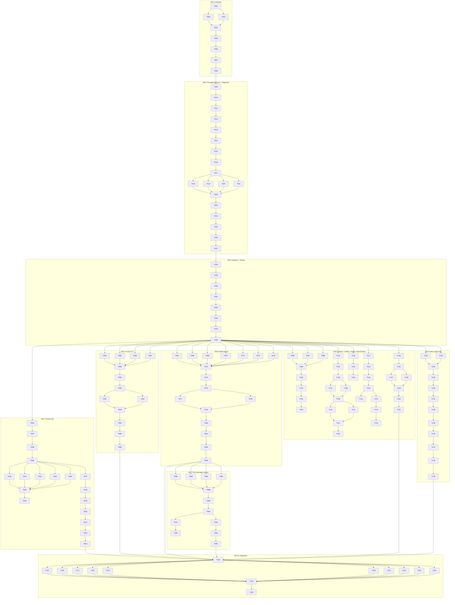

# Tasks — Multi-provider agent sidepanel

Each task is ≤ ~½ day (S or M). TDD ordering: every implementation task is preceded by its red test task. Tasks are grouped under the nine workstreams from spec §12 plus a final WS-10 integration workstream. Each task ends with `npm run verify` green on its branch.

## Legend

- 🧪 = test task (owner `qa`)
- 🔨 = implementation task (owner `dev`)
- 📐 = scaffolding / structural change (owner `dev`)
- 📚 = documentation (owner `dev`)
- 🚀 = release / ops (owner `sre`)
- 🪓 = may slice across multiple PRs

## Conventions

- Branch naming: `feature/mps-ws-<N>-<slug>`; worktrees under `.worktrees/mps-ws-<N>-<slug>/`.
- Each task ID stable: `T-MPS-NNN`.
- DoD lines marked `verify` mean `npm run verify` (typecheck + lint + test + build + build:web + docs:api + audit) is green.
- Test tasks specify the exact `tests/` path and a failing assertion before the implementation task is opened.

---

## WS-1 — Rename `ClaudeCliPort` → `ChatTransportPort`

> **Goal:** Mechanical rename + codemod + ESLint guard. Lands first; unblocks WS-2.
> **First green test:** T-MPS-002 (no production import of legacy identifier).

### T-MPS-001 📐 — ADR-MPS-001 filed under `decisions/`

- **Description:** File ADR-MPS-001 (rename) using `templates/adr-template.md`; content per design §C12. Required before any rename PR per spec-first gate.
- **Satisfies:** REQ-MPS-001, REQ-MPS-002
- **Owner:** dev
- **Depends on:** —
- **Estimate:** S
- **Files:** `decisions/ADR-MPS-001-rename-claude-cli-port.md` (new)
- **Definition of done:**
  - [x] ADR file exists with Status: Accepted, Context, Decision, Consequences.
  - [x] Referenced from `decisions/README.md` index.
  - [x] `npm run verify` green.

### T-MPS-002 🧪 — Lint test: no production file imports `ClaudeCliPort`

- **Description:** Add a Vitest test that greps `src/` (excluding `tests/__legacy__/`) for any of the legacy identifiers `ClaudeCliPort|ClaudeCliError|ClaudeCliErrorCode|ClaudeCliQueryOptions|ClaudeCliStreamOptions|CLAUDE_CLI_PORT|useClaudeCliPort`. Test must fail today.
- **Satisfies:** REQ-MPS-001, REQ-MPS-002, TST-MPS-34
- **Owner:** qa
- **Depends on:** T-MPS-001
- **Estimate:** S
- **Files:** `tests/lint/no-legacy-claude-cli-port-names.test.ts` (new)
- **Definition of done:**
  - [x] Test exists, references REQ-MPS-001 in name.
  - [x] Test fails on current `develop` HEAD with explicit count of legacy occurrences.

### T-MPS-003 🧪 — Lint test: `ChatTransportPort.ts` forbids `obsidian` / SDK / `node:child_process` imports

- **Description:** Test that asserts the (about-to-exist) `src/domain/ports/ChatTransportPort.ts` has zero imports from `obsidian`, `@anthropic-ai/claude-agent-sdk`, `node:child_process`, `node:https`, or anything outside `src/domain/`.
- **Satisfies:** NFR-MPS-012, TST-MPS-35
- **Owner:** qa
- **Depends on:** T-MPS-001
- **Estimate:** S
- **Files:** `tests/domain/ports/ChatTransportPort.imports.test.ts` (new)
- **Definition of done:**
  - [x] Test file present; will fail until T-MPS-004 renames the file.
  - [x] Test references NFR-MPS-012 in name.

### T-MPS-004 🔨 🪓 — Rename port file + types

- **Description:** Rename `src/domain/ports/ClaudeCliPort.ts` → `src/domain/ports/ChatTransportPort.ts`. Rename the five exported types per spec §2.1 table. Add the three new `ChatTransportErrorCode` values (`ATTACHMENT_TOO_LARGE`, `PROVIDER_UNAVAILABLE`) but **not** the new `StreamDelta` variants yet (those land in WS-8).
- **Satisfies:** REQ-MPS-001, REQ-MPS-002
- **Owner:** dev
- **Depends on:** T-MPS-002, T-MPS-003
- **Estimate:** M
- **Files:** `src/domain/ports/ChatTransportPort.ts` (renamed), `src/domain/ports/index.ts` (re-export)
- **Slice plan:** (a) rename file + types only; (b) update the InjectionKey + composable + adapters in a single follow-up commit.
- **Definition of done:**
  - [x] T-MPS-003 passes.
  - [x] No legacy identifier in the new file.
  - [x] `npm run typecheck` red elsewhere (callers need updating) — captured in T-MPS-006.
- **Deviation (dev, 2026-05-21):** delivered together with T-MPS-005/006/007 in commit `e3b80bf` rather than as a stand-alone slice. The single-commit atomic rename keeps the tree typecheck-green throughout WS-1; running the codemod inside the same commit eliminates a transient red state on `feature/mps-ws-1-rename-port`. All DoD items satisfied.

### T-MPS-005 🔨 — Codemod script `rename-claude-cli-port.mjs`

- **Description:** Write a one-shot codemod (jscodeshift or simple regex over `src/`, `tests/`, `templates/`) that renames every consumer of the five legacy identifiers + the InjectionKey + the composable. Idempotent: second run is a no-op. Includes `--dry-run`.
- **Satisfies:** REQ-MPS-001, REQ-MPS-002
- **Owner:** dev
- **Depends on:** T-MPS-004
- **Estimate:** M
- **Files:** `scripts/codemod/rename-claude-cli-port.mjs` (new)
- **Definition of done:**
  - [x] `node scripts/codemod/rename-claude-cli-port.mjs --dry-run` lists every file it would touch.
  - [x] Running it on a fixture directory produces deterministic output (unit test under `tests/scripts/`).

### T-MPS-006 🔨 🪓 — Apply codemod across `src/`, update InjectionKey + composable

- **Description:** Run the codemod over the live tree. Rename `CLAUDE_CLI_PORT` → `CHAT_TRANSPORT_PORT` in `src/infrastructure/bridge/ports.ts`. Rename `src/ui/composables/useClaudeCliPort.ts` → `useChatTransportPort.ts` with a one-release re-export shim from the old path. Update all `ClaudeCliAdapter` references to use the new type names (no behavioural changes).
- **Satisfies:** REQ-MPS-001, REQ-MPS-002, REQ-MPS-009
- **Owner:** dev
- **Depends on:** T-MPS-005
- **Estimate:** M
- **Slice plan:** (a) codemod sweep; (b) InjectionKey rename; (c) composable rename + shim.
- **Files:** `src/infrastructure/bridge/ports.ts`, `src/ui/composables/useChatTransportPort.ts` (new), legacy shim at `src/ui/composables/useClaudeCliPort.ts`
- **Definition of done:**
  - [x] T-MPS-002 passes (zero legacy imports).
  - [x] `npm run verify` green.
  - [x] Implementation log entry added.

### T-MPS-007 🧪 — ESLint rule `no-legacy-claude-cli-port-names`

- **Description:** Author and snapshot-test the custom ESLint rule that bans the seven legacy identifiers and any reintroduction of `useBridge` / `useChatTransports`. Rule shipped under `eslint-rules/`.
- **Satisfies:** REQ-MPS-009, NFR-MPS-012
- **Owner:** qa
- **Depends on:** T-MPS-006
- **Estimate:** S
- **Files:** `eslint-rules/no-legacy-claude-cli-port-names.cjs` (new), `eslint-rules/__tests__/no-legacy-claude-cli-port-names.test.cjs` (new)
- **Definition of done:**
  - [x] Rule fails on a fixture that re-introduces `ClaudeCliPort`.
  - [x] Rule wired into `eslint.config.js`.
  - [x] `npm run lint` green.
- **Deviation (dev, 2026-05-21):** the rule and its RuleTester suite ship as `.cjs` (not `.mjs`) to match the existing convention established by `eslint-rules/no-claude-home-reads.cjs` and ESLint's CommonJS rule format. The config file is `eslint.config.js`, not `eslint.config.mjs` — matched accordingly.

### T-MPS-008 📚 — WS-1 closeout note in implementation-log

- **Description:** Append a WS-1 closeout entry to `implementation-log.md` listing the renamed identifiers, the codemod path, and the new ESLint rule. Bridges WS-1 → WS-2.
- **Satisfies:** REQ-MPS-001, REQ-MPS-002, REQ-MPS-009
- **Owner:** dev
- **Depends on:** T-MPS-007
- **Estimate:** S
- **Definition of done:**
  - [x] Entry present in `implementation-log.md`.
  - [x] WS-2 hand-off note appended to `workflow-state.md`.

---

## WS-2 — `ProviderSelection`, `ProviderRegistry`, migration

> **Goal:** New domain shape + pure migration. Sequential after WS-1.
> **First green test:** T-MPS-010.

### T-MPS-009 📐 — ADR-MPS-002 filed (`ProviderSelection` discriminator + migration)

- **Description:** File ADR-MPS-002 per design §C12.
- **Satisfies:** REQ-MPS-003, REQ-MPS-004, REQ-MPS-005, REQ-MPS-007
- **Owner:** dev
- **Depends on:** T-MPS-008
- **Estimate:** S
- **Files:** `decisions/ADR-MPS-002-provider-selection-discriminator.md` (new)
- **Definition of done:**
  - [x] ADR file present, indexed.

### T-MPS-010 🧪 — `ProviderSelection` exports + `isExplicit` type guard

- **Description:** Test that `src/domain/chat/ProviderSelection.ts` exports `ProviderId`, `ProviderMode`, `ProviderSelection`, `ExplicitSelection`, `isExplicit`, `selectionKey` and nothing else. Test `isExplicit` against both branches.
- **Satisfies:** REQ-MPS-003
- **Owner:** qa
- **Depends on:** T-MPS-009
- **Estimate:** S
- **Files:** `tests/domain/chat/ProviderSelection.test.ts` (new)
- **Definition of done:** Test fails (file does not exist).

### T-MPS-011 🔨 — Implement `ProviderSelection.ts`

- **Description:** Per spec §2.2 exact signatures.
- **Satisfies:** REQ-MPS-003
- **Owner:** dev
- **Depends on:** T-MPS-010
- **Estimate:** S
- **Files:** `src/domain/chat/ProviderSelection.ts` (new)
- **Definition of done:** T-MPS-010 green; verify green.

### T-MPS-012 🧪 — `ProviderCapabilities` shape contract test

- **Description:** Test the readonly shape per spec §2.4; assert all eight fields present with correct types via type-level test (`expectTypeOf`).
- **Satisfies:** REQ-MPS-006
- **Owner:** qa
- **Depends on:** T-MPS-011
- **Estimate:** S
- **Files:** `tests/domain/chat/ProviderCapabilities.test.ts` (new)
- **Definition of done:** Test fails (file absent).

### T-MPS-013 🔨 — Implement `ProviderCapabilities.ts`

- **Satisfies:** REQ-MPS-006
- **Owner:** dev
- **Depends on:** T-MPS-012
- **Estimate:** S
- **Files:** `src/domain/chat/ProviderCapabilities.ts` (new)
- **Definition of done:** T-MPS-012 green.

### T-MPS-014 🧪 — `ProviderRegistry` interface + structural-only test

- **Description:** Test that `ProviderRegistry` interface has `listProviders`, `getProvider`, `getCapabilities`; assert via a fake registry implementing the contract.
- **Satisfies:** REQ-MPS-006, NFR-MPS-003
- **Owner:** qa
- **Depends on:** T-MPS-013
- **Estimate:** S
- **Files:** `tests/domain/chat/ProviderRegistry.test.ts` (new)
- **Definition of done:** Test fails until T-MPS-015.

### T-MPS-015 🔨 — Implement `ProviderRegistry.ts` interface

- **Satisfies:** REQ-MPS-006, NFR-MPS-003
- **Owner:** dev
- **Depends on:** T-MPS-014
- **Estimate:** S
- **Files:** `src/domain/chat/ProviderRegistry.ts` (new)
- **Definition of done:** T-MPS-014 green; no secret-bearing field exists on `ProviderEntry`.

### T-MPS-016 🧪 — Extend `ChatThreadRecord` (title, forkParent, transport-as-object)

- **Description:** Test the new shape per spec §2.6 — `title: string`, `forkParent: string | null`, `transport: { provider, mode }`. Compile-time + runtime assertions.
- **Satisfies:** REQ-MPS-005, REQ-MPS-020, REQ-MPS-021, REQ-MPS-023
- **Owner:** qa
- **Depends on:** T-MPS-015
- **Estimate:** S
- **Files:** `tests/domain/chat/ChatThreadRecord.test.ts` (modified)
- **Definition of done:** New cases fail until T-MPS-017.

### T-MPS-017 🔨 — Extend `ChatThreadRecord.ts`

- **Satisfies:** REQ-MPS-005, REQ-MPS-020, REQ-MPS-021, REQ-MPS-023
- **Owner:** dev
- **Depends on:** T-MPS-016
- **Estimate:** S
- **Files:** `src/domain/chat/ChatThreadRecord.ts` (modified)
- **Definition of done:** T-MPS-016 green; callers compile (legacy `transport: string` still permitted at the persistence-input boundary — migration handles it).

### T-MPS-018 🧪 — `migrateProviderSelection`: settings `transportKind` translation table

- **Description:** Parameterised test covering all four legacy values (`auto`, `api-key`, `subscription`, `degraded`) → expected `ProviderSelection`. Assert `transportKind` key is deleted post-migration.
- **Satisfies:** REQ-MPS-004, TST-MPS-01
- **Owner:** qa
- **Depends on:** T-MPS-017
- **Estimate:** S
- **Files:** `tests/application/migration/migrateProviderSelection.settings.test.ts` (new)
- **Definition of done:** All four rows fail.

### T-MPS-019 🧪 — `migrateProviderSelection`: `ChatThreadRecord.transport` translation

- **Description:** Parameterised test: `'api-key' → { provider: 'claude', mode: 'api' }`; `'subscription' → { provider: 'claude', mode: 'cli' }`; pre-migrated object preserved.
- **Satisfies:** REQ-MPS-005, TST-MPS-03
- **Owner:** qa
- **Depends on:** T-MPS-017
- **Estimate:** S
- **Files:** `tests/application/migration/migrateProviderSelection.threads.test.ts` (new)
- **Definition of done:** Cases fail.

### T-MPS-020 🧪 — `migrateProviderSelection`: idempotency

- **Description:** `migrate(migrate(x).data).migrated === false` for three fixtures (one legacy each).
- **Satisfies:** NFR-MPS-006, TST-MPS-02
- **Owner:** qa
- **Depends on:** T-MPS-017
- **Estimate:** S
- **Files:** `tests/application/migration/migrateProviderSelection.idempotency.test.ts` (new)
- **Definition of done:** Test fails.

### T-MPS-021 🧪 — `migrateProviderSelection`: malformed-record handling (never throws)

- **Description:** Feed a `chatThreads` map with one malformed entry (`transport: 'cursor:api'` — impossible legacy); assert it lands in `MigrationResult.errors` and migration continues with the rest.
- **Satisfies:** REQ-MPS-005 edge case (spec §10 row 5)
- **Owner:** qa
- **Depends on:** T-MPS-017
- **Estimate:** S
- **Files:** `tests/application/migration/migrateProviderSelection.errors.test.ts` (new)
- **Definition of done:** Test fails.

### T-MPS-022 🔨 — Implement `migrateProviderSelection.ts`

- **Description:** Pure function per spec §3. No I/O. Reads `RawStoredData`; returns `MigrationResult`.
- **Satisfies:** REQ-MPS-004, REQ-MPS-005, NFR-MPS-006
- **Owner:** dev
- **Depends on:** T-MPS-018, T-MPS-019, T-MPS-020, T-MPS-021
- **Estimate:** M
- **Files:** `src/application/migration/migrateProviderSelection.ts` (new), `src/application/migration/index.ts`
- **Definition of done:** Four migration tests green; verify green.

### T-MPS-023 🧪 — `PluginSettings` defaults and shape

- **Description:** Test that `DEFAULT_SETTINGS` matches spec §2.7 (six new fields with the listed defaults); `transportKind` absent from `PluginSettings` type.
- **Satisfies:** REQ-MPS-003 (settings carrier), REQ-MPS-008, REQ-MPS-014, REQ-MPS-040
- **Owner:** qa
- **Depends on:** T-MPS-022
- **Estimate:** S
- **Files:** `tests/domain/settings/PluginSettings.test.ts` (modified)
- **Definition of done:** Cases fail until T-MPS-024.

### T-MPS-024 🔨 — Update `PluginSettings.ts` + `DEFAULT_SETTINGS`

- **Description:** Remove `transportKind`; add the six new fields with defaults per spec §2.7. Update every consumer to read `providerSelection` instead.
- **Satisfies:** REQ-MPS-003, REQ-MPS-008, REQ-MPS-014, REQ-MPS-025, REQ-MPS-040
- **Owner:** dev
- **Depends on:** T-MPS-023
- **Estimate:** M
- **Files:** `src/domain/settings/PluginSettings.ts` (modified)
- **Definition of done:** T-MPS-023 green; verify green.

### T-MPS-025 🔨 — Wire migration into `plugin/main.ts` `onload`

- **Description:** Call `migrateProviderSelection` after `loadData()`; on `migrated === true` persist via `saveData()`. On thrown error (defensive — function does not throw, but defence-in-depth), show sticky `NotificationPort.showError` and preserve original data.
- **Satisfies:** REQ-MPS-004, REQ-MPS-005
- **Owner:** dev
- **Depends on:** T-MPS-024
- **Estimate:** S
- **Files:** `src/plugin/main.ts` (modified)
- **Definition of done:** Integration test asserts migration runs once per load.

### T-MPS-026 🧪 — Integration: live migration on three sample `data.json` fixtures

- **Description:** Per release criteria: one each for legacy `'auto'`, `'api-key'`, `'subscription'`. Stand up a `MockBridge`-backed plugin lifecycle and assert post-migration settings.
- **Satisfies:** REQ-MPS-004, REQ-MPS-005, NFR-MPS-006
- **Owner:** qa
- **Depends on:** T-MPS-025
- **Estimate:** M
- **Files:** `tests/plugin/migration-on-load.test.ts` (new), fixtures under `tests/fixtures/data-json-legacy/*.json`
- **Definition of done:** Three fixtures migrate correctly; running plugin onload a second time is a no-op.

### T-MPS-027 📚 — WS-2 closeout

- **Description:** Implementation-log entry; hand-off note in `workflow-state.md` to WS-3 lead.
- **Satisfies:** —
- **Owner:** dev
- **Depends on:** T-MPS-026
- **Estimate:** S
- **Definition of done:** Note appended; verify green.

---

## WS-3 — `TransportSelector` reshape + `buildProviderRegistry` + plugin wiring

> **Goal:** 15-row truth table selector + wiring. Sequential after WS-2; unblocks WS-4..WS-9 parallel fan-out.
> **First green test:** T-MPS-028.

### T-MPS-028 🧪 — Selector truth table (rows R1–R15)

- **Description:** Parameterised test feeding all 15 rows from design §C4 / spec §4; each row asserts `(resolved, port identity)`. Spec §11 covers R6 (TST-MPS-04), R7 (TST-MPS-05), R11 (TST-MPS-06) explicitly; remaining rows added for completeness.
- **Satisfies:** REQ-MPS-007, REQ-MPS-008, REQ-MPS-012, REQ-MPS-014
- **Owner:** qa
- **Depends on:** T-MPS-027
- **Estimate:** M
- **Files:** `tests/plugin/transport/TransportSelector.test.ts` (rewritten)
- **Definition of done:** All 15 rows fail (selector still uses old shape).

### T-MPS-029 🔨 — Reshape `TransportSelector` to consume `ProviderSelection`

- **Description:** Implement the new `selectTransport` signature per spec §4. Synchronous, no I/O. First-match-wins. Replace existing tests and re-route callers (next task).
- **Satisfies:** REQ-MPS-007, REQ-MPS-008
- **Owner:** dev
- **Depends on:** T-MPS-028
- **Estimate:** M
- **Files:** `src/plugin/transport/TransportSelector.ts` (rewritten)
- **Definition of done:** T-MPS-028 green; verify green.

### T-MPS-030 🧪 — `buildProviderRegistry` returns the two providers with metadata only

- **Description:** Snapshot-style test that `buildProviderRegistry(deps).listProviders()` returns `['claude', 'cursor']` with their capabilities; assert no adapter reference leaks (NFR-MPS-003).
- **Satisfies:** REQ-MPS-006, NFR-MPS-003
- **Owner:** qa
- **Depends on:** T-MPS-029
- **Estimate:** S
- **Files:** `tests/plugin/transport/buildProviderRegistry.test.ts` (new)
- **Definition of done:** Test fails.

### T-MPS-031 🔨 — Implement `buildProviderRegistry.ts`

- **Description:** Wiring file that turns four adapters + capability projections into `ProviderEntry` records. Lives in plugin layer; consumes adapter availability via `availability` projector.
- **Satisfies:** REQ-MPS-006, NFR-MPS-003
- **Owner:** dev
- **Depends on:** T-MPS-030
- **Estimate:** M
- **Files:** `src/plugin/transport/buildProviderRegistry.ts` (new), `src/infrastructure/bridge/ports.ts` (add `PROVIDER_REGISTRY_KEY`)
- **Definition of done:** T-MPS-030 green.

### T-MPS-032 🔨 — `useProviderRegistry` composable

- **Satisfies:** REQ-MPS-006
- **Owner:** dev
- **Depends on:** T-MPS-031
- **Estimate:** S
- **Files:** `src/ui/composables/useProviderRegistry.ts` (new)
- **Definition of done:** Composable injects `PROVIDER_REGISTRY_KEY`; unit test in `tests/ui/composables/useProviderRegistry.test.ts` green.

### T-MPS-033 🔨 — Wire selector + registry into `plugin/main.ts`

- **Description:** Instantiate four adapters (Claude api, Claude cli, Cursor api stub, Cursor cli stub — last two return `degraded` until WS-4/5). Provide `CHAT_TRANSPORT_PORT` late-bound through selector and `PROVIDER_REGISTRY_KEY`. Project `availability` flags from settings + secret store + binary resolvers.
- **Satisfies:** REQ-MPS-007, REQ-MPS-008
- **Owner:** dev
- **Depends on:** T-MPS-032
- **Estimate:** M
- **Files:** `src/plugin/main.ts` (modified)
- **Definition of done:** Plugin loads, existing Claude-provider regression suite (`@ccs-parity`) still green.

### T-MPS-034 🧪 — Regression: `@ccs-parity` suite green under new selector

- **Description:** Run the existing REQ-CCS-001..028 acceptance suite tagged `@ccs-parity` against the new selector + wiring. No new tests authored — pure regression gate.
- **Satisfies:** Release criterion (G7), TST-MPS-33
- **Owner:** qa
- **Depends on:** T-MPS-033
- **Estimate:** S
- **Files:** existing `tests/**` tagged `@ccs-parity`
- **Definition of done:** Suite passes; if any test fails, halt WS-3 closeout and root-cause before fan-out.

### T-MPS-035 📚 — WS-3 closeout + fan-out notice

- **Description:** Hand-off note in `workflow-state.md` lists WS-4..WS-9 ready to start in parallel.
- **Satisfies:** —
- **Owner:** dev
- **Depends on:** T-MPS-034
- **Estimate:** S

---

## WS-4 — Cursor API adapter + `SECRET_ID_CURSOR` + settings UX

> **Goal:** Cursor API path behind `cursorApiPreview` flag.
> **Parallel with WS-5..WS-9.** Branch from WS-3 tip.

### T-MPS-036 📐 — ADR-MPS-003 filed (Cursor provider + Secret Storage)

- **Satisfies:** REQ-MPS-010..014
- **Owner:** dev
- **Depends on:** T-MPS-035
- **Estimate:** S
- **Files:** `decisions/ADR-MPS-003-cursor-provider-secret-storage.md` (new)

### T-MPS-037 🔨 — Research spike: confirm Cursor public HTTP API shape (CQ-MPS-01)

- **Description:** Time-boxed (≤ ½ day) investigation: does cursor-agent expose stable REST/SSE? Document findings in `specs/multi-provider-agent-sidepanel/research-cursor-api.md`. Outcome either (a) confirms URL + body shape (planner moves placeholder constants in T-MPS-040) or (b) flag remains `false` by default in v1.
- **Satisfies:** CQ-MPS-01, REQ-MPS-013, REQ-MPS-014
- **Owner:** dev
- **Depends on:** T-MPS-036
- **Estimate:** M
- **Files:** `specs/multi-provider-agent-sidepanel/research-cursor-api.md` (new)
- **Definition of done:** Findings captured with cited sources; decision recorded.

### T-MPS-038 🧪 — `SECRET_ID_CURSOR` exported and accepted by SecretStorePort

- **Description:** Test that `SECRET_ID_CURSOR === 'specorator-cursor-apikey'` and that `MockSecretStore.setSecret(SECRET_ID_CURSOR, 'x')` succeeds.
- **Satisfies:** REQ-MPS-010
- **Owner:** qa
- **Depends on:** T-MPS-037
- **Estimate:** S
- **Files:** `tests/domain/ports/SecretStorePort.cursor.test.ts` (new)
- **Definition of done:** Test fails.

### T-MPS-039 🔨 — Add `SECRET_ID_CURSOR` to `SecretStorePort.ts`

- **Satisfies:** REQ-MPS-010
- **Owner:** dev
- **Depends on:** T-MPS-038
- **Estimate:** S
- **Files:** `src/domain/ports/SecretStorePort.ts` (modified)

### T-MPS-040 🧪 — `CursorApiAdapter.isAvailable()` truth table

- **Description:** Three cases — preview-off, secret-store-unavailable, no-key — return `false`; all-green returns `true`.
- **Satisfies:** REQ-MPS-012, REQ-MPS-013, REQ-MPS-014, TST-MPS-05, TST-MPS-07, TST-MPS-08
- **Owner:** qa
- **Depends on:** T-MPS-039
- **Estimate:** S
- **Files:** `tests/infrastructure/cursor/CursorApiAdapter.isAvailable.test.ts` (new)

### T-MPS-041 🧪 — `CursorApiAdapter`: key read at query time, not construction

- **Description:** Instantiate adapter without a key; later set the key via fake `SecretStorePort`; `queryStream()` succeeds without restart.
- **Satisfies:** REQ-MPS-013, TST-MPS-08
- **Owner:** qa
- **Depends on:** T-MPS-039
- **Estimate:** S
- **Files:** `tests/infrastructure/cursor/CursorApiAdapter.lateKey.test.ts` (new)

### T-MPS-042 🧪 — `CursorApiAdapter`: SSE event mapping

- **Description:** Fixture-driven test of mapping `message_delta`, `tool_use`, `citation`, `usage`, `done`, `error` SSE events to `StreamDelta` per spec §5.
- **Satisfies:** REQ-MPS-017, REQ-MPS-013
- **Owner:** qa
- **Depends on:** T-MPS-039
- **Estimate:** M
- **Files:** `tests/infrastructure/cursor/CursorApiAdapter.sse.test.ts` (new), `tests/fixtures/cursor-sse/*.txt`

### T-MPS-043 🧪 — `CursorApiAdapter`: never logs key/body/headers

- **Description:** Spy on `LoggerPort`; run a turn; assert no log call's args contain the key value or the request body. Assert headers redacted.
- **Satisfies:** NFR-MPS-001, NFR-MPS-002, TST-MPS-09
- **Owner:** qa
- **Depends on:** T-MPS-039
- **Estimate:** S
- **Files:** `tests/infrastructure/cursor/CursorApiAdapter.logging.test.ts` (new)

### T-MPS-044 🧪 — `CursorApiAdapter`: attachment size cap

- **Description:** Inject 6 MB attachment; assert `queryStream` yields `{ type: 'error', errorCode: 'ATTACHMENT_TOO_LARGE' }` then `done` and never POSTs.
- **Satisfies:** REQ-MPS-044, TST-MPS-29 (adapter half)
- **Owner:** qa
- **Depends on:** T-MPS-039
- **Estimate:** S
- **Files:** `tests/infrastructure/cursor/CursorApiAdapter.attachmentCap.test.ts` (new)

### T-MPS-045 🔨 🪓 — Implement `CursorApiAdapter`

- **Description:** Per spec §5 contract. Inject `fetch`. SSE parser. Late key read. Attachment cap. `runStructured?` not implemented.
- **Satisfies:** REQ-MPS-011, REQ-MPS-013, REQ-MPS-014, REQ-MPS-017, REQ-MPS-044
- **Owner:** dev
- **Depends on:** T-MPS-040, T-MPS-041, T-MPS-042, T-MPS-043, T-MPS-044
- **Estimate:** M
- **Slice plan:** (a) skeleton + `isAvailable`; (b) SSE parser; (c) attachment cap + error mapping.
- **Files:** `src/infrastructure/cursor/CursorApiAdapter.ts` (new)

### T-MPS-046 🔨 — `MockCursorApiAdapter` test fake

- **Description:** Same configuration knobs as `MockClaudeCliPort` per NFR-MPS-014; co-located under `tests/__fakes__/`.
- **Satisfies:** NFR-MPS-014
- **Owner:** dev
- **Depends on:** T-MPS-045
- **Estimate:** S
- **Files:** `tests/__fakes__/MockCursorApiAdapter.ts` (new) and matching `src/infrastructure/mock/MockCursorApiAdapter.ts`
- **Definition of done:** Mock supports `setNextDelta`, `setAvailability`, `setError` matching the Claude mock surface.

### T-MPS-047 🧪 — `CursorKeyField.vue` available variant — password input + save

- **Description:** Mount test via PageObject: rendering writes to `SecretStorePort.setSecret(SECRET_ID_CURSOR, value)`; never writes to settings; description i18n key resolved.
- **Satisfies:** REQ-MPS-011, NFR-MPS-001
- **Owner:** qa
- **Depends on:** T-MPS-039
- **Estimate:** S
- **Files:** `tests/ui/components/settings/CursorKeyField.test.ts` + `CursorKeyField.po.ts` (new)

### T-MPS-048 🧪 — `CursorKeyField.vue` unavailable variant — degraded notice

- **Description:** With `secretStore.available === false`, asserts notice block renders; no password input present.
- **Satisfies:** REQ-MPS-012
- **Owner:** qa
- **Depends on:** T-MPS-047
- **Estimate:** S
- **Files:** same as T-MPS-047

### T-MPS-049 🔨 — Implement `CursorKeyField.vue`

- **Satisfies:** REQ-MPS-011, REQ-MPS-012
- **Owner:** dev
- **Depends on:** T-MPS-047, T-MPS-048
- **Estimate:** M
- **Files:** `src/ui/components/settings/CursorKeyField.vue` (new), copy keys added to `src/ui/i18n/locales/en.ts` (`provider.cursor.*`)

### T-MPS-050 🔨 — Settings tab: mount `CursorKeyField` + `cursorApiPreview` toggle + `autoPreferProvider`

- **Description:** Wire field into `plugin/settings/CursorSettingsSection.ts`; add a "Preview: Cursor API" toggle and an "Auto-select provider" dropdown.
- **Satisfies:** REQ-MPS-011, REQ-MPS-014, REQ-MPS-008
- **Owner:** dev
- **Depends on:** T-MPS-049
- **Estimate:** M
- **Files:** `src/plugin/settings/CursorSettingsSection.ts` (new), `src/plugin/settings.ts` (modified)

### T-MPS-051 🧪 — End-to-end: `data.json` snapshot after Cursor key save contains zero matches

- **Description:** Regex grep `data.json` post-save for the entered key value; assert zero matches. Verifies NFR-MPS-001.
- **Satisfies:** NFR-MPS-001, TST-MPS-09
- **Owner:** qa
- **Depends on:** T-MPS-050
- **Estimate:** S
- **Files:** `tests/plugin/settings/cursor-key-leakage.test.ts` (new)

### T-MPS-052 🔨 — Wire `CursorApiAdapter` into `buildProviderRegistry` + `availability` projector

- **Description:** Replace the WS-3 stub with the real adapter; project `cursorApiKeyPresent`, `cursorApiPreviewEnabled`, `secretStoreAvailable` flags.
- **Satisfies:** REQ-MPS-007, REQ-MPS-013, REQ-MPS-014
- **Owner:** dev
- **Depends on:** T-MPS-045, T-MPS-051
- **Estimate:** S
- **Files:** `src/plugin/transport/buildProviderRegistry.ts`, `src/plugin/main.ts`

### T-MPS-053 📚 — WS-4 closeout

- **Owner:** dev
- **Depends on:** T-MPS-052
- **Estimate:** S

---

## WS-5 — Cursor CLI adapter + `CursorBinaryResolver`

> **Goal:** `cursor-agent` subprocess adapter. Parallel with WS-4.

### T-MPS-054 🧪 — `CursorBinaryResolver`: darwin/linux `command -v cursor-agent`

- **Description:** Mock subprocess; assert resolver returns absolute path on success, `null` on non-zero exit. 5s timeout enforced.
- **Satisfies:** REQ-MPS-015
- **Owner:** qa
- **Depends on:** T-MPS-035
- **Estimate:** S
- **Files:** `tests/infrastructure/obsidian/CursorBinaryResolver.posix.test.ts` (new)

### T-MPS-055 🧪 — `CursorBinaryResolver`: win32 `where.exe`

- **Satisfies:** REQ-MPS-015
- **Owner:** qa
- **Depends on:** T-MPS-035
- **Estimate:** S
- **Files:** `tests/infrastructure/obsidian/CursorBinaryResolver.win32.test.ts` (new)

### T-MPS-056 🧪 — `CursorBinaryResolver`: rejects relative path

- **Description:** When resolved path is relative (mirror of REQ-ASM-005 for Claude), resolver returns null + warning logged.
- **Satisfies:** REQ-MPS-015 edge case (spec §10 row 6)
- **Owner:** qa
- **Depends on:** T-MPS-035
- **Estimate:** S
- **Files:** `tests/infrastructure/obsidian/CursorBinaryResolver.relativePath.test.ts` (new)

### T-MPS-057 🧪 — Lint: `CursorBinaryResolver.ts` does not touch `~/.cursor/`

- **Description:** Static grep of source for `.cursor/` / `cursor-home` credential references.
- **Satisfies:** REQ-MPS-016
- **Owner:** qa
- **Depends on:** T-MPS-035
- **Estimate:** S
- **Files:** `tests/lint/cursor-resolver-no-credentials.test.ts` (new)

### T-MPS-058 🔨 — Implement `CursorBinaryResolver.ts`

- **Description:** Sibling of `ClaudeBinaryResolver`; settings override; 5s timeout; no caching; no home-dir reads.
- **Satisfies:** REQ-MPS-015, REQ-MPS-016
- **Owner:** dev
- **Depends on:** T-MPS-054, T-MPS-055, T-MPS-056, T-MPS-057
- **Estimate:** M
- **Files:** `src/infrastructure/obsidian/CursorBinaryResolver.ts` (new)

### T-MPS-059 🧪 — `buildCursorSubprocessArgs` pure-fn shape

- **Description:** Per spec §6 example; covers presence/absence of model, planMode, resume.
- **Satisfies:** REQ-MPS-015, REQ-MPS-037
- **Owner:** qa
- **Depends on:** T-MPS-058
- **Estimate:** S
- **Files:** `tests/infrastructure/obsidian/buildCursorSubprocessArgs.test.ts` (new)

### T-MPS-060 🔨 — Implement `buildCursorSubprocessArgs.ts`

- **Satisfies:** REQ-MPS-015, REQ-MPS-037
- **Owner:** dev
- **Depends on:** T-MPS-059
- **Estimate:** S
- **Files:** `src/infrastructure/obsidian/buildCursorSubprocessArgs.ts` (new)

### T-MPS-061 🧪 — `CursorCliAdapter`: NDJSON delta mapping

- **Description:** Fixture-driven; reuse Claude NDJSON fixtures where they apply; new fixtures for citation + todo-update.
- **Satisfies:** REQ-MPS-015
- **Owner:** qa
- **Depends on:** T-MPS-060
- **Estimate:** M
- **Files:** `tests/infrastructure/obsidian/CursorCliAdapter.ndjson.test.ts` (new)

### T-MPS-062 🧪 — `CursorCliAdapter`: abort signal → SIGTERM then SIGKILL

- **Satisfies:** NFR-MPS-007
- **Owner:** qa
- **Depends on:** T-MPS-060
- **Estimate:** S
- **Files:** `tests/infrastructure/obsidian/CursorCliAdapter.abort.test.ts` (new)

### T-MPS-063 🔨 — Implement `CursorCliAdapter.ts`

- **Description:** Mirrors `ClaudeSubprocessAdapter` shape; uses `SubprocessLifecycle`, `NdjsonChannel`.
- **Satisfies:** REQ-MPS-015, NFR-MPS-007
- **Owner:** dev
- **Depends on:** T-MPS-061, T-MPS-062
- **Estimate:** M
- **Files:** `src/infrastructure/obsidian/CursorCliAdapter.ts` (new)

### T-MPS-064 🔨 — `MockCursorCliAdapter`

- **Satisfies:** NFR-MPS-014
- **Owner:** dev
- **Depends on:** T-MPS-063
- **Estimate:** S
- **Files:** `tests/__fakes__/MockCursorCliAdapter.ts` (new), `src/infrastructure/mock/MockCursorCliAdapter.ts`

### T-MPS-065 🔨 — Wire `CursorCliAdapter` into `buildProviderRegistry` + main.ts

- **Satisfies:** REQ-MPS-007, REQ-MPS-015
- **Owner:** dev
- **Depends on:** T-MPS-063
- **Estimate:** S
- **Files:** `src/plugin/transport/buildProviderRegistry.ts`, `src/plugin/main.ts`

### T-MPS-066 📚 — WS-5 closeout

- **Owner:** dev
- **Depends on:** T-MPS-065
- **Estimate:** S

---

## WS-6 — Multi-thread switcher UI + thread-record extensions

> **Goal:** Tab strip, rename, delete, fork, active-thread persistence.
> **Parallel with WS-4..WS-5, WS-7..WS-9.**

### T-MPS-067 🧪 — `chatThreadsStore`: new-thread action

- **Description:** `createThread(feature, transport)` increases size by 1; activates new id; allocates `logPath`.
- **Satisfies:** REQ-MPS-019
- **Owner:** qa
- **Depends on:** T-MPS-035
- **Estimate:** S
- **Files:** `tests/ui/stores/chatThreadsStore.create.test.ts` (new or modified)

### T-MPS-068 🧪 — `chatThreadsStore`: tab cap rejects 11th thread

- **Satisfies:** REQ-MPS-025, TST-MPS-14
- **Owner:** qa
- **Depends on:** T-MPS-035
- **Estimate:** S
- **Files:** `tests/ui/stores/chatThreadsStore.tabCap.test.ts` (new)

### T-MPS-069 🧪 — `chatThreadsStore`: rename persists title

- **Satisfies:** REQ-MPS-020, TST-MPS-11
- **Owner:** qa
- **Depends on:** T-MPS-035
- **Estimate:** S
- **Files:** `tests/ui/stores/chatThreadsStore.rename.test.ts` (new)

### T-MPS-070 🧪 — `chatThreadsStore`: default title from first user message (40 chars)

- **Satisfies:** REQ-MPS-021
- **Owner:** qa
- **Depends on:** T-MPS-035
- **Estimate:** S
- **Files:** `tests/ui/stores/chatThreadsStore.defaultTitle.test.ts` (new)

### T-MPS-071 🧪 — `chatThreadsStore`: delete invokes `VaultPort.deleteFile`

- **Satisfies:** REQ-MPS-022, TST-MPS-12
- **Owner:** qa
- **Depends on:** T-MPS-035
- **Estimate:** S
- **Files:** `tests/ui/stores/chatThreadsStore.delete.test.ts` (new)

### T-MPS-072 🧪 — `chatThreadsStore`: fork copies messages + sets `forkParent`

- **Satisfies:** REQ-MPS-023, TST-MPS-13
- **Owner:** qa
- **Depends on:** T-MPS-035
- **Estimate:** S
- **Files:** `tests/ui/stores/chatThreadsStore.fork.test.ts` (new)

### T-MPS-073 🧪 — `chatThreadsStore`: active thread restored on reload from `_storedData.specorator.activeThreadId`

- **Satisfies:** REQ-MPS-024
- **Owner:** qa
- **Depends on:** T-MPS-035
- **Estimate:** S
- **Files:** `tests/ui/stores/chatThreadsStore.activeRestore.test.ts` (new)

### T-MPS-074 🔨 — Implement `chatThreadsStore` extensions (create/rename/delete/fork/activeId)

- **Satisfies:** REQ-MPS-019..025
- **Owner:** dev
- **Depends on:** T-MPS-067..T-MPS-073
- **Estimate:** M
- **Files:** `src/ui/stores/chatThreadsStore.ts` (modified)

### T-MPS-075 🧪 — `ThreadTab.vue` component (PageObject)

- **Description:** Active state, double-click rename, context menu trigger; data-testids per spec §8.1.
- **Satisfies:** REQ-MPS-018, REQ-MPS-020, NFR-MPS-009
- **Owner:** qa
- **Depends on:** T-MPS-074
- **Estimate:** S
- **Files:** `tests/ui/components/agent/ThreadTab.test.ts` + `.po.ts` (new)

### T-MPS-076 🔨 — Implement `ThreadTab.vue`

- **Satisfies:** REQ-MPS-018, REQ-MPS-020
- **Owner:** dev
- **Depends on:** T-MPS-075
- **Estimate:** M
- **Files:** `src/ui/components/agent/ThreadTab.vue` (new)

### T-MPS-077 🧪 — `ThreadTabStrip.vue` orders threads by `lastUsedAt` desc, renders 3 tabs

- **Satisfies:** REQ-MPS-018, TST-MPS-10
- **Owner:** qa
- **Depends on:** T-MPS-076
- **Estimate:** S
- **Files:** `tests/ui/components/agent/ThreadTabStrip.test.ts` + `.po.ts` (new)

### T-MPS-078 🧪 — `ThreadTabStrip.vue`: arrow-key navigation (NFR-MPS-009)

- **Description:** PageObject simulates ArrowLeft/Right + Enter; assert focus + activation.
- **Satisfies:** NFR-MPS-009
- **Owner:** qa
- **Depends on:** T-MPS-076
- **Estimate:** S
- **Files:** same as T-MPS-077

### T-MPS-079 🔨 — Implement `ThreadTabStrip.vue`

- **Satisfies:** REQ-MPS-018, REQ-MPS-019, REQ-MPS-025, NFR-MPS-009
- **Owner:** dev
- **Depends on:** T-MPS-077, T-MPS-078
- **Estimate:** M
- **Files:** `src/ui/components/agent/ThreadTabStrip.vue` (new)

### T-MPS-080 🔨 — Delete confirmation via Obsidian `Modal`

- **Description:** New `ConfirmDeleteThreadModal` subclass of `Modal`; replaces any blocking `confirm` call.
- **Satisfies:** REQ-MPS-022
- **Owner:** dev
- **Depends on:** T-MPS-079
- **Estimate:** S
- **Files:** `src/ui/modals/ConfirmDeleteThreadModal.ts` (new) or equivalent narrow-port-wrapped modal

### T-MPS-081 🔨 — Mount `ThreadTabStrip` in `AgentSidepanelRoot.vue` + `AgentSidepanelHeader.vue`

- **Satisfies:** REQ-MPS-018
- **Owner:** dev
- **Depends on:** T-MPS-079
- **Estimate:** S
- **Files:** `src/ui/components/agent/AgentSidepanelRoot.vue`, `AgentSidepanelHeader.vue` (modified)

### T-MPS-082 🧪 — Tab strip 100ms render budget with 10 threads (NFR-MPS-005)

- **Description:** Component test measures mount + render time; asserts < 100 ms.
- **Satisfies:** NFR-MPS-005
- **Owner:** qa
- **Depends on:** T-MPS-081
- **Estimate:** S
- **Files:** `tests/ui/components/agent/ThreadTabStrip.perf.test.ts` (new)

### T-MPS-083 📚 — WS-6 closeout

- **Owner:** dev
- **Depends on:** T-MPS-082
- **Estimate:** S

---

## WS-7 — Per-message actions (Copy / Regenerate / Edit-and-resend)

> **Goal:** Inline message actions wired into `ChatTurnOrchestrator`.
> **Depends on WS-6 (thread context).**

### T-MPS-084 🧪 — `MessageActions.vue`: Copy emits `{ messageId }` and writes to `navigator.clipboard`

- **Satisfies:** REQ-MPS-026, TST-MPS-15
- **Owner:** qa
- **Depends on:** T-MPS-083
- **Estimate:** S
- **Files:** `tests/ui/components/agent/MessageActions.copy.test.ts` + `.po.ts` (new)

### T-MPS-085 🧪 — `MessageActions.vue`: aria-label per action (NFR-MPS-008)

- **Satisfies:** NFR-MPS-008
- **Owner:** qa
- **Depends on:** T-MPS-083
- **Estimate:** S
- **Files:** `tests/ui/components/agent/MessageActions.a11y.test.ts` (new)

### T-MPS-086 🧪 — `MessageActions.vue`: Regenerate hidden for non-latest assistant

- **Satisfies:** REQ-MPS-027
- **Owner:** qa
- **Depends on:** T-MPS-083
- **Estimate:** S
- **Files:** `tests/ui/components/agent/MessageActions.regen.test.ts`

### T-MPS-087 🧪 — `MessageActions.vue`: Edit / Regenerate disabled while streaming

- **Satisfies:** REQ-MPS-029, TST-MPS-18
- **Owner:** qa
- **Depends on:** T-MPS-083
- **Estimate:** S
- **Files:** `tests/ui/components/agent/MessageActions.streaming.test.ts`

### T-MPS-088 🔨 — Implement `MessageActions.vue`

- **Satisfies:** REQ-MPS-026, REQ-MPS-027, REQ-MPS-028, REQ-MPS-029, NFR-MPS-008
- **Owner:** dev
- **Depends on:** T-MPS-084..T-MPS-087
- **Estimate:** M
- **Files:** `src/ui/components/agent/MessageActions.vue` (new)

### T-MPS-089 🧪 — `messagesStore.removeLatestAssistant()` + `truncateAfter(index)`

- **Satisfies:** REQ-MPS-027, REQ-MPS-028, TST-MPS-16, TST-MPS-17
- **Owner:** qa
- **Depends on:** T-MPS-088
- **Estimate:** S
- **Files:** `tests/ui/stores/messagesStore.editRegen.test.ts` (new)

### T-MPS-090 🔨 — Implement `messagesStore` truncation primitives

- **Satisfies:** REQ-MPS-027, REQ-MPS-028
- **Owner:** dev
- **Depends on:** T-MPS-089
- **Estimate:** S
- **Files:** `src/ui/stores/messagesStore.ts` (modified)

### T-MPS-091 🧪 — Regenerate end-to-end: latest assistant removed + re-streamed via `ChatTurnOrchestrator`

- **Satisfies:** REQ-MPS-027, TST-MPS-16
- **Owner:** qa
- **Depends on:** T-MPS-090
- **Estimate:** M
- **Files:** `tests/ui/components/agent/MessageList.regenerate.test.ts` (new)

### T-MPS-092 🔨 — Wire Regenerate handler in `MessageList.vue`

- **Satisfies:** REQ-MPS-027
- **Owner:** dev
- **Depends on:** T-MPS-091
- **Estimate:** S
- **Files:** `src/ui/components/agent/MessageList.vue` (modified)

### T-MPS-093 🧪 — Edit-and-resend: transcript truncated + new turn dispatched

- **Satisfies:** REQ-MPS-028, TST-MPS-17
- **Owner:** qa
- **Depends on:** T-MPS-090
- **Estimate:** M
- **Files:** `tests/ui/components/agent/MessageList.edit.test.ts` (new)

### T-MPS-094 🔨 — Wire Edit handler in `MessageList.vue` + `ChatInput.vue` populate

- **Satisfies:** REQ-MPS-028
- **Owner:** dev
- **Depends on:** T-MPS-093
- **Estimate:** M
- **Files:** `src/ui/components/agent/MessageList.vue`, `src/ui/components/chat/ChatInput.vue` (modified)

### T-MPS-095 📚 — WS-7 closeout

- **Owner:** dev
- **Depends on:** T-MPS-094
- **Estimate:** S

---

## WS-8 — Status panel + modeline modes + model selector + attachments

> **Goal:** Five interleaved increments — split into sub-batches.

### T-MPS-096 🧪 — `statusPanelStore`: TodoWrite delta updates `todos`

- **Satisfies:** REQ-MPS-030, TST-MPS-19
- **Owner:** qa
- **Depends on:** T-MPS-035
- **Estimate:** S
- **Files:** `tests/ui/stores/statusPanelStore.todos.test.ts` (new)

### T-MPS-097 🧪 — `statusPanelStore`: bash cap 50 FIFO drops oldest

- **Satisfies:** REQ-MPS-031, TST-MPS-20
- **Owner:** qa
- **Depends on:** T-MPS-035
- **Estimate:** S
- **Files:** `tests/ui/stores/statusPanelStore.bashCap.test.ts` (new)

### T-MPS-098 🧪 — `statusPanelStore`: per-thread collapse persistence

- **Satisfies:** REQ-MPS-033, TST-MPS-21
- **Owner:** qa
- **Depends on:** T-MPS-035
- **Estimate:** S
- **Files:** `tests/ui/stores/statusPanelStore.collapse.test.ts` (new)

### T-MPS-099 🔨 — Implement `statusPanelStore.ts`

- **Satisfies:** REQ-MPS-030, REQ-MPS-031, REQ-MPS-033
- **Owner:** dev
- **Depends on:** T-MPS-096, T-MPS-097, T-MPS-098
- **Estimate:** M
- **Files:** `src/ui/stores/statusPanelStore.ts` (new)

### T-MPS-100 🔨 — Extend `StreamDelta` with `tool-result`, `todo-update`, `citation` variants

- **Description:** Additive — no existing variants change. Update `ChatTransportPort.ts` and adapter consumers to thread the new variants.
- **Satisfies:** REQ-MPS-017, REQ-MPS-030, REQ-MPS-031
- **Owner:** dev
- **Depends on:** T-MPS-099
- **Estimate:** S
- **Files:** `src/domain/ports/ChatTransportPort.ts` (modified)

### T-MPS-101 🧪 — `TodoList.vue` + `BashHistoryList.vue` PageObject tests

- **Satisfies:** REQ-MPS-030, REQ-MPS-031, REQ-MPS-032
- **Owner:** qa
- **Depends on:** T-MPS-100
- **Estimate:** S
- **Files:** `tests/ui/components/agent/{TodoList,BashHistoryList,StatusPanel}.test.ts` + `.po.ts` (new)

### T-MPS-102 🔨 — Implement `StatusPanel.vue`, `TodoList.vue`, `BashHistoryList.vue`

- **Satisfies:** REQ-MPS-030..033
- **Owner:** dev
- **Depends on:** T-MPS-101
- **Estimate:** M
- **Files:** new components under `src/ui/components/agent/`

### T-MPS-103 🔨 — Mount `StatusPanel` in `AgentSidepanelRoot.vue`

- **Satisfies:** REQ-MPS-030..033
- **Owner:** dev
- **Depends on:** T-MPS-102
- **Estimate:** S
- **Files:** `src/ui/components/agent/AgentSidepanelRoot.vue` (modified)

### T-MPS-104 🧪 — `chatInputModeStore.setFromDraft('!ls')` → bangBashMode = true

- **Satisfies:** REQ-MPS-038, TST-MPS-24
- **Owner:** qa
- **Depends on:** T-MPS-035
- **Estimate:** S
- **Files:** `tests/ui/stores/chatInputModeStore.test.ts` (new)

### T-MPS-105 🧪 — `chatInputModeStore.togglePlanMode()`

- **Satisfies:** REQ-MPS-036
- **Owner:** qa
- **Depends on:** T-MPS-104
- **Estimate:** S
- **Files:** same as T-MPS-104

### T-MPS-106 🔨 — Implement `chatInputModeStore.ts`

- **Satisfies:** REQ-MPS-036, REQ-MPS-038, REQ-MPS-039
- **Owner:** dev
- **Depends on:** T-MPS-104, T-MPS-105
- **Estimate:** S
- **Files:** `src/ui/stores/chatInputModeStore.ts` (new)

### T-MPS-107 🧪 — `ChatInput.vue` Shift+Tab toggles plan mode + aria-live announce

- **Satisfies:** REQ-MPS-036, NFR-MPS-010, TST-MPS-22
- **Owner:** qa
- **Depends on:** T-MPS-106
- **Estimate:** S
- **Files:** `tests/ui/components/chat/ChatInput.planMode.test.ts` (new)

### T-MPS-108 🧪 — `ChatInput.vue` recognises `!` and `#` prefixes

- **Satisfies:** REQ-MPS-038, REQ-MPS-039
- **Owner:** qa
- **Depends on:** T-MPS-106
- **Estimate:** S
- **Files:** `tests/ui/components/chat/ChatInput.modeline.test.ts` (new)

### T-MPS-109 🔨 — `ModeIndicators.vue` + ChatInput wiring

- **Satisfies:** REQ-MPS-036, REQ-MPS-038, REQ-MPS-039, NFR-MPS-010
- **Owner:** dev
- **Depends on:** T-MPS-107, T-MPS-108
- **Estimate:** M
- **Files:** `src/ui/components/agent/ModeIndicators.vue` (new), `src/ui/components/chat/ChatInput.vue` (modified)

### T-MPS-110 🧪 — `ChatTurnOrchestrator` threads `planMode` into `ChatTransportStreamOptions`

- **Satisfies:** REQ-MPS-037, TST-MPS-23
- **Owner:** qa
- **Depends on:** T-MPS-109
- **Estimate:** S
- **Files:** `tests/application/chat/ChatTurnOrchestrator.planMode.test.ts` (new)

### T-MPS-111 🧪 — `ChatTurnOrchestrator` routes `#` content to `systemPromptSuffix`

- **Satisfies:** REQ-MPS-039, TST-MPS-25
- **Owner:** qa
- **Depends on:** T-MPS-109
- **Estimate:** S
- **Files:** `tests/application/chat/ChatTurnOrchestrator.instructionMode.test.ts` (new)

### T-MPS-112 🔨 — Implement `ChatTurnOrchestrator` mode forwarding

- **Satisfies:** REQ-MPS-037, REQ-MPS-039
- **Owner:** dev
- **Depends on:** T-MPS-110, T-MPS-111
- **Estimate:** M
- **Files:** `src/application/chat/ChatTurnOrchestrator.ts` (modified)

### T-MPS-113 🔨 — `ClaudeSubprocessAdapter._buildArgs` adds `--permission-mode plan` when planMode

- **Satisfies:** REQ-MPS-037
- **Owner:** dev
- **Depends on:** T-MPS-112
- **Estimate:** S
- **Files:** `src/infrastructure/obsidian/ClaudeSubprocessAdapter.ts` (modified)

### T-MPS-114 🧪 — Slash-command dropdown enriched per provider

- **Satisfies:** REQ-MPS-034
- **Owner:** qa
- **Depends on:** T-MPS-035
- **Estimate:** S
- **Files:** `tests/ui/components/chat/SlashCommandDropdown.providerEntries.test.ts` (new)

### T-MPS-115 🔨 — `SlashCommandDropdown` reads `ProviderRegistry.getProvider(active).slashCommands()`

- **Satisfies:** REQ-MPS-034
- **Owner:** dev
- **Depends on:** T-MPS-114
- **Estimate:** S
- **Files:** `src/ui/components/chat/SlashCommandDropdown.vue` (modified)

### T-MPS-116 🧪 — Mention dropdown regression (carry-forward)

- **Satisfies:** REQ-MPS-035
- **Owner:** qa
- **Depends on:** T-MPS-115
- **Estimate:** S
- **Files:** existing `tests/ui/components/chat/MentionDropdown.test.ts` (no behavioural change expected; regression-tag)

### T-MPS-117 🧪 — `ModelSelector.vue` lists models from `ProviderCapabilities.models`

- **Satisfies:** REQ-MPS-040
- **Owner:** qa
- **Depends on:** T-MPS-035
- **Estimate:** S
- **Files:** `tests/ui/components/agent/ModelSelector.test.ts` + `.po.ts` (new)

### T-MPS-118 🧪 — `ModelSelector.vue` hidden when `capabilities.models` empty

- **Satisfies:** REQ-MPS-041, TST-MPS-26
- **Owner:** qa
- **Depends on:** T-MPS-117
- **Estimate:** S
- **Files:** same as T-MPS-117

### T-MPS-119 🔨 — Implement `ModelSelector.vue` + mount in header

- **Satisfies:** REQ-MPS-040, REQ-MPS-041
- **Owner:** dev
- **Depends on:** T-MPS-117, T-MPS-118
- **Estimate:** M
- **Files:** `src/ui/components/agent/ModelSelector.vue` (new), `AgentSidepanelHeader.vue` (modified)

### T-MPS-120 🔨 — `ProviderBadge.vue` + `ProviderMenu.vue`

- **Satisfies:** REQ-MPS-007 (UI surface), Flow 1 in design §A1
- **Owner:** dev
- **Depends on:** T-MPS-119
- **Estimate:** M
- **Files:** `src/ui/components/agent/ProviderBadge.vue`, `ProviderMenu.vue` (new)

### T-MPS-121 🧪 — `ProviderMenu` disabled rows carry `aria-disabled` + reason

- **Satisfies:** Design §A1 Flow 1 step 7, NFR-MPS-009
- **Owner:** qa
- **Depends on:** T-MPS-120
- **Estimate:** S
- **Files:** `tests/ui/components/agent/ProviderMenu.test.ts` + `.po.ts` (new)

### T-MPS-122 🧪 — `chatProviderStore.setActiveSelection` validates against `ProviderRegistry`

- **Satisfies:** REQ-MPS-006, REQ-MPS-007
- **Owner:** qa
- **Depends on:** T-MPS-120
- **Estimate:** S
- **Files:** `tests/ui/stores/chatProviderStore.test.ts` (new)

### T-MPS-123 🔨 — Implement `chatProviderStore.ts`

- **Satisfies:** REQ-MPS-007
- **Owner:** dev
- **Depends on:** T-MPS-122
- **Estimate:** S
- **Files:** `src/ui/stores/chatProviderStore.ts` (new)

### T-MPS-124 🧪 — Provider switch ≤ 200 ms on 100-message thread (NFR-MPS-004)

- **Description:** Storybook + Vitest perf test mounting `AgentSidepanelRoot` with 100 messages; assert switch completes within budget.
- **Satisfies:** NFR-MPS-004
- **Owner:** qa
- **Depends on:** T-MPS-123
- **Estimate:** M
- **Files:** `tests/ui/components/agent/ProviderSwitch.perf.test.ts` (new)

### T-MPS-125 🧪 — `attachmentsStore.add` rejects > 5 MB

- **Satisfies:** REQ-MPS-044, TST-MPS-29
- **Owner:** qa
- **Depends on:** T-MPS-035
- **Estimate:** S
- **Files:** `tests/ui/stores/attachmentsStore.sizeCap.test.ts` (new)

### T-MPS-126 🔨 — Implement `attachmentsStore.ts`

- **Satisfies:** REQ-MPS-042, REQ-MPS-043, REQ-MPS-044
- **Owner:** dev
- **Depends on:** T-MPS-125
- **Estimate:** S
- **Files:** `src/ui/stores/attachmentsStore.ts` (new)

### T-MPS-127 🧪 — `AttachmentStrip.vue` paste image → chip + forward on send

- **Satisfies:** REQ-MPS-042, TST-MPS-27
- **Owner:** qa
- **Depends on:** T-MPS-126
- **Estimate:** S
- **Files:** `tests/ui/components/agent/AttachmentStrip.paste.test.ts` + `.po.ts` (new)

### T-MPS-128 🧪 — `AttachmentStrip.vue` drag-drop vault file → `{ kind: 'vault', path }`

- **Satisfies:** REQ-MPS-043, TST-MPS-28
- **Owner:** qa
- **Depends on:** T-MPS-126
- **Estimate:** S
- **Files:** `tests/ui/components/agent/AttachmentStrip.drag.test.ts` (new)

### T-MPS-129 🔨 — Implement `AttachmentStrip.vue` + ChatInput wiring

- **Satisfies:** REQ-MPS-042, REQ-MPS-043, REQ-MPS-044
- **Owner:** dev
- **Depends on:** T-MPS-127, T-MPS-128
- **Estimate:** M
- **Files:** `src/ui/components/agent/AttachmentStrip.vue` (new), `ChatInput.vue` (modified)

### T-MPS-130 🔨 — `ChatTurnOrchestrator` threads `attachments` into stream options

- **Satisfies:** REQ-MPS-042, REQ-MPS-043
- **Owner:** dev
- **Depends on:** T-MPS-129
- **Estimate:** S
- **Files:** `src/application/chat/ChatTurnOrchestrator.ts` (modified)

### T-MPS-131 📚 — WS-8 closeout

- **Owner:** dev
- **Depends on:** T-MPS-124, T-MPS-130
- **Estimate:** S

---

## WS-9 — Inline approvals

> **Goal:** Replace blocking modal with inline `ApprovalCard`; persistent rules.

### T-MPS-132 🧪 — `approvalRulesStore.findMatching` glob + bash-prefix semantics

- **Satisfies:** REQ-MPS-046
- **Owner:** qa
- **Depends on:** T-MPS-035
- **Estimate:** S
- **Files:** `tests/ui/stores/approvalRulesStore.match.test.ts` (new)

### T-MPS-133 🧪 — `approvalRulesStore.addRule` persists to `_storedData.specorator.approvalRules`

- **Satisfies:** REQ-MPS-046
- **Owner:** qa
- **Depends on:** T-MPS-035
- **Estimate:** S
- **Files:** `tests/ui/stores/approvalRulesStore.persist.test.ts` (new)

### T-MPS-134 🔨 — Implement `approvalRulesStore.ts` + `ApprovalRule` type

- **Satisfies:** REQ-MPS-046
- **Owner:** dev
- **Depends on:** T-MPS-132, T-MPS-133
- **Estimate:** S
- **Files:** `src/ui/stores/approvalRulesStore.ts`, `src/domain/chat/ApprovalRule.ts` (new)

### T-MPS-135 🧪 — `ApprovalCard.vue` renders three buttons + emits decisions

- **Satisfies:** REQ-MPS-045
- **Owner:** qa
- **Depends on:** T-MPS-134
- **Estimate:** S
- **Files:** `tests/ui/components/agent/ApprovalCard.test.ts` + `.po.ts` (new)

### T-MPS-136 🧪 — `ApprovalCard.vue` "Always allow" adds rule + emits `always`

- **Satisfies:** REQ-MPS-046, TST-MPS-30
- **Owner:** qa
- **Depends on:** T-MPS-135
- **Estimate:** S
- **Files:** same as T-MPS-135

### T-MPS-137 🔨 — Implement `ApprovalCard.vue`

- **Satisfies:** REQ-MPS-045, REQ-MPS-046
- **Owner:** dev
- **Depends on:** T-MPS-135, T-MPS-136
- **Estimate:** M
- **Files:** `src/ui/components/agent/ApprovalCard.vue` (new)

### T-MPS-138 🧪 — `ChatTurnOrchestrator` wires `options.approveTool` resolver to ApprovalCard

- **Description:** Resolver awaits a Promise that resolves when `ApprovalCard` emits a decision OR `approvalRulesStore.findMatching` returns a rule.
- **Satisfies:** REQ-MPS-045, REQ-MPS-046
- **Owner:** qa
- **Depends on:** T-MPS-137
- **Estimate:** M
- **Files:** `tests/application/chat/ChatTurnOrchestrator.approvalCallback.test.ts` (new)

### T-MPS-139 🔨 — Implement approval-callback wiring in orchestrator + MessageList

- **Satisfies:** REQ-MPS-045, REQ-MPS-046
- **Owner:** dev
- **Depends on:** T-MPS-138
- **Estimate:** M
- **Files:** `src/application/chat/ChatTurnOrchestrator.ts`, `src/ui/components/agent/MessageList.vue` (modified)

### T-MPS-140 🧪 — Settings tab lists approval rules with Remove

- **Satisfies:** REQ-MPS-047, TST-MPS-31
- **Owner:** qa
- **Depends on:** T-MPS-139
- **Estimate:** S
- **Files:** `tests/plugin/settings/approval-rules-list.test.ts` (new)

### T-MPS-141 🔨 — Implement Approvals section in Settings tab

- **Satisfies:** REQ-MPS-047
- **Owner:** dev
- **Depends on:** T-MPS-140
- **Estimate:** S
- **Files:** `src/plugin/settings.ts` (modified), `src/ui/components/settings/ApprovalRulesList.vue` (new)

### T-MPS-142 🔨 — Remove legacy `InlinePlanApprovalCard` blocking-modal pattern

- **Description:** Delete the old component + tests; ensure no callers remain. Pure cleanup.
- **Satisfies:** Idea §Constraints — no blocking modals
- **Owner:** dev
- **Depends on:** T-MPS-141
- **Estimate:** S
- **Files:** old `InlinePlanApprovalCard.vue` (deleted)

### T-MPS-143 📚 — WS-9 closeout

- **Owner:** dev
- **Depends on:** T-MPS-142
- **Estimate:** S

---

## WS-10 — Integration, parity, release prep

> **Goal:** Wire all workstreams together on `develop`, run full parity + perf suite, and stage release.
> **Depends on WS-4..WS-9 all merged.**

### T-MPS-144 🔨 — Integration: merge all WS branches into `feature/mps-integration`

- **Description:** Cascade-merge WS-4..WS-9 into a single integration branch off WS-3 tip; resolve any conflicts in `main.ts`, `AgentSidepanelHeader.vue`, `ChatInput.vue`, `MessageList.vue`.
- **Satisfies:** All REQ-MPS-*
- **Owner:** dev
- **Depends on:** T-MPS-053, T-MPS-066, T-MPS-083, T-MPS-095, T-MPS-131, T-MPS-143
- **Estimate:** M

### T-MPS-145 🧪 — Provider switch mid-stream edge case (spec §10 row 1)

- **Description:** In-flight Claude turn; user switches to Cursor; assert current turn finishes on Claude, next turn dispatches on Cursor.
- **Satisfies:** spec §10 row 1, TST-MPS-32
- **Owner:** qa
- **Depends on:** T-MPS-144
- **Estimate:** M
- **Files:** `tests/integration/provider-switch-midstream.test.ts` (new)

### T-MPS-146 🧪 — URI handler accepts `?provider=cursor`

- **Description:** `obsidian://specorator?action=open-chat&provider=cursor` sets `chatProviderStore.activeSelection`; invalid value ignored.
- **Satisfies:** spec §9 URI handler additions
- **Owner:** qa
- **Depends on:** T-MPS-144
- **Estimate:** S
- **Files:** `tests/plugin/uri-handler.provider.test.ts` (new)

### T-MPS-147 🔨 — Add `specorator:switch-provider` command palette entry

- **Satisfies:** spec §9; design §C11 step 5
- **Owner:** dev
- **Depends on:** T-MPS-144
- **Estimate:** S
- **Files:** `src/plugin/main.ts` (modified)

### T-MPS-148 🧪 — i18n forbidden-terms test (extended)

- **Description:** Extend `tests/i18n/forbidden-terms.test.ts` to bar "API key", "subprocess", "SDK" from user-visible strings outside Settings field labels.
- **Satisfies:** NFR-MPS-011
- **Owner:** qa
- **Depends on:** T-MPS-144
- **Estimate:** S
- **Files:** `tests/i18n/forbidden-terms.test.ts` (modified)

### T-MPS-149 🧪 — Adapter `startup` / `shutdown` lifecycle parity (NFR-MPS-007)

- **Description:** Carry-forward NFR-CCS-002/007 against all four adapters: `startup()` fire-and-forget, `shutdown()` synchronous.
- **Satisfies:** NFR-MPS-007
- **Owner:** qa
- **Depends on:** T-MPS-144
- **Estimate:** S
- **Files:** `tests/infrastructure/adapter-lifecycle.test.ts` (new)

### T-MPS-150 🧪 — Mock adapter shape parity (NFR-MPS-014)

- **Description:** Structural test asserting `MockCursorApiAdapter` + `MockCursorCliAdapter` expose the same configuration surface as `MockClaudeCliPort`.
- **Satisfies:** NFR-MPS-014
- **Owner:** qa
- **Depends on:** T-MPS-144
- **Estimate:** S
- **Files:** `tests/__fakes__/mock-adapter-parity.test.ts` (new)

### T-MPS-151 🧪 — Full `@ccs-parity` regression — all REQ-CCS-001..028

- **Description:** Re-run the full Claude-provider regression suite against the integrated build. Release-criterion gate.
- **Satisfies:** TST-MPS-33, Release G7
- **Owner:** qa
- **Depends on:** T-MPS-144
- **Estimate:** M

### T-MPS-152 🧪 — Counter-metric: regex grep `data.json` for Cursor key pattern across all settings fixtures

- **Description:** Pattern `cur_[A-Za-z0-9]{32,}` or vendor's published pattern; zero matches across fixtures. CI-level gate.
- **Satisfies:** NFR-MPS-001, success metric counter
- **Owner:** qa
- **Depends on:** T-MPS-144
- **Estimate:** S
- **Files:** `tests/security/no-cursor-key-leak.test.ts` (new)

### T-MPS-153 🧪 — Settings smoke: Obsidian 1.11.4 (available) + 1.11.3 (degraded)

- **Description:** Storybook-driven render of `CursorKeyField` under two `SecretStorePort.available` values.
- **Satisfies:** Release criterion (1.11.3 / 1.11.4 smoke)
- **Owner:** qa
- **Depends on:** T-MPS-144
- **Estimate:** S
- **Files:** existing storybook coverage; assertion added

### T-MPS-154 📚 — Update `docs/sink.md` + glossary (`provider`, `provider mode`)

- **Satisfies:** Stage-6 DoD
- **Owner:** dev
- **Depends on:** T-MPS-144
- **Estimate:** S
- **Files:** `docs/sink.md`, `docs/glossary/provider.md` (new), `docs/glossary/provider-mode.md` (new)

### T-MPS-155 🧪 — Final `npm run verify` on `feature/mps-integration`

- **Description:** Full verify gate (audit + typecheck + lint + test + build + build:web + docs:api). Block release if any step red.
- **Satisfies:** Release criterion
- **Owner:** qa
- **Depends on:** T-MPS-145..T-MPS-154
- **Estimate:** S

### T-MPS-156 🚀 — Open PR `feature/mps-integration` → `develop`

- **Description:** Single integration PR referencing all WS PRs + ADRs. Release notes drafted under `specs/multi-provider-agent-sidepanel/release-notes.md`.
- **Satisfies:** —
- **Owner:** sre
- **Depends on:** T-MPS-155
- **Estimate:** S

---

## Dependency graph

## Parallelisable batches

- **Sequential prefix (no parallelism):** WS-1 → WS-2 → WS-3 (T-MPS-001 … T-MPS-035).
- **Parallel fan-out (six workstreams, six worktrees):** after T-MPS-035, run WS-4, WS-5, WS-6, WS-7 (needs WS-6 thread-record shape; can start once T-MPS-074 lands), WS-8, WS-9 concurrently.
- **Within WS-4:** T-MPS-040, T-MPS-041, T-MPS-042, T-MPS-043, T-MPS-044, T-MPS-047 are parallelisable test tasks once T-MPS-039 is done.
- **Within WS-5:** T-MPS-054, T-MPS-055, T-MPS-056, T-MPS-057 parallel.
- **Within WS-6:** T-MPS-067..T-MPS-073 parallel (all `chatThreadsStore` test tasks).
- **Within WS-8:** five sub-batches parallel — (status), (modes), (slash), (model + provider menu), (attachments).
- **Integration (WS-10):** sequential after the six WS branches merge.

---

## Quality gate

- [x] Each task ≤ ~½ day (S or M).
- [x] Each task has a stable ID (`T-MPS-001` … `T-MPS-156`).
- [x] Each task references ≥ 1 REQ-MPS / NFR-MPS / TST-MPS / spec-section ID.
- [x] Dependencies explicit on every task.
- [x] Every task carries a Definition of Done (where elided, the DoD is "implementation passes the referenced red test + `npm run verify` green + implementation-log entry").
- [x] TDD ordering: every 🔨 task has its preceding 🧪 task.
- [x] Owner assigned per task (dev | qa | sre).
- [x] Workstreams partition cleanly; sequential WS-1→WS-2→WS-3 then six-way parallel WS-4..WS-9 then WS-10.
- [x] Three ADR-MPS-001/002/003 sequenced as the first task of WS-1, WS-2, WS-4 respectively (per spec-first gate).
