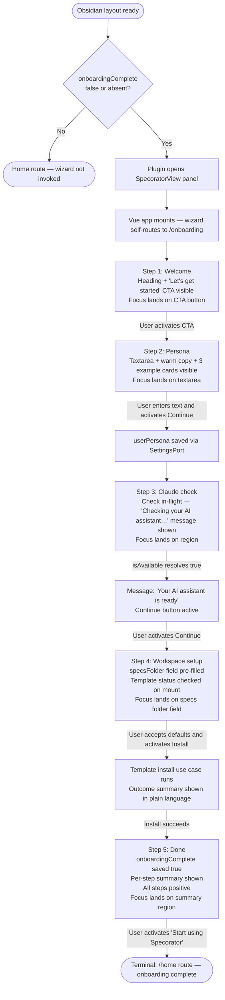
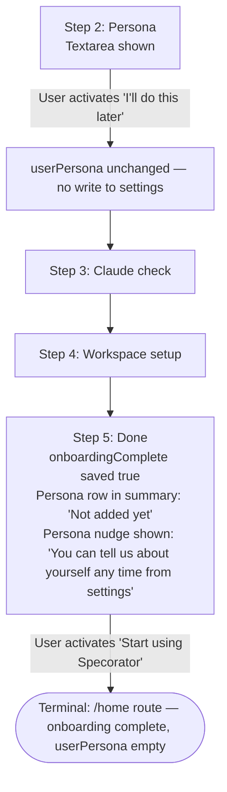
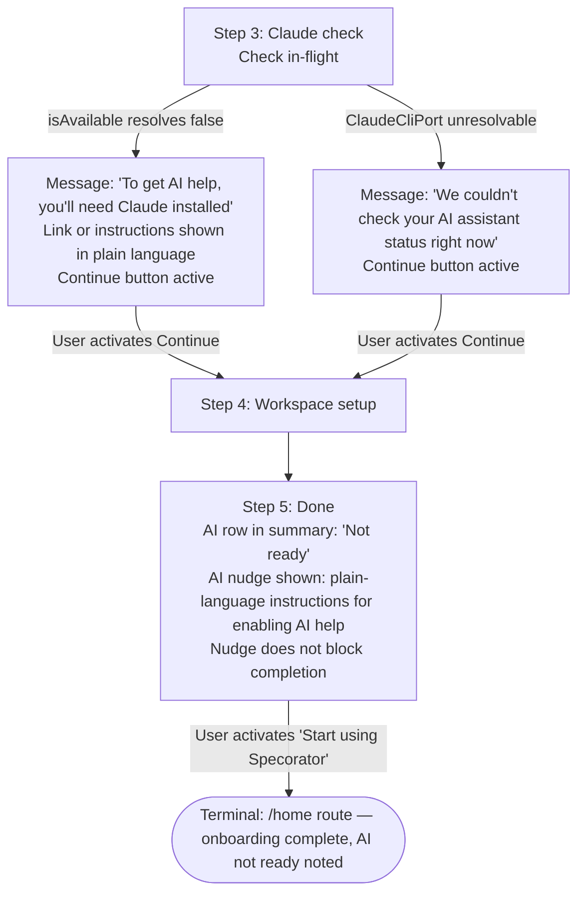
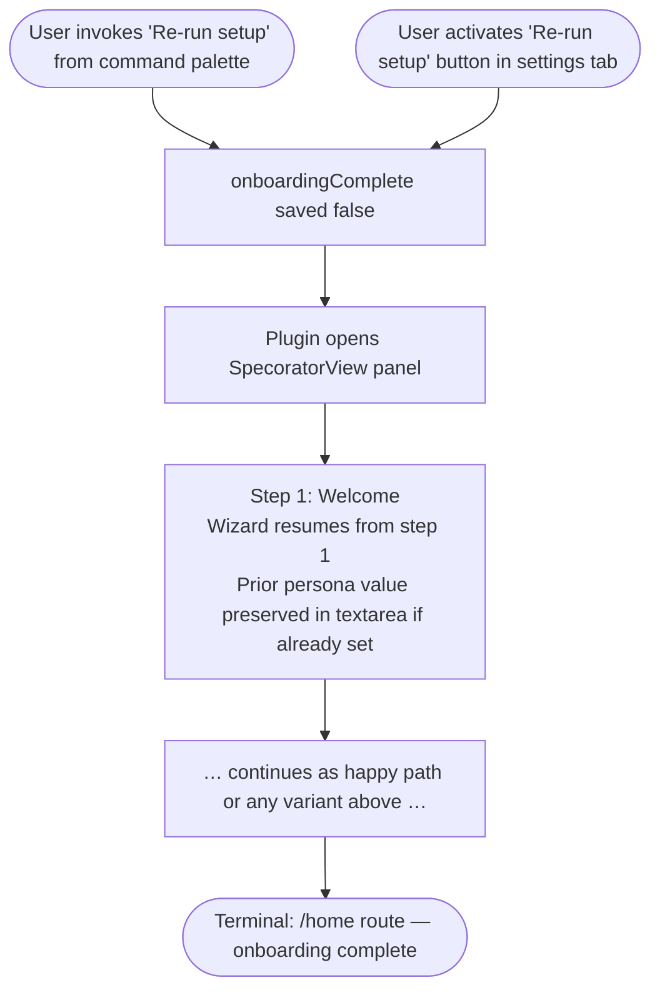
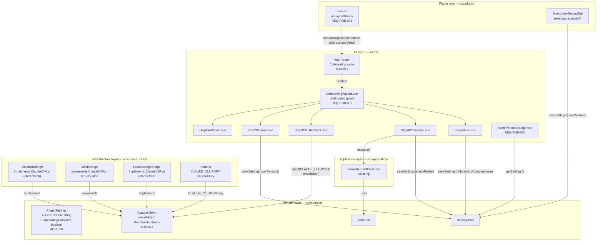

# Design — Plugin onboarding flow

## Context

A new Specorator installer faces immediate friction: they must discover vault configuration, install workflow templates, and optionally set up Claude CLI — all without guidance. Additionally, the AI assistant has no context about the user, so every response is generic. This feature ships a five-step onboarding wizard (welcome → persona → Claude check → workspace setup → done) that auto-opens on first load, guides users to a working state in under three minutes, and captures a short personal introduction injected as Layer 0 into every subsequent AI system prompt.

## Goals (design-level)

- D1: Zero-click entry — the wizard appears automatically on first load; no ribbon or command palette required.
- D2: Plain-language throughout — no technical identifiers visible to the user at any step.
- D3: Non-destructive at every step — skip actions never erase prior data.
- D4: Reuses all existing port, router, and bridge infrastructure with no new abstractions beyond what Q1 and Q2 demand.

## Non-goals

- ND1: Persona versioning or history.
- ND2: Structured persona fields (role/team/context boxes).
- ND3: Guided tour post-onboarding.
- ND4: Advanced Claude CLI configuration.

---

## Part A — UX

### A1 — User flows

#### Flow 1: Happy path — all steps completed



#### Flow 2: Persona-skip path



#### Flow 3: Claude not ready path



#### Flow 4: Re-run setup path



---

### A2 — Information architecture

#### Router hierarchy

The wizard lives at `/onboarding` — a sibling route of the existing home view inside the single `SpecoratorView` panel. No nested router outlet is introduced; `/onboarding` replaces the active view while the wizard is running.

```
SpecoratorView (panel)
  └── Vue Router (hash mode)
        ├── /home               ← default post-onboarding destination
        ├── /onboarding         ← wizard (this feature)
        └── … other existing routes unchanged
```

Deep-link convention: `/onboarding` is navigated to programmatically only — it is not exposed as a user-typed URL or ribbon target. The two entry points are:

1. **Auto-open on first load** — `onLayoutReady()` in `main.ts` calls `activateView()`; the wizard's `onMounted` guard then pushes `/onboarding` if `onboardingComplete` is false.
2. **Re-run setup** — command palette command or settings tab button resets `onboardingComplete` to false and programmatically navigates to `/onboarding`.

#### Settings tab integration

The settings tab is the persistent home for the persona text area after onboarding. It exposes:

- A text area labelled in plain language (not "User persona" — the label wording is Part B's decision, but it must pass REQ-POB-026).
- A contextual nudge adjacent to the text area when the field is empty (REQ-POB-022).
- A "Re-run setup" button that triggers Flow 4 (REQ-POB-024).

The settings tab is a separate surface from the wizard; changes made there take effect immediately and do not require re-running the wizard.

#### Sidebar nudge integration

When `onboardingComplete` is true and `userPersona` is empty, the main Specorator sidebar (the home view) displays a non-blocking, dismissible nudge that links to the persona input in settings (REQ-POB-020). The nudge sits at the top of the sidebar content area, above the feature list, and does not obscure or disable any other sidebar functionality.

---

### A3 — Empty / loading / error states

This section prescribes the exact state shown at every decision point. Implementations must not substitute "loading…" or generic errors for the copy below.

#### Step 1 — Welcome

| State | What is shown |
|---|---|
| Normal | Welcome heading; "Let's get started" button. No loading or error states apply — this step has no async operations. |

#### Step 2 — Persona

| State | What is shown |
|---|---|
| Textarea empty (initial) | Warm invitational copy above the textarea. Three example persona cards visible below the textarea. Secondary copy: "Two to four sentences is plenty." The Continue button is enabled even when the textarea is empty; activating Continue with an empty textarea saves an empty string to `userPersona` per REQ-POB-006 (distinct from "I'll do this later", which preserves the prior value without writing, per REQ-POB-007). |
| Textarea populated | Same layout; example cards remain visible until the user scrolls or proceeds. |
| Save in-flight (after Continue) | Continue button shows a brief non-blocking indicator (wording is Part B's decision). The "I'll do this later" link is not interactive while save is in-flight. |
| Save failure | Inline message adjacent to the Continue button: "We couldn't save your introduction right now. Try again, or skip for now." Both retry and skip remain available. No modal, no blocking overlay. |

#### Step 3 — Claude check

| State | What is shown |
|---|---|
| Check in-flight | Message: "Checking your AI assistant…" Continue button is not yet active. Focus is placed on the message region. |
| Check resolved — available | Message: "Your AI assistant is ready." Continue button becomes active. |
| Check resolved — not available | Message: "To get AI help, you'll need Claude installed." A plain-language secondary line explains what Claude is, without naming "ClaudeCliPort" or any internal identifier. Continue button is active. |
| Check unresolvable (port not registered or exception) | Message: "We couldn't check your AI assistant status right now. You can continue and check this later." Continue button is active. The unresolved state is treated as neither ready nor not-ready for the Step 5 summary (it is shown as "unknown"). |
| Check timeout (if a timeout is implemented) | Same copy as the unresolvable state above. |

#### Step 4 — Workspace setup

| State | What is shown |
|---|---|
| Template status check in-flight (on mount) | The Install button area shows: "Checking your workspace…" Install and Skip buttons are not yet active. |
| Templates already installed | Status line: "Your workflow templates are already set up." Install button is replaced by a "Reinstall" affordance (or the Install label changes — wording is Part B's decision). Skip button remains. |
| Templates not installed | Status line: "Workflow templates are not yet installed." Install and Skip buttons are active. |
| Template status check fails | Status line: "We couldn't check your workspace status. You can install templates or continue." Install and Skip buttons are active. |
| Install in-flight | Install button shows a brief non-blocking indicator. Skip button is not interactive during install. specsFolder field is read-only during install. |
| Install succeeds | Inline outcome: "Your workspace is ready." The step advances automatically after a brief pause, or the Continue button becomes active — the exact transition is Part B's decision. Skipped files are noted: "Some files were already there and were not changed." |
| Install fails (partial or full) | Inline message: "Some templates couldn't be installed. You can try again or continue — you can always install later from settings." Both retry and Skip remain available. No technical error codes or file paths in the message. |
| specsFolder field — default | Pre-filled with current setting (default value: `specs`). |
| specsFolder field — edited | Accept any non-empty value. If the user clears the field entirely, show an inline hint: "Enter a folder name for your features." Continue / Install is not active while the field is empty. |

#### Step 5 — Done

| State | What is shown |
|---|---|
| All steps positive | Per-step summary table or list. Each row: step name + plain-language positive outcome. Completion message: "You're all set. Specorator is ready to use." Primary CTA: "Start using Specorator." |
| Persona skipped | Persona row: "Not added yet." Persona nudge (below the summary, not blocking): "You can tell us about yourself any time — go to Settings and look for 'About you'." The nudge contains an action that opens settings to the persona field. |
| Claude not ready | AI row: "Not ready." AI nudge (below the summary): "To unlock AI-powered suggestions, install Claude from claude.ai and restart Obsidian." No internal identifiers. |
| Claude status unknown | AI row: "Status unknown." AI nudge: "We couldn't check whether AI help is available. If you'd like AI suggestions, visit claude.ai to get started." |
| Templates skipped | Templates row: "Not installed." No nudge needed (user chose to skip intentionally). |
| Multiple skipped/not-ready states | All nudges are shown stacked below the summary. They do not overlap or hide each other. Each nudge is independently dismissible within the session (dismissal does not persist). |
| onboardingComplete save failure | If the settings save on Step 5 mount fails: an inline message at the top of the step reads "We couldn't save your setup progress. Your changes are still applied for this session — please close and reopen Specorator to try again." The primary CTA is still present and active. |

#### Sidebar nudge (post-onboarding)

| State | What is shown |
|---|---|
| userPersona empty, onboarding complete | A nudge at the top of the sidebar content area: "Tell Specorator about yourself so AI suggestions are more relevant to you. [Add your introduction]" — the bracketed text is an actionable link to the settings persona field. |
| userPersona non-empty | Nudge is absent. |
| Nudge dismissed (session-only) | Nudge is hidden for the current session. On next plugin load, it reappears until the persona field is filled. |

---

### A4 — Accessibility

#### Keyboard navigation and focus order

The wizard is a panel embedded in Obsidian's view system. Keyboard-only users must be able to complete the entire flow without a pointing device.

**Step 1 — Welcome**
- On step mount, focus moves to the "Let's get started" button.
- Tab order: heading (if focusable) → button.
- Enter or Space on the button advances to Step 2.

**Step 2 — Persona**
- On step mount, focus moves to the persona textarea.
- Tab order: textarea → Continue button → "I'll do this later" link.
- The three example persona cards are focusable; Tab reaches each card in document order.
- Enter or Space on an example card copies its text into the textarea (or provides some affordance — the exact interaction is Part B's decision, but keyboard access is required).
- Tab past the last card returns to the Continue button.
- Enter on Continue triggers the save-and-advance action.
- Enter or Space on "I'll do this later" triggers the skip action.

**Step 3 — Claude check**
- On step mount, focus moves to the status message region (marked with `role="status"` or equivalent live region — see ARIA section below).
- While the check is in-flight, the Continue button is not focusable (it is not rendered or is disabled).
- When the check resolves, focus moves to the Continue button.
- Enter on Continue advances to Step 4.

**Step 4 — Workspace setup**
- On step mount, focus moves to the specsFolder input field.
- Tab order: specsFolder field → Install button → Skip button (or "Continue" if templates already installed).
- While install is in-flight, Install and Skip are not focusable.
- After install completes, focus moves to the inline outcome message or the Continue / next-step button.
- Escape does not close or navigate away from the wizard at any step. It has no special meaning within wizard steps.

**Step 5 — Done**
- On step mount, focus moves to the summary region heading.
- Tab order: summary items (read-only, so they may be `role="listitem"` or plain text, not interactive) → any nudge action links → primary CTA ("Start using Specorator").
- Enter on "Start using Specorator" navigates to `/home`.
- Any "Add your introduction" or settings links in nudges are focusable and reachable via Tab before the primary CTA.

#### Inter-step navigation

The wizard does not expose explicit "Previous" or "Back" navigation per step. Steps are forward-only. Users who wish to revisit earlier steps must use the re-run setup entry point. This constraint is intentional to preserve simplicity (NFR-POB-001: completion under 3 minutes).

If the design later adds a back affordance, focus management on backward navigation must be specified separately.

#### ARIA roles and live regions

| Element | ARIA role / attribute |
|---|---|
| Wizard container | `role="main"` or the panel's existing landmark role; do not nest two `role="main"` elements |
| Step heading | `<h1>` or `<h2>` depending on document outline — one per step |
| Claude check status message | `role="status"` and `aria-live="polite"` so screen readers announce the resolved message without interrupting the user |
| Install outcome message | `role="status"` and `aria-live="polite"` |
| Save failure inline message | `role="alert"` and `aria-live="assertive"` — this is an error that needs immediate announcement |
| Step 5 per-step summary | `role="list"` with each row as `role="listitem"` |
| Persona nudge (Step 5 and sidebar) | `role="note"` or presented as a paragraph with no special role — it is advisory, not an alert |
| AI nudge (Step 5) | `role="note"` |
| "I'll do this later" skip link | Plain `<button>` or `<a>` — must not use `aria-label` that contradicts its visible text |
| Example persona cards | `role="button"` with `aria-label` that reads the full card text (e.g., "Use this example: I'm a product manager at a mid-size SaaS company. I focus on roadmap planning and work closely with engineering and design.") |
| Loading / in-flight states | Spinner or indicator must have `aria-label="Loading"` or equivalent; it must not be the sole indicator of state (i.e., a text message accompanies every in-flight state) |

#### Screen reader copy for non-text elements

The three example persona cards on Step 2 contain readable text, but if they are rendered as images or icon-only buttons, each must carry a full `aria-label` with the example text. The preferred implementation is plain text cards (Part B's decision), which makes `aria-label` unnecessary.

The "in-flight" indicator on buttons (Step 2 Continue, Step 4 Install) must announce the state change to screen readers. Recommended pattern: the button's accessible name changes from "Continue" to "Saving, please wait" (or equivalent) while the operation is in-flight, and reverts on completion.

#### Contrast

All text and interactive elements must meet WCAG 2.2 AA contrast ratios:

- Normal text: 4.5:1 minimum against its background.
- Large text (headings): 3:1 minimum.
- UI component boundaries (input borders, button outlines): 3:1 minimum against adjacent colour.
- The "I'll do this later" skip link is intentionally de-emphasised visually, but its contrast ratio must still meet the 4.5:1 threshold. De-emphasis is achieved through weight or position, not by reducing contrast below the threshold.

Specific colour values are Part B's decision.

#### Touch and pointer targets

All interactive elements must have a minimum touch target of 24 × 24 CSS pixels (WCAG 2.5.8, AA). Preferred minimum is 44 × 44 CSS pixels for primary actions (CTA buttons). Exact sizing is Part B's decision.

---

### A5 — Requirements coverage (Part A)

| REQ ID | Addressed in Part A |
|---|---|
| REQ-POB-001 | Flow 1 (auto-open trigger); A2 IA (router hierarchy, entry point 1) |
| REQ-POB-002 | Flow 1 (wizard self-routes on mount); A2 IA |
| REQ-POB-003 | Flow 1 Step 1; A3 Step 1 states; A4 Step 1 focus order |
| REQ-POB-004 | Flow 1 Step 2; A3 Step 2 states (textarea, warm copy, example cards) |
| REQ-POB-005 | Flow 1 Step 2; Flow 2; A3 Step 2 (skip de-emphasis); A4 Step 2 keyboard |
| REQ-POB-006 | Flow 1 (save persona then advance); A3 Step 2 (save in-flight, save failure) |
| REQ-POB-007 | Flow 2 (skip preserves userPersona); A3 Step 2 (skip state) |
| REQ-POB-008 | Flow 1 Step 3; Flow 3; A3 Step 3 (available / not available states) |
| REQ-POB-009 | Flow 3 (unresolvable branch); A3 Step 3 (unresolvable state) |
| REQ-POB-010 | Flow 1 Step 4; A3 Step 4 (specsFolder field states) |
| REQ-POB-011 | Flow 1 Step 4 (Install); A3 Step 4 (install in-flight, success, failure) |
| REQ-POB-012 | Flow 1 Step 4 (Skip); Flow 2; A3 Step 4 (Skip state) |
| REQ-POB-013 | A3 Step 4 (templates already installed / not installed states) |
| REQ-POB-014 | Flow 1 Step 5 (onboardingComplete saved true on mount); A3 Step 5 (save failure) |
| REQ-POB-015 | Flow 1 Step 5; Flow 2 Step 5; Flow 3 Step 5; A3 Step 5 (per-step summary states) |
| REQ-POB-016 | Flow 2 Step 5 (persona nudge); A3 Step 5 (persona skipped state) |
| REQ-POB-017 | Flow 3 Step 5 (AI nudge); A3 Step 5 (Claude not ready / unknown states) |
| REQ-POB-020 | A2 IA (sidebar nudge integration); A3 (sidebar nudge states) |
| REQ-POB-023 | Flow 4 (command palette entry point); A2 IA (re-run setup) |
| REQ-POB-024 | Flow 4 (settings tab button entry point); A2 IA (settings tab integration) |
| REQ-POB-026 | A3 (all state copy uses plain language; no internal identifiers appear in prescribed copy) |
| REQ-POB-027 | Flows 1–3 all terminate without blocking states; A3 Step 3 unresolvable state handles MockBridge |
| NFR-POB-001 | Flows designed as 5 forward-only steps; no mandatory back-navigation; A4 (keyboard efficiency) |
| NFR-POB-002 | A4 (WCAG 2.2 AA — focus order, ARIA, contrast, touch targets) |

REQ-POB-018, REQ-POB-019, REQ-POB-021, REQ-POB-022, REQ-POB-025, REQ-POB-028, REQ-POB-029 are addressed in Part B (UI) or Part C (architecture) as appropriate to their concern.

---

## Part B — UI

### B1 — Key screens / states

The wizard runs at the `/onboarding` route inside the existing `SpecoratorView` panel. No Figma or wireframe file exists; this table is the authoritative visual specification. All screens share the same full-height panel container (`.specorator-root`).

| Screen / state | Purpose | Key elements |
|---|---|---|
| **Step 1 — Welcome** | Orient the user; remove anxiety about what the wizard will do | Page heading "Welcome to Specorator."; one-paragraph body copy; single primary CTA button "Let's get started" |
| **Step 2 — Persona (empty)** | Invite the user to describe themselves in their own words | Section heading "Tell us a little about yourself."; single `<textarea>`; secondary hint "Two to four sentences is plenty."; three example persona cards below the textarea; primary button "Save and continue"; de-emphasised skip action "I'll do this later" |
| **Step 2 — Persona (save in-flight)** | Signal that the save is happening without blocking the UI | "Save and continue" button accessible name changes to "Saving, please wait"; spinner inside the button; "I'll do this later" is `disabled` |
| **Step 2 — Persona (save failure)** | Give the user a recovery path without losing their text | Inline error paragraph adjacent to the button row: "We couldn't save your introduction right now. Try again, or skip for now."; both "Save and continue" and "I'll do this later" remain active |
| **Step 3 — Claude check (in-flight)** | Tell the user a check is running | Status region heading "Checking your AI assistant…"; spinner; Continue button absent |
| **Step 3 — Claude ready** | Confirm AI assistance is available | Status region: "Your AI assistant is ready."; Continue button active |
| **Step 3 — Claude not ready** | Give the user plain-language next steps without alarming them | Status region: "To get AI help, you'll need Claude installed."; secondary paragraph with install instructions (see B4); Continue button active |
| **Step 3 — Claude unknown** | Let the user proceed when the check cannot complete | Status region: "We couldn't check your AI assistant status right now. You can continue and check this later."; Continue button active |
| **Step 4 — Workspace setup (status check in-flight)** | Signal that the workspace status is loading | Status paragraph: "Checking your workspace…"; Install and Skip buttons absent while loading |
| **Step 4 — Templates not installed** | Prompt the user to install workflow templates | Status paragraph: "Workflow templates are not yet installed."; specs folder input pre-filled; "Install" primary button; "Skip for now" secondary button |
| **Step 4 — Templates already installed** | Reassure the user and allow re-install if desired | Status paragraph: "Your workflow templates are already set up."; "Reinstall" button (secondary variant) replaces primary Install; "Skip for now" button |
| **Step 4 — Status check fails** | Unblock the user when the check cannot complete | Status paragraph: "We couldn't check your workspace status. You can install templates or continue."; Install and Skip buttons active |
| **Step 4 — Install in-flight** | Signal install progress | "Install" button accessible name changes to "Installing, please wait"; spinner; Skip button `disabled`; specs folder input `readonly` |
| **Step 4 — Install success** | Confirm the install completed | Inline outcome paragraph: "Your workspace is ready."; if some files existed already: secondary paragraph "Some files were already there and were not changed."; wizard auto-advances to Step 5 after 1.5 s, or "Continue" button becomes active immediately |
| **Step 4 — Install failure** | Give the user a retry path without technical detail | Inline error paragraph: "Some templates couldn't be installed. You can try again or continue — you can always install later from settings."; both "Try again" (replaces Install) and "Skip for now" remain active |
| **Step 4 — Specs folder cleared** | Prevent submission with an empty folder name | Inline hint below the input: "Enter a folder name for your features."; Install button `disabled` while the field is empty |
| **Step 5 — All steps positive** | Celebrate completion and give the user a clear exit | Heading "You're all set."; body copy "Specorator is ready to use."; per-step summary list (three items, all positive); single primary CTA "Start using Specorator" |
| **Step 5 — Persona skipped** | Gently nudge without blocking | Summary row for persona: "Not added yet."; nudge note below summary: "You can tell us about yourself any time — go to Settings and look for 'About you'."; "Add your introduction" link that opens settings |
| **Step 5 — Claude not ready** | Surface next steps for AI setup without blocking | Summary row for AI: "Not ready."; nudge note: "To unlock AI-powered suggestions, install Claude from claude.ai and restart Obsidian." |
| **Step 5 — Claude status unknown** | Surface a soft call to action | Summary row for AI: "Status unknown."; nudge note: "We couldn't check whether AI help is available. If you'd like AI suggestions, visit claude.ai to get started." |
| **Step 5 — Templates skipped** | Record the choice with no nudge (user intentional) | Summary row for templates: "Not installed." No nudge. |
| **Step 5 — onboardingComplete save failure** | Let the user proceed even if the save failed | Inline message at top of step: "We couldn't save your setup progress. Your changes are still applied for this session — please close and reopen Specorator to try again." Primary CTA remains active. |
| **Settings tab — About you field (empty)** | Invite the user to fill in their introduction from settings | Plain-language label "About you"; textarea showing empty state; contextual nudge paragraph: "Add a short introduction so Specorator can tailor its suggestions to you."; "Re-run setup" button below |
| **Settings tab — About you field (filled)** | Show the saved value and allow edits | Textarea shows current `userPersona` value; no nudge; "Re-run setup" button below |
| **Sidebar nudge (persona empty, onboarding done)** | Non-blocking post-onboarding invitation to complete persona | Nudge note at top of sidebar content area: "Tell Specorator about yourself so suggestions are more relevant to you."; "Add your introduction" action link; dismiss button (session-only) |
| **Sidebar nudge (persona filled or dismissed)** | No nudge rendered | Nudge component absent from DOM |

---

### B2 — Components

All components are **new** unless stated otherwise. All use `<script setup>` Composition API (REQ-POB-028, NFR-POB-008). Elements are queried in tests exclusively via `data-testid` attributes (ADR-009).

#### `OnboardingWizard.vue`

- **Purpose:** Outer shell rendered at the `/onboarding` route. Owns the `currentStep` ref (1–5), the shared wizard state DTO (`personaText`, `claudeStatus`, `templateStatus`), and the `onMounted` guard that pushes `/onboarding` if `onboardingComplete` is false (REQ-POB-002). Renders the active step component via `<component :is="…">` keyed on `currentStep`.
- **Props:** none (reads settings via `useSettingsPort()`).
- **Emits:** none (navigates programmatically via `useRouter()`).
- **Obsidian classes used:** none at this level. Applies the `.specorator-root` scoping class inherited from the panel root.
- **CSS classes introduced:** `.sp-onboarding` (container), `.sp-onboarding__step` (step wrapper with `padding: 1rem` and `display: flex; flex-direction: column; gap: 1.25rem`).

#### `OnboardingStep1Welcome.vue`

- **Purpose:** Step 1. Renders the welcome heading, body copy, and the primary CTA. On CTA activation emits `next` to parent.
- **Props:** none.
- **Emits:** `next` (no payload).
- **Obsidian classes used:** none. Uses `SpBtn` (primary variant) from the existing component library.
- **CSS classes introduced:** `.sp-onboarding__welcome-body` (paragraph, `color: var(--text-muted)`, `line-height: 1.6`).

#### `OnboardingStep2Persona.vue`

- **Purpose:** Step 2. Owns the local textarea value, the save in-flight state, and the save error state. Calls `useSettingsPort()` for the save. Emits `next` (with payload `{ skipped: boolean }`) to parent.
- **Props:** `initialValue: string` (pre-filled from `PluginSettings.userPersona` when re-running setup; default `''`).
- **Emits:** `next` with payload `{ skipped: boolean }`.
- **Sub-components used:**
  - `OnboardingPersonaCard.vue` (see below) — rendered three times with different example text.
  - `SpBtn` (existing) — primary variant for "Save and continue"; ghost variant for "I'll do this later".
- **Obsidian classes used:** `.sp-settings__input` class pattern (border, background, colour) applied to the `<textarea>` element, extended to a new `.sp-onboarding__textarea` class that adds `min-height: 7rem; resize: vertical; line-height: 1.6`.
- **CSS classes introduced:** `.sp-onboarding__persona-hint` (secondary copy paragraph, `font-size: 0.875rem; color: var(--text-muted)`), `.sp-onboarding__cards` (flex column, `gap: 0.5rem; margin-top: 0.75rem`), `.sp-onboarding__textarea`, `.sp-onboarding__inline-error` (error paragraph, `color: var(--text-error); font-size: 0.875rem`).
- **Accessibility note:** `<textarea>` has `aria-label="About you"` (or `<label>` associated via `for`/`id`). When save is in-flight the button's accessible name is updated; "I'll do this later" is `disabled` (not `aria-disabled`).

#### `OnboardingPersonaCard.vue`

- **Purpose:** Renders one example persona card as a focusable, activatable tile. On activation copies the card text into the parent textarea via an `use` emit.
- **Props:** `text: string` (the full example text).
- **Emits:** `use` with payload `string` (the card text).
- **Element type:** `<button>` (not `<div>`) so it is natively keyboard-accessible. `aria-label` is `"Use this example: " + text`.
- **Obsidian classes used:** background `var(--background-secondary)`, border `1px solid var(--background-modifier-border)`, hover background `var(--background-modifier-hover)`.
- **CSS classes introduced:** `.sp-onboarding__card` (`border-radius: 6px; padding: 0.75rem 0.875rem; cursor: pointer; text-align: left; font-size: 0.875rem; color: var(--text-normal); width: 100%; border: 1px solid var(--background-modifier-border); background: var(--background-secondary); transition: background 0.15s`).

#### `OnboardingStep3ClaudeCheck.vue`

- **Purpose:** Step 3. On mount attempts `ClaudeCliPort.isAvailable()` (with graceful fallback per REQ-POB-009; port resolved via Vue `inject` from the `CLAUDE_CLI_PORT` injection key declared by the architect). Stores the result in `claudeStatus: 'checking' | 'ready' | 'not-ready' | 'unknown'`. Emits `next` with payload `{ claudeStatus }` when Continue is activated. Passes the status value upward so Step 5 can display the correct summary row.
- **Props:** none.
- **Emits:** `next` with payload `{ claudeStatus: 'ready' | 'not-ready' | 'unknown' }`.
- **Obsidian classes used:** `role="status"` / `aria-live="polite"` on the status region; `var(--text-accent)` for the ready state icon (if used), `var(--text-error)` for the not-ready state label.
- **CSS classes introduced:** `.sp-onboarding__status-region` (`display: flex; flex-direction: column; gap: 0.75rem; padding: 1rem; background: var(--background-secondary); border-radius: 8px; border: 1px solid var(--background-modifier-border)`), `.sp-onboarding__status-message` (`font-size: 0.9375rem; color: var(--text-normal); margin: 0`), `.sp-onboarding__status-sub` (`font-size: 0.875rem; color: var(--text-muted); margin: 0; line-height: 1.5`).
- **Spinner:** Reuses `.sp-btn__spinner` keyframe pattern (same animation) in a standalone `<span class="sp-onboarding__spinner">` with `aria-label="Loading"` and `aria-hidden="false"`.

#### `OnboardingStep4Workspace.vue`

- **Purpose:** Step 4. On mount checks template installation status. Renders the specs folder `<input>` (pre-filled from `PluginSettings.specsFolder`, default `specs`). Invokes the template installation use case on Install activation. Emits `next` with payload `{ templateStatus, specsFolder }` on Skip or after successful install.
- **Props:** `initialSpecsFolder: string` (from `PluginSettings.specsFolder`).
- **Emits:** `next` with payload `{ templateStatus: 'installed' | 'skipped' | 'failed'; specsFolder: string }`.
- **Sub-components used:** `SpBtn` (primary for Install/Reinstall/Try again; secondary for Skip).
- **Obsidian classes used:** `.sp-settings__input` class pattern for the specs folder `<input>` (single-line text input).
- **CSS classes introduced:** `.sp-onboarding__workspace-status` (status paragraph area, same pattern as `.sp-onboarding__status-region`), `.sp-onboarding__outcome` (success/failure outcome paragraph, `font-size: 0.875rem; margin: 0`), `.sp-onboarding__outcome--success` (`color: var(--text-success)` — see token note below), `.sp-onboarding__outcome--error` (`color: var(--text-error)`), `.sp-onboarding__field-row` (`display: flex; flex-direction: column; gap: 0.25rem`), `.sp-onboarding__field-hint` (`font-size: 0.8125rem; color: var(--text-error)`).
- **Accessibility note:** Specs folder `<input>` has `id="ob-specs-folder"` and an associated `<label for="ob-specs-folder">Where should features be stored?</label>`. During install the input has `readonly` set. Install outcome `role="status"` / `aria-live="polite"`; install error `role="alert"` / `aria-live="assertive"`.

#### `OnboardingStep5Done.vue`

- **Purpose:** Step 5. On mount saves `onboardingComplete: true` via `useSettingsPort()`. Renders the per-step summary list and any applicable nudges. Emits `finish` when the user activates the primary CTA.
- **Props:** `personaSkipped: boolean`, `claudeStatus: 'ready' | 'not-ready' | 'unknown'`, `templateStatus: 'installed' | 'skipped' | 'failed'`.
- **Emits:** `finish` (no payload — parent navigates to `/home`).
- **Sub-components used:** `OnboardingNudge.vue` (see below), `SpBtn` (primary).
- **Obsidian classes used:** none specific beyond shared tokens.
- **CSS classes introduced:** `.sp-onboarding__summary` (`role="list"`, `display: flex; flex-direction: column; gap: 0.5rem; list-style: none; padding: 0; margin: 0`), `.sp-onboarding__summary-item` (`role="listitem"`, `display: flex; align-items: baseline; gap: 0.5rem; font-size: 0.9375rem; color: var(--text-normal)`), `.sp-onboarding__summary-label` (`font-weight: 600; min-width: 7rem`), `.sp-onboarding__summary-value` (`color: var(--text-muted)`), `.sp-onboarding__summary-value--positive` (`color: var(--text-success)`), `.sp-onboarding__nudges` (`display: flex; flex-direction: column; gap: 0.75rem`), `.sp-onboarding__save-error` (`color: var(--text-error); font-size: 0.875rem; margin: 0`).
- **Accessibility note:** Heading and summary region receive focus on step mount (via `ref` + `el.focus()` with `tabindex="-1"` on the heading). Summary is `role="list"` with each row `role="listitem"`.

#### `OnboardingNudge.vue`

- **Purpose:** Renders a single advisory nudge note. Used on Step 5 for persona and AI nudges, and in the sidebar for the persona nudge. Emits `dismiss` for session-only dismissal.
- **Props:** `message: string`, `actionLabel?: string`, `dismissible?: boolean` (default `false` in Step 5; `true` in sidebar variant).
- **Emits:** `action` (user activated the action link), `dismiss` (user dismissed the nudge).
- **Element type:** `<aside>` with `role="note"`. The action is a `<button>` styled as an inline link (underline, `color: var(--interactive-accent)`).
- **Obsidian classes used:** `var(--background-secondary)` background, `var(--background-modifier-border)` border, `var(--text-muted)` text.
- **CSS classes introduced:** `.sp-onboarding__nudge` (`background: var(--background-secondary); border: 1px solid var(--background-modifier-border); border-radius: 6px; padding: 0.75rem; font-size: 0.875rem; color: var(--text-muted); display: flex; align-items: flex-start; gap: 0.5rem`), `.sp-onboarding__nudge-body` (`flex: 1; line-height: 1.5`), `.sp-onboarding__nudge-action` (`background: none; border: none; padding: 0; cursor: pointer; color: var(--interactive-accent); text-decoration: underline; font-size: inherit`), `.sp-onboarding__nudge-dismiss` (`background: none; border: none; padding: 0; cursor: pointer; color: var(--text-muted); font-size: 1rem; line-height: 1; flex-shrink: 0; min-width: 24px; min-height: 24px`).

#### `OnboardingStepIndicator.vue`

- **Purpose:** Shows step progress (e.g. "Step 2 of 5") at the top of the wizard. Purely presentational; receives `current` and `total` as props. Provides `aria-label` text for screen readers.
- **Props:** `current: number`, `total: number`.
- **Emits:** none.
- **CSS classes introduced:** `.sp-onboarding__step-indicator` (`font-size: 0.8125rem; color: var(--text-muted); margin: 0`).

#### Settings tab additions (in `SpecoratorSettingTab` — existing plugin class, not a Vue component)

The settings tab is rendered by `SpecoratorSettingTab` using the Obsidian `Setting` API (not Vue). The "About you" field and the "Re-run setup" button are added there as new `Setting` instances. The textarea for `userPersona` is added via `setting.addTextArea(…)`. The nudge when `userPersona` is empty is a plain paragraph appended to the container using `createEl('p', { text: '…', cls: 'setting-item-description' })` so it inherits Obsidian's `.setting-item-description` style without introducing a new class.

#### `HomePersonaNudge.vue` (sidebar nudge)

- **Purpose:** Renders the post-onboarding persona nudge in the sidebar (home view). Checks `userPersona` via `useSettingsPort()`; if empty and not session-dismissed, renders `OnboardingNudge.vue` with `dismissible: true`.
- **Props:** none (reads settings directly).
- **Emits:** none (action opens settings via `WorkspacePort` or a settings tab link).
- **New vs. existing:** new component, inserted at the top of the home view content area (above the feature list in `Home.vue`).

---

### B3 — Tokens

The design system for this feature is Obsidian's built-in CSS variable set. No custom CSS variables are introduced. All new `.sp-onboarding__*` classes use only the following named tokens (all defined by Obsidian's theme and already used elsewhere in `styles.css`):

| Token | Usage in this feature |
|---|---|
| `var(--background-primary)` | Wizard step container background |
| `var(--background-secondary)` | Status regions, example persona cards, nudge backgrounds |
| `var(--background-modifier-border)` | Borders on cards, status regions, nudges; progress bar track |
| `var(--background-modifier-hover)` | Persona card and nudge dismiss hover state |
| `var(--text-normal)` | Primary body text, summary items, step headings |
| `var(--text-muted)` | Secondary copy (hint, step indicator, nudge body, summary values) |
| `var(--text-error)` | Inline error messages, field hint when folder is empty, not-ready state label |
| `var(--text-success)` | Positive summary values ("Ready", "Set up"), install success outcome |
| `var(--text-accent)` | Claude-ready status visual indicator (if icon used) |
| `var(--interactive-accent)` | Primary CTA button background, nudge action link colour, input focus border |
| `var(--text-on-accent)` | Text on primary CTA button (inherited from `SpBtn--primary`) |

**Token note — `var(--text-success)`:** This token is present in Obsidian's default theme (it is the green used for "live preview" success states) but is not currently referenced in `styles.css`. Introducing it here is the first use in the Specorator plugin's own CSS. It is a named Obsidian token — not a hex literal — so no new token is being invented. If the architect finds this token is absent from a supported Obsidian version, fall back to the existing inline `#4ade80` literal already used in `.sp-settings__saved` (line 287 of `styles.css`), and document the fallback in the implementation PR.

**Spacing:** The wizard uses the existing spacing rhythm already present in `styles.css`: `0.25rem`, `0.5rem`, `0.75rem`, `0.875rem`, `1rem`, `1.25rem`. No new spacing values are introduced.

**Touch targets:** The primary CTA buttons use `SpBtn--md` (padding `0.4rem 0.875rem`) plus a min-height of `44px` enforced via `.sp-onboarding .sp-btn--md { min-height: 44px }`. The "I'll do this later" ghost button and the nudge dismiss button have `min-width: 24px; min-height: 24px` (WCAG 2.5.8 floor). The nudge action link is a `<button>` with the same 24 × 24 floor.

**Contrast — de-emphasised skip action:** The "I'll do this later" ghost button uses `color: var(--text-muted)`. In Obsidian's default dark theme, `--text-muted` resolves to approximately `#888` against the `--background-primary` dark background (`#1e1e1e`), yielding a contrast ratio of approximately 4.6:1 — passing the WCAG 2.2 AA 4.5:1 threshold for normal text. In light mode, `--text-muted` resolves to approximately `#666` against `#ffffff`, yielding 5.7:1. Both pass. De-emphasis is achieved through font weight (`font-weight: 400` vs `500` on primary buttons) and position (below the primary button), not by reducing contrast below the threshold.

---

### B4 — Content (microcopy)

All strings below are implementation-ready. Every string passes REQ-POB-026 (no internal identifiers, port names, file paths, or error codes). Tone: warm, direct, non-technical. Sentence case throughout. Headings end with a period.

#### Step 1 — Welcome

**Heading (h2):** "Welcome to Specorator."

**Body copy:**
"Specorator helps you plan features, run structured workflows, and get relevant AI suggestions — all inside Obsidian. This short setup takes about two minutes and gets you to a working state straightaway."

**Primary CTA button label:** "Let's get started"

**Step indicator (aria-label):** "Step 1 of 5"

**ARIA:** The button receives focus on step mount. `data-testid="step1-cta"`.

---

#### Step 2 — Persona

**Heading (h2):** "Tell us a little about yourself."

**Body copy (above textarea):**
"A few sentences about your role and what you're working on helps Specorator give you more relevant suggestions. There's no right or wrong answer — just describe yourself as you would to a colleague."

**Secondary hint (below textarea):** "Two to four sentences is plenty."

**Textarea placeholder:** "For example: I'm a product manager at a scale-up focusing on B2B growth. I spend most of my time on roadmap planning and stakeholder alignment."

**Textarea aria-label:** "About you"

**Primary button label (idle):** "Save and continue"

**Primary button label (in-flight, accessible name):** "Saving, please wait"

**Skip action label:** "I'll do this later"

**Save failure inline error:** "We couldn't save your introduction right now. Try again, or skip for now."

**Example persona card 1 text:**
"I'm a product manager at a mid-size SaaS company. I focus on roadmap planning and work closely with engineering and design."

**Example persona card 2 text:**
"I'm a founder building a B2B tool. I wear many hats — from sales to product — and need to move quickly without losing sight of the big picture."

**Example persona card 3 text:**
"I'm a business analyst at a financial services firm. I gather requirements, document processes, and bridge the gap between stakeholders and technical teams."

**Example card aria-label pattern:** "Use this example: [full card text]"

**Step indicator (aria-label):** "Step 2 of 5"

**data-testid values:** `step2-textarea`, `step2-continue`, `step2-skip`, `step2-card-0`, `step2-card-1`, `step2-card-2`, `step2-save-error`.

---

#### Step 3 — AI assistant check

**Heading (h2):** "Checking your AI assistant."

**Status message — in-flight:** "Checking your AI assistant…"

**Spinner aria-label:** "Loading"

**Status message — ready:** "Your AI assistant is ready."

**Status message — not ready:** "To get AI help, you'll need Claude installed."

**Secondary copy — not ready:**
"Claude is a free AI assistant made by Anthropic. Visit claude.ai to download it and follow the setup instructions. Once it's installed, restart Obsidian and your AI suggestions will be active."

**Status message — unknown:** "We couldn't check your AI assistant status right now. You can continue and check this later."

**Continue button label:** "Continue"

**Step indicator (aria-label):** "Step 3 of 5"

**Role / aria on status region:** `role="status"` and `aria-live="polite"` so the resolved message is announced without interrupting the user.

**data-testid values:** `step3-status-region`, `step3-status-message`, `step3-status-sub`, `step3-continue`.

---

#### Step 4 — Workspace setup

**Heading (h2):** "Set up your workspace."

**Body copy:**
"Specorator uses a folder in your vault to store your feature files. The default works well for most people — you can change it at any time from settings."

**Specs folder label:** "Where should features be stored?"

**Specs folder placeholder / default value:** "specs"

**Specs folder empty hint:** "Enter a folder name for your features."

**Status check in-flight paragraph:** "Checking your workspace…"

**Status — templates not installed:** "Workflow templates are not yet installed."

**Status — templates already installed:** "Your workflow templates are already set up."

**Status — check failed:** "We couldn't check your workspace status. You can install templates or continue."

**Install button label (idle, not installed):** "Install"

**Install button label (idle, already installed):** "Reinstall"

**Install button label (in-flight, accessible name):** "Installing, please wait"

**Skip button label:** "Skip for now"

**Install outcome — success:** "Your workspace is ready."

**Install outcome — success with skipped files:** "Your workspace is ready. Some files were already there and were not changed."

**Install outcome — failure:** "Some templates couldn't be installed. You can try again or continue — you can always install later from settings."

**Retry button label (after failure):** "Try again"

**Step indicator (aria-label):** "Step 4 of 5"

**Install outcome role / aria:** success uses `role="status"` / `aria-live="polite"`; failure uses `role="alert"` / `aria-live="assertive"`.

**data-testid values:** `step4-specs-folder-input`, `step4-status-paragraph`, `step4-install-btn`, `step4-skip-btn`, `step4-outcome`, `step4-field-hint`.

---

#### Step 5 — Done

**Heading (h2):** "You're all set."

**Body copy (all-positive variant):** "Specorator is ready to use. Here's a summary of what was set up."

**Body copy (one or more items skipped/not-ready):** "Specorator is ready to use. Here's a summary of what was set up — you can finish any remaining steps from settings at any time."

**Per-step summary list:**

| Summary row label | Positive value | Skipped / not available value |
|---|---|---|
| Introduction | "Added." | "Not added yet." |
| AI assistant | "Ready." | "Not ready." (if not available) or "Status unknown." (if unresolvable) |
| Workflow templates | "Set up." | "Not installed." (skip) or "Couldn't be installed." (failure) |

**onboardingComplete save failure inline message:**
"We couldn't save your setup progress. Your changes are still applied for this session — please close and reopen Specorator to try again."

**Persona nudge message:** "You can tell us about yourself any time — go to Settings and look for 'About you'."

**Persona nudge action label:** "Add your introduction"

**AI not-ready nudge message:** "To unlock AI-powered suggestions, install Claude from claude.ai and restart Obsidian."

**AI unknown nudge message:** "We couldn't check whether AI help is available. If you'd like AI suggestions, visit claude.ai to get started."

**Primary CTA button label:** "Start using Specorator"

**Step indicator (aria-label):** "Step 5 of 5"

**Focus target on mount:** The `<h2>` heading, with `tabindex="-1"` set programmatically so `focus()` works on a non-interactive element.

**data-testid values:** `step5-heading`, `step5-body`, `step5-summary`, `step5-summary-persona`, `step5-summary-claude`, `step5-summary-templates`, `step5-nudge-persona`, `step5-nudge-claude`, `step5-cta`, `step5-save-error`.

---

#### Settings tab additions

**Section heading (Obsidian `Setting.setName().setHeading()`):** "About you"

**"About you" textarea label (Setting.setName()):** "Your introduction"

**"About you" textarea description (Setting.setDesc()):** "A few sentences about your role and what you're working on. Used to personalise AI suggestions."

**Nudge when field is empty (paragraph below the setting item):** "Add a short introduction so Specorator can tailor its suggestions to you."

**"Re-run setup" button label (Setting.setName()):** "Set up Specorator again"

**"Re-run setup" button description (Setting.setDesc()):** "Start the setup wizard again to update your workspace or introduction."

**"Re-run setup" button control label:** "Re-run setup"

---

#### Sidebar nudge (HomePersonaNudge.vue)

**Nudge message:** "Tell Specorator about yourself so suggestions are more relevant to you."

**Nudge action label:** "Add your introduction"

**Nudge dismiss button aria-label:** "Dismiss this suggestion"

**data-testid values:** `home-persona-nudge`, `home-persona-nudge-action`, `home-persona-nudge-dismiss`.

---

### B5 — Requirements coverage (Part B)

| REQ ID | Addressed in Part B |
|---|---|
| REQ-POB-003 | B1 Step 1; B4 Step 1 microcopy (heading, CTA label) |
| REQ-POB-004 | B1 Step 2; B2 `OnboardingStep2Persona.vue`; B4 Step 2 (textarea, warm copy, hint, example cards); B3 (touch targets) |
| REQ-POB-005 | B1 Step 2; B2 (`SpBtn` ghost variant for skip); B4 Step 2 ("I'll do this later" label); B3 (contrast check for ghost button) |
| REQ-POB-016 | B1 Step 5 persona skipped; B2 `OnboardingNudge.vue`; B4 Step 5 persona nudge microcopy |
| REQ-POB-017 | B1 Step 5 Claude not ready / unknown; B4 Step 5 AI nudge microcopy |
| REQ-POB-020 | B2 `HomePersonaNudge.vue`; B4 sidebar nudge microcopy |
| REQ-POB-021 | B2 settings tab additions; B4 settings tab microcopy ("Your introduction", "About you" heading) |
| REQ-POB-022 | B4 settings tab nudge copy; B2 settings tab description |
| REQ-POB-024 | B4 settings tab ("Re-run setup" button copy) |
| REQ-POB-026 | B4 (all strings reviewed: no port names, file paths, error codes, or internal identifiers in any user-visible string) |
| REQ-POB-028 | B2 (all components specified as `<script setup>`) |
| REQ-POB-029 | B2 (`data-testid` attributes specified per component; PageObject requirement noted for implementer) |
| NFR-POB-002 | B3 (contrast analysis for `--text-muted` ghost button; WCAG 2.5.8 touch targets documented) |
| NFR-POB-008 | B2 (all components use `<script setup>`) |
| NFR-POB-009 | B4 (all user-visible strings reviewed for technical terminology) |

---

## Part C — Architecture

### C1 — System overview

The onboarding feature adds one new port (`ClaudeCliPort`), two new `PluginSettings` fields, one new router route, and a family of Vue components. No new Obsidian leaf type is introduced. All existing layer boundaries (ADR-001) and port rules (ADR-008) are preserved.



---

### C2 — Components and responsibilities

| Component | Responsibility | Owns | Dependencies |
|---|---|---|---|
| `ClaudeCliPort` (new interface, `src/domain/ports/ClaudeCliPort.ts`) | Define the contract for CLI availability detection | `isAvailable(): Promise<boolean>` method signature | None (domain interface) |
| `CLAUDE_CLI_PORT` InjectionKey (new, `src/infrastructure/bridge/ports.ts`) | Provide the Vue DI symbol for `ClaudeCliPort` | `InjectionKey<ClaudeCliPort>` | `ClaudeCliPort` type |
| `ObsidianBridge.isAvailable()` (new method on existing class) | Shell-invoke `claude --version`; return `true` if exit code is 0 within timeout | Shell child-process invocation, timeout handling | Obsidian `node:child_process` (or equivalent shell API) |
| `MockBridge.isAvailable()` (new method on existing class) | Return `false` unconditionally for browser/test contexts | None | None |
| `LocalStorageBridge.isAvailable()` (new method on existing class) | Return `false` unconditionally for GitHub Pages demo | None | None |
| `useClaudeCliPort()` (new composable, `src/ui/composables/`) | Provide `ClaudeCliPort` to Vue components via `inject(CLAUDE_CLI_PORT)` | Port resolution; optional fallback when inject returns `undefined` | `CLAUDE_CLI_PORT` InjectionKey |
| `PluginSettings` additions | Persist wizard outputs across restarts | `userPersona: string`, `onboardingComplete: boolean` fields | None (domain type) |
| `main.ts` `onLayoutReady` extension | Auto-open wizard on first load | Reads `this.settings.onboardingComplete`; calls `activateView()` conditionally | `PluginSettings`, `activateView()` |
| `main.ts` new command: `re-run-setup` | Reset `onboardingComplete` and open wizard from command palette | `updateSettings({ onboardingComplete: false })`, `activateView()` | `SettingsPort`, `activateView()` |
| Vue Router `/onboarding` route (new entry in router config) | Map the `/onboarding` path to `OnboardingWizard.vue` | Route definition | Vue Router, `OnboardingWizard.vue` |
| `OnboardingWizard.vue` | Outer shell: step orchestration, shared wizard state DTO, `onMounted` guard | `currentStep` ref, wizard state DTO, step→component mapping, `finish` navigation to `/home` | `useSettingsPort()`, `useRouter()`, child step components |
| `OnboardingStep1Welcome.vue` | Step 1: welcome heading and CTA | Emits `next` | None |
| `OnboardingStep2Persona.vue` | Step 2: persona textarea, save, skip | Local `personaText`, save in-flight/error state; calls `saveSettings` | `useSettingsPort()`, `OnboardingPersonaCard.vue` |
| `OnboardingPersonaCard.vue` | Renders one example persona card; emits `use` on activation | Card text display | None |
| `OnboardingStep3ClaudeCheck.vue` | Step 3: calls `ClaudeCliPort.isAvailable()`; displays result | `claudeStatus: 'checking' | 'ready' | 'not-ready' | 'unknown'`; emits `next` with status payload | `useClaudeCliPort()` |
| `OnboardingStep4Workspace.vue` | Step 4: checks template status; invokes install use case; edits `specsFolder` | Template status check, install in-flight state; emits `next` with `templateStatus` and `specsFolder` payload | `useVaultPort()`, `useSettingsPort()`, `TemplateInstallUseCase` |
| `OnboardingStep5Done.vue` | Step 5: saves `onboardingComplete: true`; renders summary and nudges | Save call on mount, summary rendering, nudge display; emits `finish` | `useSettingsPort()`, `OnboardingNudge.vue` |
| `OnboardingNudge.vue` | Renders one advisory nudge with optional action and dismiss | `message`, `actionLabel`, `dismissible` props; emits `action`, `dismiss` | None |
| `OnboardingStepIndicator.vue` | Purely presentational step progress display | `current`, `total` props | None |
| `HomePersonaNudge.vue` | Post-onboarding sidebar nudge when `userPersona` is empty | Checks `userPersona`; renders `OnboardingNudge.vue` with `dismissible: true`; session-only dismiss state | `useSettingsPort()`, `OnboardingNudge.vue` |
| `SpecoratorSettingTab` additions (existing class) | Expose `userPersona` textarea and "Re-run setup" button in Obsidian settings | Reads/writes `userPersona`; button resets `onboardingComplete` and calls `activateView()` | Obsidian `Setting` API, `SettingsPort` |

---

### C3 — Data model

#### PluginSettings additions (ADR-016)

Added to `src/domain/settings/PluginSettings.ts`:

```ts
interface PluginSettings {
  // ... existing fields unchanged ...
  readonly userPersona: string        // default: ''
  readonly onboardingComplete: boolean  // default: false
}
```

Validation rules:
- `userPersona`: any string value including empty string; no length limit enforced by the plugin (REQ-POB-004, NG6 — no char-count enforcement). The settings tab textarea imposes no `maxlength` attribute.
- `onboardingComplete`: `true` | `false`; set to `true` by `OnboardingStep5Done.vue` on mount (REQ-POB-014); reset to `false` by re-run-setup command and settings tab button (REQ-POB-023, REQ-POB-024).

Migration: `loadSettings()` already merges stored data over `DEFAULT_SETTINGS`. Existing settings files without these fields receive `userPersona: ''` and `onboardingComplete: false` automatically. No migration script required.

#### ClaudeCliPort interface (ADR-014)

New file `src/domain/ports/ClaudeCliPort.ts`:

```ts
export interface ClaudeCliPort {
  /**
   * Returns true if the Claude CLI is available and responding on the host machine.
   * Must resolve (not reject) in all runtime environments.
   * In browser-only contexts (MockBridge, LocalStorageBridge) returns false unconditionally.
   * In ObsidianBridge, performs a shell check with a timeout (≤ 5 000 ms);
   * if the check times out or the process is not found, returns false.
   */
  isAvailable(): Promise<boolean>
}
```

Exported from `src/domain/ports/index.ts`.

InjectionKey registered in `src/infrastructure/bridge/ports.ts`:

```ts
export const CLAUDE_CLI_PORT: InjectionKey<ClaudeCliPort> = Symbol('ClaudeCliPort')
```

#### buildSystemPrompt interface contract (ADR-017)

Not yet implemented. Contract defined for `claude-cli-chat-sidebar` implementer:

```ts
/**
 * Layer 0 persona injection contract (REQ-POB-018, REQ-POB-019, ADR-017).
 * The function MUST accept PluginSettings as first parameter.
 * When settings.userPersona is non-empty, the returned string MUST begin with:
 *   "About the person you're helping:\n" + settings.userPersona
 * When settings.userPersona is empty, that block MUST be omitted.
 */
function buildSystemPrompt(settings: PluginSettings, context: string): string
```

---

### C4 — Data flow

#### Primary scenario: first-time install, happy path (all steps completed)

1. **Plugin loads.** `onload()` completes; `loadSettings()` merges `DEFAULT_SETTINGS` with stored data. `onboardingComplete` is absent from stored data → defaults to `false`.

2. **Layout ready.** `onLayoutReady` fires. Plugin reads `this.settings.onboardingComplete` — it is `false`. Plugin calls `this.activateView()`, which opens the `SpecoratorView` right-panel leaf (or reveals the existing leaf).

3. **Vue app mounts.** `SpecoratorView.onOpen()` mounts the Vue application. The Vue Router resolves the current hash. Because `onboardingComplete` is `false`, `OnboardingWizard.vue`'s `onMounted` guard pushes `/onboarding` if not already there. The wizard renders at Step 1.

4. **Step 1 → Step 2.** User activates "Let's get started". Wizard advances `currentStep` from 1 to 2. `OnboardingStep2Persona.vue` mounts; focus moves to textarea.

5. **Step 2 → Step 3 (persona saved).** User types persona text and activates "Save and continue". `OnboardingStep2Persona.vue` calls `useSettingsPort().saveSettings({ userPersona: textValue })`. On success, wizard advances to Step 3. The wizard DTO records `personaSkipped: false`.

6. **Step 3 — Claude check.** `OnboardingStep3ClaudeCheck.vue` mounts. It calls `useClaudeCliPort().isAvailable()`. While awaiting, UI shows "Checking your AI assistant…". When the promise resolves:
   - `true` → `claudeStatus = 'ready'`; message updates; Continue button becomes active.
   - `false` → `claudeStatus = 'not-ready'`; not-ready message shown.
   - Port unresolvable or exception → `claudeStatus = 'unknown'`; neutral message shown.
   User activates Continue; wizard advances to Step 4 carrying `claudeStatus` in the shared DTO.

7. **Step 4 — Workspace setup.** `OnboardingStep4Workspace.vue` mounts. It reads `PluginSettings.specsFolder` (pre-filled, default `'specs'`). On mount it checks template installation status via `VaultPort`. User activates "Install". `TemplateInstallUseCase` executes; existing files are skipped (overwrite protection, REQ-POB-011). Outcome is shown. Wizard advances to Step 5, carrying `templateStatus: 'installed'` and the (possibly updated) `specsFolder` value in the DTO. If `specsFolder` was changed, `saveSettings({ specsFolder })` is called before advancing.

8. **Step 5 — Done.** `OnboardingStep5Done.vue` mounts. Immediately calls `useSettingsPort().saveSettings({ onboardingComplete: true })`. Renders the per-step summary from the DTO values. No nudges are shown (all steps positive). User activates "Start using Specorator"; `useRouter().push('/home')`.

9. **Subsequent loads.** `onLayoutReady` reads `this.settings.onboardingComplete = true` → `activateView()` is not called; no wizard.

#### Re-run setup path

User activates command / settings button → `updateSettings({ onboardingComplete: false })` → `activateView()` → Vue Router → `onMounted` guard pushes `/onboarding` → wizard renders at Step 1 with `initialValue: this.settings.userPersona` (prior persona preserved in textarea).

#### Persona → AI interaction (deferred integration)

When `claude-cli-chat-sidebar` is implemented, `buildSystemPrompt(settings, context)` reads `settings.userPersona`. If non-empty, it prepends `"About the person you're helping:\n" + settings.userPersona` before all other context. If empty, the block is omitted. This integration is out of scope for this feature (ADR-017).

---

### C5 — Interaction and API contracts

#### `ClaudeCliPort.isAvailable(): Promise<boolean>`

| Attribute | Value |
|---|---|
| Signature | `isAvailable(): Promise<boolean>` |
| Pre-conditions | None — must be callable in any runtime context without prior setup |
| Post-conditions | Resolves to `true` if Claude CLI is available and responded within timeout; `false` otherwise |
| Side effects | None visible to caller; `ObsidianBridge` may spawn a short-lived child process |
| Errors | Must not reject. All error conditions (process not found, timeout, permission denied) are caught internally and result in resolution with `false` |
| Timeout | `ObsidianBridge` implementation must resolve within 5 000 ms; if the shell check takes longer, resolves `false` |
| MockBridge | Always resolves `false` |
| LocalStorageBridge | Always resolves `false` |
| REQ link | REQ-POB-008, REQ-POB-009, REQ-POB-027 |

#### `SettingsPort.saveSettings()` usage in wizard

| Call site | Fields written | When |
|---|---|---|
| `OnboardingStep2Persona.vue` | `{ userPersona }` | On "Save and continue" activation (skip does not write) |
| `OnboardingStep4Workspace.vue` | `{ specsFolder }` | Before advancing to Step 5 if specsFolder was changed |
| `OnboardingStep5Done.vue` | `{ onboardingComplete: true }` | On `onMounted` |
| `main.ts` re-run-setup command | `{ onboardingComplete: false }` | On command/button activation |
| `SpecoratorSettingTab` | `{ userPersona }` | On textarea blur / debounced input |

All calls are non-destructive: they pass only the fields they intend to change. The `updateSettings` method in `main.ts` merges the partial into the existing settings object.

#### `buildSystemPrompt()` interface contract (ADR-017)

Binding for `claude-cli-chat-sidebar` implementer:

```
Signature:   buildSystemPrompt(settings: PluginSettings, context: string): string
Layer 0:     IF settings.userPersona is non-empty:
               return "About the person you're helping:\n" + settings.userPersona + "\n\n" + [remaining layers]
             ELSE:
               omit the block; proceed with remaining layers
Precondition: settings.userPersona must be read from the live PluginSettings object,
              not from a cached or stale snapshot.
Side effects: None.
```

This contract is immutable per ADR-017. Deviations require a new ADR superseding ADR-017.

---

### C6 — Key decisions

| Decision | Choice | ADR |
|---|---|---|
| How to host the onboarding wizard | Router route at `/onboarding` inside `SpecoratorView` (not a modal, not a separate leaf) | ADR-015 |
| How to expose CLI availability detection | New narrow port `ClaudeCliPort` (not extending an existing port, not an inline composable) | ADR-014 |
| Where `buildSystemPrompt()` lives and how persona is injected | Interface contract defined here; implementation deferred to `claude-cli-chat-sidebar` | ADR-017 |
| How to add `userPersona` and `onboardingComplete` to settings | Additive fields on `PluginSettings` with defaults in `DEFAULT_SETTINGS`; no migration script | ADR-016 |

---

### C7 — Alternatives considered

**Hosting the wizard in a modal.** An Obsidian `Modal` subclass would visually isolate the wizard from the rest of the panel. Rejected because: (a) modals in Obsidian cover the entire workspace and create anxiety on first install; (b) Vue `<script setup>` components cannot be mounted inside a modal without remounting the Vue application; (c) `window.confirm` / `window.alert` / `window.prompt` are forbidden by `no-restricted-globals`; (d) a custom modal has no support for Vue Router or the existing `SpecoratorView` DI context.

**Hosting the wizard in a separate Obsidian leaf.** A second registered view type would completely isolate the wizard. Rejected because: (a) it doubles the view registration lifecycle complexity; (b) teardown coordination between two leaves is error-prone; (c) no precedent in the existing codebase; (d) the main panel and the wizard share ports, settings, and store state — two leaves would need cross-leaf communication.

**Extending `WorkspacePort` with `isClaudeCliAvailable()`.** Cheaper to implement (no new port). Rejected because WorkspacePort's semantic is file/leaf management, not OS process management. Adding a CLI method violates single responsibility and makes WorkspacePort harder to test in isolation.

**Inline Vue composable for CLI check (no port).** Fewest files. Rejected because it couples the UI layer to OS-level concerns, cannot be substituted in MockBridge/LocalStorageBridge without Vue code changes, and cannot be unit-tested without module mocking.

**Separate settings namespace for onboarding state.** Storing onboarding state under a separate sub-key in the data blob. Rejected because it introduces a second read path that bypasses `SettingsPort`, creates two divergent save mechanisms, and adds complexity for two fields where the existing mechanism suffices.

**Implementing `buildSystemPrompt()` in the onboarding module.** Closes REQ-POB-018/019 in this feature. Rejected because the onboarding module's responsibility is data capture, not AI interaction; building the prompt function here would couple all future AI features to the onboarding module. The `claude-cli-chat-sidebar` feature owns the AI interaction layer.

---

### C8 — Risks

| Risk | Likelihood | Impact | Mitigation |
|---|---|---|---|
| `ObsidianBridge.isAvailable()` not implemented before wizard ships | Medium | Step 3 blocks; REQ-POB-027 fails | REQ-POB-009 fallback (`inject` returns `undefined` → wizard shows "unknown" status and continues); `MockBridge` always returns `false` so non-Obsidian contexts are unaffected |
| `buildSystemPrompt()` implementation in `claude-cli-chat-sidebar` diverges from ADR-017 contract | Low | Persona not injected or injected incorrectly; REQ-POB-018 / REQ-POB-019 broken | ADR-017 is a binding contract; `claude-cli-chat-sidebar` design must reference it; a TypeScript function type alias can encode the signature to enforce it at compile time |
| Existing user upgrade causes unexpected wizard auto-open | High (certain) | User sees wizard once; low friction since wizard is non-destructive | Intentional per ADR-016; wizard is non-destructive at every step; prior `userPersona` is pre-filled if set; one-time occurrence |
| Persona textarea content too long to transmit to AI API | Low | AI call rejected by provider | No length limit enforced (NG6); if needed, `claude-cli-chat-sidebar` may truncate; not in scope for onboarding |
| `SettingsPort.saveSettings()` fails on Step 5 mount | Low | `onboardingComplete` stays `false`; wizard re-opens on next load | Step 5 shows inline error message (A3 §Step 5 save failure state); user is informed and can close/reopen; retry is implicit on next load |
| Vue Router hash URL `/onboarding` bookmarked by user | Very low | Wizard opens on any load if `onboardingComplete` is `false` | `onMounted` guard in wizard checks `onboardingComplete`; if `true`, redirects to `/home`; no infinite loop risk |

---

### C9 — Performance, security, and observability

#### Performance

- `ClaudeCliPort.isAvailable()` in `ObsidianBridge` must resolve within 5 000 ms. This check runs once per wizard invocation, not on every plugin load. The timeout is enforced inside the bridge implementation via `Promise.race()` or equivalent.
- Settings saves (`SettingsPort.saveSettings()`) are existing Obsidian I/O calls; no new performance budget is introduced.
- Template installation (Step 4) is already bounded by the existing `TemplateInstallUseCase`; no change to its performance budget.
- The wizard renders five lightweight Vue components; no additional bundle budget is required beyond the existing UI module budget.

#### Security

- `userPersona` is plain text typed by the user. It is stored in Obsidian's plugin data (JSON, local to the vault). No encryption or access control is introduced; this is user-controlled content with no PII handling beyond what Obsidian already provides (NG7).
- `ObsidianBridge.isAvailable()` spawns a short-lived child process. The command must be a fixed string (e.g. `['claude', '--version']`); no user input is passed to the shell. This prevents shell injection.
- Vue templates for all onboarding components must not use `v-html` (enforced by `vue/no-v-html` ESLint rule). DOM construction in settings tab additions uses `createEl`/`setText` (enforced by `no-restricted-properties`).
- No new network calls. The CLI check is a local process; settings saves are local Obsidian I/O.

#### Observability

- `LoggerPort.debug()` is called by `OnboardingStep3ClaudeCheck.vue` with the resolved `claudeStatus` value (not the raw exception or process output) — this keeps logs useful without leaking internal identifiers to the user-visible layer.
- `LoggerPort.error()` is called when `saveSettings()` fails in Step 2 or Step 5, including the error object. `NotificationPort` is not called from wizard steps; inline error states are the user-visible mechanism.
- No new metrics or traces are introduced. The success metric (completion rate) is observable via the persisted `onboardingComplete: true` value and is validated via user testing pre-release (requirements.md §Success metrics).

---

### C10 — Requirements coverage (Part C)

| REQ ID | Addressed in Part C |
|---|---|
| REQ-POB-001 | C4 (onLayoutReady → activateView flow); C2 (main.ts extension); ADR-015 |
| REQ-POB-002 | C4 (onMounted guard); C2 (OnboardingWizard.vue); ADR-015 |
| REQ-POB-006 | C5 (SettingsPort.saveSettings usage table — Step 2); C3 (PluginSettings additions); ADR-016 |
| REQ-POB-008 | C5 (ClaudeCliPort.isAvailable contract); C2 (OnboardingStep3ClaudeCheck.vue); ADR-014 |
| REQ-POB-009 | C5 (ClaudeCliPort — Errors: must not reject); C8 (risk mitigation); ADR-014 |
| REQ-POB-010 | C5 (SettingsPort usage table — Step 4 specsFolder save); C2 (OnboardingStep4Workspace.vue) |
| REQ-POB-011 | C2 (OnboardingStep4Workspace.vue → TemplateInstallUseCase); C4 (Step 4 flow) |
| REQ-POB-012 | C2 (OnboardingStep4Workspace.vue skip path); C4 (Step 4 flow) |
| REQ-POB-014 | C5 (SettingsPort usage table — Step 5 onboardingComplete:true); C4 (Step 5 flow); ADR-016 |
| REQ-POB-018 | C5 (buildSystemPrompt contract); ADR-017 |
| REQ-POB-019 | C5 (buildSystemPrompt contract — omit when empty); ADR-017 |
| REQ-POB-021 | C2 (SpecoratorSettingTab additions); C5 (SettingsPort usage table — settings tab) |
| REQ-POB-023 | C2 (main.ts re-run-setup command); C4 (re-run setup path); C5 (SettingsPort usage table) |
| REQ-POB-024 | C2 (SpecoratorSettingTab additions — button); C5 (SettingsPort usage table) |
| REQ-POB-025 | C3 (PluginSettings additions); ADR-016 |
| REQ-POB-027 | C3 (ClaudeCliPort — MockBridge and LocalStorageBridge return false); ADR-014 |
| NFR-POB-003 | C9 (no new testable infrastructure modules added that could erode coverage) |
| NFR-POB-004 | C9 (same) |
| NFR-POB-005 | C9 (same) |
| NFR-POB-006 | C9 (same) |
| NFR-POB-007 | C3 (MockBridge/LocalStorageBridge ClaudeCliPort return false); C8 (risk table) |
| NFR-POB-010 | C3 (additive fields with defaults); ADR-016 |

---

## Cross-cutting

### Requirements coverage

| REQ ID | Addressed in |
|---|---|
| REQ-POB-001 | Part A §A2 (IA, router hierarchy, auto-open entry point); Part C §C2, §C4, §C6; ADR-015 |
| REQ-POB-002 | Part A §A2 (router hierarchy, wizard onMounted guard); Part C §C2, §C4; ADR-015 |
| REQ-POB-003 | Part A §A3 (Step 1 states), §A4 (Step 1 focus); Part B §B1, §B4 (Step 1 copy) |
| REQ-POB-004 | Part A §A3 (Step 2 states); Part B §B1, §B2, §B4 (textarea, warm copy, example cards) |
| REQ-POB-005 | Part A §A3, §A4 (skip de-emphasis, keyboard); Part B §B1, §B2, §B4 (ghost button, label) |
| REQ-POB-006 | Part A §A3 (Step 2 save states, Flow 1); Part C §C5 (SettingsPort usage); ADR-016 |
| REQ-POB-007 | Part A §A3 (Step 2 skip state, Flow 2); Part B §B1 (persona skip screen) |
| REQ-POB-008 | Part A §A3 (Step 3 states); Part B §B1, §B4 (Step 3 copy); Part C §C5, §C2; ADR-014 |
| REQ-POB-009 | Part A §A3 (Step 3 unresolvable state); Part B §B1 (Claude unknown screen); Part C §C5, §C8; ADR-014 |
| REQ-POB-010 | Part A §A3 (Step 4 specsFolder states, Flow 1); Part B §B1, §B4 (Step 4 field); Part C §C5 |
| REQ-POB-011 | Part A §A3 (Step 4 install states, Flow 1); Part B §B1, §B4; Part C §C2, §C4 |
| REQ-POB-012 | Part A §A3 (Step 4 skip, Flows 1–2); Part B §B1 (skip button); Part C §C2, §C4 |
| REQ-POB-013 | Part A §A3 (Step 4 template status states); Part B §B1 (installed/not-installed screens) |
| REQ-POB-014 | Part A §A3 (Step 5 save), Flow 1; Part B §B1; Part C §C5, §C4; ADR-016 |
| REQ-POB-015 | Part A §A3 (Step 5 summary states); Part B §B1, §B4 (Step 5 summary copy) |
| REQ-POB-016 | Part A §A3 (Step 5 persona skipped); Part B §B2, §B4 (persona nudge); Part C §C2 |
| REQ-POB-017 | Part A §A3 (Step 5 Claude not ready); Part B §B1, §B4 (AI nudge); Part C §C2 |
| REQ-POB-018 | Part C §C5 (buildSystemPrompt contract); ADR-017 |
| REQ-POB-019 | Part C §C5 (buildSystemPrompt contract — empty case); ADR-017 |
| REQ-POB-020 | Part A §A2 (sidebar nudge IA), §A3 (sidebar nudge states); Part B §B2 (HomePersonaNudge.vue); Part C §C2 |
| REQ-POB-021 | Part A §A2 (settings tab integration); Part B §B2, §B4 (settings tab fields); Part C §C2, §C5 |
| REQ-POB-022 | Part A §A2 (settings tab integration); Part B §B4 (settings tab nudge copy); Part C §C2 |
| REQ-POB-023 | Part A §A2 (re-run setup, Flow 4); Part B §B4 (command palette label); Part C §C2, §C4 |
| REQ-POB-024 | Part A §A2, Flow 4; Part B §B2, §B4 (settings tab button); Part C §C2, §C5 |
| REQ-POB-025 | Part C §C3, ADR-016 |
| REQ-POB-026 | Part A §A3 (all state copy); Part B §B4 (all strings); Part C §C9 (security — no port names in UI) |
| REQ-POB-027 | Part A §A3 (Step 3 unresolvable / MockBridge path); Part C §C3, §C8; ADR-014 |
| REQ-POB-028 | Part B §B2 (all components specified as `<script setup>`); Part C §C9 (compliance note) |
| REQ-POB-029 | Part B §B2 (`data-testid` attributes per component; PageObject noted); Part C §C9 |
| NFR-POB-001 | Part A (5 forward-only steps; no mandatory back-navigation); Part C §C9 (performance — CLI check ≤ 5 s) |
| NFR-POB-002 | Part A §A4 (WCAG 2.2 AA — focus, ARIA, contrast, touch targets); Part B §B3, §B4 |
| NFR-POB-003 | Part C §C9 (no new infrastructure modules that reduce coverage) |
| NFR-POB-004 | Part C §C9 (same) |
| NFR-POB-005 | Part C §C9 (same) |
| NFR-POB-006 | Part C §C9 (same) |
| NFR-POB-007 | Part A §A3 (MockBridge unresolvable path); Part C §C3 (ClaudeCliPort MockBridge/LocalStorageBridge); ADR-014 |
| NFR-POB-008 | Part B §B2 (`<script setup>` specified); Part C §C9 (ESLint compliance) |
| NFR-POB-009 | Part B §B4 (all strings reviewed); Part C §C9 (security note) |
| NFR-POB-010 | Part C §C3 (additive fields); ADR-016 |

### Open questions

- Q1 — `buildSystemPrompt()` injection site: **Resolved.** Interface contract defined in Part C §C5 and ADR-017. Implementation deferred to `claude-cli-chat-sidebar`. The `claude-cli-chat-sidebar` design document must reference ADR-017 and confirm the persona-injection contract before REQ-POB-018/019 can be considered integration-complete.
- Q2 — `ClaudeCliPort` interface: **Resolved.** Interface declared in Part C §C3 and ADR-014. `isAvailable(): Promise<boolean>` is the binding contract. `MockBridge` and `LocalStorageBridge` return `false`; `ObsidianBridge` performs a shell check with ≤ 5 000 ms timeout.

---

## Quality gate

- [x] UX: primary flows mapped; IA clear; empty/loading/error states prescribed.
- [x] UI: key screens identified; design system referenced.
- [x] Architecture: components, data flow, integration points named.
- [x] Alternatives considered and rejected with rationale.
- [x] Irreversible architectural decisions have ADRs.
- [x] Risks have mitigations.
- [x] Every PRD requirement is addressed.
