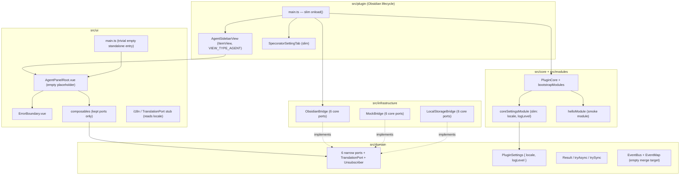

# Design — Plugin shell reboot (P0)

> Stage 4 of `plugin-shell-reboot`. This is a **subtractive** design: the
> deliverable is a smaller tree, not a new feature. Part C below covers the
> surviving skeleton, the one empty agent sidebar view, the slim settings path,
> the bridge de-coupling, the delete inventory + leaf-first order, the trivial
> `build:web` entry, the deleted-symbol guard, the `ci.yml` `next` trigger edit,
> the `IconPort` prune call, and the docs updates. Every element maps back to a
> REQ/NFR ID. UX/UI parts are intentionally empty — P0 ships an empty placeholder,
> not a designed surface.

---

## Part C — Architecture

### C.0 Decisions resolved this stage (Q4, CL-3, CL-4)

| Ref | Question | Decision | Rationale |
|---|---|---|---|
| **Q4** | Keep `IconPort` + `<SpIcon>` or prune? | **PRUNE** both. | The empty P0 view renders no in-Vue icon. The sidebar **tab** icon comes from `ItemView.getIcon(): string` (native Obsidian, a Lucide name) — it does **not** go through `IconPort`. `<SpIcon>` had exactly one job (render `obsidian.setIcon` inside Vue for the chat surface), and that surface is deleted. Keeping `IconPort` would orphan a port with no consumer, contradicting REQ-PSR-005. It regrows in P1+ when the chat UI needs in-Vue icons (re-introduce per ADR-008's "one port per consumer" discipline). |
| **CL-3** | Command-palette entry, ribbon, or both? | **Command-palette entry only.** One command `open-agent-sidebar` ("Open agent sidebar"). **No ribbon icon.** | REQ-PSR-003 mandates a single open affordance and no orphaned entries. A command is the minimal, testable affordance; a ribbon icon is a second surface with no added value for an empty view and a larger blast radius (icon name, tooltip). The current tree registers two ribbon icons + six commands referencing deleted subsystems — collapsing to one command is the cleanest one-affordance shape. |
| **CL-4** | Vue mount vs bare `ItemView` DOM? | **Mount the Vue app** (fresh `createApp` + `ErrorBoundary`, providing only the kept ports). | (1) NFR-PSR-002 — mounting exercises the kept UI machinery (port `provide`, `ErrorBoundary`, the i18n install, the composables) so coverage stays reachable on the smaller tree. (2) Legibility — P1 (chat core) mounts Vue into this same view; a bare-DOM P0 would be thrown away in P1, whereas a Vue-mounting P0 is the literal seam P1 grows into. (3) Claudian-shape parity — Claudian's sidebar is a Vue surface. Cost: one tiny `AgentPanelRoot.vue` placeholder component. |

### C.1 System overview — the gutted skeleton

The reboot keeps the DDD layering, the narrow-port seam, the module system, the
event bus, the `Result` type, and the test harness; it deletes the entire
feature/workflow/agent surface. The surviving shape:



External dependencies: Obsidian API (via `ObsidianBridge` only), Vue 3, Pinia
(install only — no feature stores), `vue-i18n` *or* the minimal stub (see C.4),
`vue-router` only if a kept surface needs it (P0 does **not** — the in-app router
and all routed views are deleted).

### C.2 Components and responsibilities (post-reboot)

| Component | Responsibility | Status |
|---|---|---|
| `src/plugin/main.ts` | Load slim settings, construct `ObsidianBridge`, init `PluginCore` with `[coreSettingsModule, helloModule]`, register **one** view + **one** command + the settings tab. Nothing else. | Rewritten (C.6) |
| `AgentSidebarView` (`src/plugin/AgentSidebarView.ts`) | One `ItemView`, `VIEW_TYPE_AGENT = 'specorator-agent'`. Mounts a Vue app rendering `AgentPanelRoot` inside `ErrorBoundary`; provides the six core ports + i18n; unmounts on `onClose`. | New (replaces `SpecoratorView` + `AgentSidepanelView`) |
| `AgentPanelRoot.vue` (`src/ui/agent/`) | Empty placeholder: a single `data-testid="agent-panel-empty"` element with placeholder text. No chat, no stores. | New |
| `SpecoratorSettingTab` (`src/plugin/settings.ts`) | Render `coreSettingsModule.settingsSchema` (two fields: `locale`, `logLevel`); persist via `updateSettings` → `SettingsPort`. | Slimmed |
| `coreSettingsModule` (`src/core/core-settings.ts`) | Declare/validate/migrate **only** `{ locale, logLevel }`. | Slimmed (C.3) |
| `PluginSettings` / `DEFAULT_SETTINGS` | `{ locale, logLevel }` only; no `@/domain/chat` import. | Slimmed (C.3) |
| `ObsidianBridge` / `MockBridge` / `LocalStorageBridge` | Implement exactly the six ADR-008 ports. | De-coupled (C.5) |
| `src/infrastructure/bridge/ports.ts` | Six core `InjectionKey`s only. | Slimmed (C.5) |
| `src/domain/ports/index.ts` | Re-export six core ports + `TranslationPort` + `Unsubscriber` only. | Slimmed (C.5) |
| `PluginCore` / `bootstrapModules` / `defineModule` / `EventBus` / `Result` | Unchanged in shape; recompile against the slimmer surface. | Kept |
| i18n / `TranslationPort` stub | Read `locale`, translate keys. Survives as the P7 seam (CL-1). | Kept/slimmed (C.4) |
| `src/ui/main.ts` | Trivial standalone entry: mount `AgentPanelRoot` with `MockBridge` providing the six ports. | Rewritten (C.7) |
| Deleted-symbol ESLint rule + test | Fail lint/CI on any import of a deleted symbol/path (CL-2). | New (C.8) |

### C.3 Data model — slim `PluginSettings`

P0's only persisted domain data is the settings blob. Per REQ-PSR-006 / Q2 / CL-1:

```ts
// src/domain/settings/PluginSettings.ts — target shape (no @/domain/chat import)
export interface PluginSettings {
  readonly locale: string
  readonly logLevel: 'debug' | 'info' | 'warn' | 'error'
}
export const DEFAULT_SETTINGS: PluginSettings = { locale: 'en', logLevel: 'warn' }
```

Dropped fields (all lose their consumer with the deleted subsystems):
`specsFolder`, `archiveFolder`, `decisionsFolder`, `constitutionFile`,
`gateStrictness`, `teamMode`, `mcpServerEnabled`, `userPersona`,
`onboardingComplete`, `claudeCliPath`, `obsidianCliPath`, `transportKind`,
`providerSelection`, `cursorCliPath`, `cursorApiPreview`, `autoPreferProvider`,
`providerModel`, `chatTabCap`, and both `@/domain/chat` type imports.

**Migration impact (`coreSettingsModule`, REQ-PSR-008):** `settingsVersion` bumps
to **4**. The `migrate(fromVersion, blob)` reducer for `< 4` **strips** every
dropped key from the stored blob (returns `{ locale, logLevel }` projection) so a
user upgrading from a v0.x install does not carry orphaned keys forward;
`validateSettings` coerces only `locale` (`coerceString`) and `logLevel`
(`coerceEnum` over `VALID_LOG_LEVELS`). The `settingsSchema.fields` array keeps
only the `locale` dropdown and the `logLevel` dropdown. All provider/MCP/workflow
coercion helpers and their `VALID_*` constants are deleted.

> Spec note (forwarded to Stage 5): the exact migration semantics — strip-on-read
> vs. leave-untouched-but-ignore — is a contract decision. Recommendation:
> **strip**, so REQ-PSR-005 ("no settings field names a deleted subsystem") holds
> for the *persisted* blob too, not just the type. `spec.md` must state the
> idempotent migration contract + the edge case "blob already at v4".

### C.4 The minimal i18n / `TranslationPort` stub (CL-1)

`locale` must keep a live consumer or it orphans (REQ-PSR-005). The translation
seam survives, slimmed:

- **`TranslationPort` (`src/domain/ports/TranslationPort.ts`)** — unchanged
  (`t(key, params?) => string`). It is the P7 seam; keep it in the Keep set.
- **i18n implementation (`src/ui/i18n/`)** — keep `setLocale`, `i18nTranslate`
  (the `TranslationPort` impl), `i18nMerge`, and `SupportedLocale`. Trim the
  message catalogues to a **minimal** set: a single shared `en` (and optionally
  `de`) namespace holding only the placeholder string the empty view renders
  (e.g. `agent.empty.placeholder`). Delete every feature/chat/onboarding/feature-
  card message key with its component. `setLocale(settings.locale)` is called once
  in `AgentSidebarView.onOpen()` and in `main.ts` standalone, so `locale` has a
  live consumer.
- **Wiring:** `main.ts` constructs `translationPort = { t: i18nTranslate }` and
  passes it to `PluginCore` under `ModulePorts.t` exactly as today; the empty view
  mounts `i18n`. This keeps `coreSettingsModule`'s `locale` dropdown meaningful.

> Decision: keep the existing `vue-i18n`-backed implementation rather than hand-
> rolling a new stub. It already satisfies "minimal seam that reads `locale`",
> the trim is pure deletion (lower risk than a rewrite), and it preserves the
> P7 re-expansion point. `spec.md` defines the one placeholder key contract.

### C.5 Bridge de-coupling + port-barrel slim (REQ-PSR-005, OQ-PSR-2)

Three edits, all pure subtraction:

1. **`src/domain/ports/index.ts`** — re-export only:
   `SettingsPort`, `VaultPort`, `WorkspacePort` (+ `ActiveFileSnapshot` if a kept
   consumer still uses it — verify in Stage 5; the empty view does not), 
   `NotificationPort`, `LoggerPort`, `CommunityPluginPort`, `TranslationPort`,
   `Unsubscriber`. Delete the re-exports for `IconPort`, `MetadataCachePort`,
   `CanvasPort`, `ObsidianMcpServerPort`, `ObsidianCliPort`(+`ObsidianCliError`),
   `ChatTransportPort`(+`ChatTransportError`, stream/query option types),
   `TransportLifecyclePort`, `ConfirmModalPort`, `SecretStorePort`
   (+`SECRET_ID_ANTHROPIC`/`SECRET_ID_CURSOR`), `MarkdownRenderPort`, and delete the
   corresponding port files under `src/domain/ports/`.
2. **`src/infrastructure/bridge/ports.ts`** — keep only the six core
   `InjectionKey`s (`SETTINGS_PORT`, `VAULT_PORT`, `WORKSPACE_PORT`,
   `NOTIFICATION_PORT`, `LOGGER_PORT`, `COMMUNITY_PLUGIN_PORT`). Delete `ICON_PORT`,
   `METADATA_CACHE_PORT`, `CANVAS_PORT`, `CHAT_TRANSPORT_PORT`,
   `PROVIDER_REGISTRY_KEY`, `TRANSPORT_LIFECYCLE_PORT`, `CONFIRM_MODAL_PORT`,
   `SECRET_STORE_PORT`, `MARKDOWN_RENDER_PORT`, `TRANSPORT_KIND_KEY`,
   `IS_MOBILE_KEY`, `SETTINGS_VERSION_KEY`, `OPEN_PLUGIN_SETTINGS_KEY`,
   `PLUGIN_MANIFEST_KEY`, and the two `@/domain/chat` imports
   (`TransportKind`, `ProviderRegistry`).
3. **`MockBridge` + `LocalStorageBridge`** — change `implements` to the six core
   ports only; delete the `ChatTransportPort` members (`isAvailable`,
   `queryStream`) and the `IconPort` member (`setIcon`, `markIconAsMissing`,
   `missingIcons`) and their imports (`ChatTransportError`, `StreamDelta`, etc.).
   `ObsidianBridge` is verified to implement exactly six ports (it is the
   production class behind ADR-008; confirm in Stage 5 it carries no chat/icon
   members). `fake-ports.ts` (`tests/__fakes__/`) drops `iconPort`,
   `MockMetadataCacheAdapter`, `MockCanvasAdapter` and any chat-port exposure,
   keeping the six core ports + `EventBus` + `TranslationPort` stub.

### C.6 Trimmed `src/plugin/main.ts` target shape (Q5)

The current 970-line `main.ts` is ~90% feature wiring. Target shape (sketch — not
final code; `spec.md` fixes signatures):

```ts
export default class SpecoratorPlugin extends Plugin {
  settings: PluginSettings = { ...DEFAULT_SETTINGS }
  core: PluginCore | null = null
  bridge: ObsidianBridge | null = null
  private _storedData: Record<string, unknown> = {}

  async onload(): Promise<void> {
    await this.loadSettings()
    this.bridge = new ObsidianBridge(this.app, () => this.settings, (s) => this.updateSettings(s))
    const translationPort: TranslationPort = { t: i18nTranslate }
    this.core = new PluginCore(ALL_MODULES, {
      settings: this.bridge, vault: this.bridge, workspace: this.bridge,
      notifications: this.bridge, logger: this.bridge, t: translationPort, i18nMerge,
    })
    setLocale(this.settings.locale as SupportedLocale)
    await this.core.init(this._storedData)
    this.settings = { ...DEFAULT_SETTINGS, ...(this._storedData.specorator ?? {}) }
    await this.saveData(this._storedData)

    this.registerView(VIEW_TYPE_AGENT, (leaf) => new AgentSidebarView(leaf, this))
    this.addCommand({ id: 'open-agent-sidebar', name: 'Open agent sidebar',
      callback: () => void this.activateAgentSidebar() })
    this.addSettingTab(new SpecoratorSettingTab(this.app, this))
  }

  override onunload(): void {
    this.app.workspace.detachLeavesOfType(VIEW_TYPE_AGENT)
    this.bridge?.hideAllNotices()
    void this.core?.destroy()
  }

  // loadSettings(): read blob, promoteLegacyFlatSettings (if kept), set this.settings.
  // updateSettings(partial): merge → notifySettingsChanged('specorator') → validated → saveData.
  // activateAgentSidebar(): reveal-or-create the VIEW_TYPE_AGENT leaf in the right sidebar
  //   (loadIfDeferred before reveal — ADR-008 deferred-leaf invariant).
}
```

Deleted from `main.ts`: `child_process`/`os` imports; all transport/provider/
secret-store/MCP/cursor adapter construction and `register(shutdown)` hooks; both
old view registrations; both ribbon icons; the `start/stop-mcp-server`,
`switch-provider`, `re-run-setup` commands; the `file-menu` + `active-leaf-change`
+ `registerObsidianProtocolHandler` handlers; chat-threads + approval-rules
persistence (debounce queue, flush chain); the provider-selection migration; the
`_routeTransport`/`_mapResolvedToTransportSelection`/`_cycleProviderSelection`/
`_applyProviderFromUri`/`getProviderRegistry` methods; `detectLegacyVaultLayout`;
`_dispatchNavigate`. `promoteLegacyFlatSettings`/`leafLoader` are kept only if a
slim consumer remains (Stage 5 verifies; default is to keep `leafLoader`'s
`ensureLeafLoaded` for the deferred-leaf reveal, drop `loadSettings-migrate` unless
the slim migrate path needs it).

### C.7 Trivial standalone `build:web` entry (REQ-PSR-011, Q1)

`src/ui/main.ts` is rewritten to a minimal mount with no deleted imports:

```ts
import { createApp } from 'vue'
import { createPinia } from 'pinia'
import AgentPanelRoot from './agent/AgentPanelRoot.vue'
import { i18n, setLocale } from './i18n'
import { SETTINGS_PORT, VAULT_PORT, WORKSPACE_PORT, NOTIFICATION_PORT,
         LOGGER_PORT, COMMUNITY_PLUGIN_PORT } from '@/infrastructure/bridge/ports'
import { MockBridge } from '@/infrastructure/mock/MockBridge'

const bridge = new MockBridge()
const app = createApp(AgentPanelRoot)
app.use(createPinia()); app.use(i18n)
void bridge.getSettings().then((s) => { setLocale(s.locale as SupportedLocale) })
app.provide(SETTINGS_PORT, bridge); app.provide(VAULT_PORT, bridge)
app.provide(WORKSPACE_PORT, bridge); app.provide(NOTIFICATION_PORT, bridge)
app.provide(LOGGER_PORT, bridge); app.provide(COMMUNITY_PLUGIN_PORT, bridge)
app.mount('#app')
```

Deleted from the standalone path: `vue-router` + `./router` (all routed views are
gone), `AppRoot.vue`, `FeatureService`/`FeatureRepository`/`FEATURE_SERVICE_KEY`,
`LocalStorageSecretStore`/`MockSecretStore`, `DEV_FIXTURES`, `CHAT_TRANSPORT_PORT`/
`SECRET_STORE_PORT`/`ICON_PORT`/`OPEN_PLUGIN_SETTINGS_KEY` provides,
`bootstrapModules` (optional — keep only if a kept module needs browser bootstrap;
default drop for P0 since the standalone entry only needs the empty view).
`LocalStorageBridge` survives the de-coupling (C.5) but the standalone PROD branch
may switch to always-`MockBridge` for P0 to avoid the LocalStorage demo carrying
removed wiring — Stage 5 confirms whether `LocalStorageBridge` stays referenced
here or only kept as a compiling-but-unwired class. `standalone.css` + token CSS
imports are kept (CSS only, no code coupling).

### C.8 Deleted-symbol guard — ESLint rule + test seam (CL-2, REQ-PSR-005, NFR-PSR-009)

The "no live reference to a deleted subsystem" check is an **automated guard**
inside the existing lint + test gate (no new gate step).

**(a) ESLint `no-restricted-imports` patterns.** Extend the project-wide
`no-restricted-imports` block in `eslint.config.js` with a new shared constant
`DELETED_SUBSYSTEM_BAN` (mirroring the existing `PORTS_BAN_PATTERN` shape) added to
`patterns`:

```js
const DELETED_SUBSYSTEM_BAN = {
  group: [
    '@/domain/chat', '@/domain/chat/**',
    '@/domain/feature', '@/domain/feature/**',
    '@/application/chat/**', '@/application/feature/**', '@/application/migration/**',
    '@/infrastructure/bridge/FeatureRepository',
    '@/infrastructure/obsidian/Claude*', '@/infrastructure/obsidian/Cursor*',
    '@/infrastructure/obsidian/Obsidian{Mcp,Cli,MetadataCache,Canvas,SecretStore,ConfirmModal,MarkdownRender}*',
    '@/infrastructure/cursor/**', '@/infrastructure/mcp/**',
    '**/SpecoratorView', '**/AgentSidepanelView',
    '@/domain/ports/{ChatTransport,TransportLifecycle,ConfirmModal,SecretStore,MarkdownRender,Icon,MetadataCache,Canvas,ObsidianMcpServer,ObsidianCli}Port',
  ],
  message:
    'This module names a subsystem deleted in the P0 reboot (ADR-PSR-001). The chat/feature/transport/MCP/onboarding surface regrows per phase — do not re-import the old path.',
}
```

Plus a `paths` entry banning the named injection-key symbols
(`CHAT_TRANSPORT_PORT`, `ICON_PORT`, `SECRET_STORE_PORT`, `PROVIDER_REGISTRY_KEY`,
…) re-imported from `@/infrastructure/bridge/ports`. The deleted local custom
rules (`no-legacy-claude-cli-port-names`, its carve-out, and the
`useClaudeCliPort.ts` override) are removed since their target files are gone
(NFR-PSR-009 — no dead bypass artifacts).

**(b) CI-run test (`TEST-PSR-*`).** A Vitest test (e.g.
`tests/architecture/no-deleted-subsystem-refs.test.ts`) that uses the ESLint
Node API (the repo already exercises ESLint programmatically for the boundary-rule
fixtures — see `eslint.config.js` `__fixtures__` note) to lint `src/**` with the
flat config and assert **zero** `no-restricted-imports` violations carrying the
`DELETED_SUBSYSTEM_BAN` message. This makes the guard regression-proof: a later
phase re-introducing a deleted name fails the test, not just interactive lint.

> Spec note (Stage 5): `spec.md` fixes (1) the exact glob list (Stage 5 verifies
> each path resolves to a deleted module — globs that match nothing are dead and
> violate NFR-PSR-009), and (2) the test's lint-API invocation contract
> (config path, target glob, assertion shape). This is the durable `TEST-PSR`
> the QA agent automates.

### C.9 CI `next`-branch trigger edit (REQ-PSR-012, NFR-PSR-008, Q3)

`.github/workflows/ci.yml` currently triggers on `[develop, demo, main]` only;
`next` gets no CI (R-PSR-3). The edit adds `next` to both trigger lists:

```yaml
on:
  push:
    branches: [develop, demo, main, next]
  pull_request:
    branches: [develop, demo, main, next]
```

This is the **only** change to `ci.yml`. It is SHA-pin-safe and actionlint-safe by
construction: no `uses:` line is added or changed, so the 40-char-SHA-pin gate and
`verify:workflows` are unaffected; the edit is a pure list extension that
`actionlint` accepts. The `guard` job (`base_ref == 'main'`) is untouched — PRs
into `next` are not gated to a `develop` source. Run `actionlint` locally per
AGENTS.md §3 when this file changes.

> Spec note: do not modify `concurrency`, `permissions`, or job definitions. The
> reviewer/SRE should confirm branch-protection on `next` requires the `verify`
> check before merge (a repo-settings action, outside the file edit; flagged to
> release/SRE, not blocking design).

### C.10 Data flow — boot + open (primary scenario)

```mermaid
sequenceDiagram
  participant O as Obsidian
  participant M as main.ts onload()
  participant B as ObsidianBridge
  participant C as PluginCore
  participant U as User
  participant V as AgentSidebarView
  participant R as AgentPanelRoot.vue

  O->>M: onload()
  M->>M: loadSettings() → { locale, logLevel }
  M->>B: new ObsidianBridge(app, getSettings, updateSettings)
  M->>C: new PluginCore([core, hello], ports) ; init(storedData)
  M->>M: setLocale(locale)
  M->>O: registerView(VIEW_TYPE_AGENT) ; addCommand(open-agent-sidebar) ; addSettingTab
  Note over M,O: onload complete — REQ-PSR-001, NFR-PSR-003 (no console errors)
  U->>O: run "Open agent sidebar" command (CL-3)
  O->>M: activateAgentSidebar()
  M->>O: getRightLeaf ; loadIfDeferred ; setViewState(VIEW_TYPE_AGENT) ; revealLeaf
  O->>V: onOpen()
  V->>V: createApp(AgentPanelRoot) ; provide 6 ports ; use(i18n) ; setLocale
  V->>R: mount inside ErrorBoundary
  R-->>U: empty placeholder (data-testid="agent-panel-empty") — REQ-PSR-002
```

### C.11 Key decisions table

| ID | Decision | ADR | REQ/NFR |
|---|---|---|---|
| D-PSR-1 | Clean-room reboot: gut feature/workflow/agent surface, keep skeleton | **ADR-PSR-001** | REQ-PSR-009; whole PRD |
| D-PSR-2 | One `ItemView` (`VIEW_TYPE_AGENT`) mounting Vue (CL-4) | ADR-PSR-001 (§Consequences) | REQ-PSR-001/002, NFR-PSR-002 |
| D-PSR-3 | Single open affordance = command palette, no ribbon (CL-3) | — | REQ-PSR-002/003 |
| D-PSR-4 | Prune `IconPort` + `<SpIcon>` (Q4) | — | REQ-PSR-005 |
| D-PSR-5 | Slim `PluginSettings`/`coreSettingsModule` to `{ locale, logLevel }`; bump `settingsVersion` to 4 with strip-migrate | — | REQ-PSR-006/008 |
| D-PSR-6 | Keep minimal i18n/`TranslationPort` seam reading `locale` (CL-1) | — | REQ-PSR-006, REQ-PSR-005 |
| D-PSR-7 | Bridges + port barrel + InjectionKeys → six core ports only | — | REQ-PSR-005 |
| D-PSR-8 | Trivial empty standalone entry; keep `build:web` on the gate (Q1) | — | REQ-PSR-011, NFR-PSR-005 |
| D-PSR-9 | Deleted-symbol ESLint `no-restricted-imports` + Vitest lint-API test (CL-2) | — | REQ-PSR-005, NFR-PSR-009 |
| D-PSR-10 | Add `next` to `ci.yml` push + pull_request triggers (Q3) | — | REQ-PSR-012, NFR-PSR-008 |
| D-PSR-11 | Docs: CLAUDE.md + AGENTS.md architecture sections rewritten to gutted state | — | REQ-PSR-010 |

### C.12 Rejected alternatives

| Alternative | Why rejected |
|---|---|
| Bare-DOM `ItemView` (no Vue) for the empty view | Loses NFR-PSR-002 coverage of kept UI machinery; would be thrown away in P1; departs from Claudian Vue-shape. |
| Keep `IconPort` "just in case" | Orphans a port with no P0 consumer → violates REQ-PSR-005; re-introduce per consumer in P1+ (ADR-008 discipline). |
| Ribbon icon (or ribbon + command) | Second affordance with no value for an empty view; larger surface to keep orphan-free (REQ-PSR-003). |
| Remove `build:web` from the verify gate | Edits + re-justifies the gate (PRD Q1); keeping a trivial entry is cheaper and reversible. |
| Manual one-time "no deleted refs" review | Not regression-proof; a later phase could silently re-import a deleted name. CL-2 mandates an automated guard. |
| Hand-roll a brand-new i18n stub | Higher risk than trimming the existing `vue-i18n` impl; the seam already reads `locale` and is the P7 re-expansion point. |
| Keep workflow folder/gate settings fields | Their consumer (workflow engine) is deleted → orphaned fields (REQ-PSR-006/Q2). |
| Target phase PRs at `develop` instead of CI-on-`next` | `next` is the integration branch; unverified merges land there (R-PSR-3). Local-only verify is unenforceable at merge (Q3). |

### C.13 Requirements coverage (Part C)

| REQ/NFR | Covered by |
|---|---|
| REQ-PSR-001 | C.6 (`registerView`), C.10 |
| REQ-PSR-002 | C.1/C.2 (`AgentSidebarView`+`AgentPanelRoot`), C.0 CL-4, C.10 |
| REQ-PSR-003 | C.0 CL-3, C.6 (one command, no ribbon) |
| REQ-PSR-004 | Whole design — leaf-first delete keeps `tsc`/verify green (C.14) |
| REQ-PSR-005 | C.3, C.4, C.5, C.8 |
| REQ-PSR-006 | C.3 |
| REQ-PSR-007 | C.2 (`SpecoratorSettingTab` → `SettingsPort`) |
| REQ-PSR-008 | C.3 |
| REQ-PSR-009 | ADR-PSR-001 (C.11) |
| REQ-PSR-010 | C.11 D-PSR-11, C.15 |
| REQ-PSR-011 | C.7 |
| REQ-PSR-012 | C.9 |
| NFR-PSR-001/004/005/006 | C.7 (build:web), C.14 (verify green) |
| NFR-PSR-002 | C.0 CL-4, C.5 (`fake-ports` trim) |
| NFR-PSR-003 | C.10 (clean boot) |
| NFR-PSR-007 | Out of scope to touch `manifest.json` (NG6) — no design element edits it |
| NFR-PSR-008 | C.9 |
| NFR-PSR-009 | C.8 (no dead bypass artifacts; delete dead custom rules) |

### C.14 Delete inventory + leaf-first, compiler-guided order (Q5)

> No hand-fabricated line counts. The inventory is keyed to files/areas read this
> stage and the graph communities; the **order** is the load-bearing mitigation
> for R-PSR-1: delete leaves first, then let `npm run typecheck` surface the next
> layer to delete. Each numbered wave ends with `npm run typecheck` (and `lint`)
> green-or-expected-broken before starting the next.

**Wave 0 — UI leaves (no inward importers):** delete `src/ui/components/**` chat
+ feature + onboarding + design-canvas trees (graph communities: *Agent Message
Blocks*, *Onboarding Nudges & Personas*, *Design Canvas DC Components*,
*FeatureCard Progress*, *Chat Reset & Message*), the routed views (`HomeView`,
`FeaturesView`, `SettingsView`, `FileView`, `MainLayout`, `OnboardingWizard` +
steps — *Vue Router Config*, *Onboarding & Pinia Stores*), `AppRoot.vue`,
`src/ui/router/**`, the Pinia chat/feature stores (`messagesStore`,
`chatThreadsStore`, `chatProviderStore`, `approvalRulesStore`, proposal stores),
`<SpIcon>` (Q4), `MarkdownBlock`/`ThinkingBlock`/`ToolCallBlock`, the slash/mention
composables, and their co-located `.stories.*` + tests (R-PSR-4). Trim
`src/ui/i18n/locales/**` to the minimal catalogue (C.4).

**Wave 1 — plugin-layer views/wiring (importers of Wave 0):** delete
`src/plugin/SpecoratorView.ts`, `AgentSidepanelView.ts`, `leafLoader` (keep
`ensureLeafLoaded` only if the slim reveal uses it), `chatThreadsPersistence`,
`approvalRulesPersistence`, `uriProviderParam`, `transport/**`,
`loadSettings-migrate` (unless the slim migrate needs it). Rewrite `main.ts` (C.6)
and `settings.ts` (slim). Add `AgentSidebarView.ts` + `AgentPanelRoot.vue`.

**Wave 2 — application layer (importers of domain feature/chat):** delete
`src/application/chat/**` (*Chat Turn Orchestrator*, *Stream Collection*, *File
Envelope*, *Stream Event Schema*), `src/application/feature/**` (*FeatureService
Methods*, *Use Case Collection*), `src/application/migration/**`. Keep
`src/application/shared/FeedbackService.ts`.

**Wave 3 — infrastructure adapters (importers of deleted ports):** delete
`src/infrastructure/obsidian/{ClaudeCliAdapter,ClaudeSubprocessAdapter,
ClaudeBinaryResolver,CursorCliAdapter,CursorBinaryResolver,
ObsidianMcpServerAdapter,ObsidianCliAdapter,ObsidianMetadataCacheAdapter,
ObsidianCanvasAdapter,ObsidianSecretStoreAdapter,ObsidianConfirmModalAdapter,
ObsidianMarkdownRenderAdapter}.ts` and the `register*Tools` MCP registrars
(*MCP Tool Registrars*, *BFS Traverse & Links*, *Bases Records*, *Canvas Schema*),
`src/infrastructure/cursor/**`, `src/infrastructure/bridge/{FeatureRepository,
degradedClaudeCliPort}.ts`, the mock chat/secret/mcp/canvas adapters
(*Mock Claude CLI Port*, *Mock Subprocess Adapter*, *Mock Canvas/Metadata/MCP*,
*Secret Stores*, *Confirm Modal Adapters*, *Plan Approval*). De-couple
`MockBridge` + `LocalStorageBridge` (C.5). Slim `ports.ts` + `fake-ports.ts`.

**Wave 4 — domain (the root; deleting last avoids breaking everything at once):**
delete `src/domain/chat/**` (*Degraded Transport & i18n* chat types,
`ProviderSelection`, `TransportKind`, `ChatThreadRecord`, `ApprovalRule`, …),
`src/domain/feature/**` (`Feature`, `Slug`, `FeatureStep`, `FeatureStatus`,
`IFeatureRepository`, codec), the deleted port interface files under
`src/domain/ports/**` (Q4 `IconPort` included), the workflow-state codec. Slim
`PluginSettings` (C.3) and `src/domain/ports/index.ts` (C.5). `EventBus`/`EventMap`
need no edit (empty merge target — verified `event-bus.ts:5`).

**Wave 5 — config/docs/guards:** slim `coreSettingsModule` (C.3); add the
deleted-symbol guard (C.8); delete the now-dead custom ESLint rule files + their
config blocks + the `useClaudeCliPort` override (NFR-PSR-009); adjust
`vitest.config.ts` coverage `include` only if a kept file is legitimately
untestable in P0 (justify in PR — R-PSR-5); edit `ci.yml` (C.9); update docs
(C.15). Final `npm run verify` must be green with zero bypasses.

> The order is a guideline; the compiler is the authority. After each wave run
> `npm run typecheck` — the error list is the precise, non-fabricated next-delete
> set (R-PSR-1 mitigation). `spec.md` need not re-enumerate every file; it states
> the wave invariant ("each wave ends typecheck-green-or-expected") and the
> acceptance check (C.8 guard passes, verify green).

### C.15 Docs updates (REQ-PSR-010)

- **CLAUDE.md** — rewrite the `## Architecture` layer table (drop the `Feature`
  aggregate / `FeatureRepository` / `SpecoratorView` descriptions), the
  `### Narrow ports` list (six core ports; note `IconPort`/chat/MCP ports regrow
  per phase), the `### Vault structure (ADR-005)` block (the 12-stage workflow is
  deleted — either remove or mark "regrows post-P0"), the `### Vue conventions`
  router note (router deleted in P0), and the `### Key files` list (remove
  `Feature.ts`, `FeatureStep.ts`, `FeatureRepository.ts`; add `AgentSidebarView`,
  `AgentPanelRoot.vue`). Keep `Result`, `EventBus`, module-system, testing-
  conventions sections.
- **AGENTS.md** — the §3 verify chain and branching model are unchanged; only the
  architecture-referencing prose (if any names a deleted subsystem) is corrected.
  `next` integration-branch CI is now real (C.9) — reconcile any stale "CI runs on
  develop/demo/main" line with the new trigger list.
- **`docs/adr/`** — `ADR-PSR-001` filed (see below); add its row to the ADR index
  (`docs/adr/README.md` if present — Stage 5/planner verifies the index file name,
  which this stage could not list).

---

## Open clarifications

> Raised this stage; none blocks the Stage 5 spec, but each should be pinned by
> the planner/spec author or escalated.

- **OC-PSR-1 — `ActiveFileSnapshot` / `Unsubscriber` survival.** The empty view
  needs neither. Stage 5 must confirm no *kept* code (e.g. `WorkspacePort` impl
  surface) still references `ActiveFileSnapshot`; if nothing kept uses it, prune it
  from `WorkspacePort` too. Default: keep `WorkspacePort` at its ADR-008 shape
  (`openFile`) and drop the chat-era `getActiveFile*`/`getVaultName`/
  `getMarkdownFileCount` extensions unless a kept consumer remains.
- **OC-PSR-2 — `LocalStorageBridge` standalone wiring.** C.7 mounts `MockBridge`
  for P0. Decide whether `LocalStorageBridge` stays *referenced* by the standalone
  PROD branch (keeping the GitHub-Pages demo path nominally alive) or is kept only
  as a compiling-but-unwired class. Recommendation: drop the PROD branch in P0
  (always `MockBridge`); re-introduce `LocalStorageBridge` wiring when a phase ships
  a browser demo (mirrors OQ-PSR-1's defer posture). Flagged because it touches the
  REQ-PSR-010 docs line about the GitHub-Pages demo.
- **OC-PSR-3 — `docs/adr/README.md` index.** This stage could not enumerate the
  `docs/adr/` directory (no list tool). `ADR-PSR-001` is filed at
  `docs/adr/ADR-PSR-001-reboot-plugin-shell.md` matching the `ADR-008-<slug>.md`
  convention. The planner/spec author should verify the ADR index file's exact name
  and add the `ADR-PSR-001` row, and confirm the `superseded-by` pointers are added
  to ADR-008's and the MPS/AUX agent-surface ADRs' frontmatter (their bodies stay
  immutable — only the pointer fields update).

---

## Quality gate

- [x] System overview diagrammed (C.1).
- [x] Components + single responsibilities tabled (C.2).
- [x] Data model + migration impact stated (C.3).
- [x] Primary data flow modelled end-to-end (C.10).
- [x] Key decisions tabled; the irreversible one (reboot) has ADR-PSR-001 (C.11).
- [x] Rejected alternatives listed with rationale (C.12).
- [x] Q4 / CL-3 / CL-4 resolved with rationale (C.0).
- [x] Delete inventory + leaf-first compiler-guided order (C.14).
- [x] Deleted-symbol guard (ESLint + test seam) specified (C.8).
- [x] `ci.yml` `next` trigger edit specified, SHA-pin/actionlint-safe (C.9).
- [x] Every design element mapped to a REQ/NFR (C.13).
- [x] Open clarifications captured, not guessed.
