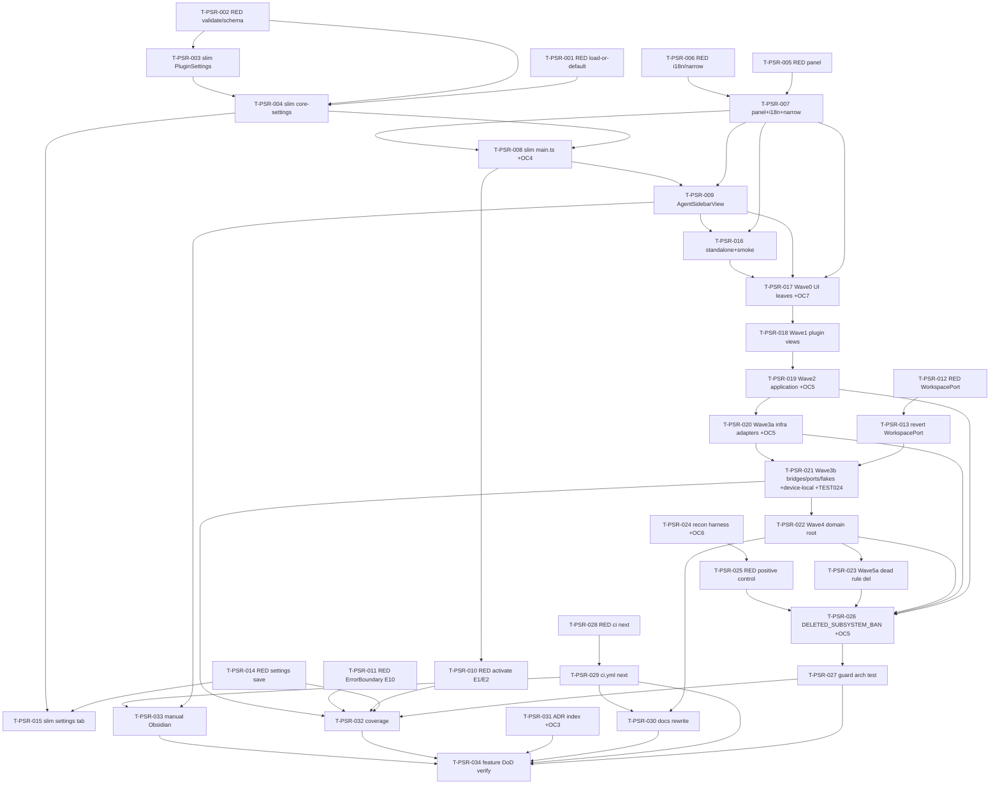

# Tasks — Plugin shell reboot (P0)

Each task ≤ ~½ day, has a stable ID, references ≥ 1 requirement/spec ID, names
its owner + dependencies, and carries a testable Definition of Done.

> **TDD ordering:** the RED test task for a contract comes **before** the
> implementation task that turns it green. For the *subtractive* work (delete
> waves) the "test" is the per-wave `npm run typecheck` (and `lint`) gate stated
> in spec §9 — each delete task's DoD encodes that gate.

> **Subtractive feature — sequencing rationale.** P0 is mostly deletion, so a
> naive "RED test then code" loop breaks: deleting the chat surface makes the
> tree red until its consumers are also gone. The plan therefore:
> 1. Stands up the *new* surviving surface (`AgentPanelRoot.vue`,
>    `AgentSidebarView`, slim `main.ts`/settings, slim load-or-default settings
>    (no migration — CHARTER-REQ-FRESH), i18n trim, standalone entry) **first**,
>    with its RED unit tests, so there is a green target to converge on.
> 2. Executes the six delete waves 0→5 in design §C.14 order, **each wave ending
>    `npm run typecheck` green-or-expected** before the next (the `tsc` error
>    list is the authoritative next-delete set — R-PSR-1 mitigation).
> 3. Enables the deleted-symbol ESLint guard + its arch test **LAST** (T-PSR-026/
>    027), once every banned path is actually deleted — only then do the ban
>    globs resolve to real removed paths (NFR-PSR-009: a glob matching nothing is
>    itself dead and a defect).
> 4. Closes with the docs rewrite, the ADR-index housekeeping, the coverage-
>    threshold check, and the whole-feature verify gate.

> **Where OC-PSR-4..7 landed (none left floating):**
> - **OC-PSR-4** (`ALL_MODULES`/`helloModule` shape) → **T-PSR-008** (verify-and-trim
>   subtask inside the `main.ts` rewrite).
> - **OC-PSR-5** (`@/infrastructure/mcp/**` + `@/application/migration/**` glob
>   resolution) → executed during Waves 2/3 (**T-PSR-020/021**) and confirmed in
>   **T-PSR-026** (guard rule — drop any dead glob).
> - **OC-PSR-6** (existing programmatic-ESLint harness reuse) → **T-PSR-024** (QA
>   recon subtask, before authoring the guard test T-PSR-027).
> - **OC-PSR-7** (`ErrorBoundary.vue` survives Wave 0 in place) → **T-PSR-017**
>   (explicit keep-and-verify subtask inside Wave 0).

## Legend

- 🧪 = test task
- 🔨 = implementation task
- 📐 = design / scaffolding task
- 📚 = documentation task
- 🚀 = release / ops task
- 🪓 = may slice (touches multiple independent code paths; expect several PRs)

---

## Task list

> **No baseline-capture task needed.** No NFR references a "current performance"
> baseline to diff against. NFR-PSR-002 (coverage) and NFR-PSR-006 (bundle size)
> are *thresholds/ceilings* on the gutted tree, not deltas — captured by
> T-PSR-031 / the verify gate (T-PSR-032), not a pre-implementation snapshot.

### Phase A — Stand up the surviving surface + RED tests (green target first)

### T-PSR-001 🧪 — RED: `coreSettingsModule` load-or-default + unknown-key hygiene (no migration)

- **Description:** Author the load-or-default edge-table tests (per SPEC-PSR-002's
  simplified table): `validateSettings(null)`/`validateSettings(undefined)` →
  `DEFAULT_SETTINGS` (load-or-default, fresh install / post-upgrade); corrupt
  non-object (`'garbage'` / `42` / `['a']`) → defaults; valid slim blob
  `{ locale:'de', logLevel:'info' }` → returned verbatim; partial-only-`logLevel`
  `{ logLevel:'error' }` → `{ locale:'en', logLevel:'error' }`; **unknown-key
  hygiene** `{ locale:'de', logLevel:'info', specsFolder:'x' }` →
  `{ locale:'de', logLevel:'info' }` (unknown key never returned). Assert the
  module has **no `migrate` method** and does **not** set/bump `settingsVersion`.
  Vitest unit, no Obsidian runtime. **No migration, no strip-on-read, no version
  awareness** (CHARTER-REQ-FRESH / NG8).
- **Satisfies:** TEST-PSR-001, TEST-PSR-002, TEST-PSR-003, TEST-PSR-004; REQ-PSR-006, REQ-PSR-008, REQ-PSR-013, REQ-PSR-005; SPEC-PSR-002
- **Owner:** qa
- **Depends on:** —
- **Estimate:** M
- **Definition of done:**
  - [ ] One test file `tests/core/core-settings.test.ts` covers the load-or-default edge rows (null/undefined/corrupt → defaults; valid; partial; unknown-key hygiene), each `it` naming its TEST-PSR id.
  - [ ] One assertion confirms `coreSettingsModule` exposes **no `migrate`** member and does **not** set `settingsVersion` (TEST-PSR-002).
  - [ ] Tests reference REQ/SPEC ids in describe/it metadata.
  - [ ] Tests fail (RED) against the current fat `core-settings.ts`.

### T-PSR-002 🧪 — RED: `validateSettings` coercion + `settingsSchema.fields` + `PluginSettings` shape

- **Description:** Tests asserting `validateSettings({})` → `DEFAULT_SETTINGS`,
  invalid `logLevel` → `'warn'`, non-string `locale` → `'en'`;
  `coreSettingsModule.settingsSchema.fields` keys are exactly `['locale','logLevel']`
  (both `dropdown`); `Object.keys(DEFAULT_SETTINGS)` === `['locale','logLevel']`.
- **Satisfies:** TEST-PSR-005, TEST-PSR-006, TEST-PSR-007; REQ-PSR-006, REQ-PSR-008; SPEC-PSR-001, SPEC-PSR-003, SPEC-PSR-004
- **Owner:** qa
- **Depends on:** —
- **Estimate:** S
- **Definition of done:**
  - [ ] Tests added (co-located with T-PSR-001 or a sibling file), each `it` naming its TEST-PSR id.
  - [ ] Tests fail (RED) against the current fat settings shape.

### T-PSR-003 🔨 — Slim `PluginSettings` + `DEFAULT_SETTINGS`

- **Description:** Rewrite `src/domain/settings/PluginSettings.ts` to exactly
  `{ readonly locale: string; readonly logLevel: 'debug'|'info'|'warn'|'error' }`
  + `DEFAULT_SETTINGS = { locale:'en', logLevel:'warn' }`. Remove the 16 dropped
  fields and both `@/domain/chat` type imports.
- **Satisfies:** REQ-PSR-006; SPEC-PSR-001
- **Owner:** dev
- **Depends on:** T-PSR-002
- **Estimate:** S
- **Definition of done:**
  - [ ] Type exposes exactly two readonly keys; no `@/domain/chat` import.
  - [ ] T-PSR-002's `PluginSettings`/`DEFAULT_SETTINGS` assertions pass.
  - [ ] `npm run typecheck` reports no *new* error originating in this file (downstream fat consumers may still error — that is expected pre-delete; do not fix them here).
  - [ ] Implementation-log entry added.

### T-PSR-004 🔨 — Slim `coreSettingsModule` (load-or-default `validateSettings` + 2-field schema, no migration)

- **Description:** Rewrite `src/core/core-settings.ts` to the load-or-default
  shape per SPEC-PSR-002: **no `migrate` method**, **no `settingsVersion`
  set/bump**, just the two-field `validateSettings` (`coerceString` locale,
  `coerceEnum`/`VALID_LOG_LEVELS` logLevel) that narrows any blob (or
  absent/garbage) to `{ locale, logLevel }` with `DEFAULT_SETTINGS` filling
  missing/invalid fields and unknown keys ignored, plus the two-dropdown
  `settingsSchema.fields` and `settingsDefaults` per SPEC-PSR-003/004. Delete all
  other coercion helpers + `VALID_*` constants + `@/domain/chat` imports. **No
  migration, no strip-on-read, no version awareness** (CHARTER-REQ-FRESH / NG8).
- **Satisfies:** REQ-PSR-006, REQ-PSR-008, REQ-PSR-013, REQ-PSR-005; SPEC-PSR-002, SPEC-PSR-003, SPEC-PSR-004
- **Owner:** dev
- **Depends on:** T-PSR-001, T-PSR-002, T-PSR-003
- **Estimate:** M
- **Definition of done:**
  - [ ] T-PSR-001 and T-PSR-002 (load-or-default + validate + schema) pass GREEN.
  - [ ] Module declares **no `migrate`** member and does **not** set/bump `settingsVersion`; `validateSettings` is pure and returns exactly `{ locale, logLevel }` (unknown keys never carried through).
  - [ ] No dead coercion helper / `VALID_*` constant / chat import remains in the file.
  - [ ] Implementation-log entry added.

### T-PSR-005 🧪 — RED: `AgentPanelRoot.vue` placeholder (PageObject)

- **Description:** Mount test for the empty panel: a co-located
  `AgentPanelRoot.po.ts` PageObject querying `data-testid="agent-panel-empty"`;
  assert it renders the `agent.empty.placeholder` i18n string. Vue Test Utils +
  installed `i18n`. Query by `data-testid` only (ADR-009).
- **Satisfies:** TEST-PSR-008; REQ-PSR-002; SPEC-PSR-006
- **Owner:** qa
- **Depends on:** —
- **Estimate:** S
- **Definition of done:**
  - [ ] `tests/ui/agent/AgentPanelRoot.test.ts` + `AgentPanelRoot.po.ts` exist; element queried by `data-testid`.
  - [ ] Test fails (RED) because the component does not yet exist.

### T-PSR-006 🧪 — RED: i18n trimmed catalogue + `toSupportedLocale`

- **Description:** Tests: `i18nTranslate('agent.empty.placeholder')` returns the
  EN string at locale `en` and the DE string after `setLocale('de')`;
  `toSupportedLocale('fr') === 'en'`, `toSupportedLocale('de') === 'de'`.
- **Satisfies:** TEST-PSR-009, TEST-PSR-010; REQ-PSR-006, NFR-PSR-003; SPEC-PSR-010, SPEC-PSR-011, SPEC-PSR-012
- **Owner:** qa
- **Depends on:** —
- **Estimate:** S
- **Definition of done:**
  - [ ] `tests/ui/i18n/index.test.ts` covers both translate assertions + both `toSupportedLocale` cases, naming TEST-PSR ids.
  - [ ] Tests fail (RED) until the catalogue is trimmed and `toSupportedLocale` exists.

### T-PSR-007 🔨 — `AgentPanelRoot.vue` + trim i18n catalogue + `toSupportedLocale`

- **Description:** Create `src/ui/agent/AgentPanelRoot.vue` (single
  `data-testid="agent-panel-empty"` element reading `t('agent.empty.placeholder')`,
  `<script setup>` only). Trim `src/ui/i18n/locales/en.ts` + `de.ts` to the single
  `agent.empty.placeholder` namespace (keep `export default … as const`). Add
  `toSupportedLocale(locale: string): SupportedLocale` (centralised + exported
  from `src/ui/i18n/index.ts`). Keep `i18n`/`setLocale`/`i18nTranslate`/`i18nMerge`/
  `SupportedLocale`/`SUPPORTED_LOCALES`/`MessageSchema` in shape.
- **Satisfies:** REQ-PSR-006, REQ-PSR-005; SPEC-PSR-006, SPEC-PSR-010, SPEC-PSR-011, SPEC-PSR-012
- **Owner:** dev
- **Depends on:** T-PSR-005, T-PSR-006
- **Estimate:** M
- **Definition of done:**
  - [ ] T-PSR-005 (panel mount) + T-PSR-006 (i18n/narrowing) pass GREEN.
  - [ ] `en.ts`/`de.ts` contain only the `agent.empty.placeholder` key; `MessageSchema = typeof en` still type-checks.
  - [ ] `toSupportedLocale` exported and used as the single narrowing helper.
  - [ ] Implementation-log entry added.

### T-PSR-008 🔨 — Trimmed `main.ts` surviving surface (load-or-default `loadSettings`, no settings `saveData`) + `ALL_MODULES`/`helloModule` verify (OC-PSR-4) + device-local API recon (NFR-PSR-011)

- **Description:** Rewrite `src/plugin/main.ts` to the SPEC-PSR-016 / design §C.6
  shape: public fields `settings`/`core`/`bridge`; `onload` = load settings →
  construct `ObsidianBridge` → `PluginCore(ALL_MODULES, ports)` →
  `setLocale(toSupportedLocale(settings.locale))` → `core.init` → `registerView`
  → one `addCommand('open-agent-sidebar')` → `addSettingTab`; `onunload`;
  `loadSettings`/`updateSettings`/`activateAgentSidebar`. **`loadSettings()` is
  load-or-default (SPEC-PSR-002/016): read `this.settings` from the device-local
  store via `bridge.getSettings()`, which returns `DEFAULT_SETTINGS` when nothing
  is stored. NO migrate-and-clear call, NO legacy `data.json` read/project/clear**
  (CHARTER-REQ-FRESH / NG8). `onload` **drops** the settings `saveData(...)`
  write — settings persist via `bridge.saveSettings` only (device-local). **OC-PSR-4
  subtask:** read `src/modules/index.ts`/`helloModule`, confirm `ALL_MODULES`
  exists and is `[coreSettingsModule, helloModule]`, trim it if it still names a
  deleted module, and confirm `helloModule` declares no deleted-subsystem settings;
  if `helloModule` persists nothing to `data.json`, drop `_storedData`/`saveData`
  entirely (design §C.16). **NFR-PSR-011 recon subtask:** verify
  `app.loadLocalStorage`/`app.saveLocalStorage` are available at
  `minAppVersion 1.12.7`; if absent, escalate per NG6/R-PSR-6 (do **not** silently
  bump `minAppVersion`).
- **Satisfies:** REQ-PSR-001, REQ-PSR-003, REQ-PSR-013, NFR-PSR-010, NFR-PSR-011; SPEC-PSR-016, SPEC-PSR-007; OC-PSR-4
- **Owner:** dev
- **Depends on:** T-PSR-004, T-PSR-007
- **Estimate:** M
- **Definition of done:**
  - [ ] `main.ts` registers exactly one view (`VIEW_TYPE_AGENT`) + one command (`open-agent-sidebar`) + the settings tab; no ribbon; no transport/provider/secret/MCP/cursor wiring; no deleted handlers.
  - [ ] `loadSettings()` is load-or-default via `bridge.getSettings()` (no migrate call, no legacy `data.json` read); `onload` carries **no** settings `saveData` write.
  - [ ] `ALL_MODULES` confirmed/trimmed to `[coreSettingsModule, helloModule]`; `_storedData`/`saveData` dropped if no kept module persists to `data.json`; finding recorded in implementation-log (OC-PSR-4 closed).
  - [ ] `app.loadLocalStorage`/`saveLocalStorage` availability at `minAppVersion 1.12.7` verified (NFR-PSR-011); absence escalated per NG6 (not a silent manifest bump).
  - [ ] `setLocale` call narrows via `toSupportedLocale`.
  - [ ] `npm run typecheck` reports no new error from `main.ts` itself.
  - [ ] Implementation-log entry added.

### T-PSR-009 🔨 — `VIEW_TYPE_AGENT` + `AgentSidebarView` (`ItemView`) + `activateAgentSidebar`

- **Description:** Create `src/plugin/AgentSidebarView.ts` per SPEC-PSR-005:
  `VIEW_TYPE_AGENT = 'specorator-agent'`, `getIcon()='bot'` (native, not IconPort),
  `onOpen` mounts `AgentPanelRoot` inside `ErrorBoundary` via `createApp`+`h`,
  installs Pinia + i18n, provides the six core ports from `this.plugin.bridge`,
  narrows locale via `toSupportedLocale`; `onClose` unmounts + empties; defensive
  `bridge === null` no-op. Wire `activateAgentSidebar()` reveal-or-create with
  `loadIfDeferred` (SPEC-PSR-007) into `main.ts`.
- **Satisfies:** REQ-PSR-001, REQ-PSR-002, REQ-PSR-003, NFR-PSR-002, NFR-PSR-003; SPEC-PSR-005, SPEC-PSR-007
- **Owner:** dev
- **Depends on:** T-PSR-007, T-PSR-008
- **Estimate:** M
- **Definition of done:**
  - [ ] `AgentPanelRoot` mounts as `ErrorBoundary`'s default slot (errors caught → Logger + Notification).
  - [ ] `onClose` safe when `vueApp === null`; `onOpen` no-ops when `bridge === null`.
  - [ ] All six port provides precede `mount`.
  - [ ] `npm run typecheck` green for both files.
  - [ ] Implementation-log entry added.

### T-PSR-010 🧪 — RED: `activateAgentSidebar` reveal-or-create edge cases (E1/E2)

- **Description:** Unit tests with a mock workspace: calling
  `activateAgentSidebar` twice yields exactly one `VIEW_TYPE_AGENT` leaf and calls
  `revealLeaf` (E1); when `getRightLeaf(false)` returns `null` the method returns
  without throwing (E2).
- **Satisfies:** TEST-PSR-012, TEST-PSR-013; REQ-PSR-002, REQ-PSR-003, NFR-PSR-003; SPEC-PSR-007
- **Owner:** qa
- **Depends on:** T-PSR-008
- **Estimate:** M
- **Definition of done:**
  - [ ] `tests/plugin/activateAgentSidebar.test.ts` covers E1 + E2, naming TEST-PSR ids.
  - [ ] Tests fail (RED) before T-PSR-009 wires the method.

### T-PSR-011 🧪 — RED: `ErrorBoundary` catches child throw (E10)

- **Description:** Mount a child that throws inside `ErrorBoundary`; assert
  `LoggerPort.error` + `NotificationPort.showError` fire (via `fakeModulePorts`)
  and a fallback `data-testid` renders. Reuses any existing `ErrorBoundary` test if
  present; otherwise creates it.
- **Satisfies:** TEST-PSR-015; NFR-PSR-002, NFR-PSR-003; SPEC-PSR-005 (E10)
- **Owner:** qa
- **Depends on:** —
- **Estimate:** S
- **Definition of done:**
  - [ ] Test asserts both port calls + fallback testid, queried by `data-testid`.
  - [ ] Test is GREEN against the kept `ErrorBoundary.vue` (it survives Wave 0 unedited — see T-PSR-017); if it is RED, the boundary regressed and the wave is wrong.

### T-PSR-012 🧪 — RED: `WorkspacePort` is `openFile`-only; `MockBridge` satisfies it

- **Description:** Type-level + runtime test: `WorkspacePort` exposes only
  `openFile`; the chat-era members (`getActiveFile*`, `onActiveFileChanged`,
  `getActiveFilePath`, `getActiveSelection`, `getVaultName`,
  `getMarkdownFileCount`) are absent; `MockBridge` still satisfies the narrowed
  interface.
- **Satisfies:** TEST-PSR-011; REQ-PSR-005, OC-PSR-1; SPEC-PSR-009
- **Owner:** qa
- **Depends on:** —
- **Estimate:** S
- **Definition of done:**
  - [ ] `tests/domain/ports/WorkspacePort.test.ts` asserts the single-method surface + `MockBridge` conformance.
  - [ ] Test fails (RED) against the current fat `WorkspacePort`.

### T-PSR-013 🔨 — Revert `WorkspacePort` to ADR-008 `openFile`-only

- **Description:** Rewrite `src/domain/ports/WorkspacePort.ts` to
  `{ openFile(path: string): Promise<void> }`. Delete the chat-era methods, the
  `ActiveFileSnapshot` interface, and the `Unsubscriber` import used only by
  `onActiveFileChanged`. Remove `ActiveFileSnapshot` re-export from
  `src/domain/ports/index.ts` (keep `Unsubscriber` re-export per SPEC-PSR-009;
  MAY drop only if the dev confirms zero kept importers).
- **Satisfies:** REQ-PSR-005, OC-PSR-1; SPEC-PSR-009
- **Owner:** dev
- **Depends on:** T-PSR-012
- **Estimate:** S
- **Definition of done:**
  - [ ] T-PSR-012 passes GREEN.
  - [ ] `WorkspacePort` has exactly one method; `ActiveFileSnapshot` gone from the interface + barrel.
  - [ ] `npm run typecheck` reports only *expected* errors in not-yet-deleted chat consumers (recorded as the Wave 0–3 next-delete set).
  - [ ] Implementation-log entry added.

### T-PSR-014 🧪 — RED: slim settings tab persists via `SettingsPort` (E12)

- **Description:** Test the slim `SpecoratorSettingTab`: changing a schema-driven
  dropdown calls `plugin.updateSettings` → `SettingsPort.saveSettings`, and a
  subsequent `getSettings()` returns the new value. Uses `fakeModulePorts` +
  PageObject for any mounted control.
- **Satisfies:** TEST-PSR-014; REQ-PSR-007; SPEC-PSR-008 (E12)
- **Owner:** qa
- **Depends on:** —
- **Estimate:** M
- **Definition of done:**
  - [ ] `tests/plugin/settings.test.ts` asserts the save→read round-trip through `SettingsPort`, naming TEST-PSR-014.
  - [ ] Test fails (RED) before the slim tab exists.

### T-PSR-015 🔨 — Slim `SpecoratorSettingTab`

- **Description:** Rewrite `src/plugin/settings.ts` to the SPEC-PSR-008 shape:
  keep only the module-schema loop (`display` + `currentValue` + `addControl`
  generic switch + `saveField`). Delete every `render*`/`handle*`/`_test*`/
  `_describe*`/`_set*`/`_bump*` helper and the `node:path`/`node:child_process`/
  binary-resolver/`SECRET_ID_*`/deleted-view imports.
- **Satisfies:** REQ-PSR-007, REQ-PSR-006; SPEC-PSR-008
- **Owner:** dev
- **Depends on:** T-PSR-014, T-PSR-004
- **Estimate:** M
- **Definition of done:**
  - [ ] T-PSR-014 passes GREEN.
  - [ ] Tab renders the two `coreSettingsModule` dropdowns and persists via `SettingsPort`.
  - [ ] No `node:*`/binary-resolver/secret/deleted-view import remains.
  - [ ] Implementation-log entry added.

### T-PSR-016 🧪 + 🔨 — Standalone `src/ui/main.ts` (always `MockBridge`) + smoke test

- **Description:** RED test first: jsdom smoke that the standalone entry mounts
  `AgentPanelRoot` (testid present) with `MockBridge` providing the six ports
  (TEST-PSR-022). Then rewrite `src/ui/main.ts` to the SPEC-PSR-017 / §C.7 minimal
  mount (always `MockBridge`; drop the PROD/`LocalStorageBridge` branch, router,
  `AppRoot`, `FeatureService`, secret stores, `DEV_FIXTURES`, deleted provides;
  keep CSS imports + the existing `no-restricted-imports: off` carve-out).
- **Satisfies:** TEST-PSR-022; REQ-PSR-011, NFR-PSR-005, OC-PSR-2; SPEC-PSR-017
- **Owner:** qa (test) → dev (impl)   *(single tracked task; test authored RED first, then impl)*
- **Depends on:** T-PSR-007, T-PSR-009
- **Estimate:** M
- **Definition of done:**
  - [ ] `tests/ui/main.test.ts` smoke passes; testid present in jsdom mount.
  - [ ] Standalone entry imports no deleted symbol; PROD branch dropped (OC-PSR-2 closed in log).
  - [ ] `npm run build:web` exits zero from this entry.
  - [ ] Implementation-log entry added.

> **Phase A exit gate:** with the surviving surface stood up, `npm run typecheck`
> shows only errors that trace to not-yet-deleted chat/feature/MCP consumers.
> That error list is the Wave 0 entry point.

### Phase B — Delete waves 0→5 (each ends typecheck green-or-expected — spec §9)

### T-PSR-017 🔨 🪓 — Wave 0: UI leaves + `<SpIcon>` + stories/tests + i18n consumers; keep `ErrorBoundary` (OC-PSR-7)

- **Description:** Delete the UI-leaf trees of design §C.14 Wave 0:
  `src/ui/components/**` chat/feature/onboarding/design-canvas components, routed
  views (`HomeView`/`FeaturesView`/`SettingsView`/`FileView`/`MainLayout`/
  `OnboardingWizard`+steps), `AppRoot.vue`, `src/ui/router/**`, the Pinia
  chat/feature/proposal stores, `<SpIcon>`, `MarkdownBlock`/`ThinkingBlock`/
  `ToolCallBlock`, slash/mention composables, and all co-located `.stories.*` +
  tests (R-PSR-4). **OC-PSR-7 subtask:** confirm `src/ui/components/ErrorBoundary.vue`
  is NOT deleted and is left unedited (the empty view mounts inside it); if it
  imports a Wave-0-deleted child, fix the import to the kept set.
- **Satisfies:** REQ-PSR-005, REQ-PSR-004; SPEC-PSR-006 (consumers), §9; OC-PSR-7
- **Owner:** dev
- **Depends on:** T-PSR-007, T-PSR-009, T-PSR-016
- **Estimate:** M
- **Slice plan:** likely 2–3 PRs — (a) chat/agent component subtree + stores, (b) routed views + router + `AppRoot`, (c) onboarding/design-canvas + composables. Each slice references T-PSR-017 and ends typecheck green-or-expected.
- **Definition of done:**
  - [ ] All Wave 0 UI leaves + their `.stories.*` + tests deleted.
  - [ ] `ErrorBoundary.vue` retained, unedited (or import-fixed only); T-PSR-011 stays GREEN (OC-PSR-7 closed in log).
  - [ ] `npm run typecheck` green-or-expected (remaining errors trace only to Wave 1 importers); `tsc` error list recorded as the Wave 1 delete set.
  - [ ] Implementation-log entry added.

### T-PSR-018 🔨 🪓 — Wave 1: plugin-layer views/wiring (importers of Wave 0)

- **Description:** Delete `src/plugin/SpecoratorView.ts`, `AgentSidepanelView.ts`,
  `chatThreadsPersistence`, `approvalRulesPersistence`, `uriProviderParam`,
  `transport/**`, and `leafLoader` unless the slim reveal
  (T-PSR-009) still uses it (verify; keep
  `ensureLeafLoaded` only if `activateAgentSidebar` references it). The new
  `AgentSidebarView`/`AgentPanelRoot` + slim `main.ts`/`settings.ts` already exist
  (Phase A) — this wave removes their dead predecessors.
- **Satisfies:** REQ-PSR-005, REQ-PSR-004, REQ-PSR-003; SPEC-PSR-016, §9
- **Owner:** dev
- **Depends on:** T-PSR-017
- **Estimate:** M
- **Slice plan:** (a) old views, (b) persistence/transport/uri helpers. Each ends typecheck green-or-expected.
- **Definition of done:**
  - [ ] Both old views + the listed plugin-wiring files deleted; kept-helper decisions recorded.
  - [ ] `npm run typecheck` green-or-expected (errors trace only to Wave 2 application importers); error list recorded.
  - [ ] Implementation-log entry added.

### T-PSR-019 🔨 — Wave 2: application layer (chat/feature/migration use cases)

- **Description:** Delete `src/application/chat/**`, `src/application/feature/**`,
  `src/application/migration/**` and their tests. Keep
  `src/application/shared/FeedbackService.ts`. **OC-PSR-5 (part):** confirm
  `@/application/migration/**` resolves to a real deleted directory; record the
  finding for the guard glob (T-PSR-026).
- **Satisfies:** REQ-PSR-005, REQ-PSR-004; §9; OC-PSR-5
- **Owner:** dev
- **Depends on:** T-PSR-018
- **Estimate:** M
- **Definition of done:**
  - [ ] Chat/feature/migration application code + tests deleted; `FeedbackService` retained.
  - [ ] `@/application/migration/**` resolution confirmed (real path) or noted as non-existent for glob pruning.
  - [ ] `npm run typecheck` green-or-expected (errors trace only to Wave 3 infra importers); error list recorded.
  - [ ] Implementation-log entry added.

### T-PSR-020 🔨 🪓 — Wave 3a: infra adapters + MCP/cursor + mock adapters (importers of deleted ports)

- **Description:** Delete the `src/infrastructure/obsidian/{Claude*,Cursor*,
  ObsidianMcp*,ObsidianCli*,ObsidianMetadataCache*,ObsidianCanvas*,
  ObsidianSecretStore*,ObsidianConfirmModal*,ObsidianMarkdownRender*}.ts` adapters
  + `register*Tools` MCP registrars, `src/infrastructure/cursor/**`,
  `src/infrastructure/bridge/{FeatureRepository,degradedClaudeCliPort}.ts`, and the
  mock chat/secret/mcp/canvas adapters. **OC-PSR-5 (part):** confirm whether MCP
  registrars live under `@/infrastructure/mcp/**` or `@/infrastructure/obsidian/
  ObsidianMcp*`; record which globs resolve (feeds T-PSR-026 glob pruning).
- **Satisfies:** REQ-PSR-005, REQ-PSR-004; §9; OC-PSR-5
- **Owner:** dev
- **Depends on:** T-PSR-019
- **Estimate:** M
- **Slice plan:** (a) Claude/Cursor + cursor dir, (b) MCP/metadata/canvas registrars + adapters, (c) secret/confirm/markdown adapters + repo + mock adapters.
- **Definition of done:**
  - [ ] All listed adapters/registrars/repos/mock-adapters deleted.
  - [ ] MCP-glob path location confirmed (mcp/** vs ObsidianMcp*) and recorded for T-PSR-026.
  - [ ] `npm run typecheck` green-or-expected; error list recorded.
  - [ ] Implementation-log entry added.

### T-PSR-021 🧪 + 🔨 — Wave 3b: de-couple ALL THREE bridges + `ObsidianBridge` device-local `SettingsPort` re-point + `data.json` hygiene test (TEST-PSR-024) + slim `ports.ts` + `fake-ports.ts`

- **Description:** **RED test first (TEST-PSR-024, NFR-PSR-010 data-hygiene):**
  author the data.json-hygiene round-trip test — after `ObsidianBridge.saveSettings`,
  the `data.json` settings slice carries **no** `locale`/`logLevel`, and
  `getSettings()` reads the value back from the device-local store (defaults on
  absent/garbage). Then de-couple `ObsidianBridge` **and** `MockBridge` **and**
  `LocalStorageBridge` to `implements` the six core ports only (Stage-5
  correction: `ObsidianBridge` carries `ChatTransportPort` + `IconPort` too).
  Delete `queryStream`/`isAvailable`/`setIcon`/`markIconAsMissing`/`missingIcons`
  + the chat/icon imports from each. **Re-point `ObsidianBridge.SettingsPort`
  (`getSettings`/`saveSettings`) onto the device-local store** —
  `app.loadLocalStorage`/`app.saveLocalStorage` under the stable key
  `specorator:settings`, device-scoped + not synced — **not** `loadData`/`saveData`
  (`data.json`): `saveSettings(s)` → `app.saveLocalStorage('specorator:settings',
  JSON.stringify(s))`; `getSettings()` → parse
  `app.loadLocalStorage('specorator:settings')` → `validateSettings` (defaults on
  absent/garbage). SettingsPort **contract unchanged**; only the backing store
  moves (REQ-PSR-013, ADR-PSR-002). `MockBridge` (in-memory) + `LocalStorageBridge`
  (web localStorage) backing stores unchanged. Slim
  `src/infrastructure/bridge/ports.ts` to the six core `InjectionKey`s (drop the
  ~14 deleted keys + the two `@/domain/chat` imports). Trim
  `tests/__fakes__/fake-ports.ts` to the six core ports + `EventBus` +
  `TranslationPort` stub (drop `iconPort`, `MockMetadataCacheAdapter`,
  `MockCanvasAdapter`, chat-port exposure). **No migration of any prior
  `data.json` settings — load-or-default only** (CHARTER-REQ-FRESH / NG8).
- **Satisfies:** TEST-PSR-024; REQ-PSR-005, REQ-PSR-004, REQ-PSR-013, NFR-PSR-002, NFR-PSR-010; SPEC-PSR-008, SPEC-PSR-009, §9; ADR-PSR-002
- **Owner:** qa (TEST-PSR-024 RED) → dev (impl)   *(single tracked task; test authored RED first, then impl)*
- **Depends on:** T-PSR-013, T-PSR-020
- **Estimate:** M
- **Definition of done:**
  - [ ] All three bridges `implements` exactly the six core ports; no chat/icon member or import remains in any of them.
  - [ ] `ObsidianBridge.getSettings`/`saveSettings` route through `app.loadLocalStorage`/`saveLocalStorage` (key `specorator:settings`), never `loadData`/`saveData`; `MockBridge`/`LocalStorageBridge` backing stores unchanged.
  - [ ] TEST-PSR-024 GREEN: after a save, `data.json` settings slice has no `locale`/`logLevel` and the value round-trips through the device-local store.
  - [ ] `ports.ts` exports only the six core `InjectionKey`s; no `@/domain/chat` import.
  - [ ] `fake-ports.ts` exposes the six core ports + `EventBus` + `TranslationPort` stub only; dependent unit tests still compile.
  - [ ] T-PSR-012 (`WorkspacePort`/`MockBridge`) GREEN.
  - [ ] `npm run typecheck` green-or-expected; error list recorded.
  - [ ] Implementation-log entry added.

### T-PSR-022 🔨 🪓 — Wave 4: domain root (chat/feature/deleted-ports/codec) + slim `ports/index.ts`

- **Description:** Delete `src/domain/chat/**`, `src/domain/feature/**`, the
  deleted port interface files under `src/domain/ports/**` (`ChatTransportPort`,
  `TransportLifecyclePort`, `ConfirmModalPort`, `SecretStorePort`,
  `MarkdownRenderPort`, `IconPort`, `MetadataCachePort`, `CanvasPort`,
  `ObsidianMcpServerPort`, `ObsidianCliPort`), and the workflow-state codec. Slim
  `src/domain/ports/index.ts` to re-export only the six core ports +
  `TranslationPort` + `Unsubscriber`. Leave `EventBus`/`EventMap` untouched
  (verified empty merge target).
- **Satisfies:** REQ-PSR-005, REQ-PSR-004; SPEC-PSR-009, §9
- **Owner:** dev
- **Depends on:** T-PSR-021
- **Estimate:** M
- **Slice plan:** (a) deleted port interface files + barrel slim, (b) `domain/chat/**`, (c) `domain/feature/**` + codec.
- **Definition of done:**
  - [ ] All listed domain subtrees + deleted-port files + codec removed; barrel re-exports only the kept set.
  - [ ] `EventBus`/`EventMap` unedited.
  - [ ] `npm run typecheck` GREEN over `src/**` (Wave 4 is the root; after this the tree should compile clean).
  - [ ] Implementation-log entry added.

### T-PSR-023 🔨 — Wave 5a: delete dead custom ESLint rule + override (NFR-PSR-009)

- **Description:** Delete the `local/no-legacy-claude-cli-port-names` rule
  registration, `eslint-rules/no-legacy-claude-cli-port-names.cjs` + its
  `__tests__` suite, the `lint:rules` half that runs it, and the
  `src/ui/composables/useClaudeCliPort.ts` carve-out override block (their targets
  are deleted). **Keep** `local/no-claude-home-reads` (cross-cutting security
  invariant, not a deleted subsystem).
- **Satisfies:** REQ-PSR-005, NFR-PSR-009; SPEC-PSR-013, §9
- **Owner:** dev
- **Depends on:** T-PSR-022
- **Estimate:** S
- **Definition of done:**
  - [ ] Dead custom rule + its tests + `lint:rules` half + the `useClaudeCliPort` override removed; no dangling reference.
  - [ ] `no-claude-home-reads` retained.
  - [ ] `npm run lint` runs without referencing the deleted rule.
  - [ ] Implementation-log entry added.

> **Phase B exit gate:** after T-PSR-022/023 the whole `src/**` tree compiles
> (`npm run typecheck` GREEN) with no chat/feature/MCP/onboarding code present.
> Every banned path the guard will reference is now actually deleted — the guard
> can be enabled (Phase C).

### Phase C — Enable the deleted-symbol guard LAST (globs now resolve)

### T-PSR-024 🧪 — QA recon: existing programmatic-ESLint harness (OC-PSR-6)

- **Description:** Inspect `tests/lint/**` and `tests/architecture/**` for an
  existing `new ESLint(...).lintFiles(...)` harness. Record whether one exists to
  reuse; the assertion contract (SPEC-PSR-014) is identical either way. Also
  confirm the flat-config `__fixtures__` carve-out so the positive-control fixture
  (T-PSR-027/TEST-PSR-017) is ignored by daily lint but lintable on demand.
- **Satisfies:** NFR-PSR-009; SPEC-PSR-014; OC-PSR-6
- **Owner:** qa
- **Depends on:** —
- **Estimate:** S
- **Definition of done:**
  - [ ] Finding recorded (reuse target path, or "create new file") in test-plan.md and implementation-log.
  - [ ] `__fixtures__` ignore confirmed (OC-PSR-6 closed).

### T-PSR-025 🧪 — RED: positive-control fixture trips the guard (TEST-PSR-017)

- **Description:** Author a fixture under an ignored `__fixtures__` path that
  imports a deleted path (e.g. `@/domain/chat`), plus a test asserting ESLint over
  that fixture produces a `no-restricted-imports` message carrying the
  `DELETED_SUBSYSTEM_BAN` fragment — the positive control proving the guard fires.
- **Satisfies:** TEST-PSR-017; REQ-PSR-005; SPEC-PSR-013
- **Owner:** qa
- **Depends on:** T-PSR-024
- **Estimate:** S
- **Definition of done:**
  - [ ] Fixture + test exist; test fails (RED) until T-PSR-026 adds `DELETED_SUBSYSTEM_BAN`.
  - [ ] Fixture lives under the `__fixtures__` carve-out (not linted by daily `npm run lint`).

### T-PSR-026 🔨 — Add `DELETED_SUBSYSTEM_BAN` group + deleted-injection-key `paths` entry (resolve every glob — OC-PSR-5)

- **Description:** Extend the project-wide `no-restricted-imports` block in
  `eslint.config.js` with the `DELETED_SUBSYSTEM_BAN` `{ group, message }` (one
  glob per prefix, SPEC-PSR-013) and the `paths` entry banning the 14 deleted
  `InjectionKey` `importNames` from `@/infrastructure/bridge/ports`. **OC-PSR-5
  obligation:** using the Wave 2/3 findings (T-PSR-019/020), confirm every `group`
  glob + every `importNames` symbol resolves to a real deleted path/symbol; drop
  any dead glob (a glob matching nothing is itself a defect — NFR-PSR-009).
- **Satisfies:** REQ-PSR-005, NFR-PSR-009; SPEC-PSR-013; OC-PSR-5
- **Owner:** dev
- **Depends on:** T-PSR-019, T-PSR-020, T-PSR-022, T-PSR-023, T-PSR-025
- **Estimate:** M
- **Definition of done:**
  - [ ] `DELETED_SUBSYSTEM_BAN` + deleted-key `paths` entry added; T-PSR-025 positive control passes GREEN.
  - [ ] Every retained glob/symbol verified to match a real deleted path; dead globs removed (OC-PSR-5 closed in log).
  - [ ] `npm run lint` over the gutted `src/**` reports zero `DELETED_SUBSYSTEM_BAN` violations.
  - [ ] Implementation-log entry added.

### T-PSR-027 🧪 — Guard arch test over `src/**` (TEST-PSR-016)

- **Description:** Create (or extend the reused harness from T-PSR-024)
  `tests/architecture/no-deleted-subsystem-refs.test.ts` per SPEC-PSR-014: ESLint
  Node API over `src/**/*.ts` + `src/**/*.vue`, `errorOnUnmatchedPattern: true`,
  filtered to messages carrying the `DELETED_SUBSYSTEM_BAN`/deleted-key fragment;
  assert zero. Single `it` (cost-bounded), runs in the `unit` project — no new
  gate step.
- **Satisfies:** TEST-PSR-016; REQ-PSR-005, NFR-PSR-009; SPEC-PSR-014
- **Owner:** qa
- **Depends on:** T-PSR-026
- **Estimate:** S
- **Definition of done:**
  - [ ] Test exists; asserts zero deleted-subsystem/deleted-key violations over `src/**`.
  - [ ] `errorOnUnmatchedPattern: true` so a broken `src/**` glob fails loudly.
  - [ ] GREEN on the gutted tree; runs under `npm run test` with no new gate step.

### Phase D — CI, docs, ADR housekeeping, coverage, final gate

### T-PSR-028 🧪 — RED: `ci.yml` triggers include `next` (TEST-PSR-023)

- **Description:** YAML-parse assertion that `.github/workflows/ci.yml`
  `on.push.branches` and `on.pull_request.branches` both contain `next`.
- **Satisfies:** TEST-PSR-023; REQ-PSR-012, NFR-PSR-008; SPEC-PSR-015
- **Owner:** qa
- **Depends on:** —
- **Estimate:** S
- **Definition of done:**
  - [ ] `tests/workflows/ci-next-trigger.test.ts` parses `ci.yml` and asserts `next` in both branch lists.
  - [ ] Test fails (RED) against the current `[develop, demo, main]` lists.

### T-PSR-029 🔨 — Add `next` to `ci.yml` push + pull_request branch lists

- **Description:** Edit `.github/workflows/ci.yml` lines 4–7 to add `next` to both
  `on.push.branches` and `on.pull_request.branches`. **Only** change. Do not touch
  `concurrency`/`permissions`/jobs/`uses:` lines. Run `actionlint` locally
  (workflow file changed, AGENTS.md §3).
- **Satisfies:** REQ-PSR-012, NFR-PSR-008; SPEC-PSR-015
- **Owner:** dev
- **Depends on:** T-PSR-028
- **Estimate:** S
- **Definition of done:**
  - [ ] T-PSR-028 passes GREEN; both branch lists contain `next`.
  - [ ] No `uses:` line added/changed; `actionlint` + `verify:workflows` clean.
  - [ ] Implementation-log entry added.
  - [ ] **Flagged (non-blocking, repo-settings — to release/SRE):** branch protection on `next` must require the `verify` check before merge.

### T-PSR-030 📚 — Docs rewrite: CLAUDE.md + AGENTS.md to gutted state (REQ-PSR-010)

- **Description:** Per design §C.15: in **CLAUDE.md** rewrite the Architecture
  layer table (drop `Feature`/`FeatureRepository`/`SpecoratorView`), the Narrow
  ports list (six core ports; note IconPort/chat/MCP regrow per phase), the Vault
  structure (ADR-005) block (12-stage workflow deleted — remove or mark "regrows
  post-P0"), the Vue conventions router note (router deleted in P0), and the Key
  files list (drop `Feature.ts`/`FeatureStep.ts`/`FeatureRepository.ts`; add
  `AgentSidebarView`/`AgentPanelRoot.vue`). Keep `Result`/`EventBus`/module-system/
  testing sections. In **AGENTS.md** reconcile any "CI runs on develop/demo/main"
  prose with the new `next` trigger; correct any deleted-subsystem prose.
- **Satisfies:** REQ-PSR-010; SPEC-PSR-009/016 (referenced state)
- **Owner:** dev
- **Depends on:** T-PSR-022, T-PSR-029
- **Estimate:** M
- **Definition of done:**
  - [ ] CLAUDE.md + AGENTS.md contain no reference to a deleted subsystem (no `Feature`/workflow/chat/transport/MCP/onboarding/GitHub-Pages-demo path).
  - [ ] Layer table, narrow-ports list, key-files list reflect the gutted tree.
  - [ ] AGENTS.md CI prose reconciled with the `next` trigger.
  - [ ] Implementation-log entry added.

### T-PSR-031 📚 — ADR index row + superseded-by pointers (OC-PSR-3)

- **Description:** Mechanical housekeeping (spec §9): verify the `docs/adr/` index
  file name (e.g. `docs/adr/README.md`) and add the `ADR-PSR-001` row; add
  `superseded-by: ADR-PSR-001` pointer fields to ADR-008's and the MPS/AUX
  agent-surface ADRs' frontmatter (bodies stay immutable — only pointer fields
  change). Not a code contract; non-blocking.
- **Satisfies:** REQ-PSR-009; OC-PSR-3; §9
- **Owner:** dev
- **Depends on:** —
- **Estimate:** S
- **Definition of done:**
  - [ ] ADR index file name confirmed; `ADR-PSR-001` row added.
  - [ ] `superseded-by` pointer added to ADR-008 + MPS/AUX ADR frontmatter; bodies untouched.
  - [ ] Implementation-log entry added (OC-PSR-3 closed).

### T-PSR-032 🧪 — Coverage threshold check on the gutted tree (NFR-PSR-002, R-PSR-5)

- **Description:** Run `npm run test:coverage` and confirm 80/70/80/80
  (statements/branches/functions/lines) over the `vitest.config.ts` `include` set
  on the gutted tree. The load-or-default settings tests (T-PSR-001/002), the
  data.json-hygiene test (T-PSR-021/TEST-PSR-024), view/boot tests
  (T-PSR-010/011), guard test (T-PSR-027), and settings test (T-PSR-014) are the
  principal new coverage sources. **Contingency:** if a *kept* file is legitimately
  untestable in P0, adjust the coverage `include` ONLY with a written PR
  justification (R-PSR-5) — never to hide untested kept code (counter-metric = 0).
- **Satisfies:** NFR-PSR-002; REQ-PSR-004
- **Owner:** qa
- **Depends on:** T-PSR-027, T-PSR-014, T-PSR-010, T-PSR-011, T-PSR-021
- **Estimate:** M
- **Definition of done:**
  - [ ] `npm run test:coverage` passes all four thresholds on the gutted tree.
  - [ ] If any `include` change was made, it is justified in the PR as a legitimately-untestable kept file (not a hide); else no `include` edit.
  - [ ] Result recorded in test-plan.md / test-report.md.

### T-PSR-033 🧪 🚀 — Manual Obsidian verification (NFR-PSR-003 — 5 manual checks, TEST-PSR-018..021 + ribbon enumeration)

- **Description:** Documented manual checks in a real Obsidian vault, not
  automatable in CI: (TEST-PSR-018) `onload` completes with zero console
  errors/unhandled rejections; (TEST-PSR-019) "Open agent sidebar" opens the empty
  view in the right sidebar, placeholder visible, no console error; (TEST-PSR-020)
  enumerate commands+ribbon — exactly one command `open-agent-sidebar`, no ribbon,
  none names a deleted subsystem; (TEST-PSR-021) disable plugin → leaf detaches,
  re-enable boots clean. Build via `npm run build` and load in the test vault.
- **Satisfies:** TEST-PSR-018, TEST-PSR-019, TEST-PSR-020, TEST-PSR-021; NFR-PSR-003, REQ-PSR-001, REQ-PSR-002, REQ-PSR-003; SPEC-PSR-007, SPEC-PSR-016, §C.10
- **Owner:** dev   *(human-driven manual check; not a CI test — surface results to the user)*
- **Depends on:** T-PSR-009, T-PSR-029
- **Estimate:** S
- **Definition of done:**
  - [ ] All four manual scenarios executed in Obsidian; pass/fail + console screenshots/notes recorded in test-report.md.
  - [ ] Exactly one command, no ribbon, no deleted-subsystem affordance (TEST-PSR-020).
  - [ ] Zero console errors / unhandled rejections on load + open + disable/re-enable (NFR-PSR-003).

### T-PSR-034 🚀 — Feature DoD: full `npm run verify` green, zero bypasses, CI on `next`

- **Description:** The whole-feature gate. Run the full pre-PR chain
  (`npm audit --audit-level=high --omit=dev && npm run typecheck && npm run lint &&
  npm run test && npm run build && npm run build:web && npm run docs:api`) plus
  `npm run verify` and `npm run test:all` (storybook gate, R-PSR-4). Confirm zero
  bypasses (no `--no-verify`/`--ignore-scripts`/`if: false`/skipped tests/
  coverage-`include` hides/`eslint-disable` masking deleted refs — counter-metric
  = 0). Confirm `manifest.json` `id`/`version`/`minAppVersion` unchanged
  (NFR-PSR-007). Confirm CI runs green on `next` for the P0 PR (REQ-PSR-012).
- **Satisfies:** REQ-PSR-004, REQ-PSR-012, NFR-PSR-001, NFR-PSR-004, NFR-PSR-005, NFR-PSR-006, NFR-PSR-007, NFR-PSR-008, NFR-PSR-009; §9 final acceptance
- **Owner:** dev
- **Depends on:** T-PSR-027, T-PSR-029, T-PSR-030, T-PSR-031, T-PSR-032, T-PSR-033
- **Estimate:** M
- **Definition of done:**
  - [ ] `npm run verify` + the full pre-PR chain + `npm run test:all` all exit zero.
  - [ ] Counter-metric = 0: no bypass artifact introduced anywhere in the P0 change.
  - [ ] `manifest.json` `id`/`version`/`minAppVersion` confirmed unchanged.
  - [ ] CI confirmed running + green on `next` for the P0 PR.
  - [ ] Plugin loads one empty agent sidebar view with no console errors (cross-check T-PSR-033).
  - [ ] Implementation-log + test-report entries added.

---

## Dependency graph

## Parallelisable batches

> Within a batch, tasks have no inter-dependency and can run concurrently.

- **Batch 1 (RED tests + independent housekeeping — start immediately):**
  T-PSR-001, T-PSR-002, T-PSR-005, T-PSR-006, T-PSR-011, T-PSR-012, T-PSR-014,
  T-PSR-024, T-PSR-028, T-PSR-031.
- **Batch 2 (slim surviving surface):** T-PSR-003 → T-PSR-004; T-PSR-007;
  T-PSR-013; T-PSR-025 (after T-PSR-024); T-PSR-029 (after T-PSR-028).
- **Batch 3 (assemble new surface):** T-PSR-008 → T-PSR-009 → T-PSR-010;
  T-PSR-015; T-PSR-016.
- **Batch 4 (delete waves — strictly sequential, gated by typecheck):**
  T-PSR-017 → T-PSR-018 → T-PSR-019 → T-PSR-020 → T-PSR-021 → T-PSR-022 →
  T-PSR-023. (No intra-batch parallelism across waves; slices *inside* a wave may
  parallelise per its Slice plan.)
- **Batch 5 (guard, last):** T-PSR-026 → T-PSR-027.
- **Batch 6 (docs/coverage/manual, then gate):** T-PSR-030, T-PSR-032, T-PSR-033
  in parallel → T-PSR-034 (final).

## Critical path

`T-PSR-002 → T-PSR-003 → T-PSR-004 → T-PSR-008 → T-PSR-009 → T-PSR-017 →
T-PSR-018 → T-PSR-019 → T-PSR-020 → T-PSR-021 → T-PSR-022 → T-PSR-023 →
T-PSR-026 → T-PSR-027 → T-PSR-032 → T-PSR-034`.

The six delete waves (T-PSR-017..023) are the spine; the guard
(T-PSR-026/027) is deliberately downstream of the *last* delete so every ban glob
resolves to a real removed path before it is enforced (NFR-PSR-009).

---

## Coverage check — every spec item + requirement has a task

| Spec/REQ/NFR | Task(s) |
|---|---|
| SPEC-PSR-001 | T-PSR-002, T-PSR-003 |
| SPEC-PSR-002 | T-PSR-001, T-PSR-004 |
| SPEC-PSR-003 | T-PSR-002, T-PSR-004 |
| SPEC-PSR-004 | T-PSR-002, T-PSR-004 |
| SPEC-PSR-005 | T-PSR-009, T-PSR-011 |
| SPEC-PSR-006 | T-PSR-005, T-PSR-007 |
| SPEC-PSR-007 | T-PSR-008, T-PSR-009, T-PSR-010, T-PSR-033 |
| SPEC-PSR-008 | T-PSR-014, T-PSR-015, T-PSR-021 |
| SPEC-PSR-009 | T-PSR-012, T-PSR-013, T-PSR-021, T-PSR-022 |
| SPEC-PSR-010 | T-PSR-006, T-PSR-007 |
| SPEC-PSR-011 | T-PSR-006, T-PSR-007 |
| SPEC-PSR-012 | T-PSR-006, T-PSR-007 |
| SPEC-PSR-013 | T-PSR-025, T-PSR-026 |
| SPEC-PSR-014 | T-PSR-024, T-PSR-027 |
| SPEC-PSR-015 | T-PSR-028, T-PSR-029 |
| SPEC-PSR-016 | T-PSR-008, T-PSR-018, T-PSR-030, T-PSR-033 |
| SPEC-PSR-017 | T-PSR-016 |
| REQ-PSR-001 | T-PSR-008, T-PSR-009, T-PSR-033, T-PSR-034 |
| REQ-PSR-002 | T-PSR-005, T-PSR-009, T-PSR-010, T-PSR-016, T-PSR-033 |
| REQ-PSR-003 | T-PSR-008, T-PSR-009, T-PSR-010, T-PSR-033 |
| REQ-PSR-004 | T-PSR-017..023, T-PSR-032, T-PSR-034 |
| REQ-PSR-005 | T-PSR-001..004, T-PSR-012, T-PSR-013, T-PSR-017..027 |
| REQ-PSR-006 | T-PSR-001..004, T-PSR-006, T-PSR-007 |
| REQ-PSR-007 | T-PSR-014, T-PSR-015 |
| REQ-PSR-008 | T-PSR-001, T-PSR-002, T-PSR-004 |
| REQ-PSR-009 | T-PSR-031 |
| REQ-PSR-010 | T-PSR-030 |
| REQ-PSR-011 | T-PSR-016 |
| REQ-PSR-012 | T-PSR-028, T-PSR-029, T-PSR-034 |
| REQ-PSR-013 | T-PSR-001, T-PSR-004, T-PSR-008, T-PSR-021 |
| NFR-PSR-001 | T-PSR-034 |
| NFR-PSR-002 | T-PSR-011, T-PSR-021, T-PSR-032 |
| NFR-PSR-003 | T-PSR-006, T-PSR-010, T-PSR-011, T-PSR-033 |
| NFR-PSR-004 | T-PSR-034 |
| NFR-PSR-005 | T-PSR-016, T-PSR-034 |
| NFR-PSR-006 | T-PSR-034 |
| NFR-PSR-007 | T-PSR-034 |
| NFR-PSR-008 | T-PSR-028, T-PSR-029, T-PSR-034 |
| NFR-PSR-009 | T-PSR-023, T-PSR-024, T-PSR-026, T-PSR-027 |
| NFR-PSR-010 | T-PSR-008, T-PSR-021 |
| NFR-PSR-011 | T-PSR-008 |

**All 24 TEST-PSR mapped:** TEST-PSR-001..004 (load-or-default + no-migration +
unknown-key hygiene) → T-PSR-001; 005..007 → T-PSR-002; 008 → T-PSR-005;
009/010 → T-PSR-006; 011 → T-PSR-012; 012/013 → T-PSR-010; 014 → T-PSR-014; 015 →
T-PSR-011; 016 → T-PSR-027; 017 → T-PSR-025; 018..021 (manual M) → T-PSR-033; 022
→ T-PSR-016; 023 → T-PSR-028; 024 (data.json hygiene) → T-PSR-021.
(TEST-PSR-025 / SPEC-PSR-002a relocate-and-clear deleted — no backwards
compatibility, CHARTER-REQ-FRESH / NG8.)

---

## Open questions

> No blocking open question. The four design/spec OCs (OC-PSR-4..7) are folded
> into concrete tasks (see the header). Two sequencing notes the dev/QA must hold:

- **Sequencing risk (held, not blocking):** the load-or-default/validate RED tests
  (T-PSR-001/002) and the settings-tab test (T-PSR-014) import `coreSettingsModule`/
  the slim tab, which currently still import `@/domain/chat`. They are authored RED
  and only go GREEN after T-PSR-003/004/015 — they will not *compile* until the
  chat imports are removed from those specific files. That is intended (the slim
  rewrite removes the import); QA should expect a compile error on the RED run that
  resolves with the GREEN implementation, not treat it as a harness fault. If a
  shared barrel re-export blocks compilation tree-wide before Wave 4, prefer
  importing the symbol under test directly from its slim file rather than via a
  fat barrel.
- **Per-wave green-or-expected (held):** "green-or-expected" in Waves 0–3 means
  `tsc` errors trace *only* to not-yet-deleted importers of the wave's targets. If
  a wave surfaces a `tsc` error in a file the plan intends to KEEP, that is a
  scope signal — stop and escalate (it may mean a kept file had a hidden
  dependency on a deleted subsystem, which is a spec gap, not a delete-order bug).
