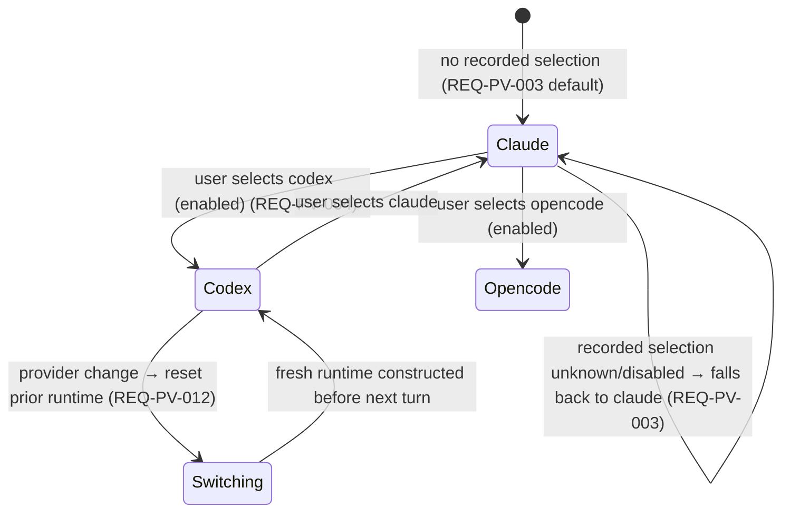
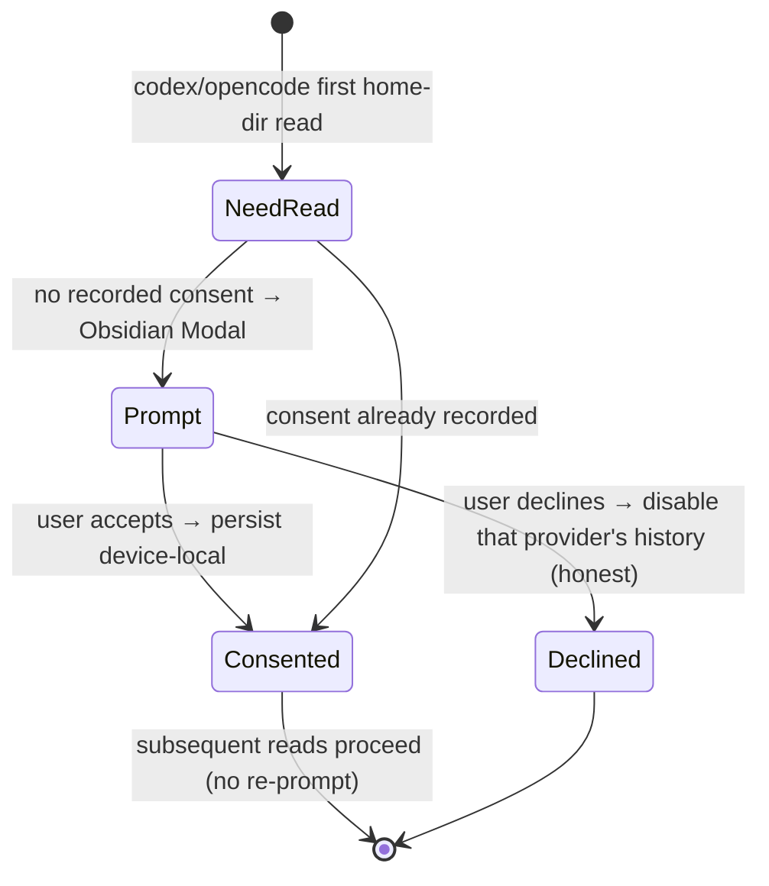

# Design — Providers registry (P9, the LARGEST phase)

> Three parts. **A — UX** (the provider selection/switch flow + states: active / switching /
> no-key-or-unavailable→honest gate, the per-provider model/thinking/service-tier lists, the secret-entry
> + beyond-vault consent flows, keyboard + a11y). **B — UI** (the Vue inventory — a provider
> selector/switcher + the per-provider model picker incl. the `opencode-model-picker`, co-located
> `data-testid` PageObjects, the `--sp-*` slice, en+de microcopy, no `v-html`; a MINIMAL selection surface
> — the full per-provider settings UX is P10). **C — Architecture** (system overview; the
> `ProviderRegistryPort` + the data-driven routing seam; the `SecretStorePort` + `HomeFsPort` + the
> ACP/Codex transports; the per-provider capability descriptors; the three-bridge story; the
> externals/dependency decision; data flow; DDD placement + narrow-port discipline; the security
> analysis; the ADR-PV list). The seven CLARs resolve as **ADR-PV-001..003** (accepted, autonomous-drive).

This phase layers on the **merged P1–P8 surface**. The chat runtime is already provider-agnostic — the
P1 `ChatRuntimePort` carries `readonly providerId`, `getCapabilities(): RuntimeCapabilities`, and
`getToolbarCapabilities(): ToolbarCapabilities` (`ports/ChatRuntimePort.ts:78/97/119`), and the runtime
is constructed by per-mount bridge factories: the per-tab `CHAT_RUNTIME_FACTORY` modal-seam handle
(`modalSeam.ts:46`, `() => bridge.createChatRuntime()`), the `PROVIDER_HISTORY_PORT`
(`bridge.createProviderHistoryPort()`), and the P6 `ToolbarCatalogPort.getCatalog(providerId)`. P9 grows
**four seams on top**, additively:

1. **A `ProviderRegistryPort`** (ADR-PV-001) that lists/enables/orders/resolves providers from **plain
   descriptor data** + the frozen per-provider capability bag, and routes a turn to the active provider's
   runtime/capabilities/catalog/history — **no `switch (providerId)`** (NFR-PV-014). The per-tab factory
   widens to `(providerId) => Result<ChatRuntimePort>`.
2. **The Codex provider** over the app-server **JSON-RPC-over-stdio** transport with **JSONL** history
   reads (ADR-PV-003), capability-gated (backed: streaming, sessions/history, models, modes, thinking,
   turn-steer, fork; gated off: rewind, provider-commands, MCP).
3. **The Opencode provider** over the shared **ACP** JSON-RPC transport with its modes/models/agents
   (ADR-PV-003), capability-gated (backed: streaming, sessions/history, models, modes, provider-commands;
   gated off: rewind, fork, turn-steer, MCP).
4. **`SecretStorePort`** (ADR-PV-002, native secret storage) + **`HomeFsPort`** (ADR-PV-003, read-scoped,
   consented, beyond-vault) the non-Claude providers need.

**The invariant (G8, REQ-PV-006/114, NFR-PV-001):** with only Claude registered+enabled, the registry has
one entry, no provider menu renders, no secret/home-fs port is touched, and Claude routes through the
exact P1–P8 `ChatRuntimePort` path — the surface, toolbar, routing, and runtime query are
**byte-identical to P8**. **The posture (charter §6a, BINDING):** Claude is the COMPLETE default;
Codex/Opencode ship CAPABILITY-GATED and feature-incomplete is ACCEPTABLE — every gated-off feature is
honestly hidden/disabled, never built. The Vue layer never imports `obsidian`/`node:*`; the real
transports/home-fs/secret store live in coverage-excluded infra.

---

## Part A — UX

### A.0 The surfaces this layers on

P1–P8 ship a single-provider (Claude) chat surface: the tab bar, the message stream, the composer with
the P6 toolbar control strip (model / mode / permission / thinking / service-tier / MCP selectors + the
usage meter), and the P3 resume/history/fork affordances. Today every one of these is implicitly Claude.
P9 adds **(1)** a minimal provider-selection affordance (a provider chooser shown only when `> 1`
provider is enabled), **(2)** a minimal secret-entry field per key-needing provider, **(3)** a one-time
beyond-vault consent modal — and **makes the existing toolbar selectors + history affordances honest per
the active provider's capability bag**. The new surfaces render through the `opencode-model-picker` /
provider-brand `--sp-*` slice (charter §3.10). The full per-provider settings shell is P10 (NG2).

### A.1 Provider selection — states (REQ-PV-001/002/003/004/090)

The provider chooser appears in the new-thread / blank-tab affordance (Claudian's blank-tab provider
chooser) and lists only **enabled** providers in **blank-tab order** (opencode 10, codex 15, claude 20),
each with its display name + provider icon. It is **absent when only one provider is enabled**
(byte-identical P8, REQ-PV-006).

```
> 1 provider enabled (e.g. claude + codex + opencode)        Claude-only (P8 byte-identical)
┌── New thread ───────────────────────────────┐             ┌── New thread ──────────────┐
│  Provider                                    │             │  (no provider chooser)     │
│   ◯ Opencode      [opencode icon]            │             │  …the P8 composer, as-is   │
│   ◯ Codex         [codex icon]               │             └──────────────────────────────┘
│   ● Claude        [claude icon]   (default)  │
└────────────────────────────────────────────────┘
```



- **Active provider** — the resolved active provider (recorded selection if registered+enabled, else
  Claude). The active provider's brand colours the tab border (charter §3.2) and selects the toolbar's
  per-provider option lists (A.3).
- **Select + activate** (REQ-PV-004) — selecting a provider sets it active for the current thread,
  persists the selection to **device-local** settings (CHARTER-REQ-SET, never `data.json`), and the next
  turn routes to it (A.4).
- **Switching** (REQ-PV-012) — on a provider change the prior runtime's session is reset and a fresh
  runtime for the newly active provider is constructed before the next turn; an in-progress turn never
  continues on a stale provider.
- **Default / fallback** (REQ-PV-003) — no recorded selection, or an unknown/disabled recorded selection,
  resolves to Claude.

`data-testid`: `provider-chooser`, `provider-option`, `provider-option-active`, `provider-icon`.

### A.2 No-key / unavailable / missing-CLI → the honest gate (REQ-PV-072/100/103, G7)

A non-Claude provider is used **only after the user explicitly enables and selects it** — nothing
auto-enables, auto-spawns, auto-authenticates, or reads a key/transcript on a fresh install (REQ-PV-103).
When the user activates a provider that cannot run, the surface degrades honestly and stays responsive —
never an uncaught throw, never a silent no-op:

| Condition | Honest surface (REQ-PV-100) |
|---|---|
| No stored API key (provider needs one) | the secret-entry field is shown/required; the turn does not start; "API key required" |
| No resolvable provider CLI on PATH | "Codex CLI not found" (the friendly `getMissingNodeError`/CLI-resolver message); the turn does not start |
| Transport unavailable / dead | a clear notice; the chat surface stays usable |
| Native secret storage unavailable | the secret-entry surface is **disabled** with "secret storage unavailable" — **no** plain-store fallback (REQ-PV-072) |
| Non-Node bridge (demo) | Codex/Opencode degrade to "unavailable" rather than erroring (NFR-PV-012) |

A mid-turn capability miss (e.g. a still-visible path attempts a feature the active provider lacks)
surfaces a non-blocking "not supported by <provider>" notice and the session continues unchanged
(REQ-PV-025).

### A.3 Per-provider model / thinking / service-tier lists (REQ-PV-024/062/063/064)

The P6 toolbar selectors become **provider-aware** — they read the **active provider's** real catalog +
its capability bag, replacing the P6 Claude-only seam. **A capability-gated control is hidden (or
visibly disabled with an accessible reason) — never clickable-but-dead** (REQ-PV-024).

| Widget | Claude | Codex | Opencode |
|---|---|---|---|
| Model selector (REQ-PV-062) | Claude models (grouped, icon) | Codex models | Opencode models (`opencode-model-picker`) |
| Thinking selector (`reasoningControl`, REQ-PV-063) | effort | effort | effort (auto-hidden when `none`/single) |
| Service-tier toggle (REQ-PV-064) | hidden (no toggle config) | shown (`zap` fast-mode) | hidden |
| Rewind affordance (`supportsRewind`) | shown | **hidden** (false) | **hidden** (false) |
| Fork (`supportsFork`, REQ-PV-024) | shown | shown (true) | **hidden** (false) |
| Turn-steer composer (`supportsTurnSteer`, REQ-PV-033) | n/a (false) | **enabled** (true) | hidden (false) |
| Provider-commands palette (`supportsProviderCommands`) | shown | **hidden** (false) | shown (true) |
| MCP selector (`supportsMcpTools`) | shown | **hidden** (false) | **hidden** (false) |

The model selector lists the active provider's options grouped with the **provider icon**; switching the
active provider re-lists from the newly active provider's catalog. The thinking selector reflects the
provider's `reasoningControl` (`effort` for all three in P9) and auto-hides when `none`/single. The
service-tier `zap` toggle appears only where the provider configures it (Codex fast-mode).

### A.4 The turn routes to the active provider (REQ-PV-010/011/012/013)

On send, the registry yields the active provider's `ChatRuntimePort` implementation and the turn streams
through it via the **unchanged P1 turn flow**, parameterised by provider. The runtime construction
returns a `Result` — a construction failure (unregistered / uninitialised / transport unavailable) is a
non-blocking honest notice, not a throw (REQ-PV-011). Codex history hydrates from its JSONL session file;
Opencode history hydrates via ACP `loadSession` — both into the unchanged P3 history shape so
resume/history work the same across providers, subject to each provider's `supportsFork` (REQ-PV-084).

### A.5 Secret entry + beyond-vault consent (REQ-PV-070/071/072/082/092)

- **Secret entry** (REQ-PV-092) — a key-needing provider shows a **masked** input (no value echoed),
  wired to `SecretStorePort.setSecret` (native secret storage). The stored value is never rendered back
  into the DOM and never appears in a notice/log/store/DTO (REQ-PV-102). The full P10 settings shell is
  out (NG2). When native secret storage is unavailable the field is disabled with an honest message
  (REQ-PV-072, A.2).
- **Beyond-vault consent** (REQ-PV-082) — the first time a selected Codex/Opencode provider needs to read
  its home-dir transcripts (`~/.codex` / `~/.claude`), a **one-time Obsidian `Modal`** asks the user to
  consent to beyond-vault reads (never `window.confirm`, REQ-PV-113). Declining disables that provider's
  history with an honest message; consenting persists device-local so the prompt is not repeated. A
  Claude-only user never sees it (REQ-PV-114).



### A.6 Accessibility (WCAG 2.2 AA, NFR-PV-009, REQ-PV-110)

- **The provider chooser** is keyboard-operable (focus, Enter/Space to select, arrow-nav between options,
  Escape to close); it reports `aria-expanded` when it is a menu, the active provider is announced (a
  polite live region / `aria-current`), and each option has an accessible name + its provider icon
  carries an accessible label.
- **The per-provider selectors** (model / thinking / service-tier) keep the P6 `aria-expanded` + arrow-nav
  + Escape pattern; a capability-disabled control exposes a reason (`aria-disabled` + an accessible
  description), never a silent dead control (REQ-PV-024).
- **The secret field** has an associated label + accessible name; it is masked; focus is visible.
- **The consent modal** traps + restores focus, Escape closes (= decline), the accept/decline buttons are
  keyboard-operable, and the prompt text is associated with the dialog (`aria-describedby`).
- Focus is managed + visible; **forced-colors** + **reduced-motion** honoured; state cues are text +
  border + icon, never colour-only — asserted in component tests.

---

## Part B — UI

### B.1 Component inventory

Each `<script setup>`; each mounted component has a co-located `data-testid` PageObject (`.po.ts`)
(NFR-PV-006). **No component imports `obsidian` or `node:*`** — providers, capabilities, model lists,
secret-set state, and consent outcomes arrive as DTOs from the use case / view-model; the consent + the
secret-entry blocking flows open through the **modal seam** (an injected `OpenProviderConsentFn`, mirroring
the P5/P8 modal seam), so the Obsidian `Modal` host lives in the plugin layer and the Vue layer never
touches it. No `v-html` (REQ-PV-113).

| Component | Responsibility | data-testid | New/changed |
|---|---|---|---|
| `chat/providers/ProviderChooser.vue` | the minimal provider-selection surface — lists enabled providers in blank-tab order with display name + icon; active state; select → activate; absent when `≤ 1` enabled (REQ-PV-001/002/090) | `provider-chooser` | new |
| `chat/providers/ProviderOption.vue` | one provider row (icon · display name · active/default marker) (REQ-PV-090) | `provider-option` | new |
| `chat/providers/ProviderSecretField.vue` | the minimal masked secret-entry field wired to `SecretStorePort`; disabled-with-reason when unavailable (REQ-PV-092/072) | `provider-secret-field` | new |
| `chat/toolbar/ModelSelector.vue` | the P6 model selector — lists the ACTIVE provider's models (grouped, provider icon), incl. the `opencode-model-picker` shape (REQ-PV-062) | `toolbar-model` | changed |
| `chat/toolbar/ThinkingSelector.vue` | the P6 thinking selector — reflects the active provider's `reasoningControl`; auto-hidden on `none`/single (REQ-PV-063) | `toolbar-thinking` | changed |
| `chat/toolbar/ServiceTierToggle.vue` | the P6 service-tier toggle — shown only where the provider configures it (Codex fast-mode) (REQ-PV-064) | `toolbar-service-tier` | changed (gated) |
| (the rewind / fork / steer / MCP / provider-command affordances) | gated on the active provider's capability bag — hidden/disabled per A.3 (REQ-PV-024/034/043) | (existing testids) | changed (capability-gated) |

> The model/thinking/service-tier components were introduced in P6; P9 **changes them to read the active
> provider's catalog + capabilities** (via the view-model + the registry), not to branch on `providerId`.
> The rewind/fork/steer/MCP affordances are gated by the existing capability flags they already read —
> P9 supplies the per-provider flags, so the gating "just works" (REQ-PV-013).

The consent + secret-entry blocking flows keep the DOM rules (REQ-PV-113): the consent modal is an
Obsidian `Modal` subclass hosted in the plugin layer (the modal seam target); the Vue components inside
build DOM declaratively (no `innerHTML`/`v-html`, no `window.confirm`/`prompt`).

### B.2 `--sp-*` token slice (charter §3.10 `opencode-model-picker` + provider-brand)

Reuse the existing token set (`--sp-border`, `--sp-radius-*`, `--sp-bg-*`, `--sp-surface-overlay`,
`--sp-text-*`, `--sp-accent`, `--sp-space-*`, `--sp-font-*`, the P6 selector `--sp-toolbar-widget-h`,
`--sp-z-dropdown`, `--sp-shadow-dropup`). **No hex, no raw Obsidian var, no physical-direction CSS
property** — the AUX `lint-style-tokens` guard (NFR-PV-010, REQ-PV-091). Mint only genuinely-new tokens,
each justified at review against a Claudian `opencode-model-picker.css` / provider-brand rule:

| New token (only if not already present) | Surface | Maps to Claudian |
|---|---|---|
| `--sp-provider-brand-claude` | the claude tab border / chooser accent | the claude provider brand (reuse `--sp-accent` if equivalent) |
| `--sp-provider-brand-codex` | the codex tab border / chooser accent | the codex provider brand (charter §3.2 brand border) |
| `--sp-provider-brand-opencode` | the opencode tab border / chooser accent | the opencode provider brand |
| `--sp-model-picker-group-gap` | the per-provider model picker group spacing | `opencode-model-picker.css` group spacing (reuse `--sp-space-2` if equivalent) |

> Prefer reuse over a near-duplicate; each minted token is checked against an `opencode-model-picker.css`
> / provider-brand rule at review (NFR-PV-010). Perceptual parity at 320/520/720, light + dark (B.4).

### B.3 Microcopy / i18n (en + de, charter §3.9 i18n; full 10-locale = P11/NG7)

All new strings go through the existing `TranslationPort` / `vue-i18n` with English + German keys. New
keys (no secret/transcript value ever interpolated into a string — REQ-PV-102):

| Key | en |
|---|---|
| `agent.chat.providers.chooser.title` | "Provider" |
| `agent.chat.providers.chooser.active` | "Active" |
| `agent.chat.providers.chooser.default` | "Default" |
| `agent.chat.providers.name.claude` | "Claude" |
| `agent.chat.providers.name.codex` | "Codex" |
| `agent.chat.providers.name.opencode` | "Opencode" |
| `agent.chat.providers.secret.label` | "API key" |
| `agent.chat.providers.secret.placeholder` | "Enter your API key" |
| `agent.chat.providers.secret.unavailable` | "Secret storage is unavailable on this device." |
| `agent.chat.providers.notice.keyRequired` | "An API key is required for {provider}." |
| `agent.chat.providers.notice.cliNotFound` | "The {provider} CLI was not found." |
| `agent.chat.providers.notice.unavailable` | "{provider} is unavailable right now." |
| `agent.chat.providers.notice.unsupported` | "{feature} is not supported by {provider}." |
| `agent.chat.providers.consent.title` | "Allow reading {provider} history?" |
| `agent.chat.providers.consent.body` | "{provider} stores its conversation history outside your vault ({root}). Allow Specorator to read it?" |
| `agent.chat.providers.consent.allow` | "Allow" |
| `agent.chat.providers.consent.decline` | "Not now" |
| `agent.chat.providers.consent.declined` | "{provider} history stays disabled." |

No hardcoded user-facing string in any new/changed component; no secret/transcript value appears in any
notice or log (NFR-PV-002, REQ-PV-102).

### B.4 Parity-screenshot plan (deferred to the single final review gate)

Per charter §5.1, parity screenshots vs claudian at **320 / 520 / 720 px, light + dark**: (1) the provider
chooser with three providers in blank-tab order, (2) the per-provider model picker (incl. the
`opencode-model-picker` shape) for each provider, (3) the toolbar with Codex active (no rewind / no MCP /
no provider-commands, service-tier shown) and with Opencode active (no rewind / fork / steer / MCP), (4)
the masked secret field + the unavailable-storage disabled state, (5) the beyond-vault consent modal, (6)
the Claude-only byte-identical state (no chooser). These accumulate for the single final human review gate
(autonomous-drive directive).

---

## Part C — Architecture

### C.1 System overview

```mermaid
flowchart TD
    subgraph ui[ui (Vue, no obsidian/node)]
        chooser[ProviderChooser.vue + ProviderOption.vue]
        secret[ProviderSecretField.vue]
        toolbar[ModelSelector / ThinkingSelector / ServiceTierToggle — provider-aware]
        surface[ChatSurface + tabsStore — owns the active provider per tab]
    end
    subgraph app[application]
        sel[SelectProviderUseCase — resolve active, persist device-local, reset+rebuild runtime]
        vm[buildProviderViewModel — pure: enabled list, order, active, per-provider widgets]
        gate[capability gate — reads RuntimeCapabilities + ToolbarCapabilities + descriptor bag]
    end
    subgraph domain[domain]
        regport[ProviderRegistryPort — list/enable/order/resolve + getCapabilities]
        desc[ProviderDescriptor table — id · displayName · blankTabOrder · capabilities · isEnabled · ownsModel]
        pid[ProviderId = 'claude' | 'codex' | 'opencode' — additive widen]
        runport[ChatRuntimePort (P1, UNCHANGED) — providerId/getCapabilities/getToolbarCapabilities]
        histport[ProviderHistoryPort (P3, UNCHANGED) — provider-addressed]
        catport[ToolbarCatalogPort (P6) — getCatalog(providerId)]
        secport[SecretStorePort — get/set/delete/listKeys, Result]
        homeport[HomeFsPort — readFile/exists/listFolders, read-scoped, Result]
    end
    subgraph plugin[plugin / infrastructure (owns obsidian + node + transports)]
        registry[ProviderRegistry (infra) — constructs runtimes from descriptors]
        codextx[CodexAppServerProcess + CodexRpcTransport — coverage-excluded]
        acptx[AcpSubprocess + AcpJsonRpcTransport — coverage-excluded]
        bridges[ObsidianBridge real / MockBridge scriptable / LocalStorageBridge inert]
        consent[Obsidian Modal — beyond-vault consent host]
    end
    chooser --> vm
    chooser -->|select| sel
    secret --> secport
    toolbar --> vm
    toolbar --> gate
    sel --> regport
    sel -->|"(providerId) => Result<runtime>"| registry
    vm --> regport
    gate --> runport
    regport --> desc
    registry --> runport
    registry --> codextx
    registry --> acptx
    registry -->|reads key into env| secport
    codextx -->|JSONL via| homeport
    acptx -->|loadSession| histport
    homeport -.->|first read| consent
    secport --> bridges
    homeport --> bridges
    registry --> bridges
```

### C.2 Components & responsibilities

| Layer | Component | Responsibility | New/changed |
|---|---|---|---|
| domain | `chat/ProviderId.ts` | widen the union `'claude' \| 'codex' \| 'opencode'` (REQ-PV-005) | changed (additive) |
| domain | `chat/providers/ProviderDescriptor.ts` | `ProviderDescriptor` (`id` · `displayName` · `blankTabOrder` · `capabilities: ProviderCapabilities` · `isEnabled(settings)` · `ownsModel(model)`) + `ProviderCapabilities` (the frozen bag — REQ-PV-020) + the three frozen descriptors (REQ-PV-021/022/023) + `DEFAULT_CHAT_PROVIDER_ID = 'claude'` | new |
| domain | `chat/providers/resolveProvider.ts` | PURE: `listEnabledProviders(descriptors, settings)` (filter+blankTabOrder sort), `resolveActiveProvider(settings)`, `resolveProviderForModel(model, settings)` (REQ-PV-002/003/060/061) | new |
| domain | `ports/ProviderRegistryPort.ts` | the registry read surface (list/enable/order/resolve + `getCapabilities`/`getDisplayName`) over the descriptor table (ADR-PV-001 §1) | new |
| domain | `ports/SecretStorePort.ts` | `isAvailable`/`getSecret`/`setSecret`/`deleteSecret`/`listKeys`, `Result`-typed (ADR-PV-002) | new |
| domain | `ports/HomeFsPort.ts` | `isAvailable`/`readFile`/`exists`/`listFolders`, read-scoped to declared roots, `Result`-typed (ADR-PV-003 §1) | new |
| application | `chat/providers/SelectProviderUseCase.ts` | resolve+activate a provider, persist the selection device-local (SettingsPort), reset the prior runtime + construct the active one via the widened factory (`Result`) (ADR-PV-001 §2/§3, REQ-PV-004/010/011/012) | new |
| application | `chat/providers/buildProviderViewModel.ts` | PURE: the chooser + per-provider-widget VM (enabled list, order, active, which widgets are shown/gated from the capability bag) (ADR-PV-001 §4, REQ-PV-013/024) | new |
| application | `chat/providers/ProviderConsentGate.ts` | the one-time beyond-vault consent check (read/record device-local; open the modal seam on first need) (ADR-PV-003 §2, REQ-PV-082) | new |
| ui | `chat/providers/ProviderChooser.vue` + `ProviderOption.vue` + `ProviderSecretField.vue` | the minimal selection + secret surfaces (B.1) | new |
| ui | `chat/toolbar/{ModelSelector,ThinkingSelector,ServiceTierToggle}.vue` | provider-aware option lists + capability-gated visibility (B.1, A.3) | changed |
| ui | `composables/useProviderRegistryPort.ts` + `useSecretStorePort.ts` + `useHomeFsPort.ts` | inject `PROVIDER_REGISTRY_PORT` / `SECRET_STORE_PORT` / `HOME_FS_PORT` (one-port-one-composable, ADR-008) | new |
| ui | `chat/modalSeam.ts` | widen `CHAT_RUNTIME_FACTORY` to `(providerId) => Result<ChatRuntimePort>`; add `OPEN_PROVIDER_CONSENT` (ADR-PV-001 §2, ADR-PV-003 §2) | changed (additive) |
| infrastructure | `providers/ProviderRegistry.ts` (infra) | constructs the per-provider runtime from the descriptor (Claude CLI / Codex JSON-RPC / Opencode ACP); reads the key via `SecretStorePort` into the subprocess env; returns `Result` (ADR-PV-001 §2, ADR-PV-003 §5) | new |
| infrastructure | `obsidian/providers/codex/*` + `obsidian/providers/acp/*` | the **coverage-excluded** Codex app-server JSON-RPC + shared ACP transports (timeout/abort/error-chunk; bounded spawn; SIGTERM→SIGKILL) (ADR-PV-003 §5, REQ-PV-030..035/040..044/050..052) | new |
| infrastructure | three bridges | implement `SecretStorePort` (Obsidian `app.secretStorage` coverage-excluded / Mock+LS in-memory) + `HomeFsPort` (Obsidian `node:fs` coverage-excluded / Mock+LS inert) + the scriptable Mock transport; widen the runtime/history/catalog factories by `providerId` (ADR-PV-001/002/003) | changed |
| infrastructure | `bridge/ports.ts` | add `PROVIDER_REGISTRY_PORT` + `SECRET_STORE_PORT` + `HOME_FS_PORT` InjectionKeys | changed (additive) |
| plugin | the Obsidian `Modal` host | host the beyond-vault consent modal (the modal seam target) | new |

### C.3 The data-driven routing seam (ADR-PV-001) — no `switch (providerId)`

The seam is **descriptor data + the capability bag + the existing per-provider-addressed ports**, never a
branch. The runtime is resolved through the per-tab factory, widened additively:

```ts
// src/ui/chat/modalSeam.ts — WIDENED (ADR-PV-001 §2). P0–P8 sites pass `'claude'`; a Claude-only
// configuration constructs the same runtime as P8 (NFR-PV-001). Was `() => ChatRuntimePort`.
export type ChatRuntimeFactory = (providerId: ProviderId) => Result<ChatRuntimePort>;

// src/domain/ports/ProviderRegistryPort.ts — new (ADR-PV-001 §1). Pure data reads; no I/O.
export interface ProviderRegistryPort {
  listRegisteredProviders(): readonly ProviderDescriptor[];
  listEnabledProviders(settings: PluginSettings): readonly ProviderDescriptor[]; // filter+blankTabOrder sort
  getDescriptor(id: ProviderId): ProviderDescriptor;
  getDisplayName(id: ProviderId): string;
  getCapabilities(id: ProviderId): ProviderCapabilities;        // the frozen bag (REQ-PV-020..023)
  resolveActiveProvider(settings: PluginSettings): ProviderId;  // recorded if registered+enabled, else claude
  resolveProviderForModel(model: string, settings: PluginSettings): ProviderId; // ownsModel, else fallback
}
```

- **Selection is data** (REQ-PV-001/002/013): the chooser + the toolbar read `listEnabledProviders` /
  `getCapabilities` and render from the returned descriptors; there is no `if (provider === …)` in the
  consuming use case or component (NFR-PV-014, lint-checkable).
- **Routing is the existing seams parameterised by provider** (REQ-PV-010/062/084): the widened
  `CHAT_RUNTIME_FACTORY(providerId)`, `createProviderHistoryPort(providerId)`, and
  `ToolbarCatalogPort.getCatalog(providerId)` each hand back the active provider's
  runtime/history/catalog; the **`ChatRuntimePort`/`ProviderHistoryPort` contracts are byte-identical**
  to P1/P3.
- **Capability-gating is the bag** (REQ-PV-013/024): the rewind/fork/steer/MCP/provider-command/
  service-tier decisions read the active runtime's `getCapabilities()`/`getToolbarCapabilities()` + the
  registry's `getCapabilities(id)` — the frozen per-provider values (C.4) decide.
- **The model→provider auto-select** (REQ-PV-060/061): `resolveProviderForModel` returns the first
  descriptor whose `ownsModel(model)` is true, else the active/Claude fallback; selecting a Codex-owned
  model auto-switches the active provider to Codex.

### C.4 The per-provider capability descriptors (the frozen matrix — REQ-PV-020..023)

The descriptor table is the single source of capability truth (regrown 1:1 from claudian-main's frozen
`providers/{claude,codex,opencode}/capabilities.ts`). **BACKED** = wired in P9; **GATED OFF** = honestly
reported false, not built (charter §6a posture, CLAR-PV-005):

| Flag | Claude (complete) | Codex | Opencode |
|---|---|---|---|
| `supportsPersistentRuntime` | true | true (BACKED) | true (BACKED) |
| `supportsNativeHistory` | true | true (BACKED — JSONL) | true (BACKED — ACP loadSession) |
| `supportsPlanMode` | true | true (BACKED) | true (BACKED) |
| `supportsRewind` | true | **false (GATED OFF)** | **false (GATED OFF)** |
| `supportsFork` | true | true (BACKED) | **false (GATED OFF)** |
| `supportsProviderCommands` | true | **false (GATED OFF)** | true (BACKED) |
| `supportsImageAttachments` | true | true | true |
| `supportsInstructionMode` | true | true | true |
| `supportsMcpTools` | true | **false (GATED OFF — CLI-managed)** | **false (GATED OFF)** |
| `supportsTurnSteer` | false | true (BACKED) | **false (GATED OFF)** |
| `reasoningControl` | effort | effort | effort |
| service-tier toggle | — | `zap` fast-mode (BACKED) | — |
| `blankTabOrder` | 20 | 15 | 10 |

> The flags drive the UI (A.3); there is no `switch (providerId)`. The gated-off capabilities are
> honestly hidden/disabled (REQ-PV-024/034/043) — Codex shows no rewind/provider-commands/MCP; Opencode
> shows no rewind/fork/steer/MCP — and they are explicitly **not built** in P9 (NG1).

### C.5 The three new ports + the transports + the three-bridge story

**`ProviderRegistryPort` (domain, ADR-PV-001).** Pure data reads over the descriptor table; its own
`PROVIDER_REGISTRY_PORT` InjectionKey + composable, one consumer, no aggregate. The descriptor table is a
load-or-default constant; the **registry object that constructs runtimes is infrastructure** (it spawns
subprocesses), reached via the widened `CHAT_RUNTIME_FACTORY`. The pure resolve helpers carry the
automated coverage.

**`SecretStorePort` (domain, ADR-PV-002).** `isAvailable`/`getSecret`/`setSecret`/`deleteSecret`/
`listKeys`, all `Result`-typed (`listKeys` returns keys, never values). Own `SECRET_STORE_PORT` key +
composable, one consumer, no aggregate. Read only at the infra boundary into the subprocess env
(REQ-PV-071); never in the UI/store/DTO.

**`HomeFsPort` (domain, ADR-PV-003).** Read-first (`isAvailable`/`readFile`/`exists`/`listFolders`),
rooted at `os.homedir()`, scoped to `~/.codex`/`~/.claude`, `Result`-typed, **no write/delete in P9**.
Own `HOME_FS_PORT` key + composable, one consumer, no aggregate.

**The transports (coverage-excluded infra behind the registry, ADR-PV-003 §5).** The Codex app-server
JSON-RPC-over-stdio transport (`CodexAppServerProcess`/`CodexRpcTransport`) and the shared ACP
line-delimited JSON-RPC-2.0-over-stdio transport (`AcpSubprocess`/`AcpJsonRpcTransport`). Each carries a
request timeout + abort (→ `Result.err`, REQ-PV-051), never throws out of a stream (a dying subprocess →
a terminal error `StreamChunk` with the stderr ring-buffer, REQ-PV-052), spawns explicit cmd+args + a
bounded merged env + enhanced PATH + `windowsHide` (no shell-eval; Windows `.cmd` quoting,
REQ-PV-031/101), and shuts down gracefully on cancel/reset (SIGTERM→SIGKILL, REQ-PV-035/044).

| Port / transport | `ObsidianBridge` | `MockBridge` | `LocalStorageBridge` |
|---|---|---|---|
| `ProviderRegistryPort` | the descriptor table (constant) | the descriptor table (constant) | the descriptor table (constant) |
| runtime construction (`CHAT_RUNTIME_FACTORY`) | Claude CLI / Codex JSON-RPC / Opencode ACP (real, the transports coverage-excluded) | **scriptable** Mock runtime + scriptable transport per provider (canned stream); `Result.ok` | inert — non-Claude `Result.err` "unavailable" (NFR-PV-012) |
| `SecretStorePort` | `app.secretStorage` (coverage-excluded, REQ-PV-070) | **in-memory** map (cleared per session, REQ-PV-073) | **in-memory** map (no real secret) |
| `HomeFsPort` | `node:fs` rooted at `os.homedir()`, scoped (coverage-excluded, REQ-PV-080) | **inert/in-memory** fixtures (no `node:fs`, REQ-PV-083) | **inert** (empty/absent) |
| `ProviderHistoryPort` (P3, per provider) | Claude vault / Codex JSONL (via HomeFsPort) / Opencode ACP | scriptable in-memory store per provider | inert |

`fake-ports.ts` grows a `providerRegistry` (descriptor table), a `secretStore` (in-memory, availability
switch), a `homeFs` (inert/seedable), and a scriptable provider transport (per-provider canned
stream/timeout/error-chunk) so the registry/routing/capability/history/secret logic runs without Obsidian
/ Node / a subprocess (REQ-PV-053/073/083/111).

### C.6 The externals / dependency decision (ADR-PV-003 §5)

P9's default is **no new runtime dependency** for the transports: the Codex JSON-RPC client and the ACP
JSON-RPC client are thin in-tree line-delimited-JSON-RPC-2.0-over-stdio implementations (mirroring
Claudian's hand-written `CodexRpcTransport`/`AcpJsonRpcTransport`), consistent with the project's
narrow-transport posture and avoiding a new supply-chain surface. **If** a provider integration genuinely
requires a vendor SDK at implementation, it is externalized + bundled into the plugin `main.js` exactly
like `@modelcontextprotocol/sdk` (ADR-MC-002) and `@anthropic-ai/claude-agent-sdk` — covered by the
existing plugin-build externals (`vite.config.ts` `ALL_EXTERNALS` = `OBSIDIAN_EXTERNALS` +
`builtinModules` + `node:` forms) — and the **standalone `build:web` build never sees it** (the real
transports live only in `src/infrastructure/obsidian/**`, which the standalone `MockBridge` entry
(`src/ui/main.ts`) never imports), with the rationale recorded in the implementing PR per AGENTS.md §8.
`manifest.json` identity is untouched (NFR-PV-011) pending only the `app.secretStorage` `minAppVersion`
check (C.8).

### C.7 Data flow — primary scenarios

1. **Load (Claude-only):** the registry has one enabled descriptor → no chooser renders →
   `resolveActiveProvider → claude` → `CHAT_RUNTIME_FACTORY('claude')` returns the same runtime as P8 →
   the surface/toolbar/query are byte-identical to P8 (REQ-PV-006/114, NFR-PV-001).
2. **Enable + select a non-Claude provider:** the user enables codex (settings) + selects it →
   `SelectProviderUseCase` persists the selection device-local → resets the prior runtime →
   `CHAT_RUNTIME_FACTORY('codex')` constructs the Codex runtime (`Result`); a no-key/no-CLI →
   `Result.err` → an honest notice, the chat stays usable (REQ-PV-004/011/012/100).
3. **Secret entry:** `ProviderSecretField` → `SecretStorePort.setSecret(key, value)` → native secret
   storage; a `data.json`/device-local read contains no secret (REQ-PV-070/102); unavailable → disabled
   field, no plain-store fallback (REQ-PV-072).
4. **Send a turn:** the registry yields the active provider's `ChatRuntimePort` → the unchanged P1 turn
   flow streams through it; the Codex/Opencode runtime reads its key via `SecretStorePort` into the
   subprocess env at the infra boundary (REQ-PV-010/071/101).
5. **Model→provider auto-select:** the user picks a Codex-owned model →
   `resolveProviderForModel → codex` → the active provider switches to codex (REQ-PV-060); an unowned
   model → the active/Claude fallback (REQ-PV-061).
6. **Per-provider toolbar:** `buildProviderViewModel` reads `getCapabilities(active)` +
   `getToolbarCapabilities()` + `getCatalog(active)` → the model/thinking/service-tier lists + the
   rewind/fork/steer/MCP/provider-command gating render honestly (REQ-PV-013/024/062/063/064).
7. **Codex history:** hydrate → read the JSONL session file under the Codex sessions root via `HomeFsPort`
   (first read → the consent gate) → parse into the unchanged P3 history shape → resume (REQ-PV-032/082/084).
8. **Opencode history:** hydrate → ACP `loadSession`/`listSessions` → map into the P3 history shape →
   resume; fork is **not** offered (`supportsFork:false`, REQ-PV-042/043/084).
9. **Capability miss / dead transport:** a still-visible unsupported path → a "not supported by
   <provider>" notice, session continues (REQ-PV-025); a timed-out request → `Result.err` (REQ-PV-051); a
   dying subprocess → a terminal error `StreamChunk`, host responsive (REQ-PV-052).

### C.8 Security analysis (NFR-PV-002/003/004/005/013, REQ-PV-070..072/080..083/100..103)

- **Secrets in native storage only** (REQ-PV-070/071/072/102, NFR-PV-002) — a provider key persists only
  to `app.secretStorage` via `SecretStorePort`, read at the infra boundary into the subprocess env, never
  in `data.json`/device-local/notice/log/Pinia store/DTO; a key-involved failure reports the failure with
  no key substring; unavailable storage → a disabled surface, no plain-store fallback (ADR-PV-002).
- **Beyond-vault scoped + consented + read-only** (REQ-PV-080/081/082/083, NFR-PV-003) — `HomeFsPort`
  reads only the declared roots (`~/.codex`/`~/.claude`); a path escaping a root → `Result.err`; no
  write/delete beyond the vault in P9; first read is consented via an Obsidian `Modal` (device-local
  consent record); inert on the demo bridges (no `node:fs`).
- **Bounded explicit spawn** (REQ-PV-101, NFR-PV-004) — the Codex/Opencode subprocesses spawn with
  explicit cmd+args + `{ ...process.env, <secret/env>, PATH: enhancedPath }` + `windowsHide`, no
  `shell:true`/string-eval of user input; Windows `.cmd` quoting (REQ-PV-031).
- **Transports never crash the host** (REQ-PV-051/052/100, NFR-PV-005) — timeout/abort → `Result.err`; a
  dying subprocess → a terminal error `StreamChunk`; no uncaught throw across a port boundary; a
  missing-key/dead-transport/missing-CLI degrades to an honest message.
- **Capability-gated never silently fails** (REQ-PV-024/025, NFR-PV-014) — a false capability hides or
  disables-with-reason the affordance; a mid-turn miss surfaces an honest notice and continues.
- **Explicit-enable-only** (REQ-PV-103) — no auto-enable/auto-select/auto-spawn/auto-auth/auto-read; a
  fresh install (Claude default) spawns nothing, reads no key, touches no home dir.
- **Privacy** (NFR-PV-013) — no telemetry; a secret/transcript goes nowhere except the provider CLI the
  user configured; beyond-vault reads stay local.
- **minAppVersion verdict (CLAR-PV-004, ADR-PV-002 Compliance):** keep `minAppVersion 1.12.7` +
  capability-gate (REQ-PV-072); the dev verifies `app.secretStorage` availability at 1.12.7 at
  implementation and **escalates — does not silently bump** — if it provably requires a newer Obsidian
  (NFR-PV-011).

### C.9 QA seam, Result boundary, constraints

- **QA seam:** the pure `resolveProvider` helpers (list/enable/order/resolve), `buildProviderViewModel`,
  and the descriptor table (domain, no I/O) + the `SelectProviderUseCase`/`ProviderConsentGate` (over the
  scriptable fake ports) + the provider-aware leaf components (props in, events out) are testable in
  isolation; mounted components get co-located `data-testid` PageObjects (NFR-PV-006); the
  registry/routing/capability/history/secret/transport matrices are driven by the scriptable Mock
  (REQ-PV-053).
- **Result boundary:** the registry-runtime construction, every `SecretStorePort`/`HomeFsPort`/transport
  method, and the history paths return `Result` (or stream an error `StreamChunk`); no exception crosses a
  port boundary (NFR-PV-005, ADR-004).
- **DOM rules:** the chooser, secret field, and provider-aware selectors are declarative Vue — no
  `v-html`/`innerHTML`, no `window.confirm`/`alert`/`prompt`; the beyond-vault consent uses the Obsidian
  `Modal` seam (NFR-PV-008, REQ-PV-113).
- **Dependency / coverage:** P9 adds no new runtime dep by default (C.6); the real transports +
  `HomeFsPort` + `SecretStorePort` are coverage-excluded `obsidian/**`; the suite meets 80/70/80/80 on the
  Mock-driven legs (NFR-PV-007, REQ-PV-111).
- **Identity / manifest:** `manifest.json` identity untouched (NFR-PV-011, pending the secretStorage
  check); no migration (CHARTER-REQ-FRESH); the selection persists device-local (CHARTER-REQ-SET);
  secrets in native storage.
- **Narrow-port discipline:** `ProviderRegistryPort` + `SecretStorePort` + `HomeFsPort` each have their
  own InjectionKey + composable, one consumer each, no aggregate; ESLint forbids Vue importing
  `obsidian`/`node:*` + any re-introduced `IBridge`/`usePorts` (NFR-PV-006, REQ-PV-112).

### C.10 ADR-PV list (status accepted)

| ADR | Decision | Ratifies | Status |
|---|---|---|---|
| **ADR-PV-001** | `ProviderRegistryPort` (data-driven list/enable/order/resolve over frozen `ProviderDescriptor`s + the capability bag) + the existing `ChatRuntimePort`/`ProviderHistoryPort`/`ToolbarCatalogPort` seams parameterised by provider (the per-tab `CHAT_RUNTIME_FACTORY` widens to `(providerId) => Result<ChatRuntimePort>`); capability-flag-gated UI, NEVER `switch(providerId)`; additive — Claude-only = byte-identical P8; routed-aux stays Claude in P9 | CLAR-PV-001 + CLAR-PV-005 + CLAR-PV-007 | accepted |
| **ADR-PV-002** | `SecretStorePort` (`isAvailable`/`get`/`set`/`delete`/`listKeys`, `Result`) → `app.secretStorage` (coverage-excluded), in-memory on Mock/LS, read only at the infra boundary into the subprocess env — NEVER `data.json`/device-local/notice/log/store/DTO; capability-gate when unavailable (no plain-store fallback); `minAppVersion` check escalated-not-bumped | CLAR-PV-003 + CLAR-PV-004 + CLAR-PV-006 | accepted |
| **ADR-PV-003** | read-first, root-scoped, consented `HomeFsPort` (`Result`, no write/delete in P9, one-time Obsidian-`Modal` consent, inert on demo); history plugs into the UNCHANGED P3 `ProviderHistoryPort`; the Codex JSON-RPC + shared ACP transports live coverage-excluded behind the registry's runtime construction (timeout/abort/error-chunk, bounded spawn, SIGTERM→SIGKILL, Mock scriptable), no new SDK dep by default (externalize like `@modelcontextprotocol/sdk` if ever required) | CLAR-PV-002 (+ the ACP/Codex transport note) | accepted |

---

## Requirements coverage (Part C)

| REQ | Covered by |
|---|---|
| REQ-PV-001/002 | `ProviderRegistryPort.listRegisteredProviders`/`listEnabledProviders` (filter+blankTabOrder sort) over the descriptor table (ADR-PV-001 §1, C.3/C.5) |
| REQ-PV-003 | `resolveActiveProvider` (recorded-if-enabled, else claude fallback) (ADR-PV-001 §1, C.3) |
| REQ-PV-004/012 | `SelectProviderUseCase` (persist device-local + reset+rebuild runtime) (ADR-PV-001 §2/§3, C.2/A.1) |
| REQ-PV-005 | widen `ProviderId` to the three-id union (additive) (C.2) |
| REQ-PV-006/114 | Claude-only = byte-identical P8 (one-entry registry, no chooser, same runtime path) (ADR-PV-001, C.7) |
| REQ-PV-010/011 | the widened `CHAT_RUNTIME_FACTORY(providerId) → Result<runtime>` (ADR-PV-001 §2, C.3) |
| REQ-PV-013/024 | capability-flag gating via `buildProviderViewModel` + the bag, no `switch(id)` (ADR-PV-001 §4, C.3/C.4/A.3) |
| REQ-PV-020..023 | the frozen `ProviderDescriptor` capability bag (claude all / codex / opencode) (C.4) |
| REQ-PV-025 | the mid-turn "not supported by <provider>" honest notice (A.2, C.7) |
| REQ-PV-030..035 | the Codex app-server JSON-RPC transport + JSONL history + turn-steer + graceful shutdown (coverage-excluded) (ADR-PV-003 §5, C.5) |
| REQ-PV-040..044 | the Opencode ACP transport + modes/models/agents + ACP history + gated rewind/fork/steer/MCP + graceful shutdown (ADR-PV-003 §5, C.5) |
| REQ-PV-050..053 | the line-delimited JSON-RPC 2.0 ACP/Codex transports (timeout/abort/error-chunk) + the scriptable Mock (ADR-PV-003 §5, C.5/C.8) |
| REQ-PV-060/061 | `resolveProviderForModel` (ownsModel → owning provider, else fallback) (ADR-PV-001 §1, C.3) |
| REQ-PV-062/063/064 | the provider-aware P6 model/thinking/service-tier selectors via `ToolbarCatalogPort.getCatalog(active)` + the bag (C.3/A.3, B.1) |
| REQ-PV-070..073 | `SecretStorePort` → `app.secretStorage` / in-memory demo / capability-gate / infra-boundary read (ADR-PV-002, C.5/C.8) |
| REQ-PV-080..084 | `HomeFsPort` (read-scoped/consented/inert) + history into the unchanged P3 `ProviderHistoryPort` (ADR-PV-003, C.5/C.7/C.8) |
| REQ-PV-090/091/092 | the minimal `ProviderChooser` + the `--sp-*` `opencode-model-picker` slice + the masked secret field (B.1/B.2, A.1/A.5) |
| REQ-PV-100..103 | degrade-never-crash + bounded explicit spawn + no secret leak + explicit-enable-only (C.8, A.2) |
| REQ-PV-110 | keyboard-operable chooser/selectors/secret/consent + AT names (A.6) |
| REQ-PV-111 | real transports + home-fs + secret store coverage-excluded `obsidian/**`; Mock scriptable + LS inert (C.5, ADR-PV-002/003) |
| REQ-PV-112 | narrow ports (registry/secret/home-fs), own keys/composables, no aggregate; no Vue `obsidian`/`node:*` (C.2/C.9) |
| REQ-PV-113 | no `v-html`/`innerHTML`/`window.confirm`; the consent flow via an Obsidian `Modal` (B.1, C.9) |
| NFR-PV-001..014 | additivity (C.3/C.7), security secrets/beyond-vault/spawn (C.8), reliability/`Result` (C.8/C.9), DDD/ports (C.2/C.5/C.9), coverage (C.5/C.9), DOM (C.9/B.1), a11y (A.6), tokens (B.2), manifest/minAppVersion (C.6/C.8), desktop-only (C.5), privacy (C.8), registry-maintainability/no-switch (C.3/C.4) |

## Open clarifications for the planner (Tasks)

- **None blocking.** All seven CLARs resolve (ADR-PV-001..003 accepted). Implementation notes to carry
  into `spec.md`/`tasks.md` (spec-level field detail, not architecture):
  - **Sequence the pure domain first** — widen `ProviderId`, then the frozen `ProviderDescriptor` table +
    `ProviderCapabilities` + the pure `resolveProvider` helpers + `buildProviderViewModel` — so the
    registry port + use cases + UI build on frozen types. Then the three ports + the three bridges
    (in-memory secret/home-fs + the scriptable transport) + the widened factory. Then the
    `SelectProviderUseCase` + the provider-aware toolbar + the chooser/secret UI. The real Codex JSON-RPC
    + ACP transports + the real `SecretStorePort`/`HomeFsPort` (coverage-excluded) are the final
    manual-leg tasks (TEST-PV-M1/M2/M3).
  - **The widened `CHAT_RUNTIME_FACTORY` signature** — pin `(providerId: ProviderId) => Result<ChatRuntimePort>`
    and that every P0–P8 provide site + the tabs store passes the resolved active provider (default
    `'claude'`), so the Claude-only path is byte-identical (REQ-PV-114). Pin in `spec.md`.
  - **The consent-gate persistence key + the per-provider home roots** — pin the device-local consent key
    and the exact declared roots (`~/.codex`, `~/.claude`) + the path-escape rejection rule in `spec.md`
    (ADR-PV-003 §1, REQ-PV-081/082).
  - **The secret key namespace** — pin the per-provider secret key convention (e.g. `provider.<id>.apiKey`)
    so `getSecret`/`setSecret`/`listKeys` are deterministic; `listKeys` returns keys only (REQ-PV-070/071).
  - **The `minAppVersion` API check (CLAR-PV-004)** — the dev verifies `app.secretStorage` at 1.12.7 and
    escalates (does not bump) if it requires newer; record the evidence in the PR (NFR-PV-011).
- **Found slightly over-specified (flagged, not blocking):**
  - The PRD specifies the full Codex/Opencode transport detail (REQ-PV-030..035/040..044/050..053). P9's
    posture (charter §6a, CLAR-PV-005) is **functional-but-partial + capability-gated**; the design keeps
    the transports coverage-excluded with the automated weight on the scriptable Mock and the real legs
    manual (TEST-PV-M1/M2). Pin in `spec.md` that the dev builds the BACKED capabilities only and wires
    the GATED-OFF flags as honest-false (no rewind/provider-commands/MCP for Codex; no rewind/fork/steer/
    MCP for Opencode) — do not over-build the gated-off features (NG1).
  - The PRD pins both `getSecret` AND `listKeys` on `SecretStorePort` while P9's only consumer is the
    masked entry field + the runtime env read. The design keeps both verbs (`listKeys` lets a future
    P10 settings UI show "key set / not set" without exposing the value) but marks `listKeys` as not on
    the P9 critical path. Pin the verb scope in `spec.md`.
  - The PRD's REQ-PV-064 service-tier toggle is `could` priority and Codex-only; the design gates it on a
    provider toggle config (absent for Claude/Opencode). Pin that P9 may ship the gating + the Codex
    config and defer the live emission to where the runtime advertises it (the P6 `serviceTier?` field is
    declared-now / emitted-by-a-capable-runtime per ADR-TC-002).

## Quality gate

- [x] System overview as a Mermaid diagram (C.1).
- [x] Components + responsibilities table, one responsibility each (C.2).
- [x] Data-model / additive changes specified (`ProviderId` widen, `ProviderDescriptor`, the three ports, the widened factory) (C.2/C.3).
- [x] Data flow for the primary scenarios end-to-end (C.7).
- [x] API / interaction contracts sketched (the `ProviderRegistryPort`/`SecretStorePort`/`HomeFsPort` shapes; full contracts → `spec.md`) (C.3/C.5).
- [x] Key decisions recorded + ADRs filed (ADR-PV-001..003 accepted; C.10).
- [x] Rejected alternatives with rationale (each ADR "Considered options").
- [x] Edge cases enumerated (C.7/C.8 — no-key, dead transport, timeout, path-escape, unavailable storage, demo bridge, mid-turn miss).
- [x] Observability / security analysis stated (C.8).
- [x] Requirements coverage table for Part C (above).
- [x] Part A UX (selection/switch flow + states + honest gate + secret/consent + a11y) and Part B UI (the Vue inventory + `--sp-*` slice + en/de + no `v-html`) complete.
