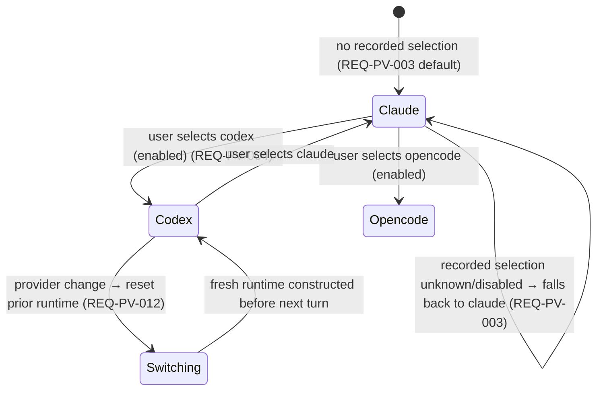
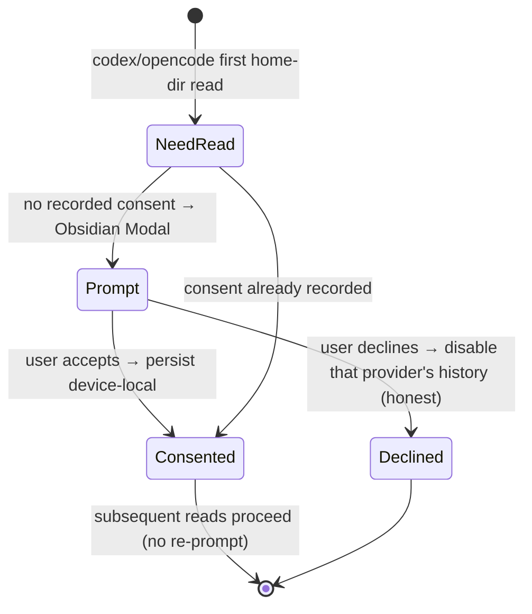
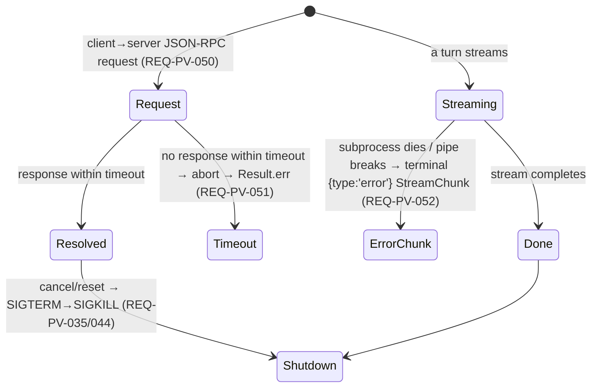

# Specification — Providers registry (P9, the LARGEST phase)

Implementation-ready contracts for P9. Every contract is grounded in `design.md` (DESIGN-PV-001), the three
accepted P9 ADRs (**ADR-PV-001/002/003**), the **provider-agnostic P1 `ChatRuntimePort`** already carrying
`readonly providerId` / `getCapabilities()` / `getToolbarCapabilities()` (`ChatRuntimePort.ts:78/97/119`), the
P3 `ProviderHistoryPort` (`ProviderHistoryPort.ts:23`), the P6 `ToolbarCatalogPort.getCatalog(providerId)`
(`ToolbarCatalogPort.ts:20`), the per-tab `CHAT_RUNTIME_FACTORY` modal-seam handle (`modalSeam.ts:28/46`), the
EXCLUDED non-Claude `ProviderId`s (`ProviderId.ts:5`), and Claudian's real code under `D:\Projects\claudian-main`
(`core/providers/ProviderRegistry.ts`, `core/providers/types.ts`, `providers/{claude,codex,opencode}/capabilities.ts`,
`providers/codex/runtime/{CodexAppServerProcess,CodexRpcTransport}.ts`, `providers/acp/{AcpSubprocess,AcpJsonRpcTransport}.ts`,
`core/storage/HomeFileAdapter.ts`). **Two independent teams should build the same thing from this document.**

> **Conventions in force (inherited from P1–P8, do not relax):** DDD inward-only imports (ADR-001,
> `domain ← application ← infrastructure ← ui`, NFR-PV-006); narrow ports + three bridges (ADR-008,
> NFR-PV-006); `Result<T,E>` at every use-case boundary + every store/transport method, **the streaming-error
> `StreamChunk` convention** for in-flight failures (a dying subprocess → a terminal `{type:'error'}` chunk, not
> a throw — ADR-CC-001 §1 / ADR-PV-003, NFR-PV-005), **pure-total** transforms elsewhere (ADR-004); DTO-only
> store boundary — no domain class instance / function / Obsidian / Node handle / **secret value** crosses into
> reactive state (ADR-003, NFR-PV-002); Vue `<script setup>` only; **no `obsidian`/`node:*` import under
> `src/ui/**`** (NFR-PV-006, REQ-PV-112); **no `v-html`/`innerHTML`/`outerHTML`/`insertAdjacentHTML`** anywhere
> (NFR-PV-008); blocking flows (the beyond-vault consent) use an Obsidian `Modal` via the modal seam, never
> `window.confirm`/`alert`/`prompt` (NFR-PV-008, REQ-PV-113); `--sp-*` token parity, colour literals confined to
> the token layer (NFR-PV-010, REQ-PV-091); WCAG 2.2 AA + full keyboard nav + non-colour cues + reduced-motion +
> forced-colors (NFR-PV-009, REQ-PV-110); tests mirror `src/` + `data-testid` PageObjects, coverage 80/70/80/80,
> the real Codex JSON-RPC + ACP transports + real `SecretStorePort` (`app.secretStorage`) + real `HomeFsPort`
> (`node:fs`) in coverage-excluded `src/infrastructure/obsidian/**` (NFR-PV-007, REQ-PV-111); `manifest.json`
> untouched, no migration (NFR-PV-011, CHARTER-REQ-FRESH); **no secret in any notice/log/store/DTO** (NFR-PV-002,
> REQ-PV-102); a provider secret persists only to native secret storage, never `data.json`/device-local
> (NFR-PV-002, REQ-PV-070); beyond-vault reads are read-scoped + consented (NFR-PV-003, REQ-PV-080..082); new
> user-facing strings via `TranslationPort` en+de (NFR-PV-007, B.3); **no new runtime dependency by default** —
> the Codex/ACP transports are thin in-tree line-delimited JSON-RPC-2.0-over-stdio (externalize like
> `@modelcontextprotocol/sdk` only if genuinely required, ADR-PV-003 §5, NFR-PV-011); **provider-varying
> behaviour gates on the capability bag, NEVER `switch (providerId)` / `if (provider===)`** in the consuming
> use case or component (NFR-PV-014, REQ-PV-013, lint-checkable); **additive growth only — no rename/removal of
> any P0–P8 member; with only Claude registered+enabled, P0–P8 is byte-identical (NFR-PV-001, REQ-PV-006/114)**.

This spec defines **34 spec items** across six layer groups (SPEC-PV-001..034). The Tasks stage (`planner`)
decomposes them into `T-PV-NNN`; the QA stage turns the TEST-PV-NNN scenarios (§8) into automated tests.
SPEC-PV items that **extend** a P0–P8 counterpart cite the extension point.

> **The field-level open items the design (DESIGN-PV-001 §Open clarifications) handed to `/spec:specify` —
> RESOLVED HERE (pinned literals, not architecture):**
> 1. **The widened `CHAT_RUNTIME_FACTORY` signature** — settled in SPEC-PV-009/021: the per-tab factory becomes
>    `(providerId: ProviderId) => Result<ChatRuntimePort>` (additive widen of `() => ChatRuntimePort`). **Every
>    P0–P8 provide-site + the tabs store passes the resolved active provider (default `'claude'`).** A Claude-only
>    configuration constructs the **same** runtime as P8 and the `Result` is always `ok` for Claude (a registered,
>    available, key-less provider) — so the Claude path is byte-identical (NFR-PV-001, REQ-PV-114, SPEC-PV-031).
> 2. **Build the BACKED caps only; honest-false the GATED-OFF (NG1)** — settled in SPEC-PV-002/004: the frozen
>    `ProviderCapabilities` bag is the single source of truth; the dev wires the BACKED capabilities per the
>    frozen matrix (SPEC-PV-002) and sets the GATED-OFF flags to literal `false`. **No rewind/provider-commands/MCP
>    is built for Codex; no rewind/fork/steer/MCP for Opencode** — the false flag hides/disables the affordance
>    through the EXISTING capability-gated view-model (SPEC-PV-016/017), nothing new is built (REQ-PV-034/043).
> 3. **`SecretStorePort.listKeys` + the service-tier toggle are OFF the P9 critical path** — settled in
>    SPEC-PV-006/018: `listKeys` is on the port (a future P10 settings UI shows "key set / not set" without
>    exposing the value) but P9's only secret consumers are the masked entry field (`setSecret`) + the runtime
>    env read (`getSecret`); the dev does **not** build a `listKeys` consumer in P9. The service-tier toggle
>    (REQ-PV-064, `could`) ships the **gating + the Codex config**; live emission rides where a capable runtime
>    advertises it (the P6 `serviceTier?` field is declared-now / emitted-by-a-capable-runtime, ADR-TC-002).
> 4. **The secret-key namespace + the home roots + the consent key** — settled in SPEC-PV-006/007/014: the
>    per-provider secret key is `provider.<id>.apiKey` (deterministic for `get`/`set`/`delete`/`listKeys`); the
>    declared home roots are exactly `~/.codex` + `~/.claude` (a read escaping a root → `Result.err`); the
>    device-local consent record key is `provider.homeFsConsent.<id>` (recorded once, never re-prompts).
> 5. **`callTool`/turn-time path parity** — settled in SPEC-PV-009/010: the turn streams through the active
>    provider's `ChatRuntimePort.query` (the UNCHANGED P1 turn flow); the Codex/Opencode transports are owned
>    **inside** each provider's runtime (the registry hands back a `ChatRuntimePort`), so there is no separate
>    turn-time transport call in the application/UI layer. The transports are exercised by the runtime + the
>    Mock-driven test legs.

---

## 0. Spec-item index

| Spec item | Title | Layer | New / Extends | REQ / NFR links |
|---|---|---|---|---|
| **DOMAIN** | | | | |
| SPEC-PV-001 | `ProviderId.ts` — widen the union `'claude' \| 'codex' \| 'opencode'` (additive) | domain | extends `ProviderId.ts` | REQ-PV-005; NFR-PV-001 |
| SPEC-PV-002 | `ProviderDescriptor.ts` — `ProviderCapabilities` (the frozen bag) + `ProviderDescriptor` + the three frozen descriptors + `DEFAULT_CHAT_PROVIDER_ID` | domain | new | REQ-PV-001/020..023; ADR-PV-001 |
| SPEC-PV-003 | `resolveProvider.ts` — PURE `listEnabledProviders` / `resolveActiveProvider` / `resolveProviderForModel` | domain | new | REQ-PV-002/003/060/061; ADR-PV-001 §1 |
| SPEC-PV-004 | `ProviderRegistryPort` + `PROVIDER_REGISTRY_PORT` key + barrel (pure reads) | domain | new | REQ-PV-001/002/003/013/020..023/060/061; ADR-PV-001 §1 |
| SPEC-PV-005 | `CHAT_RUNTIME_FACTORY` widened to `(providerId) => Result<ChatRuntimePort>` + `OPEN_PROVIDER_CONSENT` seam | domain/ui | extends `modalSeam.ts` | REQ-PV-010/011/012/082; ADR-PV-001 §2, ADR-PV-003 §2 |
| SPEC-PV-006 | `SecretStorePort` + `SECRET_STORE_PORT` key + the `provider.<id>.apiKey` namespace + barrel | domain | new | REQ-PV-070..073; ADR-PV-002 |
| SPEC-PV-007 | `HomeFsPort` + `HOME_FS_PORT` key + the declared roots + path-escape rule + barrel | domain | new | REQ-PV-080..083; ADR-PV-003 §1 |
| **INFRA** | | | | |
| SPEC-PV-008 | The descriptor-table `ProviderRegistryPort` impl (shared constant across the three bridges) | infra | new | REQ-PV-001..003/020..023/060/061; NFR-PV-014 |
| SPEC-PV-009 | `ObsidianBridge` — the runtime registry (`createChatRuntime(providerId) → Result`: Claude CLI reuse / Codex JSON-RPC / Opencode ACP) + real `SecretStorePort` (`app.secretStorage`) + real `HomeFsPort` (`node:fs`); coverage-excluded → manual legs | infra | extends P1/P3 bridge | REQ-PV-010..012/030..035/040..044/070/071/080/101; NFR-PV-004/007 (manual) |
| SPEC-PV-010 | The Codex JSON-RPC + shared ACP transports (line-delimited JSON-RPC 2.0 over stdio; timeout/abort/error-chunk; bounded spawn; SIGTERM→SIGKILL) — coverage-excluded `obsidian/**` | infra | new | REQ-PV-030..035/040..044/050..052/101; NFR-PV-004/005/007 (manual) |
| SPEC-PV-011 | `MockBridge` — descriptor-table registry + scriptable per-provider runtime/transport (canned stream / timeout / error-chunk) + in-memory `SecretStorePort` (availability switch) + inert/seedable `HomeFsPort` | infra | extends P1/P3 mock | REQ-PV-053/073/083; NFR-PV-007 |
| SPEC-PV-012 | `LocalStorageBridge` — descriptor-table registry + inert non-Claude runtime (`Result.err` "unavailable") + in-memory `SecretStorePort` + inert `HomeFsPort` | infra | extends P1/P3 LS | REQ-PV-073/083; NFR-PV-012 |
| **APPLICATION** | | | | |
| SPEC-PV-013 | `SelectProviderUseCase.ts` — resolve+activate, persist device-local, reset prior + construct active runtime via the widened factory (`Result`) | application | new | REQ-PV-004/010/011/012/060; ADR-PV-001 §2/§3 |
| SPEC-PV-014 | `ProviderConsentGate.ts` — the one-time beyond-vault consent check (read/record device-local; open the modal seam on first need) | application | new | REQ-PV-082; ADR-PV-003 §2 |
| SPEC-PV-015 | `buildProviderViewModel.ts` — PURE chooser + per-provider-widget VM (enabled list, order, active, which widgets shown/gated from the bag) | application | new | REQ-PV-002/013/024/062/063/064; ADR-PV-001 §4 |
| **UI** | | | | |
| SPEC-PV-016 | `ProviderChooser.vue` + `ProviderOption.vue` — the minimal selection surface (absent when ≤ 1 enabled) | ui | new | REQ-PV-001/002/003/004/006/090/110/114 |
| SPEC-PV-017 | `ModelSelector` / `ThinkingSelector` / `ServiceTierToggle` + rewind/fork/steer/MCP/provider-command affordances — provider-aware + capability-gated | ui | extends SPEC-TC widgets | REQ-PV-013/024/025/034/043/062/063/064 |
| SPEC-PV-018 | `ProviderSecretField.vue` — the masked secret-entry field; disabled-with-reason when unavailable | ui | new | REQ-PV-070/072/092/102/110 |
| SPEC-PV-019 | `useProviderRegistryPort` / `useSecretStorePort` / `useHomeFsPort` composables | ui | new | REQ-PV-112 |
| SPEC-PV-020 | Wiring — the bridges provide the three keys + the widened factory + the consent launcher; the tabs store passes the resolved active provider; history routes via `createProviderHistoryPort(providerId)` | plugin/ui | extends P3/P6 wiring | REQ-PV-010/012/082/084; ADR-PV-001 §2 |
| **STYLES** | | | | |
| SPEC-PV-021 | `provider-chooser` / `provider-secret` / per-provider `opencode-model-picker` + provider-brand `--sp-*` token slice | ui (styles) | extends SPEC-TC tokens | NFR-PV-010; REQ-PV-091 |
| **CROSS-CUTTING** | | | | |
| SPEC-PV-022 | The frozen per-provider capability matrix (the BACKED vs GATED-OFF truth table) | domain | — | REQ-PV-020..023; NFR-PV-014 |
| SPEC-PV-023 | The provider-selection state model (Claude default ↔ select ↔ switching) | app/ui | — | REQ-PV-003/004/012 |
| SPEC-PV-024 | The beyond-vault consent state model (need-read → prompt → consented/declined) | app/plugin | — | REQ-PV-082; ADR-PV-003 §2 |
| SPEC-PV-025 | The honest-gate matrix (no-key / missing-CLI / dead-transport / storage-unavailable / non-Node / mid-turn-miss) | cross | — | REQ-PV-024/025/072/100; NFR-PV-005/012 |
| SPEC-PV-026 | The transport request/stream state model (request → resolved / timeout / error-chunk; subprocess SIGTERM→SIGKILL) | infra | — | REQ-PV-035/044/050..052; NFR-PV-005 |
| SPEC-PV-027 | Additivity invariant (`ProviderId` + `CHAT_RUNTIME_FACTORY` grow additively; Claude-only byte-identical P8) | domain | — | NFR-PV-001; REQ-PV-006/114 |
| SPEC-PV-028 | Security: secrets-in-native-storage-only / bounded explicit spawn / no-secret-leak / beyond-vault-scoped-consented / explicit-enable-only | cross | — | REQ-PV-070..072/080..083/100..103; NFR-PV-002/003/004/013 |
| SPEC-PV-029 | The no-`switch(providerId)` / capability-gated-routing invariant | app/ui | — | REQ-PV-013; NFR-PV-014 |
| SPEC-PV-030 | i18n / microcopy invariant (`agent.chat.providers.*` en+de; no hardcoded string; no secret in a notice) | ui | — | NFR-PV-007; REQ-PV-102 |
| SPEC-PV-031 | The widened-factory contract (every site passes the resolved provider; Claude → `ok` same runtime as P8) | ui/plugin | extends `modalSeam.ts` | REQ-PV-010/011/114; ADR-PV-001 §2 |
| SPEC-PV-032 | The `minAppVersion` check (verify `app.secretStorage` at 1.12.7; escalate-not-bump) | cross | — | NFR-PV-011; CLAR-PV-004 |
| SPEC-PV-033 | Coverage-exclusion + the manual real legs (TEST-PV-M1/M2/M3); the no-new-dep-by-default + `build:web` invariant | cross | — | NFR-PV-007/011; REQ-PV-111 |
| SPEC-PV-034 | History parity: Codex JSONL + Opencode ACP plug into the UNCHANGED P3 `ProviderHistoryPort` (fork gated on `supportsFork`) | domain/infra | extends SPEC-TS history | REQ-PV-032/042/084; NFR-PV-001 |

---

# 1. Domain — the union, descriptors, resolve helpers, ports (SPEC-PV-001..007)

Types under `src/domain/chat/ProviderId.ts`, `src/domain/chat/providers/`, and `src/domain/ports/`. No
`obsidian`, no `node:*`, no Vue, no class — a widened union + pure data + pure functions + three port interfaces
(ADR-001). **Additive only: no P0–P8 field or member is renamed or removed (NFR-PV-001, SPEC-PV-027).** The
descriptors are regrown 1:1 from Claudian's frozen `providers/{claude,codex,opencode}/capabilities.ts` + the
`ProviderRegistry`/`modelRouting` resolve semantics, with throw-paths converted to `Result` (ADR-004).

## SPEC-PV-001 — `ProviderId.ts` (the widened union)

**REQ:** REQ-PV-005 · **NFR:** NFR-PV-001 · **Claudian ground-truth:** `core/types/provider.ts` (the three-id
union). **Widen** the union; every existing `'claude'` use site stays valid (additive, SPEC-PV-027):

```ts
// src/domain/chat/ProviderId.ts — WIDENED (REQ-PV-005). Was `'claude'`. The two new ids
// become assignable; every P0–P8 `'claude'` site type-checks unchanged (NFR-PV-001).
export type ProviderId = 'claude' | 'codex' | 'opencode';
```

**Validation rules:** the union has exactly three members; `DEFAULT_CHAT_PROVIDER_ID = 'claude'` (SPEC-PV-002)
is the only default. No runtime value beyond the three; an unknown recorded id resolves to `'claude'`
(SPEC-PV-003, REQ-PV-003). Unit-testable as a type-shape contract — every P1–P8 type that referenced
`ProviderId` (the `ChatRuntimePort.providerId`, `ProviderHistoryPort.providerId`, `ToolbarCatalogPort.getCatalog`)
compiles unchanged (TEST-PV-005, TEST-PV-114).

## SPEC-PV-002 — `ProviderDescriptor.ts` (`src/domain/chat/providers/ProviderDescriptor.ts`)

**REQ:** REQ-PV-001/020..023 · **ADR:** ADR-PV-001 · **Claudian ground-truth:** `core/providers/types.ts:24`
(`ProviderCapabilities`), `:40` (`DEFAULT_CHAT_PROVIDER_ID`), `:55` (`ProviderRegistration` `displayName`/
`blankTabOrder`/`isEnabled`/`capabilities`), `providers/{claude,codex,opencode}/capabilities.ts`. **Regrown
verbatim** — pure data, `readonly`, frozen, no class, no Obsidian:

```ts
// src/domain/chat/providers/ProviderDescriptor.ts — new (parity capabilities.ts + the registration bag).
import type { ProviderId } from '@/domain/chat/ProviderId';
import type { PluginSettings } from '@/domain/settings/PluginSettings';

/** The frozen per-provider capability bag (parity ProviderCapabilities). Read through the
 *  registry as plain data; NEVER branched on by `providerId` (REQ-PV-013/020, NFR-PV-014). */
export interface ProviderCapabilities {
  readonly providerId: ProviderId;
  readonly supportsPersistentRuntime: boolean;
  readonly supportsNativeHistory: boolean;
  readonly supportsPlanMode: boolean;
  readonly supportsRewind: boolean;          // GATED OFF for codex + opencode (REQ-PV-022/023)
  readonly supportsFork: boolean;            // GATED OFF for opencode (REQ-PV-023)
  readonly supportsProviderCommands: boolean;// GATED OFF for codex (REQ-PV-022)
  readonly supportsImageAttachments: boolean;
  readonly supportsInstructionMode: boolean;
  readonly supportsMcpTools: boolean;        // GATED OFF for codex + opencode (REQ-PV-022/023, NG3)
  readonly supportsTurnSteer: boolean;       // BACKED for codex; false for claude + opencode (REQ-PV-022/023)
  readonly reasoningControl: 'effort' | 'token-budget' | 'none'; // 'effort' for all three in P9
  /** Whether the provider needs a secret (API key) before a turn can start (REQ-PV-072/100). */
  readonly needsApiKey: boolean;
  /** Whether the provider reads beyond-vault home-dir transcripts (gates the consent gate, REQ-PV-082). */
  readonly readsHomeDir: boolean;
}

/** A registered provider = identity + ordering + the frozen bag + the pure enable/own predicates. */
export interface ProviderDescriptor {
  readonly id: ProviderId;
  /** The i18n key resolves the display name; this is the stable fallback (parity displayName). */
  readonly displayNameKey: string;
  /** Lower renders first in the chooser (parity blankTabOrder: opencode 10, codex 15, claude 20). */
  readonly blankTabOrder: number;
  readonly capabilities: ProviderCapabilities;
  /** PURE: whether the provider is enabled given the settings (claude is ALWAYS enabled, REQ-PV-003). */
  isEnabled(settings: PluginSettings): boolean;
  /** PURE: whether this provider owns the given model id (parity ProviderChatUIConfig.ownsModel, REQ-PV-060). */
  ownsModel(model: string): boolean;
}

export const DEFAULT_CHAT_PROVIDER_ID: ProviderId = 'claude';
```

**The three frozen descriptors (SPEC-PV-022 is the full matrix):** `CLAUDE_DESCRIPTOR` (all-true caps,
`supportsTurnSteer:false`, `needsApiKey:false`, `readsHomeDir:false`, `blankTabOrder:20`, `isEnabled → true`
always — Claude is the complete default, REQ-PV-003/021); `CODEX_DESCRIPTOR` (`supportsRewind:false`,
`supportsProviderCommands:false`, `supportsMcpTools:false`, `supportsTurnSteer:true`, `supportsFork:true`,
`needsApiKey:true`, `readsHomeDir:true`, `blankTabOrder:15`, REQ-PV-022); `OPENCODE_DESCRIPTOR`
(`supportsRewind:false`, `supportsFork:false`, `supportsTurnSteer:false`, `supportsProviderCommands:true`,
`supportsMcpTools:false`, `needsApiKey:true`, `readsHomeDir:true`, `blankTabOrder:10`, REQ-PV-023). Each
descriptor + its `capabilities` is `Object.freeze`d (the frozen-bag invariant, REQ-PV-020). The
`PROVIDER_DESCRIPTORS: readonly ProviderDescriptor[]` constant lists all three.

**Validation rules / behaviour:** `blankTabOrder` values are distinct (10/15/20); `isEnabled(CLAUDE)` is the
constant `true` (the registry always has ≥ 1 entry, SPEC-PV-027); a non-Claude `isEnabled` reads a device-local
`enabledProviders` settings field (added in SPEC-PV-006-adjacent `PluginSettings`, default `[]` → both
non-Claude providers disabled on a fresh install, REQ-PV-103); `ownsModel` is a pure prefix/membership predicate
per the provider's model namespace (the BACKED model lists; an unowned model → all three return `false`, so the
resolve falls back, REQ-PV-061). The descriptor table is **build-the-BACKED-only** (open item #2): the GATED-OFF
flags are literal `false`, not a half-built feature (REQ-PV-034/043, NG1). Re-exported from
`src/domain/chat/providers/index.ts`. Unit-testable as a frozen-data + predicate contract (TEST-PV-020..023).

## SPEC-PV-003 — `resolveProvider.ts` (`src/domain/chat/providers/resolveProvider.ts`)

**REQ:** REQ-PV-002/003/060/061 · **ADR:** ADR-PV-001 §1 · **Claudian ground-truth:** `ProviderRegistry`
`getEnabledProviderIds` (`:117-123`), `resolveSettingsProviderId` (`:133-150`), `resolveProviderForModel`
(`:152-183`). **PURE** over the descriptor table — no I/O, **total (never throws)**:

```ts
import type { ProviderId } from '@/domain/chat/ProviderId';
import type { ProviderDescriptor } from './ProviderDescriptor';
import type { PluginSettings } from '@/domain/settings/PluginSettings';

/** The enabled descriptors, filtered by `isEnabled` + sorted ascending by `blankTabOrder`
 *  (REQ-PV-002: opencode 10, codex 15, claude 20). Claude is always present. Total. */
export function listEnabledProviders(
  descriptors: readonly ProviderDescriptor[],
  settings: PluginSettings,
): readonly ProviderDescriptor[];

/** The recorded `activeProvider` setting if it is registered AND enabled, else `'claude'`
 *  (REQ-PV-003: default + fallback for unknown/disabled). Total. */
export function resolveActiveProvider(
  descriptors: readonly ProviderDescriptor[],
  settings: PluginSettings,
): ProviderId;

/** The first descriptor whose `ownsModel(model)` is true, else the active/Claude fallback
 *  (REQ-PV-060/061). Total. */
export function resolveProviderForModel(
  descriptors: readonly ProviderDescriptor[],
  model: string,
  settings: PluginSettings,
): ProviderId;
```

**Validation rules / behaviour (parity Claudian):** `listEnabledProviders` returns a fresh sorted array (a
single-Claude registry → `[claude]`, REQ-PV-006); `resolveActiveProvider` reads `settings.activeProvider`
(device-local, REQ-PV-004), returns it only when it is one of the three ids AND its descriptor `isEnabled`,
else `'claude'` (EC-PV-2/3); `resolveProviderForModel` iterates the descriptors, returns the first
`ownsModel(model)` match, else `resolveActiveProvider(...)` (which itself falls back to Claude, EC-PV-9). All
three are pure + total. Re-exported from `src/domain/chat/providers/index.ts`. Unit-testable in isolation
(TEST-PV-002/003/060/061, EC-PV-2/3/9).

## SPEC-PV-004 — `ProviderRegistryPort` + key + barrel (`src/domain/ports/ProviderRegistryPort.ts`)

**REQ:** REQ-PV-001/002/003/013/020..023/060/061 · **ADR:** ADR-PV-001 §1 · **Claudian ground-truth:**
`ProviderRegistry.getRegisteredProviderIds`/`getEnabledProviderIds`/`getCapabilities`/`getProviderDisplayName`/
`resolveSettingsProviderId`/`resolveProviderForModel`. One narrow port for one consumer kind (the chooser
view-model + the select use case); its own `InjectionKey` + composable, **no aggregate** (ADR-008, NFR-PV-006,
REQ-PV-112). **Pure synchronous reads — no I/O, no `Promise`, total (never throws)** (the runtime *construction*
is the widened factory, SPEC-PV-005, NOT this port):

```ts
import type { ProviderId } from '@/domain/chat/ProviderId';
import type { ProviderDescriptor, ProviderCapabilities } from '@/domain/chat/providers/ProviderDescriptor';
import type { PluginSettings } from '@/domain/settings/PluginSettings';

export interface ProviderRegistryPort {
  /** Every registered descriptor (REQ-PV-001). Total. */
  listRegisteredProviders(): readonly ProviderDescriptor[];
  /** The enabled descriptors, blank-tab-ordered (REQ-PV-002). Total. */
  listEnabledProviders(settings: PluginSettings): readonly ProviderDescriptor[];
  /** The descriptor for `id` (REQ-PV-001). Total — an unknown id is impossible (the union is closed). */
  getDescriptor(id: ProviderId): ProviderDescriptor;
  /** The display-name i18n key for `id` (REQ-PV-090). Total. */
  getDisplayNameKey(id: ProviderId): string;
  /** The frozen capability bag for `id` (REQ-PV-013/020..023). Total. */
  getCapabilities(id: ProviderId): ProviderCapabilities;
  /** The active provider: recorded-if-enabled, else claude (REQ-PV-003). Total. */
  resolveActiveProvider(settings: PluginSettings): ProviderId;
  /** The owning provider for a model, else the active/claude fallback (REQ-PV-060/061). Total. */
  resolveProviderForModel(model: string, settings: PluginSettings): ProviderId;
}
```

**Per-method contract (signature · behaviour · pre/post · errors · side effects):**

| Method | Behaviour · Post · Errors · Side effects |
|---|---|
| `listRegisteredProviders()` | Returns `PROVIDER_DESCRIPTORS` (the frozen table, SPEC-PV-002). **Post:** exactly the three frozen descriptors (REQ-PV-001). **Errors:** none (total). **Side effects:** none. |
| `listEnabledProviders(settings)` | Delegates to `listEnabledProviders` (SPEC-PV-003). **Post:** blank-tab-ordered enabled subset; Claude always present (REQ-PV-002/006). **Side effects:** none. |
| `getDescriptor(id)` | The frozen descriptor for `id`. **Post:** never undefined (closed union, REQ-PV-001). **Side effects:** none. |
| `getDisplayNameKey(id)` | The descriptor's `displayNameKey` (REQ-PV-090). **Side effects:** none. |
| `getCapabilities(id)` | The descriptor's frozen `capabilities` (REQ-PV-013/020). **Post:** the BACKED/GATED-OFF flags per SPEC-PV-022. **Side effects:** none. |
| `resolveActiveProvider(settings)` | Delegates to `resolveActiveProvider` (SPEC-PV-003). **Post:** a registered+enabled id, else `'claude'` (REQ-PV-003, EC-PV-2/3). **Side effects:** none. |
| `resolveProviderForModel(model, settings)` | Delegates to `resolveProviderForModel` (SPEC-PV-003). **Post:** the owning provider, else the active/claude fallback (REQ-PV-060/061, EC-PV-9). **Side effects:** none. |

**`PROVIDER_REGISTRY_PORT` InjectionKey** (`src/infrastructure/bridge/ports.ts`, appended) + barrel re-export of
`ProviderRegistryPort` / `ProviderDescriptor` / `ProviderCapabilities` from `src/domain/ports/index.ts`
(appended). The three bridges back it with the **same shared descriptor-table constant** (SPEC-PV-008). The pure
helpers + the port carry the automated coverage (NFR-PV-007). Unit-testable against the table-backed impl
(TEST-PV-001/002/003/013/060/061).

## SPEC-PV-005 — `CHAT_RUNTIME_FACTORY` widened + `OPEN_PROVIDER_CONSENT` (`src/ui/chat/modalSeam.ts`)

**REQ:** REQ-PV-010/011/012/082 · **ADR:** ADR-PV-001 §2, ADR-PV-003 §2 · **Claudian ground-truth:**
`ProviderRegistry.createChatRuntime({providerId})` (`:45-48`). **Widen** the per-tab factory + **append** the
consent launcher (the P3..P8 handles stay byte-identical, SPEC-PV-027):

```ts
// src/ui/chat/modalSeam.ts — WIDENED (ADR-PV-001 §2). Was `() => ChatRuntimePort`. The runtime
// CONSTRUCTION moves behind a Result (a no-key/no-CLI/transport-unavailable construction →
// Result.err, never a throw — REQ-PV-011). Every P0–P8 provide-site + the tabs store passes the
// resolved active provider (default `'claude'`); a Claude-only config yields `ok` with the SAME
// runtime as P8 (NFR-PV-001, SPEC-PV-031).
import type { Result } from '@/domain/shared/Result';
import type { ProviderId } from '@/domain/chat/ProviderId';
export type ChatRuntimeFactory = (providerId: ProviderId) => Result<ChatRuntimePort>;

// APPENDED (ADR-PV-003 §2). The real Obsidian `Modal` host lives in `src/plugin/**`; the
// standalone entry provides a browser-safe stand-in (no `window.*`).
/** Open the one-time beyond-vault consent modal for `providerId`; resolves the user's choice (REQ-PV-082). */
export type OpenProviderConsentFn = (providerId: ProviderId) => Promise<boolean>;
export const OPEN_PROVIDER_CONSENT: InjectionKey<OpenProviderConsentFn> = Symbol('OpenProviderConsent');
```

**Contract:** `useChatRuntimeFactory()` keeps throwing-when-absent (the surface needs it, `modalSeam.ts:60`),
but now returns the widened signature; the construct-fail path is the `Result.err` the use case surfaces as an
honest notice (REQ-PV-011, SPEC-PV-013). `useOpenProviderConsent()` falls back to an **AUTO-DECLINE** (`false`)
when absent (a missing launcher must never silently read beyond the vault, REQ-PV-082/113 — mirrors
`useConfirmDelete`'s auto-decline). The seam keeps the Vue layer free of `obsidian` (NFR-PV-008). Unit-testable
as a provide/inject + fallback contract + the additive-signature compile (TEST-PV-010/011/082, TEST-PV-114).

## SPEC-PV-006 — `SecretStorePort` + key + namespace + barrel (`src/domain/ports/SecretStorePort.ts`)

**REQ:** REQ-PV-070..073 · **ADR:** ADR-PV-002 · **Claudian ground-truth:** the secret-handling posture (audit
ports table). One narrow port for one consumer kind (the masked field + the runtime env read); its own
`InjectionKey` + composable, **no aggregate** (ADR-008). All methods `Result`-typed; `getSecret` returns the
value only at the infra boundary; `listKeys` returns **keys, never values** (REQ-PV-070):

```ts
import type { Result } from '@/domain/shared/Result';

/** The per-provider secret key namespace (open item #4). Deterministic for get/set/delete/listKeys. */
export const providerSecretKey = (id: ProviderId): string => `provider.${id}.apiKey`; // 'provider.codex.apiKey', …

export interface SecretStorePort {
  /** Whether native secret storage is available on this device (REQ-PV-072). Synchronous + total. */
  isAvailable(): boolean;
  /** Read a stored secret by key (REQ-PV-071). `ok(null)` when absent. Read ONLY at the infra boundary. */
  getSecret(key: string): Promise<Result<string | null>>;
  /** Persist a secret by key into native secret storage (REQ-PV-070). NEVER `data.json`/device-local. */
  setSecret(key: string, value: string): Promise<Result<void>>;
  /** Delete a stored secret by key (REQ-PV-070). Idempotent — a missing key is `ok()`. */
  deleteSecret(key: string): Promise<Result<void>>;
  /** The stored secret KEYS (never values) — for a future P10 "key set / not set" UI. OFF the P9 critical path (open item #3). */
  listKeys(): Promise<Result<readonly string[]>>;
}
```

**Per-method contract:**

| Method | Behaviour · Post · Errors · Side effects |
|---|---|
| `isAvailable()` | Synchronous + total. **Obsidian:** `true` iff `app.secretStorage` exists (the SPEC-PV-032 check); **Mock/LS:** `true` (the in-memory store is always available unless a test forces `setSecretStoreAvailable(false)`). **Side effects:** none. |
| `getSecret(key)` | `ok(value)` or `ok(null)` when absent (REQ-PV-071). **Errors:** a true storage failure → `err` (no key/value substring, REQ-PV-102). **Side effects:** a native-storage read at the infra boundary; **the value never crosses into the UI/store/DTO** (NFR-PV-002). |
| `setSecret(key, value)` | Persist to native storage (REQ-PV-070). **Pre:** `isAvailable()` (the surface gates first, REQ-PV-072). **Errors:** failure → `err` (no value substring). **Side effects:** one native-storage write; **NEVER `data.json`/device-local** (ADR-PV-002). |
| `deleteSecret(key)` | Idempotent delete → `ok()`. **Side effects:** one native-storage delete. |
| `listKeys()` | `ok(keys)` (the `provider.<id>.apiKey` keys present), never values (REQ-PV-070). **Off the P9 critical path** (open item #3). **Side effects:** none. |

**`SECRET_STORE_PORT` InjectionKey** (appended) + barrel re-export + the `providerSecretKey` helper. Three
bridges implement it (SPEC-PV-009/011/012). Unit-testable against the in-memory Mock impl (the
availability-switch + the round-trip + the no-leak assertion, TEST-PV-070/072/073/102); the real
`app.secretStorage` is the manual leg (TEST-PV-M3).

## SPEC-PV-007 — `HomeFsPort` + key + roots + path-escape + barrel (`src/domain/ports/HomeFsPort.ts`)

**REQ:** REQ-PV-080..083 · **ADR:** ADR-PV-003 §1 · **Claudian ground-truth:** `core/storage/HomeFileAdapter.ts`
(the beyond-vault FS, rooted at `os.homedir()`). One narrow port for one consumer kind (the Codex JSONL history
read + the consent gate); its own `InjectionKey` + composable, **no aggregate** (ADR-008). **Read-first — no
write/delete in P9** (REQ-PV-081); all methods `Result`-typed:

```ts
import type { Result } from '@/domain/shared/Result';

/** The declared, allow-listed beyond-vault roots P9 may read (open item #4, REQ-PV-081).
 *  Resolved relative to `os.homedir()` at the infra boundary; a path escaping a root → err. */
export const HOME_FS_ROOTS = ['.codex', '.claude'] as const; // ~/.codex, ~/.claude

export interface HomeFsPort {
  /** Whether beyond-vault FS reads are available on this device (REQ-PV-083). Synchronous + total.
   *  Obsidian (Node) → true; Mock/LS → false (inert, NFR-PV-012). */
  isAvailable(): boolean;
  /** Read a UTF-8 file under a declared root (REQ-PV-080). A path escaping a root → err (REQ-PV-081). */
  readFile(relativePath: string): Promise<Result<string>>;
  /** Whether a path under a declared root exists (REQ-PV-080). A path escaping a root → err. */
  exists(relativePath: string): Promise<Result<boolean>>;
  /** List the folders under a declared root (REQ-PV-080) — e.g. the Codex sessions root. A path escaping a root → err. */
  listFolders(relativePath: string): Promise<Result<readonly string[]>>;
}
```

**Per-method contract:**

| Method | Behaviour · Post · Errors · Side effects |
|---|---|
| `isAvailable()` | Synchronous + total. **Obsidian:** `true` (Node `fs` + `os.homedir()`); **Mock/LS:** `false` (inert, REQ-PV-083, NFR-PV-012). **Side effects:** none. |
| `readFile(p)` | `ok(text)` for a UTF-8 file under a declared root (REQ-PV-080). **Pre:** `p` resolves inside `~/.codex` or `~/.claude` (the path-escape rule). **Errors:** a path escaping a root → `err` (REQ-PV-081); not-found / read failure → `err`. **Side effects:** one `node:fs` read (consented, SPEC-PV-024). |
| `exists(p)` | `ok(boolean)` for a path under a declared root. **Errors:** path-escape → `err`. **Side effects:** one stat. |
| `listFolders(p)` | `ok(names)` for a path under a declared root. **Errors:** path-escape → `err`. **Side effects:** one readdir. |

**Path-escape rule (REQ-PV-081, SPEC-PV-028):** `relativePath` is resolved against `os.homedir()`; the resolved
absolute path MUST be a descendant of `os.homedir()/.codex` or `os.homedir()/.claude` (normalised, no `..`
escape) — else `Result.err`. **No write/delete method exists in P9** (REQ-PV-081). **`HOME_FS_PORT`
InjectionKey** (appended) + barrel re-export + `HOME_FS_ROOTS`. Three bridges implement it
(SPEC-PV-009/011/012; the real `node:fs` is coverage-excluded → manual leg). Unit-testable against the
inert/seedable Mock impl + the path-escape rule as a pure check (TEST-PV-080/081/083, EC-PV-7).

---

# 2. Infrastructure — the registry, transports, three bridges (SPEC-PV-008..012)

The three bridges back `ProviderRegistryPort` (the shared descriptor-table constant), the runtime registry (the
widened `CHAT_RUNTIME_FACTORY`), `SecretStorePort`, and `HomeFsPort` (NFR-PV-007). `src/infrastructure/obsidian/**`
is coverage-excluded (the real Codex JSON-RPC + ACP transports + the real `app.secretStorage` + the real
`node:fs` are the manual legs); `MockBridge` (scriptable) + `LocalStorageBridge` (inert) carry the
unit-testable behaviour. `tests/__fakes__/fake-ports.ts` grows a `providerRegistry` (the descriptor table), a
`secretStore` (in-memory, an availability switch), a `homeFs` (inert/seedable), and a **scriptable per-provider
runtime/transport** (canned stream / timeout / error-chunk) so the registry/routing/capability/history/secret
logic runs without Obsidian / Node / a subprocess (REQ-PV-053/073/083/111, DESIGN-PV-001 C.5).

## SPEC-PV-008 — The descriptor-table `ProviderRegistryPort` impl

**REQ:** REQ-PV-001..003/020..023/060/061 · **NFR:** NFR-PV-014. A single `ProviderRegistry` class implementing
`ProviderRegistryPort` over the frozen `PROVIDER_DESCRIPTORS` constant (SPEC-PV-002) + the pure `resolveProvider`
helpers (SPEC-PV-003). **The same impl is shared across the three bridges** (the table is identical everywhere —
it is plain data, no I/O). Lives in `src/infrastructure/providers/ProviderRegistry.ts` (NOT `obsidian/**` — it is
coverage-included pure-data logic). No `switch (providerId)` (NFR-PV-014, SPEC-PV-029). Unit-testable in full
(TEST-PV-001/002/003/013/020..023/060/061).

## SPEC-PV-009 — `ObsidianBridge` impls (`src/infrastructure/obsidian/*`)

**REQ:** REQ-PV-010..012/030..035/040..044/070/071/080/101 · **NFR:** NFR-PV-004/007 (manual leg). **Claudian
ground-truth:** `ProviderRegistry.createChatRuntime`, `providers/codex/runtime/*`, `providers/acp/*`,
`HomeFileAdapter`, the secret posture.

- **The runtime registry (`createChatRuntime(providerId) → Result<ChatRuntimePort>`, the widened
  `CHAT_RUNTIME_FACTORY` target)** — constructs the active provider's `ChatRuntimePort` from its descriptor:
  - **`'claude'`** → the **P1 `ClaudeCliChatRuntime`** reused **unchanged** → `Result.ok` (byte-identical P8,
    SPEC-PV-031, REQ-PV-114).
  - **`'codex'`** → a `CodexChatRuntime` owning the Codex app-server **JSON-RPC-over-stdio** transport
    (SPEC-PV-010); reads the key via `SecretStorePort.getSecret(providerSecretKey('codex'))` into the subprocess
    env at this boundary (REQ-PV-071/101); JSONL history via `HomeFsPort` (SPEC-PV-034). A no-key / no-CLI /
    transport-unavailable construction → `Result.err` with a human-readable reason (REQ-PV-011/100, EC-PV-4/5).
  - **`'opencode'`** → an `OpencodeChatRuntime` owning the shared **ACP** transport (SPEC-PV-010); same key /
    error story; ACP `loadSession` history (SPEC-PV-034).
  - The runtime exposes the **frozen `getCapabilities()` / `getToolbarCapabilities()`** matching its descriptor
    bag (SPEC-PV-022) — the BACKED capabilities wired, the GATED-OFF reported `false` (REQ-PV-034/043).
- **`SecretStorePort`** — the real `app.secretStorage`: `isAvailable()` → whether `app.secretStorage` exists
  (SPEC-PV-032); `getSecret`/`setSecret`/`deleteSecret`/`listKeys` over it; **NEVER `data.json`** (ADR-PV-002,
  REQ-PV-070). Coverage-excluded → manual leg TEST-PV-M3.
- **`HomeFsPort`** — the real `node:fs` rooted at `os.homedir()`, scoped to `HOME_FS_ROOTS` with the path-escape
  rule (SPEC-PV-007); `isAvailable()` → `true`. Coverage-excluded → manual legs TEST-PV-M1/M2.

All of the above live in **coverage-excluded** `src/infrastructure/obsidian/**` and are verified on the manual
Obsidian legs (TEST-PV-M1 Codex, TEST-PV-M2 Opencode, TEST-PV-M3 secret). No `obsidian`/`node:*` symbol leaks
past these files.

## SPEC-PV-010 — The Codex JSON-RPC + shared ACP transports (`src/infrastructure/obsidian/providers/*`)

**REQ:** REQ-PV-030..035/040..044/050..052/101 · **NFR:** NFR-PV-004/005/007 (manual leg). **Claudian
ground-truth:** `CodexAppServerProcess`/`CodexRpcTransport`, `AcpSubprocess`/`AcpJsonRpcTransport` (the
hand-written line-delimited JSON-RPC 2.0 over stdio). **No new runtime dependency by default** (ADR-PV-003 §5,
SPEC-PV-033, NFR-PV-011). Each transport (SPEC-PV-026 is the state model):

- **Line-delimited JSON-RPC 2.0 over stdio** (REQ-PV-050) — client→server requests (with a per-request timeout
  + `AbortController`), notifications, and server→client request handlers; each frame a single newline-delimited
  JSON-RPC 2.0 message.
- **Timeout / abort → `Result.err`** (REQ-PV-051, EC-PV-11) — a request that does not resolve within its timeout
  aborts and resolves to `Result.err` with a timeout reason; the transport stays usable for subsequent requests
  (no dangling promise).
- **A dying subprocess → a terminal error `StreamChunk`, not a throw** (REQ-PV-052, EC-PV-12) — the in-flight
  stream yields a terminal `{ type:'error', content }` chunk carrying the captured **stderr ring-buffer** detail
  and ends cleanly (the P1 streaming-error convention, ADR-CC-001 §1); the host stays responsive.
- **Bounded explicit spawn** (REQ-PV-031/101, SPEC-PV-028) — explicit cmd+args, a bounded merged env
  `{ ...process.env, <provider secret/env from SecretStorePort>, PATH: enhancedPath }`, `windowsHide`, **no
  `shell:true` / string-eval**; Windows `.cmd` quoting (`cmd.exe /d /s /c`, `windowsVerbatimArguments`,
  REQ-PV-031).
- **Graceful shutdown** (REQ-PV-035/044) — on cancel/reset, abort the in-flight request and shut the subprocess
  down **SIGTERM → SIGKILL** after a bounded grace period (Claudian's 3s); never leak a process.
- **Codex turn-steer** (REQ-PV-033, BACKED) — the Codex runtime's steer path injects a steer message into an
  in-progress turn (`supportsTurnSteer:true`); Opencode has no steer (`false`, REQ-PV-043).

Coverage-excluded `src/infrastructure/obsidian/providers/{codex,acp}/**`; exercised by the manual legs
(TEST-PV-M1/M2). The **scriptable Mock transport** (SPEC-PV-011) carries the automated weight for the
timeout/error-chunk/stream matrix (TEST-PV-050..053).

## SPEC-PV-011 — `MockBridge` impls (`src/infrastructure/mock/*`)

**REQ:** REQ-PV-053/073/083 · **NFR:** NFR-PV-007.

- **`ProviderRegistryPort`** — the shared descriptor-table impl (SPEC-PV-008).
- **The runtime registry (`createChatRuntime(providerId)`)** — a **scriptable** Mock runtime + scriptable
  transport per provider: `scriptProviderStream(providerId, chunks)` queues a canned `StreamChunk` stream;
  `setProviderConstructMode(providerId, 'ok' | 'no-key' | 'no-cli' | 'unavailable')` drives the construct path
  to `Result.ok` / `Result.err(<reason>)` (the SPEC-PV-025 honest-gate matrix, TEST-PV-011/100); the Mock runtime
  exposes the provider's frozen `getCapabilities()`/`getToolbarCapabilities()` so the capability-gated view-model
  runs without a subprocess (REQ-PV-013/024). A `setTransportMode(providerId, 'stream' | 'timeout' | 'error-chunk')`
  drives the transport-state matrix (SPEC-PV-026, TEST-PV-050..052) without a real process.
- **`SecretStorePort`** — an **in-memory** map (cleared per session, REQ-PV-073); `isAvailable()` → `true` unless
  `setSecretStoreAvailable(false)` forces the unavailable gate (TEST-PV-072); `seedSecret(key, value)` /
  `getStoredKeys()` for assertions; **no real OS secret** touched.
- **`HomeFsPort`** — **inert/seedable**: `isAvailable()` → `false` by default (the inert demo posture,
  REQ-PV-083); `seedHomeFile(path, text)` populates in-memory fixtures + flips availability `true` for the Codex
  JSONL history tests (no `node:fs`, REQ-PV-083); the path-escape rule still applies (a seeded path outside
  `HOME_FS_ROOTS` → `err`, EC-PV-7).

`fake-ports.ts` exposes the registry as `providerRegistry`, the secret store as `secretStore`, the home-fs as
`homeFs`, and the scriptable runtime/transport so the `SelectProviderUseCase` + `ProviderConsentGate` + the
provider-aware widgets + the chooser tests inject them without a real provider.

## SPEC-PV-012 — `LocalStorageBridge` impls (`src/infrastructure/localstorage/*`)

**REQ:** REQ-PV-073/083 · **NFR:** NFR-PV-012.

- **`ProviderRegistryPort`** — the shared descriptor-table impl (SPEC-PV-008).
- **The runtime registry** — `createChatRuntime('claude')` → `Result.ok` (the LS Claude stand-in, unchanged P1);
  `createChatRuntime('codex' | 'opencode')` → **`Result.err`** with an "unavailable" reason (the demo has no Node
  subprocess, NFR-PV-012, REQ-PV-100, EC-PV-8) — degrades, never errors.
- **`SecretStorePort`** — an **in-memory** map (no real secret, REQ-PV-073); `isAvailable()` → `true`
  (so the secret field is exercisable in the demo without a real OS store).
- **`HomeFsPort`** — **inert**: `isAvailable()` → `false`; the read methods → `ok(absent/empty)` or the
  unavailable `err` (no `node:fs`, REQ-PV-083).

---

# 3. Application — the use case, the consent gate, the view-model (SPEC-PV-013..015)

`SelectProviderUseCase` + `ProviderConsentGate` are use cases (they touch the ports + `SettingsPort` +
`NotificationPort`/`LoggerPort`, return `Result`, ADR-004); `buildProviderViewModel` is a pure transform. No
`obsidian`/Vue import. These + the pure `resolveProvider`/descriptor (SPEC-PV-002/003) are the QA seam — the
whole select + consent + view-model + capability-gate matrix is driven by the scriptable Mock registry / secret
store / home-fs / runtime (DESIGN-PV-001 C.9). **No `switch (providerId)`** anywhere (NFR-PV-014, SPEC-PV-029).

## SPEC-PV-013 — `SelectProviderUseCase` (`src/application/chat/providers/SelectProviderUseCase.ts`)

**REQ:** REQ-PV-004/010/011/012/060 · **ADR:** ADR-PV-001 §2/§3 · **Claudian ground-truth:**
`resolveSettingsProviderId` + the per-tab provider warmup. Resolve + activate a provider, persist the selection
device-local, reset the prior runtime + construct the active one via the widened factory:

```ts
import type { Result } from '@/domain/shared/Result';
import type { ProviderId } from '@/domain/chat/ProviderId';
import type { ChatRuntimePort } from '@/domain/ports';
import type { ProviderRegistryPort } from '@/domain/ports';
import type { SettingsPort } from '@/domain/ports';
import type { ChatRuntimeFactory } from '@/ui/chat/modalSeam'; // the widened (providerId)→Result factory

export class SelectProviderUseCase {
  constructor(
    private readonly registry: ProviderRegistryPort,
    private readonly settings: SettingsPort,
    private readonly runtimeFactory: ChatRuntimeFactory,  // the widened (providerId)→Result<ChatRuntimePort>
    private readonly feedback: FeedbackService,           // LoggerPort + NotificationPort (no secret logged)
  ) {}

  /** Select `id` for the current thread: persist `activeProvider` device-local, reset the prior
   *  runtime, construct the active one (REQ-PV-004/012). Returns the new runtime or err (REQ-PV-011). */
  select(id: ProviderId, priorRuntime: ChatRuntimePort | null): Promise<Result<ChatRuntimePort>>;

  /** Resolve the active provider for a model selection; if the owning provider differs, auto-switch
   *  to it (REQ-PV-060). Pure resolve + `select` when it differs. */
  selectForModel(model: string, priorRuntime: ChatRuntimePort | null): Promise<Result<ChatRuntimePort>>;
}
```

**Behaviour / pre/post / errors / side effects:**

- **`select(id, prior)`** — (1) `prior?.resetSession()` + `prior?.cancel()` (tear down the prior provider's
  session before the next turn, REQ-PV-012, no cross-provider leakage, EC-PV-13); (2)
  `settings.saveSettings({ activeProvider: id })` (device-local, **never `data.json`**, REQ-PV-004,
  CHARTER-REQ-SET); (3) `runtimeFactory(id)` → on `ok` return the runtime; on `err` `feedback.notify` an honest
  notice (`providers.notice.keyRequired` / `cliNotFound` / `unavailable` per the reason) + return the `err` (the
  chat stays usable, REQ-PV-011/100, EC-PV-4/5/8). **No throw escapes** (NFR-PV-005).
- **`selectForModel(model, prior)`** — `registry.resolveProviderForModel(model, settings)`; if it differs from
  the active provider, `select(owning, prior)` (auto-switch, REQ-PV-060); else a no-op `ok(prior)` (REQ-PV-061).
- **Side effects:** one device-local settings write + one runtime construction; the secret read (for a key-needing
  provider) happens **inside** the runtime construction at the infra boundary, never here (REQ-PV-071).

Unit-testable over the scriptable Mock registry + factory + the in-memory settings (the select / persist / reset
/ construct-err / auto-switch matrix, TEST-PV-004/010/011/012/060).

## SPEC-PV-014 — `ProviderConsentGate` (`src/application/chat/providers/ProviderConsentGate.ts`)

**REQ:** REQ-PV-082 · **ADR:** ADR-PV-003 §2 · **Claudian ground-truth:** the beyond-vault read posture
(`HomeFileAdapter` + the security ADR). The one-time consent check before a provider's first home-dir read
(SPEC-PV-024 is the state model):

```ts
import type { Result } from '@/domain/shared/Result';
import type { ProviderId } from '@/domain/chat/ProviderId';
import type { SettingsPort } from '@/domain/ports';
import type { OpenProviderConsentFn } from '@/ui/chat/modalSeam';

export class ProviderConsentGate {
  constructor(
    private readonly settings: SettingsPort,
    private readonly openConsent: OpenProviderConsentFn, // the modal seam (AUTO-DECLINE when absent)
  ) {}

  /** Ensure beyond-vault consent for `id` (REQ-PV-082): a recorded consent → ok(true) without a prompt;
   *  no record → open the consent modal once, record the outcome device-local, return it. */
  ensureConsent(id: ProviderId): Promise<Result<boolean>>;
}
```

**Behaviour / pre/post / errors / side effects:** reads the device-local consent record key
`provider.homeFsConsent.<id>` (open item #4); if `true` → `ok(true)` with **no prompt** (the consented path,
REQ-PV-082); if absent/`false` and the provider needs a read → `openConsent(id)` (the Obsidian `Modal` via the
seam, NEVER `window.confirm`, REQ-PV-113); record the boolean outcome device-local (so the prompt never repeats,
EC-PV-6) and return it. A **declining** user gets `ok(false)` → the caller disables that provider's history with
an honest message (`providers.consent.declined`, REQ-PV-082, SPEC-PV-024). **A Claude-only user never invokes
the gate** (`readsHomeDir:false`, REQ-PV-114). **No throw escapes** (NFR-PV-005). **Side effects:** at most one
modal open + one device-local write. Unit-testable over the Mock settings + a stubbed `openConsent`
(consented/declined/already-recorded, TEST-PV-082, EC-PV-6).

## SPEC-PV-015 — `buildProviderViewModel` (`src/application/chat/providers/buildProviderViewModel.ts`)

**REQ:** REQ-PV-002/013/024/062/063/064 · **ADR:** ADR-PV-001 §4 · **Claudian ground-truth:** the
capability-driven UI discipline. **PURE** — the chooser + per-provider-widget VM, **total**:

```ts
import type { ProviderId } from '@/domain/chat/ProviderId';
import type { ProviderCapabilities, ProviderDescriptor } from '@/domain/chat/providers/ProviderDescriptor';

/** One chooser row (REQ-PV-090). */
export interface ProviderOptionVM {
  readonly id: ProviderId;
  readonly displayNameKey: string;
  readonly isActive: boolean;
  readonly isDefault: boolean;  // id === DEFAULT_CHAT_PROVIDER_ID
}

/** Which toolbar/composer affordances render for the active provider (REQ-PV-013/024). */
export interface ProviderWidgetVM {
  readonly showRewind: boolean;           // capabilities.supportsRewind
  readonly showFork: boolean;             // capabilities.supportsFork
  readonly showTurnSteer: boolean;        // capabilities.supportsTurnSteer
  readonly showProviderCommands: boolean; // capabilities.supportsProviderCommands
  readonly showMcp: boolean;              // capabilities.supportsMcpTools
  readonly showServiceTier: boolean;      // the descriptor's service-tier config (Codex only)
  readonly reasoningControl: ProviderCapabilities['reasoningControl'];
}

export interface ProviderViewModel {
  /** The chooser rows in blank-tab order; EMPTY-render signal when ≤ 1 enabled (REQ-PV-006/090). */
  readonly options: readonly ProviderOptionVM[];
  /** True when the chooser renders at all (> 1 enabled) — false ⇒ byte-identical P8 (REQ-PV-006). */
  readonly showChooser: boolean;
  readonly active: ProviderId;
  readonly widgets: ProviderWidgetVM;
}

/** PURE: build the chooser + widget VM from the enabled descriptors + the active capability bag. Total. */
export function buildProviderViewModel(
  enabled: readonly ProviderDescriptor[],
  active: ProviderId,
  activeCapabilities: ProviderCapabilities,
): ProviderViewModel;
```

**Validation rules / behaviour:** `options` maps `enabled` (already blank-tab-ordered, SPEC-PV-003) to rows with
`isActive`/`isDefault`; `showChooser = enabled.length > 1` (a single-Claude registry → `false` → no chooser →
byte-identical P8, REQ-PV-006/114, EC-PV-1); `widgets` reads **the active capability bag** field-for-field — NO
`switch (providerId)` (REQ-PV-013/024, NFR-PV-014, SPEC-PV-029). The model/thinking lists themselves come from
`ToolbarCatalogPort.getCatalog(active)` (SPEC-PV-017, unchanged P6 seam). Pure + total. Re-exported from
`src/application/chat/providers/index.ts`. Unit-testable in full (TEST-PV-002/013/024/062/063/064, EC-PV-1).

---

# 4. UI — chooser, provider-aware widgets, secret field, composables, wiring (SPEC-PV-016..020)

Vue `<script setup>`; each mounted component has a co-located `data-testid` PageObject (`.po.ts`, NFR-PV-006).
**No component imports `obsidian` or `node:*`** — providers, capabilities, model lists, secret-set state, and
consent outcomes arrive as DTOs from the use case / view-model; the consent + secret-entry blocking flows open
through the modal seam (SPEC-PV-005). No `v-html` (REQ-PV-113).

## SPEC-PV-016 — `ProviderChooser.vue` + `ProviderOption.vue` (`src/ui/chat/providers/*`)

**REQ:** REQ-PV-001/002/003/004/006/090/110/114. The minimal selection surface. `ProviderChooser` takes
`options: ProviderOptionVM[]` + `showChooser: boolean` props, emits `select(id)`; renders **nothing** when
`showChooser` is false (byte-identical P8, REQ-PV-006/114, EC-PV-1). `ProviderOption` renders one row (provider
icon + display name + active/default marker), emits `select`. `data-testid`: `provider-chooser`,
`provider-option`, `provider-option-active`, `provider-icon`. **A11y (REQ-PV-110):** keyboard-operable (focus,
Enter/Space select, arrow-nav, Escape close), `aria-expanded` when a menu, the active provider announced
(`aria-current` / a polite live region), each option an accessible name + the icon an accessible label; state
cues are text + border + icon, never colour-only. Component-testable via the PageObject (the absent-at-≤1 / list
at >1 / select-emits / keyboard / a11y, TEST-PV-001/002/006/090/110/114).

## SPEC-PV-017 — provider-aware toolbar widgets + capability-gated affordances

**REQ:** REQ-PV-013/024/025/034/043/062/063/064 · **Extends:** the P6 `ModelSelector`/`ThinkingSelector`/
`ServiceTierToggle` (SPEC-TC) + the rewind/fork/steer/MCP/provider-command affordances. **No new branch — the P6
widgets are CHANGED to read the active provider's catalog + capability bag** (via `buildProviderViewModel` +
`ToolbarCatalogPort.getCatalog(active)`), not to branch on `providerId` (REQ-PV-013, NFR-PV-014):

- **`ModelSelector`** — lists the **active** provider's models (grouped, with the provider icon), incl. the
  `opencode-model-picker` shape (REQ-PV-062); switching the active provider re-lists from `getCatalog(active)`.
- **`ThinkingSelector`** — reflects the active provider's `reasoningControl` (`effort` for all three in P9);
  auto-hides when `none`/single (REQ-PV-063).
- **`ServiceTierToggle`** — shown only where the descriptor configures it (Codex `zap` fast-mode); hidden for
  claude/opencode (REQ-PV-064). Ships the **gating + the Codex config**; live emission rides a capable runtime
  (the P6 `serviceTier?` declared-now field, open item #3, ADR-TC-002).
- **rewind / fork / turn-steer / MCP / provider-command affordances** — gated by the existing capability flags
  they already read (`supportsRewind`/`supportsFork`/`supportsTurnSteer`/`supportsMcpTools`/
  `supportsProviderCommands`) — P9 supplies the per-provider flags, so the gating "just works": **a false flag
  hides (or disables-with-an-accessible-reason)** the affordance, never clickable-but-dead (REQ-PV-024/034/043).
  Codex shows no rewind/provider-commands/MCP; Opencode shows no rewind/fork/steer/MCP (SPEC-PV-022, EC-PV-14/15).
- **mid-turn capability miss** — a still-visible unsupported path surfaces a non-blocking
  `providers.notice.unsupported` notice and the session continues unchanged (REQ-PV-025, SPEC-PV-025, EC-PV-16).

`data-testid` reuse the existing P6 widget ids. Component-testable: each widget re-lists/gates from the active
bag, no `providerId` branch (TEST-PV-013/024/025/034/043/062/063/064).

## SPEC-PV-018 — `ProviderSecretField.vue` (`src/ui/chat/providers/ProviderSecretField.vue`)

**REQ:** REQ-PV-070/072/092/102/110. The minimal masked secret-entry field. Props: `providerId`, `available:
boolean` (from `SecretStorePort.isAvailable()`); a **masked** input (`type="password"`, no value echoed); emits
`save(value)` → the wiring calls `SecretStorePort.setSecret(providerSecretKey(id), value)` (REQ-PV-070). **The
stored value is never rendered back into the DOM, never placed in a notice/log/store/DTO** (REQ-PV-102,
NFR-PV-002). When `available` is false the field is **disabled** with the honest `providers.secret.unavailable`
message — **no plain-store fallback** (REQ-PV-072, SPEC-PV-025, EC-PV-10). `data-testid`: `provider-secret-field`.
**A11y (REQ-PV-110):** associated label + accessible name, masked, visible focus. Component-testable (the
masked-input / save-emits / disabled-when-unavailable / no-value-echo, TEST-PV-070/072/092/102).

## SPEC-PV-019 — composables (`src/ui/composables/*`)

**REQ:** REQ-PV-112. `useProviderRegistryPort()` injects `PROVIDER_REGISTRY_PORT`; `useSecretStorePort()` injects
`SECRET_STORE_PORT`; `useHomeFsPort()` injects `HOME_FS_PORT` — **one port, one composable, no aggregate**
(ADR-008, NFR-PV-006). Each throws when its key is absent (the surface needs it), mirroring the existing port
composables. No Vue `obsidian`/`node:*` import (ESLint-enforced, REQ-PV-112). Unit-testable as inject/throw
contracts + a grep guard (TEST-PV-112).

## SPEC-PV-020 — Wiring (`src/plugin/AgentSidebarView.ts` + `src/ui/main.ts`)

**REQ:** REQ-PV-010/012/082/084 · **ADR:** ADR-PV-001 §2. The three bridges provide `PROVIDER_REGISTRY_PORT` +
`SECRET_STORE_PORT` + `HOME_FS_PORT` + the **widened** `CHAT_RUNTIME_FACTORY` (`(providerId) => Result`) + the
`OPEN_PROVIDER_CONSENT` launcher (the real Obsidian `Modal` host in `src/plugin/**`; the standalone entry a
browser-safe stand-in). **The tabs store passes the resolved active provider** to the factory on `openTab`
(default `'claude'`, SPEC-PV-031); **history routes via `createProviderHistoryPort(providerId)`** (the
UNCHANGED P3 seam parameterised by provider, REQ-PV-084, SPEC-PV-034); the toolbar reads
`getCatalog(activeProvider)` (REQ-PV-062). A Claude-only configuration provides exactly the P8 wiring values for
Claude (SPEC-PV-027). Unit/component-testable: the factory is called with the resolved provider, the consent
launcher is the modal seam, the history port is provider-addressed (TEST-PV-010/012/082/084).

---

# 5. Styles (SPEC-PV-021)

## SPEC-PV-021 — `provider-chooser` / `provider-secret` / `opencode-model-picker` + provider-brand `--sp-*` slice

**REQ:** REQ-PV-091 · **NFR:** NFR-PV-010 · **Extends:** the P6 selector tokens (`--sp-toolbar-widget-h`,
`--sp-z-dropdown`, `--sp-shadow-dropup`) + the base set (`--sp-border`, `--sp-radius-*`, `--sp-bg-*`,
`--sp-surface-overlay`, `--sp-text-*`, `--sp-accent`, `--sp-space-*`, `--sp-font-*`). **Reuse over a
near-duplicate;** mint a new token **only** when no existing token maps, each justified at review against a
Claudian `opencode-model-picker.css` / provider-brand rule (candidates: `--sp-provider-brand-claude` → reuse
`--sp-accent` if equivalent; `--sp-provider-brand-codex`; `--sp-provider-brand-opencode`;
`--sp-model-picker-group-gap` → reuse `--sp-space-2` if equivalent). **No hex, no raw Obsidian var, no
physical-direction CSS property** — the `lint-style-tokens` guard (NFR-PV-010, REQ-PV-091). Perceptual parity at
320/520/720, light + dark (the manual leg TEST-PV-M4). Unit/A-testable via the token guard (TEST-PV-091).

---

# 6. Cross-cutting invariants (SPEC-PV-022..034)

## SPEC-PV-022 — The frozen per-provider capability matrix (the truth table)

**REQ:** REQ-PV-020..023 · **NFR:** NFR-PV-014. The single source of capability truth (regrown 1:1 from
`providers/{claude,codex,opencode}/capabilities.ts`). **BACKED** = wired in P9; **GATED OFF** = honestly reported
`false`, NOT built (charter §6a, open item #2, NG1):

| Flag | Claude (complete) | Codex | Opencode |
|---|---|---|---|
| `supportsPersistentRuntime` | true | true (BACKED) | true (BACKED) |
| `supportsNativeHistory` | true | true (BACKED — JSONL) | true (BACKED — ACP loadSession) |
| `supportsPlanMode` | true | true (BACKED) | true (BACKED) |
| `supportsRewind` | true | **false (GATED OFF)** | **false (GATED OFF)** |
| `supportsFork` | true | true (BACKED) | **false (GATED OFF)** |
| `supportsProviderCommands` | true | **false (GATED OFF)** | true (BACKED) |
| `supportsImageAttachments` | true | true | true |
| `supportsInstructionMode` | true | true | true |
| `supportsMcpTools` | true | **false (GATED OFF — CLI-managed)** | **false (GATED OFF)** |
| `supportsTurnSteer` | false | true (BACKED) | **false (GATED OFF)** |
| `reasoningControl` | effort | effort | effort |
| `needsApiKey` | false | true | true |
| `readsHomeDir` | false | true | true |
| service-tier toggle | — | `zap` fast-mode (BACKED config) | — |
| `blankTabOrder` | 20 | 15 | 10 |

The flags drive the UI (SPEC-PV-015/017); there is **no `switch (providerId)`** (NFR-PV-014, SPEC-PV-029). Each
descriptor + its `capabilities` is `Object.freeze`d (REQ-PV-020). Unit-testable as a frozen-value contract per
provider (TEST-PV-020/021/022/023).

## SPEC-PV-023 — The provider-selection state model

**REQ:** REQ-PV-003/004/012.



`select` persists `activeProvider` device-local, resets the prior runtime, constructs the active one
(SPEC-PV-013); an unknown/disabled recorded id resolves to Claude (SPEC-PV-003). An in-progress turn never
continues on a stale provider (REQ-PV-012, EC-PV-13). Unit-testable (TEST-PV-003/004/012).

## SPEC-PV-024 — The beyond-vault consent state model

**REQ:** REQ-PV-082 · **ADR:** ADR-PV-003 §2.



`ProviderConsentGate.ensureConsent` (SPEC-PV-014) reads/records `provider.homeFsConsent.<id>` device-local; the
prompt is the Obsidian `Modal` via `OPEN_PROVIDER_CONSENT` (NEVER `window.confirm`, REQ-PV-113); declining
disables that provider's history honestly; a Claude-only user (`readsHomeDir:false`) never reaches `NeedRead`
(REQ-PV-114). Unit-testable (TEST-PV-082, EC-PV-6).

## SPEC-PV-025 — The honest-gate matrix

**REQ:** REQ-PV-024/025/072/100 · **NFR:** NFR-PV-005/012. When a provider cannot run, the surface degrades
honestly + stays responsive — never an uncaught throw, never a silent no-op (G7):

| Condition | Honest surface · spec item |
|---|---|
| No stored API key (provider `needsApiKey`) | the secret field shown/required; the turn does not start; `providers.notice.keyRequired`; SPEC-PV-013/018 (EC-PV-4) |
| No resolvable provider CLI on PATH | `providers.notice.cliNotFound`; the turn does not start; SPEC-PV-009/013 (EC-PV-5) |
| Transport unavailable / dead | a clear notice; the chat surface stays usable; SPEC-PV-010/013 (EC-PV-8) |
| Native secret storage unavailable | the secret field **disabled** with `providers.secret.unavailable` — **no plain-store fallback**; SPEC-PV-018 (EC-PV-10) |
| Non-Node bridge (demo) | non-Claude → `Result.err` "unavailable" rather than erroring; SPEC-PV-012 (EC-PV-8) |
| Mid-turn capability miss | a non-blocking `providers.notice.unsupported` notice; the session continues; SPEC-PV-017 (EC-PV-16) |

Every construct path returns `Result`; no exception crosses a port boundary (NFR-PV-005). Unit/component-testable
via the Mock `setProviderConstructMode` + `setSecretStoreAvailable` (TEST-PV-024/025/072/100).

## SPEC-PV-026 — The transport request/stream state model

**REQ:** REQ-PV-035/044/050..052 · **NFR:** NFR-PV-005.



A timeout → `Result.err` (the transport stays usable, EC-PV-11); a dying subprocess → a terminal error
`StreamChunk` with the stderr ring-buffer (the host stays responsive, EC-PV-12); cancel/reset → graceful
SIGTERM→SIGKILL (REQ-PV-035/044). Driven deterministically by the scriptable Mock transport (`setTransportMode`,
SPEC-PV-011) for the A-leg (TEST-PV-050/051/052); the real transports are the manual legs (TEST-PV-M1/M2).

## SPEC-PV-027 — Additivity invariant

**NFR:** NFR-PV-001 · **REQ:** REQ-PV-006/114. The only structural growth is the widened `ProviderId` union
(SPEC-PV-001) + the widened `CHAT_RUNTIME_FACTORY` signature (SPEC-PV-005) + three new narrow ports
(SPEC-PV-004/006/007) + the descriptor table (SPEC-PV-002). The `ChatRuntimePort` / `ProviderHistoryPort` /
`ToolbarCatalogPort` / `ChatRuntimeQueryOptions` contracts are **byte-identical** to P1–P8 — they are merely
parameterised by the resolved provider. **With only Claude registered+enabled:** `listEnabledProviders → [claude]`,
`showChooser → false` (no provider menu), `resolveActiveProvider → claude`, `CHAT_RUNTIME_FACTORY('claude')` →
`Result.ok` with the **same** runtime as P8, no secret/home-fs port touched, the toolbar/history/query
byte-identical (REQ-PV-006/114, NFR-PV-001). Provable as a serialisation + diff contract (TEST-PV-114).

## SPEC-PV-028 — Security invariant

**REQ:** REQ-PV-070..072/080..083/100..103 · **NFR:** NFR-PV-002/003/004/013.

- **Secrets in native storage only** (REQ-PV-070/071/072/102) — a provider key persists only to
  `app.secretStorage` via `SecretStorePort`, read at the infra boundary into the subprocess env, **never** in
  `data.json`/device-local/notice/log/Pinia store/DTO; a key-involved failure reports the failure with no key
  substring; unavailable storage → a disabled surface, no plain-store fallback (ADR-PV-002).
- **Beyond-vault scoped + consented + read-only** (REQ-PV-080/081/082/083) — `HomeFsPort` reads only the declared
  `HOME_FS_ROOTS`; a path escaping a root → `Result.err`; **no write/delete** beyond the vault in P9; first read
  is consented via the Obsidian `Modal`; inert on the demo bridges.
- **Bounded explicit spawn** (REQ-PV-101) — the Codex/Opencode subprocesses spawn with explicit cmd+args +
  `{ ...process.env, <secret/env>, PATH: enhancedPath }` + `windowsHide`, no `shell:true`/string-eval; Windows
  `.cmd` quoting (REQ-PV-031).
- **Explicit-enable-only** (REQ-PV-103) — no auto-enable/auto-select/auto-spawn/auto-auth/auto-read; a fresh
  install (Claude default, `enabledProviders: []`) spawns nothing, reads no key, touches no home dir (EC-PV-17).
- **Privacy** (NFR-PV-013) — no telemetry; a secret/transcript goes nowhere except the provider CLI the user
  configured; beyond-vault reads stay local.

Asserted by spawn-arg / no-eval / no-secret-leak / path-escape / explicit-enable review checks +
TEST-PV-070/071/072/080/081/083/101/102/103.

## SPEC-PV-029 — The no-`switch(providerId)` / capability-gated-routing invariant

**REQ:** REQ-PV-013 · **NFR:** NFR-PV-014. Provider-varying behaviour gates on the **capability bag**
(`buildProviderViewModel` + `getCapabilities`/`getToolbarCapabilities`), not the id; routing is the existing
seams parameterised by provider (`CHAT_RUNTIME_FACTORY(id)` / `createProviderHistoryPort(id)` /
`getCatalog(id)`). **No `switch (providerId)` / `if (provider === …)` in any consuming use case or component**
— adding a provider needs registry data + a runtime impl, no new branch (REQ-PV-013, NFR-PV-014). Asserted by an
ESLint/grep guard over `src/application/**` + `src/ui/**` (TEST-PV-013).

## SPEC-PV-030 — i18n / microcopy invariant

**NFR:** NFR-PV-007 · **REQ:** REQ-PV-102. All new user-facing strings go through `TranslationPort`/`vue-i18n`
with **en + de** keys (`agent.chat.providers.chooser.*`, `.name.*`, `.secret.*`, `.notice.*`, `.consent.*` — the
full list in DESIGN-PV-001 B.3). **No hardcoded user-facing string** in any new/changed component; **no
secret/transcript value appears in any notice or log** (NFR-PV-002, REQ-PV-102). A-testable (keyed strings
render) + a grep guard (no hardcoded strings, no secret in `feedback.notify`) (TEST-PV-030/102).

## SPEC-PV-031 — The widened-factory contract

**REQ:** REQ-PV-010/011/114 · **ADR:** ADR-PV-001 §2 · **Extends:** `modalSeam.ts`. Every P0–P8 provide-site +
the tabs store passes the resolved active provider (default `'claude'`) to `CHAT_RUNTIME_FACTORY(providerId)`
(SPEC-PV-005/020). For Claude the `Result` is always `ok` and the runtime is the **same** as P8 (the P1
`ClaudeCliChatRuntime`, no key, no home-fs) → byte-identical (NFR-PV-001, REQ-PV-114). A construct failure for a
non-Claude provider is `Result.err`, surfaced as an honest notice (REQ-PV-011, SPEC-PV-013/025). Unit-testable as
the additive-signature compile + the Claude-ok / non-Claude-err matrix (TEST-PV-010/011/114).

## SPEC-PV-032 — The `minAppVersion` check (escalate-not-bump)

**NFR:** NFR-PV-011 · **CLAR-PV-004.** The dev verifies `app.secretStorage` availability at the current
`minAppVersion 1.12.7` (the user-confirmed intentional policy, do not flag/revert). If `1.12.7` exposes
`app.secretStorage`, **keep `manifest.json` untouched**. If it provably requires a newer Obsidian,
**ESCALATE to the human with the evidence + the proposed bump — do NOT silently raise `minAppVersion`** (charter
§1, ADR-PV-002 Compliance). The default posture is keep 1.12.7 + capability-gate (REQ-PV-072) so a host without
secret storage degrades rather than forcing a bump. Asserted by a manifest review check + the evidence recorded
in the implementing PR (the manual leg TEST-PV-M3).

## SPEC-PV-033 — Coverage-exclusion + the manual real legs + the no-new-dep invariant

**NFR:** NFR-PV-007/011 · **REQ:** REQ-PV-111. The real Codex JSON-RPC + ACP transports + the real
`SecretStorePort` (`app.secretStorage`) + the real `HomeFsPort` (`node:fs`) live in
`src/infrastructure/obsidian/**` (**coverage-excluded** per `vitest.config`), exercised only by the manual
Obsidian legs **TEST-PV-M1/M2/M3**; the Mock (scriptable) + LocalStorage (inert) impls + the pure
registry/descriptor/resolve/view-model carry the automated weight so the suite meets 80/70/80/80 (NFR-PV-007).
**No new runtime dependency by default** — the transports are thin in-tree line-delimited JSON-RPC-2.0-over-stdio
(ADR-PV-003 §5); **if** a vendor SDK is ever genuinely required it is externalized + bundled into the plugin
`main.js` exactly like `@modelcontextprotocol/sdk` (covered by the existing `vite.config` `ALL_EXTERNALS`) and
**never reaches `build:web`** (the real transports live only in `obsidian/**`, which `src/ui/main.ts` (MockBridge)
never imports), with the rationale recorded per AGENTS.md §8. `manifest.json` identity untouched, no migration
(NFR-PV-011, CHARTER-REQ-FRESH). Asserted by a coverage-config review + a dep-rationale review + TEST-PV-111.

## SPEC-PV-034 — History parity (Codex JSONL + Opencode ACP into the UNCHANGED P3 `ProviderHistoryPort`)

**REQ:** REQ-PV-032/042/084 · **NFR:** NFR-PV-001 · **Extends:** the P3 `ProviderHistoryPort` (SPEC-TS).
`createProviderHistoryPort(providerId)` (the UNCHANGED P3 seam, parameterised by provider) hands back the active
provider's history impl: **Claude** = the vault `ConversationRecord` store (unchanged P3); **Codex** = a JSONL
session-file reader under the Codex sessions root via `HomeFsPort` (first read → the consent gate, SPEC-PV-014),
parsed into the unchanged P3 history shape (REQ-PV-032); **Opencode** = an ACP `loadSession`/`listSessions`
reader mapped into the P3 shape (REQ-PV-042). **Fork is offered only where `supportsFork` is true** (Claude +
Codex; NOT Opencode, REQ-PV-084, SPEC-PV-022). The P3 `ProviderHistoryPort` interface is **byte-identical**
(NFR-PV-001). The Codex/Opencode real readers are coverage-excluded `obsidian/**` (the manual legs TEST-PV-M1/M2);
the Mock per-provider history store carries the automated weight. Unit/manual-testable (TEST-PV-032/042/084,
TEST-PV-M1/M2).

---

# 7. Edge cases (EC-PV-*)

| ID | Scenario | Specified behaviour | Spec item · REQ |
|---|---|---|---|
| EC-PV-1 | Claude-only registry — chat loads | `listEnabledProviders → [claude]`; `showChooser → false`; no chooser/secret/home-fs touched; byte-identical P8 | SPEC-PV-015/027 · REQ-PV-006/114 / NFR-PV-001 |
| EC-PV-2 | Recorded `activeProvider` = an unknown id | `resolveActiveProvider → claude` (fallback) | SPEC-PV-003 · REQ-PV-003 |
| EC-PV-3 | Recorded `activeProvider` = a disabled id | `resolveActiveProvider → claude` (fallback) | SPEC-PV-003 · REQ-PV-003 |
| EC-PV-4 | Select codex with no stored key | the secret field shown/required; the turn does not start; `keyRequired` notice; chat usable | SPEC-PV-013/018/025 · REQ-PV-100 |
| EC-PV-5 | Select codex with no Codex CLI on PATH | `createChatRuntime('codex') → err`; `cliNotFound` notice; the turn does not start; chat usable | SPEC-PV-009/013/025 · REQ-PV-100 |
| EC-PV-6 | Beyond-vault consent already recorded | `ensureConsent → ok(true)` with NO re-prompt; declining once persists and disables history honestly | SPEC-PV-014/024 · REQ-PV-082 |
| EC-PV-7 | A home-fs path escaping a declared root | `readFile/exists/listFolders → Result.err` (path-escape rejection) | SPEC-PV-007/028 · REQ-PV-081 |
| EC-PV-8 | Non-Node bridge (GitHub Pages) — select codex/opencode | `createChatRuntime → err` "unavailable"; degrades, never errors; chat usable | SPEC-PV-012/025 · REQ-PV-100 / NFR-PV-012 |
| EC-PV-9 | Select a model no provider owns | `resolveProviderForModel → active/claude fallback` (no error) | SPEC-PV-003 · REQ-PV-061 |
| EC-PV-10 | Native secret storage unavailable | the secret field disabled with `secret.unavailable`; **no plain-store fallback** | SPEC-PV-018/025 · REQ-PV-072 |
| EC-PV-11 | A transport request times out | `AbortController` aborts → `Result.err` (timeout); the transport stays usable | SPEC-PV-010/026 · REQ-PV-051 |
| EC-PV-12 | A subprocess dies mid-stream | a terminal error `StreamChunk` (stderr ring-buffer); the host stays responsive | SPEC-PV-010/026 · REQ-PV-052 |
| EC-PV-13 | Switch provider mid-session | the prior runtime is reset+cancelled before the next turn; no cross-provider session leakage | SPEC-PV-013/023 · REQ-PV-012 |
| EC-PV-14 | Codex active — rewind/provider-commands/MCP | hidden (or disabled-with-reason) per the false flags; never built (NG1) | SPEC-PV-017/022 · REQ-PV-034 |
| EC-PV-15 | Opencode active — rewind/fork/steer/MCP | hidden (or disabled-with-reason) per the false flags; never built (NG1) | SPEC-PV-017/022 · REQ-PV-043 |
| EC-PV-16 | A still-visible path hits an unsupported capability mid-turn | a non-blocking `unsupported` notice; the session continues unchanged | SPEC-PV-017/025 · REQ-PV-025 |
| EC-PV-17 | Fresh install (Claude default, `enabledProviders: []`) | no Codex/Opencode subprocess spawned, no key read, no beyond-vault read | SPEC-PV-028 · REQ-PV-103 |
| EC-PV-18 | A key-involved failure surfaces | the notice/log states the failure with NO key/secret substring; no store/DTO carries the value | SPEC-PV-028/030 · REQ-PV-102 |
| EC-PV-19 | Opencode resume | ACP `loadSession` into the P3 shape; fork NOT offered (`supportsFork:false`) | SPEC-PV-034 · REQ-PV-042/084 |
| EC-PV-20 | Codex resume | JSONL session file (via `HomeFsPort`, consented) parsed into the P3 shape; fork offered (`supportsFork:true`) | SPEC-PV-034 · REQ-PV-032/084 |

---

# 8. Test scenarios (TEST-PV-*) — U / A / M split

> **U** = pure unit (the descriptor table / `resolveProvider` / `buildProviderViewModel` / the
> `SelectProviderUseCase` + `ProviderConsentGate` over the scriptable Mock registry/secret/home-fs/runtime, the
> registry-port reads, the transport-state matrix via the scriptable Mock transport, the additivity/no-secret/
> no-branch invariants). **A** = component via co-located `data-testid` PageObject (the chooser/secret field/the
> provider-aware widgets driven by the Mock). **M** = manual Obsidian leg (the coverage-excluded real Codex
> JSON-RPC + ACP transports, the real `app.secretStorage`, the real `~/.codex`/`~/.claude` reads, the parity
> screenshots) accumulating for the single final human review gate (autonomous-drive). Each maps 1:1 to a REQ-PV
> or an EC-PV.

| TEST | Asserts | Layer | Covers |
|---|---|---|---|
| TEST-PV-001 | `listRegisteredProviders` returns the three frozen descriptors; no `if (provider===)` in the reader | U | REQ-PV-001; SPEC-PV-002/004/008 |
| TEST-PV-002 | `listEnabledProviders` filters by `isEnabled` + sorts blank-tab-order (claude+codex → [codex, claude]) | U | REQ-PV-002; SPEC-PV-003/004/015 |
| TEST-PV-003 | `resolveActiveProvider`: no record → claude; unknown/disabled record → claude | U | REQ-PV-003; SPEC-PV-003/023; EC-PV-2/3 |
| TEST-PV-004 | `select(codex)` persists `activeProvider` device-local + activates; a subsequent turn routes to codex | U | REQ-PV-004; SPEC-PV-013/023 |
| TEST-PV-005 | `ProviderId` widened to the three-id union; every P1–P8 `'claude'` site type-checks unchanged | U | REQ-PV-005; SPEC-PV-001/027 |
| TEST-PV-006 | Claude-only registry → `showChooser:false`, no chooser; surface byte-identical P8 | U/A | REQ-PV-006; SPEC-PV-015/016/027; EC-PV-1 |
| TEST-PV-010 | the widened `CHAT_RUNTIME_FACTORY(id)` returns the active provider's runtime; the turn streams through it | U | REQ-PV-010; SPEC-PV-005/013/020/031 |
| TEST-PV-011 | a construct failure → `Result.err` + an honest notice; no throw across the port boundary | U | REQ-PV-011; SPEC-PV-005/013/025/031 |
| TEST-PV-012 | switching provider resets+cancels the prior runtime before the next turn; no cross-provider leakage | U | REQ-PV-012; SPEC-PV-013/023; EC-PV-13 |
| TEST-PV-013 | the widget gating reads the capability bag; a grep guard finds no `switch (providerId)`/`if (provider===)` | U | REQ-PV-013; SPEC-PV-015/017/029 |
| TEST-PV-020 | each provider's frozen bag matches SPEC-PV-022 (BACKED/GATED-OFF), `Object.freeze`d | U | REQ-PV-020; SPEC-PV-002/022 |
| TEST-PV-021 | Claude bag = all-true, `supportsTurnSteer:false`, `needsApiKey:false`, `readsHomeDir:false` | U | REQ-PV-021; SPEC-PV-002/022 |
| TEST-PV-022 | Codex bag = rewind/commands/MCP false, steer/fork true, `needsApiKey:true`, `readsHomeDir:true` | U | REQ-PV-022; SPEC-PV-002/022 |
| TEST-PV-023 | Opencode bag = rewind/fork/steer/MCP false, commands true, `needsApiKey:true`, `readsHomeDir:true` | U | REQ-PV-023; SPEC-PV-002/022 |
| TEST-PV-024 | a false capability hides (or disables-with-reason) the affordance; never clickable-but-dead | U/A | REQ-PV-024; SPEC-PV-015/017/025; EC-PV-14/15 |
| TEST-PV-025 | a mid-turn capability miss → a non-blocking `unsupported` notice; the session continues | U/A | REQ-PV-025; SPEC-PV-017/025; EC-PV-16 |
| TEST-PV-030 | (manual) the real Codex app-server JSON-RPC transport spawns + streams a turn in Obsidian | M | REQ-PV-030; SPEC-PV-009/010; TEST-PV-M1 |
| TEST-PV-031 | (manual) the Codex spawn uses the Windows `.cmd` quoting; the process starts without arg-mangling | M | REQ-PV-031; SPEC-PV-010; TEST-PV-M1 |
| TEST-PV-032 | (manual) Codex JSONL session file parses into the P3 history shape; resume picks up the session | M | REQ-PV-032; SPEC-PV-034; TEST-PV-M1 |
| TEST-PV-033 | (manual) Codex turn-steer injects a steer message into an in-progress turn (`supportsTurnSteer:true`) | M | REQ-PV-033; SPEC-PV-010; TEST-PV-M1 |
| TEST-PV-034 | Codex active → no rewind/provider-commands/MCP affordance (the false flags) | U/A | REQ-PV-034; SPEC-PV-017/022; EC-PV-14 |
| TEST-PV-035 | (manual) a cancelled Codex turn aborts the RPC + terminates the subprocess (kill on timeout); host responsive | M | REQ-PV-035; SPEC-PV-010/026; TEST-PV-M1 |
| TEST-PV-040 | (manual) the real Opencode ACP transport spawns + establishes the JSON-RPC stdio channel | M | REQ-PV-040; SPEC-PV-009/010; TEST-PV-M2 |
| TEST-PV-041 | (manual) Opencode ACP modes/models/agents surface in the mode/model selectors + provider commands | M | REQ-PV-041; SPEC-PV-017; TEST-PV-M2 |
| TEST-PV-042 | (manual) Opencode ACP `loadSession` maps into the P3 history shape; resume works; fork NOT offered | M | REQ-PV-042; SPEC-PV-034; TEST-PV-M2; EC-PV-19 |
| TEST-PV-043 | Opencode active → no rewind/fork/steer/MCP affordance (the false flags) | U/A | REQ-PV-043; SPEC-PV-017/022; EC-PV-15 |
| TEST-PV-044 | (manual) a cancelled Opencode turn aborts the ACP request + SIGTERM→SIGKILL(3s); host responsive | M | REQ-PV-044; SPEC-PV-010/026; TEST-PV-M2 |
| TEST-PV-050 | the transport request/notification/server-request framing; a request carries a timeout + abort (Mock) | U | REQ-PV-050; SPEC-PV-010/011/026 |
| TEST-PV-051 | a timed-out request → `Result.err` (timeout); the transport stays usable (Mock `setTransportMode('timeout')`) | U | REQ-PV-051; SPEC-PV-010/026; EC-PV-11 |
| TEST-PV-052 | a dying subprocess → a terminal error `StreamChunk` (stderr detail); host responsive (Mock `'error-chunk'`) | U | REQ-PV-052; SPEC-PV-010/026; EC-PV-12 |
| TEST-PV-053 | the scriptable Mock transport drives a Codex/Opencode turn without a real subprocess | U | REQ-PV-053; SPEC-PV-011 |
| TEST-PV-060 | `resolveProviderForModel`: a Codex-owned model + claude active → codex; the active provider auto-switches | U | REQ-PV-060; SPEC-PV-003/013 |
| TEST-PV-061 | `resolveProviderForModel`: an unowned model → the active/claude fallback (no error) | U | REQ-PV-061; SPEC-PV-003; EC-PV-9 |
| TEST-PV-062 | the model selector lists the ACTIVE provider's models (grouped, provider icon); switching re-lists | A | REQ-PV-062; SPEC-PV-015/017 |
| TEST-PV-063 | the thinking selector reflects `reasoningControl` (effort); auto-hidden on `none`/single | A | REQ-PV-063; SPEC-PV-015/017 |
| TEST-PV-064 | the service-tier toggle shown for codex (config), hidden for claude/opencode | A | REQ-PV-064; SPEC-PV-015/017 |
| TEST-PV-070 | `setSecret(provider.codex.apiKey, …)` writes to native storage; a `data.json`/device-local read has no secret | U | REQ-PV-070; SPEC-PV-006/018/028; TEST-PV-M3 (M) |
| TEST-PV-071 | the runtime reads the key via `getSecret` at the infra boundary into the env; no store/DTO/notice/log carries it | U | REQ-PV-071; SPEC-PV-009/028 |
| TEST-PV-072 | `setSecretStoreAvailable(false)` → the secret field disabled with `secret.unavailable`; no plain-store fallback | U/A | REQ-PV-072; SPEC-PV-006/018/025; EC-PV-10 |
| TEST-PV-073 | Mock/LS `SecretStorePort` = in-memory (cleared per session); no real OS secret touched | U | REQ-PV-073; SPEC-PV-011/012 |
| TEST-PV-080 | `HomeFsPort.readFile` reads a seeded file under a declared root via the Mock; routes through HomeFsPort not VaultPort | U | REQ-PV-080; SPEC-PV-007/011/034 |
| TEST-PV-081 | a path escaping `HOME_FS_ROOTS` → `Result.err`; no write/delete method exists in P9 | U | REQ-PV-081; SPEC-PV-007/028; EC-PV-7 |
| TEST-PV-082 | `ensureConsent`: no record → prompt → record; recorded → no re-prompt; declined → history disabled honestly | U | REQ-PV-082; SPEC-PV-014/024; EC-PV-6 |
| TEST-PV-083 | Mock/LS `HomeFsPort` inert (`isAvailable:false`, no `node:fs`); seedable for the Codex JSONL tests | U | REQ-PV-083; SPEC-PV-011/012 |
| TEST-PV-084 | history routes via `createProviderHistoryPort(providerId)` (the UNCHANGED P3 contract); fork gated on `supportsFork` | U | REQ-PV-084; SPEC-PV-020/034; EC-PV-19/20 |
| TEST-PV-090 | the chooser lists the enabled providers in blank-tab order with display name + icon; select → activate | A | REQ-PV-090; SPEC-PV-016 |
| TEST-PV-091 | `--sp-*` tokens: no raw hex / Obsidian var / physical property leaks (`lint-style-tokens`) | U/A | REQ-PV-091; SPEC-PV-021; TEST-PV-M4 (M) |
| TEST-PV-092 | the masked secret field saves via `setSecret`; never echoes the stored value back into the DOM | A | REQ-PV-092; SPEC-PV-018 |
| TEST-PV-100 | no-key/no-CLI/dead-transport/non-Node → an honest notice + the host responsive; never a throw/silent no-op | U/A | REQ-PV-100; SPEC-PV-013/025; EC-PV-4/5/8 |
| TEST-PV-101 | (manual) the subprocess spawns with explicit cmd+args + bounded merged env + `windowsHide`; no `shell:true`/eval | M | REQ-PV-101; SPEC-PV-010/028; TEST-PV-M1/M2 |
| TEST-PV-102 | a key-involved failure → a notice/log with NO key substring; no store/DTO carries the value (grep guard) | U | REQ-PV-102; SPEC-PV-028/030; EC-PV-18 |
| TEST-PV-103 | a fresh install (`enabledProviders: []`) spawns/reads/auths nothing for a non-Claude provider | U | REQ-PV-103; SPEC-PV-028; EC-PV-17 |
| TEST-PV-110 | the chooser/selectors/secret field/consent modal are keyboard-operable + expose AT state/names | A | REQ-PV-110; SPEC-PV-016/017/018; TEST-PV-M4 (M) |
| TEST-PV-111 | the real transports + home-fs + secret store are coverage-excluded `obsidian/**`; Mock/LS carry the suite | U | REQ-PV-111; SPEC-PV-033 |
| TEST-PV-112 | the three ports have own keys + composables, no aggregate; no Vue `obsidian`/`node:*` import (grep) | U/A | REQ-PV-112; SPEC-PV-004/006/007/019 |
| TEST-PV-113 | no `v-html`/`innerHTML`/`window.confirm`; the consent flow uses the Obsidian `Modal` seam | U/A | REQ-PV-113; SPEC-PV-005/016/018/024 |
| TEST-PV-114 | Claude-only: the surface/toolbar/routing/runtime-query diff against P8 is empty (additivity) | U/A | REQ-PV-114; SPEC-PV-001/005/015/027 |
| TEST-PV-M1 | (manual) the real Codex JSON-RPC transport + JSONL history + turn-steer + graceful shutdown + real key in Obsidian | M | REQ-PV-030..033/035/070/071/080/101/032; SPEC-PV-009/010/034 |
| TEST-PV-M2 | (manual) the real Opencode ACP transport + modes/models/agents + ACP history + graceful shutdown in Obsidian | M | REQ-PV-040..042/044/080/101; SPEC-PV-009/010/034 |
| TEST-PV-M3 | (manual) the real `app.secretStorage` round-trip + the `minAppVersion` availability check + the no-`data.json` proof | M | REQ-PV-070/072; SPEC-PV-009/032; NFR-PV-011 |
| TEST-PV-M4 | (manual) parity screenshots vs claudian at 320/520/720 px, light+dark (chooser / per-provider model picker / Codex+Opencode toolbar / masked+disabled secret / consent modal / Claude-only no-chooser) | M | NFR-PV-009/010; SPEC-PV-016/017/018/021/024 |

**Split tally:** **U ≈ 30** (the descriptor table / resolve helpers / view-model / `SelectProviderUseCase` +
`ProviderConsentGate` over the scriptable Mock registry/secret/home-fs/runtime, the registry-port reads, the
transport-state matrix via the scriptable Mock transport, the additivity / no-secret / no-branch /
coverage-exclusion invariants) — these hold the 80/70/80/80 coverage gate (NFR-PV-007); **A ≈ 11** (the chooser,
the masked secret field, the provider-aware model/thinking/service-tier selectors + the capability-gated
affordances, the keyboard/AT-state, the token guard — several U/A spanning both); **M ≈ 6** (the real Codex
JSON-RPC, the real Opencode ACP, the real `app.secretStorage` + `minAppVersion`, the real home-dir reads, the
parity screenshots) accumulating for the single final human review gate (autonomous-drive).

---

# 9. Requirements coverage — REQ-PV ↔ SPEC-PV ↔ TEST-PV

| REQ / NFR | SPEC-PV | TEST-PV |
|---|---|---|
| REQ-PV-001 | SPEC-PV-002/004/008 | TEST-PV-001 |
| REQ-PV-002 | SPEC-PV-003/004/015 | TEST-PV-002 |
| REQ-PV-003 | SPEC-PV-003/004/023 | TEST-PV-003; EC-PV-2/3 |
| REQ-PV-004 | SPEC-PV-013/016/023 | TEST-PV-004 |
| REQ-PV-005 | SPEC-PV-001/027 | TEST-PV-005 |
| REQ-PV-006 | SPEC-PV-015/016/027 | TEST-PV-006; EC-PV-1 |
| REQ-PV-010 | SPEC-PV-005/013/020/031 | TEST-PV-010 |
| REQ-PV-011 | SPEC-PV-005/013/025/031 | TEST-PV-011 |
| REQ-PV-012 | SPEC-PV-013/023 | TEST-PV-012; EC-PV-13 |
| REQ-PV-013 | SPEC-PV-015/017/029 | TEST-PV-013 |
| REQ-PV-020 | SPEC-PV-002/022 | TEST-PV-020 |
| REQ-PV-021 | SPEC-PV-002/022 | TEST-PV-021 |
| REQ-PV-022 | SPEC-PV-002/022 | TEST-PV-022 |
| REQ-PV-023 | SPEC-PV-002/022 | TEST-PV-023 |
| REQ-PV-024 | SPEC-PV-015/017/025 | TEST-PV-024; EC-PV-14/15 |
| REQ-PV-025 | SPEC-PV-017/025 | TEST-PV-025; EC-PV-16 |
| REQ-PV-030 | SPEC-PV-009/010 | TEST-PV-030 (M); TEST-PV-M1 (M) |
| REQ-PV-031 | SPEC-PV-010/028 | TEST-PV-031 (M); TEST-PV-M1 (M) |
| REQ-PV-032 | SPEC-PV-034 | TEST-PV-032 (M); TEST-PV-M1 (M); EC-PV-20 |
| REQ-PV-033 | SPEC-PV-010 | TEST-PV-033 (M); TEST-PV-M1 (M) |
| REQ-PV-034 | SPEC-PV-017/022 | TEST-PV-034; EC-PV-14 |
| REQ-PV-035 | SPEC-PV-010/026 | TEST-PV-035 (M); TEST-PV-M1 (M) |
| REQ-PV-040 | SPEC-PV-009/010 | TEST-PV-040 (M); TEST-PV-M2 (M) |
| REQ-PV-041 | SPEC-PV-017 | TEST-PV-041 (M); TEST-PV-M2 (M) |
| REQ-PV-042 | SPEC-PV-034 | TEST-PV-042 (M); TEST-PV-M2 (M); EC-PV-19 |
| REQ-PV-043 | SPEC-PV-017/022 | TEST-PV-043; EC-PV-15 |
| REQ-PV-044 | SPEC-PV-010/026 | TEST-PV-044 (M); TEST-PV-M2 (M) |
| REQ-PV-050 | SPEC-PV-010/026 | TEST-PV-050; TEST-PV-M1/M2 (M) |
| REQ-PV-051 | SPEC-PV-010/026 | TEST-PV-051; EC-PV-11 |
| REQ-PV-052 | SPEC-PV-010/026 | TEST-PV-052; EC-PV-12 |
| REQ-PV-053 | SPEC-PV-011 | TEST-PV-053 |
| REQ-PV-060 | SPEC-PV-003/013 | TEST-PV-060 |
| REQ-PV-061 | SPEC-PV-003 | TEST-PV-061; EC-PV-9 |
| REQ-PV-062 | SPEC-PV-015/017/020 | TEST-PV-062 |
| REQ-PV-063 | SPEC-PV-015/017 | TEST-PV-063 |
| REQ-PV-064 | SPEC-PV-015/017 | TEST-PV-064 |
| REQ-PV-070 | SPEC-PV-006/009/018/028 | TEST-PV-070; TEST-PV-M3 (M) |
| REQ-PV-071 | SPEC-PV-006/009/028 | TEST-PV-071 |
| REQ-PV-072 | SPEC-PV-006/018/025/032 | TEST-PV-072; EC-PV-10 |
| REQ-PV-073 | SPEC-PV-011/012 | TEST-PV-073 |
| REQ-PV-080 | SPEC-PV-007/009/034 | TEST-PV-080; TEST-PV-M1/M2 (M) |
| REQ-PV-081 | SPEC-PV-007/028 | TEST-PV-081; EC-PV-7 |
| REQ-PV-082 | SPEC-PV-014/024 | TEST-PV-082; EC-PV-6 |
| REQ-PV-083 | SPEC-PV-011/012 | TEST-PV-083 |
| REQ-PV-084 | SPEC-PV-020/034 | TEST-PV-084; EC-PV-19/20 |
| REQ-PV-090 | SPEC-PV-015/016 | TEST-PV-090 |
| REQ-PV-091 | SPEC-PV-021 | TEST-PV-091; TEST-PV-M4 (M) |
| REQ-PV-092 | SPEC-PV-018 | TEST-PV-092 |
| REQ-PV-100 | SPEC-PV-013/025 | TEST-PV-100; EC-PV-4/5/8 |
| REQ-PV-101 | SPEC-PV-010/028 | TEST-PV-101 (M); TEST-PV-M1/M2 (M) |
| REQ-PV-102 | SPEC-PV-028/030 | TEST-PV-102; EC-PV-18 |
| REQ-PV-103 | SPEC-PV-028 | TEST-PV-103; EC-PV-17 |
| REQ-PV-110 | SPEC-PV-016/017/018 | TEST-PV-110; TEST-PV-M4 (M) |
| REQ-PV-111 | SPEC-PV-009/010/011/012/033 | TEST-PV-111; TEST-PV-M1/M2/M3 (M) |
| REQ-PV-112 | SPEC-PV-004/006/007/019 | TEST-PV-112 |
| REQ-PV-113 | SPEC-PV-005/016/018/024 | TEST-PV-113 |
| REQ-PV-114 | SPEC-PV-001/005/015/027 | TEST-PV-114; EC-PV-1 |
| NFR-PV-001 | SPEC-PV-001/005/027/034 | TEST-PV-114 |
| NFR-PV-002 | SPEC-PV-006/018/028/030 | TEST-PV-070/071/102 |
| NFR-PV-003 | SPEC-PV-007/014/024/028 | TEST-PV-080/081/082 |
| NFR-PV-004 | SPEC-PV-010/028 | TEST-PV-101 (M) |
| NFR-PV-005 | SPEC-PV-010/013/025/026 | TEST-PV-011/051/052/100 |
| NFR-PV-006 | SPEC-PV-004/006/007/019 (ports/DDD; one port one consumer; no Vue `obsidian`/`node:*`) | TEST-PV-112; A-leg lint |
| NFR-PV-007 | SPEC-PV-009/010/011/012/033 (real transports/home-fs/secret coverage-excluded; Mock/LS carry the weight) | TEST-PV-111; coverage 80/70/80/80 gate |
| NFR-PV-008 | SPEC-PV-005/016/018/024 (no `v-html`/`window.confirm`; modal seam) | TEST-PV-113 |
| NFR-PV-009 | SPEC-PV-016/017/018/024 (a11y) | TEST-PV-110; TEST-PV-M4 (M) |
| NFR-PV-010 | SPEC-PV-021 | TEST-PV-091; TEST-PV-M4 (M) |
| NFR-PV-011 | SPEC-PV-032/033 (manifest untouched / minAppVersion escalate-not-bump / no-new-dep-by-default / never `build:web`) | review check; TEST-PV-M3 (M) |
| NFR-PV-012 | SPEC-PV-012/025 (desktop-only; non-Node degrade) | TEST-PV-100; EC-PV-8 |
| NFR-PV-013 | SPEC-PV-028 (no telemetry; no egress beyond the configured provider) | review check |
| NFR-PV-014 | SPEC-PV-002/015/022/029 (capability-gated, no `switch(providerId)`) | TEST-PV-013/024 |

**All 56 REQ-PV + 14 NFR-PV covered by ≥ 1 SPEC-PV and ≥ 1 TEST-PV. No `TBD`.**

---

# 10. Quality gate

- [x] Every public interface specified (signature · behaviour · pre/post · errors · side effects · REQ links) —
      DOMAIN union/descriptors/resolve/ports (SPEC-PV-001..007), the use cases + view-model (SPEC-PV-013..015),
      the UI components + composables + wiring (SPEC-PV-016..020).
- [x] Data structures specified with per-field validation rules (SPEC-PV-002/006/007/015; the frozen matrix
      SPEC-PV-022).
- [x] State transitions modelled (the selection state model SPEC-PV-023; the consent state model SPEC-PV-024;
      the transport request/stream state model SPEC-PV-026).
- [x] Edge cases enumerated, not `TBD` (EC-PV-1..20).
- [x] Test scenarios derived, U/A/M split, 1:1 to REQ/EC (TEST-PV-001..114 + M1/M2/M3/M4).
- [x] Observability specified (SPEC-PV-025/028/030 — boundary notices via `FeedbackService`, no secret/transcript
      value).
- [x] Performance budgets inherited (the transport request timeout REQ-PV-051; SIGTERM→SIGKILL grace REQ-PV-044;
      the resolve/view-model in-repo pure).
- [x] Compatibility: **fully additive** — Claude-only byte-identical to P0–P8; the structural growth is the
      widened `ProviderId` union + the widened `CHAT_RUNTIME_FACTORY` signature + three new narrow ports + the
      descriptor table; the `ChatRuntimePort`/`ProviderHistoryPort`/`ToolbarCatalogPort`/`ChatRuntimeQueryOptions`
      contracts unchanged; no migration (SPEC-PV-001/005/027/034, NFR-PV-001/011).
- [x] Every spec item traces to ≥ 1 REQ; full coverage table (§9).
- [x] Two independent teams would build the same thing (the five design open items RESOLVED in §0: the widened
      factory signature + every site passing the resolved provider; build-BACKED-only / honest-false-GATED-OFF;
      `listKeys` + service-tier off the critical path; the secret-key / home-root / consent-key conventions; the
      turn-time-via-runtime parity).
- [x] Every irreversible architectural choice already has an ADR (ADR-PV-001..003, accepted) — no new ADR needed;
      this spec only refines field-level details the ADRs delegated to spec.

> **No open clarifications block the planner.** The five design open items are RESOLVED in §0. Hand-off to
> `/spec:tasks` (planner) in `workflow-state.md`.
