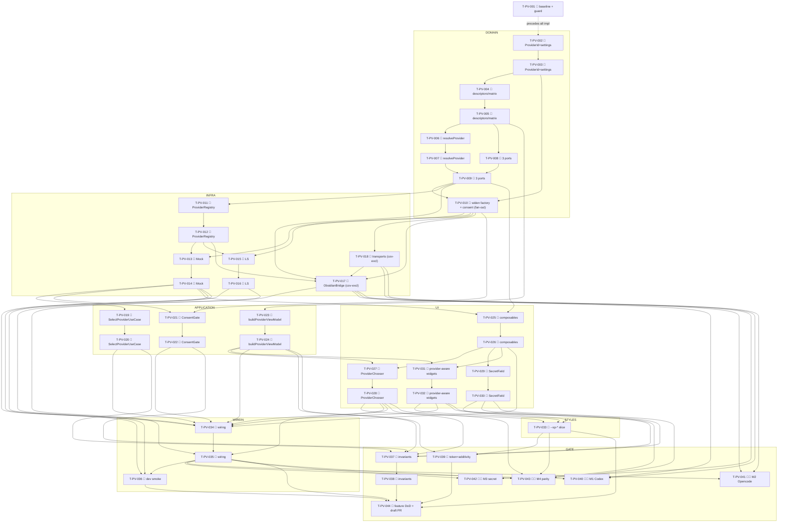

# Tasks — Providers registry (P9, the LARGEST phase)

Each task is ≤ ~½ day, has a stable `T-PV-NNN` id, references ≥ 1 SPEC-PV / TEST-PV / REQ-PV / NFR-PV,
names an owner, lists explicit dependencies, and has a testable Definition of Done. This decomposes
**SPEC-PV-001..034** (34 spec items) on top of the merged P1–P8 chat surface on the `next` integration
branch (P8 mcp-client #449 / ae7e9559): the **provider-agnostic** P1 `ChatRuntimePort` already carrying
`readonly providerId` / `getCapabilities()` / `getToolbarCapabilities()`, the P3 `ProviderHistoryPort`
(`createProviderHistoryPort(providerId)`), the P6 `ToolbarCatalogPort.getCatalog(providerId)`, the per-tab
`CHAT_RUNTIME_FACTORY` modal-seam handle, the EXCLUDED non-Claude `ProviderId`s, the device-local/native-
secret port + three-bridge pattern, and the P8 additive `ChatRuntimeQueryOptions` grow.

> **TDD ordering (mission discipline):** the RED test task for a contract comes **before** the
> implementation task that greens it. RED test tasks are owned by `qa`; implementation tasks by
> `dev`. **Every dev task's first DoD line is "the prior RED test(s) now pass".** This mirrors the
> P5/P6/P7/P8 task style the maintainer accepted (TASKS-CA-001 / TASKS-TC-001 / TASKS-AS-001 / TASKS-MC-001).

> **DDD inward layering order (the batch structure):**
> 1. **DOMAIN** — the widened `ProviderId` union (SPEC-PV-001, RED additivity leg — Claude-only byte-identical);
>    `ProviderDescriptor` + `ProviderCapabilities` (the frozen 3-provider capability matrix data) +
>    `DEFAULT_CHAT_PROVIDER_ID` + `PROVIDER_DESCRIPTORS` (SPEC-PV-002/022) + the pure `resolveProvider` helpers
>    (`listEnabledProviders`/`resolveActiveProvider`/`resolveProviderForModel`, SPEC-PV-003) + the
>    `enabledProviders`/`activeProvider` `PluginSettings` fields; the three new narrow ports
>    (`ProviderRegistryPort`/`SecretStorePort`/`HomeFsPort`) + the three keys + barrels (SPEC-PV-004/006/007);
>    the widened `CHAT_RUNTIME_FACTORY` `(providerId)→Result<ChatRuntimePort>` seam + `OPEN_PROVIDER_CONSENT`
>    (SPEC-PV-005, RED additivity/compile leg).
> 2. **INFRA** — the shared descriptor-table `ProviderRegistryPort` impl (SPEC-PV-008, coverage-included pure
>    data); the coverage-excluded `ObsidianBridge` runtime registry (Claude reuse / Codex JSON-RPC / Opencode
>    ACP) + real `SecretStorePort` (`app.secretStorage`) + real `HomeFsPort` (`node:fs`) (SPEC-PV-009 → manual
>    legs) + the Codex JSON-RPC + shared ACP transports (SPEC-PV-010 → manual legs); `MockBridge` (scriptable
>    registry/runtime/transport + in-memory secret + inert/seedable home-fs + `fake-ports` members,
>    SPEC-PV-011) + `LocalStorageBridge` (inert non-Claude runtime + in-memory secret + inert home-fs,
>    SPEC-PV-012).
> 3. **APPLICATION** — `SelectProviderUseCase` (resolve+activate+persist+reset+construct via the widened
>    factory, SPEC-PV-013) + `ProviderConsentGate` (one-time beyond-vault consent, SPEC-PV-014) + the PURE
>    `buildProviderViewModel` (chooser + capability-gated widget VM, SPEC-PV-015).
> 4. **UI** — `useProviderRegistryPort`/`useSecretStorePort`/`useHomeFsPort` (SPEC-PV-019);
>    `ProviderChooser.vue` + `ProviderOption.vue` (SPEC-PV-016); `ProviderSecretField.vue` (SPEC-PV-018); the
>    provider-aware P6 `ModelSelector`/`ThinkingSelector`/`ServiceTierToggle` + the rewind/fork/steer/MCP/
>    provider-command capability-gated affordances + the `opencode-model-picker` shape (SPEC-PV-017). Each
>    mounted component carries a co-located `data-testid` PageObject; RED component test before each. The
>    `ChatSurface`/`tabsStore` provider-selection + widened-factory + provider-addressed-history wiring
>    (SPEC-PV-020).
> 5. **STYLES** — the `provider-chooser`/`provider-secret`/`opencode-model-picker` + provider-brand `--sp-*`
>    token slice + the tokens-contract update (SPEC-PV-021), runnable anytime before the gate.
> 6. **WIRE-IN** — provide `PROVIDER_REGISTRY_PORT` + `SECRET_STORE_PORT` + `HOME_FS_PORT` + the **widened**
>    `CHAT_RUNTIME_FACTORY` + the `OPEN_PROVIDER_CONSENT` launcher in `AgentSidebarView` + `src/ui/main.ts`;
>    the tabs store passes the resolved active provider on `openTab`; history routes via
>    `createProviderHistoryPort(providerId)`; mount the chooser; `npm run dev` standalone smoke (SPEC-PV-020).
> 7. **GATE** — full `npm run verify` + `npm run test:all` + the grep gate (no `switch(providerId)`/no secret
>    leak / no `obsidian`/`node:*` under `src/ui/**` / coverage-exclusion) + the additivity byte-identical
>    proof + the parity self-review note + the manual real legs (TEST-PV-M1 Codex JSON-RPC / TEST-PV-M2
>    Opencode ACP / TEST-PV-M3 `app.secretStorage`+`minAppVersion`) + the parity screenshots (TEST-PV-M4) +
>    draft PR into `next` (orchestrator merges).
> A test for a layer may not depend on a layer further out.

> **The pure domain + the frozen matrix + the additive seam freeze early (carried from the design + spec
> hand-off, §0).** The widened `ProviderId` (SPEC-PV-001), the frozen `ProviderDescriptor`/capability matrix
> (SPEC-PV-002/022), the pure `resolveProvider` helpers (SPEC-PV-003), and the widened `CHAT_RUNTIME_FACTORY`
> signature (SPEC-PV-005) are sequenced FIRST so the registry impl + the use cases + the UI build on frozen
> types; a Claude-only configuration is proven byte-identical to P8 (TEST-PV-114, NFR-PV-001) before the
> bridges + the use cases + the UI build on top — mirroring the P6/P7/P8 ordering that froze the contract
> grow first.

> **Build-green discipline — the widened `CHAT_RUNTIME_FACTORY` is an INTERFACE change with same-task
> fan-out.** Unlike the P6/P7/P8 *purely-additive optional field* grows (no `implements` break), P9 **widens
> the `ChatRuntimeFactory` type** from `() => ChatRuntimePort` to `(providerId: ProviderId) =>
> Result<ChatRuntimePort>` (SPEC-PV-005). This is a type-level interface change, so the impl task (T-PV-006)
> MUST, **in the same task**, update **every** factory call site + the modal-seam handle + any provide-site so
> `npm run build` + `npm run typecheck` stay green: the per-tab provide in `AgentSidebarView` + `src/ui/main.ts`,
> the `useChatRuntimeFactory()` consumers in the chat surface / tabs store, and the three bridge factory
> bodies (each now `(providerId) => Result`). T-PV-006's DoD names this fan-out explicitly; T-PV-031 (the wire-in)
> finalises every site passing the *resolved* provider. The parameterised
> `createProviderHistoryPort(providerId)` / `getCatalog(providerId)` are **already** provider-parameterised in
> P3/P6 (UNCHANGED contracts — the seams merely receive the resolved provider at the wire-in, not a signature
> change). The three new ports (`ProviderRegistryPort`/`SecretStorePort`/`HomeFsPort`) are **new** interfaces
> with no prior impl, so adding them breaks nothing until a bridge declares `implements` — the bridge tasks add
> the impl + the `fake-ports` member in the same task so the build stays green.

> **Capability-matrix discipline — build the BACKED caps only; honest-false the GATED-OFF (open item #2, NG1).**
> The frozen `ProviderCapabilities` bag (SPEC-PV-002/022) is the single source of truth. The dev wires only the
> **BACKED** capabilities per the frozen matrix and sets the **GATED-OFF** flags to literal `false` — **no
> rewind/provider-commands/MCP is built for Codex; no rewind/fork/steer/MCP for Opencode.** The false flag
> hides/disables the affordance through the EXISTING capability-gated view-model (SPEC-PV-015/017), nothing new
> is built (REQ-PV-034/043). `listKeys` (open item #3) + the service-tier *live emission* are OFF the P9
> critical path — P9 ships the `listKeys` port method (no consumer) + the service-tier gating + Codex config
> only.

> **Lint discipline (the P5/P6/P7/P8 lesson):** every dev task runs the **WHOLE-project** `npm run lint`
> (0 errors), not just the changed files — the project gate catches per-file misses (sentence-case with the
> brand allowlist, `consistent-type-imports`, `strict-boolean-expressions`, the Result-discipline try/catch
> ban, the `no-restricted-imports` layer guards). New brand strings ("Codex", "Opencode") that appear in
> user-facing copy go through `TranslationPort` (en+de) and, if they trip `obsidianmd/ui/sentence-case`, are
> added to the `eslint.config.js` `brands` allowlist in the same UI task (mirroring the P8 `MCP` brand add).

> **lightningcss note (the P6/P7/P8 lesson):** all new `--sp-*` token-layer comments are **ASCII-only** (no
> em-dash / curly-quote / non-ASCII) — a non-ASCII comment in a `--sp-*` declaration breaks the `build:web`
> lightningcss pass. T-PV-027 (the styles task) carries this note.

> **Coverage-excluded infra (manual legs):** the **real** Codex app-server JSON-RPC-over-stdio transport, the
> **real** shared ACP transport, the **real** `SecretStorePort` (`app.secretStorage`), and the **real**
> `HomeFsPort` (`node:fs` over `~/.codex`/`~/.claude`) all live under `src/infrastructure/obsidian/**`
> (coverage-excluded per `vitest.config`, §10). Their behavioural gate is the **manual** legs **TEST-PV-M1**
> (the real Codex JSON-RPC transport + JSONL history + turn-steer + graceful shutdown + the real key in
> Obsidian) + **TEST-PV-M2** (the real Opencode ACP transport + modes/models/agents + ACP history + graceful
> shutdown) + **TEST-PV-M3** (the real `app.secretStorage` round-trip + the `minAppVersion` availability check
> + the no-`data.json` proof) + **TEST-PV-M4** (parity screenshots at 320/520/720 px, light + dark), plus the
> manual real-transport sub-legs **TEST-PV-030/031/032/033/035** (Codex), **TEST-PV-040/041/042/044**
> (Opencode), **TEST-PV-101** (bounded explicit spawn) — never self-claimed by an agent; recorded for the
> single final epic-review gate (autonomous drive). The PURE descriptor table / `resolveProvider` /
> `buildProviderViewModel`, the `SelectProviderUseCase` + `ProviderConsentGate` (over the scriptable Mock
> registry/secret/home-fs/runtime), the Mock scriptable runtime/transport (`scriptProviderStream` +
> `setProviderConstructMode` + `setTransportMode` + `seedSecret`/`setSecretStoreAvailable` +
> `seedHomeFile`) + the LocalStorage inert impls carry the unit/component weight + the 80/70/80/80 coverage
> gate (NFR-PV-007).

> **Deleted-symbol guard (ESLint) — NO relaxation needed (verified). The OLD pre-reboot provider/secret/MCP
> symbols were P0-deleted; the NEW P9 names are clean BUT one Obsidian-layer file-name glob collides — see the
> naming directive.** Verified against `eslint.config.js`:
> - **`DELETED_SUBSYSTEM_BAN`** does **not** list the new P9 paths
>   `@/domain/chat/providers/**`, `@/application/chat/providers/**`, `@/ui/chat/providers/**`, the new ports
>   `@/domain/ports/ProviderRegistryPort` / `@/domain/ports/SecretStorePort` / `@/domain/ports/HomeFsPort`, the
>   new infra `@/infrastructure/providers/**`, nor the new composables. `@/domain/chat` + `@/application/chat`
>   regrew in P1 and are off the ban list; there is no `@/ui/chat` ban glob (only `@/domain/feature` /
>   `@/application/feature` / `@/application/migration` are banned).
> - **`DELETED_INJECTION_KEYS`** does **not** contain `PROVIDER_REGISTRY_PORT` / `SECRET_STORE_PORT` /
>   `HOME_FS_PORT`. So **there is NO guard-relax task in P9.**
> - **The one collision to AVOID (a banned Obsidian-layer glob colliding with the new secret/home-fs/provider
>   infra):** the OLD pre-reboot secret store was named `ObsidianSecretStore*` and **`@/infrastructure/obsidian/
>   ObsidianSecretStore*` IS a still-banned `DELETED_SUBSYSTEM_BAN` glob** (alongside the old
>   `@/infrastructure/obsidian/ObsidianMcp*` / `@/infrastructure/obsidian/mcp/**` / `@/infrastructure/obsidian/
>   providers/**`-style legacy globs — T-PV-001 enumerates the exact set against the live `eslint.config.js`).
>   The P9 real-infra files (SPEC-PV-009/010) MUST therefore be named so as **NOT** to match any banned glob —
>   e.g. `src/infrastructure/obsidian/SecretStorage.ts` (NEVER `ObsidianSecretStore*`),
>   `src/infrastructure/obsidian/HomeFileSystem.ts`, and the transports placed so they do **not** match a
>   still-banned `obsidian/providers/**` / `obsidian/codex/**` / `obsidian/acp/**` legacy glob if one exists
>   (verify in T-PV-001; if a `providers/`-style glob is banned, name them e.g.
>   `src/infrastructure/obsidian/CodexRuntime.ts` + `src/infrastructure/obsidian/AcpTransport.ts` +
>   `src/infrastructure/obsidian/OpencodeRuntime.ts` at the obsidian-dir root, never under a banned subfolder,
>   exactly as P8 did for `VaultMcpConfigStore.ts`/`SdkMcpClient.ts`). The shared **coverage-included** registry
>   lives at `src/infrastructure/providers/ProviderRegistry.ts` (NOT `obsidian/**` — pure data; confirm
>   `@/infrastructure/providers/**` is not banned in T-PV-001). T-PV-001's DoD includes a one-line lint check
>   confirming the chosen new file names + the new keys/ports resolve clean; T-PV-009 (the Obsidian infra task)
>   carries the naming directive; T-PV-034 (the gate) re-confirms. **No scoped guard-relax is needed** — the fix
>   is a file-naming choice, not a ban edit.

> **Parity is a review-stage human task:** the P9 parity-screenshot capture (charter §5.1 / NFR-PV-009/010) for
> the provider chooser (>1 enabled + the Claude-only no-chooser seam), the per-provider model picker (incl. the
> `opencode-model-picker`), the Codex + Opencode toolbar (the capability-gated rewind/fork/steer/MCP/provider-
> command affordances + the service-tier toggle), the masked + disabled secret field, and the beyond-vault
> consent modal at 320 / 520 / 720 px, light + dark, is deferred to the single final epic-review human gate
> (TEST-PV-M4), not CI. The baseline-capture task (T-PV-001) runs first so a `claudian-main` `ProviderRegistry`
> / `modelRouting` / `capabilities.ts` / `codex` / `acp` / `HomeFileAdapter` / `opencode-model-picker.css`
> reference exists pre-impl.

## Legend

- 🧪 = test task (RED-first; owner `qa`)
- 🔨 = implementation task (owner `dev`)
- 📐 = design / scaffolding / baseline task
- 🚀 = release / ops / gate task
- 🪓 = may slice (touches multiple independent code paths; expect several PRs)
- 👤 = human-owned (never agent-self-claimed)

---

## Task list

### T-PV-001 📐 — Baseline-capture: `claudian-main` P9 provider reference + guard verification + the secret-infra file-naming directive

- **Description:** Before any P9 implementation, capture the `claudian-main` baseline for the P9 surfaces:
  the registry + resolve (`core/providers/ProviderRegistry.ts` — `getRegisteredProviderIds`,
  `getEnabledProviderIds:117-123`, `getCapabilities`, `getProviderDisplayName`, `createChatRuntime:45-48`,
  `resolveSettingsProviderId:133-150`, `resolveProviderForModel:152-183`), the descriptors
  (`core/providers/types.ts:24/40/55`, `providers/{claude,codex,opencode}/capabilities.ts` — the frozen
  capability flags), the Codex transport (`providers/codex/runtime/{CodexAppServerProcess,CodexRpcTransport}.ts`
  — the JSON-RPC-over-stdio, the per-request timeout/abort, the stderr ring-buffer, the SIGTERM→SIGKILL grace),
  the shared ACP transport (`providers/acp/{AcpSubprocess,AcpJsonRpcTransport}.ts`), the beyond-vault FS
  (`core/storage/HomeFileAdapter.ts` — rooted at `os.homedir()`), the secret posture, and the
  `opencode-model-picker.css` / provider-brand rules — into a `specs/providers-registry/parity-screenshots.md`
  skeleton (baseline column only: the chooser >1-enabled + the Claude-only no-chooser seam, the per-provider
  model picker incl. `opencode-model-picker`, the Codex + Opencode toolbar with the capability-gated
  affordances + the service-tier toggle, the masked + disabled secret field, the beyond-vault consent modal —
  at 320 / 520 / 720 px, light + dark). Confirm (one lint run) that the new `PROVIDER_REGISTRY_PORT` +
  `SECRET_STORE_PORT` + `HOME_FS_PORT` keys + the new paths (`@/domain/chat/providers/**`,
  `@/application/chat/providers/**`, `@/ui/chat/providers/**`, `@/infrastructure/providers/**`,
  `@/domain/ports/ProviderRegistryPort`, `@/domain/ports/SecretStorePort`, `@/domain/ports/HomeFsPort`) are
  **not** caught by `DELETED_SUBSYSTEM_BAN` / `DELETED_INJECTION_KEYS`, AND enumerate the **still-banned
  Obsidian-layer globs** against the live `eslint.config.js` (at minimum `@/infrastructure/obsidian/
  ObsidianSecretStore*`; record whether any `obsidian/providers/**` / `obsidian/codex/**` / `obsidian/acp/**` /
  `ObsidianMcp*` / `obsidian/mcp/**` glob is present) and record the **file-naming directive** for the Obsidian
  infra (SPEC-PV-009/010): the new real-transport + real-secret + real-home-fs files MUST NOT match any banned
  glob — name the secret infra e.g. `SecretStorage.ts` (**NEVER** `ObsidianSecretStore*`), the home-fs
  `HomeFileSystem.ts`, the runtimes/transports `CodexRuntime.ts` / `OpencodeRuntime.ts` / `AcpTransport.ts` at
  the `obsidian/` root, never under a banned subfolder. No production code.
- **Satisfies:** NFR-PV-009 (baseline leg), NFR-PV-007 (guard verification), SPEC-PV-002/008/009/010/016/017/018/021/022
- **Owner:** dev
- **Depends on:** —
- **Estimate:** S
- **Definition of done:**
  - [ ] `specs/providers-registry/parity-screenshots.md` exists with the per-surface × 320/520/720 × light/dark
        baseline matrix scaffolded, baseline column captured from `D:\Projects\claudian-main`
        (`ProviderRegistry` / `modelRouting` / `capabilities.ts` / `codex` / `acp` / `HomeFileAdapter` + the
        `opencode-model-picker.css` / provider-brand rules).
  - [ ] A one-line lint check confirms the deleted-symbol guard does **not** block the new keys / the new
        `@/domain/chat/providers/**` · `@/application/chat/providers/**` · `@/ui/chat/providers/**` ·
        `@/infrastructure/providers/**` · `ProviderRegistryPort` · `SecretStorePort` · `HomeFsPort` paths (no
        relaxation task needed); the still-banned Obsidian-layer globs (incl. `ObsidianSecretStore*`) are
        enumerated and the **Obsidian-infra file-naming directive** (avoid every banned glob; name the secret
        infra `SecretStorage.ts`, NEVER `ObsidianSecretStore*`) is recorded in `test-plan.md`.
  - [ ] No file under `src/` changed.

---

## Layer 1 — DOMAIN (SPEC-PV-001..007)

### T-PV-002 🧪 — RED: the widened `ProviderId` union + the `enabledProviders`/`activeProvider` settings fields (additivity / type-shape)

- **Description:** Author the failing structural/type-level + serialisation tests asserting (SPEC-PV-001/027):
  (a) `ProviderId` widens from `'claude'` to `'claude' | 'codex' | 'opencode'` — exactly three members; every
  P1–P8 `'claude'` site (the `ChatRuntimePort.providerId`, `ProviderHistoryPort.providerId`,
  `ToolbarCatalogPort.getCatalog`) type-checks **unchanged** (TEST-PV-005); (b) `PluginSettings` gains
  **exactly** the device-local `activeProvider: ProviderId` (default `'claude'`) + `enabledProviders:
  ProviderId[]` (default `[]` → both non-Claude disabled on a fresh install, REQ-PV-103), the P0–P8 settings
  fields (`locale`/`logLevel`/…) byte-identical, and a P8-shaped settings object (no recorded selection)
  resolves byte-identically to P8 (TEST-PV-114 settings leg, NFR-PV-001, SPEC-PV-027). Names TEST-PV-005/114.
- **Satisfies:** TEST-PV-005, TEST-PV-114 (settings/additivity leg), SPEC-PV-001, SPEC-PV-027, REQ-PV-005/103/114, NFR-PV-001
- **Owner:** qa
- **Depends on:** —
- **Estimate:** S
- **Definition of done:**
  - [ ] `tests/domain/chat/ProviderId.test.ts` (the widened union shape) + `tests/domain/settings/PluginSettings.ts.test.ts`
        (the `activeProvider`/`enabledProviders` additivity) exist, naming TEST-PV-005/114.
  - [ ] Tests fail (RED) — the widened union + the two settings fields do not yet exist (compile/run failure
        is the RED signal).

### T-PV-003 🔨 — `ProviderId.ts` widened + `PluginSettings.activeProvider`/`enabledProviders` fields

- **Description:** Implement per SPEC-PV-001/027: widen `src/domain/chat/ProviderId.ts` to
  `'claude' | 'codex' | 'opencode'` (additive — every P0–P8 `'claude'` site stays valid); **append**
  `activeProvider: ProviderId` (default `'claude'`) + `enabledProviders: ProviderId[]` (default `[]`) to
  `PluginSettings` + `DEFAULT_SETTINGS` (`src/domain/settings/PluginSettings.ts`), the P0–P8 fields
  byte-identical (device-local store, **never `data.json`**, ADR-PSR-002). Pure types/data; no behaviour, no
  `obsidian`/`node:*`/Vue/class. **Note (build-green):** the union widen is purely additive (the two new ids
  become assignable), so no P0–P8 `'claude'` site breaks; no companion-stub is needed here.
- **Satisfies:** SPEC-PV-001, SPEC-PV-027, REQ-PV-005/103, NFR-PV-001
- **Owner:** dev
- **Depends on:** T-PV-002
- **Estimate:** S
- **Definition of done:**
  - [ ] The prior RED tests (TEST-PV-005 widened-union + TEST-PV-114 settings leg) now pass; the two new
        settings fields default `'claude'` / `[]`; every P0–P8 `'claude'` site type-checks unchanged.
  - [ ] whole-project `npm run lint` 0 + `npm run typecheck` 0 + `npm run test` green; no
        `obsidian`/`node:*`/Vue import in `src/domain/**`.
  - [ ] Implementation-log entry added.

### T-PV-004 🧪 — RED: `ProviderDescriptor` + the frozen 3-provider capability matrix + `PROVIDER_DESCRIPTORS` + `DEFAULT_CHAT_PROVIDER_ID`

- **Description:** Author the failing unit tests for the frozen descriptor data (SPEC-PV-002/022), covering the
  full capability truth table: (a) `ProviderCapabilities` exposes exactly the SPEC-PV-002 flags
  (`supportsPersistentRuntime`/`supportsNativeHistory`/`supportsPlanMode`/`supportsRewind`/`supportsFork`/
  `supportsProviderCommands`/`supportsImageAttachments`/`supportsInstructionMode`/`supportsMcpTools`/
  `supportsTurnSteer`/`reasoningControl`/`needsApiKey`/`readsHomeDir` + `providerId`); `ProviderDescriptor`
  exposes `id`/`displayNameKey`/`blankTabOrder`/`capabilities`/`isEnabled(settings)`/`ownsModel(model)`; (b)
  the **frozen matrix** per SPEC-PV-022 — `CLAUDE_DESCRIPTOR` all-true caps with `supportsTurnSteer:false`,
  `needsApiKey:false`, `readsHomeDir:false`, `blankTabOrder:20`, `isEnabled → true` always (TEST-PV-021);
  `CODEX_DESCRIPTOR` `supportsRewind:false`/`supportsProviderCommands:false`/`supportsMcpTools:false`,
  `supportsTurnSteer:true`/`supportsFork:true`, `needsApiKey:true`/`readsHomeDir:true`, `blankTabOrder:15`
  (TEST-PV-022); `OPENCODE_DESCRIPTOR` `supportsRewind:false`/`supportsFork:false`/`supportsTurnSteer:false`/
  `supportsMcpTools:false`, `supportsProviderCommands:true`, `needsApiKey:true`/`readsHomeDir:true`,
  `blankTabOrder:10` (TEST-PV-023); `reasoningControl:'effort'` for all three; (c) each descriptor + its
  `capabilities` is `Object.freeze`d (TEST-PV-020, REQ-PV-020); (d) `blankTabOrder` distinct (10/15/20);
  `isEnabled(CLAUDE, anySettings) === true`, a non-Claude `isEnabled` reads `settings.enabledProviders`
  (membership), default-`[]` → both disabled (REQ-PV-103); `ownsModel` is a pure prefix/membership predicate
  per the BACKED model namespace, an unowned model → all three `false`; `PROVIDER_DESCRIPTORS` lists exactly
  the three; `DEFAULT_CHAT_PROVIDER_ID === 'claude'`; (e) all predicates **pure + total — never throw**. Names
  TEST-PV-020/021/022/023.
- **Satisfies:** TEST-PV-020, TEST-PV-021, TEST-PV-022, TEST-PV-023, SPEC-PV-002, SPEC-PV-022, REQ-PV-001/020/021/022/023/103, NFR-PV-014
- **Owner:** qa
- **Depends on:** T-PV-003
- **Estimate:** M
- **Definition of done:**
  - [ ] `tests/domain/chat/providers/ProviderDescriptor.test.ts` exists, naming TEST-PV-020/021/022/023,
        parameterised across the full SPEC-PV-022 matrix (per-flag BACKED/GATED-OFF per provider, the freeze
        assertion, the distinct `blankTabOrder`, the `isEnabled` claude-always-true + non-claude-membership,
        the `ownsModel` prefix predicate, the never-throws assertion).
  - [ ] Tests fail (RED) — `ProviderDescriptor.ts` does not yet exist.

### T-PV-005 🔨 — `ProviderDescriptor.ts` (the frozen matrix data) + `PROVIDER_DESCRIPTORS` + barrel

- **Description:** Implement `src/domain/chat/providers/ProviderDescriptor.ts` per SPEC-PV-002/022, regrown 1:1
  from `core/providers/types.ts` + `providers/{claude,codex,opencode}/capabilities.ts`: the
  `ProviderCapabilities` interface + the `ProviderDescriptor` interface + the three frozen descriptors
  (`CLAUDE_DESCRIPTOR`/`CODEX_DESCRIPTOR`/`OPENCODE_DESCRIPTOR`, each + its `capabilities` `Object.freeze`d per
  the matrix) + `PROVIDER_DESCRIPTORS: readonly ProviderDescriptor[]` + `DEFAULT_CHAT_PROVIDER_ID = 'claude'`.
  `isEnabled(CLAUDE) → true` constant; a non-Claude `isEnabled` reads `settings.enabledProviders` membership;
  `ownsModel` a pure prefix/membership predicate over the BACKED model lists. **Build the BACKED caps only;
  the GATED-OFF flags are literal `false`** (open item #2, NG1 — no half-built feature). Pure data + pure
  predicates, `readonly`, no class, no `obsidian`/`node:*`/Vue. Create/re-export from
  `src/domain/chat/providers/index.ts`.
- **Satisfies:** SPEC-PV-002, SPEC-PV-022, REQ-PV-001/020/021/022/023/103, NFR-PV-014
- **Owner:** dev
- **Depends on:** T-PV-004
- **Estimate:** M
- **Definition of done:**
  - [ ] The prior RED tests (TEST-PV-020/021/022/023) now pass across the full frozen matrix (the per-flag
        BACKED/GATED-OFF, the freeze, the distinct order, the `isEnabled`/`ownsModel` predicates, never-throws).
  - [ ] Only the BACKED capabilities are wired; the GATED-OFF flags are literal `false` (no half-built
        feature); each descriptor + its `capabilities` is frozen; whole-project `npm run lint` 0 +
        `npm run typecheck` 0 + `npm run test` green; no `obsidian`/`node:*`/Vue import in
        `src/domain/chat/providers/**`.
  - [ ] Implementation-log entry added.

### T-PV-006 🧪 — RED: the pure `resolveProvider` helpers (`listEnabledProviders`/`resolveActiveProvider`/`resolveProviderForModel`)

- **Description:** Author the failing unit tests for the pure/total resolve helpers (SPEC-PV-003), covering the
  Claudian truth table: (a) `listEnabledProviders(descriptors, settings)` filters by `isEnabled` + sorts
  ascending by `blankTabOrder` — a single-Claude registry → `[claude]` (REQ-PV-006); claude+codex enabled →
  `[codex, claude]` (order 15, 20, TEST-PV-002); returns a fresh array; (b) `resolveActiveProvider(descriptors,
  settings)` returns `settings.activeProvider` only when it is one of the three ids AND its descriptor
  `isEnabled`, else `'claude'` — no record → claude, unknown id → claude, disabled id → claude (TEST-PV-003,
  EC-PV-2/3); (c) `resolveProviderForModel(descriptors, model, settings)` returns the first `ownsModel(model)`
  descriptor's id, else `resolveActiveProvider(...)` (which falls back to claude) — a Codex-owned model →
  codex, an unowned model → the active/claude fallback (TEST-PV-060/061, EC-PV-9); (d) all three **pure + total
  — never throw**. Names TEST-PV-002/003/060/061 + EC-PV-2/3/9.
- **Satisfies:** TEST-PV-002, TEST-PV-003, TEST-PV-060, TEST-PV-061, SPEC-PV-003, SPEC-PV-029, REQ-PV-002/003/006/060/061, NFR-PV-014, EC-PV-2/3/9
- **Owner:** qa
- **Depends on:** T-PV-005
- **Estimate:** M
- **Definition of done:**
  - [ ] `tests/domain/chat/providers/resolveProvider.test.ts` exists, naming TEST-PV-002/003/060/061 + EC-PV-2/3/9,
        covering the blank-tab-ordered enabled filter, the active fallback (no-record/unknown/disabled → claude),
        the model-ownership resolve + the unowned-model fallback, the fresh-array + never-throws assertions.
  - [ ] Tests fail (RED) — `resolveProvider.ts` does not yet exist.

### T-PV-007 🔨 — `resolveProvider.ts` (pure `listEnabledProviders`/`resolveActiveProvider`/`resolveProviderForModel`) + barrel

- **Description:** Implement `src/domain/chat/providers/resolveProvider.ts` per SPEC-PV-003, ported from
  `ProviderRegistry.getEnabledProviderIds:117-123` + `resolveSettingsProviderId:133-150` +
  `resolveProviderForModel:152-183` with throw-paths converted to total returns: `listEnabledProviders` (the
  `isEnabled`-filtered, blank-tab-ordered fresh array; Claude always present), `resolveActiveProvider` (the
  recorded-if-registered-and-enabled, else `'claude'`), `resolveProviderForModel` (the first `ownsModel` match,
  else `resolveActiveProvider`). All three **pure + total — never throw**; no class, no `obsidian`, no
  `node:*`, no I/O. **No `switch (providerId)` / `if (provider === …)`** (NFR-PV-014). Re-export from
  `src/domain/chat/providers/index.ts`.
- **Satisfies:** SPEC-PV-003, SPEC-PV-029, REQ-PV-002/003/006/060/061, NFR-PV-014
- **Owner:** dev
- **Depends on:** T-PV-006
- **Estimate:** S
- **Definition of done:**
  - [ ] The prior RED tests (TEST-PV-002/003/060/061 + EC-PV-2/3/9) now pass; the functions never throw; no
        `switch (providerId)` branch.
  - [ ] whole-project `npm run lint` 0 + `npm run typecheck` 0 + `npm run test` green; no
        `obsidian`/`node:*`/Vue import in `src/domain/chat/providers/**`.
  - [ ] Implementation-log entry added.

### T-PV-008 🧪 — RED: `ProviderRegistryPort` + `SecretStorePort` + `HomeFsPort` + the three keys + barrels (structural)

- **Description:** Author the failing structural/type-level tests asserting (SPEC-PV-004/006/007): (a)
  `ProviderRegistryPort` exposes **exactly** the pure-synchronous total reads `listRegisteredProviders()`,
  `listEnabledProviders(settings)`, `getDescriptor(id)`, `getDisplayNameKey(id)`, `getCapabilities(id)`,
  `resolveActiveProvider(settings)`, `resolveProviderForModel(model, settings)` (no `Promise`, no I/O); (b)
  `SecretStorePort` exposes **exactly** `isAvailable(): boolean`, `getSecret(key): Promise<Result<string |
  null>>`, `setSecret(key, value): Promise<Result<void>>`, `deleteSecret(key): Promise<Result<void>>`,
  `listKeys(): Promise<Result<readonly string[]>>` + the `providerSecretKey(id) => 'provider.<id>.apiKey'`
  helper (deterministic); (c) `HomeFsPort` exposes **exactly** `isAvailable(): boolean`, `readFile(p):
  Promise<Result<string>>`, `exists(p): Promise<Result<boolean>>`, `listFolders(p): Promise<Result<readonly
  string[]>>` + the `HOME_FS_ROOTS = ['.codex', '.claude']` constant + the path-escape rule, **no write/delete
  method** (REQ-PV-081); (d) `PROVIDER_REGISTRY_PORT` + `SECRET_STORE_PORT` + `HOME_FS_PORT` are their **own**
  `InjectionKey`s in `@/infrastructure/bridge/ports` (alongside the existing keys, no aggregate); (e) the
  barrel `src/domain/ports/index.ts` re-exports `ProviderRegistryPort` / `ProviderDescriptor` /
  `ProviderCapabilities` / `SecretStorePort` / `providerSecretKey` / `HomeFsPort` / `HOME_FS_ROOTS` (appended).
  The behavioural contracts are the registry-impl / Mock / LS legs. Names the shape leg of TEST-PV-112.
- **Satisfies:** TEST-PV-112 (port-shape leg), SPEC-PV-004, SPEC-PV-006, SPEC-PV-007, REQ-PV-001/070..073/080..083/112, NFR-PV-006
- **Owner:** qa
- **Depends on:** T-PV-005
- **Estimate:** M
- **Definition of done:**
  - [ ] `tests/domain/ports/ProviderRegistryPort.test.ts` + `tests/domain/ports/SecretStorePort.test.ts` +
        `tests/domain/ports/HomeFsPort.test.ts` exist, naming the TEST-PV-112 shape leg, asserting the
        method/`Result` signatures + the `providerSecretKey`/`HOME_FS_ROOTS` constants + the no-write-method
        rule + the own keys + the barrel re-exports.
  - [ ] Tests fail (RED) — the three ports + the three keys + the barrel re-exports do not yet exist.

### T-PV-009 🔨 — `ProviderRegistryPort` + `SecretStorePort` + `HomeFsPort` + the three keys + barrel re-exports

- **Description:** Implement per SPEC-PV-004/006/007: the narrow read-only `src/domain/ports/
  ProviderRegistryPort.ts` (the seven pure-synchronous total reads; documented per-method contract per the
  spec table) + the narrow `src/domain/ports/SecretStorePort.ts` (`isAvailable`/`getSecret`/`setSecret`/
  `deleteSecret`/`listKeys`, all `Result`-typed where async; the `providerSecretKey(id)` helper; documented
  per-method contract — `getSecret` value only at the infra boundary, `listKeys` keys-never-values) + the
  narrow read-first `src/domain/ports/HomeFsPort.ts` (`isAvailable`/`readFile`/`exists`/`listFolders`; the
  `HOME_FS_ROOTS` constant; the path-escape rule documented; **no write/delete method**). Add the
  `PROVIDER_REGISTRY_PORT` + `SECRET_STORE_PORT` + `HOME_FS_PORT` `InjectionKey`s to
  `src/infrastructure/bridge/ports.ts` (no aggregate — keep the per-key header); re-export the types +
  constants/helper from `src/domain/ports/index.ts` (appended). One consumer each, one port each (ADR-008). No
  `obsidian`/`node:*`/Vue; no class.
- **Satisfies:** SPEC-PV-004, SPEC-PV-006, SPEC-PV-007, REQ-PV-001/070..073/080..083/112, NFR-PV-006
- **Owner:** dev
- **Depends on:** T-PV-008, T-PV-007
- **Estimate:** M
- **Definition of done:**
  - [ ] The prior RED tests (TEST-PV-112 port-shape leg) now pass (the method signatures, the constants/helper,
        the no-write-method rule, the own keys, the barrel re-exports).
  - [ ] whole-project `npm run lint` 0 + `npm run typecheck` 0 + `npm run test` green; **deleted-symbol guard
        green** (the three new keys / the new port paths resolve clean — no relaxation needed); no
        `obsidian`/`node:*` import in `src/domain/**`.
  - [ ] Implementation-log entry added.

### T-PV-010 🔨 — `modalSeam.ts` — widen `CHAT_RUNTIME_FACTORY` to `(providerId)→Result` + append `OPEN_PROVIDER_CONSENT` (same-task call-site fan-out) 🪓

> **INTERFACE-CHANGE FAN-OUT (build-green directive — §0):** widening `ChatRuntimeFactory` from
> `() => ChatRuntimePort` to `(providerId: ProviderId) => Result<ChatRuntimePort>` is a type-level interface
> change. This task MUST update **every** factory call site + the modal-seam handle + any provide-site **in the
> same task** so `npm run build` + `npm run typecheck` stay green: the `useChatRuntimeFactory()` consumers in
> the chat surface / tabs store, the per-tab provide in `AgentSidebarView` + `src/ui/main.ts` (each provides a
> `(providerId) => Result` stand-in returning the existing Claude runtime as `Result.ok` for `'claude'`), and
> any `ChatRuntimeFactory`-typed parameter. The RESOLVED-provider routing (every site passing the *resolved*
> active provider, default `'claude'`) is finalised at the wire-in (T-PV-031); this task only widens the
> signature + makes the build green with the default `'claude'` everywhere so the diff is byte-identical at
> runtime.

- **Description:** This is both the RED additivity/compile assertion **and** the widen — author the failing
  test then implement, per SPEC-PV-005/031: (a) **RED** `tests/ui/chat/modalSeam.ts.test.ts` extension —
  `ChatRuntimeFactory` is `(providerId: ProviderId) => Result<ChatRuntimePort>`; `useChatRuntimeFactory()`
  still throws-when-absent (the surface needs it); the **appended** `OpenProviderConsentFn = (providerId) =>
  Promise<boolean>` + `OPEN_PROVIDER_CONSENT` `InjectionKey`; `useOpenProviderConsent()` falls back to an
  **AUTO-DECLINE** (`false`) when absent (a missing launcher must never silently read beyond the vault,
  REQ-PV-082/113 — mirrors `useConfirmDelete`); the P3–P8 seam handles byte-identical (TEST-PV-010/011/082/113/114);
  (b) **GREEN** widen `src/ui/chat/modalSeam.ts` `ChatRuntimeFactory` + append the consent fn type + key +
  `useOpenProviderConsent()` (auto-decline fallback); update **every** factory call site + provide-site to the
  widened signature (passing the default `'claude'` for now). The seam keeps the Vue layer free of `obsidian`
  (NFR-PV-008). No `obsidian`/`node:*` import under `src/ui/**`.
- **Satisfies:** TEST-PV-010 (seam leg), TEST-PV-011 (seam leg), TEST-PV-082 (seam leg), TEST-PV-113 (seam leg), TEST-PV-114 (compile leg), SPEC-PV-005, SPEC-PV-031, REQ-PV-010/011/012/082/113/114, NFR-PV-001/008
- **Owner:** dev
- **Depends on:** T-PV-003, T-PV-009
- **Estimate:** M
- **Slice plan:** may slice as (a) the RED seam test + the signature widen, (b) the call-site/provide-site
  fan-out to the widened signature.
- **Definition of done:**
  - [ ] The prior RED seam tests pass (the widened `ChatRuntimeFactory` signature; the `OPEN_PROVIDER_CONSENT`
        key + the auto-decline fallback; the P3–P8 handles byte-identical); **every** factory call site +
        provide-site compiles against the widened signature (passing `'claude'` by default).
  - [ ] whole-project `npm run lint` 0 + `npm run typecheck` 0 + `npm run test` green + `npm run build` green
        (the interface-change fan-out is closed — no orphan call site); no `obsidian`/`node:*` import under
        `src/ui/**`; no `implements` break left dangling.
  - [ ] Implementation-log entry added (naming the fan-out sites touched).

---

## Layer 2 — INFRA (SPEC-PV-008..012)

### T-PV-011 🧪 — RED: the shared descriptor-table `ProviderRegistryPort` impl

- **Description:** Author the failing unit tests for the shared `ProviderRegistry` impl (SPEC-PV-008), over the
  frozen `PROVIDER_DESCRIPTORS` + the pure `resolveProvider` helpers, asserting: `listRegisteredProviders()` →
  the three frozen descriptors (TEST-PV-001); `listEnabledProviders(settings)` → the blank-tab-ordered enabled
  subset, Claude always present (TEST-PV-002); `getDescriptor(id)`/`getDisplayNameKey(id)`/`getCapabilities(id)`
  → the frozen descriptor fields (TEST-PV-013/020); `resolveActiveProvider`/`resolveProviderForModel` →
  delegate to the pure helpers (TEST-PV-003/060/061); a grep/AST assertion that the reader contains **no**
  `switch (providerId)` / `if (provider === …)` (TEST-PV-001/013, NFR-PV-014); total — never throws. Names
  TEST-PV-001/002/003/013/020/060/061.
- **Satisfies:** TEST-PV-001, TEST-PV-002, TEST-PV-003, TEST-PV-013 (registry-read leg), TEST-PV-020, TEST-PV-060, TEST-PV-061, SPEC-PV-008, SPEC-PV-029, REQ-PV-001/002/003/013/020..023/060/061, NFR-PV-014
- **Owner:** qa
- **Depends on:** T-PV-009
- **Estimate:** M
- **Definition of done:**
  - [ ] `tests/infrastructure/providers/ProviderRegistry.test.ts` exists, naming the listed TEST-PV ids,
        covering the registered/enabled lists + the descriptor/display-name/capability reads + the
        active/model resolve delegation + the no-`switch(providerId)` guard + the never-throws assertion.
  - [ ] Tests fail (RED) — `ProviderRegistry.ts` does not yet exist.

### T-PV-012 🔨 — `ProviderRegistry.ts` (the shared descriptor-table impl, coverage-included)

- **Description:** Implement `src/infrastructure/providers/ProviderRegistry.ts` per SPEC-PV-008: a single
  `ProviderRegistry` class implementing `ProviderRegistryPort` over the frozen `PROVIDER_DESCRIPTORS`
  (SPEC-PV-002) + the pure `resolveProvider` helpers (SPEC-PV-003). **The same impl is shared across the three
  bridges** (the table is plain data, no I/O — coverage-included, NOT under `obsidian/**`). **No
  `switch (providerId)`** (NFR-PV-014, SPEC-PV-029). Total — never throws. No `obsidian`/`node:*`/Vue import.
  Confirm `@/infrastructure/providers/**` is not a banned glob (T-PV-001).
- **Satisfies:** SPEC-PV-008, SPEC-PV-029, REQ-PV-001/002/003/013/020..023/060/061, NFR-PV-014
- **Owner:** dev
- **Depends on:** T-PV-011
- **Estimate:** S
- **Definition of done:**
  - [ ] The prior RED tests (TEST-PV-001/002/003/013/020/060/061) now pass; the reader has no
        `switch (providerId)`; never throws.
  - [ ] whole-project `npm run lint` 0 + `npm run typecheck` 0 + `npm run test` green; no
        `obsidian`/`node:*`/Vue import; the file lives at `src/infrastructure/providers/ProviderRegistry.ts`
        (coverage-included, not under a banned glob).
  - [ ] Implementation-log entry added.

### T-PV-013 🧪 — RED: scriptable `MockBridge` registry/runtime/transport + in-memory `SecretStorePort` + inert/seedable `HomeFsPort` + `fake-ports` members

- **Description:** Author the failing unit tests asserting (SPEC-PV-011): (a) the **Mock**
  `ProviderRegistryPort` is the shared descriptor-table impl (T-PV-012); (b) the **Mock** runtime registry —
  `createChatRuntime(providerId)` returns a **scriptable** Mock runtime per provider:
  `setProviderConstructMode(providerId, 'ok' | 'no-key' | 'no-cli' | 'unavailable')` drives the construct path
  to `Result.ok` / `Result.err(<reason>)` (the SPEC-PV-025 honest-gate matrix, TEST-PV-011/100); the Mock
  runtime exposes the provider's frozen `getCapabilities()`/`getToolbarCapabilities()` so the capability-gated
  view-model runs without a subprocess (REQ-PV-013/024); `scriptProviderStream(providerId, chunks)` queues a
  canned `StreamChunk` stream; `setTransportMode(providerId, 'stream' | 'timeout' | 'error-chunk')` drives the
  transport-state matrix (SPEC-PV-026, TEST-PV-050/051/052/053) — a `'timeout'` → `Result.err` (the transport
  stays usable, EC-PV-11), a `'error-chunk'` → a terminal `{type:'error'}` `StreamChunk` (EC-PV-12) — without a
  real process; (c) the **Mock** `SecretStorePort` is an **in-memory** map (cleared per session, REQ-PV-073);
  `isAvailable() → true` unless `setSecretStoreAvailable(false)` forces the unavailable gate (TEST-PV-072);
  `seedSecret(key, value)` / `getStoredKeys()` for assertions; **no real OS secret** touched; (d) the **Mock**
  `HomeFsPort` is **inert/seedable** — `isAvailable() → false` by default (REQ-PV-083); `seedHomeFile(path,
  text)` populates in-memory fixtures + flips availability `true` for the Codex JSONL history tests (no
  `node:fs`); the path-escape rule still applies (a seeded path outside `HOME_FS_ROOTS` → `err`, EC-PV-7); (e)
  `tests/__fakes__/fake-ports.ts` gains a `providerRegistry` member (the descriptor table), a `secretStore`
  member (the in-memory store + availability switch), a `homeFs` member (the inert/seedable store), and the
  scriptable runtime/transport switches wired into the factory so the multi-port select / consent / widget /
  chooser tests see them. Names the Mock backing of TEST-PV-011/050/051/052/053/070/072/073/080/081/083/100.
- **Satisfies:** TEST-PV-011 (Mock backing), TEST-PV-050, TEST-PV-051, TEST-PV-052, TEST-PV-053, TEST-PV-070 (Mock backing), TEST-PV-072 (Mock backing), TEST-PV-073, TEST-PV-080, TEST-PV-081, TEST-PV-083, TEST-PV-100 (Mock backing), SPEC-PV-011, REQ-PV-053/070..073/080..083/100, NFR-PV-007, EC-PV-7/10/11/12
- **Owner:** qa
- **Depends on:** T-PV-012, T-PV-010
- **Estimate:** M
- **Definition of done:**
  - [ ] `tests/infrastructure/mock/MockProviderRuntime.test.ts`, `tests/infrastructure/mock/MockSecretStore.test.ts`,
        `tests/infrastructure/mock/MockHomeFs.test.ts`, and the extended `tests/__fakes__/fake-ports.test.ts`
        (the `providerRegistry` + `secretStore` + `homeFs` + scriptable runtime/transport members) exist,
        naming the listed TEST-PV ids, covering `setProviderConstructMode` / `scriptProviderStream` /
        `setTransportMode` (stream/timeout/error-chunk) / `seedSecret` / `setSecretStoreAvailable` /
        `seedHomeFile` + the path-escape rule.
  - [ ] Tests fail (RED) — the scriptable Mock runtime/transport + the in-memory secret store + the
        inert/seedable home-fs + the factory members do not yet exist.

### T-PV-014 🔨 — `MockBridge` scriptable registry/runtime/transport + in-memory `SecretStorePort` + inert/seedable `HomeFsPort` + `fake-ports` members

- **Description:** Implement per SPEC-PV-011 under `src/infrastructure/mock/**`: the shared descriptor-table
  `ProviderRegistryPort` (T-PV-012); the scriptable runtime registry (`createChatRuntime(providerId)` →
  `Result` driven by `setProviderConstructMode`; the scriptable runtime exposing the frozen
  `getCapabilities()`/`getToolbarCapabilities()`; `scriptProviderStream` + `setTransportMode` driving the
  SPEC-PV-026 stream/timeout/error-chunk matrix, all `Result`/`StreamChunk`-typed, total); the in-memory
  `SecretStorePort` (`seedSecret`/`getStoredKeys`; `isAvailable()` defaults `true`, `setSecretStoreAvailable`
  forces the gate; cleared per session, no real OS secret); the inert/seedable `HomeFsPort`
  (`isAvailable()→false` by default; `seedHomeFile` populates fixtures + flips availability; the path-escape
  rule). Add the `providerRegistry` + `secretStore` + `homeFs` members + the scriptable runtime/transport
  switches to `tests/__fakes__/fake-ports.ts`. No `node:*`, no `obsidian`, total — never throws.
- **Satisfies:** SPEC-PV-011, REQ-PV-053/070..073/080..083/100, NFR-PV-007
- **Owner:** dev
- **Depends on:** T-PV-013
- **Estimate:** M
- **Definition of done:**
  - [ ] The prior RED tests (the scriptable runtime/transport matrix + the in-memory secret + the
        inert/seedable home-fs + the `fake-ports` members) now pass; the `fake-ports`
        `providerRegistry`/`secretStore`/`homeFs` members work for multi-port tests;
        `setProviderConstructMode` + `setTransportMode` + `setSecretStoreAvailable` + `seedHomeFile` drive the
        paths deterministically.
  - [ ] No `node:*`/`obsidian` import in Mock; total — never throws; whole-project `npm run lint` 0 +
        `npm run typecheck` 0 + `npm run test` green; implementation-log entry added.

### T-PV-015 🧪 — RED: `LocalStorageBridge` inert non-Claude runtime + in-memory `SecretStorePort` + inert `HomeFsPort`

- **Description:** Author the failing unit tests asserting (SPEC-PV-012): (a) the **LS** `ProviderRegistryPort`
  = the shared descriptor-table impl (T-PV-012); (b) the **LS** runtime registry —
  `createChatRuntime('claude')` → `Result.ok` (the LS Claude stand-in, unchanged P1);
  `createChatRuntime('codex' | 'opencode')` → **`Result.err`** with an "unavailable" reason (the demo has no
  Node subprocess, NFR-PV-012, REQ-PV-100, EC-PV-8) — degrades, never errors; (c) the **LS** `SecretStorePort`
  = an **in-memory** map (no real secret, REQ-PV-073); `isAvailable() → true` (so the secret field is
  exercisable in the demo without a real OS store); (d) the **LS** `HomeFsPort` = **inert** —
  `isAvailable() → false`; the read methods → `ok(absent/empty)` or the unavailable `err` (no `node:fs`,
  REQ-PV-083). Names the LS legs of TEST-PV-073/083/100 + EC-PV-8.
- **Satisfies:** TEST-PV-073 (LS leg), TEST-PV-083 (LS leg), TEST-PV-100 (LS leg), SPEC-PV-012, REQ-PV-073/083/100, NFR-PV-012, EC-PV-8
- **Owner:** qa
- **Depends on:** T-PV-012, T-PV-010
- **Estimate:** S
- **Definition of done:**
  - [ ] `tests/infrastructure/localstorage/LocalStorageProviderRuntime.test.ts` +
        `tests/infrastructure/localstorage/LocalStorageSecretStore.test.ts` +
        `tests/infrastructure/localstorage/LocalStorageHomeFs.test.ts` exist, naming the listed TEST-PV legs,
        covering the Claude-ok / non-Claude-unavailable runtime + the in-memory secret (`isAvailable→true`) +
        the inert home-fs (`isAvailable→false`, no `node:fs`).
  - [ ] Tests fail (RED) — the LS inert non-Claude runtime + in-memory secret + inert home-fs do not yet exist.

### T-PV-016 🔨 — `LocalStorageBridge` inert non-Claude runtime + in-memory `SecretStorePort` + inert `HomeFsPort`

- **Description:** Implement per SPEC-PV-012 under `src/infrastructure/localstorage/**`: the shared
  descriptor-table `ProviderRegistryPort` (T-PV-012); the runtime registry (`createChatRuntime('claude')` →
  `Result.ok` Claude stand-in; non-Claude → `Result.err` "unavailable", degrades never errors); the in-memory
  `SecretStorePort` (`isAvailable()→true`, no real secret); the inert `HomeFsPort` (`isAvailable()→false`, the
  read methods → `ok(absent/empty)` / unavailable `err`, no `node:fs`). Never throws across the boundary
  (NFR-PV-005). No `node:*`.
- **Satisfies:** SPEC-PV-012, REQ-PV-073/083/100, NFR-PV-012, EC-PV-8
- **Owner:** dev
- **Depends on:** T-PV-015
- **Estimate:** S
- **Definition of done:**
  - [ ] The prior RED tests (the LS Claude-ok/non-Claude-unavailable runtime + in-memory secret + inert
        home-fs legs of TEST-PV-073/083/100) now pass; the demo degrades non-Claude rather than erroring;
        never throws.
  - [ ] whole-project `npm run lint` 0 + `npm run typecheck` 0 + `npm run test` green; no `node:*` import;
        implementation-log entry added.

### T-PV-017 🔨 — `ObsidianBridge` runtime registry (Claude reuse / Codex JSON-RPC / Opencode ACP) + real `SecretStorePort` (`app.secretStorage`) + real `HomeFsPort` (`node:fs`) — coverage-excluded 🪓

> The **real** Codex app-server JSON-RPC transport, the **real** shared ACP transport, the **real**
> `app.secretStorage`, and the **real** `node:fs` home-fs live under `src/infrastructure/obsidian/**`
> (coverage-excluded). Their behavioural gate is the **manual** legs TEST-PV-M1 (Codex) / TEST-PV-M2 (Opencode)
> / TEST-PV-M3 (secret) + the manual sub-legs TEST-PV-030..033/035/040..042/044/101. The Mock/LS halves
> (T-PV-014/016) carry the automated proof.
>
> **FILE-NAMING DIRECTIVE (deleted-symbol guard — T-PV-001):** the new files MUST NOT match any still-banned
> Obsidian-layer glob. In particular **`@/infrastructure/obsidian/ObsidianSecretStore*` IS banned** — name the
> secret infra `src/infrastructure/obsidian/SecretStorage.ts` (NEVER `ObsidianSecretStore…`); name the home-fs
> `src/infrastructure/obsidian/HomeFileSystem.ts`; name the runtimes/transports
> `src/infrastructure/obsidian/{CodexRuntime,OpencodeRuntime,AcpTransport,CodexRpcTransport}.ts` at the
> `obsidian/` root, never under a banned subfolder (verify the exact banned set in T-PV-001) — exactly as P8
> named `VaultMcpConfigStore.ts`/`SdkMcpClient.ts`. No scoped guard-relax is needed (the fix is the file name).

- **Description:** Implement per SPEC-PV-009 under `src/infrastructure/obsidian/**` (coverage-excluded, names
  per the directive): (a) the runtime registry `createChatRuntime(providerId) → Result<ChatRuntimePort>` (the
  widened `CHAT_RUNTIME_FACTORY` target) — `'claude'` reuses the **P1 `ClaudeCliChatRuntime` unchanged** →
  `Result.ok` (byte-identical P8, SPEC-PV-031, REQ-PV-114); `'codex'` constructs a `CodexRuntime` owning the
  Codex JSON-RPC-over-stdio transport (T-PV-018), reads the key via `SecretStorePort.getSecret(providerSecretKey
  ('codex'))` into the subprocess env at this boundary (REQ-PV-071/101), JSONL history via `HomeFsPort`
  (SPEC-PV-034); `'opencode'` constructs an `OpencodeRuntime` owning the shared ACP transport (T-PV-018), same
  key/error story, ACP `loadSession` history; a no-key / no-CLI / transport-unavailable construction →
  `Result.err` with a human-readable reason (REQ-PV-011/100, EC-PV-4/5); each runtime exposes the frozen
  `getCapabilities()`/`getToolbarCapabilities()` matching its descriptor (the BACKED wired, the GATED-OFF
  `false`, REQ-PV-034/043); (b) the real `SecretStorePort` (`SecretStorage.ts`) over `app.secretStorage` —
  `isAvailable()` → whether `app.secretStorage` exists (the SPEC-PV-032 check);
  `getSecret`/`setSecret`/`deleteSecret`/`listKeys` over it; **NEVER `data.json`** (ADR-PV-002); (c) the real
  `HomeFsPort` (`HomeFileSystem.ts`) over `node:fs` rooted at `os.homedir()`, scoped to `HOME_FS_ROOTS` with
  the path-escape rule (SPEC-PV-007), `isAvailable() → true`. Coverage-excluded; no `obsidian`/`node:*` symbol
  leaks past these files.
- **Satisfies:** SPEC-PV-009, SPEC-PV-031, SPEC-PV-034, REQ-PV-010..012/030..035/040..044/070/071/080/101/114, NFR-PV-004/007 (manual leg)
- **Owner:** dev
- **Depends on:** T-PV-012, T-PV-009, T-PV-010, T-PV-018
- **Estimate:** M
- **Slice plan:** may slice as (a) the runtime registry + Claude reuse, (b) the real `SecretStorePort`, (c) the
  real `HomeFsPort`.
- **Definition of done:**
  - [ ] `ObsidianBridge` provides the runtime registry (`createChatRuntime`: Claude reuse `ok` / Codex+Opencode
        construct-or-`err`, each exposing the frozen capability bag) + the real `app.secretStorage`
        `SecretStorePort` (never `data.json`) + the real `node:fs` `HomeFsPort` (root-scoped, path-escape→err);
        files named per the directive (the secret infra is `SecretStorage.ts`, NEVER `ObsidianSecretStore*`;
        nothing under a banned glob); no `obsidian`/`node:*` symbol leaks past the files.
  - [ ] whole-project `npm run lint` 0 + `npm run typecheck` 0; the manual legs TEST-PV-M1/M2/M3 +
        TEST-PV-030..033/035/040..042/044/101 scheduled in `test-plan.md`.
  - [ ] Implementation-log entry added.

### T-PV-018 🔨 — the Codex JSON-RPC + shared ACP transports (line-delimited JSON-RPC 2.0 over stdio; timeout/abort/error-chunk; bounded spawn; SIGTERM→SIGKILL) — coverage-excluded 🪓

> The **real** transports live under `src/infrastructure/obsidian/**` (coverage-excluded). Their behavioural
> gate is the **manual** legs TEST-PV-M1 (Codex) / TEST-PV-M2 (Opencode) + TEST-PV-030/031/033/035/040/044/101.
> The scriptable Mock transport (T-PV-014, `setTransportMode`) carries the automated timeout/error-chunk/stream
> matrix (TEST-PV-050..053). **FILE-NAMING DIRECTIVE (T-PV-001/T-PV-017):** name the files at the `obsidian/`
> root (e.g. `CodexRpcTransport.ts` / `AcpTransport.ts`), never under a banned subfolder.

- **Description:** Implement per SPEC-PV-010 under `src/infrastructure/obsidian/**` (coverage-excluded), ported
  from `providers/codex/runtime/{CodexAppServerProcess,CodexRpcTransport}.ts` + `providers/acp/{AcpSubprocess,
  AcpJsonRpcTransport}.ts`: the Codex JSON-RPC transport + the shared ACP transport, each (the SPEC-PV-026
  state model) — **line-delimited JSON-RPC 2.0 over stdio** (client→server requests with a per-request timeout
  + `AbortController`, notifications, server→client request handlers; one newline-delimited frame per message,
  REQ-PV-050); **timeout/abort → `Result.err`** (the transport stays usable; no dangling promise, REQ-PV-051,
  EC-PV-11); **a dying subprocess → a terminal `{type:'error'}` `StreamChunk`** carrying the stderr ring-buffer
  detail, not a throw (the P1 streaming-error convention, REQ-PV-052, EC-PV-12); **bounded explicit spawn** —
  explicit cmd+args, bounded merged env `{ ...process.env, <secret/env from SecretStorePort>, PATH:
  enhancedPath }`, `windowsHide`, **no `shell:true`/string-eval**, Windows `.cmd` quoting (`cmd.exe /d /s /c`,
  `windowsVerbatimArguments`, REQ-PV-031/101); **graceful shutdown** — on cancel/reset abort the in-flight
  request + shut the subprocess down **SIGTERM → SIGKILL** after a bounded grace (3s, REQ-PV-035/044), never
  leak a process; the Codex turn-steer path injects a steer message into an in-progress turn
  (`supportsTurnSteer:true`, REQ-PV-033; Opencode has none, REQ-PV-043). **No new runtime dependency by
  default** (ADR-PV-003 §5, NFR-PV-011 — thin in-tree JSON-RPC-2.0-over-stdio; externalize + bundle only if a
  vendor SDK is ever genuinely required, never reaching `build:web`). Coverage-excluded; no `obsidian`/`node:*`
  symbol leaks past these files.
- **Satisfies:** SPEC-PV-010, SPEC-PV-026, REQ-PV-030..035/040..044/050..052/101, NFR-PV-004/005/007/011 (manual leg)
- **Owner:** dev
- **Depends on:** T-PV-010
- **Estimate:** M
- **Slice plan:** may slice as (a) the Codex JSON-RPC transport, (b) the shared ACP transport.
- **Definition of done:**
  - [ ] The Codex JSON-RPC + shared ACP transports implement the line-delimited JSON-RPC 2.0 framing + the
        per-request timeout/abort→`Result.err` + the dying-subprocess→terminal-error-`StreamChunk` + the
        bounded explicit spawn (no `shell:true`/eval; Windows `.cmd` quoting) + the SIGTERM→SIGKILL(3s)
        graceful shutdown + the Codex turn-steer; no new runtime dep (in-tree); files named per the directive;
        no `obsidian`/`node:*` symbol leaks past the files.
  - [ ] whole-project `npm run lint` 0 + `npm run typecheck` 0; the manual legs TEST-PV-M1/M2 +
        TEST-PV-030/031/033/035/040/044/101 scheduled in `test-plan.md`.
  - [ ] Implementation-log entry added.

---

## Layer 3 — APPLICATION (SPEC-PV-013..015)

### T-PV-019 🧪 — RED: `SelectProviderUseCase` (resolve+activate / persist device-local / reset prior / construct via the widened factory / auto-switch-for-model)

- **Description:** Author the failing unit tests for the use case (SPEC-PV-013), over the scriptable Mock
  registry + factory + the in-memory settings, asserting: (a) **`select(id, prior)`** — (1) `prior?.resetSession()`
  + `prior?.cancel()` (tear down the prior provider's session, no cross-provider leakage, REQ-PV-012, EC-PV-13);
  (2) `settings.saveSettings({ activeProvider: id })` device-local (**never `data.json`**, REQ-PV-004); (3)
  `runtimeFactory(id)` → on `ok` returns the runtime (a subsequent turn routes to it, TEST-PV-004/010); on
  `err` `feedback.notify`s an honest notice (`keyRequired`/`cliNotFound`/`unavailable` per the reason, **no key
  substring**) + returns the `err` — the chat stays usable, **no throw escapes** (REQ-PV-011/100, EC-PV-4/5/8,
  TEST-PV-011/100); (b) **`selectForModel(model, prior)`** — `registry.resolveProviderForModel(model,
  settings)`; if it differs from the active provider, `select(owning, prior)` (auto-switch, REQ-PV-060,
  TEST-PV-060); else a no-op `ok(prior)` (REQ-PV-061); (c) the secret read happens **inside** the runtime
  construction at the infra boundary, never in the use case (REQ-PV-071, TEST-PV-071); (d) no `switch
  (providerId)` (NFR-PV-014). Names TEST-PV-004/010/011/012/060/071/100 + EC-PV-4/5/8/13.
- **Satisfies:** TEST-PV-004, TEST-PV-010, TEST-PV-011, TEST-PV-012, TEST-PV-060, TEST-PV-071 (use-case leg), TEST-PV-100, SPEC-PV-013, SPEC-PV-023, SPEC-PV-029, REQ-PV-004/010/011/012/060/061/071/100, NFR-PV-005/014, EC-PV-4/5/8/13
- **Owner:** qa
- **Depends on:** T-PV-014
- **Estimate:** M
- **Definition of done:**
  - [ ] `tests/application/chat/providers/SelectProviderUseCase.test.ts` exists, naming the listed TEST-PV ids,
        driven by the scriptable Mock registry/factory/settings, covering select (reset-prior / persist
        device-local / construct-ok / construct-err honest-notice / no-throw) / selectForModel (auto-switch /
        no-op) / the no-key-substring-in-notice / the no-`switch(providerId)`.
  - [ ] Tests fail (RED) — `SelectProviderUseCase.ts` does not yet exist.

### T-PV-020 🔨 — `SelectProviderUseCase.ts` (resolve+activate+persist+reset+construct + auto-switch-for-model)

- **Description:** Implement `src/application/chat/providers/SelectProviderUseCase.ts` per SPEC-PV-013: the
  class `constructor(registry: ProviderRegistryPort, settings: SettingsPort, runtimeFactory: ChatRuntimeFactory,
  feedback: FeedbackService)`; `select(id, prior): Promise<Result<ChatRuntimePort>>` (reset+cancel the prior
  runtime; persist `activeProvider` device-local; `runtimeFactory(id)` → on `ok` return, on `err`
  `feedback.notify` an honest notice + return the `err`); `selectForModel(model, prior)` (resolve the owning
  provider; `select` when it differs, else no-op `ok(prior)`). The secret read is **inside** the runtime
  construction at the infra boundary, never here (REQ-PV-071). **Never throws across a port boundary**
  (`Result`-wrapped, NFR-PV-005); logs/notifies **no** secret/key value (REQ-PV-102); **no `switch
  (providerId)`** (NFR-PV-014). No `obsidian`/`node:*`/Vue import. Re-export from
  `src/application/chat/providers/index.ts`.
- **Satisfies:** SPEC-PV-013, SPEC-PV-023, SPEC-PV-029, REQ-PV-004/010/011/012/060/061/071/100/102, NFR-PV-005/014
- **Owner:** dev
- **Depends on:** T-PV-019
- **Estimate:** M
- **Definition of done:**
  - [ ] The prior RED tests (TEST-PV-004/010/011/012/060/071/100 + EC-PV-4/5/8/13) now pass across the select /
        selectForModel / reset-prior / persist-device-local / construct-err-honest-notice / no-throw paths.
  - [ ] `Result`-typed; never throws across the port boundary; logs/notifies no secret/key value; no
        `switch (providerId)`; no `obsidian`/`node:*`/Vue import.
  - [ ] whole-project `npm run lint` 0 + `npm run typecheck` 0 + `npm run test` green; implementation-log
        entry added.

### T-PV-021 🧪 — RED: `ProviderConsentGate` (one-time beyond-vault consent: consented / declined / already-recorded)

- **Description:** Author the failing unit tests for the consent gate (SPEC-PV-014/024), over the Mock settings
  + a stubbed `openConsent`, asserting: `ensureConsent(id)` reads the device-local record
  `provider.homeFsConsent.<id>`; a recorded `true` → `ok(true)` with **no prompt** (the consented path,
  REQ-PV-082, EC-PV-6); absent/`false` → `openConsent(id)` (the modal seam) once, record the boolean outcome
  device-local (so the prompt never repeats), return it; a **declining** user → `ok(false)` (the caller
  disables that provider's history honestly, `providers.consent.declined`, REQ-PV-082); the auto-decline
  fallback when the launcher is absent (`useOpenProviderConsent` → `false`, REQ-PV-113); a **Claude-only** user
  (`readsHomeDir:false`) never invokes the gate (REQ-PV-114); **no throw escapes** (NFR-PV-005). Names
  TEST-PV-082 + EC-PV-6.
- **Satisfies:** TEST-PV-082, SPEC-PV-014, SPEC-PV-024, REQ-PV-082/113/114, NFR-PV-003/005, EC-PV-6
- **Owner:** qa
- **Depends on:** T-PV-014, T-PV-010
- **Estimate:** S
- **Definition of done:**
  - [ ] `tests/application/chat/providers/ProviderConsentGate.test.ts` exists, naming TEST-PV-082 + EC-PV-6,
        covering the consented (no re-prompt) / declined (history disabled honestly) / already-recorded /
        auto-decline-when-absent / Claude-never-invokes paths + the never-throws assertion.
  - [ ] Tests fail (RED) — `ProviderConsentGate.ts` does not yet exist.

### T-PV-022 🔨 — `ProviderConsentGate.ts` (one-time beyond-vault consent)

- **Description:** Implement `src/application/chat/providers/ProviderConsentGate.ts` per SPEC-PV-014/024: the
  class `constructor(settings: SettingsPort, openConsent: OpenProviderConsentFn)`; `ensureConsent(id):
  Promise<Result<boolean>>` (read `provider.homeFsConsent.<id>` device-local → `ok(true)` with no prompt when
  `true`; else `openConsent(id)` once via the modal seam (**never `window.confirm`**, REQ-PV-113), record the
  outcome device-local, return it; declining → `ok(false)` so the caller disables that provider's history
  honestly). **Never throws** (NFR-PV-005); at most one modal open + one device-local write. No
  `obsidian`/`node:*`/Vue import. Re-export from `src/application/chat/providers/index.ts`.
- **Satisfies:** SPEC-PV-014, SPEC-PV-024, REQ-PV-082/113/114, NFR-PV-003/005
- **Owner:** dev
- **Depends on:** T-PV-021
- **Estimate:** S
- **Definition of done:**
  - [ ] The prior RED tests (TEST-PV-082 + EC-PV-6) now pass (consented-no-reprompt / declined-history-disabled
        / already-recorded / auto-decline / never-throws).
  - [ ] Never throws; uses the modal seam (never `window.confirm`); records device-local; no
        `obsidian`/`node:*`/Vue import; whole-project `npm run lint` 0 + `npm run typecheck` 0 +
        `npm run test` green; implementation-log entry added.

### T-PV-023 🧪 — RED: the PURE `buildProviderViewModel` (chooser rows + showChooser + capability-gated widget VM)

- **Description:** Author the failing unit tests for the pure transform (SPEC-PV-015/029), asserting:
  `buildProviderViewModel(enabled, active, activeCapabilities)` — (a) `options` maps the (already
  blank-tab-ordered) `enabled` descriptors to `ProviderOptionVM { id, displayNameKey, isActive, isDefault }`
  (`isDefault = id === DEFAULT_CHAT_PROVIDER_ID`, TEST-PV-090); (b) `showChooser = enabled.length > 1` — a
  single-Claude registry → `false` → no chooser → byte-identical P8 (REQ-PV-006/114, EC-PV-1, TEST-PV-006); (c)
  `widgets` reads **the active capability bag** field-for-field — `showRewind`/`showFork`/`showTurnSteer`/
  `showProviderCommands`/`showMcp` from the matching flags, `showServiceTier` from the descriptor's
  service-tier config (Codex only), `reasoningControl` from the bag — with **NO `switch (providerId)`** (a
  Codex bag → no rewind/commands/MCP; an Opencode bag → no rewind/fork/steer/MCP, TEST-PV-013/024/034/043/062/
  063/064, EC-PV-14/15); (d) pure + total — never throws. Names TEST-PV-006/013/024/034/043/062/063/064/090 +
  EC-PV-1/14/15.
- **Satisfies:** TEST-PV-006 (VM leg), TEST-PV-013 (VM leg), TEST-PV-024 (VM leg), TEST-PV-034 (VM leg), TEST-PV-043 (VM leg), TEST-PV-062 (VM leg), TEST-PV-063 (VM leg), TEST-PV-064 (VM leg), TEST-PV-090 (VM leg), SPEC-PV-015, SPEC-PV-029, REQ-PV-002/006/013/024/034/043/062/063/064/090/114, NFR-PV-014, EC-PV-1/14/15
- **Owner:** qa
- **Depends on:** T-PV-005
- **Estimate:** M
- **Definition of done:**
  - [ ] `tests/application/chat/providers/buildProviderViewModel.test.ts` exists, naming the listed TEST-PV
        ids, covering the chooser-rows + `isActive`/`isDefault`, the `showChooser = enabled>1` (single-Claude →
        false), the per-flag widget VM from each provider's capability bag (Codex/Opencode gated-off), the
        no-`switch(providerId)` + the never-throws assertion.
  - [ ] Tests fail (RED) — `buildProviderViewModel.ts` does not yet exist.

### T-PV-024 🔨 — `buildProviderViewModel.ts` (pure chooser + capability-gated widget VM) + barrel

- **Description:** Implement `src/application/chat/providers/buildProviderViewModel.ts` per SPEC-PV-015: the
  `ProviderOptionVM` / `ProviderWidgetVM` / `ProviderViewModel` DTOs + the pure
  `buildProviderViewModel(enabled, active, activeCapabilities): ProviderViewModel` (`options` from the enabled
  descriptors; `showChooser = enabled.length > 1`; `widgets` read field-for-field from the active capability
  bag). **Pure + total — never throws**; DTO-only (no domain instance crosses the store boundary); **no
  `switch (providerId)`** (the gating is the capability bag, NFR-PV-014, SPEC-PV-029). No `obsidian`/`node:*`/
  Vue import. Re-export from `src/application/chat/providers/index.ts`.
- **Satisfies:** SPEC-PV-015, SPEC-PV-029, REQ-PV-002/006/013/024/034/043/062/063/064/090/114, NFR-PV-014
- **Owner:** dev
- **Depends on:** T-PV-023
- **Estimate:** S
- **Definition of done:**
  - [ ] The prior RED tests (TEST-PV-006/013/024/034/043/062/063/064/090 + EC-PV-1/14/15 VM legs) now pass.
  - [ ] Pure/total; never throws; DTO-only; no `switch (providerId)`; no `obsidian`/`node:*`/Vue import.
  - [ ] whole-project `npm run lint` 0 + `npm run typecheck` 0 + `npm run test` green; implementation-log
        entry added.

---

## Layer 4 — UI (SPEC-PV-016..019, except wiring SPEC-PV-020 → Layer 6)

### T-PV-025 🧪 — RED: `useProviderRegistryPort` + `useSecretStorePort` + `useHomeFsPort` composables

- **Description:** Author the failing unit tests (SPEC-PV-019) asserting `useProviderRegistryPort()` /
  `useSecretStorePort()` / `useHomeFsPort()` each mirror `useVaultPort` — inject `PROVIDER_REGISTRY_PORT` /
  `SECRET_STORE_PORT` / `HOME_FS_PORT`, return the injected port when provided, throw a helpful "port was not
  provided" error when unprovided. One-port-one-composable, **no aggregate** (ADR-008, REQ-PV-112). Tested over
  the Mock ports. Names the composable leg of TEST-PV-112.
- **Satisfies:** TEST-PV-112 (composable leg), SPEC-PV-019, REQ-PV-112, NFR-PV-006
- **Owner:** qa
- **Depends on:** T-PV-009, T-PV-014
- **Estimate:** S
- **Definition of done:**
  - [ ] `tests/ui/composables/useProviderRegistryPort.test.ts` + `tests/ui/composables/useSecretStorePort.test.ts`
        + `tests/ui/composables/useHomeFsPort.test.ts` exist, naming the TEST-PV-112 composable leg, covering
        inject-when-provided + throw-when-unprovided.
  - [ ] Tests fail (RED) — the three composables do not yet exist.

### T-PV-026 🔨 — `useProviderRegistryPort.ts` + `useSecretStorePort.ts` + `useHomeFsPort.ts`

- **Description:** Implement `src/ui/composables/useProviderRegistryPort.ts` + `useSecretStorePort.ts` +
  `useHomeFsPort.ts` per SPEC-PV-019: each injects its own key, throws a helpful error when unprovided
  (mirroring `useVaultPort`), returns the injected port. **No aggregate** (REQ-PV-112); no `obsidian`/`node:*`
  import under `src/ui/**` (NFR-PV-006); DTO-only across any store boundary.
- **Satisfies:** SPEC-PV-019, REQ-PV-112, NFR-PV-006
- **Owner:** dev
- **Depends on:** T-PV-025
- **Estimate:** S
- **Definition of done:**
  - [ ] The prior RED tests (TEST-PV-112 composable leg) now pass.
  - [ ] No `obsidian`/`node:*` import under `src/ui/**`; no aggregate `usePorts`; whole-project
        `npm run lint` 0 + `npm run typecheck` 0 + `npm run test` green; implementation-log entry added.

### T-PV-027 🧪 — RED: `ProviderChooser.vue` + `ProviderOption.vue` (absent at ≤1 / list at >1 / select-emits / a11y) (POs co-located)

- **Description:** Author the failing component tests + co-located `data-testid` PageObjects
  (`ProviderChooser.po.ts`, `ProviderOption.po.ts`) per SPEC-PV-016: mounting `ProviderChooser` with `options:
  ProviderOptionVM[]` + `showChooser: boolean` renders **nothing** when `showChooser` is false (byte-identical
  P8, REQ-PV-006/114, EC-PV-1, TEST-PV-006); when true, lists the enabled providers in blank-tab order with the
  provider icon + display name + the active/default marker, `select(id)` emitted on activate (TEST-PV-001/002/
  090); `ProviderOption` renders one row (icon + name + active/default marker) emitting `select`. **A11y
  (REQ-PV-110):** keyboard-operable (focus, Enter/Space select, arrow-nav, Escape close), `aria-expanded` when a
  menu, the active provider announced (`aria-current` / a polite live region), each option an accessible name +
  the icon an accessible label; state cues are **text + border + icon, never colour-only** (TEST-PV-110);
  **no `v-html`** (TEST-PV-113). `data-testid`: `provider-chooser`, `provider-option`,
  `provider-option-active`, `provider-icon`. i18n via `TranslationPort` (en+de, SPEC-PV-030). Names
  TEST-PV-001/002/006/090/110/113/114 (A legs).
- **Satisfies:** TEST-PV-001 (A leg), TEST-PV-002 (A leg), TEST-PV-006 (A leg), TEST-PV-090, TEST-PV-110 (chooser leg), TEST-PV-113 (chooser leg), TEST-PV-114 (A leg), SPEC-PV-016, REQ-PV-001/002/003/004/006/090/110/113/114, NFR-PV-006/008/009
- **Owner:** qa
- **Depends on:** T-PV-024, T-PV-026
- **Estimate:** M
- **Definition of done:**
  - [x] `tests/ui/chat/providers/ProviderChooser.test.ts` + `ProviderChooser.po.ts` +
        `tests/ui/chat/providers/ProviderOption.test.ts` + `ProviderOption.po.ts` exist, naming the listed
        TEST-PV legs, querying by `data-testid` only, asserting the absent-at-≤1 / list-at->1 / select-emits /
        keyboard + AT names + non-colour cues + the no-`v-html`.
  - [x] Tests fail (RED) — `ProviderChooser.vue` / `ProviderOption.vue` do not yet exist. (commit `1ce7a10d`)

### T-PV-028 🔨 — `ProviderChooser.vue` + `ProviderOption.vue`

- **Description:** Implement `src/ui/chat/providers/ProviderChooser.vue` + `ProviderOption.vue` per SPEC-PV-016
  (`<script setup>`, presentational — props in / events out): `ProviderChooser` props `options:
  ProviderOptionVM[]` + `showChooser: boolean`, emits `select:[id]`; renders nothing when `!showChooser`
  (byte-identical P8); lists the options in order with the active/default marker; `ProviderOption` props
  `option: ProviderOptionVM`, emits `select`. A11y: keyboard-operable (focus/Enter/Space/arrow/Escape),
  `aria-expanded`, the active announced, accessible names, state cues text + border + icon (never colour-only).
  i18n via `TranslationPort` (en+de — the "Codex"/"Opencode" brand strings; if `obsidianmd/ui/sentence-case`
  trips, add the brand allowlist entry in `eslint.config.js` in this task). No `obsidian` import (NFR-PV-006);
  no `v-html` (NFR-PV-008); co-located POs present.
- **Satisfies:** SPEC-PV-016, SPEC-PV-030, REQ-PV-001/002/003/004/006/090/110/113/114, NFR-PV-006/007/008/009
- **Owner:** dev
- **Depends on:** T-PV-027
- **Estimate:** M
- **Definition of done:**
  - [x] The prior RED tests (TEST-PV-001/002/006/090/110/113/114 A legs) now pass (absent-at-≤1 /
        list-at->1 / select-emits / keyboard + AT + non-colour cues / no-`v-html`).
  - [x] No `obsidian`/`node:*` import under `src/ui/**`; no `v-html`; state cues text+border+icon; new strings
        via `TranslationPort` (en+de); the brand allowlist updated if needed; co-located POs present.
  - [x] whole-project `npm run lint` 0 + `npm run typecheck` 0 + `npm run test` green; implementation-log
        entry added. (commit `65aadc32`)

### T-PV-029 🧪 — RED: `ProviderSecretField.vue` (masked input / save-emits / disabled-when-unavailable / no-value-echo) (PO co-located)

- **Description:** Author the failing component test + co-located PageObject (`ProviderSecretField.po.ts`) per
  SPEC-PV-018: mounting `ProviderSecretField` with `providerId` + `available: boolean` shows a **masked** input
  (`type="password"`, no value echoed); `save(value)` emitted on submit (the wiring calls
  `SecretStorePort.setSecret(providerSecretKey(id), value)`, REQ-PV-070, TEST-PV-070/092); **the stored value is
  never rendered back into the DOM, never placed in a notice/log/store/DTO** (REQ-PV-102, NFR-PV-002,
  TEST-PV-092/102); when `available` is false the field is **disabled** with the honest
  `providers.secret.unavailable` message — **no plain-store fallback** (REQ-PV-072, EC-PV-10, TEST-PV-072).
  **A11y (REQ-PV-110):** associated label + accessible name, masked, visible focus. `data-testid`:
  `provider-secret-field`. i18n via `TranslationPort` (en+de). Names TEST-PV-070/072/092/102/110 (A legs).
- **Satisfies:** TEST-PV-070 (A leg), TEST-PV-072 (A leg), TEST-PV-092, TEST-PV-102 (field leg), TEST-PV-110 (secret leg), SPEC-PV-018, SPEC-PV-025, REQ-PV-070/072/092/102/110, NFR-PV-002/006/008/009, EC-PV-10
- **Owner:** qa
- **Depends on:** T-PV-026
- **Estimate:** M
- **Definition of done:**
  - [x] `tests/ui/chat/providers/ProviderSecretField.test.ts` + `ProviderSecretField.po.ts` exist, naming the
        listed TEST-PV legs, querying by `data-testid` only, asserting the masked input + save-emits + the
        disabled-with-`unavailable` state (no plain-store fallback) + the no-value-echo + the AT name/focus.
  - [x] Tests fail (RED) — `ProviderSecretField.vue` does not yet exist. (commit `e75af92c`)

### T-PV-030 🔨 — `ProviderSecretField.vue`

- **Description:** Implement `src/ui/chat/providers/ProviderSecretField.vue` per SPEC-PV-018 (`<script setup>`,
  presentational): props `providerId` + `available: boolean`; a masked `type="password"` input (no value
  echoed); emits `save:[value]`; renders **disabled** with `providers.secret.unavailable` when `!available`
  (no plain-store fallback). **The stored value never renders back into the DOM, never enters a
  notice/log/store/DTO** (REQ-PV-102, NFR-PV-002). A11y: associated label + accessible name, masked, visible
  focus. i18n via `TranslationPort` (en+de, SPEC-PV-030). No `obsidian` import (NFR-PV-006); no `v-html`
  (NFR-PV-008); co-located PO present.
- **Satisfies:** SPEC-PV-018, SPEC-PV-025, SPEC-PV-030, REQ-PV-070/072/092/102/110, NFR-PV-002/006/008/009
- **Owner:** dev
- **Depends on:** T-PV-029
- **Estimate:** S
- **Definition of done:**
  - [x] The prior RED tests (TEST-PV-070/072/092/102/110 A legs + EC-PV-10) now pass (masked / save-emits /
        disabled-unavailable / no-value-echo / AT).
  - [x] No `obsidian`/`node:*` import under `src/ui/**`; no `v-html`; the value never echoes back / never
        enters a notice/log/DTO; new strings via `TranslationPort` (en+de); co-located PO present.
  - [x] whole-project `npm run lint` 0 + `npm run typecheck` 0 + `npm run test` green; implementation-log
        entry added. (commit `54714b01`)

### T-PV-031 🧪 — RED: the provider-aware P6 widgets (ModelSelector incl. `opencode-model-picker` / ThinkingSelector / ServiceTierToggle / capability-gated rewind-fork-steer-MCP-provider-command affordances) (POs co-located)

- **Description:** Author the failing component tests + co-located PageObject updates per SPEC-PV-017 (extends
  the P6 SPEC-TC widgets — **CHANGED to read the active provider's catalog + capability bag, NOT to branch on
  `providerId`**), driven by the Mock registry + `getCatalog(active)` + `buildProviderViewModel`: (a)
  **`ModelSelector`** lists the **active** provider's models (grouped, provider icon), incl. the
  `opencode-model-picker` shape; switching the active provider re-lists from `getCatalog(active)` (REQ-PV-062,
  TEST-PV-062); (b) **`ThinkingSelector`** reflects the active provider's `reasoningControl` (`effort` for all
  three in P9); auto-hides on `none`/single (REQ-PV-063, TEST-PV-063); (c) **`ServiceTierToggle`** shown only
  where the descriptor configures it (Codex `zap`), hidden for claude/opencode (REQ-PV-064, TEST-PV-064); (d)
  the **rewind/fork/turn-steer/MCP/provider-command affordances** gate on the existing capability flags — a
  false flag **hides (or disables-with-an-accessible-reason)**, never clickable-but-dead (Codex → no
  rewind/commands/MCP; Opencode → no rewind/fork/steer/MCP, REQ-PV-024/034/043, TEST-PV-024/034/043, EC-PV-14/15);
  (e) a **mid-turn capability miss** on a still-visible path → a non-blocking `providers.notice.unsupported`
  notice + the session continues (REQ-PV-025, EC-PV-16, TEST-PV-025); (f) a grep/AST assertion that the widgets
  contain **no** `switch (providerId)` / `if (provider === …)` (TEST-PV-013). Reuse the existing P6 widget
  `data-testid`s + add `opencode-model-picker`. Names TEST-PV-013/024/025/034/043/062/063/064 (A legs).
- **Satisfies:** TEST-PV-013 (widget leg), TEST-PV-024 (A leg), TEST-PV-025, TEST-PV-034 (A leg), TEST-PV-043 (A leg), TEST-PV-062, TEST-PV-063, TEST-PV-064, SPEC-PV-017, SPEC-PV-025, SPEC-PV-029, REQ-PV-013/024/025/034/043/062/063/064, NFR-PV-006/008/014, EC-PV-14/15/16
- **Owner:** qa
- **Depends on:** T-PV-024, T-PV-026
- **Estimate:** M
- **Definition of done:**
  - [x] The P6 widget tests + POs (`ModelSelector.po.ts` / `ThinkingSelector.po.ts` / `ServiceTierToggle.po.ts`
        + the affordance POs) are extended, naming the listed TEST-PV legs, querying by `data-testid` only,
        asserting the active-provider re-list (incl. `opencode-model-picker`) / the `reasoningControl` reflect
        + auto-hide / the service-tier show-for-codex-hide-for-others / the capability-gated affordances
        (Codex/Opencode gated-off) / the mid-turn unsupported notice / the no-`switch(providerId)` guard.
        (ModelSelector PO + test extended for the opencode-picker shape; `no-provider-switch.test.ts` adds
        the source guard; the reasoning/service-tier/affordance gating is already capability-bag-driven —
        see the T-PV-031 log scope note.)
  - [x] Tests fail (RED) — the P6 widgets do not yet read the active provider's catalog/capability bag (they
        still render the Claude-only P6 lists/affordances). (commit `098fd7df` — the opencode-shape RED leg)

### T-PV-032 🔨 — provider-aware P6 widgets (ModelSelector incl. `opencode-model-picker` / ThinkingSelector / ServiceTierToggle / capability-gated affordances)

- **Description:** Implement per SPEC-PV-017 (extends the P6 SPEC-TC widgets, **additive — no new branch**):
  change `ModelSelector`/`ThinkingSelector`/`ServiceTierToggle` + the rewind/fork/turn-steer/MCP/provider-
  command affordances to read the **active** provider's `getCatalog(active)` + capability bag (via
  `buildProviderViewModel`), not to branch on `providerId`. `ModelSelector` lists the active provider's models
  (grouped, provider icon) incl. the `opencode-model-picker` shape, re-lists on provider switch;
  `ThinkingSelector` reflects `reasoningControl` (auto-hide on `none`/single); `ServiceTierToggle` shown only
  per the descriptor config (Codex `zap`); the affordances gate on the existing flags (a false flag hides or
  disables-with-an-accessible-reason); a mid-turn capability miss → a non-blocking
  `providers.notice.unsupported` notice + the session continues. **No `switch (providerId)`** (NFR-PV-014).
  i18n via `TranslationPort` (en+de, SPEC-PV-030). No `obsidian` import (NFR-PV-006); no `v-html` (NFR-PV-008);
  co-located POs present.
- **Satisfies:** SPEC-PV-017, SPEC-PV-025, SPEC-PV-029, SPEC-PV-030, REQ-PV-013/024/025/034/043/062/063/064, NFR-PV-006/008/014
- **Owner:** dev
- **Depends on:** T-PV-031
- **Estimate:** M
- **Definition of done:**
  - [x] The prior RED tests (TEST-PV-013/024/025/034/043/062/063/064 A legs + EC-PV-14/15/16) now pass; each
        widget re-lists/gates from the active provider's catalog/capability bag; the `opencode-model-picker`
        shape renders; a false flag hides/disables-with-reason (never clickable-but-dead).
  - [x] No `switch (providerId)`; no `obsidian`/`node:*` import under `src/ui/**`; no `v-html`; new strings via
        `TranslationPort` (en+de); co-located POs present.
  - [x] whole-project `npm run lint` 0 + `npm run typecheck` 0 + `npm run test` green; implementation-log
        entry added. (commit `42490bca`)

---

## Layer 5 — STYLES (SPEC-PV-021)

### T-PV-033 🔨 — `provider-chooser` / `provider-secret` / `opencode-model-picker` + provider-brand `--sp-*` token slice + tokens-contract update

- **Description:** Implement per SPEC-PV-021 the `provider-chooser`/`provider-secret`/`opencode-model-picker` +
  provider-brand `--sp-*` token slice (charter §3.10): **reuse** the existing token set (the P6
  `--sp-toolbar-widget-h`, `--sp-z-dropdown`, `--sp-shadow-dropup` + the base `--sp-border`, `--sp-radius-*`,
  `--sp-bg-*`, `--sp-surface-overlay`, `--sp-text-*`, `--sp-accent`, `--sp-space-*`, `--sp-font-*`); mint a new
  token **only** when no existing token maps, each a token-layer lookup (no hex / no raw Obsidian var / no
  physical-direction CSS property — the `lint-style-tokens` guard, NFR-PV-010): candidates
  `--sp-provider-brand-claude` (reuse `--sp-accent` if equivalent), `--sp-provider-brand-codex`,
  `--sp-provider-brand-opencode`, `--sp-model-picker-group-gap` (reuse `--sp-space-2` if equivalent); apply the
  slice to `ProviderChooser.vue` + `ProviderOption.vue` + `ProviderSecretField.vue` + the `opencode-model-picker`
  shape in `ModelSelector`; update the tokens-contract test. **lightningcss note:** all new token-layer comments
  are **ASCII-only** (no em-dash/curly-quote/non-ASCII) — the P6/P7/P8 lightningcss lesson (a non-ASCII comment
  in a `--sp-*` declaration breaks the `build:web` lightningcss pass). Runnable anytime before the gate.
- **Satisfies:** SPEC-PV-021, NFR-PV-010, REQ-PV-091, TEST-PV-091
- **Owner:** dev
- **Depends on:** T-PV-028, T-PV-030, T-PV-032
- **Estimate:** S
- **Definition of done:**
  - [ ] The `--sp-*` slice is applied to the chooser/option/secret-field/`opencode-model-picker`; any new token
        is a token-layer lookup (no hex / no raw Obsidian var / no physical property); the `lint-style-tokens`
        guard (TEST-PV-091) is green; all new token comments are ASCII-only (lightningcss-safe).
  - [ ] whole-project `npm run lint` 0 + `npm run typecheck` 0 + `npm run test` green + `npm run build:web`
        green (lightningcss pass clean) — or `build:web` deferred to the parent gate per the batch directive,
        the ASCII-only comment satisfying the lightningcss constraint by construction; implementation-log
        entry added.

---

## Layer 6 — WIRE-IN (SPEC-PV-020)

### T-PV-034 🧪 — RED: provide the three ports + the widened factory + the consent launcher + the tabs-store resolved-provider routing + provider-addressed history (wiring)

- **Description:** Author the failing wiring tests per SPEC-PV-020/031: (a) `AgentSidebarView` (production)
  `app.provide`s `PROVIDER_REGISTRY_PORT` + `SECRET_STORE_PORT` + `HOME_FS_PORT` (the `ObsidianBridge` impls)
  **plus** the **widened** `CHAT_RUNTIME_FACTORY` (`(providerId) => Result`) + the `OPEN_PROVIDER_CONSENT`
  launcher (the Obsidian `Modal` host); `src/ui/main.ts` (standalone) provides the `MockBridge`/
  `LocalStorageBridge` ports + the widened factory + a browser-safe stand-in consent launcher (no `window.*`);
  (b) **the tabs store passes the resolved active provider** to `CHAT_RUNTIME_FACTORY(providerId)` on `openTab`
  (default `'claude'`, SPEC-PV-031, TEST-PV-010/012) — switching provider resets the prior runtime before the
  next turn (TEST-PV-012, EC-PV-13); (c) **history routes via `createProviderHistoryPort(providerId)`** (the
  UNCHANGED P3 seam parameterised by the resolved provider, REQ-PV-084) — fork gated on `supportsFork`
  (TEST-PV-084, EC-PV-19/20); (d) the toolbar reads `getCatalog(activeProvider)` (REQ-PV-062); (e) the chooser
  is mounted (driven by `buildProviderViewModel`); (f) a **Claude-only** configuration provides exactly the P8
  wiring values for Claude → byte-identical P8 (SPEC-PV-027, TEST-PV-114); (g) the consent launcher is the
  modal seam (`OPEN_PROVIDER_CONSENT`, never `window.confirm`, TEST-PV-113). Names TEST-PV-010/012/082/084/113/114
  + the wiring leg of TEST-PV-112.
- **Satisfies:** TEST-PV-010 (wiring leg), TEST-PV-012 (wiring leg), TEST-PV-082 (wiring leg), TEST-PV-084, TEST-PV-113 (wiring leg), TEST-PV-114 (wiring leg), TEST-PV-112 (wiring leg), SPEC-PV-020, SPEC-PV-031, SPEC-PV-034, REQ-PV-010/012/062/082/084/114, NFR-PV-001
- **Owner:** qa
- **Depends on:** T-PV-020, T-PV-022, T-PV-024, T-PV-026, T-PV-028, T-PV-032, T-PV-014, T-PV-016
- **Estimate:** M
- **Definition of done:**
  - [ ] `tests/plugin/AgentSidebarView.ts.test.ts` (or the existing provide test) + `tests/ui/main.ts.test.ts`
        + `tests/ui/chat/ChatSurface.test.ts` + `ChatSurface.po.ts` are extended, naming the listed TEST-PV
        legs, asserting the three-port + widened-factory + consent-launcher provide + the tabs-store
        resolved-provider routing + the provider-addressed history (fork gated on `supportsFork`) + the chooser
        mount + the Claude-only byte-identical-P8 wiring + the consent-modal-seam (no `window.confirm`).
  - [ ] Tests fail (RED) — the three ports + the widened factory + the consent launcher are not yet provided,
        the tabs store does not yet pass the resolved provider, the history is not yet provider-addressed at the
        wire-in, and the chooser is not yet mounted.

### T-PV-035 🔨 — provide the three ports + the widened factory + the consent launcher; tabs-store resolved-provider routing; provider-addressed history; mount the chooser 🪓

- **Description:** Implement per SPEC-PV-020/031: in `src/plugin/AgentSidebarView.ts` `app.provide`
  `PROVIDER_REGISTRY_PORT` + `SECRET_STORE_PORT` + `HOME_FS_PORT` (the `ObsidianBridge` impls, T-PV-017)
  **plus** the **widened** `CHAT_RUNTIME_FACTORY` (`(providerId) => Result`, T-PV-017) + the
  `OPEN_PROVIDER_CONSENT` launcher (the Obsidian `Modal` host in `src/plugin/**` that mounts the consent modal
  for the beyond-vault read). In `src/ui/main.ts` (standalone) provide the `MockBridge`/`LocalStorageBridge`
  ports + the widened factory + a browser-safe stand-in consent launcher (no `window.confirm`/`prompt`). In the
  surface/tabs store: resolve the active provider (`registry.resolveActiveProvider(settings)`) + pass it to
  `CHAT_RUNTIME_FACTORY(providerId)` on `openTab` (default `'claude'`); route history via
  `createProviderHistoryPort(providerId)` (the UNCHANGED P3 seam, fork gated on `supportsFork`); the toolbar
  reads `getCatalog(activeProvider)`; mount `ProviderChooser` driven by `buildProviderViewModel` +
  `SelectProviderUseCase.select`; the beyond-vault history read passes through `ProviderConsentGate.ensureConsent`.
  A Claude-only configuration provides exactly the P8 wiring values for Claude → byte-identical P8
  (SPEC-PV-027). **No `switch (providerId)`** (NFR-PV-014); no `obsidian` import under `src/ui/**` (NFR-PV-006);
  no `v-html`/`window.confirm` (NFR-PV-008 — the consent via the modal seam, the notices via `NotificationPort`).
- **Satisfies:** SPEC-PV-020, SPEC-PV-031, SPEC-PV-034, REQ-PV-010/012/062/082/084/114, NFR-PV-001/006/008/014
- **Owner:** dev
- **Depends on:** T-PV-034, T-PV-017, T-PV-028
- **Estimate:** M
- **Slice plan:** may slice as (a) the production/standalone provides (the three ports + the widened factory +
  the consent launcher), (b) the tabs-store resolved-provider routing + the provider-addressed history + the
  chooser mount.
- **Definition of done:**
  - [ ] The prior RED tests (TEST-PV-010/012/082/084/113/114 + the TEST-PV-112 wiring leg) now pass; production
        provides the three ports + the widened factory + the Obsidian `Modal` consent launcher; standalone
        provides the Mock/LS ports + the widened factory + a browser-safe launcher; the tabs store passes the
        resolved provider; history is provider-addressed (fork gated on `supportsFork`); the chooser is mounted;
        a Claude-only config is byte-identical P8.
  - [ ] No `switch (providerId)`; no `obsidian` symbol under `src/ui/**`; no `v-html`/`window.confirm` (the
        consent via the seam, notices via `NotificationPort`); the manual legs TEST-PV-M1/M2/M3 scheduled in
        `test-plan.md`.
  - [ ] whole-project `npm run lint` 0 + `npm run typecheck` 0 + `npm run test` green; implementation-log
        entry added.

### T-PV-036 🧪 — `npm run dev` standalone smoke (chooser / provider switch / secret field / capability-gated widgets / Claude-only no-chooser)

- **Description:** Confirm `npm run dev` boots the standalone UI against `MockBridge`/`LocalStorageBridge` and
  exercises the P9 flows: the chooser (hidden at ≤1 enabled → seed `enabledProviders` → the chooser lists in
  blank-tab order), selecting a provider (the active switches, the widgets re-list/gate from the active
  capability bag — Codex/Opencode gated-off), the masked secret field (save / disabled-when-unavailable via the
  in-memory store availability switch), a non-Claude `createChatRuntime` → `err` "unavailable" on LS (the
  honest notice, the chat stays usable), and the Claude-only no-chooser byte-identical state. The deterministic
  mount + select legs are automated as a `tests/ui/main.ts.test.ts` extension; the interactive live-dev flow is
  a deferred human-run leg (the agent does not start the long-running dev server).
- **Satisfies:** TEST-PV-006 (dev leg), TEST-PV-062 (dev leg), TEST-PV-072 (dev leg), TEST-PV-090 (dev leg), TEST-PV-100 (dev leg), NFR-PV-006
- **Owner:** qa
- **Depends on:** T-PV-035, T-PV-014, T-PV-016
- **Estimate:** S
- **Definition of done:**
  - [ ] `npm run dev` boots; the chooser / provider switch / secret field / capability-gated widgets /
        Claude-only no-chooser flows are exercised against `MockBridge`/`LocalStorageBridge` (deterministic
        mount + select legs automated).
  - [ ] Result recorded in `test-plan.md` (the dev-leg legs automated; the interactive live-dev flow deferred
        to human run).

---

## Layer 7 — GATE (manual legs + feature DoD)

### T-PV-037 🧪 — RED: the cross-cutting invariants (no-secret-leak / no-`switch(providerId)` / explicit-enable-only / additivity / coverage-exclusion gate)

- **Description:** Author the failing cross-cutting invariant tests (SPEC-PV-027/028/029/030/033): (a) **no
  secret** in any rendered notice/log — `SelectProviderUseCase`/`FeedbackService`/`ProviderSecretField` surface
  **no** key/secret substring (TEST-PV-102, NFR-PV-002, EC-PV-18); (b) **the secret never crosses into a
  store/DTO** — the runtime reads the key via `getSecret` at the infra boundary into the env, no
  Pinia-store/DTO/notice/log carries it (TEST-PV-071, NFR-PV-002); (c) **explicit-enable-only** — a fresh
  install (`enabledProviders: []`, Claude default) spawns/reads/auths nothing for a non-Claude provider
  (TEST-PV-103, REQ-PV-103, EC-PV-17); (d) the **no-`switch(providerId)`** grep across `src/application/**` +
  `src/ui/**` (`SelectProviderUseCase`/`ProviderConsentGate`/`buildProviderViewModel`/`ChatSurface`/the chooser/
  the provider-aware widgets, TEST-PV-013, NFR-PV-014); (e) the no-`v-html`/`obsidian`/`node:*` check across
  `src/ui/**` + every new `.vue` has a co-located `.po.ts` (TEST-PV-112/113, NFR-PV-006/008); (f) the
  **path-escape** rule — a home-fs path escaping `HOME_FS_ROOTS` → `Result.err`, no write/delete method exists
  (TEST-PV-081, REQ-PV-081, EC-PV-7); (g) the **coverage-exclusion** assertion — the real transports + home-fs
  + secret store are coverage-excluded `obsidian/**`, the Mock/LS + pure carry the suite (TEST-PV-111,
  NFR-PV-007); (h) the **additivity** gate — a Claude-only configuration's surface/toolbar/routing/runtime-query
  diff against P8 is empty (TEST-PV-114, NFR-PV-001, EC-PV-1). Names TEST-PV-013/071/081/102/103/111/112/113/114.
- **Satisfies:** TEST-PV-013 (grep gate), TEST-PV-071 (gate leg), TEST-PV-081, TEST-PV-102, TEST-PV-103, TEST-PV-111, TEST-PV-112 (grep/PO leg), TEST-PV-113, TEST-PV-114 (additivity gate), SPEC-PV-027, SPEC-PV-028, SPEC-PV-029, SPEC-PV-030, SPEC-PV-033, NFR-PV-001/002/003/006/007/008/013/014, EC-PV-1/7/17/18
- **Owner:** qa
- **Depends on:** T-PV-020, T-PV-022, T-PV-024, T-PV-028, T-PV-030, T-PV-032
- **Estimate:** M
- **Definition of done:**
  - [ ] `tests/application/chat/providers/SelectProviderUseCase.security.test.ts`
        (no-secret-leak/explicit-enable-only) + the `src/ui/**` no-`v-html`/`obsidian`/`node:*` + PO-presence +
        no-`switch(providerId)` lint/grep legs + the path-escape leg + the coverage-exclusion config assertion +
        the additivity serialisation leg exist, naming the listed TEST-PV ids.
  - [ ] Tests fail (RED) where they target not-yet-final behaviour (or pass-as-guard for the lint legs),
        recorded as the invariant baseline for the gate.

### T-PV-038 🔨 — green the cross-cutting invariants (no-secret-leak / explicit-enable-only / no-switch / path-escape / additivity)

- **Description:** Make the T-PV-037 invariant tests pass: confirm `SelectProviderUseCase`/`FeedbackService`/
  the secret field surface only the *category* (never a key/secret substring — REQ-PV-102, NFR-PV-002); confirm
  the runtime reads the key only at the infra boundary into the env, no store/DTO carries it (REQ-PV-071);
  confirm a fresh install (`enabledProviders: []`) spawns/reads/auths nothing for a non-Claude provider
  (REQ-PV-103); confirm zero `switch (providerId)` across `src/application/**` + `src/ui/**` (REQ-PV-013); the
  path-escape rule rejects an escaping path (REQ-PV-081); the Claude-only configuration is byte-identical P8
  (NFR-PV-001); fix any leak found. No behaviour change beyond closing the invariant.
- **Satisfies:** TEST-PV-013, TEST-PV-071, TEST-PV-081, TEST-PV-102, TEST-PV-103, TEST-PV-111, TEST-PV-114, SPEC-PV-027, SPEC-PV-028, SPEC-PV-029, NFR-PV-001/002/003/014
- **Owner:** dev
- **Depends on:** T-PV-037
- **Estimate:** S
- **Definition of done:**
  - [ ] The prior RED tests (TEST-PV-013/071/081/102/103/111/114) now pass — no secret in any notice/log/store/
        DTO; explicit-enable-only; no `switch (providerId)`; path-escape rejected; the Claude-only surface
        byte-identical to P8.
  - [ ] whole-project `npm run lint` 0 + `npm run typecheck` 0 + `npm run test` green; implementation-log
        entry added.

### T-PV-039 🧪 — `--sp-*` token guard + the additivity serialisation gate (automated)

- **Description:** Author/extend the automated guard tests that hold at the gate: (a) TEST-PV-091 — the
  `provider-chooser`/`provider-secret`/`opencode-model-picker` slice has no raw hex / raw Obsidian var /
  physical property leak (NFR-PV-010, the `lint-style-tokens` guard); (b) the **additivity** serialisation gate
  — a Claude-only configuration (`enabledProviders: []`, `activeProvider: 'claude'`) yields
  `listEnabledProviders → [claude]`, `showChooser → false`, `resolveActiveProvider → 'claude'`,
  `CHAT_RUNTIME_FACTORY('claude') → Result.ok` with the same runtime as P8, no secret/home-fs port touched, the
  toolbar/history/query byte-identical (TEST-PV-114, NFR-PV-001, EC-PV-1). Names TEST-PV-091/114.
- **Satisfies:** TEST-PV-091, TEST-PV-114 (additivity gate), SPEC-PV-021, SPEC-PV-027, NFR-PV-001/010, EC-PV-1
- **Owner:** qa
- **Depends on:** T-PV-024, T-PV-033
- **Estimate:** S
- **Definition of done:**
  - [ ] `tests/ui/styles/tokens.test.ts` (the `--sp-*` slice guard) + the additivity serialisation leg in the
        domain/application tests are extended/green, naming TEST-PV-091/114, asserting the byte-identity + the
        no-leak guard.
  - [ ] whole-project `npm run lint` 0 + `npm run typecheck` 0 + `npm run test` green; implementation-log
        entry added.

### T-PV-040 🚀👤 — MANUAL: the real Codex JSON-RPC transport + JSONL history + turn-steer + graceful shutdown + the real key (TEST-PV-M1 + TEST-PV-030/031/032/033/035/101) — human-run

> **Never self-claimed by an agent.** The `ObsidianBridge` real Codex JSON-RPC transport + the real JSONL
> history read are coverage-excluded infra; this is their sole behavioural gate. The agent only schedules and
> records it.

- **Description:** On an Obsidian desktop install with the Codex CLI on PATH + a stored key, confirm: (1) the
  **real Codex app-server JSON-RPC transport** spawns (bounded explicit cmd+args + the merged env
  `{ ...process.env, <key from SecretStorePort>, PATH: enhanced }` + `windowsHide`, **no `shell:true`**/eval —
  TEST-PV-031/101, REQ-PV-031/101) and streams a turn (TEST-PV-030, REQ-PV-030); (2) the Windows `.cmd` quoting
  starts the process without arg-mangling (TEST-PV-031); (3) a **Codex JSONL session file** parses into the P3
  history shape + resume picks up the session (via `HomeFsPort`, consented — TEST-PV-032, REQ-PV-032, EC-PV-20);
  (4) **turn-steer** injects a steer message into an in-progress turn (`supportsTurnSteer:true`, TEST-PV-033,
  REQ-PV-033); (5) a cancelled turn aborts the RPC + terminates the subprocess (SIGTERM→SIGKILL on timeout),
  the host stays responsive (TEST-PV-035, REQ-PV-035); (6) the real key is read via `getSecret` at the infra
  boundary into the env, no notice/log/store carries it (REQ-PV-070/071). Proves SPEC-PV-009/010/034 against
  the real Obsidian + Codex runtime.
- **Satisfies:** TEST-PV-M1, TEST-PV-030, TEST-PV-031, TEST-PV-032, TEST-PV-033, TEST-PV-035, TEST-PV-101, SPEC-PV-009, SPEC-PV-010, SPEC-PV-034, REQ-PV-030..035/070/071/080/101
- **Owner:** human
- **Depends on:** T-PV-017, T-PV-018, T-PV-035
- **Estimate:** S
- **Definition of done:**
  - [ ] The real Codex JSON-RPC transport spawns (bounded args asserted; no `shell:true`/eval; Windows `.cmd`
        quoting) + streams a turn; the JSONL history parses into the P3 shape + resume works; turn-steer
        injects mid-turn; a cancel aborts + SIGTERM→SIGKILL terminates; the real key stays out of every
        notice/log/store; recorded in `test-report.md` with reviewer name + date.

### T-PV-041 🚀👤 — MANUAL: the real Opencode ACP transport + modes/models/agents + ACP history + graceful shutdown (TEST-PV-M2 + TEST-PV-040/041/042/044) — human-run

> **Never self-claimed by an agent.** The `ObsidianBridge` real shared ACP transport + the real ACP history
> read are coverage-excluded infra; this is their sole behavioural gate. The agent only schedules and records
> it.

- **Description:** On an Obsidian desktop install with the Opencode CLI on PATH + a stored key, confirm: (1)
  the **real Opencode ACP transport** spawns + establishes the JSON-RPC stdio channel (bounded explicit spawn,
  no `shell:true`/eval, REQ-PV-040/101, TEST-PV-040); (2) the ACP modes/models/agents surface in the mode/model
  selectors + provider commands (REQ-PV-041, TEST-PV-041); (3) ACP `loadSession` maps into the P3 history
  shape, resume works, and **fork is NOT offered** (`supportsFork:false`, REQ-PV-042/084, TEST-PV-042, EC-PV-19);
  (4) a cancelled turn aborts the ACP request + SIGTERM→SIGKILL(3s), the host stays responsive (REQ-PV-044,
  TEST-PV-044); (5) the real key stays out of every notice/log/store (REQ-PV-070/071). Proves SPEC-PV-009/010/034
  against the real Obsidian + Opencode runtime.
- **Satisfies:** TEST-PV-M2, TEST-PV-040, TEST-PV-041, TEST-PV-042, TEST-PV-044, SPEC-PV-009, SPEC-PV-010, SPEC-PV-034, REQ-PV-040..044/080/084/101
- **Owner:** human
- **Depends on:** T-PV-017, T-PV-018, T-PV-035
- **Estimate:** S
- **Definition of done:**
  - [ ] The real Opencode ACP transport spawns + establishes the channel (bounded args; no `shell:true`/eval);
        the modes/models/agents surface; `loadSession` maps into the P3 shape + resume works + fork is NOT
        offered; a cancel aborts + SIGTERM→SIGKILL(3s) terminates; the real key stays out of every
        notice/log/store; recorded in `test-report.md` with reviewer name + date.

### T-PV-042 🚀👤 — MANUAL: the real `app.secretStorage` round-trip + the `minAppVersion` availability check (escalate-not-bump) + the no-`data.json` proof (TEST-PV-M3) — human-run

> **Never self-claimed by an agent.** The `ObsidianBridge` real `app.secretStorage` `SecretStorePort` is
> coverage-excluded infra; this is its sole behavioural gate + the manifest verdict. The agent only schedules
> and records it.

- **Description:** On an Obsidian desktop install at the current `minAppVersion 1.12.7`, confirm: (1) the real
  `app.secretStorage` **round-trips** — `setSecret(provider.codex.apiKey, …)` then `getSecret` returns it; a
  `data.json` / device-local read carries **no** secret (TEST-PV-070, REQ-PV-070, NFR-PV-002); (2) the
  **`minAppVersion` availability check** — verify `app.secretStorage` exists at `1.12.7`; if it does, **keep
  `manifest.json` untouched** (the user-confirmed intentional 1.12.7 policy, do not flag/revert); if it
  provably requires a newer Obsidian, **ESCALATE to the human with the evidence + the proposed bump — do NOT
  silently raise `minAppVersion`** (SPEC-PV-032, NFR-PV-011, CLAR-PV-004); the default posture is keep 1.12.7 +
  capability-gate (REQ-PV-072) so a host without secret storage degrades; (3) `isAvailable()` reflects the real
  `app.secretStorage` presence; an unavailable host disables the secret field with no plain-store fallback
  (EC-PV-10). Proves SPEC-PV-009/032 + NFR-PV-011 against the real Obsidian secret storage.
- **Satisfies:** TEST-PV-M3, TEST-PV-070 (real leg), TEST-PV-072 (real leg), SPEC-PV-009, SPEC-PV-032, REQ-PV-070/072, NFR-PV-002/011
- **Owner:** human
- **Depends on:** T-PV-017, T-PV-035
- **Estimate:** S
- **Definition of done:**
  - [ ] The real `app.secretStorage` round-trips (no secret in `data.json`/device-local); the `minAppVersion`
        availability check is recorded with the verdict (keep 1.12.7 / escalate-with-evidence — never silently
        bump); the unavailable host degrades (no plain-store fallback); recorded in `test-report.md` +
        `manifest.json` verdict in the PR description, with reviewer name + date.

### T-PV-043 🚀👤 — MANUAL: parity screenshots vs claudian at 320/520/720 px, light + dark (TEST-PV-M4) — human-run

> **Never self-claimed by an agent.** The visual parity gate for the chooser / per-provider model picker /
> Codex+Opencode toolbar / masked+disabled secret / consent modal / Claude-only no-chooser against
> `claudian-main` is a human-judgement leg accumulating for the single final epic-review gate. The agent only
> schedules and records it.

- **Description:** On an Obsidian desktop install, capture the **parity screenshots** — (1) the provider chooser
  (>1 enabled) + the Claude-only no-chooser seam, (2) the per-provider model picker (incl. the
  `opencode-model-picker`), (3) the Codex + Opencode toolbar (the capability-gated rewind/fork/steer/MCP/
  provider-command affordances + the service-tier toggle), (4) the masked + disabled secret field, (5) the
  beyond-vault consent modal — at 320 / 520 / 720 px, light + dark, against `D:\Projects\claudian-main`
  (`opencode-model-picker.css` / the provider-brand rules) — the Specorator column of `parity-screenshots.md`
  (baseline column captured at T-PV-001); confirm colour is never the sole signal + reduced-motion +
  forced-colors hold (NFR-PV-009). Proves SPEC-PV-016/017/018/021/024 + the parity gate against the real surface.
- **Satisfies:** TEST-PV-M4, SPEC-PV-016, SPEC-PV-017, SPEC-PV-018, SPEC-PV-021, SPEC-PV-024, NFR-PV-009, NFR-PV-010
- **Owner:** human
- **Depends on:** T-PV-028, T-PV-030, T-PV-032, T-PV-033, T-PV-035
- **Estimate:** S
- **Definition of done:**
  - [ ] The parity screenshots are captured at the charter widths + light/dark; the non-colour cues +
        reduced-motion + forced-colors hold; recorded in `parity-screenshots.md` + `test-report.md` with
        reviewer name + date.

### T-PV-044 🚀 — Feature DoD: full verify + grep gate + additivity + no-secret + secret-name-ban + parity self-review + draft PR into `next`

- **Description:** The closing gate for P9. Run the full pre-PR verify chain (`npm audit` + `npm run typecheck`
  + `npm run lint` + `npm run test` + `npm run build` + `npm run build:web` + `npm run docs:api`) and
  `npm run test:all`; confirm zero bypasses, `manifest.json` (`id`, `version`, `minAppVersion 1.12.7`)
  unchanged (NFR-PV-011 — the secret-storage `minAppVersion` verdict from TEST-PV-M3 is escalate-not-bump), the
  no-`v-html`/`innerHTML`/`outerHTML`/`insertAdjacentHTML` lint guard green across the chooser/option/secret-
  field/provider-aware widgets (NFR-PV-008, SPEC-PV-025), the `no-restricted-globals` guard green (no
  `window.confirm`/`alert`/`prompt` — the consent via the modal seam + `NotificationPort` notices, NFR-PV-008),
  the **deleted-symbol guard green** (**no P9 relaxation was needed** — confirm the `PROVIDER_REGISTRY_PORT` /
  `SECRET_STORE_PORT` / `HOME_FS_PORT` keys + the new `@/domain/chat/providers/**` /
  `@/application/chat/providers/**` / `@/ui/chat/providers/**` / `@/infrastructure/providers/**` /
  `@/domain/ports/{ProviderRegistryPort,SecretStorePort,HomeFsPort}` paths resolve clean, the **Obsidian-infra
  files were named to AVOID the still-banned `@/infrastructure/obsidian/ObsidianSecretStore*` glob (the secret
  infra is `SecretStorage.ts`, NEVER `ObsidianSecretStore*`) + any other banned Obsidian-layer glob enumerated
  in T-PV-001**, and every P0-deleted symbol stays forbidden), the **no-`switch(providerId)` grep gate** (zero
  `switch (providerId)` / `if (provider === …)` in `SelectProviderUseCase`/`ProviderConsentGate`/
  `buildProviderViewModel`/`ChatSurface`/the chooser/the provider-aware widgets across `src/application/**` +
  `src/ui/**`, NFR-PV-014), the **security** invariants (no secret in any notice/log/store/DTO; the secret only
  in `app.secretStorage` via `SecretStorePort` never `data.json`; bounded explicit spawn no `shell:true`/eval;
  beyond-vault scoped+consented+read-only; explicit-enable-only — TEST-PV-071/081/102/103, NFR-PV-002/003/004/013),
  the **additivity** contract (a Claude-only configuration byte-identical to P8 — TEST-PV-114, NFR-PV-001), the
  **coverage-exclusion** (the real transports + home-fs + secret store coverage-excluded `obsidian/**`; the
  Mock/LS + pure carry the 80/70/80/80 gate — TEST-PV-111, NFR-PV-007), and the **no-new-dep-by-default** +
  never-`build:web` invariant (the transports are thin in-tree JSON-RPC; if a vendor SDK were added it would be
  externalized + bundled into `main.js` + absent from `build:web`, with the rationale per AGENTS.md §8 —
  SPEC-PV-033, NFR-PV-011). Write the **parity self-review note** (the chooser / per-provider model picker /
  Codex+Opencode toolbar / masked+disabled secret / consent modal / Claude-only no-chooser vs `claudian-main`,
  the deferred TEST-PV-M4 human leg scheduled). Open a **draft PR into `next`** (the orchestrator merges after
  green CI). Record the four manual legs (TEST-PV-M1/M2/M3/M4) as outstanding-for-the-final-epic-gate in
  `test-report.md`.
- **Satisfies:** SPEC-PV-027, SPEC-PV-028, SPEC-PV-029, SPEC-PV-032, SPEC-PV-033, REQ-PV-013/071/081/102/103/111/114, NFR-PV-001/002/003/004/007/011/013/014
- **Owner:** dev
- **Depends on:** T-PV-038, T-PV-039, T-PV-033, T-PV-035, T-PV-036
- **Estimate:** M
- **Definition of done:**
  - [ ] Full pre-PR verify chain + `npm run test:all` green, zero bypasses; `manifest.json` unchanged (the
        secret-storage `minAppVersion` verdict is escalate-not-bump); the no-`v-html`/`no-restricted-globals`/
        deleted-symbol/no-`switch(providerId)` guards green; the secret-infra files named to AVOID the
        `ObsidianSecretStore*` ban (verified) + every banned Obsidian-layer glob clean; the security +
        additivity + coverage-exclusion + no-new-dep invariants hold; the parity self-review note written; the
        four manual legs (TEST-PV-M1/M2/M3/M4) recorded as outstanding-for-the-final-epic-gate.
  - [ ] A **draft PR into `next`** is opened (orchestrator merges after green CI); implementation-log +
        `test-report.md` updated.

---

## Dependency graph + parallelisable batches

**Parallelisable batches (each runs after its upstream RED/impl lands):**

- **B0 (baseline):** T-PV-001 — alone, first.
- **B1 (DOMAIN):** T-PV-002→003 → T-PV-004→005; then T-PV-006→007 ∥ T-PV-008→009 ∥ (after 003+009) T-PV-010.
- **B2 (INFRA):** T-PV-011→012; then T-PV-013→014 ∥ T-PV-015→016 ∥ T-PV-018; T-PV-017 after 012+009+010+018.
- **B3 (APPLICATION):** T-PV-019→020 ∥ T-PV-021→022 ∥ T-PV-023→024 (all after their domain/infra deps).
- **B4 (UI):** T-PV-025→026; then T-PV-027→028 ∥ T-PV-029→030 ∥ T-PV-031→032.
- **B5 (STYLES):** T-PV-033 after the three UI impls.
- **B6 (WIRE-IN):** T-PV-034→035 → T-PV-036.
- **B7 (GATE):** T-PV-037→038 ∥ T-PV-039; the manual legs T-PV-040/041/042/043 (human, after 017/018/035);
  T-PV-044 last (the draft PR into `next`).

---

## Coverage sanity-check

- **Every SPEC-PV-001..034 has ≥ 1 task:** DOMAIN SPEC-PV-001 (T-PV-002/003), -002/-022 (T-PV-004/005),
  -003 (T-PV-006/007), -004/-006/-007 (T-PV-008/009), -005 (T-PV-010); INFRA -008 (T-PV-011/012), -009
  (T-PV-017), -010/-026 (T-PV-018), -011 (T-PV-013/014), -012 (T-PV-015/016); APPLICATION -013/-023 (T-PV-019/020),
  -014/-024 (T-PV-021/022), -015 (T-PV-023/024); UI -016 (T-PV-027/028), -017 (T-PV-031/032), -018 (T-PV-029/030),
  -019 (T-PV-025/026), -020/-031/-034 (T-PV-034/035); STYLES -021 (T-PV-033); CROSS-CUTTING -025 (T-PV-019/031/037),
  -027 (T-PV-002/010/037/039), -028 (T-PV-037/038/044), -029 (T-PV-011/037/038/044), -030 (T-PV-028/030/032/037),
  -032 (T-PV-042/044), -033 (T-PV-037/044), -034 (T-PV-017/035/040/041).
- **Every REQ-PV has ≥ 1 RED test task** (the qa 🧪 tasks name the TEST-PV ids 1:1 to the §9 coverage table);
  the manual REQ-PV-030..035/040..044/101 are the human legs T-PV-040/041/042 (the §8 M split).
- **Every NFR-PV is gated:** NFR-PV-001 (T-PV-002/039/044), -002/-003 (T-PV-037/038/044), -004/-005 (T-PV-018/020/044),
  -006 (T-PV-025/037), -007 (T-PV-013/044 coverage), -008 (T-PV-027/044), -009/-010 (T-PV-033/039/043), -011
  (T-PV-042/044), -012 (T-PV-015/016), -013 (T-PV-037/044), -014 (T-PV-011/024/037/044).
- **No orphan task:** every task lists ≥ 1 SPEC-PV / TEST-PV / REQ-PV / NFR-PV. No task is `L` (all S/M).
