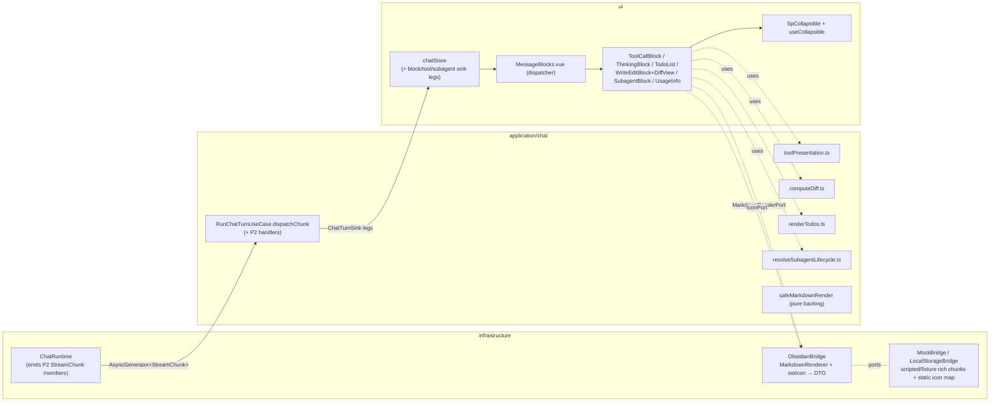
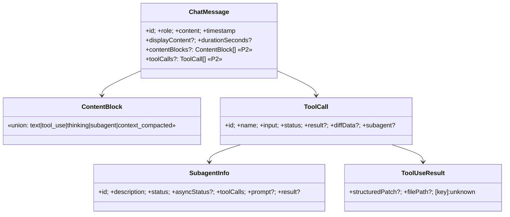
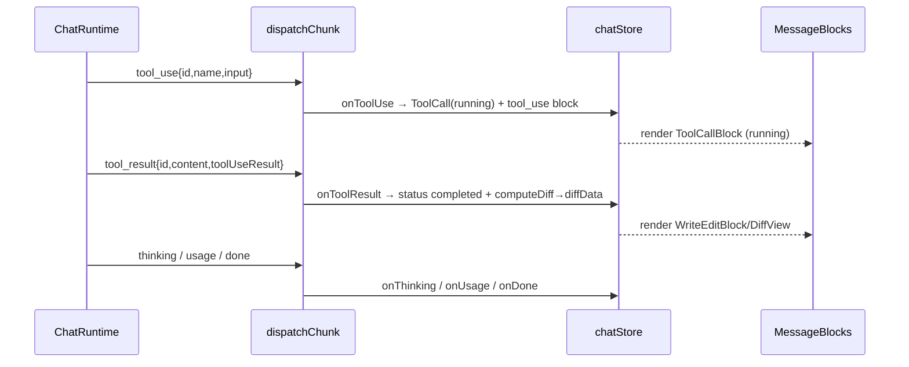

# Design — Rich rendering (P2)

Makes the assistant turn render **rich** — tool-calls, thinking, todo lists, write/edit + word-level
diff, a reusable collapsible, subagents (+ lifecycle), and usage — **on top of** the merged P1 chat
surface (`chat-core`, `5e014d5`), additively, never by redesign (ADR-CC-001, ADR-RR-001). Every
claim cites the real Claudian solution under `D:\Projects\claudian-main`; identity stays Specorator,
colour via `--sp-*`.

> **>>> CHECKPOINT REQUIRED <<<** Part C rests on **ADR-RR-001** (status: *proposed*). A human must
> bless the `StreamChunk`/`ChatMessage` additive growth + the typed `toolUseResult` + the render
> seam + the new `IconPort` (charter §6a, CLAR-RR-002/003) before `/spec:specify`. This design is
> complete and self-consistent, but the architectural seam it rests on is not yet accepted —
> mirroring the P1 ADR-CC-001 gate.

---

# Part A — UX

## A.1 Scope & the render flows

P2 adds **rendering only** to the P1 turn. The P1 flow is unchanged: a logged-in `claude`-CLI user
types, the assistant streams, the turn finalises. P2 makes each structured thing the agent does
during that turn legible: tools it runs, files it edits, its reasoning, its plan, subagents it
spawns, and the turn's token cost. No interaction, no approval, no composer change (NG2/NG3).

The assistant turn is an **ordered list of content blocks** (REQ-RR-011) interleaving prose,
reasoning, tool calls, and subagents in arrival order (mirrors `MessageRenderer.renderContentBlocks`).
Each block type has its own render flow below.

### A.1.1 Block-type render flows

| Block | Collapsed (default) header | Expanded content | Live → finalised |
|---|---|---|---|
| **tool-call** (REQ-RR-019/020) | per-tool icon + mono name + one-line summary + end-pinned status indicator | mono pre-wrapped input + result (generic expanded renderer) | running (accent, no terminal icon) → completed (green check) / error (red x) / blocked (orange shield-off) |
| **thinking** (REQ-RR-013/014) | brand-coloured italic "Thinking Ns…" (live) / "Thought for Ns" (final) | accumulated reasoning markdown | live pulse + 1s counter → freeze label + auto-collapse |
| **todo** (REQ-RR-022/023) | "Tasks N/M" count (when shown as a tool header) | one row per item: status dot/check + colour + text (gerund `activeForm` when in-progress) | rows update in place as TodoWrite re-emits |
| **write/edit** (REQ-RR-025/027) | tool icon + filename summary + `+N`/`-N` stat chip | per-line word-level diff (background highlight, 16px gutter, height-capped scroll) | rendered when the `tool_result` with `structuredPatch` arrives |
| **subagent** (REQ-RR-021/021a) | accent icon + description + async status pill | collapsible prompt / result (scroll-capped) / nested tool-call sections | pending → running → completed/error/orphaned status pill |
| **usage** (REQ-RR-024/024a) | (turn-level, not a content block) tokens used + ~% of window | — | shown when usage state present; hidden cleanly when absent |
| **context_compacted** (NG1) | a static "context compacted" notice if the chunk arrives | — | render-only; no compaction machinery |

### A.1.2 The collapsible interaction contract (REQ-RR-015/016/017/018) — WCAG 2.2 AA

One reusable primitive (`SpCollapsible` + `useCollapsible`, mirrors `collapsible.ts`):

- **Collapsed by default** — every collapsible block (tool-call, finalised thinking, write/edit,
  subagent section) renders showing only its header (REQ-RR-018).
- **Focusable control** — the header is a focusable `role="button"` with `tabindex="0"`.
- **Toggle on click, Enter, Space** — keyboard-operable; `Space`/`Enter` `preventDefault` then toggle
  (REQ-RR-015).
- **`aria-expanded`** reflects open state (`"false"` collapsed, `"true"` expanded).
- **Dynamic accessible label** — `"<label> - click to expand"` / `"… - click to collapse"`
  (REQ-RR-015), label sourced from `toolLabel(name, input)` for tool blocks.
- **Reduced-motion / forced-colors** (REQ-RR-017) — under `prefers-reduced-motion`, no
  transition/pulse runs (thinking shows a static dim, not a pulse); blocks stay legible under
  forced-colors (status meaning is icon + label, never colour-only — NFR-RR-008).

### A.1.3 Live-vs-finalised states

- **Thinking** — live: italic brand "Thinking Ns…" with a 1s-incrementing counter and a pulse
  (REQ-RR-013); finalised: timer stops, label freezes to "Thought for Ns" (no trailing "…"),
  block auto-collapses (REQ-RR-014).
- **Tool-call** — running: accent state, no terminal icon; on `tool_result`: completed (green
  check) or error (red x) by `isError`; blocked: orange shield-off (REQ-RR-020).
- **Subagent** — async status pill walks pending → running → completed/error/orphaned (REQ-RR-021a);
  sync subagents show nested tool calls inline.
- **Usage** — appears once a `usage` chunk has set turn usage; never a zero-token placeholder
  (REQ-RR-024a).

### A.1.4 Empty / streaming / error parity with P1

P2 changes **none** of the P1 empty/streaming/error/interrupt states (DESIGN-CC-001 Part A): the
welcome/empty state, the live `data-streaming="true"` assistant turn, the inline `error`-chunk
render (still an `error` chunk, not a thrown error — ADR-CC-001 §1), and the Interrupted badge are
preserved. Rich blocks render **incrementally as their chunks arrive** (NFR-RR-014) — the live
thinking timer and tool-status updates are visible during the turn, not batched on completion. A
stored (replayed) message renders identically to its streamed form (REQ-RR-012), collapsed by
default.

---

# Part B — UI

## B.1 Token strategy

Parity is **perceptual, not pixel** (charter §1). Every Claudian hardcoded value the P2 renderers
reproduce resolves through a `--sp-*` token in the token layer (`src/ui/styles/tokens.css`); **no
component carries a hex / raw Obsidian var** (NFR-RR-007). Reuse the surviving P1/AUX `--sp-*` layer
(brand `--sp-brand`/`--sp-accent`, `--sp-space-*`, `--sp-font-mono`, `--sp-font-size-sm`/`-md`,
`--sp-success`/`--sp-warning`/`--sp-error`, the `--sp-duration-*` reduced-motion guard); add new
tokens **only** where P2 needs a value the layer does not already express. Thinking accent derives
from `--sp-accent` (with optional `[data-provider]` aliasing) — **never** the Claudian `#D97757`/
compact `#5bc0de` literal directly (CLAR-RR-006; the literals already live token-confined as
`--sp-brand-claude`/`--sp-compact`).

## B.2 New `--sp-*` tokens (P2, add to tokens.css §4.9)

| Token | Purpose | Parity source (claudian-main) |
|---|---|---|
| `--sp-tool-rail` | 2px tree-branch border colour | `--sp-border` derivative; `toolcalls.css` rail |
| `--sp-tool-rail-width` | `2px` rail thickness | `toolcalls.css` / `thinking.css` / `subagent.css` |
| `--sp-tool-rail-margin` | `7px` inline-start margin | the repeated rail motif |
| `--sp-tool-rail-indent` | `16px` inline-start padding | the repeated rail motif |
| `--sp-thinking-rail-indent` | `24px` thinking-variant indent | `thinking.css` |
| `--sp-thinking-color` | thinking italic colour = `var(--sp-accent)` | `thinking.css` brand (CLAR-RR-006) |
| `--sp-thinking-pulse-duration` | `1.5s` pulse (→ `0s` under reduced-motion) | `thinking.css` `thinking-pulse` |
| `--sp-status-running` | running indicator = `var(--sp-accent)` | `toolcalls.css` `--text-accent` |
| `--sp-status-completed` | completed = `var(--sp-success)` | `toolcalls.css` `--color-green` |
| `--sp-status-error` | error = `var(--sp-error)` | `toolcalls.css` `--color-red` |
| `--sp-status-blocked` | blocked = `var(--sp-warning)` | `toolcalls.css` `--color-orange` |
| `--sp-state-pending` | async pill pending = `var(--sp-text-muted)` | `subagent.css` status ladder |
| `--sp-state-running` | async pill running = `var(--sp-accent)` | `subagent.css` |
| `--sp-state-completed` | async pill completed = `var(--sp-success)` | `subagent.css` |
| `--sp-state-error` | async pill error = `var(--sp-error)` | `subagent.css` |
| `--sp-state-orphaned` | async pill orphaned = `var(--sp-warning)` | `subagent.css` |
| `--sp-todo-pending` | pending dot colour = `var(--sp-text-muted)` | `status-panel.css` |
| `--sp-todo-active` | in-progress colour = `var(--sp-accent)` | `status-panel.css` |
| `--sp-todo-done` | completed colour = `var(--sp-success)` | `status-panel.css` |
| `--sp-todo-dot-scale` | `2` (2×-scaled dot) | `status-panel.css` |
| `--sp-diff-insert-bg` | insert-line background wash | `features/diff.css` insert wash |
| `--sp-diff-delete-bg` | delete-line background wash | `features/diff.css` delete wash |
| `--sp-diff-add-fg` | `+N` stat chip colour = `var(--sp-success)` | `diff.css` `.added` |
| `--sp-diff-del-fg` | `-N` stat chip colour = `var(--sp-error)` | `diff.css` `.removed` |
| `--sp-diff-gutter` | `16px` centred prefix gutter | `diff.css` prefix |
| `--sp-diff-max-height` | `300px` body scroll cap | `diff.css` `max-height` |
| `--sp-subagent-result-max-height` | `220px` result scroll cap | `subagent.css` |
| `--sp-font-size-xs` (reuse) | `11px` nested-subagent text | existing token |

> Colour literals stay **confined to the token layer** (charter §1, NFR-RR-007). Diff add/del derive
> from `--sp-success`/`--sp-error`, **not** raw green/red. All indents use **logical** properties
> (`border-inline-start`, `padding-inline-start`, `margin-inline-start`) — no physical-direction leak
> (REQ-RR-016).

## B.3 Word-level diff visual spec (REQ-RR-025/027)

- **Background-highlight only, NO strikethrough**: insert lines carry `--sp-diff-insert-bg`, delete
  lines `--sp-diff-delete-bg`; deleted text has **no** `text-decoration` (the explicit Claudian
  `diff.css` comment). Equal lines are muted.
- **Gutter**: each line is prefixed by a `--sp-diff-gutter` (16px) centred `+` / `−` / space marker
  in monospace.
- **Stat chip** (in the block header): `+N` in `--sp-diff-add-fg`, `-N` in `--sp-diff-del-fg`,
  monospace; only non-zero counts shown (mirrors `renderDiffStats`).
- **Height cap + truncation**: body scrolls within `--sp-diff-max-height` (300px); an all-insert new
  file capped at `NEW_FILE_DISPLAY_CAP` (20) lines shows a "... N more lines" footer (REQ-RR-027;
  reproduced from `DiffRenderer.ts:76`, not newly invented — NFR-RR-013/014).
- **Rendered declaratively** as per-line spans (`` prefix + `` text) — never `v-html`
  (NFR-RR-006).

## B.4 Parity-screenshot plan (NFR-RR-011/012)

Defer **capture** to the P1 carry-over issue **#434**; this design states the plan: per-surface
screenshots vs `claudian-main` for tool-call (collapsed/expanded), thinking (live/finalised), todo,
write/edit diff, subagent, and usage, at **320 / 520 / 720 px**, **light + dark**, recorded under
`specs/rich-rendering/parity-screenshots.md`. Perceptual (not pixel) parity; reviewer + brand-reviewer
sign-off gates the phase (charter §5.1–§5.4). Interaction parity (collapsed-by-default, click +
Enter/Space, thinking timer freeze + auto-collapse, status state machine, diff background-highlight)
is asserted in component tests **and** the screenshot set (charter §5.3).

---

# Part C — Architecture

> **Baseline:** there is no `arc42-questionnaire.md` for this feature; §5–§8 inherit from the
> project steering + ADR-001/004/008/CC-001. This Part C captures only the **P2 deltas**.

## C.1 System overview

Import direction stays inward-only (NFR-RR-001): chunk emission in infrastructure (behind
`ChatRuntimePort`), chunk→block mapping + pure transforms in application, render in ui; the Obsidian
`MarkdownRenderer`/`setIcon` backing lives **only** in `ObsidianBridge`. Vue never imports `obsidian`.

## C.2 Components & responsibilities

| Component | Layer | Responsibility (single) | REQ |
|---|---|---|---|
| `ContentBlock` / `ToolCall` / `SubagentInfo` / `TodoItem` types | domain | the rich block model added to `ChatMessage` | RR-010/011 |
| `ToolUseResult` / `StructuredPatchHunk` / `DiffLine` / `DiffStats` | domain | typed diff source replacing `unknown` | RR-002/003/026 |
| `RunChatTurnUseCase.dispatchChunk` (+ handlers) | application | route each P2 chunk to the matching sink leg | RR-001..007 |
| `toolPresentation.ts` | application | pure `toolName`/`toolSummary`/`toolLabel` | RR-019a/023 |
| `computeDiff.ts` | application | pure structuredPatch → `DiffLine[]` + stats | RR-026 |
| `renderTodos.ts` | application | pure todos → status/icon/text rows | RR-022 |
| `resolveSubagentLifecycle.ts` | application | pure sync/async + spawn+wait consolidation (Claude path) | RR-021b |
| `MarkdownRenderPort` (backing swap) | domain/infra | structured-node DTO; Obsidian-backed in prod | RR-020a/CLAR-CC-005 |
| `IconPort` (new) | domain/infra | logical icon name → declarative icon-node DTO | RR-019/020/022 |
| `chatStore` (+ legs) | ui | hold blocks/toolCalls/subagents on the live message; sink legs | RR-002..006/011 |
| `MessageBlocks.vue` | ui | thin dispatcher: iterate `contentBlocks` in order | RR-011/012 |
| `ToolCallBlock.vue` | ui | render one tool call (icon/name/summary/status + expanded result) | RR-019/020/020a |
| `ThinkingBlock.vue` | ui | live timer + freeze + auto-collapse | RR-013/014 |
| `TodoList.vue` | ui | status-distinct rows | RR-022 |
| `WriteEditBlock.vue` + `DiffView.vue` | ui | diff block + stat chip + capped scroll | RR-025/027 |
| `SubagentBlock.vue` | ui | nested collapsible prompt/result/tools + status pill | RR-021/021a |
| `UsageInfo.vue` | ui | turn-level token info (hidden when absent) | RR-024/024a |
| `SpCollapsible.vue` + `useCollapsible` | ui | the one reusable collapsible primitive | RR-015..018 |
| `SpIcon.vue` | ui | render an `IconPort` icon-node declaratively | RR-019 |

## C.3 Data model (domain growth — CLAR-RR-002, ADR-RR-001 §1)

Additive only; no P1 field renamed or removed.

- **`StreamChunk`** (`src/domain/chat/StreamChunk.ts`): the only edit is typing `toolUseResult?:
  unknown` → `toolUseResult?: ToolUseResult` on `tool_result` and `subagent_tool_result`. All member
  names/shapes already match `chat.ts:137` (REQ-RR-001).
- **`ChatMessage`** (`ChatMessage.ts`): `+ contentBlocks?: ContentBlock[]`, `+ toolCalls?: ToolCall[]`
  (mirrors `chat.ts:39/46/47`). Six P1 fields unchanged (REQ-RR-010).
- **New types** (see ADR-RR-001 §1 for full shapes): `ContentBlock` (`chat.ts:31`), `ToolCall`
  (domain rename of `ToolCallInfo`, `tools.ts:32`), `SubagentInfo`/`SubagentMode`/`AsyncSubagentStatus`
  (`tools.ts:55/58/66`), `TodoItem` (`core/tools/todo.ts`), `ToolUseResult`/`StructuredPatchHunk`
  (`diff.ts:27/18`), `DiffLine`/`DiffStats` (`diff.ts:5/12`), `ToolDiffData` (`tools.ts:4`).
- **Still excluded** (later-phase, documented): `images` (P5), rewind/fork ids (P3), `currentNote`,
  `resolvedAnswers`/inline-approval fields (P7), per-block `isExpanded`/timer (UI-layer state, not DTO).
- **Migration**: none (NG9, NFR-RR-010) — load-or-default; a stored P1 message with no
  `contentBlocks`/`toolCalls` renders via the P1 `content`/`MarkdownBlock` path unchanged.

## C.4 Data flow — dispatch handlers + sink legs (REQ-RR-001..007)

`RunChatTurnUseCase.dispatchChunk` (`RunChatTurnUseCase.ts:116`) gains a handler per P2 member; the
forward-compatible `default` branch (REQ-RR-007) is **preserved** for unhandled future members. New
`ChatTurnSink` legs (the store implements them):

| Chunk | `dispatchChunk` action | new `ChatTurnSink` leg | store mutation |
|---|---|---|---|
| `tool_use` | call `onToolUse` | `onToolUse(id,name,input)` | add `ToolCall{status:'running'}` + push `{type:'tool_use',toolId}` block (REQ-RR-002) |
| `tool_result` | call `onToolResult` | `onToolResult(id,content,isError,toolUseResult)` | match by id; set result + status; if Write/Edit, `computeDiff(toolUseResult)` → `diffData` (REQ-RR-003/026) |
| `tool_output` | call `onToolOutput` | `onToolOutput(id,content)` | append interim output to the matching tool (no new block) (REQ-RR-003) |
| `thinking` | call `onThinking` | `onThinking(content)` | append/accumulate the open `thinking` block in stream order (REQ-RR-004) |
| `subagent_tool_use` / `subagent_tool_result` | call `onSubagentTool*` | `onSubagentToolUse`/`onSubagentToolResult(subagentId,…)` | route to the subagent by id; no top-level block (REQ-RR-006) |
| `async_subagent_result` | call `onAsyncSubagentResult` | `onAsyncSubagentResult(agentId,status,result?)` | set the subagent's async status/result (REQ-RR-006/021a) |
| `context_compacted` | call `onContextCompacted` | `onContextCompacted()` | push a `{type:'context_compacted'}` block (render-only, NG1) |
| `notice` | call `onNotice` | `onNotice(content,level?)` | render-only notice (no thread machinery) |
| `usage` | (P1 leg) | `onUsage` (existing) | usage now **rendered** by `UsageInfo.vue` (REQ-RR-005/024) |
| `text` | (P1 leg) | `onText` (existing) | now also pushes/extends a `{type:'text'}` content block for ordering (REQ-RR-011) |

**Streaming-error boundary unchanged (ADR-CC-001 §1, NFR-RR-003):** failures are still the
`{type:'error'}` chunk forwarded to `onErrorChunk`, never a per-chunk `Result` or a thrown error
across the port. The pure transforms (`computeDiff`, `toolPresentation`, `renderTodos`,
`resolveSubagentLifecycle`) are total where they cannot fail and return `Result<T,E>` only where they
genuinely can (none currently can — they degrade to a safe default, e.g. empty diff, on malformed
input).

## C.5 Render seam (CLAR-RR-003, ADR-RR-001 §2)

Per-type components behind the thin `MessageBlocks.vue` dispatcher (NOT a mega-renderer). The
dispatcher iterates `message.contentBlocks` in order and delegates each to its component; `text`
blocks reuse the **existing P1 `MarkdownBlock.vue`** so the P1 surface never regresses. Pure
transforms live in `application/chat/` mirroring the blessed `safeMarkdownRender` seam, so they are
unit-testable without mounting (NFR-RR-005). `MessageTurn.vue` switches from rendering `content`
directly to rendering `MessageBlocks` when `contentBlocks` is present, falling back to the P1
`MarkdownBlock` path otherwise (REQ-RR-012 stored-vs-live parity).

## C.6 MarkdownRenderPort backing + IconPort (CLAR-RR-003 part 2 + CLAR-CC-005; ADR-RR-001 §3/§4)

- **MarkdownRenderPort**: production backing in `ObsidianBridge` upgrades to Obsidian
  `MarkdownRenderer.render` into a detached element, **walked** to the existing `SafeRenderResult`
  DTO (extended with declarative `code_block`/`list`/`heading` node variants as needed) — **the port
  return shape is unchanged**, so the UI stays declarative (NFR-RR-006) and Mock/LocalStorage keep
  the pure `safeMarkdownRender`. Not an ADR shape change (recorded in ADR-RR-001 §3 for traceability).
- **IconPort (new narrow port)**: `setIcon(name): IconNode` returns a declarative icon-node DTO.
  `ObsidianBridge` backs it with `setIcon` into a detached element walked to the DTO (no `v-html`);
  Mock/LocalStorage back it with a static name map. Own `ICON_PORT` InjectionKey + `useIconPort()`
  (ADR-008). Regrows the P0-deleted icon seam for its first P2 consumer.

## C.7 Three-bridge story (NFR-RR-002)

| Bridge | StreamChunk source | Markdown backing | Icon backing |
|---|---|---|---|
| `ObsidianBridge` | real Claude-CLI subprocess | Obsidian `MarkdownRenderer` → DTO | Obsidian `setIcon` → DTO |
| `MockBridge` (`npm run dev`) | **scripted** generator yielding `tool_use`/`tool_result`(+structuredPatch)/`thinking`/`subagent_*`/`usage`/`done` | pure `safeMarkdownRender` | static name map |
| `LocalStorageBridge` (demo) | **fixture** transcript replay with rich blocks (a tool call, a diff, a todo list) | pure `safeMarkdownRender` | static name map |

Both non-Obsidian bridges drive every P2 renderer with **no subprocess** — `npm run dev` and the
GitHub Pages demo show the "Claudian feel" headlessly. The scripted/fixture chunks reach the new sink
legs so every renderer is testable.

## C.8 NFR-RR-006 — how the no-`v-html` rule is satisfied (the hardest NFR)

- **Tool input/result**: rendered as escaped, monospace, pre-wrapped declarative ``/`<pre>`
  text (mirrors Claudian's XSS-safe `setText`); the XSS-payload-as-text test (REQ-RR-020a) shows a
  literal `` shown verbatim; lint confirms no
    `v-html`/`innerHTML` (REQ-RR-020a, NFR-RR-006).
16. Thinking live timer increments (fake timers) → "Thinking 2s…"; finalise → "Thought for 3s",
    collapsed (REQ-RR-013/014).
17. Todo rows: in-progress gerund + active colour, pending dot, completed check + done colour
    (REQ-RR-022).
18. `computeDiff` pure unit test: structuredPatch +3/−1 → ordered `DiffLine[]` + `{added:3,removed:1}`
    (REQ-RR-026).
19. Write/Edit render: insert wash + `+` gutter, delete wash + `−` gutter (no strikethrough), equal
    muted (REQ-RR-025); header `+5`/`-2` chip; capped scroll + "... N more lines" (REQ-RR-027).
20. Subagent block: collapsible prompt/result/tools; nested tools reuse the primitive; capped result
    scroll (REQ-RR-021); async pill ladder pending→running→completed/error/orphaned (REQ-RR-021a).
21. `resolveSubagentLifecycle` pure: classifies async vs sync, consolidates spawn+result (Claude
    path) (REQ-RR-021b).
22. Usage hidden when `usage===null` (REQ-RR-024a).
23. All three bridges drive every renderer (Mock script + LocalStorage fixture, no subprocess)
    (NFR-RR-002).

## C.13 Key decisions

| # | Decision | ADR | Rejected alternative |
|---|---|---|---|
| 1 | Type `toolUseResult?: unknown` → `ToolUseResult`; grow `ChatMessage` with `contentBlocks`/`toolCalls` + new domain types | ADR-RR-001 §1 | keep `unknown`, guard at render (Option C) |
| 2 | Per-type block components behind a thin `MessageBlocks` dispatcher | ADR-RR-001 §2 | one `MessageBlockRenderer` mega-component (Option B) |
| 3 | Pure transforms (`toolPresentation`/`computeDiff`/`renderTodos`/`resolveSubagentLifecycle`) in application layer | ADR-RR-001 §2 | logic inside components |
| 4 | Upgrade `MarkdownRenderPort` backing to Obsidian renderer, keep DTO shape | ADR-RR-001 §3 (+ CLAR-CC-005) | extend pure safe node model only (Option D) |
| 5 | New narrow `IconPort` (declarative icon-node DTO); defer all other P2 ports | ADR-RR-001 §4 | tool-metadata registry port (deferred) |
| 6 | Streaming errors stay `error` chunks (not per-chunk Result) | ADR-CC-001 §1 (inherited) | per-chunk `Result` |
| 7 | Claude Task/Agent subagent path only; Codex/Opencode lifecycle deferred | ADR-RR-001 §2 (CLAR-RR-004) | provider-lifecycle consolidation in P2 (NG7) |

## C.14 Requirements coverage (Part C)

| REQ | Covered by |
|---|---|
| RR-001..007 | C.4 dispatch handlers + sink legs |
| RR-010..012 | C.3 data model + C.5 dispatcher/stored render |
| RR-015..018 | C.2 `SpCollapsible`/`useCollapsible` + Part A.1.2 + Part B tokens |
| RR-019/019a/020/020a | C.2 `ToolCallBlock`/`SpIcon` + `toolPresentation` + C.8 |
| RR-013/014 | C.2 `ThinkingBlock` + Part A.1.3 |
| RR-022/023 | C.2 `TodoList` + `renderTodos` |
| RR-025/026/027 | C.2 `WriteEditBlock`/`DiffView` + `computeDiff` + Part B.3 |
| RR-021/021a/021b | C.2 `SubagentBlock` + `resolveSubagentLifecycle` |
| RR-024/024a | C.2 `UsageInfo.vue` + C.4 usage leg |
| NFR-RR-001/002 | C.1/C.7 layering + 3 bridges |
| NFR-RR-005 | C.5 pure transforms + per-type PageObjects |
| NFR-RR-006 | C.8 no-`v-html` |
| NFR-RR-007 | Part B token map |
| NFR-RR-008 | Part A.1.2 collapsible a11y |
| NFR-RR-009/010 | C.10 compatibility |
| NFR-RR-011/012 | Part B.4 screenshot/interaction plan |
| NFR-RR-014 | C.4 incremental render + B.3 diff cap |

---

## Quality gate

- [x] System overview (Mermaid) — C.1.
- [x] Components + single responsibilities — C.2.
- [x] Data model growth (additive) — C.3.
- [x] Data flow for primary scenarios — C.4.
- [x] Render/port seams decided — C.5/C.6.
- [x] Key decisions table + ADR for the load-bearing ones — C.13, ADR-RR-001.
- [x] Rejected alternatives recorded — ADR-RR-001 + C.13.
- [x] Edge cases enumerated (not TBD) — C.9.
- [x] QA-seam scenarios — C.12.
- [x] Observability — C.11.
- [x] Requirements coverage (Part C) — C.14.
- [ ] **ADR-RR-001 human-blessed (charter §6a) — CHECKPOINT REQUIRED before `/spec:specify`.**
