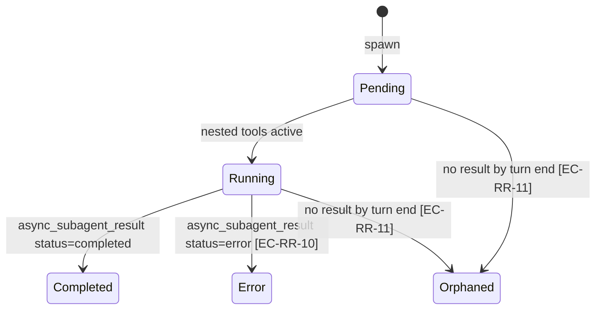

# Specification — Rich rendering (P2)

Implementation-ready contracts for P2. Every contract is grounded in `design.md` (DESIGN-RR-001),
the human-blessed **ADR-RR-001**, the P1 contract (SPEC-CC-001..023), and Claudian's real code under
`D:\Projects\claudian-main` (cited inline). Two independent teams should build the same thing.

> **Conventions in force (inherited from P1, do not relax):** DDD inward-only imports (ADR-001,
> `domain ← application ← infrastructure ← ui`); narrow ports + 3 bridges (ADR-008); `Result<T,E>`
> only where a discrete method can fail, **pure-total** transforms elsewhere (ADR-004, NFR-RR-003);
> streaming failure stays the `{type:'error'}` `StreamChunk` member, **not** per-chunk `Result` or a
> thrown error across the port (ADR-CC-001 §1, NFR-RR-003); Vue `<script setup>` only (ADR-003); no
> `obsidian`/`node:*` import under `src/ui/**` (NFR-RR-001); **no `v-html`/`innerHTML`/`outerHTML`/
> `insertAdjacentHTML`** anywhere in the render path **or the bridge DTO-walks** (NFR-RR-006 — the
> hardest P2 NFR); markdown + icons via narrow ports returning **declarative DTOs** (ADR-RR-001
> §3/§4); coverage 80/70/80/80 (NFR-RR-005); `--sp-*` token parity, no component hex/raw Obsidian var
> (NFR-RR-007); WCAG 2.2 AA collapsibles (NFR-RR-008); `manifest.json` untouched (NFR-RR-009); **no
> stored secret, no migration** (NFR-RR-010); additive growth only — **no rename/removal of any P1
> member** (ADR-CC-001, ADR-RR-001 §1).

This spec defines **34 spec items** across five layer groups (SPEC-RR-001..034). The Tasks stage
(`planner`) decomposes them into `T-RR-NNN`; the QA stage turns the TEST-RR-NNN scenarios (§9) into
automated tests. SPEC-RR items **extend** their P1 counterparts and cite the extension point.

> **>>> ADR-RR-002 AMENDMENT (2026-05-25, additive) <<<** A P2 markdown defect found in real-Obsidian
> testing (plain render / `<!---->` gaps) is fixed by **ADR-RR-002**, which **supersedes ADR-RR-001 §3**:
> `MarkdownRenderPort.render` becomes **async** (`Promise<SafeRenderResult>`) and the `ObsidianBridge`
> `await`s Obsidian's real `MarkdownRenderer` before walking the fragment to the **unchanged**
> `SafeRenderResult` DTO. Deltas (minimal, additive): SPEC-RR-010/011 (async signature), SPEC-RR-022
> (`MarkdownBlock.vue` async-render + streaming cadence), TEST-RR-028 (Mock-backed async-render) +
> re-scoped TEST-RR-043 (real-Obsidian rich render, manual). The DTO shape, the no-`v-html` invariant,
> and the three-bridge story are all preserved.

---

## 0. Spec-item index

| Spec item | Title | Layer | Extends (P1) | REQ / NFR links |
|---|---|---|---|---|
| **DOMAIN** | | | | |
| SPEC-RR-001 | `StreamChunk` — type the P2 members (the only edit: `toolUseResult`) | domain | SPEC-CC-002 | REQ-RR-001; ADR-RR-001 §1 |
| SPEC-RR-002 | `ToolUseResult` + `StructuredPatchHunk` (typed diff source) | domain | — (new) | REQ-RR-001/026; ADR-RR-001 §1 |
| SPEC-RR-003 | `DiffLine` / `DiffStats` / `ToolDiffData` | domain | — (new) | REQ-RR-026; ADR-RR-001 §1 |
| SPEC-RR-004 | `ContentBlock` discriminated, ordered union | domain | — (new) | REQ-RR-011; ADR-RR-001 §1 |
| SPEC-RR-005 | `ToolCall` (id/name/input/status + result/diff/subagent) | domain | — (new) | REQ-RR-002/003/010; ADR-RR-001 §1 |
| SPEC-RR-006 | `SubagentInfo` / `SubagentMode` / `AsyncSubagentStatus` | domain | — (new) | REQ-RR-006/021/021a; ADR-RR-001 §1 |
| SPEC-RR-007 | `TodoItem` | domain | — (new) | REQ-RR-022/023; ADR-RR-001 §1 |
| SPEC-RR-008 | `ChatMessage` — additive `contentBlocks?` / `toolCalls?` | domain | SPEC-CC-004 | REQ-RR-010; ADR-RR-001 §1 |
| SPEC-RR-009 | `IconPort` + `IconNode` + `ICON_PORT` key + barrel re-export | domain/infra | SPEC-CC-008/009 | REQ-RR-019/020/022; ADR-RR-001 §4 |
| **INFRA** | | | | |
| SPEC-RR-010 | `MarkdownRenderPort` **async** Obsidian backing (DTO shape unchanged) | infra | SPEC-CC-007 | REQ-RR-020a; CLAR-CC-005; **ADR-RR-002** (supersedes ADR-RR-001 §3) |
| SPEC-RR-011 | `MarkdownNode`/`MarkdownInline` node-model extension + **async port return** | domain | SPEC-CC-007 | REQ-RR-020a, NFR-RR-006; ADR-RR-001 §3 + **ADR-RR-002** |
| SPEC-RR-012 | `IconPort` impls on the three bridges | infra | SPEC-CC-013 | REQ-RR-019, NFR-RR-002 |
| SPEC-RR-013 | Mock/Fixture runtimes emit scripted rich chunks | infra | SPEC-CC-011/012 | REQ-RR-001, NFR-RR-002 |
| **APPLICATION** | | | | |
| SPEC-RR-014 | `toolPresentation.ts` — `toolName`/`toolSummary`/`toolLabel` | application | — (new) | REQ-RR-019a/023; ADR-RR-001 §2 |
| SPEC-RR-015 | `computeDiff.ts` — structuredPatch → `DiffLine[]`+`DiffStats` | application | — (new) | REQ-RR-026; ADR-RR-001 §2 |
| SPEC-RR-016 | `renderTodos.ts` — todos → status/icon/text rows | application | — (new) | REQ-RR-022; ADR-RR-001 §2 |
| SPEC-RR-017 | `resolveSubagentLifecycle.ts` — sync/async + consolidation (Claude path) | application | — (new) | REQ-RR-021b; ADR-RR-001 §2 |
| SPEC-RR-018 | `RunChatTurnUseCase.dispatchChunk` — P2 handlers | application | SPEC-CC-015 | REQ-RR-001..007; ADR-CC-001 §1 |
| SPEC-RR-019 | `ChatTurnSink` — new P2 legs | application | SPEC-CC-015 | REQ-RR-002..007 |
| **UI** | | | | |
| SPEC-RR-020 | `chatStore` — block/tool/subagent state + sink legs | ui | SPEC-CC-016 | REQ-RR-002..006/011 |
| SPEC-RR-021 | `useIconPort()` composable | ui | SPEC-CC-017 | REQ-RR-019 |
| SPEC-RR-022 | `MessageBlocks.vue` dispatcher | ui | SPEC-CC-019 | REQ-RR-011/012 |
| SPEC-RR-023 | `MessageTurn.vue` — blocks-vs-content fork | ui | SPEC-CC-019 | REQ-RR-012 |
| SPEC-RR-024 | `SpCollapsible.vue` + `useCollapsible` | ui | — (new) | REQ-RR-015..018; NFR-RR-008 |
| SPEC-RR-025 | `SpIcon.vue` | ui | — (new) | REQ-RR-019, NFR-RR-006 |
| SPEC-RR-026 | `ToolCallBlock.vue` | ui | — (new) | REQ-RR-019/020/020a |
| SPEC-RR-027 | `ThinkingBlock.vue` (timer + freeze + auto-collapse) | ui | — (new) | REQ-RR-013/014 |
| SPEC-RR-028 | `TodoList.vue` | ui | — (new) | REQ-RR-022 |
| SPEC-RR-029 | `WriteEditBlock.vue` + `DiffView.vue` | ui | — (new) | REQ-RR-025/027 |
| SPEC-RR-030 | `SubagentBlock.vue` | ui | — (new) | REQ-RR-021/021a |
| SPEC-RR-031 | `UsageInfo.vue` | ui | — (new) | REQ-RR-024/024a |
| SPEC-RR-032 | `ContextCompactedBlock.vue` (render-only notice) | ui | — (new) | NG1 |
| **STYLES** | | | | |
| SPEC-RR-033 | `--sp-*` token additions (tokens.css §4.9) | ui (styles) | SPEC-CC-023 | NFR-RR-007 |
| SPEC-RR-034 | No-`v-html` compliance invariant (cross-cutting) | ui/infra | — | NFR-RR-006 |

---

# 1. Domain — types & the new port (SPEC-RR-001..009)

All types live under `src/domain/chat/` (new files `ContentBlock.ts`, `ToolCall.ts`, `Subagent.ts`,
`TodoItem.ts`, plus `diff/` for the diff types); the new port in `src/domain/ports/`. No `obsidian`,
no `node:*`, no Vue, no class — pure interfaces/unions (ADR-001). **Additive only: no P1 field is
renamed or removed.**

## SPEC-RR-001 — `StreamChunk`: type the P2 members (`src/domain/chat/StreamChunk.ts`)

**REQ:** REQ-RR-001 · **ADR:** ADR-RR-001 §1 · **Claudian ground-truth:** `chat.ts:137` (member
names + shapes), `diff.ts:27` (typed `SDKToolUseResult`). **Extends SPEC-CC-002.**

The P2 members are **already declared** in the P1 union (lines 26–60 of `StreamChunk.ts`). P2 makes
**exactly one edit** to an existing member family: replace `toolUseResult?: unknown` with
`toolUseResult?: ToolUseResult` on **`tool_result`** and **`subagent_tool_result`**. No member is
renamed, removed, or re-shaped otherwise. After the edit the relevant members read:

```ts
import type { ToolUseResult } from './diff/ToolUseResult';
// ...
  | { type: 'thinking'; content: string }                                              // P2 — EMITTED
  | { type: 'tool_use'; id: string; name: string; input: Record<string, unknown> }     // P2 — EMITTED
  | { type: 'tool_result'; id: string; content: string; isError?: boolean; toolUseResult?: ToolUseResult } // P2 — EDITED
  | { type: 'tool_output'; id: string; content: string }                               // P2 — EMITTED
  | { type: 'notice'; content: string; level?: 'info' | 'warning' }                    // P2 — EMITTED
  | { type: 'context_compacted' }                                                      // P2 — EMITTED (render-only, NG1)
  | { type: 'async_subagent_result'; agentId: string; status: 'completed' | 'error'; result?: string } // P2 — EMITTED
  | { type: 'subagent_tool_use'; subagentId: string; id: string; name: string; input: Record<string, unknown> } // P2 — EMITTED
  | { type: 'subagent_tool_result'; subagentId: string; id: string; content: string; isError?: boolean; toolUseResult?: ToolUseResult }; // P2 — EDITED
```

**Member-shape confirmation vs claudian `chat.ts:137` (no tightening beyond `toolUseResult`):**

| Member | P1-declared shape | claudian shape | P2 action |
|---|---|---|---|
| `thinking` | `{content}` | `{content}` | emit, no shape change |
| `tool_use` | `{id,name,input}` | `{id,name,input}` | emit, no shape change |
| `tool_result` | `{id,content,isError?,toolUseResult?:unknown}` | `{…,toolUseResult?:SDKToolUseResult}` | **type `toolUseResult`** |
| `tool_output` | `{id,content}` | `{id,content}` | emit, no shape change |
| `notice` | `{content,level?}` | `{content,level?}` | emit, no shape change |
| `context_compacted` | `{}` | `{}` | emit, no shape change |
| `async_subagent_result` | `{agentId,status,result?}` | `{agentId,status,result?}` | emit, no shape change |
| `subagent_tool_use` | `{subagentId,id,name,input}` | `{subagentId,id,name,input}` | emit, no shape change |
| `subagent_tool_result` | `{subagentId,id,content,isError?,toolUseResult?:unknown}` | `{…,toolUseResult?:SDKToolUseResult}` | **type `toolUseResult`** |

**Validation rules (unchanged from SPEC-CC-002 plus):** `tool_use.id` / `tool_result.id` /
`tool_output.id` are non-empty strings; `tool_use.input` is an object (possibly empty);
`tool_result.isError`/`subagent_tool_result.isError` default to `false` when absent;
`async_subagent_result.status` is exactly `'completed' | 'error'`. The exported alias name stays
`StreamChunk` (no rename). P1 members (`assistant_message_start`/`text`/`error`/`done`/`usage`) are
**byte-identical** to SPEC-CC-002 (TEST-RR-001).

## SPEC-RR-002 — `ToolUseResult` + `StructuredPatchHunk` (`src/domain/chat/diff/ToolUseResult.ts`)

**REQ:** REQ-RR-001/026 · **ADR:** ADR-RR-001 §1 · **Claudian ground-truth:** `diff.ts:17/27`
(`StructuredPatchHunk`, `SDKToolUseResult`). Domain rename of `SDKToolUseResult` → `ToolUseResult`
(drop the SDK prefix; this is a domain type, not an SDK leak).

```ts
/** A single hunk from the SDK's structuredPatch format (claudian diff.ts:18). */
export interface StructuredPatchHunk {
  oldStart: number;
  oldLines: number;
  newStart: number;
  newLines: number;
  lines: string[];      // each line prefixed by '+', '-', or ' ' (unified-diff convention)
}

/** Typed shape of a tool's `toolUseResult` for Write/Edit tools (claudian diff.ts:27). */
export interface ToolUseResult {
  structuredPatch?: StructuredPatchHunk[];
  filePath?: string;
  [key: string]: unknown;     // forward-compatible bag for non-Write/Edit tools (diff.ts:30)
}
```

**Validation rules per field:**

| Field | Rule |
|---|---|
| `StructuredPatchHunk.oldStart`/`oldLines`/`newStart`/`newLines` | Numbers; consumers (`computeDiff`) MUST tolerate missing/negative/`NaN` values without throwing (EC-RR-4). |
| `StructuredPatchHunk.lines` | Array of strings; a line MAY be `''` (rendered as a single space, parity `DiffRenderer.ts:131`). An empty array yields an empty diff. |
| `ToolUseResult.structuredPatch` | Optional; when present an array. Absent/empty → no diff (EC-RR-3). |
| `ToolUseResult.filePath` | Optional string; falls back to `toolCall.input.file_path` then `'file'` (parity `utils/diff.ts:131/136`). |
| `[key: string]: unknown` | Open bag — keeps the type forward-compatible (parity with claudian). |

> The `[key:string]: unknown` index keeps `ToolUseResult` permissive for non-diff tools, so typing
> `toolUseResult?: ToolUseResult` does **not** narrow away any P1 value — it is a tighten, not a
> breaking change (ADR-RR-001 §1, Consequences). This is the **only** edit to a declared P1 union
> member.

## SPEC-RR-003 — `DiffLine` / `DiffStats` / `ToolDiffData` (`src/domain/chat/diff/Diff.ts`)

**REQ:** REQ-RR-026 · **Claudian ground-truth:** `diff.ts:5/12`, `tools.ts:4`.

```ts
export interface DiffLine {
  type: 'equal' | 'insert' | 'delete';
  text: string;
  oldLineNum?: number;
  newLineNum?: number;
}

export interface DiffStats {
  added: number;
  removed: number;
}

/** Pre-computed diff data attached to a Write/Edit ToolCall (claudian tools.ts:4). */
export interface ToolDiffData {
  filePath: string;
  diffLines: DiffLine[];
  stats: DiffStats;
}
```

**Validation:** `DiffStats.added`/`removed` are non-negative integers. `DiffLine.text` is a string
(may be empty). The line numbers are 1-based and optional (set by `computeDiff`). `ToolDiffData` is
produced **only** by `computeDiff` (SPEC-RR-015); the component never constructs it.

## SPEC-RR-004 — `ContentBlock` (`src/domain/chat/ContentBlock.ts`)

**REQ:** REQ-RR-011 · **ADR:** ADR-RR-001 §1 · **Claudian ground-truth:** `chat.ts:31`
(byte-identical union).

```ts
import type { SubagentMode } from './Subagent';

/** Ordered render block preserving streaming arrival order (claudian chat.ts:31). */
export type ContentBlock =
  | { type: 'text'; content: string }
  | { type: 'tool_use'; toolId: string }
  | { type: 'thinking'; content: string; durationSeconds?: number }
  | { type: 'subagent'; subagentId: string; mode?: SubagentMode }
  | { type: 'context_compacted' };
```

**Validation rules:**

| Member | Rule |
|---|---|
| `text` | `content` is a string; multiple consecutive `text` blocks are allowed (the store MAY coalesce adjacent text into one block — SPEC-RR-020). |
| `tool_use` | `toolId` references a `ToolCall.id` in the message's `toolCalls`. A dangling reference (no matching tool) renders nothing (EC-RR-1). |
| `thinking` | `content` accumulates across `thinking` chunks; `durationSeconds` is set at finalise (UI-derived, optional on the DTO). |
| `subagent` | `subagentId` references a `SubagentInfo.id`; `mode` optional (`'sync'`/`'async'`). |
| `context_compacted` | No payload; render-only notice (NG1). |

> **Ordering is the contract (REQ-RR-011):** `contentBlocks` is an **ordered** list; entries appear
> in the exact order the runtime emitted them. The dispatcher (SPEC-RR-022) iterates it verbatim.

## SPEC-RR-005 — `ToolCall` (`src/domain/chat/ToolCall.ts`)

**REQ:** REQ-RR-002/003/010 · **ADR:** ADR-RR-001 §1 · **Claudian ground-truth:** `ToolCallInfo`
(`tools.ts:32`). Domain rename `ToolCallInfo` → `ToolCall`; **P2 subset** — `isExpanded`/
`resolvedAnswers` are EXCLUDED (P7 inline-approval / UI-layer state; ADR-RR-001 §1).

```ts
import type { ToolDiffData } from './diff/Diff';
import type { SubagentInfo } from './Subagent';

export interface ToolCall {
  id: string;
  name: string;
  input: Record<string, unknown>;
  status: 'running' | 'completed' | 'error' | 'blocked';
  result?: string;
  diffData?: ToolDiffData;
  subagent?: SubagentInfo;
}
```

**Validation rules per field:**

| Field | Rule |
|---|---|
| `id` | Non-empty unique string within the message (the `tool_use.id`). Used to match `tool_result`/`tool_output` (SPEC-RR-018). |
| `name` | Non-empty tool name (e.g. `'Read'`, `'Bash'`, `'TodoWrite'`). Drives `toolPresentation` + the icon. |
| `input` | Object (possibly empty); merged-on-update if a later `tool_use` for the same id carries more keys (parity `StreamController.ts:262`). |
| `status` | Exactly one of the four; starts `'running'`, becomes `'completed'`/`'error'`/`'blocked'` on `tool_result` (SPEC-RR-018). |
| `result` | Optional; the (interim or final) result content, accumulated for `tool_output`. |
| `diffData` | Optional; set by `computeDiff` only for Write/Edit tools with a usable diff source (SPEC-RR-015/018). |
| `subagent` | Optional; present when the tool spawns a subagent (Claude `Task`/`Agent` path). |

## SPEC-RR-006 — `SubagentInfo` / `SubagentMode` / `AsyncSubagentStatus` (`src/domain/chat/Subagent.ts`)

**REQ:** REQ-RR-006/021/021a · **Claudian ground-truth:** `tools.ts:55/58/66`. **P2 subset** —
`isExpanded` is EXCLUDED (UI-layer state, ADR-RR-001 §1).

```ts
import type { ToolCall } from './ToolCall';

export type SubagentMode = 'sync' | 'async';

export type AsyncSubagentStatus = 'pending' | 'running' | 'completed' | 'error' | 'orphaned';

export interface SubagentInfo {
  id: string;
  description: string;
  prompt?: string;
  mode?: SubagentMode;
  result?: string;
  status: 'running' | 'completed' | 'error';
  toolCalls: ToolCall[];
  asyncStatus?: AsyncSubagentStatus;
  agentId?: string;        // backend agent id used to correlate async_subagent_result (chat.ts:150)
  outputToolId?: string;   // the tool id carrying the spawn output (lifecycle correlation)
  startedAt?: number;      // epoch ms; set on spawn for the async timer
  completedAt?: number;    // epoch ms; set on async completion
}
```

**Validation rules:** `id` non-empty unique; `description` a string (may be ''); `toolCalls` is an
array (possibly empty — EC-RR-9); `status` exactly one of the three; `asyncStatus` present only for
`mode === 'async'`; `agentId` correlates `async_subagent_result.agentId` (SPEC-RR-018). Nested
`toolCalls` reuse `ToolCall` verbatim (the SubagentBlock renders them via the same `ToolCallBlock`).

## SPEC-RR-007 — `TodoItem` (`src/domain/chat/TodoItem.ts`)

**REQ:** REQ-RR-022/023 · **Claudian ground-truth:** `core/tools/todo.ts:9`.

```ts
export interface TodoItem {
  content: string;                                   // imperative ("Run tests")
  status: 'pending' | 'in_progress' | 'completed';
  activeForm: string;                                // gerund ("Running tests")
}
```

**Validation (parity `todo.ts:17` `isValidTodoItem`):** a valid `TodoItem` has a non-empty
`content`, a non-empty `activeForm`, and `status` ∈ the three values. `renderTodos`/`toolPresentation`
parse `input.todos` via the same guard and **drop** invalid entries (do not throw, EC-RR-6).

## SPEC-RR-008 — `ChatMessage`: additive growth (`src/domain/chat/ChatMessage.ts`)

**REQ:** REQ-RR-010 · **ADR:** ADR-RR-001 §1 · **Claudian ground-truth:** `chat.ts:39/46/47`.
**Extends SPEC-CC-004 — additive only; the six P1 fields are byte-identical.**

```ts
import type { ContentBlock } from './ContentBlock';
import type { ToolCall } from './ToolCall';

export interface ChatMessage {
  // ---- P1 fields (SPEC-CC-004) — UNCHANGED ----
  id: string;
  role: 'user' | 'assistant';
  content: string;
  timestamp: number;
  displayContent?: string;
  durationSeconds?: number;
  // ---- P2 additive (chat.ts:46/47) ----
  contentBlocks?: ContentBlock[];   // ordered render list (REQ-RR-011)
  toolCalls?: ToolCall[];           // tool tracking by id (REQ-RR-002/003)
}
```

**Validation rules:**

| Field | Rule |
|---|---|
| `contentBlocks` | Optional, ordered. Absent → render via the P1 `content`/`MarkdownBlock` path (REQ-RR-012, EC-RR-13). Present → render via `MessageBlocks` (SPEC-RR-022/023). |
| `toolCalls` | Optional. Referenced by `contentBlocks[].toolId`. A `tool_use` block with no matching `toolCalls` entry renders nothing (EC-RR-1). |

> **Still excluded (later-phase, documented):** `images` (P5), `userMessageId`/`assistantMessageId`/
> `resumeAtMessageId` (P3 rewind), `currentNote`, `isInterrupt`/`isRebuiltContext`,
> `durationFlavorWord` (ADR-RR-001 §1). **No per-block `isExpanded`/timer state on the DTO** — that
> lives in the Vue layer (ADR-003); a stored message therefore replays **collapsed-by-default**
> (REQ-RR-012/018, EC-RR-13).
> **No migration (NG9, NFR-RR-010):** load-or-default. A P1-shaped stored message (no
> `contentBlocks`/`toolCalls`) renders unchanged.

## SPEC-RR-009 — `IconPort` + `IconNode` + key + barrel (`src/domain/ports/IconPort.ts`)

**REQ:** REQ-RR-019/020/022 · **ADR:** ADR-RR-001 §4 · **Claudian ground-truth:** `setIcon`
(Obsidian), `toolIcons.ts` (`getToolIcon`). The deleted P0 icon seam (ADR-PSR-001) regrows here as
its first P2 consumer. **The port returns a declarative DTO — never a DOM mutator (NFR-RR-006).**

```ts
// src/domain/ports/IconPort.ts

/**
 * Declarative icon node. The render layer (SpIcon.vue) walks this tree into Vue VNodes;
 * NO DOM-injection sink (no innerHTML/setIcon) reaches the UI. Mirrors the SVG shape an
 * Obsidian/Lucide icon produces, captured as data (NFR-RR-006, ADR-RR-001 §4).
 */
export interface IconNode {
  /** SVG tag name, e.g. 'svg' | 'path' | 'circle' | 'line' | 'polyline'. */
  tag: string;
  /** Plain string attributes (e.g. { d: 'M…', 'stroke-width': '2', viewBox: '0 0 24 24' }). */
  attrs: Record<string, string>;
  /** Ordered child nodes (the SVG path/shape tree). */
  children: IconNode[];
}

/**
 * One-method narrow icon seam (ADR-008 — one port, one consumer). `setIcon` resolves a
 * logical icon name (e.g. 'check', 'x', 'shield-off', 'dot', tool icon names) to a
 * declarative `IconNode`, or `null` when the name is unknown (EC-RR: unknown tool name
 * → caller falls back to a generic icon name). Pure/total; never throws.
 */
export interface IconPort {
  setIcon(name: string): IconNode | null;
}
```

**InjectionKey** (`src/infrastructure/bridge/ports.ts`, alongside the existing eight):

```ts
import type { IconPort } from '@/domain/ports';
export const ICON_PORT: InjectionKey<IconPort> = Symbol('IconPort');
```

**Barrel re-export** (`src/domain/ports/index.ts`):

```ts
export type { IconPort, IconNode } from './IconPort';
```

**Contract:** `setIcon(name)` is pure, synchronous, total, idempotent. An unknown name returns
`null`; the caller (`SpIcon.vue`/`ToolCallBlock`) substitutes a generic fallback name (`'wrench'`
for unknown tools, REQ-RR-019; EC-RR — unknown tool → generic icon). No aggregate port; `IconPort`
is one port for one consumer per ADR-008/ADR-CC-001 §5.

---

# 2. Infrastructure — markdown backing, icon impls, scripted runtimes (SPEC-RR-010..013)

## SPEC-RR-010 — `MarkdownRenderPort` Obsidian backing (`src/infrastructure/obsidian/ObsidianBridge.ts`)

**REQ:** REQ-RR-020a · **Decision:** CLAR-CC-005 + **ADR-RR-002** (supersedes ADR-RR-001 §3) ·
**Claudian ground-truth:** `MessageRenderer.renderContent` (`async` + `await
MarkdownRenderer.render`, lines 625–648). **Extends SPEC-CC-007/013 — the production backing only;
the `SafeRenderResult` DTO shape is UNCHANGED, only the port's return becomes a `Promise`.**

> **>>> ADR-RR-002 AMENDMENT (2026-05-25) <<<** Real-Obsidian testing found markdown renders **plain**
> (no headings/tables/bold/lists; `<!---->` gaps) because `MarkdownRenderer.render` is **async** while
> the P1 port was **synchronous** — the backing read the still-empty element immediately and always
> degraded to the pure baseline. **Fix (human-directed, ADR-RR-002):** the port return becomes
> `Promise<SafeRenderResult>` and the bridge **`await`s** the real renderer **before** walking the
> fragment. The DTO shape (SPEC-RR-011 node model) is unchanged. Mock/LocalStorage stay
> synchronous-fast via `Promise.resolve(...)`.

- `ObsidianBridge.createMarkdownRenderPort().render(markdown)` is **`async`**: it `await`s Obsidian's
  `MarkdownRenderer.render(app, markdown, detachedEl, sourcePath, component)` into a **detached**
  element, **then** (once populated) **walks** that fragment into the existing `SafeRenderResult`
  (`{ nodes: MarkdownNode[] }`) DTO — extended per SPEC-RR-011 — and resolves with it.
- **The walk happens entirely in the bridge.** The bridge reads `textContent` and tag/structure from
  the detached fragment to build the DTO; it **never** passes a DOM element, an HTML string, or a
  DOM-injection sink to the UI (NFR-RR-006). The detached element is discarded after the walk.
- **`MockBridge` and `LocalStorageBridge` keep the pure `safeMarkdownRender`** (SPEC-CC-014) and
  return **`Promise.resolve(safeMarkdownRender(markdown))`** — synchronous-fast, the same byte-identical
  DTO as before, resolved on a microtask. The pure `safeMarkdownRender` itself stays **sync, pure,
  total**, is the Mock/Fixture backing **and** the production degrade path. The two backings must stay
  **perceptually equivalent** for the common paragraph / inline-code case (EC-RR-17 compatibility note).

**Contract:** `render(markdown): Promise<SafeRenderResult>` is **declarative-shaped from the UI's
view** (same DTO node type, no HTML). The Obsidian backing is non-pure internally (it builds +
`await`s + discards a detached element) but **total** — on any internal failure (or a renderer
rejection) it resolves with a single `paragraph` node carrying the raw markdown as `{kind:'text'}`
(degrade, never reject/throw). The degrade is now reached **only on genuine failure**, not on the
always-empty-fragment race the sync port hit. Because the **DTO shape is unchanged**, the two
non-Obsidian bridges and the declarative `MarkdownBlock.vue` node tree are intact (NFR-RR-006 holds);
the only mechanical ripple is that **callers `await`** (SPEC-RR-011, SPEC-RR-022/023 — `MarkdownBlock`
becomes async-aware). This is the **ADR-RR-002 superseding decision** for ADR-RR-001 §3 — the §12
escape hatch ("if the walk needs a return-shape change, return as a superseding ADR") fired.

## SPEC-RR-011 — `MarkdownNode` / `MarkdownInline` extension + async port return (`src/domain/ports/MarkdownRenderPort.ts`)

**REQ:** REQ-RR-020a, NFR-RR-006 · **ADR:** ADR-RR-001 §3 **as superseded by ADR-RR-002** (async
return). **Extends SPEC-CC-007 additively** — the P1 `paragraph` node + `text`/`code` inline survive;
P2 adds the declarative block kinds richer markdown (thinking / subagent content) needs.

```ts
export type MarkdownInline =
  | { kind: 'text'; value: string }
  | { kind: 'code'; value: string }
  | { kind: 'strong'; spans: MarkdownInline[] }     // P2 additive
  | { kind: 'em'; spans: MarkdownInline[] };        // P2 additive

export type MarkdownNode =
  | { kind: 'paragraph'; spans: MarkdownInline[] }                       // P1
  | { kind: 'heading'; level: 1 | 2 | 3 | 4 | 5 | 6; spans: MarkdownInline[] } // P2 additive
  | { kind: 'code_block'; language?: string; value: string }            // P2 additive
  | { kind: 'list'; ordered: boolean; items: MarkdownNode[][] };        // P2 additive

export interface SafeRenderResult {
  nodes: MarkdownNode[];
}

export interface MarkdownRenderPort {
  render(markdown: string): Promise<SafeRenderResult>;   // ADR-RR-002 — async (was SafeRenderResult)
}
```

> **>>> ADR-RR-002 AMENDMENT (2026-05-25) <<<** The **only** signature change is the port's return:
> `SafeRenderResult` → `Promise<SafeRenderResult>`. The `SafeRenderResult` / `MarkdownNode` /
> `MarkdownInline` **field contract is unchanged** (the additive node-kind widening below still
> stands). The async return is required because the Obsidian backing (SPEC-RR-010) `await`s the real
> async `MarkdownRenderer.render`. Mock/Fixture/pure backings + their test helpers resolve via
> `Promise.resolve(...)`; the pure `safeMarkdownRender` itself stays **synchronous** (returns a plain
> `SafeRenderResult`, wrapped by the bridge). Every caller `await`s (SPEC-RR-022/023 `MarkdownBlock`).

**Validation/Contract:** every node kind is **declarative data** — `code_block.value` is raw text
rendered as `<pre><code>{{ value }}</code></pre>` (escaped by Vue interpolation, NFR-RR-006); list
items are nested `MarkdownNode[]`. The pure `safeMarkdownRender` (Mock/Fixture backing) MAY emit only
the P1 subset (`paragraph` + `text`/`code`) — the extension is **opt-in by the Obsidian backing**.
`MarkdownBlock.vue` (SPEC-CC-019, extended in SPEC-RR-022 text path) renders any node kind
declaratively. **The barrel re-export (`src/domain/ports/index.ts`) already exports these names;**
no rename. *If the additive union cannot be expressed without changing the existing `MarkdownNode`
interface declaration into a union (it can — P1 shipped `MarkdownNode` as a single-shape interface,
P2 widens it to a union), that widening is the one shape adjustment recorded here and confirmed
against ADR-RR-001 §3 — it does not change the **`SafeRenderResult.nodes` field name/type contract**,
so it is not an ADR-shape change.*

## SPEC-RR-012 — `IconPort` impls on the three bridges (`src/infrastructure/{obsidian,mock,localstorage}/*`)

**REQ:** REQ-RR-019, NFR-RR-002 · **ADR:** ADR-RR-001 §4. Each bridge gains `createIconPort(): IconPort`.

| Bridge | `setIcon(name)` backing |
|---|---|
| `ObsidianBridge` | Calls Obsidian `setIcon(detachedEl, name)`, then **walks** the produced `<svg>` subtree into an `IconNode` tree (tag/attrs/children read as data). Unknown name → `null`. The detached element is discarded. **No sink reaches UI** (NFR-RR-006). |
| `MockBridge` (`npm run dev`) | A **static name→`IconNode` map** of the icons P2 uses (`check`, `x`, `shield-off`, `dot`, `wrench`, `file`, `terminal`, `search`, `bot`, plus the tool icons). Unknown → `null`. Synthetic but declarative. |
| `LocalStorageBridge` (demo) | Same static map as `MockBridge` (shared constant), so the demo renders icons without Obsidian. |

**Contract:** every bridge's `setIcon` is pure/total. The static map need not be pixel-faithful (the
demo/dev shows a recognisable placeholder shape per name); the **Obsidian backing is the parity
truth** and is exercised by the manual leg (TEST-RR — M). The icon name set is the union of: tool
icons (`getToolIcon`/`toolIcons.ts`), the four status icons, and the two todo icons.

## SPEC-RR-013 — scripted rich chunks on Mock/Fixture runtimes (`src/infrastructure/{mock,localstorage}/*ChatRuntime.ts`)

**REQ:** REQ-RR-001, NFR-RR-002 · **Extends SPEC-CC-011/012.** Both non-Obsidian runtimes drive
**every P2 renderer with no subprocess**, so `npm run dev` and the GitHub Pages demo show the
"Claudian feel" headlessly.

- **`MockChatRuntime`** (`npm run dev`): its default script (SPEC-CC-011) extends to yield, in order,
  a representative rich turn: `assistant_message_start` → `text` → `thinking` → `tool_use(Read)` →
  `tool_result(Read)` → `tool_use(Write)` → `tool_result(Write, structuredPatch +3/−1)` →
  `tool_use(TodoWrite)` → `tool_result(TodoWrite)` → `subagent_tool_use`/`subagent_tool_result` →
  `async_subagent_result(completed)` → `usage` → `done`. Each chunk keeps the **per-chunk yield
  boundary** (SPEC-CC-011) so incremental render is observable (NFR-RR-014). The script stays
  **injectable** per test (`new MockChatRuntime([...customChunks])`) — the QA stage scripts the exact
  chunk sequences each TEST-RR needs.
- **`FixtureChatRuntime`** (demo): its bundled transcript constant extends to a believable rich reply
  — at minimum one tool call, one Write/Edit diff, and one todo list — replayed with the same
  per-chunk discipline. `ensureReady → true`; no subprocess.

**Contract:** the scripted/fixture chunks reach the new sink legs (SPEC-RR-018/019/020) so every
renderer is exercised in `npm run dev` + the demo (NFR-RR-002, TEST-RR — the bridge-coverage test).

---

# 3. Application — pure transforms + dispatch (SPEC-RR-014..019)

`src/application/chat/`. Depends inward on domain only; never imports `obsidian`/Vue. The four
transforms are **pure, total, never-throwing** (NFR-RR-003/005), mirroring the blessed P1
`safeMarkdownRender` seam — unit-testable without mounting.

## SPEC-RR-014 — `toolPresentation.ts` (`src/application/chat/toolPresentation.ts`)

**REQ:** REQ-RR-019a/023 · **Claudian ground-truth:** `getToolName`/`getToolSummary`/`getToolLabel`
(`ToolCallRenderer.ts:60/79/119`), `fileNameOnly` (`:181`), `toolNames.ts`.

```ts
export function toolName(name: string, input: Record<string, unknown>): string;
export function toolSummary(name: string, input: Record<string, unknown>): string;
export function toolLabel(name: string, input: Record<string, unknown>): string;
```

**Behaviour (reproduce the heuristics exactly; P2 covers the common path — CLAR-RR-005):**

| Fn | Tool | Rule (claudian cite) |
|---|---|---|
| `toolName` | `TodoWrite` | `"Tasks N/M"` where N = completed count, M = total; `"Tasks"` when no/empty todos (`ToolCallRenderer.ts:62`, REQ-RR-023). |
| `toolName` | default | returns `name` verbatim (`:75`). |
| `toolSummary` | `Read`/`Write`/`Edit` | `fileNameOnly(input.file_path)` — last path segment, `\`-normalised (`:84`, `:181`). |
| `toolSummary` | `Bash` | `input.command` truncated to ≤ 60 chars (`:89`). |
| `toolSummary` | `Glob`/`Grep` | `input.pattern` (`:93`). |
| `toolSummary` | `LS` | `fileNameOnly(input.path ?? '.')` (`:99`). |
| `toolSummary` | `TodoWrite` | `''` (empty — header carries the count instead; `:105`, EC-RR-6). |
| `toolSummary` | default | `''` (`:114`). |
| `toolLabel` | (collapsible aria label) | `"Read: <shortPath>"`, `"Bash: <≤40 cmd…>"`, `"Tasks (N/M)"`, … — the per-tool label for the ARIA accessible name (`:119`); default → `name`. |

**Pre/post:** total. Missing/non-string inputs degrade to `''` / `name` (no throw). For the
`TodoWrite` count, `input.todos` is read via the `TodoItem` guard (SPEC-RR-007); a malformed/empty
todos array yields `"Tasks"` / `"Tasks 0/0"`. **Side effects:** none. Unit-testable in isolation
(NFR-RR-005, TEST-RR-014).

## SPEC-RR-015 — `computeDiff.ts` (`src/application/chat/computeDiff.ts`)

**REQ:** REQ-RR-026 · **Claudian ground-truth:** `structuredPatchToDiffLines` + `countLineChanges` +
`extractDiffData` + `diffFromToolInput` (`utils/diff.ts:9/33/130/147`). **Reproduces claudian's hunk
logic — NO new runtime dependency (NFR-RR-013).**

```ts
export interface ComputedDiff {
  lines: DiffLine[];
  stats: DiffStats;
}

/**
 * Compute a Write/Edit diff from the tool's typed result (or its input as fallback).
 * Pure, total, never throws — returns an empty diff on malformed/absent input (EC-RR-3/4).
 */
export function computeDiff(
  toolUseResult: ToolUseResult | undefined,
  toolCall: Pick<ToolCall, 'name' | 'input'>,
): ComputedDiff;
```

**Behaviour (exact, reproducing `utils/diff.ts`):**

1. **structuredPatch path** (`utils/diff.ts:130/9`): if `toolUseResult?.structuredPatch` is a
   non-empty array, for each hunk walk `hunk.lines`: a line whose first char is `'+'` → `{type:
   'insert', text: line.slice(1), newLineNum: newLineNum++}`; `'-'` → `{type:'delete', text,
   oldLineNum: oldLineNum++}`; otherwise → `{type:'equal', text, oldLineNum++, newLineNum++}`
   (seeded from `hunk.oldStart`/`hunk.newStart`).
2. **input fallback** (`utils/diff.ts:147`): if no usable structuredPatch — `Edit` with string
   `old_string`/`new_string` → all-delete then all-insert lines; `Write` with string `content` → all
   lines inserts. Otherwise → empty.
3. **stats** (`utils/diff.ts:33`): `added` = count of `insert` lines, `removed` = count of `delete`
   lines.

**Pre/post:** total. Malformed structuredPatch (missing/negative/`NaN` bounds, non-string lines) →
empty `lines` + `{added:0, removed:0}` (EC-RR-4, never throws). Absent structuredPatch + no usable
input → empty diff (EC-RR-3). **Side effects:** none. **No new dependency** — the unified-diff /
apply-patch parsers (`parseApplyPatchDiffs`/`parseFileUpdateChangeDiffs`) are **deferred** with the
niche specialised renderers (CLAR-RR-005); P2 implements only the `structuredPatch` + Write/Edit-input
paths. Unit-testable in isolation (TEST-RR-018).

## SPEC-RR-016 — `renderTodos.ts` (`src/application/chat/renderTodos.ts`)

**REQ:** REQ-RR-022 · **Claudian ground-truth:** `getTodoStatusIcon`/`getTodoDisplayText`
(`todoUtils.ts:5/9`), `parseTodoInput` (`todo.ts:30`).

```ts
export interface TodoRow {
  iconName: 'check' | 'dot';   // status icon name for IconPort (todoUtils.ts:5)
  status: TodoItem['status'];   // for the token-coloured class
  text: string;                 // gerund when in_progress, else content (todoUtils.ts:9)
}

export function renderTodos(todos: TodoItem[]): TodoRow[];
export function parseTodos(input: Record<string, unknown>): TodoItem[];  // guard-filtered (todo.ts:30)
```

**Behaviour:** `renderTodos` maps each `TodoItem` → `{iconName: status==='completed' ? 'check' :
'dot', status, text: status==='in_progress' ? activeForm : content}`. `parseTodos` reads
`input.todos`, keeps only valid items (SPEC-RR-007 guard), returns `[]` when absent/all-invalid
(EC-RR-6 — empty list, no throw). **Pre/post:** total; **side effects:** none. Unit-testable
(TEST-RR-017).

## SPEC-RR-017 — `resolveSubagentLifecycle.ts` (`src/application/chat/resolveSubagentLifecycle.ts`)

**REQ:** REQ-RR-021b · **Claudian ground-truth:** `subagentLifecycleResolution.ts`,
`MessageRenderer.renderTaskSubagent`. **P2 scope: the Claude `Task`/`Agent` path only** —
provider-lifecycle (Codex/Opencode `spawn_agent`/`wait`) consolidation is **deferred to P9**
(CLAR-RR-004, NG7).

```ts
export type SubagentLifecycle =
  | { mode: 'sync' }
  | { mode: 'async'; asyncStatus: AsyncSubagentStatus };

/**
 * Classify a Claude Task/Agent subagent's sync-vs-async mode and (for async) its lifecycle
 * status, and consolidate a spawn(+result) pair into one logical subagent. Pure, total.
 */
export function resolveSubagentLifecycle(subagent: SubagentInfo): SubagentLifecycle;
export function consolidateSubagent(
  spawn: SubagentInfo,
  asyncResult?: { status: 'completed' | 'error'; result?: string },
): SubagentInfo;
```

**Behaviour:**

- **Sync vs async:** a subagent with `run_in_background`-style async markers (an `agentId` correlated
  to a later `async_subagent_result`, or an explicit `mode:'async'`) is `async`; one whose nested
  tool calls run inline is `sync` (mirrors `MessageRenderer.renderTaskSubagent` /
  `renderProviderLifecycleSubagent` for the Claude path).
- **asyncStatus ladder:** `pending` (spawned, no run yet) → `running` (nested tools active) →
  `completed`/`error` (from `async_subagent_result.status`) → `orphaned` (spawn with no result by
  turn end — EC-RR-11).
- **consolidate:** merge an async `spawn` `SubagentInfo` with its later `async_subagent_result`
  (matched by `agentId`) into a single block, setting `status`/`asyncStatus`/`result`/`completedAt`.
  An `async_subagent_result` for an unknown `agentId` is ignored by the caller (EC-RR-9).

**Pre/post:** total; **side effects:** none. Provider-lifecycle (non-Claude) inputs are out of scope
— the function classifies only the Claude path; a non-Claude shape degrades to `{mode:'sync'}`.
Unit-testable (TEST-RR-021).

## SPEC-RR-018 — `RunChatTurnUseCase.dispatchChunk`: P2 handlers (`src/application/chat/RunChatTurnUseCase.ts`)

**REQ:** REQ-RR-001..007 · **ADR:** ADR-CC-001 §1 (streaming-error boundary preserved). **Extends
SPEC-CC-015** — adds a `case` per P2 chunk member to `dispatchChunk` (currently `RunChatTurnUseCase.ts:116`),
**preserving** the forward-compatible `default` branch (REQ-RR-007). The use case still holds no UI
state; it drives the (grown) `ChatTurnSink` (SPEC-RR-019).

**New/changed cases in `dispatchChunk` (mirrors `StreamController.handleStreamChunk:116`):**

| Chunk | Handler → sink leg | Notes (claudian cite) |
|---|---|---|
| `tool_use` | `sink.onToolUse(chunk.id, chunk.name, chunk.input)` | `StreamController:139` create `ToolCall{running}` + push `tool_use` block (REQ-RR-002). Returns `false`. |
| `tool_result` | `sink.onToolResult(chunk.id, chunk.content, chunk.isError ?? false, chunk.toolUseResult)` | `:171` match by id, set result+status; the **store** calls `computeDiff` for Write/Edit (SPEC-RR-020) (REQ-RR-003/026). |
| `tool_output` | `sink.onToolOutput(chunk.id, chunk.content)` | `:185` append interim output to the matching tool; no new block (REQ-RR-003). |
| `thinking` | `sink.onThinking(chunk.content)` | `:120` append/accumulate the open `thinking` block in stream order (REQ-RR-004). |
| `subagent_tool_use` | `sink.onSubagentToolUse(chunk.subagentId, chunk.id, chunk.name, chunk.input)` | `:176` route to subagent by id; no top-level block (REQ-RR-006). |
| `subagent_tool_result` | `sink.onSubagentToolResult(chunk.subagentId, chunk.id, chunk.content, chunk.isError ?? false, chunk.toolUseResult)` | `:176` route to subagent's nested tool (REQ-RR-006). |
| `async_subagent_result` | `sink.onAsyncSubagentResult(chunk.agentId, chunk.status, chunk.result)` | `:181` set the subagent's async status/result (REQ-RR-006/021a). |
| `context_compacted` | `sink.onContextCompacted()` | `:205` push a `{type:'context_compacted'}` block (render-only, NG1). |
| `notice` | `sink.onNotice(chunk.content, chunk.level)` | `:189` render-only notice; no thread machinery. |
| `text` (P1 leg, extended) | `sink.onText(chunk.content)` | now **also** pushes/extends a `{type:'text'}` content block for ordering (the store, SPEC-RR-020) (REQ-RR-011). |
| `usage` (P1 leg) | `sink.onUsage(chunk.usage)` | unchanged dispatch; **now rendered** by `UsageInfo.vue` (REQ-RR-005/024). |
| `assistant_message_start` / any unhandled | `default` branch | **preserved** — ignored; the turn continues; `done` finalises (REQ-RR-007, EC-RR-14). |

**Streaming-error boundary UNCHANGED (ADR-CC-001 §1, NFR-RR-003):** failures stay the
`{type:'error'}` chunk forwarded via `sink.onErrorChunk` (no per-chunk `Result`, no throw across the
port). An unexpected generator throw is still caught in `run(...)` → synthetic `error` + `done` +
`err('runtime-throw')` (SPEC-CC-015 §6). The pure transforms degrade to safe defaults rather than
throwing (so no transform failure crosses the boundary). `dispatchChunk` returns `true` only for
`done`.

**Out-of-order/unknown ids (EC-RR-1/2/9) are the SINK's responsibility**, not the use case: the use
case forwards every chunk to the matching leg; the store decides to buffer/late-bind/ignore
(SPEC-RR-020). The use case logs a `debug` per dispatched P2 chunk type+id (§8).

## SPEC-RR-019 — `ChatTurnSink`: P2 legs (`src/application/chat/RunChatTurnUseCase.ts`)

**REQ:** REQ-RR-002..007 · **Extends the P1 `ChatTurnSink`** (SPEC-CC-015) additively — the five P1
legs (`onAssistantStart`/`onText`/`onUsage`/`onErrorChunk`/`onDone`) are **unchanged**; P2 adds:

```ts
export interface ChatTurnSink {
  // ---- P1 legs (SPEC-CC-015) — UNCHANGED ----
  onAssistantStart(): void;
  onText(content: string): void;
  onUsage(usage: UsageInfo): void;
  onErrorChunk(content: string): void;
  onDone(): void;
  // ---- P2 additive legs ----
  onToolUse(id: string, name: string, input: Record<string, unknown>): void;            // REQ-RR-002
  onToolResult(id: string, content: string, isError: boolean, result?: ToolUseResult): void; // REQ-RR-003/026
  onToolOutput(id: string, content: string): void;                                       // REQ-RR-003
  onThinking(content: string): void;                                                     // REQ-RR-004
  onSubagentToolUse(subagentId: string, id: string, name: string, input: Record<string, unknown>): void; // REQ-RR-006
  onSubagentToolResult(subagentId: string, id: string, content: string, isError: boolean, result?: ToolUseResult): void; // REQ-RR-006
  onAsyncSubagentResult(agentId: string, status: 'completed' | 'error', result?: string): void; // REQ-RR-006/021a
  onContextCompacted(): void;                                                            // NG1
  onNotice(content: string, level?: 'info' | 'warning'): void;                           // render-only
}
```

**Per-leg contract:** each leg is `void`-returning and side-effecting on the store only; none throws
(the store guards every leg — SPEC-RR-020). The use case calls a leg exactly once per matching chunk.
The store provides the concrete `_sink()` binding (SPEC-RR-020) exactly as in P1.

---

# 4. UI — store, composable, components (SPEC-RR-020..032)

`src/ui/**`. Vue `<script setup>` only (ADR-003); **no** `obsidian`/`node:*` import (NFR-RR-001);
**no** `v-html`/`innerHTML` (NFR-RR-006); plain DTOs cross the store boundary only (ADR-003). Every
mountable component has a co-located `*.po.ts` PageObject and queries by `data-testid` (ADR-009,
NFR-RR-005). The `data-testid` names below are the PageObject query keys.

## SPEC-RR-020 — `chatStore`: block/tool/subagent state + P2 sink legs (`src/ui/stores/chatStore.ts`)

**REQ:** REQ-RR-002..006/011 · **Extends SPEC-CC-016.** State, getters, and the P1 sink legs are
**unchanged**; P2 adds the new legs that mutate the **live message's** `contentBlocks`/`toolCalls`
(DTO-only boundary — ADR-003).

**New sink-leg actions (mutating `messages.find(m => m.id === liveAssistantId)`):**

| Action | Behaviour | REQ / edge |
|---|---|---|
| `onToolUse(id, name, input)` | If the live message has no `toolCalls` entry for `id`: push `ToolCall{id,name,input,status:'running'}` and append `{type:'tool_use', toolId:id}` to `contentBlocks`. If it exists: **merge** `input` (parity `StreamController:262`) and refresh — no duplicate block. | REQ-RR-002 |
| `onToolResult(id, content, isError, result?)` | Find the `ToolCall` by `id` (EC-RR-1: unknown id → log `warn`, ignore). Set `result = content`; set `status = isError ? 'error' : 'completed'` (blocked detection out of P2 common path — completed/error only unless a future leg adds it). If the tool is **Write/Edit**, call `computeDiff(result, toolCall)` → set `diffData` (REQ-RR-003/026). EC-RR-3: no usable diff → `diffData` stays unset (generic expanded result). | REQ-RR-003/026 |
| `onToolOutput(id, content)` | Find by `id`; append `content` to `result` (`result = (result ?? '') + content`); no new block (EC-RR-1 unknown id → ignore). | REQ-RR-003 |
| `onThinking(content)` | If the last `contentBlocks` entry is a `thinking` block, accumulate `content` onto it; else push a new `{type:'thinking', content}` (preserves stream order, REQ-RR-004/011). | REQ-RR-004 |
| `onSubagentToolUse(subagentId, id, name, input)` | Locate the `SubagentInfo` by `subagentId` (on the spawning `ToolCall.subagent` or a subagent registry on the live message). Push a nested `ToolCall{running}` to its `toolCalls`. Unknown `subagentId` → log `warn`, ignore (EC-RR-9). **No top-level block.** | REQ-RR-006 |
| `onSubagentToolResult(subagentId, id, content, isError, result?)` | Find the nested `ToolCall` by `id` within subagent `subagentId`; set result+status (+ `computeDiff` if Write/Edit). Unknown id/subagentId → ignore (EC-RR-9). | REQ-RR-006 |
| `onAsyncSubagentResult(agentId, status, result?)` | Find the `SubagentInfo` by `agentId`; set `asyncStatus = status`, `result`, `completedAt` via `consolidateSubagent` (SPEC-RR-017). EC-RR-10: `status:'error'` with no `result` → error pill, empty result. Unknown `agentId` → ignore. | REQ-RR-006/021a |
| `onContextCompacted()` | Push `{type:'context_compacted'}` to `contentBlocks` (render-only). | NG1 |
| `onNotice(content, level?)` | Render-only: append a notice block/inline (reuse the P1 inline-text path or a dedicated block — dev-stage); no thread machinery. | render-only |

**`onText(content)` extension (REQ-RR-011):** in addition to the P1 `content +=` accumulation, the
live message's `contentBlocks` gains/extends a trailing `{type:'text'}` block so order is preserved
across interleaved text/tool/thinking. The store MAY coalesce consecutive text into one block.

**EC-RR-2 (out-of-order `tool_result` before its `tool_use`) — RESOLVED IN THIS SPEC:** the store
**ignores** an `onToolResult`/`onToolOutput` for an id with no matching `tool_use` and logs a `warn`
(§8). It does **not** buffer/late-bind. Rationale: in the normalized stream a `tool_result` always
follows its `tool_use` (claudian `StreamController` matches by id and no-ops on a missing tool —
`utils` `find` returns undefined → skip); buffering would add unbounded state and a re-ordering pass
for a case the runtime contract does not produce. The turn must not crash either way (the find +
guard yields a safe no-op). *(This decision stays within ADR-RR-001 — it changes no type/seam, only
the sink's degrade policy.)*

**Subagent registry:** the live message tracks subagents by id (on the spawning `ToolCall.subagent`
and/or a `Map<subagentId, SubagentInfo>` kept on the store keyed to the live message — dev-stage;
the DTO that crosses to render is `SubagentInfo` on the `ToolCall`/`contentBlocks` subagent block,
ADR-003).

**Invariants:** every leg is a no-op when `liveAssistantId === null` or `status !== 'streaming'`
(parity with `onText`, EC-RR after cancel). The store never imports `obsidian`; it holds plain DTOs
only. Cancel/`$reset` (SPEC-CC-016) clear the new state too.

## SPEC-RR-021 — `useIconPort()` composable (`src/ui/composables/useIconPort.ts`)

**REQ:** REQ-RR-019 · **Extends SPEC-CC-017** (same inject-or-throw shape):

```ts
export function useIconPort(): IconPort {
  const port = inject(ICON_PORT);
  if (!port) throw new Error('IconPort was not provided. Call app.provide(ICON_PORT, iconPort) before mounting.');
  return port;
}
```

`AgentSidebarView.onOpen` + `src/ui/main.ts` provide `ICON_PORT` from `bridge.createIconPort()`
alongside the existing nine ports (extends SPEC-CC-022).

## SPEC-RR-022 — `MessageBlocks.vue` dispatcher (`src/ui/chat/MessageBlocks.vue`)

**REQ:** REQ-RR-011/012 · **ADR:** ADR-RR-001 §2 · **Claudian ground-truth:**
`MessageRenderer.renderContentBlocks`. **The thin dispatcher — it owns ordering and nothing else.**

- `data-testid="message-blocks"`. Props: `message: ChatMessage`.
- Iterates `message.contentBlocks` **in order** (`v-for` keyed by index, REQ-RR-011) and renders one
  child per `block.type`:
  - `text` → the **existing P1 `MarkdownBlock.vue`** with `content` (the P1 surface never regresses).
  - `tool_use` → `ToolCallBlock` resolving `message.toolCalls.find(t => t.id === block.toolId)`; a
    dangling reference renders nothing (EC-RR-1).
  - `thinking` → `ThinkingBlock`.
  - `subagent` → `SubagentBlock` (resolving the `SubagentInfo` by `subagentId`).
  - `context_compacted` → `ContextCompactedBlock`.
- A `tool_use` block whose resolved `ToolCall.name` is a Write/Edit tool renders `WriteEditBlock`
  (which embeds `DiffView`); other tools render `ToolCallBlock`. TodoWrite tools render `TodoList`
  inside the `ToolCallBlock` expanded body.
- **PageObject:** `MessageBlocks.po.ts` — asserts child block order by `data-testid` sequence
  (TEST-RR-008).

> **>>> ADR-RR-002 AMENDMENT (2026-05-25) — `MarkdownBlock.vue` becomes async-aware <<<** The
> `text`-block child is the **existing P1 `MarkdownBlock.vue`**, which calls `MarkdownRenderPort.render`.
> Per ADR-RR-002 that port is now **async** (`Promise<SafeRenderResult>`), so `MarkdownBlock.vue`:
> 1. holds the resolved `SafeRenderResult.nodes` in **reactive state** and renders them declaratively
>    (the existing node-kind `v-for`/`v-if` tree — unchanged, **no `v-html`**, NFR-RR-006);
> 2. re-renders **on mount** and **on `content`/`markdown` prop change** (i.e. as a streaming text
>    block accumulates);
> 3. while a render is in flight shows the **last-rendered nodes** (or, first render, the **raw text**
>    as a single `paragraph`/`text` node) so there is never a blank flash — claudian's incremental feel;
> 4. MAY **debounce / replace-latest** (drop a superseded in-flight result when newer `content` has
>    arrived) to keep streaming cheap.
> **Streaming cadence (recorded for the implementer, ADR-RR-002 §5):** the **pure baseline** (Mock/Fixture)
> is sync-cheap and MAY render mid-stream on every chunk; the **Obsidian rich render** runs on **chunk
> boundaries or at `done`** (debounced replace-latest), not per keystroke-delta — preserving NFR-RR-014
> (incremental, no batch-on-complete) while bounding the async renderer's cost. The implementer records
> the concrete debounce interval / boundary trigger in the implementation log; either chunk-boundary
> debounce **or** at-`done` satisfies the ADR.

## SPEC-RR-023 — `MessageTurn.vue`: blocks-vs-content fork (`src/ui/chat/MessageTurn.vue`)

**REQ:** REQ-RR-012 · **Extends SPEC-CC-019.** The only P2 change: when `message.contentBlocks` is
present, render `MessageBlocks`; otherwise fall back to the P1 `MarkdownBlock` over `message.content`
(stored-vs-live parity, EC-RR-13). All other P1 behaviour (role-distinct treatment, `data-streaming`,
Interrupted badge, `dir="auto"`) is unchanged. **PageObject:** `MessageTurn.po.ts` (extended).

## SPEC-RR-024 — `SpCollapsible.vue` + `useCollapsible` (`src/ui/chat/SpCollapsible.vue`, `src/ui/composables/useCollapsible.ts`)

**REQ:** REQ-RR-015/016/017/018; NFR-RR-008 · **Claudian ground-truth:** `collapsible.ts`
(`setupCollapsible`/`collapseElement`). **The one reusable primitive** every collapsible block reuses.

`useCollapsible` (composable, holds the ephemeral expand state — never on the DTO):

```ts
export function useCollapsible(options?: { initiallyExpanded?: boolean }): {
  isExpanded: Ref<boolean>;
  toggle(): void;
  collapse(): void;     // programmatic collapse (thinking finalise, REQ-RR-014)
  expand(): void;
};
```

`SpCollapsible.vue` contract (WCAG 2.2 AA — NFR-RR-008):

- `data-testid="sp-collapsible"`; header `data-testid="sp-collapsible-header"`; body
  `data-testid="sp-collapsible-body"`.
- **Collapsed by default** (`initiallyExpanded=false`) — only the header shows (REQ-RR-018).
- Header is a **focusable control**: `role="button"`, `tabindex="0"`.
- **Toggle on click, Enter, Space**; `Enter`/`Space` `preventDefault()` then toggle
  (`collapsible.ts:79`, REQ-RR-015).
- **`aria-expanded`** reflects state (`"false"` collapsed, `"true"` expanded).
- **Dynamic accessible label** via an `aria-label` prop: `"<label> - click to expand"` /
  `"… - click to collapse"` (`collapsible.ts:40`, REQ-RR-015); `<label>` sourced from `toolLabel`
  for tool blocks.
- **Rail (REQ-RR-016):** the expanded body renders the 2px tree-branch rail via `--sp-tool-rail` /
  `--sp-tool-rail-width` / `--sp-tool-rail-margin` / `--sp-tool-rail-indent` tokens (24px variant
  `--sp-thinking-rail-indent` for thinking), using **logical** properties only
  (`border-inline-start`/`padding-inline-start`/`margin-inline-start`) — no physical-direction leak,
  no raw hex (NFR-RR-007).
- **Reduced-motion / forced-colors (REQ-RR-017):** under `prefers-reduced-motion` no
  transition/pulse runs; status meaning is icon + label (never colour-only — NFR-RR-008); legible
  under forced-colors.
- Slots: `header` (the block header), `default` (the collapsible body).
- **PageObject:** `SpCollapsible.po.ts` — asserts `aria-expanded`, focus, click+Enter+Space toggle,
  dynamic label (TEST-RR-010).

## SPEC-RR-025 — `SpIcon.vue` (`src/ui/chat/SpIcon.vue`)

**REQ:** REQ-RR-019, NFR-RR-006 · Renders an `IconNode` (from `useIconPort()`) **declaratively** as a
recursive VNode tree (`h(node.tag, node.attrs, node.children.map(render))`) — **never** `v-html`/
`innerHTML` (NFR-RR-006).

- `data-testid="sp-icon"`; prop `name: string` (logical icon name) → `useIconPort().setIcon(name)`.
- Unknown name → render a generic fallback icon (`'wrench'` for tools) or nothing for decorative
  icons; `aria-hidden="true"` for purely decorative icons (status meaning carried by label too,
  NFR-RR-008).
- **PageObject:** `SpIcon.po.ts`.

## SPEC-RR-026 — `ToolCallBlock.vue` (`src/ui/chat/ToolCallBlock.vue`)

**REQ:** REQ-RR-019/020/020a · **Claudian ground-truth:** `ToolCallRenderer` header + generic
expanded renderer. Prop: `toolCall: ToolCall`.

- Wraps `SpCollapsible` (collapsed by default). Header (`data-testid="tool-call-header"`):
  - per-tool icon via `SpIcon` (icon name from a `getToolIcon`-equivalent map, REQ-RR-019);
  - **monospace** tool name = `toolName(toolCall.name, toolCall.input)` and one-line summary =
    `toolSummary(...)` (REQ-RR-019); an **empty summary renders no summary element**
    (`data-testid="tool-call-summary"` absent, parity `:empty` hide);
  - **end-pinned status indicator** (`data-testid="tool-call-status"`, `margin-inline-start:auto`)
    coloured + iconned by `status` via `--sp-status-*` tokens: running → `--sp-status-running`
    (accent, no terminal icon), completed → `--sp-status-completed` + `check`, error →
    `--sp-status-error` + `x`, blocked → `--sp-status-blocked` + `shield-off` (REQ-RR-020). Status is
    **never colour-only** — an `aria-label` ("Status: completed") accompanies it (NFR-RR-008).
- Expanded body (`data-testid="tool-call-result"`): the **generic expanded renderer** — the tool
  `input` and `result` rendered as **escaped, monospace, pre-wrapped declarative text** (`<pre>`/
  `<span>` with `{{ value }}`), reproducing claudian's XSS-safe `setText`. A literal
  `<script>alert(1)</script>` in the result shows **verbatim** (EC-RR / REQ-RR-020a) — no element
  injected, no `v-html`. TodoWrite tools render `TodoList` here; Write/Edit are routed to
  `WriteEditBlock` by the dispatcher (SPEC-RR-022), not here.
- aria-label for the collapsible header = `toolLabel(toolCall.name, toolCall.input)`.
- **PageObject:** `ToolCallBlock.po.ts` (TEST-RR-013, TEST-RR-015).

## SPEC-RR-027 — `ThinkingBlock.vue` (`src/ui/chat/ThinkingBlock.vue`)

**REQ:** REQ-RR-013/014 · **Claudian ground-truth:** `ThinkingBlockRenderer.createThinkingBlock`/
`finalizeThinkingBlock`. Prop: `block: {type:'thinking'; content; durationSeconds?}`, `live: boolean`.

- **Live (REQ-RR-013):** brand-coloured (`--sp-thinking-color` = `var(--sp-accent)`) **italic** label
  `"Thinking Ns…"` whose second-count increments each second (a 1s interval started on mount); a
  pulse animation via `--sp-thinking-pulse-duration` (1.5s; `0s` under reduced-motion, REQ-RR-017).
  `data-testid="thinking-label"`.
- **Finalised (REQ-RR-014):** when `live` becomes `false` (turn moved past it), stop the interval,
  freeze the label to `"Thought for Ns"` (no trailing "…", elapsed seconds), and **auto-collapse**
  the block (`useCollapsible().collapse()`, `aria-expanded="false"`).
- The reasoning text renders through `MarkdownBlock` (the `MarkdownRenderPort` DTO) in the collapsible
  body — declarative, no `v-html`.
- **Timer cleanup:** the interval is cleared on unmount **and** on finalise (EC-RR-7 — turn cancelled
  mid-think → label freezes at last count, block collapses; no leaked interval).
- **PageObject:** `ThinkingBlock.po.ts` — uses fake timers to assert `"Thinking 2s…"` → `"Thought for
  3s"` + collapsed (TEST-RR-016).

## SPEC-RR-028 — `TodoList.vue` (`src/ui/chat/TodoList.vue`)

**REQ:** REQ-RR-022 · **Claudian ground-truth:** `todoUtils.renderTodoItems`, `status-panel.css`.
Prop: `todos: TodoItem[]` (parsed via `parseTodos`, SPEC-RR-016).

- One row per item (`data-testid="todo-row"`): a status icon (`SpIcon` name from
  `renderTodos().iconName` — `dot` for pending/in-progress, `check` for completed) and the row text
  (`activeForm` gerund when `in_progress`, else `content`). The 2×-scaled dot via `--sp-todo-dot-scale`.
- Per-status colour via `--sp-todo-pending`/`--sp-todo-active`/`--sp-todo-done` tokens (NFR-RR-007),
  applied by a status class — never raw colour.
- **Empty list (EC-RR-6):** `todos.length === 0` → no rows (the TodoWrite header still shows
  `"Tasks 0/0"` via `toolName`).
- Text rendered as `{{ text }}` declarative spans (no `v-html`).
- **PageObject:** `TodoList.po.ts` (TEST-RR-017).

## SPEC-RR-029 — `WriteEditBlock.vue` + `DiffView.vue` (`src/ui/chat/WriteEditBlock.vue`, `DiffView.vue`)

**REQ:** REQ-RR-025/027 · **Claudian ground-truth:** `WriteEditRenderer`, `DiffRenderer`,
`features/diff.css`. Prop: `toolCall: ToolCall` (with `diffData` set by the store, SPEC-RR-020).

`WriteEditBlock.vue`:

- Wraps `SpCollapsible` (collapsed by default). Header (`data-testid="write-edit-header"`): the file
  icon (`SpIcon`), the tool name (`Write`/`Edit`), the filename summary (`toolSummary`), an end-pinned
  status, and a **stat chip** (`data-testid="write-edit-stats"`): `+N` in `--sp-diff-add-fg`, `-N` in
  `--sp-diff-del-fg`, monospace — **only non-zero counts shown** (parity `renderDiffStats`, REQ-RR-027).
- Body embeds `DiffView` with `toolCall.diffData`. EC-RR-3: no `diffData` → a generic "DONE"/result
  body (no diff), not a crash.

`DiffView.vue` (REQ-RR-025/027):

- `data-testid="diff-view"`; prop `diffData: ToolDiffData`.
- Renders each `DiffLine` as **per-line declarative spans** (`data-testid="diff-line"`): a
  `--sp-diff-gutter` (16px) centred monospace prefix span (`+`/`−`/space) and a text span — text =
  `line.text || ' '` (parity `DiffRenderer.ts:131`). **No `v-html`** (B.3, NFR-RR-006).
- Line background by type: insert → `--sp-diff-insert-bg`, delete → `--sp-diff-delete-bg`, equal →
  muted. **Background-highlight only — NO `text-decoration`/strikethrough** (the explicit
  `diff.css` rule, REQ-RR-025).
- **Height cap + truncation (REQ-RR-027):** body scrolls within `--sp-diff-max-height` (300px). An
  **all-insert** new file with `diffLines.length > NEW_FILE_DISPLAY_CAP` (= 20, the constant
  reproduced from `DiffRenderer.ts:76` — not newly invented, NFR-RR-013) shows the first 20 lines +
  a `"... N more lines"` footer (`data-testid="diff-more"`, EC-RR-5).
- **PageObjects:** `WriteEditBlock.po.ts`, `DiffView.po.ts` (TEST-RR-019).

## SPEC-RR-030 — `SubagentBlock.vue` (`src/ui/chat/SubagentBlock.vue`)

**REQ:** REQ-RR-021/021a · **Claudian ground-truth:** `SubagentRenderer`, `subagent.css`. Prop:
`subagent: SubagentInfo`.

- Wraps `SpCollapsible` (accent icon). Contains its own collapsible sections (each an `SpCollapsible`):
  **prompt** (`data-testid="subagent-prompt"`), **result** (`data-testid="subagent-result"`, body
  scrolls within `--sp-subagent-result-max-height` = 220px), and **tools** — the nested `toolCalls`
  each rendered via `ToolCallBlock` (smaller scale via `--sp-font-size-xs`), reusing the primitive.
- **Async status pill (REQ-RR-021a, `data-testid="subagent-status"`):** coloured by
  `subagent.asyncStatus` via `--sp-state-*` tokens — pending `--sp-state-pending`, running
  `--sp-state-running`, completed `--sp-state-completed`, error `--sp-state-error`, orphaned
  `--sp-state-orphaned`. Pill text names the state (never colour-only, NFR-RR-008). The lifecycle is
  classified by `resolveSubagentLifecycle` (SPEC-RR-017) — the component consumes the resolution.
- EC-RR-10: `asyncStatus:'error'` + no `result` → error pill, empty result section. EC-RR-11: spawn
  with no result by turn end → `orphaned` pill.
- Sync subagents show nested tool calls inline (no async pill).
- **PageObject:** `SubagentBlock.po.ts` (TEST-RR-020).

## SPEC-RR-031 — `UsageInfo.vue` (`src/ui/chat/UsageInfo.vue`)

**REQ:** REQ-RR-024/024a · **Claudian ground-truth:** `utils/usageInfo`, `UsageInfo` (`chat.ts:165`).
**Turn-level (not a content block)** — reads `chatStore.usage` (the DTO P1 stored, SPEC-CC-016).

- `data-testid="usage-info"`. When `chatStore.usage` is set, renders the token info via `--sp-*`-tokened
  declarative text: context tokens used and ~percentage of the context window
  (`contextTokens` / `contextWindow` / `percentage`), optional model name (REQ-RR-024).
- **EC-RR-12 / REQ-RR-024a:** when `chatStore.usage === null`, renders **nothing** (no usage element,
  no zero-token placeholder). EC-RR — usage missing `contextWindow` → show tokens only, omit the
  percentage gracefully.
- This is **not** the P6 240° arc context-meter toolbar widget (NG5) — in-turn token text only.
- **PageObject:** `UsageInfo.po.ts` (TEST-RR-004, TEST-RR-022).

## SPEC-RR-032 — `ContextCompactedBlock.vue` (`src/ui/chat/ContextCompactedBlock.vue`)

**REQ:** NG1 (render-only) · A static "context compacted" notice rendered when a
`{type:'context_compacted'}` block is present. **No compaction machinery** (NG1). `data-testid=
"context-compacted"`. Declarative text only. **PageObject:** `ContextCompactedBlock.po.ts`.

---

# 5. Styles (SPEC-RR-033) + the no-`v-html` invariant (SPEC-RR-034)

## SPEC-RR-033 — `--sp-*` token additions (`src/ui/styles/tokens.css` §4.9)

**REQ:** NFR-RR-007 · From design Part B.2. **Colour literals confined to the token layer** — no P2
component carries a hex / raw Obsidian var. Add a new `§4.9 — Rich rendering (P2)` block after the P1
`§4.8`:

```css
/* §4.9 — Rich rendering (P2, SPEC-RR-033). Every Claudian value the P2 renderers reproduce
 * resolves here; no rich-render component carries a hex/raw Obsidian var (NFR-RR-007). Diff
 * add/del derive from --sp-success/--sp-error; thinking from --sp-accent (NOT #D97757). All
 * indents use LOGICAL properties at the component layer. */
.specorator-root {
  /* tree-branch rail */
  --sp-tool-rail: var(--sp-border);
  --sp-tool-rail-width: 2px;
  --sp-tool-rail-margin: 7px;
  --sp-tool-rail-indent: 16px;
  --sp-thinking-rail-indent: 24px;
  /* thinking */
  --sp-thinking-color: var(--sp-accent);
  --sp-thinking-pulse-duration: 1.5s;
  /* tool status */
  --sp-status-running: var(--sp-accent);
  --sp-status-completed: var(--sp-success);
  --sp-status-error: var(--sp-error);
  --sp-status-blocked: var(--sp-warning);
  /* async subagent state ladder */
  --sp-state-pending: var(--sp-text-muted);
  --sp-state-running: var(--sp-accent);
  --sp-state-completed: var(--sp-success);
  --sp-state-error: var(--sp-error);
  --sp-state-orphaned: var(--sp-warning);
  /* todo */
  --sp-todo-pending: var(--sp-text-muted);
  --sp-todo-active: var(--sp-accent);
  --sp-todo-done: var(--sp-success);
  --sp-todo-dot-scale: 2;
  /* diff */
  --sp-diff-insert-bg: rgba(var(--sp-success-rgb, 22, 163, 74), 0.12);
  --sp-diff-delete-bg: rgba(var(--sp-error-rgb), 0.12);
  --sp-diff-add-fg: var(--sp-success);
  --sp-diff-del-fg: var(--sp-error);
  --sp-diff-gutter: 16px;
  --sp-diff-max-height: 300px;
  /* subagent */
  --sp-subagent-result-max-height: 220px;
}
@media (prefers-reduced-motion: reduce) {
  .specorator-root {
    --sp-thinking-pulse-duration: 0s;
  }
}
```

> `--sp-font-size-xs` (11px, nested-subagent text) is **reused** from §4.3. The reduced-motion guard
> zeroes the thinking pulse (REQ-RR-017), mirroring the P1 `--sp-duration-*` guard. `--sp-diff-*-bg`
> derive from `--sp-success`/`--sp-error` (a `--sp-success-rgb` token is added if the success RGB is
> not already exposed — implementation detail; the literal stays token-confined). The
> `lint-style-tokens` guard (AUX, regrowing) must pass with zero leaks.

## SPEC-RR-034 — No-`v-html` compliance invariant (cross-cutting)

**REQ:** NFR-RR-006 (the hardest P2 NFR) · The render path and the **bridge DTO-walks** carry zero
raw-HTML sink. Enforced by ESLint `no-restricted-properties` (`innerHTML`/`outerHTML`/
`insertAdjacentHTML`) + `vue/no-v-html`, at error severity, including the bridge walk paths. The
five sink surfaces and how each stays declarative:

| Surface | How it satisfies NFR-RR-006 (design §C.8) |
|---|---|
| Tool input/result | escaped monospace pre-wrapped declarative `<span>`/`<pre>` text (`{{ value }}`); the `<script>`-as-text test (REQ-RR-020a) shows it verbatim — no element injected (SPEC-RR-026). |
| Diffs | per-line declarative spans (prefix span + text span); background via token classes; no HTML string (SPEC-RR-029). |
| Thinking / subagent markdown | routed through `MarkdownRenderPort` → `SafeRenderResult` DTO; the Obsidian backing walks the detached fragment to the DTO **in the bridge** — no DOM-injection sink reaches the UI (SPEC-RR-010/011). |
| Icons | `IconPort` returns an `IconNode` DTO; `SpIcon.vue` renders it as a recursive VNode tree — never `v-html`/`setIcon` in the UI (SPEC-RR-009/025). |
| Todo text | declarative text spans + token-coloured status dot/check (SPEC-RR-028). |

---

# 6. State model — thinking + tool status + async subagent

**Thinking block (SPEC-RR-027, REQ-RR-013/014/EC-RR-7):**

```mermaid
stateDiagram-v2
    [*] --> Live
    Live --> Live: each 1s — "Thinking Ns…" (pulse; static under reduced-motion)
    Live --> Finalised: turn moves past it / done / cancel [REQ-RR-014, EC-RR-7]
    Finalised --> Collapsed: auto-collapse, label "Thought for Ns"
    Collapsed --> Expanded: user toggle (click/Enter/Space)
    Expanded --> Collapsed: user toggle
```

**Tool-call status (SPEC-RR-026, REQ-RR-020):**

```mermaid
stateDiagram-v2
    [*] --> Running
    Running --> Completed: tool_result isError=false [REQ-RR-003]
    Running --> Error: tool_result isError=true [REQ-RR-003/020]
    Running --> Blocked: blocked result (deferred detection; running→completed/error in P2 common path)
```



**Async subagent (SPEC-RR-030, REQ-RR-021a/021b, EC-RR-10/11):**



---

# 7. Edge cases (EC-RR-1..17, carried + made testable from design §C.9)

| # | Edge case | Required behaviour | REQ / spec item |
|---|---|---|---|
| EC-RR-1 | `tool_result` for an unknown id | Ignore (no orphan block); log `warn`; keep iterating | REQ-RR-003 · SPEC-RR-018/020 |
| EC-RR-2 | `tool_result` before its `tool_use` (out-of-order) | **Ignore** (no buffer/late-bind) + `warn`; turn does not crash — **decided in SPEC-RR-020** | REQ-RR-003 · SPEC-RR-020 |
| EC-RR-3 | Write/Edit `tool_result` with no `structuredPatch` | No diff; generic expanded result (degrade) | REQ-RR-026 · SPEC-RR-015/029 |
| EC-RR-4 | Malformed `structuredPatch` (missing/negative bounds) | `computeDiff` → empty `DiffLine[]` + `{added:0,removed:0}`; no throw | REQ-RR-026 · SPEC-RR-015 |
| EC-RR-5 | All-insert new file > `NEW_FILE_DISPLAY_CAP` (20) | Capped + "... N more lines" footer | REQ-RR-027 · SPEC-RR-029 |
| EC-RR-6 | TodoWrite with empty/invalid `todos` | "Tasks 0/0", no rows; empty summary hidden | REQ-RR-019/023 · SPEC-RR-014/016/028 |
| EC-RR-7 | Thinking with no terminating transition (turn cancelled mid-think) | Timer stops on cancel/done; label freezes; block collapses; interval cleared | REQ-RR-014 · SPEC-RR-027 |
| EC-RR-8 | Reduced-motion | No pulse/transition; static dim | REQ-RR-017 · SPEC-RR-024/027/033 |
| EC-RR-9 | `subagent_tool_result` for unknown `subagentId` | Ignore; no top-level block; `warn` | REQ-RR-006 · SPEC-RR-018/020 |
| EC-RR-10 | `async_subagent_result` status=`error`, no `result` | Error pill, empty result section | REQ-RR-021a · SPEC-RR-020/030 |
| EC-RR-11 | Subagent spawn with no matching result (orphaned) | `orphaned` pill (`--sp-state-orphaned`); classified by `resolveSubagentLifecycle` | REQ-RR-021b · SPEC-RR-017/030 |
| EC-RR-12 | `usage` absent on a turn | No usage element | REQ-RR-024a · SPEC-RR-031 |
| EC-RR-13 | Stored message with `contentBlocks`, no live stream | Identical render, collapsed by default | REQ-RR-012/018 · SPEC-RR-022/023 |
| EC-RR-14 | Unhandled future chunk member (P3 control) | `default` branch ignores it; `done` finalises | REQ-RR-007 · SPEC-RR-018 |
| EC-RR-15 | Tool result containing very large text | Capped/scrolled per the result/diff height caps; no jank | NFR-RR-014 · SPEC-RR-026/029 |
| EC-RR-16 | Mixed RTL/LTR tool summary / diff text | `dir="auto"` + logical properties (parity P1 `MessageTurn`) | NFR-RR-007 · SPEC-RR-024/026/029 |
| EC-RR-17 | Obsidian-vs-pure markdown divergence (common paragraph/inline-code) | Perceptually equivalent (compatibility note + parity check) | (compat) · SPEC-RR-010 · §10 |
| EC-RR-XSS | Tool result is a literal `<script>alert(1)</script>` | Shown verbatim as escaped text; no element injected; lint confirms no `v-html`/`innerHTML` | REQ-RR-020a, NFR-RR-006 · SPEC-RR-026/034 |
| EC-RR-ICON | Unknown tool/icon name | `IconPort.setIcon` → `null`; caller falls back to a generic icon | REQ-RR-019 · SPEC-RR-009/012/025 |

---

# 8. Observability (design §C.11 — qualitative, mirroring P1)

Per-interface logging via the existing `LoggerPort` (console-only, filtered by `logLevel`). **No
message content is logged** (privacy posture, NFR-RR-010).

| Event | Port | Level | Fields (no content) |
|---|---|---|---|
| Each dispatched P2 chunk | LoggerPort.debug | debug | `chunk.type`, `id`/`subagentId`/`agentId` |
| Orphan/out-of-order tool id (EC-RR-1/2) | LoggerPort.warn | warn | `id` |
| Unknown subagent id (EC-RR-9) | LoggerPort.warn | warn | `subagentId`/`agentId` |
| Malformed structuredPatch (EC-RR-4) | LoggerPort.warn | warn | `toolName`, `id` |

No new metrics/traces/alerts — steering `operations.md`/`quality.md` remain unpopulated (as in P1).
EC-RR-1/2/4/9 degrade gracefully with **no user-facing notice**. User-facing failures stay on the P1
path (start failure → `NotificationPort` sticky + `error` chunk; streaming failure → inline `error`
chunk, ADR-CC-001 §1). The incremental-render target (NFR-RR-014) is observed against the captured
`claudian-main` baseline (NFR-RR-011, #434), not a numeric threshold.

---

# 9. Test scenarios (TEST-RR-001..027)

Each maps 1:1 to ≥1 REQ-RR / NFR-RR / EC-RR and cites the Claudian behaviour it preserves. **Type:**
**U** = unit (domain/application/pure transforms, no browser); **A** = component (mounted Vue +
PageObject + `data-testid`, ADR-009); **M** = manual (real `claude` CLI / Obsidian
`MarkdownRenderer`/`setIcon` backing — coverage-excluded infra). The QA stage authors U/A tests; M
legs are recorded for the reviewer.

| TEST | Title | Type | REQ / EC | Claudian cite |
|---|---|---|---|---|
| TEST-RR-001 | `StreamChunk` P2 members diff clean vs `chat.ts:137`; `toolUseResult` typed `ToolUseResult`; P1 members byte-identical; no rename | U | REQ-RR-001 | `chat.ts:137`, `diff.ts:27` |
| TEST-RR-002 | `ChatMessage` gains `contentBlocks?`/`toolCalls?`; six P1 fields intact; excluded members still absent | U | REQ-RR-010 | `chat.ts:39/46/47` |
| TEST-RR-003 | `ToolUseResult`/`StructuredPatchHunk`/`DiffLine`/`DiffStats` shapes match `diff.ts` | U | REQ-RR-026 | `diff.ts:5/12/18/27` |
| TEST-RR-004 | `usage` chunk → `UsageInfo.vue` renders tokens + %, no content change | A | REQ-RR-005/024 | `StreamController:217`, `chat.ts:165` |
| TEST-RR-005 | Dispatch `tool_use`→`tool_result` → tracked tool call running→completed, one `tool_use` block | U | REQ-RR-002/003 · EC-RR-1 | `StreamController:139/171` |
| TEST-RR-006 | `tool_result{isError:true}` → status error; `tool_output` appends interim result, no new block | U | REQ-RR-003/020 | `StreamController:171/185` |
| TEST-RR-007 | `thinking` chunks accumulate into one ordered block in stream order | U | REQ-RR-004/011 | `StreamController:120` |
| TEST-RR-008 | Block order preserved across text/tool/thinking interleave (`data-testid` order) | A | REQ-RR-011 | `MessageRenderer.renderContentBlocks` |
| TEST-RR-009 | Subagent routing: nested tool attaches to subagent; top-level list unchanged; unknown id ignored | U | REQ-RR-006 · EC-RR-9 | `StreamController:176/181` |
| TEST-RR-010 | Collapsible: click + Enter + Space toggle; `aria-expanded`; dynamic label; collapsed by default; logical-property rail | A | REQ-RR-015/016/018 | `collapsible.ts:40/79` |
| TEST-RR-011 | Reduced-motion: no pulse/transition (static) | A | REQ-RR-017 · EC-RR-8 | `thinking.css` `thinking-pulse` |
| TEST-RR-012 | Unhandled future chunk ignored; `done` finalises | U | REQ-RR-007 · EC-RR-14 | `chat.ts:135`, dispatch default |
| TEST-RR-013 | Tool header: icon + mono name + filename summary + end-pinned status; empty summary hidden; status colour/icon per state via tokens | A | REQ-RR-019/020 | `ToolCallRenderer`, `toolcalls.css` |
| TEST-RR-014 | `toolName`/`toolSummary`/`toolLabel` pure: Read→`c.md`, Bash→≤60, TodoWrite→`Tasks 2/3` | U | REQ-RR-019a/023 | `ToolCallRenderer.ts:60/79/119` |
| TEST-RR-015 | XSS-as-text: `<script>alert(1)</script>` shown verbatim; lint confirms no `v-html`/`innerHTML` | A | REQ-RR-020a, NFR-RR-006 · EC-RR-XSS | `toolResultContent.ts` `setText` |
| TEST-RR-016 | Thinking live timer increments (fake timers) → "Thinking 2s…"; finalise → "Thought for 3s", collapsed; interval cleared on cancel | A | REQ-RR-013/014 · EC-RR-7 | `ThinkingBlockRenderer` |
| TEST-RR-017 | Todo rows: in-progress gerund + active colour, pending dot, completed check + done colour; empty list → no rows | A | REQ-RR-022 · EC-RR-6 | `todoUtils`, `todo.ts` |
| TEST-RR-018 | `computeDiff` pure: structuredPatch +3/−1 → ordered `DiffLine[]` + `{added:3,removed:1}`; malformed → empty + no throw; Edit input fallback | U | REQ-RR-026 · EC-RR-3/4 | `utils/diff.ts:9/33/130/147` |
| TEST-RR-019 | Write/Edit render: insert wash + `+` gutter, delete wash + `−` gutter (no strikethrough), equal muted; `+5`/`-2` chip; capped scroll + "... N more lines" | A | REQ-RR-025/027 · EC-RR-5 | `DiffRenderer`, `diff.css` |
| TEST-RR-020 | Subagent block: collapsible prompt/result/tools; nested tools reuse primitive; capped result scroll; async pill ladder pending→running→completed/error/orphaned | A | REQ-RR-021/021a · EC-RR-10/11 | `SubagentRenderer`, `subagent.css` |
| TEST-RR-021 | `resolveSubagentLifecycle` pure: classifies async vs sync; consolidates spawn+result (Claude path); orphaned classification | U | REQ-RR-021b · EC-RR-11 | `subagentLifecycleResolution.ts` |
| TEST-RR-022 | Usage hidden when `usage===null`; missing `contextWindow` → tokens only | A | REQ-RR-024a · EC-RR-12 | `ContextUsageMeter` "hidden when no usage" |
| TEST-RR-023 | Stored message with `contentBlocks` renders identically, collapsed by default (no live stream) | A | REQ-RR-012/018 · EC-RR-13 | `renderStored*` variants |
| TEST-RR-024 | `IconPort.setIcon` returns declarative `IconNode`; unknown name → null → generic fallback; `SpIcon` renders VNode tree, no `v-html` | A + U | REQ-RR-019, NFR-RR-006 · EC-RR-ICON | `setIcon`, `toolIcons.ts` |
| TEST-RR-025 | `context_compacted` block renders a static notice; `notice` chunk render-only (no thread machinery) | A | REQ-RR-007 (NG1) | `StreamController:189/205` |
| TEST-RR-026 | All three bridges drive every renderer: Mock script + LocalStorage fixture, no subprocess; Obsidian markdown/icon backing produces the DTO | U + M | NFR-RR-002 · EC-RR-17 | backend audit bridge rows |
| TEST-RR-027 | `RunChatTurnUseCase.dispatchChunk` routes each P2 member to the matching sink leg; streaming error stays `error` chunk; pure transforms never throw | U | REQ-RR-001..007, NFR-RR-003 | `StreamController:116`, ADR-CC-001 §1 |
| TEST-RR-028 | **(ADR-RR-002 delta)** Async `MarkdownRenderPort` resolves a `SafeRenderResult` and `MarkdownBlock.vue` renders **rich nodes** (heading + strong + list) from the resolved DTO — Mock-backed (`Promise.resolve(safeMarkdownRender(...))`), awaited, declarative VNode tree, **no `v-html`**; first-render raw-text fallback then resolved nodes; pure `safeMarkdownRender` return is a plain (non-promise) `SafeRenderResult` | A + U | REQ-RR-020a, NFR-RR-006/014 · ADR-RR-002 | `MessageRenderer.renderContent` (`async`, lines 625–648) |

> **>>> ADR-RR-002 AMENDMENT (2026-05-25) — test deltas <<<**
> - **TEST-RR-028 (new, automatable A+U):** the Mock-backed async-render proof above. The Mock
>   `MarkdownRenderPort` is fully synchronous-fast under the hood (`Promise.resolve`), so this resolves
>   on a microtask and exercises the async-aware `MarkdownBlock.vue` reactive-render path declaratively.
> - **TEST-RR-043 (manual, human-owned) re-scoped:** the **real Obsidian rich render** — driving a real
>   `claude` CLI rich turn in Obsidian and confirming markdown renders **rich** (heading / bold / list /
>   table), **not** plain with `<!---->` gaps — stays the manual M leg (the `ObsidianBridge`
>   `MarkdownRenderer` backing is coverage-excluded infra). TEST-RR-043 is now the end-to-end proof that
>   the ADR-RR-002 async fix works against the real renderer. (Previously this rode the TEST-RR-026 M
>   leg; ADR-RR-002 makes the rich-markdown render its own explicit manual assertion.)

**Split:** 28 scenarios total (was 27 — +1 for the ADR-RR-002 async-render delta TEST-RR-028).
- **Unit (U):** TEST-RR-001, 002, 003, 005, 006, 007, 009, 012, 014, 018, 021, 027 (12 pure U) + the
  U-portion of 024 and 026.
- **Component (A):** TEST-RR-004, 008, 010, 011, 013, 015, 016, 017, 019, 020, 022, 023, 025 (13 A) +
  the A-portion of 024 + the A-portion of **028** (ADR-RR-002 async-render, Mock-backed).
- **Manual (M):** the M-leg of TEST-RR-026 (Obsidian `setIcon` backing → coverage-excluded infra) and
  the M-leg of **TEST-RR-043** (the real Obsidian `MarkdownRenderer` **rich** markdown render +
  real-CLI rich turn in Obsidian — ADR-RR-002 end-to-end proof). So **26 automatable** scenarios (U/A,
  incl. TEST-RR-028) and **2 with a manual leg** (TEST-RR-026 icon backing; TEST-RR-043 rich markdown).

---

# 10. Performance, compatibility, coverage

- **Performance (NFR-RR-014):** rich blocks render **incrementally** as their chunks arrive (no
  batch-on-complete) — the live thinking timer + tool-status updates visible during the turn
  (TEST-RR-016, TEST-RR-008 per-tick). Large diffs cap their DOM (`--sp-diff-max-height` +
  `NEW_FILE_DISPLAY_CAP`, EC-RR-5/15). No numeric latency threshold (steering unpopulated) —
  qualitative against the captured `claudian-main` baseline (NFR-RR-011, #434).
- **Compatibility (NFR-RR-009/010):** `manifest.json` (`id`, `version`, `minAppVersion 1.12.7`)
  **unchanged**. **Backward-compatible** with P1 — additive type/union growth; the only edit to a P1
  member is the `toolUseResult` tighten (emitted by nothing in P1 → no runtime regression). **No
  migration** (NG9) — load-or-default; a P1-shaped stored message (no `contentBlocks`/`toolCalls`)
  renders unchanged via the P1 path (EC-RR-13). **Two markdown backings** (Obsidian prod / pure
  dev+demo) stay perceptually equivalent for the common paragraph/inline-code case (EC-RR-17 parity
  check). **No stored secret** (NFR-RR-010).
- **Coverage (NFR-RR-005):** 80/70/80/80. The pure transforms (`toolPresentation`, `computeDiff`,
  `renderTodos`, `resolveSubagentLifecycle`), the domain types, the grown `RunChatTurnUseCase`
  dispatch + sink, the grown `chatStore`, the `MockChatRuntime`/`FixtureChatRuntime` scripts, and the
  Mock/Fixture `IconPort` + pure markdown backings carry the unit/component weight. The **Obsidian
  `MarkdownRenderer`/`setIcon` backing** lives under `src/infrastructure/obsidian/**`
  (coverage-excluded) and is validated by the **manual leg of TEST-RR-026** — the standard exclusion
  for the production bridge.

---

# 11. Requirements coverage (REQ-RR / NFR-RR ↔ SPEC-RR ↔ TEST-RR)

| REQ / NFR | Spec item(s) | Test(s) |
|---|---|---|
| REQ-RR-001 | SPEC-RR-001, 002, 013, 018 | TEST-RR-001, 027 |
| REQ-RR-002 | SPEC-RR-005, 018, 019, 020 | TEST-RR-005, 027 |
| REQ-RR-003 | SPEC-RR-005, 015, 018, 019, 020 | TEST-RR-005, 006, 018 |
| REQ-RR-004 | SPEC-RR-004, 018, 019, 020, 027 | TEST-RR-007, 016 |
| REQ-RR-005 | SPEC-RR-018, 031 | TEST-RR-004 |
| REQ-RR-006 | SPEC-RR-006, 018, 019, 020, 030 | TEST-RR-009, 020 |
| REQ-RR-007 | SPEC-RR-018, 032 | TEST-RR-012, 025 |
| REQ-RR-010 | SPEC-RR-004, 005, 008 | TEST-RR-002 |
| REQ-RR-011 | SPEC-RR-004, 020, 022 | TEST-RR-007, 008 |
| REQ-RR-012 | SPEC-RR-022, 023 | TEST-RR-023 |
| REQ-RR-013 | SPEC-RR-027, 033 | TEST-RR-016 |
| REQ-RR-014 | SPEC-RR-024, 027 | TEST-RR-016 |
| REQ-RR-015 | SPEC-RR-024 | TEST-RR-010 |
| REQ-RR-016 | SPEC-RR-024, 033 | TEST-RR-010 |
| REQ-RR-017 | SPEC-RR-024, 027, 033 | TEST-RR-011 |
| REQ-RR-018 | SPEC-RR-024, 022, 023 | TEST-RR-010, 023 |
| REQ-RR-019 | SPEC-RR-009, 012, 014, 025, 026 | TEST-RR-013, 024 |
| REQ-RR-019a | SPEC-RR-014 | TEST-RR-014 |
| REQ-RR-020 | SPEC-RR-026, 033 | TEST-RR-013 |
| REQ-RR-020a | SPEC-RR-010, 011, 026, 034 | TEST-RR-015, 028 |
| REQ-RR-021 | SPEC-RR-006, 030 | TEST-RR-020 |
| REQ-RR-021a | SPEC-RR-006, 020, 030 | TEST-RR-020 |
| REQ-RR-021b | SPEC-RR-017 | TEST-RR-021 |
| REQ-RR-022 | SPEC-RR-007, 016, 028 | TEST-RR-017 |
| REQ-RR-023 | SPEC-RR-014, 028 | TEST-RR-014, 017 |
| REQ-RR-024 | SPEC-RR-031 | TEST-RR-004 |
| REQ-RR-024a | SPEC-RR-031 | TEST-RR-022 |
| REQ-RR-025 | SPEC-RR-029, 033 | TEST-RR-019 |
| REQ-RR-026 | SPEC-RR-002, 003, 015, 020 | TEST-RR-003, 018 |
| REQ-RR-027 | SPEC-RR-029, 033 | TEST-RR-019 |
| NFR-RR-001 | SPEC-RR-001..009 (domain), 010/012/013 (infra), 018/019 (app), 020..032 (ui) | (lint-enforced) |
| NFR-RR-002 | SPEC-RR-012, 013 | TEST-RR-026 |
| NFR-RR-003 | SPEC-RR-014, 015, 016, 017, 018 | TEST-RR-018, 027 |
| NFR-RR-004 | SPEC-RR-022..032 (`<script setup>`) | (lint-enforced) |
| NFR-RR-005 | SPEC-RR-014..017 (pure transforms), §10 + PageObjects | (coverage gate) + TEST-RR-014/018/021 |
| NFR-RR-006 | SPEC-RR-010, 011, 025, 026, 029, 034 | TEST-RR-015, 024, 028 |
| NFR-RR-007 | SPEC-RR-024, 026, 028..030, 033 | TEST-RR-010, 013, 019 |
| NFR-RR-008 | SPEC-RR-024, 025, 026, 030 | TEST-RR-010, 011 |
| NFR-RR-009 | §10 | (review) |
| NFR-RR-010 | SPEC-RR-008, §10 | (review) |
| NFR-RR-011/012 | design §B.4 parity plan (#434) | (parity review) |
| NFR-RR-013 | SPEC-RR-015 (no new dep) | TEST-RR-018 |
| NFR-RR-014 | SPEC-RR-013, 020, 022, 027, 029, §10 | TEST-RR-008, 016, 028 |

> Every REQ-RR (all 27: 001–007, 010–012, 013/014, 015–018/019/019a/020/020a, 021/021a/021b,
> 022/023, 024/024a, 025/026/027) maps to ≥1 spec item and ≥1 test. Every NFR-RR (001–014) maps to a
> spec item + a test or a lint/review gate.

---

# 12. Open items for the planner

- **EC-RR-2 (out-of-order `tool_result`) — RESOLVED in SPEC-RR-020:** ignore + `warn`, no buffer.
  No remaining open question blocks tasks. *(The design's spec-time watch item is closed.)*
- **Markdown node-model extension (SPEC-RR-011) — settled:** the additive node kinds
  (`heading`/`code_block`/`list` + `strong`/`em` inlines) widen `MarkdownNode` from a single-shape
  interface to a union; the `SafeRenderResult.nodes` field contract is intact.
- **Async markdown render seam (SPEC-RR-010/011) — RESOLVED by ADR-RR-002 (2026-05-25):** the §12
  escape hatch ("if the Obsidian fragment walk needs a return-shape change, return to ADR-RR-001 as a
  superseding ADR") **fired**. Real-Obsidian testing found markdown renders plain because
  `MarkdownRenderer.render` is async while the P1 port was synchronous (the backing read the empty
  element immediately and always degraded to the pure baseline). **ADR-RR-002** (human-directed,
  supersedes ADR-RR-001 §3) makes `MarkdownRenderPort.render` return `Promise<SafeRenderResult>` and
  has the `ObsidianBridge` `await` the real renderer before walking the fragment; the DTO node model
  is unchanged; Mock/LocalStorage `Promise.resolve(safeMarkdownRender(...))`; `MarkdownBlock.vue`
  becomes async-aware (reactive nodes + on-mount/on-change re-render + streaming cadence — SPEC-RR-022
  amendment). Spec deltas: SPEC-RR-010/011 (async signature), SPEC-RR-022 (`MarkdownBlock` async-render
  + cadence), TEST-RR-028 (Mock-backed async-render) + TEST-RR-043 (real-Obsidian rich render, manual).
  **No further open question blocks the dev.**
- **EC-RR-17 (Obsidian-vs-pure markdown equivalence) — compatibility note + parity check:** the two
  backings must read perceptually equivalent for the common paragraph/inline-code case (the demo/dev
  pure backing vs production Obsidian backing). Validated by the parity review (NFR-RR-011, #434) +
  the manual leg of TEST-RR-026.
- **TDD ordering hint (planner):** domain types first (SPEC-RR-001..009 — the `StreamChunk`
  `toolUseResult` edit + the `ICON_PORT` key early, since everything downstream imports them); then
  the pure transforms (SPEC-RR-014..017 — fully unit-testable, no mount); then the dispatch + sink +
  store (SPEC-RR-018..020); then the components (SPEC-RR-022..032) with PageObjects; the Obsidian
  markdown/icon backing (SPEC-RR-010/012 production half) is **coverage-excluded → manual leg**
  (TEST-RR-026 M). Add a `--sp-*` token task (SPEC-RR-033) and a Mock/Fixture rich-chunk-script task
  (SPEC-RR-013) early so `npm run dev`/demo drive every renderer from the start.

---

## Quality gate (Specification)

- [x] Every public interface has signature + behaviour + pre/post + side effects + errors.
- [x] Data structures specified with per-field validation rules (SPEC-RR-002..008).
- [x] State transitions modelled (§6 — thinking, tool status, async subagent).
- [x] Edge cases enumerated (17 + XSS + ICON, §7) — none "TBD"; EC-RR-2 resolved.
- [x] Test scenarios derived (27, §9), U/A/M split stated (25 automatable + 1 manual leg), each 1:1
      to a REQ + Claudian cite.
- [x] Observability specified per interface (§8).
- [x] Performance budget + compatibility + coverage stated (§10).
- [x] Every spec item traces to ≥1 REQ (§11); every REQ-RR + NFR-RR has a downstream spec + test.
- [x] Streaming-error boundary preserved (ADR-CC-001 §1); pure transforms total (NFR-RR-003).
- [x] No-`v-html` invariant specified across all five sink surfaces (SPEC-RR-034, NFR-RR-006).
- [x] The `StreamChunk` `toolUseResult` edit + `MarkdownNode` union widening stay within ADR-RR-001
      §1/§3. **ADR-RR-002 (2026-05-25) supersedes ADR-RR-001 §3:** the markdown render seam is now
      async (`Promise<SafeRenderResult>`) — the §12 watch item fired and is settled (SPEC-RR-010/011/022
      deltas + TEST-RR-028/043). The DTO field contract remains unchanged.
