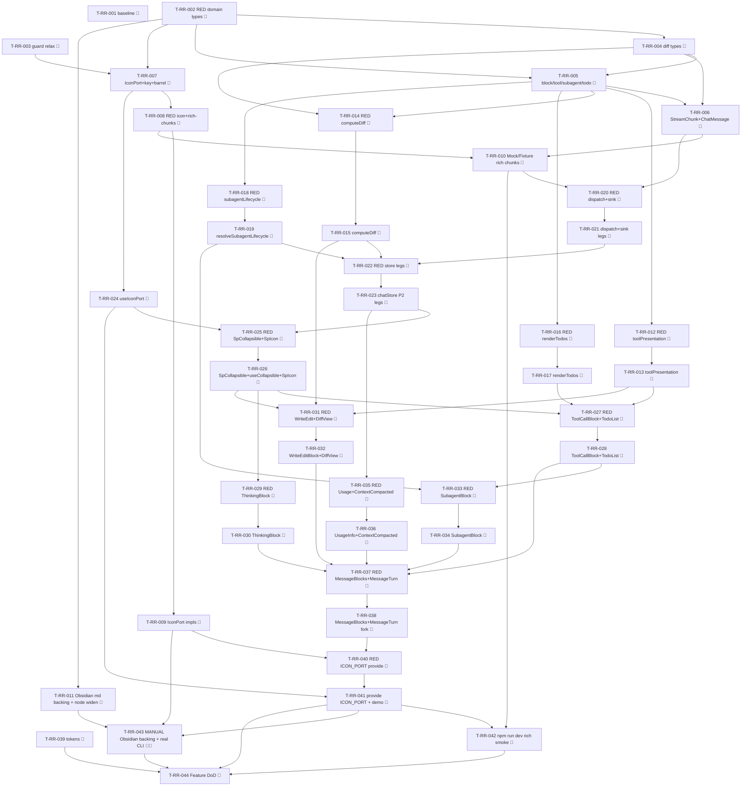

# Tasks — Rich rendering (P2)

Each task is ≤ ~½ day, has a stable `T-RR-NNN` id, references ≥ 1 SPEC-RR / TEST-RR / REQ-RR / NFR-RR,
names an owner, lists explicit dependencies, and has a testable Definition of Done. This decomposes
**SPEC-RR-001..034** (34 spec items) on top of the merged P1 chat surface (`chat-core`, TASKS-CC-001).

> **TDD ordering (mission discipline):** the RED test task for a contract comes **before** the
> implementation task that greens it. RED test tasks are owned by `qa`; implementation tasks by
> `dev`. **Every dev task's first DoD line is "the prior RED test(s) now pass".** This mirrors the
> P1 TASKS-CC-001 style the maintainer accepted.

> **DDD inward layering order (the batch structure):**
> 1. **DOMAIN** — new types (`ToolUseResult`/`StructuredPatchHunk`, `DiffLine`/`DiffStats`/
>    `ToolDiffData`, `ContentBlock`, `ToolCall`, `SubagentInfo`/modes, `TodoItem`), the `StreamChunk`
>    `toolUseResult` typing edit, `ChatMessage` growth, `IconPort` + `ICON_PORT` key + barrel re-export.
> 2. **INFRA** — Obsidian `MarkdownRenderPort` backing (coverage-excluded → manual leg) + `IconPort`
>    impls on the 3 bridges + Mock/Fixture scripted rich chunks.
> 3. **APPLICATION** — pure transforms (`toolPresentation`, `computeDiff`, `renderTodos`,
>    `resolveSubagentLifecycle`) each RED→green, then `RunChatTurnUseCase.dispatchChunk` handlers +
>    the new `ChatTurnSink` legs.
> 4. **UI** — `chatStore` state + sink-leg actions + `useIconPort()`, then the components
>    (`MessageBlocks` dispatcher, `SpCollapsible`+`useCollapsible`, `SpIcon`, `ToolCallBlock`,
>    `ThinkingBlock`, `TodoList`, `WriteEditBlock`+`DiffView`, `SubagentBlock`, `UsageInfo`,
>    `ContextCompactedBlock`) — each pairs a `data-testid` PageObject (ADR-009).
> 5. **STYLES** — the new `--sp-*` tokens (SPEC-RR-033), runnable anytime before the gate.
> 6. **WIRE-IN** — mount `MessageBlocks` into `MessageTurn`/`ChatSurface`; provide `ICON_PORT`
>    alongside the existing ports; Mock/Fixture demo wiring.
> 7. **GATE** — final `npm run verify` + `npm run test:all` + parity + draft PR into `next`.
> A test for a layer may not depend on a layer further out.

> **Coverage-excluded infra:** the Obsidian `MarkdownRenderer`/`setIcon` backing
> (SPEC-RR-010/012 production half) lives under `src/infrastructure/obsidian/**` (coverage-excluded,
> §10). Its only behavioural gate is the **manual** leg of TEST-RR-026 — never self-claimed by an
> agent; recorded for the reviewer/SRE in `test-plan.md` and run on real Obsidian, like P1's
> TEST-CC-017.

> **Deleted-symbol guard (ESLint):** `IconPort` / `SpIcon` / `ICON_PORT` were P0-deleted symbols
> (ADR-PSR-001). The deleted-symbol guard forbids re-introducing them, so **T-RR-003 must relax the
> guard for these regrown paths BEFORE the `IconPort` code imports resolve** (mirrors P1's
> CLAR-CC-007 guard relaxation for the markdown port symbols). Enumerated as its own task.

> **Parity is a review-stage human task:** the P2 parity-screenshot capture (charter §5 /
> NFR-RR-011/012) is deferred to issue **#434** (carry-over from P1) and signed off by a human at
> `/spec:review`, not in CI. The baseline-capture task (T-RR-001) runs first so a `claudian-main`
> rich-render reference exists pre-impl.

## Legend

- 🧪 = test task (RED-first; owner `qa`)
- 🔨 = implementation task (owner `dev`)
- 📐 = design / scaffolding / baseline task
- 🚀 = release / ops / gate task
- 🪓 = may slice (touches multiple independent code paths; expect several PRs)
- 👤 = human-owned (never agent-self-claimed)

---

## Task list

### T-RR-001 📐 — Baseline-capture: `claudian-main` P2 rich-render reference

- **Description:** Before any P2 implementation, capture the `claudian-main` baseline for the P2
  rich-render surfaces (tool-call header + expanded body, thinking live/finalised, todo list,
  write/edit + word-diff, subagent block + async pill, usage info) at 320 / 520 / 720 px, light +
  dark, into a `specs/rich-rendering/parity-screenshots.md` skeleton (baseline column only; the
  Specorator column is filled at review). Record the incremental-render qualitative baseline note
  for NFR-RR-014. Coordinate the matrix with issue #434. No production code.
- **Satisfies:** NFR-RR-011, NFR-RR-012, NFR-RR-014 (baseline leg)
- **Owner:** dev
- **Depends on:** —
- **Estimate:** S
- **Definition of done:**
  - [x] `specs/rich-rendering/parity-screenshots.md` exists with the per-renderer × 320/520/720 ×
        light/dark baseline matrix scaffolded, baseline column captured from `D:\Projects\claudian-main`.
  - [x] The incremental-render qualitative baseline note (NFR-RR-014) recorded in `test-plan.md`
        (canonical sink); linked to #434.
  - [x] No file under `src/` changed.

---

## Layer 1 — DOMAIN (SPEC-RR-001..009)

### T-RR-002 🧪 — RED: domain types + `StreamChunk` `toolUseResult` typing + `ChatMessage` growth (structural)

- **Description:** Author the failing structural/type-level tests asserting: (a) the `StreamChunk`
  P2 members diff clean vs `chat.ts:137` and `tool_result`/`subagent_tool_result` carry
  `toolUseResult?: ToolUseResult` (no longer `unknown`), with all P1 members byte-identical and no
  rename (TEST-RR-001); (b) `ToolUseResult`/`StructuredPatchHunk`/`DiffLine`/`DiffStats`/
  `ToolDiffData` shapes match `diff.ts:5/12/18/27` + `tools.ts:4` (TEST-RR-003); (c) `ContentBlock`
  is the ordered discriminated union of `chat.ts:31`; (d) `ToolCall` + `SubagentInfo`/`SubagentMode`/
  `AsyncSubagentStatus` + `TodoItem` shapes match (P2 subset — `isExpanded`/`resolvedAnswers`
  excluded); (e) `ChatMessage` gains `contentBlocks?`/`toolCalls?`, the six P1 fields intact, the
  excluded members (`images`, rewind ids, `currentNote`) still absent (TEST-RR-002). Names
  TEST-RR-001 / 002 / 003 in metadata.
- **Satisfies:** TEST-RR-001, TEST-RR-002, TEST-RR-003, SPEC-RR-001..008, REQ-RR-001, REQ-RR-010, REQ-RR-026
- **Owner:** qa
- **Depends on:** —
- **Estimate:** M
- **Definition of done:**
  - [x] `tests/domain/chat/StreamChunk.rr.test.ts`, `tests/domain/chat/ContentBlock.test.ts`,
        `tests/domain/chat/ToolCall.test.ts`, `tests/domain/chat/Subagent.test.ts`,
        `tests/domain/chat/TodoItem.test.ts`, `tests/domain/chat/diff/Diff.test.ts`,
        `tests/domain/chat/ChatMessage.rr.test.ts` exist, naming TEST-RR-001 / 002 / 003.
  - [x] Tests fail (RED) because the new domain types / typed `toolUseResult` / grown `ChatMessage`
        do not yet exist (compile/run failure is the RED signal).

### T-RR-003 🔨 — Relax the deleted-symbol guard for `IconPort` / `SpIcon` / `ICON_PORT`

> Mirrors P1's CLAR-CC-007 guard relaxation. **Must land before T-RR-007 (`IconPort`) so the new
> imports resolve** — `IconPort`/`SpIcon`/`ICON_PORT` are P0-deleted symbols the guard forbids.

- **Description:** Relax the ESLint deleted-symbol guard (the `no-restricted-imports` /
  deleted-subsystem rule introduced in P0, ADR-PSR-001) so the three regrown P2 icon-seam symbols
  (`IconPort`, `SpIcon`, `ICON_PORT`) are permitted on their new paths, while every other deleted
  symbol stays forbidden. No production code change beyond the lint config.
- **Satisfies:** SPEC-RR-009, SPEC-RR-025, NFR-RR-001
- **Owner:** dev
- **Depends on:** —
- **Estimate:** S
- **Definition of done:**
  - [x] The deleted-symbol guard permits `IconPort` / `SpIcon` / `ICON_PORT` on the new paths; every
        other P0-deleted symbol (`IBridge`/`BridgeKey`/`useBridge`/`usePorts`) stays forbidden.
  - [x] `npm run lint` green; the relaxation is documented inline in the lint config.
  - [x] Implementation-log entry added.

### T-RR-004 🔨 — Domain diff types: `ToolUseResult` / `StructuredPatchHunk` / `DiffLine` / `DiffStats` / `ToolDiffData`

- **Description:** Implement the pure diff domain types per SPEC-RR-002/003 in
  `src/domain/chat/diff/ToolUseResult.ts` (`StructuredPatchHunk`, `ToolUseResult` with the
  forward-compatible `[key:string]: unknown` bag) and `src/domain/chat/diff/Diff.ts`
  (`DiffLine`/`DiffStats`/`ToolDiffData`), with the per-field validation rules. No `obsidian`, no
  `node:*`, no class — pure interfaces.
- **Satisfies:** SPEC-RR-002, SPEC-RR-003, REQ-RR-001, REQ-RR-026
- **Owner:** dev
- **Depends on:** T-RR-002
- **Estimate:** S
- **Definition of done:**
  - [x] The TEST-RR-003 structural test passes (shapes match `diff.ts:5/12/18/27` + `tools.ts:4`).
  - [x] `npm run typecheck` + `npm run lint` green; no `obsidian`/`node:*` import in `src/domain/chat/diff/**`.
  - [x] Implementation-log entry added.

### T-RR-005 🔨 — Domain block/tool/subagent/todo types: `ContentBlock` / `ToolCall` / `Subagent` / `TodoItem`

- **Description:** Implement per SPEC-RR-004..007: `src/domain/chat/ContentBlock.ts` (ordered
  discriminated union, `chat.ts:31`), `src/domain/chat/ToolCall.ts` (id/name/input/status +
  `result?`/`diffData?`/`subagent?`; P2 subset — no `isExpanded`/`resolvedAnswers`),
  `src/domain/chat/Subagent.ts` (`SubagentMode`/`AsyncSubagentStatus`/`SubagentInfo` with nested
  `toolCalls`, P2 subset — no `isExpanded`), `src/domain/chat/TodoItem.ts` (`{content,status,activeForm}`
  + the `isValidTodoItem` guard, `todo.ts:9/17`). Pure interfaces only.
- **Satisfies:** SPEC-RR-004, SPEC-RR-005, SPEC-RR-006, SPEC-RR-007, REQ-RR-002, REQ-RR-003, REQ-RR-006, REQ-RR-010, REQ-RR-021, REQ-RR-022, REQ-RR-023
- **Owner:** dev
- **Depends on:** T-RR-002, T-RR-004
- **Estimate:** M
- **Definition of done:**
  - [x] The TEST-RR-002/003 structural tests pass for these unions (P2 subset confirmed; excluded
        members absent).
  - [x] `npm run typecheck` + `npm run lint` green; no `obsidian`/`node:*` import in `src/domain/chat/**`.
  - [x] Implementation-log entry added.

### T-RR-006 🔨 — `StreamChunk` `toolUseResult` typing edit + additive `ChatMessage` growth

- **Description:** Make the **single** edit to a declared P1 union member per SPEC-RR-001: replace
  `toolUseResult?: unknown` with `toolUseResult?: ToolUseResult` on `tool_result` and
  `subagent_tool_result` in `src/domain/chat/StreamChunk.ts` (no member renamed/removed; P1 members
  byte-identical). Grow `src/domain/chat/ChatMessage.ts` additively per SPEC-RR-008 with
  `contentBlocks?: ContentBlock[]` and `toolCalls?: ToolCall[]` (six P1 fields unchanged; excluded
  members documented as later-phase; no migration — load-or-default, NFR-RR-010).
- **Satisfies:** SPEC-RR-001, SPEC-RR-008, REQ-RR-001, REQ-RR-010, NFR-RR-010
- **Owner:** dev
- **Depends on:** T-RR-004, T-RR-005
- **Estimate:** S
- **Definition of done:**
  - [x] TEST-RR-001 + TEST-RR-002 pass (typed `toolUseResult`; `ChatMessage` grows additively; no
        P1 member renamed/removed).
  - [x] `npm run typecheck` + `npm run lint` + `npm run test` green; implementation-log entry added.

### T-RR-007 🔨 — `IconPort` + `IconNode` + `ICON_PORT` key + `@/domain/ports` barrel re-export

- **Description:** Implement per SPEC-RR-009: `src/domain/ports/IconPort.ts` (the declarative
  `IconNode` `{tag,attrs,children}` DTO + one-method `setIcon(name): IconNode | null`, pure/total,
  never a DOM mutator — NFR-RR-006), add `ICON_PORT: InjectionKey<IconPort>` to
  `src/infrastructure/bridge/ports.ts` (alongside the existing keys, no aggregate), and re-export
  `IconPort`/`IconNode` from `src/domain/ports/index.ts`.
- **Satisfies:** SPEC-RR-009, REQ-RR-019, REQ-RR-020, REQ-RR-022, NFR-RR-006
- **Owner:** dev
- **Depends on:** T-RR-002, T-RR-003
- **Estimate:** S
- **Definition of done:**
  - [x] `IconPort`/`IconNode` declared (DTO-returning, no DOM sink); `ICON_PORT` key exported;
        `@/domain/ports` re-exports both; the "no aggregate" header comment retained.
  - [x] `npm run typecheck` + `npm run lint` green; deleted-symbol guard green (relaxed in T-RR-003).
  - [x] Implementation-log entry added.

---

## Layer 2 — INFRA (SPEC-RR-010..013)

### T-RR-008 🧪 — RED: `IconPort` on the three bridges + Mock/Fixture rich-chunk scripts

- **Description:** Author the failing unit tests asserting: (a) each bridge exposes
  `createIconPort(): IconPort` returning the declarative-`IconNode` map for the P2 icon set
  (`check`/`x`/`shield-off`/`dot`/`wrench`/`file`/`terminal`/`search`/`bot` + tool icons), unknown
  name → `null` (Mock/LocalStorage share the static map; Obsidian row covered structurally —
  coverage-excluded); (b) `MockChatRuntime`'s default script + `FixtureChatRuntime`'s transcript
  emit the scripted rich-turn sequence (`assistant_message_start`→`text`→`thinking`→`tool_use(Read)`
  →`tool_result`→`tool_use(Write, structuredPatch)`→`tool_result`→`tool_use(TodoWrite)`→`tool_result`
  →`subagent_tool_use`/`subagent_tool_result`→`async_subagent_result`→`usage`→`done`) with the
  per-chunk yield boundary preserved. Names TEST-RR-024 (icon U leg), TEST-RR-026 (bridge U leg).
- **Satisfies:** TEST-RR-024 (U leg), TEST-RR-026 (U leg), SPEC-RR-012, SPEC-RR-013, REQ-RR-001, REQ-RR-019, NFR-RR-002
- **Owner:** qa
- **Depends on:** T-RR-007
- **Estimate:** M
- **Definition of done:**
  - [ ] `tests/infrastructure/mock/createIconPort.test.ts`,
        `tests/infrastructure/mock/MockChatRuntime.rr.test.ts`,
        `tests/infrastructure/localstorage/FixtureChatRuntime.rr.test.ts` exist, naming
        TEST-RR-024 / 026.
  - [ ] Tests fail (RED) — `createIconPort()` and the rich-chunk scripts do not yet exist.

### T-RR-009 🔨 — `IconPort` impls on the three bridges (static map + Obsidian walk) 🪓

> The `ObsidianBridge` half (`setIcon` → walk `<svg>` subtree to `IconNode`) is coverage-excluded
> infra (`src/infrastructure/obsidian/**`); its only behavioural gate is the manual leg of
> TEST-RR-026. The Mock/LocalStorage static-map half CI-greens TEST-RR-024 (U leg).

- **Description:** Implement per SPEC-RR-012: `MockBridge.createIconPort()` + `LocalStorageBridge`
  share a static `name→IconNode` map of the P2 icon set (unknown → `null`); `ObsidianBridge`
  `createIconPort()` calls Obsidian `setIcon` into a detached element, walks the produced `<svg>`
  subtree into an `IconNode` tree (tag/attrs/children read as data; element discarded; no sink
  reaches UI, NFR-RR-006), unknown → `null`. All bridges' `setIcon` pure/total.
- **Satisfies:** SPEC-RR-012, REQ-RR-019, NFR-RR-002, NFR-RR-006
- **Owner:** dev
- **Depends on:** T-RR-008
- **Estimate:** M
- **Slice plan:** may slice as (a) Mock+LocalStorage static map (CI-greens TEST-RR-024 U leg), then
  (b) ObsidianBridge walk (coverage-excluded, lands with the manual leg).
- **Definition of done:**
  - [ ] TEST-RR-024 (icon U leg) passes; unknown name → `null`; map is declarative `IconNode` only.
  - [ ] The Obsidian walk reads tag/attrs/children as data and discards the detached element — **no
        `innerHTML`/`outerHTML`/`setIcon`-into-UI sink** (NFR-RR-006 verified by source review + lint).
  - [ ] `npm run typecheck` + `npm run lint` + `npm run test` green; implementation-log entry added.

### T-RR-010 🔨 — Mock/Fixture runtimes emit scripted rich chunks

- **Description:** Implement per SPEC-RR-013: extend `MockChatRuntime`'s default script (and keep it
  injectable per test) and `FixtureChatRuntime`'s bundled transcript to yield the representative
  rich turn (tool call + Write/Edit diff + todo list + subagent + usage), each chunk keeping the
  per-chunk yield boundary so incremental render is observable (NFR-RR-014). No subprocess. Lands
  early so `npm run dev` / the demo drive every renderer from the start.
- **Satisfies:** SPEC-RR-013, REQ-RR-001, NFR-RR-002, NFR-RR-014
- **Owner:** dev
- **Depends on:** T-RR-008, T-RR-006
- **Estimate:** M
- **Definition of done:**
  - [ ] TEST-RR-026 (bridge U leg) passes; the scripted/fixture chunks reach the new sink legs.
  - [ ] Per-chunk yield boundary observable per tick; no `node:*`/subprocess in either runtime.
  - [ ] `npm run typecheck` + `npm run lint` + `npm run test` green; implementation-log entry added.

### T-RR-011 🔨 — `MarkdownRenderPort` Obsidian backing + `MarkdownNode`/`MarkdownInline` union widening 🪓

> The Obsidian `MarkdownRenderer` backing lives under `src/infrastructure/obsidian/**`
> (coverage-excluded); its behavioural gate is the **manual** leg of TEST-RR-026. The
> `MarkdownNode`/`MarkdownInline` widening (domain port type) is type-checked and lint-gated. If the
> fragment walk forces a `SafeRenderResult` return-shape change beyond this union widening, it
> **returns to ADR-RR-001 as an amendment/superseding ADR** before proceeding (spec §12 watch item).

- **Description:** Implement per SPEC-RR-010/011: widen `MarkdownNode`/`MarkdownInline` in
  `src/domain/ports/MarkdownRenderPort.ts` additively (P1 `paragraph` + `text`/`code` survive; add
  `heading`/`code_block`/`list` nodes + `strong`/`em` inlines), keeping the `SafeRenderResult.nodes`
  field contract. Upgrade `ObsidianBridge.createMarkdownRenderPort()` from the pure
  `safeMarkdownRender` to a backing that calls Obsidian `MarkdownRenderer.render(...)` into a
  **detached** element and **walks** that fragment into the `SafeRenderResult` DTO entirely in the
  bridge (never passes a DOM element/HTML string/sink to the UI, NFR-RR-006; degrade to a single
  `paragraph` of raw markdown on internal failure, never throw). Mock/LocalStorage keep pure
  `safeMarkdownRender`.
- **Satisfies:** SPEC-RR-010, SPEC-RR-011, REQ-RR-020a, NFR-RR-006
- **Owner:** dev
- **Depends on:** T-RR-002
- **Estimate:** M
- **Slice plan:** may slice as (a) `MarkdownNode`/`MarkdownInline` union widening (domain, type/lint
  gate), then (b) ObsidianBridge backing swap (coverage-excluded, manual leg).
- **Definition of done:**
  - [ ] `MarkdownNode`/`MarkdownInline` widen additively; `SafeRenderResult.nodes` field contract
        unchanged; Mock/LocalStorage backings + every P1 markdown test untouched.
  - [ ] The Obsidian backing walks the detached fragment → DTO in the bridge; **no
        `innerHTML`/`v-html`/DOM element reaches the UI** (NFR-RR-006, source review + lint).
  - [ ] `npm run typecheck` + `npm run lint` green; implementation-log entry added; the manual
        markdown leg of TEST-RR-026 is scheduled in `test-plan.md`.

---

## Layer 3 — APPLICATION (SPEC-RR-014..019)

### T-RR-012 🧪 — RED: `toolPresentation` pure transform

- **Description:** Author the failing unit tests for `toolName`/`toolSummary`/`toolLabel`
  (SPEC-RR-014): `TodoWrite`→`"Tasks 2/3"` (N completed / M total; `"Tasks"`/`"Tasks 0/0"` when
  empty/invalid via the `TodoItem` guard), default name verbatim; `Read`/`Write`/`Edit` summary →
  `fileNameOnly(file_path)` (last segment, `\`-normalised), `Bash`→`command` ≤60 chars,
  `Glob`/`Grep`→`pattern`, `LS`→`fileNameOnly(path ?? '.')`, `TodoWrite`/default summary → `''`;
  `toolLabel` per-tool ARIA label; missing/non-string inputs degrade to `''`/`name` (no throw,
  total). Names TEST-RR-014.
- **Satisfies:** TEST-RR-014, SPEC-RR-014, REQ-RR-019a, REQ-RR-023, NFR-RR-003, NFR-RR-005
- **Owner:** qa
- **Depends on:** T-RR-005
- **Estimate:** S
- **Definition of done:**
  - [ ] `tests/application/chat/toolPresentation.test.ts` exists, naming TEST-RR-014, covering the
        Read/Bash/Glob/Grep/LS/TodoWrite + empty-todos + missing-input cases.
  - [ ] Tests fail (RED) — `toolPresentation` does not yet exist.

### T-RR-013 🔨 — `toolPresentation.ts` (pure tool name/summary/label)

- **Description:** Implement `src/application/chat/toolPresentation.ts` per SPEC-RR-014: pure, total,
  never-throwing `toolName`/`toolSummary`/`toolLabel` reproducing the per-tool heuristics; reads
  `input.todos` via the `TodoItem` guard for the `TodoWrite` count.
- **Satisfies:** SPEC-RR-014, REQ-RR-019a, REQ-RR-023, NFR-RR-003, NFR-RR-005
- **Owner:** dev
- **Depends on:** T-RR-012
- **Estimate:** S
- **Definition of done:**
  - [ ] TEST-RR-014 passes (the prior RED tests now pass).
  - [ ] Total/pure: any malformed input degrades, never throws; no side effects; no `obsidian`/Vue import.
  - [ ] `npm run typecheck` + `npm run lint` + `npm run test` green; implementation-log entry added.

### T-RR-014 🧪 — RED: `computeDiff` pure transform

- **Description:** Author the failing unit tests for `computeDiff(toolUseResult, toolCall)`
  (SPEC-RR-015): structuredPatch +3/−1 → ordered `DiffLine[]` (insert/delete/equal with seeded
  1-based line numbers) + `{added:3,removed:1}`; Edit `old_string`/`new_string` input fallback →
  all-delete then all-insert; Write `content` input fallback → all-insert; malformed/negative/`NaN`
  bounds → empty `DiffLine[]` + `{added:0,removed:0}` (no throw, EC-RR-4); absent structuredPatch +
  no usable input → empty (EC-RR-3); empty `line.text` rendered as a single space. Names TEST-RR-018.
- **Satisfies:** TEST-RR-018, SPEC-RR-015, REQ-RR-026, NFR-RR-003, NFR-RR-005, NFR-RR-013
- **Owner:** qa
- **Depends on:** T-RR-004, T-RR-005
- **Estimate:** S
- **Definition of done:**
  - [ ] `tests/application/chat/computeDiff.test.ts` exists, naming TEST-RR-018, covering
        structuredPatch / Edit fallback / Write fallback / malformed (EC-RR-4) / absent (EC-RR-3).
  - [ ] Tests fail (RED) — `computeDiff` does not yet exist.

### T-RR-015 🔨 — `computeDiff.ts` (structuredPatch → `DiffLine[]` + `DiffStats`)

- **Description:** Implement `src/application/chat/computeDiff.ts` per SPEC-RR-015: the structuredPatch
  hunk walk + the Edit/Write input fallback + stats counting, reproducing `utils/diff.ts:9/33/130/147`.
  Pure, total, never throws — empty diff on malformed/absent input. **No new runtime dependency**
  (NFR-RR-013); the niche apply-patch/file-update parsers are deferred (CLAR-RR-005).
- **Satisfies:** SPEC-RR-015, REQ-RR-026, NFR-RR-003, NFR-RR-005, NFR-RR-013
- **Owner:** dev
- **Depends on:** T-RR-014
- **Estimate:** M
- **Definition of done:**
  - [ ] TEST-RR-018 passes (the prior RED tests now pass), incl. EC-RR-3/4.
  - [ ] Total/pure; no new dependency added to `package.json`; no `obsidian`/Vue import.
  - [ ] `npm run typecheck` + `npm run lint` + `npm run test` green; implementation-log entry added.

### T-RR-016 🧪 — RED: `renderTodos` + `parseTodos` pure transform

- **Description:** Author the failing unit tests for `renderTodos(todos)` / `parseTodos(input)`
  (SPEC-RR-016): each `TodoItem` → `{iconName: completed?'check':'dot', status, text:
  in_progress?activeForm:content}`; `parseTodos` reads `input.todos`, keeps only valid items (the
  `TodoItem` guard), returns `[]` when absent/all-invalid (EC-RR-6, no throw). Names TEST-RR-017 (U leg).
- **Satisfies:** TEST-RR-017 (U leg), SPEC-RR-016, REQ-RR-022, NFR-RR-003, NFR-RR-005
- **Owner:** qa
- **Depends on:** T-RR-005
- **Estimate:** S
- **Definition of done:**
  - [ ] `tests/application/chat/renderTodos.test.ts` exists, naming TEST-RR-017, covering
        pending/in-progress/completed mapping + empty/all-invalid (EC-RR-6).
  - [ ] Tests fail (RED) — `renderTodos`/`parseTodos` do not yet exist.

### T-RR-017 🔨 — `renderTodos.ts` (todos → status/icon/text rows)

- **Description:** Implement `src/application/chat/renderTodos.ts` per SPEC-RR-016: pure, total,
  never-throwing `renderTodos` + `parseTodos` (guard-filtered), reproducing `todoUtils.ts:5/9` +
  `todo.ts:30`.
- **Satisfies:** SPEC-RR-016, REQ-RR-022, NFR-RR-003, NFR-RR-005
- **Owner:** dev
- **Depends on:** T-RR-016
- **Estimate:** S
- **Definition of done:**
  - [ ] TEST-RR-017 (U leg) passes (the prior RED tests now pass).
  - [ ] Total/pure; no side effects; no `obsidian`/Vue import.
  - [ ] `npm run typecheck` + `npm run lint` + `npm run test` green; implementation-log entry added.

### T-RR-018 🧪 — RED: `resolveSubagentLifecycle` + `consolidateSubagent` pure transform

- **Description:** Author the failing unit tests for `resolveSubagentLifecycle(subagent)` /
  `consolidateSubagent(spawn, asyncResult?)` (SPEC-RR-017, Claude path only): classifies async
  (`agentId`/`mode:'async'` markers) vs sync; the asyncStatus ladder
  pending→running→completed/error→orphaned (EC-RR-11); `consolidate` merges a spawn + matched
  `async_subagent_result` into one subagent (status/asyncStatus/result/completedAt); a non-Claude
  shape degrades to `{mode:'sync'}`. Names TEST-RR-021.
- **Satisfies:** TEST-RR-021, SPEC-RR-017, REQ-RR-021b, NFR-RR-003, NFR-RR-005
- **Owner:** qa
- **Depends on:** T-RR-005
- **Estimate:** S
- **Definition of done:**
  - [ ] `tests/application/chat/resolveSubagentLifecycle.test.ts` exists, naming TEST-RR-021,
        covering async-vs-sync classification + consolidation + orphaned (EC-RR-11).
  - [ ] Tests fail (RED) — the helper does not yet exist.

### T-RR-019 🔨 — `resolveSubagentLifecycle.ts` (sync/async + consolidation, Claude path)

- **Description:** Implement `src/application/chat/resolveSubagentLifecycle.ts` per SPEC-RR-017:
  pure, total `resolveSubagentLifecycle` + `consolidateSubagent` for the Claude Task/Agent path;
  provider-lifecycle (Codex/Opencode) consolidation deferred to P9 (CLAR-RR-004, NG7).
- **Satisfies:** SPEC-RR-017, REQ-RR-021b, NFR-RR-003, NFR-RR-005
- **Owner:** dev
- **Depends on:** T-RR-018
- **Estimate:** M
- **Definition of done:**
  - [ ] TEST-RR-021 passes (the prior RED tests now pass), incl. orphaned classification.
  - [ ] Total/pure; non-Claude shape degrades to `{mode:'sync'}`; no `obsidian`/Vue import.
  - [ ] `npm run typecheck` + `npm run lint` + `npm run test` green; implementation-log entry added.

### T-RR-020 🧪 — RED: `RunChatTurnUseCase.dispatchChunk` P2 handlers + `ChatTurnSink` P2 legs

- **Description:** Author the failing unit tests (against a `MockChatRuntime` + stub `ChatTurnSink`)
  asserting `dispatchChunk` routes each P2 chunk to the matching sink leg (SPEC-RR-018/019):
  `tool_use`→`onToolUse`, `tool_result`→`onToolResult(...,toolUseResult)`, `tool_output`→
  `onToolOutput`, `thinking`→`onThinking`, `subagent_tool_use`→`onSubagentToolUse`,
  `subagent_tool_result`→`onSubagentToolResult`, `async_subagent_result`→`onAsyncSubagentResult`,
  `context_compacted`→`onContextCompacted`, `notice`→`onNotice`, `text` also pushes/extends a text
  block, `usage`→`onUsage`; the forward-compatible `default` branch ignores an unhandled future
  member and `done` finalises (REQ-RR-007, EC-RR-14); the streaming-error boundary stays the
  `{type:'error'}` chunk (no per-chunk `Result`, no throw across the port — ADR-CC-001 §1,
  NFR-RR-003). Names TEST-RR-005, 006, 007, 009, 012, 027.
- **Satisfies:** TEST-RR-005, 006, 007, 009, 012, 027, SPEC-RR-018, SPEC-RR-019, REQ-RR-001..007, NFR-RR-003
- **Owner:** qa
- **Depends on:** T-RR-006, T-RR-010
- **Estimate:** M
- **Definition of done:**
  - [ ] `tests/application/chat/RunChatTurnUseCase.rr.test.ts` exists, naming TEST-RR-005/006/007/
        009/012/027, covering each P2 chunk leg + default-branch + error-boundary.
  - [ ] Tests fail (RED) — the P2 dispatch cases + sink legs do not yet exist.

### T-RR-021 🔨 — `dispatchChunk` P2 handlers + `ChatTurnSink` P2 legs

- **Description:** Implement per SPEC-RR-018/019: add a `case` per P2 chunk member to
  `RunChatTurnUseCase.dispatchChunk` (preserving the forward-compatible `default` branch), and grow
  the `ChatTurnSink` interface additively with the P2 legs (`onToolUse`/`onToolResult`/
  `onToolOutput`/`onThinking`/`onSubagentToolUse`/`onSubagentToolResult`/`onAsyncSubagentResult`/
  `onContextCompacted`/`onNotice`; the five P1 legs unchanged). The use case forwards every chunk to
  the matching leg (out-of-order/unknown ids are the sink's responsibility); logs a `debug` per
  dispatched P2 chunk type+id (§8). Streaming-error boundary unchanged (ADR-CC-001 §1).
- **Satisfies:** SPEC-RR-018, SPEC-RR-019, REQ-RR-001, REQ-RR-002, REQ-RR-003, REQ-RR-004, REQ-RR-005, REQ-RR-006, REQ-RR-007, NFR-RR-003
- **Owner:** dev
- **Depends on:** T-RR-020
- **Estimate:** M
- **Definition of done:**
  - [ ] TEST-RR-005/006/007/009/012/027 pass (the prior RED tests now pass).
  - [ ] The `default` branch is preserved (REQ-RR-007); streaming error stays the `error` chunk (no
        per-chunk `Result`/throw); pure transforms degrade rather than crossing the boundary.
  - [ ] `npm run typecheck` + `npm run lint` + `npm run test` green; implementation-log entry added.

---

## Layer 4 — UI (SPEC-RR-020..032)

### T-RR-022 🧪 — RED: `chatStore` P2 sink-leg actions (state machine)

- **Description:** Author the failing unit tests for the P2 `chatStore` legs (SPEC-RR-020):
  `onToolUse` creates a `ToolCall{running}` + appends a `{type:'tool_use',toolId}` block (merges
  input on re-`tool_use`, no duplicate block); `onToolResult` matches by id, sets result + status
  (completed/error), calls `computeDiff` for Write/Edit → `diffData` (unknown id → `warn` + ignore,
  EC-RR-1; out-of-order before `tool_use` → ignore + `warn`, no buffer, EC-RR-2); `onToolOutput`
  appends interim output; `onThinking` accumulates/pushes an ordered thinking block; `onText` also
  pushes/extends a trailing text block (order preserved, REQ-RR-011); subagent legs route by
  id/agentId to the nested tool/`SubagentInfo` (unknown → ignore, EC-RR-9; `consolidateSubagent` on
  async result, EC-RR-10); `onContextCompacted` pushes the render-only block; every leg is a no-op
  when not streaming; `$reset` clears the new state. DTOs only. Names TEST-RR-005, 006, 007, 009 (store legs).
- **Satisfies:** TEST-RR-005, 006, 007, 009, SPEC-RR-020, REQ-RR-002, REQ-RR-003, REQ-RR-004, REQ-RR-006, REQ-RR-011, REQ-RR-021a
- **Owner:** qa
- **Depends on:** T-RR-021, T-RR-015, T-RR-019
- **Estimate:** M
- **Definition of done:**
  - [ ] `tests/ui/stores/chatStore.rr.test.ts` exists, naming the listed TEST-RR ids, covering the
        P2 legs + EC-RR-1/2/9/10 + order preservation + the no-op-when-not-streaming invariant.
  - [ ] Tests fail (RED) — the P2 store legs do not yet exist.

### T-RR-023 🔨 — `chatStore` P2 sink-leg actions + subagent registry

- **Description:** Implement per SPEC-RR-020: add the P2 sink-leg actions mutating the **live**
  message's `contentBlocks`/`toolCalls` (DTO-only boundary, ADR-003), the subagent registry
  (`Map<subagentId, SubagentInfo>` keyed to the live message and/or on the spawning
  `ToolCall.subagent`), the `onText` ordered-text-block extension, and the EC-RR-1/2/9 degrade
  policy (ignore + `warn`, no buffer). Every leg no-ops when `liveAssistantId === null` or
  `status !== 'streaming'`; `$reset` clears the new state. The store never imports `obsidian`.
- **Satisfies:** SPEC-RR-020, REQ-RR-002, REQ-RR-003, REQ-RR-004, REQ-RR-006, REQ-RR-011, REQ-RR-021a
- **Owner:** dev
- **Depends on:** T-RR-022
- **Estimate:** M
- **Definition of done:**
  - [ ] TEST-RR-005/006/007/009 (store legs) pass (the prior RED tests now pass), incl. EC-RR-1/2/9/10.
  - [ ] DTOs only across the store boundary; no `obsidian`/`node:*` import; `$reset` clears P2 state.
  - [ ] `npm run typecheck` + `npm run lint` + `npm run test` green; implementation-log entry added.

### T-RR-024 🔨 — `useIconPort()` composable

- **Description:** Add `src/ui/composables/useIconPort.ts` per SPEC-RR-021, mirroring the existing
  inject-or-throw composables: injects `ICON_PORT`, throws a clear "was not provided" error if absent.
- **Satisfies:** SPEC-RR-021, REQ-RR-019, NFR-RR-001
- **Owner:** dev
- **Depends on:** T-RR-007
- **Estimate:** S
- **Definition of done:**
  - [ ] The composable exists, inject-or-throw; no `obsidian`/`node:*` import.
  - [ ] `npm run typecheck` + `npm run lint` green; implementation-log entry added.

### T-RR-025 🧪 — RED: `SpCollapsible.vue` + `useCollapsible` + `SpIcon.vue` (PageObjects) 🪓

- **Description:** Author the failing component tests + `SpCollapsible.po.ts` / `SpIcon.po.ts`
  (data-testid only): `SpCollapsible` collapsed by default; header is a focusable `role="button"`
  `tabindex="0"`; toggle on click + Enter + Space (`preventDefault`); `aria-expanded` reflects
  state; dynamic accessible label `"<label> - click to expand"`/`"… - click to collapse"`; the 2px
  tree-branch rail uses **logical** properties + `--sp-tool-rail*`/`--sp-thinking-rail-indent`
  tokens (no raw hex, no physical-direction leak); under `prefers-reduced-motion` no
  transition/pulse (TEST-RR-010, 011). `SpIcon` renders an `IconNode` declaratively as a recursive
  VNode tree; unknown name → generic fallback / `aria-hidden` decorative; **asserts no
  `v-html`/`innerHTML`** (TEST-RR-024 A leg). Names TEST-RR-010, 011, 024.
- **Satisfies:** TEST-RR-010, TEST-RR-011, TEST-RR-024 (A leg), SPEC-RR-024, SPEC-RR-025, REQ-RR-015, REQ-RR-016, REQ-RR-017, REQ-RR-018, REQ-RR-019, NFR-RR-006, NFR-RR-007, NFR-RR-008
- **Owner:** qa
- **Depends on:** T-RR-023, T-RR-024
- **Estimate:** M
- **Definition of done:**
  - [ ] `tests/ui/chat/SpCollapsible.test.ts` + `SpCollapsible.po.ts`, `tests/ui/chat/SpIcon.test.ts`
        + `SpIcon.po.ts` exist, naming TEST-RR-010/011/024, data-testid only.
  - [ ] Tests fail (RED) — `SpCollapsible`/`useCollapsible`/`SpIcon` do not yet exist.

### T-RR-026 🔨 — `SpCollapsible.vue` + `useCollapsible` + `SpIcon.vue` (the shared primitives) 🪓

- **Description:** Implement per SPEC-RR-024/025: `src/ui/composables/useCollapsible.ts` (ephemeral
  `isExpanded` + `toggle`/`collapse`/`expand`, never on the DTO); `src/ui/chat/SpCollapsible.vue`
  (`<script setup>`, WCAG 2.2 AA — collapsed by default, focusable header, click/Enter/Space toggle,
  `aria-expanded`, dynamic `aria-label`, the logical-property tree-branch rail via tokens,
  reduced-motion/forced-colors guard, `header`/`default` slots); `src/ui/chat/SpIcon.vue` rendering
  an `IconNode` from `useIconPort()` as a recursive VNode tree (`h(node.tag, node.attrs, ...)`),
  unknown name → generic `'wrench'` fallback / decorative `aria-hidden`. **No `v-html`/`innerHTML`.**
- **Satisfies:** SPEC-RR-024, SPEC-RR-025, REQ-RR-015, REQ-RR-016, REQ-RR-017, REQ-RR-018, REQ-RR-019, NFR-RR-004, NFR-RR-006, NFR-RR-007, NFR-RR-008
- **Owner:** dev
- **Depends on:** T-RR-025
- **Estimate:** M
- **Definition of done:**
  - [ ] TEST-RR-010/011/024 (A leg) pass (the prior RED tests now pass).
  - [ ] **No `v-html`/`innerHTML`/`outerHTML`/`insertAdjacentHTML`** in either component (NFR-RR-006,
        lint-verified); `<script setup>`; no `obsidian` import; rail uses logical properties + tokens only.
  - [ ] `npm run typecheck` + `npm run lint` + `npm run test` green; implementation-log entry added.

### T-RR-027 🧪 — RED: `ToolCallBlock.vue` + `TodoList.vue` (PageObjects) 🪓

- **Description:** Author the failing component tests + PageObjects (data-testid only):
  `ToolCallBlock` header shows per-tool `SpIcon`, monospace name = `toolName(...)` + summary =
  `toolSummary(...)` (empty summary → no summary element), end-pinned status coloured + iconned per
  status via `--sp-status-*` tokens (running/completed-check/error-x/blocked-shield-off, never
  colour-only — `aria-label`); expanded body renders input/result as **escaped monospace
  pre-wrapped declarative text** — a literal `<script>alert(1)</script>` shows verbatim, **lint
  confirms no `v-html`/`innerHTML`** (TEST-RR-013, 015, EC-RR-XSS); aria-label = `toolLabel(...)`.
  `TodoList` rows: in-progress gerund + active colour, pending dot, completed check + done colour;
  empty list → no rows (EC-RR-6); text via `{{ }}` (TEST-RR-017 A leg). Names TEST-RR-013, 015, 017.
- **Satisfies:** TEST-RR-013, TEST-RR-015, TEST-RR-017 (A leg), SPEC-RR-026, SPEC-RR-028, REQ-RR-019, REQ-RR-020, REQ-RR-020a, REQ-RR-022, NFR-RR-006, NFR-RR-007
- **Owner:** qa
- **Depends on:** T-RR-026, T-RR-013, T-RR-017
- **Estimate:** M
- **Definition of done:**
  - [ ] `tests/ui/chat/ToolCallBlock.test.ts` + `ToolCallBlock.po.ts`, `tests/ui/chat/TodoList.test.ts`
        + `TodoList.po.ts` exist, naming TEST-RR-013/015/017, data-testid only.
  - [ ] Tests fail (RED) — `ToolCallBlock`/`TodoList` do not yet exist.

### T-RR-028 🔨 — `ToolCallBlock.vue` + `TodoList.vue`

- **Description:** Implement per SPEC-RR-026/028: `src/ui/chat/ToolCallBlock.vue` (wraps
  `SpCollapsible`; header icon/name/summary + end-pinned token-coloured status with `aria-label`;
  expanded body = generic renderer — escaped monospace pre-wrapped declarative `<pre>`/`<span>`
  text; TodoWrite renders `TodoList` in the body) and `src/ui/chat/TodoList.vue` (one row per item
  via `renderTodos`/`parseTodos`, status icon + token colour, empty → no rows). `<script setup>`,
  declarative text only.
- **Satisfies:** SPEC-RR-026, SPEC-RR-028, REQ-RR-019, REQ-RR-020, REQ-RR-020a, REQ-RR-022, NFR-RR-004, NFR-RR-006, NFR-RR-007
- **Owner:** dev
- **Depends on:** T-RR-027
- **Estimate:** M
- **Definition of done:**
  - [ ] TEST-RR-013/015/017 (A leg) pass (the prior RED tests now pass), incl. EC-RR-XSS/EC-RR-6.
  - [ ] **No `v-html`/`innerHTML`** (NFR-RR-006, lint-verified); `<script setup>`; no `obsidian`
        import; status/colour via `--sp-*` tokens, never raw colour.
  - [ ] `npm run typecheck` + `npm run lint` + `npm run test` green; implementation-log entry added.

### T-RR-029 🧪 — RED: `ThinkingBlock.vue` (timer + freeze + auto-collapse) (PageObject)

- **Description:** Author the failing component test + `ThinkingBlock.po.ts` (data-testid, fake
  timers): live → brand-coloured (`--sp-thinking-color`) italic `"Thinking Ns…"` incrementing each
  second with the pulse class (absent under reduced-motion); after ~2s → `"Thinking 2s…"`; finalise
  (live→false) → timer stops, label freezes to `"Thought for 3s"` (no `…`), block auto-collapses
  (`aria-expanded="false"`); interval cleared on cancel/unmount (EC-RR-7); reasoning text via
  `MarkdownBlock` (no `v-html`). Names TEST-RR-016.
- **Satisfies:** TEST-RR-016, SPEC-RR-027, REQ-RR-013, REQ-RR-014, NFR-RR-006
- **Owner:** qa
- **Depends on:** T-RR-026
- **Estimate:** M
- **Definition of done:**
  - [ ] `tests/ui/chat/ThinkingBlock.test.ts` + `ThinkingBlock.po.ts` exist, naming TEST-RR-016,
        using fake timers; data-testid only.
  - [ ] Tests fail (RED) — `ThinkingBlock` does not yet exist.

### T-RR-030 🔨 — `ThinkingBlock.vue`

- **Description:** Implement `src/ui/chat/ThinkingBlock.vue` per SPEC-RR-027: live 1s-interval
  `"Thinking Ns…"` (brand italic + pulse via `--sp-thinking-pulse-duration`, 0s under
  reduced-motion); on finalise stop the interval, freeze to `"Thought for Ns"`, auto-collapse via
  `useCollapsible().collapse()`; reasoning text through `MarkdownBlock`; interval cleared on unmount
  **and** finalise (EC-RR-7). `<script setup>`, no `v-html`.
- **Satisfies:** SPEC-RR-027, REQ-RR-013, REQ-RR-014, NFR-RR-004, NFR-RR-006, NFR-RR-007
- **Owner:** dev
- **Depends on:** T-RR-029
- **Estimate:** M
- **Definition of done:**
  - [ ] TEST-RR-016 passes (the prior RED tests now pass), incl. interval cleanup (EC-RR-7).
  - [ ] **No `v-html`/`innerHTML`** (NFR-RR-006, lint-verified); `<script setup>`; no `obsidian` import.
  - [ ] `npm run typecheck` + `npm run lint` + `npm run test` green; implementation-log entry added.

### T-RR-031 🧪 — RED: `WriteEditBlock.vue` + `DiffView.vue` (PageObjects)

- **Description:** Author the failing component tests + `WriteEditBlock.po.ts` / `DiffView.po.ts`
  (data-testid only): `DiffView` renders each `DiffLine` as per-line declarative spans — a 16px
  centred monospace prefix gutter (`+`/`−`/space) + a text span (`text || ' '`); insert →
  `--sp-diff-insert-bg`, delete → `--sp-diff-delete-bg` background (**no strikethrough**), equal
  muted; height cap (`--sp-diff-max-height`) scroll; all-insert > `NEW_FILE_DISPLAY_CAP` (20) → first
  20 + "... N more lines" footer (EC-RR-5); **no `v-html`**. `WriteEditBlock` header: file icon, name,
  filename summary, end-pinned status, stat chip `+N`(green)/`-N`(red) — only non-zero shown; no
  `diffData` → generic body (EC-RR-3). Names TEST-RR-019.
- **Satisfies:** TEST-RR-019, SPEC-RR-029, REQ-RR-025, REQ-RR-027, NFR-RR-006, NFR-RR-007
- **Owner:** qa
- **Depends on:** T-RR-026, T-RR-015, T-RR-013
- **Estimate:** M
- **Definition of done:**
  - [ ] `tests/ui/chat/WriteEditBlock.test.ts` + `WriteEditBlock.po.ts`,
        `tests/ui/chat/DiffView.test.ts` + `DiffView.po.ts` exist, naming TEST-RR-019, data-testid only.
  - [ ] Tests fail (RED) — `WriteEditBlock`/`DiffView` do not yet exist.

### T-RR-032 🔨 — `WriteEditBlock.vue` + `DiffView.vue`

- **Description:** Implement per SPEC-RR-029: `src/ui/chat/DiffView.vue` (per-line declarative spans,
  gutter + text span, token backgrounds, no strikethrough, height-cap scroll, `NEW_FILE_DISPLAY_CAP`
  = 20 truncation footer reproduced from `DiffRenderer.ts:76` — not newly invented, NFR-RR-013) and
  `src/ui/chat/WriteEditBlock.vue` (wraps `SpCollapsible`; header with file icon/name/summary/status
  + non-zero `+N`/`-N` stat chip; body embeds `DiffView` with `toolCall.diffData`; no `diffData` →
  generic body, EC-RR-3). `<script setup>`, no `v-html`.
- **Satisfies:** SPEC-RR-029, REQ-RR-025, REQ-RR-027, NFR-RR-004, NFR-RR-006, NFR-RR-007
- **Owner:** dev
- **Depends on:** T-RR-031
- **Estimate:** M
- **Definition of done:**
  - [ ] TEST-RR-019 passes (the prior RED tests now pass), incl. EC-RR-3/5.
  - [ ] **No `v-html`/`innerHTML`** (NFR-RR-006, lint-verified); background-highlight only (no
        `text-decoration`); `<script setup>`; no `obsidian` import; colour via `--sp-diff-*` tokens.
  - [ ] `npm run typecheck` + `npm run lint` + `npm run test` green; implementation-log entry added.

### T-RR-033 🧪 — RED: `SubagentBlock.vue` (PageObject)

- **Description:** Author the failing component test + `SubagentBlock.po.ts` (data-testid only):
  collapsible block (accent icon) with collapsible prompt/result/tools sections; nested `toolCalls`
  reuse `ToolCallBlock` (smaller scale); result body scrolls within `--sp-subagent-result-max-height`
  (220px); async status pill coloured by `subagent.asyncStatus` via `--sp-state-*` tokens
  (pending/running/completed/error/orphaned), pill text names the state (never colour-only); error
  + no result → error pill, empty result (EC-RR-10); spawn with no result → orphaned pill (EC-RR-11);
  sync subagents show nested tools inline (no pill). Consumes `resolveSubagentLifecycle`. Names
  TEST-RR-020.
- **Satisfies:** TEST-RR-020, SPEC-RR-030, REQ-RR-021, REQ-RR-021a, NFR-RR-007, NFR-RR-008
- **Owner:** qa
- **Depends on:** T-RR-028, T-RR-019
- **Estimate:** M
- **Definition of done:**
  - [ ] `tests/ui/chat/SubagentBlock.test.ts` + `SubagentBlock.po.ts` exist, naming TEST-RR-020,
        covering the async pill ladder + EC-RR-10/11; data-testid only.
  - [ ] Tests fail (RED) — `SubagentBlock` does not yet exist.

### T-RR-034 🔨 — `SubagentBlock.vue`

- **Description:** Implement `src/ui/chat/SubagentBlock.vue` per SPEC-RR-030: wraps `SpCollapsible`
  (accent icon); collapsible prompt/result/tools sections; nested `toolCalls` rendered via
  `ToolCallBlock` (`--sp-font-size-xs`); result height cap; async status pill via `--sp-state-*`
  tokens (state named, never colour-only); lifecycle classified by `resolveSubagentLifecycle`;
  EC-RR-10/11 handled; sync → inline tools, no pill. `<script setup>`, no `v-html`.
- **Satisfies:** SPEC-RR-030, REQ-RR-021, REQ-RR-021a, NFR-RR-004, NFR-RR-006, NFR-RR-007, NFR-RR-008
- **Owner:** dev
- **Depends on:** T-RR-033
- **Estimate:** M
- **Definition of done:**
  - [ ] TEST-RR-020 passes (the prior RED tests now pass), incl. EC-RR-10/11.
  - [ ] **No `v-html`/`innerHTML`** (NFR-RR-006, lint-verified); `<script setup>`; no `obsidian`
        import; pill colour via `--sp-state-*` tokens, never raw colour.
  - [ ] `npm run typecheck` + `npm run lint` + `npm run test` green; implementation-log entry added.

### T-RR-035 🧪 — RED: `UsageInfo.vue` + `ContextCompactedBlock.vue` (PageObjects)

- **Description:** Author the failing component tests + `UsageInfo.po.ts` / `ContextCompactedBlock.po.ts`
  (data-testid only): `UsageInfo` reads `chatStore.usage` → renders context tokens + ~percentage
  (+ optional model) via `--sp-*`-tokened declarative text; when `usage === null` renders **nothing**
  (EC-RR-12); missing `contextWindow` → tokens only; not the P6 arc meter (TEST-RR-004, 022).
  `ContextCompactedBlock` renders a static "context compacted" notice when a `{type:'context_compacted'}`
  block is present, declarative text only, no compaction machinery (TEST-RR-025, NG1). Names
  TEST-RR-004, 022, 025.
- **Satisfies:** TEST-RR-004, TEST-RR-022, TEST-RR-025, SPEC-RR-031, SPEC-RR-032, REQ-RR-005, REQ-RR-007, REQ-RR-024, REQ-RR-024a, NFR-RR-006
- **Owner:** qa
- **Depends on:** T-RR-023
- **Estimate:** M
- **Definition of done:**
  - [ ] `tests/ui/chat/UsageInfo.test.ts` + `UsageInfo.po.ts`,
        `tests/ui/chat/ContextCompactedBlock.test.ts` + `ContextCompactedBlock.po.ts` exist, naming
        TEST-RR-004/022/025, data-testid only.
  - [ ] Tests fail (RED) — `UsageInfo`/`ContextCompactedBlock` do not yet exist.

### T-RR-036 🔨 — `UsageInfo.vue` + `ContextCompactedBlock.vue`

- **Description:** Implement `src/ui/chat/UsageInfo.vue` per SPEC-RR-031 (turn-level; reads
  `chatStore.usage`; token info via `--sp-*`-tokened text; `usage === null` → renders nothing,
  EC-RR-12; missing `contextWindow` → tokens only; not the P6 meter) and
  `src/ui/chat/ContextCompactedBlock.vue` per SPEC-RR-032 (static render-only notice, no machinery).
  `<script setup>`, declarative text only.
- **Satisfies:** SPEC-RR-031, SPEC-RR-032, REQ-RR-005, REQ-RR-007, REQ-RR-024, REQ-RR-024a, NFR-RR-004, NFR-RR-006
- **Owner:** dev
- **Depends on:** T-RR-035
- **Estimate:** S
- **Definition of done:**
  - [ ] TEST-RR-004/022/025 pass (the prior RED tests now pass), incl. EC-RR-12.
  - [ ] **No `v-html`/`innerHTML`** (NFR-RR-006, lint-verified); `<script setup>`; no `obsidian` import.
  - [ ] `npm run typecheck` + `npm run lint` + `npm run test` green; implementation-log entry added.

### T-RR-037 🧪 — RED: `MessageBlocks.vue` dispatcher + `MessageTurn.vue` fork (PageObjects)

- **Description:** Author the failing component tests + `MessageBlocks.po.ts` / extended
  `MessageTurn.po.ts` (data-testid only): `MessageBlocks` iterates `message.contentBlocks` **in
  order** (`v-for` keyed by index) and renders one child per `block.type` — `text`→`MarkdownBlock`,
  `tool_use`→`ToolCallBlock` (Write/Edit→`WriteEditBlock`, TodoWrite→`TodoList` in body) resolving
  `toolCalls.find(t=>t.id===block.toolId)` (dangling ref → renders nothing, EC-RR-1),
  `thinking`→`ThinkingBlock`, `subagent`→`SubagentBlock`, `context_compacted`→`ContextCompactedBlock`;
  block order asserted by `data-testid` sequence (TEST-RR-008). `MessageTurn` forks: `contentBlocks`
  present → `MessageBlocks`, else the P1 `MarkdownBlock` over `content`; a stored message renders
  identically, collapsed by default (TEST-RR-023, EC-RR-13). Names TEST-RR-008, 023.
- **Satisfies:** TEST-RR-008, TEST-RR-023, SPEC-RR-022, SPEC-RR-023, REQ-RR-011, REQ-RR-012, REQ-RR-018, NFR-RR-006
- **Owner:** qa
- **Depends on:** T-RR-028, T-RR-030, T-RR-032, T-RR-034, T-RR-036
- **Estimate:** M
- **Definition of done:**
  - [ ] `tests/ui/chat/MessageBlocks.test.ts` + `MessageBlocks.po.ts` and extended
        `tests/ui/chat/MessageTurn.rr.test.ts` + `MessageTurn.po.ts` exist, naming TEST-RR-008/023,
        data-testid only; block order asserted by `data-testid` sequence.
  - [ ] Tests fail (RED) — `MessageBlocks` + the `MessageTurn` fork do not yet exist.

### T-RR-038 🔨 — `MessageBlocks.vue` dispatcher + `MessageTurn.vue` blocks-vs-content fork

- **Description:** Implement `src/ui/chat/MessageBlocks.vue` per SPEC-RR-022 (the thin dispatcher —
  owns ordering; iterates `contentBlocks` verbatim, one child per type; dangling `tool_use` ref →
  nothing, EC-RR-1) and extend `src/ui/chat/MessageTurn.vue` per SPEC-RR-023 (when `contentBlocks`
  present render `MessageBlocks`, else the P1 `MarkdownBlock` over `content` — stored-vs-live parity,
  collapsed by default, EC-RR-13; all other P1 behaviour unchanged). `<script setup>`, no `v-html`.
- **Satisfies:** SPEC-RR-022, SPEC-RR-023, REQ-RR-011, REQ-RR-012, REQ-RR-018, NFR-RR-004, NFR-RR-006
- **Owner:** dev
- **Depends on:** T-RR-037
- **Estimate:** M
- **Definition of done:**
  - [ ] TEST-RR-008/023 pass (the prior RED tests now pass), incl. EC-RR-1/13 + collapsed-by-default.
  - [ ] **No `v-html`/`innerHTML`** (NFR-RR-006, lint-verified); `<script setup>`; the P1
        `MarkdownBlock`/`content` path never regresses; no `obsidian` import.
  - [ ] `npm run typecheck` + `npm run lint` + `npm run test` green; implementation-log entry added.

---

## Layer 5 — STYLES (SPEC-RR-033)

### T-RR-039 🔨 — `--sp-*` token additions (token layer only)

> No dependencies — runnable anytime before the gate (parallel with the domain RED).

- **Description:** Add the `§4.9 — Rich rendering (P2)` block to `src/ui/styles/tokens.css` per
  SPEC-RR-033: the tree-branch rail tokens, thinking colour/pulse, tool-status ladder, async-state
  ladder, todo colours + dot scale, diff insert/delete/add/del/gutter/max-height, subagent result
  max-height, and the reduced-motion guard zeroing the thinking pulse. Diff/thinking derive from
  `--sp-success`/`--sp-error`/`--sp-accent` (NOT `#D97757`). Colour literals confined to the token
  layer — **no** P2 component carries a hex / raw Obsidian var (NFR-RR-007).
- **Satisfies:** SPEC-RR-033, REQ-RR-013, REQ-RR-016, REQ-RR-017, REQ-RR-020, REQ-RR-021a, REQ-RR-022, REQ-RR-025, REQ-RR-027, NFR-RR-007
- **Owner:** dev
- **Depends on:** —
- **Estimate:** S
- **Definition of done:**
  - [x] The §4.9 tokens exist in `tokens.css`; the reduced-motion guard zeroes `--sp-thinking-pulse-duration`.
  - [x] The `lint-style-tokens` guard passes with zero leaks; no P2 component file contains a
        hex/raw-var colour; `npm run lint` green.
  - [x] Implementation-log entry added.

---

## Layer 6 — WIRE-IN (SPEC-RR-021 provide + demo)

### T-RR-040 🧪 — RED: `ICON_PORT` provided in the sidebar + standalone mount

- **Description:** Author the failing component/integration test asserting `ICON_PORT` is provided
  (from `bridge.createIconPort()`) alongside the existing nine ports in both `AgentSidebarView` and
  `src/ui/main.ts`, and that a mounted `MessageBlocks`/`ToolCallBlock` resolves icons through it.
  Extends the P1 mount test.
- **Satisfies:** SPEC-RR-021, REQ-RR-019, NFR-RR-001
- **Owner:** qa
- **Depends on:** T-RR-038, T-RR-009
- **Estimate:** S
- **Definition of done:**
  - [ ] `tests/ui/chat/mount.rr.test.ts` (or the extended P1 mount test) exists, asserting
        `ICON_PORT` provision; data-testid only.
  - [ ] Test fails (RED) — `ICON_PORT` is not yet provided.

### T-RR-041 🔨 — Provide `ICON_PORT` in `AgentSidebarView` + `src/ui/main.ts`; demo wiring 🪓

- **Description:** Per SPEC-RR-021: call `bridge.createIconPort()` once and
  `app.provide(ICON_PORT, iconPort)` alongside the existing ports in `src/plugin/AgentSidebarView.ts`,
  and mirror in `src/ui/main.ts` (standalone / `npm run dev`) with `MockBridge`. With T-RR-010's
  scripted rich chunks already landed, `npm run dev` + the demo now drive every renderer headlessly.
- **Satisfies:** SPEC-RR-021, REQ-RR-019, NFR-RR-002
- **Owner:** dev
- **Depends on:** T-RR-040, T-RR-024
- **Estimate:** S
- **Slice plan:** may slice as (a) `AgentSidebarView` provision, (b) `src/ui/main.ts` standalone.
- **Definition of done:**
  - [ ] T-RR-040 passes; `ICON_PORT` provided with the existing ports in both entry points.
  - [ ] `npm run typecheck` + `npm run lint` + `npm run test` green; no `obsidian` leak under `src/ui/**`.
  - [ ] Implementation-log entry added.

### T-RR-042 🧪 — `npm run dev` standalone rich-render smoke (TEST-RR-026 dev leg)

- **Description:** Run `npm run dev` and confirm the chat surface mounts against `MockBridge`,
  streams the scripted rich turn (tool call → diff → todo → subagent → usage) incrementally, and
  every renderer (tool-call, thinking timer, todo, write/edit diff, subagent pill, usage) appears —
  the standalone smoke leg of TEST-RR-026. Manual-assisted: the build is automatable but the visual
  rich-render check is human-observed; record the result in `test-plan.md`.
- **Satisfies:** TEST-RR-026 (dev leg), NFR-RR-002, NFR-RR-014
- **Owner:** qa
- **Depends on:** T-RR-041, T-RR-010
- **Estimate:** S
- **Definition of done:**
  - [ ] `npm run dev` boots; the scripted rich turn streams every renderer incrementally and finalises.
  - [ ] Result recorded in `test-plan.md` (TEST-RR-026 dev leg pass/fail + date).

---

## Layer 7 — GATE (manual backing + feature DoD)

### T-RR-043 🚀👤 — MANUAL: Obsidian `MarkdownRenderer`/`setIcon` backing + real-CLI rich turn (TEST-RR-026 M leg) — human-run

> **Never self-claimed by an agent.** The Obsidian markdown/icon backing
> (`src/infrastructure/obsidian/**`) is coverage-excluded infra; this is its sole behavioural gate,
> mirroring P1's TEST-CC-017. The agent only schedules and records it.

- **Description:** On an Obsidian desktop install with the `claude` CLI logged in, send a message
  that produces a rich turn (tool call + Write/Edit diff + todo + subagent) and confirm: the
  production Obsidian `MarkdownRenderer` backing walks the fragment → `SafeRenderResult` DTO; the
  Obsidian `setIcon` backing walks the `<svg>` → `IconNode`; every renderer displays at perceptual
  parity with the captured baseline; and a source review confirms **no DOM-injection sink reaches
  the UI** (NFR-RR-006) and **no stored secret** (NFR-RR-010). Confirm Obsidian-vs-pure markdown
  perceptual equivalence for the common paragraph/inline-code case (EC-RR-17).
- **Satisfies:** TEST-RR-026 (M leg), SPEC-RR-010, SPEC-RR-012, NFR-RR-002, NFR-RR-006, NFR-RR-010, EC-RR-17
- **Owner:** human
- **Depends on:** T-RR-011, T-RR-009, T-RR-041
- **Estimate:** S
- **Definition of done:**
  - [ ] A real rich turn renders + finalises in Obsidian; the Obsidian markdown/icon backings produce
        the DTOs; perceptual parity vs the baseline confirmed; EC-RR-17 equivalence confirmed.
  - [ ] Source review confirms no DOM-injection sink reaches the UI and no secret read/persisted;
        recorded in `test-plan.md` / `test-report.md` with reviewer name + date.

### T-RR-044 🚀 — Feature DoD: full verify + parity sign-off + draft PR into `next`

- **Description:** The closing gate for P2. Run the full pre-PR verify chain and `npm run test:all`;
  confirm zero bypasses, `manifest.json` (`id`, `version`, `minAppVersion 1.12.7`) unchanged, the
  no-`v-html`/`innerHTML` lint guard green across the render path **and** the bridge DTO-walks
  (NFR-RR-006, SPEC-RR-034), the deleted-symbol guard green (only `IconPort`/`SpIcon`/`ICON_PORT`
  relaxed, every other deleted symbol still forbidden), no `obsidian`/`node:*` under `src/ui/**`,
  coverage 80/70/80/80, and that the P2 parity screenshots (charter §5, NFR-RR-011/012 — deferred to
  issue **#434**) are captured and human-signed at review. Open a **draft PR into `next`**.
- **Satisfies:** SPEC-RR-034, NFR-RR-005, NFR-RR-006, NFR-RR-009, NFR-RR-010, NFR-RR-011, NFR-RR-012, NFR-RR-001
- **Owner:** dev
- **Depends on:** T-RR-039, T-RR-041, T-RR-042, T-RR-043
- **Estimate:** M
- **Definition of done:**
  - [ ] `npm audit --audit-level=high --omit=dev` + `npm run typecheck` + `npm run lint` +
        `npm run test` (coverage 80/70/80/80) + `npm run build` + `npm run build:web` +
        `npm run docs:api` all green; `npm run test:all` green; zero bypasses (`--no-verify` etc.).
  - [ ] `manifest.json` unchanged; the no-`v-html`/`innerHTML` guard green across the render path +
        bridge DTO-walks (NFR-RR-006); deleted-symbol guard green (only the three icon symbols
        relaxed); import-direction guard green; no `obsidian`/`node:*` under `src/ui/**`.
  - [ ] P2 parity screenshots captured (#434 baseline + Specorator column) and human-signed at
        review (NFR-RR-011/012); recorded in `specs/rich-rendering/parity-screenshots.md`.
  - [ ] Draft PR opened targeting `next`, referencing TASKS-RR-001 + the closed REQ/SPEC ids.

---

## Dependency graph



## Parallelisable batches

- **Batch 0 (no deps — run anytime, parallel with everything):** T-RR-001 (baseline),
  T-RR-003 (guard relax), T-RR-039 (tokens), T-RR-002 (domain RED).
- **Batch 1 (domain impl):** T-RR-004 → T-RR-005 → T-RR-006 (sequential); T-RR-007 in parallel
  (after T-RR-002 + T-RR-003).
- **Batch 2 (infra, parallel after their deps):** T-RR-008 → T-RR-009 ∥ T-RR-010 (after T-RR-006) ∥
  T-RR-011 (after T-RR-002 — independent backing swap).
- **Batch 3 (application pure transforms, all parallel after T-RR-005):** T-RR-012→T-RR-013 ∥
  T-RR-014→T-RR-015 ∥ T-RR-016→T-RR-017 ∥ T-RR-018→T-RR-019.
- **Batch 4 (application dispatch):** T-RR-020 → T-RR-021 (after T-RR-006 + T-RR-010).
- **Batch 5 (UI store + composable):** T-RR-022 → T-RR-023 (after T-RR-021/015/019) ∥ T-RR-024
  (after T-RR-007).
- **Batch 6 (UI primitives):** T-RR-025 → T-RR-026 (after T-RR-023 + T-RR-024).
- **Batch 7 (UI components RED+impl, parallel after T-RR-026):** T-RR-027→T-RR-028 (tool/todo) ∥
  T-RR-029→T-RR-030 (thinking) ∥ T-RR-031→T-RR-032 (write/edit) ∥ T-RR-035→T-RR-036 (usage/compacted);
  then T-RR-033→T-RR-034 (subagent, after T-RR-028).
- **Batch 8 (dispatcher):** T-RR-037 → T-RR-038 (after all block components land).
- **Batch 9 (wire + smoke):** T-RR-040 → T-RR-041 → T-RR-042 (smoke) ∥ T-RR-043 (manual).
- **Batch 10 (gate):** T-RR-044.

## Critical path

```
T-RR-002 → T-RR-004 → T-RR-005 → T-RR-006 → T-RR-020 → T-RR-021
        → T-RR-022 → T-RR-023 → T-RR-025 → T-RR-026 → T-RR-027 → T-RR-028
        → T-RR-037 → T-RR-038 → T-RR-040 → T-RR-041 → T-RR-044
```

(17 tasks on the critical path. T-RR-001/003/039 are off-path and run anytime before T-RR-044;
T-RR-007→T-RR-009/024, T-RR-010, T-RR-011, the four pure transforms T-RR-012..019, the parallel
block components T-RR-029..036, T-RR-042, and the manual T-RR-043 are off-path branches that
re-merge before the closing gate.)

---

## Coverage table (SPEC-RR / REQ-RR / NFR-RR / TEST-RR → task)

| Item | Task(s) |
|---|---|
| SPEC-RR-001 (`StreamChunk` `toolUseResult` edit) | T-RR-002, T-RR-006 |
| SPEC-RR-002 (`ToolUseResult`/`StructuredPatchHunk`) | T-RR-002, T-RR-004 |
| SPEC-RR-003 (`DiffLine`/`DiffStats`/`ToolDiffData`) | T-RR-002, T-RR-004 |
| SPEC-RR-004 (`ContentBlock`) | T-RR-002, T-RR-005 |
| SPEC-RR-005 (`ToolCall`) | T-RR-002, T-RR-005 |
| SPEC-RR-006 (`SubagentInfo`/modes) | T-RR-002, T-RR-005 |
| SPEC-RR-007 (`TodoItem`) | T-RR-002, T-RR-005 |
| SPEC-RR-008 (`ChatMessage` growth) | T-RR-002, T-RR-006 |
| SPEC-RR-009 (`IconPort`+key+barrel) | T-RR-003, T-RR-007 |
| SPEC-RR-010 (Obsidian markdown backing) | T-RR-011, T-RR-043 (M) |
| SPEC-RR-011 (`MarkdownNode`/`MarkdownInline` widen) | T-RR-011 |
| SPEC-RR-012 (`IconPort` on 3 bridges) | T-RR-008, T-RR-009, T-RR-043 (M) |
| SPEC-RR-013 (Mock/Fixture rich chunks) | T-RR-008, T-RR-010 |
| SPEC-RR-014 (`toolPresentation`) | T-RR-012, T-RR-013 |
| SPEC-RR-015 (`computeDiff`) | T-RR-014, T-RR-015 |
| SPEC-RR-016 (`renderTodos`) | T-RR-016, T-RR-017 |
| SPEC-RR-017 (`resolveSubagentLifecycle`) | T-RR-018, T-RR-019 |
| SPEC-RR-018 (`dispatchChunk` handlers) | T-RR-020, T-RR-021 |
| SPEC-RR-019 (`ChatTurnSink` legs) | T-RR-020, T-RR-021 |
| SPEC-RR-020 (`chatStore` legs) | T-RR-022, T-RR-023 |
| SPEC-RR-021 (`useIconPort`) | T-RR-024, T-RR-040, T-RR-041 |
| SPEC-RR-022 (`MessageBlocks.vue`) | T-RR-037, T-RR-038 |
| SPEC-RR-023 (`MessageTurn.vue` fork) | T-RR-037, T-RR-038 |
| SPEC-RR-024 (`SpCollapsible`+`useCollapsible`) | T-RR-025, T-RR-026 |
| SPEC-RR-025 (`SpIcon.vue`) | T-RR-025, T-RR-026 |
| SPEC-RR-026 (`ToolCallBlock.vue`) | T-RR-027, T-RR-028 |
| SPEC-RR-027 (`ThinkingBlock.vue`) | T-RR-029, T-RR-030 |
| SPEC-RR-028 (`TodoList.vue`) | T-RR-027, T-RR-028 |
| SPEC-RR-029 (`WriteEditBlock`+`DiffView`) | T-RR-031, T-RR-032 |
| SPEC-RR-030 (`SubagentBlock.vue`) | T-RR-033, T-RR-034 |
| SPEC-RR-031 (`UsageInfo.vue`) | T-RR-035, T-RR-036 |
| SPEC-RR-032 (`ContextCompactedBlock.vue`) | T-RR-035, T-RR-036 |
| SPEC-RR-033 (`--sp-*` tokens) | T-RR-039 |
| SPEC-RR-034 (no-`v-html` invariant) | T-RR-026, T-RR-028, T-RR-030, T-RR-032, T-RR-034, T-RR-036, T-RR-038, T-RR-044 |
| REQ-RR-001 | T-RR-002, T-RR-006, T-RR-010, T-RR-020, T-RR-021 |
| REQ-RR-002 | T-RR-005, T-RR-020, T-RR-021, T-RR-022, T-RR-023 |
| REQ-RR-003 | T-RR-005, T-RR-015, T-RR-020, T-RR-021, T-RR-022, T-RR-023 |
| REQ-RR-004 | T-RR-005, T-RR-020, T-RR-021, T-RR-022, T-RR-023, T-RR-029, T-RR-030 |
| REQ-RR-005 | T-RR-021, T-RR-035, T-RR-036 |
| REQ-RR-006 | T-RR-005, T-RR-020, T-RR-021, T-RR-022, T-RR-023, T-RR-033, T-RR-034 |
| REQ-RR-007 | T-RR-020, T-RR-021, T-RR-035, T-RR-036 |
| REQ-RR-010 | T-RR-002, T-RR-005, T-RR-006 |
| REQ-RR-011 | T-RR-022, T-RR-023, T-RR-037, T-RR-038 |
| REQ-RR-012 | T-RR-037, T-RR-038 |
| REQ-RR-013 | T-RR-029, T-RR-030, T-RR-039 |
| REQ-RR-014 | T-RR-029, T-RR-030 |
| REQ-RR-015 | T-RR-025, T-RR-026 |
| REQ-RR-016 | T-RR-025, T-RR-026, T-RR-039 |
| REQ-RR-017 | T-RR-025, T-RR-026, T-RR-029, T-RR-030, T-RR-039 |
| REQ-RR-018 | T-RR-025, T-RR-026, T-RR-037, T-RR-038 |
| REQ-RR-019 | T-RR-007, T-RR-008, T-RR-009, T-RR-013, T-RR-024, T-RR-025, T-RR-026, T-RR-027, T-RR-028, T-RR-040, T-RR-041 |
| REQ-RR-019a | T-RR-012, T-RR-013 |
| REQ-RR-020 | T-RR-007, T-RR-027, T-RR-028, T-RR-039 |
| REQ-RR-020a | T-RR-011, T-RR-027, T-RR-028 |
| REQ-RR-021 | T-RR-005, T-RR-033, T-RR-034 |
| REQ-RR-021a | T-RR-023, T-RR-033, T-RR-034, T-RR-039 |
| REQ-RR-021b | T-RR-018, T-RR-019 |
| REQ-RR-022 | T-RR-005, T-RR-016, T-RR-017, T-RR-027, T-RR-028, T-RR-039 |
| REQ-RR-023 | T-RR-005, T-RR-012, T-RR-013 |
| REQ-RR-024 | T-RR-035, T-RR-036 |
| REQ-RR-024a | T-RR-035, T-RR-036 |
| REQ-RR-025 | T-RR-031, T-RR-032, T-RR-039 |
| REQ-RR-026 | T-RR-002, T-RR-004, T-RR-014, T-RR-015, T-RR-022, T-RR-023 |
| REQ-RR-027 | T-RR-031, T-RR-032, T-RR-039 |
| NFR-RR-001 (DDD/ports/no-ui-obsidian) | T-RR-003, T-RR-007, T-RR-024, T-RR-040, T-RR-041, T-RR-044 (lint gate) |
| NFR-RR-002 (3 bridges headless) | T-RR-008, T-RR-009, T-RR-010, T-RR-041, T-RR-042, T-RR-043 |
| NFR-RR-003 (Result/stream boundary, pure-total) | T-RR-012..021 |
| NFR-RR-004 (`<script setup>`) | T-RR-026, T-RR-028, T-RR-030, T-RR-032, T-RR-034, T-RR-036, T-RR-038 (lint gate) |
| NFR-RR-005 (coverage) | T-RR-012..019 (pure transforms), T-RR-044 (coverage gate) |
| NFR-RR-006 (no `v-html`/innerHTML) | T-RR-007, T-RR-009, T-RR-011, T-RR-026, T-RR-028, T-RR-030, T-RR-032, T-RR-034, T-RR-036, T-RR-038, T-RR-043, T-RR-044 |
| NFR-RR-007 (`--sp-*` token parity) | T-RR-026, T-RR-028, T-RR-032, T-RR-034, T-RR-039 |
| NFR-RR-008 (WCAG 2.2 AA) | T-RR-025, T-RR-026, T-RR-028, T-RR-034 |
| NFR-RR-009 (manifest untouched) | T-RR-044 |
| NFR-RR-010 (no secret / no migration) | T-RR-006, T-RR-043, T-RR-044 |
| NFR-RR-011/012 (parity, #434) | T-RR-001 (baseline), T-RR-043, T-RR-044 (human sign-off) |
| NFR-RR-013 (no new dep) | T-RR-015, T-RR-032 |
| NFR-RR-014 (incremental render) | T-RR-001 (baseline), T-RR-010, T-RR-023, T-RR-030, T-RR-042 |
| TEST-RR-001 | T-RR-002, T-RR-006 |
| TEST-RR-002 | T-RR-002, T-RR-005, T-RR-006 |
| TEST-RR-003 | T-RR-002, T-RR-004, T-RR-005 |
| TEST-RR-004 | T-RR-035, T-RR-036 |
| TEST-RR-005 | T-RR-020, T-RR-021, T-RR-022, T-RR-023 |
| TEST-RR-006 | T-RR-020, T-RR-021, T-RR-022, T-RR-023 |
| TEST-RR-007 | T-RR-020, T-RR-021, T-RR-022, T-RR-023 |
| TEST-RR-008 | T-RR-037, T-RR-038 |
| TEST-RR-009 | T-RR-020, T-RR-021, T-RR-022, T-RR-023 |
| TEST-RR-010 | T-RR-025, T-RR-026 |
| TEST-RR-011 | T-RR-025, T-RR-026 |
| TEST-RR-012 | T-RR-020, T-RR-021 |
| TEST-RR-013 | T-RR-027, T-RR-028 |
| TEST-RR-014 | T-RR-012, T-RR-013 |
| TEST-RR-015 | T-RR-027, T-RR-028 |
| TEST-RR-016 | T-RR-029, T-RR-030 |
| TEST-RR-017 | T-RR-016, T-RR-017 (U), T-RR-027, T-RR-028 (A) |
| TEST-RR-018 | T-RR-014, T-RR-015 |
| TEST-RR-019 | T-RR-031, T-RR-032 |
| TEST-RR-020 | T-RR-033, T-RR-034 |
| TEST-RR-021 | T-RR-018, T-RR-019 |
| TEST-RR-022 | T-RR-035, T-RR-036 |
| TEST-RR-023 | T-RR-037, T-RR-038 |
| TEST-RR-024 | T-RR-008, T-RR-009 (U), T-RR-025, T-RR-026 (A) |
| TEST-RR-025 | T-RR-035, T-RR-036 |
| TEST-RR-026 | T-RR-008, T-RR-010 (U), T-RR-042 (dev), T-RR-043 (M) |
| TEST-RR-027 | T-RR-020, T-RR-021 |

All 34 SPEC-RR items, all 27 REQ-RR + 14 NFR-RR, and all 27 TEST-RR scenarios map to ≥ 1 task.

---

## Quality gate (Tasks)

- [x] Each task ≤ ~½ day (estimate S or M; no L).
- [x] Each task has a stable `T-RR-NNN` id.
- [x] Each task references ≥ 1 SPEC-RR / TEST-RR / REQ-RR / NFR-RR id.
- [x] Dependencies explicit.
- [x] Each task has a testable Definition of Done.
- [x] TDD ordering: every RED test task precedes the impl task that greens it; each dev task's first
      DoD line is "the prior RED test(s) now pass".
- [x] Owner assigned per task (qa for RED tests, dev for impl, human for the manual Obsidian backing leg).
- [x] DDD inward layering: domain → infra → application → ui → styles → wire-in → gate.
- [x] Coverage table proves every SPEC-RR / REQ-RR / NFR-RR / TEST-RR maps to ≥ 1 task.
- [x] Baseline-capture task sequenced before implementation (T-RR-001).
- [x] Deleted-symbol guard relaxation (`IconPort`/`SpIcon`/`ICON_PORT`) is its own task (T-RR-003),
      sequenced before the IconPort code (T-RR-007).
- [x] No-`v-html` (NFR-RR-006 / SPEC-RR-034) is an explicit DoD line on every render-component task.
- [x] Coverage-excluded Obsidian backing gated by a human-owned manual leg (T-RR-043), never
      agent-self-claimed; dev smoke (T-RR-042) flagged manual-assisted.
- [x] Parity-screenshot acceptance flagged as a review-stage human task deferred to #434 (T-RR-044).
