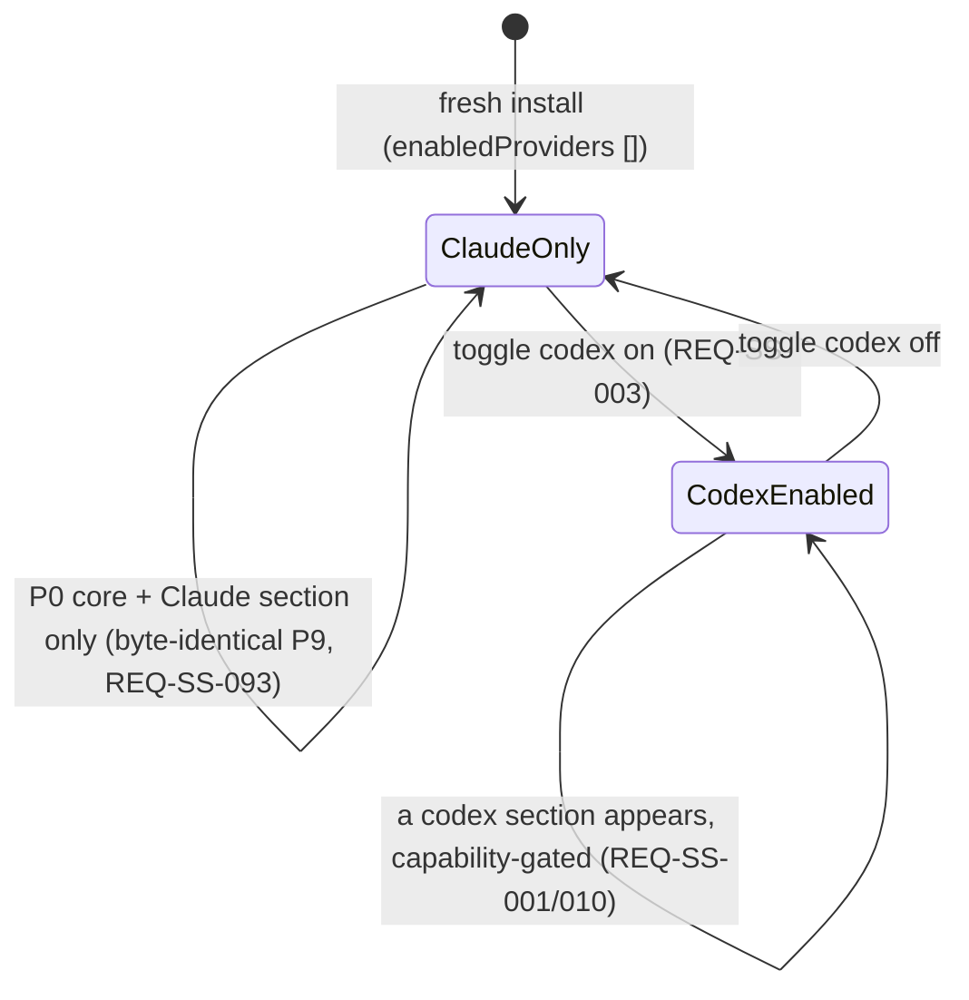

# Design — Settings shell (P10)

> Three parts. **A — UX** (the settings-shell layout: shared/core section + a per-provider section in
> blank-tab order; the states — provider enabled/disabled, key set/unset/unavailable, model picker incl.
> empty list, env-scope editors + the env-snippet list/edit/apply, read-only agent/skill/subagent + slash,
> MCP manager vs doc-note, approvals + permission mode; the keyboard-nav model + a11y to WCAG 2.2 AA).
> **B — UI** (the `Setting`-API DOM section/control inventory — NOT Vue; the `settings/*` → `--sp-*` token
> slice; en+de microcopy; the safe-DOM rules). **C — Architecture** (system overview; the pure
> `buildSettingsViewModel` driving the coverage-excluded `PluginSettingTab` DOM; the env-snippet store +
> classifier + the additive `PluginSettings` fields + the `_coerceSettings` round-trip; how each section
> surfaces its existing P6–P9 port; the three-bridge story for the env service; the security analysis;
> DDD placement + the coverage split; the ADR-SS list). The two ADR-needed CLARs resolve as **ADR-SS-001**
> (env-snippet split) and **ADR-SS-002** (view-model + DOM), both **accepted** (autonomous-drive).

P10 layers on the **merged P0–P9 surface**. The slim P0 `PluginSettingTab` (`src/plugin/settings.ts`)
renders only the module-schema `coreSettingsModule` dropdowns (locale, logLevel) and persists through
`SettingsPort` (device-local, ADR-PSR-002). P9 already shipped the seams P10 surfaces:
`ProviderRegistryPort` (list/enable/order/resolve + the frozen capability bag), `SecretStorePort`
(per-provider API key, ADR-PV-002), `ToolbarCatalogPort` (model lists, P6), `McpConfigStorePort`
(MCP servers, P8), `ApprovalRuleStorePort` + `PermissionMode` (approvals, P7). **P10 is mostly SURFACING:**
it grows the tab into a per-provider tabbed shell that renders and wires those ports, capability-gated by
the frozen `ProviderCapabilities` matrix. **The one genuinely-new subsystem is the environment settings +
env-snippet manager** (REQ-SS-050..067) — and its load-bearing decision (the secret-split) is ADR-SS-001.

**The invariant (G10, REQ-SS-093, NFR-SS-001):** with only Claude enabled, the shell renders the P0 core
controls + a single Claude section + the additive env subsystem, and changes nothing else — the P0–P9
settings behaviour is byte-identical. **The posture (charter §6a):** Claude is the complete default;
agent/skill/subagent + slash are **read-only** surfacing this phase (NG1, the P9 capability-gated
posture). The settings DOM stays the Obsidian `Setting` API (CLAR-SS-002, NG2 — no Vue); the tested weight
is the pure `buildSettingsViewModel` + the env service; secrets and secret-bearing env values never reach
`data.json` (CHARTER-REQ-SEC).

---

## Part A — UX

### A.0 The surface this layers on

Today the settings tab is two module-schema dropdowns. P10 turns it into a **per-provider settings shell**:
a shared/core section first, then one section per **enabled** provider in **blank-tab order** (opencode 10,
codex 15, claude 20 → rendered opencode, codex, claude when all enabled). Each provider section shows only
the controls that provider's capability bag supports. The new env settings + env-snippet manager appears as
its own section. The whole surface is keyboard-navigable to WCAG 2.2 AA (G8). The layout, model picker,
env-snippet manager, and microcopy read as Claudian (charter §1).

```
┌─ Specorator settings ─────────────────────────────────────────────┐
│  Shared / core                                                     │
│    Locale            [ dropdown ]      ← P0 core (unchanged)       │
│    Log level         [ dropdown ]      ← P0 core (unchanged)       │
│    Default model     [ dropdown ]      (per active provider)       │ (REQ-SS-021)
│    Default permission mode [ normal|plan|yolo ]                    │ (REQ-SS-083)
│    Keyboard navigation  [ map w scrollUp … ]                       │ (REQ-SS-070/071)
│                                                                    │
│  Provider · Claude              (always present, no disable)       │ (REQ-SS-004)
│    (no API key — needsApiKey:false)                                │ (REQ-SS-011)
│    Model picker      [ haiku … opus ]                              │ (REQ-SS-020)
│    Slash commands    (read-only list — supportsProviderCommands)  │ (REQ-SS-040/041)
│    Agents / skills / subagents (read-only list)                    │ (REQ-SS-030)
│    MCP servers       [ manager ]   (supportsMcpTools:true)         │ (REQ-SS-080)
│    Approval rules    [ list · remove · clear ]                     │ (REQ-SS-082)
│    Environment (provider:claude) [ env editor ]                    │ (REQ-SS-050)
│                                                                    │
│  Provider · Codex               [ enabled ⏻ ]  (toggle)           │ (REQ-SS-003)
│    API key           [ •••••  set ]   (needsApiKey:true)           │ (REQ-SS-011/012/014)
│    Model picker      [ gpt-… ]                                     │
│    (no slash list — supportsProviderCommands:false)                │ (REQ-SS-040)
│    MCP               “Codex manages MCP via its own CLI.”           │ (REQ-SS-081)
│                                                                    │
│  Environment                                                       │
│    Shared env        [ editor ]   ⚠ review: FOO unrecognised      │ (REQ-SS-050/052)
│    Snippets          [ + New ]  · prod-keys [edit][apply][remove]  │ (REQ-SS-060..064)
└────────────────────────────────────────────────────────────────────┘
```

### A.1 Shell structure & section states (REQ-SS-001..005, 010)

The shell is the **shared/core section + a per-provider section per enabled provider** (REQ-SS-001),
computed by the pure view-model (C.2). The shared section always renders first and carries the P0 core
controls unchanged (REQ-SS-005) plus the cross-provider prefs (default model, permission mode, keyboard
nav). Claude's section is always present with no disable control (REQ-SS-004); the non-Claude sections
appear only when enabled and carry a toggle (REQ-SS-003) that updates `enabledProviders` device-local and
re-renders.



Each provider section's controls are **capability-gated** (REQ-SS-010): a control appears only where the
provider's `ProviderCapabilities` flag for it is true — `needsApiKey` → the key field; `supportsMcpTools`
→ the MCP manager (else the doc-note); `supportsProviderCommands` → the slash list. The gate is the bag,
never a provider-id branch (NFR-SS-008).

### A.2 Per-provider API key — states (REQ-SS-011..015)

The key field appears only where `needsApiKey` is true (Claude shows none; Codex/Opencode do). The field
is a masked text input + a "key set / not set" indicator derived from `SecretStorePort.listKeys()` (keys
only, never the value — REQ-SS-014). Entering a value calls `SecretStorePort.setSecret(providerSecretKey(id),
value)` (REQ-SS-012); clearing calls `deleteSecret` (idempotent, REQ-SS-013). The value never enters the
view-model, a notice, a log, or `data.json` (NFR-SS-002).

```mermaid
stateDiagram-v2
    [*] --> Unavailable: SecretStorePort.isAvailable() false
    [*] --> NotSet: available + listKeys lacks the key
    Unavailable --> Unavailable: field disabled + "secret storage unavailable" notice; no fallback (REQ-SS-015)
    NotSet --> Set: user enters a key → setSecret (REQ-SS-012)
    Set --> NotSet: user clears → deleteSecret (REQ-SS-013)
    Set --> Set: "key set" indication from listKeys; value never shown (REQ-SS-014)
```

### A.3 Model picker — states (REQ-SS-020..022)

A per-provider model picker populated from `ToolbarCatalogPort.getCatalog(id).models`, preselecting the
persisted default (device-local) or the catalog `defaultModelId` (REQ-SS-020). Selecting a model persists
it to `providerDefaultModel[id]` device-local so the toolbar preselects it next time (REQ-SS-021). An empty
catalog renders the picker with the persisted value + a "no models" notice, never crashing the section
(REQ-SS-022).

### A.4 Environment settings + env-snippet manager — states (the new subsystem, REQ-SS-050..067)

The environment section offers a **shared** env editor and a **`provider:<id>`** env editor per enabled
provider (REQ-SS-050). As the user edits/pastes, each key is classified shared-known / provider-owned /
shared-unknown (REQ-SS-051); a shared-unknown key in a scope raises a non-blocking review warning naming
it (REQ-SS-052); a pasted multi-key blob is auto-routed across scopes by ownership (REQ-SS-053).

```mermaid
stateDiagram-v2
    [*] --> Editing
    Editing --> Classified: edit/paste → classify each key (REQ-SS-051)
    Classified --> Review: a shared-unknown key in scope → ⚠ warning, still saveable (REQ-SS-052)
    Classified --> Routed: paste blob → split across scopes by ownership (REQ-SS-053)
    Review --> Saved
    Routed --> Saved
    Saved --> [*]: structure → device-local; secret values → SecretStorePort (REQ-SS-066)
```

The snippet manager lists saved snippets with New / edit / apply / remove. New/edit opens an Obsidian
`Modal` (name, description, env text, scope, optional per-model context limits — REQ-SS-060/061/067); an
empty name is rejected with a notice (REQ-SS-063). Apply writes the snippet's env into its scope, inferring
an undeclared scope (REQ-SS-064). Remove deletes the structure **and** any secret-bearing values from
`SecretStorePort` (REQ-SS-062). A secret-bearing value (a provider auth key, or a user-marked-secret entry)
is persisted via `SecretStorePort` under `env.<scope>.<KEY>`, with the device-local structure holding only
a `secretRef` (REQ-SS-066, ADR-SS-001) — never a plaintext secret in `data.json`. An applied scope's env
reaches the active provider's subprocess env at the next turn (REQ-SS-065).

### A.5 Read-only agent/skill/subagent + slash (REQ-SS-030/031, 040/041)

A provider's discovered agents / skills / subagents render as a **read-only** list — no create/edit/delete
(NG1); the list is omitted where the provider exposes none (REQ-SS-031). Slash commands render read-only
(name, description, kind) only where `supportsProviderCommands` is true (REQ-SS-040/041).

### A.6 MCP + approvals + permission mode (REQ-SS-080..083)

Where `supportsMcpTools` is true (Claude) the section renders the P8 MCP manager (load/save via
`McpConfigStorePort`, REQ-SS-080); where false but CLI-managed (Codex) it shows an informational note, not
a manager (REQ-SS-081, NG5). Approvals lists the P7 persisted rules with remove / clear-all (REQ-SS-082);
the default permission mode is a `normal|plan|yolo` control persisted device-local (REQ-SS-083).

### A.7 Keyboard navigation + a11y (WCAG 2.2 AA — REQ-SS-070/071/072, NFR-SS-007)

The settings shell is fully keyboard-navigable (G8). Because the DOM is built with the Obsidian `Setting`
API, every control is a native focusable element (toggle / dropdown / text / button) rendered in the
view-model's section→control order — giving a **logical tab order, visible focus, and Enter/Space
activation** for free (ADR-SS-002 §3). Tab / Shift+Tab traverse every control (provider toggles, key field,
model picker, env editors, snippet actions); modal flows (snippet edit, delete confirm) trap and restore
focus per the Obsidian `Modal` convention. The remappable **message-pane** nav keys (scroll-up/down,
focus-input) are a separate device-local pref edited through the pure `parseNavMappings` validator, which
rejects malformed / multi-char / non-unique mappings with a specific error and persists nothing invalid
(REQ-SS-070/071). No control is mouse-only; no focus trap escapes the keyboard.

---

## Part B — UI

### B.1 Section / control inventory — Obsidian `Setting`-API DOM (NOT Vue, CLAR-SS-002 / NG2)

The settings tab is the **existing `src/plugin/settings.ts` `Setting`-API DOM**, grown to walk the view-
model (ADR-SS-002 §2). No Vue component is introduced — the `PluginSettingTab.display()` renders each
`SettingsControl` from the pure view-model via the Obsidian `Setting` API / `createEl` / `setText`. The
control inventory (the `SettingsControl` discriminated union, C.2):

| Control | Renders via | Surfaces (port / use case) | REQ |
|---|---|---|---|
| `coreField` (locale, logLevel) | `Setting.addDropdown` | `SettingsPort` (`plugin.updateSettings`) — UNCHANGED | REQ-SS-005 |
| `providerToggle` | `Setting.addToggle` | `SettingsPort` → `enabledProviders` (coerced) | REQ-SS-003 |
| `apiKeyField` (masked + set/unset) | `Setting.addText` (password) + indicator | `SecretStorePort` set/delete/listKeys/isAvailable | REQ-SS-011..015 |
| `modelPicker` (+ empty-list flag) | `Setting.addDropdown` | `ToolbarCatalogPort.getCatalog(id)` + `SettingsPort` default | REQ-SS-020..022 |
| `envScopeEditor` (+ review warning) | `Setting.addTextArea` + `setText` warning | `EnvSnippetService` (classify + split) | REQ-SS-050..053 |
| `envSnippetList` (+ New/edit/apply/remove) | `Setting.addButton` + an Obsidian `Modal` for edit | `EnvSnippetService` over `SettingsPort` + `SecretStorePort` | REQ-SS-060..067 |
| `agentList` / `slashList` (read-only) | `createDiv` + `setText` rows | provider-discovered definitions (read-only) | REQ-SS-030/031/040/041 |
| `mcpManager` | the P8 manager DOM | `McpConfigStorePort.load/save` | REQ-SS-080 |
| `mcpDocNote` | `Setting.setDesc` (`setText`) | — (informational) | REQ-SS-081 |
| `approvalRules` (list + remove + clear) | `Setting.addButton` rows | `ApprovalRuleStorePort.loadRules/removeRule/clear` | REQ-SS-082 |
| `permissionMode` | `Setting.addDropdown` | `SettingsPort` → `defaultPermissionMode` | REQ-SS-083 |
| `keyboardNav` | `Setting.addTextArea` | `SettingsPort` → `keyboardNav` (via `parseNavMappings`) | REQ-SS-070/071 |
| `cliPath` (where declared) | `Setting.addText` | `SettingsPort` → `providerCliPath` (device-local) | CLAR-SS-006 |

**Safe-DOM rules (REQ-SS-095, NFR-SS-010):** built via the `Setting` API / `createEl` / `setText` /
`createDiv` — **no** `innerHTML`/`outerHTML`/`insertAdjacentHTML`, no `v-html`; confirmations (delete
snippet) use an Obsidian `Modal` subclass, never `window.confirm`/`alert`/`prompt`. ESLint
`no-restricted-properties` + `no-restricted-globals` already enforce this project-wide.

### B.2 The `settings/*` → `--sp-*` token slice (NFR-SS-009)

The `settings/*` CSS modules map to the `--sp-*` token slice with no raw Obsidian-var / physical-property
leak (charter §3.10): `settings/{base, plugin, agent, slash, env-snippets, mcp, opencode-model-picker}.css`.
`lint-style-tokens` must be clean for these modules; perceptual `--sp-*` parity vs claudian is captured at
320 / 520 / 720 px, light + dark, at the single final review gate (charter §5.1).

### B.3 Microcopy (en + de for the new surfaces, NG7)

Only the new settings surfaces get keys this phase (en + de where a surface needs it); the 10-locale sweep
is P11. No hardcoded user-facing string; no secret/env value appears in any notice or log (NFR-SS-002).
Representative new keys:

| Key | en |
|---|---|
| `settings.provider.section.title` | "Provider · {provider}" |
| `settings.provider.enable` | "Enable {provider}" |
| `settings.apiKey.label` | "API key" |
| `settings.apiKey.set` | "Key set" |
| `settings.apiKey.unset` | "No key set" |
| `settings.apiKey.unavailable` | "Secret storage is unavailable on this device." |
| `settings.model.empty` | "No models available for {provider}." |
| `settings.env.shared.title` | "Shared environment" |
| `settings.env.provider.title` | "{provider} environment" |
| `settings.env.review` | "Review: {keys} not recognised for this scope." |
| `settings.envSnippets.new` | "New snippet" |
| `settings.envSnippets.nameRequired` | "A snippet name is required." |
| `settings.envSnippets.deleteConfirm` | "Remove snippet “{name}”? Its stored secret values are deleted." |
| `settings.mcp.codexNote` | "Codex manages MCP via its own CLI." |
| `settings.keyboardNav.invalid` | "Navigation keys must be unique single characters." |

### B.4 Parity-screenshot plan (deferred to the single final review gate)

Per charter §5.1, parity screenshots vs claudian at 320 / 520 / 720 px, light + dark: (1) the per-provider
shell with three providers enabled (blank-tab order), (2) a needs-key provider section with key set / unset
/ unavailable, (3) the model picker (incl. the `opencode-model-picker` shape) + the empty-list notice,
(4) the environment section with a review warning + the snippet list, (5) the snippet edit modal, (6) the
MCP manager (Claude) vs the Codex doc-note, (7) the Claude-only byte-identical state (P0 core + one Claude
section). These accumulate for the single final human review gate (autonomous-drive directive).

---

## Part C — Architecture

### C.1 System overview

```mermaid
flowchart TD
    subgraph plugin[plugin (owns obsidian; Setting-API DOM; COVERAGE-EXCLUDED)]
        tab[SpecoratorSettingTab.display — walks the view-model, renders Setting-API controls]
        modal[Obsidian Modal — env-snippet edit + delete-confirm]
    end
    subgraph app[application (pure, tested)]
        vm[buildSettingsViewModel — sections + capability-gated controls, no switch(providerId)]
        env[EnvSnippetService — split on save / rejoin on read / delete-both on remove]
    end
    subgraph domain[domain (pure data + types, tested)]
        classify[classifyEnvironmentKey + scope routing — regrown providerEnvironment.ts]
        struct[EnvSnippetStruct / EnvEntry / envSecretKey — the snippet shape + namespace]
        settings[PluginSettings + DEFAULT_SETTINGS + coerce* — additive OPTIONAL fields]
        navparse[parseNavMappings — keyboard-nav validator]
        regport[ProviderRegistryPort — listEnabledProviders + getCapabilities]
        secport[SecretStorePort — set/delete/listKeys/isAvailable/getSecret]
        catport[ToolbarCatalogPort — getCatalog]
        mcpport[McpConfigStorePort — load/save]
        appvport[ApprovalRuleStorePort — loadRules/removeRule/clear]
        setport[SettingsPort — getSettings/saveSettings device-local]
    end
    subgraph infra[infrastructure (3 bridges)]
        bridge[ObsidianBridge._coerceSettings — round-trips the additive fields]
        runtime[provider runtime env merge — injects applied env-scope at turn start]
        bridges[ObsidianBridge real / MockBridge / LocalStorageBridge]
    end
    tab --> vm
    tab -->|key/model/snippet/mcp/rule onChange| env
    tab --> setport
    tab --> secport
    tab --> catport
    tab --> mcpport
    tab --> appvport
    tab --> modal
    vm --> regport
    vm --> catport
    vm --> secport
    env --> classify
    env --> struct
    env --> setport
    env --> secport
    setport --> bridge
    secport --> bridges
    runtime -->|getSecret at infra boundary| secport
    bridge --> bridges
```

### C.2 Components & responsibilities

| Layer | Component | Responsibility | New/changed |
|---|---|---|---|
| domain | `chat/environment/classifyEnvironmentKey.ts` | PURE: classify a key shared-known / provider-owned / shared-unknown (the `SHARED_ENVIRONMENT_KEYS` set + the provider env-key patterns from registry/descriptor data) + secret-vs-non-secret predicate (REQ-SS-051/066) | new |
| domain | `chat/environment/envScope.ts` | PURE: `EnvironmentScope` (`'shared' \| provider:${ProviderId}`), `getEnvironmentScopeUpdates`, `resolveEnvironmentSnippetScope`, `inferEnvironmentSnippetScope`, `getEnvironmentReviewKeysForScope` (REQ-SS-052/053/064) | new |
| domain | `chat/environment/EnvSnippet.ts` | the `EnvSnippetStruct` / `EnvEntry` shape + `envSecretKey(scope, key)` namespace + a pure `EnvSnippetCodec` (struct ↔ env text, split secret refs) (ADR-SS-001, REQ-SS-060..067) | new |
| domain | `settings/PluginSettings.ts` | additive OPTIONAL device-local fields: `envSnippets?`, `envScopes?`, `keyboardNav?`, `providerDefaultModel?`, `defaultPermissionMode?`, `providerCliPath?` + their `coerce*` helpers (load-or-default, never throws) | changed (additive) |
| domain | `settings/keyboardNav.ts` | PURE: `parseNavMappings` / `buildNavMappingText` (single-char + unique validation, REQ-SS-070/071) | new |
| application | `settings/buildSettingsViewModel.ts` | PURE: the `SettingsViewModel` (ordered sections + capability-gated `SettingsControl[]`, no `switch(providerId)`) from settings + registry + catalog + secret-key set (ADR-SS-002, REQ-SS-001/002/010) | new |
| application | `settings/EnvSnippetService.ts` | the env subsystem use cases: create/edit/remove/apply a snippet + read-back, SPLITTING secret values to `SecretStorePort` (`env.<scope>.<KEY>`) and the non-secret structure to `SettingsPort`; delete-both on remove; `Result`-typed (ADR-SS-001, REQ-SS-060..066) | new |
| plugin | `settings.ts` (`SpecoratorSettingTab`) | grow `display()` to walk the view-model + render each control via the `Setting` API / `createEl` / `setText`; wire each control's `onChange` to its port/use case; surface failures as `Result.err` notices; COVERAGE-EXCLUDED `src/plugin/**` (ADR-SS-002 §2, REQ-SS-094/095) | changed |
| plugin | the Obsidian `Modal` host | the env-snippet edit modal + delete-confirm (no `window.confirm`) | new |
| infrastructure | `obsidian/ObsidianBridge.ts` (`_coerceSettings`) | round-trip the additive OPTIONAL fields (the env-snippet structure, scopes, nav keys, default model, permission mode, cli path) through new `coerce*` calls — mirroring the P9 `homeFsConsent` pattern (REQ-SS-092) | changed (additive) |
| infrastructure | the provider runtime env merge (P9, coverage-excluded) | inject the applied env-scope (inline values + `getSecret(secretRef)` resolution) into the active provider's subprocess env at turn start (REQ-SS-065) | changed (additive) |
| infrastructure | three bridges | `SettingsPort` already round-trips the additive fields; `SecretStorePort` already backs `env.<scope>.<KEY>` (Obsidian `app.secretStorage` / Mock+LS in-memory) — no new bridge port (ADR-SS-001 §5) | unchanged surface |

> **No new port (ADR-SS-001 §5, ADR-008).** The env subsystem composes `SettingsPort` + `SecretStorePort`
> behind the pure `EnvSnippetService`; the shell composes the existing P6–P9 ports. No new InjectionKey /
> composable / aggregate.

### C.3 The pure `buildSettingsViewModel` — no `switch (providerId)` (ADR-SS-002)

The structure is **data + the capability bag + the registry's enabled list**, never a branch:

```ts
// src/application/settings/buildSettingsViewModel.ts — PURE, no obsidian/node/Vue, deterministic
export function buildSettingsViewModel(input: {
  settings: PluginSettings;
  registry: ProviderRegistryPort;                 // listEnabledProviders(settings) + getCapabilities(id)
  getCatalog: (id: ProviderId) => ToolbarCatalog;  // model lists (REQ-SS-020)
  secretKeysSet: ReadonlySet<string>;              // from SecretStorePort.listKeys() — keys, never values
  secretStorageAvailable: boolean;                 // SecretStorePort.isAvailable() (REQ-SS-015)
}): SettingsViewModel;

export interface SettingsViewModel { readonly sections: readonly SettingsSection[]; }
export interface SettingsSection {
  readonly key: 'shared' | `provider:${ProviderId}`;
  readonly titleKey: string;                       // i18n key, never a literal
  readonly controls: readonly SettingsControl[];   // only the SUPPORTED controls
}
```

- **Sections** (REQ-SS-001/004/005): the shared/core section first, then `registry.listEnabledProviders
  (settings)` in blank-tab order; Claude is always present (its `isEnabled` is always true) with no toggle.
- **Control visibility is the capability bag** (REQ-SS-010, NFR-SS-008): `apiKeyField` iff
  `caps.needsApiKey`; `mcpManager` iff `caps.supportsMcpTools` else `mcpDocNote`; `slashList` iff
  `caps.supportsProviderCommands`; the model picker always (per provider); the agent list iff the provider
  exposes definitions. There is **no `if (provider === …)` / `switch (providerId)`** — lint/grep-checkable.
- **Determinism** (REQ-SS-002): the same input yields the same serialisable structure (no DOM/Obsidian
  reference) — the unit-test surface.
- **Additivity** (REQ-SS-093): Claude-only → `[shared, provider:claude]` + the env section; the P0 core
  controls are emitted unchanged.

### C.4 The env-snippet store + classifier + the secret-split (ADR-SS-001)

**The shape (domain).** A persisted snippet is its **non-secret structure** + referenced secrets:

```ts
export interface EnvEntry {
  readonly key: string;
  readonly value:
    | { readonly kind: 'inline'; readonly text: string }            // non-secret, in device-local
    | { readonly kind: 'secretRef'; readonly secretRef: string };   // points at SecretStorePort
}
export interface EnvSnippetStruct {
  readonly id: string; readonly name: string; readonly description: string;
  readonly scope?: EnvironmentScope;                 // 'shared' | `provider:${ProviderId}`
  readonly envEntries: readonly EnvEntry[];
  readonly contextLimits?: Readonly<Record<string, number>>;   // REQ-SS-067
}
export const envSecretKey = (scope: EnvironmentScope, key: string): string =>
  `env.${scope}.${key}`;                              // deterministic, mirrors providerSecretKey
```

**The classifier (domain, pure).** Regrown from claudian `providerEnvironment.ts`: a key is shared-known
(the `PATH`/`*_PROXY`/CA-bundle/`TMP*` set), provider-owned (the provider env-key patterns, e.g.
`^ANTHROPIC_`/`^OPENAI_`/`^OPENCODE_` from the registry/descriptor data — never an id branch), or
shared-unknown (review warning). A value is **secret** when its key is provider-owned-and-auth
(`*_API_KEY`/`*_AUTH_TOKEN`) or the user marks it secret (REQ-SS-051/066).

**The split (application — `EnvSnippetService`).** On save: classify each entry; a secret value → write
`SecretStorePort.setSecret(envSecretKey(scope, key), value)` + keep `{ kind:'secretRef', secretRef }` in
the struct; a non-secret value → keep `{ kind:'inline', text }`; persist the struct to `SettingsPort`
(device-local). On remove: delete the struct + `SecretStorePort.deleteSecret(ref)` for each secret entry
(REQ-SS-062). On read: rejoin (resolve `secretRef` only at the infra boundary, never into the view-model).
No plaintext secret in `data.json` / device-local (REQ-SS-066/090).

**Injection (infra boundary, REQ-SS-065).** At turn start the P9 provider runtime composes
`{ ...process.env, ...resolve(envScopes['shared']), ...resolve(envScopes['provider:<id>']) }` for the
active provider — `resolve` reads inline text as-is and a `secretRef` via `SecretStorePort.getSecret(ref)`.
This is the same merge the P9 runtimes already do for `providerSecretKey`; P10 adds the env-scope
contribution. The secret value never enters the application/UI/DTO layer.

### C.5 The additive `PluginSettings` fields + the `_coerceSettings` round-trip (REQ-SS-092)

The six new device-local fields are **OPTIONAL and absent from `DEFAULT_SETTINGS`** (mirroring the P9
`homeFsConsent` precedent), so a fresh install's exact-key contract stays byte-identical to P9
(NFR-SS-001). Each flows through a new `coerce*` helper added to the existing
`ObsidianBridge._coerceSettings` chain (alongside `coerceActiveProvider` / `coerceEnabledProviders` /
`coerceHomeFsConsent`):

| Field | Coercer | Load-or-default rule |
|---|---|---|
| `envSnippets?` | `coerceEnvSnippets` | non-array / no valid struct → absent; per-struct: drop entries with a non-string key/bad value shape |
| `envScopes?` | `coerceEnvScopes` | non-object → absent; keep only valid `EnvironmentScope` keys + valid `EnvEntry[]` |
| `keyboardNav?` | `coerceKeyboardNav` | invalid/non-unique/multi-char → absent (defaults apply); via `parseNavMappings` |
| `providerDefaultModel?` | `coerceProviderDefaultModel` | non-object → absent; keep only `ProviderId` keys with string values |
| `defaultPermissionMode?` | `coercePermissionMode` | not one of `normal\|plan\|yolo` → absent |
| `providerCliPath?` | `coerceProviderCliPath` | non-object → absent; keep only `ProviderId` keys with string values |

Each coercer is **pure/total, never throws** (REQ-SS-092, CHARTER-REQ-FRESH); a recorded value round-trips
a reload; no migration of any legacy claudian env/snippet/key (NG8). The OPTIONAL members are added to the
return object only when present (the `...(x !== undefined ? { x } : {})` pattern, exactly as `homeFsConsent`).

### C.6 How each section surfaces its existing port (no new machinery)

| Section / control | Surfaces | REQ |
|---|---|---|
| provider sections + toggle + order | `ProviderRegistryPort.listEnabledProviders` + `getCapabilities` (pure reads) + `SettingsPort` (`enabledProviders`) | REQ-SS-001/003/004/010 |
| core controls (locale, logLevel) | `SettingsPort` via `plugin.updateSettings` (UNCHANGED P0) | REQ-SS-005 |
| API key | `SecretStorePort.set/delete/listKeys/isAvailable` (ADR-PV-002; value never crosses) | REQ-SS-011..015 |
| default model | `ToolbarCatalogPort.getCatalog(id).models` + `SettingsPort` (`providerDefaultModel`) | REQ-SS-020..022 |
| env scopes + snippets | `EnvSnippetService` over `SettingsPort` + `SecretStorePort` (ADR-SS-001) | REQ-SS-050..067 |
| agents/skills/subagents + slash (read-only) | provider-discovered definitions (read-only surfacing) | REQ-SS-030/031/040/041 |
| MCP manager / doc-note | `McpConfigStorePort.load/save` (P8) gated on `supportsMcpTools` | REQ-SS-080/081 |
| approvals + permission mode | `ApprovalRuleStorePort.loadRules/removeRule/clear` (P7) + `SettingsPort` (`defaultPermissionMode`) | REQ-SS-082/083 |
| keyboard-nav keys | `SettingsPort` (`keyboardNav`) via `parseNavMappings` | REQ-SS-070/071 |

### C.7 The three-bridge story (the env subsystem)

No new bridge port — the env subsystem reuses `SettingsPort` (the struct) + `SecretStorePort` (the values):

| Surface | `ObsidianBridge` | `MockBridge` | `LocalStorageBridge` |
|---|---|---|---|
| env-snippet structure (`SettingsPort`) | device-local blob via `app.saveLocalStorage` + `_coerceSettings` round-trip | in-memory device-local map | in-memory / localStorage |
| secret-bearing env values (`SecretStorePort` `env.<scope>.<KEY>`) | `app.secretStorage` (coverage-excluded, REQ-SS-066/090) | in-memory map (availability switch) | in-memory (no real secret) |
| env injection into subprocess env (provider runtime) | the P9 runtime env merge + `getSecret` at the infra boundary (coverage-excluded, manual leg) | scriptable Mock runtime captures the merged env | inert (non-Claude unavailable) |

`fake-ports.ts` already exposes a scriptable `secretStore` (in-memory + availability switch) and a
`settings` port; the env-service tests drive both. The real secret read + the subprocess injection are the
coverage-excluded infra legs (manual TEST-SS-M*).

### C.8 Security analysis (NFR-SS-002/004/005/010, REQ-SS-066/090/091/094/095)

- **No secret outside native storage** (REQ-SS-066/090, NFR-SS-002) — a provider API key + any
  secret-bearing env value persist only via `SecretStorePort` → `app.secretStorage`, read at the infra
  boundary into the subprocess env, never in `data.json` / device-local / a notice / a log / the
  view-model / a DTO. The device-local struct holds only a `secretRef`. The counter-metric (a store-content
  check) asserts zero secret bytes in `data.json` + the device-local blob across every key + env flow.
- **Each setting in its correct store** (REQ-SS-091, NFR-SS-004) — secrets → `SecretStorePort`; device/user
  prefs (locale, logLevel, default model, enabled providers, nav keys, permission mode, snippet structure,
  cli path) → device-local `SettingsPort` (CHARTER-REQ-SET); MCP config → the vault `.claude/mcp.json`
  (ADR-MC-001); approval rules → their P7 device-local store (ADR-AS-001). No setting in the wrong store.
- **Unavailable secret storage degrades, no fallback** (REQ-SS-015, NFR-SS-005) — `isAvailable()` false →
  the key field + the secret-bearing env entry are disabled with an informational notice; nothing is
  written to a plain store.
- **No new consent gate** (CLAR-SS-004) — the env-secret write is an explicit user action (typing/marking a
  secret); it reuses the `isAvailable()` check + the no-`data.json` guarantee, no `homeFsConsent`-style gate.
- **Result boundary** (REQ-SS-094, NFR-SS-006) — every save (secret / device-local / vault / rule store)
  returns `Result`; a failure surfaces as a notice; no throw crosses a port boundary; the tab stays
  operable.
- **Safe DOM, no blocking dialogs** (REQ-SS-095, NFR-SS-010) — `Setting` API / `createEl` / `setText`; no
  `innerHTML`/`outerHTML`/`insertAdjacentHTML`/`v-html`; confirmations via an Obsidian `Modal`, never
  `window.confirm`/`alert`/`prompt`.
- **Load-or-default, no migration** (REQ-SS-092, CHARTER-REQ-FRESH, NG8) — absent/garbage settings,
  snippets, keys, MCP config, or rules load defaults; no legacy `.claudian`/`data.json` migration.

### C.9 DDD placement + the coverage split (NFR-SS-003/008/011)

- **Tested (coverage-included, meets 80/70/80/80):** the domain (`classifyEnvironmentKey`, the scope
  routing, the `EnvSnippet` codec + `envSecretKey`, the additive `coerce*` helpers, `parseNavMappings`) and
  the application (`buildSettingsViewModel`, `EnvSnippetService`) — all pure / port-driven, no
  `obsidian`/`node:*`/Vue (NFR-SS-003). The secret split, the classifier, the view-model section/control
  visibility, and the coercion round-trips are the automated weight.
- **Coverage-excluded (manual real-Obsidian legs, NFR-SS-011):** `src/plugin/settings.ts` (the `Setting`-API
  DOM render + the modal flows) and the P9 subprocess env injection in `src/infrastructure/obsidian/**`.
  The DOM render is verified by manual legs that accumulate for the single final epic review gate.
- **No `switch (providerId)`** (NFR-SS-008) — the view-model + the classifier gate on the capability bag /
  the registry / the env-key patterns from descriptor data; lint/grep-checkable across all three providers.
- **Narrow-port discipline** (ADR-008, NFR-SS-003) — the shell composes the existing P6–P9 ports + the env
  service; no new port / InjectionKey / composable / aggregate `usePorts`.

### C.10 Data flow — primary scenarios

1. **Open settings (Claude-only):** `buildSettingsViewModel` → `[shared, provider:claude]` + the env
   section; the P0 core controls render unchanged; no key field (Claude `needsApiKey:false`); the MCP
   manager (Claude `supportsMcpTools:true`) shows — byte-identical to the additive expectation (REQ-SS-093,
   NFR-SS-001).
2. **Enable Codex + set its key:** toggle → `SettingsPort` (`enabledProviders` += codex) → re-render adds a
   codex section; entering a key → `SecretStorePort.setSecret('provider.codex.apiKey', value)`; a
   `data.json`/device-local read contains no key (REQ-SS-003/012/090).
3. **Set a default model:** picker change → `SettingsPort` (`providerDefaultModel[id]`); the next toolbar
   preselects it (REQ-SS-021).
4. **Edit an env scope / paste a blob:** edit → `EnvSnippetService` classifies each key; a shared-unknown
   key → a review warning; a pasted blob → `getEnvironmentScopeUpdates` splits across scopes; save → secret
   values to `SecretStorePort` (`env.<scope>.<KEY>`), the non-secret struct to `SettingsPort`
   (REQ-SS-051/052/053/066).
5. **Create / apply / remove a snippet:** New → modal → save (name required) → struct device-local + secret
   refs in the secret store (REQ-SS-060/063); apply → write into the snippet's scope, inferring an
   undeclared scope (REQ-SS-064); remove → delete the struct + `deleteSecret(ref)` for each secret entry
   (REQ-SS-062).
6. **Send a turn:** the active provider's runtime composes `{ ...process.env, ...sharedScope,
   ...providerScope }`, resolving each `secretRef` via `getSecret` at the infra boundary; an applied
   `FOO=bar` reaches the subprocess env (REQ-SS-065).
7. **Manage MCP / approvals:** Claude section → the P8 MCP manager (`McpConfigStorePort`); the approvals
   control lists the P7 rules with remove / clear (REQ-SS-080/082); Codex → the MCP doc-note (REQ-SS-081).
8. **Save failure:** any store write fails → `Result.err` → a notice; no throw escapes; the tab stays
   operable (REQ-SS-094).
9. **Unavailable secret storage:** `isAvailable()` false → the key field + secret-bearing env entry
   disabled with a notice; no plain-store fallback (REQ-SS-015).

### C.11 ADR-SS list (status accepted)

| ADR | Decision | Ratifies | Status |
|---|---|---|---|
| **ADR-SS-001** | Split env-snippet persistence — the NON-SECRET structure (`EnvSnippetStruct`) device-local via `SettingsPort` (additive OPTIONAL `PluginSettings` fields + `_coerceSettings` round-trip, mirroring `homeFsConsent`), the SECRET values via `SecretStorePort` under `env.<scope>.<KEY>` (struct holds only a `secretRef`); a PURE classifier (regrown `providerEnvironment.ts`) decides secret-vs-non-secret; injection reuses the P9 runtime env merge; NO new port (compose `SettingsPort` + `SecretStorePort` behind a pure `EnvSnippetService`); NO plaintext secret in `data.json`/device-local; no new consent gate | CLAR-SS-001 + CLAR-SS-004 | accepted |
| **ADR-SS-002** | Drive the shell from a PURE `buildSettingsViewModel` → ordered capability-gated `SettingsViewModel` sections (no `switch(providerId)`, extends ADR-PV-001 §4); keep the `PluginSettingTab` as Obsidian `Setting`-API DOM (NOT Vue, CLAR-SS-002/NG2), coverage-excluded `src/plugin/**` with manual legs; sections surface their existing P6–P9 ports; safe-DOM; native a11y keyboard nav (WCAG 2.2 AA) | CLAR-SS-002 (+ realises NFR-SS-003/008/011) | accepted |

---

## Requirements coverage (Part C)

| REQ | Covered by |
|---|---|
| REQ-SS-001/002 | `buildSettingsViewModel` — ordered sections from `registry.listEnabledProviders` + a deterministic pure structure (ADR-SS-002, C.3) |
| REQ-SS-003 | `providerToggle` → `SettingsPort` (`enabledProviders`, coerced) + re-render (C.2/C.6) |
| REQ-SS-004/005 | Claude always present (no toggle) + the shared/core section first, P0 controls unchanged (C.3) |
| REQ-SS-010 | capability-bag gating in the view-model, no `switch(providerId)` (ADR-SS-002, C.3, NFR-SS-008) |
| REQ-SS-011..015 | `apiKeyField` gated on `needsApiKey`; `SecretStorePort` set/delete/listKeys/isAvailable; value never crosses (ADR-PV-002, C.6/C.8, A.2) |
| REQ-SS-020..022 | `modelPicker` from `ToolbarCatalogPort.getCatalog(id)` + persisted default + empty-list degrade (C.6, A.3) |
| REQ-SS-030/031 | read-only agent/skill/subagent list, omitted where absent (C.2, A.5) |
| REQ-SS-040/041 | `slashList` gated on `supportsProviderCommands`, read-only (C.3/C.6, A.5) |
| REQ-SS-050..053 | the env scopes + the pure classifier + scope routing + review warning + paste-routing (ADR-SS-001, C.4, A.4) |
| REQ-SS-060..064 | `EnvSnippetService` create/edit/remove/apply over `SettingsPort` + `SecretStorePort`; name guard; scope inference (ADR-SS-001, C.4, A.4) |
| REQ-SS-065 | the P9 runtime env merge injects the applied env-scope (`secretRef` → `getSecret`) into the subprocess env (C.4/C.7) |
| REQ-SS-066/090 | the secret-split — secret values via `SecretStorePort` (`env.<scope>.<KEY>`), the struct holds only a `secretRef`; no secret in `data.json`/device-local (ADR-SS-001, C.4/C.8) |
| REQ-SS-067 | `EnvSnippetStruct.contextLimits` parsed + stored (C.4) |
| REQ-SS-070/071 | `parseNavMappings` validator (single-char + unique) + `SettingsPort` (`keyboardNav`) (C.2/C.6, A.7) |
| REQ-SS-072 | native `Setting`-API focusable controls in view-model order = logical tab order + visible focus + key activation; modal focus trap/restore (ADR-SS-002 §3, A.7, NFR-SS-007) |
| REQ-SS-080/081 | `mcpManager` gated on `supportsMcpTools` (P8 `McpConfigStorePort`) else `mcpDocNote` (C.6, A.6) |
| REQ-SS-082/083 | the P7 `ApprovalRuleStorePort` list/remove/clear + `defaultPermissionMode` device-local (C.6, A.6) |
| REQ-SS-091 | each setting in its correct store — secrets / device-local / vault MCP / P7 rules (C.8) |
| REQ-SS-092 | the additive OPTIONAL fields' `coerce*` round-trip in `_coerceSettings`, load-or-default, no migration (C.5) |
| REQ-SS-093 | Claude-only = the P0 core + one Claude section + the env subsystem, P0 controls unchanged (C.3/C.10, NFR-SS-001) |
| REQ-SS-094 | every save returns `Result`; failures → notices; no throw across a port boundary (C.8) |
| REQ-SS-095 | `Setting` API / `createEl` / `setText`; no raw-HTML; confirmations via Obsidian `Modal` (C.8, B.1) |
| NFR-SS-001..012 | additivity (C.3/C.5/C.10), security secrets/env-secret (C.8, ADR-SS-001), DDD/ports + view-model (C.2/C.3/C.9), privacy/device-local (C.5/C.8), reliability degrade/`Result` (C.8), a11y keyboard nav (A.7), no-switch capability gating (C.3), `--sp-*` tokens (B.2), safe-DOM (B.1/C.8), coverage split (C.9), manifest untouched (no manifest change in P10) |

## Open clarifications for the planner (Tasks)

- **None blocking.** Both ADR-needed CLARs resolve (ADR-SS-001 + ADR-SS-002 accepted); CLAR-SS-003/005/006
  resolve by recommendation (read-only surfacing; Claude-plugins out; a device-local CLI-path field only).
  Implementation notes to carry into `spec.md`/`tasks.md` (field-level detail, not architecture):
  - **Sequence the pure domain first** — the env classifier + scope routing + the `EnvSnippet` codec +
    `envSecretKey` + the additive `PluginSettings` fields + their `coerce*` helpers + `parseNavMappings`,
    so the `EnvSnippetService` + `buildSettingsViewModel` build on frozen types. Then the application
    `buildSettingsViewModel` + `EnvSnippetService`. Then grow the DOM tab to walk the view-model. The
    subprocess env injection (P9 runtime, coverage-excluded) is the final manual-leg task. **Split the
    DOM/plugin batch into ~6-task chunks** (the P8/P9 subagent-timeout lesson).
  - **Pin the additive `PluginSettings` field names + the `EnvSnippetStruct`/`EnvEntry` shape +
    `envSecretKey(scope, key) = env.<scope>.<KEY>`** in `spec.md`, so the `_coerceSettings` round-trip and
    the store-content counter-metric are deterministic. Each new field is OPTIONAL + absent from
    `DEFAULT_SETTINGS` (NFR-SS-001).
  - **Pin the secret-classification rule** — which keys route to `SecretStorePort` (provider-owned auth
    patterns + user-marked) vs inline device-local — in `spec.md`, so REQ-SS-066/090 are testable.
  - **Pin the `SettingsControl` discriminated-union members + their port wiring** (C.2/B.1) in `spec.md`.
  - **Capture the Claude-only byte-identical baseline on `next` before implementation** (pair with
    NFR-SS-001) so the additivity assertion has a reference (REQ-SS-093).
- **Found slightly over-specified (flagged, not blocking):**
  - REQ-SS-067 (per-model `contextLimits`) is `could` — keep it as an OPTIONAL `EnvSnippetStruct` field but
    sequence it last; it must not gate the must-tier snippet round-trip.
  - The PRD's env classifier detail (REQ-SS-051/053) regrows from claudian `providerEnvironment.ts`; the
    design keeps the **pure** classifier + scope routing as the tested core and defers the exact
    `SHARED_ENVIRONMENT_KEYS` set + provider patterns to `spec.md` (data, not architecture).
- **Found slightly under-specified (flagged, not blocking):**
  - The PRD does not pin how the **read-only agent/skill/subagent + slash definitions are discovered** for
    each provider (the source). P10 surfaces them read-only; `spec.md` should pin the read source (a P9
    discovery seam or a static descriptor list) — escalate to PM if no seam exists, since NG1 keeps it
    read-only either way.
