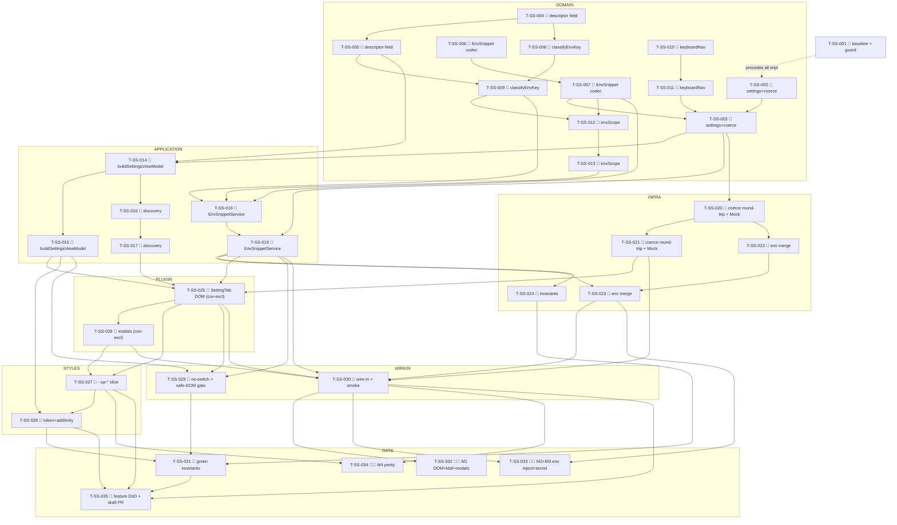

# Tasks — Settings shell (P10)

Each task is ≤ ~½ day, has a stable `T-SS-NNN` id, references ≥ 1 SPEC-SS / TEST-SS / REQ-SS / NFR-SS,
names an owner, lists explicit dependencies, and has a testable Definition of Done. This decomposes
**SPEC-SS-001..028** (28 spec items) on top of the merged P0–P9 chat + provider surface on the `next`
integration branch (P9 providers-registry #450 / 4cc65597): the frozen `ProviderDescriptor` capability matrix
(`needsApiKey` / `supportsMcpTools` / `supportsProviderCommands`), the `ProviderRegistryPort`
(`listEnabledProviders` / `getCapabilities`), the `SecretStorePort` (`set`/`delete`/`listKeys`/`isAvailable`/
`getSecret` + `providerSecretKey`), the `ToolbarCatalogPort` (`getCatalog(id).models`/`defaultModelId`), the P8
`McpConfigStorePort`, the P7 `ApprovalRuleStorePort`, the P4 `ProviderCommandCatalogPort`, and the slim P0
`SpecoratorSettingTab` (`src/plugin/settings.ts`, the Obsidian `Setting`-API DOM core loop).

> **TDD ordering (mission discipline):** the RED test task for a contract comes **before** the
> implementation task that greens it. RED test tasks are owned by `qa`; implementation tasks by
> `dev`. **Every dev task's first DoD line is "the prior RED test(s) now pass"** followed by whole-project
> `npm run lint` 0 + `npm run typecheck` 0 + `npm run test` green + an implementation-log entry. This mirrors
> the P6/P7/P8/P9 task style the maintainer accepted (TASKS-CA-001 / TASKS-TC-001 / TASKS-AS-001 / TASKS-MC-001 /
> TASKS-PV-001).

> **DDD inward layering order (the batch structure):**
> 1. **DOMAIN** (SPEC-SS-001..005) — the six additive OPTIONAL `PluginSettings` fields + their six `coerce*`
>    helpers + `envSecretKey` (RED additivity/round-trip leg — P9-shaped settings byte-identical + the
>    `_coerceSettings` round-trip, NFR-SS-001); the additive `ProviderDescriptor.environmentKeyPatterns?` field +
>    the pure `classifyEnvKey`/`isSecretEnvKey` + the 13-key `SHARED_ENVIRONMENT_KEYS` (NOTE: the descriptor
>    field is an ADDITIVE change to the P9 descriptor — the frozen-matrix tests must stay green); the
>    `EnvSnippet` shape + `EnvSnippetCodec` + `parseContextLimit`; the `envScope.ts` PURE scope routing; the
>    `keyboardNav.ts` `parseNavMappings`/`buildNavMappingText`.
> 2. **APPLICATION** (SPEC-SS-006..009) — the PURE `buildSettingsViewModel` (ordered, capability-gated, no
>    `switch(providerId)`, the 14-member `SettingsControl` union) + the read-only discovery mapping (P4 catalog)
>    + the `EnvSnippetService` (list/create/edit/remove/apply/applyScopeText/readScope, secret-split, composes
>    `SettingsPort` + `SecretStorePort`, `Result`-typed, NO new port).
> 3. **INFRA / PLUGIN** (SPEC-SS-010..014) — the `_coerceSettings` round-trip wiring for the six fields (in
>    `ObsidianBridge` + the Mock/LS bridges) + the Mock runtime env capture; the env→runtime subprocess merge
>    wired into the P9 runtimes (coverage-excluded `obsidian/**` → manual leg); the `SpecoratorSettingTab.display()`
>    DOM render driven by the view-model (coverage-excluded `src/plugin/**` → manual leg) wiring each control's
>    `onChange` to its port; the env-snippet edit `Modal` + delete-confirm `Modal` (no `window.confirm`).
> 4. **STYLES** (SPEC-SS-015) — the `settings/*` `--sp-*` token slice + tokens-contract (lightningcss-safe
>    ASCII-only comments).
> 5. **WIRE-IN** — register/provide the expanded `SpecoratorSettingTab` in `main.ts`; provide the
>    `EnvSnippetService` + any port the tab needs; `npm run dev`/plugin smoke.
> 6. **GATE** — full `npm run verify` + `npm run test:all` + the grep gate (no-`switch(providerId)` +
>    no-secret-in-`data.json`) + the additivity byte-identical proof + the parity self-review note + the manual
>    real legs (TEST-SS-M1..M4) + the draft PR into `next` (orchestrator merges).
> A test for a layer may not depend on a layer further out.

> **The pure domain + the additive fields freeze early.** The six additive OPTIONAL `PluginSettings` fields +
> the six `coerce*` (SPEC-SS-001), the additive `environmentKeyPatterns` descriptor field + the classifier
> (SPEC-SS-002), and the snippet codec / scope routing / nav parser (SPEC-SS-003..005) are sequenced FIRST so
> the view-model + the env service + the DOM tab build on frozen types; a Claude-only configuration is proven
> byte-identical to P9 (TEST-SS-093, NFR-SS-001) before the bridges + the tab build on top.

> **Build-green discipline — the two additive grows are PURELY ADDITIVE (no `implements` break).** Unlike the
> P9 `CHAT_RUNTIME_FACTORY` interface widen, P10 grows two things, both purely additive:
> 1. **`ProviderDescriptor.environmentKeyPatterns?: readonly RegExp[]`** (SPEC-SS-002) is an OPTIONAL field
>    APPENDED to the frozen P9 descriptor interface. The three frozen descriptors (`CLAUDE_DESCRIPTOR` /
>    `CODEX_DESCRIPTOR` / `OPENCODE_DESCRIPTOR`) gain the field; **the P9 frozen-matrix tests
>    (`tests/domain/chat/providers/ProviderDescriptor.test.ts`, TEST-PV-020/021/022/023) MUST STAY GREEN** —
>    the existing capability flags + freeze + `blankTabOrder` + `isEnabled`/`ownsModel` are unchanged. The
>    descriptor-grow task (T-SS-004) names this constraint and runs the P9 matrix suite as part of its DoD.
> 2. **The six OPTIONAL `PluginSettings` fields** (`envSnippets?` / `envScopes?` / `keyboardNav?` /
>    `providerDefaultModel?` / `defaultPermissionMode?` / `providerCliPath?`, SPEC-SS-001) are APPENDED to the
>    `PluginSettings` interface and are **absent from `DEFAULT_SETTINGS`** (mirroring `homeFsConsent`), so the
>    exact-key contract stays byte-identical to P9 and **the P9 settings round-trip tests MUST STAY GREEN**
>    (NFR-SS-001). The settings-grow task (T-SS-002) names this; the additivity leg (T-SS-031) re-proves it.
> Both grows break no `implements` (no port-method addition), so no companion-stub fan-out is needed — they
> compile clean once the field/types land.

> **Lint discipline (the P5–P9 lesson):** every dev task runs the **WHOLE-project** `npm run lint` (0 errors),
> not just the changed files — the project gate catches per-file misses (sentence-case with the brand allowlist,
> `consistent-type-imports`, `strict-boolean-expressions`, the Result-discipline try/catch ban, the
> `no-restricted-imports` layer guards, the `no-restricted-properties` `innerHTML`/`outerHTML`/
> `insertAdjacentHTML` ban, the `no-restricted-globals` `window.confirm`/`alert`/`prompt` ban). New brand strings
> ("Codex", "Opencode") in user-facing settings copy go through `TranslationPort` (en+de) and, if they trip
> `obsidianmd/ui/sentence-case`, are added to the `eslint.config.js` `brands` allowlist in the same task (the P8
> `MCP` brand precedent).

> **lightningcss note (the P6–P9 lesson):** all new `--sp-*` token-layer comments are **ASCII-only** (no
> em-dash / curly-quote / non-ASCII) — a non-ASCII comment in a `--sp-*` declaration breaks the `build:web`
> lightningcss pass. T-SS-027 (the styles task) carries this note.

> **The ONE allowed `switch` is on the control union, never on `providerId` (SPEC-SS-021, NFR-SS-008).** The DOM
> renderer (`SpecoratorSettingTab.display()`, SPEC-SS-010) `switch (control.kind)`es over the 14-member
> `SettingsControl` union — that is permitted (it is the discriminated-union exhaustiveness switch). **No
> `switch (providerId)` / `if (provider === …)`** in `buildSettingsViewModel` / `classifyEnvKey` / `envScope.ts`
> / `EnvSnippetService` — gated by a grep/ESLint guard over `src/application/settings/**` +
> `src/domain/chat/environment/**` (T-SS-029, TEST-SS-010).

> **Coverage-excluded infra (manual legs):** the **real** `PluginSettingTab` `Setting`-API DOM render + the
> env-snippet edit/delete modals (`src/plugin/settings.ts` + `src/plugin/`), the **real** subprocess env
> injection (`src/infrastructure/obsidian/**`), and the **real** `app.secretStorage` env-secret round-trip
> (`src/infrastructure/obsidian/SecretStorage.ts`, P9) all live coverage-excluded per `vitest.config` (§
> SPEC-SS-027). Their behavioural gate is the **manual** legs **TEST-SS-M1** (the real `PluginSettingTab` DOM
> render — every section/control renders, keyboard-nav reaches/operates every control, the snippet edit +
> delete modals trap/restore focus), **TEST-SS-M2** (an applied env scope reaches the active provider's real
> subprocess env at a turn — inline + `secretRef` resolved via `getSecret` at the infra boundary), **TEST-SS-M3**
> (the real `app.secretStorage` env-secret + API-key round-trip + the no-`data.json` proof), and **TEST-SS-M4**
> (parity screenshots vs claudian at 320/520/720 px, light + dark) — never self-claimed by an agent; recorded
> for the single final epic-review gate (autonomous drive). The PURE domain (`classifyEnvKey`, the codec /
> `parseContextLimit`, `envScope.ts`, `keyboardNav.ts`, the six `coerce*`) + the application
> (`buildSettingsViewModel`, the discovery mapping, the `EnvSnippetService` over `fake-ports`
> `secretStore`+`settings`) + the Mock runtime env capture carry the unit weight + the 80/70/80/80 coverage gate
> (NFR-SS-011, U≈38 per §7).

> **Deleted-symbol guard (ESLint) — NO relaxation needed (verified against the live `eslint.config.js`).** The
> NEW P10 paths + symbols are clean and no banned glob collides:
> - **`DELETED_SUBSYSTEM_BAN`** does **not** list the new P10 paths `@/domain/chat/environment/**`,
>   `@/domain/settings/keyboardNav`, `@/application/settings/**`. `@/domain/chat` + `@/application` regrew in
>   P1/P9 and are off the ban list; there is no `@/domain/settings` ban (only `@/domain/feature` /
>   `@/application/feature` / `@/application/migration` are banned). There is **no `EnvSnippet*` /
>   `classifyEnvKey` / `EnvSnippetService` ban glob** of any kind.
> - **`DELETED_INJECTION_KEYS`** is irrelevant — P10 adds **NO new InjectionKey** (NO new port; the env subsystem
>   composes the existing `SETTINGS_PORT` + `SECRET_STORE_PORT`, ADR-SS-001 §5). `SECRET_STORE_PORT` was already
>   un-banned in P9.
> - **No new Obsidian-layer file collides:** P10 adds **no** new `obsidian/**` impl file. The env-secret round-trip
>   REUSES the P9 `src/infrastructure/obsidian/SecretStorage.ts` (the P9 file already named to AVOID the
>   still-banned `@/infrastructure/obsidian/ObsidianSecretStore*` glob); the env→subprocess merge extends the P9
>   runtime files (`CodexRuntime.ts`/`OpencodeRuntime.ts`/the Claude runtime), none of which match a banned glob.
> **So there is NO guard-relax task in P10.** T-SS-001 (the baseline) records a one-line lint check confirming
> this; T-SS-033 (the gate) re-confirms.

> **Parity is a review-stage human task:** the P10 parity-screenshot capture (charter §5.1 / NFR-SS-009) for the
> per-provider settings shell (Claude-only ↔ Codex/Opencode enabled), the API-key field (set / unset /
> unavailable), the model picker (incl. empty), the environment review + snippet list, the snippet edit modal,
> and the MCP manager vs the Codex doc-note, at 320 / 520 / 720 px, light + dark, is deferred to the single
> final epic-review human gate (TEST-SS-M4), not CI. The baseline-capture task (T-SS-001) runs first so a
> `claudian-main` `settings/*` reference + the `next` Claude-only behaviour reference exist pre-impl
> (SPEC-SS-028).

## Legend

- 🧪 = test task (RED-first; owner `qa`)
- 🔨 = implementation task (owner `dev`)
- 📐 = design / scaffolding / baseline task
- 🚀 = release / ops / gate task
- 🪓 = may slice (touches multiple independent code paths; expect several PRs)
- 👤 = human-owned (never agent-self-claimed)

---

## Task list

### T-SS-001 📐 — Baseline-capture: `claudian-main` P10 settings reference + the Claude-only `next` additivity baseline + guard verification

- **Description:** Before any P10 implementation, capture two baselines into a `specs/settings-shell/test-plan.md`
  skeleton: (1) the **`claudian-main` settings reference** — the per-provider settings tabs
  (`ClaudianSettings.ts` + `features/settings/**`), the env classifier + scope routing
  (`core/providers/providerEnvironment.ts:23-61/273-364`), `utils/env.ts` (`parseEnvironmentVariables:325-345`,
  `parseContextLimit:428-451` + the `[1_000, 10_000_000]` bounds), `features/settings/keyboardNavigation.ts:6-60`
  (`parseNavMappings`/`buildNavMappingText`), the `EnvSnippet`/`KeyboardNavigationSettings` shapes
  (`core/types/settings.ts:17-24`), the env-snippet manager (`EnvSnippetManager.ts`), and the `style/settings/*`
  CSS modules (`base`/`plugin`/`agent`/`slash`/`env-snippets`/`mcp`/`opencode-model-picker`) — into a
  `specs/settings-shell/parity-screenshots.md` skeleton (baseline column only: the per-provider shell Claude-only
  ↔ Codex/Opencode enabled, the API-key field set/unset/unavailable, the model picker + empty, the environment
  review + snippet list, the snippet edit modal, the MCP manager vs the Codex doc-note — at 320/520/720 px, light
  + dark, SPEC-SS-015, TEST-SS-M4). (2) the **Claude-only `next` additivity baseline** (SPEC-SS-028) — the P9
  exact-key `PluginSettings`/`DEFAULT_SETTINGS` contract + the rendered control set with `enabledProviders: []`,
  captured as the reference the additivity diff (TEST-SS-093) asserts against. Confirm (one lint run) that the new
  paths `@/domain/chat/environment/**`, `@/domain/settings/keyboardNav`, `@/application/settings/**` and the
  `EnvSnippet*`/`classifyEnvKey`/`EnvSnippetService` symbols are **not** caught by `DELETED_SUBSYSTEM_BAN` /
  `DELETED_INJECTION_KEYS`, that **NO new InjectionKey** is needed (compose `SETTINGS_PORT` + `SECRET_STORE_PORT`,
  ADR-SS-001), and that **no new `obsidian/**` impl file is added** (the env-secret round-trip reuses the P9
  `SecretStorage.ts`; the env→subprocess merge extends the P9 runtimes) so the still-banned
  `@/infrastructure/obsidian/ObsidianSecretStore*` glob is not tripped. Record the verdict: **no guard-relax task
  in P10.** No production code.
- **Satisfies:** NFR-SS-009 (parity baseline leg), NFR-SS-001 (additivity baseline), SPEC-SS-015/020/028, NFR-SS-011 (guard verification)
- **Owner:** dev
- **Depends on:** —
- **Estimate:** S
- **Definition of done:**
  - [ ] `specs/settings-shell/parity-screenshots.md` exists with the per-surface × 320/520/720 × light/dark
        baseline matrix scaffolded, baseline column captured from `D:\Projects\claudian-main` (`ClaudianSettings`
        / `providerEnvironment.ts` / `utils/env.ts` / `keyboardNavigation.ts` / `EnvSnippetManager` / the
        `style/settings/*` modules).
  - [ ] The Claude-only `next` additivity baseline (the P9 exact-key `PluginSettings`/`DEFAULT_SETTINGS` contract
        + the rendered control set at `enabledProviders: []`) is captured in `test-plan.md` as the TEST-SS-093
        reference.
  - [ ] A one-line lint check confirms the deleted-symbol guard does **not** block the new
        `@/domain/chat/environment/**` / `@/domain/settings/keyboardNav` / `@/application/settings/**` paths or
        the `EnvSnippet*`/`classifyEnvKey`/`EnvSnippetService` symbols; the verdict **NO guard-relax + NO new
        InjectionKey + NO new `obsidian/**` file (reuse P9 `SecretStorage.ts`)** is recorded in `test-plan.md`.
  - [ ] No file under `src/` changed.

---

## Layer 1 — DOMAIN (SPEC-SS-001..005) — chunk B1 (T-SS-002..011)

### T-SS-002 🧪 — RED: the six additive OPTIONAL `PluginSettings` fields + the six `coerce*` helpers + `envSecretKey` (additivity / round-trip)

- **Description:** Author the failing unit + structural tests for SPEC-SS-001, covering: (a) `PluginSettings`
  gains **exactly** the six OPTIONAL device-local fields `envSnippets?` / `envScopes?` / `keyboardNav?` /
  `providerDefaultModel?` / `defaultPermissionMode?` / `providerCliPath?`, each **absent from `DEFAULT_SETTINGS`**
  (mirroring `homeFsConsent`); a P9-shaped settings object (none of the six recorded) is byte-identical to the
  P9 exact-key contract (TEST-SS-092/093 additivity leg, NFR-SS-001, SPEC-SS-020); (b) the six `coerce*` helpers
  (`coerceEnvSnippets`/`coerceEnvScopes`/`coerceKeyboardNav`/`coerceProviderDefaultModel`/`coercePermissionMode`/
  `coerceProviderCliPath`) are each **pure/total — never throw** and apply the SPEC-SS-001 load-or-default table
  (non-array/non-object → absent; per-struct id+name non-empty-string requirement; bad `EnvEntry` dropped; invalid
  `EnvironmentScope`/`contextLimits` dropped; an empty result → **absent** so the exact-key contract holds;
  garbage `keyboardNav` → absent so defaults apply; an unknown `PermissionMode` → absent); a recorded valid value
  round-trips (coerce(serialise(x)) === x); absent/garbage → the field stays absent (no migration, REQ-SS-092,
  EC-SS-16); (c) `envSecretKey(scope, key) === 'env.<scope>.<KEY>'` deterministic (e.g. `env.shared.FOO`,
  `env.provider:codex.OPENAI_API_KEY`), mirroring `providerSecretKey`. Names TEST-SS-092/093 (settings/coerce leg).
  **NOTE:** `coerceKeyboardNav` and `coerceEnvSnippets` depend on `parseNavMappings` (SPEC-SS-005) +
  `EnvSnippet`/`EnvEntry` (SPEC-SS-003) — this RED may stub those imports; the green task (T-SS-003) lands after
  T-SS-007 (codec) + T-SS-011 (nav) so the coercers compose the real validators.
- **Satisfies:** TEST-SS-092, TEST-SS-093 (settings/additivity leg), SPEC-SS-001, SPEC-SS-020, REQ-SS-021/060/067/070/071/083/092, NFR-SS-001/004
- **Owner:** qa
- **Depends on:** —
- **Estimate:** M
- **Definition of done:**
  - [ ] `tests/domain/settings/PluginSettings.ts.test.ts` (the six-field additivity + exact-key byte-identity) +
        `tests/domain/settings/coerceSettings.test.ts` (the six `coerce*` load-or-default table + the round-trip +
        the never-throws assertion + `envSecretKey`) exist, naming TEST-SS-092/093.
  - [ ] Tests fail (RED) — the six fields, the six `coerce*` helpers, and `envSecretKey` do not yet exist.

### T-SS-003 🔨 — `PluginSettings` six additive OPTIONAL fields + the six `coerce*` helpers + `envSecretKey`

- **Description:** Implement per SPEC-SS-001: **append** the six OPTIONAL device-local fields to the
  `PluginSettings` interface (`src/domain/settings/PluginSettings.ts`) — `envSnippets?: readonly
  EnvSnippetStruct[]`, `envScopes?: Readonly<Record<string, readonly EnvEntry[]>>`, `keyboardNav?:
  {scrollUpKey;scrollDownKey;focusInputKey}`, `providerDefaultModel?: Readonly<Record<string,string>>`,
  `defaultPermissionMode?: PermissionMode` (imported from `@/domain/chat/PermissionMode`, P7), `providerCliPath?:
  Readonly<Record<string,string>>` — each **absent from `DEFAULT_SETTINGS`** (the exact-key contract stays
  byte-identical P9, SPEC-SS-020). Add the six `coerce*` helpers (each pure/total, never throws, mirroring
  `coerceHomeFsConsent` — an OPTIONAL field stays **absent** when the raw value has no valid content) per the
  SPEC-SS-001 table, composing `parseNavMappings` (T-SS-010) + the `EnvSnippet`/`EnvEntry` validators (T-SS-006)
  for the snippet/nav coercers. Add `export const envSecretKey = (scope, key) => 'env.${scope}.${key}'`. Pure
  types/data; no `obsidian`/`node:*`/Vue/class. **Build-green:** the six fields are purely additive (OPTIONAL,
  absent from `DEFAULT_SETTINGS`) — **the P9 settings round-trip tests must stay green** (run them in the DoD).
- **Satisfies:** SPEC-SS-001, SPEC-SS-020, REQ-SS-021/060/067/070/071/083/092, NFR-SS-001/004
- **Owner:** dev
- **Depends on:** T-SS-002, T-SS-006, T-SS-010
- **Estimate:** M
- **Definition of done:**
  - [ ] The prior RED tests (TEST-SS-092/093 settings/coerce leg) now pass; the six fields are OPTIONAL + absent
        from `DEFAULT_SETTINGS`; the six `coerce*` are pure/total; `envSecretKey` is deterministic.
  - [ ] The **P9 settings round-trip tests stay green** (the exact-key contract is byte-identical); whole-project
        `npm run lint` 0 + `npm run typecheck` 0 + `npm run test` green; no `obsidian`/`node:*`/Vue import in
        `src/domain/settings/**`.
  - [ ] Implementation-log entry added.

### T-SS-004 🧪 — RED: the additive `ProviderDescriptor.environmentKeyPatterns?` field (frozen-matrix-preserving)

- **Description:** Author the failing tests for SPEC-SS-002's descriptor grow, asserting: (a)
  `ProviderDescriptor` gains an OPTIONAL `environmentKeyPatterns?: readonly RegExp[]` field; (b) the three frozen
  descriptors carry the pinned patterns — `CLAUDE_DESCRIPTOR` → `[/^ANTHROPIC_/i, /^CLAUDE_/i]`, `CODEX_DESCRIPTOR`
  → `[/^OPENAI_/i, /^CODEX_/i]`, `OPENCODE_DESCRIPTOR` → `[/^OPENCODE_/i]`; (c) **the P9 frozen-matrix assertions
  stay green** — the existing capability flags, the `Object.freeze`, the distinct `blankTabOrder` (10/15/20), the
  `isEnabled`/`ownsModel` predicates are unchanged (this RED EXTENDS, it does not replace,
  `tests/domain/chat/providers/ProviderDescriptor.test.ts`). Names the descriptor-field leg of TEST-SS-051.
- **Satisfies:** TEST-SS-051 (descriptor-field leg), SPEC-SS-002, SPEC-SS-020, REQ-SS-051, NFR-SS-008
- **Owner:** qa
- **Depends on:** —
- **Estimate:** S
- **Definition of done:**
  - [ ] `tests/domain/chat/providers/ProviderDescriptor.test.ts` is extended with the `environmentKeyPatterns`
        leg (the pinned per-provider patterns + the field-shape assertion), naming TEST-SS-051; the existing P9
        matrix assertions are untouched.
  - [ ] Tests fail (RED) — the `environmentKeyPatterns` field + the patterns do not yet exist.

### T-SS-005 🔨 — `ProviderDescriptor.environmentKeyPatterns?` additive field + the three pinned pattern arrays

- **Description:** Implement per SPEC-SS-002: **append** the OPTIONAL `environmentKeyPatterns?: readonly RegExp[]`
  field to the `ProviderDescriptor` interface (`src/domain/chat/providers/ProviderDescriptor.ts`) and add the
  pinned arrays to the three frozen descriptors (`CLAUDE_DESCRIPTOR` `[/^ANTHROPIC_/i, /^CLAUDE_/i]`,
  `CODEX_DESCRIPTOR` `[/^OPENAI_/i, /^CODEX_/i]`, `OPENCODE_DESCRIPTOR` `[/^OPENCODE_/i]`), keeping each
  descriptor `Object.freeze`d. Pure data; no `obsidian`/`node:*`/Vue. **Build-green:** the field is purely
  additive (OPTIONAL) — **the P9 frozen-matrix tests (TEST-PV-020/021/022/023) MUST STAY GREEN** (run
  `tests/domain/chat/providers/ProviderDescriptor.test.ts` in full as part of the DoD); no other capability flag,
  the freeze, the `blankTabOrder`, the `isEnabled`/`ownsModel` predicates change.
- **Satisfies:** SPEC-SS-002, SPEC-SS-020, REQ-SS-051, NFR-SS-008
- **Owner:** dev
- **Depends on:** T-SS-004
- **Estimate:** S
- **Definition of done:**
  - [ ] The prior RED test (TEST-SS-051 descriptor-field leg) now passes; the three descriptors carry the pinned
        patterns; each descriptor stays frozen.
  - [ ] The **P9 frozen-matrix suite stays fully green** (the capability flags / freeze / order / predicates
        unchanged); whole-project `npm run lint` 0 + `npm run typecheck` 0 + `npm run test` green; no
        `obsidian`/`node:*`/Vue import in `src/domain/chat/providers/**`.
  - [ ] Implementation-log entry added.

### T-SS-006 🧪 — RED: `EnvSnippet.ts` — the snippet shape + the codec + `parseContextLimit`

- **Description:** Author the failing unit tests for SPEC-SS-003, covering: (a) the `EnvironmentScope` =
  `'shared' | 'provider:${ProviderId}'` type, the `EnvEntry` (`{key, value: {kind:'inline',text} |
  {kind:'secretRef',secretRef}}`), the `EnvSnippetStruct` (`id/name/description/scope?/envEntries/contextLimits?`)
  shapes; (b) `parseEnvironmentVariables(input)` byte-parity with claudian (`utils/env.ts:325-345`) — trims, skips
  blank + `#` comment lines, strips a leading `export `, splits on the first `=`, unquotes a wrapping `"`/`'`,
  drops an empty key; total; (c) `serializeEnvEntries(entries)` renders an inline value verbatim (`KEY=text`) and
  **masks a `secretRef` as `KEY=••••••`** (the resolved value never re-enters the output, REQ-SS-014,
  SPEC-SS-017); (d) `parseContextLimit(input)` parses `\d+(.\d+)?(k|m)?` applying the k/m multiplier, REJECTS
  (→ `null`, never throws) outside `[1_000, 10_000_000]` or on bad input; `MIN_CONTEXT_LIMIT`/`MAX_CONTEXT_LIMIT`
  exported (TEST-SS-067, EC-SS-12). Names TEST-SS-060/067 (codec leg).
- **Satisfies:** TEST-SS-060 (codec leg), TEST-SS-067, SPEC-SS-003, REQ-SS-014/050/060/064/066/067, EC-SS-12
- **Owner:** qa
- **Depends on:** —
- **Estimate:** M
- **Definition of done:**
  - [ ] `tests/domain/chat/environment/EnvSnippet.test.ts` exists, naming TEST-SS-060/067, covering the shapes,
        `parseEnvironmentVariables` (comments/blank/export/quote/empty-key), `serializeEnvEntries` (inline verbatim
        + secretRef masked), and `parseContextLimit` (k/m multiplier + the `[1_000,10_000_000]` bounds + the
        null-on-invalid + never-throws assertions).
  - [ ] Tests fail (RED) — `EnvSnippet.ts` does not yet exist.

### T-SS-007 🔨 — `EnvSnippet.ts` (the snippet shape + the codec + `parseContextLimit`) + barrel

- **Description:** Implement `src/domain/chat/environment/EnvSnippet.ts` per SPEC-SS-003, regrown 1:1 from
  `core/types/settings.ts:17-24` + `utils/env.ts:325-345/428-451`: the `EnvironmentScope`/`EnvEntry`/
  `EnvSnippetStruct` types, the PURE `parseEnvironmentVariables` (byte-parity), the PURE `serializeEnvEntries`
  (inline verbatim, `secretRef` masked — never the resolved value), and the PURE `parseContextLimit` (k/m
  multiplier, `null` outside `[MIN_CONTEXT_LIMIT, MAX_CONTEXT_LIMIT] = [1_000, 10_000_000]` or on bad input).
  All total — never throw; no `obsidian`/`node:*`/Vue/class. Re-export from
  `src/domain/chat/environment/index.ts`.
- **Satisfies:** SPEC-SS-003, REQ-SS-014/050/060/064/066/067, EC-SS-12
- **Owner:** dev
- **Depends on:** T-SS-006
- **Estimate:** S
- **Definition of done:**
  - [ ] The prior RED tests (TEST-SS-060 codec leg / TEST-SS-067) now pass; the functions never throw; a
        `secretRef` renders masked, never resolved.
  - [ ] whole-project `npm run lint` 0 + `npm run typecheck` 0 + `npm run test` green; no `obsidian`/`node:*`/Vue
        import in `src/domain/chat/environment/**`.
  - [ ] Implementation-log entry added.

### T-SS-008 🧪 — RED: `classifyEnvKey` + `SHARED_ENVIRONMENT_KEYS` + `isSecretEnvKey` (descriptor-driven, no `switch(providerId)`)

- **Description:** Author the failing unit tests for SPEC-SS-002, covering: (a) `SHARED_ENVIRONMENT_KEYS` is the
  13-key set regrown VERBATIM from `providerEnvironment.ts:23-37` (`PATH`, `HTTP_PROXY`, `HTTPS_PROXY`,
  `NO_PROXY`, `ALL_PROXY`, `SSL_CERT_FILE`, `SSL_CERT_DIR`, `REQUESTS_CA_BUNDLE`, `CURL_CA_BUNDLE`,
  `NODE_EXTRA_CA_CERTS`, `TMPDIR`, `TMP`, `TEMP`); (b) `classifyEnvKey(key, descriptors)` trims + upper-cases,
  returns `{type:'shared-known'}` for a `SHARED_ENVIRONMENT_KEYS` member, else the first descriptor whose
  `environmentKeyPatterns` matches → `{type:'provider', providerId}`, else `{type:'shared-unknown'}` (parity
  `providerEnvironment.ts:43-61`); an empty key → `shared-unknown`; PATH→shared-known, ANTHROPIC_API_KEY→
  provider(claude), OPENAI_BASE_URL→provider(codex), FOO→shared-unknown (TEST-SS-051, EC-SS-3); (c)
  `isSecretEnvKey(key, ownership, markSecret)` returns `true` iff `ownership.type === 'provider'` AND the key
  matches `/(_API_KEY|_AUTH_TOKEN|_TOKEN)$/i`, OR `markSecret === true` — so `ANTHROPIC_API_KEY` secret,
  `OPENAI_BASE_URL` not, any user-marked value secret (REQ-SS-066); (d) both pure/total — never throw; (e) a
  grep/AST assertion that the module contains **no** `switch (providerId)` / `if (provider === …)` (NFR-SS-008).
  Names TEST-SS-051.
- **Satisfies:** TEST-SS-051, SPEC-SS-002, REQ-SS-051/066, NFR-SS-008, EC-SS-3
- **Owner:** qa
- **Depends on:** T-SS-004
- **Estimate:** M
- **Definition of done:**
  - [ ] `tests/domain/chat/environment/classifyEnvKey.test.ts` exists, naming TEST-SS-051, covering the 13-key
        shared set, the descriptor-pattern classification (shared-known / provider / shared-unknown), the secret
        predicate (auth-suffix + markSecret), the empty-key + never-throws + no-`switch(providerId)` guards.
  - [ ] Tests fail (RED) — `classifyEnvKey.ts` does not yet exist.

### T-SS-009 🔨 — `classifyEnvKey.ts` (`SHARED_ENVIRONMENT_KEYS` + `classifyEnvKey` + `isSecretEnvKey`) + barrel

- **Description:** Implement `src/domain/chat/environment/classifyEnvKey.ts` per SPEC-SS-002, regrown 1:1 from
  `providerEnvironment.ts:23-61` with the provider-id branch replaced by descriptor data (`environmentKeyPatterns`,
  T-SS-005): the 13-key `SHARED_ENVIRONMENT_KEYS` set (verbatim), the `EnvKeyOwnership` union, the PURE
  `classifyEnvKey(key, descriptors)` (upper-cases + trims; shared-known → provider-pattern-match → shared-unknown),
  the PURE `isSecretEnvKey(key, ownership, markSecret)` (provider-owned auth-suffix OR markSecret). Both total —
  never throw; **no `switch (providerId)` / `if (provider === …)`** (NFR-SS-008, SPEC-SS-021); no
  `obsidian`/`node:*`/Vue/class. Re-export from `src/domain/chat/environment/index.ts`.
- **Satisfies:** SPEC-SS-002, REQ-SS-051/066, NFR-SS-008, EC-SS-3
- **Owner:** dev
- **Depends on:** T-SS-008, T-SS-005
- **Estimate:** S
- **Definition of done:**
  - [ ] The prior RED tests (TEST-SS-051) now pass; the classifier reads descriptor patterns; no
        `switch (providerId)` branch; never throws.
  - [ ] whole-project `npm run lint` 0 + `npm run typecheck` 0 + `npm run test` green; no `obsidian`/`node:*`/Vue
        import in `src/domain/chat/environment/**`.
  - [ ] Implementation-log entry added.

### T-SS-010 🧪 — RED: `keyboardNav.ts` — `parseNavMappings` / `buildNavMappingText`

- **Description:** Author the failing unit tests for SPEC-SS-005, covering (parity `keyboardNavigation.ts:6-60`):
  (a) `buildNavMappingText({scrollUpKey,scrollDownKey,focusInputKey})` renders the canonical `map <key> <action>`
  text; (b) `parseNavMappings(value)` returns `{settings}` for valid w/s/i and is the inverse of
  `buildNavMappingText` (round-trip, TEST-SS-070); (c) `parseNavMappings` returns `{error}` (never throws,
  nothing persisted) on a non-`map`/non-3-token line, an unknown action (`Unknown action: …`), a multi-char key
  (`Key must be a single character …`), a duplicate key case-insensitive (`Navigation keys must be unique`), a
  duplicate action, a missing action (`Missing mapping for …`) — the defaults are w/s/i (TEST-SS-071, EC-SS-7);
  (d) total. Names TEST-SS-070/071.
- **Satisfies:** TEST-SS-070, TEST-SS-071, SPEC-SS-005, REQ-SS-070/071, EC-SS-7
- **Owner:** qa
- **Depends on:** —
- **Estimate:** S
- **Definition of done:**
  - [ ] `tests/domain/settings/keyboardNav.test.ts` exists, naming TEST-SS-070/071, covering the valid w/s/i
        round-trip, each error class (non-map / unknown action / multi-char / non-unique / dup-action / missing),
        the nothing-persisted-on-error + never-throws assertions.
  - [ ] Tests fail (RED) — `keyboardNav.ts` does not yet exist.

### T-SS-011 🔨 — `keyboardNav.ts` (`parseNavMappings` / `buildNavMappingText` + `NavMappings`/`NavAction`) + barrel

- **Description:** Implement `src/domain/settings/keyboardNav.ts` per SPEC-SS-005, regrown 1:1 from
  `keyboardNavigation.ts:6-60`: `NAV_ACTIONS`/`NavAction`/`NavMappings`, the PURE `buildNavMappingText`, and the
  PURE `parseNavMappings` (each line `map <single-char-key> <action>`; rejects unknown action / multi-char key /
  non-unique key (case-insensitive) / duplicate action / missing action → `{error}`; defaults w/s/i; the i18n
  key for an invalid mapping is `settings.keyboardNav.invalid`). Total — never throws; no `obsidian`/`node:*`/Vue/
  class. Re-export from `src/domain/settings/index.ts`.
- **Satisfies:** SPEC-SS-005, REQ-SS-070/071, EC-SS-7
- **Owner:** dev
- **Depends on:** T-SS-010
- **Estimate:** S
- **Definition of done:**
  - [ ] The prior RED tests (TEST-SS-070/071) now pass; an error result persists nothing; never throws.
  - [ ] whole-project `npm run lint` 0 + `npm run typecheck` 0 + `npm run test` green; no `obsidian`/`node:*`/Vue
        import in `src/domain/settings/**`.
  - [ ] Implementation-log entry added.

---

## Layer 1 — DOMAIN (cont.) — chunk B2 (T-SS-012..013): scope routing

### T-SS-012 🧪 — RED: `envScope.ts` — the PURE scope routing (review keys / infer / resolve / scope updates)

- **Description:** Author the failing unit tests for SPEC-SS-004 (parity `providerEnvironment.ts:273-364`),
  covering: (a) `getEnvironmentReviewKeysForScope(envText, scope, descriptors)` returns the keys NOT belonging to
  `scope` (shared scope → any non-`shared-known`; a provider scope → any key not provider-owned by THAT provider)
  — the review-warning list, the scope still saveable (TEST-SS-052); (b) `inferEnvironmentSnippetScope(envText,
  descriptors)` returns the single scope all keys belong to, else `undefined` (TEST-SS-064); (c)
  `resolveEnvironmentSnippetScope(envText, descriptors, fallbackScope?)` returns the inferred scope, else
  `fallbackScope` only when `envText` has no meaningful content (EC-SS-14); (d) `getEnvironmentScopeUpdates(
  envText, descriptors, fallbackScope?)` splits a pasted blob across scopes by key ownership, attaching pending
  comment/blank decorators to the next keyed line's scope, returning a `fallbackScope` bucket only when nothing
  classified (TEST-SS-053, EC-SS-4); (e) the routing reuses `classifyEnvKey` so it is also branch-free
  (NFR-SS-008); all total — never throw. Names TEST-SS-052/053/064.
- **Satisfies:** TEST-SS-052, TEST-SS-053, TEST-SS-064, SPEC-SS-004, REQ-SS-050/052/053/064, NFR-SS-008, EC-SS-4/14
- **Owner:** qa
- **Depends on:** T-SS-007, T-SS-009
- **Estimate:** M
- **Definition of done:**
  - [ ] `tests/domain/chat/environment/envScope.test.ts` exists, naming TEST-SS-052/053/064, covering the
        out-of-scope review keys, the single-scope infer, the resolve-with-fallback, the multi-key blob split (+
        comment/blank decorator attachment), the reuse-of-classifier (no `switch(providerId)`), the never-throws
        assertion.
  - [ ] Tests fail (RED) — `envScope.ts` does not yet exist.

### T-SS-013 🔨 — `envScope.ts` (the PURE scope routing) + barrel

- **Description:** Implement `src/domain/chat/environment/envScope.ts` per SPEC-SS-004, ported from
  `providerEnvironment.ts:273-364` with throw-paths converted to total returns: `EnvironmentScopeUpdate`,
  `getEnvironmentReviewKeysForScope`, `inferEnvironmentSnippetScope`, `resolveEnvironmentSnippetScope`,
  `getEnvironmentScopeUpdates` — all reusing `classifyEnvKey` (T-SS-009) so the routing is branch-free
  (NFR-SS-008). All total — never throw; no `obsidian`/`node:*`/Vue/class; **no `switch (providerId)`**. Re-export
  from `src/domain/chat/environment/index.ts`.
- **Satisfies:** SPEC-SS-004, REQ-SS-050/052/053/064, NFR-SS-008, EC-SS-4/14
- **Owner:** dev
- **Depends on:** T-SS-012
- **Estimate:** S
- **Definition of done:**
  - [ ] The prior RED tests (TEST-SS-052/053/064) now pass; the routing reuses the classifier; never throws; no
        `switch (providerId)`.
  - [ ] whole-project `npm run lint` 0 + `npm run typecheck` 0 + `npm run test` green; no `obsidian`/`node:*`/Vue
        import in `src/domain/chat/environment/**`.
  - [ ] Implementation-log entry added.

---

## Layer 2 — APPLICATION (SPEC-SS-006..009) — chunk B3 (T-SS-014..019)

### T-SS-014 🧪 — RED: `buildSettingsViewModel` — ordered, capability-gated sections + the 14-member `SettingsControl` union (no `switch(providerId)`)

- **Description:** Author the failing unit tests for SPEC-SS-006/007, covering the full ordering + visibility
  truth table: (a) section ordering `[shared, …enabled providers in blank-tab order, environment]` — the `shared`
  section leads with the P0 `coreField`s (locale/logLevel, UNCHANGED) + `permissionMode` + `keyboardNav`; each
  `provider:<id>` per `registry.listEnabledProviders(settings)` (opencode 10 / codex 15 / claude 20); Claude
  always present with **no** `providerToggle`; a non-Claude section leads with a `providerToggle` (TEST-SS-001/003/
  004/005); the `environment` section last with the shared + per-enabled-provider `envScopeEditor` + the
  `envSnippetList` (TEST-SS-050); (b) deterministic + serialisable — same input → same structure, no Obsidian/DOM
  ref (TEST-SS-002); (c) per-provider control visibility = the capability bag — `apiKeyField` iff
  `caps.needsApiKey` with `state` `'unavailable'`(`!secretStorageAvailable`)/`'set'`/`'unset'`(from
  `secretKeysSet.has(providerSecretKey(id))`) (TEST-SS-011/015, EC-SS-8); `modelPicker` always per provider with
  `empty:true` when the catalog is empty, preselect `providerDefaultModel[id]` else `catalog.defaultModelId`
  (TEST-SS-020/022, EC-SS-10); `mcpManager` iff `caps.supportsMcpTools` else `mcpDocNote` (TEST-SS-080/081,
  EC-SS-2); `slashList` iff `caps.supportsProviderCommands && hasProviderDefinitions(id).slash`; `agentList` iff
  `agent || skill` (omitted when both absent, REQ-SS-031); `approvalRules` + `permissionMode` render unconditionally
  in the shared/Claude section (TEST-SS-082/083); (d) **Claude-only** (`enabledProviders: []`) → `[shared,
  provider:claude, environment]`, no toggle, no apiKeyField, mcpManager present, the P0 core unchanged —
  byte-identical (TEST-SS-093, EC-SS-1); (e) the 14-member `SettingsControl` union is exhaustive, no member
  carries a secret value (`apiKeyField` tri-state only; `envScopeEditor`/`envSnippetList` masked `secretRef`
  only); a read-only member (`agentList`/`slashList`/`mcpDocNote`) exposes no write `onChange` (TEST-SS-007/014/
  041, EC-SS-9); (f) a grep/AST guard — **no `switch(providerId)` / `if(provider===)`** in
  `src/application/settings/**` (TEST-SS-010, NFR-SS-008). Names TEST-SS-001/002/004/005/007/010/011/015/020/022/
  080/081/082/083/093.
- **Satisfies:** TEST-SS-001, TEST-SS-002, TEST-SS-004, TEST-SS-005, TEST-SS-007, TEST-SS-010, TEST-SS-011, TEST-SS-015, TEST-SS-020, TEST-SS-022, TEST-SS-080, TEST-SS-081, TEST-SS-082, TEST-SS-083, TEST-SS-093, SPEC-SS-006, SPEC-SS-007, SPEC-SS-016/020/021, REQ-SS-001/002/004/005/010/011/015/020/022/080/081/082/083/093, NFR-SS-008, EC-SS-1/2/8/9/10
- **Owner:** qa
- **Depends on:** T-SS-003, T-SS-005
- **Estimate:** M
- **Definition of done:**
  - [ ] `tests/application/settings/buildSettingsViewModel.test.ts` exists, naming the listed TEST-SS ids,
        parameterised across the section-ordering + the per-provider capability-gated control visibility + the
        Claude-only baseline + the union exhaustiveness/no-secret/read-only assertions + the no-`switch(providerId)`
        guard (over `fake-ports` `providerRegistry`/`secretStore` + a stub catalog + the definition predicate).
  - [ ] Tests fail (RED) — `buildSettingsViewModel.ts` + the `SettingsControl` union do not yet exist.

### T-SS-015 🔨 — `buildSettingsViewModel.ts` (PURE ordered capability-gated VM) + the `SettingsControl` discriminated union

- **Description:** Implement `src/application/settings/buildSettingsViewModel.ts` + the 14-member `SettingsControl`
  discriminated union per SPEC-SS-006/007 (ground-truth `ClaudianSettings.ts`): the PURE deterministic
  `buildSettingsViewModel(input)` → `SettingsViewModel` ordered `[shared, …enabled providers blank-tab-order,
  environment]`, each section emitting **only** the supported controls per the capability-bag table (the
  `apiKeyField` tri-state, the `modelPicker` empty flag + preselect, the `mcpManager`/`mcpDocNote` gate, the
  `slashList`/`agentList` definition gate, the unconditional `approvalRules`/`permissionMode`/`keyboardNav`). Each
  union member carries its i18n keys + the data the control needs (i18n key, never a literal) — **no member
  carries a secret value**. Reads **only** the bag + registry + catalog + the secret-key SET (never a value) + the
  definition predicates — **no `if (provider === …)` / `switch (providerId)`** (NFR-SS-008, SPEC-SS-021). Pure;
  no `obsidian`/`node:*`/Vue/class. Re-export from `src/application/settings/index.ts`.
- **Satisfies:** SPEC-SS-006, SPEC-SS-007, SPEC-SS-016/020/021, REQ-SS-001/002/004/005/010/011/015/020/022/080/081/082/083/093, NFR-SS-008, EC-SS-1/2/8/9/10
- **Owner:** dev
- **Depends on:** T-SS-014
- **Estimate:** M
- **Definition of done:**
  - [ ] The prior RED tests (the listed TEST-SS ids) now pass across the ordering + capability-gated visibility +
        the Claude-only baseline + the union shape; the reader has no `switch (providerId)`; no member carries a
        secret value; deterministic + serialisable.
  - [ ] whole-project `npm run lint` 0 + `npm run typecheck` 0 + `npm run test` green; no `obsidian`/`node:*`/Vue
        import in `src/application/settings/**`.
  - [ ] Implementation-log entry added.

### T-SS-016 🧪 — RED: the read-only agent/skill + slash discovery mapping (P4 `ProviderCommandCatalogPort`)

- **Description:** Author the failing unit tests for SPEC-SS-008, covering: (a) the discovery mapping reads the P4
  `ProviderCommandCatalogPort.getEntries('command')` → the `slashList` read-only `{name, description}` entries and
  `.getEntries('skill')` → the `agentList` read-only `{name, description, kind}` entries (load-or-default `[]`,
  never throws); (b) `slashList` is emitted iff `supportsProviderCommands` + a non-empty `command` catalog,
  read-only (TEST-SS-040); (c) the entries expose **no** create/edit/delete affordance (TEST-SS-030/041,
  EC-SS-9); (d) `hasProviderDefinitions(id)` reports `agent:false` (no P9 seam), so `agentList` falls back to
  `skill` entries and is **OMITTED entirely** when both `command` and `skill` catalogs are empty (TEST-SS-031,
  EC-SS-9); (e) total / load-or-default. Names TEST-SS-030/031/040/041.
- **Satisfies:** TEST-SS-030, TEST-SS-031, TEST-SS-040, TEST-SS-041, SPEC-SS-008, REQ-SS-030/031/040/041, EC-SS-9
- **Owner:** qa
- **Depends on:** T-SS-014
- **Estimate:** S
- **Definition of done:**
  - [ ] `tests/application/settings/discoverDefinitions.test.ts` exists, naming TEST-SS-030/031/040/041, covering
        the command→slash + skill→agent read-only mapping, the supportsProviderCommands gate, the no-write-control
        assertion, the omit-when-both-empty fallback (over the Mock P4 catalog).
  - [ ] Tests fail (RED) — the discovery mapping does not yet exist.

### T-SS-017 🔨 — `discoverDefinitions.ts` (the read-only P4 discovery mapping + `hasProviderDefinitions`)

- **Description:** Implement `src/application/settings/discoverDefinitions.ts` per SPEC-SS-008: map the P4
  `ProviderCommandCatalogPort.getEntries('command'|'skill')` (load-or-default `[]`) to the read-only `slashList`
  `{name, description}` + `agentList` `{name, description, kind}` shapes; expose the `hasProviderDefinitions(id)
  => {slash, skill, agent}` predicate (`agent:false` — no P9 seam) that `buildSettingsViewModel` consumes
  (T-SS-015). No write affordance (read-only, NG1). Total / load-or-default — never throws; no
  `obsidian`/`node:*`/Vue/class. Re-export from `src/application/settings/index.ts`.
- **Satisfies:** SPEC-SS-008, REQ-SS-030/031/040/041, EC-SS-9
- **Owner:** dev
- **Depends on:** T-SS-016
- **Estimate:** S
- **Definition of done:**
  - [ ] The prior RED tests (TEST-SS-030/031/040/041) now pass; the mapping is read-only; the agent list is
        omitted when both catalogs are empty; never throws.
  - [ ] whole-project `npm run lint` 0 + `npm run typecheck` 0 + `npm run test` green; no `obsidian`/`node:*`/Vue
        import in `src/application/settings/**`.
  - [ ] Implementation-log entry added.

### T-SS-018 🧪 — RED: `EnvSnippetService` — list/create/edit/remove/apply/applyScopeText/readScope (secret-split, `Result`-typed)

- **Description:** Author the failing unit tests for SPEC-SS-009 over `fake-ports` (`secretStore` + `settings`),
  covering the per-method contract: (a) `list()` → `getSettings().envSnippets ?? []` (load-or-default,
  TEST-SS-060); (b) `create(input)` — an empty `name.trim()` → `err` `settings.envSnippets.nameRequired`,
  **nothing persisted** (TEST-SS-063, EC-SS-11); else parse `envText`, classify each key, a secret value
  (`isSecretEnvKey`/`markSecretKeys`) → `setSecret(envSecretKey(scope,key), value)` + a `{kind:'secretRef'}`
  entry, a non-secret → `{kind:'inline',text}`, mint an id, append + `saveSettings`; **the device-local struct /
  `data.json` carries ZERO secret bytes** (TEST-SS-066/090, EC-SS-5); a `parseContextLimit→null` entry is dropped
  but the snippet still saves (TEST-SS-067, EC-SS-12); (c) `edit(id, input)` preserves the id, reconciles secret
  slots (delete refs no longer present, set new), persists (TEST-SS-061); (d) `remove(id)` deletes the struct AND
  `deleteSecret(ref)` for each secret entry, idempotent (TEST-SS-062, EC-SS-6); (e) `apply(id)` resolves the
  scope (declared or `resolveEnvironmentSnippetScope`) + writes the entries into `envScopes[scope]`, one settings
  write (TEST-SS-064, EC-SS-14); (f) `applyScopeText(scope, text)` splits via `getEnvironmentScopeUpdates`, routes
  secret→`SecretStorePort` + non-secret→`envScopes`, returns `getEnvironmentReviewKeysForScope` (TEST-SS-052/053);
  (g) `readScope(scope)` returns the entries with a `secretRef` STAYING a `secretRef` — **never resolved** into
  the service/UI (TEST-SS-014, REQ-SS-065/NFR-SS-002); (h) every method returns `Result`; a store-write failure →
  `err` with **no secret/env value substring** (TEST-SS-094, EC-SS-13); (i) a grep/AST guard — **no
  `switch(providerId)`** (NFR-SS-008). Names TEST-SS-052/053/060/061/062/063/064/066/067/090/094.
- **Satisfies:** TEST-SS-052, TEST-SS-053, TEST-SS-060, TEST-SS-061, TEST-SS-062, TEST-SS-063, TEST-SS-064, TEST-SS-066, TEST-SS-067, TEST-SS-090, TEST-SS-094, SPEC-SS-009, SPEC-SS-018/019/022, REQ-SS-050..053/060..064/066/067/090/094, NFR-SS-002/006/008, EC-SS-5/6/11/12/13/14
- **Owner:** qa
- **Depends on:** T-SS-007, T-SS-009, T-SS-013
- **Estimate:** M
- **Definition of done:**
  - [ ] `tests/application/settings/EnvSnippetService.test.ts` exists, naming the listed TEST-SS ids, covering
        list/create/edit/remove/apply/applyScopeText/readScope, the secret-split, the name guard, the
        remove-both-stores, the apply scope-inference, the review keys, the zero-secret-bytes store-content
        assertion, the masked-secretRef read, the `Result.err`-on-failure (no value substring), the
        no-`switch(providerId)` guard (over `fake-ports` `secretStore`+`settings`).
  - [ ] Tests fail (RED) — `EnvSnippetService.ts` does not yet exist.

### T-SS-019 🔨 — `EnvSnippetService.ts` (composes `SettingsPort` + `SecretStorePort`, secret-split, `Result`-typed) + barrel

- **Description:** Implement `src/application/settings/EnvSnippetService.ts` per SPEC-SS-009 (ground-truth
  `EnvSnippetManager.ts`): the `EnvSnippetService` interface + impl composing `SettingsPort` (the non-secret
  struct) + `SecretStorePort` (the secret values) behind a pure service (**NO new port**, ADR-SS-001 §5), holding
  the injected `ProviderDescriptor[]` for the classifier. `list`/`create`/`edit`/`remove`/`apply`/`applyScopeText`/
  `readScope` per the SPEC-SS-009 per-method table: the secret split (`isSecretEnvKey` → `setSecret(envSecretKey(
  scope,key))` + `{kind:'secretRef'}`; else `{kind:'inline'}`), the name guard (REQ-SS-063), the remove-both
  (REQ-SS-062), the apply scope-inference (REQ-SS-064), the review keys (REQ-SS-052), a `readScope` that keeps a
  `secretRef` masked (never resolved). Every method returns `Result`; **no secret/env value substring in any
  `err`/notice/log** (NFR-SS-002, SPEC-SS-022/026); **no throw across a port** (REQ-SS-094); **no
  `switch(providerId)`** (NFR-SS-008). No `obsidian`/`node:*`/Vue. Re-export from
  `src/application/settings/index.ts`.
- **Satisfies:** SPEC-SS-009, SPEC-SS-018/019/022, REQ-SS-050..053/060..064/066/067/090/094, NFR-SS-002/006/008, EC-SS-5/6/11/12/13/14
- **Owner:** dev
- **Depends on:** T-SS-018, T-SS-003
- **Estimate:** M
- **Definition of done:**
  - [ ] The prior RED tests (the listed TEST-SS ids) now pass; the secret split routes secrets to
        `SecretStorePort` (the struct holds only a `secretRef`); zero secret bytes in `data.json`/device-local;
        remove clears both stores; every method returns `Result` (no value substring on `err`); no throw across a
        port; no `switch (providerId)`.
  - [ ] whole-project `npm run lint` 0 + `npm run typecheck` 0 + `npm run test` green; no `obsidian`/`node:*`/Vue
        import in `src/application/settings/**`.
  - [ ] Implementation-log entry added.

---

## Layer 3 — INFRA / bridges (SPEC-SS-012..014) — chunk B4 (T-SS-020..024)

### T-SS-020 🧪 — RED: the `_coerceSettings` round-trip for the six fields + the Mock/LS `SettingsPort`/`SecretStorePort` env-slot backing + the Mock runtime env capture

- **Description:** Author the failing unit tests for SPEC-SS-012/014, covering: (a) the `_coerceSettings`
  round-trip — a stored object with the six fields recorded round-trips a reload via the six `coerce*` calls; each
  OPTIONAL member is present on the returned object **only when present** (`...(x !== undefined ? {x} : {})`,
  exactly as `homeFsConsent`); absent/garbage → the field stays absent (defaults apply, no migration, REQ-SS-092,
  EC-SS-16, TEST-SS-092); (b) the **Mock** `SettingsPort` already round-trips the six additive fields (in-memory
  device-local map; the `coerce*` run identically — they are pure); (c) the **Mock** `SecretStorePort` in-memory
  map backs `env.<scope>.<KEY>` slots (the same store as `provider.<id>.apiKey`, no new surface);
  `setSecretStoreAvailable(false)` drives the unavailable gate (REQ-SS-015); `seedSecret`/`getStoredKeys` for
  assertions; no real OS secret (TEST-SS-066/091); (d) a **Mock runtime env-capture** hook records the merged
  subprocess env so the env-injection leg runs without a subprocess (TEST-SS-065); (e) `fake-ports.ts` exposes
  `secretStore` + `settings` + `providerRegistry` driving all three; (f) the each-setting-in-its-correct-store
  assertion (secrets→SecretStore; prefs→Settings; MCP→vault; rules→P7, TEST-SS-091). Names TEST-SS-065/066/091/092.
- **Satisfies:** TEST-SS-065, TEST-SS-066 (store-backing leg), TEST-SS-091, TEST-SS-092 (bridge round-trip leg), SPEC-SS-012, SPEC-SS-014, SPEC-SS-019, REQ-SS-015/065/066/091/092, NFR-SS-001/004/007
- **Owner:** qa
- **Depends on:** T-SS-003
- **Estimate:** M
- **Definition of done:**
  - [ ] `tests/infrastructure/mock/MockBridge.settings.test.ts` (the six-field round-trip + the env-slot
        SecretStore backing + the availability switch) + `tests/infrastructure/mock/MockRuntimeEnvCapture.test.ts`
        (the merged-env capture hook) + the extended `tests/__fakes__/fake-ports.test.ts` exist, naming
        TEST-SS-065/066/091/092, covering the `coerce*` round-trip, the env-slot SecretStore, the
        each-setting-in-its-correct-store check.
  - [ ] Tests fail (RED) — the `_coerceSettings` six-field wiring + the Mock env-slot backing + the runtime
        env-capture hook do not yet exist.

### T-SS-021 🔨 — `ObsidianBridge._coerceSettings` six-field round-trip + the Mock/LS `SettingsPort`/`SecretStorePort` env-slot backing + the Mock runtime env capture

- **Description:** Implement per SPEC-SS-012/014: (a) add the six `coerce*` calls (T-SS-003) to the P9
  `_coerceSettings` chain in `ObsidianBridge` (`src/infrastructure/obsidian/ObsidianBridge.ts`, alongside
  `coerceActiveProvider`/`coerceEnabledProviders`/`coerceHomeFsConsent`), each OPTIONAL member added to the
  returned object **only when present** (`...(x !== undefined ? {x} : {})`); no migration of any legacy
  snippet/key/env (SPEC-SS-025, NG8); (b) the **Mock** + **LS** `SettingsPort` round-trip the six fields (the
  pure `coerce*` run identically); (c) the **Mock** + **LS** `SecretStorePort` in-memory map backs the
  `env.<scope>.<KEY>` slots (the same store as `provider.<id>.apiKey`; `setSecretStoreAvailable` drives the
  gate; `seedSecret`/`getStoredKeys`; no real OS secret); (d) the **Mock** runtime env-capture hook records the
  merged subprocess env (TEST-SS-065). No `node:*`/`obsidian` in Mock/LS; total — never throws. The bridge
  `_coerceSettings` wiring is coverage-included pure-coercion (the `coerce*` are unit-tested in T-SS-003); the
  real `app.secretStorage` round-trip is the manual leg TEST-SS-M3.
- **Satisfies:** SPEC-SS-012, SPEC-SS-014, SPEC-SS-019, REQ-SS-015/065/066/091/092, NFR-SS-001/004/007
- **Owner:** dev
- **Depends on:** T-SS-020
- **Estimate:** M
- **Definition of done:**
  - [ ] The prior RED tests (TEST-SS-065/066/091/092) now pass; the six fields round-trip a reload (present only
        when present); absent/garbage → absent (no migration); the Mock/LS env-slot SecretStore + the
        availability switch + the runtime env-capture work.
  - [ ] whole-project `npm run lint` 0 + `npm run typecheck` 0 + `npm run test` green; no `node:*`/`obsidian`
        import in Mock/LS; total — never throws; implementation-log entry added.

### T-SS-022 🧪 — RED: the env→subprocess merge (Mock runtime, auto leg for TEST-SS-065)

- **Description:** Author the failing unit test for SPEC-SS-013's behaviour over the Mock runtime (the real
  injection is coverage-excluded → TEST-SS-M2): at turn start the active provider's runtime composes
  `{ ...process.env, ...resolve(envScopes['shared']), ...resolve(envScopes['provider:<id>']) }` where `resolve`
  reads an `{kind:'inline'}` entry as-is and an `{kind:'secretRef'}` entry via `SecretStorePort.getSecret(
  secretRef)` **at the infra boundary only** (the value never enters the application/UI/DTO, NFR-SS-002,
  SPEC-SS-019); the Mock runtime captures the merged env so `FOO=bar` (inline) + a resolved secretRef both reach
  the captured subprocess env (TEST-SS-065, EC-SS-15). Names TEST-SS-065 (merge leg).
- **Satisfies:** TEST-SS-065, SPEC-SS-013, REQ-SS-065, NFR-SS-002, EC-SS-15
- **Owner:** qa
- **Depends on:** T-SS-020
- **Estimate:** S
- **Definition of done:**
  - [ ] `tests/infrastructure/mock/MockProviderRuntime.envMerge.test.ts` exists, naming TEST-SS-065, asserting the
        `{...process.env, ...shared, ...provider:<id>}` order, the inline-as-is + secretRef-resolved-at-boundary
        merge, and that the resolved value never enters a DTO/notice/log.
  - [ ] Tests fail (RED) — the env-scope merge contribution does not yet exist in the Mock runtime.

### T-SS-023 🔨 — the env→subprocess merge wired into the P9 runtimes (Mock auto leg + real `obsidian/**` coverage-excluded)

- **Description:** Implement per SPEC-SS-013: extend the P9 runtime subprocess-env composition so at turn start it
  merges `{ ...process.env, ...resolve(envScopes['shared']), ...resolve(envScopes['provider:<id>']) }` — the same
  merge the P9 runtimes already do for `providerSecretKey`, now adding the env-scope contribution. `resolve` reads
  an `{kind:'inline'}` entry as-is and an `{kind:'secretRef'}` entry via `SecretStorePort.getSecret(secretRef)`
  **at the infra boundary only** (the value never crosses into the application/UI/DTO, SPEC-SS-019). The **Mock**
  runtime captures the merged env (the automated leg, T-SS-022); the **real** subprocess injection in
  `src/infrastructure/obsidian/**` (the P9 `CodexRuntime.ts`/`OpencodeRuntime.ts`/the Claude runtime) is
  coverage-excluded → the manual leg TEST-SS-M2. No new `obsidian/**` file (extend the P9 runtimes). No
  `shell:true`/eval; bounded explicit env merge.
- **Satisfies:** SPEC-SS-013, REQ-SS-065, NFR-SS-002, EC-SS-15
- **Owner:** dev
- **Depends on:** T-SS-022, T-SS-019
- **Estimate:** M
- **Definition of done:**
  - [ ] The prior RED test (TEST-SS-065 merge leg) now passes via the Mock runtime env-capture; the merge order
        is `{...process.env, ...shared, ...provider:<id>}`; a `secretRef` resolves via `getSecret` only at the
        infra boundary (no DTO/notice/log carries the value).
  - [ ] whole-project `npm run lint` 0 + `npm run typecheck` 0 + `npm run test` green; the real injection lives
        in the coverage-excluded P9 `obsidian/**` runtimes (no new banned-glob file); the real-injection
        behaviour is recorded as the manual leg TEST-SS-M2; implementation-log entry added.

### T-SS-024 🧪 — RED: the no-secret-leak + correct-store + Result-boundary invariants (automated guards)

- **Description:** Author the failing automated guard tests that hold at the gate (SPEC-SS-019/022): (a) a
  store-content check finds **zero secret bytes** in the in-memory `SettingsPort` blob / `data.json` across every
  key + snippet + scope save flow (TEST-SS-090, the counter-metric); (b) each setting lands in its correct store
  — secrets → `SecretStorePort` (`provider.<id>.apiKey` + `env.<scope>.<KEY>`); device prefs (locale, logLevel,
  default model, enabled providers, nav keys, permission mode, snippet structure, cli path) → `SettingsPort`; MCP
  config → the vault `.claude/mcp.json` (P8); approval rules → the P7 store (TEST-SS-091); (c) a failed store
  write → `Result.err` + a `NotificationPort` notice with **no secret/env value substring**; no throw crosses a
  port; the tab stays operable (TEST-SS-094, EC-SS-13); (d) the secret value never echoes back / never logged
  (TEST-SS-014, NFR-SS-002). Names TEST-SS-014/090/091/094.
- **Satisfies:** TEST-SS-014, TEST-SS-090, TEST-SS-091, TEST-SS-094, SPEC-SS-019, SPEC-SS-022, SPEC-SS-026, REQ-SS-014/090/091/094, NFR-SS-002/004/006
- **Owner:** qa
- **Depends on:** T-SS-019
- **Estimate:** S
- **Definition of done:**
  - [ ] `tests/application/settings/secretLeak.test.ts` + `tests/application/settings/resultBoundary.test.ts`
        exist, naming TEST-SS-014/090/091/094, asserting the zero-secret-bytes store-content check across every
        flow, the correct-store routing, the `Result.err`+notice (no value substring) on a failed write, and the
        no-echo/no-log of a secret value.
  - [ ] Tests fail (RED) where they target not-yet-final behaviour (or pass-as-guard for the established
        invariants), recorded as the invariant baseline for the gate.

---

## Layer 3 — PLUGIN DOM (SPEC-SS-010..011) — chunk B5 (T-SS-025..026, coverage-excluded → manual legs)

### T-SS-025 🔨 — `SpecoratorSettingTab.display()` — walk the view-model + render each control via the `Setting` API (coverage-excluded) 🪓

- **Description:** Implement per SPEC-SS-010 (coverage-excluded `src/plugin/**` → manual leg TEST-SS-M1; no RED
  unit test — the automated weight is the view-model T-SS-014/015): grow the slim P0 `SpecoratorSettingTab.display()`
  (`src/plugin/settings.ts`) to (1) keep the existing module-schema core loop (the `coreField`s, UNCHANGED,
  REQ-SS-005); (2) call `buildSettingsViewModel(...)` with the plugin's ports (`ProviderRegistryPort` +
  `SecretStorePort.listKeys()` keys + `isAvailable()` + `ToolbarCatalogPort` + `hasProviderDefinitions`); (3) for
  each `SettingsSection`, render a `new Setting(containerEl).setName(t(titleKey)).setHeading()`; (4) for each
  `SettingsControl`, `switch (control.kind)` — **the ONE allowed switch (on the control union, NOT on
  `providerId`)**, SPEC-SS-021 — rendering each via the `Setting` API / `createEl` / `createDiv` / `setText` per
  the SPEC-SS-007 table, wiring its `onChange` to its port/use case (`SettingsPort` for `providerToggle`/
  `modelPicker`/`permissionMode`/`keyboardNav`(via `parseNavMappings`, reject invalid)/`cliPath`; `SecretStorePort`
  set/delete for `apiKeyField` gated on `isAvailable()`; `McpConfigStorePort` for `mcpManager`; `ApprovalRuleStorePort`
  remove/clear for `approvalRules`; `EnvSnippetService` create/edit/apply/remove + applyScopeText for
  `envSnippetList`/`envScopeEditor`), surfacing a `Result.err` as a `NotificationPort` notice (REQ-SS-094). A
  `providerToggle`/key/snippet change re-renders (`this.display()`). The `apiKeyField` masks input
  (`type='password'`) and **never reads back the stored value** (it shows only the tri-state from `secretKeysSet`,
  REQ-SS-014). **No `innerHTML`/`outerHTML`/`insertAdjacentHTML`** — DOM via the `Setting` API / `createEl` /
  `setText`; **no `window.confirm`/`alert`/`prompt`** (REQ-SS-095, SPEC-SS-023). No `obsidian` symbol leaks past
  this file. All new user-facing copy through `TranslationPort` (en+de, SPEC-SS-026); add any new brand string to
  the `brands` allowlist if `obsidianmd/ui/sentence-case` trips.
- **Satisfies:** SPEC-SS-010, SPEC-SS-007/021/023/026, REQ-SS-001..005/010..015/020..022/030/040/050/060..064/070/080..083/094/095, NFR-SS-010
- **Owner:** dev
- **Depends on:** T-SS-015, T-SS-017, T-SS-019, T-SS-021
- **Estimate:** M
- **Slice plan:** may slice as (a) the section walk + the core/provider controls (toggle/key/model/permission/nav/
  mcp/approvals), (b) the environment-section controls (`envScopeEditor`/`envSnippetList`) + the modal launch.
- **Definition of done:**
  - [ ] `SpecoratorSettingTab.display()` walks the view-model + renders every `SettingsControl` via the `Setting`
        API / `createEl` / `setText`, wiring each `onChange` to its port/use case, surfacing `Result.err` as a
        notice; a toggle/key/snippet change re-renders; the `apiKeyField` masks + never reads back the value.
  - [ ] whole-project `npm run lint` 0 (the `no-restricted-properties` `innerHTML` ban + the
        `no-restricted-globals` `window.confirm` ban green) + `npm run typecheck` 0 + `npm run test` green +
        `npm run build` green; coverage-excluded `src/plugin/**` (the render is the manual leg TEST-SS-M1); no
        `obsidian` symbol leaks past `src/plugin/`; implementation-log entry added.

### T-SS-026 🔨 — the env-snippet edit `Modal` + the delete-confirm `Modal` (no `window.confirm`, coverage-excluded)

- **Description:** Implement per SPEC-SS-011 (coverage-excluded `src/plugin/**` → manual leg TEST-SS-M1): an
  Obsidian `Modal` subclass hosting the snippet editor (name, description, env textarea, scope dropdown, optional
  context-limit inputs) + a separate delete-confirm `Modal` (`settings.envSnippets.deleteConfirm`). Save calls
  `EnvSnippetService.create`/`edit`; an empty name shows the `settings.envSnippets.nameRequired` notice and **does
  not close/persist** (REQ-SS-063, EC-SS-11). Delete-confirm → `EnvSnippetService.remove` (deletes the struct +
  the secret slots, REQ-SS-062). The modal traps + restores focus (the Obsidian `Modal` convention, REQ-SS-072,
  SPEC-SS-024). **No `window.confirm`/`alert`/`prompt`** (REQ-SS-095); DOM via `createEl`/`setText`, no
  `innerHTML`. All copy through `TranslationPort` (en+de). Coverage-excluded → manual leg TEST-SS-M1.
- **Satisfies:** SPEC-SS-011, SPEC-SS-023/024/026, REQ-SS-060/061/062/063/072/095, NFR-SS-007/010
- **Owner:** dev
- **Depends on:** T-SS-025
- **Definition of done:**
  - [ ] The snippet edit modal (name/description/env/scope/context-limit) + the delete-confirm modal exist; save
        calls `create`/`edit`; an empty name blocks persist with the `nameRequired` notice; delete-confirm calls
        `remove` (both stores); the modals trap/restore focus.
  - [ ] whole-project `npm run lint` 0 (the `no-restricted-globals` `window.confirm` ban + the `innerHTML` ban
        green) + `npm run typecheck` 0 + `npm run test` green + `npm run build` green; coverage-excluded
        `src/plugin/**` (the modal render is the manual leg TEST-SS-M1); implementation-log entry added.
- **Estimate:** M

---

## Layer 4 — STYLES (SPEC-SS-015) — chunk B6 (T-SS-027..028)

### T-SS-027 🔨 — the `settings/*` → `--sp-*` token slice (lightningcss-safe, ASCII-only comments)

- **Description:** Implement per SPEC-SS-015 (ground-truth `style/settings/{base,plugin,agent,slash,env-snippets,
  mcp,opencode-model-picker}.css`): map the seven `settings/*` CSS modules to the `--sp-*` token slice with **no
  raw Obsidian-var / physical-property leak** (charter §3.10). **lightningcss note:** all new `--sp-*` token-layer
  comments are **ASCII-only** (no em-dash / curly-quote / non-ASCII) — a non-ASCII comment in a `--sp-*`
  declaration breaks the `build:web` lightningcss pass. Perceptual `--sp-*` parity vs claudian is captured at
  320/520/720 px, light + dark, at the manual leg TEST-SS-M4.
- **Satisfies:** SPEC-SS-015, NFR-SS-009
- **Owner:** dev
- **Depends on:** T-SS-025, T-SS-026
- **Estimate:** M
- **Definition of done:**
  - [ ] The seven `settings/*` modules map to `--sp-*` tokens; `lint-style-tokens` is clean (no raw hex / raw
        Obsidian var / physical property); all `--sp-*` comments are ASCII-only.
  - [ ] whole-project `npm run lint` 0 + `npm run build` green + `npm run build:web` green (the lightningcss pass
        passes); implementation-log entry added.

### T-SS-028 🧪 — `--sp-*` token guard + the additivity serialisation gate (automated)

- **Description:** Author/extend the automated guard tests that hold at the gate: (a) the `settings/*` `--sp-*`
  slice has no raw hex / raw Obsidian var / physical-property leak (the `lint-style-tokens` guard, NFR-SS-009);
  (b) the **additivity** serialisation gate — a Claude-only configuration (`enabledProviders: []`) yields
  `buildSettingsViewModel → [shared, provider:claude, environment]`, no `providerToggle`, no `apiKeyField`,
  `mcpManager` present, the P0 core controls unchanged, and the P9 exact-key `PluginSettings`/`DEFAULT_SETTINGS`
  contract byte-identical (diff against the T-SS-001 `next` baseline is empty, TEST-SS-093, NFR-SS-001,
  SPEC-SS-020, EC-SS-1). Names TEST-SS-093 (additivity gate).
- **Satisfies:** TEST-SS-093 (additivity gate), SPEC-SS-015, SPEC-SS-020, NFR-SS-001/009, EC-SS-1
- **Owner:** qa
- **Depends on:** T-SS-015, T-SS-027
- **Estimate:** S
- **Definition of done:**
  - [ ] `tests/ui/styles/tokens.test.ts` (the `settings/*` `--sp-*` slice guard) + the additivity serialisation
        leg in the application tests are extended/green, naming TEST-SS-093, asserting the Claude-only
        byte-identity + the no-leak guard.
  - [ ] whole-project `npm run lint` 0 + `npm run typecheck` 0 + `npm run test` green; implementation-log entry
        added.

---

## Layer 5 — WIRE-IN — chunk B7 (T-SS-029..030)

### T-SS-029 🧪 — RED: the no-`switch(providerId)` grep gate + the safe-DOM/no-blocking-dialog lint gate (automated)

- **Description:** Author/extend the automated guard tests for SPEC-SS-021/023 (TEST-SS-010/095): (a) a grep/AST
  assertion that **zero `switch (providerId)` / `if (provider === …)`** appears in `src/application/settings/**` +
  `src/domain/chat/environment/**` (the only allowed switch is on the `SettingsControl.kind` union in
  `src/plugin/settings.ts`, NFR-SS-008); (b) a lint/grep assertion that no `innerHTML`/`outerHTML`/
  `insertAdjacentHTML`/`v-html` and no `window.confirm`/`alert`/`prompt` appear in the new settings code; the DOM
  is `Setting`/`createEl`/`setText`, confirmations use the Obsidian `Modal` (REQ-SS-095, NFR-SS-010, SPEC-SS-023);
  (c) the i18n grep guard — no hardcoded user-facing string; no secret/env value in a notice or log (TEST-SS-014/
  026, NFR-SS-002). Names TEST-SS-010/014/095.
- **Satisfies:** TEST-SS-010, TEST-SS-014, TEST-SS-095, SPEC-SS-021, SPEC-SS-023, SPEC-SS-026, REQ-SS-010/014/095, NFR-SS-002/008/010
- **Owner:** qa
- **Depends on:** T-SS-015, T-SS-019, T-SS-025
- **Estimate:** S
- **Definition of done:**
  - [ ] `tests/application/settings/noProviderSwitch.test.ts` + the safe-DOM/i18n grep guards exist, naming
        TEST-SS-010/014/095, asserting the no-`switch(providerId)` rule over the application/domain settings code,
        the no-`innerHTML`/no-`window.confirm` rule, and the no-hardcoded-string / no-secret-in-notice rule.
  - [ ] Tests pass-as-guard for the established invariants (or fail RED where a leak is found), recorded as the
        gate baseline.

### T-SS-030 🔨 — wire the expanded `SpecoratorSettingTab` into `main.ts` + provide the `EnvSnippetService`; `npm run dev`/plugin smoke

- **Description:** Implement the wire-in: in `src/plugin/main.ts`, register the expanded `SpecoratorSettingTab`
  (replacing the slim P0 tab), constructing it with the `ProviderRegistryPort` + `SecretStorePort` +
  `ToolbarCatalogPort` + `McpConfigStorePort` + `ApprovalRuleStorePort` + `ProviderCommandCatalogPort` + the
  `EnvSnippetService` (constructed with the `SettingsPort` + `SecretStorePort` + `PROVIDER_DESCRIPTORS`) it needs;
  the env-scope/snippet `onChange`s route through the `EnvSnippetService`; the env→runtime merge (T-SS-023) is
  already wired in the P9 runtimes. Run a `npm run dev` (standalone, MockBridge) + a plugin-build smoke to confirm
  the tab renders the Claude-only shell + a toggled-on Codex section + the environment section without error. No
  `obsidian` import under `src/ui/**`/`src/application/**`/`src/domain/**`.
- **Satisfies:** SPEC-SS-010, SPEC-SS-007/009/013, REQ-SS-001/050/065/080/082/083
- **Owner:** dev
- **Depends on:** T-SS-025, T-SS-026, T-SS-019, T-SS-023, T-SS-021
- **Estimate:** M
- **Definition of done:**
  - [ ] The expanded `SpecoratorSettingTab` is registered in `main.ts` with every port + the `EnvSnippetService`
        provided; the env `onChange`s route through the service; a `npm run dev` + plugin-build smoke renders the
        Claude-only shell + a toggled Codex section + the environment section without error.
  - [ ] whole-project `npm run lint` 0 + `npm run typecheck` 0 + `npm run test` green + `npm run build` green +
        `npm run build:web` green; no `obsidian` import outside `src/plugin/**` + `src/infrastructure/obsidian/**`;
        implementation-log entry added.

---

## Layer 6 — GATE — chunk B8 (T-SS-031..035)

### T-SS-031 🔨 — green the cross-cutting invariants (no-secret-leak / correct-store / no-switch / Result-boundary / additivity)

- **Description:** Make the T-SS-024 + T-SS-028 + T-SS-029 invariant tests pass: confirm zero secret bytes in
  `data.json`/device-local across every key + snippet + scope flow (REQ-SS-090, the counter-metric); confirm each
  setting in its correct store (REQ-SS-091); confirm zero `switch (providerId)` across `src/application/settings/**`
  + `src/domain/chat/environment/**` (REQ-SS-010, NFR-SS-008); confirm every save returns `Result` + a failure →
  a notice with no value substring, no throw across a port (REQ-SS-094); confirm a Claude-only configuration is
  byte-identical P9 (the six fields absent from `DEFAULT_SETTINGS`, REQ-SS-093, NFR-SS-001); confirm no
  `innerHTML`/`window.confirm` + no hardcoded string + no secret in a notice/log (REQ-SS-014/095); fix any leak
  found. No behaviour change beyond closing the invariant.
- **Satisfies:** TEST-SS-010, TEST-SS-014, TEST-SS-090, TEST-SS-091, TEST-SS-093, TEST-SS-094, TEST-SS-095, SPEC-SS-019/020/021/022/025/026, REQ-SS-010/014/090/091/093/094/095, NFR-SS-001/002/004/006/008/010
- **Owner:** dev
- **Depends on:** T-SS-024, T-SS-028, T-SS-029
- **Estimate:** S
- **Definition of done:**
  - [ ] The prior RED/guard tests (TEST-SS-010/014/090/091/093/094/095) now pass — zero secret bytes; correct
        store; no `switch (providerId)`; every save returns `Result` (no value substring, no throw); Claude-only
        byte-identical P9; no `innerHTML`/`window.confirm`/hardcoded string.
  - [ ] whole-project `npm run lint` 0 + `npm run typecheck` 0 + `npm run test` green; implementation-log entry
        added.

### T-SS-032 🚀👤 — MANUAL: the real `PluginSettingTab` DOM render + keyboard-nav + the snippet edit/delete modals (TEST-SS-M1 + TEST-SS-072) — human-run

> **Never self-claimed by an agent.** The `SpecoratorSettingTab` `Setting`-API DOM render + the modals are
> coverage-excluded `src/plugin/**`; this is their sole behavioural gate. The agent only schedules and records it.

- **Description:** On an Obsidian desktop install, confirm the **real `PluginSettingTab` DOM render**
  (SPEC-SS-010/011): (1) with Claude only, the shell renders `[shared, provider:claude, environment]` — the P0
  core controls, the model picker, the MCP manager, the approvals, the permission-mode + keyboard-nav prefs, the
  environment review + snippet list — no provider toggle, no key field (TEST-SS-M1); (2) toggling Codex on adds a
  capability-gated Codex section (the key field, the model picker, the Codex MCP doc-note instead of a manager)
  (EC-SS-2); (3) **keyboard-nav** — every settings control is reachable + operable by Tab/Shift+Tab with visible
  focus; the snippet edit + delete modals trap + restore focus (TEST-SS-072, REQ-SS-072, SPEC-SS-024, WCAG 2.2
  AA); (4) the snippet edit modal saves via the service (an empty name is rejected, EC-SS-11) + the delete-confirm
  modal removes the struct + the secret slots (no `window.confirm`); (5) the `apiKeyField` masks input + shows
  only the tri-state, never the value (REQ-SS-014). Proves SPEC-SS-010/011/024 against the real Obsidian surface.
- **Satisfies:** TEST-SS-M1, TEST-SS-072, SPEC-SS-010, SPEC-SS-011, SPEC-SS-024, REQ-SS-001..083/072/095, NFR-SS-007/011
- **Owner:** human
- **Depends on:** T-SS-030
- **Estimate:** S
- **Definition of done:**
  - [ ] The real `PluginSettingTab` renders every section/control (Claude-only + Codex-toggled); keyboard-nav
        reaches/operates every control with visible focus; the snippet edit + delete modals trap/restore focus +
        save/remove via the service (empty name rejected; no `window.confirm`); the key field masks + shows only
        the tri-state; recorded in `test-report.md` with reviewer name + date.

### T-SS-033 🚀👤 — MANUAL: the real subprocess env injection + the real `app.secretStorage` env-secret round-trip + the no-`data.json` proof (TEST-SS-M2 + TEST-SS-M3) — human-run

> **Never self-claimed by an agent.** The `ObsidianBridge` real `app.secretStorage` + the real subprocess env
> injection are coverage-excluded infra; this is their sole behavioural gate + the no-`data.json` proof. The
> agent only schedules and records it.

- **Description:** On an Obsidian desktop install with a provider CLI + a stored key, confirm: (1) an **applied
  env scope reaches the active provider's real subprocess env** at a turn — an inline `FOO=bar` and a
  secret-bearing entry (resolved via `getSecret(env.<scope>.<KEY>)` at the infra boundary) both reach the merged
  subprocess env (`{ ...process.env, ...shared, ...provider:<id> }`), and the secret value enters **only** the env
  at the boundary — no notice/log/store/DTO carries it (TEST-SS-M2, REQ-SS-065, SPEC-SS-013, EC-SS-15); (2) the
  **real `app.secretStorage`** round-trips an env-secret (`setSecret(env.shared.SECRET, …)` then `getSecret`
  returns it) AND a provider API key (`setSecret(provider.<id>.apiKey, …)`); a `data.json` / device-local read
  carries **no** secret byte across the key + env flows (TEST-SS-M3, REQ-SS-066/090, SPEC-SS-019, the
  counter-metric); (3) `isAvailable()` reflects the real `app.secretStorage` presence — an unavailable host
  disables the key field + the secret-bearing env entry with no plain-store fallback (EC-SS-8). Proves
  SPEC-SS-009/013/019 against the real Obsidian secret storage + subprocess.
- **Satisfies:** TEST-SS-M2, TEST-SS-M3, SPEC-SS-009, SPEC-SS-013, SPEC-SS-019, REQ-SS-065/066/090, NFR-SS-002/004/011
- **Owner:** human
- **Depends on:** T-SS-023, T-SS-030
- **Estimate:** S
- **Definition of done:**
  - [ ] An applied env scope reaches the real subprocess env (inline + secretRef resolved at the boundary; no
        notice/log/store carries the secret); the real `app.secretStorage` round-trips an env-secret + an API key;
        a `data.json`/device-local read has zero secret bytes; an unavailable host degrades (no plain-store
        fallback); recorded in `test-report.md` with reviewer name + date.

### T-SS-034 🚀👤 — MANUAL: parity screenshots vs claudian at 320/520/720 px, light + dark (TEST-SS-M4) — human-run

> **Never self-claimed by an agent.** The visual parity gate for the per-provider shell / key field / model
> picker / environment + snippet list / snippet edit modal / MCP manager vs Codex note / Claude-only against
> `claudian-main` is a human-judgement leg accumulating for the single final epic-review gate. The agent only
> schedules and records it.

- **Description:** On an Obsidian desktop install, capture the **parity screenshots** — (1) the per-provider
  settings shell (Claude-only ↔ Codex/Opencode enabled), (2) the API-key field (set / unset / unavailable), (3)
  the model picker (incl. empty), (4) the environment review + the snippet list, (5) the snippet edit modal, (6)
  the MCP manager vs the Codex doc-note — at 320/520/720 px, light + dark, against `D:\Projects\claudian-main`
  (the `style/settings/*` modules) — the Specorator column of `parity-screenshots.md` (baseline column captured at
  T-SS-001); confirm colour is never the sole signal + reduced-motion + forced-colors hold (NFR-SS-009). Proves
  SPEC-SS-015 + the parity gate against the real surface.
- **Satisfies:** TEST-SS-M4, SPEC-SS-015, NFR-SS-009
- **Owner:** human
- **Depends on:** T-SS-027, T-SS-030
- **Estimate:** S
- **Definition of done:**
  - [ ] The parity screenshots are captured at the charter widths + light/dark; the non-colour cues +
        reduced-motion + forced-colors hold; recorded in `parity-screenshots.md` + `test-report.md` with reviewer
        name + date.

### T-SS-035 🚀 — Feature DoD: full verify + grep gate + additivity + no-secret + guard-clean + parity self-review + draft PR into `next`

- **Description:** The closing gate for P10. Run the full pre-PR verify chain (`npm audit` + `npm run typecheck` +
  `npm run lint` + `npm run test` + `npm run build` + `npm run build:web` + `npm run docs:api`) and
  `npm run test:all`; confirm zero bypasses, `manifest.json` (`id`, `version`, `minAppVersion 1.12.7`) **unchanged**
  (NFR-SS-012), the no-`v-html`/`innerHTML`/`outerHTML`/`insertAdjacentHTML` lint guard green across the settings
  tab + modals (NFR-SS-010, SPEC-SS-023), the `no-restricted-globals` guard green (no `window.confirm`/`alert`/
  `prompt` — confirmations via the Obsidian `Modal`, SPEC-SS-011/023), the **deleted-symbol guard green** (**no
  P10 relaxation was needed** — confirm the new `@/domain/chat/environment/**` / `@/domain/settings/keyboardNav` /
  `@/application/settings/**` paths + the `EnvSnippet*`/`classifyEnvKey`/`EnvSnippetService` symbols resolve clean,
  **NO new InjectionKey was added** (compose `SETTINGS_PORT` + `SECRET_STORE_PORT`), **NO new `obsidian/**` file
  was added** (the env-secret reuses the P9 `SecretStorage.ts`; the env→subprocess merge extends the P9 runtimes)
  so the still-banned `@/infrastructure/obsidian/ObsidianSecretStore*` glob is not tripped, and every P0-deleted
  symbol stays forbidden), the **no-`switch(providerId)` grep gate** (zero `switch (providerId)` / `if (provider
  === …)` in `buildSettingsViewModel`/`classifyEnvKey`/`envScope.ts`/`EnvSnippetService` across
  `src/application/settings/**` + `src/domain/chat/environment/**`; the ONE allowed `switch` is on the
  `SettingsControl.kind` union in `src/plugin/settings.ts`, NFR-SS-008), the **security** invariants (zero secret
  bytes in `data.json`/device-local across every key + env flow; secrets only in `SecretStorePort` via
  `app.secretStorage` under `provider.<id>.apiKey` + `env.<scope>.<KEY>`; the value never echoes back / never
  logged — TEST-SS-090/091/014, NFR-SS-002/004), the **additivity** contract (a Claude-only configuration
  byte-identical P9 — the six `PluginSettings` fields OPTIONAL + absent from `DEFAULT_SETTINGS` + the additive
  `environmentKeyPatterns` descriptor field; the P9 frozen-matrix + settings round-trip tests stay green —
  TEST-SS-093, NFR-SS-001), the **coverage-exclusion** (the `PluginSettingTab` DOM + the modals + the real
  subprocess injection coverage-excluded; the domain/application carry the 80/70/80/80 gate — NFR-SS-011), and the
  **no-new-dep + no-migration** invariants (NG8, NFR-SS-012). Write the **parity self-review note** (the
  per-provider shell / key field / model picker / environment + snippet list / snippet edit modal / MCP manager
  vs Codex note / Claude-only vs `claudian-main`, the deferred TEST-SS-M4 human leg scheduled). Open a **draft PR
  into `next`** (the orchestrator merges after green CI). Record the four manual legs (TEST-SS-M1/M2/M3/M4) as
  outstanding-for-the-final-epic-gate in `test-report.md`. Deploy to `D:/TestVault` after merge (per the
  autonomous-drive directive).
- **Satisfies:** SPEC-SS-019/020/021/022/023/025/027, REQ-SS-010/014/090/091/093/094/095, NFR-SS-001/002/004/006/008/010/011/012
- **Owner:** dev
- **Depends on:** T-SS-031, T-SS-028, T-SS-027, T-SS-030
- **Estimate:** M
- **Definition of done:**
  - [ ] Full pre-PR verify chain + `npm run test:all` green, zero bypasses; `manifest.json` unchanged; the
        no-`v-html`/`innerHTML`/`no-restricted-globals`/deleted-symbol/no-`switch(providerId)` guards green;
        **no guard-relax + no new InjectionKey + no new `obsidian/**` file** (verified); the security + additivity
        (P9 frozen-matrix + settings round-trip stay green) + coverage-exclusion + no-migration invariants hold;
        the parity self-review note written; the four manual legs (TEST-SS-M1/M2/M3/M4) recorded as
        outstanding-for-the-final-epic-gate.
  - [ ] A **draft PR into `next`** is opened (orchestrator merges after green CI); implementation-log +
        `test-report.md` updated.

---

## Dependency graph + parallelisable batches

**Parallelisable batches (each runs after its upstream RED/impl lands):**

- **B0 (baseline):** T-SS-001 — alone, first.
- **B1 (DOMAIN, ~6-task chunk):** T-SS-002/004/006/008/010 (the RED legs, parallel) → T-SS-005 (after 004) →
  T-SS-009 (after 008+005) → T-SS-007 (after 006) → T-SS-011 (after 010) → T-SS-003 (after 002+007+011).
- **B2 (DOMAIN cont.):** T-SS-012→013 (after 007+009). *(Chunk boundary B1→B2 at ~10 tasks; dispatch the five
  RED+their greens as one chunk, the scope-routing pair as the next.)*
- **B3 (APPLICATION, ~6-task chunk):** T-SS-014→015 ∥ T-SS-016→017 (after 014) ∥ T-SS-018→019 (after 013).
- **B4 (INFRA, ~5-task chunk):** T-SS-020→021 ∥ T-SS-022→023 (after 020+019) ∥ T-SS-024 (after 019).
- **B5 (PLUGIN, ~2-task chunk, coverage-excluded):** T-SS-025→026 (after 015/017/019/021).
- **B6 (STYLES):** T-SS-027 (after 025+026) ∥ T-SS-028 (after 015+027).
- **B7 (WIRE-IN):** T-SS-029 (after 015/019/025) ∥ T-SS-030 (after 025/026/019/023/021).
- **B8 (GATE):** T-SS-031 (after 024/028/029); the manual legs T-SS-032/033/034 (human, after 030/023/027);
  T-SS-035 last (the draft PR into `next`).

> **~6-task chunk boundaries for the implementer (the P8/P9 subagent-timeout lesson):** dispatch in chunks —
> **C1** = T-SS-001 (baseline); **C2** = T-SS-002..011 (domain RED+green, the additive fields + descriptor +
> codec + classifier + nav); **C3** = T-SS-012..017 (scope routing + view-model + discovery); **C4** =
> T-SS-018..024 (env service + the infra coerce/merge/invariant legs); **C5** = T-SS-025..030 (the DOM tab +
> modals + styles + wire-in); **C6** = T-SS-031..035 (the gate + manual legs + draft PR). Each chunk is ≤ ~6-7
> tasks.

---

## Coverage sanity-check

- **Every SPEC-SS-001..028 has ≥ 1 task:** DOMAIN SPEC-SS-001 (T-SS-002/003), -002 (T-SS-004/005/008/009), -003
  (T-SS-006/007), -004 (T-SS-012/013), -005 (T-SS-010/011); APPLICATION -006 (T-SS-014/015), -007 (T-SS-014/015),
  -008 (T-SS-016/017), -009 (T-SS-018/019); INFRA/PLUGIN -010 (T-SS-025/030), -011 (T-SS-026), -012 (T-SS-020/021),
  -013 (T-SS-022/023/033), -014 (T-SS-020/021); STYLES -015 (T-SS-027/028/034); CROSS-CUTTING -016 (T-SS-014/015),
  -017 (T-SS-014/020), -018 (T-SS-018/019), -019 (T-SS-019/024/033), -020 (T-SS-002/003/028/031), -021
  (T-SS-014/015/029), -022 (T-SS-019/024), -023 (T-SS-025/026/029), -024 (T-SS-026/032), -025 (T-SS-021/031), -026
  (T-SS-019/029), -027 (T-SS-032/033/034/035), -028 (T-SS-001/028).
- **Every REQ-SS has ≥ 1 RED test task** (the qa 🧪 tasks name the TEST-SS ids 1:1 to the §8 coverage table); the
  manual REQ-SS-072 (keyboard-nav) + the real-injection/real-secret legs are the human legs T-SS-032/033 (the §7
  M split).
- **Every NFR-SS is gated:** NFR-SS-001 (T-SS-002/003/028/031/035), -002 (T-SS-018/024/029/033/035), -003 (the
  no-obsidian/node/Vue lint guard in every domain/app dev task DoD), -004 (T-SS-020/024/033), -005 (T-SS-014 empty
  catalog / unavailable storage), -006 (T-SS-018/024), -007 (T-SS-026/032), -008 (T-SS-009/013/015/019/029/035),
  -009 (T-SS-027/028/034), -010 (T-SS-025/026/029/035), -011 (T-SS-025/026/032/033/035 coverage-exclusion), -012
  (T-SS-021/035 manifest untouched + no migration).
- **No orphan task:** every task lists ≥ 1 SPEC-SS / TEST-SS / REQ-SS / NFR-SS. No task is `L` (all S/M).
- **TDD ordering:** every dev 🔨 task depends on its qa 🧪 RED task and its first DoD line is "the prior RED
  test(s) now pass". The coverage-excluded `src/plugin/**` DOM legs (T-SS-025/026) have no RED unit test (the
  view-model T-SS-014/015 carries the tested weight) — their behaviour is the manual legs TEST-SS-M1.
