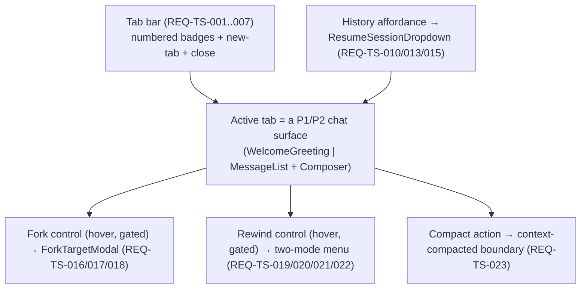
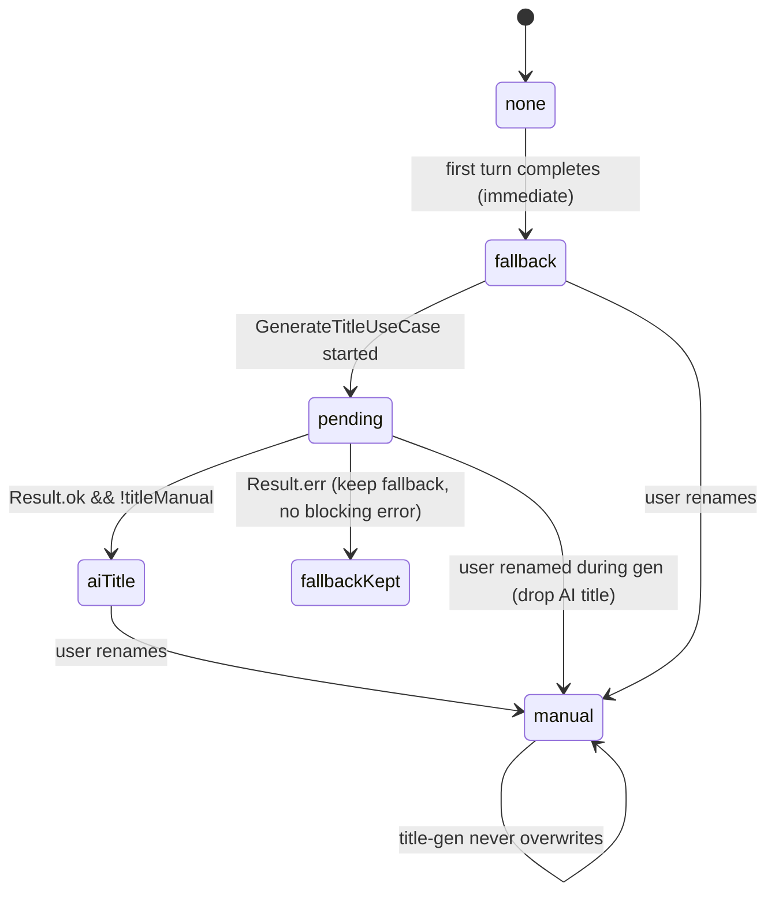
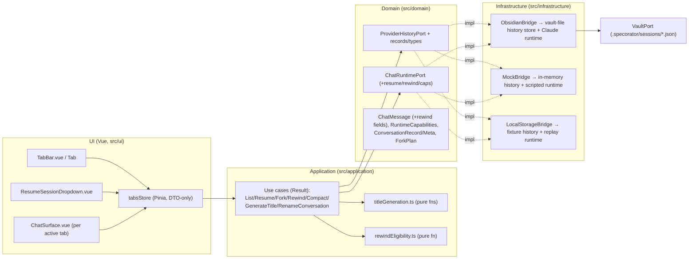

# Design — Threads & Sessions (P3)

Makes the P1/P2 chat surface **multi-conversation**: N chat tabs, conversation **persistence +
resume**, **fork**, **rewind** (conversation-only executes), **compact**, and **auto title-gen** —
**additively** over the merged P1 (chat-core) + P2 (rich-rendering) surface, never by redesign
(ADR-CC-001 §3, ADR-RR-001 §1). Every claim cites the real Claudian solution under
`D:\Projects\claudian-main`. Identity stays Specorator; colour via `--sp-*`.

> **Autonomous-drive (workflow-state directive 2026-05-25):** the architect filed and accepted the
> four P3 ADRs (**ADR-TS-001/002/003**, resolving **CLAR-TS-001..004**); the PM accepts; the human
> deferred all per-phase gates to one final epic-review. This design rests on those accepted ADRs.

---

# Part A — UX

## A.1 Scope & the surface map

The P3 surface is the P1/P2 chat **with a tab bar above it and a history affordance**. Each tab is an
independent P1/P2 chat (its own conversation, status, runtime). The five P1/P2 chat states
(`empty | idle | streaming | error | interrupted`, SPEC-CC-016) now apply **per active tab**; the
non-active tabs keep their own state in the background (REQ-TS-006).

## A.2 Tab bar (REQ-TS-001..007)

Numbered **square tab badges** in a strip above the chat region (parity `tabs/TabBar.ts`,
`components/tabs.css`), plus a **new-tab** control and a per-tab **close** control.

- **Open** (REQ-TS-001): new-tab control appends an empty tab in the welcome state and activates it;
  existing tabs are untouched.
- **Switch** (REQ-TS-002): clicking a badge activates that tab and shows its conversation; the
  previously active tab's state is preserved (not reset).
- **Close** (REQ-TS-003): close control removes the tab + its in-memory binding and activates an
  adjacent tab (previous, or next when closing the first — Claudian fallback).
- **Minimum one** (REQ-TS-004): closing the last tab leaves exactly one fresh empty tab — never
  tabless.
- **Ceiling** (REQ-TS-005): opening beyond `maxTabs` (default 3, clamp 1..10 — ADR-TS-002 §1) no-ops
  and raises a non-blocking notice (`NotificationPort.showInfo`).
- **Badge state machine** (REQ-TS-006/007): border-colour ladder — **active** = accent,
  **streaming** (incl. a non-active tab streaming in the background) = provider brand
  (`[data-provider]`), **attention** (a non-active tab whose turn ended/errored) = error colour,
  **idle** = default. The badge also carries its **1-based number** as a non-colour cue (NFR-TS-010).

**a11y (NFR-TS-009/010):** the tab strip is a `role="tablist"` with **roving tabindex** — the active
badge `tabindex="0"`, the rest `tabindex="-1"`; Arrow Left/Right moves focus + activation, `Home`/`End`
jump to first/last; each badge is `role="tab"` with `aria-selected`. State is conveyed by number +
border, not colour alone; badge transitions honour `prefers-reduced-motion`.

## A.3 Resume / history dropdown (REQ-TS-010/011/012/013/014/015)

A **drop-UP blurred history menu** (parity `ResumeSessionDropdown.ts`, `components/history.css`,
`features/resume-session.css`) opened from a history control near the composer.

- **List** (REQ-TS-010): persisted conversations, **newest-`updatedAt` first**, each row = title +
  relative date. Empty list shows a quiet "no past conversations" line.
- **Resume** (REQ-TS-013/014): selecting a row loads that conversation's messages into a tab and binds
  the tab's runtime to the resolved session id (`resolveSessionId`, ADR-TS-001) for the next turn. The
  transcript renders via the **P2 ordered block path** (SPEC-RR-012/018) with **all collapsibles
  collapsed by default** (REQ-TS-014) — no P2 rework.
- **Rename** (REQ-TS-011): inline rename input on a row; confirming sets the stored title +
  `titleManual = true` (manual-rename precedence, ADR-TS-003 §2).
- **Delete** (REQ-TS-012): delete affordance (hover → red) removes the record + transcript; confirmation
  is an **Obsidian `Modal`**, never `window.confirm` (NFR-TS-007).
- **Title-gen status** (REQ-TS-025): a row whose title is being generated shows a **spin** loader; on
  failure it silently keeps the fallback (no blocking error).

**Keyboard (REQ-TS-015):** the open list is a `role="listbox"`; Arrow Up/Down move the
`aria-activedescendant` selection, **Enter** activates (resumes) the selected row, **Escape** closes
with no selection. Focus returns to the opener on close.

## A.4 Fork (REQ-TS-016/017/018)

- **Affordance** (REQ-TS-016): a `git-fork` control in each **user** message's hover action toolbar,
  **gated** by `getCapabilities().supportsFork` (ADR-TS-002 §3); absent when the provider reports no
  fork support.
- **Target chooser** (REQ-TS-017): activating fork opens an **Obsidian `Modal`** (parity
  `ForkTargetModal.ts`, `modals/fork-target.css` — a small ≤340px option list) offering the fork
  target(s) — at minimum **new tab** (P3's primary), optionally **current tab**. No `window.confirm`/
  `prompt`/`alert` anywhere (NFR-TS-007).
- **Execute** (REQ-TS-018): confirming derives a `ForkPlan` (`buildForkPlan`, ADR-TS-001 §1) — source
  transcript up to the chosen point + a derived `forkSource` provider-state pointer — and opens a
  **new tab** holding M1..Mk; the source tab is unchanged; the new tab's session-state references the
  source session id + resume offset. **Not a transcript file copy.**

## A.5 Rewind / checkpoint (REQ-TS-019/020/021/022)

- **Eligibility** (REQ-TS-019): a `rotate-ccw` control appears in a user message's hover toolbar iff a
  following assistant message bears an `assistantMessageId` (the runtime processed the turn — a pure
  application scan mirroring `rewind.ts:findRewindContext`) **and** `getCapabilities().supportsRewind`.
- **Two-mode menu** (REQ-TS-020): activating rewind opens a menu with **exactly two** distinctly-iconed
  options — "conversation only" (`message-square`) and "code and conversation" (`rotate-ccw`).
- **Conversation-only executes** (REQ-TS-021): truncates the tab's conversation to the chosen turn and
  sets the runtime resume checkpoint (`setResumeCheckpoint`, ADR-TS-002 §3) so the next turn continues
  from there. **No** filesystem effect (mirrors `ClaudeRewindService` `mode === 'conversation'`).
- **Code-and-conversation gated** (REQ-TS-022 / NG7): choosing it performs **no** fs/git change and
  raises a non-blocking notice that code-rollback is unavailable this phase. The affordance exists; the
  effect is a later-phase provider/runtime seam.

## A.6 Compact (REQ-TS-023)

A **compact** action on the active tab requests a compaction turn from the runtime and renders a
**context-compacted boundary** at the compaction point — **reusing the P2 `context_compacted` block +
the existing `onContextCompacted` sink leg** already in the store (no new render machinery). The
conversation continues from the compacted state.

## A.7 Title-gen status (REQ-TS-024/025) — the manual-wins ladder

Immediate fallback (truncated first user message) → async AI title replaces it on success → **manual
rename wins permanently** (REQ-TS-011/024). A spin loader shows while `pending` (REQ-TS-025); a `failed`
result keeps the fallback with no blocking dialog.

## A.8 Requirements coverage — Part A (UX)

| REQ | Covered by |
|---|---|
| REQ-TS-001..007 | A.2 tab bar + badge state machine + a11y |
| REQ-TS-010/011/012 | A.3 history list / rename / delete |
| REQ-TS-013/014/015 | A.3 resume + P2 collapsed replay + keyboard listbox |
| REQ-TS-016/017/018 | A.4 fork affordance / Obsidian modal / derive-not-copy |
| REQ-TS-019/020/021/022 | A.5 rewind eligibility / two-mode menu / conversation executes / code gated |
| REQ-TS-023 | A.6 compact reusing P2 boundary |
| REQ-TS-024/025 | A.7 title-gen ladder + spin status |

---

# Part B — UI

## B.1 Token strategy

Reuse the existing `--sp-*` token map; **add only what the four new surfaces need** (NFR-TS-012). No
component-level hex, no raw Obsidian var — every value is a `--sp-*` token (`lint-style-tokens` guard).
The P3 Claudian CSS modules map as:

| Claudian CSS module | P3 surface | `--sp-*` tokens (reuse + add) |
|---|---|---|
| `components/tabs.css` | tab bar + numbered badges | reuse `--sp-accent`, `--sp-radius-*`, `--sp-space-*`, `--sp-font-size-sm`; add `--sp-tab-size`, `--sp-tab-border-active` (=`--sp-accent`), `--sp-tab-border-streaming` (=brand via `[data-provider]`), `--sp-tab-border-attention` (=`--sp-error`), `--sp-tab-border-idle` |
| `components/history.css` | history list rows | reuse `--sp-bg-*`, `--sp-text-muted`, `--sp-space-*`; add `--sp-history-row-h`, `--sp-history-delete` (=`--sp-error`) |
| `features/resume-session.css` | drop-UP blurred menu + spin | reuse `--sp-bg-elevated`, `--sp-shadow-*`, `--sp-radius-*`; add `--sp-history-blur`, reuse the P2 spin keyframe (animations.css) gated by `prefers-reduced-motion` |
| `modals/fork-target.css` | fork-target option list | reuse modal tokens; add `--sp-fork-modal-max-inline` (≤340px) |

The streaming-border brand colour resolves from the existing `data-provider="claude"` attribute on the
chat root (already set in `ChatSurface.vue`) — the badge inherits the provider brand for its streaming
state with **no component hex**.

## B.2 State ladder (visual)

- **Tab badge**: idle (default border) → active (accent border) → streaming (brand border, optional
  pulse honouring reduced-motion) → attention (error border). Number always visible (non-colour cue).
- **History row**: default → hover (delete turns red) → renaming (inline input) → title-gen pending
  (spin).
- **Fork/rewind hover controls**: shown only when capability-gated + eligible; standard hover-toolbar
  treatment (parity `components/messages.css`).

## B.3 Parity-screenshot plan

Per the autonomous-drive directive, **capture is deferred to the single final epic-review gate**
(charter §5.1). The plan: for each of the **seven** P3 sub-surfaces (tabs, history, resume, fork,
rewind, compact, title-gen), capture at the charter widths × light/dark, side-by-side with the
Claudian reference, stored under the P3 parity-screenshots artifact. Manual-Obsidian legs accumulate
toward that gate.

## B.4 Requirements coverage — Part B (UI)

| REQ / NFR | Covered by |
|---|---|
| REQ-TS-007 (badge border machine) | B.1 tab tokens + B.2 ladder |
| NFR-TS-010 (non-colour cues, reduced-motion) | B.2 number cue + reduced-motion spin/pulse |
| NFR-TS-012 (`--sp-*` parity, no hex) | B.1 token map |
| G7 / charter §5.1 (parity) | B.3 screenshot plan (deferred capture) |

---

# Part C — Architecture

## C.1 System overview

Inward-only imports hold (ADR-001, NFR-TS-001): UI → application → domain ports; infrastructure
implements ports; the view (plugin layer) wires bridges → ports.

## C.2 Components & responsibilities

| Component | Layer | Responsibility | New/Grown | REQ |
|---|---|---|---|---|
| `ProviderHistoryPort` + `ConversationRecord`/`ConversationMeta`/`ForkPlan`/`ProviderSessionState` | domain | List/hydrate/save/updateMeta/delete/resolveSessionId/buildForkPlan; provider-neutral metadata + transcript + opaque state | **New** (ADR-TS-001) | 008/009/010/012/013/018/026 |
| `ChatRuntimePort` + `RuntimeCapabilities` | domain | Add `resumeSession`/`setResumeCheckpoint`/`getCapabilities` additively to the nine P1 members | **Grown** (ADR-TS-002 §3) | 013/019/021/028 |
| `ChatMessage` rewind fields | domain | `userMessageId?`/`assistantMessageId?`/`resumeAtMessageId?` — additive, all optional | **Grown** (ADR-TS-002 §4) | 019/021/028 |
| `ListConversationsUseCase` | application | `ProviderHistoryPort.listSessions` → sorted meta (`Result`) | **New** | 010 |
| `ResumeConversationUseCase` | application | hydrate + resolveSessionId → tab payload + runtime bind (`Result`) | **New** | 013/014 |
| `ForkConversationUseCase` | application | `buildForkPlan` → new-tab payload (`Result`) | **New** | 018 |
| `RewindConversationUseCase` | application | conversation-only: truncate + `setResumeCheckpoint`; code-mode: gated no-op + notice (`Result`) | **New** | 021/022 |
| `CompactConversationUseCase` | application | request compaction turn; the P2 `context_compacted` block renders via the existing sink | **New** | 023 |
| `GenerateTitleUseCase` + `titleGeneration.ts` | application | cold-start side-query over `ChatRuntimePort.query`; pure prompt/parse fns (`Result<string>`) | **New** (ADR-TS-003) | 024/025 |
| `RenameConversationUseCase` | application | set title + `titleManual` → `updateMeta` (`Result`) | **New** | 011 |
| `DeleteConversationUseCase` | application | `ProviderHistoryPort.delete` (`Result`) | **New** | 012 |
| `rewindEligibility.ts` | application | pure scan: user msg → following turn-id-bearing assistant + capability | **New** | 019 |
| `tabsStore` | ui | N tab DTOs + activeTabId; per-tab status/messages/usage/session; per-tab streaming isolation; runners in WeakMap | **New** (generalises `chatStore`, ADR-TS-002 §1) | 001..007 |
| `TabBar.vue` + `Tab` | ui | render numbered badges + state machine; open/switch/close; roving tabindex | **New** | 001..007 |
| `ResumeSessionDropdown.vue` | ui | drop-UP listbox; list/select/rename/delete; spin status; keyboard nav | **New** | 010/011/012/013/015/025 |
| `ForkTargetModal` (Obsidian `Modal`) | ui/plugin | fork-target chooser; resolves target → use case | **New** | 017 |
| rewind menu | ui | two-mode menu; mode dispatch | **New** | 020/021/022 |
| `AgentSidebarView` / `ui/main.ts` wiring | plugin/ui | provide `PROVIDER_HISTORY_PORT` (factory) alongside the chat ports; mount `TabBar` over `ChatSurface` | **Grown** | 008/013/027 |

## C.3 Data model (ADR-TS-001 §2)

- **`ConversationRecord`** `{ meta: ConversationMeta; messages: ChatMessage[]; providerState: ProviderSessionState }` — one JSON file per conversation at `<sessionsFolder>/<id>.json` (default `.specorator/sessions`, configurable via new optional `PluginSettings.sessionsFolder`).
- **`ConversationMeta`** `{ id; title; titleManual; createdAt; updatedAt; providerId; sessionId }` (REQ-TS-009). History list orders by `updatedAt` DESC.
- **`ProviderSessionState`** = opaque `Record<string, unknown>`; Claude carries `{ providerSessionId?, forkSource?: { sessionId; resumeAt }, previousProviderSessionIds? }` (mirrors `ClaudeProviderState`). No secret ever written (NFR-TS-013).
- **`ForkPlan`** `{ messages; providerState (derived forkSource); sourceTitle }` (REQ-TS-018).
- **Migration:** none — load-or-default (NFR-TS-014). A P1-shaped stored `messages[]` (no `contentBlocks`) renders via the P1 path (EC-RR-13).

## C.4 Data flow — primary scenarios

1. **Persist on turn done (REQ-TS-008):** active tab's turn `onDone` → `tabsStore` builds a
   `ConversationRecord` from the tab DTO → `ProviderHistoryPort.save` → `<sessionsFolder>/<id>.json`;
   `updatedAt` bumped. First-turn completion also triggers the title ladder (C.4.5).
2. **Resume (REQ-TS-013/014):** open dropdown → `listSessions` (sorted) → select → `ResumeConversationUseCase`: `hydrate(id)` + `resolveSessionId(id)` → `tabsStore.loadIntoTab(record)` + `runtime.resumeSession(sessionId)` → P2 block render, collapsibles collapsed.
3. **Fork (REQ-TS-018):** hover user message (cap-gated) → fork → `ForkTargetModal` → confirm →
   `ForkConversationUseCase.buildForkPlan(sourceId, resumeAtMessageId)` → `tabsStore.openTab(forkPlan)`
   (new tab, M1..Mk + derived state); source untouched; new tab persists its own record on first turn.
4. **Rewind (REQ-TS-021/022):** hover user message (cap-gated + eligible via `rewindEligibility`) →
   two-mode menu. Conversation-only → `RewindConversationUseCase` truncates `messages` +
   `runtime.setResumeCheckpoint(assistantMessageId)`. Code-mode → gated no-op + `NotificationPort` notice.
5. **Title (REQ-TS-024/025):** first-turn done → set fallback + `updateMeta` → status `pending` (spin)
   → `GenerateTitleUseCase` (cold-start side-query) → on `ok` && `!titleManual` replace + `updateMeta`;
   on `err` keep fallback (no blocking error); manual rename wins.

## C.5 Three-bridge story

| Bridge | `ProviderHistoryPort` (`createProviderHistoryPort()`) | `ChatRuntimePort` (grown) |
|---|---|---|
| `ObsidianBridge` | vault-file store: JSON records under `<sessionsFolder>/` via its own `VaultPort` | real Claude-CLI runtime; `resumeSession`/`setResumeCheckpoint`/`getCapabilities` map to the CLI session/resume seam |
| `MockBridge` | in-memory `Map<id, ConversationRecord>` — full list/hydrate/save/fork/delete with no vault | scripted generator; capabilities `{ supportsFork:true, supportsRewind:true }`; resume/checkpoint are recorded no-ops for tests |
| `LocalStorageBridge` | fixture-seeded in-memory store (canned conversations); non-durable writes (degrade, NFR-TS-002) | replay generator (as P1) |

Each port keeps its own `InjectionKey` (`PROVIDER_HISTORY_PORT`) + composable (`useProviderHistoryPort`)
— no aggregate (ADR-008, ADR-CC-001 §5). Provided per mount in `AgentSidebarView` + `ui/main.ts`.

## C.6 Preserved boundaries

- **Result vs error-as-chunk (NFR-TS-004, ADR-CC-001 §1/§2):** all new use cases return `Result<T,E>`;
  streaming failure stays the `{type:'error'}` `StreamChunk` member; `GenerateTitleUseCase` maps the
  error-chunk to a non-blocking `Result.err` at its boundary.
- **DTO-only store (NFR-TS-003):** `tabsStore` holds plain DTOs; runners/notifiers/loggers live in a
  per-`TabId` WeakMap outside reactive state (the P1 pattern, generalised).
- **No `obsidian`/`node:*` in UI (NFR-TS-005), no `v-html`/`innerHTML` (NFR-TS-006), Obsidian `Modal`
  for blocking flows (NFR-TS-007), `<script setup>` (NFR-TS-008):** all carried unchanged from P1/P2.
- **Additivity (REQ-TS-028):** nine P1 `ChatRuntimePort` members + P1/P2 `ChatMessage` keep every
  name/signature; P3 adds only new ports/types/members.

## C.7 Edge cases (for QA / spec)

| # | Edge case | Expected |
|---|---|---|
| EC-TS-1 | Open beyond `maxTabs` | no tab; active unchanged; non-blocking notice (REQ-TS-005) |
| EC-TS-2 | Close the last tab | exactly one fresh empty tab remains active (REQ-TS-004) |
| EC-TS-3 | Switch tabs mid-stream | source keeps streaming in background; target shows its own state (REQ-TS-006) |
| EC-TS-4 | Non-active tab's turn ends/errors | its badge enters attention state (REQ-TS-007) |
| EC-TS-5 | Resume a conversation with no resolvable session id | loads transcript read-only; next turn cold-starts a new session (resolveSessionId → null) |
| EC-TS-6 | Hydrate a missing/corrupt record | load-or-default: empty/skip, no throw, no migration (NFR-TS-014) |
| EC-TS-7 | Fork at the first user message | new tab holds M1; derived forkSource at M1; source unchanged (REQ-TS-018) |
| EC-TS-8 | Rewind on a user message with no following turn-id-bearing assistant | no rewind control shown (REQ-TS-019) |
| EC-TS-9 | Choose "code and conversation" rewind | no fs/git change; notice; conversation untouched (REQ-TS-022) |
| EC-TS-10 | Manual rename during title-gen | AI title dropped on arrival; manual title kept (REQ-TS-024) |
| EC-TS-11 | Title-gen fails / aborts | fallback retained; status failed; no blocking error (REQ-TS-025) |
| EC-TS-12 | Delete the active tab's bound conversation from history | record/transcript gone; tab stays open in-memory until closed |
| EC-TS-13 | Two tabs stream concurrently | independent runtimes; no cross-write; usage isolated (REQ-TS-006) |
| EC-TS-14 | Concurrent save (turn done) + rename | last-writer-wins on `updateMeta`; `updateMeta` patches meta only, never the transcript |
| EC-TS-15 | Capability `supportsFork=false` / `supportsRewind=false` | no fork / no rewind control (REQ-TS-016/019) |

## C.8 QA-seam scenarios (for the QA agent)

- Per-tab streaming isolation: chunk for tab B mutates only tab B while tab A active+idle.
- Tab lifecycle: open→switch→close→min-one→ceiling-notice.
- History round-trip: save → reload (fresh store) → listSessions → hydrate → P2 collapsed render.
- Fork derive-not-copy: source record unmodified; new record has `forkSource` pointer, not a transcript copy.
- Rewind: conversation-only truncates + sets checkpoint; code-mode no-ops + notices (assert no `VaultPort`/fs call).
- Title ladder: fallback→AI→manual-wins; failure keeps fallback, no `showError`.
- Provider-addressed: grep gate — no `if (provider === 'claude')` in `src/application/**` or `src/ui/**`.
- Additivity: contract test — P1 nine members + P1/P2 `ChatMessage` unchanged.

## C.9 Key decisions

| Decision | Rationale | ADR |
|---|---|---|
| History persists to **vault files** via `VaultPort` (default `.specorator/sessions`) | portable, visible, git-trackable user content; honours all epic constraints; not `data.json`/device-pref/secret | ADR-TS-001 |
| New narrow **`ProviderHistoryPort`** (list/hydrate/save/updateMeta/delete/resolveSessionId/buildForkPlan), `Result`-returning, factory-provided | mirrors `ClaudeConversationHistoryService`; provider-addressed; additive | ADR-TS-001 |
| **Fork = derive-not-copy** (`forkSource` pointer + truncated transcript) | source immutable; cheap lineage; matches `buildForkProviderState` | ADR-TS-001 |
| `HomeFsPort` / Codex-JSONL / Opencode history **deferred to P9** | NG8; P3 exercises only the Claude vault path; later impls are additive | ADR-TS-001 §4 |
| One **`tabsStore`** (N tab DTOs + activeTabId; runners in per-tab WeakMap) | minimal generalisation of the proven P1 store; isolation falls out | ADR-TS-002 §1 |
| **Vue Router stays removed** | tabs are in-surface state, not routed navigation | ADR-TS-002 §2 |
| `ChatRuntimePort` grows additively: `resumeSession`/`setResumeCheckpoint`/`getCapabilities` | the ADR-CC-001-deferred session ops; capability-gated UI | ADR-TS-002 §3 |
| `ChatMessage` gains optional `userMessageId`/`assistantMessageId`/`resumeAtMessageId` | pre-flagged P3 growth; powers rewind-eligibility scan | ADR-TS-002 §4 |
| **Code-and-conversation rewind gated, not executed** | NG7; affordance exists, fs/git effect is a later phase | ADR-TS-002 §3 |
| Title-gen = **cold-start side-query** over `ChatRuntimePort.query` behind `GenerateTitleUseCase` | smallest additive seam; matches backend audit; stream-isolated | ADR-TS-003 §1 |
| **`AuxModelPort` deferred to P4/P5** | one P3 one-shot call doesn't earn a new port; upgrade is additive | ADR-TS-003 §3 |
| `MIN_TABS = 1` (vs Claudian floor of 3) | Specorator surface-always-usable rule (REQ-TS-004) | ADR-TS-002 §1 |

## C.10 Rejected alternatives

- **Device-local / `data.json` history** — misclassifies user content as a preference / forbidden store (ADR-TS-001 Options B/D).
- **`HomeFsPort` native store now** — couples P3 to a deferred SDK-specific format (NG8) (ADR-TS-001 Option C).
- **Store-per-tab / ad-hoc keyed `chatStore`** — heavier or bug-prone vs one `tabsStore` (ADR-TS-002 Options B/C).
- **Regrow Vue Router for tabs** — machinery with no parity gain (ADR-TS-002 Option D).
- **Dedicated `AuxModelPort` in P3 / reuse the live main runtime for title** — premature surface / stream coupling (ADR-TS-003 Options B/C).

## C.11 Requirements coverage — Part C (Architecture)

| REQ / NFR | Covered by |
|---|---|
| REQ-TS-001..007 | C.2 `tabsStore`/`TabBar`; C.7 EC-TS-1/2/3/4/13 |
| REQ-TS-008/009/010/012 | C.3 data model; C.4.1 persist; C.5 bridges |
| REQ-TS-011 | C.2 `RenameConversationUseCase`; C.4.5 manual-wins |
| REQ-TS-013/014/015 | C.4.2 resume; C.2 dropdown; A.3 keyboard |
| REQ-TS-016/017/018 | C.4.3 fork; C.9 derive-not-copy |
| REQ-TS-019/020/021/022 | C.2 `rewindEligibility`/`RewindConversationUseCase`; C.4.4; C.7 EC-TS-8/9 |
| REQ-TS-023 | C.2 `CompactConversationUseCase` reusing P2 sink |
| REQ-TS-024/025 | C.4.5 title ladder; C.2 `GenerateTitleUseCase` |
| REQ-TS-026/027 | C.5 provider-addressed seams; C.8 grep gate; one Claude impl |
| REQ-TS-028 | C.6 additivity; C.8 contract test |
| NFR-TS-001..015 | C.6 preserved boundaries; C.3 no-migration/no-secret; C.5 three bridges |

---

## Open clarifications for downstream

- The exact `maxTabs` default (3) and clamp (1..10) are blessed in ADR-TS-002 §1; `/spec:specify` sets
  the precise `PluginSettings.maxTabs`/`sessionsFolder` field shapes + validation.
- The fork-target options (new-tab only vs new-tab + current-tab in P3) — design recommends **new-tab
  primary**; `/spec:specify` decides whether current-tab fork ships in P3 or defers (NG-adjacent).
