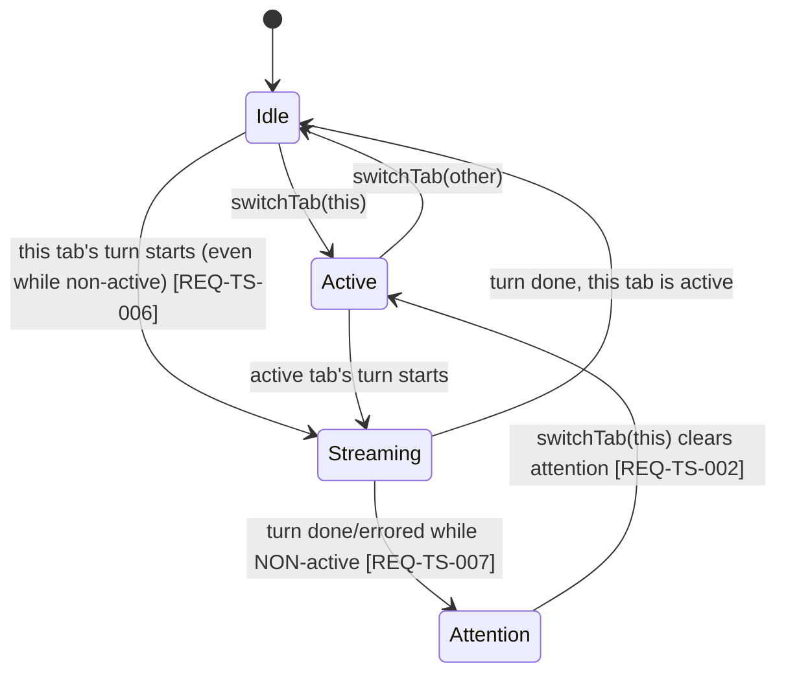
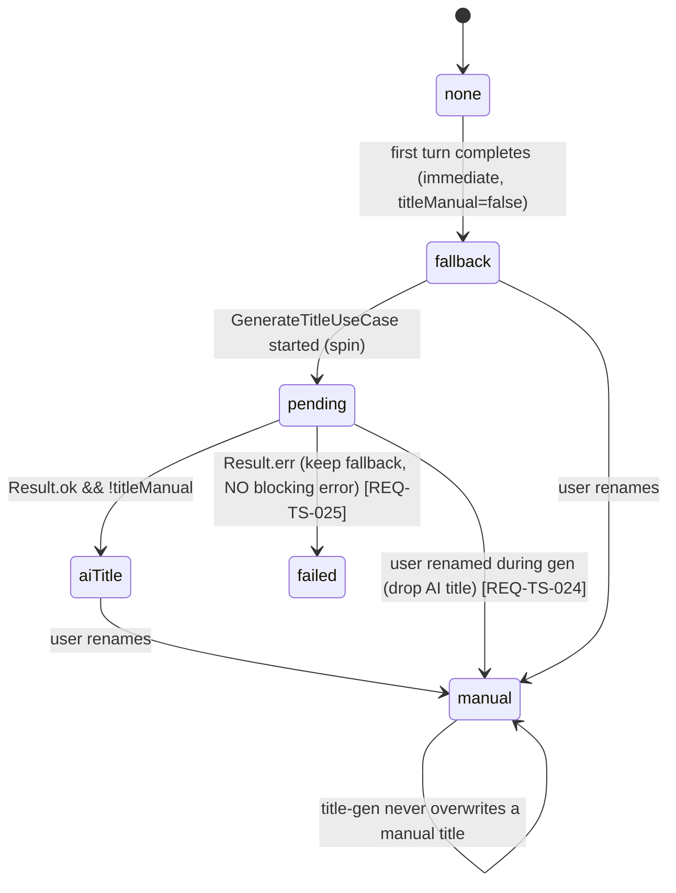

# Specification — Threads & Sessions (P3)

Implementation-ready contracts for P3. Every contract is grounded in `design.md` (DESIGN-TS-001), the
three accepted P3 ADRs (**ADR-TS-001/002/003**), the P1 contract (SPEC-CC-001..023), the P2 contract
(SPEC-RR-001..034), and Claudian's real code under `D:\Projects\claudian-main` (cited inline). Two
independent teams should build the same thing from this document.

> **Conventions in force (inherited from P1/P2, do not relax):** DDD inward-only imports (ADR-001,
> `domain ← application ← infrastructure ← ui`, NFR-TS-001); narrow ports + 3 bridges (ADR-008,
> NFR-TS-002); `Result<T,E>` at every discrete/use-case boundary, **pure-total** transforms elsewhere
> (ADR-004, NFR-TS-004); streaming failure stays the `{type:'error'}` `StreamChunk` member, **not**
> per-chunk `Result` or a thrown error across the port (ADR-CC-001 §1/§2, NFR-TS-004); DTO-only store
> boundary — no domain class instance crosses into Pinia (ADR-003, NFR-TS-003); Vue `<script setup>`
> only (NFR-TS-008); no `obsidian`/`node:*` import under `src/ui/**` (NFR-TS-005); **no `v-html`/
> `innerHTML`/`outerHTML`/`insertAdjacentHTML`** anywhere (NFR-TS-006); blocking flows use an Obsidian
> `Modal`, never `window.confirm`/`alert`/`prompt` (NFR-TS-007); `--sp-*` token parity, colour
> literals confined to the token layer (NFR-TS-012); WCAG 2.2 AA tab/listbox keyboard nav + non-colour
> cues + reduced-motion (NFR-TS-009/010); tests mirror `src/` + `data-testid` PageObjects, coverage
> 80/70/80/80 (NFR-TS-011); `manifest.json` untouched (NFR-TS-015); **no stored secret, no migration —
> load-or-default** (NFR-TS-013/014); additive growth only — **no rename/removal of any P1/P2 member**
> (REQ-TS-028, ADR-CC-001, ADR-RR-001 §1).

This spec defines **34 spec items** across five layer groups (SPEC-TS-001..034). The Tasks stage
(`planner`) decomposes them into `T-TS-NNN`; the QA stage turns the TEST-TS-NNN scenarios (§9) into
automated tests. SPEC-TS items **extend** their P1/P2 counterparts and cite the extension point.

> **Three open items the design handed to `/spec:specify` — RESOLVED HERE:**
> 1. **`PluginSettings.sessionsFolder` + `maxTabs` field shapes + validation** — settled in
>    SPEC-TS-011 (exact types, defaults `'.specorator/sessions'` / `3`, and the resolve-and-clamp
>    rules `MIN_TABS = 1`, `MAX_TABS_CEILING = 10`).
> 2. **Current-tab fork in P3** — **YES, it ships.** `ForkTarget = 'new-tab' | 'current-tab'`;
>    new-tab is the primary/default option, current-tab is the simplest second target (fork the active
>    conversation in place into the current tab). Rationale: the `ForkPlan` is identical for both — only
>    the destination tab differs, so current-tab costs one extra menu row and one `loadIntoTab` call vs
>    one `openTab` call. No new domain surface (SPEC-TS-016/SPEC-TS-027/SPEC-TS-031).
> 3. **`ConversationRecord` version tag** — **INCLUDED as `version: 1`** (a constant, forward-proofing
>    tag — **not** a migration mechanism). The reader treats any record (any/missing `version`) under
>    load-or-default; the writer always stamps `version: 1` (SPEC-TS-002/SPEC-TS-010). This is a tag,
>    not a shim — NFR-TS-014 (no migration) holds.

---

## 0. Spec-item index

| Spec item | Title | Layer | Extends (P1/P2) | REQ / NFR links |
|---|---|---|---|---|
| **DOMAIN** | | | | |
| SPEC-TS-001 | `ProviderHistoryPort` exact interface + `PROVIDER_HISTORY_PORT` key + barrel re-export | domain | — (new, ADR-TS-001) | REQ-TS-008/010/012/013/018/026 |
| SPEC-TS-002 | `ConversationRecord` / `ConversationMeta` / `ProviderSessionState` / `ForkPlan` field-level types | domain | — (new) | REQ-TS-008/009/018; NFR-TS-013/014 |
| SPEC-TS-003 | `ChatRuntimePort` — additive `resumeSession` / `setResumeCheckpoint` / `getCapabilities` + `RuntimeCapabilities` | domain | SPEC-CC-001 | REQ-TS-013/019/021/028; ADR-TS-002 §3 |
| SPEC-TS-004 | `ChatMessage` — additive optional `userMessageId` / `assistantMessageId` / `resumeAtMessageId` | domain | SPEC-CC-004 / SPEC-RR-008 | REQ-TS-019/021/028; ADR-TS-002 §4 |
| SPEC-TS-005 | `PluginSettings.sessionsFolder` + `maxTabs` (+ defaults/validation) | domain | SPEC-PSR-001 | REQ-TS-005/008; ADR-TS-001/002 |
| **INFRA** | | | | |
| SPEC-TS-006 | `ObsidianBridge` — vault-file `ProviderHistoryPort` impl (`createProviderHistoryPort()`) | infra | SPEC-CC-013 | REQ-TS-008/010/012/013/018; NFR-TS-002 (manual leg) |
| SPEC-TS-007 | `MockBridge` — in-memory `Map` `ProviderHistoryPort` impl + per-tab capabilities | infra | SPEC-CC-011 | REQ-TS-008/010/013/018; NFR-TS-002 |
| SPEC-TS-008 | `LocalStorageBridge` — fixture-seeded `ProviderHistoryPort` impl | infra | SPEC-CC-012 | REQ-TS-010; NFR-TS-002 |
| SPEC-TS-009 | Grown `ChatRuntimePort` impls (resume/checkpoint/capabilities) + title-gen cold-start side-query backing | infra | SPEC-CC-011/013 | REQ-TS-013/019/021/024/027 |
| SPEC-TS-010 | `conversationRecordCodec.ts` — pure (de)serialise + load-or-default (unit-tested) | infra | — (new) | REQ-TS-008; NFR-TS-013/014 |
| **APPLICATION** | | | | |
| SPEC-TS-011 | `ListConversationsUseCase` | application | — (new) | REQ-TS-010 |
| SPEC-TS-012 | `ResumeConversationUseCase` | application | — (new) | REQ-TS-013/014 |
| SPEC-TS-013 | `ForkConversationUseCase` | application | — (new) | REQ-TS-018 |
| SPEC-TS-014 | `RewindConversationUseCase` (conversation executes / code gated) | application | — (new) | REQ-TS-021/022 |
| SPEC-TS-015 | `CompactConversationUseCase` (reuses P2 `context_compacted` + `onContextCompacted`) | application | SPEC-RR-018/020 | REQ-TS-023 |
| SPEC-TS-016 | `GenerateTitleUseCase` + pure `titleGeneration.ts` (fallback + prompt + parse) | application | — (new, ADR-TS-003) | REQ-TS-024/025 |
| SPEC-TS-017 | `RenameConversationUseCase` + `DeleteConversationUseCase` | application | — (new) | REQ-TS-011/012 |
| SPEC-TS-018 | `rewindEligibility.ts` — pure scan | application | — (new) | REQ-TS-019 |
| **UI** | | | | |
| SPEC-TS-019 | `tabsStore` — N `TabState` DTOs + activeTabId + per-tab runner WeakMap + per-tab isolation | ui | SPEC-CC-016 / SPEC-RR-020 | REQ-TS-001..007 |
| SPEC-TS-020 | `TabBar.vue` + tab badge (state machine, roving tabindex) | ui | — (new) | REQ-TS-001..007 |
| SPEC-TS-021 | `useProviderHistoryPort()` composable | ui | SPEC-CC-017 | REQ-TS-010/013 |
| SPEC-TS-022 | `ResumeSessionDropdown.vue` — drop-UP listbox (list/rename/delete/spin/keyboard) | ui | — (new) | REQ-TS-010/011/012/013/015/025 |
| SPEC-TS-023 | `ForkTargetModal` (Obsidian `Modal` subclass) | ui/plugin | — (new) | REQ-TS-017 |
| SPEC-TS-024 | rewind menu + `DeleteConfirmModal` (Obsidian `Modal`) | ui/plugin | — (new) | REQ-TS-012/020/021/022 |
| SPEC-TS-025 | Fork/rewind hover affordances on user messages (capability + eligibility gated) | ui | SPEC-RR-023 | REQ-TS-016/019 |
| SPEC-TS-026 | `ChatSurface.vue` — per-tab binding (active `TabState`); compact action | ui | SPEC-CC-018 | REQ-TS-006/023 |
| SPEC-TS-027 | Wiring — `AgentSidebarView` + `ui/main.ts` provide `PROVIDER_HISTORY_PORT` + mount `TabBar` | plugin/ui | SPEC-CC-022 | REQ-TS-008/013/027 |
| **STYLES** | | | | |
| SPEC-TS-028 | `--sp-*` token additions (tokens.css §4.10 — tabs/history/resume/fork) | ui (styles) | SPEC-RR-033 | NFR-TS-012 |
| SPEC-TS-029 | No-`v-html` / Obsidian-`Modal` compliance invariant (cross-cutting) | ui/plugin | SPEC-RR-034 | NFR-TS-006/007 |
| **CROSS-CUTTING** | | | | |
| SPEC-TS-030 | Persist-on-turn-done flow (active tab → `ConversationRecord` → `save`) | ui/app | SPEC-RR-018 | REQ-TS-008 |
| SPEC-TS-031 | Title ladder orchestration (fallback → AI → manual-wins; abort) | ui/app | — (new) | REQ-TS-011/024/025 |
| SPEC-TS-032 | Provider-addressed seam invariant (zero `provider === 'claude'` branch) | app/ui | — | REQ-TS-026/027 |
| SPEC-TS-033 | Additivity invariant (P1 nine members + P1/P2 `ChatMessage` unchanged) | domain | — | REQ-TS-028 |
| SPEC-TS-034 | Observability (LoggerPort events; no message content logged) | cross | — | NFR-TS-013 |

---

# 1. Domain — the new port, types, and additive growth (SPEC-TS-001..005)

Types under `src/domain/chat/` and `src/domain/ports/`; the settings field under
`src/domain/settings/`. No `obsidian`, no `node:*`, no Vue, no class — pure interfaces/unions
(ADR-001). **Additive only: no P1/P2 field or member is renamed or removed (REQ-TS-028).**

## SPEC-TS-001 — `ProviderHistoryPort` (`src/domain/ports/ProviderHistoryPort.ts`)

**REQ:** REQ-TS-008/010/012/013/018/026 · **ADR:** ADR-TS-001 §2 · **Claudian ground-truth:**
`providers/claude/history/ClaudeConversationHistoryService.ts` (`hydrateConversationHistory`,
`deleteConversationSession`, `resolveSessionIdForConversation`, `buildForkProviderState`),
`core/providers/types.ts` (`ProviderConversationHistoryService`). **New narrow port — one consumer
(the history/resume/fork use cases).** Reproduced verbatim from ADR-TS-001 §2 (the ADR body is the
contract; this section is its implementation-ready restatement):

```ts
import type { Result } from '@/domain/shared/Result';
import type { ProviderId } from '@/domain/chat/ProviderId';
import type {
  ConversationRecord,
  ConversationMeta,
  ForkPlan,
} from '@/domain/chat/ConversationRecord';

/**
 * The provider-addressed conversation-history seam (ADR-TS-001). Mirrors
 * `ProviderConversationHistoryService`; every discrete method is Result-returning
 * (ADR-004). Provided per mount via the bridge `createProviderHistoryPort()`
 * factory; its own `PROVIDER_HISTORY_PORT` InjectionKey + `useProviderHistoryPort()`
 * composable — NO aggregate (ADR-008, ADR-CC-001 §5). One impl is wired in P3 —
 * Claude (REQ-TS-027); application/UI NEVER branch on `providerId` (REQ-TS-026).
 */
export interface ProviderHistoryPort {
  readonly providerId: ProviderId;
  listSessions(): Promise<Result<ConversationMeta[]>>;
  hydrate(conversationId: string): Promise<Result<ConversationRecord>>;
  save(record: ConversationRecord): Promise<Result<void>>;
  updateMeta(conversationId: string, patch: Partial<ConversationMeta>): Promise<Result<void>>;
  delete(conversationId: string): Promise<Result<void>>;
  resolveSessionId(conversationId: string): Promise<Result<string | null>>;
  buildForkPlan(sourceConversationId: string, resumeAtMessageId: string): Promise<Result<ForkPlan>>;
}
```

**Per-method contract (signature · behaviour · pre/post · errors · side effects):**

| Method | Behaviour | Pre / Post | `Result.err` when | Side effects |
|---|---|---|---|---|
| `listSessions()` | Return all persisted `ConversationMeta`, **sorted `updatedAt` DESC** (REQ-TS-010). | Post: array (possibly empty). | Underlying store read fails irrecoverably. **An empty/missing store → `ok([])`**, never `err` (load-or-default, NFR-TS-014). | none (read) |
| `hydrate(id)` | Return the full `ConversationRecord` for `id` (REQ-TS-013/014). | Pre: `id` non-empty. Post: a parsed record. | Record **missing** (EC-TS-5) or **corrupt/unparseable** (EC-TS-6) → `err` carrying a typed `HistoryError{kind:'not-found'|'corrupt'}`; the **use case** maps this to a load-or-default (SPEC-TS-012), never a throw. | none (read) |
| `save(record)` | Write the record under its `meta.id`; **always stamp `version: 1`** (SPEC-TS-010). Bump nothing the caller did not set — the caller owns `meta.updatedAt`. | Pre: `record.meta.id` non-empty. Post: a subsequent `hydrate(id)` returns the same record (modulo serialise round-trip). | Store write fails (e.g. vault write error). | persists 1 record |
| `updateMeta(id, patch)` | Patch **only** the metadata of an existing record (title/titleManual/updatedAt/sessionId); **never** touch `messages`/`providerState` (EC-TS-14, REQ-TS-011/024). Last-writer-wins. | Pre: `id` exists (else `err{kind:'not-found'}`). Post: meta merged. | `id` not found, or write fails. | rewrites 1 record's meta |
| `delete(id)` | Remove the record + transcript (REQ-TS-012). **Idempotent** — deleting a missing id → `ok` (not `err`). | Post: `hydrate(id)` → `err{not-found}`; `listSessions()` omits it. | Store delete fails irrecoverably. | removes 1 record |
| `resolveSessionId(id)` | Resolve the resumable session id (REQ-TS-013), mirroring `resolveSessionIdForConversation`: provider session id → conversation session id → fork-source session id → **`null`**. | Post: `string \| null`. **No resolvable id → `ok(null)`** (EC-TS-5), never `err`. | Underlying read fails. | none |
| `buildForkPlan(srcId, resumeAtMessageId)` | DERIVE a `ForkPlan` (REQ-TS-018): `messages` = source transcript **truncated through** the message whose id is `resumeAtMessageId` (inclusive); `providerState` = a fresh `{ forkSource: { sessionId, resumeAt } }` bag (mirrors `buildForkProviderState`), **not** a transcript copy; `sourceTitle` = source `meta.title`. The source record is **never mutated** (EC-TS-7). | Pre: `srcId` exists, `resumeAtMessageId` present in its transcript (else `err{not-found}`). Post: a `ForkPlan`. | Source missing/corrupt, or `resumeAtMessageId` absent. | none (read-only derive) |

`HistoryError` is a typed `Error` subtype declared alongside the port (`{ kind: 'not-found' |
'corrupt' | 'io' }`). It crosses the port in `Result.err`; the use cases translate it to UI-safe
outcomes (load-or-default for read paths; a non-blocking notice for write paths — SPEC-TS-011..017).

**`PROVIDER_HISTORY_PORT` InjectionKey** (`src/infrastructure/bridge/ports.ts`, appended — no
aggregate, ADR-008/ADR-CC-001 §5):

```ts
// P3 threads-sessions history seam (SPEC-TS-001, ADR-TS-001 §2).
export const PROVIDER_HISTORY_PORT: InjectionKey<ProviderHistoryPort> = Symbol('ProviderHistoryPort');
```

**Barrel re-export** (`src/domain/ports/index.ts`, appended): `export type { ProviderHistoryPort,
HistoryError } from './ProviderHistoryPort';` and the conversation types (`export type {
ConversationRecord, ConversationMeta, ProviderSessionState, ForkPlan } from
'@/domain/chat/ConversationRecord';`). Unit-testable as a type-shape contract (TEST-TS-001).

## SPEC-TS-002 — Conversation types (`src/domain/chat/ConversationRecord.ts`)

**REQ:** REQ-TS-008/009/018 · **NFR:** NFR-TS-013/014 · **ADR:** ADR-TS-001 §2 · **Claudian
ground-truth:** `core/bootstrap/storage.ts` `SharedAppStorage` (provider-neutral metadata distinct
from provider-native transcript), `providers/claude/history/sdkHistoryTypes.ts`.

```ts
import type { ChatMessage } from './ChatMessage';
import type { ProviderId } from './ProviderId';

/** Forward-proofing tag — a CONSTANT, not a migration mechanism (NFR-TS-014, resolved item #3). */
export const CONVERSATION_RECORD_VERSION = 1 as const;

export interface ConversationRecord {
  /** Always 1 in P3; the reader load-or-defaults any/missing value (SPEC-TS-010). */
  readonly version: number;
  readonly meta: ConversationMeta;
  readonly messages: ChatMessage[];        // P1/P2 transcript DTOs (load-or-default — EC-RR-13)
  readonly providerState: ProviderSessionState;
}

export interface ConversationMeta {
  readonly id: string;                     // record key — crypto.randomUUID(); non-empty
  readonly title: string;                  // fallback | AI | manual (ADR-TS-003); MAY be empty pre-first-turn
  readonly titleManual: boolean;           // manual-rename precedence (REQ-TS-011/024)
  readonly createdAt: number;              // finite epoch ms, set at creation
  readonly updatedAt: number;              // finite epoch ms — listSessions orders DESC by this
  readonly providerId: ProviderId;         // 'claude' in P3; NEVER branched on (REQ-TS-026)
  readonly sessionId: string | null;       // resolvable session id, or null when none yet
}

/** Opaque, provider-owned. Claude carries the (optional) lineage/fork/resume keys below. NO secret. */
export type ProviderSessionState = Record<string, unknown>;

/** The Claude-shaped keys carried inside ProviderSessionState (documentary; the bag stays opaque). */
export interface ClaudeProviderState {
  providerSessionId?: string;
  forkSource?: { sessionId: string; resumeAt: string };   // resumeAt = the source assistant/turn id
  previousProviderSessionIds?: string[];
}

export interface ForkPlan {
  readonly messages: ChatMessage[];            // source transcript truncated to the chosen point
  readonly providerState: ProviderSessionState; // DERIVED { forkSource } bag — not a copy (REQ-TS-018)
  readonly sourceTitle: string;
}
```

**Per-field validation rules:** `id`/`providerId` non-empty strings; `createdAt`/`updatedAt` finite
positive numbers (`updatedAt >= createdAt`); `titleManual` boolean; `sessionId` string-or-null;
`messages` an array of P1/P2 `ChatMessage` (a P1-shaped message with no `contentBlocks` is valid —
load-or-default, EC-RR-13). **No credential/secret field is ever present** (NFR-TS-013 — asserted by
TEST-TS-002/TEST-TS-007). **No migration** (NFR-TS-014): `version` is a stamp the reader tolerates,
not a switch it branches on. Unit-testable as a type-shape contract (TEST-TS-002).

## SPEC-TS-003 — `ChatRuntimePort` additive growth (`src/domain/ports/ChatRuntimePort.ts`)

**REQ:** REQ-TS-013/019/021/028 · **ADR:** ADR-TS-002 §3 · **Claudian ground-truth:**
`providers/claude/runtime/{ClaudeRewindService,ClaudeSessionManager}.ts`, `ProviderRegistry.getCapabilities`.
**Extends SPEC-CC-001.** The nine P1 members keep every name + signature (REQ-TS-028); P3 **appends**
three members + one new type. The P1 doc-comment's "DEFERRED to P2–P4/P9" note for `getCapabilities`
and the session ops is now realised additively here.

```ts
/** Provider capability flags — gate the fork/rewind UI; read through the port, NEVER branched on (REQ-TS-026). */
export interface RuntimeCapabilities {
  readonly supportsFork: boolean;
  readonly supportsRewind: boolean;
}

export interface ChatRuntimePort {
  // ---- the nine P1 members (SPEC-CC-001) — UNCHANGED ----
  readonly providerId: ProviderId;
  prepareTurn(request: ChatTurnRequest): PreparedChatTurn;
  ensureReady(options?: ChatRuntimeEnsureReadyOptions): Promise<boolean>;
  query(turn: PreparedChatTurn, conversationHistory?: ChatMessage[], queryOptions?: ChatRuntimeQueryOptions): AsyncGenerator<StreamChunk>;
  cancel(): void;
  getSessionId(): string | null;
  resetSession(): void;
  onReadyStateChange(listener: (ready: boolean) => void): Unsubscriber;
  isReady(): boolean;
  // ---- P3 additive (ADR-TS-002 §3) ----
  /** Bind this runtime to an existing session so the next turn continues it (REQ-TS-013, resume). */
  resumeSession(sessionId: string): void;
  /** Set the conversation-only rewind checkpoint; the next turn continues from this turn id (REQ-TS-021). */
  setResumeCheckpoint(assistantMessageId: string): void;
  /** The provider's fork/rewind capability flags — gates the UI affordances (REQ-TS-016/019). */
  getCapabilities(): RuntimeCapabilities;
}
```

**Per-member contract:**

| Member | Behaviour | Pre / Post | Side effects | Claudian cite |
|---|---|---|---|---|
| `resumeSession(sessionId)` | Bind the runtime's next `query` to continue `sessionId` (does **not** itself stream). On an empty/unknown id the runtime cold-starts on the next turn (EC-TS-5). | Post: `getSessionId()` reflects the resumed id once a turn runs. `void`. | sets internal session pointer | `ClaudeSessionManager` resume seam |
| `setResumeCheckpoint(assistantMessageId)` | Mark the conversation-only rewind point; the next turn continues from this turn id. **No** filesystem/git effect (NG7). **Only honoured on a runtime whose `getCapabilities().supportsRewind` is `true`** (the Mock/Fixture runtimes; the future SDK-transport Claude runtime). On the production Claude-CLI runtime (`supportsRewind: false`) it is a documented no-op-by-transport and is never reached, because the rewind affordance is capability-gated off (ADR-TS-004, SPEC-TS-009/025). | `void`; idempotent (last call wins). | sets pending resume-at (rewind-capable runtimes only) | `ClaudeRewindService.executeClaudeRewind` `mode==='conversation'` |
| `getCapabilities()` | Return `{ supportsFork, supportsRewind }`. **Pure, total, synchronous** — safe to call on every hover (SPEC-TS-025). The Claude-CLI runtime returns `{ supportsFork: true, supportsRewind: false }` (ADR-TS-004 — rewind-to-turn is SDK-transport, not raw-`--print`); Mock/Fixture return `{ supportsFork: true, supportsRewind: true }`. | Post: a fresh `RuntimeCapabilities`. | none | `ProviderRegistry.getCapabilities` |

The streaming-error boundary is UNCHANGED (ADR-CC-001 §1): these three members are non-streaming and
do **not** return `Result` — `resumeSession`/`setResumeCheckpoint` are `void` runtime-state setters,
`getCapabilities` a pure getter. The discrete *use cases* that orchestrate them return `Result`
(SPEC-TS-012/014). Contract-tested for additivity (TEST-TS-003, SPEC-TS-033).

## SPEC-TS-004 — `ChatMessage` additive rewind fields (`src/domain/chat/ChatMessage.ts`)

**REQ:** REQ-TS-019/021/028 · **ADR:** ADR-TS-002 §4 · **Claudian ground-truth:** `chat.ts:39`
(`userMessageId`/`assistantMessageId`), `rewind.ts:findRewindContext`. **Extends SPEC-RR-008.** The
six P1 fields + the two P2 fields (`contentBlocks?`/`toolCalls?`) are byte-identical. P3 adds the
three optional fields **already pre-flagged** in the P1/P2 doc-comment as additive P3 growth:

```ts
export interface ChatMessage {
  // ---- P1 (SPEC-CC-004) — UNCHANGED ----
  id: string;
  role: 'user' | 'assistant';
  content: string;
  timestamp: number;
  displayContent?: string;
  durationSeconds?: number;
  // ---- P2 (SPEC-RR-008) — UNCHANGED ----
  contentBlocks?: ContentBlock[];
  toolCalls?: ToolCall[];
  // ---- P3 additive (ADR-TS-002 §4, all optional) ----
  /** The runtime's id for this user turn (set on assistant turns it triggered). */
  userMessageId?: string;
  /** The runtime's id for this assistant turn — its PRESENCE proves the runtime processed the turn (REQ-TS-019). */
  assistantMessageId?: string;
  /** The turn id the runtime resumes from for this message (fork/rewind offset). */
  resumeAtMessageId?: string;
}
```

**Per-field rules:** all three optional, all `string` when present, all stable across re-renders
(they are part of the stored DTO, persisted in `ConversationRecord.messages`). Their **absence** is
the normal P1/P2 case — a stored P1/P2 message renders + persists unchanged (load-or-default,
NFR-TS-014). `assistantMessageId` presence is the **sole** rewind-eligibility signal consumed by
`rewindEligibility.ts` (SPEC-TS-018). The doc-comment's "still later-phase members … EXCLUDED" line
for these three is removed; the remaining excluded members (`images`, `currentNote`,
`isInterrupt`/`isRebuiltContext`, `durationFlavorWord`) stay excluded. Contract-tested (TEST-TS-004).

## SPEC-TS-005 — `PluginSettings.sessionsFolder` + `maxTabs` (`src/domain/settings/PluginSettings.ts`)

**REQ:** REQ-TS-005/008 · **ADR:** ADR-TS-001 §1 (folder), ADR-TS-002 §1 (tab counts) · **resolves
design open item #1.** Two new fields, additive over the P0 two-field settings (NFR-TS-013 — both are
device-local *preferences about* persistence, never transcript content):

```ts
export interface PluginSettings {
  readonly locale: string;
  readonly logLevel: 'debug' | 'info' | 'warn' | 'error';
  // ---- P3 threads-sessions (SPEC-TS-005) ----
  /** Vault folder holding ConversationRecord JSON files (ADR-TS-001 §1). Default '.specorator/sessions'. */
  readonly sessionsFolder: string;
  /** Max concurrent tabs (ADR-TS-002 §1). Default 3; resolved-and-clamped to MIN_TABS..MAX_TABS_CEILING. */
  readonly maxTabs: number;
}

export const DEFAULT_SETTINGS: PluginSettings = {
  locale: 'en',
  logLevel: 'warn',
  sessionsFolder: '.specorator/sessions',
  maxTabs: 3,
};

/** Tab-count bounds (ADR-TS-002 §1). MIN diverges from Claudian's floor of 3 deliberately. */
export const MIN_TABS = 1 as const;
export const MAX_TABS_CEILING = 10 as const;
```

**Validation (pure helpers in `src/domain/settings/`, unit-tested — TEST-TS-005):**

- `resolveSessionsFolder(raw: string): string` — trim; **strip a leading/trailing `/`**; collapse
  internal `//`; if the result is empty → fall back to `DEFAULT_SETTINGS.sessionsFolder`. (Mirrors the
  `specsFolder` resolve, ADR-005.) Never returns `''` (would write records to the vault root).
- `clampMaxTabs(raw: number): number` — `Number.isFinite(raw) ? clamp(Math.trunc(raw), MIN_TABS,
  MAX_TABS_CEILING) : DEFAULT_SETTINGS.maxTabs`. So `0 → 1`, `99 → 10`, `NaN → 3`, `2.7 → 2`.

The settings tab (`src/plugin/settings.ts`) gains a text field (`sessionsFolder`) and a numeric/
slider field (`maxTabs`); both flow through the resolve/clamp helpers on save. Persisted device-local
(ADR-PSR-002) — never `data.json`, never holding transcript content (NFR-TS-013).

---

# 2. Infrastructure — three bridges + the codec (SPEC-TS-006..010)

`src/infrastructure/**`. The vault-file store lives under `src/infrastructure/.../history/`; the
`ObsidianBridge` bits that touch real vault I/O are **coverage-excluded** (the production-bridge
exclusion, NFR-TS-011) → a manual leg (TEST-TS-M*). The **pure record codec** (SPEC-TS-010) and the
**Mock/LocalStorage** stores carry the unit weight.

## SPEC-TS-006 — `ObsidianBridge` vault-file `ProviderHistoryPort` (`src/infrastructure/obsidian/history/`)

**REQ:** REQ-TS-008/010/012/013/018 · **ADR:** ADR-TS-001 §1/§3 · **Claudian ground-truth:**
`ClaudeHistoryStore` (file-backed store), `ClaudeConversationHistoryService`.

A `VaultFileHistoryStore` implementing `ProviderHistoryPort`, exposed via a bridge factory
`createProviderHistoryPort(): ProviderHistoryPort` (parity with `createChatRuntime()`, ADR-CC-001 §6).
JSON record schema = `conversationRecordCodec.serialise(record)` (SPEC-TS-010). Layout: one file per
conversation at `<resolveSessionsFolder(settings.sessionsFolder)>/<meta.id>.json`.

- `save(record)` → `createFolder(folder)` (idempotent) then `writeFile(<folder>/<id>.json,
  serialise(record))` via its own `VaultPort`. `providerId = 'claude'`.
- `hydrate(id)` → `readFile(<folder>/<id>.json)` then `deserialise(...)`; a missing file →
  `err{not-found}`; an unparseable file → `err{corrupt}` (the **codec never throws** — SPEC-TS-010 —
  it returns a discriminated parse result the store maps to `Result`).
- `listSessions()` → `listFiles(folder)` filtered to `*.json`, `hydrate`-or-skip each, collect
  `meta`, sort `updatedAt` DESC. A corrupt file is **skipped** (logged `warn`), never aborts the list
  (EC-TS-6).
- `updateMeta(id, patch)` → hydrate, merge meta only (`messages`/`providerState`/`version` untouched
  — EC-TS-14), re-serialise, write.
- `delete(id)` → `deleteFile(<folder>/<id>.json)`; missing file → `ok` (idempotent).
- `resolveSessionId(id)` → hydrate → `meta.sessionId ?? (providerState.forkSource?.sessionId ?? null)`
  (mirrors `resolveSessionIdForConversation`); missing/corrupt → `ok(null)`.
- `buildForkPlan(srcId, resumeAtMessageId)` → hydrate source; truncate `messages` through the message
  with id `resumeAtMessageId` (inclusive); build `providerState = { forkSource: { sessionId:
  source.meta.sessionId ?? source.providerState.providerSessionId, resumeAt: resumeAtMessageId } }`;
  return `{ messages, providerState, sourceTitle: source.meta.title }`. **Source untouched** (EC-TS-7).

**Coverage:** the real-vault I/O methods live under `src/infrastructure/obsidian/**` →
coverage-excluded; their behaviour is proven by the manual leg (TEST-TS-M1) and the **pure codec**
unit tests (SPEC-TS-010, TEST-TS-010). The folder-path / truncate / fork-derive *logic* is factored
into the pure codec + a pure `buildForkPlan` helper so it is unit-tested independent of the vault.

## SPEC-TS-007 — `MockBridge` in-memory `ProviderHistoryPort` (`src/infrastructure/mock/`)

**REQ:** REQ-TS-008/010/013/018 · **ADR:** ADR-TS-001 §3. A `MockHistoryStore` backed by a
`Map<string, ConversationRecord>`, exposed via `MockBridge.createProviderHistoryPort()`. Implements
the **full** list/hydrate/save/updateMeta/delete/resolveSessionId/buildForkPlan flow with no vault, so
`npm run dev` + unit tests exercise every path. `listSessions` sorts `updatedAt` DESC over the Map.
Test helpers mirror the existing `MockBridge` accessors (`getAllConversations()`, `seedConversations(records[])`).

Its `MockChatRuntime` (SPEC-TS-009) reports `getCapabilities() → { supportsFork: true, supportsRewind:
true }`; `resumeSession`/`setResumeCheckpoint` are **recorded no-ops** (capture the last call for
assertions — `getResumedSessionId()`, `getResumeCheckpoint()`) so per-tab tests assert wiring without
a subprocess.

## SPEC-TS-008 — `LocalStorageBridge` fixture `ProviderHistoryPort` (`src/infrastructure/localstorage/`)

**REQ:** REQ-TS-010 · **ADR:** ADR-TS-001 §3. A fixture-seeded in-memory store (two or three canned
`ConversationRecord`s with distinct `updatedAt`) so the GitHub Pages demo shows a populated history
list. Writes are **non-durable** (degrade gracefully, NFR-TS-002) — `save`/`updateMeta`/`delete`
mutate the in-memory fixture for the session but do not persist across reload (correct for a stateless
public demo). Its runtime reports the same capabilities as the Mock.

## SPEC-TS-009 — Grown `ChatRuntimePort` impls + title-gen cold-start side-query (`src/infrastructure/**/runtime/`)

**REQ:** REQ-TS-013/019/021/024/027 · **ADR:** ADR-TS-002 §3, ADR-TS-003 §1. Each bridge's runtime
gains the three additive members (SPEC-TS-003):

- **`ObsidianBridge` (Claude CLI, coverage-excluded):** `resumeSession(sessionId)` maps to the CLI
  resume seam (binds the next `--resume <sessionId>`; empty id cold-starts — EC-TS-5).
  `getCapabilities() → { supportsFork: true, supportsRewind: false }` (**ADR-TS-004** — rewind-to-turn
  (`resumeSessionAt`) is an **Agent-SDK-transport** capability, not a faithful capability of the
  one-shot `claude --print` subprocess transport; Claudian rewinds via the SDK
  `options.resumeSessionAt` over a persistent `MessageChannel`, which `--print` does not provide).
  Because the rewind affordance is capability-gated (REQ-TS-019, SPEC-TS-025), it does **not** render on
  the Claude-CLI path, so `setResumeCheckpoint` is **never reached** on this runtime — it is a
  documented no-op-by-transport and **must not** store-then-discard a checkpoint or emit a misleading
  "checkpoint applied" log (the prior `resumeCheckpoint` field + its `query()` log/clear are removed —
  the dev follow-up). True rewind on the Claude path is deferred to a future SDK-transport runtime,
  which will report `supportsRewind: true` and wire `setResumeCheckpoint` → `resumeSessionAt` exactly as
  Claudian does — the UI affordance then auto-enables with no UI/branch change (capability-driven,
  REQ-TS-026).
- **`MockChatRuntime` / `FixtureChatRuntime`:** recorded no-op session ops; scripted capabilities
  (SPEC-TS-007/008).

**Title-gen cold-start side-query (ADR-TS-003 §1):** the title query reuses `ChatRuntimePort.query`
in a **cold-start / one-shot** mode. P3 adds the **optional** `forceColdStart?: boolean` field to
`ChatRuntimeQueryOptions` (already flagged in `ChatTurn.ts` as P2+ growth — additive, REQ-TS-028).
When `forceColdStart` is set, the runtime ignores any bound session for that single query (so the
title side-query does not steer the tab's main stream). The `GenerateTitleUseCase` (SPEC-TS-016) may
alternatively be handed a **fresh** runtime instance (bridge `createChatRuntime()`) — both achieve
isolation; the dev chooses per bridge. The Mock/Fixture runtimes accumulate scripted `text` chunks and
terminate with `done` for the side-query.

## SPEC-TS-010 — `conversationRecordCodec.ts` (`src/infrastructure/history/conversationRecordCodec.ts`)

**REQ:** REQ-TS-008 · **NFR:** NFR-TS-013/014 · The **pure, total, never-throwing** (de)serialise
boundary — the unit-tested core of the vault-file store (so the I/O methods can be coverage-excluded
infra while this carries the weight).

```ts
export function serialise(record: ConversationRecord): string;  // JSON.stringify with version:1 stamped
export type ParseResult =
  | { ok: true; record: ConversationRecord }
  | { ok: false; reason: 'corrupt' };
export function deserialise(raw: string): ParseResult;          // load-or-default; NEVER throws
```

**Behaviour:**

- `serialise` always writes `version: CONVERSATION_RECORD_VERSION` (= 1), `meta`, `messages`,
  `providerState`. **It strips any field that is not part of the record contract** — defence in depth
  so no stray secret a caller accidentally attached lands in a file (NFR-TS-013).
- `deserialise` parses JSON inside a `try/catch`; on `JSON.parse` failure or a structurally invalid
  record (missing `meta.id`, non-array `messages`) → `{ ok: false, reason: 'corrupt' }` (EC-TS-6). A
  record with **any/missing `version`** is accepted (load-or-default, NFR-TS-014 — `version` is a tag,
  not a switch). A P1-shaped `messages[]` (no `contentBlocks`) is valid (EC-RR-13).
- **No migration** anywhere — there is no `if (version === 0)` branch (NFR-TS-014).

Unit-tested in isolation (TEST-TS-010): round-trip; corrupt JSON → `{ok:false}` no throw; missing
`version` accepted; a secret-bearing input is stripped on serialise.

---

# 3. Application — use cases + pure transforms (SPEC-TS-011..018)

`src/application/**`. Every discrete use case returns `Result<T,E>` (ADR-004, NFR-TS-004); the pure
transforms are total and never throw. No `obsidian`/`node:*`; **no `if (provider === 'claude')`**
branch (REQ-TS-026, SPEC-TS-032). Use cases hold no UI state; they orchestrate ports and return DTOs
the `tabsStore` applies.

## SPEC-TS-011 — `ListConversationsUseCase` (`src/application/threads/ListConversationsUseCase.ts`)

**REQ:** REQ-TS-010 · `execute(): Promise<Result<ConversationMeta[]>>` → `history.listSessions()`
(already sorted `updatedAt` DESC). **Pre:** none. **Post:** the sorted meta array (empty when no
history — EC-TS, not an error). **Errors:** forwards an irrecoverable store `err`; an empty store is
`ok([])` (load-or-default). **Side effects:** none. Claudian cite: `ResumeSessionDropdown` list +
`ConversationController` wiring. Unit-testable against `MockHistoryStore` (TEST-TS-011).

## SPEC-TS-012 — `ResumeConversationUseCase` (`src/application/threads/ResumeConversationUseCase.ts`)

**REQ:** REQ-TS-013/014 · **Claudian ground-truth:** `hydrateConversationHistory` +
`resolveSessionIdForConversation`; `ClaudeSessionManager` resume.

```ts
interface ResumeResult {
  conversationId: string;
  title: string;
  messages: ChatMessage[];      // rendered via the P2 ordered-block path, collapsed-by-default (REQ-TS-014)
  sessionId: string | null;     // bound into the tab's runtime via resumeSession (null → cold-start next turn)
}
execute(conversationId: string): Promise<Result<ResumeResult>>;
```

**Behaviour:** `history.hydrate(id)` → on `err{not-found|corrupt}` (EC-TS-5/6) the use case returns
`Result.err` carrying a UI-safe message; the **store/UI** treats a missing/corrupt resume as a quiet
no-op + notice, **never a throw**. On `ok(record)`: call `history.resolveSessionId(id)` →
`{ conversationId: id, title: record.meta.title, messages: record.messages, sessionId }`. The tab then
calls `runtime.resumeSession(sessionId)` when `sessionId !== null` (binding the next turn), and renders
the transcript via the **existing P2 block path** with all collapsibles collapsed (REQ-TS-014 — **no
P2 rework**, reuses SPEC-RR-022/023's stored-replay path). **Pre:** `id` non-empty. **Post:** a
`ResumeResult` or a typed `err`. **Side effects:** none (the runtime bind is the caller's). Unit-test
(TEST-TS-013): resume hydrates + resolves; a missing record → `err`, no throw (EC-TS-5/6).

## SPEC-TS-013 — `ForkConversationUseCase` (`src/application/threads/ForkConversationUseCase.ts`)

**REQ:** REQ-TS-018 · **Claudian ground-truth:** `TabManager.createForkConversation`,
`buildForkProviderState`. `execute(sourceConversationId: string, resumeAtMessageId: string):
Promise<Result<ForkPlan>>` → `history.buildForkPlan(srcId, resumeAtMessageId)` (derive-not-copy). The
caller (`tabsStore`) opens the fork into the chosen `ForkTarget` (SPEC-TS-031). **Pre:** source exists,
`resumeAtMessageId` in its transcript. **Post:** a `ForkPlan` (truncated `messages` + derived
`forkSource` providerState + `sourceTitle`). **Errors:** source missing/corrupt or id absent → `err`.
**Side effects:** none — the **source record is never mutated** (EC-TS-7). Unit-test (TEST-TS-014):
fork at M3 of M1..M5 → plan has M1..M3 + `forkSource{resumeAt:M3}`; source unchanged; fork at the first
user message → plan has M1 (EC-TS-7).

## SPEC-TS-014 — `RewindConversationUseCase` (`src/application/threads/RewindConversationUseCase.ts`)

**REQ:** REQ-TS-021/022 · **Claudian ground-truth:** `ClaudeRewindService.executeClaudeRewind`
(`mode === 'conversation'` vs files), `rewind.ts`.

```ts
type RewindMode = 'conversation' | 'code-and-conversation';
interface RewindResult { truncatedThrough: string; checkpointSet: boolean; }
execute(input: {
  mode: RewindMode;
  messages: ChatMessage[];          // the tab's current transcript (read-only here)
  userMessageId: string;            // the user message rewound to
}): Promise<Result<RewindResult>>;
```

**Behaviour:**

- **`mode === 'conversation'` (REQ-TS-021, EXECUTES on a rewind-capable runtime):** find the assistant
  turn that followed `userMessageId` (its `assistantMessageId`); return `{ truncatedThrough:
  userMessageId, checkpointSet: true }`. The **`tabsStore`** truncates the tab's `messages` to
  `userMessageId` (later messages removed) and calls `runtime.setResumeCheckpoint(assistantMessageId)`
  so the next turn continues from there. **No filesystem touch.** The use case itself is transport-blind
  — it always truncates + calls the seam; the **honesty gate is upstream**: the rewind affordance only
  renders where `getCapabilities().supportsRewind` is true (SPEC-TS-025), so this path is reached only
  on a runtime that honours the checkpoint (Mock/Fixture; the future SDK-transport Claude runtime). On
  the production Claude-CLI runtime `supportsRewind` is `false`, the affordance does not render, and the
  use case is not invoked (**ADR-TS-004**, R-TS-002).
- **`mode === 'code-and-conversation'` (REQ-TS-022, GATED — NG7):** the use case performs **no** fs/git
  change and returns `Result.ok({ truncatedThrough: userMessageId, checkpointSet: false })` paired with
  a flag the caller surfaces as a **non-blocking `NotificationPort.showInfo`** ("code rollback is not
  available in this phase"); the conversation is **untouched** (EC-TS-9). It MUST NOT call any
  `VaultPort`/fs API (asserted by TEST-TS-009 — no `VaultPort` call, no fs call).

**Pre:** `userMessageId` present in `messages`. **Post:** a `RewindResult`. **Errors:** `userMessageId`
absent → `err`. **Side effects:** none in the use case (the truncate + checkpoint are the store's, so
the use case stays pure-orchestration). Unit-test (TEST-TS-016/TEST-TS-017): conversation mode → store
truncates + checkpoint set; code mode → no fs/VaultPort call + notice.

## SPEC-TS-015 — `CompactConversationUseCase` (`src/application/threads/CompactConversationUseCase.ts`)

**REQ:** REQ-TS-023 · **Claudian ground-truth:** `InputController.sendMessage` compact detection,
`MessageRenderer` `context_compacted` boundary. **Reuses the P2 machinery — NO new render path.**
`execute(): Promise<Result<void>>` requests a compaction turn from the active tab's runtime (a
prepared turn with `isCompact: true` — the field already exists on `PreparedChatTurn`, SPEC-CC-005).
The runtime streams a `{type:'context_compacted'}` `StreamChunk` (already declared, SPEC-CC-002 line
40, marked P3) which flows through the **existing** `RunChatTurnUseCase.dispatchChunk` →
`sink.onContextCompacted()` → the `tabsStore`'s **existing `onContextCompacted` leg** (carried from
SPEC-RR-020) → the P2 `ContextCompactedBlock.vue` (SPEC-RR-032). The conversation continues from the
compacted state. **Pre:** active tab idle (not streaming). **Post:** a `context_compacted` block at the
compaction point. **Errors:** start failure → the P1 sticky-notice path (EC-7). **Side effects:** one
turn. Unit-test (TEST-TS-018): a `context_compacted` chunk routes to the existing sink leg + block (no
new machinery).

## SPEC-TS-016 — `GenerateTitleUseCase` + pure `titleGeneration.ts` (`src/application/threads/`)

**REQ:** REQ-TS-024/025 · **ADR:** ADR-TS-003 · **Claudian ground-truth:** `core/prompt/titleGeneration.ts`
(`TITLE_GENERATION_SYSTEM_PROMPT`, `buildTitleGenerationPrompt`, `parseTitleGenerationResponse` — 50-char
strong-verb sentence case), `core/auxiliary/QueryBackedTitleGenerationService.ts` (one-shot aux query,
per-id abort, pending/success/failed).

**Pure functions (`titleGeneration.ts`, unit-tested in isolation — TEST-TS-019):**

```ts
export const TITLE_GENERATION_SYSTEM_PROMPT: string;            // ported verbatim
export function buildTitleGenerationPrompt(firstUserMessage: string): string;  // ported verbatim
export function parseTitleGenerationResponse(raw: string): string | null;      // 50-char, strip quotes, sentence case; '' → null
export function fallbackTitle(firstUserMessage: string): string; // truncate first user message (≤ N chars, trimmed); never empty
```

**`parseTitleGenerationResponse` rules (verbatim from Claudian):** strip surrounding quotes/backticks;
collapse whitespace; trim to **50 chars** max; sentence-case; an empty/whitespace result → `null`.
**`fallbackTitle`:** truncate the first user message to the badge width (with an ellipsis if cut),
trimmed; an empty first message → a neutral default (`'New conversation'`). Both pure, total.

**`GenerateTitleUseCase` (returns `Result<string>`):**

```ts
execute(firstUserMessage: string): Promise<Result<string>>;
```

1. `buildTitleGenerationPrompt(firstUserMessage)` + `TITLE_GENERATION_SYSTEM_PROMPT` → a one-shot
   prepared turn.
2. Drive `runtime.query(turn, [], { forceColdStart: true })` (or a fresh `createChatRuntime()`),
   **accumulating `text` chunks**, ignoring tool/thinking chunks; `done` terminates.
3. `parseTitleGenerationResponse(accumulated)` → on a parsed title `Result.ok(title)`; on `null` (empty/
   parse-fail) or an `{type:'error'}` chunk → `Result.err(...)` (maps the error-as-chunk to a `Result`
   at this boundary, ADR-CC-001 §2). **Never** surfaces `NotificationPort.showError` (REQ-TS-025).

**Pre:** `firstUserMessage` may be empty (then the side-query still runs; an empty result → `err` →
caller keeps the fallback). **Post:** `Result<string>`. **Side effects:** one cold-start side-query;
per-conversation abort (mirrors the `AbortController` per id) cancels it if the conversation is
renamed/deleted or the tab closes (SPEC-TS-031). Unit-test (TEST-TS-020): ok → title; error chunk →
`err`, no `showError`; pure parse/fallback rules (TEST-TS-019).

## SPEC-TS-017 — `RenameConversationUseCase` + `DeleteConversationUseCase` (`src/application/threads/`)

**REQ:** REQ-TS-011/012 · **`RenameConversationUseCase.execute(id, title): Promise<Result<void>>`** →
`history.updateMeta(id, { title, titleManual: true, updatedAt: Date.now() })` (manual-rename precedence
— bars title-gen overwrite, REQ-TS-024). Patches meta only (EC-TS-14). **`DeleteConversationUseCase.execute(id):
Promise<Result<void>>`** → `history.delete(id)` (idempotent, REQ-TS-012). **Pre:** `id` non-empty.
**Errors:** store write/delete failure → `err`. **Side effects:** rewrites/removes 1 record. The
delete confirmation is the UI's (an Obsidian `Modal`, SPEC-TS-024 — never `window.confirm`). Unit-test
(TEST-TS-012): rename sets `titleManual:true` + new title persists; delete removes the record
(idempotent on a missing id).

## SPEC-TS-018 — `rewindEligibility.ts` (`src/application/threads/rewindEligibility.ts`)

**REQ:** REQ-TS-019 · **Claudian ground-truth:** `rewind.ts:findRewindContext`. **Pure, total.**

```ts
/** A user message is rewind-eligible iff a FOLLOWING assistant message bears an assistantMessageId. */
export function isRewindEligible(messages: ChatMessage[], userMessageId: string): boolean;
```

**Behaviour:** locate the message with `id === userMessageId` and `role === 'user'`; scan **forward**
for the next `role === 'assistant'` message; eligible iff that assistant message has a non-empty
`assistantMessageId` (proves the runtime processed the turn). A user message with no following
turn-id-bearing assistant → `false` (EC-TS-8). The **UI** further gates on
`runtime.getCapabilities().supportsRewind` (SPEC-TS-025) — capability is a runtime concern, not part
of this pure scan. **Pre:** none (an unknown id → `false`). **Post:** boolean. **Side effects:** none.
Unit-test (TEST-TS-021): eligible when a turn-id-bearing assistant follows; not eligible otherwise.

---

# 4. UI — tabs store, components, modals, wiring (SPEC-TS-019..027)

`src/ui/**` (+ the two Obsidian `Modal` subclasses, which live with the view in `src/plugin/` or a UI
`modals/` folder per project convention — they import `obsidian`, so they are **not** under
`src/ui/**`). Vue `<script setup>` only (NFR-TS-008); no `obsidian`/`node:*` under `src/ui/**`
(NFR-TS-005); no `v-html`/`innerHTML` (NFR-TS-006); plain DTOs cross the store boundary only
(ADR-003/NFR-TS-003). Every mountable component has a co-located `*.po.ts` PageObject querying by
`data-testid` (ADR-009/NFR-TS-011). The `data-testid` names below are the PageObject query keys.

## SPEC-TS-019 — `tabsStore` (`src/ui/stores/tabsStore.ts`)

**REQ:** REQ-TS-001..007 · **ADR:** ADR-TS-002 §1 · **Generalises SPEC-CC-016 / SPEC-RR-020.**
**Replaces** the single-thread `chatStore` with a single Pinia store holding **N tabs as plain DTOs**
+ the active tab id. Every P1/P2 sink leg the use case drives now operates on the **owning tab's**
`TabState`, not a store root — per-tab streaming isolation falls out (REQ-TS-006).

**Reactive state (DTO-only, ADR-003):**

```ts
interface TabState {
  id: TabId;                         // crypto.randomUUID()
  conversationId: string | null;     // bound history record id (ADR-TS-001); null until first save
  title: string;                     // tab-badge + history title (ADR-TS-003)
  titleManual: boolean;              // manual-rename precedence (REQ-TS-011/024)
  titleStatus: 'none' | 'pending' | 'success' | 'failed';  // drives the history-row spin (REQ-TS-025)
  status: ChatStatus;                // the P1 five-status machine, per tab (SPEC-CC-016)
  messages: ChatMessage[];           // P1/P2 transcript DTOs
  liveAssistantId: string | null;
  interruptedId: string | null;
  usage: UsageInfo | null;
  errorActive: boolean;
  sessionId: string | null;          // resolved resume id for the next turn
  needsAttention: boolean;           // non-active turn ended/errored → badge attention (REQ-TS-007)
}
interface TabsStoreState { tabs: TabState[]; activeTabId: TabId | null; }
```

**Runners stay OUTSIDE reactive state (ADR-003, the P1 pattern generalised):** a `Map<TabId, TabDeps>`
(or `WeakMap` keyed by a per-tab token) holds each tab's bound `ChatTurnRunner` (built from that tab's
**own** `ChatRuntimePort` instance via `createChatRuntime()`), its `StartFailureNotifier`, and its
`LoggerPort`. **One runtime instance per tab** → streaming isolated by construction (REQ-TS-006). Pinia
never makes a use-case instance reactive (a test asserts this).

**Actions:**

| Action | Behaviour | REQ / edge |
|---|---|---|
| `openTab()` | Append a fresh `empty` `TabState`, bind a new runner, activate it. **No-op + `NotificationPort.showInfo`** when `tabs.length >= clampMaxTabs(settings.maxTabs)` (EC-TS-1). | REQ-TS-001/005 |
| `switchTab(id)` | Set `activeTabId = id`; **clear that tab's `needsAttention`** (the user has seen it). Other tabs' state untouched (REQ-TS-002). | REQ-TS-002 |
| `closeTab(id)` | Remove the tab + **dispose its runner** (cancel in-flight); activate an adjacent tab (**previous**, or **next** when closing the first — Claudian fallback). Closing the **last** tab leaves exactly **one fresh `empty`** tab (EC-TS-2). | REQ-TS-003/004 |
| `sendMessage(text)` | Operate on the **active** tab (the P1 sink legs route to it). On first-turn completion, trigger persist (SPEC-TS-030) + the title ladder (SPEC-TS-031). | REQ-TS-001/008 (active tab) |
| `loadIntoTab(target, payload)` | Load a `ResumeResult`/`ForkPlan` into a target tab (current or a new tab): set `messages`/`title`/`conversationId`/`sessionId`; bind the runtime (`resumeSession` for resume). Used by resume (SPEC-TS-022) + fork (SPEC-TS-031). | REQ-TS-013/018 |
| sink legs (`onText`/`onToolUse`/…/`onContextCompacted`) | **Carried unchanged from SPEC-CC-016 + SPEC-RR-020**, but each resolves "the live message" through the **owning tab's** `TabState` (the runner closure knows its `TabId`), not "the store" — so a chunk for tab B mutates only tab B while tab A is active (EC-TS-3/13). | REQ-TS-006 (+ all P2 REQs) |
| `markAttention(tabId)` | When a **non-active** tab's turn ends/errors (`onDone`), set its `needsAttention = true` → badge attention (REQ-TS-007). The active tab never sets it. | REQ-TS-007 |
| `truncateTo(tabId, userMessageId)` | Remove messages after `userMessageId` (rewind conversation mode, SPEC-TS-014). | REQ-TS-021 |
| `$reset()` | Cancel every tab's in-flight turn and clear all state (on view close, EC-15). | — |

**Getters:** `activeTab` (the `TabState` for `activeTabId`); `isEmpty`/`isStreaming` now read the
**active** tab (the P1 getters generalised). **Min/clamp:** `tabs.length` is always `>= MIN_TABS`
(= 1); `openTab` clamps to `clampMaxTabs(settings.maxTabs)` (SPEC-TS-005). The DTO-only boundary +
the no-reactive-runner rule are tested (TEST-TS-022/TEST-TS-023). PageObject: not a component — tested
as a store (unit, TEST-TS-022..025).

## SPEC-TS-020 — `TabBar.vue` + tab badge (`src/ui/chat/TabBar.vue`)

**REQ:** REQ-TS-001..007 · **NFR:** NFR-TS-009/010 · **Claudian ground-truth:** `tabs/TabBar.ts`,
`tabs/Tab.ts`, `components/tabs.css`. A strip of **numbered square badges** above the chat region, a
**new-tab** control, and a per-badge **close** control.

- Root `data-testid="tab-bar"`, `role="tablist"`, `aria-label` ("Chat tabs"). Each badge
  `data-testid="tab-badge"` (+ `data-tab-index` for the 1-based number), `role="tab"`,
  `aria-selected`, carries its **1-based number** as visible text (the non-colour cue, NFR-TS-010).
- **Roving tabindex (NFR-TS-009):** the active badge `tabindex="0"`, the rest `tabindex="-1"`; Arrow
  Left/Right move focus + activation (`switchTab`), `Home`/`End` jump to first/last.
- New-tab control `data-testid="tab-new"` → `tabsStore.openTab()`. Close control per badge
  `data-testid="tab-close"` → `tabsStore.closeTab(id)`.
- **Badge state machine (REQ-TS-006/007), border-colour via tokens (SPEC-TS-028):** active →
  `--sp-tab-border-active` (accent); a tab whose `status === 'streaming'` (incl. a non-active
  background-streaming tab) → `--sp-tab-border-streaming` (provider brand via the root's
  `[data-provider]`); a non-active tab with `needsAttention` → `--sp-tab-border-attention` (error);
  else `--sp-tab-border-idle`. Badge transitions honour `prefers-reduced-motion` (NFR-TS-010).
- PageObject `TabBar.po.ts` — open/switch/close, min-one, ceiling notice, roving-tabindex Arrow/Home/
  End, badge state classes, number cue (TEST-TS-006..010, TEST-TS-026).

## SPEC-TS-021 — `useProviderHistoryPort()` (`src/ui/composables/useProviderHistoryPort.ts`)

**REQ:** REQ-TS-010/013 · The per-port composable (parity with `useChatRuntimePort`): `inject(PROVIDER_HISTORY_PORT)`
or throw a clear "provide PROVIDER_HISTORY_PORT" error. One port, one composable — no aggregate
(ADR-008). Consumed by `ResumeSessionDropdown` + the resume/fork/rename/delete flows. Unit-test via the
fake-ports factory (the factory gains a `providerHistory` member — see §9). (TEST-TS-011.)

## SPEC-TS-022 — `ResumeSessionDropdown.vue` (`src/ui/chat/ResumeSessionDropdown.vue`)

**REQ:** REQ-TS-010/011/012/013/015/025 · **NFR:** NFR-TS-009 · **Claudian ground-truth:**
`shared/components/ResumeSessionDropdown.ts`, `components/history.css`, `features/resume-session.css`.
A **drop-UP blurred history menu** opened from a history control near the composer.

- Opener `data-testid="history-open"`. Open list root `data-testid="history-list"`, `role="listbox"`,
  `aria-activedescendant` tracking the selected row. Each row `data-testid="history-row"`,
  `role="option"`, `aria-selected`: **title + relative date** (REQ-TS-010), ordered **newest-`updatedAt`
  first** (the use case already sorts). Empty list → a quiet "no past conversations" line
  (`data-testid="history-empty"`).
- **Resume (REQ-TS-013/014):** selecting a row → `ResumeConversationUseCase` → `tabsStore.loadIntoTab`;
  transcript renders via the **P2 block path, collapsibles collapsed by default** (no P2 rework).
- **Rename (REQ-TS-011):** an inline rename input on a row (`data-testid="history-rename"`); confirm →
  `RenameConversationUseCase` (sets `titleManual:true`).
- **Delete (REQ-TS-012):** a delete affordance per row (`data-testid="history-delete"`, hover → red via
  `--sp-history-delete`); activating it opens a **`DeleteConfirmModal`** (Obsidian `Modal`,
  SPEC-TS-024), **never `window.confirm`** (NFR-TS-007); confirm → `DeleteConversationUseCase`.
- **Title-gen status (REQ-TS-025):** a row whose `titleStatus === 'pending'` shows a **spin** loader
  (`data-testid="history-spinner"`, reduced-motion honoured); `failed` silently keeps the fallback (no
  blocking error).
- **Keyboard (REQ-TS-015):** Arrow Up/Down move the `aria-activedescendant` selection, **Enter**
  resumes the selected row, **Escape** closes with no selection; focus returns to the opener on close.
- PageObject `ResumeSessionDropdown.po.ts` — list order, empty line, rename, delete-via-modal, spin,
  Arrow/Enter/Escape, focus return (TEST-TS-011..015, TEST-TS-025).

## SPEC-TS-023 — `ForkTargetModal` (Obsidian `Modal` subclass)

**REQ:** REQ-TS-017 · **NFR:** NFR-TS-007 · **Claudian ground-truth:** `shared/modals/ForkTargetModal.ts`
(+ `chooseForkTarget`), `modals/fork-target.css`. An **Obsidian `Modal`** subclass (it imports
`obsidian`, so it lives in `src/plugin/` / a non-`src/ui/**` `modals/` folder) presenting the fork-target
chooser — a small (≤340px via `--sp-fork-modal-max-inline`) option list. **No `window.confirm`/`prompt`/
`alert`** anywhere in the flow (NFR-TS-007); DOM built with `createEl`/`createDiv`/`setText`, **no
`innerHTML`** (NFR-TS-006).

- Options: **"New tab"** (`data-testid="fork-target-new"`, the primary/default) and **"Current tab"**
  (`data-testid="fork-target-current"`) — `ForkTarget = 'new-tab' | 'current-tab'` (resolved design
  item #2). Resolves a `Promise<ForkTarget | null>` (null on Escape/dismiss); the caller
  (SPEC-TS-031) runs `ForkConversationUseCase` then `tabsStore.openTab`-with-plan (new) or
  `loadIntoTab(current)` (current).
- Opened from the gated fork affordance (SPEC-TS-025). PageObject: the modal is Obsidian-API-bound; its
  option-resolution logic is factored into a pure `chooseForkTarget` mapping unit-tested (TEST-TS-014),
  the visual modal proven on the manual leg (TEST-TS-M2).

## SPEC-TS-024 — rewind menu + `DeleteConfirmModal`

**REQ:** REQ-TS-012/020/021/022 · **NFR:** NFR-TS-007.

- **Rewind menu (REQ-TS-020):** activating the rewind affordance (SPEC-TS-025) opens a menu with
  **exactly two** distinctly-iconed options — **"conversation only"** (`message-square` icon,
  `data-testid="rewind-conversation"`) and **"code and conversation"** (`rotate-ccw` icon,
  `data-testid="rewind-code"`). Choosing conversation-only → `RewindConversationUseCase` (mode
  `'conversation'`) → `tabsStore.truncateTo` + `runtime.setResumeCheckpoint` (REQ-TS-021). Choosing
  code-and-conversation → `RewindConversationUseCase` (mode `'code-and-conversation'`) → **no fs/git
  change** + a non-blocking `NotificationPort.showInfo` (REQ-TS-022, EC-TS-9). The menu may be an
  Obsidian `Menu` or an in-surface popover; if blocking, it is an Obsidian construct (never
  `window.*`).
- **`DeleteConfirmModal`** (Obsidian `Modal` subclass) — the history-row delete confirmation
  (SPEC-TS-022). DOM via `createEl`/`setText`; resolves `Promise<boolean>`. PageObject: the menu's
  mode-dispatch is unit-testable via the store/use case (TEST-TS-016/017); the modals are proven on the
  manual leg (TEST-TS-M2).

## SPEC-TS-025 — fork/rewind hover affordances (`src/ui/chat/MessageTurn.vue` extension)

**REQ:** REQ-TS-016/019 · **Extends SPEC-RR-023.** Each **user** message's hover action toolbar gains
two **capability/eligibility-gated** controls (parity `components/messages.css` hover toolbar):

- **Fork** (`data-testid="msg-fork"`, `git-fork` icon): shown **iff**
  `runtime.getCapabilities().supportsFork` (REQ-TS-016). Absent when `supportsFork === false`
  (EC-TS-15). Activating → `ForkTargetModal` (SPEC-TS-023), carrying the message's id as
  `resumeAtMessageId`.
- **Rewind** (`data-testid="msg-rewind"`, `rotate-ccw` icon): shown **iff**
  `isRewindEligible(messages, userMessageId)` (SPEC-TS-018) **and**
  `runtime.getCapabilities().supportsRewind` (REQ-TS-019). Absent otherwise (EC-TS-8/15). Activating →
  the rewind menu (SPEC-TS-024).

Both gates read **through the runtime port** — never a provider-id branch (REQ-TS-026). PageObject:
extends `MessageTurn.po.ts` — fork shown/absent by `supportsFork`; rewind shown only when eligible +
`supportsRewind` (TEST-TS-005, TEST-TS-008).

> **ADR-TS-004 (R-TS-002):** the `supportsRewind` gate is **load-bearing for transport honesty**, not
> cosmetic. The production Claude-CLI runtime returns `supportsRewind: false` (rewind-to-turn is an
> Agent-SDK-transport capability the one-shot `--print` transport cannot keep — SPEC-TS-009), so the
> rewind control **does not render** on the Claude-CLI path; it auto-enables (no UI/branch change) on a
> future SDK-transport runtime that returns `supportsRewind: true`. A test must assert the rewind
> affordance is **absent** when `getCapabilities().supportsRewind === false` and **present** when it is
> `true` (Mock), so the affordance never renders a promise the transport cannot keep.

## SPEC-TS-026 — `ChatSurface.vue` per-tab binding + compact (`src/ui/chat/ChatSurface.vue`)

**REQ:** REQ-TS-006/023 · **Extends SPEC-CC-018.** `ChatSurface` is now driven by the **active tab's**
`TabState` (via `tabsStore.activeTab`) rather than the single `chatStore` root. On mount it no longer
binds a single runner; the `tabsStore` owns per-tab binding (SPEC-TS-019). It composes **`TabBar`
above** the message region (SPEC-TS-027), keeps the welcome/message/busy/usage/composer layout reading
the active tab, and gains a **compact action** (`data-testid="chat-compact"`) → `CompactConversationUseCase`
(SPEC-TS-015). `onBeforeUnmount` → `tabsStore.$reset()` (cancels every tab, EC-15). The root keeps
`data-provider="claude"` (brand accent + streaming-border source). PageObject `ChatSurface.po.ts`
extended for per-tab view + compact (TEST-TS-024, TEST-TS-018).

## SPEC-TS-027 — wiring: provide `PROVIDER_HISTORY_PORT` + mount `TabBar` (`src/plugin/AgentSidebarView.ts`, `src/ui/main.ts`)

**REQ:** REQ-TS-008/013/027 · **Extends SPEC-CC-022.** Both mount points **add one provide** alongside
the existing chat ports:

```ts
app.provide(PROVIDER_HISTORY_PORT, bridge.createProviderHistoryPort());
```

The per-tab `ChatRuntimePort` instances are created **per tab by the `tabsStore`** (not one global at
mount) — the view/standalone entry no longer provides a single `CHAT_RUNTIME_PORT` consumed by one
surface; instead it provides the **bridge** (or a `createChatRuntime` factory handle) the store calls
per `openTab`. (Concretely: provide a thin `RuntimeFactory` token wrapping `bridge.createChatRuntime`,
or have the store inject the bridge factory — the dev picks the smallest wiring; the contract is "one
runtime per tab", ADR-TS-002 §1.) `TabBar` mounts above `ChatSurface`'s region. Exactly **one**
`ProviderHistoryPort` impl is wired — Claude (REQ-TS-027). No router is reintroduced (ADR-TS-002 §2).
Proven on the manual leg for the Obsidian path (TEST-TS-M1) + component tests for the standalone path.

---

# 5. Styles (SPEC-TS-028) + the no-`v-html`/Obsidian-`Modal` invariant (SPEC-TS-029)

## SPEC-TS-028 — `--sp-*` token additions (`src/ui/styles/tokens.css` §4.10)

**REQ:** NFR-TS-012 · From design Part B.1. **Colour literals confined to the token layer** — no P3
component carries a hex / raw Obsidian var. Add a new `§4.10 — Threads & sessions (P3)` block after the
P2 `§4.9`:

```css
/* §4.10 — Threads & sessions (P3, SPEC-TS-028). Tabs/history/resume/fork values resolve here;
 * no P3 component carries a hex/raw Obsidian var (NFR-TS-012). The streaming border inherits the
 * provider brand via the root's [data-provider]; the attention/active borders derive from existing
 * --sp-* tokens. */
.specorator-root {
  /* tab badges (REQ-TS-006/007) */
  --sp-tab-size: 28px;
  --sp-tab-border-idle: var(--sp-border);
  --sp-tab-border-active: var(--sp-accent);
  --sp-tab-border-streaming: var(--sp-accent);   /* overridden per-provider by [data-provider] */
  --sp-tab-border-attention: var(--sp-error);
  /* history list rows */
  --sp-history-row-h: 44px;
  --sp-history-delete: var(--sp-error);
  /* drop-UP blurred menu */
  --sp-history-blur: 8px;
  /* fork-target modal */
  --sp-fork-modal-max-inline: 340px;
}
[data-provider='claude'] .specorator-root,
.specorator-root[data-provider='claude'] {
  /* streaming-border brand for the active provider (inherits the P1 brand seam) */
  --sp-tab-border-streaming: var(--sp-accent);   /* brand resolves from the existing provider accent */
}
@media (prefers-reduced-motion: reduce) {
  .specorator-root {
    /* the resume/title spin reuses the P2 spin keyframe; reduced-motion zeroes it (NFR-TS-010) */
    --sp-history-spin-duration: 0s;
  }
}
```

> The history/title **spin** reuses the existing P2 spin keyframe (`animations.css`) gated by
> `prefers-reduced-motion` — no new keyframe. The `lint-style-tokens` guard must pass with zero leaks
> (NFR-TS-012). All indents/borders use logical properties at the component layer.

## SPEC-TS-029 — No-`v-html` + Obsidian-`Modal` compliance invariant (cross-cutting)

**REQ:** NFR-TS-006/007 · The P3 render path + the bridge DTO walks + the modals carry zero raw-HTML
sink and zero `window.confirm`/`alert`/`prompt`. Enforced by ESLint `no-restricted-properties`
(`innerHTML`/`outerHTML`/`insertAdjacentHTML`) + `vue/no-v-html` + `no-restricted-globals`
(`window.confirm`/`alert`/`prompt`), all at error severity.

| Surface | How it satisfies NFR-TS-006/007 |
|---|---|
| Tab badges / history rows | declarative Vue templates; numbers/titles/dates as `{{ }}` text; no `v-html` (SPEC-TS-020/022). |
| Fork-target / delete-confirm | Obsidian `Modal` subclasses; DOM via `createEl`/`createDiv`/`setText`; resolve a `Promise`; never `window.confirm`/`prompt` (SPEC-TS-023/024). |
| Rewind menu | Obsidian `Menu`/in-surface popover; no `window.*` blocking call (SPEC-TS-024). |
| Resumed transcript | the **P2** declarative block path (SPEC-RR-022..032) — already no-`v-html` (SPEC-TS-012/022). |

---

# 6. State models

**Tab badge (SPEC-TS-020, REQ-TS-006/007):**



**Title ladder (SPEC-TS-031, REQ-TS-024/025) — manual-wins (from design A.7):**



**Rewind dispatch (SPEC-TS-014/024, REQ-TS-021/022):**

```mermaid
stateDiagram-v2
  [*] --> MenuOpen
  MenuOpen --> ConversationOnly: choose "conversation only"
  MenuOpen --> CodeAndConversation: choose "code and conversation"
  ConversationOnly --> Truncated: tabsStore.truncateTo + runtime.setResumeCheckpoint [REQ-TS-021]
  CodeAndConversation --> GatedNoop: NO fs/git; NotificationPort.showInfo [REQ-TS-022, NG7]
```

---

# 7. Edge cases (EC-TS-1..15, carried + made testable from design §C.7)

| # | Edge case | Required behaviour | REQ / spec item |
|---|---|---|---|
| EC-TS-1 | Open beyond `clampMaxTabs(maxTabs)` | No tab created; active unchanged; non-blocking `showInfo` notice | REQ-TS-005 · SPEC-TS-019 |
| EC-TS-2 | Close the last tab | Exactly one fresh `empty` tab remains active (never tabless) | REQ-TS-004 · SPEC-TS-019 |
| EC-TS-3 | Switch tabs mid-stream | Source keeps streaming in the background (its `TabState`); target shows its own state; no cross-write | REQ-TS-006 · SPEC-TS-019 |
| EC-TS-4 | Non-active tab's turn ends/errors | Its badge enters attention (`needsAttention=true`); cleared on `switchTab` | REQ-TS-007 · SPEC-TS-019/020 |
| EC-TS-5 | Resume a conversation with no resolvable session id | Loads transcript; `sessionId=null`; next turn cold-starts (`resolveSessionId → ok(null)`, not err) | REQ-TS-013 · SPEC-TS-001/012 |
| EC-TS-6 | Hydrate a missing/corrupt record | Codec `{ok:false}` → `hydrate` `err{not-found\|corrupt}`; load-or-default (empty list / quiet no-op), **never throws, no migration** | NFR-TS-014 · SPEC-TS-006/010/012 |
| EC-TS-7 | Fork at the first user message | New plan holds M1; derived `forkSource{resumeAt:M1}`; source record unchanged | REQ-TS-018 · SPEC-TS-013 |
| EC-TS-8 | Rewind on a user message with no following turn-id-bearing assistant | No rewind control shown (`isRewindEligible → false`) | REQ-TS-019 · SPEC-TS-018/025 |
| EC-TS-9 | Choose "code and conversation" rewind | No fs/git change; **no `VaultPort` call**; conversation untouched; non-blocking notice | REQ-TS-022 (NG7) · SPEC-TS-014/024 |
| EC-TS-10 | Manual rename during title-gen | AI title dropped on arrival (`titleManual` flipped true); manual kept | REQ-TS-024 · SPEC-TS-031 |
| EC-TS-11 | Title-gen fails / aborts | Fallback retained; `titleStatus='failed'`; **no `showError`** | REQ-TS-025 · SPEC-TS-016/031 |
| EC-TS-12 | Delete the active tab's bound conversation from history | Record/transcript gone; the open tab stays in-memory until closed | REQ-TS-012 · SPEC-TS-017 |
| EC-TS-13 | Two tabs stream concurrently | Independent runtimes; no cross-write; usage isolated per `TabState` | REQ-TS-006 · SPEC-TS-019 |
| EC-TS-14 | Concurrent save (turn done) + rename | Last-writer-wins on `updateMeta`; `updateMeta` patches **meta only**, never the transcript | REQ-TS-011 · SPEC-TS-001/006/017 |
| EC-TS-15 | Capability `supportsFork=false` / `supportsRewind=false` | No fork / no rewind control (gates read through the runtime port) | REQ-TS-016/019 · SPEC-TS-003/025 |

---

# 8. Observability (SPEC-TS-034 — qualitative, mirroring P1/P2)

Per-interface logging via the existing `LoggerPort` (console-only, filtered by `logLevel`). **No
message content or title text is logged** (privacy posture, NFR-TS-013). User-facing failures stay on
the established paths: a streaming start failure → `NotificationPort` sticky + the `error` chunk
(EC-7); the gated code-rewind + the tab-ceiling → `NotificationPort.showInfo` (non-blocking); a
history read/write failure → a `warn` + a quiet non-blocking notice (never a blocking dialog).

| Event | Port | Level | Fields (no content) |
|---|---|---|---|
| Tab opened/closed/switched | LoggerPort.debug | debug | `tabId`, `tabCount` |
| Tab ceiling reached (EC-TS-1) | LoggerPort.info + NotificationPort.showInfo | info | `maxTabs` |
| History save/hydrate/delete | LoggerPort.debug | debug | `conversationId`, op |
| Corrupt/missing record skipped (EC-TS-6) | LoggerPort.warn | warn | `conversationId` |
| Title-gen pending/success/failed (EC-TS-11) | LoggerPort.debug/warn | debug/warn | `conversationId`, status (never the title) |
| Code-rewind gated (EC-TS-9) | LoggerPort.info + NotificationPort.showInfo | info | `tabId` |

No new metrics/traces/alerts — steering `operations.md`/`quality.md` remain unpopulated (as in P1/P2).

---

# 9. Test scenarios (TEST-TS-001..026 + 2 manual legs)

Each maps 1:1 to ≥1 REQ-TS / NFR-TS / EC-TS and cites the Claudian behaviour it preserves. **Type:**
**U** = unit (domain/application/pure transforms + the `tabsStore` as a store, no browser); **A** =
component (mounted Vue + PageObject + `data-testid`, ADR-009); **M** = manual (the Obsidian vault-file
store + real CLI resume — coverage-excluded production-bridge infra). The QA stage authors U/A tests; M
legs are recorded for the single final epic-review gate (autonomous drive).

> **Fake-ports factory note:** `tests/__fakes__/fake-ports.ts` gains a `providerHistory` member (a
> `MockHistoryStore` over a fresh `Map`) so multi-port tests get history + chat ports with mutations
> visible across them (mirrors the existing factory contract).

| TEST | Title | Type | REQ / EC | Claudian cite |
|---|---|---|---|---|
| TEST-TS-001 | `ProviderHistoryPort` + `PROVIDER_HISTORY_PORT` key + barrel: exact method shapes (Result-returning); own InjectionKey, no aggregate | U | REQ-TS-008/026 | `ProviderConversationHistoryService` |
| TEST-TS-002 | `ConversationRecord`/`Meta`/`ForkPlan`/`ProviderSessionState` shapes; `version:1` constant; **no secret field present** | U | REQ-TS-009 · NFR-TS-013 | `SharedAppStorage`, `sdkHistoryTypes` |
| TEST-TS-003 | `ChatRuntimePort` gains exactly `resumeSession`/`setResumeCheckpoint`/`getCapabilities`+`RuntimeCapabilities`; nine P1 members byte-identical | U | REQ-TS-028 | `ClaudeRewindService`, `ProviderRegistry` |
| TEST-TS-004 | `ChatMessage` gains optional `userMessageId`/`assistantMessageId`/`resumeAtMessageId`; six P1 + two P2 fields intact | U | REQ-TS-028 | `chat.ts:39`, `rewind.ts` |
| TEST-TS-005 | `resolveSessionsFolder`/`clampMaxTabs`: trim/strip-slash/empty→default; `0→1`, `99→10`, `NaN→3`, `2.7→2` | U | REQ-TS-005 | `tabs/types.ts:41-52`, ADR-005 |
| TEST-TS-006 | Open a new tab: appends `empty`, activates it, existing tabs unchanged | A | REQ-TS-001 · EC-TS- | `TabManager.createTab`, `tabs.css` |
| TEST-TS-007 | Switch tabs: target active + shown; source state preserved; **per-tab streaming isolation** — a chunk for tab B mutates only B while A is active+idle | A + U | REQ-TS-002/006 · EC-TS-3/13 | `TabManager.switchToTab` |
| TEST-TS-008 | Close: removes tab + activates neighbour (prev / next-for-first); **close last → exactly one fresh empty tab**; ceiling → no tab + notice | A | REQ-TS-003/004/005 · EC-TS-1/2 | `TabManager.closeTab`, `tabs/types.ts` |
| TEST-TS-009 | Badge state machine: active=accent, streaming=brand (incl. background), attention=error on non-active turn-end; number cue; roving tabindex Arrow/Home/End; reduced-motion | A | REQ-TS-006/007 · NFR-TS-009/010 | `TabBar.ts`, `tabs.css` |
| TEST-TS-010 | `conversationRecordCodec` pure: round-trip; corrupt JSON → `{ok:false}` **no throw**; missing `version` accepted; secret stripped on serialise | U | REQ-TS-008 · NFR-TS-013/014 · EC-TS-6 | `ClaudeHistoryStore` (de)serialise |
| TEST-TS-011 | `ListConversationsUseCase`: meta sorted `updatedAt` DESC; empty store → `ok([])`; `useProviderHistoryPort` injects | U + A | REQ-TS-010 | `ResumeSessionDropdown` list |
| TEST-TS-012 | Rename → `titleManual:true` + new title persists; Delete → record gone (idempotent on missing id); `updateMeta` patches meta only | U | REQ-TS-011/012 · EC-TS-12/14 | `deleteConversationSession`, inline rename |
| TEST-TS-013 | `ResumeConversationUseCase`: hydrate + resolveSessionId → tab payload; transcript renders via P2 path **collapsed by default**; missing/corrupt record → `err`, no throw | U + A | REQ-TS-013/014 · EC-TS-5/6 | `hydrateConversationHistory`, `resolveSessionIdForConversation` |
| TEST-TS-014 | `ForkConversationUseCase` derive-not-copy: fork at M3 of M1..M5 → plan M1..M3 + `forkSource{resumeAt:M3}`; **source unchanged**; first-message fork → M1; `chooseForkTarget` maps new/current | U | REQ-TS-018 · EC-TS-7 | `buildForkProviderState`, `createForkConversation`, `ForkTargetModal` |
| TEST-TS-015 | Resume keyboard: Arrow Down×2 + Enter resumes the 3rd row; Escape closes no-selection; focus returns to opener; empty list line; spin on `pending` | A | REQ-TS-013/015/025 · NFR-TS-009 | `ResumeSessionDropdown.handleKeydown`, `resume-session.css` |
| TEST-TS-016 | Conversation-only rewind EXECUTES: `tabsStore.truncateTo(M3)` + `runtime.setResumeCheckpoint(assistant-of-M3)`; later messages removed | U | REQ-TS-021 | `ClaudeRewindService` `mode==='conversation'` |
| TEST-TS-017 | Two-mode rewind menu: exactly two distinctly-iconed options; code-mode → **no `VaultPort`/fs call** + non-blocking notice; conversation untouched | U + A | REQ-TS-020/022 · EC-TS-9 (NG7) | `MessageRenderer.showRewindMenu` |
| TEST-TS-018 | Compact reuses P2: `context_compacted` chunk → existing `onContextCompacted` sink leg → `ContextCompactedBlock`; **no new render machinery** | U + A | REQ-TS-023 | `InputController` compact, `StreamController:205` |
| TEST-TS-019 | `titleGeneration.ts` pure: `parseTitleGenerationResponse` 50-char/strip-quotes/sentence-case, `''→null`; `fallbackTitle` truncates, empty→default | U | REQ-TS-024 | `core/prompt/titleGeneration.ts` |
| TEST-TS-020 | `GenerateTitleUseCase`: ok → title; error chunk → `err`, **no `showError`**; cold-start `forceColdStart` does not steer the main stream | U | REQ-TS-024/025 · EC-TS-11 | `QueryBackedTitleGenerationService` |
| TEST-TS-021 | `rewindEligibility.isRewindEligible` pure: eligible iff a following assistant bears `assistantMessageId`; unknown/no-following → `false` | U | REQ-TS-019 · EC-TS-8 | `rewind.ts:findRewindContext` |
| TEST-TS-022 | `tabsStore` DTO-only: holds plain DTOs; runner/notifier/logger live OUTSIDE reactive state (no reactive use-case instance); `$reset` cancels all tabs | U | NFR-TS-003 · REQ-TS-001 | `chatStore` WeakMap pattern |
| TEST-TS-023 | Fork/rewind hover affordances gated: fork shown iff `supportsFork`; rewind shown iff eligible **and** `supportsRewind`; both absent when false | A | REQ-TS-016/019 · EC-TS-15 | `MessageRenderer.addForkButton/addRewindButton` |
| TEST-TS-024 | `ChatSurface` per-tab view: renders the active `TabState`; compact action dispatches `CompactConversationUseCase`; `$reset` on unmount | A | REQ-TS-006/023 | `ChatSurface` + `TabManager` |
| TEST-TS-025 | Title ladder orchestration: fallback set immediately on first-turn done → AI replaces on ok → manual rename during gen drops the AI title (manual wins); failure keeps fallback | U + A | REQ-TS-011/024/025 · EC-TS-10/11 | `InputController.triggerTitleGeneration` |
| TEST-TS-026 | Provider-addressed seam: **grep gate** — zero `if (provider === 'claude')` in `src/application/**` + `src/ui/**`; exactly one `ProviderHistoryPort` impl wired (Claude); additivity contract (P1 nine + P1/P2 `ChatMessage`) | U | REQ-TS-026/027/028 · NFR-TS-001 | backend audit "selection is data, not branch" |

**Manual legs (M — coverage-excluded Obsidian production bridge, recorded for the final review gate):**

- **TEST-TS-M1** — the **`ObsidianBridge` vault-file store** round-trip in real Obsidian: a completed
  turn writes `<sessionsFolder>/<id>.json`; reload the view → `listSessions` shows it newest-first →
  resume hydrates + renders the P2 transcript; delete removes the file. Proves SPEC-TS-006/027 against
  the real `VaultPort`. (NFR-TS-002 Obsidian leg.)
- **TEST-TS-M2** — the **Obsidian `Modal`** flows: `ForkTargetModal` (new-tab / current-tab options)
  and `DeleteConfirmModal` render + resolve in real Obsidian; the rewind menu's two options; **no
  `window.confirm`/`prompt`/`alert`** observed. Plus the **real-CLI resume**: a resumed session
  continues the conversation (`resumeSession` → next turn) and a conversation-only rewind continues
  from the checkpoint. Proves SPEC-TS-023/024 + the resume/rewind runtime seam.

**Split:** 26 automatable scenarios + 2 manual legs.
- **Unit (U):** TEST-TS-001, 002, 003, 004, 005, 010, 012, 014, 016, 019, 020, 021, 022, 026 (14 pure
  U + the `tabsStore`) + the U-portion of 007, 011, 013, 017, 018, 025.
- **Component (A):** TEST-TS-006, 008, 009, 015, 023, 024 (6 A) + the A-portion of 007, 011, 013, 017,
  018, 025.
- **Manual (M):** TEST-TS-M1 (vault-file store + reload), TEST-TS-M2 (Obsidian modals + real-CLI
  resume/rewind). So **26 automatable** (U/A) and **2 with a manual leg**.

---

# 10. Performance, compatibility, coverage

- **Performance (NFR — inherited):** tab switching is in-memory state selection (no re-fetch);
  per-tab streaming runs on independent runtime instances (no shared buffer). History `listSessions`
  hydrates lazily on dropdown-open; large transcripts re-read whole on hydrate (acceptable at P3
  scale — a paged store can be added behind the same port later, ADR-TS-001). No numeric latency
  threshold (steering unpopulated) — qualitative against the captured `claudian-main` baseline.
- **Compatibility (NFR-TS-014/015):** `manifest.json` (`id`, `version`, `minAppVersion 1.12.7`)
  **unchanged**. **Additive over P1/P2** — a new port + new types + three additive `ChatRuntimePort`
  members + three optional `ChatMessage` fields + two `PluginSettings` fields; **no rename/removal**
  (REQ-TS-028, TEST-TS-003/004/026). **No migration** (NFR-TS-014) — load-or-default; `version:1` is a
  forward-proofing tag, not a shim; a P1/P2-shaped stored message renders unchanged (EC-RR-13). **No
  stored secret** in any record (NFR-TS-013, TEST-TS-002/010). Two persistence locations coexist by
  design — **settings** device-local (ADR-PSR-002), **transcripts** vault files (ADR-TS-001) — the
  content-vs-preference split.
- **Coverage (NFR-TS-011):** 80/70/80/80. The pure transforms (`titleGeneration`, `rewindEligibility`,
  the settings resolve/clamp helpers, `conversationRecordCodec`, `buildForkPlan` helper), the domain
  types, the use cases, the `tabsStore`, and the Mock/Fixture history stores + runtimes carry the
  unit/component weight. The **`ObsidianBridge` vault-file store + CLI session seam** live under
  `src/infrastructure/obsidian/**` (coverage-excluded) → the manual legs TEST-TS-M1/M2 (the standard
  production-bridge exclusion).

---

# 11. Requirements coverage (REQ-TS / NFR-TS ↔ SPEC-TS ↔ TEST-TS)

| REQ / NFR | Spec item(s) | Test(s) |
|---|---|---|
| REQ-TS-001 | SPEC-TS-019, 020 | TEST-TS-006 |
| REQ-TS-002 | SPEC-TS-019, 020 | TEST-TS-007 |
| REQ-TS-003 | SPEC-TS-019, 020 | TEST-TS-008 |
| REQ-TS-004 | SPEC-TS-019, 020 | TEST-TS-008 |
| REQ-TS-005 | SPEC-TS-005, 019, 020 | TEST-TS-005, 008 |
| REQ-TS-006 | SPEC-TS-019, 020, 026 | TEST-TS-007, 024 |
| REQ-TS-007 | SPEC-TS-019, 020 | TEST-TS-009 |
| REQ-TS-008 | SPEC-TS-001, 002, 006, 010, 030 | TEST-TS-001, 010, M1 |
| REQ-TS-009 | SPEC-TS-002 | TEST-TS-002 |
| REQ-TS-010 | SPEC-TS-001, 006, 007, 008, 011, 022 | TEST-TS-011 |
| REQ-TS-011 | SPEC-TS-017, 022, 031 | TEST-TS-012, 025 |
| REQ-TS-012 | SPEC-TS-001, 017, 022, 024 | TEST-TS-012, M2 |
| REQ-TS-013 | SPEC-TS-001, 003, 006, 009, 012, 022, 027 | TEST-TS-013, M1, M2 |
| REQ-TS-014 | SPEC-TS-012, 022 | TEST-TS-013 |
| REQ-TS-015 | SPEC-TS-022 | TEST-TS-015 |
| REQ-TS-016 | SPEC-TS-003, 023, 025 | TEST-TS-023 |
| REQ-TS-017 | SPEC-TS-023 | TEST-TS-014, M2 |
| REQ-TS-018 | SPEC-TS-001, 002, 013, 031 | TEST-TS-014 |
| REQ-TS-019 | SPEC-TS-003, 018, 025 | TEST-TS-021, 023 |
| REQ-TS-020 | SPEC-TS-024 | TEST-TS-017 |
| REQ-TS-021 | SPEC-TS-003, 014, 019, 024 | TEST-TS-016 |
| REQ-TS-022 | SPEC-TS-014, 024 | TEST-TS-017 |
| REQ-TS-023 | SPEC-TS-015, 026 | TEST-TS-018 |
| REQ-TS-024 | SPEC-TS-016, 031 | TEST-TS-019, 020, 025 |
| REQ-TS-025 | SPEC-TS-016, 022, 031 | TEST-TS-020, 025 |
| REQ-TS-026 | SPEC-TS-001, 003, 032 | TEST-TS-026 |
| REQ-TS-027 | SPEC-TS-009, 027, 032 | TEST-TS-026 |
| REQ-TS-028 | SPEC-TS-003, 004, 033 | TEST-TS-003, 004, 026 |
| NFR-TS-001 | SPEC-TS-001..010 (domain/infra), 011..018 (app), 019..027 (ui), 032 | TEST-TS-026 (+ lint) |
| NFR-TS-002 | SPEC-TS-006, 007, 008 | TEST-TS-011, M1 |
| NFR-TS-003 | SPEC-TS-019 | TEST-TS-022 |
| NFR-TS-004 | SPEC-TS-001, 011..018 | TEST-TS-013, 020 |
| NFR-TS-005 | SPEC-TS-019..026 (no `obsidian` in `src/ui/**`) | (lint-enforced) |
| NFR-TS-006 | SPEC-TS-020, 022, 029 | TEST-TS-015 (+ lint) |
| NFR-TS-007 | SPEC-TS-022, 023, 024, 029 | TEST-TS-017, M2 (+ lint) |
| NFR-TS-008 | SPEC-TS-020, 022, 025, 026 (`<script setup>`) | (lint-enforced) |
| NFR-TS-009 | SPEC-TS-020, 022 | TEST-TS-009, 015 |
| NFR-TS-010 | SPEC-TS-020, 028 | TEST-TS-009 |
| NFR-TS-011 | §10 + PageObjects | (coverage gate) + TEST-TS-005/010/019/021 |
| NFR-TS-012 | SPEC-TS-028 | TEST-TS-009 (+ `lint-style-tokens`) |
| NFR-TS-013 | SPEC-TS-002, 005, 010, 034 | TEST-TS-002, 010 |
| NFR-TS-014 | SPEC-TS-002, 006, 010, 012 | TEST-TS-010, 013 |
| NFR-TS-015 | §10 | (review) |

> Every REQ-TS (001–028) maps to ≥1 spec item and ≥1 test. Every NFR-TS (001–015) maps to a spec item
> + a test or a lint/coverage/review gate. Everything is **additive** over P1/P2 and **claudian-grounded**
> (each spec item cites a `D:\Projects\claudian-main` source).

---

# 12. Open items for the planner (TDD ordering hints)

- **Domain types/ports first** (SPEC-TS-001..005): the `ProviderHistoryPort` + `ConversationRecord`/
  `Meta`/`ProviderSessionState`/`ForkPlan` types + the `PROVIDER_HISTORY_PORT` key + barrel re-export;
  the **three additive `ChatRuntimePort` members** + `RuntimeCapabilities`; the **three optional
  `ChatMessage` fields**; the two `PluginSettings` fields + resolve/clamp helpers — everything
  downstream imports these, and the additivity contract tests (TEST-TS-003/004/026) gate the rest.
- **Pure transforms before components** (SPEC-TS-010, 016 pure half, 018, 005 helpers): the
  `conversationRecordCodec` (load-or-default, never-throws), `titleGeneration.ts`
  (parse/fallback), `rewindEligibility.ts`, `resolveSessionsFolder`/`clampMaxTabs` — fully
  unit-testable, no mount; they de-risk the use cases.
- **History port impls early** (SPEC-TS-006..009): the **Mock** + **LocalStorage** stores so
  `npm run dev` + the demo + the unit tests exercise the full history/resume/fork flow with no vault;
  the **Obsidian** vault-file store is **coverage-excluded → the manual leg TEST-TS-M1**. Wire the
  fake-ports factory's new `providerHistory` member at this point.
- **Use cases** (SPEC-TS-011..017): List/Resume/Fork/Rewind/Compact/GenerateTitle/Rename/Delete — each
  `Result`-returning, unit-tested against the Mock store; preserve the `Result`/streaming-error
  boundary (ADR-CC-001 §1/§2); compact reuses the existing P2 `context_compacted` chunk + the
  `onContextCompacted` sink leg (no new render machinery).
- **`tabsStore` then components** (SPEC-TS-019, then 020/022/025/026): generalise the proven P1 store
  to N tabs (DTO-only; runners in the per-`TabId` WeakMap; per-tab isolation); then `TabBar` +
  `ResumeSessionDropdown` + the gated hover affordances + the per-tab `ChatSurface`, each with a
  `data-testid` PageObject. The two **Obsidian `Modal`** subclasses (`ForkTargetModal`,
  `DeleteConfirmModal`) and the rewind menu live with the view (not `src/ui/**`) → their visual proof
  is the manual leg TEST-TS-M2; their pure logic (`chooseForkTarget`, mode dispatch) is unit-tested.
- **Styles + wiring last** (SPEC-TS-028, 027): the `--sp-*` token block (§4.10) + the
  `PROVIDER_HISTORY_PORT` provide in both mount points + `TabBar` over `ChatSurface`; the per-tab
  runtime-instance wiring (one runtime per tab, ADR-TS-002 §1).
- **Resolved (no remaining blocker):** `sessionsFolder`/`maxTabs` field shapes + validation
  (SPEC-TS-005); **current-tab fork ships in P3** (`ForkTarget = 'new-tab' | 'current-tab'`,
  SPEC-TS-023/031); `ConversationRecord.version = 1` forward-proofing tag (SPEC-TS-002/010, not a
  migration). No open question blocks the dev.

---

## Quality gate (Specification)

- [x] Every public interface has signature + behaviour + pre/post + side effects + errors
      (SPEC-TS-001..027).
- [x] Data structures specified with per-field validation rules (SPEC-TS-002, 004, 005).
- [x] State transitions modelled (§6 — tab badge, title ladder, rewind dispatch).
- [x] Edge cases enumerated (15, §7) — none "TBD".
- [x] Test scenarios derived (26 automatable + 2 manual legs, §9), U/A/M split stated, each 1:1 to a
      REQ + Claudian cite.
- [x] Observability specified per interface (§8) — no message/title content logged.
- [x] Performance budget + compatibility + coverage stated (§10).
- [x] Every spec item traces to ≥1 REQ (§11); every REQ-TS (001–028) + NFR-TS (001–015) has a
      downstream spec + test/gate.
- [x] `Result`/streaming-error boundary preserved (ADR-CC-001 §1/§2, NFR-TS-004); pure transforms total.
- [x] No-`v-html`/Obsidian-`Modal` invariant specified (SPEC-TS-029, NFR-TS-006/007).
- [x] Additive only — P1 nine `ChatRuntimePort` members + P1/P2 `ChatMessage` unchanged (SPEC-TS-033,
      REQ-TS-028); provider-addressed, zero provider branch (SPEC-TS-032, REQ-TS-026); one Claude impl
      (REQ-TS-027). Grounded in the three accepted ADRs (TS-001/002/003) + claudian-main.
- [x] The three design open items resolved: `sessionsFolder`/`maxTabs` shapes (SPEC-TS-005);
      current-tab fork ships (SPEC-TS-023); `version:1` tag (SPEC-TS-002/010).
