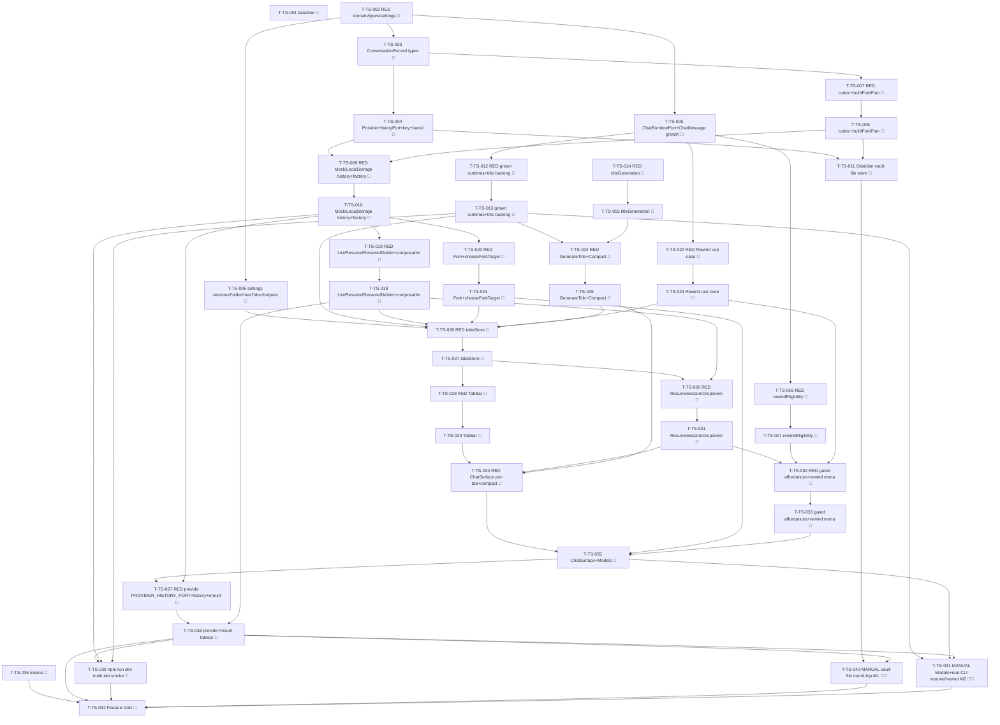

# Tasks — Threads & Sessions (P3)

Each task is ≤ ~½ day, has a stable `T-TS-NNN` id, references ≥ 1 SPEC-TS / TEST-TS / REQ-TS / NFR-TS,
names an owner, lists explicit dependencies, and has a testable Definition of Done. This decomposes
**SPEC-TS-001..034** (34 spec items) on top of the merged P1 chat surface (`chat-core`, TASKS-CC-001)
and the merged P2 rich-render surface (`rich-rendering`, TASKS-RR-001).

> **TDD ordering (mission discipline):** the RED test task for a contract comes **before** the
> implementation task that greens it. RED test tasks are owned by `qa`; implementation tasks by
> `dev`. **Every dev task's first DoD line is "the prior RED test(s) now pass".** This mirrors the
> P2 TASKS-RR-001 style the maintainer accepted.

> **DDD inward layering order (the batch structure):**
> 1. **DOMAIN** — `ProviderHistoryPort` + `HistoryError` + `PROVIDER_HISTORY_PORT` key + barrel;
>    `ConversationRecord`/`ConversationMeta`/`ProviderSessionState`/`ClaudeProviderState`/`ForkPlan`
>    types (+ `CONVERSATION_RECORD_VERSION`); the **three additive `ChatRuntimePort` members** +
>    `RuntimeCapabilities` + the additive `ChatRuntimeQueryOptions.forceColdStart`; the **three
>    additive optional `ChatMessage` rewind fields**; `PluginSettings.sessionsFolder`+`maxTabs` (+
>    `MIN_TABS`/`MAX_TABS_CEILING`/`DEFAULT_SETTINGS`) + the `resolveSessionsFolder`/`clampMaxTabs` helpers.
> 2. **INFRA** — the pure `conversationRecordCodec` (RED→green, covered) + the pure `buildForkPlan`
>    helper; the `ProviderHistoryPort` on the three bridges (Obsidian vault-file store =
>    coverage-excluded → structural + typecheck + manual leg; Mock in-memory `Map` + LocalStorage
>    fixture = covered); the three additive `ChatRuntimePort` members on the bridge runtimes +
>    title-gen cold-start side-query backing; the fake-ports factory's new `providerHistory` member.
> 3. **APPLICATION** — pure `titleGeneration.ts` + `rewindEligibility.ts` (RED→green) then the **eight
>    use cases** (List / Resume / Fork / Rewind / Compact / GenerateTitle / Rename / Delete), each
>    RED→green, `Result`-returning; `chooseForkTarget` pure mapping.
> 4. **UI** — `tabsStore` (RED→green; N `TabState` DTOs + activeTabId + per-`TabId` runner WeakMap +
>    per-tab streaming isolation + min-1/clamp), `useProviderHistoryPort()`, then the components
>    (`TabBar`+badge, `ResumeSessionDropdown`, the gated fork/rewind hover affordances, the rewind
>    menu, per-tab `ChatSurface` + compact) + the two Obsidian `Modal` subclasses (`ForkTargetModal`,
>    `DeleteConfirmModal`) — each Vue component pairs a `data-testid` PageObject (ADR-009).
> 5. **STYLES** — the §4.10 `--sp-*` token block (SPEC-TS-028), runnable anytime before the gate.
> 6. **WIRE-IN** — provide `PROVIDER_HISTORY_PORT` + the per-tab runtime factory in `AgentSidebarView`
>    + `src/ui/main.ts`; mount `TabBar` above `ChatSurface`; `npm run dev` multi-tab smoke.
> 7. **GATE** — final `npm run verify` + `npm run test:all` + the two manual legs (TEST-TS-M1/M2) +
>    a parity self-review note + draft PR into `next`.
> A test for a layer may not depend on a layer further out.

> **Coverage-excluded infra:** the Obsidian `VaultFileHistoryStore` (SPEC-TS-006 production half) and
> the Claude-CLI session/resume seam (SPEC-TS-009 production half) live under
> `src/infrastructure/obsidian/**` (coverage-excluded, §10). Their behavioural gate is the **manual**
> legs TEST-TS-M1 (vault-file round-trip + reload) and TEST-TS-M2 (Obsidian modals + real-CLI
> resume/rewind) — never self-claimed by an agent; recorded for the single final epic-review gate
> (autonomous drive). The **pure codec** (SPEC-TS-010) + **Mock/LocalStorage** stores carry the unit weight.

> **Deleted-symbol guard (ESLint) — NO relaxation needed (verified).** Unlike P2 (which relaxed
> `IconPort`/`SpIcon`/`ICON_PORT`), **none** of the P3 symbols were P0-deleted. `eslint.config.js`
> `DELETED_SUBSYSTEM_BAN` does not list `ProviderHistoryPort`, `ConversationRecord`, `tabsStore`,
> `TabBar`, `ResumeSessionDropdown`, `ForkTargetModal`, `DeleteConfirmModal`, or any tab path; the new
> domain paths (`@/domain/ports/ProviderHistoryPort`, `@/domain/chat/ConversationRecord`) match no ban
> glob (`@/domain/chat` regrew in P1 and is already off the list), and `DELETED_INJECTION_KEYS` does
> **not** contain `PROVIDER_HISTORY_PORT`. So there is **no guard-relax task** in P3. (T-TS-001's DoD
> includes a one-line lint check confirming the new key/port imports resolve clean.)

> **Parity is a review-stage human task:** the P3 per-surface parity-screenshot capture (charter §5 /
> NFR-TS-012) for the seven sub-surfaces (tabs, history, resume, fork, rewind, compact, title-gen) is
> deferred to the single final epic-review human gate, captured at the charter widths + light/dark, not
> in CI. The baseline-capture task (T-TS-001) runs first so a `claudian-main` tabs/history/resume/fork
> reference exists pre-impl.

## Legend

- 🧪 = test task (RED-first; owner `qa`)
- 🔨 = implementation task (owner `dev`)
- 📐 = design / scaffolding / baseline task
- 🚀 = release / ops / gate task
- 🪓 = may slice (touches multiple independent code paths; expect several PRs)
- 👤 = human-owned (never agent-self-claimed)

---

## Task list

### T-TS-001 📐 — Baseline-capture: `claudian-main` P3 tabs/history/resume/fork/rewind/compact reference

- **Description:** Before any P3 implementation, capture the `claudian-main` baseline for the seven P3
  sub-surfaces (numbered square tab badges + border-colour state machine, drop-UP blurred history
  menu, resume row, fork-target modal, two-mode rewind menu, compacted-boundary divider, title-gen
  spin) at the charter widths (320 / 520 / 720 px), light + dark, into a
  `specs/threads-sessions/parity-screenshots.md` skeleton (baseline column only; the Specorator column
  is filled at the final review). Confirm (one lint run) that the new `PROVIDER_HISTORY_PORT` key and
  the `ProviderHistoryPort`/`ConversationRecord` domain paths are **not** caught by the
  `DELETED_SUBSYSTEM_BAN` / `DELETED_INJECTION_KEYS` guard (no relaxation required). No production code.
- **Satisfies:** NFR-TS-012 (baseline leg), NFR-TS-001 (guard verification)
- **Owner:** dev
- **Depends on:** —
- **Estimate:** S
- **Definition of done:**
  - [ ] `specs/threads-sessions/parity-screenshots.md` exists with the per-sub-surface × 320/520/720 ×
        light/dark baseline matrix scaffolded, baseline column captured from `D:\Projects\claudian-main`.
  - [ ] A one-line lint check confirms the deleted-symbol guard does **not** block `PROVIDER_HISTORY_PORT`
        / `ProviderHistoryPort` / `ConversationRecord` (no relaxation task needed); noted in `test-plan.md`.
  - [ ] No file under `src/` changed.

---

## Layer 1 — DOMAIN (SPEC-TS-001..005)

### T-TS-002 🧪 — RED: domain port/types + additive `ChatRuntimePort`/`ChatMessage` growth + settings (structural)

- **Description:** Author the failing structural/type-level + pure-helper tests asserting: (a)
  `ProviderHistoryPort` exposes exactly `providerId` + `listSessions`/`hydrate`/`save`/`updateMeta`/
  `delete`/`resolveSessionId`/`buildForkPlan`, all `Result`-returning; `PROVIDER_HISTORY_PORT` is its
  own `InjectionKey` (no aggregate); the `@/domain/ports` barrel re-exports `ProviderHistoryPort`/
  `HistoryError` + the conversation types (TEST-TS-001); (b) `ConversationRecord`/`ConversationMeta`/
  `ProviderSessionState`/`ClaudeProviderState`/`ForkPlan` field shapes + `CONVERSATION_RECORD_VERSION
  === 1`, and **no credential/secret field is present** (TEST-TS-002); (c) `ChatRuntimePort` gains
  **exactly** `resumeSession`/`setResumeCheckpoint`/`getCapabilities` + `RuntimeCapabilities`
  `{supportsFork,supportsRewind}`, with the **nine P1 members byte-identical** and
  `ChatRuntimeQueryOptions` gaining optional `forceColdStart?: boolean` (TEST-TS-003); (d) `ChatMessage`
  gains optional `userMessageId`/`assistantMessageId`/`resumeAtMessageId`, the six P1 + two P2 fields
  intact, the still-excluded members (`images`/`currentNote`/`isInterrupt`/`isRebuiltContext`/
  `durationFlavorWord`) still absent (TEST-TS-004); (e) `resolveSessionsFolder`/`clampMaxTabs`:
  trim/strip-slash/collapse/empty→default; `0→1`, `99→10`, `NaN→3`, `2.7→2`; `MIN_TABS=1`/
  `MAX_TABS_CEILING=10` (TEST-TS-005). Names TEST-TS-001/002/003/004/005 in metadata.
- **Satisfies:** TEST-TS-001, TEST-TS-002, TEST-TS-003, TEST-TS-004, TEST-TS-005, SPEC-TS-001..005, REQ-TS-005/008/009/028, NFR-TS-013
- **Owner:** qa
- **Depends on:** —
- **Estimate:** M
- **Definition of done:**
  - [ ] `tests/domain/ports/ProviderHistoryPort.test.ts`, `tests/domain/chat/ConversationRecord.test.ts`,
        `tests/domain/ports/ChatRuntimePort.ts.test.ts` (additivity), `tests/domain/chat/ChatMessage.ts.test.ts`
        (additivity), `tests/domain/settings/settingsResolve.test.ts` exist, naming TEST-TS-001..005.
  - [ ] Tests fail (RED) because the new port/types/additive members/settings helpers do not yet exist
        (compile/run failure is the RED signal).

### T-TS-003 🔨 — `ConversationRecord` types + `CONVERSATION_RECORD_VERSION`

- **Description:** Implement per SPEC-TS-002 in `src/domain/chat/ConversationRecord.ts`:
  `CONVERSATION_RECORD_VERSION = 1 as const`, `ConversationRecord{version,meta,messages,providerState}`,
  `ConversationMeta{id,title,titleManual,createdAt,updatedAt,providerId,sessionId}`,
  `ProviderSessionState = Record<string, unknown>`, the documentary `ClaudeProviderState` interface, and
  `ForkPlan{messages,providerState,sourceTitle}`. Pure interfaces only — no `obsidian`, no `node:*`, no
  Vue, no class. **No credential/secret field** (NFR-TS-013).
- **Satisfies:** SPEC-TS-002, REQ-TS-008, REQ-TS-009, REQ-TS-018, NFR-TS-013, NFR-TS-014
- **Owner:** dev
- **Depends on:** T-TS-002
- **Estimate:** S
- **Definition of done:**
  - [ ] The TEST-TS-002 structural test passes (shapes match `SharedAppStorage`/`sdkHistoryTypes`;
        `version:1` constant; no secret field).
  - [ ] `npm run typecheck` + `npm run lint` green; no `obsidian`/`node:*` import in `src/domain/chat/**`.
  - [ ] Implementation-log entry added.

### T-TS-004 🔨 — `ProviderHistoryPort` + `HistoryError` + `PROVIDER_HISTORY_PORT` key + `@/domain/ports` barrel

- **Description:** Implement per SPEC-TS-001: `src/domain/ports/ProviderHistoryPort.ts` (the
  seven-method `Result`-returning interface + the typed `HistoryError{kind:'not-found'|'corrupt'|'io'}`
  `Error` subtype), add `PROVIDER_HISTORY_PORT: InjectionKey<ProviderHistoryPort>` to
  `src/infrastructure/bridge/ports.ts` (alongside the existing keys, **no aggregate** — keep the
  header comment), and re-export `ProviderHistoryPort`/`HistoryError` + the conversation types from
  `src/domain/ports/index.ts`.
- **Satisfies:** SPEC-TS-001, REQ-TS-008, REQ-TS-010, REQ-TS-012, REQ-TS-013, REQ-TS-018, REQ-TS-026, NFR-TS-002, NFR-TS-004
- **Owner:** dev
- **Depends on:** T-TS-002, T-TS-003
- **Estimate:** S
- **Definition of done:**
  - [ ] TEST-TS-001 passes (exact method shapes, all `Result`-returning; own `PROVIDER_HISTORY_PORT` key;
        barrel re-exports both the port + `HistoryError` + the conversation types; no aggregate).
  - [ ] `npm run typecheck` + `npm run lint` green; deleted-symbol guard green (no relaxation needed —
        the new key/port import resolves clean).
  - [ ] Implementation-log entry added.

### T-TS-005 🔨 — Additive `ChatRuntimePort` growth (`resumeSession`/`setResumeCheckpoint`/`getCapabilities` + `RuntimeCapabilities` + `forceColdStart`) + `ChatMessage` rewind fields

- **Description:** Make the **additive-only** domain growth per SPEC-TS-003/004: add
  `RuntimeCapabilities{supportsFork,supportsRewind}` and the three members `resumeSession(sessionId):void`
  / `setResumeCheckpoint(assistantMessageId):void` / `getCapabilities():RuntimeCapabilities` to
  `src/domain/ports/ChatRuntimePort.ts` (the nine P1 members byte-identical, the streaming-error
  boundary unchanged — these three are non-streaming, non-`Result`); add the optional
  `forceColdStart?: boolean` to `ChatRuntimeQueryOptions` (pre-flagged P2+ growth); grow
  `src/domain/chat/ChatMessage.ts` with the three optional `userMessageId?`/`assistantMessageId?`/
  `resumeAtMessageId?` fields (six P1 + two P2 fields unchanged; remaining excluded members documented
  as later-phase). No rename/removal of any P1/P2 member (REQ-TS-028); no migration (load-or-default).
- **Satisfies:** SPEC-TS-003, SPEC-TS-004, REQ-TS-013, REQ-TS-019, REQ-TS-021, REQ-TS-028, NFR-TS-004, NFR-TS-014
- **Owner:** dev
- **Depends on:** T-TS-002
- **Estimate:** S
- **Definition of done:**
  - [ ] TEST-TS-003 + TEST-TS-004 pass (exactly the three runtime members + `RuntimeCapabilities` +
        `forceColdStart`; exactly the three `ChatMessage` fields; nine P1 members + P1/P2 `ChatMessage`
        byte-identical; no rename/removal).
  - [ ] `npm run typecheck` + `npm run lint` green; no `obsidian`/`node:*` import in `src/domain/**`;
        streaming-error boundary unchanged (the three members are non-`Result`).
  - [ ] Implementation-log entry added.

### T-TS-006 🔨 — `PluginSettings.sessionsFolder` + `maxTabs` + `resolveSessionsFolder`/`clampMaxTabs` helpers

- **Description:** Implement per SPEC-TS-005: grow `src/domain/settings/PluginSettings.ts` additively
  with `sessionsFolder: string` (default `'.specorator/sessions'`) + `maxTabs: number` (default `3`),
  update `DEFAULT_SETTINGS`, add `MIN_TABS = 1 as const` + `MAX_TABS_CEILING = 10 as const`, and the
  pure helpers `resolveSessionsFolder(raw)` (trim / strip leading+trailing `/` / collapse internal `//`
  / empty→default; never returns `''`) + `clampMaxTabs(raw)` (`Number.isFinite ? clamp(trunc, MIN,
  CEILING) : default`). Wire both helpers into `src/plugin/settings.ts` on save (a text field for
  `sessionsFolder`, a numeric/slider for `maxTabs`). Device-local persistence (ADR-PSR-002), never
  `data.json`, never holding transcript content (NFR-TS-013).
- **Satisfies:** SPEC-TS-005, REQ-TS-005, REQ-TS-008, NFR-TS-013
- **Owner:** dev
- **Depends on:** T-TS-002
- **Estimate:** S
- **Definition of done:**
  - [ ] TEST-TS-005 passes (`0→1`, `99→10`, `NaN→3`, `2.7→2`; folder trim/strip/empty→default; never `''`).
  - [ ] `npm run typecheck` + `npm run lint` green; settings persist device-local, not `data.json`;
        no `obsidian`/`node:*` import in `src/domain/settings/**`.
  - [ ] Implementation-log entry added.

---

## Layer 2 — INFRA (SPEC-TS-006..010)

### T-TS-007 🧪 — RED: `conversationRecordCodec` + pure `buildForkPlan` helper

- **Description:** Author the failing unit tests for the pure infra core (SPEC-TS-010 + the SPEC-TS-006
  fork-derive logic factored pure): (a) `conversationRecordCodec.serialise` always stamps
  `version:1` + writes `meta`/`messages`/`providerState` and **strips any non-contract field** (a
  secret-bearing input is stripped); `deserialise` round-trips, parses inside try/catch, a corrupt JSON
  or structurally-invalid record (missing `meta.id`, non-array `messages`) → `{ok:false,reason:'corrupt'}`
  **with no throw**, a record with any/missing `version` is **accepted** (load-or-default), a P1-shaped
  `messages[]` (no `contentBlocks`) is valid (EC-RR-13); **no `if (version === 0)` migration branch**
  (TEST-TS-010); (b) the pure `buildForkPlan(record, resumeAtMessageId)` helper truncates `messages`
  **through** the matching id (inclusive) → derived `{forkSource:{sessionId,resumeAt}}` providerState
  (not a copy) + `sourceTitle`; fork at M3 of M1..M5 → M1..M3 + `forkSource{resumeAt:M3}`; **source
  untouched**; fork at the first user message → M1; absent id → an error result (EC-TS-7). Names
  TEST-TS-010 + the U-half of TEST-TS-014.
- **Satisfies:** TEST-TS-010, TEST-TS-014 (codec/fork-derive U leg), SPEC-TS-010, SPEC-TS-006 (pure fork-derive), REQ-TS-008, REQ-TS-018, NFR-TS-013, NFR-TS-014
- **Owner:** qa
- **Depends on:** T-TS-003
- **Estimate:** M
- **Definition of done:**
  - [ ] `tests/infrastructure/history/conversationRecordCodec.test.ts` +
        `tests/infrastructure/history/buildForkPlan.test.ts` exist, naming TEST-TS-010 + the TEST-TS-014
        codec/fork-derive U leg, covering round-trip / corrupt-no-throw / missing-version-accepted /
        secret-stripped / fork-derive / source-unchanged / first-message-fork (EC-TS-7).
  - [ ] Tests fail (RED) — `conversationRecordCodec`/`buildForkPlan` do not yet exist.

### T-TS-008 🔨 — `conversationRecordCodec.ts` + pure `buildForkPlan` helper

- **Description:** Implement per SPEC-TS-010: `src/infrastructure/history/conversationRecordCodec.ts`
  (`serialise(record): string` — `JSON.stringify` with `version:1` stamped + non-contract fields
  stripped; `deserialise(raw): ParseResult` — `{ok:true,record}|{ok:false,reason:'corrupt'}`,
  **pure/total/never-throws**, JSON.parse inside try/catch, any/missing `version` accepted,
  **no migration branch**) and `src/infrastructure/history/buildForkPlan.ts` (the pure derive-not-copy
  helper used by every bridge's `ProviderHistoryPort.buildForkPlan` so the truncate/derive logic is
  unit-tested independent of the vault).
- **Satisfies:** SPEC-TS-010, SPEC-TS-006 (pure fork-derive), REQ-TS-008, REQ-TS-018, NFR-TS-013, NFR-TS-014
- **Owner:** dev
- **Depends on:** T-TS-007
- **Estimate:** M
- **Definition of done:**
  - [ ] TEST-TS-010 + the TEST-TS-014 codec/fork-derive U leg pass (the prior RED tests now pass),
        incl. corrupt-no-throw / missing-version-accepted / secret-stripped / EC-TS-7.
  - [ ] Total/pure: never throws; no migration branch; no `obsidian` import (raw try/catch permitted
        under `src/infrastructure/**` per the Result-discipline allowlist).
  - [ ] `npm run typecheck` + `npm run lint` + `npm run test` green; implementation-log entry added.

### T-TS-009 🧪 — RED: `MockBridge` + `LocalStorageBridge` `ProviderHistoryPort` + fake-ports `providerHistory` member

- **Description:** Author the failing unit tests asserting: (a) `MockBridge.createProviderHistoryPort()`
  returns a `MockHistoryStore` over a `Map<string,ConversationRecord>` implementing the full
  list/hydrate/save/updateMeta/delete/resolveSessionId/buildForkPlan flow with no vault — `listSessions`
  sorts `updatedAt` DESC, empty store → `ok([])`, missing `hydrate` → `err{not-found}`, `delete` of a
  missing id → `ok` (idempotent), `updateMeta` patches **meta only** (never `messages`/`providerState`,
  EC-TS-14), `resolveSessionId` falls back through `forkSource` → `ok(null)` (EC-TS-5); the test helpers
  `seedConversations(records[])`/`getAllConversations()` exist; (b) `LocalStorageBridge` returns a
  fixture-seeded store (two or three canned records with distinct `updatedAt`) whose writes mutate the
  in-memory fixture (non-durable, NFR-TS-002); (c) `tests/__fakes__/fake-ports.ts` exposes a
  `providerHistory` member (a `MockHistoryStore` over a fresh `Map`) with mutations visible across the
  factory's ports. Names the U leg of TEST-TS-011/012 + NFR-TS-002.
- **Satisfies:** TEST-TS-011 (U leg), TEST-TS-012 (store U leg), SPEC-TS-007, SPEC-TS-008, REQ-TS-008, REQ-TS-010, REQ-TS-012, REQ-TS-013, REQ-TS-018, NFR-TS-002
- **Owner:** qa
- **Depends on:** T-TS-004, T-TS-008
- **Estimate:** M
- **Definition of done:**
  - [ ] `tests/infrastructure/mock/MockHistoryStore.test.ts`,
        `tests/infrastructure/localstorage/FixtureHistoryStore.test.ts`, and the extended
        `tests/__fakes__/fake-ports.test.ts` exist, naming the listed TEST-TS ids, covering DESC sort /
        empty→`ok([])` / idempotent delete / meta-only patch (EC-TS-14) / `resolveSessionId`→`ok(null)` (EC-TS-5).
  - [ ] Tests fail (RED) — `createProviderHistoryPort()` on Mock/LocalStorage + the factory member do not yet exist.

### T-TS-010 🔨 — `MockBridge` + `LocalStorageBridge` `ProviderHistoryPort` impls + fake-ports `providerHistory`

- **Description:** Implement per SPEC-TS-007/008: `MockBridge.createProviderHistoryPort()` → a
  `MockHistoryStore` over a `Map` (full flow, DESC sort, idempotent delete, meta-only `updateMeta`,
  `resolveSessionId` fallback, `buildForkPlan` via the pure helper) with `seedConversations`/
  `getAllConversations` helpers; `LocalStorageBridge.createProviderHistoryPort()` → a fixture-seeded
  in-memory store (non-durable writes, NFR-TS-002); add the `providerHistory` member to
  `tests/__fakes__/fake-ports.ts` (mutations visible across ports). No vault, no `node:*`.
- **Satisfies:** SPEC-TS-007, SPEC-TS-008, REQ-TS-008, REQ-TS-010, REQ-TS-012, REQ-TS-013, REQ-TS-018, NFR-TS-002
- **Owner:** dev
- **Depends on:** T-TS-009
- **Estimate:** M
- **Definition of done:**
  - [ ] TEST-TS-011 (U leg) + TEST-TS-012 (store U leg) pass (the prior RED tests now pass), incl.
        EC-TS-5/14; the fake-ports factory's `providerHistory` member works for multi-port tests.
  - [ ] DTO-only; no vault/`node:*`/subprocess; `npm run typecheck` + `npm run lint` + `npm run test`
        green; implementation-log entry added.

### T-TS-011 🔨 — `ObsidianBridge` vault-file `ProviderHistoryPort` (`VaultFileHistoryStore`) 🪓

> The `ObsidianBridge` vault I/O lives under `src/infrastructure/obsidian/**` (coverage-excluded);
> its behavioural gate is the **manual** leg TEST-TS-M1. The folder-path / truncate / fork-derive logic
> is already factored into the pure codec (T-TS-008) + `buildForkPlan` helper (T-TS-008), which carry
> the unit weight. This task is structural + typecheck + the manual-leg backing.

- **Description:** Implement per SPEC-TS-006: `src/infrastructure/obsidian/history/VaultFileHistoryStore.ts`
  implementing `ProviderHistoryPort` (`providerId='claude'`), exposed via
  `ObsidianBridge.createProviderHistoryPort()`. Layout one file per conversation at
  `<resolveSessionsFolder(settings.sessionsFolder)>/<meta.id>.json`: `save` → `createFolder`
  (idempotent) + `writeFile(serialise(record))`; `hydrate` → `readFile` + `deserialise` (missing →
  `err{not-found}`, unparseable → `err{corrupt}` via the codec's discriminated result, never throws);
  `listSessions` → `listFiles` filtered `*.json`, hydrate-or-skip (corrupt skipped + `warn`, never
  aborts — EC-TS-6), sort `updatedAt` DESC; `updateMeta` → hydrate + merge meta only + write (EC-TS-14);
  `delete` → `deleteFile` (idempotent); `resolveSessionId` → `meta.sessionId ?? providerState.forkSource?.sessionId
  ?? null`; `buildForkPlan` → the pure `buildForkPlan` helper (source untouched, EC-TS-7). All vault I/O
  through its own `VaultPort`.
- **Satisfies:** SPEC-TS-006, REQ-TS-008, REQ-TS-010, REQ-TS-012, REQ-TS-013, REQ-TS-018, NFR-TS-002 (manual leg), NFR-TS-014
- **Owner:** dev
- **Depends on:** T-TS-004, T-TS-008
- **Estimate:** M
- **Slice plan:** may slice as (a) the store class + `createProviderHistoryPort()` wiring, then (b) the
  folder-resolve + corrupt-skip listing path.
- **Definition of done:**
  - [ ] `VaultFileHistoryStore` implements `ProviderHistoryPort`; `createProviderHistoryPort()` exposed;
        all I/O via `VaultPort`; the truncate/fork-derive logic delegates to the pure `buildForkPlan` helper.
  - [ ] `npm run typecheck` + `npm run lint` green; the codec never throws across the store boundary
        (corrupt → `err{corrupt}`, missing → `err{not-found}`); the manual leg TEST-TS-M1 is scheduled
        in `test-plan.md`.
  - [ ] Implementation-log entry added.

### T-TS-012 🧪 — RED: grown `ChatRuntimePort` impls (resume/checkpoint/capabilities) + title-gen cold-start backing

- **Description:** Author the failing unit tests asserting: (a) `MockChatRuntime` (+ the LocalStorage
  `FixtureChatRuntime`) report `getCapabilities() → {supportsFork:true,supportsRewind:true}`;
  `resumeSession`/`setResumeCheckpoint` are **recorded no-ops** capturing the last call
  (`getResumedSessionId()`/`getResumeCheckpoint()`) so per-tab wiring asserts without a subprocess; (b)
  a `query(turn, [], {forceColdStart:true})` accumulates scripted `text` chunks + terminates with
  `done` for the title side-query, and `forceColdStart` causes the runtime to **ignore any bound session**
  for that single query (so the side-query does not steer the tab's main stream). Names the runtime U
  leg of TEST-TS-016 (checkpoint) + TEST-TS-020 (cold-start).
- **Satisfies:** TEST-TS-016 (runtime U leg), TEST-TS-020 (cold-start backing), SPEC-TS-009, REQ-TS-013, REQ-TS-019, REQ-TS-021, REQ-TS-024, REQ-TS-027
- **Owner:** qa
- **Depends on:** T-TS-005
- **Estimate:** S
- **Definition of done:**
  - [ ] `tests/infrastructure/mock/MockChatRuntime.ts.test.ts` (grown members) exists, naming the listed
        TEST-TS ids, covering recorded-no-op session ops + scripted cold-start side-query + capabilities.
  - [ ] Tests fail (RED) — the three additive runtime members + the `forceColdStart` cold-start path do
        not yet exist on the Mock/Fixture runtimes.

### T-TS-013 🔨 — Grown `ChatRuntimePort` impls on the bridges + title-gen cold-start side-query backing 🪓

> The `ObsidianBridge` Claude-CLI session/resume seam (`resumeSession`/`setResumeCheckpoint` →
> `ClaudeSessionManager`/`ClaudeRewindService` conversation mode) lives under
> `src/infrastructure/obsidian/**` (coverage-excluded); its behavioural gate is the **manual** leg
> TEST-TS-M2 (real-CLI resume/rewind). The Mock/Fixture half CI-greens TEST-TS-016/020.

- **Description:** Implement per SPEC-TS-009: add the three additive members to each bridge runtime —
  `MockChatRuntime`/`FixtureChatRuntime` = recorded no-op session ops (`getResumedSessionId`/
  `getResumeCheckpoint`) + scripted capabilities `{supportsFork:true,supportsRewind:true}` + a
  scripted cold-start side-query (accumulate `text` → `done`); `ObsidianBridge` (Claude CLI,
  coverage-excluded) maps `resumeSession`/`setResumeCheckpoint` to the CLI session/resume seam and
  `getCapabilities() → {supportsFork:true,supportsRewind:true}`. Honour `forceColdStart` in `query`
  (ignore any bound session for that one query).
- **Satisfies:** SPEC-TS-009, REQ-TS-013, REQ-TS-019, REQ-TS-021, REQ-TS-024, REQ-TS-027, NFR-TS-002
- **Owner:** dev
- **Depends on:** T-TS-012
- **Estimate:** M
- **Slice plan:** may slice as (a) Mock+Fixture recorded-no-op session ops + cold-start (CI-greens the U
  legs), then (b) ObsidianBridge CLI session/resume seam (coverage-excluded, manual leg TEST-TS-M2).
- **Definition of done:**
  - [ ] TEST-TS-016 (runtime U leg) + TEST-TS-020 (cold-start backing) pass; capabilities scripted;
        `forceColdStart` ignores the bound session for that one query.
  - [ ] No `node:*`/subprocess in the Mock/Fixture runtimes; `npm run typecheck` + `npm run lint` +
        `npm run test` green; the real-CLI resume/rewind manual leg TEST-TS-M2 is scheduled in `test-plan.md`.
  - [ ] Implementation-log entry added.

---

## Layer 3 — APPLICATION (SPEC-TS-011..018)

### T-TS-014 🧪 — RED: `titleGeneration.ts` pure transforms

- **Description:** Author the failing unit tests for the pure title functions (SPEC-TS-016):
  `parseTitleGenerationResponse(raw)` — strip surrounding quotes/backticks, collapse whitespace,
  trim to **50 chars**, sentence-case, empty/whitespace → `null`; `fallbackTitle(firstUserMessage)` —
  truncate to the badge width (ellipsis if cut), trimmed, empty message → `'New conversation'`;
  `TITLE_GENERATION_SYSTEM_PROMPT` + `buildTitleGenerationPrompt(firstUserMessage)` exist (ported
  verbatim). Both transforms pure/total. Names TEST-TS-019.
- **Satisfies:** TEST-TS-019, SPEC-TS-016, REQ-TS-024, NFR-TS-005
- **Owner:** qa
- **Depends on:** —
- **Estimate:** S
- **Definition of done:**
  - [ ] `tests/application/threads/titleGeneration.test.ts` exists, naming TEST-TS-019, covering the
        50-char/strip-quotes/sentence-case parse rules + `''→null` + fallback truncate/empty→default.
  - [ ] Tests fail (RED) — `titleGeneration.ts` does not yet exist.

### T-TS-015 🔨 — `titleGeneration.ts` (pure prompt/parse/fallback)

- **Description:** Implement `src/application/threads/titleGeneration.ts` per SPEC-TS-016:
  `TITLE_GENERATION_SYSTEM_PROMPT` + `buildTitleGenerationPrompt` (ported verbatim from
  `core/prompt/titleGeneration.ts`), `parseTitleGenerationResponse` (50-char / strip-quotes /
  sentence-case / `''→null`), `fallbackTitle` (truncate / empty→`'New conversation'`). Pure, total,
  never throws; no `obsidian`/Vue import.
- **Satisfies:** SPEC-TS-016, REQ-TS-024, NFR-TS-005
- **Owner:** dev
- **Depends on:** T-TS-014
- **Estimate:** S
- **Definition of done:**
  - [ ] TEST-TS-019 passes (the prior RED tests now pass).
  - [ ] Total/pure; no side effects; no `obsidian`/Vue import.
  - [ ] `npm run typecheck` + `npm run lint` + `npm run test` green; implementation-log entry added.

### T-TS-016 🧪 — RED: `rewindEligibility.ts` pure scan

- **Description:** Author the failing unit tests for `isRewindEligible(messages, userMessageId)`
  (SPEC-TS-018): locate the user message with `id === userMessageId`, scan **forward** for the next
  `role==='assistant'`, eligible iff that assistant has a non-empty `assistantMessageId`; a user message
  with no following turn-id-bearing assistant → `false` (EC-TS-8); an unknown id → `false`; pure/total.
  Names TEST-TS-021.
- **Satisfies:** TEST-TS-021, SPEC-TS-018, REQ-TS-019, NFR-TS-005
- **Owner:** qa
- **Depends on:** T-TS-005
- **Estimate:** S
- **Definition of done:**
  - [ ] `tests/application/threads/rewindEligibility.test.ts` exists, naming TEST-TS-021, covering
        eligible-when-turn-id-bearing-assistant-follows + not-eligible-otherwise + unknown-id (EC-TS-8).
  - [ ] Tests fail (RED) — `rewindEligibility.ts` does not yet exist.

### T-TS-017 🔨 — `rewindEligibility.ts` (pure scan)

- **Description:** Implement `src/application/threads/rewindEligibility.ts` per SPEC-TS-018: the pure,
  total forward scan (no capability check — that is the UI's runtime concern). No `obsidian`/Vue import.
- **Satisfies:** SPEC-TS-018, REQ-TS-019, NFR-TS-005
- **Owner:** dev
- **Depends on:** T-TS-016
- **Estimate:** S
- **Definition of done:**
  - [ ] TEST-TS-021 passes (the prior RED tests now pass), incl. EC-TS-8 + unknown id.
  - [ ] Total/pure; no side effects; no `obsidian`/Vue import.
  - [ ] `npm run typecheck` + `npm run lint` + `npm run test` green; implementation-log entry added.

### T-TS-018 🧪 — RED: List / Resume / Rename / Delete use cases + `useProviderHistoryPort`

- **Description:** Author the failing unit tests (against the `MockHistoryStore`) for the
  history/resume/rename/delete use cases: `ListConversationsUseCase.execute()` → meta sorted `updatedAt`
  DESC, empty store → `ok([])` (SPEC-TS-011, TEST-TS-011 U leg); `ResumeConversationUseCase.execute(id)`
  → hydrate + `resolveSessionId` → `{conversationId,title,messages,sessionId}`; missing/corrupt record →
  `err`, **no throw** (EC-TS-5/6, SPEC-TS-012, TEST-TS-013 U leg); `RenameConversationUseCase.execute(id,title)`
  → `updateMeta(id,{title,titleManual:true,updatedAt})` patches meta only; `DeleteConversationUseCase.execute(id)`
  → `delete(id)` idempotent on a missing id (SPEC-TS-017, TEST-TS-012 U leg); `useProviderHistoryPort()`
  injects `PROVIDER_HISTORY_PORT` or throws (TEST-TS-011 A leg). Names the U leg of TEST-TS-011/012/013.
- **Satisfies:** TEST-TS-011, TEST-TS-012 (use-case U leg), TEST-TS-013 (U leg), SPEC-TS-011, SPEC-TS-012, SPEC-TS-017, SPEC-TS-021, REQ-TS-010, REQ-TS-011, REQ-TS-012, REQ-TS-013, REQ-TS-014, NFR-TS-004
- **Owner:** qa
- **Depends on:** T-TS-010
- **Estimate:** M
- **Definition of done:**
  - [ ] `tests/application/threads/ListConversationsUseCase.test.ts`,
        `tests/application/threads/ResumeConversationUseCase.test.ts`,
        `tests/application/threads/RenameConversationUseCase.test.ts`,
        `tests/application/threads/DeleteConversationUseCase.test.ts`,
        `tests/ui/composables/useProviderHistoryPort.test.ts` exist, naming the listed TEST-TS ids.
  - [ ] Tests fail (RED) — the four use cases + the composable do not yet exist.

### T-TS-019 🔨 — `ListConversationsUseCase` + `ResumeConversationUseCase` + `RenameConversationUseCase` + `DeleteConversationUseCase` + `useProviderHistoryPort()`

- **Description:** Implement per SPEC-TS-011/012/017/021 under `src/application/threads/`: `List`
  (forwards `history.listSessions()`, empty → `ok([])`), `Resume` (`hydrate` → on err return
  `Result.err` with a UI-safe message, **never throw**; on ok call `resolveSessionId` → `ResumeResult`;
  the runtime bind is the caller's), `Rename` (`updateMeta(id,{title,titleManual:true,updatedAt:Date.now()})`
  — manual-rename precedence, meta only, EC-TS-14), `Delete` (`history.delete(id)` idempotent); each
  returns `Result`. Add `src/ui/composables/useProviderHistoryPort.ts` (inject-or-throw, parity with the
  existing per-port composables; no aggregate). No `obsidian`/`node:*`; **no `if (provider === 'claude')`**.
- **Satisfies:** SPEC-TS-011, SPEC-TS-012, SPEC-TS-017, SPEC-TS-021, REQ-TS-010, REQ-TS-011, REQ-TS-012, REQ-TS-013, REQ-TS-014, NFR-TS-004, NFR-TS-005
- **Owner:** dev
- **Depends on:** T-TS-018
- **Estimate:** M
- **Definition of done:**
  - [ ] TEST-TS-011 + TEST-TS-012 (use-case U leg) + TEST-TS-013 (U leg) pass (the prior RED tests now
        pass), incl. EC-TS-5/6/14 + idempotent delete; the composable injects-or-throws.
  - [ ] Every discrete use case returns `Result`; no throw on a missing/corrupt record; no provider
        branch; no `obsidian`/`node:*` import under `src/application/threads/**` or `src/ui/composables/**`.
  - [ ] `npm run typecheck` + `npm run lint` + `npm run test` green; implementation-log entry added.

### T-TS-020 🧪 — RED: `ForkConversationUseCase` + `chooseForkTarget`

- **Description:** Author the failing unit tests for the fork application surface (SPEC-TS-013 +
  SPEC-TS-023 pure mapping): `ForkConversationUseCase.execute(sourceConversationId, resumeAtMessageId)`
  → `history.buildForkPlan(...)` → `Result<ForkPlan>` (derive-not-copy; source missing/corrupt or id
  absent → `err`; **source never mutated**, EC-TS-7); and the pure `chooseForkTarget` mapping that
  resolves the modal's option to `ForkTarget = 'new-tab' | 'current-tab'`. Names the U leg of TEST-TS-014.
- **Satisfies:** TEST-TS-014 (use-case + `chooseForkTarget` U leg), SPEC-TS-013, REQ-TS-017, REQ-TS-018, NFR-TS-004
- **Owner:** qa
- **Depends on:** T-TS-010
- **Estimate:** S
- **Definition of done:**
  - [ ] `tests/application/threads/ForkConversationUseCase.test.ts` +
        `tests/application/threads/chooseForkTarget.test.ts` exist, naming TEST-TS-014, covering
        derive-not-copy / source-unchanged (EC-TS-7) / id-absent→err / new-vs-current mapping.
  - [ ] Tests fail (RED) — `ForkConversationUseCase`/`chooseForkTarget` do not yet exist.

### T-TS-021 🔨 — `ForkConversationUseCase` + pure `chooseForkTarget`

- **Description:** Implement `src/application/threads/ForkConversationUseCase.ts` per SPEC-TS-013
  (`execute` forwards `history.buildForkPlan`; `Result<ForkPlan>`; pure orchestration, source untouched)
  and the pure `src/application/threads/chooseForkTarget.ts` mapping (`'new-tab'`/`'current-tab'`). No
  `obsidian`/`node:*`; no provider branch.
- **Satisfies:** SPEC-TS-013, REQ-TS-017, REQ-TS-018, NFR-TS-004, NFR-TS-005
- **Owner:** dev
- **Depends on:** T-TS-020
- **Estimate:** S
- **Definition of done:**
  - [ ] TEST-TS-014 (use-case + `chooseForkTarget` U leg) passes (the prior RED tests now pass), incl. EC-TS-7.
  - [ ] `Result`-returning; source record never mutated; no `obsidian`/Vue import; no provider branch.
  - [ ] `npm run typecheck` + `npm run lint` + `npm run test` green; implementation-log entry added.

### T-TS-022 🧪 — RED: `RewindConversationUseCase` (conversation executes / code gated)

- **Description:** Author the failing unit tests for `RewindConversationUseCase.execute({mode,messages,userMessageId})`
  (SPEC-TS-014): `mode==='conversation'` → finds the assistant turn following `userMessageId`, returns
  `{truncatedThrough:userMessageId,checkpointSet:true}` (the store does the truncate + checkpoint);
  `mode==='code-and-conversation'` (NG7, gated) → `Result.ok({truncatedThrough,checkpointSet:false})`
  + a flag the caller surfaces as a non-blocking notice, and **MUST NOT call any `VaultPort`/fs API**
  (asserted: no `VaultPort` call, no fs call, conversation untouched — EC-TS-9); `userMessageId` absent
  → `err`. Names the U leg of TEST-TS-016 + TEST-TS-017.
- **Satisfies:** TEST-TS-016 (use-case U leg), TEST-TS-017 (U leg), SPEC-TS-014, REQ-TS-021, REQ-TS-022, NFR-TS-004
- **Owner:** qa
- **Depends on:** T-TS-005
- **Estimate:** S
- **Definition of done:**
  - [ ] `tests/application/threads/RewindConversationUseCase.test.ts` exists, naming TEST-TS-016/017,
        covering conversation-mode result + code-mode no-fs/no-`VaultPort` + notice flag (EC-TS-9) + absent-id→err.
  - [ ] Tests fail (RED) — `RewindConversationUseCase` does not yet exist.

### T-TS-023 🔨 — `RewindConversationUseCase` (conversation executes / code-and-conversation gated)

- **Description:** Implement `src/application/threads/RewindConversationUseCase.ts` per SPEC-TS-014:
  pure orchestration returning `Result<RewindResult>` (`{truncatedThrough,checkpointSet}`);
  conversation mode reports the assistant turn id for the store to truncate + checkpoint;
  code-and-conversation mode performs **no fs/git change** (no `VaultPort` call) and signals the caller
  to show a non-blocking `NotificationPort.showInfo` (NG7, EC-TS-9). No `obsidian`/`node:*`; no provider branch.
- **Satisfies:** SPEC-TS-014, REQ-TS-021, REQ-TS-022, NFR-TS-004, NFR-TS-005
- **Owner:** dev
- **Depends on:** T-TS-022
- **Estimate:** S
- **Definition of done:**
  - [ ] TEST-TS-016 (use-case U leg) + TEST-TS-017 (U leg) pass (the prior RED tests now pass), incl. EC-TS-9.
  - [ ] `Result`-returning; code-mode makes **no** `VaultPort`/fs call; conversation untouched; no
        `obsidian`/Vue import.
  - [ ] `npm run typecheck` + `npm run lint` + `npm run test` green; implementation-log entry added.

### T-TS-024 🧪 — RED: `GenerateTitleUseCase` + `CompactConversationUseCase`

- **Description:** Author the failing unit tests (against a `MockChatRuntime`): `GenerateTitleUseCase.execute(firstUserMessage)`
  (SPEC-TS-016) → builds the one-shot prepared turn, drives `query(turn,[],{forceColdStart:true})`
  accumulating `text` (ignoring tool/thinking), `done` terminates; parsed title → `Result.ok(title)`;
  `null`/parse-fail or an `{type:'error'}` chunk → `Result.err`, **never `NotificationPort.showError`**
  (REQ-TS-025, EC-TS-11); cold-start does not steer the main stream (TEST-TS-020).
  `CompactConversationUseCase.execute()` (SPEC-TS-015) → requests a `{isCompact:true}` prepared turn; a
  `{type:'context_compacted'}` chunk routes through the **existing** `dispatchChunk` → `onContextCompacted`
  sink leg → the P2 `ContextCompactedBlock` (**no new render machinery**, TEST-TS-018). Names the U leg
  of TEST-TS-020 + TEST-TS-018.
- **Satisfies:** TEST-TS-020 (use-case U leg), TEST-TS-018 (U leg), SPEC-TS-015, SPEC-TS-016, REQ-TS-023, REQ-TS-024, REQ-TS-025, NFR-TS-004
- **Owner:** qa
- **Depends on:** T-TS-013, T-TS-015
- **Estimate:** M
- **Definition of done:**
  - [ ] `tests/application/threads/GenerateTitleUseCase.test.ts` +
        `tests/application/threads/CompactConversationUseCase.test.ts` exist, naming TEST-TS-020/018,
        covering ok→title / error-chunk→err-no-`showError` (EC-TS-11) / cold-start-no-steer / compact reuses the P2 leg.
  - [ ] Tests fail (RED) — `GenerateTitleUseCase`/`CompactConversationUseCase` do not yet exist.

### T-TS-025 🔨 — `GenerateTitleUseCase` + `CompactConversationUseCase`

- **Description:** Implement per SPEC-TS-016/015 under `src/application/threads/`: `GenerateTitleUseCase`
  (one-shot cold-start side-query via `query(turn,[],{forceColdStart:true})` or a fresh
  `createChatRuntime()`; accumulate `text`; `parseTitleGenerationResponse` → `Result<string>`; error
  chunk → `err`, **no `showError`**; per-conversation abort) and `CompactConversationUseCase` (requests a
  `{isCompact:true}` turn; reuses the **existing** `RunChatTurnUseCase.dispatchChunk` →
  `onContextCompacted` sink leg + the P2 `ContextCompactedBlock` — **no new machinery**). `Result`-returning;
  preserve the error-as-chunk → `Result` mapping at this boundary (ADR-CC-001 §2). No provider branch.
- **Satisfies:** SPEC-TS-015, SPEC-TS-016, REQ-TS-023, REQ-TS-024, REQ-TS-025, NFR-TS-004, NFR-TS-005
- **Owner:** dev
- **Depends on:** T-TS-024
- **Estimate:** M
- **Definition of done:**
  - [ ] TEST-TS-020 (use-case U leg) + TEST-TS-018 (U leg) pass (the prior RED tests now pass), incl.
        EC-TS-11 + compact-reuses-P2-leg.
  - [ ] `GenerateTitleUseCase` never surfaces `showError`; compact adds **no** new render machinery;
        `Result`-returning; no `obsidian`/Vue import; no provider branch.
  - [ ] `npm run typecheck` + `npm run lint` + `npm run test` green; implementation-log entry added.

---

## Layer 4 — UI (SPEC-TS-019..027)

### T-TS-026 🧪 — RED: `tabsStore` (N tabs, per-tab isolation, runner WeakMap, min1/clamp, DTO-only)

- **Description:** Author the failing unit tests for the `tabsStore` (SPEC-TS-019): `openTab()` appends a
  fresh `empty` `TabState`, binds a new runner, activates it; **no-op + `showInfo`** at
  `clampMaxTabs(settings.maxTabs)` (EC-TS-1); `switchTab(id)` activates + clears that tab's
  `needsAttention`, other tabs untouched (REQ-TS-002); `closeTab(id)` removes + disposes the runner +
  activates an adjacent tab (prev, or next-for-first), **close last → exactly one fresh `empty` tab**
  (EC-TS-2); `loadIntoTab(target,payload)` sets messages/title/conversationId/sessionId + binds the
  runtime (resume calls `resumeSession`); `truncateTo(tabId,userMessageId)` removes later messages
  (rewind, REQ-TS-021); `markAttention` sets `needsAttention` only on a non-active tab (REQ-TS-007);
  **per-tab streaming isolation** — a sink-leg chunk for tab B mutates only B while A is active+idle
  (EC-TS-3/13); the title ladder (fallback→pending→ai/manual-wins) drives `titleStatus`/`title`
  (EC-TS-10/11); **DTO-only** + the runner/notifier/logger live OUTSIDE reactive state (no reactive
  use-case instance) + `$reset` cancels all tabs (TEST-TS-022). Names TEST-TS-006/007/008/022 + the U
  parts of 016/025. (Store-level, no mount.)
- **Satisfies:** TEST-TS-006, TEST-TS-007 (U leg), TEST-TS-008 (U store leg), TEST-TS-016 (truncate), TEST-TS-022, TEST-TS-025 (ladder U leg), SPEC-TS-019, SPEC-TS-030, SPEC-TS-031, REQ-TS-001..007, NFR-TS-003
- **Owner:** qa
- **Depends on:** T-TS-006, T-TS-013, T-TS-019, T-TS-021, T-TS-023, T-TS-025
- **Estimate:** M
- **Definition of done:**
  - [ ] `tests/ui/stores/tabsStore.test.ts` exists, naming the listed TEST-TS ids, covering open/switch/
        close/min1/ceiling/loadIntoTab/truncateTo/markAttention/per-tab-isolation/title-ladder/DTO-only/$reset.
  - [ ] Tests fail (RED) — the `tabsStore` does not yet exist.

### T-TS-027 🔨 — `tabsStore` (N `TabState` DTOs + per-`TabId` runner WeakMap + isolation + persist/title legs)

- **Description:** Implement `src/ui/stores/tabsStore.ts` per SPEC-TS-019: reactive `{tabs:TabState[],
  activeTabId}` (DTO-only, ADR-003) with per-`TabId` `TabDeps` (bound `ChatTurnRunner` built from that
  tab's **own** `createChatRuntime()` instance + `StartFailureNotifier` + `LoggerPort`) held in a
  `Map`/`WeakMap` **outside** reactive state; the actions `openTab` (clamp `clampMaxTabs`, EC-TS-1) /
  `switchTab` (clear attention) / `closeTab` (dispose runner, adjacent activate, min-one EC-TS-2) /
  `sendMessage` (active tab; on first-turn done → persist SPEC-TS-030 + title ladder SPEC-TS-031) /
  `loadIntoTab` / `truncateTo` / `markAttention` / `$reset`; the P1/P2 sink legs resolve the live message
  through the **owning tab's** `TabState` (per-tab isolation, EC-TS-3/13); the persist-on-turn-done flow
  (active tab → `ConversationRecord` → `history.save`, SPEC-TS-030) + the title ladder orchestration
  (fallback immediate → `GenerateTitleUseCase` async → manual-wins, abort on rename/delete/close,
  SPEC-TS-031, EC-TS-10/11). `isEmpty`/`isStreaming`/`activeTab` getters read the active tab. One runtime
  per tab → streaming isolated by construction. Never imports `obsidian`.
- **Satisfies:** SPEC-TS-019, SPEC-TS-030, SPEC-TS-031, REQ-TS-001, REQ-TS-002, REQ-TS-003, REQ-TS-004, REQ-TS-005, REQ-TS-006, REQ-TS-007, REQ-TS-008, REQ-TS-011, REQ-TS-024, REQ-TS-025, NFR-TS-003, NFR-TS-005
- **Owner:** dev
- **Depends on:** T-TS-026
- **Estimate:** M
- **Definition of done:**
  - [ ] TEST-TS-006/007 (U leg)/008 (U store leg)/016 (truncate)/022/025 (ladder U leg) pass (the prior
        RED tests now pass), incl. EC-TS-1/2/3/10/11/13.
  - [ ] DTOs only across the store boundary; the runner/notifier/logger live OUTSIDE reactive state (no
        reactive use-case instance — asserted); one runtime per tab; `$reset` cancels all tabs; no
        `obsidian`/`node:*` import.
  - [ ] `npm run typecheck` + `npm run lint` + `npm run test` green; implementation-log entry added.

### T-TS-028 🧪 — RED: `TabBar.vue` + tab badge (PageObject)

- **Description:** Author the failing component test + `TabBar.po.ts` (data-testid only):
  `data-testid="tab-bar"` `role="tablist"`; each `data-testid="tab-badge"` `role="tab"` `aria-selected`
  carries its **1-based number** as visible text (the non-colour cue); `data-testid="tab-new"` →
  `openTab`, per-badge `data-testid="tab-close"` → `closeTab`; **roving tabindex** (active `0`, rest
  `-1`; Arrow Left/Right move focus + activate; Home/End jump to first/last); the **badge state
  machine** — active→`--sp-tab-border-active`, streaming (incl. background non-active)→
  `--sp-tab-border-streaming`, non-active `needsAttention`→`--sp-tab-border-attention`, else idle;
  open/switch/close/min-one/ceiling-notice exercised; transitions honour `prefers-reduced-motion`. Names
  TEST-TS-006/008/009 (A leg) + TEST-TS-026 (number cue / state classes).
- **Satisfies:** TEST-TS-006 (A leg), TEST-TS-008 (A leg), TEST-TS-009, SPEC-TS-020, REQ-TS-001..007, NFR-TS-009, NFR-TS-010
- **Owner:** qa
- **Depends on:** T-TS-027
- **Estimate:** M
- **Definition of done:**
  - [ ] `tests/ui/chat/TabBar.test.ts` + `TabBar.po.ts` exist, naming TEST-TS-006/008/009, data-testid
        only; roving-tabindex Arrow/Home/End + badge state classes + number cue + reduced-motion asserted.
  - [ ] Tests fail (RED) — `TabBar.vue` does not yet exist.

### T-TS-029 🔨 — `TabBar.vue` + tab badge

- **Description:** Implement `src/ui/chat/TabBar.vue` per SPEC-TS-020: the strip of numbered square
  badges (`role="tablist"`/`role="tab"`/`aria-selected`, 1-based number visible text), the new-tab +
  per-badge close controls, roving tabindex (Arrow Left/Right activate, Home/End), and the border-colour
  state machine via the `--sp-tab-border-*` tokens (streaming inherits the provider brand via the root's
  `[data-provider]`); reduced-motion honoured (NFR-TS-010). `<script setup>`; numbers as `{{ }}` text;
  **no `v-html`**; no `obsidian` import.
- **Satisfies:** SPEC-TS-020, REQ-TS-001, REQ-TS-002, REQ-TS-003, REQ-TS-004, REQ-TS-005, REQ-TS-006, REQ-TS-007, NFR-TS-008, NFR-TS-009, NFR-TS-010
- **Owner:** dev
- **Depends on:** T-TS-028
- **Estimate:** M
- **Definition of done:**
  - [ ] TEST-TS-006 (A leg)/008 (A leg)/009 pass (the prior RED tests now pass).
  - [ ] **No `v-html`/`innerHTML`** (NFR-TS-006, lint-verified); **no `window.confirm`/`alert`/`prompt`**
        (NFR-TS-007); `<script setup>`; no `obsidian` import; border colour via `--sp-tab-border-*` tokens only.
  - [ ] `npm run typecheck` + `npm run lint` + `npm run test` green; implementation-log entry added.

### T-TS-030 🧪 — RED: `ResumeSessionDropdown.vue` (PageObject) 🪓

- **Description:** Author the failing component test + `ResumeSessionDropdown.po.ts` (data-testid only):
  opener `data-testid="history-open"`; open `data-testid="history-list"` `role="listbox"` with
  `aria-activedescendant`; each `data-testid="history-row"` `role="option"` shows **title + relative
  date**, ordered newest-`updatedAt` first; empty → `data-testid="history-empty"`; selecting a row →
  resume (transcript via the **P2 block path, collapsed by default**); inline rename
  `data-testid="history-rename"` → `RenameConversationUseCase` (`titleManual:true`); delete
  `data-testid="history-delete"` opens a **`DeleteConfirmModal`** (Obsidian `Modal`, **never
  `window.confirm`**); `titleStatus==='pending'` → `data-testid="history-spinner"` spin (reduced-motion
  honoured), `failed` silently keeps fallback; keyboard Arrow Up/Down move selection, **Enter** resumes,
  **Escape** closes no-selection + focus returns to opener. Names TEST-TS-011 (A leg)/013 (A leg)/015/025 (A leg).
- **Satisfies:** TEST-TS-011 (A leg), TEST-TS-013 (A leg), TEST-TS-015, TEST-TS-025 (A leg), SPEC-TS-022, REQ-TS-010, REQ-TS-011, REQ-TS-012, REQ-TS-013, REQ-TS-014, REQ-TS-015, REQ-TS-025, NFR-TS-006, NFR-TS-009
- **Owner:** qa
- **Depends on:** T-TS-027, T-TS-019
- **Estimate:** M
- **Definition of done:**
  - [ ] `tests/ui/chat/ResumeSessionDropdown.test.ts` + `ResumeSessionDropdown.po.ts` exist, naming
        TEST-TS-011/013/015/025, data-testid only; list order / empty line / rename / delete-via-modal /
        spin / Arrow/Enter/Escape / focus return asserted.
  - [ ] Tests fail (RED) — `ResumeSessionDropdown.vue` does not yet exist.

### T-TS-031 🔨 — `ResumeSessionDropdown.vue`

- **Description:** Implement `src/ui/chat/ResumeSessionDropdown.vue` per SPEC-TS-022: the drop-UP blurred
  history listbox (title + relative date rows, newest-first, empty line), resume via
  `ResumeConversationUseCase` → `tabsStore.loadIntoTab` (P2 block path, collapsed by default), inline
  rename via `RenameConversationUseCase`, delete via the `DeleteConfirmModal` (Obsidian `Modal`, **never
  `window.confirm`**) → `DeleteConversationUseCase`, the `pending` spin / `failed`-keeps-fallback status,
  and the Arrow/Enter/Escape keyboard nav + focus-return. `<script setup>`; titles/dates as `{{ }}` text;
  **no `v-html`**; no `obsidian` import (the modal is invoked through a plugin-provided handle / event).
- **Satisfies:** SPEC-TS-022, REQ-TS-010, REQ-TS-011, REQ-TS-012, REQ-TS-013, REQ-TS-014, REQ-TS-015, REQ-TS-025, NFR-TS-006, NFR-TS-008, NFR-TS-009
- **Owner:** dev
- **Depends on:** T-TS-030
- **Estimate:** M
- **Definition of done:**
  - [ ] TEST-TS-011 (A leg)/013 (A leg)/015/025 (A leg) pass (the prior RED tests now pass).
  - [ ] **No `v-html`/`innerHTML`** (NFR-TS-006, lint-verified); delete uses the Obsidian `Modal`, **no
        `window.confirm`/`alert`/`prompt`** (NFR-TS-007); `<script setup>`; no `obsidian` import; spin via
        the P2 keyframe (reduced-motion zeroed).
  - [ ] `npm run typecheck` + `npm run lint` + `npm run test` green; implementation-log entry added.

### T-TS-032 🧪 — RED: gated fork/rewind hover affordances + rewind menu (`MessageTurn` extension, PageObject)

- **Description:** Author the failing component test + extended `MessageTurn.po.ts` (data-testid only)
  per SPEC-TS-025/024: each **user** message's hover toolbar gains `data-testid="msg-fork"` (`git-fork`)
  shown **iff** `runtime.getCapabilities().supportsFork` (absent when false, EC-TS-15) and
  `data-testid="msg-rewind"` (`rotate-ccw`) shown **iff** `isRewindEligible(messages,userMessageId)`
  **and** `supportsRewind` (absent otherwise, EC-TS-8/15) — both gates read **through the runtime port**,
  never a provider branch; activating rewind opens the two-mode menu with **exactly two** distinctly-iconed
  options `data-testid="rewind-conversation"` (`message-square`) + `data-testid="rewind-code"`
  (`rotate-ccw`); conversation-only → `tabsStore.truncateTo` + `runtime.setResumeCheckpoint` (REQ-TS-021);
  code-and-conversation → **no fs/git** + a non-blocking notice (REQ-TS-022, EC-TS-9). Names TEST-TS-017
  (A leg) + TEST-TS-023.
- **Satisfies:** TEST-TS-017 (A leg), TEST-TS-023, SPEC-TS-024, SPEC-TS-025, REQ-TS-016, REQ-TS-019, REQ-TS-020, REQ-TS-021, REQ-TS-022, NFR-TS-006
- **Owner:** qa
- **Depends on:** T-TS-031, T-TS-017, T-TS-023
- **Estimate:** M
- **Definition of done:**
  - [ ] `tests/ui/chat/MessageTurn.ts.test.ts` (the P3 affordance extension) + the extended
        `MessageTurn.po.ts` exist, naming TEST-TS-017/023, data-testid only; fork shown iff `supportsFork`,
        rewind shown iff eligible **and** `supportsRewind`, two-mode menu + code-mode notice asserted.
  - [ ] Tests fail (RED) — the gated affordances + the rewind menu do not yet exist.

### T-TS-033 🔨 — gated fork/rewind hover affordances + rewind menu (`MessageTurn.vue` extension)

- **Description:** Extend `src/ui/chat/MessageTurn.vue` per SPEC-TS-025/024: add the two
  capability/eligibility-gated user-message hover controls (fork shown iff `supportsFork`; rewind shown
  iff `isRewindEligible(...)` **and** `supportsRewind` — both read through the runtime port, REQ-TS-026)
  and the two-mode rewind menu (Obsidian `Menu` or in-surface popover — if blocking, an Obsidian
  construct, **never `window.*`**): conversation-only → `RewindConversationUseCase('conversation')` →
  `tabsStore.truncateTo` + `runtime.setResumeCheckpoint`; code-and-conversation →
  `RewindConversationUseCase('code-and-conversation')` → **no fs/git** + `NotificationPort.showInfo`.
  Fork activation carries the message id as `resumeAtMessageId` and opens the `ForkTargetModal`
  (T-TS-035). `<script setup>`; **no `v-html`**; no `obsidian` import in the `.vue` (menu/modal invoked
  through plugin-provided handles).
- **Satisfies:** SPEC-TS-024, SPEC-TS-025, REQ-TS-016, REQ-TS-019, REQ-TS-020, REQ-TS-021, REQ-TS-022, REQ-TS-026, NFR-TS-006, NFR-TS-007, NFR-TS-008
- **Owner:** dev
- **Depends on:** T-TS-032
- **Estimate:** M
- **Definition of done:**
  - [ ] TEST-TS-017 (A leg) + TEST-TS-023 pass (the prior RED tests now pass), incl. EC-TS-8/9/15.
  - [ ] Both gates read through the runtime port (no provider branch); **no `v-html`/`innerHTML`**
        (NFR-TS-006); the menu is an Obsidian construct / non-blocking — **no `window.confirm`/`alert`/`prompt`**
        (NFR-TS-007); `<script setup>`; no `obsidian` import in the `.vue`.
  - [ ] `npm run typecheck` + `npm run lint` + `npm run test` green; implementation-log entry added.

### T-TS-034 🧪 — RED: `ChatSurface.vue` per-tab binding + compact (PageObject)

- **Description:** Author the failing component test + extended `ChatSurface.po.ts` (data-testid only)
  per SPEC-TS-026: `ChatSurface` is driven by `tabsStore.activeTab` (renders the active `TabState`,
  not a single `chatStore` root); it composes **`TabBar` above** the message region; the welcome/
  message/busy/usage/composer layout reads the active tab; a `data-testid="chat-compact"` action →
  `CompactConversationUseCase` (SPEC-TS-015); `onBeforeUnmount` → `tabsStore.$reset()` (EC-15); the root
  keeps `data-provider="claude"`. Names TEST-TS-024 + the A leg of TEST-TS-018 + TEST-TS-007 (switch-view A leg).
- **Satisfies:** TEST-TS-024, TEST-TS-018 (A leg), TEST-TS-007 (A view leg), SPEC-TS-026, REQ-TS-006, REQ-TS-023, NFR-TS-006
- **Owner:** qa
- **Depends on:** T-TS-029, T-TS-031, T-TS-025
- **Estimate:** M
- **Definition of done:**
  - [ ] `tests/ui/chat/ChatSurface.ts.test.ts` (the P3 per-tab extension) + the extended `ChatSurface.po.ts`
        exist, naming TEST-TS-024/018/007, data-testid only; per-tab view + `TabBar` mount + compact dispatch
        + `$reset`-on-unmount asserted.
  - [ ] Tests fail (RED) — the per-tab `ChatSurface` binding + compact action do not yet exist.

### T-TS-035 🔨 — `ChatSurface.vue` per-tab binding + compact action + `ForkTargetModal` + `DeleteConfirmModal` (Obsidian `Modal` subclasses) 🪓

> The two `Modal` subclasses import `obsidian`, so they live with the view (`src/plugin/` /
> a non-`src/ui/**` `modals/` folder), **not** under `src/ui/**`. Their pure option-resolution logic is
> already unit-tested (`chooseForkTarget`, T-TS-021); their visual render + `Promise` resolution is
> proven on the **manual** leg TEST-TS-M2. They MUST be Obsidian `Modal` subclasses — **never
> `window.confirm`/`prompt`/`alert`** (NFR-TS-007) — DOM built with `createEl`/`createDiv`/`setText`,
> **no `innerHTML`** (NFR-TS-006).

- **Description:** Implement per SPEC-TS-026/023/024: extend `src/ui/chat/ChatSurface.vue` to read
  `tabsStore.activeTab`, mount `TabBar` above the message region, add the `data-testid="chat-compact"`
  action → `CompactConversationUseCase`, and `$reset` on unmount; and add the two Obsidian `Modal`
  subclasses in `src/plugin/` (or a non-`src/ui/**` `modals/`): `ForkTargetModal` (options "New tab"
  `data-testid="fork-target-new"` default + "Current tab" `data-testid="fork-target-current"`; resolves
  `Promise<ForkTarget | null>`; `≤--sp-fork-modal-max-inline` width) and `DeleteConfirmModal` (resolves
  `Promise<boolean>`). The caller runs `ForkConversationUseCase` → `tabsStore.openTab`-with-plan (new) or
  `loadIntoTab(current)` (current). `<script setup>` for the `.vue`; **no `v-html`**; modals use
  `createEl`/`setText` only.
- **Satisfies:** SPEC-TS-015, SPEC-TS-023, SPEC-TS-024, SPEC-TS-026, REQ-TS-006, REQ-TS-012, REQ-TS-017, REQ-TS-023, NFR-TS-006, NFR-TS-007, NFR-TS-008
- **Owner:** dev
- **Depends on:** T-TS-034, T-TS-021, T-TS-033
- **Estimate:** M
- **Slice plan:** may slice as (a) the `ChatSurface` per-tab binding + compact + `TabBar` mount
  (CI-greens TEST-TS-024/018/007), then (b) the two `Modal` subclasses (visual proof = manual leg TEST-TS-M2).
- **Definition of done:**
  - [ ] TEST-TS-024 + TEST-TS-018 (A leg) + TEST-TS-007 (A view leg) pass (the prior RED tests now pass).
  - [ ] `ForkTargetModal`/`DeleteConfirmModal` are Obsidian `Modal` subclasses resolving a `Promise`,
        **never `window.confirm`/`prompt`/`alert`** (NFR-TS-007); DOM via `createEl`/`createDiv`/`setText`,
        **no `innerHTML`/`v-html`** (NFR-TS-006); the `.vue` is `<script setup>` with no `obsidian` import.
  - [ ] `npm run typecheck` + `npm run lint` + `npm run test` green; the modal/real-CLI manual leg
        TEST-TS-M2 is scheduled in `test-plan.md`; implementation-log entry added.

---

## Layer 5 — STYLES (SPEC-TS-028) + the no-`v-html`/Obsidian-`Modal` invariant (SPEC-TS-029)

### T-TS-036 🔨 — `--sp-*` token additions (§4.10, token layer only)

> No dependencies on the components — runnable anytime before the gate (parallel with the domain RED).

- **Description:** Add the `§4.10 — Threads & sessions (P3)` block to `src/ui/styles/tokens.css` per
  SPEC-TS-028: the tab-badge tokens (`--sp-tab-size`, `--sp-tab-border-idle/active/streaming/attention`),
  the history-row tokens (`--sp-history-row-h`, `--sp-history-delete`), the drop-UP blur
  (`--sp-history-blur`), the fork-modal width (`--sp-fork-modal-max-inline`), the `[data-provider='claude']`
  streaming-border brand override, and the `prefers-reduced-motion` guard zeroing
  `--sp-history-spin-duration` (reusing the existing P2 spin keyframe — **no new keyframe**). Colour
  literals confined to the token layer — **no** P3 component carries a hex / raw Obsidian var (NFR-TS-012).
- **Satisfies:** SPEC-TS-028, SPEC-TS-029, NFR-TS-010, NFR-TS-012
- **Owner:** dev
- **Depends on:** —
- **Estimate:** S
- **Definition of done:**
  - [x] The §4.10 tokens exist in `tokens.css`; the reduced-motion guard zeroes `--sp-history-spin-duration`;
        the streaming border inherits the provider brand via `[data-provider]`. (`6485a17`)
  - [x] The `lint-style-tokens` guard passes with zero leaks; no P3 component file contains a hex/raw-var
        colour; `npm run lint` green.
  - [x] Implementation-log entry added.

---

## Layer 6 — WIRE-IN (SPEC-TS-027 provide + mount + smoke)

### T-TS-037 🧪 — RED: `PROVIDER_HISTORY_PORT` + per-tab runtime factory provided in the sidebar + standalone mount

- **Description:** Author the failing component/integration test asserting `PROVIDER_HISTORY_PORT` is
  provided (from `bridge.createProviderHistoryPort()`) alongside the existing chat ports in **both**
  `AgentSidebarView` and `src/ui/main.ts`, and that the per-tab runtime factory handle (a thin
  `RuntimeFactory` token wrapping `bridge.createChatRuntime`, or the bridge factory the `tabsStore`
  calls per `openTab`) is provided so the store builds **one runtime per tab** (no single global
  `CHAT_RUNTIME_PORT` consumed by one surface); `TabBar` mounts above `ChatSurface`. Exactly **one**
  `ProviderHistoryPort` impl is wired (Claude). Extends the P1/P2 mount test. Names the standalone-path
  leg of TEST-TS-006/013/026.
- **Satisfies:** TEST-TS-006 (mount leg), TEST-TS-013 (mount leg), TEST-TS-026 (one-impl wired), SPEC-TS-027, REQ-TS-008, REQ-TS-013, REQ-TS-027, NFR-TS-001
- **Owner:** qa
- **Depends on:** T-TS-035, T-TS-010
- **Estimate:** S
- **Definition of done:**
  - [ ] `tests/ui/chat/mount.ts.test.ts` (or the extended P1/P2 mount test) exists, asserting
        `PROVIDER_HISTORY_PORT` provision + the per-tab runtime factory + `TabBar`-above-`ChatSurface`;
        data-testid only.
  - [ ] Test fails (RED) — `PROVIDER_HISTORY_PORT` + the per-tab runtime factory are not yet provided.

### T-TS-038 🔨 — Provide `PROVIDER_HISTORY_PORT` + per-tab runtime factory in `AgentSidebarView` + `src/ui/main.ts`; mount `TabBar` 🪓

- **Description:** Per SPEC-TS-027: in `src/plugin/AgentSidebarView.ts` and `src/ui/main.ts` call
  `app.provide(PROVIDER_HISTORY_PORT, bridge.createProviderHistoryPort())` alongside the existing ports,
  and provide the per-tab runtime factory handle (the thin `RuntimeFactory` token wrapping
  `bridge.createChatRuntime`, or have the `tabsStore` inject the bridge factory — pick the smallest
  wiring; the contract is "one runtime per tab", ADR-TS-002 §1) so the view/standalone entry no longer
  provides a single `CHAT_RUNTIME_PORT` consumed by one surface; mount `TabBar` above `ChatSurface`'s
  region. Exactly **one** `ProviderHistoryPort` impl is wired (Claude, REQ-TS-027). No router reintroduced
  (ADR-TS-002 §2). With the Mock store + Mock runtime already landed, `npm run dev` now drives multi-tab
  + history headlessly.
- **Satisfies:** SPEC-TS-027, REQ-TS-008, REQ-TS-013, REQ-TS-027, NFR-TS-001, NFR-TS-002
- **Owner:** dev
- **Depends on:** T-TS-037, T-TS-019
- **Estimate:** S
- **Slice plan:** may slice as (a) `AgentSidebarView` provision + `TabBar` mount, (b) `src/ui/main.ts` standalone.
- **Definition of done:**
  - [ ] T-TS-037 passes; `PROVIDER_HISTORY_PORT` + the per-tab runtime factory provided in both entry
        points; `TabBar` mounts above `ChatSurface`; exactly one `ProviderHistoryPort` impl wired (Claude).
  - [ ] `npm run typecheck` + `npm run lint` + `npm run test` green; no `obsidian`/`node:*` leak under
        `src/ui/**`; no router reintroduced.
  - [ ] Implementation-log entry added.

### T-TS-039 🧪 — `npm run dev` standalone multi-tab + history smoke (TEST-TS-026 dev leg)

- **Description:** Run `npm run dev` and confirm the chat surface mounts against `MockBridge`, opens
  multiple tabs, switches between them with per-tab streaming isolation, persists a completed turn to the
  Mock store, lists + resumes it from the history dropdown, forks into a new tab, and rewinds a
  conversation — the standalone smoke leg of TEST-TS-026. Manual-assisted: the build is automatable but
  the multi-tab visual feel is human-observed; record the result in `test-plan.md`.
- **Satisfies:** TEST-TS-026 (dev leg), NFR-TS-002
- **Owner:** qa
- **Depends on:** T-TS-038, T-TS-010, T-TS-013
- **Estimate:** S
- **Definition of done:**
  - [x] `npm run dev` boots; multi-tab open/switch/close + persist/resume/fork/rewind exercised against
        `MockBridge`. (Deterministic leg automated as `tests/ui/main.ts.test.ts` — `519a2cc`, green:
        mount + open second tab + switch swaps the active conversation + active tab renders the P1/P2
        surface. The live-browser feel pairs with the human run.)
  - [ ] Result recorded in `test-plan.md` (TEST-TS-026 dev leg pass/fail + date). _(qa-owned: deterministic
        leg green; `test-plan.md` not yet authored.)_

---

## Layer 7 — GATE (manual legs + feature DoD)

### T-TS-040 🚀👤 — MANUAL: Obsidian vault-file store round-trip + reload (TEST-TS-M1) — human-run

> **Never self-claimed by an agent.** The `ObsidianBridge` `VaultFileHistoryStore`
> (`src/infrastructure/obsidian/**`) is coverage-excluded infra; this is its sole behavioural gate,
> mirroring P1's TEST-CC-017 / P2's TEST-RR-043. The agent only schedules and records it.

- **Description:** On an Obsidian desktop install, complete a turn in a tab and confirm: the turn writes
  `<sessionsFolder>/<id>.json`; reload the view → `listSessions` shows it newest-first → resume hydrates +
  renders the P2 transcript collapsed-by-default; rename updates the title (manual flag) + persists;
  delete removes the file; a corrupt/missing file is skipped (list still loads, no throw). A source
  review confirms **no stored secret** in any record (NFR-TS-013) and **no migration** branch (NFR-TS-014).
  Proves SPEC-TS-006/027 against the real `VaultPort`.
- **Satisfies:** TEST-TS-M1, SPEC-TS-006, SPEC-TS-027, NFR-TS-002, NFR-TS-013, NFR-TS-014
- **Owner:** human
- **Depends on:** T-TS-011, T-TS-038
- **Estimate:** S
- **Definition of done:**
  - [ ] A vault-file round-trip (save → reload → list newest-first → resume → rename → delete) succeeds in
        real Obsidian; a corrupt/missing file is skipped without aborting the list; recorded in
        `test-report.md` with reviewer name + date.
  - [ ] Source review confirms no stored secret + no migration branch; recorded in `test-report.md`.

### T-TS-041 🚀👤 — MANUAL: Obsidian `Modal` flows + real-CLI resume/rewind (TEST-TS-M2) — human-run

> **Never self-claimed by an agent.** The Claude-CLI session/resume seam
> (`src/infrastructure/obsidian/**`) + the Obsidian `Modal` subclasses are the coverage-excluded
> production surface; this is their sole behavioural gate. The agent only schedules and records it.

- **Description:** On an Obsidian desktop install with the `claude` CLI logged in, confirm: the
  `ForkTargetModal` (New-tab / Current-tab options) and `DeleteConfirmModal` render + resolve their
  `Promise`; the two-mode rewind menu shows exactly two options; **no `window.confirm`/`prompt`/`alert`**
  is observed anywhere in the flow; a resumed session continues the conversation (`resumeSession` → next
  turn) and a conversation-only rewind continues from the checkpoint (`setResumeCheckpoint`); the
  code-and-conversation rewind option makes **no fs/git change** + shows the non-blocking notice (NG7).
  Proves SPEC-TS-023/024 + the resume/rewind runtime seam (SPEC-TS-009/013).
- **Satisfies:** TEST-TS-M2, SPEC-TS-009, SPEC-TS-013, SPEC-TS-023, SPEC-TS-024, REQ-TS-013, REQ-TS-017, REQ-TS-021, REQ-TS-022, NFR-TS-007
- **Owner:** human
- **Depends on:** T-TS-013, T-TS-035, T-TS-038
- **Estimate:** S
- **Definition of done:**
  - [ ] The two `Modal` flows + the rewind menu render/resolve in real Obsidian; no `window.confirm`/`prompt`/`alert`
        observed; real-CLI resume + conversation-only rewind continue correctly; code-rewind is gated (no fs/git,
        notice); recorded in `test-report.md` with reviewer name + date.

### T-TS-042 🚀 — Feature DoD: full verify + parity self-review + draft PR into `next`

- **Description:** The closing gate for P3. Run the full pre-PR verify chain and `npm run test:all`;
  confirm zero bypasses, `manifest.json` (`id`, `version`, `minAppVersion 1.12.7`) unchanged, the
  no-`v-html`/`innerHTML` lint guard green across the render path + the modals + the bridge DTO-walks
  (NFR-TS-006, SPEC-TS-029), the `no-restricted-globals` guard green (no `window.confirm`/`alert`/`prompt`
  — the modals are Obsidian `Modal` subclasses, NFR-TS-007), the deleted-symbol guard green (**no P3
  relaxation was needed** — confirm `PROVIDER_HISTORY_PORT`/`ProviderHistoryPort`/`tabsStore` resolve
  clean and every P0-deleted symbol stays forbidden), the **provider-addressed grep gate** (TEST-TS-026:
  zero `if (provider === 'claude')` in `src/application/**` + `src/ui/**`; exactly one
  `ProviderHistoryPort` impl wired), the additivity contract (P1 nine `ChatRuntimePort` members + P1/P2
  `ChatMessage` byte-identical), no `obsidian`/`node:*` under `src/ui/**`, coverage 80/70/80/80, and that
  the manual legs (T-TS-040/041) + the P3 parity self-review (seven sub-surfaces, charter §5) are
  recorded for the single final epic-review human gate. Open a **draft PR into `next`**.
- **Satisfies:** SPEC-TS-029, SPEC-TS-032, SPEC-TS-033, SPEC-TS-034, REQ-TS-026, REQ-TS-027, REQ-TS-028, NFR-TS-001, NFR-TS-005, NFR-TS-006, NFR-TS-007, NFR-TS-011, NFR-TS-012, NFR-TS-013, NFR-TS-014, NFR-TS-015
- **Owner:** dev
- **Depends on:** T-TS-036, T-TS-038, T-TS-039, T-TS-040, T-TS-041
- **Estimate:** M
- **Definition of done:**
  - [ ] `npm audit --audit-level=high --omit=dev` + `npm run typecheck` + `npm run lint` +
        `npm run test` (coverage 80/70/80/80) + `npm run build` + `npm run build:web` +
        `npm run docs:api` all green; `npm run test:all` green; zero bypasses (`--no-verify` etc.).
  - [ ] `manifest.json` unchanged; the no-`v-html`/`innerHTML` guard green across the render path + the
        modals + bridge DTO-walks (NFR-TS-006); the `no-restricted-globals` guard green — modals are
        Obsidian `Modal` subclasses, no `window.confirm`/`alert`/`prompt` (NFR-TS-007); deleted-symbol
        guard green (no P3 relaxation; every P0-deleted symbol still forbidden); import-direction guard
        green; no `obsidian`/`node:*` under `src/ui/**`.
  - [ ] The provider-addressed grep gate passes (TEST-TS-026): zero `if (provider === 'claude')` in
        `src/application/**` + `src/ui/**`; exactly one `ProviderHistoryPort` impl wired (Claude); the
        additivity contract holds (nine P1 + P1/P2 `ChatMessage` byte-identical).
  - [ ] The two manual legs (T-TS-040/041) + the P3 parity self-review (seven sub-surfaces) are recorded
        for the single final epic-review gate; draft PR opened targeting `next`, referencing TASKS-TS-001 +
        the closed REQ/SPEC ids.

---

## Dependency graph



## Parallelisable batches

- **Batch 0 (no deps — run anytime, parallel with everything):** T-TS-001 (baseline),
  T-TS-002 (domain RED), T-TS-014 (titleGeneration RED), T-TS-036 (tokens).
- **Batch 1 (domain impl, after T-TS-002):** T-TS-003 → T-TS-004 (sequential); T-TS-005 ∥ T-TS-006
  (both after T-TS-002).
- **Batch 2 (infra, after their deps):** T-TS-007 → T-TS-008 (after T-TS-003); then T-TS-009 → T-TS-010
  ∥ T-TS-011 (both after T-TS-004 + T-TS-008); T-TS-012 → T-TS-013 (after T-TS-005); T-TS-015 (after T-TS-014).
- **Batch 3 (application, parallel after their deps):** T-TS-016→T-TS-017 (after T-TS-005) ∥
  T-TS-018→T-TS-019 ∥ T-TS-020→T-TS-021 (both after T-TS-010) ∥ T-TS-022→T-TS-023 (after T-TS-005) ∥
  T-TS-024→T-TS-025 (after T-TS-013 + T-TS-015).
- **Batch 4 (UI store):** T-TS-026 → T-TS-027 (after the six use-case/runtime/settings deps).
- **Batch 5 (UI components, parallel after T-TS-027):** T-TS-028→T-TS-029 (TabBar) ∥ T-TS-030→T-TS-031
  (ResumeSessionDropdown); then T-TS-032→T-TS-033 (affordances+rewind menu, after T-TS-031) and
  T-TS-034→T-TS-035 (ChatSurface+Modals, after T-TS-029/031/025/021/033).
- **Batch 6 (wire + smoke):** T-TS-037 → T-TS-038 → T-TS-039 (smoke).
- **Batch 7 (manual legs):** T-TS-040 (after T-TS-011/038) ∥ T-TS-041 (after T-TS-013/035/038).
- **Batch 8 (gate):** T-TS-042.

## Critical path

```
T-TS-002 → T-TS-003 → T-TS-004 → T-TS-009 → T-TS-010 → T-TS-018 → T-TS-019
        → T-TS-026 → T-TS-027 → T-TS-030 → T-TS-031 → T-TS-034 → T-TS-035
        → T-TS-037 → T-TS-038 → T-TS-042
```

(16 tasks on the critical path. T-TS-001/036 are off-path and run anytime before T-TS-042;
T-TS-005/006, T-TS-007→T-TS-008, T-TS-011, T-TS-012→T-TS-013, the pure transforms T-TS-014..017, the
application use cases T-TS-020..025, T-TS-028→T-TS-029, T-TS-032→T-TS-033, T-TS-039, and the manual
legs T-TS-040/041 are off-path branches that re-merge before the closing gate.)

---

## Coverage table (SPEC-TS / REQ-TS / NFR-TS / TEST-TS → task)

| Item | Task(s) |
|---|---|
| SPEC-TS-001 (`ProviderHistoryPort`+key+barrel) | T-TS-002, T-TS-004 |
| SPEC-TS-002 (`ConversationRecord`/`Meta`/`ForkPlan` types) | T-TS-002, T-TS-003 |
| SPEC-TS-003 (`ChatRuntimePort` additive +`RuntimeCapabilities`) | T-TS-002, T-TS-005 |
| SPEC-TS-004 (`ChatMessage` rewind fields) | T-TS-002, T-TS-005 |
| SPEC-TS-005 (`sessionsFolder`+`maxTabs`+helpers) | T-TS-002, T-TS-006 |
| SPEC-TS-006 (Obsidian vault-file store) | T-TS-007, T-TS-008 (pure), T-TS-011, T-TS-040 (M1) |
| SPEC-TS-007 (`MockBridge` history) | T-TS-009, T-TS-010 |
| SPEC-TS-008 (`LocalStorageBridge` fixture history) | T-TS-009, T-TS-010 |
| SPEC-TS-009 (grown runtimes + title backing) | T-TS-012, T-TS-013, T-TS-041 (M2) |
| SPEC-TS-010 (`conversationRecordCodec`) | T-TS-007, T-TS-008 |
| SPEC-TS-011 (`ListConversationsUseCase`) | T-TS-018, T-TS-019 |
| SPEC-TS-012 (`ResumeConversationUseCase`) | T-TS-018, T-TS-019 |
| SPEC-TS-013 (`ForkConversationUseCase`) | T-TS-020, T-TS-021, T-TS-041 (M2) |
| SPEC-TS-014 (`RewindConversationUseCase`) | T-TS-022, T-TS-023 |
| SPEC-TS-015 (`CompactConversationUseCase`) | T-TS-024, T-TS-025 |
| SPEC-TS-016 (`GenerateTitleUseCase`+`titleGeneration`) | T-TS-014, T-TS-015, T-TS-024, T-TS-025 |
| SPEC-TS-017 (`RenameConversationUseCase`+`DeleteConversationUseCase`) | T-TS-018, T-TS-019 |
| SPEC-TS-018 (`rewindEligibility`) | T-TS-016, T-TS-017 |
| SPEC-TS-019 (`tabsStore`) | T-TS-026, T-TS-027 |
| SPEC-TS-020 (`TabBar.vue`+badge) | T-TS-028, T-TS-029 |
| SPEC-TS-021 (`useProviderHistoryPort`) | T-TS-018, T-TS-019 |
| SPEC-TS-022 (`ResumeSessionDropdown.vue`) | T-TS-030, T-TS-031 |
| SPEC-TS-023 (`ForkTargetModal`) | T-TS-020, T-TS-021 (`chooseForkTarget`), T-TS-035, T-TS-041 (M2) |
| SPEC-TS-024 (rewind menu + `DeleteConfirmModal`) | T-TS-032, T-TS-033, T-TS-035, T-TS-041 (M2) |
| SPEC-TS-025 (gated fork/rewind hover affordances) | T-TS-032, T-TS-033 |
| SPEC-TS-026 (`ChatSurface.vue` per-tab + compact) | T-TS-034, T-TS-035 |
| SPEC-TS-027 (wiring: provide + mount `TabBar`) | T-TS-037, T-TS-038, T-TS-040 (M1) |
| SPEC-TS-028 (`--sp-*` tokens §4.10) | T-TS-036 |
| SPEC-TS-029 (no-`v-html`/Obsidian-`Modal` invariant) | T-TS-029, T-TS-031, T-TS-033, T-TS-035, T-TS-042 |
| SPEC-TS-030 (persist-on-turn-done) | T-TS-026, T-TS-027 |
| SPEC-TS-031 (title ladder orchestration) | T-TS-026, T-TS-027 |
| SPEC-TS-032 (provider-addressed seam invariant) | T-TS-038, T-TS-042 (grep gate) |
| SPEC-TS-033 (additivity invariant) | T-TS-002, T-TS-005, T-TS-042 |
| SPEC-TS-034 (observability) | T-TS-027, T-TS-038 (LoggerPort events) |
| REQ-TS-001 | T-TS-026, T-TS-027, T-TS-028, T-TS-029 |
| REQ-TS-002 | T-TS-026, T-TS-027, T-TS-028, T-TS-029 |
| REQ-TS-003 | T-TS-026, T-TS-027, T-TS-028, T-TS-029 |
| REQ-TS-004 | T-TS-026, T-TS-027, T-TS-028, T-TS-029 |
| REQ-TS-005 | T-TS-006, T-TS-026, T-TS-027, T-TS-028, T-TS-029 |
| REQ-TS-006 | T-TS-026, T-TS-027, T-TS-028, T-TS-029, T-TS-034, T-TS-035 |
| REQ-TS-007 | T-TS-026, T-TS-027, T-TS-028, T-TS-029 |
| REQ-TS-008 | T-TS-003, T-TS-004, T-TS-006, T-TS-008, T-TS-010, T-TS-011, T-TS-027, T-TS-038 |
| REQ-TS-009 | T-TS-002, T-TS-003 |
| REQ-TS-010 | T-TS-004, T-TS-009, T-TS-010, T-TS-011, T-TS-018, T-TS-019, T-TS-030, T-TS-031 |
| REQ-TS-011 | T-TS-018, T-TS-019, T-TS-026, T-TS-027, T-TS-030, T-TS-031 |
| REQ-TS-012 | T-TS-004, T-TS-018, T-TS-019, T-TS-030, T-TS-031, T-TS-035 |
| REQ-TS-013 | T-TS-004, T-TS-012, T-TS-013, T-TS-018, T-TS-019, T-TS-030, T-TS-031, T-TS-038 |
| REQ-TS-014 | T-TS-018, T-TS-019, T-TS-030, T-TS-031 |
| REQ-TS-015 | T-TS-030, T-TS-031 |
| REQ-TS-016 | T-TS-005, T-TS-013, T-TS-032, T-TS-033 |
| REQ-TS-017 | T-TS-020, T-TS-021, T-TS-035 |
| REQ-TS-018 | T-TS-007, T-TS-008, T-TS-010, T-TS-011, T-TS-020, T-TS-021 |
| REQ-TS-019 | T-TS-005, T-TS-016, T-TS-017, T-TS-032, T-TS-033 |
| REQ-TS-020 | T-TS-032, T-TS-033 |
| REQ-TS-021 | T-TS-005, T-TS-013, T-TS-022, T-TS-023, T-TS-026, T-TS-027, T-TS-032, T-TS-033 |
| REQ-TS-022 | T-TS-022, T-TS-023, T-TS-032, T-TS-033 |
| REQ-TS-023 | T-TS-024, T-TS-025, T-TS-034, T-TS-035 |
| REQ-TS-024 | T-TS-014, T-TS-015, T-TS-024, T-TS-025, T-TS-026, T-TS-027 |
| REQ-TS-025 | T-TS-024, T-TS-025, T-TS-026, T-TS-027, T-TS-030, T-TS-031 |
| REQ-TS-026 | T-TS-004, T-TS-005, T-TS-033, T-TS-042 (grep gate) |
| REQ-TS-027 | T-TS-013, T-TS-037, T-TS-038, T-TS-042 |
| REQ-TS-028 | T-TS-002, T-TS-005, T-TS-042 |
| NFR-TS-001 (DDD/ports/no-ui-obsidian) | T-TS-001 (guard), T-TS-004, T-TS-019, T-TS-038, T-TS-042 (lint gate) |
| NFR-TS-002 (3 bridges headless) | T-TS-009, T-TS-010, T-TS-011, T-TS-013, T-TS-038, T-TS-039, T-TS-040 |
| NFR-TS-003 (DTO-only store) | T-TS-026, T-TS-027 |
| NFR-TS-004 (Result/stream boundary) | T-TS-004, T-TS-005, T-TS-018..025 |
| NFR-TS-005 (no obsidian/node in ui/app pure-total) | T-TS-015, T-TS-017, T-TS-019, T-TS-021, T-TS-023, T-TS-025, T-TS-027, T-TS-042 (lint gate) |
| NFR-TS-006 (no `v-html`/innerHTML) | T-TS-029, T-TS-031, T-TS-033, T-TS-035, T-TS-042 |
| NFR-TS-007 (Obsidian `Modal`, no `window.confirm`) | T-TS-029, T-TS-031, T-TS-033, T-TS-035, T-TS-041, T-TS-042 |
| NFR-TS-008 (`<script setup>`) | T-TS-029, T-TS-031, T-TS-033, T-TS-035 (lint gate) |
| NFR-TS-009 (WCAG keyboard nav) | T-TS-028, T-TS-029, T-TS-030, T-TS-031 |
| NFR-TS-010 (reduced-motion + non-colour cue) | T-TS-028, T-TS-029, T-TS-036 |
| NFR-TS-011 (tests mirror src + coverage) | T-TS-002, T-TS-007..010, T-TS-014..026 (+ PageObjects), T-TS-042 (coverage gate) |
| NFR-TS-012 (`--sp-*` token parity) | T-TS-001 (baseline), T-TS-036, T-TS-042 |
| NFR-TS-013 (no secret / persistence rules) | T-TS-003, T-TS-006, T-TS-008, T-TS-027, T-TS-040, T-TS-042 |
| NFR-TS-014 (no migration / load-or-default) | T-TS-005, T-TS-008, T-TS-011, T-TS-019, T-TS-040, T-TS-042 |
| NFR-TS-015 (manifest untouched / verify green) | T-TS-042 |
| TEST-TS-001 | T-TS-002, T-TS-004 |
| TEST-TS-002 | T-TS-002, T-TS-003 |
| TEST-TS-003 | T-TS-002, T-TS-005 |
| TEST-TS-004 | T-TS-002, T-TS-005 |
| TEST-TS-005 | T-TS-002, T-TS-006 |
| TEST-TS-006 | T-TS-026 (U), T-TS-028, T-TS-029 (A), T-TS-037 (mount) |
| TEST-TS-007 | T-TS-026 (U), T-TS-034, T-TS-035 (A view leg) |
| TEST-TS-008 | T-TS-026 (U store), T-TS-028, T-TS-029 (A) |
| TEST-TS-009 | T-TS-028, T-TS-029 |
| TEST-TS-010 | T-TS-007, T-TS-008 |
| TEST-TS-011 | T-TS-009 (U), T-TS-018, T-TS-019 (U), T-TS-030, T-TS-031 (A), T-TS-037 (mount) |
| TEST-TS-012 | T-TS-009 (store U), T-TS-018, T-TS-019 |
| TEST-TS-013 | T-TS-018, T-TS-019 (U), T-TS-030, T-TS-031 (A), T-TS-037 (mount) |
| TEST-TS-014 | T-TS-007, T-TS-008 (codec/fork-derive), T-TS-020, T-TS-021 (`chooseForkTarget`) |
| TEST-TS-015 | T-TS-030, T-TS-031 |
| TEST-TS-016 | T-TS-012 (runtime U), T-TS-022, T-TS-023 (use-case U), T-TS-026 (truncate) |
| TEST-TS-017 | T-TS-022, T-TS-023 (U), T-TS-032, T-TS-033 (A) |
| TEST-TS-018 | T-TS-024, T-TS-025 (U), T-TS-034, T-TS-035 (A) |
| TEST-TS-019 | T-TS-014, T-TS-015 |
| TEST-TS-020 | T-TS-012 (cold-start backing), T-TS-024, T-TS-025 |
| TEST-TS-021 | T-TS-016, T-TS-017 |
| TEST-TS-022 | T-TS-026, T-TS-027 |
| TEST-TS-023 | T-TS-032, T-TS-033 |
| TEST-TS-024 | T-TS-034, T-TS-035 |
| TEST-TS-025 | T-TS-026 (ladder U), T-TS-030, T-TS-031 (A) |
| TEST-TS-026 | T-TS-038 (one-impl wired), T-TS-039 (dev leg), T-TS-042 (grep + additivity gate) |
| TEST-TS-M1 | T-TS-011, T-TS-038, T-TS-040 (human-run, final review) |
| TEST-TS-M2 | T-TS-013, T-TS-035, T-TS-038, T-TS-041 (human-run, final review) |

All 34 SPEC-TS items, all 28 REQ-TS + 15 NFR-TS, and all 26 automatable TEST-TS + the 2 manual legs
(TEST-TS-M1/M2) map to ≥ 1 task. The two manual legs ride the single final human review gate.

---

## Quality gate (Tasks)

- [x] Each task ≤ ~½ day (estimate S or M; no L).
- [x] Each task has a stable `T-TS-NNN` id.
- [x] Each task references ≥ 1 SPEC-TS / TEST-TS / REQ-TS / NFR-TS id.
- [x] Dependencies explicit.
- [x] Each task has a testable Definition of Done.
- [x] TDD ordering: every RED test task precedes the impl task that greens it; each dev task's first
      DoD line is "the prior RED test(s) now pass".
- [x] Owner assigned per task (qa for RED tests, dev for impl, human for the two manual Obsidian/CLI legs).
- [x] DDD inward layering: domain → infra → application → ui → styles → wire-in → gate.
- [x] Coverage table proves every SPEC-TS / REQ-TS / NFR-TS / TEST-TS (incl. the 2 manual legs) maps to ≥ 1 task.
- [x] Baseline-capture task sequenced before implementation (T-TS-001).
- [x] Deleted-symbol guard relaxation: **NONE needed** (verified against `eslint.config.js` — no P3
      symbol was P0-deleted); T-TS-001 + T-TS-042 carry the lint-confirmation DoD lines.
- [x] No-`v-html` (NFR-TS-006) AND no-`window.confirm` (NFR-TS-007) are explicit DoD lines on every
      Vue-component / Modal task; `ForkTargetModal`/`DeleteConfirmModal` are Obsidian `Modal` subclasses.
- [x] Each Vue component task pairs a `data-testid` PageObject (ADR-009).
- [x] Coverage-excluded Obsidian backings gated by human-owned manual legs (T-TS-040/041), never
      agent-self-claimed; dev smoke (T-TS-039) flagged manual-assisted.
- [x] Stability-loop NFRs: none in scope (no "0 flakes across N runs" NFR in the P3 spec/requirements).
- [x] Parity-screenshot acceptance flagged as the single final epic-review human task (T-TS-042).
