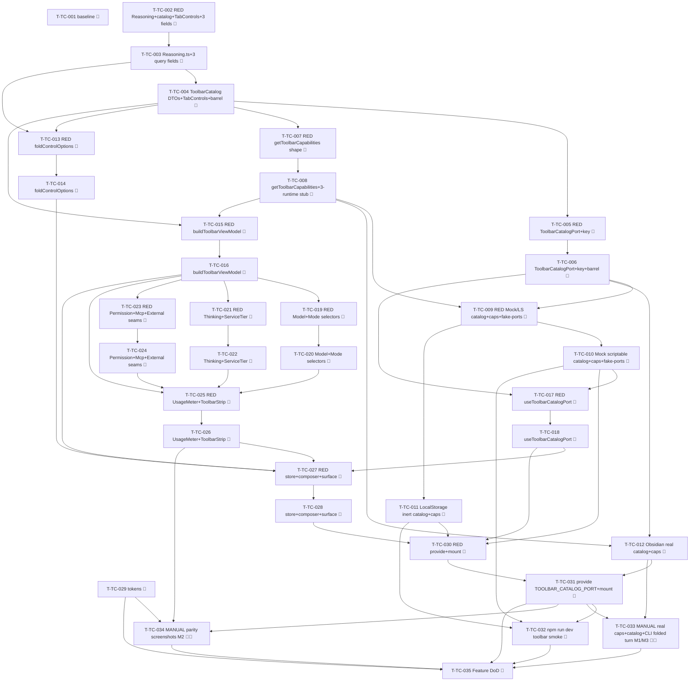

# Tasks — Toolbar & Controls (P6)

Each task is ≤ ~½ day, has a stable `T-TC-NNN` id, references ≥ 1 SPEC-TC / TEST-TC / REQ-TC / NFR-TC,
names an owner, lists explicit dependencies, and has a testable Definition of Done. This decomposes
**SPEC-TC-001..030** (30 spec items) on top of the merged P1 chat surface (`chat-core`), the merged P2
rich-render surface (`rich-rendering`, `UsageInfo`), the merged P3 threads/sessions surface
(`threads-sessions`, `tabsStore`), the merged P4 composer surface (`composer-power`, the
capability/`appendSystemPrompt` seam), and the merged P5 composer context-bar surface
(`context-attachments`, the additive `ChatComposer` region + fold pattern) on the `next` integration
branch (P5 #446 / squash 6d6b1a6).

> **TDD ordering (mission discipline):** the RED test task for a contract comes **before** the
> implementation task that greens it. RED test tasks are owned by `qa`; implementation tasks by
> `dev`. **Every dev task's first DoD line is "the prior RED test(s) now pass".** This mirrors the
> P2/P3/P4/P5 task style the maintainer accepted.

> **DDD inward layering order (the batch structure):**
> 1. **DOMAIN** — the three additive optional `ChatRuntimeQueryOptions` fields (`mode?`/`reasoning?`/
>    `serviceTier?`, SPEC-TC-001); `Reasoning.ts` (`ReasoningEffort` + `ReasoningChoice`, SPEC-TC-002);
>    the `ToolbarCatalog` descriptor DTOs (SPEC-TC-003); `ToolbarCatalogPort` + `TOOLBAR_CATALOG_PORT`
>    key + barrel (SPEC-TC-004); `ToolbarCapabilities` + `getToolbarCapabilities()` appended to
>    `ChatRuntimePort` (SPEC-TC-005); the `TabControls` bag (SPEC-TC-006).
> 2. **INFRA** — the 3-bridge `ToolbarCatalogPort` (Obsidian Claude-static-for-now coverage-excluded /
>    Mock scriptable / LocalStorage inert) + `getToolbarCapabilities` on the 3 runtimes + the
>    `fake-ports.toolbarCatalog` member (SPEC-TC-007/008/009). Mock/LS carry the automated weight; the
>    real Claude capability/catalog reporting → manual leg.
> 3. **APPLICATION** — the pure `foldControlOptions` (SPEC-TC-010) + the pure `buildToolbarViewModel`
>    (SPEC-TC-011), each RED→green, pure/total (never throw, no `providerId` branch).
> 4. **UI** — `useToolbarCatalogPort` (SPEC-TC-024); `ToolbarStrip.vue` + the eight leaf widgets +
>    `UsageMeter.vue` (SPEC-TC-012..020), each with a co-located `data-testid` PageObject; the
>    `ChatComposer` toolbar region (additive, SPEC-TC-021) + `ChatSurface` view-model wiring
>    (SPEC-TC-022) + `tabsStore` `controls`/`setControl`/fold-on-submit (SPEC-TC-023). RED component
>    test before each.
> 5. **STYLES** — the `toolbar/*` `--sp-*` token slice + the tokens-contract update (SPEC-TC-026),
>    runnable anytime before the gate.
> 6. **WIRE-IN** — provide `TOOLBAR_CATALOG_PORT` in `AgentSidebarView` + `src/ui/main.ts`; mount the
>    strip; `npm run dev` toolbar smoke (SPEC-TC-025).
> 7. **GATE** — full `npm run verify` + `npm run test:all` + the grep gate + additivity + the parity
>    self-review note + the three manual legs (TEST-TC-M1/M2/M3) + draft PR into `next` (orchestrator
>    merges).
> A test for a layer may not depend on a layer further out.

> **The fold + the query-option grow freeze early (carried from the design + spec hand-off).** The
> additive `ChatRuntimeQueryOptions` fields (SPEC-TC-001) + `Reasoning.ts` (SPEC-TC-002) +
> `foldControlOptions` (SPEC-TC-010) + the `tabsStore` `controls`/fold (SPEC-TC-023) are sequenced so an
> untouched-toolbar turn is proven byte-identical to P5 (TEST-TC-002, NFR-TC-001) **before** the widgets
> build on top — mirroring the P5 ordering that froze `ChatTurnRequest`'s five fields first.

> **The `getToolbarCapabilities` interface-member addition + its 3 runtime impls land in ONE task
> each side (the P5 `readBinary` lesson, T-CA-006).** Appending `getToolbarCapabilities(): ToolbarCapabilities`
> to `ChatRuntimePort` makes every class that `implements ChatRuntimePort` (the three bridge runtimes —
> Obsidian/Mock/LocalStorage) fail to compile until each carries an impl/stub. So the interface-member
> task (T-TC-008) **also** lands a minimal Claude-shaped stub on all three runtimes in the SAME task to
> keep the build green; the scriptable Mock + inert LS bodies are then fleshed out in the infra batch
> (T-TC-012). The `ChatRuntimeQueryOptions` widening (SPEC-TC-001) is purely additive optional fields —
> it does **not** break any bridge `implements` (the runtimes read the optional fields, they do not
> re-declare the interface), so it carries no companion-stub concern.

> **Coverage-excluded infra (manual legs):** the **real** Claude `ToolbarCatalogPort.getCatalog('claude')`
> (the static-for-now Claude option lists) + the **real** `getToolbarCapabilities()` on the Claude
> `ChatRuntimePort` (the real `supportsMcpTools` CLI capability + the live P4 plan state) live under
> `src/infrastructure/obsidian/**` (coverage-excluded, §10). Their behavioural gate is the **manual** legs
> **TEST-TC-M1** (the real Claude runtime reports `getToolbarCapabilities` + the `ToolbarCatalogPort`
> wires end-to-end in Obsidian), **TEST-TC-M2** (per-widget parity screenshots at 320/520/720 px, light +
> dark), and **TEST-TC-M3** (a real-CLI turn carries the folded `mode`/`reasoning` options to the runtime)
> — never self-claimed by an agent; recorded for the single final epic-review gate (autonomous drive). The
> two **pure transforms** (`foldControlOptions`/`buildToolbarViewModel`), the **DTO/union/store** shapes,
> the **Mock scriptable catalog + capabilities**, and the **LocalStorage inert** impls carry the
> unit/component weight + the 80/70/80/80 coverage gate (NFR-TC-007).

> **Deleted-symbol guard (ESLint) — NO relaxation needed (verified).** Mirroring P2/P3/P4/P5, **none**
> of the P6 symbols were P0-deleted. `eslint.config.js` `DELETED_SUBSYSTEM_BAN` lists only the
> feature/transport/MCP/secret/metadata/canvas paths — it does **not** list `ToolbarCatalogPort`,
> `getToolbarCapabilities`, `ToolbarCapabilities`, `ReasoningChoice`/`Reasoning`, `ToolbarCatalog`/
> `TabControls`, `ToolbarStrip`/`ModelSelector`/`ModeSelector`/`PermissionToggle`/`ThinkingSelector`/
> `ServiceTierToggle`/`McpSelector`/`ExternalContextControl`/`UsageMeter`, `foldControlOptions`/
> `buildToolbarViewModel`, or any toolbar path. The new domain/application/ui paths
> (`@/domain/chat/Reasoning`, `@/domain/chat/toolbar/**`, `@/domain/ports/ToolbarCatalogPort`,
> `@/application/chat/toolbar/**`, `@/ui/chat/toolbar/**`) match **no** ban glob (`@/domain/chat` regrew
> in P1 and is off the list; `ChatRuntimePort` is a live core port, never banned), and
> `DELETED_INJECTION_KEYS` does **not** contain `TOOLBAR_CATALOG_PORT`. So there is **no guard-relax
> task** in P6. (T-TC-001's DoD includes a one-line lint check confirming the new key/port imports
> resolve clean; T-TC-031 re-confirms at the gate.)

> **Parity is a review-stage human task:** the P6 per-widget parity-screenshot capture (charter §3.10 /
> NFR-TC-008) for the strip + the eight widgets + the meter at 320 / 520 / 720 px, light + dark, is
> deferred to the single final epic-review human gate (TEST-TC-M2), not CI. The baseline-capture task
> (T-TC-001) runs first so a `claudian-main` `InputToolbar` + `ContextUsageMeter` reference exists
> pre-impl.

## Legend

- 🧪 = test task (RED-first; owner `qa`)
- 🔨 = implementation task (owner `dev`)
- 📐 = design / scaffolding / baseline task
- 🚀 = release / ops / gate task
- 🪓 = may slice (touches multiple independent code paths; expect several PRs)
- 👤 = human-owned (never agent-self-claimed)

---

## Task list

### T-TC-001 📐 — Baseline-capture: `claudian-main` P6 InputToolbar + usage-meter reference + guard verification

- **Description:** Before any P6 implementation, capture the `claudian-main` baseline for the P6 toolbar
  surfaces (the `.claudian-input-toolbar` strip in Claudian order — model · mode · permission · thinking ·
  service-tier · MCP · external grouped leading, the usage/context meter pinned trailing; each leaf
  widget's open/closed + active states; the 240° arc `ContextUsageMeter` with its `> 80` warning +
  `/compact` tooltip) at the charter widths (320 / 520 / 720 px), light + dark, into a
  `specs/toolbar-controls/parity-screenshots.md` skeleton (baseline column only; the Specorator column is
  filled at the final review). Confirm (one lint run) that the new `TOOLBAR_CATALOG_PORT` key and the new
  domain/application/ui toolbar paths (`@/domain/chat/Reasoning`, `@/domain/chat/toolbar/**`,
  `@/domain/ports/ToolbarCatalogPort`, `@/application/chat/toolbar/**`, `@/ui/chat/toolbar/**`) are
  **not** caught by the `DELETED_SUBSYSTEM_BAN` / `DELETED_INJECTION_KEYS` guard (no relaxation required).
  No production code.
- **Satisfies:** NFR-TC-008 (baseline leg), NFR-TC-001 (guard verification), SPEC-TC-012/020/026
- **Owner:** dev
- **Depends on:** —
- **Estimate:** S
- **Definition of done:**
  - [x] `specs/toolbar-controls/parity-screenshots.md` exists with the per-widget × 320/520/720 ×
        light/dark baseline matrix scaffolded, baseline column captured from `D:\Projects\claudian-main`
        (`features/chat/ui/InputToolbar.ts` + the `toolbar/**` selectors/toggles + the `ContextUsageMeter`).
  - [x] A one-line lint check confirms the deleted-symbol guard does **not** block the
        `TOOLBAR_CATALOG_PORT` key / the new toolbar domain/application/ui paths (no relaxation task
        needed); noted in `test-plan.md`.
  - [x] No file under `src/` changed.

---

## Layer 1 — DOMAIN (SPEC-TC-001..006)

### T-TC-002 🧪 — RED: `Reasoning.ts` union + `ToolbarCatalog`/`TabControls` DTOs + the three additive `ChatRuntimeQueryOptions` fields (structural)

- **Description:** Author the failing structural/type-level + serialisation tests asserting: (a)
  `Reasoning.ts` — `ReasoningEffort` is **exactly** the closed lower-case union `'high' | 'medium' |
  'low'`, and `ReasoningChoice` is **exactly** the two-member discriminated union
  `{kind:'effort';value:ReasoningEffort}` | `{kind:'budget';tokens:number}`, all members `readonly`,
  narrowing on `kind`, re-exported from `@/domain/chat/Reasoning` (TEST-TC-018 type-shape leg,
  SPEC-TC-002); (b) the `ToolbarCatalog` descriptor DTOs (`ModelOption` `id`/`label`/`group?`;
  `ModeDescriptor` `activeValue`/`inactiveValue`/`activeLabel`/`inactiveLabel`; `ReasoningDescriptor`
  `control:'effort'|'token-budget'`/`options`/`defaultChoice?`; `ServiceTierDescriptor`
  `activeValue`/`inactiveValue`/`label`; `ToolbarCatalog` `models`/`defaultModelId?`/`mode?`/`reasoning?`/
  `serviceTier?`) match SPEC-TC-003 shapes — all `readonly`, re-exported from
  `@/domain/chat/toolbar/index` (TEST-TC-010/013/017/019 type-shape legs); (c) the `TabControls` bag is
  **exactly** the four optional members `model?:string`/`mode?:string`/`reasoning?:ReasoningChoice`/
  `serviceTier?:string`, re-exported from the same barrel (TEST-TC-006 type-shape leg, SPEC-TC-006); (d)
  `ChatRuntimeQueryOptions` gains **exactly** the three optional fields (`mode?:string`/
  `reasoning?:ReasoningChoice`/`serviceTier?:string`) appended after `appendSystemPrompt`, the P0–P5
  `model?`/`forceColdStart?`/`appendSystemPrompt?` stay byte-identical, and a P5-shaped query (no new
  field) serialises byte-identically to P5 — `PreparedChatTurn`/`ChatRuntimeEnsureReadyOptions`/
  `ChatTurnRequest`/`UsageInfo` unchanged (TEST-TC-002 serialisation + TEST-TC-027 additivity leg,
  NFR-TC-001/SPEC-TC-027). Names TEST-TC-002/006/010/013/017/018/019/027 in metadata.
- **Satisfies:** TEST-TC-002, TEST-TC-006, TEST-TC-010 (type-shape leg), TEST-TC-013 (type-shape leg), TEST-TC-017 (type-shape leg), TEST-TC-018 (type-shape leg), TEST-TC-019 (type-shape leg), TEST-TC-027 (additivity leg), SPEC-TC-001, SPEC-TC-002, SPEC-TC-003, SPEC-TC-006, SPEC-TC-027, REQ-TC-002, REQ-TC-017, REQ-TC-042, NFR-TC-001
- **Owner:** qa
- **Depends on:** —
- **Estimate:** M
- **Definition of done:**
  - [x] `tests/domain/chat/Reasoning.test.ts`, `tests/domain/chat/toolbar/ToolbarCatalog.test.ts`,
        `tests/domain/chat/toolbar/TabControls.test.ts`, and `tests/domain/chat/ChatTurn.ts.test.ts` (the
        P6 additivity + the P5-shaped serialisation leg) exist, naming the listed TEST-TC type-shape +
        serialisation legs.
  - [x] Tests fail (RED) — `Reasoning.ts` / the `toolbar/` DTOs / `TabControls` / the three
        `ChatRuntimeQueryOptions` fields do not yet exist (compile/run failure is the RED signal).

### T-TC-003 🔨 — `Reasoning.ts` (`ReasoningEffort` + `ReasoningChoice`) + `ChatRuntimeQueryOptions` three additive fields

- **Description:** Implement per SPEC-TC-002 + SPEC-TC-001: `src/domain/chat/Reasoning.ts` exporting
  `ReasoningEffort = 'high' | 'medium' | 'low'` (lower-case closed union) + `ReasoningChoice` (the
  two-member `readonly` discriminated union `effort`|`budget`; `budget.tokens` documented as a finite
  non-negative integer); **append** the three optional fields (`mode?: string`, `reasoning?:
  ReasoningChoice`, `serviceTier?: string`) **after** `appendSystemPrompt` in the
  `ChatRuntimeQueryOptions` interface in `src/domain/chat/ChatTurn.ts`, importing `ReasoningChoice` from
  `./Reasoning` — the P0–P5 `model?`/`forceColdStart?`/`appendSystemPrompt?` stay byte-identical, and
  `PreparedChatTurn`/`ChatRuntimeEnsureReadyOptions`/`ChatTurnRequest`/`UsageInfo` stay byte-identical
  (`enabledMcpServers`/`externalContextPaths` stay excluded, NG2/NG3). Pure types; no behaviour (the
  runtime's `query` fold of the present options is out-of-scope beyond the field contract). Re-export
  `ReasoningChoice`/`ReasoningEffort` from `src/domain/ports/index.ts` (appended) per SPEC-TC-002. No
  `obsidian`/`node:*`/Vue/class.
- **Satisfies:** SPEC-TC-001, SPEC-TC-002, SPEC-TC-027, REQ-TC-004, REQ-TC-014, REQ-TC-017, REQ-TC-018, REQ-TC-020, NFR-TC-001
- **Owner:** dev
- **Depends on:** T-TC-002
- **Estimate:** S
- **Definition of done:**
  - [x] The prior RED tests (TEST-TC-018 type-shape leg + TEST-TC-002 serialisation + the TEST-TC-027
        additivity leg) now pass (the `ReasoningChoice`/`ReasoningEffort` shapes; exactly the three
        optional `ChatRuntimeQueryOptions` fields appended; a P5-shaped query byte-identical to P5; the
        other request/usage types unchanged).
  - [x] `npm run typecheck` + `npm run lint` green; no `obsidian`/`node:*`/Vue import in
        `src/domain/chat/**`.
  - [x] Implementation-log entry added.

### T-TC-004 🔨 — `ToolbarCatalog` descriptor DTOs + `TabControls` bag + barrel

- **Description:** Implement per SPEC-TC-003 + SPEC-TC-006 under `src/domain/chat/toolbar/`:
  `ToolbarCatalog.ts` (`ModelOption`, `ModeDescriptor`, `ReasoningDescriptor`, `ServiceTierDescriptor`,
  `ToolbarCatalog`), `TabControls.ts` (`TabControls` with the four optional members importing
  `ReasoningChoice` from `../Reasoning`), and `index.ts` re-exporting all of them. Plain domain DTOs —
  string/number/enum/`readonly`-array only; no `obsidian`, no `node:*`, no Vue, no class (so they cross
  the Pinia store boundary cleanly, NFR-TC-005). `ReasoningDescriptor.options.length >= 2` to render
  (documented); `ModeDescriptor`/`ServiceTierDescriptor` require distinct active/inactive values
  (documented); every label is a display string (the provider/i18n owns localisation).
- **Satisfies:** SPEC-TC-003, SPEC-TC-006, REQ-TC-010, REQ-TC-011, REQ-TC-013, REQ-TC-017, REQ-TC-019, REQ-TC-042, NFR-TC-005, NFR-TC-011
- **Owner:** dev
- **Depends on:** T-TC-002, T-TC-003
- **Estimate:** S
- **Definition of done:**
  - [x] The prior RED tests (TEST-TC-010/013/017/019 + TEST-TC-006 type-shape legs) now pass (the
        descriptor DTO shapes; the four-member `TabControls` bag; barrel re-export).
  - [x] `npm run typecheck` + `npm run lint` green; no `obsidian`/`node:*`/Vue import in
        `src/domain/chat/toolbar/**`; no secret / no path outside the catalog (NFR-TC-011).
  - [x] Implementation-log entry added.

### T-TC-005 🧪 — RED: `ToolbarCatalogPort` + `TOOLBAR_CATALOG_PORT` key + barrel (structural)

- **Description:** Author the failing structural/type-level tests asserting (SPEC-TC-004): `ToolbarCatalogPort`
  exposes **exactly** `getCatalog(providerId: ProviderId): ToolbarCatalog` (synchronous + total — the
  type-level shape; the behavioural total/never-throw is the Mock/LS leg, T-TC-011); `TOOLBAR_CATALOG_PORT`
  is its **own** `InjectionKey` in `@/infrastructure/bridge/ports` (alongside the six core keys, no
  aggregate); the barrel `src/domain/ports/index.ts` re-exports `ToolbarCatalogPort` (appended). Names the
  shape leg of TEST-TC-003/010.
- **Satisfies:** TEST-TC-003 (port-shape leg), TEST-TC-010 (port-shape leg), SPEC-TC-004, REQ-TC-003, REQ-TC-010, NFR-TC-002
- **Owner:** qa
- **Depends on:** T-TC-004
- **Estimate:** S
- **Definition of done:**
  - [x] `tests/domain/ports/ToolbarCatalogPort.test.ts` exists, naming the listed TEST-TC shape legs,
        asserting the `getCatalog` signature + the own key + the barrel re-export.
  - [x] Tests fail (RED) — `ToolbarCatalogPort` + the `TOOLBAR_CATALOG_PORT` key + the barrel re-export
        do not yet exist.

### T-TC-006 🔨 — `ToolbarCatalogPort` + `TOOLBAR_CATALOG_PORT` key + barrel re-export

- **Description:** Implement per SPEC-TC-004: the narrow port interface
  `src/domain/ports/ToolbarCatalogPort.ts` (`getCatalog(providerId: ProviderId): ToolbarCatalog`, importing
  `ProviderId` + `ToolbarCatalog`; documented synchronous + total — never throws, an unknown provider / a
  load miss resolves a safe empty-models/no-descriptor default, NEVER branched on by the consumer); add the
  `TOOLBAR_CATALOG_PORT` `InjectionKey` to `src/infrastructure/bridge/ports.ts` (no aggregate — keep the
  per-key header); re-export `ToolbarCatalogPort` from `src/domain/ports/index.ts` (appended). One
  consumer (the toolbar view-model), one port (ADR-008). No `obsidian`/`node:*`/Vue; no class.
- **Satisfies:** SPEC-TC-004, REQ-TC-003, REQ-TC-010, NFR-TC-002, NFR-TC-010
- **Owner:** dev
- **Depends on:** T-TC-005, T-TC-004
- **Estimate:** S
- **Definition of done:**
  - [x] The prior RED test (TEST-TC-003/010 port-shape legs) now passes (the `getCatalog` shape, own key,
        barrel re-export).
  - [x] `npm run typecheck` + `npm run lint` green; deleted-symbol guard green (the new key/port imports
        resolve clean — no relaxation needed); no `obsidian`/`node:*` import in `src/domain/**`.
  - [x] Implementation-log entry added.

### T-TC-007 🧪 — RED: `ToolbarCapabilities` shape + `getToolbarCapabilities()` appended to `ChatRuntimePort` (structural + additivity)

- **Description:** Author the failing structural/type-level tests asserting (SPEC-TC-005): `ToolbarCapabilities`
  is **exactly** the five `readonly` flags (`supportsMcpTools:boolean`, `reasoningControl:'effort'|
  'token-budget'|'none'`, `hasServiceTier:boolean`, `hasModeToggle:boolean`, `permissionMode:'default'|
  'plan'`), re-exported from `@/domain/ports` (appended alongside `RuntimeCapabilities`); `ChatRuntimePort`
  gains **exactly** `getToolbarCapabilities(): ToolbarCapabilities` appended after the P0–P5 members + the
  existing `getCapabilities()`; the P0–P5 `ChatRuntimePort` members + the five `RuntimeCapabilities` flags
  stay byte-identical (the TEST-TC-027 `ChatRuntimePort`-additivity leg, NFR-TC-001/SPEC-TC-027). Names the
  shape + additivity legs of TEST-TC-003/019/021/027.
- **Satisfies:** TEST-TC-003 (capabilities-shape leg), TEST-TC-019 (shape leg), TEST-TC-021 (shape leg), TEST-TC-027 (ChatRuntimePort additivity leg), SPEC-TC-005, SPEC-TC-027, REQ-TC-003, REQ-TC-015, REQ-TC-019, REQ-TC-021, NFR-TC-001
- **Owner:** qa
- **Depends on:** T-TC-004
- **Estimate:** S
- **Definition of done:**
  - [x] `tests/domain/ports/ChatRuntimePort.ts.test.ts` (the P6 `getToolbarCapabilities` additivity +
        the `ToolbarCapabilities` shape) exists, naming the listed TEST-TC legs.
  - [x] Tests fail (RED) — `ToolbarCapabilities` + the `getToolbarCapabilities()` member do not yet exist.

### T-TC-008 🔨 — `ToolbarCapabilities` + `getToolbarCapabilities()` on `ChatRuntimePort` + the 3-runtime stub (build-green companion)

> **The P5 `readBinary` lesson (T-CA-006) applied:** appending `getToolbarCapabilities()` to
> `ChatRuntimePort` breaks the build for every class that `implements ChatRuntimePort` — the three bridge
> runtimes (Obsidian/Mock/LocalStorage) — until each carries an impl. This task lands the interface member
> **and** a minimal Claude-shaped stub on all three runtimes in the SAME commit so the build stays green;
> the scriptable Mock + inert LS bodies are fleshed out in T-TC-012 and the real Obsidian flags are the
> manual leg (T-TC-013).

- **Description:** Implement per SPEC-TC-005: the `ToolbarCapabilities` interface (the five `readonly`
  flags) + **append** `getToolbarCapabilities(): ToolbarCapabilities` to `ChatRuntimePort` in
  `src/domain/ports/ChatRuntimePort.ts` (the P0–P5 members + the five `RuntimeCapabilities` flags
  byte-identical); re-export `ToolbarCapabilities` from `src/domain/ports/index.ts` (appended). In the
  **same task**, add a minimal Claude-shaped `getToolbarCapabilities()` to all three runtime classes that
  `implements ChatRuntimePort` (Obsidian: the real-flags stub fleshed out in T-TC-013's manual leg; Mock:
  a fixed Claude default ahead of the scriptable body in T-TC-012; LocalStorage: the inert flags) so
  `npm run build` + `npm run typecheck` stay green. Synchronous + total; never throws. No `providerId`
  branch.
- **Satisfies:** SPEC-TC-005, SPEC-TC-027, REQ-TC-003, REQ-TC-015, REQ-TC-019, REQ-TC-021, NFR-TC-001, NFR-TC-002
- **Owner:** dev
- **Depends on:** T-TC-007
- **Estimate:** M
- **Definition of done:**
  - [x] The prior RED tests (the TEST-TC-003/019/021 shape legs + the TEST-TC-027 `ChatRuntimePort`
        additivity leg) now pass — `getToolbarCapabilities()` appended, the five-flag `ToolbarCapabilities`,
        the P0–P5 members + the (four) `RuntimeCapabilities` flags byte-identical.
  - [x] All three runtimes (plus the `EnqueueRuntime` decorator + the two `ScriptedRuntime` test doubles)
        carry a `getToolbarCapabilities()` impl/stub so `npm run typecheck` + `npm run lint` stay green
        (the build-green companion — the scriptable/inert/real bodies follow in T-TC-010/011/012).
  - [x] No `providerId` branch; synchronous + total; implementation-log entry added.

---

## Layer 2 — INFRA (SPEC-TC-007..009)

### T-TC-009 🧪 — RED: scriptable `MockBridge` `ToolbarCatalogPort` + scriptable Mock `getToolbarCapabilities` + inert LocalStorage impls + `fake-ports.toolbarCatalog`

- **Description:** Author the failing unit tests asserting (SPEC-TC-008/009): (a) the **Mock**
  `ToolbarCatalogPort` is **scriptable** — `setToolbarCatalog(catalog)` → `getCatalog` returns the injected
  `ToolbarCatalog` so the view-model + widget tests drive every shape (custom models, grouped models,
  effort vs token-budget reasoning, with/without a mode descriptor, with/without a service-tier descriptor,
  an **empty model list** for the degrade path); default = a small Claude-shaped catalog; (b) the **Mock**
  runtime `getToolbarCapabilities()` is **scriptable** — `setToolbarCapabilities(caps)` drives the
  seam-hidden-vs-visible matrix (`supportsMcpTools` true/false, `hasServiceTier` true/false,
  `reasoningControl` effort/token-budget/none, `permissionMode` default/plan); default = Claude-shaped; (c)
  the **LocalStorage** `getCatalog` is a fixed inert Claude-shaped catalog (a small model list + the mode +
  effort descriptors, no service-tier) and `getToolbarCapabilities()` is inert (`supportsMcpTools:false`,
  `hasServiceTier:false`, `reasoningControl:'none'`, `hasModeToggle:true`, `permissionMode:'default'`), both
  never throwing; (d) `tests/__fakes__/fake-ports.ts` gains a `toolbarCatalog` member wired into the factory
  so multi-port tests see it. Names the Mock/LS backing of TEST-TC-003/010/011/013/017/019/021/030.
- **Satisfies:** TEST-TC-003 (Mock backing), TEST-TC-010 (Mock/empty-list backing), TEST-TC-013 (Mock backing), TEST-TC-017 (Mock backing), TEST-TC-019 (Mock backing), TEST-TC-021 (Mock backing), TEST-TC-030 (catalog-miss-degrades backing), SPEC-TC-008, SPEC-TC-009, REQ-TC-003, REQ-TC-013, REQ-TC-019, REQ-TC-021, NFR-TC-001, NFR-TC-010
- **Owner:** qa
- **Depends on:** T-TC-006, T-TC-008
- **Estimate:** M
- **Definition of done:**
  - [x] `tests/infrastructure/mock/MockToolbarCatalog.test.ts`,
        `tests/infrastructure/mock/MockToolbarCapabilities.test.ts`,
        `tests/infrastructure/localstorage/LocalStorageToolbar.test.ts`, and the extended
        `tests/__fakes__/fake-ports.test.ts` (the `toolbarCatalog` member) exist, naming the listed
        TEST-TC ids.
  - [x] Tests fail (RED) — the scriptable Mock catalog/capabilities + the inert LocalStorage impls + the
        factory member do not yet exist (beyond the T-TC-008 default stub).

### T-TC-010 🔨 — `MockBridge` scriptable `ToolbarCatalogPort` + scriptable `getToolbarCapabilities` + `fake-ports.toolbarCatalog`

- **Description:** Implement per SPEC-TC-008 under `src/infrastructure/mock/**`: the scriptable
  `ToolbarCatalogPort` (`setToolbarCatalog(catalog)` backs `getCatalog`, default = a small Claude-shaped
  catalog, total — never throws, empty-models default available); flesh out the scriptable Mock runtime
  `getToolbarCapabilities()` (`setToolbarCapabilities(caps)`, default = Claude-shaped, replacing the
  T-TC-008 fixed stub); add the `toolbarCatalog` member to `tests/__fakes__/fake-ports.ts`. No
  `node:*`, no `obsidian`.
- **Satisfies:** SPEC-TC-008, REQ-TC-003, REQ-TC-013, REQ-TC-019, REQ-TC-021, NFR-TC-001, NFR-TC-010
- **Owner:** dev
- **Depends on:** T-TC-009
- **Estimate:** M
- **Definition of done:**
  - [x] The prior RED tests (the Mock catalog/capabilities scriptable legs of
        TEST-TC-003/010/011/013/017/019/021) now pass; the `fake-ports` `toolbarCatalog` member works for
        multi-port tests; the empty-models default drives the degrade path.
  - [x] No `node:*`/`obsidian` import in Mock; total — never throws; `npm run typecheck` + `npm run lint`
        + `npm run test` green; implementation-log entry added.

### T-TC-011 🔨 — `LocalStorageBridge` inert `ToolbarCatalogPort` + inert `getToolbarCapabilities`

- **Description:** Implement per SPEC-TC-009 under `src/infrastructure/localstorage/**`: the fixed inert
  Claude-shaped `getCatalog` (a small model list + the mode + effort descriptors, **no** service-tier) so
  the GitHub Pages demo renders the full strip with the backed widgets + the honest seams; the inert
  `getToolbarCapabilities()` (`supportsMcpTools:false`, `hasServiceTier:false`, `reasoningControl:'none'`,
  `hasModeToggle:true`, `permissionMode:'default'`, replacing the T-TC-008 inert stub). Both never throw
  across the boundary (NFR-TC-010). No `node:*`.
- **Satisfies:** SPEC-TC-009, REQ-TC-019, REQ-TC-021, NFR-TC-002, NFR-TC-010
- **Owner:** dev
- **Depends on:** T-TC-009
- **Estimate:** S
- **Definition of done:**
  - [x] The prior RED tests (the LocalStorage inert catalog/capabilities legs) now pass; the demo renders
        the backed widgets (model/mode) + the honest seams (no live service-tier/MCP); never throws.
  - [x] `npm run typecheck` + `npm run lint` + `npm run test` green; implementation-log entry added.

### T-TC-012 🔨 — `ObsidianBridge` real Claude `ToolbarCatalogPort` + real `getToolbarCapabilities` (coverage-excluded) 🪓

> The real Claude `getCatalog('claude')` (the static-for-now Claude model list + mode + effort descriptors,
> no service-tier) and the real `getToolbarCapabilities()` (the real `supportsMcpTools` CLI capability,
> `reasoningControl:'effort'`, `hasServiceTier:false`, `hasModeToggle:true`, `permissionMode` mirroring the
> active P4 plan state) live under `src/infrastructure/obsidian/**` (coverage-excluded). Their behavioural
> gate is the **manual** leg TEST-TC-M1 (the real Claude runtime reports `getToolbarCapabilities` + the
> `ToolbarCatalogPort` wires end-to-end in Obsidian). The Mock/LS halves (T-TC-010/011) carry the automated
> proof.

- **Description:** Implement per SPEC-TC-007 under `src/infrastructure/obsidian/**`: the
  `ToolbarCatalogPort.getCatalog('claude')` returning the **real Claude catalog** as a static-for-now
  load-or-default constant (multi-provider + env-derived custom models are P9/P10, NG4/NG5; total — never
  throws, NFR-TC-010); and flesh out the Claude runtime's `getToolbarCapabilities()` (replacing the
  T-TC-008 stub) returning the real flags (`supportsMcpTools` from the real CLI capability,
  `reasoningControl:'effort'`, `hasServiceTier:false`, `hasModeToggle:true`, `permissionMode` mirroring the
  active P4 plan state — display only, P6 does not own plan mode, NG6). No `obsidian` symbol leaks past
  this file.
- **Satisfies:** SPEC-TC-007, REQ-TC-010, REQ-TC-015, REQ-TC-019, REQ-TC-021, NFR-TC-001 (manual leg), NFR-TC-010
- **Owner:** dev
- **Depends on:** T-TC-006, T-TC-008
- **Estimate:** M
- **Slice plan:** may slice as (a) the real Claude `ToolbarCatalogPort.getCatalog` constant, (b) the real
  `getToolbarCapabilities()` flags.
- **Definition of done:**
  - [x] `ObsidianBridge` provides the real Claude `ToolbarCatalogPort` (static-for-now catalog) + the
        Claude runtime's real `getToolbarCapabilities()`; both total — never throw; no `obsidian` symbol
        leaks past the file.
  - [x] `npm run typecheck` + `npm run lint` green; the manual leg TEST-TC-M1 scheduled in `test-plan.md`.
  - [x] Implementation-log entry added.

---

## Layer 3 — APPLICATION (SPEC-TC-010..011)

### T-TC-013 🧪 — RED: pure `foldControlOptions` (incl. the empty-fold EC-TC-1/6)

- **Description:** Author the failing unit tests for the pure guarded fold (SPEC-TC-010):
  `foldControlOptions(controls)` → `Partial<ChatRuntimeQueryOptions>` writing a field **only** when
  `controls` carries an explicit non-empty/present value — `controls.model` → `model` (present +
  non-empty); `controls.mode` → `mode` (present + non-empty); `controls.reasoning` → `reasoning` (present
  — an explicit effort/budget choice); `controls.serviceTier` → `serviceTier` (present + non-empty); **a
  descriptor default value is never folded** (EC-TC-6); **EC-TC-1:** `foldControlOptions({})` → `{}`
  (an untouched toolbar → byte-identical to a P5 turn, the TEST-TC-002 fold leg); the seam widgets
  contribute **nothing**; pure + total — never throws (NFR-TC-005/010). Names TEST-TC-002 (fold leg) +
  TEST-TC-004 (fold leg).
- **Satisfies:** TEST-TC-002 (fold leg), TEST-TC-004 (fold leg), SPEC-TC-010, REQ-TC-004, NFR-TC-001, NFR-TC-005
- **Owner:** qa
- **Depends on:** T-TC-003, T-TC-004
- **Estimate:** S
- **Definition of done:**
  - [x] `tests/application/chat/toolbar/foldControlOptions.test.ts` exists, naming TEST-TC-002/004 fold
        legs, covering each present-field fold, the descriptor-default-never-folded (EC-TC-6), the
        `{}` → `{}` empty fold (EC-TC-1), and never-throws.
  - [x] Tests fail (RED) — `foldControlOptions.ts` does not yet exist (it consumes the
        `TabControls`/`ChatRuntimeQueryOptions` from T-TC-003/004).

### T-TC-014 🔨 — `foldControlOptions.ts` (pure guarded fold)

- **Description:** Implement `src/application/chat/toolbar/foldControlOptions.ts` per SPEC-TC-010:
  `foldControlOptions(controls: TabControls): Partial<ChatRuntimeQueryOptions>` — additive + guarded; a
  field is written only when `controls` carries an explicit non-default value, so an untouched toolbar
  yields `{}` (byte-identical to P5, NFR-TC-001); the seam widgets contribute nothing. Pure + total —
  never throws. The result is merged into the turn's `queryOptions` alongside the P4 `appendSystemPrompt`
  by `tabsStore` (T-TC-026). No `obsidian`/`node:*`/Vue import; no `providerId` branch.
- **Satisfies:** SPEC-TC-010, REQ-TC-004, NFR-TC-001, NFR-TC-005, NFR-TC-007
- **Owner:** dev
- **Depends on:** T-TC-013
- **Estimate:** S
- **Definition of done:**
  - [x] The prior RED tests (TEST-TC-002 fold leg + TEST-TC-004 fold leg) now pass, incl. EC-TC-1/6.
  - [x] Pure/total; never throws; no `obsidian`/Vue import; no `providerId` branch.
  - [x] `npm run typecheck` + `npm run lint` + `npm run test` green; implementation-log entry added.

### T-TC-015 🧪 — RED: pure `buildToolbarViewModel` (full per-widget matrix, no `providerId` branch)

- **Description:** Author the failing unit tests for the pure/total decision function (SPEC-TC-011):
  `buildToolbarViewModel(catalog, capabilities, controls, usage)` → `ToolbarViewModel` asserting the
  per-widget rules — **model** always `visible/enabled`, `options = catalog.models`, `selectedId =
  controls.model ?? catalog.defaultModelId`, `emptyNotice` on an empty model list (EC-TC-3); **mode**
  visible iff `capabilities.hasModeToggle && catalog.mode`, else hidden (EC-TC-2/REQ-TC-013); **thinking**
  hidden when `reasoningControl==='none'` OR no `catalog.reasoning` OR `options.length < 2`, else visible
  with `selected = controls.reasoning ?? catalog.reasoning.defaultChoice` (EC-TC-4/REQ-TC-017);
  **serviceTier** hidden when `!hasServiceTier` OR no descriptor (Claude → hidden, slot collapses),
  `active` from `controls.serviceTier` (EC-TC-2/REQ-TC-019); **permission** always visible-disabled,
  `plan = permissionMode==='plan'` (EC-TC-5/REQ-TC-015/016); **mcp** hidden when `!supportsMcpTools`, else
  visible-empty (REQ-TC-021/022); **external** always visible-disabled (REQ-TC-023); **usage** hidden when
  `usage===null` (EC-TC-7), else `percentage = usage.percentage`, `warning = usage.percentage >
  USAGE_WARNING_THRESHOLD` (the `> 80` constant, REQ-TC-026/027); and a **grep + behaviour** assertion that
  the function reads `capabilities` + `catalog` with **zero** `if (providerId === 'claude')` branch
  (REQ-TC-003, SPEC-TC-029); a partial/empty catalog hides the dependent widget without throwing
  (NFR-TC-010, EC-TC-3); `USAGE_WARNING_THRESHOLD === 80`. Names TEST-TC-003/010/013/017/019/021/027/030
  (VM legs) + the EC-TC-2/3/4/5/7 legs.
- **Satisfies:** TEST-TC-003, TEST-TC-010 (VM leg), TEST-TC-013 (VM leg), TEST-TC-017 (VM leg), TEST-TC-019 (VM leg), TEST-TC-021 (VM leg), TEST-TC-027 (VM leg), TEST-TC-030, SPEC-TC-011, SPEC-TC-018, SPEC-TC-029, REQ-TC-003, REQ-TC-010, REQ-TC-013, REQ-TC-015, REQ-TC-016, REQ-TC-017, REQ-TC-019, REQ-TC-021, REQ-TC-023, REQ-TC-027, NFR-TC-010
- **Owner:** qa
- **Depends on:** T-TC-004, T-TC-008
- **Estimate:** M
- **Definition of done:**
  - [x] `tests/application/chat/toolbar/buildToolbarViewModel.test.ts` exists, naming the listed TEST-TC
        VM legs, covering the full per-widget matrix, the no-`providerId`-branch grep+behaviour, the
        `USAGE_WARNING_THRESHOLD = 80` `>` constant, the empty/partial-catalog degrade (EC-TC-3), and
        never-throws.
  - [x] Tests fail (RED) — `buildToolbarViewModel.ts` does not yet exist.

### T-TC-016 🔨 — `buildToolbarViewModel.ts` (pure per-widget decision + `USAGE_WARNING_THRESHOLD`)

- **Description:** Implement `src/application/chat/toolbar/buildToolbarViewModel.ts` per SPEC-TC-011 +
  SPEC-TC-018: the `WidgetVisibility` union + the eight per-widget VM interfaces + `ToolbarViewModel` +
  the `USAGE_WARNING_THRESHOLD = 80` module constant; `buildToolbarViewModel(catalog, capabilities,
  controls, usage)` applies the per-widget visible/enabled/hidden rules reading **only** `capabilities` +
  `catalog` + `controls` + `usage` — **no `providerId` branch** (SPEC-TC-029); a partial/empty catalog
  hides the dependent widget; the usage warning is **strictly above** 80 (`percentage >
  USAGE_WARNING_THRESHOLD`). Pure + total — never throws (NFR-TC-010). No `obsidian`/`node:*`/Vue import.
- **Satisfies:** SPEC-TC-011, SPEC-TC-018, SPEC-TC-029, REQ-TC-003, REQ-TC-010, REQ-TC-013, REQ-TC-015, REQ-TC-016, REQ-TC-017, REQ-TC-019, REQ-TC-021, REQ-TC-023, REQ-TC-027, NFR-TC-010, NFR-TC-007
- **Owner:** dev
- **Depends on:** T-TC-015
- **Estimate:** M
- **Definition of done:**
  - [x] The prior RED tests (TEST-TC-003/010/013/017/019/021/027/030 VM legs + the EC-TC-2/3/4/5/7 legs)
        now pass; `USAGE_WARNING_THRESHOLD = 80`, warning strictly above.
  - [x] Pure/total; never throws; **no `providerId` branch**; no `obsidian`/Vue import.
  - [x] `npm run typecheck` + `npm run lint` + `npm run test` green; implementation-log entry added.

---

## Layer 4 — UI (SPEC-TC-012..024, except wiring SPEC-TC-025 → Layer 6)

### T-TC-017 🧪 — RED: `useToolbarCatalogPort` composable

- **Description:** Author the failing unit test (SPEC-TC-024) asserting `useToolbarCatalogPort()` mirrors
  `useVaultPort` — injects `TOOLBAR_CATALOG_PORT`, returns the injected port when provided, throws a
  helpful error when unprovided (the strict composable; `ChatSurface` injects optionally with
  `inject(TOOLBAR_CATALOG_PORT, undefined)` so a mount without it degrades to "no toolbar", asserted at
  T-TC-027). One-port-one-composable (ADR-008). Tested over the Mock port. Names the composable leg of
  TEST-TC-003.
- **Satisfies:** TEST-TC-003 (composable leg), SPEC-TC-024, REQ-TC-003, REQ-TC-010, NFR-TC-002
- **Owner:** qa
- **Depends on:** T-TC-006, T-TC-010
- **Estimate:** S
- **Definition of done:**
  - [x] `tests/ui/composables/useToolbarCatalogPort.test.ts` exists, naming the TEST-TC-003 composable
        leg, covering inject-when-provided + throw-when-unprovided.
  - [x] Test fails (RED) — `useToolbarCatalogPort` does not yet exist.

### T-TC-018 🔨 — `useToolbarCatalogPort.ts`

- **Description:** Implement `src/ui/composables/useToolbarCatalogPort.ts` per SPEC-TC-024: inject
  `TOOLBAR_CATALOG_PORT`, throw a helpful error when unprovided (mirroring `useVaultPort`); return the
  injected `ToolbarCatalogPort`. No `obsidian` import (NFR-TC-003); DTO-only across any store boundary.
- **Satisfies:** SPEC-TC-024, REQ-TC-003, REQ-TC-010, NFR-TC-002, NFR-TC-003
- **Owner:** dev
- **Depends on:** T-TC-017
- **Estimate:** S
- **Definition of done:**
  - [x] The prior RED test (TEST-TC-003 composable leg) now passes.
  - [x] No `obsidian` import under `src/ui/**`; `npm run typecheck` + `npm run lint` + `npm run test`
        green; implementation-log entry added.

### T-TC-019 🧪 — RED: `ModelSelector.vue` + `ModeSelector.vue` (POs co-located)

- **Description:** Author the failing component tests + co-located `data-testid` PageObjects
  (`ModelSelector.po.ts`, `ModeSelector.po.ts`) per SPEC-TC-013/014: mounting `ModelSelector` with `vm:
  ModelWidgetVm` shows the `selectedId` label; opening (click OR Enter/Space/focus, **not** hover-only,
  REQ-TC-040) renders `vm.options` as a `role="listbox"` with group separators where `option.group`
  differs, each `role="option"` `aria-selected` (current marked, REQ-TC-011); ArrowUp/Down move
  `aria-activedescendant`, Home/End jump, Enter/Space → `pick` emit, Escape closes + restores button focus
  (EC-TC-12); `vm.emptyNotice` → an empty-notice row + the persisted value on the button (EC-TC-3); the
  button is `role="combobox"` `aria-haspopup="listbox"` `aria-expanded` (TEST-TC-010/011/040); mounting
  `ModeSelector` with `vm: ModeWidgetVm` returns nothing when handed a `hidden` slice (guard, REQ-TC-013),
  shows the active/inactive label per `vm.activeValue`, toggling flips to the other option value → `set`
  emit (REQ-TC-014), is `role="switch"` `aria-checked` + accessible name (REQ-TC-041, TEST-TC-013/014/041).
  `data-testid`: `toolbar-model`/`toolbar-model-option`/`toolbar-model-empty`, `toolbar-mode` — PageObject
  only. Names TEST-TC-010/011/013/014/040/041 (A legs).
- **Satisfies:** TEST-TC-010 (A leg), TEST-TC-011, TEST-TC-013 (A leg), TEST-TC-014 (component leg), TEST-TC-040 (model leg), TEST-TC-041 (mode leg), SPEC-TC-013, SPEC-TC-014, REQ-TC-010, REQ-TC-011, REQ-TC-013, REQ-TC-014, REQ-TC-040, REQ-TC-041, NFR-TC-005, NFR-TC-006, NFR-TC-009
- **Owner:** qa
- **Depends on:** T-TC-016
- **Estimate:** M
- **Definition of done:**
  - [x] `tests/ui/chat/toolbar/ModelSelector.test.ts` + `ModelSelector.po.ts` +
        `tests/ui/chat/toolbar/ModeSelector.test.ts` + `ModeSelector.po.ts` exist, naming the listed
        TEST-TC legs, querying by `data-testid` only.
  - [x] Tests fail (RED) — `ModelSelector.vue` / `ModeSelector.vue` do not yet exist.

### T-TC-020 🔨 — `ModelSelector.vue` + `ModeSelector.vue`

- **Description:** Implement `src/ui/chat/toolbar/ModelSelector.vue` + `ModeSelector.vue` per
  SPEC-TC-013/014 (`<script setup>`, presentational — props in / events out): `ModelSelector` props `vm:
  ModelWidgetVm`, emits `pick:[id]`; the grouped keyboard listbox (combobox button + `role="listbox"`,
  group separators, `aria-selected`/`aria-activedescendant`, Arrow/Home/End/Enter/Space/Escape, empty
  notice + persisted value); `ModeSelector` props `vm: ModeWidgetVm`, emits `set:[value]`; the
  descriptor-driven two-option `role="switch"` toggle (returns nothing on a `hidden` slice; flips to the
  other option value). Keyed strings via `TranslationPort`/`vue-i18n` (`toolbar.model.*`/`toolbar.mode.*`,
  NFR-TC-014); no hardcoded user-facing string; no `v-html`/`innerHTML` (NFR-TC-004); no `obsidian` import
  (NFR-TC-003); reduced-motion + forced-colors honoured (NFR-TC-009).
- **Satisfies:** SPEC-TC-013, SPEC-TC-014, SPEC-TC-028, REQ-TC-010, REQ-TC-011, REQ-TC-013, REQ-TC-014, REQ-TC-040, REQ-TC-041, NFR-TC-003, NFR-TC-004, NFR-TC-009, NFR-TC-014
- **Owner:** dev
- **Depends on:** T-TC-019
- **Estimate:** M
- **Definition of done:**
  - [x] The prior RED tests (TEST-TC-010/011/013/014/040/041 A legs) now pass.
  - [x] `<script setup>`; no `v-html`/`innerHTML`; no `obsidian` import; keyboard-operable +
        forced-colors/reduced-motion; keyed strings via `TranslationPort`; PageObject + `data-testid` only.
  - [x] `npm run typecheck` + `npm run lint` + `npm run test` green; implementation-log entry added.

### T-TC-021 🧪 — RED: `ThinkingSelector.vue` + `ServiceTierToggle.vue` (POs co-located)

- **Description:** Author the failing component tests + co-located PageObjects per SPEC-TC-016/017:
  mounting `ThinkingSelector` with `vm: ThinkingWidgetVm` renders nothing on a `hidden` slice (none/single,
  EC-TC-4); the button shows the current choice — `effort` → `toolbar.thinking.effortLabel` + the localised
  level (High/Medium/Low); `token-budget` → `toolbar.thinking.budgetLabel` + the token amount (REQ-TC-017);
  opening lists `vm.options` (same listbox a11y as the model selector, keyboard-openable, REQ-TC-040);
  selecting emits `set(choice)` (REQ-TC-018, TEST-TC-017/018/040); mounting `ServiceTierToggle` with `vm:
  ServiceTierWidgetVm` renders nothing on a `hidden` slice (Claude / `!hasServiceTier` → slot collapses,
  REQ-TC-019, EC-TC-2); the `zap` toggle shows `vm.active`; toggling emits `toggle(!active)` (REQ-TC-020,
  declared-now/emitted-P9); `role="switch"` `aria-checked` + accessible name (REQ-TC-041); the active glow
  honours reduced-motion + forced-colors (NFR-TC-009, TEST-TC-019/020/041). `data-testid`:
  `toolbar-thinking`/`toolbar-thinking-option`, `toolbar-service-tier` — PageObject only. Names
  TEST-TC-017/018/019/020/040/041 (A legs).
- **Satisfies:** TEST-TC-017 (A leg), TEST-TC-018 (A leg), TEST-TC-019 (A leg), TEST-TC-020 (component leg), TEST-TC-040 (thinking leg), TEST-TC-041 (service-tier leg), SPEC-TC-016, SPEC-TC-017, REQ-TC-017, REQ-TC-018, REQ-TC-019, REQ-TC-020, REQ-TC-040, REQ-TC-041, NFR-TC-005, NFR-TC-006, NFR-TC-009
- **Owner:** qa
- **Depends on:** T-TC-016
- **Estimate:** M
- **Definition of done:**
  - [x] `tests/ui/chat/toolbar/ThinkingSelector.test.ts` + `ThinkingSelector.po.ts` +
        `tests/ui/chat/toolbar/ServiceTierToggle.test.ts` + `ServiceTierToggle.po.ts` exist, naming the
        listed TEST-TC legs, querying by `data-testid` only.
  - [x] Tests fail (RED) — `ThinkingSelector.vue` / `ServiceTierToggle.vue` do not yet exist.

### T-TC-022 🔨 — `ThinkingSelector.vue` + `ServiceTierToggle.vue`

- **Description:** Implement `src/ui/chat/toolbar/ThinkingSelector.vue` + `ServiceTierToggle.vue` per
  SPEC-TC-016/017 (`<script setup>`, presentational): `ThinkingSelector` props `vm: ThinkingWidgetVm`,
  emits `set:[choice: ReasoningChoice]`; the effort/budget keyboard listbox (same a11y as the model
  selector; effort label + localised level / budget label + token amount; rendered only on a `visible`
  slice); `ServiceTierToggle` props `vm: ServiceTierWidgetVm`, emits `toggle:[active: boolean]`; the
  capability-gated `zap` `role="switch"` toggle (rendered only on a `visible` slice; toggling emits
  `toggle(!active)`). Keyed strings via `TranslationPort` (`toolbar.thinking.*`/`toolbar.serviceTier.*`,
  NFR-TC-014); no `v-html`/`innerHTML`; no `obsidian` import; reduced-motion + forced-colors (NFR-TC-009).
- **Satisfies:** SPEC-TC-016, SPEC-TC-017, SPEC-TC-028, REQ-TC-017, REQ-TC-018, REQ-TC-019, REQ-TC-020, REQ-TC-040, REQ-TC-041, NFR-TC-003, NFR-TC-004, NFR-TC-009, NFR-TC-014
- **Owner:** dev
- **Depends on:** T-TC-021
- **Estimate:** M
- **Definition of done:**
  - [x] The prior RED tests (TEST-TC-017/018/019/020/040/041 A legs) now pass.
  - [x] `<script setup>`; no `v-html`/`innerHTML`; no `obsidian` import; keyboard-operable +
        forced-colors/reduced-motion; keyed strings via `TranslationPort`; PageObject + `data-testid` only.
  - [x] `npm run typecheck` + `npm run lint` + `npm run test` green; implementation-log entry added.

### T-TC-023 🧪 — RED: `PermissionToggle.vue` + `McpSelector.vue` + `ExternalContextControl.vue` (the honest-defer seam widgets; POs co-located)

- **Description:** Author the failing component tests + co-located PageObjects per SPEC-TC-015/018/019 (the
  three honest-defer seams — counter-metric: **zero** live-looking-but-dead controls): mounting
  `PermissionToggle` with `vm: PermissionWidgetVm` shows the `toolbar.permission.plan` label in place of
  the toggle when `vm.plan` (EC-TC-5/REQ-TC-015); else a **disabled** toggle (`enabled:false`); activating
  the deferred control surfaces a non-blocking `toolbar.permission.deferred` notice (via an injected
  `notify?` stub) and **persists no rule, writes no `data.json`, gates no tool call** (REQ-TC-016,
  EC-TC-9, TEST-TC-015/016); `role="switch"` `aria-disabled` + accessible name (REQ-TC-041); mounting
  `McpSelector` with `vm: McpWidgetVm` renders nothing on a `hidden` slice (`!supportsMcpTools`,
  REQ-TC-021); else the shell shows the MCP icon + a count-0 badge, opening reveals a **visible-empty**
  `toolbar.mcp.empty` "coming later" panel — **lists no server, toggles/connects nothing** (REQ-TC-022,
  EC-TC-9, TEST-TC-021/022); mounting `ExternalContextControl` with `vm: ExternalWidgetVm` always renders a
  **disabled** paperclip-folder control, activating it surfaces a non-blocking `toolbar.external.deferred`
  notice and **opens no picker, adds no path, writes no `externalContextPaths`** (REQ-TC-023, EC-TC-9,
  TEST-TC-023; no `require('electron')`, no `FilePickerPort`). `data-testid`:
  `toolbar-permission`, `toolbar-mcp`/`toolbar-mcp-empty`, `toolbar-external` — PageObject only. Names
  TEST-TC-015/016/021/022/023 (A legs).
- **Satisfies:** TEST-TC-015, TEST-TC-016, TEST-TC-021 (A leg), TEST-TC-022, TEST-TC-023, SPEC-TC-015, SPEC-TC-018, SPEC-TC-019, SPEC-TC-029, REQ-TC-015, REQ-TC-016, REQ-TC-021, REQ-TC-022, REQ-TC-023, REQ-TC-041, NFR-TC-004, NFR-TC-006, NFR-TC-011
- **Owner:** qa
- **Depends on:** T-TC-016
- **Estimate:** M
- **Definition of done:**
  - [x] `tests/ui/chat/toolbar/PermissionToggle.test.ts` + `.po.ts`,
        `tests/ui/chat/toolbar/McpSelector.test.ts` + `.po.ts`,
        `tests/ui/chat/toolbar/ExternalContextControl.test.ts` + `.po.ts` exist, naming the listed
        TEST-TC legs, querying by `data-testid` only, covering the honest-defer (no rule/picker/server/
        turn-field/`data.json` write).
  - [x] Tests fail (RED) — the three seam widgets do not yet exist.

### T-TC-024 🔨 — `PermissionToggle.vue` + `McpSelector.vue` + `ExternalContextControl.vue`

- **Description:** Implement the three seam widgets per SPEC-TC-015/018/019 (`<script setup>`,
  presentational): `PermissionToggle` props `vm: PermissionWidgetVm` + `notify?: NotificationPort`, emits
  none that persists a rule (PLAN label when `vm.plan`; else a disabled toggle; activating the deferred
  control → a `NotificationPort` notice, no rule/`data.json`); `McpSelector` props `vm: McpWidgetVm`, emits
  none that connects/toggles a server (rendered only on a `visible` slice; icon + count-0 badge; opening →
  the visible-empty "coming later" panel); `ExternalContextControl` props `vm: ExternalWidgetVm` + `notify?:
  NotificationPort`, emits none (always a disabled folder control; activating → a notice, no picker/path/
  `externalContextPaths`). Keyed strings via `TranslationPort` (`toolbar.permission.*`/`toolbar.mcp.*`/
  `toolbar.external.*`, NFR-TC-014); no `v-html`/`innerHTML` (NFR-TC-004); no `obsidian` import
  (NFR-TC-003); no `window.confirm`/`alert`/`prompt`; no `require('electron')`/`FilePickerPort`; the seam
  notice is a non-blocking `NotificationPort` call. reduced-motion + forced-colors (NFR-TC-009).
- **Satisfies:** SPEC-TC-015, SPEC-TC-018, SPEC-TC-019, SPEC-TC-028, SPEC-TC-029, SPEC-TC-030, REQ-TC-015, REQ-TC-016, REQ-TC-021, REQ-TC-022, REQ-TC-023, REQ-TC-041, NFR-TC-003, NFR-TC-004, NFR-TC-011, NFR-TC-014
- **Owner:** dev
- **Depends on:** T-TC-023
- **Estimate:** M
- **Definition of done:**
  - [x] The prior RED tests (TEST-TC-015/016/021/022/023 A legs) now pass; the three seams persist no
        rule / open no picker / connect no server / write no turn field or `data.json` (EC-TC-9).
  - [x] `<script setup>`; no `v-html`/`innerHTML`; no `obsidian` import; no `window.confirm`/`alert`/
        `prompt`; no `require('electron')`; keyed strings via `TranslationPort`; PageObject + `data-testid`
        only.
  - [x] `npm run typecheck` + `npm run lint` + `npm run test` green; implementation-log entry added.

### T-TC-025 🧪 — RED: `UsageMeter.vue` + `ToolbarStrip.vue` (POs co-located)

- **Description:** Author the failing component tests + co-located PageObjects per SPEC-TC-020/012:
  mounting `UsageMeter` with `vm: UsageWidgetVm` renders a **240° arc** as a declarative Vue-bound SVG
  `<path>` whose `d` + `stroke-dasharray` are computed in-repo from `vm.percentage` (no chart lib,
  NFR-TC-012; no `v-html`/`innerHTML`, NFR-TC-004) + a "{percentage}%" label (REQ-TC-024); a usage update
  re-renders the arc + percentage (42% → 67%, REQ-TC-025, TEST-TC-025); `vm.warning` (`percentage > 80`)
  switches to the warning style + exposes a `/compact` tooltip/title (`toolbar.usage.compactHint`,
  REQ-TC-026); `role="img"` with `aria-label` (`toolbar.usage.label`) — colour never the sole signal
  (NFR-TC-009); rendered only on a `visible` slice (hidden when `usage === null`, EC-TC-7, REQ-TC-027,
  TEST-TC-024/025/026/027); mounting `ToolbarStrip` with `vm: ToolbarViewModel` lays the leaf widgets in
  Claudian order (model · mode · permission · thinking · service-tier · MCP · external grouped leading, the
  meter pinned trailing), renders each leaf **only** per its `vm.<widget>.visibility.kind === 'visible'`
  (a `hidden` widget's slot collapses — no dead button, REQ-TC-019/021), and re-emits the four backed
  widget changes (`pick-model`/`set-mode`/`set-reasoning`/`toggle-service-tier`) up (REQ-TC-001/003,
  TEST-TC-001); the strip is the **only** capability-reader. `data-testid`:
  `toolbar-usage`/`toolbar-usage-arc`/`toolbar-usage-label`, `toolbar-strip` — PageObject only. Names
  TEST-TC-001/024/025/026/027 (A legs).
- **Satisfies:** TEST-TC-001, TEST-TC-024, TEST-TC-025, TEST-TC-026, TEST-TC-027 (A leg), SPEC-TC-012, SPEC-TC-020, REQ-TC-001, REQ-TC-003, REQ-TC-024, REQ-TC-025, REQ-TC-026, REQ-TC-027, NFR-TC-004, NFR-TC-006, NFR-TC-009, NFR-TC-012
- **Owner:** qa
- **Depends on:** T-TC-016, T-TC-020, T-TC-022, T-TC-024
- **Estimate:** M
- **Definition of done:**
  - [x] `tests/ui/chat/toolbar/UsageMeter.test.ts` + `UsageMeter.po.ts` +
        `tests/ui/chat/toolbar/ToolbarStrip.test.ts` + `ToolbarStrip.po.ts` exist, naming the listed
        TEST-TC legs, querying by `data-testid` only, covering the declarative SVG arc (no `v-html`) + the
        Claudian-order strip + the hidden-slot-collapse.
  - [x] Tests fail (RED) — `UsageMeter.vue` / `ToolbarStrip.vue` do not yet exist.

### T-TC-026 🔨 — `UsageMeter.vue` + `ToolbarStrip.vue`

- **Description:** Implement `src/ui/chat/toolbar/UsageMeter.vue` + `ToolbarStrip.vue` per SPEC-TC-020/012
  (`<script setup>`): `UsageMeter` props `vm: UsageWidgetVm`, emits none; the declarative 240° SVG arc
  gauge (`d` + `stroke-dasharray` computed in-repo from `vm.percentage`, no chart lib; the "{n}%" label;
  the warning style + `/compact` tooltip when `vm.warning`; `role="img"` + `aria-label`; rendered only on
  a `visible` slice — hidden when `usage===null`); distinct from the unchanged P2 `UsageInfo.vue`
  (SPEC-TC-027). `ToolbarStrip` props `vm: ToolbarViewModel`, emits `pick-model:[id]`/`set-mode:[value]`/
  `set-reasoning:[choice: ReasoningChoice]`/`toggle-service-tier:[active: boolean]`; lays the leaf widgets
  in Claudian order, gates each on `vm.<widget>.visibility.kind === 'visible'`, re-emits the four backed
  widget changes; at 320 px the row `flex-wrap`s with the meter dropping to the trailing end of the wrapped
  row (NFR-TC-008, EC-TC-13). Keyed strings via `TranslationPort` (`toolbar.usage.*`, NFR-TC-014); no
  `v-html`/`innerHTML` (NFR-TC-004); no `obsidian` import (NFR-TC-003); reduced-motion + forced-colors
  (NFR-TC-009); no new runtime dep (NFR-TC-012).
- **Satisfies:** SPEC-TC-012, SPEC-TC-020, SPEC-TC-027, SPEC-TC-028, REQ-TC-001, REQ-TC-003, REQ-TC-024, REQ-TC-025, REQ-TC-026, REQ-TC-027, NFR-TC-003, NFR-TC-004, NFR-TC-008, NFR-TC-009, NFR-TC-012, NFR-TC-014
- **Owner:** dev
- **Depends on:** T-TC-025
- **Estimate:** M
- **Definition of done:**
  - [x] The prior RED tests (TEST-TC-001/024/025/026/027 A legs) now pass; the arc is a declarative SVG
        binding (no `v-html`); the strip lays Claudian order + collapses hidden slots; the existing P2
        `UsageInfo.vue` is unchanged.
  - [x] `<script setup>`; no `v-html`/`innerHTML`; no `obsidian` import; no new `package.json` runtime dep;
        keyed strings via `TranslationPort`; forced-colors/reduced-motion; PageObject + `data-testid` only.
  - [x] `npm run typecheck` + `npm run lint` + `npm run test` green; implementation-log entry added.

### T-TC-027 🧪 — RED: `tabsStore` `controls`/`setControl`/fold + `ChatComposer` toolbar region + `ChatSurface` VM wiring (PageObject extensions)

- **Description:** Author the failing unit/component tests + PageObject extensions per SPEC-TC-023/021/022:
  (a) **store** — `TabState` grows `controls: TabControls`, `freshTab()` seeds `controls:{}`, `loadIntoTab`
  resets `controls` to `{}` (REQ-TC-042); `setControl(field, value)` sets `activeTab.controls[field]` and
  is a **draft-input** mutation (does not send); on submit `_turnQueryOptions()` merges
  `foldControlOptions(active.controls)` into the query options it already builds from `appendSystemPrompt`
  — an untouched-toolbar turn writes no new field (byte-identical to P5, EC-TC-1/6); a backed widget change
  folds into the next turn, others untouched (TEST-TC-004/006/012/042); (b) **composer** — `ChatComposer`
  gains an optional `toolbar?: ToolbarViewModel` prop rendering `ToolbarStrip` between the textarea + the
  footer, re-emitting the four backed changes; with **no** `toolbar` prop the composer is byte-identical to
  P5 (the context-bar/textarea/footer DOM unchanged, EC-TC-14, TEST-TC-043); `data-testid`:
  `composer-toolbar` (TEST-TC-001/002/043); (c) **surface** — `ChatSurface` injects `TOOLBAR_CATALOG_PORT`
  **optionally** (absent → no `toolbar` prop, pure P5), reads `getToolbarCapabilities()` via
  `tabs.activeRuntime()`, computes `toolbarVm = buildToolbarViewModel(catalog.getCatalog('claude'), caps,
  activeTab.controls, activeTab.usage)` reactively (re-derives on tab switch + each usage update), passes
  `:toolbar`, wires the four changes to `tabs.setControl`; a tab switch (A model X / 30% vs B model Y /
  70%) re-derives every widget; **never a `providerId` branch** (TEST-TC-003/004/012/042, EC-TC-8/10).
  Names TEST-TC-001/002/003/004/006/012/042/043 (store/composer/surface legs).
- **Satisfies:** TEST-TC-001 (composer leg), TEST-TC-002 (store-fold leg), TEST-TC-003 (surface leg), TEST-TC-004, TEST-TC-006, TEST-TC-012, TEST-TC-042, TEST-TC-043, SPEC-TC-021, SPEC-TC-022, SPEC-TC-023, REQ-TC-001, REQ-TC-002, REQ-TC-003, REQ-TC-004, REQ-TC-012, REQ-TC-014, REQ-TC-018, REQ-TC-020, REQ-TC-042, NFR-TC-001, NFR-TC-005
- **Owner:** qa
- **Depends on:** T-TC-014, T-TC-016, T-TC-026, T-TC-018
- **Estimate:** M
- **Definition of done:**
  - [x] `tests/ui/stores/tabsStore.ts.test.ts` (the P6 `controls`/`setControl`/fold extension),
        `tests/ui/chat/ChatComposer.test.ts` + `ChatComposer.po.ts` (the toolbar-region extension), and
        `tests/ui/chat/ChatSurface.test.ts` + `ChatSurface.po.ts` (the VM-wiring extension) are extended,
        naming the listed TEST-TC legs, querying by `data-testid` only.
  - [x] Tests fail (RED) — `controls`/`setControl`/the fold, the composer toolbar region, and the surface
        VM wiring do not yet exist.

### T-TC-028 🔨 — `tabsStore` `controls`/`setControl`/fold + `ChatComposer` toolbar region + `ChatSurface` VM wiring (additive) 🪓

- **Description:** Implement per SPEC-TC-023/021/022 (additive — no rename/removal of any P3/P4/P5
  member): (a) `src/ui/stores/tabsStore.ts` — `TabState` grows `controls: TabControls`; `freshTab()` seeds
  `controls:{}`; `loadIntoTab` resets `controls` to `{}`; add `setControl<K extends keyof TabControls>(field:
  K, value: TabControls[K])` (a draft-input mutation, does not send); `_turnQueryOptions()` merges
  `foldControlOptions(active.controls)` into the query options it already builds from `appendSystemPrompt`
  (additive + guarded — an untouched turn byte-identical to P5; `TabControls`/`ReasoningChoice` are
  DTO-only, no domain class crosses the store boundary, NFR-TC-005); (b) `src/ui/chat/ChatComposer.vue` —
  add an optional toolbar region between the textarea + the footer rendering `ToolbarStrip` when a
  `toolbar?: ToolbarViewModel` prop is present, re-emit the strip's four backed changes; hidden when the
  prop is absent (byte-identical to P5, the new props/emits sit alongside the P5 context-bar props/emits —
  neither renamed); (c) `src/ui/chat/ChatSurface.vue` — inject `TOOLBAR_CATALOG_PORT` optionally
  (`inject(TOOLBAR_CATALOG_PORT, undefined)`; absent → pure P5), read `getToolbarCapabilities()` via
  `tabs.activeRuntime()`, compute `toolbarVm` reactively, pass `:toolbar`, wire the four changes to
  `tabs.setControl`; **never a `providerId` branch**. `<script setup>`; no `v-html`/`innerHTML`; no
  `obsidian` import.
- **Satisfies:** SPEC-TC-021, SPEC-TC-022, SPEC-TC-023, SPEC-TC-029, REQ-TC-001, REQ-TC-002, REQ-TC-003, REQ-TC-004, REQ-TC-012, REQ-TC-014, REQ-TC-018, REQ-TC-020, REQ-TC-042, NFR-TC-001, NFR-TC-003, NFR-TC-004, NFR-TC-005
- **Owner:** dev
- **Depends on:** T-TC-027
- **Estimate:** M
- **Slice plan:** may slice as (a) the `tabsStore` `controls`/`setControl`/fold, (b) the `ChatComposer`
  toolbar region, (c) the `ChatSurface` VM wiring.
- **Definition of done:**
  - [x] The prior RED tests (TEST-TC-001/002/003/004/006/012/042/043 store/composer/surface legs) now
        pass; with no `toolbar` prop / no `TOOLBAR_CATALOG_PORT` the composer is byte-identical to P5
        (EC-TC-14); an untouched-toolbar turn writes no new query field (EC-TC-1/6); a tab switch
        re-derives every widget (EC-TC-8/10).
  - [x] `<script setup>`; additive only (P3/P4/P5 members byte-identical); no `v-html`/`innerHTML`; no
        `obsidian` import; no `providerId` branch; DTO-only store boundary; PageObject + `data-testid` only.
  - [x] `npm run typecheck` + `npm run lint` + `npm run test` green; implementation-log entry added.

---

## Layer 5 — STYLES (SPEC-TC-026)

### T-TC-029 🔨 — `toolbar/*` `--sp-*` token slice + tokens contract update

- **Description:** Implement per SPEC-TC-026 in `src/ui/styles/tokens.css` (appended): add **only** the
  surfaces that genuinely need a new token — `--sp-toolbar-gap`, `--sp-toolbar-widget-h`,
  `--sp-toolbar-disabled-opacity`, `--sp-toggle-track`, `--sp-toggle-thumb`, `--sp-toggle-active`,
  `--sp-usage-arc-track`, `--sp-usage-arc-fill`, `--sp-usage-arc-warn`, `--sp-usage-arc-size`,
  `--sp-usage-arc-stroke`, `--sp-service-tier-glow` — each a token-layer var lookup (no hex, no raw
  Obsidian var outside the token layer, no physical CSS property; `lint-style-tokens` guard), each
  justified against a Claudian `toolbar/{model,mode,thinking,mcp,external-context}-selector.css` /
  `{permission,service-tier}-toggle.css` / `context-footer.css` rule. Reuse the existing set
  (`--sp-border`/`--sp-radius-*`/`--sp-bg-*`/`--sp-text-*`/`--sp-accent`/`--sp-brand`/`--sp-space-*`/
  `--sp-font-*`/`--sp-status-*`/`--sp-warning`/`--sp-shadow-dropup`/`--sp-z-dropdown`/`--sp-duration-*`);
  the strip dropdowns reuse the P4 `SpDropdownPanel`/`--sp-surface-overlay` pattern. Update the
  `tokens.test` contract to assert the additions + no raw-hex / Obsidian-var / physical-property leaks
  (TEST-TC-026).
- **Satisfies:** SPEC-TC-026, TEST-TC-026, NFR-TC-008
- **Owner:** dev
- **Depends on:** —
- **Estimate:** S
- **Definition of done:**
  - [x] The toolbar tokens added (or fewer if already present — prefer reuse); each justified against a
        Claudian `toolbar/**` / `context-footer.css` rule (noted for the final review); the `tokens.test`
        contract asserts the additions + the `lint-style-tokens` guard (no raw hex / Obsidian var /
        physical property, TEST-TC-026) is green.
  - [x] `npm run typecheck` + `npm run lint` + `npm run test` green; implementation-log entry added.

---

## Layer 6 — WIRE-IN (SPEC-TC-025 provide + mount + smoke)

### T-TC-030 🧪 — RED: provide `TOOLBAR_CATALOG_PORT` in the sidebar + standalone mount

- **Description:** Author the failing component/integration test asserting (SPEC-TC-025) that
  `TOOLBAR_CATALOG_PORT` is provided alongside the existing chat/composer ports in **both**
  `AgentSidebarView` (the `ObsidianBridge` Claude static catalog) and `src/ui/main.ts` (the
  `MockBridge`/`LocalStorageBridge` catalog + the inert capability flags); the per-tab Claude
  `ChatRuntimePort` exposes `getToolbarCapabilities()` read via `tabs.activeRuntime()`; the toolbar region
  mounts (the `ChatComposer`/`ChatSurface` extension live — the strip renders the backed widgets + the
  honest seams); without the port the composer is byte-identical to P5 (EC-TC-14). Names the standalone-path
  leg of TEST-TC-001 + the wiring leg of TEST-TC-M1.
- **Satisfies:** TEST-TC-001 (mount leg), TEST-TC-003 (mount leg), SPEC-TC-025, REQ-TC-003, REQ-TC-010, REQ-TC-021, NFR-TC-002
- **Owner:** qa
- **Depends on:** T-TC-028, T-TC-018, T-TC-010, T-TC-011
- **Estimate:** S
- **Definition of done:**
  - [ ] `tests/ui/chat/toolbarMount.ts.test.ts` (or the extended surface mount test) exists, asserting
        `TOOLBAR_CATALOG_PORT` is provided in both entry points + the toolbar region mounts (data-testid
        only); the no-port path stays pure P5.
  - [ ] Test fails (RED) — `TOOLBAR_CATALOG_PORT` is not yet provided.

### T-TC-031 🔨 — Provide `TOOLBAR_CATALOG_PORT`; mount the strip 🪓

- **Description:** Per SPEC-TC-025: in `src/plugin/AgentSidebarView.ts` `app.provide(TOOLBAR_CATALOG_PORT,
  …)` (the `ObsidianBridge` Claude static catalog) — the per-tab Claude `ChatRuntimePort` already exposes
  `getToolbarCapabilities()` (T-TC-012), read via `tabs.activeRuntime()`; in `src/ui/main.ts` provide the
  `MockBridge`/`LocalStorageBridge` catalog + the inert capability flags (T-TC-010/011) so the demo renders
  the strip with the backed widgets + the honest seams; mount the `ChatComposer`/`ChatSurface` toolbar
  region. No `obsidian` symbol enters `src/ui/**`; no router reintroduced.
- **Satisfies:** SPEC-TC-025, REQ-TC-003, REQ-TC-010, REQ-TC-021, NFR-TC-002, NFR-TC-003
- **Owner:** dev
- **Depends on:** T-TC-030, T-TC-012, T-TC-028
- **Estimate:** S
- **Slice plan:** may slice as (a) `AgentSidebarView` provision, (b) `src/ui/main.ts` standalone provision
  + the strip mount.
- **Definition of done:**
  - [ ] The prior RED test (TEST-TC-001/003 mount legs) now passes; `TOOLBAR_CATALOG_PORT` is provided in
        both entry points; the strip mounts; the no-port path stays byte-identical to P5.
  - [ ] `npm run typecheck` + `npm run lint` + `npm run test` green; no `obsidian`/`node:*` leak under
        `src/ui/**`; no router reintroduced; implementation-log entry added.

### T-TC-032 🧪 — `npm run dev` standalone toolbar smoke (TEST-TC-001/004/042 dev leg)

- **Description:** Run `npm run dev` and confirm the toolbar surface mounts against `MockBridge`/
  `LocalStorageBridge`: the strip renders the backed widgets (model/mode/thinking/usage meter) in Claudian
  order + the honest seams (permission disabled, MCP hidden on the inert flags, external visible-disabled);
  picking a model / toggling mode / selecting a thinking level sets `controls` (draft input) and folds into
  the next turn's query options; a scripted usage update re-renders the arc; a tab switch re-derives every
  widget — the standalone smoke leg. The deterministic legs are automatable as a `tests/ui/main.ts.test.ts`
  extension; the live-feel pairs with the human run; record the result in `test-plan.md`.
- **Satisfies:** TEST-TC-001 (dev leg), TEST-TC-004 (dev leg), TEST-TC-042 (dev leg), NFR-TC-002
- **Owner:** qa
- **Depends on:** T-TC-031, T-TC-010, T-TC-011
- **Estimate:** S
- **Definition of done:**
  - [ ] `npm run dev` boots; the strip / backed widgets / fold-on-submit / arc-rerender / tab-switch flows
        are exercised against `MockBridge`/`LocalStorageBridge` (deterministic mount + fold legs automated
        as a `tests/ui/main.ts.test.ts` extension). _Deterministic legs automated + PASS; the
        interactive/live-dev-server flows are a DEFERRED human-run leg (the agent does not start the
        long-running dev server) — recorded in `test-plan.md`._
  - [ ] Result recorded in `test-plan.md` (TEST-TC-001/004/042 dev leg pass/fail + date).

---

## Layer 7 — GATE (manual legs + feature DoD)

### T-TC-033 🚀👤 — MANUAL: the real Claude `getToolbarCapabilities` + `ToolbarCatalogPort` wire end-to-end + the real-CLI folded-options turn (TEST-TC-M1/M3) — human-run

> **Never self-claimed by an agent.** The ObsidianBridge real Claude `ToolbarCatalogPort.getCatalog('claude')`
> + the real `getToolbarCapabilities()` (the real `supportsMcpTools` CLI capability + the live P4 plan
> state) are coverage-excluded infra; this is their sole behavioural gate, together with the real-CLI turn
> that carries the folded options. The agent only schedules and records it.

- **Description:** On an Obsidian desktop install with the `claude` CLI logged in, confirm: the real Claude
  runtime reports `getToolbarCapabilities()` (`supportsMcpTools` reflecting the real CLI capability,
  `reasoningControl:'effort'`, `hasServiceTier:false`, `hasModeToggle:true`, `permissionMode` mirroring the
  active P4 plan state) and the `ToolbarCatalogPort.getCatalog('claude')` static catalog wires end-to-end
  into the strip (the model list + the mode + effort descriptors render; the service-tier + MCP seams stay
  capability-hidden; the permission + external seams are visible-disabled — REQ-TC-003/015/019/021,
  TEST-TC-M1); and a real `claude --print` turn carries the folded `mode`/`reasoning` options to the
  runtime when a backed widget was set, and an untouched-toolbar turn carries no new option (REQ-TC-004,
  TEST-TC-M3, EC-TC-1). Proves SPEC-TC-001/005/007/010/023/025 against the real Obsidian + CLI runtime.
- **Satisfies:** TEST-TC-M1, TEST-TC-M3, SPEC-TC-001, SPEC-TC-005, SPEC-TC-007, SPEC-TC-010, SPEC-TC-023, SPEC-TC-025, REQ-TC-003, REQ-TC-004, REQ-TC-010, REQ-TC-015, REQ-TC-019, REQ-TC-021, NFR-TC-001, NFR-TC-002
- **Owner:** human
- **Depends on:** T-TC-012, T-TC-031
- **Estimate:** S
- **Definition of done:**
  - [ ] The real Claude runtime reports the toolbar capabilities + the static catalog wires the strip
        end-to-end (backed widgets render; service-tier/MCP capability-hidden; permission/external
        visible-disabled); a real-CLI turn carries the folded `mode`/`reasoning` when set + nothing when
        untouched; recorded in `test-report.md` with reviewer name + date.

### T-TC-034 🚀👤 — MANUAL: per-widget parity screenshots vs claudian at 320/520/720 px, light + dark (TEST-TC-M2) — human-run

> **Never self-claimed by an agent.** The visual parity gate for the strip + the eight widgets + the meter
> against `claudian-main` is a human-judgement leg accumulating for the single final epic-review gate. The
> agent only schedules and records it.

- **Description:** On an Obsidian desktop install, capture the **per-widget parity screenshots** (the
  `.claudian-input-toolbar` strip + the model/mode/permission/thinking/service-tier/MCP/external widgets +
  the 240° arc usage meter) at 320 / 520 / 720 px, light + dark, against `D:\Projects\claudian-main`
  (`InputToolbar` + the `toolbar/**` selectors/toggles + the `ContextUsageMeter`) — the Specorator column
  of `parity-screenshots.md` (baseline column captured at T-TC-001); confirm the strip wraps at 320 px with
  the meter dropping to the wrapped row's trailing end (EC-TC-13); confirm the `> 80` warning style + the
  `/compact` tooltip; confirm colour is never the sole signal + reduced-motion + forced-colors hold
  (NFR-TC-009). Proves SPEC-TC-012/020/026 + the parity gate against the real surface.
- **Satisfies:** TEST-TC-M2, SPEC-TC-012, SPEC-TC-020, SPEC-TC-026, NFR-TC-008, NFR-TC-009
- **Owner:** human
- **Depends on:** T-TC-026, T-TC-029, T-TC-031
- **Estimate:** S
- **Definition of done:**
  - [ ] The per-widget parity screenshots are captured at the charter widths + light/dark; the 320 px wrap
        + the `> 80` warning + the `/compact` tooltip + the non-colour cues hold; recorded in
        `parity-screenshots.md` + `test-report.md` with reviewer name + date.

### T-TC-035 🚀 — Feature DoD: full verify + grep gate + additivity + parity self-review + draft PR into `next`

- **Description:** The closing gate for P6. Run the full pre-PR verify chain and `npm run test:all`;
  confirm zero bypasses, `manifest.json` (`id`, `version`, `minAppVersion 1.12.7`) unchanged (NFR-TC-013),
  the no-`v-html`/`innerHTML`/`outerHTML`/`insertAdjacentHTML` lint guard green across the strip + the
  eight widgets + the meter (the arc is a declarative SVG binding, NFR-TC-004, SPEC-TC-030), the
  `no-restricted-globals` guard green (no `window.confirm`/`alert`/`prompt` — the seam notices are
  `NotificationPort` calls, NFR-TC-004), the deleted-symbol guard green (**no P6 relaxation was needed** —
  confirm the `TOOLBAR_CATALOG_PORT` key / the new toolbar domain/application/ui paths resolve clean and
  every P0-deleted symbol stays forbidden), the **no-provider-branch grep gate** (TEST-TC-003: zero
  `if (providerId === 'claude')` in `buildToolbarViewModel`/`ToolbarStrip`/any leaf widget/`ChatSurface`
  across `src/application/**` + `src/ui/**`), the **honest-defer counter-metric** (the service-tier + MCP
  capability-hidden, permission + external + MCP-empty visible-disabled — zero live-looking-but-dead
  controls, SPEC-TC-029), the **additivity** contract (the P0–P5 `ChatRuntimeQueryOptions`
  `model?`/`forceColdStart?`/`appendSystemPrompt?`, `PreparedChatTurn`, `ChatRuntimeEnsureReadyOptions`,
  `ChatTurnRequest`, `UsageInfo`, the existing `UsageInfo.vue`, the P0–P5 `ChatRuntimePort` members + the
  five `RuntimeCapabilities` flags, and the P5 composer context-bar slot byte-identical; a P5-shaped query
  + `foldControlOptions({}) → {}` serialise byte-identically — TEST-TC-002/027, SPEC-TC-027), the
  **no-secret** check (no secret/token in any widget DTO / view-model / query-option field; nothing
  toolbar-related written to `data.json` — TEST-TC-030, NFR-TC-011), no `obsidian`/`node:*` under
  `src/ui/**`, the new-strings-via-`TranslationPort` en+de check (NFR-TC-014, SPEC-TC-028), coverage
  80/70/80/80 (NFR-TC-006/007), and that the manual legs (T-TC-033/034) + the P6 parity self-review (the
  strip + the eight widgets + the meter, charter §3.10) are recorded for the single final epic-review human
  gate. Open a **draft PR into `next`** (orchestrator merges).
- **Satisfies:** SPEC-TC-027, SPEC-TC-028, SPEC-TC-029, SPEC-TC-030, NFR-TC-001, NFR-TC-002, NFR-TC-003, NFR-TC-004, NFR-TC-005, NFR-TC-006, NFR-TC-007, NFR-TC-008, NFR-TC-010, NFR-TC-011, NFR-TC-012, NFR-TC-013, NFR-TC-014
- **Owner:** dev
- **Depends on:** T-TC-029, T-TC-031, T-TC-032, T-TC-033, T-TC-034
- **Estimate:** M
- **Definition of done:**
  - [ ] `npm audit --audit-level=high --omit=dev` + `npm run typecheck` + `npm run lint` +
        `npm run test` (coverage 80/70/80/80) + `npm run build` + `npm run build:web` +
        `npm run docs:api` all green; `npm run test:all` green; zero bypasses (`--no-verify` etc.).
  - [ ] `manifest.json` unchanged; the no-`v-html`/`innerHTML` guard green across the toolbar surfaces (the
        arc is a declarative SVG binding); the `no-restricted-globals` guard green — the seam notices are
        `NotificationPort` calls, no `window.confirm`/`alert`/`prompt` (NFR-TC-004); deleted-symbol guard
        green (no P6 relaxation; every P0-deleted symbol still forbidden); import-direction guard green; no
        `obsidian`/`node:*` under `src/ui/**`; no new `package.json` runtime dep (NFR-TC-012).
  - [ ] The no-provider-branch grep gate passes (zero `if (providerId === 'claude')` in
        `buildToolbarViewModel`/`ToolbarStrip`/the leaf widgets/`ChatSurface`); the honest-defer
        counter-metric holds (SPEC-TC-029); the additivity contract holds (TEST-TC-002/027 — P0–P5
        byte-identical + the empty-fold byte-identical); the no-secret check passes (TEST-TC-030 — no secret
        in any DTO/query field + `data.json` untouched); new strings go through `TranslationPort` (en+de).
  - [ ] The two manual legs (T-TC-033/034) + the P6 parity self-review (the strip + eight widgets + meter)
        are recorded for the single final epic-review gate; draft PR opened targeting `next`, referencing
        TASKS-TC-001 + the closed REQ/SPEC ids.

---

## Dependency graph



## Parallelisable batches

- **Batch 0 (no deps — run anytime, parallel with everything):** T-TC-001 (baseline), T-TC-002 (domain
  RED — Reasoning/catalog/TabControls/3 fields), T-TC-029 (tokens).
- **Batch 1 (domain impl):** T-TC-003 (after T-TC-002) → T-TC-004; then T-TC-005 ∥ T-TC-007 (after
  T-TC-004); T-TC-006 (after T-TC-005) ∥ T-TC-008 (after T-TC-007).
- **Batch 2 (infra, after T-TC-006 + T-TC-008):** T-TC-009 → T-TC-010 ∥ T-TC-011; T-TC-012 (after T-TC-006
  + T-TC-008) in parallel.
- **Batch 3 (application, parallel after their deps):** T-TC-013 → T-TC-014 (after T-TC-003/004) ∥
  T-TC-015 → T-TC-016 (after T-TC-004/008).
- **Batch 4 (UI composable + widgets, parallel after T-TC-016):** T-TC-017 → T-TC-018 (after T-TC-006/010)
  ∥ T-TC-019 → T-TC-020 ∥ T-TC-021 → T-TC-022 ∥ T-TC-023 → T-TC-024; then T-TC-025 → T-TC-026 (after the
  leaf widgets T-TC-020/022/024).
- **Batch 5 (store + composer + surface):** T-TC-027 → T-TC-028 (after T-TC-014/016/026/018).
- **Batch 6 (wire + smoke):** T-TC-030 → T-TC-031 (after T-TC-028 + T-TC-012) → T-TC-032 (smoke).
- **Batch 7 (manual legs):** T-TC-033 (after T-TC-012/031) ∥ T-TC-034 (after T-TC-026/029/031).
- **Batch 8 (gate):** T-TC-035.

## Critical path

```
T-TC-002 → T-TC-003 → T-TC-004 → T-TC-007 → T-TC-008 → T-TC-015 → T-TC-016 → T-TC-025 → T-TC-026
        → T-TC-027 → T-TC-028 → T-TC-031 → T-TC-033 → T-TC-035
```

(14 tasks on the critical path. T-TC-001/029 are off-path and run anytime before T-TC-035; the
ToolbarCatalogPort chain T-TC-005→T-TC-006, the infra impls T-TC-009..012, the fold chain
T-TC-013→T-TC-014, the composable T-TC-017→T-TC-018, the three other widget pairs T-TC-019..024, the
smoke T-TC-032, and the parity leg T-TC-034 are off-path branches that re-merge before the closing gate.)

---

## Coverage table (SPEC-TC / REQ-TC / NFR-TC / TEST-TC → task)

| Item | Task(s) |
|---|---|
| SPEC-TC-001 (`ChatRuntimeQueryOptions` 3 fields) | T-TC-002, T-TC-003 |
| SPEC-TC-002 (`Reasoning.ts` union) | T-TC-002, T-TC-003 |
| SPEC-TC-003 (`ToolbarCatalog` DTOs) | T-TC-002, T-TC-004 |
| SPEC-TC-004 (`ToolbarCatalogPort`+key+barrel) | T-TC-005, T-TC-006 |
| SPEC-TC-005 (`ToolbarCapabilities`+`getToolbarCapabilities`) | T-TC-007, T-TC-008 |
| SPEC-TC-006 (`TabControls` bag) | T-TC-002, T-TC-004 |
| SPEC-TC-007 (Obsidian real catalog+caps) | T-TC-012, T-TC-033 (M1) |
| SPEC-TC-008 (Mock scriptable catalog+caps) | T-TC-009, T-TC-010 |
| SPEC-TC-009 (LocalStorage inert catalog+caps) | T-TC-009, T-TC-011 |
| SPEC-TC-010 (`foldControlOptions`) | T-TC-013, T-TC-014 |
| SPEC-TC-011 (`buildToolbarViewModel`) | T-TC-015, T-TC-016 |
| SPEC-TC-012 (`ToolbarStrip.vue`) | T-TC-025, T-TC-026, T-TC-034 (M2) |
| SPEC-TC-013 (`ModelSelector.vue`) | T-TC-019, T-TC-020 |
| SPEC-TC-014 (`ModeSelector.vue`) | T-TC-019, T-TC-020 |
| SPEC-TC-015 (`PermissionToggle.vue`) | T-TC-023, T-TC-024 |
| SPEC-TC-016 (`ThinkingSelector.vue`) | T-TC-021, T-TC-022 |
| SPEC-TC-017 (`ServiceTierToggle.vue`) | T-TC-021, T-TC-022 |
| SPEC-TC-018 (`McpSelector.vue` + `USAGE_WARNING_THRESHOLD`) | T-TC-015, T-TC-016, T-TC-023, T-TC-024 |
| SPEC-TC-019 (`ExternalContextControl.vue`) | T-TC-023, T-TC-024 |
| SPEC-TC-020 (`UsageMeter.vue`) | T-TC-025, T-TC-026, T-TC-034 (M2) |
| SPEC-TC-021 (`ChatComposer` toolbar region) | T-TC-027, T-TC-028 |
| SPEC-TC-022 (`ChatSurface` VM wiring) | T-TC-027, T-TC-028 |
| SPEC-TC-023 (`tabsStore` controls/setControl/fold) | T-TC-027, T-TC-028, T-TC-033 (M3) |
| SPEC-TC-024 (`useToolbarCatalogPort`) | T-TC-017, T-TC-018 |
| SPEC-TC-025 (wiring: provide+mount) | T-TC-030, T-TC-031, T-TC-033 (M1) |
| SPEC-TC-026 (`toolbar/*` `--sp-*` tokens) | T-TC-029, T-TC-034 (M2) |
| SPEC-TC-027 (additivity invariant) | T-TC-002, T-TC-003, T-TC-007, T-TC-008, T-TC-026, T-TC-028, T-TC-035 |
| SPEC-TC-028 (i18n invariant) | T-TC-020, T-TC-022, T-TC-024, T-TC-026, T-TC-035 |
| SPEC-TC-029 (no-provider-branch + capability-gate + honest-defer) | T-TC-016, T-TC-024, T-TC-028, T-TC-035 (grep gate) |
| SPEC-TC-030 (Result/no-secret/DOM/observability) | T-TC-016, T-TC-024, T-TC-026, T-TC-035 |
| REQ-TC-001 | T-TC-025, T-TC-026, T-TC-027, T-TC-028, T-TC-030 |
| REQ-TC-002 | T-TC-002, T-TC-013, T-TC-014, T-TC-027, T-TC-028 |
| REQ-TC-003 | T-TC-005, T-TC-006, T-TC-008, T-TC-015, T-TC-016, T-TC-017, T-TC-018, T-TC-028, T-TC-035 (grep gate) |
| REQ-TC-004 | T-TC-003, T-TC-013, T-TC-014, T-TC-027, T-TC-028, T-TC-033 (M3) |
| REQ-TC-010 | T-TC-004, T-TC-006, T-TC-016, T-TC-019, T-TC-020 |
| REQ-TC-011 | T-TC-004, T-TC-019, T-TC-020 |
| REQ-TC-012 | T-TC-027, T-TC-028 |
| REQ-TC-013 | T-TC-004, T-TC-016, T-TC-019, T-TC-020 |
| REQ-TC-014 | T-TC-003, T-TC-014, T-TC-019, T-TC-020, T-TC-027, T-TC-028 |
| REQ-TC-015 | T-TC-008, T-TC-016, T-TC-023, T-TC-024, T-TC-033 (M1) |
| REQ-TC-016 | T-TC-016, T-TC-023, T-TC-024 |
| REQ-TC-017 | T-TC-002, T-TC-003, T-TC-004, T-TC-016, T-TC-021, T-TC-022 |
| REQ-TC-018 | T-TC-003, T-TC-014, T-TC-021, T-TC-022, T-TC-027, T-TC-028 |
| REQ-TC-019 | T-TC-007, T-TC-008, T-TC-016, T-TC-021, T-TC-022, T-TC-033 (M1) |
| REQ-TC-020 | T-TC-003, T-TC-014, T-TC-021, T-TC-022, T-TC-027, T-TC-028 |
| REQ-TC-021 | T-TC-007, T-TC-008, T-TC-016, T-TC-023, T-TC-024, T-TC-031, T-TC-033 (M1) |
| REQ-TC-022 | T-TC-016, T-TC-023, T-TC-024 |
| REQ-TC-023 | T-TC-016, T-TC-023, T-TC-024 |
| REQ-TC-024 | T-TC-025, T-TC-026 |
| REQ-TC-025 | T-TC-025, T-TC-026 |
| REQ-TC-026 | T-TC-015, T-TC-016, T-TC-025, T-TC-026, T-TC-029 |
| REQ-TC-027 | T-TC-015, T-TC-016, T-TC-025, T-TC-026 |
| REQ-TC-040 | T-TC-019, T-TC-020, T-TC-021, T-TC-022 |
| REQ-TC-041 | T-TC-019, T-TC-020, T-TC-021, T-TC-022, T-TC-023, T-TC-024 |
| REQ-TC-042 | T-TC-002, T-TC-027, T-TC-028, T-TC-032 (dev leg) |
| NFR-TC-001 | T-TC-002, T-TC-003, T-TC-007, T-TC-008, T-TC-009, T-TC-013, T-TC-014, T-TC-028, T-TC-033 (M1), T-TC-035 |
| NFR-TC-002 | T-TC-006, T-TC-008, T-TC-011, T-TC-018, T-TC-030, T-TC-031, T-TC-032, T-TC-033 (M1), T-TC-035 |
| NFR-TC-003 | T-TC-018, T-TC-020, T-TC-022, T-TC-024, T-TC-026, T-TC-028, T-TC-031, T-TC-035 (lint gate) |
| NFR-TC-004 | T-TC-020, T-TC-022, T-TC-024, T-TC-026, T-TC-028, T-TC-035 |
| NFR-TC-005 | T-TC-004, T-TC-014, T-TC-016, T-TC-027, T-TC-028 |
| NFR-TC-006 | T-TC-019..028 (RED tests + PageObjects), T-TC-035 (coverage 80/70/80/80 gate) |
| NFR-TC-007 | T-TC-014, T-TC-016, T-TC-035 (coverage gate) |
| NFR-TC-008 | T-TC-001 (baseline), T-TC-026, T-TC-029, T-TC-034 (M2), T-TC-035 |
| NFR-TC-009 | T-TC-020, T-TC-022, T-TC-024, T-TC-026, T-TC-034 (M2) |
| NFR-TC-010 | T-TC-006, T-TC-010, T-TC-011, T-TC-012, T-TC-016, T-TC-035 |
| NFR-TC-011 | T-TC-004, T-TC-024, T-TC-035 (no-secret check) |
| NFR-TC-012 | T-TC-026, T-TC-035 (no-new-dep) |
| NFR-TC-013 | T-TC-035 (manifest untouched) |
| NFR-TC-014 | T-TC-020, T-TC-022, T-TC-024, T-TC-026, T-TC-035 (TranslationPort en+de check) |
| TEST-TC-001 | T-TC-025, T-TC-026, T-TC-027, T-TC-028, T-TC-030, T-TC-032 (dev leg) |
| TEST-TC-002 | T-TC-002, T-TC-003, T-TC-013, T-TC-014, T-TC-027, T-TC-028 |
| TEST-TC-003 | T-TC-005, T-TC-006 (shape), T-TC-009, T-TC-015, T-TC-016, T-TC-017, T-TC-018, T-TC-027, T-TC-028, T-TC-030, T-TC-035 (grep gate) |
| TEST-TC-004 | T-TC-013, T-TC-014 (fold), T-TC-027, T-TC-028, T-TC-032 (dev leg) |
| TEST-TC-006 | T-TC-002 (type-shape), T-TC-027, T-TC-028 |
| TEST-TC-010 | T-TC-002 (type-shape), T-TC-009 (Mock backing), T-TC-015, T-TC-016 (VM), T-TC-019, T-TC-020 (A) |
| TEST-TC-011 | T-TC-019, T-TC-020 |
| TEST-TC-012 | T-TC-027, T-TC-028 |
| TEST-TC-013 | T-TC-002 (type-shape), T-TC-015, T-TC-016 (VM), T-TC-019, T-TC-020 (A) |
| TEST-TC-014 | T-TC-019, T-TC-020 (component), T-TC-027, T-TC-028 (store fold) |
| TEST-TC-015 | T-TC-023, T-TC-024 |
| TEST-TC-016 | T-TC-023, T-TC-024 |
| TEST-TC-017 | T-TC-002 (type-shape), T-TC-015, T-TC-016 (VM), T-TC-021, T-TC-022 (A) |
| TEST-TC-018 | T-TC-002 (type-shape), T-TC-021, T-TC-022 (A), T-TC-027, T-TC-028 (store fold) |
| TEST-TC-019 | T-TC-002 (type-shape), T-TC-007 (shape), T-TC-009 (Mock backing), T-TC-015, T-TC-016 (VM), T-TC-021, T-TC-022 (A) |
| TEST-TC-020 | T-TC-021, T-TC-022 (component), T-TC-027, T-TC-028 (store fold) |
| TEST-TC-021 | T-TC-007 (shape), T-TC-009 (Mock backing), T-TC-015, T-TC-016 (VM), T-TC-023, T-TC-024 (A) |
| TEST-TC-022 | T-TC-023, T-TC-024 |
| TEST-TC-023 | T-TC-023, T-TC-024 |
| TEST-TC-024 | T-TC-025, T-TC-026 |
| TEST-TC-025 | T-TC-025, T-TC-026 |
| TEST-TC-026 | T-TC-025, T-TC-026, T-TC-029 |
| TEST-TC-027 | T-TC-002 (additivity), T-TC-007 (ChatRuntimePort additivity), T-TC-015, T-TC-016 (VM hidden-on-null), T-TC-025, T-TC-026 (A), T-TC-035 |
| TEST-TC-030 | T-TC-009 (catalog-miss backing), T-TC-015, T-TC-016, T-TC-024, T-TC-035 |
| TEST-TC-040 | T-TC-019, T-TC-020 (model), T-TC-021, T-TC-022 (thinking) |
| TEST-TC-041 | T-TC-019, T-TC-020 (mode), T-TC-021, T-TC-022 (service-tier), T-TC-023, T-TC-024 (permission) |
| TEST-TC-042 | T-TC-002, T-TC-027, T-TC-028, T-TC-032 (dev leg) |
| TEST-TC-043 | T-TC-027, T-TC-028, T-TC-030 |
| TEST-TC-M1 | T-TC-012, T-TC-031, T-TC-033 (human-run, final review) |
| TEST-TC-M2 | T-TC-026, T-TC-029, T-TC-031, T-TC-034 (human-run, final review) |
| TEST-TC-M3 | T-TC-014, T-TC-028, T-TC-033 (human-run, final review) |

All 30 SPEC-TC items, all 27 REQ-TC + 14 NFR-TC, and all TEST-TC-001..043 + the 3 manual legs
(TEST-TC-M1/M2/M3) map to ≥ 1 task. The manual legs ride the single final human review gate.

---

## Quality gate (Tasks)

- [x] Each task ≤ ~½ day (estimate S or M; no L).
- [x] Each task has a stable `T-TC-NNN` id.
- [x] Each task references ≥ 1 SPEC-TC / TEST-TC / REQ-TC / NFR-TC id.
- [x] Dependencies explicit.
- [x] Each task has a testable Definition of Done.
- [x] TDD ordering: every RED test task precedes the impl task that greens it; each dev task's first
      DoD line is "the prior RED test(s) now pass".
- [x] Owner assigned per task (qa for RED tests, dev for impl, human for the two manual Obsidian/CLI legs).
- [x] DDD inward layering: domain → infra → application → ui → styles → wire-in → gate.
- [x] The additive `ChatRuntimeQueryOptions` grow + `Reasoning.ts` + `foldControlOptions` + the `tabsStore`
      fold (T-TC-002/003/013/014/027/028) freeze the fold early — the untouched-turn byte-identity
      (TEST-TC-002) is proven before the widgets build on top.
- [x] The `getToolbarCapabilities` interface-member addition lands its 3-runtime stub in the SAME task
      (T-TC-008, the P5 `readBinary`/T-CA-006 lesson) so the build stays green; the additive
      `ChatRuntimeQueryOptions` optional fields carry no `implements`-break (no companion stub needed).
- [x] Coverage table proves every SPEC-TC / REQ-TC / NFR-TC / TEST-TC (incl. the 3 manual legs) maps to
      ≥ 1 task.
- [x] Baseline-capture task sequenced before implementation (T-TC-001).
- [x] Deleted-symbol guard relaxation: **NONE needed** (verified against `eslint.config.js` — no P6 symbol
      was P0-deleted; `DELETED_SUBSYSTEM_BAN` lists only feature/transport/MCP/secret/metadata/canvas
      paths; the `TOOLBAR_CATALOG_PORT` key + the new `@/domain/chat/Reasoning` / `@/domain/chat/toolbar/**`
      / `@/domain/ports/ToolbarCatalogPort` / `@/application/chat/toolbar/**` / `@/ui/chat/toolbar/**` paths
      match no ban glob; `ChatRuntimePort` is a live core port); T-TC-001 + T-TC-006 + T-TC-035 carry the
      lint-confirmation DoD lines.
- [x] No-`v-html`/`innerHTML` (NFR-TC-004) AND no-`window.confirm` (NFR-TC-004) are explicit DoD lines on
      every Vue-component task; the usage-meter arc is a declarative SVG binding (not `v-html`); the seam
      notices are `NotificationPort` calls (not `window.confirm`).
- [x] Each Vue component task pairs a `data-testid` PageObject (ADR-009 / NFR-TC-006).
- [x] The Obsidian real catalog/capabilities impl (T-TC-012) is coverage-excluded → gated by the
      human-owned manual legs T-TC-033/034, never agent-self-claimed; the dev smoke (T-TC-032) flagged
      deterministic-leg-automated + live-feel-paired.
- [x] No-provider-branch invariant (SPEC-TC-029) carried as a grep+behaviour leg in T-TC-015/016 + the
      T-TC-035 grep gate.
- [x] Stability-loop NFRs: **none in scope** (no "0 flakes across N runs" NFR in the P6 spec/requirements).
- [x] Parity-screenshot acceptance flagged as the single final epic-review human task (T-TC-034/035).
